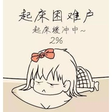

鬼才会想起
============================

|  |  |
| :--: | :-- |
| [ 鬼才会想起](https://emumo.xiami.com/album/2102974079) | **艺人**: [馒头](../index.md) **语种**: 国语 **唱片公司**: 独立发行 **发行时间**: 2017年12月14日 **专辑类别**: EP, 单曲 **专辑风格**: 民谣 Folk **播放数**: 122422 **收藏数**: 58 **评论数**: 5  |

## 简介

 明天你是否会想起？天冷，不想起！人是铁饭是钢，磁铁做的床，一首歌唱出不愿早起的心声~

## 曲目

## 评论

|  |  |  |  |
| :-- | :-- | :-- | :-- |
|  [虾米用户](https://emumo.xiami.com/u/338223903) 不在相信爱情 2017-12-24 17:02 赞(0) 踩(0) | 
馒头666了
 |
|  [虾米用户](https://emumo.xiami.com/u/230803304) 三观正又爱国的成都宝藏男... 2017-12-19 21:37 赞(1) 踩(0) | 
老狼知道这首
 |
|  [虾米用户](https://emumo.xiami.com/u/157736362)   2017-12-14 18:22 赞(0) 踩(0) | 
馒头回关，我网易云如梦
 |
|  [虾米用户](https://emumo.xiami.com/u/336804832)  2017-12-14 18:06 赞(0) 踩(0) | 
66666666666666666666666666666669996666666669999996699669
 |
|  [虾米用户](https://emumo.xiami.com/u/289628205)  2017-12-14 13:11 赞(0) 踩(0) | 
好听
 |
