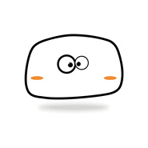
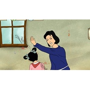
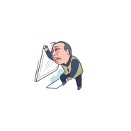
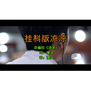
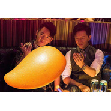
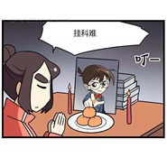
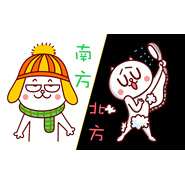
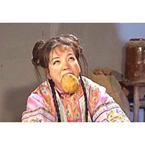
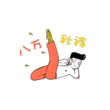

馒头
============================

|  |  |
| :--: | :-- |
| [ 馒头](https://i.xiami.com/mantoumusic) | **地区**: China 中国大陆 **风格**:  **播放数**: 18257500 **粉丝数**: 8920 **评论数**: 287  |

## 档案

## 专辑

| 名称 | 语种 | 唱片公司 | 发行时间 | 专辑类别 | 专辑风格 |
| :--: | :-- | :-- | :-- | :-- | :-- |
| [ 船](./albums/5021835921.md) | 国语 | 独立发行 | 2020年11月04日 | 录音室专辑 | 流行 Pop |
| [ 复仇者联盟之：剧透都是大坏蛋](./albums/2104816320.md) | 国语 |  | 2019年04月26日 | EP, 单曲 | 流行 Pop |
| [ 妈妈再打我一次](./albums/2104816469.md) | 国语 |  | 2019年04月18日 | EP, 单曲 | 流行 Pop |
| [ 妈妈再打我一次](./albums/2104783878.md) | 国语 |  | 2019年04月17日 | EP, 单曲 | 流行 Pop |
| [ 苏大强之歌](./albums/2104716013.md) | 国语 |  | 2019年03月25日 | EP, 单曲 | 流行 Pop |
| [ 青城山下刘老根](./albums/2104672388.md) | 国语 |  | 2019年03月15日 | EP, 单曲 | 流行 Pop |
| [ 我是一条酸菜鱼](./albums/2104664270.md) | 国语 |  | 2019年03月08日 | EP, 单曲 | 流行 Pop |
| [ 备胎的命](./albums/2103829913.md) | 国语 | 独立发行 | 2018年07月20日 | EP, 单曲 | 流行 Pop |
| [ 谁不是个吃货](./albums/2103827821.md) | 国语 | 独立发行 | 2018年07月19日 | EP, 单曲 | 流行 Pop |
| [ 小屁孩你快走开](./albums/2103827823.md) | 国语 | 独立发行 | 2018年07月13日 | EP, 单曲 | 流行 Pop |
| [ 唱腔更另类](./albums/2103786677.md) | 国语 | 独立发行 | 2018年07月08日 | EP, 单曲 | 流行 Pop |
| [ 我的对象啊](./albums/2103754647.md) | 国语 | 独立发行 | 2018年06月24日 | EP, 单曲 | 流行 Pop |
| [ 唐诗三百口](./albums/2103750297.md) | 国语 | 独立发行 | 2018年06月15日 | EP, 单曲 | 流行 Pop |
| [ 吃货版南京](./albums/2103744640.md) | 国语 | 独立发行 | 2018年06月11日 | EP, 单曲 | 流行 Pop |
| [ 请不要跟我抢六一](./albums/2103725715.md) | 国语 | 独立发行 | 2018年06月01日 | EP, 单曲 | 流行 Pop |
| [ 数羊歌](./albums/2103719345.md) | 国语 | HIFIVE | 2018年05月25日 | EP, 单曲 | 流行 Pop |
| [ 单身狗的骄傲](./albums/2103713309.md) | 国语 | 独立发行 | 2018年05月18日 | EP, 单曲 | 流行 Pop |
| [ 妈妈最伟大](./albums/2103707095.md) | 国语 | 独立发行 | 2018年05月12日 | EP, 单曲 | 流行 Pop |
| [ 胖胖如也](./albums/2103702395.md) | 国语 | 独立发行 | 2018年05月05日 | EP, 单曲 | 流行 Pop |
| [ 纸短情长（渣男版）](./albums/2103702683.md) | 国语 | 独立发行 | 2018年05月01日 | EP, 单曲 | 流行 Pop |
| [ 独爱白羊](./albums/2103696943.md) | 国语 | 独立发行 | 2018年04月26日 | EP, 单曲 | 流行 Pop |
| [ 塑料姐妹花](./albums/2103690137.md) | 国语 | 独立发行 | 2018年04月19日 | EP, 单曲 | 流行 Pop |
| [ 嘤嘤嘤](./albums/2103685799.md) | 国语 | 独立发行 | 2018年04月15日 | EP, 单曲 | 流行 Pop |
| [ 中年少女之歌](./albums/2103674541.md) | 国语 | 独立发行 | 2018年04月08日 | EP, 单曲 | 流行 Pop |
| [ 胖人愁](./albums/2103657579.md) | 国语 | 独立发行 | 2018年03月31日 | EP, 单曲 | 流行 Pop |
| [ 一吃就胖](./albums/2103637639.md) | 国语 | HIFIVE | 2018年03月24日 | EP, 单曲 | 流行 Pop |
| [ 胖胖的白羊](./albums/2103608151.md) | 国语 | 独立发行 | 2018年03月14日 | EP, 单曲 | 流行 Pop |
| [ 画个圈圈祝福你](./albums/2103594685.md) | 国语 | 独立发行 | 2018年03月08日 | EP, 单曲 | 流行 Pop |
| [ 我可以抱你么枕头](./albums/2103583168.md) | 国语 | 独立发行 | 2018年03月04日 | EP, 单曲 | 流行 Pop |
| [ 胖胖的熊掌](./albums/2103544652.md) | 国语 | 独立发行 | 2018年02月22日 | EP, 单曲 | 流行 Pop |
| [ 我是你的招财汪](./albums/2103529441.md) | 国语 | 独立发行 | 2018年02月15日 | EP, 单曲 | 流行 Pop |
| [ 板蓝根](./albums/2103525552.md) | 国语 | 独立发行 | 2018年02月11日 | EP, 单曲 | 民谣 Folk |
| [ 123喝热水](./albums/2103513641.md) | 国语 | 独立发行 | 2018年02月03日 | EP, 单曲 | 流行 Pop |
| [ 旅行青蛙好害怕](./albums/2103502891.md) | 国语 | 独立发行 | 2018年01月27日 | EP, 单曲 | 流行 Pop |
| [ 卖电脑](./albums/2103500501.md) | 国语 | 独立发行 | 2018年01月25日 | EP, 单曲 | 流行 Pop |
| [ 挂科版凉凉](./albums/2103497003.md) | 国语 | 独立发行 | 2018年01月21日 | EP, 单曲 | 流行 Pop |
| [ 看见芒果就疯狂](./albums/2103489035.md) | 国语 | 独立发行 | 2018年01月13日 | EP, 单曲 | 流行 Pop |
| [ 我不会挂科](./albums/2103472038.md) | 国语 | 独立发行 | 2018年01月07日 | EP, 单曲 | 流行 Pop |
| [ 南方冷](./albums/2103468157.md) | 国语 | 独立发行 | 2018年01月05日 | EP, 单曲 | 流行 Pop |
| [ 浪里个浪](./albums/2103465158.md) | 国语 | 独立发行 | 2017年12月29日 | EP, 单曲 | 流行 Pop |
| [ 你是我的平底锅](./albums/2103258144.md) | 国语 | 独立发行 | 2017年12月24日 | EP, 单曲 | 流行 Pop |
| [ 鬼才会想起](./albums/2102974079.md) | 国语 | 独立发行 | 2017年12月14日 | EP, 单曲 | 民谣 Folk |
| [ 加薪歌](./albums/2102971575.md) | 国语 | 独立发行 | 2017年12月09日 | EP, 单曲 | 流行 Pop |
| [ 就算你胸大屁股大](./albums/2102966925.md) | 国语 | 独立发行 | 2017年12月05日 | EP, 单曲 | 流行 Pop |
| [ 再见你个贱人](./albums/2102965073.md) | 国语 | 独立发行 | 2017年12月01日 | EP, 单曲 | 流行 Pop |
| [ 宝宝安全宣言一首儿歌让孩子学会保护自己](./albums/2102960405.md) | 国语 | 独立发行 | 2017年11月24日 | EP, 单曲 | 流行 Pop |
| [ 奇妙能力坑](./albums/2102941284.md) | 国语 | 独立发行 | 2017年11月16日 | EP, 单曲 | 流行 Pop |
| [ 喝风吃土歌](./albums/2102929370.md) | 国语 | 独立发行 | 2017年11月13日 | EP, 单曲 | 流行 Pop |
| [ 我还追个鬼【带你去网吧里偷耳机续】](./albums/2102910659.md) | 国语 | 独立发行 | 2017年11月07日 | EP, 单曲 | 摇滚 Rock & Roll |
| [ 我是不是你最疼爱的人你为什么不打钱](./albums/2102900416.md) | 国语 | 独立发行 | 2017年10月31日 | EP, 单曲 | 流行 Pop |
| [ 每次剪完头发都好想吐槽理发师含泪中枪](./albums/2102880058.md) | 国语 | 独立发行 | 2017年10月25日 | EP, 单曲 | 流行 Pop |
| [ 舌尖上的胖胖](./albums/2102874467.md) | 国语 | 独立发行 | 2017年10月16日 | EP, 单曲 | 流行 Pop |
| [ 在人间扎心歌](./albums/2102872853.md) | 国语 | 独立发行 | 2017年10月10日 | EP, 单曲 | 流行 Pop |
| [ 八万秋裤](./albums/2102867827.md) | 国语 | 独立发行 | 2017年10月04日 | EP, 单曲 | 嘻哈 Hip-Hop |
| [ 带你去网吧里偷耳机](./albums/2102865547.md) | 国语 | 独立发行 | 2017年09月29日 | EP, 单曲 | 流行 Pop |
| [ 大哥大姐如果你要骂我就请这样骂](./albums/2102865550.md) | 国语 | 独立发行 | 2017年09月29日 | EP, 单曲 | 流行 Pop |
| [ 痘痘之歌](./albums/2102865555.md) | 国语 | 独立发行 | 2017年09月29日 | EP, 单曲 | 流行 Pop |
| [ 秋季炫富歌](./albums/2102865551.md) | 国语 | 独立发行 | 2017年09月29日 | EP, 单曲 | 流行 Pop |
| [ 胖胖仗剑走天涯](./albums/2102865548.md) | 国语 | 独立发行 | 2017年09月29日 | EP, 单曲 | 摇滚 Rock & Roll |
| [ 你是我的先生](./albums/2102865553.md) | 国语 | 独立发行 | 2017年09月29日 | EP, 单曲 | 流行 Pop |
| [ 胖胖的鸡汤](./albums/2102865549.md) | 国语 | 独立发行 | 2017年09月29日 | EP, 单曲 | 流行 Pop |
| [ 开学扎心歌](./albums/2102822220.md) | 国语 | 独立发行 | 2017年08月29日 | EP, 单曲 | 流行 Pop |
| [ 分手歌](./albums/2102818313.md) | 国语 | 独立发行 | 2017年08月22日 | EP, 单曲 | 流行 Pop |
| [ 胖胖的忧伤](./albums/2102818317.md) | 国语 | 独立发行 | 2017年08月10日 | EP, 单曲 | 流行 Pop |
| [ 胖胖瘦不了](./albums/2102818316.md) | 国语 | 独立发行 | 2017年08月01日 | EP, 单曲 | 流行 Pop |
| [ 胖胖之歌](./albums/2102804759.md) | 国语 | HIFIVE | 2017年07月28日 | EP, 单曲 |  |
| [ 哪凉快到哪待着去](./albums/2102804761.md) | 国语 | 独立发行 | 2017年07月28日 | EP, 单曲 | 流行 Pop |
| [ 守夜人之歌《权力的游戏》中文版主题歌](./albums/2102797056.md) | 国语 | 独立发行 | 2017年07月15日 | EP, 单曲 | 流行 Pop |
| [ 馒头作品一这些年馒头慢慢唱来的歌，你也慢慢听吧](./albums/2102747122.md) | 国语 | 独立发行 | 2017年05月01日 | 精选集 | 独立民谣 Indie Folk |
| [ 小夫妻大战白血病](./albums/564320.md) | 国语 | 华夏动声 | 2012年12月17日 | EP, 单曲 |  |
| [ 给力房房房](./albums/547264.md) | 国语 | 华夏动声 | 2012年10月10日 | 录音室专辑 |  |
| [ 太古成说](./albums/699626518.md) | 国语 | 独立发行 | 2012年09月16日 | EP, 单曲 | 古风 GuFeng Music |
| [ 馒头的专辑](./albums/5022623349.md) | 其他 |  | 不详 |  |  |

## 评论

|  |  |  |
| :-- | :-- | :-- |
|  [虾米用户](https://emumo.xiami.com/u/79755888) 虾米音乐为什么还要写签名 2020-05-31 22:59 赞(1) 踩(0) | 
从李佳琦直播间来
 |
|  [虾米用户](https://emumo.xiami.com/u/358104299) 悲观的唯心存在现实解构虚... 2020-05-29 04:35 赞(1) 踩(0) | 
41472
 |
|  [虾米用户](https://emumo.xiami.com/u/332252317)  2020-04-06 10:10 赞(0) 踩(0) | 
   
 |
|  [虾米用户](https://emumo.xiami.com/u/440306739) 我是一个没得感情的刺客。 2020-03-05 07:58 赞(1) 踩(0) | 
听了你的歌，我喜欢吃馒头了 
 |
|  [虾米用户](https://emumo.xiami.com/u/440321146)  2020-02-28 16:27 赞(1) 踩(0) | 
233333333333333333333333333333333333333333333333333333333333 333333333333333333333333333333333333333333333333333333333333 333333333333333333333333333333333333333333333333333333333333 333333333333333333333333333333333333333333333333333333333333 333333333333333333333333333333333333333333333333333333333333
 |
|  [虾米用户](https://emumo.xiami.com/u/440321146)  2020-02-28 16:27 赞(1) 踩(0) | 
666666666666666666666666666666666666666666666666666666666666 666666666666666666666666666666666666666666666666666666666666 666666666666666666666666666666666666666666666666666666666666 666666666666666666666666666666666666666666666666666666666666 666666666666666666666666666666666666666666666666666666666666
 |
|  [虾米用户](https://emumo.xiami.com/u/85568296) 只有阳光而无阴影 只有欢... 2019-10-23 00:20 赞(0) 踩(0) | 
有点可爱(๑• . •๑)
 |
|  [虾米用户](https://emumo.xiami.com/u/352452658)  2019-10-20 20:48 赞(0) 踩(0) | 
加油
 |
|  [虾米用户](https://emumo.xiami.com/u/354235425)  2019-08-09 15:48 赞(2) 踩(0) | 
馒头唱的歌真的好好玩，能带给人幽默感。馒头，我们能交个朋友吗？我叫张琪尔。还有，馒头你的真名叫什么呀？我一直想知道。
 |
|  [虾米用户](https://emumo.xiami.com/u/309190656) 我还没想好要写什么... 2019-08-07 10:04 赞(0) 踩(0) | 
真力害
 |
|  [虾米用户](https://emumo.xiami.com/u/403734379)  2019-06-27 20:06 赞(0) 踩(0) | 
难道你唱的歌我真的很喜欢，喜欢我们可以交个朋友吗？我想跟你交个朋友，我叫徐我叫徐胜。
 |
|  [虾米用户](https://emumo.xiami.com/u/403734379)  2019-06-27 20:05 赞(0) 踩(0) | 
他是馒头你们唱得好只有歌我都喜欢听但是你们什么时候能给我们唱的好听
 |
|  [虾米用户](https://emumo.xiami.com/u/403734379)  2019-06-27 20:05 赞(0) 踩(0) | 
难道我好喜欢好喜欢你的歌呀？还有你们的葡萄美酒夜光杯还是我背的歌呢？
 |
|  [虾米用户](https://emumo.xiami.com/u/425635417)  2019-06-15 10:21 赞(0) 踩(0) | 
我也喜欢吃馒头
 |
|  [虾米用户](https://emumo.xiami.com/u/425635417)  2019-06-15 10:21 赞(0) 踩(0) | 
    
 |
|  [虾米用户](https://emumo.xiami.com/u/421518851)  2019-06-14 06:34 赞(0) 踩(0) | 
馒头你是不昰很胖？不过我很喜欢听你的歌。 
 |
|  [虾米用户](https://emumo.xiami.com/u/377336086) 学习中，没空。 2019-06-11 20:05 赞(0) 踩(0) | 
期待你的新歌
 |
|  [虾米用户](https://emumo.xiami.com/u/408548703)  2019-05-04 11:08 赞(0) 踩(0) | 
我也是吃货   
 |
|  [虾米用户](https://emumo.xiami.com/u/280800272)  2019-04-27 19:47 赞(0) 踩(0) | 
加油加油＾０＾~
 |
|  [虾米用户](https://emumo.xiami.com/u/269372347)  2019-04-27 19:28 赞(1) 踩(0) | 
哈哈哈，听着心情好嘞    
 |
| ⇒ |  [虾米用户](https://emumo.xiami.com/u/280800272)  2019-04-27 19:48 赞(0) 踩(0) | 

 |
|  [虾米用户](https://emumo.xiami.com/u/325374787)  2019-04-01 22:04 赞(2) 踩(0) | 
好
 |
|  [虾米用户](https://emumo.xiami.com/u/13413786) 加我微信TGSshell... 2019-02-12 10:22 赞(3) 踩(0) | 
古灵精怪 胖子吃货等 类型歌曲 无疑与我趣味相投  难怪我这么喜欢馒头 哈哈
 |
|  [虾米用户](https://emumo.xiami.com/u/418395149)  2019-02-05 19:27 赞(4) 踩(0) | 
你好可爱啊！真想跑去南京找你听你唱歌     
 |
|  [虾米用户](https://emumo.xiami.com/u/418395149)  2019-02-05 19:25 赞(8) 踩(0) | 
馒头  你要加油  我们都等着你火呢 
 |
|  [虾米用户](https://emumo.xiami.com/u/38360178)  2018-12-21 09:40 赞(8) 踩(0) | 
好魔性的声音，我是数羊来的，后后后~~~
 |
|  [虾米用户](https://emumo.xiami.com/u/174945068) 物来顺应 当时不杂   ... 2018-12-20 01:10 赞(5) 踩(0) | 
不要压抑你的天赋
 |
|  [虾米用户](https://emumo.xiami.com/u/410764075)  2018-12-18 20:17 赞(3) 踩(0) | 
666666666666666666666666666666666666666666666666666666怎么编的！
 |
|  [虾米用户](https://emumo.xiami.com/u/410129431)  2018-12-07 14:17 赞(2) 踩(0) | 
6666
 |
|  [虾米用户](https://emumo.xiami.com/u/410129431)  2018-12-07 14:13 赞(1) 踩(0) | 
66666666666666 6 666666666666 6 6 6
 |
|  [虾米用户](https://emumo.xiami.com/u/410129431)  2018-12-07 14:12 赞(1) 踩(0) | 
加油!
 |
|  [虾米用户](https://emumo.xiami.com/u/11100377)   2018-11-03 11:40 赞(1) 踩(0) | 
你把不识时务好的少男少女嗯对你的呢。你到底把混合物卫生间设计解放碑大都会的很合身
 |
|  [虾米用户](https://emumo.xiami.com/u/378990133)  2018-10-08 18:19 赞(1) 踩(0) | 
666666666666666666 6 6 6 6 6666666666666 6 6 6 6 666666666666                  666666666  6666666            6     666666666:  666666666
 |
|  [虾米用户](https://emumo.xiami.com/u/302548641)  2018-10-05 17:31 赞(1) 踩(0) | 
6666666666
 |
|  [虾米用户](https://emumo.xiami.com/u/405407493)  2018-10-03 18:14 赞(1) 踩(0) | 
666666 6 6 666666 666666 666666 666966
 |
|  [虾米用户](https://emumo.xiami.com/u/324105024)  2018-09-15 12:39 赞(1) 踩(0) | 
馒头，你太好了
 |
|  [虾米用户](https://emumo.xiami.com/u/375471590)  2018-08-31 21:43 赞(2) 踩(0) | 
  
 |
|  [虾米用户](https://emumo.xiami.com/u/279370043) 空城 2018-08-27 14:22 赞(2) 踩(0) | 
然后不发 专辑了 
 |
|  [虾米用户](https://emumo.xiami.com/u/297878750)  2018-08-22 07:26 赞(2) 踩(0) | 
出大哥别杀我
 |
|  [虾米用户](https://emumo.xiami.com/u/377925427) 我还没想好要写什么... 2018-08-04 18:12 赞(11) 踩(0) | 
6666666666 6 6 6 66666666666 6                      6 6                      6 6                      6 66666666666
 |
|  [虾米用户](https://emumo.xiami.com/u/377925427) 我还没想好要写什么... 2018-07-29 13:12 赞(4) 踩(0) | 
永远支持馒头
 |
|  [虾米用户](https://emumo.xiami.com/u/327791936)  2018-07-18 20:08 赞(4) 踩(0) | 
馒头是个可爱的小逗比
 |
|  [虾米用户](https://emumo.xiami.com/u/377237469) 若当来世，你还认得出我吗... 2018-07-15 15:27 赞(13) 踩(0) | 
支持馒头  
 |
|  [虾米用户](https://emumo.xiami.com/u/264922022) 波斯貓在冬日落雪的樹上偷... 2018-07-13 13:33 赞(6) 踩(0) | 
终于火了 我安心了
 |
| ⇒ |  [虾米用户](https://emumo.xiami.com/u/279660012) 彼岸花园 2018-10-04 16:31 赞(0) 踩(0) | 
一
 |
|  [虾米用户](https://emumo.xiami.com/u/328507168)  2018-06-09 17:58 赞(5) 踩(0) | 
夠666666666666666666666666666666666666666666666666666666666666 6666666666666666了
 |
|  [虾米用户](https://emumo.xiami.com/u/375095955)  2018-06-09 09:50 赞(3) 踩(0) | 
666
 |
|  [虾米用户](https://emumo.xiami.com/u/366625744)  2018-06-06 20:41 赞(3) 踩(0) | 
6666666666666666666666
 |
| ⇒ |  [虾米用户](https://emumo.xiami.com/u/359123752) 发vv好 2018-09-07 18:19 赞(0) 踩(0) | 
哇，你也看东京食尸鬼呀？
 |
|  [虾米用户](https://emumo.xiami.com/u/354658610)  2018-06-05 17:17 赞(3) 踩(0) | 
666
 |
|  [虾米用户](https://emumo.xiami.com/u/370618413)  2018-06-04 19:24 赞(3) 踩(0) | 
6                                        6    6       666676656484887686677775 8
 |
|  [虾米用户](https://emumo.xiami.com/u/370618413)  2018-06-04 19:23 赞(4) 踩(0) | 
你的QQ号是多少
 |
|  [虾米用户](https://emumo.xiami.com/u/370618413)  2018-06-04 19:22 赞(3) 踩(0) | 
     
 |
|  [虾米用户](https://emumo.xiami.com/u/370618413)  2018-06-04 19:22 赞(4) 踩(0) | 
馒头你的QQ号是多少 
 |
|  [虾米用户](https://emumo.xiami.com/u/370618413)  2018-06-04 19:20 赞(3) 踩(0) | 
馒头你的QQ号是多少
 |
|  [虾米用户](https://emumo.xiami.com/u/374183416)  2018-05-31 11:28 赞(3) 踩(0) | 
出吃鸡的歌曲。
 |
|  [虾米用户](https://emumo.xiami.com/u/366873983) 666 2018-05-29 20:34 赞(22) 踩(0) | 
觉得馒头好的请为我点赞
 |
| ⇒ |  [虾米用户](https://emumo.xiami.com/u/354658610)  2018-06-05 17:17 赞(0) 踩(0) | 
，，，，，，
 |
|  [虾米用户](https://emumo.xiami.com/u/270608992)  2018-05-29 00:18 赞(2) 踩(0) | 
还记得列农怎么死的吗。。。你变了。。。
 |
| ⇒ |  [虾米用户](https://emumo.xiami.com/u/370618413)  2018-06-04 19:20 赞(0) 踩(0) | 
#baiduhaokan://home/index/?channel=recommend&amp;amp;amp;vid=5962954560249915301&amp;amp;amp;auto_play_index=0&amp;amp;amp;tab=guide&amp;amp;amp;tag=web_wisenatural&amp;amp;amp;source=share_weixin#
 |
|  [虾米用户](https://emumo.xiami.com/u/372312866)  2018-05-26 09:31 赞(1) 踩(0) | 
出吃鸡
 |
|  [虾米用户](https://emumo.xiami.com/u/369795255)  2018-05-24 22:09 赞(1) 踩(0) | 
馒头唱歌。66666666666666666666666              
 |
|  [虾米用户](https://emumo.xiami.com/u/267692659) 爱丽唯九 2018-05-20 17:41 赞(1) 踩(0) | 
馒头加油加油
 |
|  [虾米用户](https://emumo.xiami.com/u/358586776) ——♥ 爱就像蓝天白云 ... 2018-05-19 21:53 赞(2) 踩(0) | 
馒头你越来越多粉丝了
 |
|  [虾米用户](https://emumo.xiami.com/u/358586776) ——♥ 爱就像蓝天白云 ... 2018-05-19 21:50 赞(2) 踩(0) | 
支持馒头
 |
|  [虾米用户](https://emumo.xiami.com/u/267147570)  2018-05-11 22:05 赞(1) 踩(0) | 
6666666666 6 6 6666666666 6                   6 6                   6 6666666666
 |
|  [虾米用户](https://emumo.xiami.com/u/359726025)  2018-05-10 23:27 赞(2) 踩(0) | 
很好听
 |
|  [虾米用户](https://emumo.xiami.com/u/254545783)  2018-05-09 17:38 赞(1) 踩(0) | 
好听
 |
|  [虾米用户](https://emumo.xiami.com/u/363144788)  2018-05-09 12:10 赞(1) 踩(0) | 
666666
 |
|  [虾米用户](https://emumo.xiami.com/u/363144788)  2018-05-08 12:51 赞(2) 踩(0) | 
6 6 6 66666666 6       6 6       6 66666666666666666666666666666666666666666666666666666666666666666666666666666666666666666666666666666666666666666666666666666666666666666666666666666666666666666666666666666666666666666666666666666666666666666666666666666
 |
|  [虾米用户](https://emumo.xiami.com/u/280800272)  2018-05-07 19:53 赞(3) 踩(0) | 
馒头，继续出新歌吧，真的很好玩，加油哦
 |
|  [虾米用户](https://emumo.xiami.com/u/346458740) 我还没想好要写什么... 2018-04-29 19:00 赞(4) 踩(0) | 
他（她）的歌曲超好听
 |
|  [虾米用户](https://emumo.xiami.com/u/352234338)  2018-04-26 20:45 赞(4) 踩(0) | 
应该是男的吧!  
 |
|  [虾米用户](https://emumo.xiami.com/u/356457638)  2018-04-24 06:57 赞(4) 踩(0) | 
谁知道
 |
|  [虾米用户](https://emumo.xiami.com/u/357629110) 一个小朋友 2018-04-22 20:51 赞(4) 踩(0) | 
馒头是个男的还是女的？
 |
| ⇒ |  [虾米用户](https://emumo.xiami.com/u/267147570)  2018-05-11 22:03 赞(0) 踩(0) | 
应该是男的。
 |
|  [虾米用户](https://emumo.xiami.com/u/356457638)  2018-04-21 19:25 赞(44) 踩(0) | 
支持馒头的给我赞
 |
|  [虾米用户](https://emumo.xiami.com/u/356263290)  2018-04-20 22:26 赞(3) 踩(0) | 
有意思
 |
|  [虾米用户](https://emumo.xiami.com/u/348392787)  2018-04-15 20:26 赞(3) 踩(0) | 
6 6 6 6666666 6      6 66666
 |
|  [虾米用户](https://emumo.xiami.com/u/356934325)  2018-04-14 20:10 赞(10) 踩(0) | 
出新歌曲
 |
|  [虾米用户](https://emumo.xiami.com/u/356934325)  2018-04-14 20:09 赞(3) 踩(0) | 
6666666
 |
|  [虾米用户](https://emumo.xiami.com/u/353676100)  2018-04-14 11:41 赞(24) 踩(0) | 
馒头是个逗逼哈哈我也是个逗逼哈哈哈
 |
|  [虾米用户](https://emumo.xiami.com/u/346445944)  2018-04-08 19:34 赞(3) 踩(0) | 
666666666666666666666666666666666666666666666666666666666666 666666666666666666666666666666666666666666666666666666666665 572427242754585757275557945624627654234
 |
|  [虾米用户](https://emumo.xiami.com/u/230803304) 三观正又爱国的成都宝藏男... 2018-04-08 17:46 赞(4) 踩(0) | 
支持馒头
 |
|  [虾米用户](https://emumo.xiami.com/u/222809962)   2018-04-08 16:21 赞(3) 踩(0) | 
哈哈哈，总是那么有意思
 |
|  [虾米用户](https://emumo.xiami.com/u/355211957)  2018-04-08 06:26 赞(1) 踩(0) | 
。。。。。。。。。。
 |
|  [虾米用户](https://emumo.xiami.com/u/354393934)  2018-04-05 18:32 赞(1) 踩(0) | 
。。。。。。
 |
|  [虾米用户](https://emumo.xiami.com/u/356246369)  2018-03-30 21:40 赞(2) 踩(0) | 
very  good
 |
|  [虾米用户](https://emumo.xiami.com/u/11843697)  2018-03-30 09:47 赞(1) 踩(0) | 
不敢收藏，只因害怕忘了原唱是什么样
 |
|  [虾米用户](https://emumo.xiami.com/u/354853541) 我们的歌是最好的。 2018-03-28 23:59 赞(3) 踩(0) | 
我爱听你的歌。
 |
|  [虾米用户](https://emumo.xiami.com/u/354853541) 我们的歌是最好的。 2018-03-28 23:57 赞(4) 踩(0) | 
馒头在吗，我是你的粉丝。
 |
|  [虾米用户](https://emumo.xiami.com/u/347499045)  2018-03-24 12:20 赞(3) 踩(0) | 
过去式
 |
|  [虾米用户](https://emumo.xiami.com/u/325113868)  2018-03-19 20:06 赞(3) 踩(0) | 

 |
|  [虾米用户](https://emumo.xiami.com/u/341868369) 大爱馒头 2018-03-17 19:50 赞(4) 踩(0) | 
馒头发布一些关于游戏的歌。^_^
 |
|  [虾米用户](https://emumo.xiami.com/u/213969318) 企鹅搜索：HL-小浪 2018-03-16 21:17 赞(2) 踩(0) | 
牛掰
 |
|  [虾米用户](https://emumo.xiami.com/u/4172307) 虾米forever 2018-03-14 02:03 赞(2) 踩(0) | 
讲真，我要想听就搜名字进来听好了，根本不敢点收藏，，我怕我的总体风格从此扭曲    大半夜的，分享到朋友圈好了
 |
| ⇒ |  [虾米用户](https://emumo.xiami.com/u/4172307) 虾米forever 2018-03-14 03:14 赞(0) 踩(0) | 
听了一圈以后，发现这绝对是位有故事的大神
 |
|  [虾米用户](https://emumo.xiami.com/u/339089236)  2018-03-12 19:04 赞(1) 踩(0) | 
(o^?^o)? YunOS 真棒！
 |
|  [虾米用户](https://emumo.xiami.com/u/339089236)  2018-03-12 19:03 赞(1) 踩(0) | 
          
 |
|  [虾米用户](https://emumo.xiami.com/u/339089236)  2018-03-12 19:03 赞(1) 踩(0) | 
666666
 |
|  [虾米用户](https://emumo.xiami.com/u/313396525)  2018-03-11 12:07 赞(1) 踩(0) | 
高端大气上档次，低调奢华有内涵。奔放洋气有深度，狂拽炫酷屌炸天。
 |
|  [虾米用户](https://emumo.xiami.com/u/345928455)  2018-03-10 19:48 赞(1) 踩(0) | 

 |
|  [虾米用户](https://emumo.xiami.com/u/353786718)  2018-03-09 18:05 赞(1) 踩(0) | 
6666666666666666666
 |
|  [虾米用户](https://emumo.xiami.com/u/353786718)  2018-03-09 18:04 赞(1) 踩(0) | 
关
 |
|  [虾米用户](https://emumo.xiami.com/u/348887888)  2018-03-07 17:16 赞(4) 踩(0) | 
     
 |
|  [虾米用户](https://emumo.xiami.com/u/348887888)  2018-03-07 17:14 赞(1) 踩(0) | 
好  
 |
|  [虾米用户](https://emumo.xiami.com/u/348887888)  2018-03-07 17:12 赞(1) 踩(0) | 
666666666666
 |
|  [虾米用户](https://emumo.xiami.com/u/346567293)  2018-03-04 20:11 赞(1) 踩(0) | 
搞笑
 |
|  [虾米用户](https://emumo.xiami.com/u/341868369) 大爱馒头 2018-03-03 18:14 赞(1) 踩(0) | 
66666666666666 66 66 66 66 66 66 66 6666666666666666 66                             66 66                             66 66                             66 66                             66 66                             66 6666666666666666
 |
|  [虾米用户](https://emumo.xiami.com/u/352687248)  2018-03-03 10:46 赞(2) 踩(0) | 
馒头，发布多些歌！
 |
| ⇒ |  [虾米用户](https://emumo.xiami.com/u/374834756)  2018-06-07 17:28 赞(0) 踩(0) | 
66666666666 6 6 6 6 6666666666666 6                          6 6                          6 6                          6 6666666669666 
 |
|  [虾米用户](https://emumo.xiami.com/u/38154000)  2018-02-27 23:08 赞(1) 踩(0) | 
可以的，馒头加油 
 |
|  [虾米用户](https://emumo.xiami.com/u/339005681)  2018-02-26 19:11 赞(1) 踩(0) | 
不错
 |
|  [虾米用户](https://emumo.xiami.com/u/348048925)  2018-02-26 10:22 赞(2) 踩(0) | 
加油
 |
|  [虾米用户](https://emumo.xiami.com/u/348048925)  2018-02-26 10:22 赞(0) 踩(0) | 
66666666 6 6 6 6 6 6 666666666 666666666 666666666 666666666
 |
|  [虾米用户](https://emumo.xiami.com/u/348048925)  2018-02-26 10:21 赞(0) 踩(0) | 
我非常喜欢馒头的歌
 |
|  [虾米用户](https://emumo.xiami.com/u/348048925)  2018-02-26 10:20 赞(0) 踩(0) | 
我感觉馒头是胖子他唱的歌几乎都是关于胖子的歌不过他都能唱出我们胖子的心声
 |
|  [虾米用户](https://emumo.xiami.com/u/342286412)  2018-02-25 10:38 赞(1) 踩(0) | 
666666 666666 666666
 |
|  [虾米用户](https://emumo.xiami.com/u/352171696)  2018-02-24 22:15 赞(1) 踩(0) | 
有些好逗，不过好听。
 |
|  [虾米用户](https://emumo.xiami.com/u/230803304) 三观正又爱国的成都宝藏男... 2018-02-23 18:05 赞(1) 踩(0) | 
馒头的歌充满了不少的正能量和欢乐
 |
|  [虾米用户](https://emumo.xiami.com/u/329466136)  2018-02-23 16:28 赞(1) 踩(0) | 
66666666666666666666666666666666666 6            6                                                   666666666666666666
 |
|  [虾米用户](https://emumo.xiami.com/u/335743740)  2018-02-22 01:38 赞(1) 踩(0) | 
男的女的？
 |
|  [虾米用户](https://emumo.xiami.com/u/351642456) 帅到爆炸的小学生 2018-02-21 15:04 赞(0) 踩(0) | 
大家好，我刚刚登录，请多多关照。&amp;amp;gt;_
 |
|  [虾米用户](https://emumo.xiami.com/u/351642456) 帅到爆炸的小学生 2018-02-21 15:01 赞(1) 踩(0) | 
好听好听太好听了
 |
|  [虾米用户](https://emumo.xiami.com/u/347620207)  2018-02-20 23:32 赞(1) 踩(0) | 
666666
 |
|  [虾米用户](https://emumo.xiami.com/u/351484978)  2018-02-20 15:02 赞(1) 踩(0) | 
不想失去你❤
 |
|  [虾米用户](https://emumo.xiami.com/u/350115494)  2018-02-17 23:53 赞(1) 踩(0) | 
好逗  
 |
|  [虾米用户](https://emumo.xiami.com/u/346567293)  2018-02-16 10:13 赞(1) 踩(0) | 
6666666666 6 6 6 6 6666666666 6666666666 6666666666 6666666666 6666666666
 |
|  [虾米用户](https://emumo.xiami.com/u/350445806)  2018-02-14 18:34 赞(1) 踩(0) | 
好逗
 |
|  [虾米用户](https://emumo.xiami.com/u/346567293)  2018-02-14 17:52 赞(1) 踩(0) | 
好逗
 |
|  [虾米用户](https://emumo.xiami.com/u/346567293)  2018-02-14 17:51 赞(1) 踩(0) | 
6666666
 |
|  [虾米用户](https://emumo.xiami.com/u/346159047) 魔道祖师 2018-02-13 12:34 赞(2) 踩(0) | 
喜欢
 |
|  [虾米用户](https://emumo.xiami.com/u/350102967)  2018-02-13 11:51 赞(1) 踩(0) | 
太6了
 |
|  [虾米用户](https://emumo.xiami.com/u/346567293)  2018-02-11 13:00 赞(1) 踩(0) | 
好 
 |
|  [虾米用户](https://emumo.xiami.com/u/348493378)  2018-02-08 07:52 赞(1) 踩(0) | 
好逗人
 |
|  [虾米用户](https://emumo.xiami.com/u/330867118)  2018-02-07 17:58 赞(0) 踩(0) | 
馒头怎么还不出新歌
 |
|  [虾米用户](https://emumo.xiami.com/u/330867118)  2018-02-07 17:57 赞(1) 踩(0) | 
真的很好听
 |
|  [虾米用户](https://emumo.xiami.com/u/230803304) 三观正又爱国的成都宝藏男... 2018-01-31 20:34 赞(4) 踩(0) | 
馒头是大家的开心果 给大家带来快乐
 |
| ⇒ |  [虾米用户](https://emumo.xiami.com/u/342939416)  2018-02-06 09:04 赞(0) 踩(0) | 
你说的对！
 |
|  [虾米用户](https://emumo.xiami.com/u/339209814)  2018-01-30 22:37 赞(0) 踩(0) | 
666
 |
|  [虾米用户](https://emumo.xiami.com/u/317924533) wait for you... 2018-01-22 18:19 赞(1) 踩(0) | 
希望艺人能多多出歌曲
 |
|  [虾米用户](https://emumo.xiami.com/u/317924533) wait for you... 2018-01-22 18:15 赞(0) 踩(0) | 
不是嘲笑的
 |
|  [虾米用户](https://emumo.xiami.com/u/337825763)  2018-01-21 13:00 赞(0) 踩(0) | 
变音很好听
 |
|  [虾米用户](https://emumo.xiami.com/u/313537321)  2018-01-20 10:09 赞(0) 踩(0) | 
凸^-^凸 凸^-^凸 太棒辣！
 |
| ⇒ |  [虾米用户](https://emumo.xiami.com/u/342286412)  2018-02-25 10:36 赞(0) 踩(0) | 

 |
|  [虾米用户](https://emumo.xiami.com/u/344742478) 大爱千玺 2018-01-19 13:20 赞(1) 踩(0) | 
这首歌是根据TFboys的《不完美的小孩》改编的吗？
 |
|  [虾米用户](https://emumo.xiami.com/u/340027004)  2018-01-18 17:44 赞(0) 踩(0) | 
傻
 |
|  [虾米用户](https://emumo.xiami.com/u/340027004)  2018-01-18 17:39 赞(0) 踩(0) | 
傻逼
 |
| ⇒ |  [虾米用户](https://emumo.xiami.com/u/342939416)  2018-02-06 09:03 赞(0) 踩(0) | 
你才傻，馒头才不傻
 |
| ⇒ |  [虾米用户](https://emumo.xiami.com/u/340027004)  2018-03-06 12:19 赞(0) 踩(0) | 
<q><b>宇宙王子说：</b></q>
 |
|  [虾米用户](https://emumo.xiami.com/u/11763865)  2018-01-18 13:17 赞(0) 踩(0) | 

 |
|  [虾米用户](https://emumo.xiami.com/u/345052216)  2018-01-18 12:09 赞(1) 踩(0) | 
太牛了   
 |
|  [虾米用户](https://emumo.xiami.com/u/343279875)  2018-01-17 19:47 赞(0) 踩(0) | 
好听的歌，都被改了  
 |
|  [虾米用户](https://emumo.xiami.com/u/28108371) 我还没想好要写什么... 2018-01-14 09:07 赞(1) 踩(0) | 
诙谐幽默风趣，声音象机器人。是刻意修饰的？
 |
|  [虾米用户](https://emumo.xiami.com/u/344286980)  2018-01-12 19:10 赞(1) 踩(0) | 
666666666666666666666                 
 |
|  [虾米用户](https://emumo.xiami.com/u/344286980)  2018-01-12 19:09 赞(0) 踩(0) | 
馒头
 |
|  [虾米用户](https://emumo.xiami.com/u/342342656)  2018-01-04 12:11 赞(0) 踩(0) | 
逗死我了  
 |
|  [虾米用户](https://emumo.xiami.com/u/342461549) 我不想找你。你就不要出现... 2018-01-03 07:23 赞(0) 踩(0) | 
  我还要去找工作了。。。我总是在找工作 可惜总是找不到工作。
 |
|  [虾米用户](https://emumo.xiami.com/u/342461549) 我不想找你。你就不要出现... 2018-01-03 07:19 赞(0) 踩(0) | 
呵呵
 |
|  [虾米用户](https://emumo.xiami.com/u/15370817)  2018-01-01 16:40 赞(0) 踩(0) | 
棒棒
 |
|  [虾米用户](https://emumo.xiami.com/u/342362495) 哈哈哈哈哈哈哈哈哈哈嗝 2017-12-31 16:57 赞(0) 踩(0) | 
呵
 |
|  [虾米用户](https://emumo.xiami.com/u/330589578)  2017-12-27 17:49 赞(0) 踩(0) | 
   
 |
|  [虾米用户](https://emumo.xiami.com/u/334623617)  2017-12-24 21:11 赞(1) 踩(0) | 
馒头馒头我爱你
 |
|  [虾米用户](https://emumo.xiami.com/u/341317009)  2017-12-24 20:08 赞(0) 踩(0) | 
       
 |
|  [虾米用户](https://emumo.xiami.com/u/341317009)  2017-12-24 20:07 赞(0) 踩(0) | 
希望馒头出新歌曲666  
 |
|  [虾米用户](https://emumo.xiami.com/u/341317009)  2017-12-24 20:05 赞(0) 踩(0) | 
希望馒头加油。
 |
|  [虾米用户](https://emumo.xiami.com/u/341158609)  2017-12-23 20:26 赞(1) 踩(0) | 
66666666666666666666666666
 |
|  [虾米用户](https://emumo.xiami.com/u/213969318) 企鹅搜索：HL-小浪 2017-12-23 14:29 赞(1) 踩(0) | 
加油。。6666
 |
|  [虾米用户](https://emumo.xiami.com/u/337848314)  2017-12-23 10:45 赞(0) 踩(0) | 
66666666666666
 |
|  [虾米用户](https://emumo.xiami.com/u/325324883)  2017-12-20 21:17 赞(1) 踩(0) | 
我们全家都喜欢你的歌哟!         
 |
|  [虾米用户](https://emumo.xiami.com/u/328513722)  2017-12-20 20:15 赞(1) 踩(0) | 
6666666666666             [文字up][文字up][文字up][文字up][文字up]
 |
|  [虾米用户](https://emumo.xiami.com/u/338602015)  2017-12-20 19:40 赞(0) 踩(0) | 
风风光光
 |
|  [虾米用户](https://emumo.xiami.com/u/338602015)  2017-12-20 19:39 赞(0) 踩(0) | 
吃饭饭咯咯咯
 |
|  [虾米用户](https://emumo.xiami.com/u/339094678)  2017-12-16 18:45 赞(0) 踩(0) | 
66666666666666666666666666666666666666666
 |
|  [虾米用户](https://emumo.xiami.com/u/339094678)  2017-12-16 18:44 赞(0) 踩(0) | 
666  
 |
|  [虾米用户](https://emumo.xiami.com/u/340027004)  2017-12-16 17:53 赞(0) 踩(0) | 
爆照
 |
|  [虾米用户](https://emumo.xiami.com/u/331955504)  2017-12-16 15:28 赞(1) 踩(0) | 
好
 |
|  [虾米用户](https://emumo.xiami.com/u/330008935)  2017-12-16 13:01 赞(1) 踩(0) | 
  
 |
|  [虾米用户](https://emumo.xiami.com/u/230803304) 三观正又爱国的成都宝藏男... 2017-12-14 21:24 赞(1) 踩(0) | 
期待新的专辑
 |
|  [虾米用户](https://emumo.xiami.com/u/327956042)  2017-12-14 18:57 赞(1) 踩(0) | 

 |
|  [虾米用户](https://emumo.xiami.com/u/230803304) 三观正又爱国的成都宝藏男... 2017-12-14 12:51 赞(1) 踩(0) | 
持续支持馒头
 |
|  [虾米用户](https://emumo.xiami.com/u/314263753) 流年川暗度，往事月空明 2017-12-12 00:13 赞(0) 踩(0) | 
馒头会火的~
 |
|  [虾米用户](https://emumo.xiami.com/u/336705613)   2017-12-10 23:55 赞(0) 踩(0) | 
馒头馒头我爱你，mua~
 |
|  [虾米用户](https://emumo.xiami.com/u/339432539) 如果能爱，不想在爱！此生... 2017-12-10 22:50 赞(0) 踩(0) | 
666没谁了
 |
|  [虾米用户](https://emumo.xiami.com/u/253827571) 笑看嫣红染半山   逐风... 2017-12-09 15:58 赞(0) 踩(0) | 
就是歌词不能自动跟上播放，要自己看，改进一下就好了
 |
|  [虾米用户](https://emumo.xiami.com/u/253827571) 笑看嫣红染半山   逐风... 2017-12-09 15:56 赞(0) 踩(0) | 
厉害，虾米居然有这个版权
 |
|  [虾米用户](https://emumo.xiami.com/u/339114351)  2017-12-09 14:50 赞(0) 踩(0) | 
好听 
 |
|  [虾米用户](https://emumo.xiami.com/u/338956060) 我待你和别人不同，你却始... 2017-12-09 12:19 赞(0) 踩(0) | 
66666666666666
 |
|  [虾米用户](https://emumo.xiami.com/u/339159454)  2017-12-09 07:28 赞(0) 踩(0) | 
聪明 
 |
|  [虾米用户](https://emumo.xiami.com/u/337330670) 音乐爱好者 2017-12-08 16:07 赞(1) 踩(0) | 
好听
 |
|  [虾米用户](https://emumo.xiami.com/u/333285076)  2017-12-04 21:46 赞(0) 踩(0) | 
666666666666666666666666666666666666666666666666666666666666 6666666666666666666
 |
|  [虾米用户](https://emumo.xiami.com/u/314601928) 爱你！奶奶！ 2017-11-29 20:56 赞(0) 踩(0) | 
666666666666666666666666
 |
|  [虾米用户](https://emumo.xiami.com/u/283088472)  2017-11-28 02:33 赞(0) 踩(0) | 
微博追来的，喜欢你噢 
 |
|  [虾米用户](https://emumo.xiami.com/u/285546422) Sone 2017-11-26 19:34 赞(0) 踩(0) | 
喜欢你
 |
|  [虾米用户](https://emumo.xiami.com/u/302223797)   2017-11-26 12:16 赞(0) 踩(0) | 
他好棒
 |
| ⇒ |  [虾米用户](https://emumo.xiami.com/u/302223797)   2017-11-26 12:21 赞(0) 踩(0) | 
 
 |
|  [虾米用户](https://emumo.xiami.com/u/301051335)  2017-11-25 21:13 赞(0) 踩(0) | 
666666
 |
|  [虾米用户](https://emumo.xiami.com/u/336883898)  2017-11-23 18:34 赞(1) 踩(0) | 
真变态    不过我，喜欢  
 |
|  [虾米用户](https://emumo.xiami.com/u/334729685)  2017-11-19 20:19 赞(1) 踩(0) | 
           
 |
|  [虾米用户](https://emumo.xiami.com/u/311857488)  2017-11-19 08:26 赞(0) 踩(0) | 
 
 |
|  [虾米用户](https://emumo.xiami.com/u/258528247)  2017-11-18 22:58 赞(1) 踩(0) | 
保证随时来看看馒头 
 |
|  [虾米用户](https://emumo.xiami.com/u/335953550)  2017-11-18 06:39 赞(0) 踩(0) | 
   
 |
|  [虾米用户](https://emumo.xiami.com/u/334414392)  2017-11-17 20:01 赞(0) 踩(0) | 
真好听    
 |
|  [虾米用户](https://emumo.xiami.com/u/334497359)  2017-11-15 19:17 赞(0) 踩(0) | 
逗  
 |
|  [虾米用户](https://emumo.xiami.com/u/284912307)  2017-11-14 19:32 赞(0) 踩(0) | 
6666
 |
|  [虾米用户](https://emumo.xiami.com/u/334890071)  2017-11-12 21:24 赞(0) 踩(0) | 
慢你的真名叫什么
 |
|  [虾米用户](https://emumo.xiami.com/u/334490914)  2017-11-11 20:49 赞(1) 踩(0) | 
你太TM牛了
 |
|  [虾米用户](https://emumo.xiami.com/u/334468607)  2017-11-11 18:43 赞(0) 踩(0) | 
真的不错
 |
|  [虾米用户](https://emumo.xiami.com/u/321242591)  2017-11-09 19:48 赞(0) 踩(0) | 
馒头，怎么才能看你的音乐视频啊，怎么找不到了呜呜呜
 |
|  [虾米用户](https://emumo.xiami.com/u/230803304) 三观正又爱国的成都宝藏男... 2017-11-07 21:59 赞(0) 踩(0) | 
馒头你因为一首歌火了
 |
|  [虾米用户](https://emumo.xiami.com/u/333800564)  2017-11-07 20:17 赞(2) 踩(0) | 
馒头加油我们支持你你一定要把歌曲做下去
 |
|  [虾米用户](https://emumo.xiami.com/u/333601747)  2017-11-06 18:51 赞(0) 踩(0) | 
你的歌很好听
 |
|  [虾米用户](https://emumo.xiami.com/u/333375029) 给我点赞 2017-11-06 11:28 赞(0) 踩(0) | 
好好听
 |
|  [虾米用户](https://emumo.xiami.com/u/296185861) datapj@tjdta... 2017-11-05 14:50 赞(0) 踩(0) | 
666  太好听了。
 |
|  [虾米用户](https://emumo.xiami.com/u/333033292)  2017-11-04 22:08 赞(0) 踩(0) | 
666
 |
|  [虾米用户](https://emumo.xiami.com/u/267865963)  2017-11-03 21:32 赞(1) 踩(0) | 
好好好ヾ ^_^♪
 |
| ⇒ |  [虾米用户](https://emumo.xiami.com/u/280375370)  2017-11-06 19:15 赞(0) 踩(0) | 
。
 |
|  [虾米用户](https://emumo.xiami.com/u/330998605)  2017-11-03 19:02 赞(0) 踩(0) | 
好6666
 |
|  [虾米用户](https://emumo.xiami.com/u/314263663)  2017-10-30 20:21 赞(1) 踩(0) | 
我敢保证这馒头肯定是胖胖
 |
|  [虾米用户](https://emumo.xiami.com/u/314263663)  2017-10-30 20:16 赞(0) 踩(0) | 
厉害了！继续哦！哈哈O(∩_∩)O哈哈~
 |
|  [虾米用户](https://emumo.xiami.com/u/330049294)  2017-10-29 18:59 赞(0) 踩(0) | 
牛逼。
 |
|  [虾米用户](https://emumo.xiami.com/u/308076522)  2017-10-28 16:30 赞(0) 踩(0) | 
6666
 |
|  [虾米用户](https://emumo.xiami.com/u/323163640) 5201314LOVE1... 2017-10-28 09:27 赞(1) 踩(0) | 
好听
 |
|  [虾米用户](https://emumo.xiami.com/u/331779751)  2017-10-26 11:59 赞(1) 踩(0) | 
这是怎么做的
 |
|  [虾米用户](https://emumo.xiami.com/u/313125879)  2017-10-20 19:47 赞(1) 踩(0) | 
 
 |
|  [虾米用户](https://emumo.xiami.com/u/315560620) 我还没想好要写什么... 2017-10-19 14:41 赞(1) 踩(0) | 
大家可以下载内涵段子
 |
|  [虾米用户](https://emumo.xiami.com/u/315560620) 我还没想好要写什么... 2017-10-19 14:39 赞(1) 踩(0) | 
内涵段子系列
 |
|  [虾米用户](https://emumo.xiami.com/u/46016982) Require 2017-10-18 20:29 赞(2) 踩(0) | 
我是咸鱼，就是为了来喊666！
 |
|  [虾米用户](https://emumo.xiami.com/u/312927652)  2017-10-17 20:17 赞(1) 踩(0) | 
炒鸡爱馒头
 |
|  [虾米用户](https://emumo.xiami.com/u/244782569)  2017-10-16 13:03 赞(2) 踩(0) | 
哈哈哈哈或
 |
|  [虾米用户](https://emumo.xiami.com/u/318604466)  2017-10-16 08:15 赞(2) 踩(0) | 
可以做个新时代的歌手，现在的时代一切都有可能!
 |
|  [虾米用户](https://emumo.xiami.com/u/323626409) 暂别虾米 2017-10-15 13:48 赞(2) 踩(0) | 
馒头
 |
|  [虾米用户](https://emumo.xiami.com/u/305811260)  2017-10-15 13:21 赞(1) 踩(0) | 
哦哦哦苍井空李健
 |
|  [虾米用户](https://emumo.xiami.com/u/330240897)  2017-10-15 09:49 赞(13) 踩(0) | 
很好
 |
|  [虾米用户](https://emumo.xiami.com/u/36958623) 没有什么可怕的，一切顺其... 2017-10-15 08:57 赞(3) 踩(0) | 
为什么要来云南大理来卖
 |
|  [虾米用户](https://emumo.xiami.com/u/323915310)  2017-10-14 14:47 赞(2) 踩(0) | 
阔以阔以
 |
|  [虾米用户](https://emumo.xiami.com/u/317756223) 6666 2017-10-14 13:35 赞(2) 踩(0) | 
]    好
 |
|  [虾米用户](https://emumo.xiami.com/u/330049294)  2017-10-14 07:21 赞(2) 踩(0) | 
真会編
 |
|  [虾米用户](https://emumo.xiami.com/u/329210827)  2017-10-13 23:36 赞(3) 踩(0) | 
嗯嗯，历害啊
 |
|  [虾米用户](https://emumo.xiami.com/u/329982456)  2017-10-13 20:17 赞(3) 踩(0) | 
你是我关注的第一个人
 |
|  [虾米用户](https://emumo.xiami.com/u/10795341) 我还没想好要写什么... 2017-10-12 14:59 赞(2) 踩(0) | 
为你打电话！！！！♡♡
 |
|  [虾米用户](https://emumo.xiami.com/u/94290362)  2017-10-12 10:33 赞(2) 踩(0) | 
逗死了，厉害
 |
|  [虾米用户](https://emumo.xiami.com/u/310079905) 凭什么你安慰别人起来头头... 2017-10-11 22:59 赞(1) 踩(0) | 
这是我关注的第一个人。
 |
|  [虾米用户](https://emumo.xiami.com/u/308115153)  2017-10-09 20:39 赞(1) 踩(0) | 
加油，馒头
 |
|  [虾米用户](https://emumo.xiami.com/u/272528785) 。。。 2017-10-08 19:33 赞(1) 踩(0) | 
馒头加油↖(^&amp;omega;^)↗
 |
|  [虾米用户](https://emumo.xiami.com/u/82413014) (ง •᷅౪•᷄)ว红红... 2017-10-06 15:46 赞(3) 踩(0) | 
馒头该不会是深井冰吧23333333
 |
|  [虾米用户](https://emumo.xiami.com/u/74638132)  2017-10-06 11:42 赞(1) 踩(0) | 
666
 |
|  [虾米用户](https://emumo.xiami.com/u/91201546) 小猫和狮子，快乐一家子。 2017-10-05 21:02 赞(1) 踩(0) | 
《你是我的先生》这首歌让我关注了馒头
 |
|  [虾米用户](https://emumo.xiami.com/u/302814028)   2017-10-02 18:38 赞(1) 踩(0) | 
 加油
 |
|  [虾米用户](https://emumo.xiami.com/u/302814028)   2017-10-02 18:37 赞(1) 踩(0) | 
啦啦啦
 |
|  [虾米用户](https://emumo.xiami.com/u/324054700)  2017-10-02 17:03 赞(1) 踩(0) | 
加油&amp;hearts;  加油   看好你
 |
|  [虾米用户](https://emumo.xiami.com/u/326988224) 听歌忘记或回忆 2017-09-28 21:56 赞(1) 踩(0) | 
新歌怎么搜不到
 |
|  [虾米用户](https://emumo.xiami.com/u/12930904) 月亮与六便士 2017-09-08 16:03 赞(1) 踩(0) | 
。。。。。。。。
 |
|  [虾米用户](https://emumo.xiami.com/u/61831122) Hello,world 2017-06-28 21:53 赞(2) 踩(0) | 
加油哟 
 |
|  [虾米用户](https://emumo.xiami.com/u/295703656) 唱好玩的歌，寻知音的人 2017-05-12 15:35 赞(178) 踩(0) | 
我刚入驻了虾米音乐人，欢迎大家来我的个人主页，收听我的最新音乐
 |
| ⇒ |  [虾米用户](https://emumo.xiami.com/u/191425029)  2017-11-28 16:43 赞(0) 踩(0) | 
666666
 |
| ⇒ |  [虾米用户](https://emumo.xiami.com/u/338921945)  2017-12-12 19:14 赞(0) 踩(0) | 
好
 |
| ⇒ |  [虾米用户](https://emumo.xiami.com/u/340254670) 在某种情况下，一个人的存... 2017-12-24 08:44 赞(0) 踩(0) | 
加油，你的声音很好听，很好笑
 |
| ⇒ |  [虾米用户](https://emumo.xiami.com/u/342362495) 哈哈哈哈哈哈哈哈哈哈嗝 2017-12-31 16:59 赞(0) 踩(0) | 
欢迎
 |
| ⇒ |  [虾米用户](https://emumo.xiami.com/u/339390034)  2018-01-07 22:55 赞(0) 踩(0) | 
哈哈哈哈哈音乐好搞笑
 |
| ⇒ |  [虾米用户](https://emumo.xiami.com/u/312207481) 我还没想好要写什么无底呀 2018-01-11 19:03 赞(0) 踩(0) | 
<q><b>如风似火52说：</b></q>
 |
| ⇒ |  [虾米用户](https://emumo.xiami.com/u/344286980)  2018-01-12 19:10 赞(0) 踩(0) | 
五月饼子弹琴行不想让了。
 |
| ⇒ |  [虾米用户](https://emumo.xiami.com/u/317924533) wait for you... 2018-01-22 18:14 赞(0) 踩(0) | 
   
 |
| ⇒ |  [虾米用户](https://emumo.xiami.com/u/341419692) 能在世间觅到真爱的人就是... 2018-02-16 12:16 赞(0) 踩(0) | 
我喜欢馒头  
 |
| ⇒ |  [虾米用户](https://emumo.xiami.com/u/352842667)  2018-03-30 16:39 赞(0) 踩(0) | 
归我们看看你的照片呗
 |
| ⇒ |  [虾米用户](https://emumo.xiami.com/u/342580455)  2018-03-31 19:05 赞(0) 踩(0) | 
谢谢
 |
| ⇒ |  [虾米用户](https://emumo.xiami.com/u/342580455)  2018-03-31 19:10 赞(0) 踩(0) | 
66666666666666666666 66666666666666666666 666 666 666 666 666 666 66666666666666666666 66666666666666666666                                66 66 666                                  66 666 666 666 666666666666666666666 666666666666666666666
 |
| ⇒ |  [虾米用户](https://emumo.xiami.com/u/339432255) 呃呃呃额额 2018-04-10 21:35 赞(0) 踩(0) | 
？
 |
| ⇒ |  [虾米用户](https://emumo.xiami.com/u/356646294)  2018-04-30 09:03 赞(0) 踩(0) | 
？？？
 |
| ⇒ |  [虾米用户](https://emumo.xiami.com/u/362820368)  2018-05-04 20:38 赞(0) 踩(0) | 
好的！
 |
| ⇒ |  [虾米用户](https://emumo.xiami.com/u/374722606)  2018-09-14 19:18 赞(0) 踩(0) | 
hhg
 |
| ⇒ |  [虾米用户](https://emumo.xiami.com/u/331207131)  2018-10-04 11:59 赞(0) 踩(0) | 
你的声音好奇怪
 |
| ⇒ |  [虾米用户](https://emumo.xiami.com/u/283628323) 搬至网易云，ID：狗龄半... 2018-10-13 22:30 赞(0) 踩(0) | 
<q><b>未知生物说：</b></q>
 |
| ⇒ |  [虾米用户](https://emumo.xiami.com/u/135283530)  2018-12-05 23:48 赞(0) 踩(0) | 
你好可爱啊！真想跑去南京找你听你唱歌     
 |
| ⇒ |  [虾米用户](https://emumo.xiami.com/u/324855069)  2019-06-27 22:06 赞(0) 踩(0) | 
你的歌好搞笑
 |
| ⇒ |  [虾米用户](https://emumo.xiami.com/u/331311354)  2019-11-25 19:30 赞(0) 踩(0) | 
咋不继续更新了 
 |
| ⇒ |  [虾米用户](https://emumo.xiami.com/u/116051660) 为音乐发烧发奋发动 2020-02-18 14:06 赞(0) 踩(0) | 
呵呵呵
 |
| ⇒ |  [虾米用户](https://emumo.xiami.com/u/116051660) 为音乐发烧发奋发动 2020-02-18 14:06 赞(0) 踩(0) | 
哈哈哈哈哈哈哈哈哈哈哈哈哈哈哈哈哈哈哈哈哈哈哈哈哈哈哈哈哈哈哈哈哈哈哈哈哈哈h'h'h'h'h'h'h'h'h'h'h'h'h'h'h'h'h'h'h
 |
|  [虾米用户](https://emumo.xiami.com/u/17330125) 想象音乐的另一种可能 2017-02-27 16:52 赞(2) 踩(0) | 
来入驻呀！！！
 |
| ⇒ |  [虾米用户](https://emumo.xiami.com/u/295703656) 唱好玩的歌，寻知音的人 2017-05-12 16:08 赞(0) 踩(0) | 
来了。。。。
 |
|  [虾米用户](https://emumo.xiami.com/u/47762018) 虾米我永远爱你 2017-02-14 21:54 赞(1) 踩(0) | 
留
 |
|  [虾米用户](https://emumo.xiami.com/u/79822646) 乍见之欢不如久处不厌。 2017-01-29 10:13 赞(2) 踩(0) | 
你要火了
 |
|  [虾米用户](https://emumo.xiami.com/u/16135450)  2016-12-30 22:12 赞(2) 踩(0) | 
6994
 |
|  [虾米用户](https://emumo.xiami.com/u/93383932)  2016-10-14 12:59 赞(2) 踩(0) | 
一个歌手就应该唱出世间百态，赞
 |
|  [虾米用户](https://emumo.xiami.com/u/5655371)  2014-12-29 21:50 赞(2) 踩(0) | 
歌词朴实却充满思想充满力量 唱出了时代的形形色色
 |
|  [虾米用户](https://emumo.xiami.com/u/591283)  2012-12-23 12:39 赞(2) 踩(0) | 
为寻找《小夫妻大战白血病》听了其它的歌，充满在人间气息的词，干净醇厚的声线，都是很喜欢的。
 |
|  [虾米用户](https://emumo.xiami.com/u/3017647)  2011-08-27 16:34 赞(2) 踩(0) | 
婚婚婚 ..
 |
