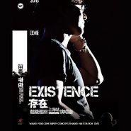

存在·超级巡回上海演唱会Existence
============================

|  |  |
| :--: | :-- |
| [ 存在·超级巡回上海演唱会Existence](https://emumo.xiami.com/album/1622929132) | **艺人**: [汪峰](../index.md) **语种**: 国语 **唱片公司**: 风华秋实 **发行时间**: 2015年02月03日 **专辑类别**: 现场专辑 **专辑风格**: 摇滚 Rock & Roll, 国语流行 Mandarin Pop, 华语唱作人 Chinese Singer-Songwriter **播放数**: 3216986 **收藏数**: 1520 **评论数**: 128  |

## 简介

汪峰上海站“存在”演唱会集巡演之大成 8分钟经典告白刻录成碟  
  
汪峰2013年“存在”超级巡演“途观之夜”上海站，是汪峰年度巡演的第12站，从第一站走来，汪峰一站站不断的升华、精进，得来了票房最高、人数最多、内涵及形式最丰富的一场演唱会，可谓集2013“存在”超级巡演之大成。  
舞台上300人合唱团制造完美声墙、场地上30000观众纵情合唱回响八万人体育场，汪峰在所有人的注视下，双手紧握话筒紧闭双眼仰头高唱《光明》。在无以复加的震撼现场中，完成了他3小时30首经典创作的分享。  
一场演唱会下来，生命的意义、尊严、信仰和信念都成倍地堆积在体内，这就是汪峰带给这个时代的影响。意外的惊喜是，汪峰在唱《我如此爱你》之前，献上了长达8分钟的甜蜜演说，真诚感人的话语让他收获了现场30000人的祝福。  
这一切，都封存在了这张汪峰上海“存在”演唱会DVD上。  
  
顶级制作刷新行业标准 超高人气上演票房神话  
  
汪峰的音乐透着浓郁的人文气质和文化内涵，极富画面感的嗓音，忧伤而且动听，音乐旋律优美。他怀着一颗勇敢的心，唱出的都是中国人最现实的存在。  
这是一场绝无仅有的演唱会，不仅在于它刷新了许多记录，更在于它的品质。它有许多你亲眼可见的大阵仗，但在细微之处，它把你所有的感官都充盈了。主办方风华秋实的负责人透露，这场演唱会所启用的K-one和V-dos的音响组合，可以满足两个八万人体育场，就是说现场的3万人体验到的是对16万人的音质服务。13台摄影机位照顾到每个微小细节、灯光效果、16:9高清视频，无一不超越了之前所有巡演的质量与规模。  
  
演唱会处处“存在”惊喜 8分钟超长告白获三万人祝福  
  
这是一场有让人情绪跌宕起伏的演唱会，会在你因《有意思吗》而愤世嫉俗后，给你《当我想你的时候》一般深沉的爱的渗透；会在你因《北京，北京》沉醉在忧伤后给你《存在》的力量；会在你因《花火》醉了倦了后让你丢掉一切烦恼《一起摇摆》。  
  
演唱会的惊喜来自《飞得更高》这首汪峰一统国内乐坛的代表作。歌曲前奏响起刚刚唱起来的时候，汪峰走上舞台上的一处栏杆，被摇臂摇到了舞台之外、观众之上。高唱着“我要飞得更高”的汪峰，真的飞起来了。这是此前任何一场“存在”巡演都没有过的尝试。别致安排，无疑让摇滚乐的呈现更具有冲击力和立体感，引来现场极高分贝的欢呼与尖叫。  
  
以往“存在”巡演的每一场，除了激情昂扬的摇滚时刻，也会有温情歌曲的联唱。上海演唱会上，汪峰通过这个环节表现了他关于爱情、亲情等内心细腻的一面，让人出乎意料的是，在唱完《爱你的方式》之后，汪峰发表了一次长达8分钟的甜蜜演说。  
  
“我想对所有人，也想对你说。”汪峰停下音乐，希望上海的观众给他一点时间，他说那是放在心里很久的话。  
“我想象有一天，这个社会不会把你我曾经生活的那些迷惘和坎坷，看作是放荡和污垢。  
我想象有一天，那些媒体，那些举着相机的人，握着笔的人，也可以把我们当作人看，不要把我们当作怪物和工具，不要用恶意对待真情。  
我想象有一天你我的亲人和朋友，不会因为我们真挚的爱，反而遭受折磨和屈辱。  
我想象有一天你我的善意和感情，不再被当作猥琐和苟且而蒙羞。  
我想象有一天，你我，还有所有能称之为公众人物的那些人的爱，可以不被指责、污蔑，能够被大家真诚的祝福。  
我想象有一天，我们彼此告诉对方我爱你的时候，不会眼含难过的泪水。  
我想象有一天，我们可以像正常人那样，在街上拉着手购物、散步、沐浴着阳光。  
我想象有一天，我们可以在阳光下一起走的时候不用再带着口罩、墨镜。人们不只是举起相机拍照、议论，而是可以对我们报以善意的微笑。  
我想象有一天早晨醒来，你我看到的头版头条不再是与我们生命无关的那些窥探者的消息，而是爱与宽容。  
我想象有一天，人们懂得我爱的你，不只是美丽耀眼的女明星，也知道你身上有很多常人难以忍受的伤病。这世界上有许多人和事需要我们关注和帮助，那绝不是我们的名望、财富和地位，那应该是我们背地里做的每一件小事，和那些一无所有的人们。  
我想象有一天，如果死亡临近，在你我心里留下的不是所有这些浮华，而是我们为彼此给予的爱与感情，还有我们留在记忆中的那些感动的瞬间。  
我想象有一天，我可以抱着你，不再感觉到你为了抵御那些肮脏与不公，而丧失的坚强与委屈。我想看到你开心幸福善良的微笑。  
我想象有一天，当我们苍老，我们相互搀扶着走在某一条路上的时候，我们会告诉我们身边的朋友，TA的爱给了我所有。”  
  
这个晚上，在30首金曲中，激情，温柔，细腻，深邃的汪峰毫无保留地全面展现出来。以男人的方式，汪峰用他的音乐作品回应了所有的轻浮和苍白，用他完美的表演证明了他的坚定与强大，用他的歌声告诉了人们：只有音乐作品才是最真实，最有力量的存在。唯有爱与真情永恒。

## 曲目

- [上千个黎明 (Live)](./1622929132/mQOk4l5303d.md)
- [我真的需要 (Live)](./1622929132/mQOk4m4bb85.md)
- [怒放的生命 (Live)](./1622929132/8Guihxe8f19.md)
- [像个孩子 (Live)](./1622929132/8Guihyf8b6f.md)
- [一百万吨的信念 (Live)](./1622929132/mQOk4p7bd9e.md)
- [让我们在一起 (Live)](./1622929132/bCkSbaU46698.md)
- [窗台 (Live)](./1622929132/8Guih119960.md)
- [在雨中 (Live)](./1622929132/JBfgWc1eb10.md)
- [不能停止的哭泣 (Live)](./1622929132/8Guih3e74d7.md)
- [美丽世界的孤儿 (Live)](./1622929132/mQOk4u8d1ff.md)
- [小鸟 (Live)](./1622929132/xL9jsVd34ec.md)
- [飞得更高 (Live)](./1622929132/bf0Be9q2f9df.md)
- [北京北京 (Live)](./1622929132/bqvwdxR37098.md)
- [勇敢的心 (Live)](./1622929132/mQOk4y85020.md)
- [旅途 (Live)](./1622929132/bqvwdxT357cf.md)
- [向阳花 (Live)](./1622929132/bCkSbbe46afd.md)
- [硬币 (Live)](./1622929132/mQOk4155b2a.md)
- [爱你的方式 (Live)](./1622929132/mQOk424e894.md)
- [我如此爱你 (Live)](./1622929132/8GuihDe708f.md)
- [爸爸 (Live)](./1622929132/mQOk447913e.md)
- [花火 (Live)](./1622929132/mQOk456aef3.md)
- [一起摇摆 (Live)](./1622929132/xL9jtgb26b4.md)
- [存在 (Live)](./1622929132/mQOk4777ab8.md)
- [当我想你的时候 (Live)](./1622929132/bqvwdyc390b3.md)
- [春天里 (Live)](./1622929132/xL9jtjd1e9b.md)
- [我爱你中国 (Live)](./1622929132/b1qhcmE3c380.md)
- [光明 (Live)](./1622929132/mQOk4B5171c.md)
- [晚安北京 (Live)](./1622929132/mQOk4C581ee.md)

## 评论

|  |  |  |  |
| :-- | :-- | :-- | :-- |
|  [虾米用户](https://emumo.xiami.com/u/445142161) 世事如行云流水，生活切简... 2020-11-14 17:15 赞(0) 踩(0) | 
什么鬼？都买sVip好多歌还听不到？
 |
|  [虾米用户](https://emumo.xiami.com/u/289169522)  2019-02-03 10:40 赞(0) 踩(0) | 
嗯饿了饿了得得的OK了的得了的额的可分得得得得得么的得得得的么分了佛经买了呢费劲
 |
|  [虾米用户](https://emumo.xiami.com/u/289169522)  2019-02-03 10:38 赞(0) 踩(0) | 
嗯饿了饿了得得的OK了的得了的额的可分得得得得得么的得得得的么分了佛经买了呢费劲
 |
|  [虾米用户](https://emumo.xiami.com/u/10863300) 暮雨清寒 2018-10-01 11:31 赞(0) 踩(0) | 
不得不服。
 |
|  [虾米用户](https://emumo.xiami.com/u/244760429)  2018-06-14 11:28 赞(0) 踩(0) | 
五一节g7啊
 |
|  [虾米用户](https://emumo.xiami.com/u/6767955) 求存是異種 2018-05-06 20:33 赞(0) 踩(0) | 
汪峰请一直唱下去
 |
|  [虾米用户](https://emumo.xiami.com/u/102547144) 随风奔跑自由是方向 2018-02-12 21:25 赞(0) 踩(0) | 
当时我在现场
 |
|  [虾米用户](https://emumo.xiami.com/u/10532679)  2017-11-03 20:11 赞(2) 踩(0) | 
缺个许巍那样的团队！说白了就是缺个李延亮那样的现场效果！
 |
|  [虾米用户](https://emumo.xiami.com/u/279490753)  2017-03-23 23:44 赞(0) 踩(0) | 
呃
 |
|  [虾米用户](https://emumo.xiami.com/u/50033417) QQ：743561064 2016-08-14 17:01 赞(0) 踩(0) | 
爱爱爱爱
 |
|  [虾米用户](https://emumo.xiami.com/u/36897148) 私信➕v请备注 2016-02-25 22:52 赞(0) 踩(0) | 
现场一如既往的吃力呀
 |
|  [虾米用户](https://emumo.xiami.com/u/78481994)  2015-11-01 23:00 赞(0) 踩(0) | 
天籁般
 |
|  [虾米用户](https://emumo.xiami.com/u/332689)  2015-10-20 18:19 赞(0) 踩(0) | 
小鸟，又老又经典，那是他当时境遇的写照，很感人。
 |
| ⇒ |  [虾米用户](https://emumo.xiami.com/u/51800191)  2016-04-12 22:20 赞(0) 踩(0) | 
你好
 |
|  [虾米用户](https://emumo.xiami.com/u/332689)  2015-10-20 18:16 赞(3) 踩(0) | 
世人好八卦，一个歌手你不去听他的歌，你去抠他的生活私事，你好下作无耻无聊！娱乐圈有几个干净的？！
 |
| ⇒ |  [虾米用户](https://emumo.xiami.com/u/51800191)  2016-04-12 22:20 赞(0) 踩(0) | 
你好！
 |
|  [虾米用户](https://emumo.xiami.com/u/70965630)  2015-10-01 23:38 赞(0) 踩(0) | 
9
 |
|  [虾米用户](https://emumo.xiami.com/u/32547392)  2015-09-23 15:41 赞(1) 踩(0) | 
到演唱会后期明显感觉声音吃力了
 |
| ⇒ |  [虾米用户](https://emumo.xiami.com/u/34181026)  2015-10-28 20:17 赞(0) 踩(0) | 
同感，去看演唱会，最后那几首确实
 |
| ⇒ |  [虾米用户](https://emumo.xiami.com/u/32547392)  2015-10-29 08:44 赞(0) 踩(0) | 
<q><b>东北老张说：</b></q>
 |
| ⇒ |  [虾米用户](https://emumo.xiami.com/u/34181026)  2015-10-29 08:45 赞(0) 踩(0) | 
<q><b>韵&amp;味说：</b></q>
 |
| ⇒ |  [虾米用户](https://emumo.xiami.com/u/32547392)  2015-10-29 08:49 赞(0) 踩(0) | 
<q><b>东北老张说：</b></q>
 |
|  [虾米用户](https://emumo.xiami.com/u/276651)  2015-09-19 16:33 赞(0) 踩(0) | 
嗓子已经坏了
 |
|  [虾米用户](https://emumo.xiami.com/u/256687)  2015-09-18 21:19 赞(0) 踩(0) | 
这场所有慢歌的现场+处理效果都比较好，尤其是《窗台》和《像个孩子》，感觉很多地方胜过了专辑版。
 |
|  [虾米用户](https://emumo.xiami.com/u/43355178)  2015-08-01 12:17 赞(2) 踩(0) | 
因为是汪峰，就喜欢
 |
| ⇒ |  [虾米用户](https://emumo.xiami.com/u/45375943)  2015-08-24 14:03 赞(0) 踩(0) | 
Q?topicq,uqr2?2ytrrtprtuu=，reserved.
 |
|  [虾米用户](https://emumo.xiami.com/u/52265807)  2015-07-07 23:59 赞(1) 踩(0) | 
给予我们力量
 |
|  [虾米用户](https://emumo.xiami.com/u/29696442)  2015-05-05 16:56 赞(3) 踩(0) | 
live更有味
 |
|  [虾米用户](https://emumo.xiami.com/u/39374795)  2015-04-17 22:08 赞(14) 踩(0) | 
看过四次现场，还需要说点什么吗？
 |
| ⇒ |  [虾米用户](https://emumo.xiami.com/u/42290621) 摇滚乐的忠实信徒，金属党... 2015-06-21 23:07 赞(0) 踩(0) | 
我看过七次。。
 |
| ⇒ |  [虾米用户](https://emumo.xiami.com/u/47577064) 杂食耳 2015-06-29 14:10 赞(0) 踩(0) | 
<q><b>刺客的契约说：</b></q>
 |
| ⇒ |  [虾米用户](https://emumo.xiami.com/u/10495358) 秋凉天气 2015-07-21 21:44 赞(0) 踩(0) | 
我只看过去年鸟巢的，震撼啊。羡慕你
 |
|  [虾米用户](https://emumo.xiami.com/u/7444777)  2015-03-29 23:43 赞(1) 踩(0) | 
依然喜欢
 |
|  [虾米用户](https://emumo.xiami.com/u/3808412)   2015-02-27 21:08 赞(2) 踩(0) | 
听现场眼泪止不住刷刷地流
 |
|  [虾米用户](https://emumo.xiami.com/u/40028126)   2015-02-26 22:04 赞(4) 踩(0) | 
汪峰一如既往的现场吃力
 |
|  [虾米用户](https://emumo.xiami.com/u/9310303) 没有音乐，会死 2015-02-19 17:47 赞(1) 踩(0) | 
现场这么棒
 |
|  [虾米用户](https://emumo.xiami.com/u/43078319) 忽然发现，最初的出发不为... 2015-02-17 15:54 赞(0) 踩(0) | 
终于要和章子怡大婚了
 |
|  [虾米用户](https://emumo.xiami.com/u/10495358) 秋凉天气 2015-02-13 14:59 赞(13) 踩(0) | 
听歌都能听出八卦，真牛逼
 |
|  [虾米用户](https://emumo.xiami.com/u/8305765) 人体ETC 2015-02-13 10:23 赞(0) 踩(0) | 
演唱会就演唱会，还超级，土到掉渣！
 |
| ⇒ |  [虾米用户](https://emumo.xiami.com/u/10093670)   2015-02-21 21:19 赞(0) 踩(0) | 
哈哈哈反应一样。。炒鸡演唱会。。
 |
| ⇒ |  [虾米用户](https://emumo.xiami.com/u/8305765) 人体ETC 2015-02-21 21:30 赞(0) 踩(0) | 
<q><b>小巨熊说：</b></q>
 |
| ⇒ |  [虾米用户](https://emumo.xiami.com/u/51800191)  2016-04-12 22:21 赞(0) 踩(0) | 
你好！！
 |
| ⇒ |  [虾米用户](https://emumo.xiami.com/u/8305765) 人体ETC 2016-04-13 13:06 赞(0) 踩(0) | 
<q><b>thinking_123说：</b></q>
 |
| ⇒ |  [虾米用户](https://emumo.xiami.com/u/51800191)  2016-04-13 13:09 赞(0) 踩(0) | 
<q><b>阿基米锤说：</b></q>
 |
| ⇒ |  [虾米用户](https://emumo.xiami.com/u/8305765) 人体ETC 2016-04-13 13:11 赞(0) 踩(0) | 
<q><b>thinking_123说：</b></q>
 |
| ⇒ |  [虾米用户](https://emumo.xiami.com/u/51800191)  2016-04-13 13:16 赞(0) 踩(0) | 
<q><b>阿基米锤说：</b></q>
 |
| ⇒ |  [虾米用户](https://emumo.xiami.com/u/32547392)  2017-07-13 15:16 赞(0) 踩(0) | 
是否有一种以前的“高级运动鞋”的感觉？土死了
 |
|  [虾米用户](https://emumo.xiami.com/u/729044)  2015-02-12 22:07 赞(0) 踩(0) | 
写了这么多歌曲的汪峰混到现在这个程度，是否也是他歌迷所向往的美好人生?
 |
|  [虾米用户](https://emumo.xiami.com/u/6215042) 欢迎关注同名音乐公众号 2015-02-12 12:19 赞(0) 踩(0) | 
终于上头条了
 |
| ⇒ |  [虾米用户](https://emumo.xiami.com/u/6037106)   2015-02-12 13:29 赞(0) 踩(0) | 
汪峰求婚 章子怡上头条 不见汪峰；无人机坠白宫院内 上头条 依然不见汪峰；这说明了地球人与汪星人之间的激烈斗争
 |
| ⇒ |  [虾米用户](https://emumo.xiami.com/u/6215042) 欢迎关注同名音乐公众号 2015-02-12 13:50 赞(0) 踩(0) | 
<q><b>Slithereen说：</b></q>
 |
|  [虾米用户](https://emumo.xiami.com/u/32031632)  2015-02-12 08:48 赞(0) 踩(0) | 
顶你汪峰 ！
 |
|  [虾米用户](https://emumo.xiami.com/u/5660107) 请你不要吃我，我给你唱一... 2015-02-12 08:46 赞(20) 踩(0) | 
面对诋毁与责骂，皮裤汪三婚表示清者自清，感谢我怡给自己完整生命。
 |
| ⇒ |  [虾米用户](https://emumo.xiami.com/u/49284372) like a rolli... 2015-05-20 22:23 赞(0) 踩(0) | 
听歌就是听歌，哪来那么多八卦
 |
|  [虾米用户](https://emumo.xiami.com/u/5719775) 可爱可爱~不可及 2015-02-12 04:53 赞(0) 踩(0) | 
风华秋实做的几个演唱会系列都很棒，俨然成为一个响当当的演唱会品牌
 |
|  [虾米用户](https://emumo.xiami.com/u/2119041)   2015-02-12 01:27 赞(1) 踩(0) | 
差
 |
|  [虾米用户](https://emumo.xiami.com/u/45648608)  2015-02-11 19:45 赞(2) 踩(0) | 
汪峰，激情的演唱风格，挡不住的精彩！
 |
|  [虾米用户](https://emumo.xiami.com/u/1136964)  2015-02-11 18:54 赞(0) 踩(0) | 
我就是想听听是怎么表白的，找不到啊啊啊啊啊啊啊啊啊啊啊啊啊啊啊啊啊啊啊啊啊啊啊啊啊
 |
|  [虾米用户](https://emumo.xiami.com/u/2818336)  2015-02-11 13:11 赞(0) 踩(0) | 
爽 啊
 |
|  [虾米用户](https://emumo.xiami.com/u/163208) Give No Fuck 2015-02-11 12:05 赞(1) 踩(0) | 
社会主义初期的摇滚音乐 也就这样了
 |
| ⇒ |  [虾米用户](https://emumo.xiami.com/u/5660107) 请你不要吃我，我给你唱一... 2015-02-12 08:38 赞(0) 踩(0) | 
干嘛形容的这么准确
 |
| ⇒ |  [虾米用户](https://emumo.xiami.com/u/51800191)  2016-04-12 22:22 赞(0) 踩(0) | 
你好？
 |
|  [虾米用户](https://emumo.xiami.com/u/7276218)  2015-02-11 12:01 赞(0) 踩(0) | 
为什么不出CD。
 |
| ⇒ |  [虾米用户](https://emumo.xiami.com/u/6630660) 猜赢涂口红… 2015-02-11 14:28 赞(0) 踩(0) | 
貌似只有DVD
 |
|  [虾米用户](https://emumo.xiami.com/u/25639638)  2015-02-09 15:05 赞(0) 踩(0) | 
没主动去听过汪峰的歌，就是绯闻大于事业就没想听的兴致。现在听觉得汪峰的歌确实很不错呀，有几首歌还真从街上广告里听过。
 |
|  [虾米用户](https://emumo.xiami.com/u/4243772)  2015-02-08 17:29 赞(0) 踩(0) | 
偶像求婚成功，Rock起来。。。哈哈哈哈~~~
 |
|  [虾米用户](https://emumo.xiami.com/u/4243772)  2015-02-08 17:28 赞(0) 踩(0) | 
汪峰
 |
|  [虾米用户](https://emumo.xiami.com/u/6595177) 抛开一切，走进天堂 2015-02-08 11:59 赞(1) 踩(0) | 
求婚成功了，人生的顶点
 |
|  [虾米用户](https://emumo.xiami.com/u/29696442)  2015-02-08 07:38 赞(0) 踩(0) | 
唱到旅途的时候有些累了
 |
|  [虾米用户](https://emumo.xiami.com/u/12897034) 啊 啊 2015-02-06 23:04 赞(0) 踩(0) | 
中国垄断的唱片界和媒体对歌曲版权的保护不如他们盗版贩卖这些歌曲来得纯粹和直接！有人写歌缺很少有人愿意通过法律去试着保护它，以至于原创得不到鼓励和刺激！！！
 |
|  [虾米用户](https://emumo.xiami.com/u/3311499) 这世界还很美，看我们选择... 2015-02-06 16:06 赞(1) 踩(0) | 
内容已删除
 |
| ⇒ |  [虾米用户](https://emumo.xiami.com/u/51800191)  2016-04-12 22:23 赞(0) 踩(0) | 
MP4
 |
|  [虾米用户](https://emumo.xiami.com/u/1046862)  2015-02-06 10:04 赞(0) 踩(0) | 
存在就是道理 存在就是实力
 |
| ⇒ |  [虾米用户](https://emumo.xiami.com/u/41305836) 暂无签名~ 2015-02-15 15:14 赞(0) 踩(0) | 
“存在”？
 |
|  [虾米用户](https://emumo.xiami.com/u/10377889)  2015-02-06 09:38 赞(0) 踩(0) | 
没有生来彷徨 小鸟 太和谐了
 |
| ⇒ |  [虾米用户](https://emumo.xiami.com/u/1489937)  2015-02-20 09:30 赞(0) 踩(0) | 
《小鸟》上面有
 |
|  [虾米用户](https://emumo.xiami.com/u/39146099)  2015-02-05 22:54 赞(0) 踩(0) | 
听着很棒很舒服
 |
|  [虾米用户](https://emumo.xiami.com/u/13898071) 暂无签名~ 2015-02-05 22:41 赞(1) 踩(0) | 
音响不错……
 |
|  [虾米用户](https://emumo.xiami.com/u/13224763)  2015-02-05 19:15 赞(0) 踩(0) | 
不错
 |
|  [虾米用户](https://emumo.xiami.com/u/43887212)  2015-02-05 13:31 赞(0) 踩(0) | 
我擦，简直high到爆啊
 |
|  [虾米用户](https://emumo.xiami.com/u/579006) 听什么吆喝什么 2015-02-05 08:36 赞(2) 踩(0) | 
这张专的音效挺好，吉他也好听，歌也不错，就是部分歌的唱腔过于卖萌，听着不大适应。。。
 |
|  [虾米用户](https://emumo.xiami.com/u/42705134)  2015-02-04 19:56 赞(0) 踩(0) | 
去了这次演唱会，很高兴推出了这场的大碟！哈哈，@汪峰 了不起
 |
|  [虾米用户](https://emumo.xiami.com/u/8244559)  2015-02-04 09:45 赞(0) 踩(0) | 
******
 |
|  [虾米用户](https://emumo.xiami.com/u/2798071) 轮回，羯磨 2015-02-04 08:55 赞(1) 踩(0) | 
汪峰！！
 |
|  [虾米用户](https://emumo.xiami.com/u/13401100) 闭嘴，听音乐 2015-02-04 02:03 赞(0) 踩(0) | 
萨特表示：这个标题好极啦！
 |
|  [虾米用户](https://emumo.xiami.com/u/13149768)  2015-02-04 00:22 赞(1) 踩(0) | 
还是被汪峰的歌还是唤醒了很多次，有些时候就像救赎
 |
|  [虾米用户](https://emumo.xiami.com/u/13149768)  2015-02-04 00:16 赞(1) 踩(0) | 
很喜欢
 |
|  [虾米用户](https://emumo.xiami.com/u/559177) 郑力健 2015-02-04 00:06 赞(0) 踩(0) | 
好像很多人是来听告白的
 |
|  [虾米用户](https://emumo.xiami.com/u/8158307)  2015-02-03 23:52 赞(0) 踩(0) | 
不错。。。。
 |
|  [虾米用户](https://emumo.xiami.com/u/2892222)  2015-02-03 21:37 赞(3) 踩(0) | 
里面的呐喊声里有我哦
 |
|  [虾米用户](https://emumo.xiami.com/u/16105811) 我还没想好要写什么... 2015-02-03 19:25 赞(1) 踩(0) | 
赞 状态挺好
 |
| ⇒ |  [虾米用户](https://emumo.xiami.com/u/20198162)   2015-02-10 08:38 赞(0) 踩(0) | 

 |
| ⇒ |  [虾米用户](https://emumo.xiami.com/u/20198162)   2015-02-10 08:40 赞(0) 踩(0) | 
这个圈子真小，这都能遇见。
 |
|  [虾米用户](https://emumo.xiami.com/u/18265880)  2015-02-03 18:11 赞(0) 踩(0) | 
~
 |
|  [虾米用户](https://emumo.xiami.com/u/10495358) 秋凉天气 2015-02-03 17:31 赞(0) 踩(0) | 
必须满分啊，期待专辑面世，一定飞奔而去
 |
|  [虾米用户](https://emumo.xiami.com/u/139128) 上海那个什么鸟室内合唱团... 2015-02-03 14:26 赞(0) 踩(0) | 
口沫横飞 真想把他咽喉通通
 |
|  [虾米用户](https://emumo.xiami.com/u/139128) 上海那个什么鸟室内合唱团... 2015-02-03 14:08 赞(0) 踩(0) | 
没人吗
 |
|  [虾米用户](https://emumo.xiami.com/u/20198162)   2015-02-03 13:59 赞(1) 踩(0) | 
淘宝已经可以预定了，说2月发行，具体也不知道哪天，期待视频。
 |
| ⇒ |  [虾米用户](https://emumo.xiami.com/u/10495358) 秋凉天气 2015-02-03 17:24 赞(0) 踩(0) | 
同期待啊，京东上也可以预售，可没说哪天能买到，本来还同时买了几张他的其他碟子
 |
| ⇒ |  [虾米用户](https://emumo.xiami.com/u/20198162)   2015-02-10 08:38 赞(0) 踩(0) | 
<q><b>秋凉天气说：</b></q>
 |
| ⇒ |  [虾米用户](https://emumo.xiami.com/u/42290621) 摇滚乐的忠实信徒，金属党... 2015-03-04 01:13 赞(0) 踩(0) | 
<q><b>玫瑰刺青说：</b></q>
 |
|  [虾米用户](https://emumo.xiami.com/u/19162719)  2015-02-03 13:45 赞(1) 踩(0) | 
先点赞，再看看这张现场专辑能不能像许巍《此时此刻》现场那张一样棒。
 |
| ⇒ |  [虾米用户](https://emumo.xiami.com/u/1032568) 我还没想好要写什么... 2015-02-03 13:58 赞(0) 踩(0) | 
没法比
 |
| ⇒ |  [虾米用户](https://emumo.xiami.com/u/19162719)  2015-02-03 13:59 赞(0) 踩(0) | 
<q><b>mojun说：</b></q>
 |
|  [虾米用户](https://emumo.xiami.com/u/559177) 郑力健 2015-02-03 13:42 赞(0) 踩(0) | 
还是我心中的中国现场之王啊 听着心潮澎湃啊 音效比以前的演唱会强多了 几乎都是我喜欢的歌 不输国外水准啊 这些歌一场唱下来 很难啊 已经很好了 某些唱法改了也无奈 谁让汪峰自己给自己写的歌 唱着费劲啊 哈哈哈 要是许巍 唱一天估计都没事 哈哈
 |
| ⇒ |  [虾米用户](https://emumo.xiami.com/u/1032568) 我还没想好要写什么... 2015-02-03 14:01 赞(0) 踩(0) | 
买了前2次的现场DVD肠子都悔清了 看了一遍 扔下在没看  音效 画质太差了 和网上的一样 拍摄的也差 一直就一个中景 而且就在汪一个人身上
 |
| ⇒ |  [虾米用户](https://emumo.xiami.com/u/1750733) 热爱音乐 热爱生活 2015-02-03 20:08 赞(0) 踩(0) | 
我心目中的现场之王是谢天笑，汪峰的最牛逼时代还停留在2003年。
 |
| ⇒ |  [虾米用户](https://emumo.xiami.com/u/559177) 郑力健 2015-02-03 23:51 赞(0) 踩(0) | 
<q><b>兽医扁鹊说：</b></q>
 |
| ⇒ |  [虾米用户](https://emumo.xiami.com/u/8580080) 噪音爱好者。。 2015-02-04 00:08 赞(0) 踩(0) | 
<q><b>郑力健说：</b></q>
 |
| ⇒ |  [虾米用户](https://emumo.xiami.com/u/8580080) 噪音爱好者。。 2015-02-04 00:09 赞(0) 踩(0) | 
<q><b>郑力健说：</b></q>
 |
| ⇒ |  [虾米用户](https://emumo.xiami.com/u/559177) 郑力健 2015-02-04 00:20 赞(0) 踩(0) | 
<q><b>FrankFour说：</b></q>
 |
| ⇒ |  [虾米用户](https://emumo.xiami.com/u/559177) 郑力健 2015-02-04 00:25 赞(0) 踩(0) | 
<q><b>FrankFour说：</b></q>
 |
| ⇒ |  [虾米用户](https://emumo.xiami.com/u/51800191)  2016-04-12 22:23 赞(0) 踩(0) | 
<q><b>FrankFour说：</b></q>
 |
| ⇒ |  [虾米用户](https://emumo.xiami.com/u/51800191)  2016-04-12 22:23 赞(0) 踩(0) | 
<q><b>mojun说：</b></q>
 |
| ⇒ |  [虾米用户](https://emumo.xiami.com/u/51800191)  2016-04-12 22:24 赞(0) 踩(0) | 
？
 |
| ⇒ |  [虾米用户](https://emumo.xiami.com/u/559177) 郑力健 2017-10-27 23:29 赞(0) 踩(0) | 
<q><b>mojun说：</b></q>
 |
|  [虾米用户](https://emumo.xiami.com/u/40827160) 旅人等在哪里，虔诚仰望着... 2015-02-03 13:06 赞(0) 踩(0) | 
嗯，效果不错！
 |
|  [虾米用户](https://emumo.xiami.com/u/19784309) 暂无签名~ 2015-02-03 13:02 赞(0) 踩(0) | 
8分钟告白难道是专辑介绍里最后几句排比句
 |
|  [虾米用户](https://emumo.xiami.com/u/32031632)  2015-02-03 12:59 赞(1) 踩(0) | 
顶你汪峰！
 |
|  [虾米用户](https://emumo.xiami.com/u/46757489)  2015-02-03 12:58 赞(1) 踩(0) | 
峰哥帅！
 |
|  [虾米用户](https://emumo.xiami.com/u/19784309) 暂无签名~ 2015-02-03 12:53 赞(1) 踩(0) | 
Nice
 |
|  [虾米用户](https://emumo.xiami.com/u/7138458)  2015-02-03 12:51 赞(0) 踩(0) | 
八分钟告白在哪？
 |
| ⇒ |  [虾米用户](https://emumo.xiami.com/u/1489937)  2015-02-19 15:44 赞(0) 踩(0) | 
要看dvd才能听得到8分钟告白，cd光盘容不下太长的讲话部分
 |
|  [虾米用户](https://emumo.xiami.com/u/46877546)  2015-02-03 12:50 赞(1) 踩(0) | 
牛逼！！！！！
 |
|  [虾米用户](https://emumo.xiami.com/u/9065272)  2015-02-03 12:07 赞(1) 踩(0) | 
效果不错，好听。
 |
|  [虾米用户](https://emumo.xiami.com/u/5637906)  2015-02-03 11:34 赞(0) 踩(0) | 

 |
|  [虾米用户](https://emumo.xiami.com/u/18282119) 我就是我，独一无二 2015-02-03 11:20 赞(2) 踩(0) | 
汪老夫子最新现场专辑，顶你，这10多年来你走的不容易啊！！！
 |
| ⇒ |  [虾米用户](https://emumo.xiami.com/u/1847532) 我爱音乐，音乐爱我 2015-02-03 11:30 赞(0) 踩(0) | 
很不错
 |
| ⇒ |  [虾米用户](https://emumo.xiami.com/u/18282119) 我就是我，独一无二 2015-02-03 11:42 赞(0) 踩(0) | 
<q><b>陈铖说：</b></q>
 |
