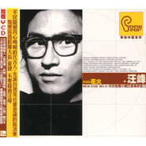

花火(台湾版)
============================

|  |  |
| :--: | :-- |
| [ 花火(台湾版)](https://emumo.xiami.com/album/374017) | **艺人**: [汪峰](../index.md) **语种**: 国语 **唱片公司**: 华纳音乐 **发行时间**: 2001年07月11日 **专辑类别**: 录音室专辑 **专辑风格**: 摇滚 Rock & Roll, 华语唱作人 Chinese Singer-Songwriter **播放数**: 996173 **收藏数**: 1089 **评论数**: 144  |

## 简介

这张专辑的台湾版和大陆版差别还不小。台湾版为CD+VCD，CD中收录了12首歌曲，VCD主要是北京华纳的广告宣传。下面是台湾版和大陆版曲目对比，左为台版，右为大陆版。  
  
01.早安女士…………………………01.早安女士  
02.花火………………………………02.花火  
03.爱的隧道…………………………03.迷鹿  
04.东北偏北…………………………04.东北偏北  
05.我爱你中国………………………05.美丽世界的孤儿  
06.妈妈………………………………06.我爱你，生活  
07.风中的玩偶………………………07.一切都会流走  
08.抽干………………………………08.青春  
09.迷鹿………………………………09.爱的隧道  
10.美丽世界的孤儿…………………10.丧失  
11.丧失我的信仰……………………11.妈妈  
12.再见二十世纪  
  
第5首《我爱你中国》和汪峰收在《怒放的生命》中的《我爱你中国》不是一回事。其实这首歌就是大陆版本中的《我爱你，生活》。由于歌词的问题，报批时没有通过，将原歌做了一点处理，补录了“生活”两个字盖在上面，就成了大陆的版本。而原来的音轨并没有抹掉，还可以听到。  
  
《再见二十世纪》也是在当时审批没有通过，后来收在了《爱是一颗幸福的子弹》中。两个版本的后半部分在歌词上有所差别。  
  
大陆版中那首经典的《青春》，在台湾版里没有收录。取而代之的是《风中的玩偶》  
  
《丧失我的信仰》即是《丧失》，两个版本有小小的区别。《抽干》是《一切都会流走》，词不同。  
  
都说台湾版本更接近汪峰的本意。我实在听不懂那时的汪峰在《我爱你中国》中，想表达什么，但我还是喜欢那时的汪峰。  
好像有人问过汪峰，哪里能买到台湾版的《花火》？汪峰说，台湾版的花火，他本人都没有。 

## 曲目

- [早安，女士](./374017/xLquImb3571.md)
- [花火MV](./374017/xLquInc22fa.md)
- [爱的隧道](./374017/xLquIo999a8.md)
- [东北偏北](./374017/xLquIpb9516.md)
- [我爱你中国](./374017/mQ5vTG85cf3.md)
- [妈妈](./374017/mQ5vTH7e984.md)
- [风中的玩偶](./374017/xLquIs9b6ad.md)
- [抽干](./374017/xLquItbb0af.md)
- [迷鹿](./374017/xLquIubc085.md)
- [美丽世界的孤儿](./374017/mQ5vTL80a0f.md)
- [丧失我的信仰](./374017/mQ5vTM4c6e6.md)
- [再见二十世纪](./374017/xLquIxb2896.md)

## 评论

|  |  |  |
| :-- | :-- | :-- |
|  [虾米用户](https://emumo.xiami.com/u/370706758) 你不用多好 我喜欢就好 2019-02-11 00:32 赞(1) 踩(0) | 
汪老丝这么些歌都不能听啊
 |
|  [虾米用户](https://emumo.xiami.com/u/5490858) 生活不是只有光明，也有黑... 2018-09-03 10:51 赞(0) 踩(0) | 
汪峰用情太深，听久了容易抑郁。
 |
|  [虾米用户](https://emumo.xiami.com/u/1331382) 点击编辑 2018-07-23 00:32 赞(0) 踩(0) | 
汪峰巅峰之作，没有之一
 |
|  [虾米用户](https://emumo.xiami.com/u/7221420)  2018-04-08 15:49 赞(0) 踩(0) | 
标记
 |
|  [虾米用户](https://emumo.xiami.com/u/312927119)  2018-04-04 13:53 赞(1) 踩(0) | 
汪峰在没穿上皮裤前的歌
 |
|  [虾米用户](https://emumo.xiami.com/u/355663494) 愿有一个永不落幕的旅行。 2018-04-02 11:52 赞(0) 踩(0) | 
就这样呗，其实有点故意的做作。
 |
|  [虾米用户](https://emumo.xiami.com/u/216784802) 好的音乐最重要的是真实，... 2018-03-10 09:48 赞(4) 踩(0) | 
不仅仅是汪峰，中国摇滚有很多很好的作品，优秀的创作都只能在大陆以外的地方发行，有一小部分后来&amp;ldquo;出口转内销&amp;rdquo;，更多的是根本&amp;ldquo;内销&amp;rdquo;不了，长此以往会导致一个什么现象呢？那就是生活在这里的人与生活在外面的人就同一件事，同一个人的评价会截然不同，汪峰不过是其中一例，我说过汪峰是真摇滚，而且要比崔健等人根源得多，在我们根本听不到的某些场景中
 |
|  [虾米用户](https://emumo.xiami.com/u/332689)  2018-02-02 20:26 赞(0) 踩(0) | 
迷鹿
 |
|  [虾米用户](https://emumo.xiami.com/u/89241402) 爱音乐，爱生活…… 2017-11-18 22:44 赞(1) 踩(0) | 
花火专辑，曾经获得台湾金曲奖最佳国语专辑，也是汪峰最纯粹、最优秀的专辑，没有之一。专辑可以称为华语摇滚乐团最棒的专辑之一，建议大家来听听，但不建议听内地那个封面枯叶，上面有老汪头像的版本。 台湾版花火与内地版的区别： 1.台版有《风中的玩偶》与《再见二十世纪》，在内地出版时因为&amp;ldquo;调子过于灰暗&amp;rdquo;被禁，没有这两首歌。《再见二十世纪》一年多之后被收入《爱是一颗幸福的子弹》专辑。 2.台版《花火》中有两首歌在内地版中修改了歌词，一是《我爱你中国》，内地版将&amp;ldquo;中国&amp;rdquo;全部修改为&amp;ldquo;生活&amp;rdquo;；另一首是《抽干》，在原有曲子基础上进行了歌词的全部推倒再创作，歌名也改为了《一切都会流走》。 3.台湾版没有收入《青春》
 |
|  [虾米用户](https://emumo.xiami.com/u/10577497) 青青子衿，悠悠我心。 2017-10-27 23:47 赞(0) 踩(0) | 
满含着风格变化的因素，激情后面透露着无奈，我们看到的汪峰，收起鲍家街的火焰和子弹，穿起一袭华美的绸缎长袍。
 |
|  [虾米用户](https://emumo.xiami.com/u/18622046) 初识变化 2017-09-13 01:22 赞(0) 踩(0) | 
经典！
 |
|  [虾米用户](https://emumo.xiami.com/u/275545037)  2017-02-25 15:38 赞(0) 踩(0) | 
最初的汪峰
 |
|  [虾米用户](https://emumo.xiami.com/u/55048906) 你文渊妹妹 2016-02-11 14:35 赞(0) 踩(0) | 
那时候真年轻啊
 |
|  [虾米用户](https://emumo.xiami.com/u/1674211) 用心去聆听，去感受…… 2015-12-30 13:47 赞(3) 踩(0) | 
这张之后 再无汪峰
 |
|  [虾米用户](https://emumo.xiami.com/u/590841)  2015-12-04 02:37 赞(0) 踩(0) | 
原始的汪峰。
 |
|  [虾米用户](https://emumo.xiami.com/u/590841)  2015-12-04 02:37 赞(0) 踩(0) | 
原始的汪峰。
 |
|  [虾米用户](https://emumo.xiami.com/u/47496207)  2015-09-13 23:18 赞(0) 踩(0) | 
怎么买原版
 |
|  [虾米用户](https://emumo.xiami.com/u/38322136)   2015-08-16 10:30 赞(0) 踩(0) | 
汪峰最经典
 |
|  [虾米用户](https://emumo.xiami.com/u/54860810)  2015-08-09 15:25 赞(11) 踩(0) | 
这是神专，有几星打几星都不为过。
 |
|  [虾米用户](https://emumo.xiami.com/u/3713514) 明天我会在哪只鞋子里？ 2015-08-09 02:29 赞(2) 踩(0) | 
无法相信这些音乐出自汪峰，就像难以理解陈凯歌怎么拍得出霸王别姬一样。所谓堕落，是不是就像花火中说的那样，“我开始变了，我开始倦了”？
 |
|  [虾米用户](https://emumo.xiami.com/u/52686046)  2015-07-27 22:15 赞(2) 踩(0) | 
这张专辑的评分居然比大陆版的低。。。个人认为9.2是起码的。尤其是那首我爱你中国，比大陆版的不知道高到哪里去。
 |
| ⇒ |  [虾米用户](https://emumo.xiami.com/u/35613078)   2016-04-13 17:46 赞(0) 踩(0) | 
至少应该9.5 ，鲍家街的评分也偏低
 |
|  [虾米用户](https://emumo.xiami.com/u/616978) 彪悍的人生不徐亚解释。 2015-05-29 09:22 赞(0) 踩(0) | 
青春期的经典。
 |
|  [虾米用户](https://emumo.xiami.com/u/6215042) 欢迎关注同名音乐公众号 2015-05-22 14:47 赞(2) 踩(0) | 
汪峰花火两个版本有什么区别 <a href="http://www.zhihu.com/question/30464059/answer/48244583" target="_blank" rel="nofollow noreferrer noopener">http://www.zhihu.com/question/30464059/answer/48244583</a>
 |
|  [虾米用户](https://emumo.xiami.com/u/3855247)  2015-03-06 00:49 赞(1) 踩(0) | 
乍眼一看还以为是 陈可辛
 |
|  [虾米用户](https://emumo.xiami.com/u/1739129)  2015-02-15 16:53 赞(2) 踩(0) | 
把这张专辑拿到今天放一边，一点都不过时，我以前一直以为内地的流行音乐的全方位落后都应该由那些不思进取只会在晚会唱红歌的音乐人来背锅，但是现在发现，这个锅的相当一部分，就应该听众来背。有好作品出来的时候实在不懂珍惜。
 |
|  [虾米用户](https://emumo.xiami.com/u/4394197) last.fm id: ... 2015-01-31 11:17 赞(0) 踩(0) | 
比起大陆版来，汪峰说过台湾版表达的更好
 |
|  [虾米用户](https://emumo.xiami.com/u/38982877)  2014-12-31 22:13 赞(1) 踩(0) | 
简直太棒，无法想象，2000年的作品，很有20世纪末的那种感觉
 |
|  [虾米用户](https://emumo.xiami.com/u/4002112)  2014-12-21 16:59 赞(1) 踩(0) | 
最好的一张个人专辑
 |
|  [虾米用户](https://emumo.xiami.com/u/9889472) 树 2014-12-18 21:21 赞(1) 踩(0) | 
上个世纪的汪峰永远活在我们心中。
 |
|  [虾米用户](https://emumo.xiami.com/u/559177) 郑力健 2014-12-14 21:05 赞(4) 踩(0) | 
9几年 他说我会成为年轻人的精神领袖 那时我唱的时候没几个人听过 那时候他唱25年 想起了眼泪我丢失了整个天堂 要走永恒那么长 才找到梦的地方 只一瞬间 看见了梦想 他就在路上 就在路上 让我们追 去追 让我们追 去追 转眼间 25岁 再转眼间 快四十不惑 听听当年的歌和最近的 依旧感动 膜拜 充满我所能想象的音乐里的东方不败
 |
|  [虾米用户](https://emumo.xiami.com/u/43484457) 操 2014-12-14 20:46 赞(0) 踩(0) | 
！！！！神作！！！
 |
|  [虾米用户](https://emumo.xiami.com/u/42841056)  2014-12-12 12:14 赞(1) 踩(0) | 
喜欢汪峰的才华，其他的不评价
 |
|  [虾米用户](https://emumo.xiami.com/u/43643989)  2014-12-01 15:13 赞(0) 踩(0) | 
汪峰最初的梦想
 |
|  [虾米用户](https://emumo.xiami.com/u/43643989)  2014-12-01 15:13 赞(0) 踩(0) | 
汪峰最经典，最初的梦想
 |
|  [虾米用户](https://emumo.xiami.com/u/6868679) …… 2014-10-12 22:54 赞(0) 踩(0) | 
有思想有深度的一张专辑。也很好听
 |
|  [虾米用户](https://emumo.xiami.com/u/2484127) 我想说的这里写不完！！！ 2014-09-03 23:14 赞(0) 踩(0) | 
这是我听汪峰听的最完整的专辑，没有之一！
 |
|  [虾米用户](https://emumo.xiami.com/u/22992406)  2014-04-02 16:42 赞(0) 踩(0) | 
那沧桑的声音深深的唱入了我的心底
 |
|  [虾米用户](https://emumo.xiami.com/u/29476313)  2014-03-31 16:19 赞(0) 踩(0) | 
好，
 |
|  [虾米用户](https://emumo.xiami.com/u/14790026) 摇滚 2014-03-23 23:25 赞(1) 踩(0) | 
加上〈青春〉的话，这张台版的就圆满了，，老汪的所有专辑最爱的还是〈花火〉
 |
|  [虾米用户](https://emumo.xiami.com/u/2712243)   2014-02-21 14:10 赞(0) 踩(0) | 
真正的不羁与力量
 |
|  [虾米用户](https://emumo.xiami.com/u/12320844)  2014-02-15 16:02 赞(0) 踩(0) | 
早安 你是 变了心
 |
|  [虾米用户](https://emumo.xiami.com/u/32166055)  2014-01-26 21:14 赞(1) 踩(0) | 
读过很多汪峰的歌词 没一个写得比《再见二十世纪》好
 |
|  [虾米用户](https://emumo.xiami.com/u/7165962)  2014-01-08 22:52 赞(0) 踩(0) | 
那年 这年
 |
|  [虾米用户](https://emumo.xiami.com/u/26526457) 滕州二中91 2014-01-05 21:55 赞(0) 踩(0) | 
好听
 |
|  [虾米用户](https://emumo.xiami.com/u/249469)  2013-12-28 02:19 赞(1) 踩(0) | 
声音的硬伤明显 有些迷惘和痛苦由于没被道清而显得缺乏说服力 即使迷鹿的曲子挥着翅膀在天上飞 也不能拽起不知所云的歌词 即使我还可以吐槽 这也是张沉甸甸响当当的专辑 因为音乐随意行走在那些音符与词句里 时不时火花飞溅 牙缝啊雀斑什么的都是浮云 照样是大美女一枚——神作
 |
|  [虾米用户](https://emumo.xiami.com/u/6215042) 欢迎关注同名音乐公众号 2013-12-07 03:13 赞(0) 踩(0) | 
当年的大汪峰
 |
|  [虾米用户](https://emumo.xiami.com/u/10941498) 我还没想好要写什么... 2013-12-06 01:43 赞(0) 踩(0) | 
我爱你 生活第5首！有意思哦！
 |
|  [虾米用户](https://emumo.xiami.com/u/8257521)  2013-11-27 18:41 赞(0) 踩(0) | 
年轻的汪峰真好
 |
|  [虾米用户](https://emumo.xiami.com/u/40527) 诸多借口,你根本就不想 2013-11-14 16:33 赞(0) 踩(0) | 
不闹的说 这张专辑 真不错
 |
|  [虾米用户](https://emumo.xiami.com/u/705022)  2013-11-02 12:00 赞(0) 踩(0) | 
意气风发的时代
 |
|  [虾米用户](https://emumo.xiami.com/u/22055029) 爱音乐 2013-09-21 20:55 赞(0) 踩(0) | 
比内地版的经典多了，听歌不要总是情情爱爱的，这才表达了年轻人的心声！
 |
|  [虾米用户](https://emumo.xiami.com/u/10495358) 秋凉天气 2013-08-27 10:35 赞(0) 踩(0) | 
大爱
 |
|  [虾米用户](https://emumo.xiami.com/u/3878819)  2013-08-12 00:01 赞(0) 踩(0) | 
唯一的理由好听！喜欢！
 |
|  [虾米用户](https://emumo.xiami.com/u/6221130) 一切都会过去的... 2013-06-29 18:48 赞(0) 踩(0) | 
这张很好！很有力量!
 |
|  [虾米用户](https://emumo.xiami.com/u/1727863) 心若向阳，无畏悲伤！ 2013-06-26 00:03 赞(0) 踩(0) | 
摇滚诗人汪峰！
 |
|  [虾米用户](https://emumo.xiami.com/u/3062748) 青青子衿，幽幽吾鑫 2013-06-05 04:25 赞(0) 踩(0) | 
最爱 《花火》。 这是一张神奇的专辑。毕业后已多年没读过诗了，匆匆和碌碌让自己很难再找一个宁静的状态，去读诗。 现在无论再忙，车里，地铁里，飞机上，只要带上耳机，播放《花火》，我就能拿起诗集，读数个小时。 感觉真像广告词，但这是真的。
 |
|  [虾米用户](https://emumo.xiami.com/u/15330267)  2013-05-19 01:11 赞(0) 踩(0) | 
很喜欢他的声音
 |
|  [虾米用户](https://emumo.xiami.com/u/8753715) 我还没想好要写什么... 2013-05-05 21:45 赞(0) 踩(0) | 
中国需要这样的呐喊，需要这样的人文关怀。
 |
|  [虾米用户](https://emumo.xiami.com/u/10362606)  2013-05-01 12:21 赞(0) 踩(0) | 
《再见二十世纪》和《爱是一颗幸福的子弹》里的版本完全一样啊？放在这里的歌曲是台湾原版的吗？
 |
|  [虾米用户](https://emumo.xiami.com/u/13776152) 丫妮 2013-04-08 09:40 赞(0) 踩(0) | 
唱响生命
 |
|  [虾米用户](https://emumo.xiami.com/u/13835695)  2013-04-06 05:21 赞(0) 踩(0) | 
非常喜欢
 |
|  [虾米用户](https://emumo.xiami.com/u/13652613) musiclover 2013-03-29 23:02 赞(0) 踩(0) | 
北京，北京。
 |
|  [虾米用户](https://emumo.xiami.com/u/12503199) icecream 2013-02-15 13:58 赞(0) 踩(0) | 
只要是汪峰的歌都喜欢听！
 |
|  [虾米用户](https://emumo.xiami.com/u/13053203)  2013-02-15 09:31 赞(0) 踩(0) | 
dfg
 |
|  [虾米用户](https://emumo.xiami.com/u/3533094)  2013-02-05 05:10 赞(0) 踩(0) | 
就是因为这张专辑喜欢上汪峰，尽管现在他已经变味儿了
 |
| ⇒ |  [虾米用户](https://emumo.xiami.com/u/3774926)  2014-11-09 16:26 赞(0) 踩(0) | 
现在的他确实在兜售成功学……不过，个人觉得没办法，毕竟这是个商业化时代，也许痛苦和愤懑都能被商业化吧。
 |
|  [虾米用户](https://emumo.xiami.com/u/11885761) 我还没想好要写什么... 2012-12-11 16:32 赞(1) 踩(0) | 
牛逼
 |
| ⇒ |  [虾米用户](https://emumo.xiami.com/u/11887482)  2012-12-11 18:24 赞(0) 踩(0) | 
是不一样。。。
 |
|  [虾米用户](https://emumo.xiami.com/u/6102101) 我还没想好要写什么... 2012-12-06 11:49 赞(0) 踩(0) | 
迷鹿真像stairway to heaven
 |
|  [虾米用户](https://emumo.xiami.com/u/11630948)  2012-11-24 10:19 赞(0) 踩(0) | 
非常不错！！！
 |
|  [虾米用户](https://emumo.xiami.com/u/11440213)  2012-11-11 01:24 赞(0) 踩(0) | 
123
 |
|  [虾米用户](https://emumo.xiami.com/u/10113632)  2012-11-09 18:56 赞(0) 踩(0) | 
这个版本的再见二十一世纪太好听了
 |
|  [虾米用户](https://emumo.xiami.com/u/10598913) 让美好的音乐陪伴我每一天 2012-11-07 13:14 赞(0) 踩(0) | 
饱含生命力的歌声，反映当代年轻人心声的歌词，让我听了有撕心裂肺的感觉~~
 |
|  [虾米用户](https://emumo.xiami.com/u/11317298)  2012-11-02 17:20 赞(0) 踩(0) | 
喜欢这种有灵魂的中国摇滚
 |
|  [虾米用户](https://emumo.xiami.com/u/3478664)  2012-10-13 16:33 赞(0) 踩(0) | 
我爱你 爱你 爱你  中国！
 |
|  [虾米用户](https://emumo.xiami.com/u/7597026)  2012-10-10 06:32 赞(0) 踩(0) | 
******
 |
|  [虾米用户](https://emumo.xiami.com/u/267369)  2012-10-09 10:36 赞(0) 踩(0) | 
貌似十年前我日夜循环听的就是这版台湾版的，那时候没觉得有什么怪的，现在才发现，还有另外一个版本。那时候听的是卡带。一块钱在街口零食店后面一个老头的手里买的，他抱了一箱子卡带在街上卖。见鬼了，那时候还买了子曰的一盘卡带背面是个叫什么紫日的乐队的，记不清楚了，想想就奇怪，竟然是一块钱的。嘿，那老头现在死了，我想起来了。
 |
|  [虾米用户](https://emumo.xiami.com/u/6523239)  2012-09-26 23:47 赞(0) 踩(0) | 
汪峰
 |
|  [虾米用户](https://emumo.xiami.com/u/3931090)  2012-09-23 22:44 赞(0) 踩(0) | 
仅就我爱你中国这一首我他妈就顶了~
 |
| ⇒ |  [虾米用户](https://emumo.xiami.com/u/3931090)  2013-12-07 09:44 赞(0) 踩(0) | 
<q><b>说：</b></q>
 |
| ⇒ |  [虾米用户](https://emumo.xiami.com/u/6215042) 欢迎关注同名音乐公众号 2013-12-07 12:48 赞(0) 踩(0) | 
<q><b>病耗1217说：</b></q>
 |
| ⇒ |  [虾米用户](https://emumo.xiami.com/u/3931090)  2013-12-07 13:09 赞(0) 踩(0) | 
<q><b>JohnnyZhu说：</b></q>
 |
|  [虾米用户](https://emumo.xiami.com/u/2740892)  2012-09-13 02:26 赞(0) 踩(0) | 
有深刻的思想，不苟活！
 |
|  [虾米用户](https://emumo.xiami.com/u/1866962)  2012-09-11 01:06 赞(0) 踩(0) | 
。
 |
|  [虾米用户](https://emumo.xiami.com/u/1866962)  2012-09-11 01:04 赞(0) 踩(0) | 
嗯
 |
|  [虾米用户](https://emumo.xiami.com/u/10532738)  2012-09-07 18:57 赞(0) 踩(0) | 
希望汪峰没什么理由。
 |
|  [虾米用户](https://emumo.xiami.com/u/2954570)  2012-08-23 22:25 赞(1) 踩(0) | 
多么霸气的声音啊
 |
|  [虾米用户](https://emumo.xiami.com/u/4359736) i-DJ 2012-08-20 19:32 赞(1) 踩(0) | 
好想要这张啊啊！！！谁知道怎么入？现在去台湾还能买到吗？？？
 |
|  [虾米用户](https://emumo.xiami.com/u/625798)  2012-08-19 06:10 赞(0) 踩(0) | 
怀念没卖良心时候的汪叔
 |
|  [虾米用户](https://emumo.xiami.com/u/8231505)  2012-08-04 22:51 赞(0) 踩(0) | 
嗯
 |
|  [虾米用户](https://emumo.xiami.com/u/4277042) 不是非要飘扬。 2012-07-24 19:11 赞(0) 踩(0) | 
台湾版
 |
|  [虾米用户](https://emumo.xiami.com/u/1335812) 上食埃土，下饮黄泉。 2012-05-23 10:01 赞(0) 踩(0) | 
他这苍凉的声音。。。。
 |
|  [虾米用户](https://emumo.xiami.com/u/7665833)  2012-03-29 19:10 赞(0) 踩(0) | 
再见二十世纪 这首好像和大陆版的没区别啊...是我听得不仔细吗?
 |
|  [虾米用户](https://emumo.xiami.com/u/5769414)  2012-03-20 01:04 赞(0) 踩(0) | 
呐喊的阵痛
 |
|  [虾米用户](https://emumo.xiami.com/u/1568903)  2012-03-17 15:59 赞(0) 踩(0) | 
竟然还有台湾版……
 |
|  [虾米用户](https://emumo.xiami.com/u/8354678)  2012-03-16 22:20 赞(1) 踩(0) | 
最大的不同~在于有再见二十世纪~
 |
|  [虾米用户](https://emumo.xiami.com/u/5114700)  2012-02-26 01:25 赞(0) 踩(0) | 
喜欢的声音 随性
 |
|  [虾米用户](https://emumo.xiami.com/u/106358)  2012-02-19 00:09 赞(0) 踩(0) | 
青春，摇滚
 |
|  [虾米用户](https://emumo.xiami.com/u/106358)  2012-02-19 00:09 赞(0) 踩(0) | 
喜欢纯粹的摇滚音乐，呵呵，有青春的味道
 |
|  [虾米用户](https://emumo.xiami.com/u/1489937)  2012-02-06 09:11 赞(0) 踩(0) | 
终于有人把台湾版《花火》专辑加上来了
 |
|  [虾米用户](https://emumo.xiami.com/u/7665833)  2012-02-05 23:18 赞(0) 踩(0) | 
太珍贵了~!不知道在哪能弄到这东西啊~!
 |
|  [虾米用户](https://emumo.xiami.com/u/7388008)  2011-12-31 22:12 赞(0) 踩(0) | 
这张专辑太珍贵了！
 |
|  [虾米用户](https://emumo.xiami.com/u/7482821)  2011-12-31 12:48 赞(0) 踩(0) | 
真实的声音
 |
|  [虾米用户](https://emumo.xiami.com/u/1912785)  2011-12-13 23:28 赞(0) 踩(0) | 
thx for sharing,dude.
 |
|  [虾米用户](https://emumo.xiami.com/u/7071324)  2011-12-04 18:16 赞(0) 踩(0) | 
好听
 |
|  [虾米用户](https://emumo.xiami.com/u/7033561)  2011-12-01 15:49 赞(0) 踩(0) | 
回忆。
 |
|  [虾米用户](https://emumo.xiami.com/u/4789348)  2011-11-28 16:39 赞(0) 踩(0) | 
这专辑封面谁有大尺寸的呀
 |
|  [虾米用户](https://emumo.xiami.com/u/6912758)  2011-11-26 09:26 赞(0) 踩(0) | 
顶
 |
|  [虾米用户](https://emumo.xiami.com/u/3878819)  2011-11-11 20:58 赞(0) 踩(0) | 
在大陆买不到的专辑！
 |
|  [虾米用户](https://emumo.xiami.com/u/4727979)  2011-11-10 11:07 赞(0) 踩(0) | 
有点调调
 |
|  [虾米用户](https://emumo.xiami.com/u/6688062)  2011-11-09 10:11 赞(0) 踩(0) | 
3天前，用了30分鐘聆聽他的聲音，認識這個歌手。他的聲音感動了我，我的腦海裡都是他的聲音，我發現我愛上它的聲音.....
 |
|  [虾米用户](https://emumo.xiami.com/u/6028180)  2011-10-06 12:36 赞(0) 踩(0) | 
爱爱爱
 |
|  [虾米用户](https://emumo.xiami.com/u/6028180)  2011-10-06 12:35 赞(0) 踩(0) | 
太爱这张专辑了
 |
|  [虾米用户](https://emumo.xiami.com/u/5903523)   2011-09-27 22:07 赞(0) 踩(0) | 
和大陆版的有什么区别吗？
 |
|  [虾米用户](https://emumo.xiami.com/u/5913803)  2011-09-21 15:34 赞(0) 踩(0) | 
******
 |
|  [虾米用户](https://emumo.xiami.com/u/547211) 低音走卒-节奏信徒 2011-09-12 15:24 赞(0) 踩(0) | 
可是伴随我们成长的是大陆版的《花火》
 |
|  [虾米用户](https://emumo.xiami.com/u/5109464)  2011-08-02 20:35 赞(0) 踩(0) | 
难找啊。。。
 |
|  [虾米用户](https://emumo.xiami.com/u/3255139)  2011-07-16 00:30 赞(0) 踩(0) | 
感觉
 |
|  [虾米用户](https://emumo.xiami.com/u/4750448) nananananana 2011-07-09 10:31 赞(0) 踩(0) | 
台湾版更赞
 |
|  [虾米用户](https://emumo.xiami.com/u/599326) 永远年轻，永远热泪盈眶~ 2011-06-24 21:32 赞(0) 踩(0) | 
台湾版《花火》。。。我爱你中国~
 |
|  [虾米用户](https://emumo.xiami.com/u/2233922) 本來無一物, 何處惹塵埃 2011-04-23 22:50 赞(1) 踩(0) | 
《花火》這張台灣版專輯真的非常值得懂音樂的真樂迷們細細品味！
 |
|  [虾米用户](https://emumo.xiami.com/u/3429754)  2011-03-31 21:52 赞(0) 踩(0) | 
喜欢需要理由么
 |
|  [虾米用户](https://emumo.xiami.com/u/2796426)  2011-02-10 22:13 赞(0) 踩(0) | 
呵呵
 |
|  [虾米用户](https://emumo.xiami.com/u/2522690)  2011-01-24 13:22 赞(0) 踩(0) | 
很好
 |
|  [虾米用户](https://emumo.xiami.com/u/1535414)  2010-12-25 11:38 赞(0) 踩(0) | 
再见二十世纪很大气，现在汪峰再写不出这么好听的歌了，怀念鲍家街43号
 |
|  [虾米用户](https://emumo.xiami.com/u/1166697)  2010-12-07 22:54 赞(0) 踩(0) | 
不错哦
 |
|  [虾米用户](https://emumo.xiami.com/u/462476) 且歌且行 2010-05-06 22:45 赞(0) 踩(0) | 
这个一定要收啊……
 |
|  [虾米用户](https://emumo.xiami.com/u/432796) 天下萬物生於有，有生於無... 2010-05-01 01:17 赞(26) 踩(0) | 
第5首《我爱你中国》和汪峰收在《怒放的生命》中的《我爱你中国》不是一回事。其实这首歌就是大陆版本中的《我爱你，生活》。由于歌词的问题，报批时没有通过，将原歌做了一点处理，补录了“生活”两个字盖在上面，就成了大陆的版本。而原来的音轨并没有抹掉，还可以听到。 《再见二十世纪》也是在当时审批没有通过，后来收在了《爱是一颗幸福的子弹》中。两个版本的后半部分在歌词上有所差别。 大陆版中那首经典的《青春》，在台湾版里没有收录。取而代之的是《风中的玩偶》 《丧失我的信仰》即是《丧失》，两个版本有小小的区别。《抽干》是《一切都会流走》，词不同。 都说台湾版本更接近汪峰的本意……    摘自 电驴
 |
| ⇒ |  [虾米用户](https://emumo.xiami.com/u/6215042) 欢迎关注同名音乐公众号 2011-10-19 02:49 赞(0) 踩(0) | 
谢谢分享
 |
| ⇒ |  [虾米用户](https://emumo.xiami.com/u/3109625) Menic 2013-12-08 12:09 赞(0) 踩(0) | 
此版本的《再见二十世纪》和《爱是一颗幸福的子弹》中的，“后半部分在歌词上有所差别”究竟在哪儿？为何找不出来？
 |
| ⇒ |  [虾米用户](https://emumo.xiami.com/u/35866380)   2018-05-10 19:44 赞(0) 踩(0) | 
我的留言
 |
|  [虾米用户](https://emumo.xiami.com/u/720222)  2010-04-03 15:09 赞(0) 踩(0) | 
是不是发行到台湾地区，所以才更加注重 爱中国 这几个字！别有用心？
 |
|  [虾米用户](https://emumo.xiami.com/u/108)   2010-04-01 18:06 赞(0) 踩(0) | 
《我爱你，中国》是这一代年轻人的挽歌。
 |
|  [虾米用户](https://emumo.xiami.com/u/603992)  2010-03-31 22:19 赞(0) 踩(0) | 
晕死~~~~
 |
|  [虾米用户](https://emumo.xiami.com/u/10703) 土窑爱好者 2010-03-30 23:16 赞(0) 踩(0) | 
05“我爱你中国”应该是“我爱你，生活”吧！！！
 |
| ⇒ |  [虾米用户](https://emumo.xiami.com/u/590900)  2010-03-31 00:37 赞(0) 踩(0) | 
换了一个词，似乎变成了全新的，更有力量的歌。
 |
| ⇒ |  [虾米用户](https://emumo.xiami.com/u/432796) 天下萬物生於有，有生於無... 2010-05-01 01:15 赞(0) 踩(0) | 
<q><b>灰土豆说：</b></q>
 |
|  [虾米用户](https://emumo.xiami.com/u/10703) 土窑爱好者 2010-03-30 23:15 赞(0) 踩(0) | 
“丧失我的信仰”就是“丧失”。“抽干”就是“一切都会流走”。多了首“风中的玩偶”。
 |
|  [虾米用户](https://emumo.xiami.com/u/10703) 土窑爱好者 2010-03-30 22:42 赞(0) 踩(0) | 
多了首“丧失我的信仰”
 |
|  [虾米用户](https://emumo.xiami.com/u/608452)  2010-03-29 19:13 赞(0) 踩(0) | 
先欢呼一下!!!
 |
|  [虾米用户](https://emumo.xiami.com/u/54868)   2010-03-29 16:43 赞(0) 踩(0) | 
我不知道是我抛弃了这个世界 还是这个世界抛弃了我 ////// 听到情绪几近崩溃…
 |
|  [虾米用户](https://emumo.xiami.com/u/691339)  2010-03-29 11:56 赞(0) 踩(0) | 
哈哈，谢谢，收藏！
 |
|  [虾米用户](https://emumo.xiami.com/u/169589) 一边怕相处，一边怕孤独 2010-03-29 11:50 赞(0) 踩(0) | 
我爱你，中国；我爱你，生活。
 |
