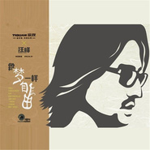

像梦一样自由
============================

|  |  |
| :--: | :-- |
| [ 像梦一样自由](https://emumo.xiami.com/album/432313) | **艺人**: [汪峰](../index.md) **语种**: 国语 **唱片公司**: 大国文化 **发行时间**: 2011年03月23日 **专辑类别**: EP, 单曲 **专辑风格**: 摇滚 Rock & Roll, 华语唱作人 Chinese Singer-Songwriter **播放数**: 3320549 **收藏数**: 2012 **评论数**: 265  |

## 简介

2011年伊始，汪峰携手某品牌推出新单曲《像梦一样自由》，这首歌表达出经历过后渴望追求自由的勇敢态度，3月22日这首新歌正式首播。  
  
《像梦一样自由》延续了汪峰以往作品的一贯风格，大气磅礴，充满了对内心力量的追求。而这首歌的MV创作也展现了汪峰从一个无名的歌手到成为被社会广泛关注的摇滚明星一路的艰辛。  
  
在《像梦想一样自由》MV中，再现了初出茅庐的汪峰和他的乐队一起在酒吧驻唱的往事，虽然那时没有观众，但是他们在舞台上依然激情四溢。为了追寻音乐的梦想，每个年轻的面孔都神采奕奕。然而回归现实中，乐队的团员为了生计一个个离去，汪峰一个人背着吉他孤独地穿梭在城市里。多年后，他拥有了自己的个唱，当聚光灯在黑暗中亮起，身后走来曾经一起奋斗过的好兄弟，他们一起在舞台上激情演唱。MV的故事简单易懂，但是拍摄并非易事。取景贯穿整个北京，从顺义的马场到昌平模拟演唱会现场的录影棚，辗转数个拍摄点；从早晨5点到晚上凌晨1点，由于每天工作满档，汪峰颇显疲态，好在一出现在镜头前他就精力十足。

## 曲目

- [像梦一样自由MV](./432313/U5Agtx27194.md)

## 评论

|  |  |  |
| :-- | :-- | :-- |
|  [虾米用户](https://emumo.xiami.com/u/288328811) 音樂是我前進的動力。 2018-08-02 10:41 赞(0) 踩(0) | 
好听
 |
|  [虾米用户](https://emumo.xiami.com/u/1582817) 若收藏精选集已删除，请用... 2018-04-09 00:10 赞(0) 踩(0) | 
千年老二　那条热评　牛偪啊  可踏马达　乐坏我了　哈。。。
 |
|  [虾米用户](https://emumo.xiami.com/u/290248224)  2018-03-13 17:32 赞(0) 踩(0) | 
请让我们下载
 |
|  [虾米用户](https://emumo.xiami.com/u/324670614) 我还没想好要写什么... 2018-01-09 20:28 赞(0) 踩(0) | 
 
 |
|  [虾米用户](https://emumo.xiami.com/u/3027662)  2017-10-28 00:23 赞(1) 踩(0) | 
2011年伊始，汪峰携手某品牌推出新单曲《像梦一样自由》，这首歌表达出经历过后渴望追求自由的勇敢态度，3月22日这首新歌通过网易娱乐首播
 |
|  [虾米用户](https://emumo.xiami.com/u/1109759)  2017-10-28 00:23 赞(0) 踩(0) | 
像梦一样自由？呵呵。。。模仿痕迹太浓了。
 |
|  [虾米用户](https://emumo.xiami.com/u/14543230)  2017-10-28 00:09 赞(2) 踩(0) | 
2011年伊始，汪峰携手某品牌推出新单曲《像梦一样自由》，这首歌表达出经历过后渴望追求自由的勇敢态度！！
 |
|  [虾米用户](https://emumo.xiami.com/u/290248224)  2017-10-08 13:52 赞(0) 踩(0) | 
内容已删除
 |
| ⇒ |  [虾米用户](https://emumo.xiami.com/u/85630952)  2018-01-05 10:05 赞(0) 踩(0) | 
大国文化的版权虾米没买
 |
|  [虾米用户](https://emumo.xiami.com/u/69273532)  2015-09-25 12:41 赞(0) 踩(0) | 
我每天上许吃完饭一  就听    哈哈一
 |
|  [虾米用户](https://emumo.xiami.com/u/50710248)  2015-06-25 22:07 赞(0) 踩(0) | 
神曲！我喜欢！赞了！
 |
|  [虾米用户](https://emumo.xiami.com/u/4957742) 请不要忽略身边的景色 2015-05-11 10:08 赞(0) 踩(0) | 
好听
 |
|  [虾米用户](https://emumo.xiami.com/u/47551295)  2015-02-24 11:41 赞(0) 踩(0) | 
摇滚大叔的春天里影响了一代人啊~
 |
|  [虾米用户](https://emumo.xiami.com/u/47249176)  2015-02-14 09:31 赞(0) 踩(0) | 
就是喜欢，就是那么任性
 |
|  [虾米用户](https://emumo.xiami.com/u/2111825) 习惯听音乐成为了生活的一... 2014-09-08 17:51 赞(0) 踩(0) | 
还可以，不错~
 |
|  [虾米用户](https://emumo.xiami.com/u/8569124) 爱歌 2014-08-04 00:16 赞(0) 踩(0) | 
单曲
 |
|  [虾米用户](https://emumo.xiami.com/u/10484379) 一花一世界 2014-01-18 18:43 赞(0) 踩(0) | 
good
 |
|  [虾米用户](https://emumo.xiami.com/u/31028219)  2014-01-03 18:08 赞(0) 踩(0) | 
好听
 |
|  [虾米用户](https://emumo.xiami.com/u/29679596)  2013-12-15 22:53 赞(0) 踩(0) | 
喜欢
 |
|  [虾米用户](https://emumo.xiami.com/u/29730028)  2013-12-14 16:09 赞(0) 踩(0) | 
喜欢汪峰
 |
|  [虾米用户](https://emumo.xiami.com/u/29262838)  2013-12-12 22:44 赞(0) 踩(0) | 
vv
 |
|  [虾米用户](https://emumo.xiami.com/u/29584761)  2013-12-12 21:26 赞(0) 踩(0) | 
g
 |
|  [虾米用户](https://emumo.xiami.com/u/22560517)  2013-12-12 11:44 赞(0) 踩(0) | 
好听
 |
|  [虾米用户](https://emumo.xiami.com/u/29450649)  2013-12-11 19:42 赞(0) 踩(0) | 
喜欢歌的名字
 |
|  [虾米用户](https://emumo.xiami.com/u/29361210)  2013-12-10 11:00 赞(0) 踩(0) | 
以为他是我的偶像
 |
|  [虾米用户](https://emumo.xiami.com/u/13057352) be y0urself. 2013-11-25 16:24 赞(0) 踩(0) | 
印象里，那天大上午了我一如往常地在宿舍的床上睡觉，盛哲用他的笔记本开着高音量放歌，朦胧之中听到了这首歌，（那时我还没毕业，说明也就是2011年上半年的事情，而盛哲之前和之后也再没听过汪峰的歌，我想那天应该就是这首歌首发的那段日子吧，所以他才点开听了），这主歌部分，觉得很喜欢，很有感觉，但副歌就不太喜欢了，觉得吼得很空洞，也许是因为第一次听的时候在睡觉被吵到的原因吧。。。。
 |
|  [虾米用户](https://emumo.xiami.com/u/3805479) 我还没想好要写什么... 2013-11-16 16:54 赞(17) 踩(0) | 
“迪伦让答案飘，他让信仰飘；郑钧唱怒放，他唱怒放的生命，郑钧唱幸福的子弹，他唱爱是一颗幸福的子弹；许巍唱像风一样自由，他像梦一样自由，许巍唱完美生活，他是多么完美的生活。。”——难怪汪疯注定只能是上不了头条的千年老二！￣□￣｜｜
 |
| ⇒ |  [虾米用户](https://emumo.xiami.com/u/32111363) 暂无签名~ 2014-08-07 14:06 赞(0) 踩(0) | 
哈哈
 |
| ⇒ |  [虾米用户](https://emumo.xiami.com/u/2211497) ✘貪✔痛 生就孤独 2015-02-17 17:07 赞(0) 踩(0) | 
用倪萍阿姨的口吻深情的....“这孩子说的多好啊......” 大家可以泪奔了。
 |
|  [虾米用户](https://emumo.xiami.com/u/14543230)  2013-11-14 23:04 赞(0) 踩(0) | 
喜欢汪峰的歌，就是从那首《怒放的生命》开始，无法说清第一次听到这首歌时，内心所涌起的振颤和感动，只有一根根健硕的藤在身体中盘旋生长，绿色的枝蔓儿扎疼心中每个脆弱角落，直至双臂张开，翅膀冲上云霄，就象歌词中唱到：我想超越这平凡的生活，我想要怒放的生命，就象飞翔在辽阔天空，就象穿行在无边的旷野，拥有挣脱一切的力量……
 |
| ⇒ |  [虾米用户](https://emumo.xiami.com/u/33255746)  2014-02-25 21:26 赞(0) 踩(0) | 
嗯嗯
 |
|  [虾米用户](https://emumo.xiami.com/u/24082828)  2013-10-11 21:23 赞(0) 踩(0) | 
就是喜欢
 |
|  [虾米用户](https://emumo.xiami.com/u/24021653)  2013-10-09 09:01 赞(0) 踩(0) | 
有激情
 |
|  [虾米用户](https://emumo.xiami.com/u/23971563)  2013-10-08 15:24 赞(0) 踩(0) | 
好听
 |
|  [虾米用户](https://emumo.xiami.com/u/9218030) 只愿你此生快乐！ 2013-10-08 12:26 赞(0) 踩(0) | 
这哥们真是太有才了
 |
|  [虾米用户](https://emumo.xiami.com/u/23934203)  2013-10-07 23:27 赞(0) 踩(0) | 
bjj
 |
|  [虾米用户](https://emumo.xiami.com/u/2537972)   2013-10-06 17:08 赞(0) 踩(0) | 
粗犷的声音  激发了内心的梦想
 |
|  [虾米用户](https://emumo.xiami.com/u/20745786)   2013-10-05 16:08 赞(0) 踩(0) | 
好听
 |
|  [虾米用户](https://emumo.xiami.com/u/21476861)  2013-10-02 17:27 赞(0) 踩(0) | 
粗旷中有感动，很有力量
 |
|  [虾米用户](https://emumo.xiami.com/u/23477763)  2013-10-01 20:17 赞(0) 踩(0) | 
/&amp;lt;.
 |
|  [虾米用户](https://emumo.xiami.com/u/23400726)  2013-09-30 20:03 赞(0) 踩(0) | 
bnvdtvu
 |
|  [虾米用户](https://emumo.xiami.com/u/21231955)  2013-09-27 16:21 赞(0) 踩(0) | 
好听
 |
|  [虾米用户](https://emumo.xiami.com/u/23141313)  2013-09-27 14:24 赞(0) 踩(0) | 
我就是喜欢汪峰
 |
|  [虾米用户](https://emumo.xiami.com/u/23061438)  2013-09-26 14:30 赞(0) 踩(0) | 
希望像梦一样自由
 |
|  [虾米用户](https://emumo.xiami.com/u/22912962)  2013-09-24 21:59 赞(0) 踩(0) | 
歌曲有内涵
 |
|  [虾米用户](https://emumo.xiami.com/u/22525632)  2013-09-23 17:07 赞(0) 踩(0) | 
很喜欢汪峰的声音
 |
|  [虾米用户](https://emumo.xiami.com/u/22098426)  2013-09-22 16:05 赞(0) 踩(0) | 
力量
 |
|  [虾米用户](https://emumo.xiami.com/u/22619931)  2013-09-21 21:02 赞(0) 踩(0) | 
jljljh
 |
|  [虾米用户](https://emumo.xiami.com/u/22582795)  2013-09-21 14:39 赞(0) 踩(0) | 
haoting
 |
|  [虾米用户](https://emumo.xiami.com/u/22443694)  2013-09-20 00:43 赞(0) 踩(0) | 
好。
 |
|  [虾米用户](https://emumo.xiami.com/u/21898769)  2013-09-17 23:03 赞(0) 踩(0) | 
好听
 |
|  [虾米用户](https://emumo.xiami.com/u/14942357)  2013-09-15 19:20 赞(0) 踩(0) | 
有点感觉的！
 |
|  [虾米用户](https://emumo.xiami.com/u/21977370)  2013-09-14 20:35 赞(0) 踩(0) | 
...
 |
|  [虾米用户](https://emumo.xiami.com/u/21804198)  2013-09-12 20:53 赞(0) 踩(0) | 
很有感情
 |
|  [虾米用户](https://emumo.xiami.com/u/21615247)  2013-09-10 13:47 赞(0) 踩(0) | 
haoting
 |
|  [虾米用户](https://emumo.xiami.com/u/21390878)  2013-09-07 17:41 赞(0) 踩(0) | 
歌好听
 |
|  [虾米用户](https://emumo.xiami.com/u/21336343)  2013-09-06 23:41 赞(0) 踩(0) | 
好听
 |
| ⇒ |  [虾米用户](https://emumo.xiami.com/u/69273532)  2015-09-25 12:43 赞(0) 踩(0) | 
真好听，哎呀我也想唱这么好听的歌。
 |
|  [虾米用户](https://emumo.xiami.com/u/21326929)  2013-09-06 22:00 赞(0) 踩(0) | 
好听
 |
|  [虾米用户](https://emumo.xiami.com/u/20936057)  2013-09-02 13:29 赞(0) 踩(0) | 
zy
 |
|  [虾米用户](https://emumo.xiami.com/u/20797234)  2013-08-31 20:34 赞(0) 踩(0) | 
rock
 |
|  [虾米用户](https://emumo.xiami.com/u/20762627) 欧文 2013-08-31 14:02 赞(0) 踩(0) | 
汪峰
 |
| ⇒ |  [虾米用户](https://emumo.xiami.com/u/69273532)  2015-09-25 12:44 赞(0) 踩(0) | 
汪峰唱的好。
 |
|  [虾米用户](https://emumo.xiami.com/u/20452)  2013-08-30 12:57 赞(0) 踩(0) | 
像梦一样自由,
 |
|  [虾米用户](https://emumo.xiami.com/u/20653786)  2013-08-30 10:21 赞(0) 踩(0) | 
就是喜欢汪峰的歌
 |
|  [虾米用户](https://emumo.xiami.com/u/20495051)  2013-08-28 13:45 赞(0) 踩(0) | 
.....
 |
|  [虾米用户](https://emumo.xiami.com/u/20450071)  2013-08-27 21:59 赞(0) 踩(0) | 
好听
 |
|  [虾米用户](https://emumo.xiami.com/u/20426551)  2013-08-27 18:11 赞(0) 踩(0) | 
喜欢汪峰的歌
 |
|  [虾米用户](https://emumo.xiami.com/u/20219612) 王佳薇 2013-08-25 14:21 赞(0) 踩(0) | 
因为我喜欢摇滚呗！
 |
|  [虾米用户](https://emumo.xiami.com/u/20219612) 王佳薇 2013-08-25 14:19 赞(0) 踩(0) | 
太劲爆了！Great!
 |
|  [虾米用户](https://emumo.xiami.com/u/19874664)  2013-08-21 14:48 赞(0) 踩(0) | 
歌词好。意思好。
 |
|  [虾米用户](https://emumo.xiami.com/u/9063238)  2013-08-13 17:15 赞(0) 踩(0) | 
自由自由。。。。
 |
|  [虾米用户](https://emumo.xiami.com/u/1577874) 我还没想好要写什么... 2013-06-10 00:22 赞(1) 踩(0) | 
若能像梦一样自由就好了
 |
|  [虾米用户](https://emumo.xiami.com/u/7345510) 我真的喜欢吃虾 2013-05-28 10:57 赞(0) 踩(0) | 
虽然还是和以前一样，但跟以前一样就很好。那些听着他的歌不知道是思考还是发呆的夜晚，非常美好！
 |
|  [虾米用户](https://emumo.xiami.com/u/7248454) 我还没想好要写什么... 2013-05-16 10:06 赞(0) 踩(0) | 
汪峰江郎才尽了吗？第一耳听上去就是以前某首歌..
 |
|  [虾米用户](https://emumo.xiami.com/u/9702468)  2013-05-11 20:00 赞(0) 踩(0) | 
这个声音里面有记忆的影子
 |
|  [虾米用户](https://emumo.xiami.com/u/6717745) 不 要 告 别 2013-05-04 15:31 赞(0) 踩(0) | 
@许巍
 |
|  [虾米用户](https://emumo.xiami.com/u/13727604)  2013-03-29 15:06 赞(0) 踩(0) | 
汪峰的歌总是哪么有人文思想，非常喜欢！
 |
|  [虾米用户](https://emumo.xiami.com/u/12889711) guardlv 2013-02-05 14:47 赞(0) 踩(0) | 
振奋
 |
|  [虾米用户](https://emumo.xiami.com/u/2247512) 我还没想好要写什么... 2013-02-02 00:54 赞(0) 踩(0) | 
生无所求 居然被baidu给代理了，坑爹啊。
 |
|  [虾米用户](https://emumo.xiami.com/u/11286128)  2013-01-07 22:42 赞(0) 踩(0) | 
汪老师…………
 |
|  [虾米用户](https://emumo.xiami.com/u/11881956)  2012-12-12 13:22 赞(0) 踩(0) | 
汪峰是一种精神
 |
|  [虾米用户](https://emumo.xiami.com/u/9925451) 我生来就是要死亡的 2012-12-08 18:06 赞(19) 踩(0) | 
真心觉得 封面上的字体 很难看
 |
| ⇒ |  [虾米用户](https://emumo.xiami.com/u/13569169) 远山近水 烟雨凄迷 2013-08-16 18:55 赞(0) 踩(0) | 
那就是表示自己
 |
| ⇒ |  [虾米用户](https://emumo.xiami.com/u/13569169) 远山近水 烟雨凄迷 2013-08-16 18:55 赞(0) 踩(0) | 
自由
 |
| ⇒ |  [虾米用户](https://emumo.xiami.com/u/437696)  2013-09-08 20:14 赞(0) 踩(0) | 
是畢卡索式的寫法
 |
| ⇒ |  [虾米用户](https://emumo.xiami.com/u/2211497) ✘貪✔痛 生就孤独 2015-02-17 17:05 赞(0) 踩(0) | 
确实....
 |
|  [虾米用户](https://emumo.xiami.com/u/11611979)  2012-11-30 21:11 赞(0) 踩(0) | 
因为喜欢
 |
|  [虾米用户](https://emumo.xiami.com/u/10656091) 音乐音乐 2012-11-23 12:32 赞(0) 踩(0) | 
当我想你的时候...
 |
|  [虾米用户](https://emumo.xiami.com/u/9454396) 被全世界拋棄。 2012-11-16 19:51 赞(0) 踩(0) | 
想听存在
 |
|  [虾米用户](https://emumo.xiami.com/u/6171804) 为何你总笑个没够 2012-11-15 05:19 赞(0) 踩(0) | 
生无所求 怎么不传？
 |
|  [虾米用户](https://emumo.xiami.com/u/11100568) 石头一枚 2012-11-13 21:48 赞(0) 踩(0) | 
喜欢
 |
|  [虾米用户](https://emumo.xiami.com/u/11325854)  2012-11-08 16:48 赞(0) 踩(0) | 
人活着就要像梦一样自由
 |
|  [虾米用户](https://emumo.xiami.com/u/11321540)  2012-11-02 21:57 赞(0) 踩(0) | 
喜欢人文的东西
 |
|  [虾米用户](https://emumo.xiami.com/u/3662689) 暂无签名~ 2012-10-19 15:34 赞(0) 踩(0) | 
有感觉
 |
|  [虾米用户](https://emumo.xiami.com/u/1895288) 我还没想好要写什么... 2012-10-10 15:45 赞(0) 踩(0) | 
没有怒放的生命那么直指人心了。
 |
|  [虾米用户](https://emumo.xiami.com/u/1895288) 我还没想好要写什么... 2012-10-10 15:45 赞(0) 踩(0) | 
没有怒放的生命那么直指人心了。
 |
|  [虾米用户](https://emumo.xiami.com/u/5806141)  2012-10-01 23:48 赞(0) 踩(0) | 
可以别再复制 飞得更高了吗
 |
|  [虾米用户](https://emumo.xiami.com/u/1900784)  2012-09-29 04:13 赞(0) 踩(0) | 
你是否还会牵挂我
 |
|  [虾米用户](https://emumo.xiami.com/u/10645085) Chris 2012-09-23 00:04 赞(0) 踩(0) | 
enjoyedit
 |
|  [虾米用户](https://emumo.xiami.com/u/821)  2012-09-16 15:51 赞(0) 踩(0) | 
我怎么听出许巍味儿了？
 |
|  [虾米用户](https://emumo.xiami.com/u/10634044) 摇滚能带来震撼 2012-09-16 10:36 赞(0) 踩(0) | 
必须支持,唱出了80后的心情
 |
|  [虾米用户](https://emumo.xiami.com/u/10588484)  2012-09-13 15:52 赞(0) 踩(0) | 
汪峰的不需要理由
 |
|  [虾米用户](https://emumo.xiami.com/u/10570092)  2012-09-11 13:57 赞(0) 踩(0) | 
豪放 野
 |
|  [虾米用户](https://emumo.xiami.com/u/7442338)   2012-09-08 13:39 赞(0) 踩(0) | 
喜欢！
 |
|  [虾米用户](https://emumo.xiami.com/u/1704890)  2012-09-05 21:51 赞(0) 踩(0) | 
汪峰的歌就是喜欢，他能给予年轻人奋进的力量！！
 |
|  [虾米用户](https://emumo.xiami.com/u/2160605) 醉了 2012-09-03 23:06 赞(0) 踩(0) | 
好听，好听，好听！
 |
|  [虾米用户](https://emumo.xiami.com/u/6105675) 我还没想好要写什么... 2012-08-28 13:43 赞(0) 踩(0) | 
给力
 |
|  [虾米用户](https://emumo.xiami.com/u/2954570)  2012-08-24 01:07 赞(0) 踩(0) | 
像梦一样自由的坚持自己的音乐
 |
|  [虾米用户](https://emumo.xiami.com/u/4359736) i-DJ 2012-08-20 18:51 赞(0) 踩(0) | 
为什么专辑封面是“象”梦一样自由？
 |
|  [虾米用户](https://emumo.xiami.com/u/7280980)  2012-08-19 11:40 赞(0) 踩(0) | 
像风一样自由
 |
|  [虾米用户](https://emumo.xiami.com/u/7549769) 网易和咪咕用户名一样，都... 2012-08-03 13:48 赞(0) 踩(0) | 
有一种荒凉的沧桑感，低沉却不乏能量，很真诚很有力量的歌！
 |
|  [虾米用户](https://emumo.xiami.com/u/7839247)  2012-07-24 10:04 赞(0) 踩(0) | 
向往自由，心灵的自由
 |
|  [虾米用户](https://emumo.xiami.com/u/3693518)  2012-07-13 16:33 赞(7) 踩(0) | 
汪同学不是同学，其实是个老师，总是在歌里贴一点口水的标签，比如什么自由、灵魂、爱，这些又大又空的的标签；这群标签又总是和坚持、努力这些苦大仇深、物是人非的励志经历有关。其实，有点像旭日阳刚的升级版，长发，戴眼镜，不再干建筑，有点高中思想政治老师的味道。
 |
|  [虾米用户](https://emumo.xiami.com/u/7150947)  2012-07-04 15:15 赞(0) 踩(0) | 
爱这个男人！！！！！！！！！！！
 |
|  [虾米用户](https://emumo.xiami.com/u/5103125)  2012-06-13 10:46 赞(0) 踩(0) | 
汪峰
 |
|  [虾米用户](https://emumo.xiami.com/u/2756435)  2012-05-16 15:29 赞(0) 踩(0) | 
少有的有思想的歌手
 |
|  [虾米用户](https://emumo.xiami.com/u/2139331)  2012-05-09 21:17 赞(0) 踩(0) | 
好听~
 |
|  [虾米用户](https://emumo.xiami.com/u/4034514)  2012-04-20 14:39 赞(0) 踩(0) | 
给我半岁女儿的寄语：像梦一样自由，像天空一样坚强，像大地一样宽容，在这曲折蜿蜒的路上 体验生命的意义 点亮生命的光芒
 |
|  [虾米用户](https://emumo.xiami.com/u/8097695)  2012-04-19 22:45 赞(0) 踩(0) | 
汪峰的歌 很男人啊
 |
|  [虾米用户](https://emumo.xiami.com/u/3630409)   2012-04-08 16:11 赞(0) 踩(0) | 
一个无名的歌手在酒吧驻唱的往事，虽然那时没有观众，但是他们在舞台上依然激情四溢。为了梦想，年轻的面孔都神采奕奕。回归现实中，乐队的团员为了生计一个个离去，汪峰一个人背着吉他孤独地穿梭在城市里。多年后当聚光灯在黑暗中亮起，身后走来曾经一起奋斗过的好兄弟，他们一起在舞台上激情演唱。
 |
|  [虾米用户](https://emumo.xiami.com/u/5482841)  2012-04-05 08:51 赞(0) 踩(0) | 
嘶哑的一声~感受到的自由！
 |
|  [虾米用户](https://emumo.xiami.com/u/8536268)  2012-04-01 16:32 赞(0) 踩(0) | 
有梦
 |
|  [虾米用户](https://emumo.xiami.com/u/8510605)  2012-03-28 10:34 赞(0) 踩(0) | 
我喜歡汪峰的歌，有一次偶而聽到之後，就每天要聽一下才行!希望他能到台灣來發片，讓國語歌曲能返璞歸真一下!!!
 |
| ⇒ |  [虾米用户](https://emumo.xiami.com/u/9045153)  2012-05-01 17:16 赞(0) 踩(0) | 
汪峰在2000年时发了1张花火台湾版不知道你那里能不能买到
 |
|  [虾米用户](https://emumo.xiami.com/u/8268350)  2012-03-20 01:58 赞(0) 踩(0) | 
无语
 |
|  [虾米用户](https://emumo.xiami.com/u/5769414)  2012-03-20 01:03 赞(0) 踩(0) | 
生命的张力！
 |
|  [虾米用户](https://emumo.xiami.com/u/6332770)  2012-03-10 15:30 赞(0) 踩(0) | 
不错的歌
 |
|  [虾米用户](https://emumo.xiami.com/u/8326021)  2012-03-06 23:47 赞(0) 踩(0) | 
挥挥手，我的最爱！
 |
|  [虾米用户](https://emumo.xiami.com/u/8256608)  2012-03-02 14:15 赞(0) 踩(0) | 
像梦一样自由
 |
|  [虾米用户](https://emumo.xiami.com/u/4288059) ……々 2012-02-29 16:36 赞(0) 踩(0) | 
每首歌都那么有力……々
 |
|  [虾米用户](https://emumo.xiami.com/u/5385994)  2012-02-25 10:03 赞(0) 踩(0) | 
喜欢被感动
 |
|  [虾米用户](https://emumo.xiami.com/u/6441483)  2012-02-23 10:34 赞(0) 踩(0) | 
非常给力！天才
 |
|  [虾米用户](https://emumo.xiami.com/u/6357969)  2012-02-22 23:09 赞(0) 踩(0) | 
好听得不得了。。。
 |
|  [虾米用户](https://emumo.xiami.com/u/402655)  2012-02-21 11:01 赞(0) 踩(0) | 
就是喜欢这种感觉。。。
 |
|  [虾米用户](https://emumo.xiami.com/u/402655)  2012-02-21 11:00 赞(0) 踩(0) | 
喜欢
 |
|  [虾米用户](https://emumo.xiami.com/u/4879371)  2012-02-11 08:34 赞(0) 踩(0) | 
好歌
 |
|  [虾米用户](https://emumo.xiami.com/u/364391) Moral Peanut 2012-01-16 22:11 赞(0) 踩(0) | 
新专辑怎么没了？？？
 |
| ⇒ |  [虾米用户](https://emumo.xiami.com/u/1489937)  2012-02-08 13:03 赞(0) 踩(0) | 
因版权问题，被删了
 |
| ⇒ |  [虾米用户](https://emumo.xiami.com/u/364391) Moral Peanut 2012-02-08 19:13 赞(0) 踩(0) | 
<q><b>安全地带说：</b></q>
 |
|  [虾米用户](https://emumo.xiami.com/u/6480584)  2012-01-10 21:41 赞(0) 踩(0) | 
喜欢汪峰的歌曲，体验梦想与奋斗的快乐
 |
|  [虾米用户](https://emumo.xiami.com/u/5429133)  2012-01-04 15:24 赞(0) 踩(0) | 
唱片封面比歌好 1
 |
|  [虾米用户](https://emumo.xiami.com/u/7487047)  2011-12-31 18:12 赞(0) 踩(0) | 
ONLYLOVE
 |
|  [虾米用户](https://emumo.xiami.com/u/3217845)  2011-12-31 17:40 赞(0) 踩(0) | 
有时候一个人听汪峰的歌，会被感动的哭。
 |
| ⇒ |  [虾米用户](https://emumo.xiami.com/u/2846661)  2013-02-06 15:21 赞(0) 踩(0) | 
真的呀，同感
 |
|  [虾米用户](https://emumo.xiami.com/u/2715679)  2011-12-29 20:36 赞(0) 踩(0) | 
心声的呐喊！支持原创
 |
|  [虾米用户](https://emumo.xiami.com/u/1885853)  2011-12-27 23:07 赞(0) 踩(0) | 
歌声保持了一贯的风格，力量和情绪表达直接
 |
|  [虾米用户](https://emumo.xiami.com/u/5748151)  2011-12-27 14:12 赞(0) 踩(0) | 
好听
 |
|  [虾米用户](https://emumo.xiami.com/u/6915951)  2011-12-26 15:26 赞(0) 踩(0) | 
歌声迷人
 |
|  [虾米用户](https://emumo.xiami.com/u/7028941)  2011-12-19 11:34 赞(0) 踩(0) | 
aaaaaaaaaa
 |
|  [虾米用户](https://emumo.xiami.com/u/7079058)  2011-12-07 09:18 赞(0) 踩(0) | 
像梦一样自由
 |
|  [虾米用户](https://emumo.xiami.com/u/3213073)  2011-11-25 22:32 赞(0) 踩(0) | 
我记得汪峰有一首《明天》也很好听的！一开始是炮弹的声音。那首歌的感觉就像在安慰战争里的无辜的孩子。可我现在老找不出来！
 |
|  [虾米用户](https://emumo.xiami.com/u/5558169) gute nacht 2011-11-18 01:09 赞(0) 踩(0) | 
好听
 |
|  [虾米用户](https://emumo.xiami.com/u/205812)  2011-11-17 20:15 赞(0) 踩(0) | 
依然的力量
 |
|  [虾米用户](https://emumo.xiami.com/u/593470)   2011-11-16 07:44 赞(0) 踩(0) | 
我要向像梦一样自由！像大地一样宽容，在这艰辛放逐的路上，点亮生命的光芒！
 |
|  [虾米用户](https://emumo.xiami.com/u/4727979)  2011-11-10 02:17 赞(0) 踩(0) | 
哇哇
 |
|  [虾米用户](https://emumo.xiami.com/u/6568054)  2011-11-03 19:11 赞(0) 踩(0) | 
喜欢汪峰   喜欢他那苍凉有力的感觉
 |
|  [虾米用户](https://emumo.xiami.com/u/1212114)  2011-11-02 17:01 赞(0) 踩(0) | 
半路搭上，一直跟随
 |
|  [虾米用户](https://emumo.xiami.com/u/299617) 浮云一别后，流水十年间 2011-10-30 00:34 赞(0) 踩(0) | 
在艰辛放逐的路上...点亮生命的光芒.... 曲子重要吗？我觉得重要 但更重要的还是那种随着歌声和音乐点燃的坚定 小宇宙，爆发吧！哈哈哈.... 汪峰有种与生俱来的悲悯，与生俱来的使命感，从他许多歌词里我看得出来，也许有人像楼上所说的评价他“可能跟汪锋每次都唱得高潮迭起有关系吧”，没错，如果自己都麻木都忘记了感动，还怎么感动别人？跟那些跟AV女优一样可着劲儿叫唤可着劲儿呻吟可着劲儿死去活来的爱着的情歌相比，还是这个给力些。 听这汪峰唱歌，十年了吧....美丽世界的孤儿....
 |
|  [虾米用户](https://emumo.xiami.com/u/916704) Dad of Two 2011-10-29 00:32 赞(0) 踩(0) | 
Good first impression...
 |
|  [虾米用户](https://emumo.xiami.com/u/6426040)  2011-10-26 14:59 赞(0) 踩(0) | 
象风一样自由
 |
|  [虾米用户](https://emumo.xiami.com/u/6432889)  2011-10-25 22:32 赞(0) 踩(0) | 
喜欢，用理由吗
 |
|  [虾米用户](https://emumo.xiami.com/u/4853942) 混听 2011-10-19 16:58 赞(0) 踩(0) | 
怎么觉得里边有段调子跟王力宏的那首“摇滚怎么了”里边的What\'s wrong with me......好像地。。。
 |
|  [虾米用户](https://emumo.xiami.com/u/6215042) 欢迎关注同名音乐公众号 2011-10-19 02:45 赞(0) 踩(0) | 
普通，像是在对付
 |
|  [虾米用户](https://emumo.xiami.com/u/3044235) 东方道悟 2011-10-18 17:54 赞(0) 踩(0) | 
振奋。歌词感同身受很强。喜欢。
 |
|  [虾米用户](https://emumo.xiami.com/u/997386)  2011-10-12 01:31 赞(0) 踩(0) | 
一伸手就能摸到理想，像梦一样自由！！
 |
|  [虾米用户](https://emumo.xiami.com/u/5637906)  2011-10-10 16:02 赞(0) 踩(0) | 
汪峰，不解释
 |
|  [虾米用户](https://emumo.xiami.com/u/425324)  2011-09-25 18:49 赞(0) 踩(0) | 
再多一些像《哭泣的拳头》那种硬一点的歌就好了。。。
 |
|  [虾米用户](https://emumo.xiami.com/u/5778046)  2011-09-24 13:12 赞(0) 踩(0) | 
汪锋的歌词总是这么赤裸裸的猛贴这种标签，比如自由，这其实挺不好的。可自己总还是吃这一套。可能跟汪锋每次都唱得高潮迭起有关系吧。
 |
|  [虾米用户](https://emumo.xiami.com/u/5785154)  2011-09-11 15:12 赞(0) 踩(0) | 
爱上自由
 |
|  [虾米用户](https://emumo.xiami.com/u/5556493)  2011-08-24 16:58 赞(0) 踩(0) | 
没理由的喜欢
 |
|  [虾米用户](https://emumo.xiami.com/u/2070177)  2011-08-19 18:59 赞(0) 踩(0) | 
总是能写出触动人灵魂的歌曲，赞！
 |
|  [虾米用户](https://emumo.xiami.com/u/2072061)  2011-07-21 19:17 赞(0) 踩(0) | 
汪峰
 |
|  [虾米用户](https://emumo.xiami.com/u/19874) 暂无签名~ 2011-07-21 14:50 赞(0) 踩(0) | 
幸好有汪峰的歌！
 |
|  [虾米用户](https://emumo.xiami.com/u/4855774) 笑嘻嘻 2011-07-17 18:03 赞(0) 踩(0) | 
\\(^o^)/~
 |
|  [虾米用户](https://emumo.xiami.com/u/4855774) 笑嘻嘻 2011-07-17 17:58 赞(0) 踩(0) | 
喜欢
 |
|  [虾米用户](https://emumo.xiami.com/u/3255139)  2011-07-16 00:33 赞(0) 踩(0) | 
感觉
 |
|  [虾米用户](https://emumo.xiami.com/u/3255139)  2011-07-16 00:31 赞(0) 踩(0) | 
感觉
 |
|  [虾米用户](https://emumo.xiami.com/u/4770309)  2011-07-07 23:10 赞(0) 踩(0) | 
像梦一样自由：你是否还会牵挂我 我最亲爱的朋友啊 当我决定放下所有 走上去自由的路 你是否还会陪着我 我最思念的亲人啊 好感触啊··········
 |
|  [虾米用户](https://emumo.xiami.com/u/928544)  2011-07-01 13:19 赞(0) 踩(0) | 
真他妈，太棒了！
 |
|  [虾米用户](https://emumo.xiami.com/u/4483495)  2011-06-29 18:13 赞(0) 踩(0) | 
没啥,就是喜欢.
 |
|  [虾米用户](https://emumo.xiami.com/u/4473198)  2011-06-28 20:02 赞(0) 踩(0) | 
我喜欢
 |
|  [虾米用户](https://emumo.xiami.com/u/4448494)  2011-06-26 20:55 赞(0) 踩(0) | 
节奏很棒
 |
|  [虾米用户](https://emumo.xiami.com/u/1041965)  2011-06-26 14:30 赞(0) 踩(0) | 
有种说不出的感动，徘徊在心中，久久不散
 |
|  [虾米用户](https://emumo.xiami.com/u/1378516)  2011-06-21 10:14 赞(0) 踩(0) | 
那几首歌，男人的味道
 |
|  [虾米用户](https://emumo.xiami.com/u/4347428)  2011-06-19 19:55 赞(0) 踩(0) | 
做了一个像梦一样自由的梦
 |
|  [虾米用户](https://emumo.xiami.com/u/4347428)  2011-06-19 19:52 赞(0) 踩(0) | 
做了一个像梦一样自由的梦
 |
|  [虾米用户](https://emumo.xiami.com/u/4291697) 完蛋的玩意 2011-06-14 20:39 赞(0) 踩(0) | 
一首歌也也是专辑吗
 |
|  [虾米用户](https://emumo.xiami.com/u/3496970)  2011-06-11 12:29 赞(0) 踩(0) | 
音乐有种熟悉的感觉。。。不过我还是一如既往的支持！
 |
|  [虾米用户](https://emumo.xiami.com/u/82118)  2011-06-02 09:35 赞(0) 踩(0) | 
依旧的汪氏风格，但是现实中的我们做不到像风一样自由，更做不到像梦一样自由~~
 |
|  [虾米用户](https://emumo.xiami.com/u/1769488)  2011-06-01 20:58 赞(0) 踩(0) | 
我想像梦一样自由
 |
|  [虾米用户](https://emumo.xiami.com/u/353950)  2011-05-26 18:47 赞(0) 踩(0) | 
新歌一如既往的给力
 |
|  [虾米用户](https://emumo.xiami.com/u/3489123)  2011-05-22 21:46 赞(0) 踩(0) | 
怎么听着这首歌曲好像有好多《怒放》调子和影子呀。。。希望能听到更更好好从曲到词的升级。汪峰加油。。
 |
|  [虾米用户](https://emumo.xiami.com/u/4012268)  2011-05-21 14:22 赞(0) 踩(0) | 
就是喜欢
 |
|  [虾米用户](https://emumo.xiami.com/u/3912790)  2011-05-13 21:39 赞(0) 踩(0) | 
没什么
 |
|  [虾米用户](https://emumo.xiami.com/u/3829496)  2011-05-09 11:11 赞(0) 踩(0) | 
喜欢
 |
|  [虾米用户](https://emumo.xiami.com/u/3745954)  2011-05-08 20:13 赞(0) 踩(0) | 
这专集只有一首歌么？唐朝整一新的也只有两首歌，哎，汪峰这实在说不上新的特别的感觉，升级真是难啊
 |
| ⇒ |  [虾米用户](https://emumo.xiami.com/u/631600)  2011-05-14 13:18 赞(0) 踩(0) | 
大哥，这个不是单曲嘛~~
 |
| ⇒ |  [虾米用户](https://emumo.xiami.com/u/19874) 暂无签名~ 2011-07-21 15:07 赞(0) 踩(0) | 
这是广告歌！
 |
|  [虾米用户](https://emumo.xiami.com/u/543647)  2011-05-08 10:24 赞(0) 踩(0) | 
难听
 |
|  [虾米用户](https://emumo.xiami.com/u/1481896)  2011-05-01 09:44 赞(0) 踩(0) | 
一个青春的梦想那是长大，成熟的分娩。却也是世故，老去的宿命。好吧，我们不能一直期望汪峰在唱，“现实是个牢笼，我像一只小鸟”我想也不会再遇到那个他说“别哭，我亲爱的人，我想我们会一起死去”的女孩。以前的以前对汪峰来说就是失望，为了生活，梦想，继续坚持下去，需要勇气和代价。终于一天，我们都会老去，当他拥着女儿轻轻哼着歌的时候，是否会想到 孩子，我们都一样生来孤独。 幸好，我们还有一点点时间来回忆。 这是一个美丽的结局，没有危险，没有恐惧。
 |
|  [虾米用户](https://emumo.xiami.com/u/3335407)  2011-04-27 20:27 赞(0) 踩(0) | 
汪峰现在的创作都趋同一个调
 |
|  [虾米用户](https://emumo.xiami.com/u/3719585)  2011-04-27 19:08 赞(0) 踩(0) | 
无杂念~~
 |
|  [虾米用户](https://emumo.xiami.com/u/1392150)  2011-04-21 20:21 赞(0) 踩(0) | 
love
 |
|  [虾米用户](https://emumo.xiami.com/u/3360608)  2011-04-19 00:57 赞(0) 踩(0) | 
支持这位大叔
 |
|  [虾米用户](https://emumo.xiami.com/u/3083426)  2011-04-17 21:21 赞(0) 踩(0) | 
这种歌就是给那些臭傻子听的，火花以前的汪峰很TM来劲。。现在就是老而不死，和那些2B歌手没啥两样
 |
| ⇒ |  [虾米用户](https://emumo.xiami.com/u/19874) 暂无签名~ 2011-07-21 14:55 赞(0) 踩(0) | 
就是有你这样的3炮，严重阻碍摇滚在中国的发展！
 |
| ⇒ |  [虾米用户](https://emumo.xiami.com/u/496836)  2011-08-30 22:01 赞(0) 踩(0) | 
太激动了吧，心情我懂的，但是人都是会成熟的，不是吗？你看看许巍，你看看窦唯，你再看看张楚，再看看何勇，毕竟老汪现在还站着唱歌呢。
 |
|  [虾米用户](https://emumo.xiami.com/u/2263626)  2011-04-16 18:42 赞(0) 踩(0) | 
喜欢汪峰，就是喜欢，单纯的喜欢
 |
|  [虾米用户](https://emumo.xiami.com/u/576868)  2011-04-11 16:48 赞(0) 踩(0) | 
无共鸣啊……感觉不给力。难道是因为“携手某品牌”的原因？
 |
|  [虾米用户](https://emumo.xiami.com/u/464570) 多少人活着却如同死猪 2011-04-09 17:08 赞(0) 踩(0) | 
当听到“体验生命的意义”时，之前被点燃的激情被彻底浇灭。
 |
| ⇒ |  [虾米用户](https://emumo.xiami.com/u/1247491)  2011-04-12 13:09 赞(0) 踩(0) | 
同感
 |
|  [虾米用户](https://emumo.xiami.com/u/3531737)  2011-04-09 00:35 赞(0) 踩(0) | 
好歌
 |
|  [虾米用户](https://emumo.xiami.com/u/3506829)  2011-04-06 22:38 赞(0) 踩(0) | 
呼啦啦，
 |
|  [虾米用户](https://emumo.xiami.com/u/1038459)  2011-04-06 20:02 赞(0) 踩(0) | 
曲调缺乏突破力，整体普通
 |
|  [虾米用户](https://emumo.xiami.com/u/3337034)  2011-04-06 09:55 赞(0) 踩(0) | 
喜欢汪峰
 |
|  [虾米用户](https://emumo.xiami.com/u/1526411)  2011-04-06 09:33 赞(0) 踩(0) | 
梦不自由~
 |
|  [虾米用户](https://emumo.xiami.com/u/3475461)  2011-04-04 13:53 赞(0) 踩(0) | 
这词太水。
 |
|  [虾米用户](https://emumo.xiami.com/u/3471403)  2011-04-04 11:21 赞(0) 踩(0) | 
让人非常神往！
 |
|  [虾米用户](https://emumo.xiami.com/u/2766778) 在路上 2011-04-03 11:17 赞(0) 踩(0) | 
喜欢汪峰
 |
|  [虾米用户](https://emumo.xiami.com/u/5218) 朴实无华,健康快乐 2011-04-02 10:12 赞(0) 踩(0) | 
自由，多么奢侈的字眼。
 |
|  [虾米用户](https://emumo.xiami.com/u/372102)  2011-04-01 22:35 赞(0) 踩(0) | 
江峰的歌很喜欢呐~
 |
|  [虾米用户](https://emumo.xiami.com/u/3388674)  2011-04-01 14:31 赞(0) 踩(0) | 
这歌跟，春天里，没什么区别呀，能不能有点变化了，为了赞助，整个歌出来，有点钱了，就玩点艺术吧
 |
|  [虾米用户](https://emumo.xiami.com/u/70068)  2011-04-01 08:48 赞(0) 踩(0) | 
依旧汪峰~~~
 |
|  [虾米用户](https://emumo.xiami.com/u/2624677)  2011-03-31 17:03 赞(0) 踩(0) | 
喜欢，就是喜欢。
 |
|  [虾米用户](https://emumo.xiami.com/u/3376961)  2011-03-31 00:26 赞(0) 踩(0) | 
感染力强，很喜欢。
 |
|  [虾米用户](https://emumo.xiami.com/u/3376961)  2011-03-31 00:25 赞(0) 踩(0) | 
爽 是爷们唱的歌
 |
|  [虾米用户](https://emumo.xiami.com/u/720222)  2011-03-30 13:55 赞(0) 踩(0) | 
曲风还真是老套路，，， 连封套设计都很市场化，而且应该算比较庸俗的设计 没什么体现精髓 贾轶男的编曲到瓶颈了， 老汪应该换主音吉他手了  期待整张新歌的惊喜……
 |
|  [虾米用户](https://emumo.xiami.com/u/3265678)  2011-03-30 01:06 赞(0) 踩(0) | 
广告歌吧？ 完全是标题曲的老路子，不过至少没故意含着痰唱装沧桑
 |
|  [虾米用户](https://emumo.xiami.com/u/1248102)  2011-03-29 22:31 赞(0) 踩(0) | 
副歌部分还不错嘛，毕竟只是首商业歌曲。
 |
|  [虾米用户](https://emumo.xiami.com/u/698996)  2011-03-29 22:24 赞(0) 踩(0) | 
外焦里嫩
 |
|  [虾米用户](https://emumo.xiami.com/u/3045599)  2011-03-29 19:49 赞(0) 踩(0) | 
重复自己 就是吃老本
 |
|  [虾米用户](https://emumo.xiami.com/u/3248473)  2011-03-29 14:46 赞(0) 踩(0) | 
^_^
 |
|  [虾米用户](https://emumo.xiami.com/u/3270223)  2011-03-29 13:47 赞(0) 踩(0) | 
喜欢
 |
|  [虾米用户](https://emumo.xiami.com/u/1602538)  2011-03-29 11:12 赞(0) 踩(0) | 
实话说，这首歌确实在旋律上不怎么样，好像在炒冷饭。  但是不得不说，听着汪峰的声音，就让人感觉到力量。
 |
|  [虾米用户](https://emumo.xiami.com/u/3390896)  2011-03-28 14:57 赞(0) 踩(0) | 
男人
 |
|  [虾米用户](https://emumo.xiami.com/u/2887201)  2011-03-28 08:51 赞(0) 踩(0) | 
有了那么一点柔软的汪峰。
 |
|  [虾米用户](https://emumo.xiami.com/u/3279723)  2011-03-27 22:18 赞(0) 踩(0) | 
个人觉得没有摆脱他一贯的程式。可以说，不错，但是没有超越。
 |
|  [虾米用户](https://emumo.xiami.com/u/745542) 不告而别 2011-03-27 20:46 赞(0) 踩(0) | 
很普通，实话
 |
|  [虾米用户](https://emumo.xiami.com/u/1867582) 自由自在享受音乐 2011-03-26 19:41 赞(0) 踩(0) | 
自由
 |
|  [虾米用户](https://emumo.xiami.com/u/98186)  2011-03-26 16:41 赞(0) 踩(0) | 
汪峰，你也向庸俗化妥协了？
 |
|  [虾米用户](https://emumo.xiami.com/u/362546)  2011-03-26 16:35 赞(0) 踩(0) | 
出好歌不容易
 |
|  [虾米用户](https://emumo.xiami.com/u/2026770)  2011-03-26 13:40 赞(0) 踩(0) | 
虽说是新歌但新意不足，期待感动！
 |
|  [虾米用户](https://emumo.xiami.com/u/1536353)  2011-03-26 11:50 赞(0) 踩(0) | 
哎呦 还不错
 |
|  [虾米用户](https://emumo.xiami.com/u/175731)  2011-03-26 11:23 赞(0) 踩(0) | 
这首歌比想象中来得平凡。
 |
|  [虾米用户](https://emumo.xiami.com/u/463196)   2011-03-25 23:52 赞(0) 踩(0) | 
爱，就是理由
 |
|  [虾米用户](https://emumo.xiami.com/u/3296477)  2011-03-25 23:41 赞(0) 踩(0) | 
雷同感太强了。节奏、旋律、编曲等都太老套路了
 |
| ⇒ |  [虾米用户](https://emumo.xiami.com/u/867185) 羁放纵不爱自由 2011-03-26 23:05 赞(0) 踩(0) | 
+1
 |
| ⇒ |  [虾米用户](https://emumo.xiami.com/u/19874) 暂无签名~ 2011-07-21 14:54 赞(0) 踩(0) | 
我也感觉到了！但.... 也一如既往的好听 是真的！！ 想想也能体谅，一个人写的歌，怎么可能完全不同？
 |
|  [虾米用户](https://emumo.xiami.com/u/3353177)  2011-03-25 21:51 赞(0) 踩(0) | 
听完这首歌有一中热血沸腾的感觉，那是一个行走在路上的歌者，不断前行，对未来无限的期许，我想我们的时代拥有太多虚假的东西，我们不自觉的失去了自我
 |
|  [虾米用户](https://emumo.xiami.com/u/334192) 虾米也能实时聊呀！ 2011-03-25 18:05 赞(0) 踩(0) | 
不好,没新意!
 |
|  [虾米用户](https://emumo.xiami.com/u/1025027) . 2011-03-25 16:45 赞(0) 踩(0) | 
咦?新货?
 |
|  [虾米用户](https://emumo.xiami.com/u/98186)  2011-03-25 16:37 赞(0) 踩(0) | 
第一次离首发这么近！
 |
|  [虾米用户](https://emumo.xiami.com/u/1266272) 人生路，莫慌张。。。 2011-03-25 14:49 赞(0) 踩(0) | 
听听男人的呼唤！、、、
 |
|  [虾米用户](https://emumo.xiami.com/u/2361926)  2011-03-25 12:15 赞(0) 踩(0) | 
支持汪峰。依然是以前的那个他。我要像梦一样自由！
 |
|  [虾米用户](https://emumo.xiami.com/u/2361926)  2011-03-25 12:14 赞(0) 踩(0) | 
新歌当然听听。。。
 |
|  [虾米用户](https://emumo.xiami.com/u/843194)  2011-03-25 11:55 赞(0) 踩(0) | 
年龄渐增了，才开始喜欢他
 |
| ⇒ |  [虾米用户](https://emumo.xiami.com/u/2959537)  2011-03-25 13:56 赞(0) 踩(0) | 
我也是 而且一发不可收拾 陷进去了 每天都想听他的歌 越听越有味 越听越爱听！
 |
|  [虾米用户](https://emumo.xiami.com/u/449459)  2011-03-25 09:56 赞(0) 踩(0) | 
像梦一样自由...
 |
|  [虾米用户](https://emumo.xiami.com/u/3338620)  2011-03-24 20:11 赞(0) 踩(0) | 
没什么
 |
|  [虾米用户](https://emumo.xiami.com/u/2253360)  2011-03-24 18:50 赞(0) 踩(0) | 
力量，自由
 |
|  [虾米用户](https://emumo.xiami.com/u/355865) Let it go, l... 2011-03-24 12:43 赞(0) 踩(0) | 
歌词好了~等发布XD
 |
| ⇒ |  [虾米用户](https://emumo.xiami.com/u/1214465)  2011-03-24 12:49 赞(0) 踩(0) | 
发布好了~等审核XD~~~哈哈
 |
| ⇒ |  [虾米用户](https://emumo.xiami.com/u/355865) Let it go, l... 2011-03-24 12:51 赞(0) 踩(0) | 
<q><b>eddie_free说：</b></q>
 |
| ⇒ |  [虾米用户](https://emumo.xiami.com/u/1214465)  2011-03-24 12:57 赞(0) 踩(0) | 
<q><b>Desperado说：</b></q>
 |
| ⇒ |  [虾米用户](https://emumo.xiami.com/u/355865) Let it go, l... 2011-03-24 13:12 赞(0) 踩(0) | 
<q><b>eddie_free说：</b></q>
 |
