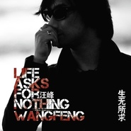

生无所求Life Asks For Nothing
============================

|  |  |
| :--: | :-- |
| [ 生无所求Life Asks For Nothing](https://emumo.xiami.com/album/478379) | **艺人**: [汪峰](../index.md) **语种**: 国语 **唱片公司**: 风华秋实 **发行时间**: 2011年11月16日 **专辑类别**: 录音室专辑 **专辑风格**: 摇滚 Rock & Roll, 华语唱作人 Chinese Singer-Songwriter **播放数**: 11600935 **收藏数**: 3564 **评论数**: 695  |

## 简介

2011.11，重磅推出……  
汪峰 全新创作大碟，2CD精包装，一次性收录26首汪峰新作品  
在音乐创作上，汪峰更无顾忌，用他的清醒、良知和一贯的人文关怀，写变革中的大时代背景音乐。这在华语乐坛是第一次，也是中国摇滚乐史上第一张严格意义上的双专辑。  
  
2011最重量级音乐作品！  
暌违两年，汪峰在近80多首新歌中，反复推敲，用理性来推断感性，筛选出最能表达他现阶段所思所想的26首作品发表。继上一张《信仰在空中飘扬》之后，汪峰借由一首《存在》为新专辑开篇，进入了更内在、更深刻的启发和探讨：在社会巨变的迷惘中，辨别自己生命存在的意义和价值。它不同于简单的生存与生活，更多在于确立内心的归属感。  
  
第一主打【存在】  
是整个创作周期汪峰最后完成的一首作品，也是新专辑的“点题之作”。  
《存在》作为此双张专辑的灵魂，对当下时代、当下中国、当下的中国人，发出了最深切的追问和呼喊！  
第二主打推荐曲之一／【向阳花】  
新专辑第二主打曲《向阳花》，可悠扬可顿挫，用一株向阳花暗语出这个被裹挟前进的时代里，人们对于理想、信念本应有的执着，更用一丛向阳花发出对全体中国人回归本心、唤醒信仰的巨力呼喊。  
第二主打推荐曲之二／【爸爸】  
「不是每个人都有孩子，但每个人都有爸爸。」  
新专辑第二主打曲《爸爸》，看似一首极为私人的作品，却暗含了在这个时代，汪峰对于全体中国人回归温情、探寻良知的巨力呼唤。在思索过“我该如何存在”后，“我该如何去爱”成为了汪峰的再次发问。献给所有父亲的作品，献给所有有父亲的中国人的作品。

## 曲目

- [上千个黎明](./478379/xLvtM6c020f.md)
- [存在MV电视剧《北京青年》片尾曲](./478379/xLvbBjb4f48.md)
- [多么完美的生活](./478379/mQAwur75cb4.md)
- [向阳花](./478379/mQAqOq9d688.md)
- [来不及了](./478379/xLvviT9bc0f.md)
- [不能停止的哭泣](./478379/8GgtX4e1c6d.md)
- [等待](./478379/xLvviVcc0b2.md)
- [爱你的方式](./478379/mQAwuw4fcd2.md)
- [改变](./478379/8GgtX7f3163.md)
- [恩赐之地](./478379/xLvviYda102.md)
- [一百万吨的信念](./478379/xLvtM7ad78c.md)
- [不经意间](./478379/xLvvjaa0d3f.md)
- [再见蒲公英](./478379/8GgtXBf7ca2.md)
- [让我们在一起](./478379/mQAwu27bf49.md)
- [大桥上](./478379/mQAuXY6331d.md)
- [流浪](./478379/b1pToc841ba6.md)
- [爸爸](./478379/xLvpCRced48.md)
- [你不知道](./478379/mQAwu6757f9.md)
- [宝贝 没什么](./478379/bCkEmRl4afff.md)
- [地心](./478379/8GgtXIec9d5.md)
- [抵押灵魂](./478379/8GgtXJe8390.md)
- [我们的爱情](./478379/mQAwuA5b8ed.md)
- [有些事我们永远无法左右](./478379/mQAwuB564bf.md)
- [一瞬间](./478379/xLvvjmd32b4.md)
- [不能接受的事实](./478379/8GgtXNe339c.md)

## 评论

|  |  |  |
| :-- | :-- | :-- |
|  [虾米用户](https://emumo.xiami.com/u/39816876) 全世界不缺你一个 2017-11-17 21:46 赞(2) 踩(0) | 
一次发26首也是需要勇气的 跟现在的歌手久不久发张EP比那简直太厉害了
 |
| ⇒ |  [虾米用户](https://emumo.xiami.com/u/334877326) 谁都以为热情它永不会减@... 2017-12-08 22:34 赞(0) 踩(0) | 
唱片行业不景气，没有钱的都发不起专辑克
 |
|  [虾米用户](https://emumo.xiami.com/u/7030371)  2017-10-30 09:59 赞(3) 踩(0) | 
是一种成熟的摇滚乐风，因为可以激荡起心中的共鸣，是一种个性，是一种风格，更是一种灵与血肉生活的结合。。。音乐是一种形式，但被汪峰演绎过后却无限地把很多人的心声纯粹呈现出来。每一次接触都是在听一个故事，音乐诗人也是摇滚砥柱，感谢汪峰以及他的制作团队，会一直关注你们为大家所做之努力！
 |
|  [虾米用户](https://emumo.xiami.com/u/7027279) 音樂無處不在 2017-10-30 09:59 赞(0) 踩(0) | 
怀念鲍家街的汪峰，也喜欢现在的他。摇滚要靠近流行，唱摇滚的哥们儿才有发展
 |
|  [虾米用户](https://emumo.xiami.com/u/6897752)  2017-10-30 09:59 赞(1) 踩(0) | 
怀念鲍家街的汪峰，也喜欢现在的他。摇滚要靠近流行，唱摇滚的哥们儿才有发展
 |
|  [虾米用户](https://emumo.xiami.com/u/1140475)  2017-10-27 23:25 赞(0) 踩(0) | 
汪峰爆发了……终于吼出了那些话。不再是《怒放的生命》或者《飞得更高》这种可以登上央视春晚或者奥运背景的歌儿，一百万吨的信念要是能上春晚我就彻底服了。哈哈
 |
|  [虾米用户](https://emumo.xiami.com/u/305504559) 我还没想好要写什么... 2017-10-14 23:03 赞(2) 踩(0) | 
内容已删除
 |
| ⇒ |  [虾米用户](https://emumo.xiami.com/u/62900292) 我还没想好要写什么... 2018-03-12 03:32 赞(0) 踩(0) | 
又被和谐了！
 |
| ⇒ |  [虾米用户](https://emumo.xiami.com/u/305504559) 我还没想好要写什么... 2018-03-16 19:42 赞(0) 踩(0) | 
<q><b>红烧肉说：</b></q>
 |
| ⇒ |  [虾米用户](https://emumo.xiami.com/u/343959128) 我还没想好要写什么... 2018-05-07 18:00 赞(0) 踩(0) | 
<q><b>红烧肉说：</b></q>
 |
|  [虾米用户](https://emumo.xiami.com/u/34101010)   2017-09-22 17:34 赞(1) 踩(0) | 
哟居然能听了
 |
| ⇒ |  [虾米用户](https://emumo.xiami.com/u/18282119) 我就是我，独一无二 2017-10-12 17:49 赞(0) 踩(0) | 
虾米买风华秋实的版权了。
 |
|  [虾米用户](https://emumo.xiami.com/u/355865) Let it go, l... 2017-09-11 17:12 赞(1) 踩(0) | 
已上架
 |
|  [虾米用户](https://emumo.xiami.com/u/6215042) 欢迎关注同名音乐公众号 2016-09-21 04:27 赞(2) 踩(0) | 
华语乐坛有哪些被人低估的专辑？  <a href="https://www.zhihu.com/question/50638261/answer/122927740" target="_blank" rel="nofollow noreferrer noopener">https://www.zhihu.com/question/50638261/answer/122927740</a>
 |
|  [虾米用户](https://emumo.xiami.com/u/123969328)  2016-03-16 19:27 赞(7) 踩(0) | 
内容已删除
 |
| ⇒ |  [虾米用户](https://emumo.xiami.com/u/6215042) 欢迎关注同名音乐公众号 2016-09-20 13:51 赞(0) 踩(0) | 
已和谐
 |
| ⇒ |  [虾米用户](https://emumo.xiami.com/u/348378813)  2018-09-01 14:06 赞(0) 踩(0) | 
<q><b>JohnnyZhu说：</b></q>
 |
|  [虾米用户](https://emumo.xiami.com/u/77748934)  2015-10-29 22:29 赞(0) 踩(0) | 
e thich anh la
 |
|  [虾米用户](https://emumo.xiami.com/u/77748934)  2015-10-29 22:29 赞(0) 踩(0) | 
e thich anh lam
 |
|  [虾米用户](https://emumo.xiami.com/u/77748934)  2015-10-29 22:27 赞(0) 踩(0) | 
bun
 |
|  [虾米用户](https://emumo.xiami.com/u/33113721) 你是世上的奇女子呀 我就... 2015-10-15 12:05 赞(0) 踩(0) | 
就此一张
 |
|  [虾米用户](https://emumo.xiami.com/u/70188196)   2015-10-05 22:32 赞(0) 踩(0) | 
突然爱上汪峰！
 |
|  [虾米用户](https://emumo.xiami.com/u/2280317) 地中有山，永远 2015-10-05 19:48 赞(0) 踩(0) | 
有木有共鸣？有木有感动？尤其在夜深人静的异国他乡。。。
 |
|  [虾米用户](https://emumo.xiami.com/u/39816876) 全世界不缺你一个 2015-09-28 00:07 赞(2) 踩(0) | 
我其实不喜欢汪峰 但是流浪真的可以 至少黄勇唱的打动到我
 |
|  [虾米用户](https://emumo.xiami.com/u/39202780) 哦 2015-09-27 12:29 赞(0) 踩(0) | 
汪峰這張碟不錯啊
 |
|  [虾米用户](https://emumo.xiami.com/u/3882720) 人生如逆旅 我亦是行人 2015-09-25 22:32 赞(0) 踩(0) | 
流浪不错哦~
 |
|  [虾米用户](https://emumo.xiami.com/u/11636018)  2015-09-22 05:42 赞(0) 踩(0) | 
就凭《存在》一首歌就够了。
 |
|  [虾米用户](https://emumo.xiami.com/u/7270202)   2015-09-17 21:59 赞(0) 踩(0) | 
这张砖曾经从早听到黑，听了好久，觉得是质量很高的一张
 |
|  [虾米用户](https://emumo.xiami.com/u/4708683)  2015-08-20 21:08 赞(0) 踩(0) | 
汪峰  我的歌神
 |
|  [虾米用户](https://emumo.xiami.com/u/55016441)  2015-08-11 17:08 赞(0) 踩(0) | 
非常棒的一张专辑
 |
|  [虾米用户](https://emumo.xiami.com/u/46762641)  2015-04-29 15:41 赞(0) 踩(0) | 
生无所求，你骗谁呢
 |
|  [虾米用户](https://emumo.xiami.com/u/35181873) 凯尔特和传统民谣的小白~ 2015-04-16 15:16 赞(0) 踩(0) | 
这是苏格兰小风笛？我简直惊呆了！怎么会用这个！
 |
|  [虾米用户](https://emumo.xiami.com/u/46762641)  2015-03-30 12:41 赞(0) 踩(0) | 
票子，车子，马子，都有了还扯淡干什么
 |
|  [虾米用户](https://emumo.xiami.com/u/40028126)   2015-03-05 01:10 赞(0) 踩(0) | 
不能接受的事实很棒
 |
|  [虾米用户](https://emumo.xiami.com/u/33128323)  2015-01-15 17:31 赞(0) 踩(0) | 
没信仰好
 |
|  [虾米用户](https://emumo.xiami.com/u/45525046) 好景当前莫留连 2015-01-03 15:43 赞(1) 踩(0) | 
不理解他为什么一直保持着这样的创造力
 |
| ⇒ |  [虾米用户](https://emumo.xiami.com/u/29696442)  2015-05-16 19:54 赞(0) 踩(0) | 
勤奋
 |
|  [虾米用户](https://emumo.xiami.com/u/10495358) 秋凉天气 2014-10-29 15:51 赞(0) 踩(0) | 
真牛逼的专辑，经典太多
 |
| ⇒ |  [虾米用户](https://emumo.xiami.com/u/45680937) 暂无签名~ 2015-01-17 06:51 赞(0) 踩(0) | 
是吗？也没觉得多么好
 |
|  [虾米用户](https://emumo.xiami.com/u/16105811) 我还没想好要写什么... 2014-08-23 20:40 赞(0) 踩(0) | 
挺喜欢这张的，丰富
 |
|  [虾米用户](https://emumo.xiami.com/u/39051026)  2014-08-15 09:31 赞(0) 踩(0) | 
这专辑非常厉害
 |
|  [虾米用户](https://emumo.xiami.com/u/33598332) 暂无签名~ 2014-08-06 14:32 赞(0) 踩(0) | 
喜欢
 |
| ⇒ |  [虾米用户](https://emumo.xiami.com/u/6613263) 但我还没想好要写什么..... 2014-10-15 09:10 赞(0) 踩(0) | 
(
 |
|  [虾米用户](https://emumo.xiami.com/u/12277786)  2014-08-06 09:27 赞(6) 踩(0) | 
发现这张专辑80%的歌都超棒～
 |
|  [虾米用户](https://emumo.xiami.com/u/20906045)   2014-08-01 00:17 赞(1) 踩(0) | 
没有人喜欢地心吗 写的爱一个人的感觉 好贴切……你充满了我的辽阔心底 像深冬的雪般铺天漫地……比喻好美
 |
| ⇒ |  [虾米用户](https://emumo.xiami.com/u/11979459)  2014-08-02 21:59 赞(0) 踩(0) | 
我喜欢，非常喜欢
 |
|  [虾米用户](https://emumo.xiami.com/u/3924209)  2014-06-22 19:40 赞(2) 踩(0) | 
这一张专辑又是一个新的高峰，汪峰能在信仰后再出一张精品，创作力惊人
 |
|  [虾米用户](https://emumo.xiami.com/u/29696442)  2014-05-22 00:20 赞(0) 踩(0) | 
汪峰全面爆发！
 |
|  [虾米用户](https://emumo.xiami.com/u/29696442)  2014-05-21 19:25 赞(1) 踩(0) | 
巅峰，几乎没有不喜欢的歌！编曲也很赞，现在感觉这张比《信仰》还好！
 |
|  [虾米用户](https://emumo.xiami.com/u/35353552)  2014-04-14 13:17 赞(0) 踩(0) | 
好听
 |
|  [虾米用户](https://emumo.xiami.com/u/26390005)  2014-03-04 14:14 赞(0) 踩(0) | 
喜欢淡淡的歌声。
 |
|  [虾米用户](https://emumo.xiami.com/u/1609946) 一即一切 2014-02-28 14:30 赞(0) 踩(0) | 
心 境不二
 |
|  [虾米用户](https://emumo.xiami.com/u/33079598)  2014-02-22 07:13 赞(0) 踩(0) | 
喜欢汪峰
 |
|  [虾米用户](https://emumo.xiami.com/u/15972090) 对于失去了信仰的人来说，... 2014-01-21 03:31 赞(1) 踩(0) | 
为了一个姑娘去贬低汪峰是弱智的表现，赌徒就是唱得好，一切都是天赐的。
 |
|  [虾米用户](https://emumo.xiami.com/u/7256298)  2013-12-31 13:40 赞(0) 踩(0) | 
几首歌是我和儿子的最爱。
 |
|  [虾米用户](https://emumo.xiami.com/u/6215042) 欢迎关注同名音乐公众号 2013-12-06 03:39 赞(0) 踩(0) | 
这一张比新专辑高多了 大汪峰啊 不要自砸招牌
 |
|  [虾米用户](https://emumo.xiami.com/u/7823719)  2013-11-20 23:04 赞(0) 踩(0) | 
今晚第一次听《爸爸》，我流泪了。汪峰是用真诚写歌的
 |
|  [虾米用户](https://emumo.xiami.com/u/8982138) 这家伙不懒，什么都没写 2013-11-19 22:27 赞(1) 踩(0) | 
调戏归调戏，汪峰的歌真的是很多很好听的。比如这张专辑，双Disc，26首歌，今天听下来，有上十首都很好听。虽然很多都是「生命」、「意义」、「存在」、「哭泣」之类的，但也有蛮多不同风格的尝试~ 不去想他各种私生活什么的东西，他的歌真是不错╮(￣▽￣&amp;quot;)╭
 |
|  [虾米用户](https://emumo.xiami.com/u/5892250) 喂，我爱你 2013-11-13 22:37 赞(0) 踩(0) | 
超级棒
 |
|  [虾米用户](https://emumo.xiami.com/u/26101262)  2013-11-05 05:39 赞(0) 踩(0) | 
悦耳 动听 沧桑具有爆发力的 来自灵魂深处的吟唱 呐喊！！！！
 |
|  [虾米用户](https://emumo.xiami.com/u/25525340)  2013-11-04 06:48 赞(0) 踩(0) | 
诚意之作.
 |
|  [虾米用户](https://emumo.xiami.com/u/24397423)  2013-10-13 17:40 赞(0) 踩(0) | 
good
 |
|  [虾米用户](https://emumo.xiami.com/u/8724170)  2013-10-11 16:39 赞(0) 踩(0) | 
这张实在太差了，听不下去
 |
|  [虾米用户](https://emumo.xiami.com/u/17018651)  2013-10-08 19:19 赞(0) 踩(0) | 
、、
 |
|  [虾米用户](https://emumo.xiami.com/u/796778)  2013-09-28 14:39 赞(0) 踩(0) | 
汪峰的词写的不能再好一点了。
 |
|  [虾米用户](https://emumo.xiami.com/u/2730614)  2013-09-19 22:41 赞(2) 踩(0) | 
个人认为《花火》应该是汪峰最好的一张专辑了，他之后的专辑都没有超过这张
 |
| ⇒ |  [虾米用户](https://emumo.xiami.com/u/617686) 林崇翼 2013-10-15 00:24 赞(0) 踩(0) | 
我说说我觉得吧，花火是他在那个年代的代表，但是他的作品没有停止，其实很多得到广泛传唱的都不太是“花火”那里的歌。花火更加89十年代中国摇滚。
 |
|  [虾米用户](https://emumo.xiami.com/u/18738542)  2013-09-19 15:30 赞(0) 踩(0) | 
不能指望别人一直能有创作出《小鸟》时候的状态，不在变，创作激情可以有其他方向，你的梦想是什么：“”〉”
 |
|  [虾米用户](https://emumo.xiami.com/u/22376715)  2013-09-19 11:27 赞(0) 踩(0) | 
..........
 |
|  [虾米用户](https://emumo.xiami.com/u/21898769)  2013-09-17 23:04 赞(0) 踩(0) | 
好
 |
|  [虾米用户](https://emumo.xiami.com/u/22254356)  2013-09-17 21:41 赞(0) 踩(0) | 
汪老师的歌我都喜欢听，听了让人热血澎湃。
 |
|  [虾米用户](https://emumo.xiami.com/u/21666728)  2013-09-16 20:15 赞(0) 踩(0) | 
ky
 |
|  [虾米用户](https://emumo.xiami.com/u/21976383)  2013-09-14 20:42 赞(0) 踩(0) | 
不知道为什么
 |
|  [虾米用户](https://emumo.xiami.com/u/21977370)  2013-09-14 20:34 赞(0) 踩(0) | 
...
 |
|  [虾米用户](https://emumo.xiami.com/u/21740113)  2013-09-11 22:58 赞(0) 踩(0) | 
歌唱心声 震撼灵魂
 |
|  [虾米用户](https://emumo.xiami.com/u/20762627) 欧文 2013-08-31 14:04 赞(0) 踩(0) | 
汪峰
 |
|  [虾米用户](https://emumo.xiami.com/u/1127001)  2013-08-29 20:33 赞(0) 踩(0) | 
有些事我们永远无法左右
 |
|  [虾米用户](https://emumo.xiami.com/u/355865) Let it go, l... 2013-08-26 10:55 赞(1) 踩(0) | 
听完《信仰在空中飘扬》之后再回来听这张专辑，会发现这张专辑就好像是前者的流行加长版……Pop Extended Version~~~XD Anyway，两张专辑我还是都给四星吧。
 |
|  [虾米用户](https://emumo.xiami.com/u/157926) 暂无签名~ 2013-08-24 00:09 赞(0) 踩(0) | 
這幾天在聽這張11年的專輯，雙碟。夸他不容易，這年頭還能寫這麼多。剛找了度娘，才知道他挺折騰。這就對了嘛，這樣才能保持創作激情嘛。真心期望所有我喜歡的男歌手都不斷戀愛再小戀愛，我會挺你們聽你們到老。（惡毒如我真歌迷）
 |
|  [虾米用户](https://emumo.xiami.com/u/157926) 暂无签名~ 2013-08-23 23:55 赞(1) 踩(0) | 
這幾天在聽這張11年的專輯，雙碟。夸他不容易，這年頭還能寫這麼多。剛找了度娘，才曉得他挺折騰的。這就對了嘛，折騰才能保持激情嘛。真心期望所有我喜歡的男歌手都不斷小三再小三，我會挺你們聽你們到老。（惡毒如我真粉絲）
 |
|  [虾米用户](https://emumo.xiami.com/u/8873978)  2013-08-17 15:32 赞(0) 踩(0) | 
喜欢
 |
|  [虾米用户](https://emumo.xiami.com/u/19419880)  2013-08-16 06:21 赞(0) 踩(0) | 
每首歌都好听。慢歌高潮旋律优美，直入人心；快歌摇滚味浓，怎一个爽字了得
 |
|  [虾米用户](https://emumo.xiami.com/u/6813122) 活在艺术的梦里 2013-08-14 20:55 赞(0) 踩(0) | 
对于你们来说什么都是好的   主流化的东西都是扯淡
 |
|  [虾米用户](https://emumo.xiami.com/u/355865) Let it go, l... 2013-08-14 17:39 赞(0) 踩(0) | 
<a href="http://emumo.xiami.com/u/6309641" target="_blank" rel="nofollow" name_card="6309641">@June</a> <a href="http://emumo.xiami.com/u/15" target="_blank" rel="nofollow" name_card="15">@Av</a> 小歌小编，这张专辑的试听音质貌似仍然为96K，没有被升级，所以不管是普通还是VIP，都无法听到128K和320K的音质。之前跟小歌也举报过一些类似的专辑，这张是今天新发现的~~~ （P.S. 下载音质应该是合格320K无误。）
 |
| ⇒ |  [虾米用户](https://emumo.xiami.com/u/6309641) 虾米质量保障 杭杭 2013-08-14 17:57 赞(0) 踩(0) | 
这是之前遗漏的一些数据，已经在跑了； 跟程序那边确认，全部跑完需要1-2周的时间；
 |
| ⇒ |  [虾米用户](https://emumo.xiami.com/u/355865) Let it go, l... 2013-08-14 18:18 赞(0) 踩(0) | 
<q><b>June说：</b></q>
 |
|  [虾米用户](https://emumo.xiami.com/u/15848392) 甜我们分享，痛苦我自己吞... 2013-08-09 20:22 赞(0) 踩(0) | 
炫耀？歌曲拿来炫耀的？谁娶你做老婆真八辈子福气啊，什么屁都要插个嘴，还弄个J8海外，赶紧卖B看能不能去海外吧，哈哈
 |
|  [虾米用户](https://emumo.xiami.com/u/7194300) Freedom. 2013-08-01 17:28 赞(0) 踩(0) | 
40多块钱，26首歌，还有不错的包装。不说了、先顶一个！
 |
|  [虾米用户](https://emumo.xiami.com/u/3253365)  2013-07-30 10:08 赞(0) 踩(0) | 
《爸爸》这个很感人！没想到汪峰也能唱这么感人的歌
 |
|  [虾米用户](https://emumo.xiami.com/u/3682684)  2013-07-29 00:00 赞(0) 踩(0) | 
好棒好棒！！
 |
|  [虾米用户](https://emumo.xiami.com/u/7665833)  2013-07-14 09:50 赞(0) 踩(0) | 
生无所求,老无所依
 |
|  [虾米用户](https://emumo.xiami.com/u/2662685)  2013-06-29 21:13 赞(0) 踩(0) | 
感觉没有信仰好。。。
 |
|  [虾米用户](https://emumo.xiami.com/u/5637694) 疾速的狂野之魂，伴随着黑... 2013-06-29 15:35 赞(19) 踩(0) | 
汪峰越来越深刻了，越来越接地气了，这一个专辑中那份对社会的忧虑和感情，真实，大爱。汪峰，赞你，顶你
 |
|  [虾米用户](https://emumo.xiami.com/u/6215042) 欢迎关注同名音乐公众号 2013-06-29 01:40 赞(0) 踩(0) | 
操 终于回来了
 |
|  [虾米用户](https://emumo.xiami.com/u/4263925)  2013-06-28 15:57 赞(2) 踩(0) | 
哎虾米的终于来了
 |
|  [虾米用户](https://emumo.xiami.com/u/4467102)  2013-06-24 21:48 赞(0) 踩(0) | 
真实，自然，心底的呐喊，情绪的爆发，赞
 |
|  [虾米用户](https://emumo.xiami.com/u/355865) Let it go, l... 2013-06-24 10:05 赞(0) 踩(0) | 
Hi～有没有发现什么地方不对？嘻嘻
 |
| ⇒ |  [虾米用户](https://emumo.xiami.com/u/6630660) 猜赢涂口红… 2013-06-24 10:41 赞(0) 踩(0) | 
有几首的试听量略微诡异啊
 |
| ⇒ |  [虾米用户](https://emumo.xiami.com/u/355865) Let it go, l... 2013-06-24 10:59 赞(0) 踩(0) | 
<q><b>哈哈哈哈哈哈哈哈哈哈哈皮说：</b></q>
 |
|  [虾米用户](https://emumo.xiami.com/u/355865) Let it go, l... 2013-06-24 10:01 赞(1) 踩(0) | 
哇塞！！！！果然诶！！！上架啦～谢谢虾米&amp;amp;丰华秋实XD~
 |
|  [虾米用户](https://emumo.xiami.com/u/1938054) 明月在苏州 2013-06-23 19:34 赞(0) 踩(0) | 
出错了？
 |
|  [虾米用户](https://emumo.xiami.com/u/5487965)  2013-06-22 14:26 赞(15) 踩(0) | 
已修改。
 |
| ⇒ |  [虾米用户](https://emumo.xiami.com/u/355865) Let it go, l... 2013-06-24 10:02 赞(0) 踩(0) | 
之前由于版权问题被屏蔽，现在版权解决了所以恢复了以前的数据。
 |
| ⇒ |  [虾米用户](https://emumo.xiami.com/u/738558) 知音难寻 2013-11-26 13:21 赞(0) 踩(0) | 
之前因为版权问题 上架又下架了 那是之前的
 |
| ⇒ |  [虾米用户](https://emumo.xiami.com/u/3480345)  2013-12-12 23:17 赞(0) 踩(0) | 
以前有的，后来被删了。
 |
| ⇒ |  [虾米用户](https://emumo.xiami.com/u/1489937)  2015-07-24 15:09 赞(0) 踩(0) | 
以前曾经下架过，现在又有了
 |
|  [虾米用户](https://emumo.xiami.com/u/7273565)  2011-12-17 00:30 赞(0) 踩(0) | 
中国摇滚能延续走下去的种子歌手。
 |
|  [虾米用户](https://emumo.xiami.com/u/7254146)  2011-12-15 18:29 赞(0) 踩(0) | 
就是喜欢他的风格积极向上令人振奋鼓舞
 |
|  [虾米用户](https://emumo.xiami.com/u/7254146)  2011-12-15 18:26 赞(0) 踩(0) | 
就是喜欢他唱歌的风格，积极向上的人生态度，令人振奋鼓舞。
 |
|  [虾米用户](https://emumo.xiami.com/u/7001866)  2011-12-05 13:54 赞(1) 踩(0) | 
如果你听了这张专辑，你会发现它包含了所有的情感：友情、爱情、亲情、相聚、分离、梦想、破灭、彷徨、坚守、改变。。一个人无法生无所求，很多东西都值得守护，听过了之后，它只能让你更加坚定。你不是一个人在走，它会唱进你的心里。
 |
|  [虾米用户](https://emumo.xiami.com/u/3440019)  2011-12-02 14:53 赞(0) 踩(0) | 
对现实的反思，对社会的批判
 |
|  [虾米用户](https://emumo.xiami.com/u/2247512) 我还没想好要写什么... 2011-12-02 11:29 赞(0) 踩(0) | 
忘却他的指向，事实上，他根本没有指向什么，只是象征性的轻描淡写，为了一个符合，一个标签，而一切都被商业化所取代。
 |
|  [虾米用户](https://emumo.xiami.com/u/6782436)  2011-12-02 11:29 赞(0) 踩(0) | 
真实的存在
 |
|  [虾米用户](https://emumo.xiami.com/u/7059662)  2011-12-02 11:16 赞(0) 踩(0) | 
就喜欢那种声音，很摇滚，很暴力，一般人发不出来，相反倒不喜欢他抒情时的高音，听上去很薄。
 |
|  [虾米用户](https://emumo.xiami.com/u/450808) 张惠妹粉儿 2011-12-02 11:13 赞(0) 踩(0) | 
别的不用说，这就是生命的感悟，汪峰一个音乐世界里的特别音符！
 |
|  [虾米用户](https://emumo.xiami.com/u/7059662)  2011-12-02 11:05 赞(0) 踩(0) | 
超喜欢
 |
|  [虾米用户](https://emumo.xiami.com/u/7058955)  2011-12-02 10:16 赞(0) 踩(0) | 
******
 |
|  [虾米用户](https://emumo.xiami.com/u/7032067)  2011-12-02 09:58 赞(0) 踩(0) | 
很好听
 |
|  [虾米用户](https://emumo.xiami.com/u/3323087) less is more 2011-12-02 09:53 赞(1) 踩(0) | 
汪峰自从《花火》之后就像失去灵魂，华丽但是无聊的音乐。 许多年后，或许还有人听花火，但不会有人听这张专辑。 天啊，我甚至马上都忘记这张专辑的名字。
 |
|  [虾米用户](https://emumo.xiami.com/u/6027856)  2011-12-02 09:32 赞(0) 踩(0) | 
依然汪峰 依然摇滚
 |
|  [虾米用户](https://emumo.xiami.com/u/4129842)  2011-12-02 06:25 赞(0) 踩(0) | 
只要专注做音乐，以此为人生前进的动力，这就是最难得最可贵最幸福的。
 |
|  [虾米用户](https://emumo.xiami.com/u/784629)  2011-12-02 04:43 赞(1) 踩(0) | 
20多首好听的歌, 还不够推荐的理由吗?
 |
|  [虾米用户](https://emumo.xiami.com/u/5522647)  2011-12-02 00:04 赞(0) 踩(0) | 
because Mr Wang
 |
|  [虾米用户](https://emumo.xiami.com/u/6766429)  2011-12-01 22:11 赞(0) 踩(0) | 
不错
 |
|  [虾米用户](https://emumo.xiami.com/u/7053448)  2011-12-01 22:04 赞(0) 踩(0) | 
不一样的汪峰  每首歌都好听  而且融入了大量的爵士的元素在里面，在美国制作确实不一样
 |
|  [虾米用户](https://emumo.xiami.com/u/6333034)  2011-12-01 21:24 赞(0) 踩(0) | 
初听《生无所求》，感觉没那么精彩，该说有点失望吧。 无法像《十二月的泪》里那样感觉到直接被冷漠所冻伤。 也没有了《青春》《再见青春》里那种痛彻心扉的惆怅。 更没有了《晚安北京》《北京北京》里那种迷惘与眷恋。 还有《挥挥手》《光明》里的落寞与希望。 当所有感觉都不再清晰，听到的也许只是一片在光环下的外衣。 我想继续畅读着直面世界的深刻，继续听着那伤痕累累的嘶吼，和感觉那无比当下的情绪想像。 可这里，只有太多的固化的唱腔和编曲的雷同。 或许是抱了太大的希望。也或许曾经的深刻随着一切的变幻到今天已经无处所求了。 庆幸的是，汪峰的愤怒还在！ 有了这些，至少让我有动力等待那下一首或是下一张的出场。
 |
| ⇒ |  [虾米用户](https://emumo.xiami.com/u/2469068)   2011-12-01 21:49 赞(0) 踩(0) | 
我比较同意你的观点
 |
|  [虾米用户](https://emumo.xiami.com/u/606507)  2011-12-01 20:35 赞(0) 踩(0) | 
这个时代的摇滚歌者    精神的代表
 |
|  [虾米用户](https://emumo.xiami.com/u/2275147)  2011-12-01 19:30 赞(0) 踩(0) | 
好多人说汪峰变了。不要滚了流行了云云。这些话被用在来好多人身上。 痛仰转型的时候很多人说，痛仰怎么可以不愤怒；许巍沉静了之后，很多人说许巍都不摇滚了中国还有摇滚么…… 但是作为音乐人只是写自己当下的状态而已，至于摇滚只是一个表达形式而已。忠于内心的音乐人才是号音乐人。
 |
| ⇒ |  [虾米用户](https://emumo.xiami.com/u/1654728)  2011-12-02 00:04 赞(0) 踩(0) | 
我们无法让自己停留在一种状态里，当然也不能强求别人，很多时候被音乐所吸引只是那时候有了共鸣，后来再听也是在回忆那时候，我们走在路上，却希望有个标志一直在时光的某个地方，而这样的标志往往又寄托在曾经的偶像身上，是我们太自私还是音乐真的变了，又或者只是我们不愿意面对太多的变化，像这个世界和曾经的单纯一样。。
 |
|  [虾米用户](https://emumo.xiami.com/u/867185) 羁放纵不爱自由 2011-12-01 17:13 赞(0) 踩(0) | 
我一塌糊涂了。  评论什么呢 ，吧时间留着听你的歌吧。
 |
|  [虾米用户](https://emumo.xiami.com/u/306818)  2011-12-01 14:53 赞(0) 踩(0) | 
12.1 在听
 |
|  [虾米用户](https://emumo.xiami.com/u/6902029)  2011-12-01 14:35 赞(0) 踩(0) | 
没理由
 |
|  [虾米用户](https://emumo.xiami.com/u/2761026)  2011-12-01 14:10 赞(0) 踩(0) | 
《生無所求》真好的名字
 |
|  [虾米用户](https://emumo.xiami.com/u/450808) 张惠妹粉儿 2011-12-01 14:02 赞(0) 踩(0) | 
汪峰有范。。。。。。
 |
|  [虾米用户](https://emumo.xiami.com/u/7046164)  2011-12-01 13:04 赞(0) 踩(0) | 
喜欢
 |
|  [虾米用户](https://emumo.xiami.com/u/7008699)  2011-12-01 12:48 赞(0) 踩(0) | 
汪峰新作 留着听听
 |
|  [虾米用户](https://emumo.xiami.com/u/599631)  2011-12-01 11:40 赞(0) 踩(0) | 
这就是汪峰了
 |
|  [虾米用户](https://emumo.xiami.com/u/2512568)  2011-12-01 11:18 赞(0) 踩(0) | 
听完心情不错，感触也挺多的！
 |
|  [虾米用户](https://emumo.xiami.com/u/6920917)  2011-12-01 11:08 赞(0) 踩(0) | 
喜欢没有原因
 |
| ⇒ |  [虾米用户](https://emumo.xiami.com/u/392111)  2011-12-01 16:38 赞(0) 踩(0) | 
啊
 |
|  [虾米用户](https://emumo.xiami.com/u/7001866)  2011-12-01 11:01 赞(0) 踩(0) | 
我已生无所求！
 |
| ⇒ |  [虾米用户](https://emumo.xiami.com/u/392111)  2011-12-01 16:38 赞(0) 踩(0) | 
哈
 |
|  [虾米用户](https://emumo.xiami.com/u/752597)  2011-12-01 10:41 赞(0) 踩(0) | 
只有《有些事我们永远无法左右 》还行，布鲁斯的东西还是以前鲍家街擅长的，个人观点。
 |
|  [虾米用户](https://emumo.xiami.com/u/752597)  2011-12-01 10:21 赞(0) 踩(0) | 
迷笛奖又没他什么事儿，就像小孩儿一样，中国摇滚圈已经不带他玩儿了，这到底是好事还是坏事呢？
 |
| ⇒ |  [虾米用户](https://emumo.xiami.com/u/631740)  2011-12-02 01:54 赞(0) 踩(0) | 
说实话，现在中国摇滚圈很多人只是在瞎闹腾·
 |
| ⇒ |  [虾米用户](https://emumo.xiami.com/u/29696442)  2014-05-21 23:52 赞(0) 踩(0) | 
不带他玩也是一种在乎。有些人的光芒是别人无法掩盖的。
 |
| ⇒ |  [虾米用户](https://emumo.xiami.com/u/752597)  2014-05-22 07:30 赞(0) 踩(0) | 
<q><b>tomentosa说：</b></q>
 |
| ⇒ |  [虾米用户](https://emumo.xiami.com/u/36221956)  2014-05-22 15:23 赞(0) 踩(0) | 
<q><b>民院路708号说：</b></q>
 |
| ⇒ |  [虾米用户](https://emumo.xiami.com/u/29696442)  2014-05-22 15:48 赞(0) 踩(0) | 
<q><b>民院路708号说：</b></q>
 |
| ⇒ |  [虾米用户](https://emumo.xiami.com/u/752597)  2014-06-08 09:35 赞(0) 踩(0) | 
<q><b>小顶ok说：</b></q>
 |
| ⇒ |  [虾米用户](https://emumo.xiami.com/u/752597)  2014-06-08 09:35 赞(0) 踩(0) | 
<q><b>tomentosa说：</b></q>
 |
| ⇒ |  [虾米用户](https://emumo.xiami.com/u/46793915)  2015-02-11 12:24 赞(0) 踩(0) | 
<q><b>民院路708号说：</b></q>
 |
| ⇒ |  [虾米用户](https://emumo.xiami.com/u/752597)  2015-02-11 21:43 赞(0) 踩(0) | 
<q><b>我是纸条君说：</b></q>
 |
| ⇒ |  [虾米用户](https://emumo.xiami.com/u/46793915)  2015-02-27 19:59 赞(0) 踩(0) | 
<q><b>民院路708号说：</b></q>
 |
| ⇒ |  [虾米用户](https://emumo.xiami.com/u/752597)  2015-03-03 16:00 赞(0) 踩(0) | 
<q><b>说：</b></q>
 |
| ⇒ |  [虾米用户](https://emumo.xiami.com/u/44548493) 人生的意义不在于拿一手好... 2015-03-04 04:50 赞(0) 踩(0) | 
<q><b>民院路708号说：</b></q>
 |
| ⇒ |  [虾米用户](https://emumo.xiami.com/u/752597)  2017-10-30 10:00 赞(0) 踩(0) | 
<q><b>soildsnake说：</b></q>
 |
|  [虾米用户](https://emumo.xiami.com/u/6948443)  2011-12-01 09:32 赞(0) 踩(0) | 
好
 |
|  [虾米用户](https://emumo.xiami.com/u/5904026)  2011-12-01 09:31 赞(0) 踩(0) | 
汪大哥这张专辑挺不错的吖！阳光得让我有点心情小好呢！
 |
|  [虾米用户](https://emumo.xiami.com/u/2063022)  2011-12-01 09:28 赞(0) 踩(0) | 
听了这么多年的歌，还是觉着本土的音乐有听的价值！像许巍，像汪峰，像羽泉，至少有一点，他们唱的是对生活的态度！
 |
|  [虾米用户](https://emumo.xiami.com/u/2063022)  2011-12-01 09:25 赞(0) 踩(0) | 
这张专辑应该买CD珍藏！
 |
|  [虾米用户](https://emumo.xiami.com/u/228767)  2011-12-01 04:03 赞(0) 踩(0) | 
听着汪峰的歌，很有现实感。这一刻我才感觉一个歌手的存在，一个歌手的良知。这才是一个歌手该唱的歌
 |
|  [虾米用户](https://emumo.xiami.com/u/228767)  2011-12-01 02:47 赞(0) 踩(0) | 
很是喜欢汪峰的哥
 |
|  [虾米用户](https://emumo.xiami.com/u/7042204)  2011-12-01 01:25 赞(0) 踩(0) | 
这张专辑我真的很喜欢
 |
|  [虾米用户](https://emumo.xiami.com/u/3425353)  2011-12-01 01:17 赞(0) 踩(0) | 
听见《大桥上》我《一瞬间》 泪如雨下 如同当年那首《当我想你的时候》  我看就歌名就一直回避 但 听到歌声的一刹那 我泪如雨下 汪峰的歌 值得听
 |
|  [虾米用户](https://emumo.xiami.com/u/6721368)  2011-12-01 00:37 赞(0) 踩(0) | 
！！！！！
 |
|  [虾米用户](https://emumo.xiami.com/u/1957213) Who knows? 2011-11-30 23:27 赞(0) 踩(0) | 
欢 迎爱音乐的你来收听我的虾米电台， 都是一年来收藏的歌曲，清新、朋克风格不等。欢 迎收听、分享、提建议啊！
 |
|  [虾米用户](https://emumo.xiami.com/u/6465227)  2011-11-30 23:13 赞(0) 踩(0) | 
This is a good song Beautiful melody Professional concert No wonder so many people love by  Recommended, appreciation
 |
|  [虾米用户](https://emumo.xiami.com/u/444759)  2011-11-30 21:26 赞(0) 踩(0) | 
汪峰很给力，两年多出张专辑憋出26首歌。。。。
 |
|  [虾米用户](https://emumo.xiami.com/u/444759)  2011-11-30 21:23 赞(0) 踩(0) | 
汪峰很给力，两年多出张专辑憋出26首歌。。。。。
 |
|  [虾米用户](https://emumo.xiami.com/u/3969533) 好好学习，天天向上 2011-11-30 21:20 赞(0) 踩(0) | 
很有现实感，听着让人感同身受
 |
|  [虾米用户](https://emumo.xiami.com/u/6766429)  2011-11-30 21:13 赞(0) 踩(0) | 
个性的
 |
|  [虾米用户](https://emumo.xiami.com/u/2850011)  2011-11-30 20:36 赞(0) 踩(0) | 
人生原本复杂。 时而狂放，时而低沉。 时而柔情，时而豪迈。 绝望中寻求希望。 生于这样的时代，我门需要信念而活着。 生于这样的时代，在绝望中我们继续前行。 这或许就是我理解的汪氏摇滚。
 |
|  [虾米用户](https://emumo.xiami.com/u/685214)  2011-11-30 19:57 赞(0) 踩(0) | 
这是属于音乐的呐喊
 |
|  [虾米用户](https://emumo.xiami.com/u/7036524)  2011-11-30 19:28 赞(0) 踩(0) | 
现实，切于实际
 |
|  [虾米用户](https://emumo.xiami.com/u/5552501)  2011-11-30 19:20 赞(0) 踩(0) | 
虽然买了CD了   还是过来踩踩
 |
|  [虾米用户](https://emumo.xiami.com/u/7034977)  2011-11-30 17:31 赞(0) 踩(0) | 
好
 |
|  [虾米用户](https://emumo.xiami.com/u/4330435) ai石磊 2011-11-30 17:22 赞(0) 踩(0) | 
不错，心生。。赞一个。
 |
|  [虾米用户](https://emumo.xiami.com/u/5702987)  2011-11-30 16:32 赞(0) 踩(0) | 
一如既往
 |
|  [虾米用户](https://emumo.xiami.com/u/1573390)  2011-11-30 15:59 赞(0) 踩(0) | 
太棒了 ！ 超级喜欢！
 |
|  [虾米用户](https://emumo.xiami.com/u/7032747)  2011-11-30 15:08 赞(0) 踩(0) | 
hh
 |
|  [虾米用户](https://emumo.xiami.com/u/7028615)  2011-11-30 14:47 赞(0) 踩(0) | 
很舒服
 |
|  [虾米用户](https://emumo.xiami.com/u/7028615)  2011-11-30 14:47 赞(0) 踩(0) | 
很舒服
 |
|  [虾米用户](https://emumo.xiami.com/u/4240907)  2011-11-30 14:43 赞(0) 踩(0) | 
学校广播天天下午都会放  大桥上。。。
 |
|  [虾米用户](https://emumo.xiami.com/u/1547260)  2011-11-30 14:23 赞(1) 踩(0) | 
天呐，太高产了
 |
|  [虾米用户](https://emumo.xiami.com/u/7031189)  2011-11-30 14:11 赞(0) 踩(0) | 
欣赏一颗年轻奔放的心
 |
|  [虾米用户](https://emumo.xiami.com/u/6509234)  2011-11-30 13:20 赞(0) 踩(0) | 
存在 很棒！
 |
|  [虾米用户](https://emumo.xiami.com/u/6839176)  2011-11-30 13:12 赞(0) 踩(0) | 
就是好听!
 |
|  [虾米用户](https://emumo.xiami.com/u/4359736) i-DJ 2011-11-30 12:57 赞(0) 踩(0) | 
8错~
 |
|  [虾米用户](https://emumo.xiami.com/u/6341674)  2011-11-30 12:34 赞(0) 踩(0) | 
就是喜欢！没有理由的！
 |
|  [虾米用户](https://emumo.xiami.com/u/2400333) 签个毛名 2011-11-30 12:20 赞(0) 踩(0) | 
我的尊严就要碎裂，而依然在这里等待。 老汪，挺你
 |
|  [虾米用户](https://emumo.xiami.com/u/4007500)  2011-11-30 11:59 赞(0) 踩(0) | 
予人以思考，给人以力量
 |
|  [虾米用户](https://emumo.xiami.com/u/2266879)  2011-11-30 11:56 赞(0) 踩(0) | 
******
 |
|  [虾米用户](https://emumo.xiami.com/u/6863139)  2011-11-30 11:50 赞(0) 踩(0) | 
喜欢就喜欢不需要理由
 |
|  [虾米用户](https://emumo.xiami.com/u/863761)  2011-11-30 11:17 赞(0) 踩(0) | 
随便听听
 |
|  [虾米用户](https://emumo.xiami.com/u/2608421)  2011-11-30 10:46 赞(0) 踩(0) | 
喜欢文艺范的汪峰.
 |
|  [虾米用户](https://emumo.xiami.com/u/909251)  2011-11-30 10:40 赞(0) 踩(0) | 
有些情绪 需要这样的呐喊
 |
|  [虾米用户](https://emumo.xiami.com/u/7028958)  2011-11-30 10:31 赞(0) 踩(0) | 
喜欢没有为什么
 |
|  [虾米用户](https://emumo.xiami.com/u/7028958)  2011-11-30 10:29 赞(0) 踩(0) | 
汪峰是我最喜欢的内地歌手，听着汪峰的歌让我有一股力量，一股勇敢面对生活的力量。
 |
|  [虾米用户](https://emumo.xiami.com/u/3348194) 棟音乐 2011-11-30 10:15 赞(0) 踩(0) | 
很不错，听歌很少在意歌词，而汪峰的歌必须听歌词
 |
|  [虾米用户](https://emumo.xiami.com/u/3521480)  2011-11-30 09:23 赞(0) 踩(0) | 
一口气下载了全部歌曲，花了不少米啊，一如既往的风格，大爱
 |
|  [虾米用户](https://emumo.xiami.com/u/7026421)  2011-11-30 09:17 赞(0) 踩(0) | 
中国摇滚乐史上第一张严格意义上的双专辑
 |
|  [虾米用户](https://emumo.xiami.com/u/7022247)  2011-11-30 09:01 赞(0) 踩(0) | 
！
 |
|  [虾米用户](https://emumo.xiami.com/u/6994056)  2011-11-30 08:38 赞(0) 踩(0) | 
生无所求?why?
 |
|  [虾米用户](https://emumo.xiami.com/u/1517484)  2011-11-30 08:22 赞(0) 踩(0) | 
内心的拷问
 |
|  [虾米用户](https://emumo.xiami.com/u/7027135)  2011-11-30 02:22 赞(0) 踩(0) | 
太喜欢了，这张专辑牛
 |
|  [虾米用户](https://emumo.xiami.com/u/5864400)  2011-11-30 01:20 赞(0) 踩(0) | 
好听~\\(≧▽≦)/~
 |
|  [虾米用户](https://emumo.xiami.com/u/3496085)  2011-11-30 00:14 赞(0) 踩(0) | 
找不到心动的歌 还是支持，为汪峰不变的摇滚精神~
 |
|  [虾米用户](https://emumo.xiami.com/u/7026076)  2011-11-30 00:05 赞(0) 踩(0) | 
汪峰那种孤傲高亢的诉说是我音乐里的心声 ，支持他
 |
|  [虾米用户](https://emumo.xiami.com/u/5734006) 我还没想好要写什么... 2011-11-29 22:22 赞(0) 踩(0) | 
怀念鲍家街时代
 |
|  [虾米用户](https://emumo.xiami.com/u/7022603)  2011-11-29 20:51 赞(0) 踩(0) | 
发哦婷
 |
|  [虾米用户](https://emumo.xiami.com/u/2036041) 悠悠之生，而贞静自守。 2011-11-29 20:47 赞(0) 踩(0) | 
一份孤独的执着！挺！
 |
|  [虾米用户](https://emumo.xiami.com/u/5639891)  2011-11-29 20:13 赞(0) 踩(0) | 
喜欢，没有理由
 |
|  [虾米用户](https://emumo.xiami.com/u/3910560)  2011-11-29 20:02 赞(0) 踩(0) | 
就是喜欢
 |
|  [虾米用户](https://emumo.xiami.com/u/1943029)  2011-11-29 19:58 赞(1) 踩(0) | 
老汪的创作能力真不是一般人能比的，从96年到现在15个年头，何止上千个黎明。不错老汪，挺你的哥们里算我一个
 |
|  [虾米用户](https://emumo.xiami.com/u/3551048)  2011-11-29 19:49 赞(0) 踩(0) | 
汪峰
 |
|  [虾米用户](https://emumo.xiami.com/u/1651481)  2011-11-29 19:24 赞(0) 踩(0) | 
怎么能这样？用得着一次出这么多歌儿么？
 |
|  [虾米用户](https://emumo.xiami.com/u/28094) 钱列宪要发言 2011-11-29 18:58 赞(0) 踩(0) | 
听说专辑不错，来听一听
 |
|  [虾米用户](https://emumo.xiami.com/u/427903)  2011-11-29 18:28 赞(0) 踩(0) | 
《存在》的歌词写的很好。
 |
|  [虾米用户](https://emumo.xiami.com/u/1738716)  2011-11-29 18:04 赞(0) 踩(0) | 
好听
 |
|  [虾米用户](https://emumo.xiami.com/u/3600554)  2011-11-29 17:33 赞(0) 踩(0) | 
不做白日梦
 |
|  [虾米用户](https://emumo.xiami.com/u/7019035)  2011-11-29 16:54 赞(0) 踩(0) | 
汪峰
 |
|  [虾米用户](https://emumo.xiami.com/u/3916719) 读读书，旅旅游，听听歌… 2011-11-29 16:30 赞(0) 踩(0) | 
生无所求！！
 |
|  [虾米用户](https://emumo.xiami.com/u/6821044)  2011-11-29 16:06 赞(0) 踩(0) | 
不解释。
 |
|  [虾米用户](https://emumo.xiami.com/u/6327281) 爱我就跟我一辈子 2011-11-29 15:57 赞(0) 踩(0) | 
词写得不错,就是这唱法不敢恭维！没个性的民工唱法的汪峰！嗨！
 |
| ⇒ |  [虾米用户](https://emumo.xiami.com/u/853856)  2011-11-29 17:06 赞(0) 踩(0) | 
这才是真正的歌唱，发自内心的呐喊！
 |
|  [虾米用户](https://emumo.xiami.com/u/1895288) 我还没想好要写什么... 2011-11-29 15:57 赞(0) 踩(0) | 
很有力量，也很催泪的专辑啊～
 |
|  [虾米用户](https://emumo.xiami.com/u/3654578)  2011-11-29 15:30 赞(0) 踩(0) | 
带动沉寂已久的热情，感觉一直都在最佳状态。
 |
|  [虾米用户](https://emumo.xiami.com/u/7016780)  2011-11-29 14:43 赞(0) 踩(0) | 
听上去很有感觉！
 |
|  [虾米用户](https://emumo.xiami.com/u/5755)  2011-11-29 14:40 赞(0) 踩(0) | 
26首 大奉送，首首民工。不过还是蛮好听的。。
 |
|  [虾米用户](https://emumo.xiami.com/u/7013218)  2011-11-29 14:26 赞(0) 踩(0) | 
真男人。不解释！！！！
 |
|  [虾米用户](https://emumo.xiami.com/u/6142470)  2011-11-29 14:14 赞(0) 踩(0) | 
就是喜欢
 |
|  [虾米用户](https://emumo.xiami.com/u/3014328)  2011-11-29 13:47 赞(0) 踩(0) | 
Good，用解释么。。
 |
|  [虾米用户](https://emumo.xiami.com/u/2750907)  2011-11-29 13:29 赞(0) 踩(0) | 
喜欢
 |
|  [虾米用户](https://emumo.xiami.com/u/6964227)  2011-11-29 13:13 赞(0) 踩(0) | 
追求厚重的生命
 |
|  [虾米用户](https://emumo.xiami.com/u/6724859)  2011-11-29 12:55 赞(0) 踩(0) | 
赞~\\(≧▽≦)/~
 |
|  [虾米用户](https://emumo.xiami.com/u/970139) 暂无签名~ 2011-11-29 12:48 赞(0) 踩(0) | 
蠻好聽的 歌曲及歌聲都有已故歌手薛岳的感覺
 |
| ⇒ |  [虾米用户](https://emumo.xiami.com/u/6327281) 爱我就跟我一辈子 2011-11-29 16:01 赞(0) 踩(0) | 
他有薛岳的才气吗？不敢恭维呵呵！汪峰就是个民工曲风
 |
| ⇒ |  [虾米用户](https://emumo.xiami.com/u/970139) 暂无签名~ 2011-11-30 12:33 赞(0) 踩(0) | 
<q><b>头头说：</b></q>
 |
| ⇒ |  [虾米用户](https://emumo.xiami.com/u/15848392) 甜我们分享，痛苦我自己吞... 2013-08-08 23:40 赞(0) 踩(0) | 
<q><b>头头说：</b></q>
 |
| ⇒ |  [虾米用户](https://emumo.xiami.com/u/29696442)  2014-05-21 23:57 赞(0) 踩(0) | 
<q><b>头头说：</b></q>
 |
|  [虾米用户](https://emumo.xiami.com/u/970139) 暂无签名~ 2011-11-29 12:47 赞(0) 踩(0) | 
聽到第二首就決定收藏了 很好聽 歌曲及歌聲有已故歌手薛岳的感覺
 |
|  [虾米用户](https://emumo.xiami.com/u/6023981) 好好爱自己！ 2011-11-29 12:00 赞(0) 踩(0) | 
灵魂！力量！
 |
|  [虾米用户](https://emumo.xiami.com/u/7008008)  2011-11-29 11:51 赞(0) 踩(0) | 
我想告别不堪回首破碎的过去 告别满身的纠结和沉迷 在那万里之外辽阔寂寞的远方 是我抛弃的上千个黎明
 |
|  [虾米用户](https://emumo.xiami.com/u/6919556)  2011-11-29 11:38 赞(0) 踩(0) | 
谁知道我们该去问何处，谁明白生命已变为何物，是否找个借口继续苟活，或是展翅高飞保持愤怒！------喜欢------
 |
|  [虾米用户](https://emumo.xiami.com/u/479322)   2011-11-29 10:51 赞(0) 踩(0) | 
还是那样的触及灵魂的呐喊 但听起来却那么难过 他唱出了生命的无奈 生活的的残酷丑恶 却有一个接受这一切 疲惫不堪 就此堕落的态度  如果是这样 我们还存在什么 我们个个把自己的心和身体抽离出来 行尸走肉的活着 生活继续又有什么意义
 |
|  [虾米用户](https://emumo.xiami.com/u/6699816)  2011-11-29 09:32 赞(0) 踩(0) | 
一直喜欢汪峰的不羁多变，同时坚守风格的音乐
 |
|  [虾米用户](https://emumo.xiami.com/u/766384) 我还没想好要写什么... 2011-11-29 09:19 赞(0) 踩(0) | 
有房有车有家室 就开始思考存在的意义了 典型的蛋疼表现
 |
| ⇒ |  [虾米用户](https://emumo.xiami.com/u/868498)  2011-11-29 10:09 赞(0) 踩(0) | 
你大爷的，听不懂别BB
 |
| ⇒ |  [虾米用户](https://emumo.xiami.com/u/1485406)  2011-11-29 10:36 赞(0) 踩(0) | 
什么都有的人，或者有一天生命走到迟暮的人才懂得去思考和反省生命的意义，这不恰恰说明了单纯去追求生存或者为了欲望蝇营狗苟地活着并不是生命的意义和真蒂吗？只有开放的心才会找到生命的归处，愤怒和嫉妒以及自以为是者永远只是拥有生命却缺少灵魂。
 |
| ⇒ |  [虾米用户](https://emumo.xiami.com/u/766384) 我还没想好要写什么... 2011-11-30 08:30 赞(0) 踩(0) | 
<q><b>坚强的红枣说：</b></q>
 |
| ⇒ |  [虾米用户](https://emumo.xiami.com/u/5642086)  2013-09-16 14:07 赞(0) 踩(0) | 
<q><b>chris wang说：</b></q>
 |
| ⇒ |  [虾米用户](https://emumo.xiami.com/u/29696442)  2014-05-22 00:00 赞(0) 踩(0) | 
酸葡萄
 |
|  [虾米用户](https://emumo.xiami.com/u/3478664)  2011-11-29 09:14 赞(0) 踩(0) | 
终于等来了  一次出双张
 |
|  [虾米用户](https://emumo.xiami.com/u/5114700)  2011-11-29 04:15 赞(0) 踩(0) | 
7
 |
|  [虾米用户](https://emumo.xiami.com/u/7011368)  2011-11-29 01:41 赞(0) 踩(0) | 
sqs
 |
|  [虾米用户](https://emumo.xiami.com/u/6311801)  2011-11-29 00:25 赞(0) 踩(0) | 
生无所求。。
 |
|  [虾米用户](https://emumo.xiami.com/u/1258370)  2011-11-29 00:00 赞(0) 踩(0) | 
强烈推荐里面一首《存在》
 |
|  [虾米用户](https://emumo.xiami.com/u/7010801)  2011-11-28 23:56 赞(0) 踩(0) | 
汪峰也开始柔情了，也许每个成为父亲或者即将成为父亲的人儿都会从痴狂年少变成柔情似水的男人吧，但愿生活还继续美好，只是我们的梦还能继续
 |
|  [虾米用户](https://emumo.xiami.com/u/4331666)  2011-11-28 23:16 赞(0) 踩(0) | 
过瘾！！
 |
|  [虾米用户](https://emumo.xiami.com/u/6958843)  2011-11-28 23:01 赞(0) 踩(0) | 
喜欢他的嗓音、他的音乐风格
 |
|  [虾米用户](https://emumo.xiami.com/u/4371972)  2011-11-28 22:57 赞(0) 踩(0) | 
掏心之作……
 |
|  [虾米用户](https://emumo.xiami.com/u/6120551)  2011-11-28 22:34 赞(0) 踩(0) | 
《生无所求》》，因为心中已有无穷之爱。听着那《向阳花》，优美的葫芦丝让我遁入那彩虹之南。而《再见蒲公英》让我体悟到生命的随意与必然，《不经意间》我已被这生命力的音乐所穿透，因为我体味到了生命的《存在》
 |
|  [虾米用户](https://emumo.xiami.com/u/3873341)  2011-11-28 21:53 赞(0) 踩(0) | 
没为什么，就是喜欢。。
 |
|  [虾米用户](https://emumo.xiami.com/u/1175818) 頭暈暈 2011-11-28 21:52 赞(0) 踩(0) | 
封面和上一张春天里怎么像一个系列的宣传照？
 |
|  [虾米用户](https://emumo.xiami.com/u/3928558)  2011-11-28 21:39 赞(0) 踩(0) | 
从对个人生存意义的追索和质问到对人世间的悲悯的关怀，一次巨大的飞跃
 |
|  [虾米用户](https://emumo.xiami.com/u/2727651)  2011-11-28 20:19 赞(0) 踩(0) | 
2011.11，重磅推出…… 汪峰 全新创作大碟，2CD精包装，一次性收录26首汪峰新作品 在音乐创作上，汪峰更无顾忌，用他的清醒、良知和一贯的人文关怀，写变革中的大时代背景音乐。这在华语乐坛是第一次，也是中国摇滚乐史上第一张严格意义上的双专辑。
 |
|  [虾米用户](https://emumo.xiami.com/u/4812838)  2011-11-28 20:11 赞(0) 踩(0) | 
专辑介绍： 2011.11，重磅推出…… 汪峰 全新创作大碟，2CD精包装，一次性收录26首汪峰新作品 在音乐创作上，汪峰更无顾忌，用他的清醒、良知和一贯的人文关怀，写变革中的大时代背景音乐。这在华语乐坛是第一次，也是中国摇滚乐史上第一张严格意义上的双专辑。
 |
|  [虾米用户](https://emumo.xiami.com/u/7006332)  2011-11-28 20:01 赞(0) 踩(0) | 
有他，总是不一样！
 |
|  [虾米用户](https://emumo.xiami.com/u/5994007)  2011-11-28 19:44 赞(0) 踩(0) | 
汪峰，真正意义的摇滚诗人！
 |
|  [虾米用户](https://emumo.xiami.com/u/1429337)  2011-11-28 19:13 赞(0) 踩(0) | 
不知该对 窦唯  说些什么。
 |
|  [虾米用户](https://emumo.xiami.com/u/3933648)  2011-11-28 19:09 赞(0) 踩(0) | 
换了公司还是不行呀，比上一张水准吧差不少。这张大部分属于口水歌，炒冷饭系列。一下整26首，感觉象一天写出来的歌，也就算个B-SIDE吧
 |
|  [虾米用户](https://emumo.xiami.com/u/1429337)  2011-11-28 19:09 赞(0) 踩(0) | 
虽然汪峰的摇滚我不喜欢，可是对于中国的流行音乐，有了汪峰的存在，还是不一样的。一句话，总好过一片爱爱爱的流行音乐。真正的中国摇滚何日出头呢？
 |
|  [虾米用户](https://emumo.xiami.com/u/2900358)  2011-11-28 17:52 赞(0) 踩(0) | 
喜欢。。那一声声对生活的呐喊
 |
|  [虾米用户](https://emumo.xiami.com/u/6449726)  2011-11-28 17:44 赞(0) 踩(0) | 
支持，顶汪峰！！！
 |
|  [虾米用户](https://emumo.xiami.com/u/6633059)  2011-11-28 17:32 赞(0) 踩(0) | 
豪迈的声音，也让人心醉
 |
|  [虾米用户](https://emumo.xiami.com/u/6472071)  2011-11-28 17:29 赞(0) 踩(0) | 
一直喜欢
 |
|  [虾米用户](https://emumo.xiami.com/u/7000170)  2011-11-28 16:47 赞(0) 踩(0) | 
hhhh
 |
|  [虾米用户](https://emumo.xiami.com/u/6939391)  2011-11-28 16:16 赞(0) 踩(0) | 
很想听，就是页面不能完全打开，不知怎么回事，郁闷啊！！！！谁能拯救我？难道是网站的问题？？？
 |
|  [虾米用户](https://emumo.xiami.com/u/4997958)  2011-11-28 14:52 赞(0) 踩(0) | 
摇滚依旧  很牛啊 不过一下发二十多首有点“浪费”  可以分两次的嘛
 |
|  [虾米用户](https://emumo.xiami.com/u/5570284)  2011-11-28 14:49 赞(0) 踩(0) | 
感觉很不错
 |
|  [虾米用户](https://emumo.xiami.com/u/570876) 不够写 2011-11-28 14:44 赞(0) 踩(0) | 
没“米”怎么下载歌曲啊？ ...  这TM也叫乐评
 |
|  [虾米用户](https://emumo.xiami.com/u/6634822) go along…be ... 2011-11-28 14:34 赞(0) 踩(0) | 
大 爱
 |
|  [虾米用户](https://emumo.xiami.com/u/3497746) 不在乎这10分，我是来听... 2011-11-28 14:02 赞(0) 踩(0) | 
听完了，的确还是之前的调调，没有新的变化，不过这些东西也够他卖的了...特别是卖给死忠粉来说....ORZ....
 |
| ⇒ |  [虾米用户](https://emumo.xiami.com/u/220719) 自知不自見，自愛不自貴 2011-11-29 09:11 赞(0) 踩(0) | 
有那一幫粉絲在，唱片應該不愁賣，我倒是覺得連之前的一些調調還不如。真要說的話，比 愛是一顆幸福的子彈 那一張專輯好一點。
 |
|  [虾米用户](https://emumo.xiami.com/u/6874127)  2011-11-28 12:46 赞(0) 踩(0) | 
汪峰的就是喜欢。。
 |
|  [虾米用户](https://emumo.xiami.com/u/3974750)  2011-11-28 12:44 赞(0) 踩(0) | 
喜欢
 |
|  [虾米用户](https://emumo.xiami.com/u/6999686)  2011-11-28 12:41 赞(1) 踩(0) | 
天才的歌
 |
|  [虾米用户](https://emumo.xiami.com/u/5843929) rock 2011-11-28 12:36 赞(0) 踩(0) | 
一般的太很了！！！ 不会买专辑    练下载都懒的下   没啥好歌！
 |
| ⇒ |  [虾米用户](https://emumo.xiami.com/u/220719) 自知不自見，自愛不自貴 2011-11-29 09:07 赞(0) 踩(0) | 
確實，，，，我在蝦米發佈以前就下了某人傳的128k的專輯包，聽過以後，留下來的歌曲連半張專輯都不夠。。。
 |
| ⇒ |  [虾米用户](https://emumo.xiami.com/u/5843929) rock 2011-11-29 23:42 赞(0) 踩(0) | 
<q><b>望月優说：</b></q>
 |
| ⇒ |  [虾米用户](https://emumo.xiami.com/u/220719) 自知不自見，自愛不自貴 2011-11-30 09:26 赞(0) 踩(0) | 
<q><b>rock说：</b></q>
 |
| ⇒ |  [虾米用户](https://emumo.xiami.com/u/5843929) rock 2011-11-30 22:07 赞(0) 踩(0) | 
<q><b>望月優说：</b></q>
 |
|  [虾米用户](https://emumo.xiami.com/u/3431269)  2011-11-28 12:34 赞(1) 踩(0) | 
经典之作啊 太喜欢汪峰了
 |
|  [虾米用户](https://emumo.xiami.com/u/6595781)  2011-11-28 11:58 赞(0) 踩(0) | 
不是说要重组鲍家街么
 |
|  [虾米用户](https://emumo.xiami.com/u/3497746) 不在乎这10分，我是来听... 2011-11-28 11:35 赞(0) 踩(0) | 
看他还能玩出什么来~~
 |
| ⇒ |  [虾米用户](https://emumo.xiami.com/u/2652572)  2011-11-28 13:35 赞(0) 踩(0) | 
嗯，是你这辈子加上所有辈子加起来也玩不出来的
 |
| ⇒ |  [虾米用户](https://emumo.xiami.com/u/3478664)  2011-11-29 09:20 赞(0) 踩(0) | 
<q><b>老白说：</b></q>
 |
|  [虾米用户](https://emumo.xiami.com/u/542035)  2011-11-28 10:52 赞(0) 踩(0) | 
2011最重量级音乐作品！ 暌违两年，汪峰在近80多首新歌中，反复推敲，用理性来推断感性，筛选出最能表达他现阶段所思所想的26首作品发表。
 |
|  [虾米用户](https://emumo.xiami.com/u/4472787)  2011-11-28 10:48 赞(0) 踩(0) | 
新专辑值得听。。。
 |
|  [虾米用户](https://emumo.xiami.com/u/6251250)  2011-11-28 10:40 赞(0) 踩(0) | 
当年的摇滚挚爱们，现在郑钧已经很温情，许巍越来越平静，而汪峰却走向了哲学思辨的深刻。
 |
| ⇒ |  [虾米用户](https://emumo.xiami.com/u/3478664)  2011-11-29 09:20 赞(0) 踩(0) | 
说的深刻
 |
| ⇒ |  [虾米用户](https://emumo.xiami.com/u/29696442)  2014-05-22 00:07 赞(0) 踩(0) | 
郑钧好懒。
 |
|  [虾米用户](https://emumo.xiami.com/u/2075045)  2011-11-28 10:16 赞(0) 踩(0) | 
热烈奔放，畅快淋漓
 |
|  [虾米用户](https://emumo.xiami.com/u/5818176)  2011-11-28 10:03 赞(0) 踩(0) | 
真的很喜欢汪峰大哥，虽然很多人都持有好评，但是我还是想说说我的感受。 看到汪峰出了新碟就不由自主地点了进去，一口气听完
 |
|  [虾米用户](https://emumo.xiami.com/u/6029600)  2011-11-28 09:37 赞(1) 踩(0) | 
特地买了CD回来听，很喜欢的歌超过一半。
 |
|  [虾米用户](https://emumo.xiami.com/u/6903313)  2011-11-28 04:41 赞(0) 踩(0) | 
很不错的一张专辑。
 |
|  [虾米用户](https://emumo.xiami.com/u/2953827)  2011-11-28 03:34 赞(0) 踩(0) | 
怎么都是一个感觉
 |
| ⇒ |  [虾米用户](https://emumo.xiami.com/u/13615856)  2013-08-13 14:03 赞(0) 踩(0) | 
个人辨识度问题
 |
|  [虾米用户](https://emumo.xiami.com/u/5931043)  2011-11-28 01:36 赞(0) 踩(0) | 
汪峰从不让我们失望
 |
|  [虾米用户](https://emumo.xiami.com/u/6995723)  2011-11-28 01:28 赞(0) 踩(0) | 
大爱
 |
|  [虾米用户](https://emumo.xiami.com/u/3249013)  2011-11-28 00:57 赞(0) 踩(0) | 
岁月
 |
|  [虾米用户](https://emumo.xiami.com/u/5994181)  2011-11-27 23:33 赞(0) 踩(0) | 
我该如何存在。
 |
|  [虾米用户](https://emumo.xiami.com/u/107876) 我还没想好要写什么... 2011-11-27 23:01 赞(0) 踩(0) | 
多少人走着却困在原地，多少人活着却如同死去，多少人爱着却如同分离。谁知道我们该去向何处，谁知道该梦归何处。
 |
|  [虾米用户](https://emumo.xiami.com/u/107876) 我还没想好要写什么... 2011-11-27 23:00 赞(0) 踩(0) | 
多少人走着缺困在原地，多少人活着却如同死去，多少人爱着却如同分谁。谁知道我们该去向何处，谁知道该梦归何处。
 |
|  [虾米用户](https://emumo.xiami.com/u/1616955)  2011-11-27 22:32 赞(0) 踩(0) | 
觉得有那么点遗憾！！
 |
|  [虾米用户](https://emumo.xiami.com/u/1432092)  2011-11-27 22:13 赞(0) 踩(0) | 
生無所求，還有什麼好說？
 |
|  [虾米用户](https://emumo.xiami.com/u/3346420)  2011-11-27 21:36 赞(0) 踩(0) | 
这个必须要支持
 |
|  [虾米用户](https://emumo.xiami.com/u/3346420)  2011-11-27 21:36 赞(0) 踩(0) | 
大爱汪峰。。。。
 |
|  [虾米用户](https://emumo.xiami.com/u/1955854)  2011-11-27 21:13 赞(0) 踩(0) | 
存在，不是每个人都要爸爸，但每个爸爸都要自己的孩子。
 |
|  [虾米用户](https://emumo.xiami.com/u/5878610)  2011-11-27 20:36 赞(0) 踩(0) | 
一如既往的喜欢
 |
|  [虾米用户](https://emumo.xiami.com/u/6968105)  2011-11-27 20:36 赞(0) 踩(0) | 
完美
 |
|  [虾米用户](https://emumo.xiami.com/u/2174458)  2011-11-27 19:56 赞(0) 踩(0) | 
歌曲数量确实很多，但还是如一些评论。感觉突破不大。但我还是坚持喜欢他的歌，里面的执着依旧。其实喜欢他的歌，最开始就源自他做音乐的态度，编曲考究，严谨，歌词有些愤青，也很能反映时下一些问题。更多时候感觉他像个文艺青年更多。但我觉得如何也好，总比时下一些选秀出来的所谓的歌手好很多了，太随波逐流的东西毕竟存活不到那么长久，所以他有他的执着是很对的。
 |
|  [虾米用户](https://emumo.xiami.com/u/1374683)  2011-11-27 17:49 赞(0) 踩(0) | 
去听就好。
 |
|  [虾米用户](https://emumo.xiami.com/u/6984184)  2011-11-27 17:09 赞(0) 踩(0) | 
特有的风格
 |
|  [虾米用户](https://emumo.xiami.com/u/6009924)   2011-11-27 16:54 赞(0) 踩(0) | 
不错
 |
|  [虾米用户](https://emumo.xiami.com/u/4015583) 永遠的蝦米 2011-11-27 16:19 赞(0) 踩(0) | 
安静的下午，来点激情吧！
 |
|  [虾米用户](https://emumo.xiami.com/u/6696832)  2011-11-27 16:06 赞(0) 踩(0) | 
听这类的歌不多，但是一听就发现了需要。
 |
|  [虾米用户](https://emumo.xiami.com/u/629245)   2011-11-27 14:17 赞(1) 踩(0) | 
一下出那么多歌    真慷慨
 |
|  [虾米用户](https://emumo.xiami.com/u/1419295) Chaos. 2011-11-27 13:32 赞(0) 踩(0) | 
life asks for nothing
 |
|  [虾米用户](https://emumo.xiami.com/u/2929290)  2011-11-27 13:31 赞(0) 踩(0) | 
一如既往的精品
 |
|  [虾米用户](https://emumo.xiami.com/u/4710638)  2011-11-27 12:15 赞(0) 踩(0) | 
rock could be sensitive
 |
|  [虾米用户](https://emumo.xiami.com/u/4777519)  2011-11-27 10:59 赞(0) 踩(0) | 
浮躁的社会，激情的音乐，坚定的信念，梦想没有改变！
 |
|  [虾米用户](https://emumo.xiami.com/u/90875)  2011-11-27 10:24 赞(0) 踩(0) | 
非常喜欢“一百万吨的信念”，歌词借用了lou reed的《Busload Of Faith》：“你不能指望家人 /你不能指望朋友/你不能指望聪明才智/你不能指望上帝/你不能指望智者/因为智者不存在/你不能指望好心人/好心人专做灯罩和肥皂/很多事情都不能指望/最糟的事情老是发生/你得要有满满一整车的信念/才能让自己活下去……”
 |
|  [虾米用户](https://emumo.xiami.com/u/6889458)  2011-11-27 08:18 赞(0) 踩(0) | 
期待倾听
 |
|  [虾米用户](https://emumo.xiami.com/u/4761500) 暂无签名~ 2011-11-27 05:09 赞(0) 踩(0) | 
一直被感动 喜欢他的音乐中的执著
 |
|  [虾米用户](https://emumo.xiami.com/u/1819779)  2011-11-27 04:12 赞(0) 踩(0) | 
声音是一直挺感动的，可是这次的专辑似乎流行元素更重了，但是加上那种带有社会责任感的歌词让人感觉  有点奇怪，说实话还不如上一张专辑。
 |
| ⇒ |  [虾米用户](https://emumo.xiami.com/u/3478664)  2011-11-29 09:24 赞(0) 踩(0) | 
有点
 |
|  [虾米用户](https://emumo.xiami.com/u/957374)  2011-11-27 02:59 赞(0) 踩(0) | 
听听看
 |
|  [虾米用户](https://emumo.xiami.com/u/3166251)  2011-11-26 23:32 赞(0) 踩(0) | 
不经意间个人感觉最好,有些突破.
 |
|  [虾米用户](https://emumo.xiami.com/u/137420) 曾经爱听歌现在成了装。。... 2011-11-26 23:31 赞(0) 踩(0) | 
一直没变是好还是坏？
 |
|  [虾米用户](https://emumo.xiami.com/u/6762718)  2011-11-26 22:23 赞(0) 踩(0) | 
声音有些让人感动，但就几首主打歌曲本身，从“飞得更高”开始，基本都差不多的调，没什么新意。2位民工大哥翻唱“春天里”后，让汪大哥达到新的事业巅峰，让他受到更多人的关注，虽然他本人不承认，但这是事实。这张专辑给我的印象的就是以前什么样，现在基本还是这样，无功无过，听听而已！
 |
| ⇒ |  [虾米用户](https://emumo.xiami.com/u/7017095)  2011-11-29 15:15 赞(0) 踩(0) | 
那是&amp;lt;春天里&amp;gt;的能量大.好音乐就是好音乐!!!
 |
|  [虾米用户](https://emumo.xiami.com/u/1134844)  2011-11-26 22:15 赞(0) 踩(0) | 
喜欢没有理由！
 |
|  [虾米用户](https://emumo.xiami.com/u/5863745)  2011-11-26 22:05 赞(0) 踩(0) | 
听听看，也试试功能
 |
|  [虾米用户](https://emumo.xiami.com/u/80234)  2011-11-26 21:23 赞(0) 踩(0) | 
新专辑哦
 |
|  [虾米用户](https://emumo.xiami.com/u/6974763)  2011-11-26 21:17 赞(0) 踩(0) | 
真实！
 |
|  [虾米用户](https://emumo.xiami.com/u/1163130)  2011-11-26 21:08 赞(0) 踩(0) | 
干嘛非得在专辑封面上写英文呢
 |
|  [虾米用户](https://emumo.xiami.com/u/1163130)  2011-11-26 21:07 赞(0) 踩(0) | 
支持啊！！！！！！！！！
 |
|  [虾米用户](https://emumo.xiami.com/u/5455795)  2011-11-26 21:05 赞(0) 踩(0) | 
一切尽在不言中~~~让汪峰大哥继续咆哮~~~我们爱你~~~信仰因你而飘扬~~~··
 |
|  [虾米用户](https://emumo.xiami.com/u/3198771)  2011-11-26 20:42 赞(0) 踩(0) | 
不解释
 |
|  [虾米用户](https://emumo.xiami.com/u/2490604) 总有一天会有我的传说！ 2011-11-26 19:29 赞(0) 踩(0) | 
该听听！！
 |
|  [虾米用户](https://emumo.xiami.com/u/572070) 你最珍贵 2011-11-26 19:07 赞(0) 踩(0) | 
超喜欢
 |
|  [虾米用户](https://emumo.xiami.com/u/572070) 你最珍贵 2011-11-26 19:06 赞(0) 踩(0) | 
音乐很耐听
 |
|  [虾米用户](https://emumo.xiami.com/u/5043977)  2011-11-26 18:35 赞(0) 踩(0) | 
能感受到良心的一张辑子。
 |
|  [虾米用户](https://emumo.xiami.com/u/3284540)  2011-11-26 18:15 赞(0) 踩(0) | 
跳动心怰，总有想哭的感觉。
 |
|  [虾米用户](https://emumo.xiami.com/u/3061564)   2011-11-26 18:12 赞(0) 踩(0) | 
汪峰的新专辑，值得一听，双专辑
 |
|  [虾米用户](https://emumo.xiami.com/u/4423897)  2011-11-26 17:44 赞(0) 踩(0) | 
喜欢他的音乐，因为他音乐里有一种坚定。
 |
|  [虾米用户](https://emumo.xiami.com/u/6888836)  2011-11-26 17:19 赞(0) 踩(0) | 
汪峰的个，喜欢啊
 |
|  [虾米用户](https://emumo.xiami.com/u/6424648)  2011-11-26 17:02 赞(0) 踩(0) | 
5
 |
|  [虾米用户](https://emumo.xiami.com/u/1529805) 我还没想好要写什么... 2011-11-26 17:02 赞(0) 踩(0) | 
喜欢  很不错!
 |
|  [虾米用户](https://emumo.xiami.com/u/955846)  2011-11-26 16:32 赞(0) 踩(0) | 
用心唱歌的歌手.
 |
|  [虾米用户](https://emumo.xiami.com/u/2486970)  2011-11-26 16:23 赞(0) 踩(0) | 
生无所求
 |
|  [虾米用户](https://emumo.xiami.com/u/2486970)  2011-11-26 16:18 赞(0) 踩(0) | 
生无所求~
 |
|  [虾米用户](https://emumo.xiami.com/u/6969959)  2011-11-26 16:12 赞(0) 踩(0) | 
男人
 |
|  [虾米用户](https://emumo.xiami.com/u/956379) 暂无签名~ 2011-11-26 15:55 赞(1) 踩(0) | 
我也覺得26首精選一些出來,肯定是天碟...
 |
|  [虾米用户](https://emumo.xiami.com/u/2827032)  2011-11-26 15:17 赞(0) 踩(0) | 
不知肿么的今天听着老想掉眼泪。
 |
|  [虾米用户](https://emumo.xiami.com/u/3995877) 生活可以更美好 2011-11-26 13:58 赞(0) 踩(0) | 
名字起得绝对的好·~生无所求。。听汪峰的歌儿总是能从里面感觉得到生命的意义和我们存在的意义。。没有什么疑问，思考我们。。。
 |
|  [虾米用户](https://emumo.xiami.com/u/2850011)  2011-11-26 13:58 赞(0) 踩(0) | 
时代的怒吼，中国的鲍勃
 |
|  [虾米用户](https://emumo.xiami.com/u/3496970)  2011-11-26 13:55 赞(0) 踩(0) | 
存在
 |
|  [虾米用户](https://emumo.xiami.com/u/5035126) 必须起来奋斗！ 2011-11-26 13:32 赞(0) 踩(0) | 
最近是对华语的大哥大们要求太高了么？ 汪峰这张专辑不能说是一下子吸引眼球，只是看到他就情不自禁的点了进去。 一口气听完，觉得有些歌曲的风格有些雷同，真正很亮眼的歌曲也就选出了5、6首的样子。 不得不说的是歌词还是一如既往的有内涵。
 |
| ⇒ |  [虾米用户](https://emumo.xiami.com/u/220719) 自知不自見，自愛不自貴 2011-11-28 12:27 赞(0) 踩(0) | 
1
 |
|  [虾米用户](https://emumo.xiami.com/u/2896765) 像风一样自由 2011-11-26 13:31 赞(0) 踩(0) | 
摇滚中国
 |
|  [虾米用户](https://emumo.xiami.com/u/6890960)  2011-11-26 13:03 赞(0) 踩(0) | 
很好听，很有味道
 |
|  [虾米用户](https://emumo.xiami.com/u/6916400)  2011-11-26 13:02 赞(0) 踩(0) | 
对生命的思考是许多歌手所欠缺的
 |
|  [虾米用户](https://emumo.xiami.com/u/1840021)  2011-11-26 12:42 赞(0) 踩(0) | 
就是喜欢
 |
|  [虾米用户](https://emumo.xiami.com/u/6947582) 自信，真诚，摇滚 2011-11-26 12:31 赞(0) 踩(0) | 
2011.11，重磅推出…… 汪峰 全新创作大碟，2CD精包装，一次性收录26首汪峰新作品 在音乐创作上，汪峰更无顾忌，用他的清醒、良知和一贯的人文关怀，写变革中的大时代背景音乐。这在华语乐坛是第一次，也是中国摇滚乐史上第一张严格意义上的双专辑。
 |
|  [虾米用户](https://emumo.xiami.com/u/5004592)  2011-11-26 12:14 赞(0) 踩(0) | 
如果你会思念我的生命，请说再见蒲公英
 |
|  [虾米用户](https://emumo.xiami.com/u/6748494) rock&roll 2011-11-26 11:43 赞(0) 踩(0) | 
不错的专注于音乐的歌手~~
 |
|  [虾米用户](https://emumo.xiami.com/u/1203389)  2011-11-26 11:41 赞(0) 踩(0) | 
确实不错
 |
|  [虾米用户](https://emumo.xiami.com/u/6940812)  2011-11-26 11:40 赞(1) 踩(0) | 
非常好的编曲，非常棒的专辑！
 |
| ⇒ |  [虾米用户](https://emumo.xiami.com/u/29696442)  2014-05-22 00:09 赞(0) 踩(0) | 
同觉得编曲很精彩。
 |
|  [虾米用户](https://emumo.xiami.com/u/1152772)  2011-11-26 11:20 赞(0) 踩(0) | 
你懂的
 |
|  [虾米用户](https://emumo.xiami.com/u/2921945)   2011-11-26 11:18 赞(0) 踩(0) | 
峰哥，顶你！
 |
|  [虾米用户](https://emumo.xiami.com/u/1381505)  2011-11-26 11:02 赞(0) 踩(0) | 
听他的歌，总是让人在浮躁的生活中找到了一丝灵魂深处透出的希望。
 |
|  [虾米用户](https://emumo.xiami.com/u/3430770)  2011-11-26 10:49 赞(0) 踩(0) | 
从鲍家街到现在，汪峰是我一直关注的为数不多的国内摇滚艺人，他的音乐总是给人沉稳成熟但又不乏激情批判和学院派的气质。歌曲中常有对生活的感悟，这双碟推出，实在是让人欣喜。
 |
|  [虾米用户](https://emumo.xiami.com/u/6964672)  2011-11-26 10:32 赞(0) 踩(0) | 
汪峰  的顶峰之作，好听的很
 |
|  [虾米用户](https://emumo.xiami.com/u/6829422)  2011-11-26 10:32 赞(0) 踩(0) | 
峰
 |
|  [虾米用户](https://emumo.xiami.com/u/4714126)  2011-11-26 10:23 赞(0) 踩(0) | 
ai
 |
|  [虾米用户](https://emumo.xiami.com/u/6476021)  2011-11-26 09:43 赞(0) 踩(0) | 
牛B
 |
|  [虾米用户](https://emumo.xiami.com/u/3448615)  2011-11-26 09:40 赞(0) 踩(0) | 
不错不错，依旧爷们的怒放
 |
|  [虾米用户](https://emumo.xiami.com/u/6912758)  2011-11-26 09:21 赞(0) 踩(0) | 
顶
 |
|  [虾米用户](https://emumo.xiami.com/u/4226333)  2011-11-26 09:14 赞(0) 踩(0) | 
不错的专辑，优美的旋律，干净的配乐，强力的歌词。
 |
|  [虾米用户](https://emumo.xiami.com/u/659831) 少年 笑一笑 哈哈 2011-11-26 08:55 赞(0) 踩(0) | 
好好好。。。
 |
|  [虾米用户](https://emumo.xiami.com/u/659831) 少年 笑一笑 哈哈 2011-11-26 08:54 赞(0) 踩(0) | 
好
 |
|  [虾米用户](https://emumo.xiami.com/u/90875)  2011-11-26 08:48 赞(0) 踩(0) | 
力量！
 |
|  [虾米用户](https://emumo.xiami.com/u/3117316) 把伞祝东风，且共从容 2011-11-26 07:50 赞(0) 踩(0) | 
从初中就喜欢，依然如此沧桑，富有力量
 |
|  [虾米用户](https://emumo.xiami.com/u/1935195)  2011-11-26 01:45 赞(0) 踩(0) | 
汪峰这张专辑几乎每首歌都很精彩，看到了他的实力和认真。赞！
 |
|  [虾米用户](https://emumo.xiami.com/u/6962423)  2011-11-26 01:36 赞(0) 踩(0) | 
喜欢啊！
 |
|  [虾米用户](https://emumo.xiami.com/u/6816668)  2011-11-26 01:14 赞(0) 踩(0) | 
典型的学院派  很强
 |
|  [虾米用户](https://emumo.xiami.com/u/727005)   2011-11-26 01:03 赞(0) 踩(0) | 
湿人
 |
|  [虾米用户](https://emumo.xiami.com/u/2328712)  2011-11-26 00:57 赞(0) 踩(0) | 
一如既往。。。。。
 |
|  [虾米用户](https://emumo.xiami.com/u/1093469)  2011-11-25 23:53 赞(0) 踩(0) | 
现在是11月25号23：53 ， 我在听这张专辑。 它很好听。
 |
|  [虾米用户](https://emumo.xiami.com/u/3931063) 我还没想好要写什么... 2011-11-25 23:27 赞(0) 踩(0) | 
又是哥哥的影响么
 |
|  [虾米用户](https://emumo.xiami.com/u/3931063) 我还没想好要写什么... 2011-11-25 23:26 赞(0) 踩(0) | 
最近耳朵有点忙不过来。对么？@Carnival__1988
 |
|  [虾米用户](https://emumo.xiami.com/u/1642879)  2011-11-25 23:16 赞(0) 踩(0) | 
就冲这双CD！也得分享，这就叫做诚意！
 |
|  [虾米用户](https://emumo.xiami.com/u/932208)  2011-11-25 23:13 赞(0) 踩(0) | 
执着的为了音乐，但是还是充
 |
|  [虾米用户](https://emumo.xiami.com/u/932208)  2011-11-25 23:09 赞(0) 踩(0) | 
汪峰的歌，哪声线、都像秋天的西瓜。沙沙甜甜，让人回味秋天那个味道。但是还是有几个歌带点崔健味…………………
 |
|  [虾米用户](https://emumo.xiami.com/u/6959818)  2011-11-25 22:52 赞(0) 踩(0) | 
就是喜欢
 |
|  [虾米用户](https://emumo.xiami.com/u/2291475) 爱拼才会赢 2011-11-25 22:42 赞(0) 踩(0) | 
汪峰,生无所求,2011,
 |
|  [虾米用户](https://emumo.xiami.com/u/6959367)  2011-11-25 22:19 赞(0) 踩(0) | 
我喜欢汪峰的歌，所有歌曲几乎一曲不落全要听
 |
|  [虾米用户](https://emumo.xiami.com/u/6872611)  2011-11-25 22:18 赞(0) 踩(0) | 
沙哑的声音中唱出自己细腻的情感，好听，喜欢！
 |
|  [虾米用户](https://emumo.xiami.com/u/6751003)  2011-11-25 21:27 赞(0) 踩(0) | 
独特的曲风，动听的歌声。
 |
|  [虾米用户](https://emumo.xiami.com/u/6751003)  2011-11-25 21:19 赞(0) 踩(0) | 
喜欢你的歌声，说不出的喜欢
 |
|  [虾米用户](https://emumo.xiami.com/u/3363682)  2011-11-25 20:59 赞(0) 踩(0) | 
有很多次让耳朵惊艳的歌 注意了一下 吃了一惊 都是汪峰做的曲
 |
|  [虾米用户](https://emumo.xiami.com/u/6882204)  2011-11-25 20:38 赞(0) 踩(0) | 
ww
 |
|  [虾米用户](https://emumo.xiami.com/u/1580130)  2011-11-25 20:30 赞(0) 踩(0) | 
不错又出新专辑了，一个有产量的创作歌手从《鲍家街43号》到现在一直关注你~~汪峰
 |
|  [虾米用户](https://emumo.xiami.com/u/2961905)  2011-11-25 19:28 赞(0) 踩(0) | 
只要是灵魂的声音...WHATEVER 新歌出炉
 |
|  [虾米用户](https://emumo.xiami.com/u/641340)  2011-11-25 18:41 赞(0) 踩(0) | 
有些folk有些jazz？都融和一起来就将流行化
 |
|  [虾米用户](https://emumo.xiami.com/u/1760873) 想留不能留才最寂寞 2011-11-25 18:36 赞(0) 踩(0) | 
好
 |
|  [虾米用户](https://emumo.xiami.com/u/1024695)  2011-11-25 18:34 赞(0) 踩(0) | 
喜欢
 |
|  [虾米用户](https://emumo.xiami.com/u/3344410) 只要有音乐，就不会有世界... 2011-11-25 17:47 赞(0) 踩(0) | 
真不错。越来越国际化了。
 |
|  [虾米用户](https://emumo.xiami.com/u/3737206)  2011-11-25 17:46 赞(0) 踩(0) | 
天冷了 暖和暖和
 |
|  [虾米用户](https://emumo.xiami.com/u/4218438)  2011-11-25 17:14 赞(0) 踩(0) | 
一直喜欢汪峰。
 |
|  [虾米用户](https://emumo.xiami.com/u/4460027)  2011-11-25 16:48 赞(0) 踩(0) | 
哭了，为什么汪峰的音乐可以如此动人，其他所谓的音乐人应该反思了。
 |
|  [虾米用户](https://emumo.xiami.com/u/4460027)  2011-11-25 16:46 赞(1) 踩(0) | 
力量感，温暖感。没有油头粉面，没有哗众取宠，这就是不俗的创作力和生活感悟力吧，必须顶。。。让那些无病呻吟的音乐见鬼去吧。
 |
|  [虾米用户](https://emumo.xiami.com/u/6953308)  2011-11-25 15:58 赞(0) 踩(0) | 
有一种沧桑感
 |
|  [虾米用户](https://emumo.xiami.com/u/2741546)  2011-11-25 15:43 赞(0) 踩(0) | 
今年的国内大作! 毋庸置疑
 |
|  [虾米用户](https://emumo.xiami.com/u/6029600)  2011-11-25 15:22 赞(0) 踩(0) | 
词依然尖锐，大多数都好听，量足。
 |
|  [虾米用户](https://emumo.xiami.com/u/786928)  2011-11-25 15:08 赞(0) 踩(0) | 
汪峰
 |
|  [虾米用户](https://emumo.xiami.com/u/6903313)  2011-11-25 15:02 赞(0) 踩(0) | 
感触至深
 |
|  [虾米用户](https://emumo.xiami.com/u/4078990)  2011-11-25 14:49 赞(0) 踩(0) | 
汪峰出新专辑了....依然那么硬朗~
 |
|  [虾米用户](https://emumo.xiami.com/u/1622723)  2011-11-25 14:45 赞(0) 踩(0) | 
男淫
 |
|  [虾米用户](https://emumo.xiami.com/u/1412500)  2011-11-25 14:00 赞(0) 踩(0) | 
存在。。。等待。。。爸爸
 |
|  [虾米用户](https://emumo.xiami.com/u/3335260) 天天天蓝 2011-11-25 13:48 赞(0) 踩(0) | 
我喜欢他!音乐在他身上体现的是生命.生无所求,但求音乐!
 |
|  [虾米用户](https://emumo.xiami.com/u/6612643)  2011-11-25 13:48 赞(0) 踩(0) | 
好音乐，欣赏吧
 |
|  [虾米用户](https://emumo.xiami.com/u/3179528)  2011-11-25 13:47 赞(0) 踩(0) | 
超爱
 |
|  [虾米用户](https://emumo.xiami.com/u/6926665) 怀着对这个世界的好奇，与... 2011-11-25 13:35 赞(0) 踩(0) | 
在音乐创作上，汪峰更无顾忌，用他的清醒、良知和一贯的人文关怀，写变革中的大时代背景音乐。
 |
|  [虾米用户](https://emumo.xiami.com/u/5563088) 我还没想好要写什么... 2011-11-25 13:08 赞(0) 踩(0) | 
下载中。争取这几天听完。。。。
 |
|  [虾米用户](https://emumo.xiami.com/u/936542)  2011-11-25 12:26 赞(0) 踩(0) | 
存在~  感触至深
 |
|  [虾米用户](https://emumo.xiami.com/u/1365761)  2011-11-25 11:44 赞(0) 踩(0) | 
向阳花
 |
|  [虾米用户](https://emumo.xiami.com/u/2470051)  2011-11-25 11:43 赞(0) 踩(0) | 
依然如痴喜欢，现在能写得这样的歌也不多了
 |
|  [虾米用户](https://emumo.xiami.com/u/6937357)  2011-11-25 11:25 赞(0) 踩(0) | 
存在  和 爸爸 两首经典 内心的震撼
 |
|  [虾米用户](https://emumo.xiami.com/u/2090406)  2011-11-25 11:08 赞(0) 踩(0) | 
不管是在鲍家街43号里唱着晚安北京的他 还是被民工们拼命炒作翻唱的春天里的他 汪峰的作品里永远不变的是他独有的清醒 新专把人文的世界的清醒发挥到了极致 让我讶然。。。内地今年最好的 没有之一（李志左小一边去好吗）
 |
|  [虾米用户](https://emumo.xiami.com/u/6944722)  2011-11-25 11:05 赞(0) 踩(0) | 
喜欢没的说
 |
|  [虾米用户](https://emumo.xiami.com/u/6944722)  2011-11-25 11:02 赞(0) 踩(0) | 
....
 |
|  [虾米用户](https://emumo.xiami.com/u/6440160)  2011-11-25 10:42 赞(0) 踩(0) | 
存在，好歌，从身体里向外的颤抖
 |
|  [虾米用户](https://emumo.xiami.com/u/4279710)  2011-11-25 10:41 赞(0) 踩(0) | 
有了女儿，生活中充满了爱    这是一张充满了温情的专辑
 |
|  [虾米用户](https://emumo.xiami.com/u/90611)  2011-11-25 10:41 赞(0) 踩(0) | 
还是如此真是的声音
 |
|  [虾米用户](https://emumo.xiami.com/u/1619215)  2011-11-25 10:35 赞(0) 踩(0) | 
汪峰的歌。没什么可说的。除了顶！！
 |
|  [虾米用户](https://emumo.xiami.com/u/1679996) 2019 2011-11-25 10:27 赞(0) 踩(0) | 
好
 |
|  [虾米用户](https://emumo.xiami.com/u/6441701)  2011-11-25 10:21 赞(0) 踩(0) | 
依然喜欢汪峰的风格
 |
|  [虾米用户](https://emumo.xiami.com/u/2521723)  2011-11-25 10:20 赞(0) 踩(0) | 
千呼万唤始出来，又一部重量级的作品。汪峰的真诚，他对音乐的全身心的热情，对社会的责任与担当，在这26首歌中表露无遗。
 |
|  [虾米用户](https://emumo.xiami.com/u/35986) 一边听一边发现 2011-11-25 10:00 赞(0) 踩(0) | 
在这个年代还有歌手一下子出这么多。。。
 |
|  [虾米用户](https://emumo.xiami.com/u/860550) 音樂，電影，球賽，宅男的... 2011-11-25 09:55 赞(0) 踩(0) | 
一个音乐人应该有的社会责任感和使命感，在这张专辑中体现的淋漓尽致
 |
|  [虾米用户](https://emumo.xiami.com/u/4359705)  2011-11-25 09:39 赞(0) 踩(0) | 
令人深刻的声音
 |
|  [虾米用户](https://emumo.xiami.com/u/5371406)  2011-11-25 09:26 赞(0) 踩(0) | 
有几首不错 情绪和歌词都很给力
 |
|  [虾米用户](https://emumo.xiami.com/u/764742)  2011-11-25 09:16 赞(0) 踩(0) | 
从这些歌里精选出10首出单cd会让人感觉更不俗。
 |
|  [虾米用户](https://emumo.xiami.com/u/5060714)  2011-11-25 08:57 赞(0) 踩(0) | 
不变的信仰
 |
|  [虾米用户](https://emumo.xiami.com/u/1438762)  2011-11-25 08:27 赞(0) 踩(0) | 
能走上主流的，汪峰，呵呵还是不错滴
 |
|  [虾米用户](https://emumo.xiami.com/u/5910760)  2011-11-25 07:00 赞(0) 踩(0) | 
浪，man!
 |
|  [虾米用户](https://emumo.xiami.com/u/8457)  2011-11-25 06:51 赞(0) 踩(0) | 
&amp;amp;quot;走走停停看看这个世界,向着春暖花开的远方流浪&amp;amp;quot;.
 |
|  [虾米用户](https://emumo.xiami.com/u/2029177)  2011-11-25 01:55 赞(0) 踩(0) | 
总是能在你的歌声中找到共鸣，存在
 |
|  [虾米用户](https://emumo.xiami.com/u/3117182)  2011-11-25 00:59 赞(0) 踩(0) | 
壮丽
 |
|  [虾米用户](https://emumo.xiami.com/u/968215) 很久以后，我才真正明白痛... 2011-11-25 00:35 赞(0) 踩(0) | 
一直不是很喜欢国产的 但是今天晚上一听觉得还是有亲切感的
 |
|  [虾米用户](https://emumo.xiami.com/u/3255139)  2011-11-25 00:23 赞(0) 踩(0) | 
感觉
 |
|  [虾米用户](https://emumo.xiami.com/u/292152)  2011-11-25 00:13 赞(0) 踩(0) | 
自从汪峰离开了鲍家街后，他的歌里越来越多的出现了 给车子加满油、24小时热水的家等词，是我们大家的生活都提高了么...
 |
| ⇒ |  [虾米用户](https://emumo.xiami.com/u/6590959) 我还没想好要写什么... 2011-11-25 00:19 赞(0) 踩(0) | 
是的，人民生活的幸福指数也提高了，和新闻联播里提的一样高。这都是因为和谐社会好……
 |
| ⇒ |  [虾米用户](https://emumo.xiami.com/u/6946201)  2011-11-25 01:36 赞(0) 踩(0) | 
<q><b>i说：</b></q>
 |
| ⇒ |  [虾米用户](https://emumo.xiami.com/u/5747413)  2011-11-25 10:22 赞(0) 踩(0) | 
<q><b>LSX说：</b></q>
 |
| ⇒ |  [虾米用户](https://emumo.xiami.com/u/7017095)  2011-11-29 15:26 赞(0) 踩(0) | 
五毛钱
 |
|  [虾米用户](https://emumo.xiami.com/u/2017480)  2011-11-24 23:06 赞(0) 踩(0) | 
还行，个人感觉没上一张好
 |
|  [虾米用户](https://emumo.xiami.com/u/387079)  2011-11-24 22:52 赞(0) 踩(0) | 
让我们在一起。。
 |
|  [虾米用户](https://emumo.xiami.com/u/6926700)  2011-11-24 22:51 赞(0) 踩(0) | 
没理由 就是喜欢
 |
|  [虾米用户](https://emumo.xiami.com/u/6749882)  2011-11-24 22:30 赞(0) 踩(0) | 
喜欢摇滚，支持！
 |
|  [虾米用户](https://emumo.xiami.com/u/690808) dddddddddddd 2011-11-24 22:12 赞(0) 踩(0) | 
为啥我就很不喜欢这张呢？感觉没有以前那些歌有爆发力，软绵绵的……
 |
|  [虾米用户](https://emumo.xiami.com/u/1170142)  2011-11-24 22:06 赞(0) 踩(0) | 
在我生日发行的唱片啊
 |
|  [虾米用户](https://emumo.xiami.com/u/768147)  2011-11-24 22:05 赞(0) 踩(0) | 
宇宙阻止不了我爱生无所求了
 |
|  [虾米用户](https://emumo.xiami.com/u/3097386)  2011-11-24 22:05 赞(0) 踩(0) | 
推荐《再见蒲公英》、《一瞬间》、《不能停止的哭泣》、《爸爸》、《流浪》，特别是《再见蒲公英》
 |
|  [虾米用户](https://emumo.xiami.com/u/5678492)  2011-11-24 21:55 赞(0) 踩(0) | 
失望。曾经的汪峰已完全不在，离那“美丽的孤儿”越来越远，是否已经沦为“大众的宠儿”？
 |
| ⇒ |  [虾米用户](https://emumo.xiami.com/u/292152)  2011-11-25 00:19 赞(0) 踩(0) | 
他早就把灵魂抵押了吧。。。这也是他 不能接受的事实 ...
 |
|  [虾米用户](https://emumo.xiami.com/u/1361135)  2011-11-24 21:03 赞(0) 踩(0) | 
生无所求,还是细细的听歌吧
 |
|  [虾米用户](https://emumo.xiami.com/u/3851478)  2011-11-24 20:59 赞(0) 踩(0) | 
更商业，也更内敛
 |
|  [虾米用户](https://emumo.xiami.com/u/6130096)  2011-11-24 20:37 赞(0) 踩(0) | 
人文情怀
 |
|  [虾米用户](https://emumo.xiami.com/u/1281178)  2011-11-24 20:25 赞(0) 踩(0) | 
苍劲的怒吼
 |
|  [虾米用户](https://emumo.xiami.com/u/59052)  2011-11-24 19:52 赞(0) 踩(0) | 
真实。反抗。批判。爱。
 |
|  [虾米用户](https://emumo.xiami.com/u/816116) 暂无签名~ 2011-11-24 19:36 赞(0) 踩(0) | 
因为老无所依，所以生无所求？
 |
|  [虾米用户](https://emumo.xiami.com/u/4400854)  2011-11-24 19:03 赞(0) 踩(0) | 
喜欢汪峰的摇滚
 |
|  [虾米用户](https://emumo.xiami.com/u/3890109)  2011-11-24 19:02 赞(0) 踩(0) | 
峰哥你也太给力了啊，必须支持峰哥！！！
 |
|  [虾米用户](https://emumo.xiami.com/u/3380102)  2011-11-24 19:02 赞(0) 踩(0) | 
终于等到了这张专辑，太喜欢了！
 |
|  [虾米用户](https://emumo.xiami.com/u/148503)  2011-11-24 18:57 赞(0) 踩(0) | 
在京东预定的唱片今天收到了，支持汪峰
 |
|  [虾米用户](https://emumo.xiami.com/u/496681)  2011-11-24 18:50 赞(0) 踩(0) | 
一直喜欢
 |
|  [虾米用户](https://emumo.xiami.com/u/387079)  2011-11-24 18:48 赞(0) 踩(0) | 
终于等到了，汪峰加油。。
 |
|  [虾米用户](https://emumo.xiami.com/u/2068096) 消失的光年 2011-11-24 18:44 赞(0) 踩(0) | 
新专挺好~
 |
|  [虾米用户](https://emumo.xiami.com/u/1626842)   2011-11-24 18:37 赞(0) 踩(0) | 
汪氏摇滚动人之处在于“真”，始终将视线投注在身边真实活着的人和真实存在的事上，听他的歌就好像触摸到生活粗糙的质感，心随着琴声震荡，忍不住就想随着他一起纵情歌唱……摇滚，玩的就是痛快！
 |
|  [虾米用户](https://emumo.xiami.com/u/1626842)   2011-11-24 18:30 赞(0) 踩(0) | 
哈哈，等到新专辑，慢慢听呀O(∩_∩)O真好
 |
|  [虾米用户](https://emumo.xiami.com/u/6914507)  2011-11-24 18:23 赞(0) 踩(0) | 
给力
 |
|  [虾米用户](https://emumo.xiami.com/u/5895797)  2011-11-24 18:11 赞(0) 踩(0) | 
感动
 |
|  [虾米用户](https://emumo.xiami.com/u/6844618) Love never f... 2011-11-24 17:59 赞(0) 踩(0) | 
存在，很喜欢这首歌。唱出了我的心情
 |
|  [虾米用户](https://emumo.xiami.com/u/6808599)  2011-11-24 17:41 赞(0) 踩(0) | 
还没听，先来五星。
 |
|  [虾米用户](https://emumo.xiami.com/u/4812907)  2011-11-24 16:57 赞(0) 踩(0) | 
等待 爸爸 让我感同身受
 |
|  [虾米用户](https://emumo.xiami.com/u/2029177)  2011-11-24 16:52 赞(0) 踩(0) | 
终于出来了，现场听过王峰一次，唱的是最经典的飞的更高，怒放的生命
 |
|  [虾米用户](https://emumo.xiami.com/u/6843858)  2011-11-24 16:08 赞(0) 踩(0) | 
中国摇滚的中流砥柱。
 |
|  [虾米用户](https://emumo.xiami.com/u/6935420)  2011-11-24 15:55 赞(0) 踩(0) | 
有一种力量醍醐灌顶！
 |
|  [虾米用户](https://emumo.xiami.com/u/1134844)  2011-11-24 15:46 赞(0) 踩(0) | 
听见爸爸，感同身受！有力的音乐，感人的歌唱，是用灵魂内发出的声音！
 |
|  [虾米用户](https://emumo.xiami.com/u/4000434)  2011-11-24 15:08 赞(0) 踩(0) | 
《向阳花》写给小女儿的，相信有了这个天使的存在，汪峰，生再无所求。
 |
|  [虾米用户](https://emumo.xiami.com/u/635773)  2011-11-24 15:07 赞(0) 踩(0) | 
怎么从“存在”这首歌里听出了“春天里”的味道..主歌的两句好像
 |
|  [虾米用户](https://emumo.xiami.com/u/4000434)  2011-11-24 15:04 赞(0) 踩(0) | 
喜欢《爱你的方式》，很朴实的歌词，却直指爱人的心底。莫名的感动，突然又向往爱情，相信这个浮躁的世界，或许，或许还真有爱情这回事儿。 “无论你什么样子，我都深深迷恋，亲爱的这无法解释，这是我爱你的方式; 无论你如何存在，我只想陪伴着你，亲爱的这不需要原因，这是我爱你的方式.......\&amp;quot;
 |
|  [虾米用户](https://emumo.xiami.com/u/4000434)  2011-11-24 14:59 赞(0) 踩(0) | 
“爸爸”这首歌好悲凉，不自觉得陷入了悲伤，不自觉的陷入了惆怅，泪水猛然间涌上了眼眶。一瞬间，可能发生的事情好多，为什么我变的如此恐慌，现实将我无情的埋葬......
 |
| ⇒ |  [虾米用户](https://emumo.xiami.com/u/326699)  2011-11-24 15:22 赞(0) 踩(0) | 
第一次听到, 我只觉得泪水上涌
 |
| ⇒ |  [虾米用户](https://emumo.xiami.com/u/4000434)  2011-11-27 11:22 赞(0) 踩(0) | 
<q><b>xion说：</b></q>
 |
|  [虾米用户](https://emumo.xiami.com/u/4288195) happiness ta... 2011-11-24 14:47 赞(0) 踩(0) | 
还要在自由一点，还要再自由一点，不要越来越受拘束！
 |
|  [虾米用户](https://emumo.xiami.com/u/6924366)  2011-11-24 14:43 赞(0) 踩(0) | 
没理由就喜欢
 |
|  [虾米用户](https://emumo.xiami.com/u/4344622)  2011-11-24 14:26 赞(0) 踩(0) | 
《等待》 唱的很来劲//////////////////// ////////////////////////////// //
 |
|  [虾米用户](https://emumo.xiami.com/u/2931949)   2011-11-24 14:15 赞(0) 踩(0) | 
真心为汪峰这张专辑折服
 |
|  [虾米用户](https://emumo.xiami.com/u/6428530)  2011-11-24 13:04 赞(0) 踩(0) | 
真的是音乐才子啊~~~!!!
 |
|  [虾米用户](https://emumo.xiami.com/u/6820737)  2011-11-24 13:02 赞(0) 踩(0) | 
嗯嗯。。。
 |
|  [虾米用户](https://emumo.xiami.com/u/5846577) 我知道你来了 2011-11-24 12:57 赞(0) 踩(0) | 
听见爸爸，感同身受
 |
|  [虾米用户](https://emumo.xiami.com/u/5068293) 想…… 2011-11-24 12:45 赞(0) 踩(0) | 
力挺！！！
 |
|  [虾米用户](https://emumo.xiami.com/u/4809079)  2011-11-24 12:38 赞(0) 踩(0) | 
为什么生无所求 死亦无求@我不叫朴童学好么
 |
|  [虾米用户](https://emumo.xiami.com/u/3251606) 仰望星空，脚踏实地 2011-11-24 12:19 赞(0) 踩(0) | 
哇哦，新砖这么多歌曲 听个过瘾啊
 |
|  [虾米用户](https://emumo.xiami.com/u/27658) 导演 / 制片人 2011-11-24 12:17 赞(0) 踩(0) | 
英文字体做的有些感觉
 |
|  [虾米用户](https://emumo.xiami.com/u/738558) 知音难寻 2011-11-24 11:48 赞(0) 踩(0) | 
不经意间 最耐听 爸爸 最不舍得听
 |
|  [虾米用户](https://emumo.xiami.com/u/648020)  2011-11-24 11:43 赞(0) 踩(0) | 
越来越有范er了！完全被专集封面吸引过来
 |
|  [虾米用户](https://emumo.xiami.com/u/4368533)  2011-11-24 11:31 赞(0) 踩(0) | 
有力的音乐  感人的歌唱  是用灵魂内发出的声音
 |
|  [虾米用户](https://emumo.xiami.com/u/5833339)  2011-11-24 11:19 赞(0) 踩(0) | 
符合城市生活的节奏、味道
 |
|  [虾米用户](https://emumo.xiami.com/u/6526216)  2011-11-24 11:08 赞(0) 踩(0) | 
峰哥的一副好嗓子啊~
 |
|  [虾米用户](https://emumo.xiami.com/u/6908245)  2011-11-24 10:57 赞(0) 踩(0) | 
双碟
 |
|  [虾米用户](https://emumo.xiami.com/u/2675495)  2011-11-24 10:56 赞(0) 踩(0) | 
因为相同的文化背景，所以易于接受
 |
|  [虾米用户](https://emumo.xiami.com/u/480469) 暂无签名~ 2011-11-24 10:53 赞(0) 踩(0) | 
力量！信念！坚持！在这片浮沉的汪洋社会！
 |
|  [虾米用户](https://emumo.xiami.com/u/2408098)  2011-11-24 09:49 赞(0) 踩(0) | 
喜欢不晚，不晚喜欢
 |
|  [虾米用户](https://emumo.xiami.com/u/6251250)  2011-11-24 09:48 赞(0) 踩(0) | 
汪峰，清醒摇滚的代表，不断用他那富有张力的声嗓歌唱青春、光明和志向。
 |
|  [虾米用户](https://emumo.xiami.com/u/5895036)  2011-11-24 09:39 赞(0) 踩(0) | 
作音乐的人
 |
|  [虾米用户](https://emumo.xiami.com/u/421981) 暂无签名~ 2011-11-24 09:31 赞(0) 踩(0) | 
喜欢汪峰的声音
 |
|  [虾米用户](https://emumo.xiami.com/u/1286980)  2011-11-24 09:29 赞(0) 踩(0) | 
哪词 写的！  想哭···
 |
|  [虾米用户](https://emumo.xiami.com/u/1367684) 太阳看起来圆圆的 2011-11-24 09:28 赞(0) 踩(0) | 
没理由！
 |
|  [虾米用户](https://emumo.xiami.com/u/1367684) 太阳看起来圆圆的 2011-11-24 09:27 赞(0) 踩(0) | 
没理由！
 |
|  [虾米用户](https://emumo.xiami.com/u/1202068)  2011-11-24 09:18 赞(0) 踩(0) | 
预购的 今天应该到了
 |
|  [虾米用户](https://emumo.xiami.com/u/1367684) 太阳看起来圆圆的 2011-11-24 09:07 赞(0) 踩(0) | 
大家都去买专辑吧！
 |
|  [虾米用户](https://emumo.xiami.com/u/301932)  2011-11-24 09:00 赞(0) 踩(0) | 
存在 等待
 |
|  [虾米用户](https://emumo.xiami.com/u/6933362)  2011-11-24 08:57 赞(0) 踩(0) | 
不错。喜欢
 |
|  [虾米用户](https://emumo.xiami.com/u/6463863) 上帝保佑没有吃饭的人们！ 2011-11-24 08:57 赞(0) 踩(0) | 
摇滚歌手？
 |
|  [虾米用户](https://emumo.xiami.com/u/4727979)  2011-11-24 08:25 赞(0) 踩(0) | 
I do like it!
 |
|  [虾米用户](https://emumo.xiami.com/u/2904496) 我还没想好要写什么... 2011-11-24 08:07 赞(0) 踩(0) | 
一个负责人的音乐人 一个出色的摇滚歌手 永远支持
 |
|  [虾米用户](https://emumo.xiami.com/u/294448)  2011-11-24 07:25 赞(0) 踩(0) | 
非常感人
 |
|  [虾米用户](https://emumo.xiami.com/u/294448)  2011-11-24 07:18 赞(0) 踩(0) | 
非常感人的作品。
 |
|  [虾米用户](https://emumo.xiami.com/u/294448)  2011-11-24 07:17 赞(0) 踩(0) | 
赞一个，洗尽灵魂的阴暗，展现人生的光明之路。
 |
|  [虾米用户](https://emumo.xiami.com/u/294448)  2011-11-24 07:15 赞(0) 踩(0) | 
非常感人的作品！
 |
|  [虾米用户](https://emumo.xiami.com/u/229605)  2011-11-24 05:23 赞(0) 踩(0) | 
大桥上  泪光闪闪
 |
|  [虾米用户](https://emumo.xiami.com/u/229605)  2011-11-24 05:21 赞(0) 踩(0) | 
汪峰, 就喜欢
 |
|  [虾米用户](https://emumo.xiami.com/u/229605)  2011-11-24 05:20 赞(0) 踩(0) | 
必须收藏了
 |
|  [虾米用户](https://emumo.xiami.com/u/6872611)  2011-11-24 01:47 赞(0) 踩(0) | 
好听
 |
|  [虾米用户](https://emumo.xiami.com/u/6700857) 爵士着生活 2011-11-24 00:57 赞(0) 踩(0) | 
喜欢! 真正做音乐的人
 |
|  [虾米用户](https://emumo.xiami.com/u/6807528) 是谁来自山川湖海，却囿于... 2011-11-24 00:32 赞(0) 踩(0) | 
充满激情，催人奋进
 |
|  [虾米用户](https://emumo.xiami.com/u/1260442) 我还没想好要写什么... 2011-11-23 23:59 赞(0) 踩(0) | 
有些刻意往春天里靠，歌词赞的！
 |
|  [虾米用户](https://emumo.xiami.com/u/4911739) 人生海海，相濡以沫 2011-11-23 23:51 赞(0) 踩(0) | 
真的挺好听的
 |
|  [虾米用户](https://emumo.xiami.com/u/4777070)  2011-11-23 23:42 赞(0) 踩(0) | 
摇滚与商业的有机结合 大众又具有自己的思想 刚烈而不叛逆
 |
|  [虾米用户](https://emumo.xiami.com/u/6112592)  2011-11-23 23:21 赞(0) 踩(0) | 
真的很佩服他的勇气。
 |
|  [虾米用户](https://emumo.xiami.com/u/5003108) 两只耳朵一张嘴，少说多听 2011-11-23 23:16 赞(0) 踩(0) | 
以前的歌还没体会明白呢，现在一下出双张，半年的精神粮食够了！
 |
|  [虾米用户](https://emumo.xiami.com/u/427105)  2011-11-23 23:13 赞(0) 踩(0) | 
让我的心激荡，庆幸，还未老啊，还有老汪啊。
 |
|  [虾米用户](https://emumo.xiami.com/u/463807) 所有真实的人生，皆是相遇 2011-11-23 23:10 赞(0) 踩(0) | 
生无所求。死无所念。。重磅汪峰。。
 |
|  [虾米用户](https://emumo.xiami.com/u/1230764) 输得起、看的开、念念不忘 2011-11-23 23:07 赞(0) 踩(0) | 
这才是双碟，有才能的人就该这样。那些打摇滚旗号有只有几首歌唱的鸟人，你们的摇滚呢？你们的创作能力呢？鄙视。
 |
|  [虾米用户](https://emumo.xiami.com/u/659034)  2011-11-23 23:06 赞(0) 踩(0) | 
啥都别说了，拿走，正版CD也是要支持的
 |
|  [虾米用户](https://emumo.xiami.com/u/6039570) 除了许巍，我也听听别的… 2011-11-23 23:05 赞(0) 踩(0) | 
一下子出了这么多作品，没有经过精挑细选啊
 |
|  [虾米用户](https://emumo.xiami.com/u/1324073)  2011-11-23 22:58 赞(0) 踩(0) | 
！
 |
|  [虾米用户](https://emumo.xiami.com/u/929237)  2011-11-23 22:51 赞(0) 踩(0) | 
好无理由的喜欢
 |
|  [虾米用户](https://emumo.xiami.com/u/3153692)  2011-11-23 22:46 赞(0) 踩(0) | 
汪峰
 |
|  [虾米用户](https://emumo.xiami.com/u/906956)  2011-11-23 22:41 赞(0) 踩(0) | 
超爱啊！！没让大家失望！
 |
|  [虾米用户](https://emumo.xiami.com/u/4216982)  2011-11-23 22:27 赞(0) 踩(0) | 
有力量
 |
|  [虾米用户](https://emumo.xiami.com/u/6280899)  2011-11-23 22:25 赞(0) 踩(0) | 
没道理
 |
|  [虾米用户](https://emumo.xiami.com/u/1653680)  2011-11-23 21:44 赞(0) 踩(0) | 
质量或是数量都达到很现想，爱摇滚没有理由！
 |
|  [虾米用户](https://emumo.xiami.com/u/6231170) 相爱吧，终有一散的人们 2011-11-23 21:37 赞(0) 踩(0) | 
惯性
 |
|  [虾米用户](https://emumo.xiami.com/u/738558) 知音难寻 2011-11-23 21:30 赞(0) 踩(0) | 
大桥真好听
 |
|  [虾米用户](https://emumo.xiami.com/u/4750448) nananananana 2011-11-23 21:17 赞(0) 踩(0) | 
重质又重量啊
 |
|  [虾米用户](https://emumo.xiami.com/u/3014848) 听，繁华过尽的真实…… 2011-11-23 21:06 赞(0) 踩(0) | 
直指人心的心血之作，值得收藏……
 |
|  [虾米用户](https://emumo.xiami.com/u/4000434)  2011-11-23 20:59 赞(0) 踩(0) | 
很直接的音乐，爱汪峰，不等待
 |
|  [虾米用户](https://emumo.xiami.com/u/5148928)  2011-11-23 20:58 赞(0) 踩(0) | 
牛叉~~~
 |
|  [虾米用户](https://emumo.xiami.com/u/763548) 在苦心之后看潮汐的永恒 2011-11-23 20:25 赞(0) 踩(0) | 
26首·~~~~！吓到我了
 |
|  [虾米用户](https://emumo.xiami.com/u/6844913)  2011-11-23 20:10 赞(0) 踩(0) | 
i like
 |
|  [虾米用户](https://emumo.xiami.com/u/5899624)  2011-11-23 20:01 赞(0) 踩(0) | 
作为老歌迷，很兴奋听到这样的专辑。。致敬！
 |
|  [虾米用户](https://emumo.xiami.com/u/5899624)  2011-11-23 19:58 赞(1) 踩(0) | 
第九张专辑，还写出了很多新的东西，我觉得太牛逼了。。编曲更成熟，老板的词和曲表达更准确更有力量了。。
 |
|  [虾米用户](https://emumo.xiami.com/u/3829496)  2011-11-23 19:51 赞(0) 踩(0) | 
喜欢
 |
|  [虾米用户](https://emumo.xiami.com/u/1230764) 输得起、看的开、念念不忘 2011-11-23 19:50 赞(0) 踩(0) | 
这就是肆无忌惮的嚣张，什么是真正的双碟？明年演唱会北京见。亲爱的汪峰。
 |
|  [虾米用户](https://emumo.xiami.com/u/356007) 暂无签名~ 2011-11-23 19:44 赞(0) 踩(0) | 
都是充满希望的歌曲，很适合起床听。
 |
|  [虾米用户](https://emumo.xiami.com/u/6794749) 最远的夜里弥漫着最近的花 2011-11-23 19:35 赞(0) 踩(0) | 
汪峰的歌曲一直都比较喜欢，人文而不妥协，真挚而淳朴
 |
|  [虾米用户](https://emumo.xiami.com/u/231795)  2011-11-23 19:35 赞(0) 踩(0) | 
这张专辑的水平很高，至少是国内的。 汪峰是目前国内很少摇滚做的比较好的之一。 恕我直言，个人感觉比内什么许巍强很多，后者的歌貌似都是一个调调，而且曲风和旋律都很土。
 |
| ⇒ |  [虾米用户](https://emumo.xiami.com/u/496836)  2011-11-23 20:06 赞(0) 踩(0) | 
什么许巍，就叫许巍，没有什么，多听，多看，少说。
 |
| ⇒ |  [虾米用户](https://emumo.xiami.com/u/1588828)  2011-11-23 23:10 赞(0) 踩(0) | 
你不土，你摇滚。汪峰听到你这话，铁定要你滚。
 |
| ⇒ |  [虾米用户](https://emumo.xiami.com/u/463807) 所有真实的人生，皆是相遇 2011-11-23 23:12 赞(0) 踩(0) | 
你对摇滚的理解太狭隘了。。。 其实你狠土。。
 |
| ⇒ |  [虾米用户](https://emumo.xiami.com/u/231795)  2011-11-24 17:40 赞(0) 踩(0) | 
<q><b>____汀说：</b></q>
 |
| ⇒ |  [虾米用户](https://emumo.xiami.com/u/231795)  2011-11-24 17:40 赞(0) 踩(0) | 
<q><b>DickGreen说：</b></q>
 |
| ⇒ |  [虾米用户](https://emumo.xiami.com/u/231795)  2011-11-24 17:41 赞(0) 踩(0) | 
<q><b>Bill Lee说：</b></q>
 |
| ⇒ |  [虾米用户](https://emumo.xiami.com/u/1588828)  2011-11-27 17:20 赞(0) 踩(0) | 
踩到狗屎算晦气，祝狗屎早日臭名远扬。
 |
| ⇒ |  [虾米用户](https://emumo.xiami.com/u/29696442)  2014-05-22 00:16 赞(0) 踩(0) | 
<q><b>Matthew1018说：</b></q>
 |
|  [虾米用户](https://emumo.xiami.com/u/6300731)  2011-11-23 19:31 赞(0) 踩(0) | 
必须的，珍藏
 |
|  [虾米用户](https://emumo.xiami.com/u/3927034) Rock Now 2011-11-23 19:19 赞(0) 踩(0) | 
民工狂想曲
 |
|  [虾米用户](https://emumo.xiami.com/u/229605)  2011-11-23 19:06 赞(0) 踩(0) | 
汪峰 喜欢
 |
|  [虾米用户](https://emumo.xiami.com/u/5871295)  2011-11-23 18:39 赞(0) 踩(0) | 
存在～～我该如何存在
 |
|  [虾米用户](https://emumo.xiami.com/u/1536072)  2011-11-23 18:17 赞(0) 踩(0) | 
汪峰就是中国音乐第一人
 |
|  [虾米用户](https://emumo.xiami.com/u/5205953) music make b... 2011-11-23 18:14 赞(0) 踩(0) | 
汪峰，就是喜欢。
 |
|  [虾米用户](https://emumo.xiami.com/u/6844618) Love never f... 2011-11-23 18:13 赞(0) 踩(0) | 
喜欢啊~~~大爱~~~~
 |
|  [虾米用户](https://emumo.xiami.com/u/6847874)  2011-11-23 18:10 赞(0) 踩(0) | 
Nice!
 |
|  [虾米用户](https://emumo.xiami.com/u/5532047) 语言的尽头是音乐的开始。 2011-11-23 18:06 赞(0) 踩(0) | 
lvoe
 |
|  [虾米用户](https://emumo.xiami.com/u/2092862)   2011-11-23 17:45 赞(0) 踩(0) | 
听听看，感觉不错
 |
|  [虾米用户](https://emumo.xiami.com/u/5755)  2011-11-23 17:41 赞(0) 踩(0) | 
如何存在？   赞！
 |
|  [虾米用户](https://emumo.xiami.com/u/5755)  2011-11-23 17:41 赞(0) 踩(0) | 
如何存在？   赞！
 |
|  [虾米用户](https://emumo.xiami.com/u/5755)  2011-11-23 17:40 赞(0) 踩(0) | 
吗呀。。存在。。 听的鸡皮出来了。。
 |
|  [虾米用户](https://emumo.xiami.com/u/6566486)  2011-11-23 17:39 赞(0) 踩(0) | 
汪峰的新专辑完整版，喜欢的可以关注一下。
 |
|  [虾米用户](https://emumo.xiami.com/u/2641094)  2011-11-23 17:22 赞(0) 踩(0) | 
非常棒的一张专辑 听完了很有感觉
 |
|  [虾米用户](https://emumo.xiami.com/u/6786511)  2011-11-23 17:08 赞(0) 踩(0) | 
空旷的悲伤...
 |
|  [虾米用户](https://emumo.xiami.com/u/62478)  2011-11-23 17:07 赞(0) 踩(0) | 
存在，还可以找到什么理由？
 |
|  [虾米用户](https://emumo.xiami.com/u/4949694)  2011-11-23 16:56 赞(0) 踩(0) | 
期待演唱会！！
 |
|  [虾米用户](https://emumo.xiami.com/u/1367684) 太阳看起来圆圆的 2011-11-23 16:11 赞(0) 踩(0) | 
真的很好听 真的很喜欢
 |
|  [虾米用户](https://emumo.xiami.com/u/2122600)  2011-11-23 16:10 赞(0) 踩(0) | 
专辑才出几天这就发出来了。。会不会因为版权暂时关一段时间的
 |
|  [虾米用户](https://emumo.xiami.com/u/6869333)   2011-11-23 16:09 赞(0) 踩(0) | 
必须原创 必须现场原唱 永远支持汪峰
 |
|  [虾米用户](https://emumo.xiami.com/u/6924139)  2011-11-23 16:06 赞(0) 踩(0) | 
喜欢是没有理由的！
 |
|  [虾米用户](https://emumo.xiami.com/u/5194115)  2011-11-23 16:04 赞(0) 踩(0) | 
好碟！
 |
|  [虾米用户](https://emumo.xiami.com/u/1323989) 此生，只取悦自己 2011-11-23 15:54 赞(0) 踩(0) | 
支持
 |
|  [虾米用户](https://emumo.xiami.com/u/35783) 身体给雨，灵魂给风。 2011-11-23 15:53 赞(0) 踩(0) | 
绽放了。
 |
|  [虾米用户](https://emumo.xiami.com/u/3991338)  2011-11-23 15:48 赞(0) 踩(0) | 
像个爷们一样的去战斗
 |
|  [虾米用户](https://emumo.xiami.com/u/3425196)  2011-11-23 15:20 赞(0) 踩(0) | 
zhen tm de duo de ge
 |
|  [虾米用户](https://emumo.xiami.com/u/806052)  2011-11-23 15:12 赞(0) 踩(0) | 
生无所求啊
 |
|  [虾米用户](https://emumo.xiami.com/u/3462914) 暂无签名~ 2011-11-23 15:06 赞(0) 踩(0) | 
每个创作型的歌手都有自己的风格，刻意改变后就不是他了，一如既往的支持你。
 |
|  [虾米用户](https://emumo.xiami.com/u/1246149)  2011-11-23 14:53 赞(0) 踩(0) | 
我们一直都存在
 |
|  [虾米用户](https://emumo.xiami.com/u/3589490)  2011-11-23 14:52 赞(0) 踩(0) | 
从歌词来说，更多关怀和内涵了。可以看出汪峰的用心创作。旋律方面也开始加入了更多的变化，希望他能做的更好，给予我们更多的共鸣和启发！
 |
|  [虾米用户](https://emumo.xiami.com/u/5667441) 在虾米认识的朋友们呢。 2011-11-23 14:45 赞(0) 踩(0) | 
有人发了
 |
|  [虾米用户](https://emumo.xiami.com/u/894044)  2011-11-23 14:44 赞(0) 踩(0) | 
生无所求
 |
|  [虾米用户](https://emumo.xiami.com/u/6590219)  2011-11-23 14:42 赞(0) 踩(0) | 
谢谢收藏了
 |
|  [虾米用户](https://emumo.xiami.com/u/2478995)  2011-11-23 14:40 赞(0) 踩(0) | 
大陆现今能听的摇滚歌手
 |
|  [虾米用户](https://emumo.xiami.com/u/3323437)  2011-11-23 14:34 赞(0) 踩(0) | 
刚才刷新了一下虾米,终于出了。。
 |
|  [虾米用户](https://emumo.xiami.com/u/1263298)  2011-11-23 14:30 赞(0) 踩(0) | 
生无所求，生无所求 来世不可待，往事不可追
 |
|  [虾米用户](https://emumo.xiami.com/u/156809) 风欲停 2011-11-23 14:28 赞(0) 踩(0) | 
牛
 |
|  [虾米用户](https://emumo.xiami.com/u/840106) AshtangaYoga... 2011-11-23 14:26 赞(0) 踩(0) | 
一百万吨的信念
 |
|  [虾米用户](https://emumo.xiami.com/u/1008284) 我还没想好要写什么... 2011-11-23 14:25 赞(0) 踩(0) | 
汪大哥新专辑彐未有点霸道
 |
|  [虾米用户](https://emumo.xiami.com/u/840106) AshtangaYoga... 2011-11-23 14:25 赞(0) 踩(0) | 
一百万吨的信念
 |
|  [虾米用户](https://emumo.xiami.com/u/2086702)  2011-11-23 14:24 赞(0) 踩(0) | 
发了，牛逼
 |
|  [虾米用户](https://emumo.xiami.com/u/405253) 暂无签名~ 2011-11-23 14:24 赞(0) 踩(0) | 
蔡健雅，汪峰，最近有点儿听不过来…
 |
|  [虾米用户](https://emumo.xiami.com/u/1332256)  2011-11-23 14:23 赞(0) 踩(0) | 
听第一首歌，我就爱上了这张专辑~~继续品味~~
 |
|  [虾米用户](https://emumo.xiami.com/u/2416545)  2011-11-23 14:11 赞(0) 踩(0) | 
有重量 能思考的一张专
 |
|  [虾米用户](https://emumo.xiami.com/u/3472646)  2011-11-23 14:09 赞(0) 踩(0) | 
展翅高飞 保持愤怒
 |
|  [虾米用户](https://emumo.xiami.com/u/2512172)  2011-11-23 13:59 赞(0) 踩(0) | 
存在
 |
|  [虾米用户](https://emumo.xiami.com/u/505740) 爱音乐爱生活。 2011-11-23 13:55 赞(0) 踩(0) | 
内容已删除
 |
| ⇒ |  [虾米用户](https://emumo.xiami.com/u/2605546)  2011-11-23 14:26 赞(0) 踩(0) | 
是啊~~~歌词都踩线了，冒着被和谐的风险呐~~~~
 |
|  [虾米用户](https://emumo.xiami.com/u/53582)  2011-11-23 13:53 赞(0) 踩(0) | 
防困必备~~
 |
|  [虾米用户](https://emumo.xiami.com/u/401488)  2011-11-23 13:43 赞(0) 踩(0) | 
难得
 |
|  [虾米用户](https://emumo.xiami.com/u/401488)  2011-11-23 13:42 赞(0) 踩(0) | 
有些事我们永远无法左右，太TM的牛X了。。。
 |
|  [虾米用户](https://emumo.xiami.com/u/1496823)  2011-11-23 13:14 赞(0) 踩(0) | 
数量上够诚恳 喜欢【一瞬间】
 |
|  [虾米用户](https://emumo.xiami.com/u/1384495)  2011-11-23 13:06 赞(0) 踩(0) | 
呵呵 太好听了 已经听了一遍了~
 |
|  [虾米用户](https://emumo.xiami.com/u/985164) 一个书虫 2011-11-23 12:57 赞(0) 踩(0) | 
汪峰 新专辑
 |
|  [虾米用户](https://emumo.xiami.com/u/1641674)  2011-11-23 12:53 赞(0) 踩(0) | 
喜欢不要理由
 |
|  [虾米用户](https://emumo.xiami.com/u/2320927)  2011-11-23 12:48 赞(0) 踩(0) | 
等了好久的专辑
 |
|  [虾米用户](https://emumo.xiami.com/u/6921363)  2011-11-23 12:46 赞(0) 踩(0) | 
喜欢汪峰
 |
|  [虾米用户](https://emumo.xiami.com/u/2354433) 暂无签名~ 2011-11-23 12:43 赞(0) 踩(0) | 
出彩的就几首。
 |
|  [虾米用户](https://emumo.xiami.com/u/496836)  2011-11-23 12:37 赞(0) 踩(0) | 
好！好！！好！！！
 |
|  [虾米用户](https://emumo.xiami.com/u/849743)  2011-11-23 12:33 赞(0) 踩(0) | 
最新
 |
|  [虾米用户](https://emumo.xiami.com/u/866699) 为墨痴狂的音乐疯子。 2011-11-23 12:28 赞(1) 踩(0) | 
真实的音乐人，呼啸的灵魂带着人类的灵光！！
 |
|  [虾米用户](https://emumo.xiami.com/u/6242662)  2011-11-23 12:25 赞(0) 踩(0) | 
好听
 |
|  [虾米用户](https://emumo.xiami.com/u/443879)  2011-11-23 12:12 赞(0) 踩(0) | 
啥都不用说   听是硬道理
 |
|  [虾米用户](https://emumo.xiami.com/u/3613076) 最多12个字符 2011-11-23 12:12 赞(0) 踩(0) | 
早上打开虾米音乐，在首页上看见了汪峰出了新专辑，双CD，一共26首歌。 我不知道怎么形容一霎那的感受。 我喜欢的歌手大部分都不是高产的歌手，大部分都是音乐创作人，大部分不能一年给我一次新专辑的惊喜。 但是我一直等他们。
 |
|  [虾米用户](https://emumo.xiami.com/u/6920720)  2011-11-23 11:56 赞(0) 踩(0) | 
灵魂引路者
 |
|  [虾米用户](https://emumo.xiami.com/u/4372200) 无脑青年 2011-11-23 11:34 赞(0) 踩(0) | 
过瘾的享受
 |
|  [虾米用户](https://emumo.xiami.com/u/2802974)  2011-11-23 11:17 赞(0) 踩(0) | 
万事达见！
 |
|  [虾米用户](https://emumo.xiami.com/u/548733)  2011-11-23 11:17 赞(0) 踩(0) | 
还是老调调，没什么新意。
 |
|  [虾米用户](https://emumo.xiami.com/u/204168) 努力享受青春，勇敢安于平... 2011-11-23 11:09 赞(0) 踩(0) | 
一百万吨的信念。。
 |
|  [虾米用户](https://emumo.xiami.com/u/6648769)  2011-11-23 11:06 赞(0) 踩(0) | 
理想、尊严。
 |
|  [虾米用户](https://emumo.xiami.com/u/812392) 【封面控】毛驴牌❤小众好... 2011-11-23 11:02 赞(0) 踩(0) | 
峰哥这专辑的份量真足，购买的话估计心里上安慰很大
 |
|  [虾米用户](https://emumo.xiami.com/u/6837286)  2011-11-23 11:02 赞(0) 踩(0) | 
生无所求，老无所依
 |
|  [虾米用户](https://emumo.xiami.com/u/5051025)  2011-11-23 10:56 赞(0) 踩(0) | 
《生无所求》--  汪峰
 |
|  [虾米用户](https://emumo.xiami.com/u/3897184)  2011-11-23 10:54 赞(0) 踩(0) | 
一如既往的牛逼
 |
|  [虾米用户](https://emumo.xiami.com/u/2140356)  2011-11-23 10:45 赞(0) 踩(0) | 
这次量购足~^~
 |
|  [虾米用户](https://emumo.xiami.com/u/960607) 随遇而安 2011-11-23 10:44 赞(0) 踩(0) | 
怎么只有3首有试听量
 |
|  [虾米用户](https://emumo.xiami.com/u/6147462)  2011-11-23 10:35 赞(0) 踩(0) | 
一如既往的好听
 |
|  [虾米用户](https://emumo.xiami.com/u/1707017)  2011-11-23 10:27 赞(0) 踩(0) | 
我预定了正版了！
 |
|  [虾米用户](https://emumo.xiami.com/u/1441815)  2011-11-23 10:27 赞(0) 踩(0) | 
终于来了
 |
|  [虾米用户](https://emumo.xiami.com/u/860550) 音樂，電影，球賽，宅男的... 2011-11-23 10:25 赞(0) 踩(0) | 
因为汪峰，所以推荐！
 |
|  [虾米用户](https://emumo.xiami.com/u/2947389)  2011-11-23 10:22 赞(0) 踩(0) | 
大气、自由的音乐没理由的就是喜欢！·
 |
|  [虾米用户](https://emumo.xiami.com/u/1586214)  2011-11-23 10:21 赞(0) 踩(0) | 
nb的专辑不需要解释
 |
|  [虾米用户](https://emumo.xiami.com/u/3032396) 暂无签名~ 2011-11-23 10:19 赞(0) 踩(0) | 
不多说买CD
 |
|  [虾米用户](https://emumo.xiami.com/u/619464)  2011-11-23 10:19 赞(0) 踩(0) | 
喜欢就是喜欢
 |
|  [虾米用户](https://emumo.xiami.com/u/5216) 虾中有你，米中无我。 2011-11-23 10:11 赞(0) 踩(0) | 
某个哥们最爱的汪峰
 |
|  [虾米用户](https://emumo.xiami.com/u/519455)  2011-11-23 10:10 赞(0) 踩(0) | 
酷爱。。
 |
|  [虾米用户](https://emumo.xiami.com/u/519455)  2011-11-23 10:10 赞(0) 踩(0) | 
酷爱。。
 |
|  [虾米用户](https://emumo.xiami.com/u/5365752)  2011-11-23 10:00 赞(0) 踩(0) | 
汪峰
 |
|  [虾米用户](https://emumo.xiami.com/u/5103685)  2011-11-23 03:27 赞(0) 踩(0) | 
买CD
 |
|  [虾米用户](https://emumo.xiami.com/u/6916354)  2011-11-22 23:30 赞(0) 踩(0) | 
喜欢汪峰！
 |
|  [虾米用户](https://emumo.xiami.com/u/6915790) Past defines 2011-11-22 22:56 赞(1) 踩(0) | 
牛逼的汪爷！！
 |
|  [虾米用户](https://emumo.xiami.com/u/334192) 虾米也能实时聊呀！ 2011-11-22 20:51 赞(0) 踩(0) | 
向这样的纯粹音乐人汪峰致敬！
 |
|  [虾米用户](https://emumo.xiami.com/u/2113241)  2011-11-22 17:56 赞(0) 踩(0) | 
太给力了，明天去买ＣＤ！！！！
 |
|  [虾米用户](https://emumo.xiami.com/u/5667441) 在虾米认识的朋友们呢。 2011-11-22 11:16 赞(0) 踩(0) | 
等等等等  想买专辑宿舍没地方播
 |
|  [虾米用户](https://emumo.xiami.com/u/720222)  2011-11-22 11:02 赞(0) 踩(0) | 
想发布这张专辑，可惜不符合192K音质要求  我的是128的
 |
|  [虾米用户](https://emumo.xiami.com/u/1637095)  2011-11-22 00:18 赞(0) 踩(0) | 
天天看京东，卓越，当当，就是没货！
 |
|  [虾米用户](https://emumo.xiami.com/u/652547)  2011-11-21 23:51 赞(0) 踩(0) | 
好
 |
|  [虾米用户](https://emumo.xiami.com/u/6898727)  2011-11-21 20:48 赞(0) 踩(0) | 
hao
 |
|  [虾米用户](https://emumo.xiami.com/u/5579622) 生命不息 摇滚不止 2011-11-21 19:08 赞(0) 踩(0) | 
这唱片真给力！支持正版！
 |
|  [虾米用户](https://emumo.xiami.com/u/203165)  2011-11-21 17:54 赞(0) 踩(0) | 
大家去当当支持正版啊   39大元双CD  值啊！！
 |
|  [虾米用户](https://emumo.xiami.com/u/378027)  2011-11-21 13:31 赞(0) 踩(0) | 
天啊！汪爷！我这就出门买CD去！
 |
|  [虾米用户](https://emumo.xiami.com/u/200119)  2011-11-21 12:09 赞(0) 踩(0) | 
奇怪。
 |
