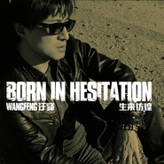

生来彷徨Born In Hesitation
============================

|  |  |
| :--: | :-- |
| [<br>生来彷徨Born In Hesitation](https://emumo.xiami.com/album/784338853) | **艺人**: [汪峰](../index.md)<br>**语种**: 国语<br>**唱片公司**: 风华秋实<br>**发行时间**: 2013年12月02日<br>**专辑类别**: 录音室专辑<br>**专辑风格**: 摇滚 Rock & Roll, 华语唱作人 Chinese Singer-Songwriter<br>**播放数**: 20516970<br>**收藏数**: 4307<br>**评论数**: 1073<br> |

## 简介

<div>
<div>《生无所求》专辑发行已经过去两年了，时光飞逝转眼就到了2013年末。这转瞬的两年既匆匆也漫长……这六百多天里，发生了太多的变化。满满的荒谬；满满的忧伤；满满散聚；满满的感动……也许对于一个人来说，这过程几乎难以承受，几乎濒临倒下；也许上苍依然眷顾我那颗炙热却也苍茫的心，我走过来了，异常艰难，无比倔强！我总会不断地告诉自己：一切都会过去，明天不会太糟！经历过所有这一切，在路上我写下了这张全新的专辑《生来彷徨》！所有的旋律和词句都是此刻我想对这个世界发出的呢喃，谈寻，乞问与呼喊！我们的生命是彷徨的，我们的命运亦然；似乎我们全部的恐惧与哀愁都因为：反正象我们这样的人，生来彷徨！这事一张属于我最悲伤的专辑，但同时它又是我最接近光明的一本灵魂之书。期望所有渴望光明的心灵可以找到共鸣！你是否知道这张专辑的诞生有多么不易！你是否明白它汇聚了多少迷惘与坚强；失去与收获！它发出的是何种暴雨后小草执着的呼喊……</div><br>
<br><br>
<div>歌曲介绍：</div><br>
<div>A：</div><br>
<div>1.一起摇摆：汪峰觉得，光是所谓的＂人艰不拆＂还不够，每当面对那些无法解决的死题，每当面对那些无法解释的误解，至少我们还有一个选择，用音乐来解脱，用音乐来让我们飞升，用摇摆的身体带动心灵一起快乐、一起轻松。于是你第一次看到一个放松下来的汪峰，一个完全释放，甚至疯狂的汪峰。极强的律动感，淋漓尽致的布鲁斯，编曲简单有力，这也许是汪峰最动感，旋律最易于传唱的一次音乐表现。</div><br>
<br><br>
<div>2.生来彷徨：这是一杯献给所有理想主义者的烈酒，敬所有仍然倔强地心向光明的善良人们。这是经历了风风雨雨之后，汪峰的灵魂之歌。它倾露了汪峰的敏感与力量，它汇聚了所有的迷惘与坚强，它像一把剑一样刺进庸碌麻木的生活。也许你会疑惑，这还是坚定地指引着更高的方向的那个汪峰吗？你听到近乎绝望的悲伤，而它却比以往的呼喊更接近光明。</div><br>
<br><br>
<div>3.不羁的生命：和当年慷慨激昂鼓舞人心的汪峰不同的是，如今的不羁多了一份接受失败的勇气。简练的箱琴和弦，寓意的恰恰是接受失败但不向命运低头的硬气。</div><br>
<br><br>
<div>4.想念真好：相思是什么？相思是那些夕阳滑落的瞬间，每一颗流星悄然隐没的时刻，我都会凝望眼前你的浮影。相思是每一滴泪水悄然滑落的时刻，我都会倾听远方你的叮咛。若不是沐浴在爱河中的人，恐是无法捕捉到这些细腻的时刻如此浅吟低唱。又一首感人至深的慢歌。简单，超然，挥之不去的旋律。</div><br>
<br><br>
<div>5.贫瘠之歌：硬摇滚的力度，对现代文明扼杀理想让人迷失的控诉，汪峰从未停止愤怒。</div><br>
<br><br>
<div>6.高地：久违的快节奏情歌。汪峰带我们回到那个疯狂而又浪漫的摇滚的年代，忘掉所有负担，为心爱的姑娘，马耳他香薰波斯花灯，她就是我们的海伦。来吧姑娘，让我们疯狂地爱吧。在爱意之外，还潜藏着挣脱束缚的不羁，浪漫而狂野。</div><br>
<br><br>
<div>7.寂寞列车：美妙的和声和箱琴弹拨，带我们走进了一列属于英雄或者浪子的列车。慵懒的旋律和节奏，描绘的却是一副身不由己的场景，只有轰隆隆的列车陪伴着孤独的浪子们。生命的迷惘与执着在迷人的静寂里缓缓渗透！属于以往汪峰少有的风格！</div><br>
<br><br>
<div>8.薄雾：汪峰音乐中不那么常见的英伦摇滚风格。每日奔波于生计的人们，每天拼搏奋斗所为的是什么？为什么即便得到了想要的却还如此迷失？看似怀疑娓娓道来，语气却毫无迟疑，这是一首拨开迷雾找寻真相的寓言之歌。</div><br>
<br><br>
<div>9.请把我在路上叫醒：轻松的公路之歌，汪峰用田纳西乡村摇滚的吟唱和悠扬的口琴，诉说着一段在路上的青春。有梦想的赤子，总是不安于平庸的灵魂之歌。</div><br>
<br><br>
<div>10.城市之光：对现代文明的反思贯穿在汪峰各个时期的创作中。作为曾写出过《北京北京》和《晚安北京》的城市观察者，如今的汪峰在再次审视城市时，有了更高的视角。当代中国快速城市化的进程中，个人与城市亲密又矛盾的普遍关系，每一个城市人都会心有戚戚。再次显示了汪峰对于社会环境敏感的触角。马头琴的段落直击人心，催人泪下，现代文明对于人们的吞噬和消解尽在不言中！</div><br>
<br><br>
<div>B：</div><br>
<div>1.有什么意义：编排狠到爆烈，歌词绝望到惨烈。生活挺好，可又有什么意义？汪峰用一连串听起来似是而非细想起来却有着惊人寓意的比喻，炸开了我们的脑壳。</div><br>
<br><br>
<div>2.谎言之躯：真实与失望，谎言与欢愉微妙的关系。有意思的是，虽然名为谎言之躯，这却是只有汪峰才敢唱出的事实。</div><br>
<br><br>
<div>3.加德满都的风铃：提到汪峰的情歌，人们首先想到的也许是《当我想你的时候》，或是《我如此爱你》。如今，也许这首《加德满都的风铃》会取代它们在你心中的地位。从一个很小的切入点，到看似俯拾即是的一串风铃的意象，妙到毫颠的恰当比喻。倾听风铃的声音吧，这是你从来没有听过的情歌表达。</div><br>
<br><br>
<div>4.边界：爱情的心境，张爱玲曾这样描述：“当ta见到ta，ta变得很低很低，低到尘埃里，但心是欢喜的，从尘埃里开出花来。”谁能想到，汪峰的歌里竟有张爱玲式的细腻。欢愉，哀伤，疼惜，小心翼翼，爱情中的所有情绪细节，在这样一首歌中融为一体，歌曲似乎像爱情本身一样摄人心魄。</div><br>
<br><br>
<div>5.春芽：亲情，一直是汪峰的音乐中无法忽视的主题。不论在外人面前如何表现坚强与潇洒，只有在母亲面前，才会不小心流露出深藏的孩子般的脆弱，不论年龄几何。歌中有一丝宿命 一丝思考，耐人寻味！充满对命运的拷问！</div><br>
<br><br>
<div>6.这样的孤单：深彻的孤独化作了风吹雨打后的呢喃。极为个人的情绪，同期录制造就了这首寂寞之歌！真挚的悲伤道出了时代的悲凉！</div><br>
<br><br>
<div>7.这感觉怎么样：打火机的声音，枯叶，废纸，一曲孤独圣曲，绝望到令人恐惧。</div><br>
<br><br>
<div>8.泡沫人生的迷惑：重型的吉他riff，说唱金属的演绎方式，延续了前两张专辑《有意思吗》《一百万吨的信念》的传统，汪峰再次用重型音乐的形式，拷问我们像泡沫的人生。深刻的反映了当今社会泡沫般荒诞伤悲的现实！</div><br>
<br><br>
<div>9.无家可归的人：给所有心在漂泊的人，触动城市人的麻经，直捣痛点！揭示了生命孤独的本质，人与时代极度的疏离！展现了你我灵魂的漂泊迷惘！<br><br>
<br><br>
<div>我们的生命是彷徨的，我们的命运亦然；似乎我们全部的恐惧与哀愁都因为：反正象我们这样的人，生来彷徨！这是一张最悲伤的专辑，但同时它又是最接近光明的一本灵魂之书。这是一张真正的时代之歌，19首歌道尽了这个时代我们的心灵之声！期望所有渴望光明的心灵可以找到共鸣！</div><br>
<div>——汪峰</div><br>
</div>
</div>

## 曲目

- [一起摇摆MV](./784338853/xL2ctAddf7a.md)
- [生来彷徨](./784338853/bqvpyiX3b4cb.md)
- [不羁的生命](./784338853/mQHKn8904fa.md)
- [想念真好](./784338853/mQHKn953d60.md)
- [贫瘠之歌](./784338853/bf04Es42f138.md)
- [高地](./784338853/mQHKnBe0a5b.md)
- [寂寞列车](./784338853/8GnHQMe6d9a.md)
- [薄雾](./784338853/xL2Jcnbe08c.md)
- [请把我在路上叫醒](./784338853/8GnHQZf905a.md)
- [城市之光](./784338853/mQHKnQ56fc3.md)
- [有什么意义](./784338853/mQHKnR6351f.md)
- [谎言之躯](./784338853/xL2Jc2b4dca.md)
- [加德满都的风铃](./784338853/b1qaBVX3e7d7.md)
- [边界](./784338853/mQHKnUecec6.md)
- [春芽](./784338853/xL2Jc5ca9fc.md)
- [这样的孤单](./784338853/8GnHRg1b94d.md)
- [这感觉怎么样](./784338853/mQHKnX87589.md)
- [泡沫人生的迷惑](./784338853/mQHKnY94409.md)
- [无家可归的人](./784338853/xL2Jc91565f.md)

## 评论

|  |  |  |  |
| :-- | :-- | :-- | :-- |
| <br>[虾米用户](https://emumo.xiami.com/u/427355321)<br><br>2019-09-04 20:59<br>赞(0) 踩(0) | <div>？？</div> |
| <br>[虾米用户](https://emumo.xiami.com/u/428591036)<br><br>2019-08-13 06:12<br>赞(0) 踩(0) | <div>不错</div> |
| <br>[虾米用户](https://emumo.xiami.com/u/10303763)<br><br>2019-01-10 12:10<br>赞(0) 踩(0) | <div>人皆如此，生而孤独、死而孤寂。回避孤独、拼命逃离，才导致严重困扰——如此而已。</div> |
| <br>[虾米用户](https://emumo.xiami.com/u/105748076)<br> <br>2018-03-02 17:02<br>赞(2) 踩(0) | <div>我其实觉得这是他这几年真正做出态度的专辑。中国摇滚歌迷黑汪峰中所见的，是中国摇滚本身的没落与汪峰高曝光度的鲜明对比，下一批摇滚歌手的崛起必定不是以复兴摇滚的面貌出现的，而是做自己的音乐。中国摇滚歌迷如果都把希望寄托在那样理想化的神人身上，本身跟闹革命没区别，阻力很大。没门儿。</div> |
| <br>[虾米用户](https://emumo.xiami.com/u/13508326)<br>wazl<br>2018-01-02 18:57<br>赞(0) 踩(0) | <div>太难听了，个人觉得，诸位呢</div> |
| ⇒ | <br>[虾米用户](https://emumo.xiami.com/u/410262319)<br><br>2019-10-20 16:55<br>赞(0) 踩(0) | <div>是你自己不懂欣赏，喷子</div> |
| <br>[虾米用户](https://emumo.xiami.com/u/369803)<br>我在天堂你在看<br>2017-12-20 09:33<br>赞(30) 踩(0) | <div>个人认为，在多少年后的今天，如果还是每句话都离不开“鲍家街43号”，这种心理已经不能用傻逼来形容了。就像多少年后的今天，周杰伦都已经是中年大叔了，但是他每出一张专辑，都会有人跳出来说“哎呀妈呀，这什么烂鬼东西，比《范特西》差得远了”——这种评论毫无意义，乐此不彼个什么劲？</div> |
| <br>[虾米用户](https://emumo.xiami.com/u/312633633)<br><br>2017-11-17 17:03<br>赞(2) 踩(0) | <div>汪老师出专辑的速度还是符合我对优秀歌手的定义的，更别提还有不少优秀的作品。那些暗喻、讽刺的评论，真的太小气了。难道摇滚歌手就要贫穷、孤独才叫真实吗？国人嫉妒的心情是可以理解的，但至少汪老师还没拉低摇滚的档次，我想摇滚这个词是可以借上&amp;ldquo;汪峰&amp;rdquo;的光的。那些出言语轻的愤青还是应该放宽视角，汪老师的经历是可以励志的，什么时候摇滚歌手占上头条，且百花齐放，而不是百花小放的时候，才是摇滚乐迷盛情欢乐的时候，那个时候，再来评价！以汪老师之人身来评价专辑实在是不应该，那样忘了音乐之本！</div> |
| <br>[虾米用户](https://emumo.xiami.com/u/29997146)<br>你們好<br>2017-10-30 10:23<br>赞(2) 踩(0) | <div>透過好聲音得平台認識這位大陸歌手,第一次聽到他的歌就很喜歡,他真的是一位很了不起的歌手,歌聲很有吸引力,就像人群中的小光點</div> |
| <br>[虾米用户](https://emumo.xiami.com/u/678456)<br><br>2017-10-30 10:23<br>赞(1) 踩(0) | <div>汪峰摇滚死胡同就在这张专辑诞生！其实这个专辑有7首歌够了，另外，励志歌曲过多了，疲倦的歌曲也多了，对不起，不能再次给你满分了。对于汪峰的歌曲内涵，一个甘愿自由摆脱喧闹的人生，一个总是希望冲破一切站在顶峰的人生，一个希望拾起最纯洁的生活与爱的人生。或许这张专辑就已经把他的一生给解释清楚了。</div> |
| <br>[虾米用户](https://emumo.xiami.com/u/31140637)<br><br>2017-10-30 10:13<br>赞(0) 踩(0) | <div>我只能说,确实有人是只关注娱乐找头条的,跟汪峰个人一点关系没有,别指望那些人只关注音乐!我个人看这专辑不输于国内的其他同期音乐.虽然也不见得有太多的惊喜,但总体还不错.至于有人只看见其中的字眼,我只能认为他是选择性吸收了.其实上不上头条,关注更多的是做新闻的记者本人,他们肯定会想,所以才有那么多的标题党!至于汪峰自个儿,你编辑选不选他做头条,估计他管不着更不关心.当然,能因此多赚钱那无妨.</div> |
| <br>[虾米用户](https://emumo.xiami.com/u/28681131)<br><br>2017-10-28 00:32<br>赞(1) 踩(0) | <div>觉得听音乐没必要要考虑那么多因素吧，汪峰他到了这个地步，自然会有创作上的转变，成名又怎样？不成名又怎样？他的音乐只为他自己的生活感悟而写，只要好听就行，他个人的生活无论怎么样我们都无权去管，这也是我们作为他的歌迷，而不是狗仔应该做的吧</div> |
| <br>[虾米用户](https://emumo.xiami.com/u/1530994)<br>诶嘿~(╯3╰)<br>2017-10-28 00:31<br>赞(0) 踩(0) | <div>汪峰老师的新歌居然在虾米音乐榜第二名漂了几天了。。。。。。为了让老师拿到第一名，我决定转一下●w●</div> |
| <br>[虾米用户](https://emumo.xiami.com/u/7205828)<br><br>2017-10-28 00:31<br>赞(0) 踩(0) | <div>整张专辑打到心里的是 这样的孤单。不讲迷惘，不讲坚持；不啧啧教人追求什么理想，不重重将生活的担子狠狠一压~只是是简单的述说一种状态像北京北京大家听的不是面对迷惘怎么办，只是听到歌曲中描绘出的那种心里的感受，有共鸣，我也会这样，我也想唱出一句北京北京来抒发一下~生活嘛人人都不一样，面对迷惘什么的也都有自己的应对方法，就想你妈天天跟你说要怎么怎么样，听多了烦~</div> |
| <br>[虾米用户](https://emumo.xiami.com/u/3931090)<br><br>2017-10-28 00:31<br>赞(1) 踩(0) | <div>人红了，巡演，商演还有参加各种大小活动，还要兼顾创作新作品，你以为换成谁可以做到这么多，况且有些评论完全都是恶意的，就真这么恶心你们呐~</div> |
| <br>[虾米用户](https://emumo.xiami.com/u/969497)<br><br>2017-10-28 00:31<br>赞(0) 踩(0) | <div>说句实话，虽然主打歌《生来彷徨》模式化严重，作为NC粉都有些无感（同《像梦一样自由》），整张专辑也不如上两张大气，题材也不及以往专辑的开阔。但这章双专辑还是足够诚意了。其中不乏好歌，个人最喜欢《请把我在路上叫醒》歌词是汪峰从未使用过的叙述方式；《薄雾》是汪老板以前从未演绎过的英式摇滚，很是惊喜，虽然有一丝淡淡的酷玩味道。不要在吐槽汪老板的模式化和匠气了。说句不讲理的话，你觉得他模式化是因为你已经停了他不少歌曲了，作为一个歌者，我想汪老板的目的达到了。所以，话不多说，新闻不多谈，赶紧循环第二遍啦~</div> |
| <br>[虾米用户](https://emumo.xiami.com/u/18389863)<br><br>2017-10-28 00:19<br>赞(1) 踩(0) | <div>摇滚是一种精神！汪从曾经生而自由、生而光明，生像大河，变成生来彷徨。彷徨没错，可四十不惑，生来彷徨该如何理解？即便为撕去假设的光明，展现生活痛楚，但看歌词，感觉是一把年纪了还是没想明白的人，想了几十年只想明白一件事：本来就是想不明白的人，故只能生来彷徨形容！这就是他的摇滚精神？1星！</div> |
| <br>[虾米用户](https://emumo.xiami.com/u/2220406)<br>Fuckin<br>2017-10-28 00:09<br>赞(0) 踩(0) | <div>喜欢汪峰的歌，近来顶一下，仅此而已</div> |
| <br>[虾米用户](https://emumo.xiami.com/u/5158734)<br>文艺二逼，不是青年。<br>2017-10-28 00:09<br>赞(0) 踩(0) | <div>听过之后，我想起《独自等待》里夏雨在客厅里充满期待地脱了衣服的场景。对我就是那个感受。你可以平庸，毫无爆点，或者拿飙到High C当做难听的借口，就像电影里朋友们开个玩笑那样。这些我都理解。但是你不能搞出那么多噱头让我带上期待。一星为了微博头版，一星给记忆中怒放的生命。</div> |
| <br>[虾米用户](https://emumo.xiami.com/u/9169858)<br> <br>2017-10-28 00:09<br>赞(1) 踩(0) | <div>今天听了汪峰老师的新歌生来彷徨, 感觉一般般. 这首歌写得太模板化了. 而且, 最后一句, 先停顿一下, 之后再吼一下, 很多首歌都是这么结尾, 都猜出是这样的ending了. [嘻嘻][哈哈] @jayjaywg王冠 @知青he @小鲍_颓羊羊 @FangliangChen</div> |
| <br>[虾米用户](https://emumo.xiami.com/u/5655077)<br><br>2017-10-28 00:09<br>赞(0) 踩(0) | <div>歌词不错,跟我现在的心情很接近,好像为我写的一样.</div> |
| <br>[虾米用户](https://emumo.xiami.com/u/5042720)<br><br>2017-10-27 23:10<br>赞(1) 踩(0) | <div>那些给一颗星的是冲着音乐去的呢 还是冲着他最近离婚事件去的呢？ 这里是音乐平台，不是人品人身攻击的地儿</div> |
| <br>[虾米用户](https://emumo.xiami.com/u/3352842)<br>保持本色<br>2017-10-27 23:03<br>赞(0) 踩(0) | <div>汪疯子的歌的确劲与深刻，希望你能多疯些时候，让我们与你一起疯。</div> |
| <br>[虾米用户](https://emumo.xiami.com/u/4263925)<br><br>2017-10-27 23:01<br>赞(0) 踩(0) | <div>还是觉得完全可以把精华压缩到一张里，多点城市之光这样有创意的东西和贫瘠之歌这样够硬的作品</div> |
| <br>[虾米用户](https://emumo.xiami.com/u/5941332)<br>惘<br>2017-10-26 08:03<br>赞(0) 踩(0) | <div>那几个热评是有多恨汪峰？看起来像是深仇大恨啊……</div> |
| <br>[虾米用户](https://emumo.xiami.com/u/181498696)<br><br>2017-10-18 17:04<br>赞(0) 踩(0) | <div>探索，人性，生活</div> |
| <br>[虾米用户](https://emumo.xiami.com/u/15477519)<br>爱  是生命的和弦，而不...<br>2017-09-25 21:04<br>赞(0) 踩(0) | <div></div> |
| <br>[虾米用户](https://emumo.xiami.com/u/18622046)<br>初识变化<br>2017-09-14 00:04<br>赞(0) 踩(0) | <div>讲真，这个专辑是不错的，评分低很大程度上是受到作者那段时间私人生活的影响。</div> |
| <br>[虾米用户](https://emumo.xiami.com/u/1159952)<br>这个世上总有一首歌等着与...<br>2017-09-12 02:21<br>赞(0) 踩(0) | <div>这个专辑真的好听。。。比现在很多音乐人的新歌好听100倍。有内容有思想，还好听。真难得。</div> |
| <br>[虾米用户](https://emumo.xiami.com/u/496910)<br><br>2017-07-24 21:04<br>赞(1) 踩(0) | <div>中国摇滚的魅力，这张新专辑分量十足，听着激情，就是上不了头条……但又能怎样呢？真正做好音乐的人是无所谓这些额，品质的保证只有懂的人才了解</div> |
| <br>[虾米用户](https://emumo.xiami.com/u/260790863)<br><br>2017-01-10 09:27<br>赞(0) 踩(0) | <div>   </div> |
| <br>[虾米用户](https://emumo.xiami.com/u/29509129)<br>子露<br>2016-08-10 23:52<br>赞(2) 踩(0) | <div>我就想知道为什么开了vip  确不能试听和下载  虾米这么恶心了么？？？</div> |
| <br>[虾米用户](https://emumo.xiami.com/u/134848328)<br>一起高呼Rock'n r...<br>2016-06-11 20:38<br>赞(1) 踩(0) | <div>一起摇摆如果没有成口水歌的话   一定是中国摇滚史上的一个经典</div> |
| <br>[虾米用户](https://emumo.xiami.com/u/895669)<br>愿你，这一生有被讨厌的勇...<br>2016-02-13 23:27<br>赞(0) 踩(0) | <div>还是简单，单纯点的好，既然只为听歌来，那又何必太计较。</div> |
| ⇒ | <br>[虾米用户](https://emumo.xiami.com/u/160353262)<br>你有什么了不起的！<br>2016-09-30 16:42<br>赞(0) 踩(0) | <div>赞一个</div> |
| <br>[虾米用户](https://emumo.xiami.com/u/50664584)<br>暂无签名~<br>2016-01-16 22:52<br>赞(0) 踩(0) | <div>好</div> |
| <br>[虾米用户](https://emumo.xiami.com/u/41079309)<br><br>2016-01-04 16:06<br>赞(0) 踩(0) | <div>彷徨你妹。。。</div> |
| <br>[虾米用户](https://emumo.xiami.com/u/13810803)<br><br>2015-11-22 09:44<br>赞(0) 踩(0) | <div>彷徨吗</div> |
| <br>[虾米用户](https://emumo.xiami.com/u/54056436)<br>爱是一场天时地利的迷信。...<br>2015-10-29 21:10<br>赞(1) 踩(0) | <div>最近非常喜欢汪峰，被他歌里的歌词各种感动，他的歌真的有鼓舞人心的作用</div> |
| <br>[虾米用户](https://emumo.xiami.com/u/74513120)<br>亲爱的永远爱你<br>2015-10-23 20:35<br>赞(0) 踩(0) | <div>永远支持汪峰老师</div> |
| ⇒ | <br>[虾米用户](https://emumo.xiami.com/u/51800191)<br><br>2016-04-12 22:08<br>赞(0) 踩(0) | <div>你好</div> |
| <br>[虾米用户](https://emumo.xiami.com/u/28681131)<br><br>2015-09-22 19:50<br>赞(1) 踩(0) | <div>感觉是汪峰离开鲍家街之后的十几年里相对比较不错的专辑，有愤怒，有歌颂，有写实，有抒情。只是有些被架空之感，无奈，他飞得太高了，已经不能从曾经给他力量的土壤中再汲取养分了。不过在这个身份地位还能保持一定的冷静与愤怒着实不易了</div> |
| <br>[虾米用户](https://emumo.xiami.com/u/3425353)<br><br>2015-09-21 13:25<br>赞(2) 踩(0) | <div>今天 静静听完了一次这张碟  老汪的确是给大家做了一顿大餐 饕餮大餐！ 不过 现实是这样的  一群每天脑满肥肠的人 看着108道的满汉全席 也都无味  他们不饿了 油水多了  谁也不会 细细品味了。 我只能对汪峰说 可惜了！  大师辛苦了~~~</div> |
| <br>[虾米用户](https://emumo.xiami.com/u/66953070)<br><br>2015-09-18 20:50<br>赞(1) 踩(0) | <div>我一直都非常喜欢汪峰</div> |
| <br>[虾米用户](https://emumo.xiami.com/u/40110682)<br>没他妈个性！<br>2015-09-11 16:35<br>赞(6) 踩(0) | <div>听不听？！不听滚～卵～子，唧唧歪歪个毛啊，都懂尼玛个卵儿子，也特么品头论足的…</div> |
| <br>[虾米用户](https://emumo.xiami.com/u/42123079)<br><br>2015-08-16 13:57<br>赞(0) 踩(0) | <div>69</div> |
| <br>[虾米用户](https://emumo.xiami.com/u/54894315)<br> <br>2015-08-09 22:55<br>赞(1) 踩(0) | <div>HQ免费音乐！虾米，高晓松的实力啊！</div> |
| <br>[虾米用户](https://emumo.xiami.com/u/29696442)<br><br>2015-08-07 14:25<br>赞(0) 踩(0) | <div>风它吹进我心里忽然没有了方向雨它撒入我心底竟然消逝了无影这样的孤单</div> |
| <br>[虾米用户](https://emumo.xiami.com/u/12816716)<br><br>2015-08-05 15:17<br>赞(1) 踩(0) | <div>一个人做爱一个人哭笑 </div> |
| <br>[虾米用户](https://emumo.xiami.com/u/12816716)<br><br>2015-08-05 15:17<br>赞(0) 踩(0) | <div>一个人做爱一个人哭笑 </div> |
| <br>[虾米用户](https://emumo.xiami.com/u/52686046)<br><br>2015-07-27 22:43<br>赞(0) 踩(0) | <div>鲍家街就不提了，比前两张《信仰》和《生无所求》还差，估计这段时间汪峰没有认真创作。</div> |
| <br>[虾米用户](https://emumo.xiami.com/u/6104214)<br><br>2015-07-06 09:38<br>赞(0) 踩(0) | <div>这其实是汪峰最好的一张专辑</div> |
| <br>[虾米用户](https://emumo.xiami.com/u/12017837)<br><br>2015-07-05 10:46<br>赞(1) 踩(0) | <div>一张认真听过的专辑。</div> |
| <br>[虾米用户](https://emumo.xiami.com/u/332689)<br><br>2015-06-29 10:20<br>赞(0) 踩(0) | <div>只喜欢鲍家街43号乐队时期他出的那盘节奏布鲁斯风格的同名专辑《鲍家街43号》。</div> |
| <br>[虾米用户](https://emumo.xiami.com/u/1678902)<br><br>2015-06-19 18:16<br>赞(1) 踩(0) | <div>说实话 这张专辑挺不错的 为什么分数这么低</div> |
| ⇒ | <br>[虾米用户](https://emumo.xiami.com/u/30620803)<br><br>2015-06-26 18:44<br>赞(0) 踩(0) | <div>对啊，这张唱片不错啊</div> |
| <br>[虾米用户](https://emumo.xiami.com/u/6104214)<br><br>2015-06-15 17:33<br>赞(0) 踩(0) | <div>这张专辑的编曲还是贾轶男吗 为什么没有写 贫瘠之地，高地什么的曲风感觉有些不一样</div> |
| <br>[虾米用户](https://emumo.xiami.com/u/8098831)<br> <br>2015-05-31 20:02<br>赞(0) 踩(0) | <div>感受风 感受存 在加德满都的风铃</div> |
| <br>[虾米用户](https://emumo.xiami.com/u/8098831)<br> <br>2015-05-31 20:00<br>赞(0) 踩(0) | <div>喜欢 加德满都的风景</div> |
| <br>[虾米用户](https://emumo.xiami.com/u/25242104)<br><br>2015-05-31 19:45<br>赞(0) 踩(0) | <div>第一遍没啥感觉  难道得慢热？</div> |
| <br>[虾米用户](https://emumo.xiami.com/u/4957742)<br>请不要忽略身边的景色<br>2015-05-11 10:07<br>赞(1) 踩(0) | <div>非常不错的一张专辑  很有感觉  一如既往喜欢他  尤其是汪峰的演唱会  现场太震撼了</div> |
| <br>[虾米用户](https://emumo.xiami.com/u/49587190)<br><br>2015-04-26 12:30<br>赞(0) 踩(0) | <div>很好聽</div> |
| <br>[虾米用户](https://emumo.xiami.com/u/1227652)<br><br>2015-04-02 08:14<br>赞(1) 踩(0) | <div>不错啊 </div> |
| <br>[虾米用户](https://emumo.xiami.com/u/15400066)<br><br>2015-03-17 19:13<br>赞(0) 踩(0) | <div>再来摇摆一下</div> |
| <br>[虾米用户](https://emumo.xiami.com/u/1615885)<br>废物一个<br>2015-02-25 21:44<br>赞(0) 踩(0) | <div>生来彷徨</div> |
| <br>[虾米用户](https://emumo.xiami.com/u/43729200)<br>暂无签名~<br>2015-02-23 01:37<br>赞(0) 踩(0) | <div></div> |
| <br>[虾米用户](https://emumo.xiami.com/u/4862025)<br>爱是唯一的答案<br>2015-02-15 14:40<br>赞(1) 踩(0) | <div>骂得人多半是嫉妒</div> |
| <br>[虾米用户](https://emumo.xiami.com/u/11576990)<br><br>2015-01-14 21:13<br>赞(1) 踩(0) | <div>都说汪峰变了,可我们自个又好到哪里去。一首《一起摇摆》路人转粉.</div> |
| <br>[虾米用户](https://emumo.xiami.com/u/45525046)<br>好景当前莫留连<br>2015-01-03 15:46<br>赞(0) 踩(0) | <div>不管大家怎么黑他，至少人家一直保持着思考</div> |
| <br>[虾米用户](https://emumo.xiami.com/u/7156570)<br><br>2014-12-19 12:11<br>赞(0) 踩(0) | <div>汪叔不上中国好声音之前还是觉得满酷蛮神秘的，上了以后发现貌似是个比较语塞稍微老套的人……不过歌曲是还好啦，这张听了呢，虽然的确和有些评价的说的那样还是以前那样的调调，但是整体分数个个人觉得算是不增不减……的确算是一如既往吧~</div> |
| <br>[虾米用户](https://emumo.xiami.com/u/31184261)<br>没有音乐我们都会死吧。<br>2014-12-17 04:12<br>赞(0) 踩(0) | <div>编曲的真心厉害，不错的蓝调摇滚。尤其吉他部分。</div> |
| ⇒ | <br>[虾米用户](https://emumo.xiami.com/u/44775964)<br>强大自己<br>2014-12-25 23:34<br>赞(0) 踩(0) | <div>你应该是吉他</div> |
| ⇒ | <br>[虾米用户](https://emumo.xiami.com/u/31184261)<br>没有音乐我们都会死吧。<br>2014-12-26 14:17<br>赞(0) 踩(0) | <div><q><b>金平黑山羊合作社说：</b></q></div> |
| <br>[虾米用户](https://emumo.xiami.com/u/38600834)<br><br>2014-12-12 18:23<br>赞(0) 踩(0) | <div>对我来说只需一首《生来彷徨》就够了!</div> |
| <br>[虾米用户](https://emumo.xiami.com/u/43484457)<br>操<br>2014-12-09 21:05<br>赞(0) 踩(0) | <div>烂</div> |
| ⇒ | <br>[虾米用户](https://emumo.xiami.com/u/44248167)<br><br>2015-02-10 00:15<br>赞(0) 踩(0) | <div>烂？有种唱个比他好听的啊！苍蝇</div> |
| <br>[虾米用户](https://emumo.xiami.com/u/44311793)<br><br>2014-12-02 05:36<br>赞(0) 踩(0) | <div>汪峰，顶你一辈子。谁说你，我抱他妈日。</div> |
| <br>[虾米用户](https://emumo.xiami.com/u/10978456)<br> <br>2014-11-24 23:41<br>赞(2) 踩(0) | <div>仔细听了几首， 确实不至于现在的分数 摇滚不摇滚 不是那么的重要。至少他是爱音乐的 至少他的音乐感动过你。 私生活的部分你不必嫉妒也不要在意。因为跟你没关系。</div> |
| ⇒ | <br>[虾米用户](https://emumo.xiami.com/u/369803)<br>我在天堂你在看<br>2014-11-29 15:17<br>赞(0) 踩(0) | <div>那么多1分，满满的恶意啊。而且这张专辑的精华在B面，上面有个人乱喷一通，然后说他只听了A面，实在是替他感到尴尬。</div> |
| ⇒ | <br>[虾米用户](https://emumo.xiami.com/u/37371935)<br>暂无签名~<br>2015-03-05 23:01<br>赞(0) 踩(0) | <div><q><b>朝吟暮语说：</b></q></div> |
| <br>[虾米用户](https://emumo.xiami.com/u/43887212)<br><br>2014-11-19 21:34<br>赞(0) 踩(0) | <div>大爱这张专辑</div> |
| <br>[虾米用户](https://emumo.xiami.com/u/10495358)<br>秋凉天气<br>2014-10-27 21:39<br>赞(0) 踩(0) | <div>非常棒的专辑，太喜欢</div> |
| <br>[虾米用户](https://emumo.xiami.com/u/32384351)<br><br>2014-10-26 00:57<br>赞(3) 踩(0) | <div>很棒，又天才又勤奋的好歌手！</div> |
| <br>[虾米用户](https://emumo.xiami.com/u/18738542)<br><br>2014-10-22 11:10<br>赞(0) 踩(0) | <div>都挺喜欢,不必太苛责</div> |
| <br>[虾米用户](https://emumo.xiami.com/u/42835913)<br><br>2014-10-21 14:19<br>赞(0) 踩(0) | <div>喜欢</div> |
| <br>[虾米用户](https://emumo.xiami.com/u/39467472)<br><br>2014-10-08 11:07<br>赞(0) 踩(0) | <div>汪峰,摇滚,生来彷徨</div> |
| <br>[虾米用户](https://emumo.xiami.com/u/41779552)<br>因此一绵，深而有念<br>2014-09-28 16:52<br>赞(1) 踩(0) | <div>一如既往的，我的精神咖啡，香醇浓烈深刻，爱汪峰！</div> |
| <br>[虾米用户](https://emumo.xiami.com/u/2982338)<br>我多想和你一样臭不要脸<br>2014-09-27 16:36<br>赞(3) 踩(0) | <div>不明白分数为什么这么低，都是微博过来的么？</div> |
| <br>[虾米用户](https://emumo.xiami.com/u/15794)<br><br>2014-09-23 10:28<br>赞(0) 踩(0) | <div>好听！</div> |
| <br>[虾米用户](https://emumo.xiami.com/u/41419254)<br>在音乐中解压<br>2014-09-20 19:11<br>赞(0) 踩(0) | <div>把内心的不愉快一起摇出来</div> |
| <br>[虾米用户](https://emumo.xiami.com/u/8717706)<br> <br>2014-09-14 16:10<br>赞(0) 踩(0) | <div>京味</div> |
| <br>[虾米用户](https://emumo.xiami.com/u/41103417)<br><br>2014-09-11 18:11<br>赞(1) 踩(0) | <div>深刻、现实、接受与生存！</div> |
| <br>[虾米用户](https://emumo.xiami.com/u/17203528)<br>Lonely but f...<br>2014-09-07 00:16<br>赞(1) 踩(0) | <div>不明白为什么这么低分，这张专实在让我感触良多。揭露了露骨残酷的现实。听说过汪峰的许多风言风语，也曾为此鄙视过他，但所谓社会准则又怎么能够束缚得了他，毕竟最后我们也都不是那个能坚持下来的人。</div> |
| ⇒ | <br>[虾米用户](https://emumo.xiami.com/u/41031551)<br>喜欢摇滚 喜欢汪峰<br>2014-09-09 12:37<br>赞(0) 踩(0) | <div>有些人不用虾米音乐</div> |
| <br>[虾米用户](https://emumo.xiami.com/u/16868821)<br>I not a rapp...<br>2014-09-05 19:22<br>赞(0) 踩(0) | <div>一如既往</div> |
| <br>[虾米用户](https://emumo.xiami.com/u/22766197)<br><br>2014-09-02 09:20<br>赞(0) 踩(0) | <div>就是听起来舒服。</div> |
| <br>[虾米用户](https://emumo.xiami.com/u/32866230)<br><br>2014-08-28 18:26<br>赞(0) 踩(0) | <div>哈哈哈哈哈哈</div> |
| <br>[虾米用户](https://emumo.xiami.com/u/32866230)<br><br>2014-08-28 18:13<br>赞(0) 踩(0) | <div>给个真的风图来看！！？？？？？</div> |
| <br>[虾米用户](https://emumo.xiami.com/u/32866230)<br><br>2014-08-28 18:11<br>赞(0) 踩(0) | <div>你总是在玩？我去没人？还要我像傻瓜似的吗？荷花？好呀5分钟去看！？？？？？只给5分钟你？</div> |
| <br>[虾米用户](https://emumo.xiami.com/u/32866230)<br><br>2014-08-28 17:01<br>赞(0) 踩(0) | <div>我下去走一圈！若你不是真的见我风里没人！若见风有人！？？？我可不要人给脸色我看？若见风门开！？？？我不要像傻瓜似的站在那里！？？？给你十分钟？</div> |
| <br>[虾米用户](https://emumo.xiami.com/u/32866230)<br><br>2014-08-28 16:56<br>赞(0) 踩(0) | <div>你还要我下去吗？唱歌来听！</div> |
| <br>[虾米用户](https://emumo.xiami.com/u/32866230)<br><br>2014-08-28 16:56<br>赞(0) 踩(0) | <div>所以找不到你？</div> |
| <br>[虾米用户](https://emumo.xiami.com/u/32866230)<br><br>2014-08-28 16:54<br>赞(0) 踩(0) | <div>你的小黄踩两条线？代表是两个人吗？大黄前后白？大黄只道一条线以二条线的头？表示你年头已經不在这里？后来的人都不是你？</div> |
| <br>[虾米用户](https://emumo.xiami.com/u/32866230)<br><br>2014-08-28 16:45<br>赞(0) 踩(0) | <div>现在！去佛玲？</div> |
| <br>[虾米用户](https://emumo.xiami.com/u/32866230)<br><br>2014-08-28 16:44<br>赞(0) 踩(0) | <div>你叫13的你来！！就是真實的你！！你要我去小黄风那里！？？？两个都是你！你要我上白马王子的黄吗？</div> |
| <br>[虾米用户](https://emumo.xiami.com/u/32866230)<br><br>2014-08-28 16:40<br>赞(0) 踩(0) | <div>那个黄风代表你呀？许愿铃黄风！！</div> |
| <br>[虾米用户](https://emumo.xiami.com/u/32866230)<br><br>2014-08-28 16:36<br>赞(0) 踩(0) | <div>你要我去那风就那风有人！！！你要我上黄风还是白风？</div> |
| <br>[虾米用户](https://emumo.xiami.com/u/32866230)<br><br>2014-08-28 16:18<br>赞(0) 踩(0) | <div>来啦响声！？？？</div> |
| <br>[虾米用户](https://emumo.xiami.com/u/32866230)<br><br>2014-08-28 16:17<br>赞(0) 踩(0) | <div>来呀！！13的你！！我在等你呢！？哈哈哈哈哈哈</div> |
| <br>[虾米用户](https://emumo.xiami.com/u/32866230)<br><br>2014-08-28 15:23<br>赞(0) 踩(0) | <div>请你吃黑挑！！！！！！</div> |
| <br>[虾米用户](https://emumo.xiami.com/u/32866230)<br><br>2014-08-28 15:14<br>赞(0) 踩(0) | <div>你陈升也好谢东盛也好！！你不爱就算？但不要搞我不识的人叫来爱我。没感覺你好在有米对我来说没意思。</div> |
| <br>[虾米用户](https://emumo.xiami.com/u/1306103)<br><br>2014-08-20 09:55<br>赞(0) 踩(0) | <div>主打歌刚出来时，不是特别理解，没有注意听，今天偶尔听，发现很棒，决定回头听下全辑。</div> |
| <br>[虾米用户](https://emumo.xiami.com/u/1869182)<br><br>2014-08-18 22:48<br>赞(0) 踩(0) | <div>哎哟喂，你们好摇滚哟</div> |
| <br>[虾米用户](https://emumo.xiami.com/u/33651741)<br>暂无签名~<br>2014-08-18 12:49<br>赞(0) 踩(0) | <div>有才华的创作型，声音有魅力。</div> |
| <br>[虾米用户](https://emumo.xiami.com/u/15279597)<br>吃我一电炮儿<br>2014-08-16 07:17<br>赞(0) 踩(0) | <div>作为狭义的流行乐来看 在水准之上 歌词略显矫情 也在预料之内 听过一遍还是回去听花火和鲍家街了 汪峰还是那个汪峰 那个甩着长发唱小鸟 戴着大眼镜唱错误的汪峰 他会永远存在于记忆里 我知足</div> |
| <br>[虾米用户](https://emumo.xiami.com/u/30620802)<br><br>2014-08-13 21:17<br>赞(0) 踩(0) | <div>感觉特棒</div> |
| <br>[虾米用户](https://emumo.xiami.com/u/10351119)<br><br>2014-08-08 15:20<br>赞(4) 踩(0) | <div>6.6,你们太苛刻了</div> |
| ⇒ | <br>[虾米用户](https://emumo.xiami.com/u/6634770)<br>因为我来自风的故乡<br>2014-08-10 08:56<br>赞(0) 踩(0) | <div>后面一群人都是跟风的，我敢说至少一半人没听过，呵呵，真让人寒心。虽然我也不喜欢，但我没觉得能差到这种程度。</div> |
| <br>[虾米用户](https://emumo.xiami.com/u/33598332)<br>暂无签名~<br>2014-08-06 14:30<br>赞(0) 踩(0) | <div>就是喜欢汪峰的音乐</div> |
| <br>[虾米用户](https://emumo.xiami.com/u/39614007)<br><br>2014-08-03 03:02<br>赞(0) 踩(0) | <div>摇滚音乐的特质就是敢写敢唱敢玩真实。不在于他唱了多少，而在于他都唱了些什么</div> |
| <br>[虾米用户](https://emumo.xiami.com/u/12277786)<br><br>2014-07-31 09:00<br>赞(3) 踩(0) | <div>还没听完，觉得还好，比以前的专辑似乎更多样化，加德满都的风铃，寂寞列车，贫瘠之城自己喜欢，一起摇摆和生来彷徨不喜欢，一起摇摆媚俗，生来彷徨太重复，有类似歌曲珠玉在前。</div> |
| <br>[虾米用户](https://emumo.xiami.com/u/1448674)<br><br>2014-07-31 08:55<br>赞(0) 踩(0) | <div>总觉得这封面似曾相识</div> |
| <br>[虾米用户](https://emumo.xiami.com/u/1869182)<br><br>2014-07-28 19:33<br>赞(1) 踩(0) | <div>这张专辑之前所有你的歌我都会唱，现在你拿出这样流行和伪摇滚的专辑回馈给你的铁粉，不仗义··弱你嘛B</div> |
| <br>[虾米用户](https://emumo.xiami.com/u/6282333)<br>你的白彩衣在路上很美…<br>2014-07-23 18:22<br>赞(0) 踩(0) | <div>这逼早完蛋了 从幸福的子弹之后</div> |
| ⇒ | <br>[虾米用户](https://emumo.xiami.com/u/8531805)<br>怀念那不勒斯的暴雨<br>2014-08-05 00:56<br>赞(0) 踩(0) | <div>你是个什么东西？</div> |
| ⇒ | <br>[虾米用户](https://emumo.xiami.com/u/1869182)<br><br>2014-08-18 22:38<br>赞(0) 踩(0) | <div><q><b>百里登疯说：</b></q></div> |
| <br>[虾米用户](https://emumo.xiami.com/u/16007301)<br>虾米app跟翔一样 该改...<br>2014-07-22 04:46<br>赞(0) 踩(0) | <div>绝逼不至于</div> |
| <br>[虾米用户](https://emumo.xiami.com/u/16007301)<br>虾米app跟翔一样 该改...<br>2014-07-22 04:44<br>赞(0) 踩(0) | <div>6.6      不至于啊</div> |
| <br>[虾米用户](https://emumo.xiami.com/u/492446)<br><br>2014-07-20 20:20<br>赞(0) 踩(0) | <div>还行</div> |
| <br>[虾米用户](https://emumo.xiami.com/u/332689)<br><br>2014-07-14 16:02<br>赞(2) 踩(0) | <div>从表现他灵魂深处的表达的国内难见的节奏布鲁斯风格专辑《鲍家街43号》这张他当时还是鲍家街43号乐队主唱的时候开始，我就认定这家伙是个勇于直面和充满着不妥协的音乐才子。汪峰，继续你的继续！让那些怀揣酸葡萄心理的家伙们继续嚼老婆舌头吧！</div> |
| <br>[虾米用户](https://emumo.xiami.com/u/821)<br><br>2014-07-09 23:50<br>赞(2) 踩(0) | <div>比上不足比下有余——出道这么多年的歌手里还能保持这个水准也没几个，逗比们都洗洗睡吧</div> |
| <br>[虾米用户](https://emumo.xiami.com/u/3924209)<br><br>2014-07-02 14:04<br>赞(2) 踩(0) | <div>专辑的这个评分不过充分说明了虾米听众对音乐的欣赏水平有多烂而已</div> |
| ⇒ | <br>[虾米用户](https://emumo.xiami.com/u/108953)<br>Music<br>2014-10-24 10:22<br>赞(0) 踩(0) | <div>没你烂</div> |
| ⇒ | <br>[虾米用户](https://emumo.xiami.com/u/3924209)<br><br>2014-10-24 19:51<br>赞(0) 踩(0) | <div><q><b>bannys说：</b></q></div> |
| <br>[虾米用户](https://emumo.xiami.com/u/3924209)<br><br>2014-07-02 13:58<br>赞(0) 踩(0) | <div>专辑的这个评分不过充分说明了虾米听众对音乐的欣赏水平有多烂而已</div> |
| <br>[虾米用户](https://emumo.xiami.com/u/5792216)<br><br>2014-06-24 22:35<br>赞(1) 踩(0) | <div>老子就是要打五星！</div> |
| <br>[虾米用户](https://emumo.xiami.com/u/9743366)<br>暂无签名~<br>2014-06-17 13:43<br>赞(1) 踩(0) | <div>每个人都在不断的生而彷徨和勘破生死的过程，一生都在矛盾！</div> |
| <br>[虾米用户](https://emumo.xiami.com/u/10099674)<br><br>2014-06-09 17:46<br>赞(0) 踩(0) | <div>这张专辑跟“生无所求”相比还差太多了。呵呵。</div> |
| <br>[虾米用户](https://emumo.xiami.com/u/26101121)<br>暂无签名~<br>2014-06-09 05:02<br>赞(0) 踩(0) | <div>虾米真有爱</div> |
| <br>[虾米用户](https://emumo.xiami.com/u/4089916)<br><br>2014-06-09 00:53<br>赞(0) 踩(0) | <div>不要说王峰商业了，一张专辑不可能全部是他所喜欢的，如果全部是他喜欢的，除非他不想活了，你要是他你会怎么做？？？？？？</div> |
| <br>[虾米用户](https://emumo.xiami.com/u/18738542)<br><br>2014-06-08 11:15<br>赞(0) 踩(0) | <div>听歌感觉是一种很私人化的东西，挺好</div> |
| <br>[虾米用户](https://emumo.xiami.com/u/33316771)<br>也许我们永远不会再见<br>2014-06-02 11:07<br>赞(1) 踩(0) | <div>贫瘠之歌~\(≧▽≦)/~最爱</div> |
| <br>[虾米用户](https://emumo.xiami.com/u/25048340)<br> <br>2014-05-10 16:33<br>赞(0) 踩(0) | <div>放正心态！</div> |
| <br>[虾米用户](https://emumo.xiami.com/u/1869182)<br><br>2014-05-08 17:53<br>赞(0) 踩(0) | <div>这算啥子摇滚，流行摇滚都不算</div> |
| ⇒ | <br>[虾米用户](https://emumo.xiami.com/u/410262319)<br><br>2019-10-20 17:08<br>赞(0) 踩(0) | <div>你懂啥呀你，喷子一个。</div> |
| <br>[虾米用户](https://emumo.xiami.com/u/1869182)<br><br>2014-05-08 17:51<br>赞(0) 踩(0) | <div>为什么现在的人都喜欢用洋鬼子的脸做头像？文艺？欧美范？</div> |
| <br>[虾米用户](https://emumo.xiami.com/u/36150871)<br><br>2014-05-03 10:17<br>赞(0) 踩(0) | <div>新专不错，一直在听，歌词时不时会触动我，产生共鸣！</div> |
| <br>[虾米用户](https://emumo.xiami.com/u/15479317)<br>金奖冷场王 音乐懒乞丐<br>2014-04-29 00:18<br>赞(0) 踩(0) | <div>力量呐喊着带领着这么一群人，引发共鸣，走出彷徨，走来走去，看真点，到底是走出了还是其实根本在原地转</div> |
| <br>[虾米用户](https://emumo.xiami.com/u/3352842)<br>保持本色<br>2014-04-10 20:23<br>赞(0) 踩(0) | <div>高地，也许是汪峰送给“她”的情歌，汪氏情歌充满了60、70年代“花童少年”的爱的泛滥。但确实汪峰是性情中人，骨子里带着“自毁”和“吉姆莫里森”似的叛逆精髓，也许是他投胎转世到中国了吧。中国也该出个“大门”，以让我们这代人值得去纪念，去回忆。</div> |
| <br>[虾米用户](https://emumo.xiami.com/u/32776986)<br><br>2014-04-05 22:24<br>赞(0) 踩(0) | <div>才华</div> |
| <br>[虾米用户](https://emumo.xiami.com/u/11432338)<br>好评啊亲<br>2014-04-05 17:08<br>赞(0) 踩(0) | <div>侧面想想，真是好歌！</div> |
| <br>[虾米用户](https://emumo.xiami.com/u/7709220)<br><br>2014-04-02 00:55<br>赞(0) 踩(0) | <div>还是比较喜欢汪峰早期的作品</div> |
| <br>[虾米用户](https://emumo.xiami.com/u/16007073)<br><br>2014-03-23 18:40<br>赞(0) 踩(0) | <div>其实我已经对汪峰已经厌倦了，风格单一，缺乏深度，可以概括为：生活空虚无意义，导致三个结果反抗（早听烦了，其实已经符号化了，没有更深刻的东西体现出来）、彷徨（在汪峰歌里也有点符号化）与放纵（像争议较大的《高地》，《谎言之躯》各种暗示性高潮），这张专辑里其实还是《寂寞列车》、《边界》、《想念真好》等几首安静的比较好，还能有些共感，不过好像这几首关注的人少，前一阵子有点抑郁，再一听许巍，许巍确实比汪峰好多了（不指唱功），你去听鲍勃迪伦的歌，就绝不像汪峰很多歌那么符号化，比较好的是歌词总算出现一些新的词和新的意象，什么杜鹃花、放逐之类的早烦了</div> |
| ⇒ | <br>[虾米用户](https://emumo.xiami.com/u/1869182)<br><br>2014-05-08 17:54<br>赞(0) 踩(0) | <div>这个小四眼怎么能跟鲍勃迪伦比，不要侮辱鲍勃迪伦</div> |
| ⇒ | <br>[虾米用户](https://emumo.xiami.com/u/16007073)<br><br>2014-07-09 01:06<br>赞(0) 踩(0) | <div><q><b>弗兰人在广州说：</b></q></div> |
| ⇒ | <br>[虾米用户](https://emumo.xiami.com/u/16007073)<br><br>2017-10-27 23:55<br>赞(0) 踩(0) | <div><q><b>弗兰人在广州说：</b></q></div> |
| <br>[虾米用户](https://emumo.xiami.com/u/1609946)<br>一即一切<br>2014-03-16 14:48<br>赞(0) 踩(0) | <div>心 境不二</div> |
| <br>[虾米用户](https://emumo.xiami.com/u/5703509)<br><br>2014-03-16 10:00<br>赞(0) 踩(0) | <div>又来到了春天里</div> |
| <br>[虾米用户](https://emumo.xiami.com/u/566623)<br>世界看我很无聊<br>2014-03-16 07:18<br>赞(1) 踩(0) | <div>多少号称喜欢音乐的人，其实是多么的市侩和愚蠢啊。</div> |
| <br>[虾米用户](https://emumo.xiami.com/u/33598332)<br>暂无签名~<br>2014-03-12 16:16<br>赞(0) 踩(0) | <div>一如既往的喜欢</div> |
| <br>[虾米用户](https://emumo.xiami.com/u/5685054)<br><br>2014-03-09 19:37<br>赞(0) 踩(0) | <div>嘶吼的力量</div> |
| <br>[虾米用户](https://emumo.xiami.com/u/33736380)<br>如果我们都能像夏洛克一样...<br>2014-03-09 09:15<br>赞(0) 踩(0) | <div>生来彷徨，唱的不单是他这代人，也是这代人的心声，人们为何生来彷徨呢，</div> |
| <br>[虾米用户](https://emumo.xiami.com/u/9318281)<br><br>2014-02-26 13:02<br>赞(0) 踩(0) | <div>好听</div> |
| <br>[虾米用户](https://emumo.xiami.com/u/33255746)<br><br>2014-02-25 21:19<br>赞(0) 踩(0) | <div>中国就该多些这种歌</div> |
| <br>[虾米用户](https://emumo.xiami.com/u/32602681)<br>暂无签名~<br>2014-02-22 16:23<br>赞(0) 踩(0) | <div>峰哥的摇滚是屹立不倒的旗帜！</div> |
| <br>[虾米用户](https://emumo.xiami.com/u/32794868)<br><br>2014-02-15 14:44<br>赞(0) 踩(0) | <div>声音听起来沧桑的感觉蛮好</div> |
| <br>[虾米用户](https://emumo.xiami.com/u/5063972)<br><br>2014-02-15 13:54<br>赞(0) 踩(0) | <div>没有听出10年前汪峰的味道，所谓彷徨么</div> |
| <br>[虾米用户](https://emumo.xiami.com/u/30423622)<br><br>2014-02-14 17:47<br>赞(0) 踩(0) | <div>不羁的生命作曲欠佳啊。</div> |
| <br>[虾米用户](https://emumo.xiami.com/u/32457606)<br><br>2014-02-07 12:44<br>赞(0) 踩(0) | <div>好听啊</div> |
| <br>[虾米用户](https://emumo.xiami.com/u/2036614)<br><br>2014-02-05 23:55<br>赞(0) 踩(0) | <div>挺汪峰</div> |
| <br>[虾米用户](https://emumo.xiami.com/u/31344137)<br><br>2014-01-31 19:55<br>赞(1) 踩(0) | <div>越来越喜欢汪峰的歌，也许随着年龄的增长越来越体会生存的压抑和渴望挣脱的意愿！冲破束缚！</div> |
| <br>[虾米用户](https://emumo.xiami.com/u/32220177)<br><br>2014-01-28 16:49<br>赞(0) 踩(0) | <div>因为自己想一个静静地听</div> |
| <br>[虾米用户](https://emumo.xiami.com/u/14031278)<br>淡泊以明志，宁静以致远<br>2014-01-27 21:56<br>赞(1) 踩(0) | <div>加油汪峰。振作起来！</div> |
| <br>[虾米用户](https://emumo.xiami.com/u/14031278)<br>淡泊以明志，宁静以致远<br>2014-01-27 21:54<br>赞(0) 踩(0) | <div>低水准，无责任。汪峰彻底迷失了自己。希望只是个过程，祝愿你能振作起来</div> |
| <br>[虾米用户](https://emumo.xiami.com/u/1893708)<br><br>2014-01-25 00:09<br>赞(1) 踩(0) | <div>一起摇摆有种90年代中国摇滚黄金时代的感觉，有点《无地自容》的味道</div> |
| ⇒ | <br>[虾米用户](https://emumo.xiami.com/u/15848406)<br>我还没想好要写什么...<br>2014-02-16 20:38<br>赞(0) 踩(0) | <div>无地自容是金属，汪峰顶天是硬摇，那点味道一样了</div> |
| <br>[虾米用户](https://emumo.xiami.com/u/32087757)<br><br>2014-01-24 12:18<br>赞(0) 踩(0) | <div>try</div> |
| <br>[虾米用户](https://emumo.xiami.com/u/32074076)<br><br>2014-01-23 21:59<br>赞(0) 踩(0) | <div>一张需要用心聆听和品味的专辑，总会在某个瞬间触碰到你。</div> |
| <br>[虾米用户](https://emumo.xiami.com/u/31999441)<br><br>2014-01-21 23:47<br>赞(0) 踩(0) | <div>分</div> |
| <br>[虾米用户](https://emumo.xiami.com/u/31935791)<br><br>2014-01-20 16:46<br>赞(0) 踩(0) | <div>123</div> |
| <br>[虾米用户](https://emumo.xiami.com/u/3065839)<br><br>2014-01-19 22:43<br>赞(2) 踩(0) | <div>玩摇滚的哪个私生活不乱的？</div> |
| ⇒ | <br>[虾米用户](https://emumo.xiami.com/u/28681131)<br><br>2014-02-11 22:30<br>赞(0) 踩(0) | <div>这话有理</div> |
| ⇒ | <br>[虾米用户](https://emumo.xiami.com/u/19462503)<br>内部装修中……<br>2014-09-15 17:36<br>赞(0) 踩(0) | <div>黑的漂亮</div> |
| ⇒ | <br>[虾米用户](https://emumo.xiami.com/u/410262319)<br><br>2019-10-20 17:07<br>赞(0) 踩(0) | <div><q><b>素光馀景说：</b></q></div> |
| <br>[虾米用户](https://emumo.xiami.com/u/31867013)<br><br>2014-01-19 09:44<br>赞(0) 踩(0) | <div>我喜欢摇滚风格的</div> |
| <br>[虾米用户](https://emumo.xiami.com/u/9750097)<br>乐队已解散，自由人中<br>2014-01-18 20:12<br>赞(0) 踩(0) | <div>想念真好那个调怎么这么耳熟、、</div> |
| <br>[虾米用户](https://emumo.xiami.com/u/31818798)<br><br>2014-01-18 11:08<br>赞(0) 踩(0) | <div>相对于前两张水平有点下降，但是这两张尝试了更多不同风格，而且是2013年最好的专辑。</div> |
| <br>[虾米用户](https://emumo.xiami.com/u/31797285)<br><br>2014-01-17 20:27<br>赞(0) 踩(0) | <div>u8yiohuuh</div> |
| <br>[虾米用户](https://emumo.xiami.com/u/31762568)<br><br>2014-01-17 03:28<br>赞(0) 踩(0) | <div>嗨爆了！</div> |
| <br>[虾米用户](https://emumo.xiami.com/u/31757168)<br><br>2014-01-16 22:56<br>赞(0) 踩(0) | <div>喜欢而喜欢</div> |
| <br>[虾米用户](https://emumo.xiami.com/u/13404111)<br>人可生如蚁而美如神<br>2014-01-16 21:28<br>赞(0) 踩(0) | <div>分数太低了吧....</div> |
| <br>[虾米用户](https://emumo.xiami.com/u/3811989)<br>聆听音乐，感悟生活!<br>2014-01-14 23:27<br>赞(7) 踩(0) | <div>从音乐角度来说，汪峰是一个难得的奇才，中国大陆像汪峰这样的摇滚创作歌手还是少了一点，希望能有再多的新人出现；从私生活来说，汪峰也是一个普通人，他只是作为公众人物被更多人所关注，跟章子怡的恋情曝光之后，社会上的闲言碎语确实很多，所以说，如果喜欢汪峰的话，我想大多数人还是会给汪峰更多的祝福！</div> |
| ⇒ | <br>[虾米用户](https://emumo.xiami.com/u/31930933)<br><br>2014-01-25 00:27<br>赞(0) 踩(0) | <div>赞</div> |
| ⇒ | <br>[虾米用户](https://emumo.xiami.com/u/15883713)<br><br>2014-06-19 22:07<br>赞(0) 踩(0) | <div>同意。讨厌人生攻击。</div> |
| <br>[虾米用户](https://emumo.xiami.com/u/2797292)<br><br>2014-01-14 00:07<br>赞(0) 踩(0) | <div>好听</div> |
| <br>[虾米用户](https://emumo.xiami.com/u/31551777)<br><br>2014-01-13 00:28<br>赞(0) 踩(0) | <div>好</div> |
| <br>[虾米用户](https://emumo.xiami.com/u/3718790)<br>喜欢冷笑话\\超冷的梗<br>2014-01-12 23:56<br>赞(0) 踩(0) | <div>并没有太突出的地方 没什么好听的</div> |
| <br>[虾米用户](https://emumo.xiami.com/u/4818188)<br>爱生活爱音乐<br>2014-01-12 21:18<br>赞(0) 踩(0) | <div>一直喜欢汪峰的歌。</div> |
| <br>[虾米用户](https://emumo.xiami.com/u/31533665)<br><br>2014-01-12 19:26<br>赞(0) 踩(0) | <div>好听</div> |
| <br>[虾米用户](https://emumo.xiami.com/u/2388775)<br>al\'right<br>2014-01-12 14:04<br>赞(1) 踩(0) | <div>一个人做爱。。。音帝说话真含蓄</div> |
| <br>[虾米用户](https://emumo.xiami.com/u/107479)<br>别闹。<br>2014-01-12 10:20<br>赞(0) 踩(0) | <div>虽然曲风有少许进步O_Q</div> |
| <br>[虾米用户](https://emumo.xiami.com/u/107479)<br>别闹。<br>2014-01-12 10:19<br>赞(0) 踩(0) | <div>歌词越来越浅，越来越轻，越来越薄，越来越记不住。#欲望就欲望，迷茫就迷茫，扯圣洁和珍贵作甚么shi#</div> |
| <br>[虾米用户](https://emumo.xiami.com/u/25666378)<br>暂无签名~<br>2014-01-11 21:52<br>赞(0) 踩(0) | <div>汪峰没错，那些发烂评论的人，还敢说自己不彷徨？</div> |
| <br>[虾米用户](https://emumo.xiami.com/u/31471211)<br><br>2014-01-11 17:37<br>赞(0) 踩(0) | <div>我很喜欢他的声音</div> |
| <br>[虾米用户](https://emumo.xiami.com/u/317177)<br><br>2014-01-11 03:45<br>赞(0) 踩(0) | <div>Born confused. 一点儿不错。</div> |
| <br>[虾米用户](https://emumo.xiami.com/u/4378752)<br><br>2014-01-11 02:55<br>赞(0) 踩(0) | <div>论情歌如何写的不落俗</div> |
| <br>[虾米用户](https://emumo.xiami.com/u/31433847)<br><br>2014-01-10 22:02<br>赞(0) 踩(0) | <div>wa</div> |
| <br>[虾米用户](https://emumo.xiami.com/u/402361)<br><br>2014-01-10 10:02<br>赞(0) 踩(0) | <div>好听</div> |
| <br>[虾米用户](https://emumo.xiami.com/u/16784452)<br>OC<br>2014-01-09 12:21<br>赞(1) 踩(0) | <div>从小鸟到我在长大；从鲍家街到北京；从我的信仰到生来彷徨；从90年代逆叛的我们到如今的世俗环身，是啊，我们都变了。两个不同的高度上，我们和理想中的自己相互眺望着。我只是不想忘记那个曾经唱给我生来自由的歌手。</div> |
| <br>[虾米用户](https://emumo.xiami.com/u/31320677)<br><br>2014-01-08 21:13<br>赞(0) 踩(0) | <div>打动人</div> |
| <br>[虾米用户](https://emumo.xiami.com/u/7823719)<br><br>2014-01-08 20:32<br>赞(0) 踩(0) | <div>挺好的</div> |
| <br>[虾米用户](https://emumo.xiami.com/u/10078674)<br>-<br>2014-01-08 17:06<br>赞(0) 踩(0) | <div>尊重别人生活的状态，我相信有些人只有感觉到痛才能觉得自己是活着的才能向前，因为太善良。</div> |
| <br>[虾米用户](https://emumo.xiami.com/u/31297687)<br><br>2014-01-08 14:13<br>赞(0) 踩(0) | <div>喜欢</div> |
| <br>[虾米用户](https://emumo.xiami.com/u/3109625)<br>Menic<br>2014-01-08 12:22<br>赞(1) 踩(0) | <div>突然意识到《谎言之躯》传达的情绪和1967年Morrison的&amp;lt;Light up my fire&amp;gt;相当的一致：下面是歌词及翻译：You know that it would be untrueYou know that I would be a liarIf I was to say to youGirl, we couldn&amp;#039;t get much higher你知道一切都将成为虚伪，你知道我的话将成为谎言，如果我告诉你真相，女孩，我们将无法达到高潮。这是预示着我们的世界进入了美国上实际六十年代的迷醉期？</div> |
| ⇒ | <br>[虾米用户](https://emumo.xiami.com/u/35613078)<br> <br>2016-05-31 23:29<br>赞(0) 踩(0) | <div>终于发现明白人了</div> |
| <br>[虾米用户](https://emumo.xiami.com/u/641922)<br>天下摇滚是一家~！<br>2014-01-07 08:28<br>赞(1) 踩(0) | <div>我NM，这也敢叫摇滚</div> |
| ⇒ | <br>[虾米用户](https://emumo.xiami.com/u/410262319)<br><br>2019-10-20 17:09<br>赞(0) 踩(0) | <div>本来就是</div> |
| <br>[虾米用户](https://emumo.xiami.com/u/1888807)<br>一只崇洋但决不媚外的东北...<br>2014-01-06 13:09<br>赞(1) 踩(0) | <div>对于同一件事情，同一个人我们都会在不同时期不同心情下得出不同的结论，之前对于汪峰，更多的是他的绯闻和炒作，今早看新闻，看到网友说他的新专辑太过于露骨，什么乳房啊，做爱啊，其实这些词汇在国外的摇滚歌手歌曲里到处可见，所以我就想力挺他一下，听了下新专辑，然后我就被寂寞列车这首歌征服了</div> |
| <br>[虾米用户](https://emumo.xiami.com/u/1888807)<br>一只崇洋但决不媚外的东北...<br>2014-01-06 13:02<br>赞(2) 踩(0) | <div>在没听这张专辑之前，我对汪峰还是很表面的认识，更多的是关注他和章子怡的新闻，但是我耐下心听了几首歌，我发现他作为中国现在仅有的摇滚实力战将真的是不错，至少会给我们这种不是太关注摇滚音乐的人留下点什么，那感觉还是很温暖的，我喜欢寂寞列车这首歌。</div> |
| <br>[虾米用户](https://emumo.xiami.com/u/660388)<br><br>2014-01-06 11:59<br>赞(0) 踩(0) | <div>我有碟~~</div> |
| <br>[虾米用户](https://emumo.xiami.com/u/1015570)<br><br>2014-01-05 18:47<br>赞(2) 踩(0) | <div>我就很不明白！为什么很多人无聊到把私生活跟他音乐弄到一起！他是老了，有江郎才尽的趋势！但是他的每首歌中都有自己的思想，很多人就会用很俗的方法去看。如果你用世俗的观点看，那我们信仰干什么？我们就拼命的像奴才的活着。他的歌中永远有着对于社会的反思，中国社会你能让他接受露骨的摇滚乐吗？很多人就用一种看热闹的姿态把所谓的什么上头条，他跟某某女星的恋情跟音乐混到一起，这无疑是如此的幼稚与愚昧，真不知道他们这么多年听了歌都理解到了什么？</div> |
| ⇒ | <br>[虾米用户](https://emumo.xiami.com/u/3109625)<br>Menic<br>2014-01-08 12:25<br>赞(0) 踩(0) | <div>那些只盯着愚乐新闻，每天定时洗洗脑子，因赚不到想象中数量的钱而“彷徨”的人听得懂音乐？</div> |
| <br>[虾米用户](https://emumo.xiami.com/u/15394308)<br>什么？<br>2014-01-05 17:51<br>赞(0) 踩(0) | <div>汪峰和国际章处完对象儿后，疯了。。。</div> |
| <br>[虾米用户](https://emumo.xiami.com/u/26218834)<br>暂无签名~<br>2014-01-05 14:43<br>赞(0) 踩(0) | <div>汪峰有些歌还是值得一听的</div> |
| <br>[虾米用户](https://emumo.xiami.com/u/3496085)<br><br>2014-01-05 12:50<br>赞(0) 踩(0) | <div>力挺</div> |
| <br>[虾米用户](https://emumo.xiami.com/u/1515816)<br><br>2014-01-05 12:28<br>赞(0) 踩(0) | <div>这状态有点意思。我还是觉得汪峰是大众心理学的高手。</div> |
| <br>[虾米用户](https://emumo.xiami.com/u/3882789)<br><br>2014-01-05 11:27<br>赞(1) 踩(0) | <div>听歌 别说话。</div> |
| <br>[虾米用户](https://emumo.xiami.com/u/16919770)<br><br>2014-01-05 00:01<br>赞(1) 踩(0) | <div>能把自己本性展露出来，不易啊</div> |
| <br>[虾米用户](https://emumo.xiami.com/u/11065541)<br>从音乐中找感觉<br>2014-01-04 23:01<br>赞(0) 踩(0) | <div>春芽，这首歌真感人。听了好几遍了。</div> |
| <br>[虾米用户](https://emumo.xiami.com/u/11065541)<br>从音乐中找感觉<br>2014-01-04 22:39<br>赞(0) 踩(0) | <div>好听，震憾。</div> |
| <br>[虾米用户](https://emumo.xiami.com/u/11065541)<br>从音乐中找感觉<br>2014-01-04 22:22<br>赞(0) 踩(0) | <div>这张专辑的歌好听的很多。很振呀。。。。</div> |
| <br>[虾米用户](https://emumo.xiami.com/u/2701239)<br>民谣异教黑金属<br>2014-01-04 15:14<br>赞(0) 踩(0) | <div>喜欢 薄雾</div> |
| <br>[虾米用户](https://emumo.xiami.com/u/31055085)<br><br>2014-01-04 07:54<br>赞(0) 踩(0) | <div>赞</div> |
| <br>[虾米用户](https://emumo.xiami.com/u/11547614)<br>你犯了一个唯一的错误<br>2014-01-04 00:11<br>赞(0) 踩(0) | <div>鲍家街43号</div> |
| <br>[虾米用户](https://emumo.xiami.com/u/11547614)<br>你犯了一个唯一的错误<br>2014-01-04 00:01<br>赞(2) 踩(0) | <div>“一起摇摆”也太商业化了吧，看来汪峰也抵抗不住世俗的腐蚀了，沉沦了。</div> |
| ⇒ | <br>[虾米用户](https://emumo.xiami.com/u/2211497)<br>✘貪✔痛 生就孤独<br>2014-01-04 10:04<br>赞(0) 踩(0) | <div>你听下FOO FIGHTERS</div> |
| ⇒ | <br>[虾米用户](https://emumo.xiami.com/u/9604146)<br>暂无签名~<br>2014-01-04 22:52<br>赞(0) 踩(0) | <div>商业化。。。哪里</div> |
| ⇒ | <br>[虾米用户](https://emumo.xiami.com/u/11547614)<br>你犯了一个唯一的错误<br>2014-01-05 00:21<br>赞(0) 踩(0) | <div><q><b>McFly说：</b></q></div> |
| ⇒ | <br>[虾米用户](https://emumo.xiami.com/u/11547614)<br>你犯了一个唯一的错误<br>2014-01-05 00:23<br>赞(0) 踩(0) | <div><q><b>捏脖壹沙  吠.咩.驴说：</b></q></div> |
| ⇒ | <br>[虾米用户](https://emumo.xiami.com/u/1394340)<br><br>2014-01-12 19:24<br>赞(0) 踩(0) | <div><q><b>Key说：</b></q></div> |
| ⇒ | <br>[虾米用户](https://emumo.xiami.com/u/11547614)<br>你犯了一个唯一的错误<br>2014-02-16 21:39<br>赞(0) 踩(0) | <div><q><b>leizhd说：</b></q></div> |
| <br>[虾米用户](https://emumo.xiami.com/u/31037078)<br><br>2014-01-03 20:28<br>赞(0) 踩(0) | <div>喜欢</div> |
| <br>[虾米用户](https://emumo.xiami.com/u/30943856)<br><br>2014-01-02 10:10<br>赞(0) 踩(0) | <div>喜欢汪峰</div> |
| <br>[虾米用户](https://emumo.xiami.com/u/30928378)<br><br>2014-01-01 22:25<br>赞(0) 踩(0) | <div>爱听</div> |
| <br>[虾米用户](https://emumo.xiami.com/u/30922213)<br><br>2014-01-01 20:42<br>赞(0) 踩(0) | <div>呵呵</div> |
| <br>[虾米用户](https://emumo.xiami.com/u/30909859)<br><br>2014-01-01 17:44<br>赞(0) 踩(0) | <div>喜欢</div> |
| <br>[虾米用户](https://emumo.xiami.com/u/30841696)<br><br>2013-12-31 14:53<br>赞(0) 踩(0) | <div>like</div> |
| <br>[虾米用户](https://emumo.xiami.com/u/30837378)<br><br>2013-12-31 13:38<br>赞(0) 踩(0) | <div>haoting</div> |
| <br>[虾米用户](https://emumo.xiami.com/u/318376)<br><br>2013-12-30 19:59<br>赞(0) 踩(0) | <div>我们的生命是彷徨的，我们的命运亦然；似乎我们全部的恐惧与哀愁都因为：反正象我们这样的人，生来彷徨！</div> |
| <br>[虾米用户](https://emumo.xiami.com/u/15270581)<br><br>2013-12-30 14:23<br>赞(0) 踩(0) | <div>汪峰的新专辑还不错 随着年龄音乐越来越成熟了 从信仰在空中飘荡后的几张专辑汪峰好像找到了新的方式来歌唱</div> |
| <br>[虾米用户](https://emumo.xiami.com/u/2013395)<br>balabalalala<br>2013-12-30 14:18<br>赞(0) 踩(0) | <div>呵呵</div> |
| <br>[虾米用户](https://emumo.xiami.com/u/100873)<br><br>2013-12-30 12:32<br>赞(0) 踩(0) | <div>摇滚不需要理由</div> |
| <br>[虾米用户](https://emumo.xiami.com/u/30773341)<br><br>2013-12-30 11:12<br>赞(0) 踩(0) | <div>好听</div> |
| <br>[虾米用户](https://emumo.xiami.com/u/30657544)<br><br>2013-12-28 10:51<br>赞(0) 踩(0) | <div>gnajuehao</div> |
| <br>[虾米用户](https://emumo.xiami.com/u/882574)<br>一万年太久，只争朝夕。<br>2013-12-27 17:55<br>赞(0) 踩(0) | <div>还不错啊～道德品格是一回事，音乐才华又是另一回事。</div> |
| <br>[虾米用户](https://emumo.xiami.com/u/880773)<br><br>2013-12-27 17:44<br>赞(0) 踩(0) | <div>感觉还可以啊 这么多打1星的是什么节奏呢</div> |
| ⇒ | <br>[虾米用户](https://emumo.xiami.com/u/249469)<br><br>2013-12-28 02:45<br>赞(0) 踩(0) | <div>是啊 还能打1星的~~~</div> |
| <br>[虾米用户](https://emumo.xiami.com/u/30620802)<br><br>2013-12-27 16:27<br>赞(0) 踩(0) | <div>特别棒</div> |
| <br>[虾米用户](https://emumo.xiami.com/u/30611463)<br><br>2013-12-27 13:39<br>赞(0) 踩(0) | <div>fhrktyukorlnm  jkol8</div> |
| <br>[虾米用户](https://emumo.xiami.com/u/30590330)<br>暂无签名~<br>2013-12-26 23:19<br>赞(0) 踩(0) | <div>不错</div> |
| <br>[虾米用户](https://emumo.xiami.com/u/10784059)<br>开始的开始<br>2013-12-26 14:21<br>赞(1) 踩(0) | <div>经济基础决定上层建筑，没了实在的生活体验，写出来的东西只能是无病呻吟。总觉得峰哥应该放慢脚步，好好想想今后的路到底该怎么走。</div> |
| <br>[虾米用户](https://emumo.xiami.com/u/2670875)<br><br>2013-12-26 13:31<br>赞(0) 踩(0) | <div>out 了 过时重复的元素</div> |
| <br>[虾米用户](https://emumo.xiami.com/u/5042720)<br><br>2013-12-25 10:15<br>赞(1) 踩(0) | <div>很赞的一张新砖  都不错 高产~~~</div> |
| ⇒ | <br>[虾米用户](https://emumo.xiami.com/u/656440)<br><br>2013-12-25 10:25<br>赞(0) 踩(0) | <div>~ ~</div> |
| ⇒ | <br>[虾米用户](https://emumo.xiami.com/u/5042720)<br><br>2013-12-25 14:59<br>赞(0) 踩(0) | <div><q><b>先疯的先锋说：</b></q></div> |
| <br>[虾米用户](https://emumo.xiami.com/u/30302132)<br><br>2013-12-24 20:51<br>赞(0) 踩(0) | <div>我喜欢不需要理由…</div> |
| <br>[虾米用户](https://emumo.xiami.com/u/28483281)<br><br>2013-12-24 18:58<br>赞(0) 踩(0) | <div>喜欢没有理由</div> |
| <br>[虾米用户](https://emumo.xiami.com/u/29335757)<br><br>2013-12-24 13:19<br>赞(0) 踩(0) | <div>听了激动滂湃</div> |
| <br>[虾米用户](https://emumo.xiami.com/u/3513351)<br>Games We Pla...<br>2013-12-24 11:38<br>赞(0) 踩(0) | <div>彷徨為啥不能上頭條是吧</div> |
| <br>[虾米用户](https://emumo.xiami.com/u/324301)<br><br>2013-12-23 21:39<br>赞(0) 踩(0) | <div>说什么，听吧</div> |
| <br>[虾米用户](https://emumo.xiami.com/u/1907570)<br>忙新专辑+不只是音乐<br>2013-12-23 13:39<br>赞(0) 踩(0) | <div>听汪峰唱Blur</div> |
| ⇒ | <br>[虾米用户](https://emumo.xiami.com/u/24961375)<br><br>2013-12-24 10:08<br>赞(0) 踩(0) | <div>COFFEE &amp;amp; TV</div> |
| <br>[虾米用户](https://emumo.xiami.com/u/7189936)<br><br>2013-12-22 19:12<br>赞(0) 踩(0) | <div>想念真好</div> |
| <br>[虾米用户](https://emumo.xiami.com/u/8682583)<br><br>2013-12-22 14:56<br>赞(1) 踩(0) | <div>封面抄袭林肯公园流星圣殿啊</div> |
| <br>[虾米用户](https://emumo.xiami.com/u/13394914)<br><br>2013-12-22 11:29<br>赞(1) 踩(0) | <div>为什么听起来都一样</div> |
| <br>[虾米用户](https://emumo.xiami.com/u/7635702)<br><br>2013-12-21 20:33<br>赞(0) 踩(0) | <div>客观说如果是第一次听汪峰 这张专辑还是不错的但是...那是不可能的 所以我只能用“同一种调调”来形容这张专辑 打完这句话 掉脸去回顾周杰伦先生的老专辑....</div> |
| <br>[虾米用户](https://emumo.xiami.com/u/16506149)<br><br>2013-12-21 10:17<br>赞(1) 踩(0) | <div>音乐无关一个人他所出的新闻是好是坏。是真正打动你内心的那段音乐，那句歌词。闭上眼睛静心聆听就好！</div> |
| <br>[虾米用户](https://emumo.xiami.com/u/5952930)<br><br>2013-12-20 23:45<br>赞(3) 踩(0) | <div>这么垃圾的音乐</div> |
| <br>[虾米用户](https://emumo.xiami.com/u/5952930)<br><br>2013-12-20 23:44<br>赞(0) 踩(0) | <div>g</div> |
| <br>[虾米用户](https://emumo.xiami.com/u/5952930)<br><br>2013-12-20 23:44<br>赞(0) 踩(0) | <div>v</div> |
| <br>[虾米用户](https://emumo.xiami.com/u/13354175)<br>眼泪眼屎，意守丹田，双腿...<br>2013-12-20 17:31<br>赞(0) 踩(0) | <div>我们都生来彷徨！</div> |
| <br>[虾米用户](https://emumo.xiami.com/u/6029547)<br><br>2013-12-20 16:12<br>赞(0) 踩(0) | <div>就是喜欢</div> |
| <br>[虾米用户](https://emumo.xiami.com/u/19323)<br>大连升哥～～<br>2013-12-20 15:10<br>赞(0) 踩(0) | <div>听来彷徨。</div> |
| <br>[虾米用户](https://emumo.xiami.com/u/30074874)<br><br>2013-12-19 11:37<br>赞(0) 踩(0) | <div>词不错</div> |
| <br>[虾米用户](https://emumo.xiami.com/u/30074345)<br><br>2013-12-19 11:17<br>赞(0) 踩(0) | <div>好听</div> |
| <br>[虾米用户](https://emumo.xiami.com/u/103830)<br><br>2013-12-18 23:44<br>赞(0) 踩(0) | <div>一如既往</div> |
| <br>[虾米用户](https://emumo.xiami.com/u/7834130)<br><br>2013-12-18 22:45<br>赞(1) 踩(0) | <div>专辑还是不错的，分数低我想主要是被国际章和汪峰的那些婚姻往事害的。不过我想大家都忘了，一般越是有才华越是艺术家的人正是越多情的人，甚至不少艺术史上的才子道德品行都不怎么样，所以虽然我也很厌恶国际章和汪峰那些事，但却表示很理解。大家安心听歌就好</div> |
| ⇒ | <br>[虾米用户](https://emumo.xiami.com/u/2270893)<br><br>2013-12-20 22:33<br>赞(0) 踩(0) | <div>分数如何说实在的没关系，因为注定一些人关注的是娱乐八卦，而我们听的是音乐。</div> |
| <br>[虾米用户](https://emumo.xiami.com/u/1169749)<br><br>2013-12-18 19:52<br>赞(0) 踩(0) | <div>我决定先不带任何偏见地听上一遍</div> |
| <br>[虾米用户](https://emumo.xiami.com/u/30026849)<br>听听看看，边走边唱。<br>2013-12-18 17:03<br>赞(1) 踩(0) | <div>汪峰出品，就是耐听。</div> |
| <br>[虾米用户](https://emumo.xiami.com/u/3678588)<br><br>2013-12-18 16:22<br>赞(1) 踩(0) | <div>这张真的蛮不错的啊…虽然有几首歌词略low但整张可听性都蛮不错…loop了几天，最喜欢寂寞列车</div> |
| <br>[虾米用户](https://emumo.xiami.com/u/8996713)<br>如果音乐是我们共同的朋友...<br>2013-12-17 21:40<br>赞(0) 踩(0) | <div>因为像我们这样的人 生来彷徨 .</div> |
| <br>[虾米用户](https://emumo.xiami.com/u/8996713)<br>如果音乐是我们共同的朋友...<br>2013-12-17 21:38<br>赞(0) 踩(0) | <div>生来彷徨 .</div> |
| <br>[虾米用户](https://emumo.xiami.com/u/29960573)<br><br>2013-12-17 16:37<br>赞(0) 踩(0) | <div>ok</div> |
| <br>[虾米用户](https://emumo.xiami.com/u/2916521)<br><br>2013-12-17 16:08<br>赞(0) 踩(0) | <div>有对这张专辑乐手的介绍么？汪峰近几年的东西严重的程序化、模式化，所以一个好的编曲，以及一个好的演奏班底显得尤为重要，我就知道贾轶男一直在作为汪峰的编曲和制作人出现，不知道这张专辑里他还是吉他手么？其他位置上的乐手又都是谁？</div> |
| <br>[虾米用户](https://emumo.xiami.com/u/22129539)<br><br>2013-12-17 13:08<br>赞(0) 踩(0) | <div>浪一点放肆一点</div> |
| <br>[虾米用户](https://emumo.xiami.com/u/11177738)<br>猫有九命，我只一命<br>2013-12-17 12:01<br>赞(2) 踩(0) | <div>我不是来黑汪峰的，但是这张专辑听了生来彷徨之后就不想再听下一首了，汪老师您能把舌头捋直了、再把唾沫咽下去吗。。。。</div> |
| <br>[虾米用户](https://emumo.xiami.com/u/13830321)<br>暂无签名~<br>2013-12-16 21:08<br>赞(0) 踩(0) | <div>大气高端上档次呀子怡</div> |
| <br>[虾米用户](https://emumo.xiami.com/u/3652267)<br><br>2013-12-16 18:18<br>赞(0) 踩(0) | <div>这盘好多歌词里有做爱……果然是子怡的功效么……整盘虽然正如许多人说的风格就那样 但好在也没一首是难听到要删除的 其实感觉整体比以前汪峰出的专辑都好听 不再是只有一两首可以听听的</div> |
| <br>[虾米用户](https://emumo.xiami.com/u/26101262)<br><br>2013-12-16 12:34<br>赞(0) 踩(0) | <div>深夜听汪峰的歌是种享受，他的音乐会让人的思绪在黑夜里无限地蔓延。新砖有小小的惊喜，以往的愤世嫉俗和悲天悯人彷佛都化作了一股清泉，温暖人心，却又深藏着无尽的悲伤，整张专辑最爱《高地》《加德满都的风铃》也许这注定是一张小众的专辑，但真的很对我的胃口，值得在深夜里回味</div> |
| <br>[虾米用户](https://emumo.xiami.com/u/29859969)<br><br>2013-12-16 09:48<br>赞(0) 踩(0) | <div>淡紫幽梦</div> |
| <br>[虾米用户](https://emumo.xiami.com/u/29852759)<br><br>2013-12-16 00:37<br>赞(0) 踩(0) | <div>喜欢</div> |
| <br>[虾米用户](https://emumo.xiami.com/u/7669004)<br><br>2013-12-15 22:58<br>赞(0) 踩(0) | <div>平时说话的时候很斯文，吼上了却是个撕心裂肺的疯子</div> |
| <br>[虾米用户](https://emumo.xiami.com/u/304816)<br><br>2013-12-15 20:39<br>赞(0) 踩(0) | <div>今天在动感101听到的。。略带感。。。</div> |
| <br>[虾米用户](https://emumo.xiami.com/u/10495358)<br>秋凉天气<br>2013-12-15 17:20<br>赞(0) 踩(0) | <div>太好听！慢歌优美哀伤，快歌酣畅淋漓，循环循环</div> |
| <br>[虾米用户](https://emumo.xiami.com/u/10495358)<br>秋凉天气<br>2013-12-15 17:17<br>赞(0) 踩(0) | <div>太好听，循环不止</div> |
| <br>[虾米用户](https://emumo.xiami.com/u/29805043)<br><br>2013-12-15 15:09<br>赞(0) 踩(0) | <div>那激情，带动你舞动生命的精彩！</div> |
| <br>[虾米用户](https://emumo.xiami.com/u/364269)<br>我的身体内爬满了许多的虫...<br>2013-12-15 12:15<br>赞(1) 踩(0) | <div>汪峰已经不是在做音乐了，而你是在玩音乐了，随便说句歌词，随便哼个旋律，都弄得这么气势澎湃，深情委婉，关键还是有个好的乐队在做支撑，他们之间的默契，对音乐理念的认同，那才是他最坚实的后盾，就像齐秦不管走到哪儿，都要带上江建民一样，为什么？就是因为有共通的音乐认知，所以才能做到随心所欲，随性而发的默契</div> |
| <br>[虾米用户](https://emumo.xiami.com/u/29779981)<br><br>2013-12-15 09:39<br>赞(0) 踩(0) | <div>让人愉悦</div> |
| <br>[虾米用户](https://emumo.xiami.com/u/6785733)<br><br>2013-12-15 04:39<br>赞(0) 踩(0) | <div>这感觉怎么样 的 歌词 第三句 确定没错吗。。</div> |
| <br>[虾米用户](https://emumo.xiami.com/u/11157355)<br>榕树长青<br>2013-12-14 06:49<br>赞(0) 踩(0) | <div>摇滚</div> |
| <br>[虾米用户](https://emumo.xiami.com/u/4273452)<br>百度豆瓣邀请码小组有利<br>2013-12-13 23:40<br>赞(0) 踩(0) | <div>喜欢。。。。。。。</div> |
| <br>[虾米用户](https://emumo.xiami.com/u/3886567)<br><br>2013-12-13 22:40<br>赞(0) 踩(0) | <div>灵魂深处</div> |
| <br>[虾米用户](https://emumo.xiami.com/u/11021627)<br>人道海水深，不及相思半海...<br>2013-12-13 21:42<br>赞(0) 踩(0) | <div>生来彷徨！！！</div> |
| <br>[虾米用户](https://emumo.xiami.com/u/29673975)<br><br>2013-12-13 20:15<br>赞(0) 踩(0) | <div>因为我喜欢汪峰</div> |
| <br>[虾米用户](https://emumo.xiami.com/u/29673195)<br><br>2013-12-13 20:09<br>赞(0) 踩(0) | <div>喜欢</div> |
| <br>[虾米用户](https://emumo.xiami.com/u/23143556)<br><br>2013-12-13 18:54<br>赞(1) 踩(0) | <div>或许这张专辑里没有类似存在那种拷问人生的大哥，但这里有以往都没有的最丰富的内心状态，2012年这张专辑的创作期的生活状态几乎毫无保留的呈现在专辑里，音乐最可贵的是对自己不留情面的剖析。</div> |
| <br>[虾米用户](https://emumo.xiami.com/u/15494405)<br><br>2013-12-13 10:08<br>赞(0) 踩(0) | <div>想念真好自动带入某人，但是我真心觉得这歌不好听啊啊啊啊</div> |
| <br>[虾米用户](https://emumo.xiami.com/u/29487530)<br> <br>2013-12-12 17:28<br>赞(0) 踩(0) | <div>试听</div> |
| <br>[虾米用户](https://emumo.xiami.com/u/5923404)<br><br>2013-12-12 15:20<br>赞(0) 踩(0) | <div>彷徨什么？坚持什么？身处迷茫，偷偷咬牙，偷偷坚持，忽然发现实也不是那么彷徨。本来坚持就是态度，坚持了，也就改变了，不知不觉中改变着本来的苍茫，迷茫。蓦然回头，发现原来坚强也可以是那么的可爱。然后选择继续坚持，相信明天肯定不会太糟。呼呼，海边也降温了，注意保暖！</div> |
| <br>[虾米用户](https://emumo.xiami.com/u/10500612)<br><br>2013-12-12 15:06<br>赞(0) 踩(0) | <div>很厚实，很摇滚，很汪峰</div> |
| <br>[虾米用户](https://emumo.xiami.com/u/401488)<br><br>2013-12-12 13:12<br>赞(0) 踩(0) | <div>不要双啊。一张会更好！PS:不羁的生命的曲子多好啊，被词毁坏了！</div> |
| <br>[虾米用户](https://emumo.xiami.com/u/9002196)<br><br>2013-12-12 03:49<br>赞(0) 踩(0) | <div>超喜欢汪峰</div> |
| <br>[虾米用户](https://emumo.xiami.com/u/124830)<br><br>2013-12-11 23:57<br>赞(0) 踩(0) | <div>ni men bu shi zai ting ge, shi zai kan bie ren de sheng huo. hehe!</div> |
| <br>[虾米用户](https://emumo.xiami.com/u/6545705)<br>ooooo……在于不不不<br>2013-12-11 17:41<br>赞(0) 踩(0) | <div>guhbhb</div> |
| <br>[虾米用户](https://emumo.xiami.com/u/395108)<br>我还没想好要写什么...<br>2013-12-11 10:36<br>赞(0) 踩(0) | <div>他以为他是lou reed吗</div> |
| <br>[虾米用户](https://emumo.xiami.com/u/4279710)<br><br>2013-12-11 01:07<br>赞(0) 踩(0) | <div>给四颗星，因为《信仰在空中飘扬》是五颗星，这个巅峰他还没有超越。不过这张也算是有质量的了，许多歌曲有新的元素新的想法。歌曲略多，精简为十首歌最好。</div> |
| <br>[虾米用户](https://emumo.xiami.com/u/2977748)<br><br>2013-12-10 17:08<br>赞(1) 踩(0) | <div>搞不明白汪峰到底想给他的听众传达什么？一会告诉你要坚持理想信仰之类，一会又说这些玩意儿在这个狗屁时代都是没意义的。汪峰粉们难道没有和我一样的困惑吗？</div> |
| ⇒ | <br>[虾米用户](https://emumo.xiami.com/u/5487965)<br><br>2013-12-11 23:06<br>赞(0) 踩(0) | <div>你就把他当成个唱歌的不就结了，觉着爽就跟着来两嗓子，觉着难听就不鸟他- -</div> |
| ⇒ | <br>[虾米用户](https://emumo.xiami.com/u/774491)<br><br>2013-12-14 14:16<br>赞(0) 踩(0) | <div>大家對不同時期有不同的感觸,你喜歡汪峰堅持理想信仰那時期,那就喜歡那時期,不要太認真,你不是要聽他的歌曲才能生活.就如我知道他和章子怡的新聞,我都很驚嚇,唯有不要理這些東西,聽他的歌,喜歡就喜歡,不喜歡就算了!</div> |
| ⇒ | <br>[虾米用户](https://emumo.xiami.com/u/13049719)<br><br>2016-05-10 02:42<br>赞(0) 踩(0) | <div>人生百味，酸甜苦辣、七情六欲。生活不是单色调的，音乐人通过音乐品味人生，记入生活。脑残的人只会有一种思维。</div> |
| <br>[虾米用户](https://emumo.xiami.com/u/404487)<br><br>2013-12-10 14:57<br>赞(0) 踩(0) | <div>汪峰</div> |
| <br>[虾米用户](https://emumo.xiami.com/u/20390400)<br><br>2013-12-10 11:44<br>赞(0) 踩(0) | <div>d</div> |
| <br>[虾米用户](https://emumo.xiami.com/u/29332675)<br><br>2013-12-09 19:29<br>赞(0) 踩(0) | <div>好听</div> |
| <br>[虾米用户](https://emumo.xiami.com/u/2967881)<br><br>2013-12-09 17:48<br>赞(2) 踩(0) | <div>挺好的，是汪峰现在的状态和感觉，不用刻意，只要顺其自然，没必要去和鲍家街43号时代的感觉比较，不惑之年和25岁的心境是不一样的，经历的事不同，阅历也比不了。个人观点品味不同，不好说。我的感觉是，只要认真听，听懂了，会发现都很好。</div> |
| <br>[虾米用户](https://emumo.xiami.com/u/209250)<br>我还没想好要写什么...<br>2013-12-09 16:13<br>赞(0) 踩(0) | <div>看见热门评论都都是些不着边际的话，难道虾米也被水军占领了么～</div> |
| <br>[虾米用户](https://emumo.xiami.com/u/446413)<br><br>2013-12-09 13:53<br>赞(1) 踩(0) | <div>终于只剩数量多了</div> |
| <br>[虾米用户](https://emumo.xiami.com/u/3358688)<br><br>2013-12-09 12:54<br>赞(0) 踩(0) | <div>小宋同学，你的汪大哥出新专辑了…</div> |
| <br>[虾米用户](https://emumo.xiami.com/u/2794844)<br>暂无签名~<br>2013-12-09 11:13<br>赞(3) 踩(0) | <div>汪峰的词写得越来越装B，有的词实在是到了无病呻吟的地步，又是“庞大的下体”、又是”芬芳的乳房”、又是“诗意地阉割”、“涅槃的宽容”。天花乱坠又只是纯粹发泄的歌词毁了很多曲调还不错的歌。</div> |
| <br>[虾米用户](https://emumo.xiami.com/u/2691239)<br><br>2013-12-09 10:01<br>赞(0) 踩(0) | <div>双张专辑质量在下降，浓缩10首歌左右比较靠谱。信仰和花火依旧无法超越。</div> |
| <br>[虾米用户](https://emumo.xiami.com/u/29282869)<br><br>2013-12-09 08:56<br>赞(0) 踩(0) | <div>男人重要的品质是懂得节制！生来能量有限，请不要过度透支！</div> |
| ⇒ | <br>[虾米用户](https://emumo.xiami.com/u/11353)<br><br>2013-12-09 13:19<br>赞(0) 踩(0) | <div>哈哈。</div> |
| ⇒ | <br>[虾米用户](https://emumo.xiami.com/u/505740)<br>爱音乐爱生活。<br>2013-12-18 14:15<br>赞(0) 踩(0) | <div>神评论~</div> |
| <br>[虾米用户](https://emumo.xiami.com/u/806189)<br>外奔放／內保守／偏執狂<br>2013-12-09 00:10<br>赞(0) 踩(0) | <div>“似曾相识”...我自己也不确定这是不是歌手识别性的肯定。</div> |
| <br>[虾米用户](https://emumo.xiami.com/u/2535572)<br>谎话…情歌…<br>2013-12-08 23:26<br>赞(1) 踩(0) | <div>给一颗星的都是什么想法。</div> |
| <br>[虾米用户](https://emumo.xiami.com/u/225930)<br>我还没想好要写什么...<br>2013-12-08 23:05<br>赞(0) 踩(0) | <div>客观的评价标准应该是华语乐坛的水平。。所以这还行不是吗？。。</div> |
| <br>[虾米用户](https://emumo.xiami.com/u/11709253)<br><br>2013-12-08 21:19<br>赞(4) 踩(0) | <div>新专保质保量，风格延续前两张专辑。作为峰哥的老歌迷，没有惊喜也没有失望。虽然自己很不喜欢峰哥变得越来越商业，私生活也让人诟病，音乐风格过于单一，歌词没有突破，但这毕竟是个人的选择，他人没有权利干涉。希望网上能少一些骂战，多一些品评音乐的文字。</div> |
| ⇒ | <br>[虾米用户](https://emumo.xiami.com/u/1301603)<br>音乐是一场快乐的酒宴。<br>2013-12-09 17:22<br>赞(0) 踩(0) | <div>“没有惊喜也没有失望”，赞同。</div> |
| <br>[虾米用户](https://emumo.xiami.com/u/758347)<br><br>2013-12-08 20:16<br>赞(0) 踩(0) | <div>一个人的郁闷夜晚，听听汪峰的歌，一起摇摆。赐予我力量吧！我是希瑞！</div> |
| <br>[虾米用户](https://emumo.xiami.com/u/1301603)<br>音乐是一场快乐的酒宴。<br>2013-12-08 18:09<br>赞(1) 踩(0) | <div>“轰隆隆，轰隆隆”亮了。</div> |
| <br>[虾米用户](https://emumo.xiami.com/u/315539)<br><br>2013-12-08 17:19<br>赞(3) 踩(0) | <div>生来彷徨、 我的路、 想念真好、贫瘠之歌、不羁的生命 、 寂寞列车、 城市之光 、 加德满都的风铃 、边界 、春芽这些都是我的菜！一个歌手，随着周遭境遇的改变，风格与路数的改变是自然而然的。失之东隅收之桑榆也是自然而然的。因此，失去旧歌迷，从而收获新歌迷，也就是这样的了。当然，也包括失去旧情人，迎来新感情了哟。对了，不得不说。配器等真好。赞！</div> |
| <br>[虾米用户](https://emumo.xiami.com/u/315539)<br><br>2013-12-08 17:18<br>赞(4) 踩(0) | <div>我不是摇滚迷，不喜欢撕裂、呐喊、声嘶力竭和反叛。所以我从来没有关注过汪峰，尽管他是内地为数不多的原创音乐才子。而这张专辑，凡是汪峰旧歌迷不喜欢的歌曲，我都喜欢，呵呵.......</div> |
| <br>[虾米用户](https://emumo.xiami.com/u/1618810)<br>毙<br>2013-12-08 16:01<br>赞(0) 踩(0) | <div>有的人觉得另一些人评分低，别的人不知道，反正我打分不高，是因为综合考虑了个人听过的所有歌、作者的本心、作者曾经的作品。</div> |
| <br>[虾米用户](https://emumo.xiami.com/u/744594)<br><br>2013-12-08 15:53<br>赞(1) 踩(0) | <div>曾经汪峰唱着《再见青春》《笑着哭》，给他的女儿唱一首寄托父爱的《向阳花》，后来他被发现是个渣男。</div> |
| <br>[虾米用户](https://emumo.xiami.com/u/3318717)<br>Enze<br>2013-12-08 14:32<br>赞(2) 踩(0) | <div>没有质变，只有量变。大多数歌曲只感到无病呻吟。缺乏灵魂的专辑。</div> |
| <br>[虾米用户](https://emumo.xiami.com/u/866882)<br><br>2013-12-08 14:27<br>赞(0) 踩(0) | <div>请把我在路上叫醒，总算还有一首可以听的，给两颗星</div> |
| <br>[虾米用户](https://emumo.xiami.com/u/10658500)<br><br>2013-12-08 14:20<br>赞(0) 踩(0) | <div>能不能就说撸 什么是一个人做爱</div> |
| <br>[虾米用户](https://emumo.xiami.com/u/8145829)<br>麦桃儿<br>2013-12-08 14:16<br>赞(0) 踩(0) | <div>音帝 曲子还是挺好的....</div> |
| ⇒ | <br>[虾米用户](https://emumo.xiami.com/u/4798514)<br>听，你的容颜<br>2013-12-08 14:38<br>赞(0) 踩(0) | <div>你妹啊，手贱了...</div> |
| <br>[虾米用户](https://emumo.xiami.com/u/10658500)<br><br>2013-12-08 14:15<br>赞(2) 踩(0) | <div>住着总统套搂着章子怡就不要担心向不向生命低头了好么 让我们觉得自己都没有头</div> |
| <br>[虾米用户](https://emumo.xiami.com/u/13042297)<br>我<br>2013-12-08 12:50<br>赞(0) 踩(0) | <div>..</div> |
| <br>[虾米用户](https://emumo.xiami.com/u/5142041)<br><br>2013-12-08 12:39<br>赞(2) 踩(0) | <div>《高地》就是写和一个姑娘打炮，忘记旁人的评价等等，其实歌词中有一句可改，达到高潮，而不是奔向高地</div> |
| <br>[虾米用户](https://emumo.xiami.com/u/10724683)<br><br>2013-12-08 11:44<br>赞(6) 踩(0) | <div>beatles为什么被称为世界第一乐队？就是因为他们永不停歇的创造力和多样性，他们的歌既有love me do这种爱情口水歌，也有a day in the life这种充满哲思的华丽摇滚。我实在不知道一个大好青年坐拥国际美女女友天天在我们这些屌丝面前生来彷徨想表达什么</div> |
| <br>[虾米用户](https://emumo.xiami.com/u/3463830)<br><br>2013-12-08 11:02<br>赞(1) 踩(0) | <div>比起以前的汪峰，现在的他的风格渐渐向流行靠拢，与其说是发展，更像是妥协</div> |
| <br>[虾米用户](https://emumo.xiami.com/u/2627788)<br> <br>2013-12-08 11:01<br>赞(1) 踩(0) | <div>好</div> |
| <br>[虾米用户](https://emumo.xiami.com/u/2627788)<br> <br>2013-12-08 11:01<br>赞(0) 踩(0) | <div>好</div> |
| <br>[虾米用户](https://emumo.xiami.com/u/868380)<br><br>2013-12-08 10:58<br>赞(1) 踩(0) | <div>吵冷饭，无病呻吟。没了但年激情和感悟，玩起了音帝。真的开始彷徨了，2星最多了</div> |
| <br>[虾米用户](https://emumo.xiami.com/u/7679627)<br>嘻嘻<br>2013-12-08 08:27<br>赞(0) 踩(0) | <div>看到专辑封面第一眼以为是欧美专辑有没有。。。</div> |
| <br>[虾米用户](https://emumo.xiami.com/u/1777796)<br>静かに見える波　まぶしす...<br>2013-12-08 07:23<br>赞(0) 踩(0) | <div>可是，没有彷徨，不也是一种彷徨。我找不到的彷徨一定夹杂着你生来的彷徨，我积攒的彷徨也回应着你摆脱的彷徨。</div> |
| <br>[虾米用户](https://emumo.xiami.com/u/6567579)<br><br>2013-12-07 22:27<br>赞(0) 踩(0) | <div>( ⊙ _ ⊙ )一般吧</div> |
| <br>[虾米用户](https://emumo.xiami.com/u/613688)<br><br>2013-12-07 21:35<br>赞(2) 踩(0) | <div>有些人啊，嫌双专辑歌太多，说希望搞单张的。如果真搞了单张的吧，肯定又要出来吠着嫌歌曲太少了。简单一点说，有些人就是闲着蛋疼，拉屎不出怪马桶。</div> |
| <br>[虾米用户](https://emumo.xiami.com/u/1535470)<br><br>2013-12-07 19:48<br>赞(0) 踩(0) | <div>整张专辑还不错</div> |
| <br>[虾米用户](https://emumo.xiami.com/u/1516107)<br><br>2013-12-07 19:44<br>赞(0) 踩(0) | <div>巨蟹座的男人写的歌词果真矫情如女人</div> |
| <br>[虾米用户](https://emumo.xiami.com/u/1936781)<br>华语流行音乐乐评人，新浪...<br>2013-12-07 19:40<br>赞(1) 踩(0) | <div>《薄雾》里这么唱的：在你的周围，薄 熙 来。。。    真真吓尿了。。。快告诉我，不是我一个人！！</div> |
| ⇒ | <br>[虾米用户](https://emumo.xiami.com/u/17203528)<br>Lonely but f...<br>2014-09-07 00:26<br>赞(0) 踩(0) | <div>hhhh笑尿</div> |
| <br>[虾米用户](https://emumo.xiami.com/u/29198287)<br>Blues 并非源于犹豫<br>2013-12-07 16:16<br>赞(0) 踩(0) | <div>摇滚是要永远带着那份最初的感觉。。。浮华的摇滚是去味的摇滚。。。</div> |
| <br>[虾米用户](https://emumo.xiami.com/u/29184184)<br><br>2013-12-07 11:31<br>赞(0) 踩(0) | <div>好</div> |
| <br>[虾米用户](https://emumo.xiami.com/u/29178727)<br><br>2013-12-07 09:34<br>赞(0) 踩(0) | <div>汪峰</div> |
| <br>[虾米用户](https://emumo.xiami.com/u/29175361)<br>寻找能让我心动的声音<br>2013-12-07 05:09<br>赞(0) 踩(0) | <div>是否能听到你心动的声音，我们一起来寻找！</div> |
| <br>[虾米用户](https://emumo.xiami.com/u/2159279)<br><br>2013-12-07 00:11<br>赞(0) 踩(0) | <div>现在听他的专辑纯粹因为曲子都还好，但是为什么非要配上矫揉造作无病呻吟的歌词。。。不求汪峰回到十几年前的鲍家街，但是至少不要把摇滚玩儿坏了吧</div> |
| ⇒ | <br>[虾米用户](https://emumo.xiami.com/u/1032568)<br>我还没想好要写什么...<br>2013-12-07 18:02<br>赞(0) 踩(0) | <div>唱歌只是他謀生的手法</div> |
| ⇒ | <br>[虾米用户](https://emumo.xiami.com/u/2159279)<br><br>2013-12-09 00:03<br>赞(0) 踩(0) | <div><q><b>mojun说：</b></q></div> |
| ⇒ | <br>[虾米用户](https://emumo.xiami.com/u/1032568)<br>我还没想好要写什么...<br>2013-12-09 01:11<br>赞(0) 踩(0) | <div><q><b>Stan说：</b></q></div> |
| ⇒ | <br>[虾米用户](https://emumo.xiami.com/u/2159279)<br><br>2013-12-09 15:26<br>赞(0) 踩(0) | <div><q><b>mojun说：</b></q></div> |
| <br>[虾米用户](https://emumo.xiami.com/u/4279710)<br><br>2013-12-06 23:02<br>赞(0) 踩(0) | <div>为什么又是双专辑，选点精华搞一张不是挺好么。。。。  真的有这么多要唱的么。。。。</div> |
| <br>[虾米用户](https://emumo.xiami.com/u/2641396)<br><br>2013-12-06 22:40<br>赞(1) 踩(0) | <div>大S怀孕了</div> |
| ⇒ | <br>[虾米用户](https://emumo.xiami.com/u/2326731)<br><br>2013-12-12 03:52<br>赞(0) 踩(0) | <div>哈哈哈哈</div> |
| <br>[虾米用户](https://emumo.xiami.com/u/18258124)<br>流泪行胜利道<br>2013-12-06 22:29<br>赞(1) 踩(0) | <div>好喜欢《寂寞列车》~</div> |
| <br>[虾米用户](https://emumo.xiami.com/u/11610401)<br>飞走啦飞走啦<br>2013-12-06 22:12<br>赞(0) 踩(0) | <div>摇滚的一天</div> |
| <br>[虾米用户](https://emumo.xiami.com/u/1316319)<br>你好，自己<br>2013-12-06 20:28<br>赞(0) 踩(0) | <div>一个人做爱....一个人把流星洒在天上...-_-!</div> |
| <br>[虾米用户](https://emumo.xiami.com/u/11232424)<br> <br>2013-12-06 19:58<br>赞(0) 踩(0) | <div>音帝制怡</div> |
| <br>[虾米用户](https://emumo.xiami.com/u/5596673)<br>讲道理，这么多人关注我干...<br>2013-12-06 19:52<br>赞(0) 踩(0) | <div>我彷徨了，来感受下音帝の汪氏鸡血</div> |
| <br>[虾米用户](https://emumo.xiami.com/u/12237289)<br>每一个脚印 每一朵乌云<br>2013-12-06 19:04<br>赞(1) 踩(0) | <div>应该这么唱：我们生来就是彷徨。。我们生来就是彷徨。。。不管你拥有什么！ 我们生来就是彷徨。。。</div> |
| ⇒ | <br>[虾米用户](https://emumo.xiami.com/u/1207943)<br>暂无签名~<br>2013-12-06 20:11<br>赞(0) 踩(0) | <div>哈哈哈哈哈哈哈</div> |
| <br>[虾米用户](https://emumo.xiami.com/u/2126828)<br>音乐和青春，一样难以言表<br>2013-12-06 18:32<br>赞(0) 踩(0) | <div>老实说，第一次听一起摇摆有点ACDC的感觉，够old school~</div> |
| <br>[虾米用户](https://emumo.xiami.com/u/7911532)<br><br>2013-12-06 17:08<br>赞(7) 踩(0) | <div>老实说，这张专辑确实有缩水，好多歌词都和以前的很相似，仔细去听旋律也有些雷同，而且那种颓废气息让人难以相信他现在还过着农民工生活的状态，相比之下，许巍的新专反而越听越有人生意味，真实感人，充满生气。我不想喷音帝怎么样了，哪儿又不好，我不管那些，就事论事，这些歌真的质量有限，一路听过来，我还是对每张专辑都有自己的感悟的，但这张专辑让人没有耐心听下去（虽然我还是听完了），他的愤青时代也走向末路了，就像没有人能留住青春一样，过了那段就得找到新的归宿，人已经老了，心还勉强年轻，心口不一是无法动人的，期待他的转型或者回归。</div> |
| ⇒ | <br>[虾米用户](https://emumo.xiami.com/u/7665833)<br><br>2013-12-06 18:49<br>赞(0) 踩(0) | <div>前面说的赞同...但是许巍新专辑还真不怎么样...</div> |
| ⇒ | <br>[虾米用户](https://emumo.xiami.com/u/4279710)<br><br>2013-12-06 23:03<br>赞(0) 踩(0) | <div><q><b>一公升绝望说：</b></q></div> |
| <br>[虾米用户](https://emumo.xiami.com/u/2996205)<br><br>2013-12-06 16:47<br>赞(0) 踩(0) | <div>生來徬徨歌詞給我一種無病呻吟的姿態，少了自己生命經驗的抒發到引起群眾的共鳴，沒錯少的是誠懇，聽到朋友我們生來徬徨，心想誰跟你徬徨了。 我還是推許巍，每聽他的歌，讓你感到滿滿的誠懇。</div> |
| <br>[虾米用户](https://emumo.xiami.com/u/9828648)<br><br>2013-12-06 15:28<br>赞(0) 踩(0) | <div>最近咋老爱出双cd</div> |
| <br>[虾米用户](https://emumo.xiami.com/u/15456935)<br><br>2013-12-06 15:06<br>赞(0) 踩(0) | <div>神马东东   没有内涵  披着摇滚外衣~~~</div> |
| <br>[虾米用户](https://emumo.xiami.com/u/13623102)<br>心有杂念<br>2013-12-06 15:02<br>赞(0) 踩(0) | <div>真的好难听，好失望</div> |
| <br>[虾米用户](https://emumo.xiami.com/u/3477758)<br><br>2013-12-06 14:58<br>赞(0) 踩(0) | <div>像个士兵，被弃之山岗</div> |
| <br>[虾米用户](https://emumo.xiami.com/u/5755)<br><br>2013-12-06 14:20<br>赞(0) 踩(0) | <div>抛开最近 上头条  上子怡。。。请认真听听这张专辑。 个人觉得挺好听的，生来彷徨 ，唱进我心里去了。你们现在还有梦想吗？迷茫吗？</div> |
| <br>[虾米用户](https://emumo.xiami.com/u/3498915)<br>生活旅人<br>2013-12-06 14:10<br>赞(3) 踩(0) | <div>这，感觉说的都是违心的话～人品不行就不要拽理想了好吗</div> |
| <br>[虾米用户](https://emumo.xiami.com/u/12330157)<br><br>2013-12-06 13:35<br>赞(0) 踩(0) | <div>歌词好</div> |
| <br>[虾米用户](https://emumo.xiami.com/u/2303419)<br><br>2013-12-06 13:34<br>赞(1) 踩(0) | <div>就是生啊死啊这些嘛，有点无病呻吟了。摇滚就一定得这样？</div> |
| <br>[虾米用户](https://emumo.xiami.com/u/310379)<br>OK,Computer！<br>2013-12-06 12:39<br>赞(0) 踩(0) | <div>华人乐坛有几张配得上头条的专辑？反正，我觉得这算一张。#帮汪峰上头条#我是说真的→_→</div> |
| <br>[虾米用户](https://emumo.xiami.com/u/3491519)<br><br>2013-12-06 12:19<br>赞(0) 踩(0) | <div>没有一首让我单曲循环的歌，整张我只能说还可以吧，唉</div> |
| <br>[虾米用户](https://emumo.xiami.com/u/44740)<br><br>2013-12-06 12:08<br>赞(0) 踩(0) | <div>内容已删除</div> |
| ⇒ | <br>[虾米用户](https://emumo.xiami.com/u/24673459)<br><br>2013-12-06 12:57<br>赞(0) 踩(0) | <div>不过5星也不至于吧？另一种形式的口水歌而已，没什么新意。两头平衡一下，3星差不多。</div> |
| ⇒ | <br>[虾米用户](https://emumo.xiami.com/u/13154160)<br>梧桐雨，爱惹秋风愁~<br>2013-12-06 13:06<br>赞(0) 踩(0) | <div>分数都是浮云啦~~</div> |
| ⇒ | <br>[虾米用户](https://emumo.xiami.com/u/44740)<br><br>2013-12-07 05:54<br>赞(0) 踩(0) | <div><q><b>冰点以下说：</b></q></div> |
| <br>[虾米用户](https://emumo.xiami.com/u/23844697)<br><br>2013-12-06 11:25<br>赞(1) 踩(0) | <div>《想念真好》的调子熟悉得很= = 好像《像个孩子》</div> |
| <br>[虾米用户](https://emumo.xiami.com/u/3296096)<br>prince- air<br>2013-12-06 11:06<br>赞(1) 踩(0) | <div>马马虎虎  记得当年（94？）老汪在三里屯向日葵酒吧 和我们聊天的一句话: 音乐一定要做有人听爱听的那一种   看来你是做到了 恭喜  但是我觉得你现在的音乐有点缺乏力度和灵感了 ＢＬＵＥＳ也在发展　能不能再找找当年乐队的那种真实的力量呢？希望能看到</div> |
| <br>[虾米用户](https://emumo.xiami.com/u/5752010)<br><br>2013-12-06 11:03<br>赞(0) 踩(0) | <div>这歌换成英文歌词可能会更搭</div> |
| <br>[虾米用户](https://emumo.xiami.com/u/744711)<br>衍水龙啸1969<br>2013-12-06 10:53<br>赞(0) 踩(0) | <div>无论他的私事怎么样糟糕，但掩盖不了他的音乐才华！就事论事。</div> |
| <br>[虾米用户](https://emumo.xiami.com/u/3553200)<br><br>2013-12-06 10:49<br>赞(0) 踩(0) | <div>我没听，但我看到这个欧美风的封面，就看出透漏着自卑的文化心里··········LINKINPARK好像就一张类似的封面</div> |
| <br>[虾米用户](https://emumo.xiami.com/u/1233474)<br><br>2013-12-06 10:42<br>赞(0) 踩(0) | <div>抛开子怡，这张专辑还是不错地</div> |
| <br>[虾米用户](https://emumo.xiami.com/u/29122416)<br>我奢望，平淡度一生…<br>2013-12-06 10:38<br>赞(0) 踩(0) | <div>峰哥永远这么给力，未来的路不管迷茫还是彷徨，峰迷陪你一起走过···</div> |
| <br>[虾米用户](https://emumo.xiami.com/u/2014596)<br>未来中国期神<br>2013-12-06 10:28<br>赞(0) 踩(0) | <div>变了变了变了 唉</div> |
| <br>[虾米用户](https://emumo.xiami.com/u/199569)<br><br>2013-12-06 10:18<br>赞(0) 踩(0) | <div>妥妥的一张，比上一张更稳定了</div> |
| <br>[虾米用户](https://emumo.xiami.com/u/7345510)<br>我真的喜欢吃虾<br>2013-12-06 10:11<br>赞(0) 踩(0) | <div>这封面杠杠的，老汪还是要大胆的往前走，莫回呀头。这年头，作品好出名不如被骂出名，老汪终于无心插柳柳成名，带着若干的头条，迎着大部分人在羡慕中的骂声，飞得更高！我顶你老汪，年华不过一捧细沙，想唱就唱莫要忍它。遥想老汪当年，唱破了喉咙都没人赞，如今一不留神这么红，我很为我的偶像感到高兴，这红起来的节奏，真相让我为自己偶像吼一句：苍茫的天涯是我的爱，绵绵的青山脚下花正开。。。。。。。</div> |
| <br>[虾米用户](https://emumo.xiami.com/u/2843476)<br><br>2013-12-06 10:07<br>赞(0) 踩(0) | <div>其实简简单单，如《这样的孤单》就好</div> |
| <br>[虾米用户](https://emumo.xiami.com/u/1876387)<br><br>2013-12-06 09:52<br>赞(0) 踩(0) | <div>音帝新砖。。。。</div> |
| <br>[虾米用户](https://emumo.xiami.com/u/11678769)<br><br>2013-12-06 09:50<br>赞(1) 踩(0) | <div>为什么又这么多不负责的1星。面对这张碟能说的并不多，但是有人发现没他能让你静下来听，在这个无比浮躁的时代，能有这样的歌听我觉得很幸福，我不是汪粉，但我喜欢听这张碟，因为我听到了更多内心的呐喊。然而面对这张碟怎么会有这么多的人给出了1星或者是无病呻吟这样的评价，若是这时代真的完美无缺我相信汪峰的歌又是另一种感受，更多的赞美，而不是无奈和反抗，面对一个艺人能够客观的描写社会和内心感受已经很不易了，以上都是个人的愚见。最后补上一句汪峰支持你继续“安静的呐喊”！</div> |
| ⇒ | <br>[虾米用户](https://emumo.xiami.com/u/24673459)<br><br>2013-12-06 10:32<br>赞(0) 踩(0) | <div>为何一星就是不负责任，五星就是负责任了呢？有100人很喜欢，就不可以有100人很不喜欢？本来这就是仁者见仁的事情。</div> |
| ⇒ | <br>[虾米用户](https://emumo.xiami.com/u/7665833)<br><br>2013-12-06 18:52<br>赞(0) 踩(0) | <div><q><b>冰点以下说：</b></q></div> |
| <br>[虾米用户](https://emumo.xiami.com/u/29120472)<br><br>2013-12-06 09:42<br>赞(0) 踩(0) | <div>喜欢他的歌词</div> |
| <br>[虾米用户](https://emumo.xiami.com/u/260853)<br>少听音乐多上火<br>2013-12-06 09:42<br>赞(1) 踩(0) | <div>先别喷，都听完整张专辑再评价。这张专辑最出色的是贾轶男的编曲</div> |
| <br>[虾米用户](https://emumo.xiami.com/u/358048)<br><br>2013-12-06 09:12<br>赞(8) 踩(0) | <div>我不是汪峰粉，但也不能理解这么多不负责任的“一星”。有些娱乐因子在我看来都是大众强加给明星的，如果把这些恶搞和玩笑的念头带入到他的作品中，那真是可悲。你们说汪峰的歌空虚，都是彷徨自由寻找，试问一首有深度的歌以你们对生活的感受又是否足够能体会的到。我听歌很浅薄，跟我说曲说词我也谈不出，但有代入感让我能在在四分多钟的时间内超脱于所在的喧嚣环境之外酣畅云游的就是好歌好专辑。可能我对汪峰本人以及以前的作品也不是特别的熟稔，但作为一个严肃听者还是希望大众能善待别人的作品，客观评价，如果真的觉得不好也不要拿娱乐的调侃来搪塞这颗不负责任的“一星”。</div> |
| <br>[虾米用户](https://emumo.xiami.com/u/2641247)<br>音乐如水<br>2013-12-06 08:49<br>赞(0) 踩(0) | <div>虽然新意不多，但还可以一听。</div> |
| <br>[虾米用户](https://emumo.xiami.com/u/11340398)<br>支持民谣<br>2013-12-06 08:14<br>赞(0) 踩(0) | <div>摇滚诗人，顶赞</div> |
| <br>[虾米用户](https://emumo.xiami.com/u/570511)<br>一支来自北方的奇怪乐队<br>2013-12-06 07:55<br>赞(0) 踩(0) | <div>又是双张！</div> |
| <br>[虾米用户](https://emumo.xiami.com/u/3587768)<br>个性签名<br>2013-12-06 05:55<br>赞(0) 踩(0) | <div>晴朗的乐评写的赞。不止是歌手在迷茫彷徨，我们也在寻找自己。至于下面的一些评论，虾米该管管了。</div> |
| <br>[虾米用户](https://emumo.xiami.com/u/1868076)<br><br>2013-12-06 03:48<br>赞(0) 踩(0) | <div>看着下面的评论，真心可以让人戒掉虾米了。</div> |
| <br>[虾米用户](https://emumo.xiami.com/u/13154160)<br>梧桐雨，爱惹秋风愁~<br>2013-12-06 03:10<br>赞(1) 踩(0) | <div>一起摇摆 ，生来彷徨，贫瘠之歌 ，请把我在路上叫醒，泡沫人生的迷惑 这几首还是不错的老汪真的不用放那么多歌在专辑里，砍掉想念真好 ，高地，薄雾，边界，这感觉怎么样这几首鸡肋会使这张专辑更有质感。</div> |
| <br>[虾米用户](https://emumo.xiami.com/u/5664929)<br><br>2013-12-06 02:06<br>赞(0) 踩(0) | <div>现在看见汪峰就想笑。我总觉得他的被黑是有预谋的。是一个set up。</div> |
| <br>[虾米用户](https://emumo.xiami.com/u/3095840)<br>休...休想！<br>2013-12-06 01:20<br>赞(2) 踩(0) | <div>《想念真好》和《像个孩子》哦呵呵呵。。客观的说汪峰现在的不少作品确实让人感觉在创作上太赶了，十分粗糙。并不是“把以前作品中反响很好的元素拼接起来就是又一个很好的作品”好吗？？！不知道您老人家在着急什么？！朴树4年出一砖，但质量没话说。说点儿近的 谢天笑吧，也是搞摇滚的，甚至被拿来和汪峰比谁是新一代中国摇滚教父。抛开他的《古筝雷鬼》基本是旧曲新编，其他新作品辑平均4年一出，喜不喜欢仁者见仁但至少质量很高。既然你没有Bob Dylan那么惊人的创作能力，那么就请你稍微放慢一些脚步，好吗？？-----一个曾经听你的《北京 北京》泪流不止的人的衷心提议</div> |
| <br>[虾米用户](https://emumo.xiami.com/u/21278674)<br><br>2013-12-06 01:10<br>赞(0) 踩(0) | <div>......................</div> |
| <br>[虾米用户](https://emumo.xiami.com/u/7017832)<br><br>2013-12-06 00:55<br>赞(1) 踩(0) | <div>看着电视上的节日晚会，你觉得有意思吗；听着电台里的明星访谈，你觉得有意思吗；聊着网络上的花边新闻，你觉得有意思吗？  我知道每个人有自己的立场与见解，而我作为一个收藏了汪峰之前唱片的听者，已无心再买“生来彷徨”，就到此为止吧，这不是我从小爱听的那个汪峰。 人活了半生，该开阔、豁达，所以我欣赏窦唯和许巍，而如今的汪峰只是一个掏空了信仰的躯壳。</div> |
| ⇒ | <br>[虾米用户](https://emumo.xiami.com/u/7665833)<br><br>2013-12-06 18:54<br>赞(0) 踩(0) | <div>我觉得许巍现在还不如他呢...</div> |
| ⇒ | <br>[虾米用户](https://emumo.xiami.com/u/7017832)<br><br>2013-12-06 20:43<br>赞(0) 踩(0) | <div><q><b>一公升绝望说：</b></q></div> |
| ⇒ | <br>[虾米用户](https://emumo.xiami.com/u/13049719)<br><br>2016-05-10 02:51<br>赞(0) 踩(0) | <div><q><b>DearJun说：</b></q></div> |
| ⇒ | <br>[虾米用户](https://emumo.xiami.com/u/7017832)<br><br>2016-05-10 17:44<br>赞(0) 踩(0) | <div><q><b>太一说：</b></q></div> |
| <br>[虾米用户](https://emumo.xiami.com/u/4151458)<br><br>2013-12-06 00:44<br>赞(1) 踩(0) | <div>唉，虾米什么时候也变成愤青的**地了……专辑的诚意让真心喜欢音乐的人听足矣……</div> |
| <br>[虾米用户](https://emumo.xiami.com/u/1343193)<br>我还没想好要写什么...<br>2013-12-06 00:06<br>赞(0) 踩(0) | <div>这感觉怎么样这歌是代言**呢么？ 一个人做爱</div> |
| <br>[虾米用户](https://emumo.xiami.com/u/1343193)<br>我还没想好要写什么...<br>2013-12-06 00:06<br>赞(0) 踩(0) | <div>这歌词唱的， 硬 ，。一个人做爱。。。狠啊 。这是给**做广告呢么？</div> |
| <br>[虾米用户](https://emumo.xiami.com/u/4378752)<br><br>2013-12-06 00:05<br>赞(0) 踩(0) | <div>那些说歌词重复无病呻吟的，你们真的听词了吗？</div> |
| ⇒ | <br>[虾米用户](https://emumo.xiami.com/u/6215042)<br>欢迎关注同名音乐公众号<br>2013-12-06 01:24<br>赞(0) 踩(0) | <div>听了 一看你就是汪峰的新歌迷</div> |
| ⇒ | <br>[虾米用户](https://emumo.xiami.com/u/4378752)<br><br>2013-12-06 13:14<br>赞(0) 踩(0) | <div><q><b>JohnnyZhu说：</b></q></div> |
| <br>[虾米用户](https://emumo.xiami.com/u/4378752)<br><br>2013-12-05 23:59<br>赞(0) 踩(0) | <div>有不少歌能击中我的</div> |
| <br>[虾米用户](https://emumo.xiami.com/u/4378752)<br><br>2013-12-05 23:38<br>赞(1) 踩(0) | <div>差点就被那些个励志向心灵鸡汤向的口水歌毁了。。直到第七首。。那个忧郁的。。布鲁斯的。。满腔沸腾热血的。。永不枯竭的汪峰又回来了。。太棒了</div> |
| <br>[虾米用户](https://emumo.xiami.com/u/2527832)<br>超越生命 解放自由<br>2013-12-05 23:03<br>赞(1) 踩(0) | <div>來了就好好聽音樂,廢什麽話?有時候看你們真他媽不像話</div> |
| <br>[虾米用户](https://emumo.xiami.com/u/2481204)<br>不知疲倦的翻越每一个山丘<br>2013-12-05 22:55<br>赞(0) 踩(0) | <div>几乎每首歌的旋律都重复且不畅。总之像我这样的歌迷，听完彷徨！</div> |
| <br>[虾米用户](https://emumo.xiami.com/u/679921)<br><br>2013-12-05 22:36<br>赞(3) 踩(0) | <div>汪峰也许可以找个作词人。因为我已经感到你的词穷了！！！！！！！！！！！！！！</div> |
| <br>[虾米用户](https://emumo.xiami.com/u/45750)<br><br>2013-12-05 22:26<br>赞(0) 踩(0) | <div>汪峰跟了子怡之后，大家对汪峰的要求高了，峰哥，你也理解大家吧，另外，你也该跳出原来的写作模式了，玩点新花样，爱你的依然爱你，不喜欢的随他去吧</div> |
| <br>[虾米用户](https://emumo.xiami.com/u/650450)<br><br>2013-12-05 22:19<br>赞(2) 踩(0) | <div>这感觉怎么样，这歌一出来我还以为听错了，看了歌词，囧了........  一个人做爱一个人哭笑。一个人要怎么做爱啊！我去！</div> |
| ⇒ | <br>[虾米用户](https://emumo.xiami.com/u/7205828)<br><br>2013-12-05 22:44<br>赞(0) 踩(0) | <div>当时我就怒了~特么逗我，你一个人做爱给我看！</div> |
| ⇒ | <br>[虾米用户](https://emumo.xiami.com/u/13615856)<br><br>2013-12-06 21:45<br>赞(0) 踩(0) | <div>当一起做爱的人不是自己所爱之人时</div> |
| <br>[虾米用户](https://emumo.xiami.com/u/18395750)<br><br>2013-12-05 22:08<br>赞(0) 踩(0) | <div>简单又复杂的一张专辑</div> |
| <br>[虾米用户](https://emumo.xiami.com/u/2828306)<br><br>2013-12-05 21:54<br>赞(0) 踩(0) | <div>诶，汪峰算是踩着污水了，评论最赞的那位，你他妈还真不知道汪峰第一春是在什么时候。入你法眼就是春天了，你以为你春姑娘啊，劝你打开百度，音乐排行，在那里有你想要的。</div> |
| <br>[虾米用户](https://emumo.xiami.com/u/224893)<br>你这是想红你造吗<br>2013-12-05 21:49<br>赞(0) 踩(0) | <div>反正就不知道什么样的生活才能让音帝满意</div> |
| <br>[虾米用户](https://emumo.xiami.com/u/402319)<br>狮子牛魔王<br>2013-12-05 21:13<br>赞(0) 踩(0) | <div>没成长的歌手哪怕再有名又怎样，10年前跟10年后还一个样谁要听，有辉煌过去能意味着现在的都好吗？何况他又是那么清高死板的人</div> |
| <br>[虾米用户](https://emumo.xiami.com/u/1666242)<br><br>2013-12-05 20:59<br>赞(7) 踩(0) | <div>真正听歌的人对歌手的私生活不会关心那么多；对于一个普通人来说，尤其是敏感细腻的人来说，情感状态的多变也不是什么奇怪的事情。希望每个人都能从多方面多角度吸收到自己需要的养分，而不是免费听着别人的歌还对别人进行恶意攻击。</div> |
| <br>[虾米用户](https://emumo.xiami.com/u/7507178)<br><br>2013-12-05 20:58<br>赞(10) 踩(0) | <div>看到专辑名字我就笑了，请问汪老湿你是如何做到金钱房子车子女人孩子地位名声都有了还保持着一颗彷徨的心</div> |
| ⇒ | <br>[虾米用户](https://emumo.xiami.com/u/410262319)<br><br>2019-10-20 16:54<br>赞(0) 踩(0) | <div>你不懂这歌曲的意义就别乱说行不。话说我看到你这个评论我想笑</div> |
| <br>[虾米用户](https://emumo.xiami.com/u/2959627)<br> <br>2013-12-05 20:53<br>赞(1) 踩(0) | <div>我想说的是……被新闻吸引过来的人还是不要听这专辑了吧……</div> |
| <br>[虾米用户](https://emumo.xiami.com/u/7665833)<br><br>2013-12-05 20:52<br>赞(0) 踩(0) | <div>汪老师专辑最大的特点就是最后一首歌....但是现在这个也没了....</div> |
| ⇒ | <br>[虾米用户](https://emumo.xiami.com/u/24252692)<br><br>2013-12-05 21:39<br>赞(0) 踩(0) | <div>我觉得是给和谐了一首</div> |
| <br>[虾米用户](https://emumo.xiami.com/u/1663201)<br>来自地球<br>2013-12-05 20:49<br>赞(0) 踩(0) | <div>保持队形。。。1颗星给你诡异的人生态度</div> |
| <br>[虾米用户](https://emumo.xiami.com/u/5957821)<br><br>2013-12-05 20:45<br>赞(0) 踩(0) | <div>汪峰换了几个老婆你们就骂人渣男，难道换老婆不是你们大多数男人的梦想么。。。</div> |
| <br>[虾米用户](https://emumo.xiami.com/u/10096078)<br><br>2013-12-05 20:39<br>赞(0) 踩(0) | <div>《想念真好》这首歌怎么和之前的《像个孩子》那么像。。。尤其是旋律。。。</div> |
| <br>[虾米用户](https://emumo.xiami.com/u/229605)<br><br>2013-12-05 20:20<br>赞(0) 踩(0) | <div>来得晚了些</div> |
| <br>[虾米用户](https://emumo.xiami.com/u/588121)<br>我还没想好要写什么...<br>2013-12-05 20:07<br>赞(2) 踩(0) | <div>其实汪峰只发了一张专辑！</div> |
| <br>[虾米用户](https://emumo.xiami.com/u/24252692)<br><br>2013-12-05 19:56<br>赞(0) 踩(0) | <div>感觉比上张好。</div> |
| <br>[虾米用户](https://emumo.xiami.com/u/10182573)<br><br>2013-12-05 19:30<br>赞(0) 踩(0) | <div>19首全新作品才30+软妹币真心业界良心~汪老师的作品还是可以肯定的，尽管人不太……【望天</div> |
| <br>[虾米用户](https://emumo.xiami.com/u/8384826)<br>再见，虾米，谢谢！<br>2013-12-05 19:15<br>赞(0) 踩(0) | <div>《春芽》的前奏特像一首经典的英文歌，有知道的告诉下歌名吧,副歌是nananana......</div> |
| <br>[虾米用户](https://emumo.xiami.com/u/329837)<br>一加一等于几<br>2013-12-05 19:09<br>赞(1) 踩(0) | <div>感觉都是一首歌似的</div> |
| <br>[虾米用户](https://emumo.xiami.com/u/1058452)<br><br>2013-12-05 19:07<br>赞(0) 踩(0) | <div>想听 伍佰来唱寂寞列车  黄立行唱薄雾为什么要重复之前写过的东西  质量很好啊</div> |
| <br>[虾米用户](https://emumo.xiami.com/u/5806141)<br><br>2013-12-05 18:41<br>赞(0) 踩(0) | <div>记得十多年前听 花火 听美丽世界孤儿 听忠诚 听 青春 听回忆之前忘记之后操！</div> |
| <br>[虾米用户](https://emumo.xiami.com/u/7665833)<br><br>2013-12-05 18:02<br>赞(0) 踩(0) | <div>只想说...如此质量的专辑最好不要发了...多沉淀沉淀发一张单CD的把.</div> |
| <br>[虾米用户](https://emumo.xiami.com/u/10392890)<br><br>2013-12-05 18:00<br>赞(0) 踩(0) | <div>是，要我也彷徨</div> |
| <br>[虾米用户](https://emumo.xiami.com/u/9536550)<br><br>2013-12-05 17:41<br>赞(0) 踩(0) | <div>充满活力</div> |
| <br>[虾米用户](https://emumo.xiami.com/u/59717)<br><br>2013-12-05 17:33<br>赞(1) 踩(0) | <div>稍微浏览一下评论，说烂的很多。可是，如果这只是汪峰的第一张专辑？如果没有那么多的无聊八卦？会这样吗？</div> |
| <br>[虾米用户](https://emumo.xiami.com/u/6634770)<br>因为我来自风的故乡<br>2013-12-05 17:31<br>赞(0) 踩(0) | <div>其实并没有那么差，只是这张专辑运气不好，天时、地利、人和都没沾上……</div> |
| <br>[虾米用户](https://emumo.xiami.com/u/25021328)<br>诸恶莫作，众善奉行<br>2013-12-05 17:15<br>赞(0) 踩(0) | <div>比较喜欢贫瘠之地</div> |
| <br>[虾米用户](https://emumo.xiami.com/u/11979517)<br>xj<br>2013-12-05 17:12<br>赞(0) 踩(0) | <div>5.9的评分低得有点过了……</div> |
| <br>[虾米用户](https://emumo.xiami.com/u/3924209)<br><br>2013-12-05 17:00<br>赞(1) 踩(0) | <div>从《信仰在空中飘扬》到《生无所求》再到《生来彷徨》中间只有四年，却多了43首歌要求思想上的进步确实有些过于苛刻了新专辑比较喜欢的歌曲有一起摇摆 贫瘠之歌 高地 寂寞列车 请把我在路上叫醒 城市之光谎言之躯 加德满都的风铃 有什么意义 边界 这样的孤单</div> |
| ⇒ | <br>[虾米用户](https://emumo.xiami.com/u/6215042)<br>欢迎关注同名音乐公众号<br>2013-12-06 01:31<br>赞(0) 踩(0) | <div>45？</div> |
| <br>[虾米用户](https://emumo.xiami.com/u/7577732)<br>我还没想好要写什么...<br>2013-12-05 16:59<br>赞(2) 踩(0) | <div>歌 封面 人 都糟蹋了首页推荐</div> |
| <br>[虾米用户](https://emumo.xiami.com/u/3097386)<br><br>2013-12-05 16:48<br>赞(0) 踩(0) | <div>质量确实有下降，《寂寞列车》还不错....</div> |
| <br>[虾米用户](https://emumo.xiami.com/u/11702617)<br><br>2013-12-05 16:20<br>赞(0) 踩(0) | <div>怎么有这么多首歌曲呢？盗版碟吗？！</div> |
| <br>[虾米用户](https://emumo.xiami.com/u/832960)<br><br>2013-12-05 16:11<br>赞(0) 踩(0) | <div>啥啊這都是！滿滿一張口水歌！</div> |
| <br>[虾米用户](https://emumo.xiami.com/u/2365323)<br><br>2013-12-05 16:03<br>赞(0) 踩(0) | <div>音帝和泰勒斯威夫特一样，都属于谈恋爱就是为了写歌，加德满都的风铃说的肯定是他前妻，春芽说的应该是他妈，想念真好，还能想念谁呢，比罗志祥还要自黑啊</div> |
| ⇒ | <br>[虾米用户](https://emumo.xiami.com/u/8384826)<br>再见，虾米，谢谢！<br>2013-12-05 19:14<br>赞(0) 踩(0) | <div>春芽的前奏特像一首经典的英文摇滚，就是想不起来名</div> |
| <br>[虾米用户](https://emumo.xiami.com/u/3033542)<br>好音乐好心情<br>2013-12-05 16:00<br>赞(0) 踩(0) | <div>力量</div> |
| <br>[虾米用户](https://emumo.xiami.com/u/29078587)<br><br>2013-12-05 15:10<br>赞(0) 踩(0) | <div>悲壮的音色</div> |
| <br>[虾米用户](https://emumo.xiami.com/u/9785439)<br><br>2013-12-05 15:03<br>赞(0) 踩(0) | <div>整张没有什么可听性 只有两首吧 生来彷徨和想念真好  后者还有其他歌的影子</div> |
| <br>[虾米用户](https://emumo.xiami.com/u/5737411)<br>rice maple<br>2013-12-05 14:56<br>赞(0) 踩(0) | <div>专辑清晰地勾画出了他目前的生活状态，很Old School，旋律和结构也简单，但这就是汪峰的调调，我喜欢，尤爱《请把我在路上叫醒》，浓郁的美式乡村，轻松爽快。</div> |
| <br>[虾米用户](https://emumo.xiami.com/u/18216603)<br>借口说再多，也只是借口<br>2013-12-05 14:50<br>赞(0) 踩(0) | <div>寂寞人  有国际章陪  哎哟 不错哦</div> |
| <br>[虾米用户](https://emumo.xiami.com/u/7535927)<br>12<br>2013-12-05 14:40<br>赞(0) 踩(0) | <div>哎..</div> |
| <br>[虾米用户](https://emumo.xiami.com/u/1122330)<br><br>2013-12-05 14:40<br>赞(2) 踩(0) | <div>你们这些人啊，人家谈个恋爱，泡个女明星，宣传自己专辑什么的。。也要天天被吐槽。。</div> |
| <br>[虾米用户](https://emumo.xiami.com/u/2466084)<br><br>2013-12-05 14:34<br>赞(2) 踩(0) | <div>寂寞列车  薄雾  不是很好听吗</div> |
| ⇒ | <br>[虾米用户](https://emumo.xiami.com/u/617686)<br>林崇翼<br>2013-12-05 16:54<br>赞(0) 踩(0) | <div>薄雾还行，但比不上以前的</div> |
| <br>[虾米用户](https://emumo.xiami.com/u/8244559)<br><br>2013-12-05 14:31<br>赞(0) 踩(0) | <div>******</div> |
| <br>[虾米用户](https://emumo.xiami.com/u/1104895)<br><br>2013-12-05 14:19<br>赞(3) 踩(0) | <div>这张唱片里我听到的都是原来那些歌的影子. 和弦穷了吗</div> |
| <br>[虾米用户](https://emumo.xiami.com/u/5186072)<br>啊呜哦额<br>2013-12-05 14:13<br>赞(0) 踩(0) | <div>歌词好寂寞, 好孤单, 好彷徨```哎```````</div> |
| <br>[虾米用户](https://emumo.xiami.com/u/11678769)<br><br>2013-12-05 13:53<br>赞(0) 踩(0) | <div>刚挺了3分之一说说自己的感受，这张碟更多的描绘现实和个体的矛盾，汪峰一如既往的敢说敢唱，我懂你，支持你</div> |
| <br>[虾米用户](https://emumo.xiami.com/u/11678769)<br><br>2013-12-05 13:51<br>赞(0) 踩(0) | <div>点赞吧</div> |
| <br>[虾米用户](https://emumo.xiami.com/u/4544)<br>我继续，你要随意<br>2013-12-05 13:38<br>赞(3) 踩(0) | <div>一看封面还以为解晓东玩摇滚了</div> |
| ⇒ | <br>[虾米用户](https://emumo.xiami.com/u/1316533)<br>不折腾不舒服斯基<br>2013-12-06 10:40<br>赞(0) 踩(0) | <div>害我特意又上去看了一下，还真有点。哈哈</div> |
| <br>[虾米用户](https://emumo.xiami.com/u/1501985)<br>我还没想好要写什么...<br>2013-12-05 13:35<br>赞(0) 踩(0) | <div>太多高级黑了，我只能说挺好的！</div> |
| <br>[虾米用户](https://emumo.xiami.com/u/24847689)<br><br>2013-12-05 13:33<br>赞(1) 踩(0) | <div>都是一个调调难听死了，一首抓耳旋律的歌曲都没。感觉像在念经。</div> |
| <br>[虾米用户](https://emumo.xiami.com/u/4544)<br>我继续，你要随意<br>2013-12-05 13:31<br>赞(0) 踩(0) | <div>求小编让这张专辑在热门唱片的行列里呆久一些 - -~</div> |
| <br>[虾米用户](https://emumo.xiami.com/u/14504876)<br><br>2013-12-05 13:11<br>赞(0) 踩(0) | <div>来生彷徨</div> |
| <br>[虾米用户](https://emumo.xiami.com/u/100967)<br><br>2013-12-04 19:57<br>赞(0) 踩(0) | <div>擦，太让我失望了</div> |
| <br>[虾米用户](https://emumo.xiami.com/u/1447058)<br>已迁移至网易云，祝好——...<br>2013-12-04 19:42<br>赞(2) 踩(0) | <div>逼从门前过,不日是罪过!</div> |
| <br>[虾米用户](https://emumo.xiami.com/u/3529429)<br>他们的脸色，像我一样<br>2013-12-04 13:37<br>赞(0) 踩(0) | <div>第一个音一出来还以为是STEVEVAI的那首上帝的爱呢。。。。。。一定是没睡醒</div> |
| <br>[虾米用户](https://emumo.xiami.com/u/1375792)<br>不会游泳<br>2013-12-04 13:10<br>赞(0) 踩(0) | <div>反正就那样，质量不算特烂但是味道算烂</div> |
| <br>[虾米用户](https://emumo.xiami.com/u/3053410)<br>时间的玫瑰<br>2013-12-04 12:01<br>赞(0) 踩(0) | <div>汪峰能到今天的成就，也许成就应该带引号，真是不知道咋个评论。</div> |
| <br>[虾米用户](https://emumo.xiami.com/u/3053410)<br>时间的玫瑰<br>2013-12-04 11:59<br>赞(1) 踩(0) | <div>一起摇摆里，用到了最初汪峰的唱腔。这恐怕是唯一的感觉了。</div> |
| <br>[虾米用户](https://emumo.xiami.com/u/28910766)<br><br>2013-12-04 11:14<br>赞(0) 踩(0) | <div>喜欢汪峰</div> |
| <br>[虾米用户](https://emumo.xiami.com/u/28998920)<br><br>2013-12-04 10:28<br>赞(3) 踩(0) | <div>一直都欣赏汪峰的歌，至于他的私生活，那是他个人的私事，与己无关，爱跟谁好跟谁好，歌好就行！有些人就是这么八卦。想听歌就好好听，想看花边新闻，一边呆着去！！！在这里瞎嚷嚷 什么事啊！</div> |
| <br>[虾米用户](https://emumo.xiami.com/u/1765006)<br><br>2013-12-03 18:33<br>赞(2) 踩(0) | <div>这张真的不怎么样，汪峰现在的生活状态真是这样的吗？能泡上子怡和住上了总统套房的人能写出这种歌来？发泄的是谁的愤怒呢？</div> |
| <br>[虾米用户](https://emumo.xiami.com/u/3923062)<br>大爱吉他<br>2013-12-03 15:45<br>赞(0) 踩(0) | <div>这张除了《生来彷徨》的华彩吉他还行，其他简直一无是处。</div> |
| <br>[虾米用户](https://emumo.xiami.com/u/3061564)<br> <br>2013-12-03 13:47<br>赞(1) 踩(0) | <div>在这里，满街矫情口水的恶俗世界里，像汪峰这样的不多了。顶！！！</div> |
| ⇒ | <br>[虾米用户](https://emumo.xiami.com/u/3805479)<br>我还没想好要写什么...<br>2013-12-03 16:49<br>赞(0) 踩(0) | <div>哈哈哈哈，这是黑嘛？！</div> |
| <br>[虾米用户](https://emumo.xiami.com/u/330101)<br><br>2013-12-03 13:29<br>赞(0) 踩(0) | <div>烂烂烂</div> |
| <br>[虾米用户](https://emumo.xiami.com/u/330101)<br><br>2013-12-03 13:29<br>赞(0) 踩(0) | <div>烂烂烂</div> |
| <br>[虾米用户](https://emumo.xiami.com/u/12735557)<br><br>2013-12-03 10:11<br>赞(0) 踩(0) | <div>哼</div> |
| <br>[虾米用户](https://emumo.xiami.com/u/28927631)<br><br>2013-12-03 09:13<br>赞(0) 踩(0) | <div>有韵味</div> |
| <br>[虾米用户](https://emumo.xiami.com/u/6215042)<br>欢迎关注同名音乐公众号<br>2013-12-03 08:11<br>赞(2) 踩(0) | <div>汪峰果然是把一首歌拆成十首歌发表</div> |
| ⇒ | <br>[虾米用户](https://emumo.xiami.com/u/24673459)<br><br>2013-12-04 08:46<br>赞(0) 踩(0) | <div>更要命的是他把这十首又排列组合成了一百首。</div> |
| <br>[虾米用户](https://emumo.xiami.com/u/6215042)<br>欢迎关注同名音乐公众号<br>2013-12-03 06:59<br>赞(4) 踩(0) | <div>这张专辑没什么进步 都是重复过去我觉得‘信仰’是汪峰近年来的高峰‘生无所求’数量上 曲风上有突破 词曲思想上原地踏步这一张都在退步 重复到几乎每一首歌都能找到与之对应的类似的老歌作词 作曲 编曲 唱腔 时间 曲序 都在重复 重复像是机器在工业化生产</div> |
| ⇒ | <br>[虾米用户](https://emumo.xiami.com/u/7665833)<br><br>2013-12-05 18:04<br>赞(0) 踩(0) | <div>同意...如果专辑质量只有如此的话,还不如不发...多沉淀几年,发一张单CD的</div> |
| <br>[虾米用户](https://emumo.xiami.com/u/9934482)<br>暂无签名~<br>2013-12-03 00:06<br>赞(0) 踩(0) | <div>不为什么</div> |
| <br>[虾米用户](https://emumo.xiami.com/u/1883402)<br><br>2013-12-02 21:36<br>赞(1) 踩(0) | <div>双CD赶紧来XDDDDDDDD</div> |
| <br>[虾米用户](https://emumo.xiami.com/u/969497)<br><br>2013-12-02 20:24<br>赞(1) 踩(0) | <div>NC粉的定义就是看到你们那么多投一星的也要义无反顾地投5星</div> |
| <br>[虾米用户](https://emumo.xiami.com/u/969497)<br><br>2013-12-02 20:24<br>赞(0) 踩(0) | <div>NC粉的定义就是看到你们那么多投一星的也要义无反顾地投5星</div> |
| <br>[虾米用户](https://emumo.xiami.com/u/12009226)<br>熊熊不哭<br>2013-12-02 20:22<br>赞(0) 踩(0) | <div>感觉汪峰的歌很现实，很追忆。很喜欢听。</div> |
| <br>[虾米用户](https://emumo.xiami.com/u/1674050)<br>我爱吃鸡蛋。<br>2013-12-02 17:59<br>赞(1) 踩(0) | <div>此专辑的摇滚，听的时候也跟着摇了，听完就想滚了</div> |
| <br>[虾米用户](https://emumo.xiami.com/u/5042720)<br><br>2013-12-02 16:54<br>赞(4) 踩(0) | <div>那些个给一颗星的人是在听音乐还是在关注娱乐圈新闻? 专业点好吧</div> |
| ⇒ | <br>[虾米用户](https://emumo.xiami.com/u/1883402)<br><br>2013-12-03 01:43<br>赞(0) 踩(0) | <div>估计他们《春天里》之前根本不知道这人。说鲍家街完全不知道怎么回事。</div> |
| <br>[虾米用户](https://emumo.xiami.com/u/28706463)<br><br>2013-12-02 16:46<br>赞(2) 踩(0) | <div>一如既往的好</div> |
| <br>[虾米用户](https://emumo.xiami.com/u/6215042)<br>欢迎关注同名音乐公众号<br>2013-12-02 14:38<br>赞(4) 踩(0) | <div>虾米这样合并太贱了单曲分低 不证明专辑分也低啊</div> |
| ⇒ | <br>[虾米用户](https://emumo.xiami.com/u/20821008)<br><br>2013-12-03 05:57<br>赞(0) 踩(0) | <div>一样的，你以为那些打一星的大部分是冲着歌打的吗？</div> |
| ⇒ | <br>[虾米用户](https://emumo.xiami.com/u/6215042)<br>欢迎关注同名音乐公众号<br>2013-12-03 06:48<br>赞(0) 踩(0) | <div><q><b>坐处留香说：</b></q></div> |
| <br>[虾米用户](https://emumo.xiami.com/u/11065333)<br><br>2013-12-01 21:38<br>赞(0) 踩(0) | <div>想起《飞得更高》《怒放的生命》，再听到今天的《生来彷徨》、、不禁又想起道家也罢，佛家也罢，总是不经意间流露出的那一丝悲观、、、生命，可能本就是一杯具、、、</div> |
| <br>[虾米用户](https://emumo.xiami.com/u/3468603)<br>专吸脑残粉<br>2013-12-01 15:54<br>赞(0) 踩(0) | <div>根据这词风，以后我就叫他汪四娘。“汪汪汪汪！”</div> |
| <br>[虾米用户](https://emumo.xiami.com/u/25021328)<br>诸恶莫作，众善奉行<br>2013-12-01 09:05<br>赞(0) 踩(0) | <div>唱到那句“朋友啊” 我有点儿出戏，突然赶脚这是汤潮吧</div> |
| <br>[虾米用户](https://emumo.xiami.com/u/5198546)<br>何不食肉糜？<br>2013-11-30 17:02<br>赞(0) 踩(0) | <div>听起来还行，歌词写得蹩脚</div> |
| <br>[虾米用户](https://emumo.xiami.com/u/4466610)<br><br>2013-11-29 14:08<br>赞(10) 踩(0) | <div>给这张专辑打分者，五星和一星两个极端占据了主要比重，如此评分注定了这张专辑不能与平庸归为一谈。当今时代个性鲜明者不是大喜既是大非，崇尚中庸的中国没有给特例独行保留太多的灰色地带。一首《生来彷徨》在这社会很具有普遍代表性，是很好的作品。非要抓住汪峰的私生活来给专辑打分者，不值一哂。</div> |
| <br>[虾米用户](https://emumo.xiami.com/u/28640980)<br><br>2013-11-29 11:24<br>赞(1) 踩(0) | <div>因为所以，就是喜欢</div> |
| <br>[虾米用户](https://emumo.xiami.com/u/28485238)<br><br>2013-11-28 20:20<br>赞(0) 踩(0) | <div>真是蛋疼，我还没听呢。咋知道好听不好听</div> |
| <br>[虾米用户](https://emumo.xiami.com/u/28579712)<br><br>2013-11-28 14:29<br>赞(0) 踩(0) | <div>好听啦</div> |
| <br>[虾米用户](https://emumo.xiami.com/u/28561177)<br><br>2013-11-28 10:04<br>赞(0) 踩(0) | <div>在听这首歌，延续它一如既往的风格，淡淡的忧伤。想起一些朋友。无论什么样的朋友，都让我们成长。虽然我不优秀，也不美丽，可因遇到一些朋友，我的世界开始变得丰富，值得回忆。让一些废话随风而去吧，因为不想一些朋友因为我的废话而黯然失色。友谊的光芒在闪烁，正如人生之路的宽广。.......</div> |
| <br>[虾米用户](https://emumo.xiami.com/u/8522382)<br><br>2013-11-27 11:28<br>赞(0) 踩(0) | <div>舒服!</div> |
| <br>[虾米用户](https://emumo.xiami.com/u/2400333)<br>签个毛名<br>2013-11-27 10:39<br>赞(0) 踩(0) | <div>很好奇峰哥写的词灵感从哪来，目前生活状态不应该是这样的啊。</div> |
| ⇒ | <br>[虾米用户](https://emumo.xiami.com/u/517411)<br><br>2013-11-27 21:40<br>赞(0) 踩(0) | <div>他们这些出了名的人才活的累呢。这状态很正常吧。不同的家庭有各自的不幸。他们的还会被放大，恶意的猜疑，都是人啊，人肉做的，能不心烦吗。</div> |
| ⇒ | <br>[虾米用户](https://emumo.xiami.com/u/2400333)<br>签个毛名<br>2013-11-28 16:56<br>赞(0) 踩(0) | <div><q><b>abniki说：</b></q></div> |
| <br>[虾米用户](https://emumo.xiami.com/u/3675947)<br>除了演戏什么都会<br>2013-11-26 22:22<br>赞(0) 踩(0) | <div>觉得找不到人生方向的放弃治疗的人欢迎来洒家首页</div> |
| <br>[虾米用户](https://emumo.xiami.com/u/3675947)<br>除了演戏什么都会<br>2013-11-26 22:19<br>赞(0) 踩(0) | <div>这首歌的内容就是和高中作文写**宣言一样一样的。第一次改这种作文心情真好：）</div> |
| <br>[虾米用户](https://emumo.xiami.com/u/6095681)<br><br>2013-11-26 21:33<br>赞(0) 踩(0) | <div>汪峰又回到鲍家街乐队那时的音乐风格。</div> |
| <br>[虾米用户](https://emumo.xiami.com/u/3069378)<br>你从海上来<br>2013-11-26 19:01<br>赞(2) 踩(0) | <div>&amp;lt;北京北京&amp;gt;+&amp;lt;存在&amp;gt;+&amp;lt;像个孩子&amp;gt;的精华浓缩版，汪峰在重复自己这条道路上真是一点都不含糊。当然不可否认，这还是一首KTV好歌，也是明年各大选秀的纯爷们展现自己不屈艰辛追逐梦想的热门歌曲。也是，都忙着上头条，哪有闲情好好整点歌曲出来，先用这个凑个数，顺便告诉大家，自己结了内么多次婚对方都不是Miss right，能不生来彷徨么。</div> |
| <br>[虾米用户](https://emumo.xiami.com/u/6012054)<br><br>2013-11-26 16:10<br>赞(0) 踩(0) | <div>我觉得不错</div> |
| <br>[虾米用户](https://emumo.xiami.com/u/3133139)<br><br>2013-11-26 02:22<br>赞(4) 踩(0) | <div>人都会彷徨，时而坚定时而彷徨，大家都一样。汪章用他们的作品寻找自己的价值也鼓励了我们去寻找自己的理想和存在感，这就是他们带来大家的正能量。我觉得他们在一起，更多是出于一种相互的欣赏，这是最良性的爱的原始动机。圣洁的人们，你们去听西北风呼啸也会觉得它夹杂着人间的骚臭。许久不来，虾米坏到长蛆了。</div> |
| ⇒ | <br>[虾米用户](https://emumo.xiami.com/u/13154160)<br>梧桐雨，爱惹秋风愁~<br>2013-11-28 08:17<br>赞(0) 踩(0) | <div>看到那些满嘴喷X的留言，我不得不默默给你点个赞。</div> |
| ⇒ | <br>[虾米用户](https://emumo.xiami.com/u/5092273)<br><br>2017-12-19 14:15<br>赞(0) 踩(0) | <div>嗯，不错，社会主义好青年。希望你永远也不会像汪峰笔下的花朵般受伤的英雄一样散落在路边，然后听着他的歌寻找理想和存在感。其实我无意讽刺你，凡是有赞美的地方皆有咒骂，我尊重你的立场，只是我想你最后两句大概站得太高，说得太远，一些人的确是跟风，但就事论事的也大有人在。其实我的想法跟你恰恰相反，我很高兴有一群虾友们不再是几年前那些听着鸡汤含着泪要传播正能量的勇士，而是真正用脑子去思考，去判断好与坏，去做自己力所能及的而不再是空喊口号。骚年，鸡汤喝多了伤脑，悠着点儿。</div> |
| <br>[虾米用户](https://emumo.xiami.com/u/1410192)<br>暂无签名~<br>2013-11-25 18:19<br>赞(0) 踩(0) | <div>s</div> |
| <br>[虾米用户](https://emumo.xiami.com/u/11919011)<br><br>2013-11-25 15:32<br>赞(0) 踩(0) | <div>给音乐评分不需要写理由</div> |
| <br>[虾米用户](https://emumo.xiami.com/u/1440103)<br>逆之泰然,顺之淡然<br>2013-11-24 22:34<br>赞(0) 踩(0) | <div>汪峰,你是摇滚界人骄傲!不管你上了谁,咱都不吃亏!正所谓逼从门前过,不日是罪过!永远爱你的音乐!</div> |
| ⇒ | <br>[虾米用户](https://emumo.xiami.com/u/1440103)<br>逆之泰然,顺之淡然<br>2014-01-12 17:44<br>赞(0) 踩(0) | <div><q><b>欧美音乐殿堂说：</b></q></div> |
| ⇒ | <br>[虾米用户](https://emumo.xiami.com/u/3053410)<br>时间的玫瑰<br>2017-10-28 00:30<br>赞(0) 踩(0) | <div>貌似比较操蛋的话，好像也有点道理。国外摇滚大牌，哪个不是风流一辈子。但是我不愿意相信但估计是事实的是：你能说他不是借此炒作吗？</div> |
| <br>[虾米用户](https://emumo.xiami.com/u/1931086)<br>正义，或许会迟到，但永远...<br>2013-11-24 19:59<br>赞(0) 踩(0) | <div>汪峰老师的生来彷徨真是好听。</div> |
| <br>[虾米用户](https://emumo.xiami.com/u/14849092)<br><br>2013-11-24 16:44<br>赞(4) 踩(0) | <div>因为是汪峰，所以我不得不说。还记得那个充满梦想的年代，年少的心对于音乐和爱情是那么的痴狂，伴随着火车的前行声，我像个流浪者般带着心爱的手鼓，始终离不开的还有汪峰的歌曲。还记得那时听着《挥挥手》眼泪不住地流着。那种唱四句便一跃而起的感觉我相信在摇滚界是很少见的。那是一种精神的一跃而起，是英雄的呐喊。一直喜欢汪峰，直到今天听了《生来彷徨》不禁令人心酸。尽管专辑介绍写到：它比以往的呼喊更接近光明，但是，我却再也找不到了他所传递过给我们的正能量了。其实，汪峰的歌已经成为了太多人的精神支柱，包括我。可是现在，至少是这首歌，我的精神支柱崩塌了。我只有继续听他的老歌，《飞得更高》《怒放的生命》《勇敢的心》。</div> |
| ⇒ | <br>[虾米用户](https://emumo.xiami.com/u/7665833)<br><br>2013-11-30 10:17<br>赞(0) 踩(0) | <div>人到中年都会觉得力不从心而且彷徨,很正常...正能量什么的这次也出现在中国...因为中国人喜欢逃避...不敢直面惨淡的人生...为什么欧洲的摇滚真么多恶魔崇拜死亡崇拜.因为人家不需要正能量...不需要宣传的正义...活着就会面对各种问题...</div> |
| <br>[虾米用户](https://emumo.xiami.com/u/10714344)<br>马鹿马鹿し<br>2013-11-24 15:17<br>赞(0) 踩(0) | <div>这曲子值得我去听几遍，但是歌词的话我就不予评论了。</div> |
| <br>[虾米用户](https://emumo.xiami.com/u/146892)<br>weiwei在新西兰<br>2013-11-24 11:47<br>赞(0) 踩(0) | <div>不管新聞如何，他的新歌依然有力量和動人。</div> |
| <br>[虾米用户](https://emumo.xiami.com/u/4279710)<br><br>2013-11-24 11:16<br>赞(0) 踩(0) | <div>“也许你会疑惑，这还是坚定地指引着更高的方向的那个汪峰吗？你听到近乎绝望的悲伤，而它却比以往的呼喊更接近光明。”  没觉得。。。。。。。。。。</div> |
| <br>[虾米用户](https://emumo.xiami.com/u/3405702)<br>智商拙计。<br>2013-11-24 00:42<br>赞(2) 踩(0) | <div>其实在艺术圈里有才华人品渣点也不是什么大事，可我就是看汪峰不顺眼。这厮总是端着一副文绉绉的样子，眼神猥琐笑容暧昧，写着“人文气息”词，干着男盗女娼事。</div> |
| ⇒ | <br>[虾米用户](https://emumo.xiami.com/u/3053410)<br>时间的玫瑰<br>2013-12-04 12:04<br>赞(0) 踩(0) | <div>对啊，你想日谁日谁，问题是别装逼，老汪！如果说春天里还行，北京北京虽然重复也还行，你给我解释下我爱你中国，怒放的生命，什么狗屁玩意！？狗屁玩意但是能火，老汪啊。别太不要脸了！</div> |
| <br>[虾米用户](https://emumo.xiami.com/u/737798)<br><br>2013-11-24 00:27<br>赞(2) 踩(0) | <div>给1星的我不知道怎么想的，贴吧和网易比较适合你们</div> |
| ⇒ | <br>[虾米用户](https://emumo.xiami.com/u/3172388)<br><br>2013-11-26 05:19<br>赞(0) 踩(0) | <div>纯谈音乐 完全是流行的演绎方式 歌词浮华做作毫无深度 一点突破也没有完全就是以前作品的排列组合。谈人品，一个在名利场如鱼得水的人却总是在无病呻吟。</div> |
| ⇒ | <br>[虾米用户](https://emumo.xiami.com/u/6049853)<br>暂无签名~<br>2013-11-27 23:17<br>赞(0) 踩(0) | <div><q><b>つぼみ说：</b></q></div> |
| ⇒ | <br>[虾米用户](https://emumo.xiami.com/u/1618810)<br>毙<br>2013-12-08 16:02<br>赞(0) 踩(0) | <div>完全撇开汪峰为人，我也觉得一般。是你比较适合贴吧吧，哈哈。</div> |
| ⇒ | <br>[虾米用户](https://emumo.xiami.com/u/737798)<br><br>2013-12-08 23:10<br>赞(0) 踩(0) | <div><q><b>核词说：</b></q></div> |
| ⇒ | <br>[虾米用户](https://emumo.xiami.com/u/1618810)<br>毙<br>2013-12-09 07:50<br>赞(0) 踩(0) | <div><q><b>plusect说：</b></q></div> |
| ⇒ | <br>[虾米用户](https://emumo.xiami.com/u/737798)<br><br>2013-12-09 12:25<br>赞(0) 踩(0) | <div><q><b>核词说：</b></q></div> |
| ⇒ | <br>[虾米用户](https://emumo.xiami.com/u/1618810)<br>毙<br>2013-12-09 12:28<br>赞(0) 踩(0) | <div><q><b>plusect说：</b></q></div> |
| <br>[虾米用户](https://emumo.xiami.com/u/10096800)<br><br>2013-11-24 00:02<br>赞(0) 踩(0) | <div>垃圾</div> |
| <br>[虾米用户](https://emumo.xiami.com/u/1844)<br>农夫 山泉 有点田<br>2013-11-23 20:35<br>赞(1) 踩(0) | <div>音帝也就剩下这点追求了呵呵呵呵呵</div> |
| <br>[虾米用户](https://emumo.xiami.com/u/8240839)<br>~~<br>2013-11-23 19:14<br>赞(2) 踩(0) | <div>你现在的歌唱得越来越激动，越来越拉扯了~~~不要是不是都吼着唱，像以前吼得游刃有余多好~</div> |
| <br>[虾米用户](https://emumo.xiami.com/u/2521723)<br><br>2013-11-23 15:00<br>赞(3) 踩(0) | <div>你们这帮无耻的家伙，毁了我的音帝，毁了我的银帝，毁了我的瘾帝，毁了我的吟帝,毁了我的淫帝，毁了我的阴*蒂！</div> |
| ⇒ | <br>[虾米用户](https://emumo.xiami.com/u/867185)<br>羁放纵不爱自由<br>2013-11-23 17:01<br>赞(0) 踩(0) | <div>你真是个诗人</div> |
| <br>[虾米用户](https://emumo.xiami.com/u/28194031)<br><br>2013-11-22 16:58<br>赞(0) 踩(0) | <div>呵呵，为这张专辑做出贡献的人写在主页上，要谢也是谢他的分享，谢虾米是否太矫情？顺便，最多说说歌曲如何怎样，人身攻击应该去八卦网站，不是这儿！</div> |
| <br>[虾米用户](https://emumo.xiami.com/u/5042720)<br><br>2013-11-22 16:02<br>赞(0) 踩(0) | <div>bucuo</div> |
| <br>[虾米用户](https://emumo.xiami.com/u/2959627)<br> <br>2013-11-22 12:42<br>赞(0) 踩(0) | <div>…………我怎么感觉这歌词像是川子写的？</div> |
| <br>[虾米用户](https://emumo.xiami.com/u/24673459)<br><br>2013-11-22 11:52<br>赞(0) 踩(0) | <div>感谢免费高音质。但是，给我钱也不会去听。</div> |
| <br>[虾米用户](https://emumo.xiami.com/u/2866724)<br>一大大二大大三大大四大爷<br>2013-11-22 10:18<br>赞(0) 踩(0) | <div>听着免费的第一手高音质单曲 感谢虾米网的贡献 我从来没有骂虾米</div> |
| <br>[虾米用户](https://emumo.xiami.com/u/28158611)<br><br>2013-11-22 01:06<br>赞(4) 踩(0) | <div>听着免费第一手的高音质单曲，然后骂着歌手，呵呵，什么心态？</div> |
| ⇒ | <br>[虾米用户](https://emumo.xiami.com/u/5092273)<br><br>2013-11-28 00:27<br>赞(0) 踩(0) | <div>well done~</div> |
| <br>[虾米用户](https://emumo.xiami.com/u/14611768)<br><br>2013-11-21 23:33<br>赞(0) 踩(0) | <div>真正的勇气与反思</div> |
| <br>[虾米用户](https://emumo.xiami.com/u/4043410)<br>唯夜色浪漫<br>2013-11-21 21:34<br>赞(0) 踩(0) | <div>没任何感觉了</div> |
| <br>[虾米用户](https://emumo.xiami.com/u/1897334)<br>感觉<br>2013-11-21 17:08<br>赞(0) 踩(0) | <div>很好很有感觉的一首歌！</div> |
| <br>[虾米用户](https://emumo.xiami.com/u/1669561)<br><br>2013-11-21 16:34<br>赞(0) 踩(0) | <div>看得出给一颗星的都不是从音乐本身出发的。</div> |
| <br>[虾米用户](https://emumo.xiami.com/u/28122785)<br><br>2013-11-21 16:02<br>赞(0) 踩(0) | <div>心的最深处</div> |
| <br>[虾米用户](https://emumo.xiami.com/u/906956)<br><br>2013-11-21 13:41<br>赞(3) 踩(0) | <div>江郎才尽后的网络歌曲</div> |
| <br>[虾米用户](https://emumo.xiami.com/u/1202333)<br><br>2013-11-20 22:52<br>赞(0) 踩(0) | <div>我没听错吧,这是汪峰的.</div> |
| <br>[虾米用户](https://emumo.xiami.com/u/5084856)<br><br>2013-11-20 22:45<br>赞(0) 踩(0) | <div>出事的时候少写歌，难听到家了</div> |
| <br>[虾米用户](https://emumo.xiami.com/u/228566)<br><br>2013-11-20 18:34<br>赞(1) 踩(0) | <div>没有新意，歌词肤浅，总是玩弄几个字眼，曲调也很像之前的歌，此外，此人配谈什么理想？</div> |
| ⇒ | <br>[虾米用户](https://emumo.xiami.com/u/5092273)<br><br>2017-10-28 00:32<br>赞(0) 踩(0) | <div>其实连捡垃圾的都能有理想，配不配跟他创作和演唱水平并没有什么联系。</div> |
| ⇒ | <br>[虾米用户](https://emumo.xiami.com/u/410262319)<br><br>2019-10-20 17:19<br>赞(0) 踩(0) | <div>滚开！喷子！有种你来写歌词！你不懂摇滚别biB</div> |
| <br>[虾米用户](https://emumo.xiami.com/u/6364269)<br>暂无签名~<br>2013-11-20 17:15<br>赞(0) 踩(0) | <div>我觉得汪峰开始走下坡路了，开始栽跟头了。听完这首歌，也就这样了。没在心里留下点什么</div> |
| <br>[虾米用户](https://emumo.xiami.com/u/25689791)<br>一晌贪欢<br>2013-11-20 11:51<br>赞(0) 踩(0) | <div>从评分看就知道，汪峰现在多有争议！</div> |
| <br>[虾米用户](https://emumo.xiami.com/u/2102390)<br><br>2013-11-20 10:00<br>赞(2) 踩(0) | <div>只剩下苍白无力的嘶吼了，始终相信歌的灵魂跟歌手的人品息息相关......</div> |
| ⇒ | <br>[虾米用户](https://emumo.xiami.com/u/7665833)<br><br>2013-11-30 10:19<br>赞(0) 踩(0) | <div>那你去听孔子唱歌...</div> |
| <br>[虾米用户](https://emumo.xiami.com/u/27714785)<br><br>2013-11-20 01:15<br>赞(0) 踩(0) | <div>好歌能唱到人心里</div> |
| <br>[虾米用户](https://emumo.xiami.com/u/18638823)<br>我还没想好要写什么...<br>2013-11-20 00:48<br>赞(0) 踩(0) | <div>这歌名也太矫情了。 我鸡皮疙瘩掉了一地。</div> |
| <br>[虾米用户](https://emumo.xiami.com/u/9926618)<br>贱人就是矫情<br>2013-11-19 19:04<br>赞(4) 踩(0) | <div>发型像大张伟，作品像郭敬明，表白像陆琪，生活作风像段正淳。谈绳命谈的最顺溜的除了延参法师就是他了。</div> |
| <br>[虾米用户](https://emumo.xiami.com/u/7135719)<br><br>2013-11-19 16:34<br>赞(0) 踩(0) | <div>还能打动人心，还不错</div> |
| <br>[虾米用户](https://emumo.xiami.com/u/5596673)<br>讲道理，这么多人关注我干...<br>2013-11-19 15:57<br>赞(0) 踩(0) | <div>你们仔细看看他的手指甲，被啃成啥样了，强迫症？</div> |
| <br>[虾米用户](https://emumo.xiami.com/u/16912)<br>暖~<br>2013-11-19 14:57<br>赞(0) 踩(0) | <div>现在听到他的歌脑子里就会出现国际章！这是一种非常令人不舒服的感觉！</div> |
| <br>[虾米用户](https://emumo.xiami.com/u/1668556)<br><br>2013-11-19 10:20<br>赞(0) 踩(0) | <div>好吧。。和国际章扯上之后，找总觉得汪峰怪恶心的。。。</div> |
| <br>[虾米用户](https://emumo.xiami.com/u/109322)<br><br>2013-11-18 23:45<br>赞(0) 踩(0) | <div>其实这歌要早发行个7，8年还行</div> |
| <br>[虾米用户](https://emumo.xiami.com/u/3900457)<br><br>2013-11-18 23:26<br>赞(0) 踩(0) | <div>do not care about his scandal or gossip, just love the spirit and the power of his songs</div> |
| <br>[虾米用户](https://emumo.xiami.com/u/27197487)<br><br>2013-11-18 21:54<br>赞(0) 踩(0) | <div>真的喜欢汪峰</div> |
| <br>[虾米用户](https://emumo.xiami.com/u/7665833)<br><br>2013-11-18 17:32<br>赞(0) 踩(0) | <div>为什么我想起来鲍勃迪伦玩插电的时候.......你们骂好了....把噪音弄大点~!</div> |
| ⇒ | <br>[虾米用户](https://emumo.xiami.com/u/6215042)<br>欢迎关注同名音乐公众号<br>2013-11-19 01:48<br>赞(0) 踩(0) | <div>呵 这可差多了 迪伦在创新 汪峰在原地踏步 甚至退步</div> |
| <br>[虾米用户](https://emumo.xiami.com/u/10725712)<br>暂无签名~<br>2013-11-18 15:25<br>赞(3) 踩(0) | <div>你从 咖啡馆与**有三个街区 也就算了 还尼玛传真机到炼钢厂有一万光年！你说你觉得空不空！听汪峰还是听鲍家街吧  ！</div> |
| ⇒ | <br>[虾米用户](https://emumo.xiami.com/u/10725712)<br>暂无签名~<br>2014-02-28 16:39<br>赞(0) 踩(0) | <div><q><b>掐丝说：</b></q></div> |
| ⇒ | <br>[虾米用户](https://emumo.xiami.com/u/5092273)<br><br>2017-12-19 14:15<br>赞(0) 踩(0) | <div>哈哈哈哈，兄弟，之前听这砖的时候我妹子在旁边一直跟我普及银河系和一万光年的关系，意思是特不靠谱儿文化知识不够什么的，我就把她按捺下来，跟她说你还太嫩，峰哥的重点在传真机和炼钢厂，一万光年只是一个美丽的点缀，一个升华。后来她恍然大悟地说哦，那么如花朵般受伤的英雄重点应该是英雄，花朵般受伤的也只是点缀和升华吧。我乐了，真是聪明的孩子，跟歌词那么较真干什么，咱们要意会，特别是遇到华语乐坛遍地都是的这种升华式歌词时，认真输。</div> |
| <br>[虾米用户](https://emumo.xiami.com/u/3305624)<br>理想乡<br>2013-11-18 13:15<br>赞(0) 踩(0) | <div>不好听</div> |
| <br>[虾米用户](https://emumo.xiami.com/u/57919)<br><br>2013-11-18 12:01<br>赞(4) 踩(0) | <div>有了国际章还彷徨个屁啊？</div> |
| <br>[虾米用户](https://emumo.xiami.com/u/2014596)<br>未来中国期神<br>2013-11-18 10:28<br>赞(0) 踩(0) | <div>在他的歌里，这首算是很普通</div> |
| <br>[虾米用户](https://emumo.xiami.com/u/27839392)<br>爱音乐<br>2013-11-18 10:20<br>赞(0) 踩(0) | <div>臣妾做不到啊</div> |
| <br>[虾米用户](https://emumo.xiami.com/u/16611611)<br><br>2013-11-18 09:18<br>赞(0) 踩(0) | <div>汪峰全能型确实无人能比！</div> |
| <br>[虾米用户](https://emumo.xiami.com/u/3882789)<br><br>2013-11-18 08:51<br>赞(0) 踩(0) | <div>伤心的人不要哭，我们都一样生来孤独。</div> |
| <br>[虾米用户](https://emumo.xiami.com/u/4272601)<br>梦不落<br>2013-11-18 07:59<br>赞(0) 踩(0) | <div>中规中矩的汪峰式歌曲，连我爸都听得出汪峰的歌曲听起来都差不多，好吧。。。</div> |
| <br>[虾米用户](https://emumo.xiami.com/u/27850542)<br><br>2013-11-18 06:25<br>赞(0) 踩(0) | <div>爱听</div> |
| <br>[虾米用户](https://emumo.xiami.com/u/3529429)<br>他们的脸色，像我一样<br>2013-11-18 04:29<br>赞(2) 踩(0) | <div>李建国的歌儿越来越无聊了。。</div> |
| <br>[虾米用户](https://emumo.xiami.com/u/13605491)<br><br>2013-11-18 02:23<br>赞(0) 踩(0) | <div>背景节奏感觉还行 就是不知道在唱啥</div> |
| <br>[虾米用户](https://emumo.xiami.com/u/1411323)<br>换个样子看你...<br>2013-11-18 00:55<br>赞(0) 踩(0) | <div>时间一次，人们的眼光都高了，耳朵也叼了，要求自然就高了，平心而论的说，那里来这么多一颗星！</div> |
| <br>[虾米用户](https://emumo.xiami.com/u/23350287)<br>半夜睡不着<br>2013-11-18 00:36<br>赞(0) 踩(0) | <div>这歌虽然一般，也不至于这么多一星吧</div> |
| <br>[虾米用户](https://emumo.xiami.com/u/1321487)<br><br>2013-11-17 22:09<br>赞(3) 踩(0) | <div>咋这儿颓废了呢？一点没有我要飞得更高那种气势了被生活强奸怕了？肖申克也被爆过菊花，峰哥，来电正能量的吧，真的勇士，敢于直面惨淡的人生，你会有机会上头条的！</div> |
| <br>[虾米用户](https://emumo.xiami.com/u/9261999)<br><br>2013-11-17 21:41<br>赞(1) 踩(0) | <div>个人倒觉得如果我们抛弃那些所谓”摇滚精神“”、“坚持理想”等对国内摇滚歌手的固有观念，单纯的去看这首歌或者《生无所求》等等他近几年的作品，客观的说，无论从创作、歌词、录音、感染力等，在目前内地流行歌坛都是一流的。仔细听听这首歌，如果不把汪峰看成咱们乐迷要求甚高的“摇滚歌手”，试问眼下乐坛流行歌手里，有几人的歌能达到汪峰当下这样的程度？大家可以想想，包括如今港台歌手里这样的人物都在一步步减少，时代不同了，大家的要求也不能一直空而高了，只要他的歌还有那么一丁点的真诚和感染力，我们都应该去鼓励，毕竟这样的元素一天天在我们的周围消失，毕竟汪峰把自己卑微狼狈的一面给了自己的人生，把仅存的一丝纯洁给了乐迷</div> |
| <br>[虾米用户](https://emumo.xiami.com/u/9551649)<br>勿为迎合丢风格<br>2013-11-17 21:17<br>赞(4) 踩(0) | <div>乡村励志电视剧主题曲</div> |
| <br>[虾米用户](https://emumo.xiami.com/u/27832198)<br><br>2013-11-17 21:00<br>赞(0) 踩(0) | <div>心声吧。。。。。。</div> |
| <br>[虾米用户](https://emumo.xiami.com/u/25205215)<br><br>2013-11-17 20:10<br>赞(0) 踩(0) | <div>好</div> |
| <br>[虾米用户](https://emumo.xiami.com/u/27825336)<br>勇气才能走向自己的目标<br>2013-11-17 19:49<br>赞(0) 踩(0) | <div>。。。</div> |
| <br>[虾米用户](https://emumo.xiami.com/u/10251396)<br><br>2013-11-17 19:33<br>赞(0) 踩(0) | <div>这歌名我感觉很...</div> |
| <br>[虾米用户](https://emumo.xiami.com/u/2468310)<br>我还没想好要写什么...<br>2013-11-17 19:13<br>赞(0) 踩(0) | <div>四个九和弦被用得这么俗套</div> |
| <br>[虾米用户](https://emumo.xiami.com/u/3344447)<br>海阔天空<br>2013-11-17 18:16<br>赞(0) 踩(0) | <div>如果你小时候吃饭喜欢吃土豆，长大后周围的人就要求你顿顿吃土豆，一餐没有土豆，就愤怒地说，你怎么变了，不是你自己了。难道不荒谬吗？人是要成长的，你太年轻。</div> |
| <br>[虾米用户](https://emumo.xiami.com/u/27813536)<br>寻找最好听的音乐<br>2013-11-17 17:02<br>赞(0) 踩(0) | <div>表示汪峰的个很好听</div> |
| <br>[虾米用户](https://emumo.xiami.com/u/27813536)<br>寻找最好听的音乐<br>2013-11-17 16:58<br>赞(0) 踩(0) | <div>很好听</div> |
| <br>[虾米用户](https://emumo.xiami.com/u/27813536)<br>寻找最好听的音乐<br>2013-11-17 16:58<br>赞(0) 踩(0) | <div>很不错</div> |
| <br>[虾米用户](https://emumo.xiami.com/u/13482737)<br>一个喜欢后摇，古典音乐为...<br>2013-11-17 16:00<br>赞(0) 踩(0) | <div>歌如其人</div> |
| <br>[虾米用户](https://emumo.xiami.com/u/2030359)<br><br>2013-11-17 14:38<br>赞(4) 踩(0) | <div>其实我看着汪峰的《生来彷徨》，只想哼切呸，你都红遍全中国了，都能在北京买房了，都tm结婚离婚N次了，都能泡上章子怡了，你tm还彷徨个屁啊？你的生活已经不再压抑，却还想用压抑换来共鸣，比泰勒集邮女靠换男朋友作歌的档次还低。我永远喜欢晚安北京，请让它永远留在过去。</div> |
| ⇒ | <br>[虾米用户](https://emumo.xiami.com/u/5092273)<br><br>2013-11-28 09:41<br>赞(0) 踩(0) | <div>我之前没听过多少他的歌，看北爱听到北京北京觉得惊艳，歌词写得也好，ktv必点</div> |
| <br>[虾米用户](https://emumo.xiami.com/u/7766692)<br>念起即觉 觉起不随<br>2013-11-17 14:03<br>赞(0) 踩(0) | <div>自从旭日阳刚把春天里唱红 就觉得所有汪峰新歌都是一个套路；在生活中沉浮 压抑 想挣脱 却越缠越紧还是新欢鲍家街 喜欢那个时候的他至少比现在纯粹</div> |
| <br>[虾米用户](https://emumo.xiami.com/u/15512789)<br>至少我来过爱过！<br>2013-11-17 13:58<br>赞(0) 踩(0) | <div>我听汪峰的歌  就到此为止了  我只会继续听他的老歌  属于他曾经的 经典 ，属于曾经陪伴着我的歌曲！再见！ 过去~ 你好 未来~</div> |
| <br>[虾米用户](https://emumo.xiami.com/u/25700917)<br><br>2013-11-17 13:25<br>赞(1) 踩(0) | <div>生来彷徨，是真实自我的写照！</div> |
| ⇒ | <br>[虾米用户](https://emumo.xiami.com/u/27698667)<br><br>2013-11-17 13:42<br>赞(0) 踩(0) | <div>恩。不是梦想而是生活中的无奈</div> |
| <br>[虾米用户](https://emumo.xiami.com/u/164540)<br>听得越多越觉得听得不够<br>2013-11-17 12:36<br>赞(0) 踩(0) | <div>话都是两头说的。谁也没比谁好多少。</div> |
| <br>[虾米用户](https://emumo.xiami.com/u/3120361)<br><br>2013-11-17 11:39<br>赞(0) 踩(0) | <div>不难听 但是没有当初北京北京的触动 上了头条也不过如此 物质和**把人都泡烂了……</div> |
| <br>[虾米用户](https://emumo.xiami.com/u/464570)<br>多少人活着却如同死猪<br>2013-11-17 11:09<br>赞(3) 踩(0) | <div>一手搂着国际章，一手开着豪车，撇下身后的妻儿子女绝尘而去；嘴里吼着《生来彷徨》……卧槽。</div> |
| ⇒ | <br>[虾米用户](https://emumo.xiami.com/u/27698667)<br><br>2013-11-17 13:36<br>赞(0) 踩(0) | <div>那是你自己那么想，我觉的在娱乐界。汪峰最起码是最真实的一个。好与不好都会面向社会。陈龙的孩子那么大了，请问你什么时候才知道的？吴奇隆和多少女人有关系，心里有数码？还有多少个明星的私事被隐藏起来了。其他的孩子只是有的没有生下来还有生下来你也不知道罢了，你凭什么说汪峰抛下了孩子，最少我知道他为了孩子还写过歌，并且在节目里面对观众还会说出来。去学校看孩子，这叫抛下吗？。。。。。。呵呵 ，当然这些都是人家自己的事情，我是一个听众从音乐的角度汪峰的事业精神也知道我们很多人学习。他对演艺界的贡献请你找几个出来和他比比吧？你自己心里会更有数。我觉的目前中国除了刘欢你还真找不出来？还有许巍的精神。。。。。。。他没有贡献吗？生来彷徨你仔细听听会觉的这首歌会在N多年后也许会有更多的人喜欢。当然我现在就很喜欢。。。</div> |
| ⇒ | <br>[虾米用户](https://emumo.xiami.com/u/24673459)<br><br>2013-11-17 14:47<br>赞(0) 踩(0) | <div><q><b>锁喉说：</b></q></div> |
| ⇒ | <br>[虾米用户](https://emumo.xiami.com/u/7637832)<br><br>2013-11-17 16:43<br>赞(0) 踩(0) | <div><q><b>锁喉说：</b></q></div> |
| <br>[虾米用户](https://emumo.xiami.com/u/23285210)<br><br>2013-11-17 11:08<br>赞(1) 踩(0) | <div>特地登陆打1分，不解释，难听，尼玛的狗屁king</div> |
| <br>[虾米用户](https://emumo.xiami.com/u/14470757)<br>过路神仙<br>2013-11-17 07:55<br>赞(2) 踩(0) | <div>陈词滥调，毫无新意。装出苦逼像，内心正欢喜。总结：歌如其人，很假</div> |
| <br>[虾米用户](https://emumo.xiami.com/u/24673459)<br><br>2013-11-17 01:47<br>赞(2) 踩(0) | <div>问题是现在他自己都开始吹嘘自己是‘Music King&amp;#039;了，看百度音乐的黄金格上赫然写着’听Music King的理想主义心声‘，太恶心。他是个毛线&amp;#039;Music King&amp;#039;.</div> |
| <br>[虾米用户](https://emumo.xiami.com/u/10883653)<br><br>2013-11-17 00:42<br>赞(0) 踩(0) | <div>请不要鄙视汪峰，因为不管是音帝制怡还是如何，每个女人的心中都有一个music king！</div> |
| <br>[虾米用户](https://emumo.xiami.com/u/2343883)<br>暂无签名~<br>2013-11-16 22:33<br>赞(0) 踩(0) | <div>不复当年</div> |
| <br>[虾米用户](https://emumo.xiami.com/u/3449737)<br>ww<br>2013-11-16 21:43<br>赞(0) 踩(0) | <div>许巍让我跟着他经历他的心路历程，一起成熟。汪峰在干吗呢- -</div> |
| <br>[虾米用户](https://emumo.xiami.com/u/292156)<br>如果我听歌可眼红 何以待...<br>2013-11-16 21:40<br>赞(0) 踩(0) | <div>我真的一点都喜欢不起来了。。。。。中国摇滚就做到这样了吗</div> |
| <br>[虾米用户](https://emumo.xiami.com/u/2129833)<br>人各有痔<br>2013-11-16 21:35<br>赞(0) 踩(0) | <div>没有进步，给个三星吧</div> |
| <br>[虾米用户](https://emumo.xiami.com/u/5092273)<br><br>2013-11-16 21:14<br>赞(2) 踩(0) | <div>其实我挺好奇，这人是该有多顽固和彷徨才能在40岁了还这么空洞？</div> |
| <br>[虾米用户](https://emumo.xiami.com/u/5092273)<br><br>2013-11-16 21:13<br>赞(0) 踩(0) | <div>本来想勉强听完，唱破音了之后就关掉了</div> |
| <br>[虾米用户](https://emumo.xiami.com/u/5092273)<br><br>2013-11-16 21:12<br>赞(3) 踩(0) | <div>不多说了，感受一下这把毁坏的嗓子依然是他延续了十数年的青春，梦想，彷徨，哭着笑等主旋律，我一直以为一个人的音乐会越来越成熟，至少会跟着歌者一路成长。没想到汪峰叔叔这一招曾经很好使的青春牌打了10年，负隅顽抗地不肯摆脱青涩的影子，这人是该有多顽固和彷徨才能四十岁了还那么空洞啊</div> |
| <br>[虾米用户](https://emumo.xiami.com/u/1767885)<br><br>2013-11-16 21:04<br>赞(7) 踩(0) | <div>小撒你冷静点，小撒你听我说，我是岩松啊！我操你再这样我真还手了啊！</div> |
| <br>[虾米用户](https://emumo.xiami.com/u/4195692)<br><br>2013-11-16 19:54<br>赞(0) 踩(0) | <div>只能说我们老了，也许年轻时候的矫情会懂，也许年轻时候对未来空洞而激情的幻想会懂，可是现在不懂了，我们也不懂自己曾经的矫情，不懂曾经的彷徨，不懂曾经的自己。现在的我们知道什么是好听的歌，却再也没有当年听着口水歌如痴如狂的心情。在我眼里，汪峰从来不是摇滚大师，可过来听他的个有几个人没有过痴迷过他的歌的呢？歌词里写的彷徨，现在的我已经不懂了，可谁能说时光再倒回几年，没有子怡的矫情故事，我会不会默默点个赞呢？</div> |
| <br>[虾米用户](https://emumo.xiami.com/u/8362600)<br>ILLUMINATI<br>2013-11-16 19:01<br>赞(0) 踩(0) | <div>生来风流。BORN AS Don Juan.</div> |
| <br>[虾米用户](https://emumo.xiami.com/u/20005519)<br><br>2013-11-16 18:57<br>赞(0) 踩(0) | <div>最受欢迎的乐评颠覆了我的三观</div> |
| <br>[虾米用户](https://emumo.xiami.com/u/20488861)<br><br>2013-11-16 18:20<br>赞(0) 踩(0) | <div>生无所求     生来彷徨　　　　　！</div> |
| <br>[虾米用户](https://emumo.xiami.com/u/5568228)<br>欢迎下午来解乏。<br>2013-11-16 15:21<br>赞(1) 踩(0) | <div>封面真是做作与浮躁的最佳图像呈现。歌名简直跟初中叛逆期的孩子写出的喃喃自语一样让人觉得可笑。改成火星文，是否也能打动杀马特的心。操着&amp;lt;大花轿&amp;gt;火风的嗓子，80年代中国火和魔岩三杰都不这么唱摇滚乐，您别告诉我这是跟崔健致敬呢。搞子怡可行，摇滚，牛逼，燥。但是你这矫揉造作的小逼歌名能不能不这么欠打？改成《生来膀胱》更适合搞子怡时候的粗放样子，那样才摇滚。对吗？刀郎的草原编曲再次袭入我耳，还你 妈 逼 ：朋友啊！！你是得多做作啊！整这么个EMO的歌名，唱着刀郎的苦逼旋律，内涵和深沉都被你的娇柔造作紧紧裹住枯死在裤裆里了。</div> |
| <br>[虾米用户](https://emumo.xiami.com/u/14448646)<br><br>2013-11-16 14:48<br>赞(0) 踩(0) | <div>我现在只会听一遍这首歌,也许某年某月,它会突然切入我的心理...没有心境,不应该评论它.</div> |
| <br>[虾米用户](https://emumo.xiami.com/u/24905875)<br><br>2013-11-16 14:46<br>赞(0) 踩(0) | <div>就是喜欢他的歌，他的私事与我无关，何况其中的细节又有几个人了解呢</div> |
| <br>[虾米用户](https://emumo.xiami.com/u/22576496)<br><br>2013-11-16 13:56<br>赞(0) 踩(0) | <div>空洞的一塌糊涂</div> |
| <br>[虾米用户](https://emumo.xiami.com/u/1332888)<br><br>2013-11-16 11:26<br>赞(0) 踩(0) | <div>zi yi</div> |
| <br>[虾米用户](https://emumo.xiami.com/u/2388568)<br><br>2013-11-16 11:23<br>赞(3) 踩(0) | <div>刀郎附体</div> |
| <br>[虾米用户](https://emumo.xiami.com/u/12045588)<br><br>2013-11-16 11:13<br>赞(0) 踩(0) | <div>汪峰</div> |
| <br>[虾米用户](https://emumo.xiami.com/u/402319)<br>狮子牛魔王<br>2013-11-16 10:56<br>赞(2) 踩(0) | <div>《好声音》里装逼装多了，其实还不如很多酒吧里的小年轻懂音乐。。。</div> |
| ⇒ | <br>[虾米用户](https://emumo.xiami.com/u/27698667)<br><br>2013-11-17 13:39<br>赞(0) 踩(0) | <div>我觉的从音乐导师的角度来说好声音里面的及格导师是最真实的 。你 可以看看其他台的娱乐节目导师 ？</div> |
| <br>[虾米用户](https://emumo.xiami.com/u/27710230)<br><br>2013-11-16 09:37<br>赞(0) 踩(0) | <div>...</div> |
| <br>[虾米用户](https://emumo.xiami.com/u/107479)<br>别闹。<br>2013-11-16 08:31<br>赞(3) 踩(0) | <div>歌词撸点全无，编曲烂到谷底，汪峰老师再见。TAT</div> |
| <br>[虾米用户](https://emumo.xiami.com/u/8420796)<br><br>2013-11-16 06:21<br>赞(2) 踩(0) | <div>最后一小节歌词让整首歌的格调down到谷底。</div> |
| <br>[虾米用户](https://emumo.xiami.com/u/13154160)<br>梧桐雨，爱惹秋风愁~<br>2013-11-16 04:20<br>赞(0) 踩(0) | <div>骂再多也没用，汪夫子这歌还是火了。</div> |
| <br>[虾米用户](https://emumo.xiami.com/u/27698667)<br><br>2013-11-16 03:51<br>赞(0) 踩(0) | <div>很好</div> |
| <br>[虾米用户](https://emumo.xiami.com/u/27698667)<br><br>2013-11-16 03:39<br>赞(0) 踩(0) | <div>很深。很深。。。唱出来现实中的无奈就像影子一样，心痛</div> |
| ⇒ | <br>[虾米用户](https://emumo.xiami.com/u/5092273)<br><br>2013-11-28 09:45<br>赞(0) 踩(0) | <div>加油，挺过去，你可以的。</div> |
| <br>[虾米用户](https://emumo.xiami.com/u/955846)<br><br>2013-11-16 01:21<br>赞(4) 踩(0) | <div>这歌有一股廉价香烟和劣质白酒的味道</div> |
| <br>[虾米用户](https://emumo.xiami.com/u/570511)<br>一支来自北方的奇怪乐队<br>2013-11-15 23:34<br>赞(0) 踩(0) | <div>存在一个模式里再也逃不了</div> |
| <br>[虾米用户](https://emumo.xiami.com/u/9540827)<br><br>2013-11-15 22:50<br>赞(0) 踩(0) | <div>汪峰与头条:<a href="http://www.bilibili.tv/video/av836089/" target="_blank" rel="nofollow noreferrer noopener">http://www.bilibili.tv/video/av836089/</a></div> |
| <br>[虾米用户](https://emumo.xiami.com/u/3897127)<br>这家伙很聪明什么都没留下<br>2013-11-15 22:13<br>赞(0) 踩(0) | <div>支持汪峰，祝福他们~</div> |
| <br>[虾米用户](https://emumo.xiami.com/u/1732927)<br>暂无签名~<br>2013-11-15 21:10<br>赞(0) 踩(0) | <div>还行吧</div> |
| <br>[虾米用户](https://emumo.xiami.com/u/10274708)<br>暂无签名~<br>2013-11-15 19:54<br>赞(0) 踩(0) | <div>好听</div> |
| <br>[虾米用户](https://emumo.xiami.com/u/4911739)<br>人生海海，相濡以沫<br>2013-11-15 19:04<br>赞(3) 踩(0) | <div>歌本身质量确实下降是不争的事实，编曲和嗓子玩不到一块去的感觉。</div> |
| <br>[虾米用户](https://emumo.xiami.com/u/1381909)<br><br>2013-11-15 18:58<br>赞(0) 踩(0) | <div>大约 这是看过一星多个三星的评 最多的一个专辑吧。</div> |
| <br>[虾米用户](https://emumo.xiami.com/u/67285)<br><br>2013-11-15 18:26<br>赞(1) 踩(0) | <div>唱功编曲超级一流啊！！！！！我觉得他是真彷徨才会徘徊在那么多女人之间</div> |
| <br>[虾米用户](https://emumo.xiami.com/u/4013439)<br>暂无签名~<br>2013-11-15 18:18<br>赞(6) 踩(0) | <div>你们这群魂淡! 怎么能嫌弃汪峰的单曲呢!!!你们就是嫌他红了! 你们就是嫉妒! 你们嫉妒他飞得更高! 嫉妒他当评委嫉妒他唱现场不走音!嫉妒他有过两个老婆!  嫉妒他的老婆们都年轻貌美! 嫉妒他制怡!所有的摇滚歌手红起来了之后不管他的新歌好不好听烂不烂俗! 都得捧!!你说不好听就是嫌他伪摇! 你说俗就是跟风!! 你说他虚荣矫情就是随大流!! 就是仇富!!!</div> |
| <br>[虾米用户](https://emumo.xiami.com/u/8536164)<br> <br>2013-11-15 17:54<br>赞(0) 踩(0) | <div>听说你上不了头条特来听听新专 可是好俗啊 感觉曲子都刀郎了...峰粉轻拍</div> |
| <br>[虾米用户](https://emumo.xiami.com/u/23349298)<br><br>2013-11-15 17:02<br>赞(0) 踩(0) | <div>不好听啊</div> |
| <br>[虾米用户](https://emumo.xiami.com/u/1053318)<br><br>2013-11-15 16:53<br>赞(0) 踩(0) | <div>上</div> |
| <br>[虾米用户](https://emumo.xiami.com/u/65340)<br><br>2013-11-15 16:24<br>赞(0) 踩(0) | <div>人如齐歌</div> |
| <br>[虾米用户](https://emumo.xiami.com/u/1695891)<br><br>2013-11-15 15:52<br>赞(0) 踩(0) | <div>生来彷徨</div> |
| <br>[虾米用户](https://emumo.xiami.com/u/9412419)<br><br>2013-11-15 15:32<br>赞(0) 踩(0) | <div>对于原来有些突破</div> |
| <br>[虾米用户](https://emumo.xiami.com/u/5958915)<br> <br>2013-11-15 15:07<br>赞(1) 踩(0) | <div>内心黑贵阴郁幽怨的巨蟹男 星座真的很准.</div> |
| <br>[虾米用户](https://emumo.xiami.com/u/1336253)<br>歲月如歌<br>2013-11-15 14:25<br>赞(0) 踩(0) | <div>只看音乐，艺术高度，其他一概不论</div> |
| <br>[虾米用户](https://emumo.xiami.com/u/5596673)<br>讲道理，这么多人关注我干...<br>2013-11-15 13:58<br>赞(0) 踩(0) | <div>有完没完，已经听出网络歌曲的韵味</div> |
| <br>[虾米用户](https://emumo.xiami.com/u/1949192)<br><br>2013-11-15 13:40<br>赞(0) 踩(0) | <div>没有0星的选项？差评</div> |
| <br>[虾米用户](https://emumo.xiami.com/u/2922901)<br><br>2013-11-15 13:17<br>赞(0) 踩(0) | <div>人渣歌也无法入耳</div> |
| <br>[虾米用户](https://emumo.xiami.com/u/538284)<br><br>2013-11-15 12:59<br>赞(1) 踩(0) | <div>就是喜欢汪峰的歌。这么多年了，不会改变。</div> |
| <br>[虾米用户](https://emumo.xiami.com/u/6400363)<br><br>2013-11-15 12:54<br>赞(0) 踩(0) | <div>不错啊，为什么好多一星</div> |
| <br>[虾米用户](https://emumo.xiami.com/u/2245256)<br><br>2013-11-15 12:42<br>赞(3) 踩(0) | <div>还不错的一首歌 喷子请到度娘撒野</div> |
| <br>[虾米用户](https://emumo.xiami.com/u/1179054)<br><br>2013-11-15 12:33<br>赞(0) 踩(0) | <div>越听越惨.....</div> |
| <br>[虾米用户](https://emumo.xiami.com/u/13685840)<br>聆听世界<br>2013-11-15 12:00<br>赞(6) 踩(0) | <div>峰哥，上不了头条没关系……反正像我们这样的人，生来彷徨。。。哈哈</div> |
| <br>[虾米用户](https://emumo.xiami.com/u/299719)<br><br>2013-11-15 11:48<br>赞(0) 踩(0) | <div>我好奇，来看看他这个分数的。结果……笑喷了，网友们咋这么有才。当然，大家要过好自己的生活才是正经事啊，哈哈哈</div> |
| <br>[虾米用户](https://emumo.xiami.com/u/14383264)<br><br>2013-11-15 11:41<br>赞(8) 踩(0) | <div>我只喜欢他的音乐，至于他本人的生活，那是他自己的事，我们有何权利去说三道四！</div> |
| ⇒ | <br>[虾米用户](https://emumo.xiami.com/u/6239318)<br>别人收集快乐我只收藏寂寞<br>2013-11-15 15:11<br>赞(0) 踩(0) | <div>正解</div> |
| <br>[虾米用户](https://emumo.xiami.com/u/49420)<br><br>2013-11-15 11:23<br>赞(0) 踩(0) | <div>太彷徨了</div> |
| <br>[虾米用户](https://emumo.xiami.com/u/2305400)<br><br>2013-11-15 11:09<br>赞(3) 踩(0) | <div>据说，恋爱中的人 智商为零。相比早期作品，对这首主打真的好无感。</div> |
| <br>[虾米用户](https://emumo.xiami.com/u/3354295)<br><br>2013-11-15 11:06<br>赞(0) 踩(0) | <div>每个人都有选择自己生活方式的权利</div> |
| <br>[虾米用户](https://emumo.xiami.com/u/6652354)<br>天气不错<br>2013-11-15 10:41<br>赞(0) 踩(0) | <div>听音乐，无关其他，给五星。</div> |
| <br>[虾米用户](https://emumo.xiami.com/u/839516)<br><br>2013-11-15 10:31<br>赞(1) 踩(0) | <div>怎么觉得他的歌旋律都差不多？</div> |
| <br>[虾米用户](https://emumo.xiami.com/u/5841170)<br><br>2013-11-15 10:22<br>赞(0) 踩(0) | <div>只想说 作为音乐 这首歌 还是不错的</div> |
| <br>[虾米用户](https://emumo.xiami.com/u/17615855)<br>like rock<br>2013-11-15 10:19<br>赞(0) 踩(0) | <div>good</div> |
| <br>[虾米用户](https://emumo.xiami.com/u/17411069)<br><br>2013-11-15 10:18<br>赞(0) 踩(0) | <div>oooO ↘┏━┓ ↙ Oooo( 踩)→┃你┃ ←(死 )\ ( →┃√┃ ← ) /\_)↗┗━┛ ↖(_/</div> |
| <br>[虾米用户](https://emumo.xiami.com/u/7464134)<br>✔️✔️✔️<br>2013-11-15 10:14<br>赞(0) 踩(0) | <div>一颗星不谢</div> |
| <br>[虾米用户](https://emumo.xiami.com/u/718984)<br><br>2013-11-15 10:00<br>赞(4) 踩(0) | <div>咱们的社会这是肿么了，可不可以别这么SX，人家私生活光你屁事，你羡慕嫉妒恨比之不足才说三道四，别TM不承认，这就是你们内心龌龊的小心思。听歌就听歌，不听就滚蛋。别人唱什么风格光你屁事，你爱听就听，不爱听就走，有人捂着你的耳朵对着喇叭一天24小时听了？简直无法无天了！就因为你们的恶心无耻，整个社会都变得越来越恶心无耻，知不知道，一个人知道别人干的坏事越多，自己也会变得越来越坏！。</div> |
| ⇒ | <br>[虾米用户](https://emumo.xiami.com/u/15799344)<br>恒音独立民谣<br>2013-11-15 10:13<br>赞(0) 踩(0) | <div>这位兄弟够黑啊！最后一句亮了......开始真没看出来，哈哈哈！</div> |
| ⇒ | <br>[虾米用户](https://emumo.xiami.com/u/2647380)<br><br>2013-11-16 00:11<br>赞(0) 踩(0) | <div>惊现神逻辑。最后一句亮瞎我龌龊的钛合金狗眼</div> |
| ⇒ | <br>[虾米用户](https://emumo.xiami.com/u/5092273)<br><br>2013-11-28 09:51<br>赞(0) 踩(0) | <div>你是高端黑吧？最后一句在卖萌？</div> |
| <br>[虾米用户](https://emumo.xiami.com/u/3910283)<br>基本款<br>2013-11-15 09:50<br>赞(0) 踩(0) | <div>汪峰的歌，再也听不下去了</div> |
| <br>[虾米用户](https://emumo.xiami.com/u/5745690)<br>我还没想好要写什么...<br>2013-11-15 09:47<br>赞(2) 踩(0) | <div>不好听，凭什么生来彷徨，这就是给自怨自艾的人找一个不努力的理由，负能量一堆，再也不听他的烂歌了！</div> |
| <br>[虾米用户](https://emumo.xiami.com/u/11920549)<br>JS<br>2013-11-15 09:45<br>赞(0) 踩(0) | <div>very very good!</div> |
| <br>[虾米用户](https://emumo.xiami.com/u/16628123)<br><br>2013-11-15 09:09<br>赞(3) 踩(0) | <div>绯闻算什么，头条又算什么！我还是一如既往的喜欢汪峰的歌。</div> |
| ⇒ | <br>[虾米用户](https://emumo.xiami.com/u/10714390)<br>老天啊，多生点天才吧！<br>2013-11-15 12:19<br>赞(0) 踩(0) | <div>生来脑残？</div> |
| ⇒ | <br>[虾米用户](https://emumo.xiami.com/u/1443687)<br>人生无意义。<br>2013-11-15 13:59<br>赞(0) 踩(0) | <div><q><b>瞧不上Y说：</b></q></div> |
| <br>[虾米用户](https://emumo.xiami.com/u/1245943)<br>Perfume<br>2013-11-15 08:48<br>赞(0) 踩(0) | <div>专辑介绍：汪峰微博首发新专辑第一主打，《生来彷徨》唱出理想主义心声11月13日中午12点，汪峰通过个人微博首发了他时隔两年的全新专辑的第一主打《生来彷徨》。作为两年前《生无所求》和《存在》中“我该如何存在？”的发问的延续</div> |
| ⇒ | <br>[虾米用户](https://emumo.xiami.com/u/107479)<br>别闹。<br>2013-11-16 08:22<br>赞(0) 踩(0) | <div>理想你妹，别在理想身上泼排泄物好嘛</div> |
| <br>[虾米用户](https://emumo.xiami.com/u/8025270)<br><br>2013-11-15 05:32<br>赞(0) 踩(0) | <div>不说绯闻，只说音乐。</div> |
| <br>[虾米用户](https://emumo.xiami.com/u/9869129)<br><br>2013-11-15 04:01<br>赞(0) 踩(0) | <div>虽然也没多喜欢他，但也没必要发狂的“踩”他，让音乐回归他原来的本质</div> |
| <br>[虾米用户](https://emumo.xiami.com/u/14712905)<br>绿草beryl<br>2013-11-15 01:28<br>赞(1) 踩(0) | <div>这是我自己不愿意谈的东西，彷徨，奋斗，善良，生活，这首歌的确会叩人心扉！</div> |
| <br>[虾米用户](https://emumo.xiami.com/u/7865158)<br><br>2013-11-15 01:22<br>赞(4) 踩(0) | <div>虚伪。 而且用的调子也是和以前一模一样。 就是一招鲜。</div> |
| ⇒ | <br>[虾米用户](https://emumo.xiami.com/u/10714390)<br>老天啊，多生点天才吧！<br>2013-11-15 12:21<br>赞(0) 踩(0) | <div>其实一点都不鲜，只是笨蛋太多</div> |
| ⇒ | <br>[虾米用户](https://emumo.xiami.com/u/538284)<br><br>2013-11-15 12:57<br>赞(0) 踩(0) | <div>汪氏风格。我们听歌就行，私生活什么的，我们都不了解。别被媒体牵着鼻子走，做了傻子。</div> |
| ⇒ | <br>[虾米用户](https://emumo.xiami.com/u/5920185)<br>失业在家貌似也只能画画.<br>2013-11-15 15:58<br>赞(0) 踩(0) | <div><q><b>瞧不上Y说：</b></q></div> |
| ⇒ | <br>[虾米用户](https://emumo.xiami.com/u/10714390)<br>老天啊，多生点天才吧！<br>2013-12-23 11:16<br>赞(0) 踩(0) | <div><q><b>Ball seirc说：</b></q></div> |
| <br>[虾米用户](https://emumo.xiami.com/u/6518102)<br><br>2013-11-15 00:23<br>赞(1) 踩(0) | <div>其实，我觉得，歌还挺好听的啊</div> |
| <br>[虾米用户](https://emumo.xiami.com/u/3194375)<br><br>2013-11-15 00:22<br>赞(2) 踩(0) | <div>我想说人家的生活关你们屁事 碍你们什么眼了 爱听听 不听滚！！！过好你自己的生活吧 说不定哪天一不小心就挂了 真尼玛是闲的</div> |
| <br>[虾米用户](https://emumo.xiami.com/u/20239779)<br><br>2013-11-15 00:01<br>赞(0) 踩(0) | <div>意识落后。</div> |
| <br>[虾米用户](https://emumo.xiami.com/u/9162918)<br><br>2013-11-14 23:27<br>赞(6) 踩(0) | <div>老文艺男青年，这个年纪装13还装得如此外露，没有沉淀下来的感觉，不符合年纪撒。以为自己是十几岁少年吗，周身围绕着浓浓的装逼气息，玩着连00后都已经玩剩的东西，装模作样46度忧伤。每次看到他在某选秀节目上端着的样子姐就胃不舒服，那姿态好像自己多权威似的，跟周围人不属一个次元，其实群众早把他的本质看透透的了。</div> |
| <br>[虾米用户](https://emumo.xiami.com/u/3965135)<br><br>2013-11-14 23:07<br>赞(1) 踩(0) | <div>还有哪个乐手，除了情和爱、光芒、希望、坚强、痛苦、梦想这些陈词滥调之外，还有所谓的摇滚精神？此外，没有争议的歌手，也只是苍白的无声照片漂在水面而已。骂吧。喷吧。还是有人喜欢他的音乐。你能咋地！</div> |
| ⇒ | <br>[虾米用户](https://emumo.xiami.com/u/10714390)<br>老天啊，多生点天才吧！<br>2013-11-15 12:26<br>赞(0) 踩(0) | <div>列侬的come together就不包括你所说的任何一种， 怎么解释？还有一些名曲也不包括，不熬述！</div> |
| ⇒ | <br>[虾米用户](https://emumo.xiami.com/u/5920185)<br>失业在家貌似也只能画画.<br>2013-11-15 16:02<br>赞(0) 踩(0) | <div><q><b>瞧不上Y说：</b></q></div> |
| <br>[虾米用户](https://emumo.xiami.com/u/27622711)<br><br>2013-11-14 23:06<br>赞(0) 踩(0) | <div>什么和什么还是要分开看的，被娱乐是因为大家生活太······</div> |
| <br>[虾米用户](https://emumo.xiami.com/u/3965135)<br><br>2013-11-14 23:04<br>赞(0) 踩(0) | <div>五星。</div> |
| <br>[虾米用户](https://emumo.xiami.com/u/11507889)<br>漂在水面的叶片<br>2013-11-14 23:04<br>赞(0) 踩(0) | <div>诸如你，诸如我，都有活的自由，诸如狗、诸如猫，都有死的态度，生死刹间，人生过往，你的记忆里是否有感慨、激情、理想、失望、沮丧、欢笑、彷徨、不舍。。。，矛盾、感悟，独立于人生之外，你的世界又在哪里展示？</div> |
| <br>[虾米用户](https://emumo.xiami.com/u/7841608)<br><br>2013-11-14 22:58<br>赞(0) 踩(0) | <div>不错的，但感觉唱法配乐都有他以前大热的歌的影子</div> |
| <br>[虾米用户](https://emumo.xiami.com/u/1065005)<br><br>2013-11-14 22:43<br>赞(4) 踩(0) | <div>内容已删除</div> |
| ⇒ | <br>[虾米用户](https://emumo.xiami.com/u/7691857)<br>RH吧平均水平<br>2013-11-14 23:01<br>赞(0) 踩(0) | <div>大哥你........</div> |
| ⇒ | <br>[虾米用户](https://emumo.xiami.com/u/1113346)<br>你曾怀疑，别忧郁我们终将...<br>2013-11-16 20:23<br>赞(0) 踩(0) | <div>哈哈哈哈哈哈哈哈哈哈</div> |
| <br>[虾米用户](https://emumo.xiami.com/u/15100230)<br><br>2013-11-14 22:40<br>赞(0) 踩(0) | <div>喜欢他的歌</div> |
| <br>[虾米用户](https://emumo.xiami.com/u/18638823)<br>我还没想好要写什么...<br>2013-11-14 22:18<br>赞(0) 踩(0) | <div>the name of the album is so &amp;quot;zhuang b&amp;quot;</div> |
| <br>[虾米用户](https://emumo.xiami.com/u/9821987)<br>茫思或本无因<br>2013-11-14 22:08<br>赞(6) 踩(0) | <div>汪叔叔你和章娘娘是不是真爱这个确实没法讨论，但是你在妻子哺乳期始乱终弃这就是你实实在在的没道德责任感了！好吧，人品差和迷茫彷徨也不矛盾，但是你一边卷起娱乐口水，一边又要摆出一副深刻批判的样子，不违和么？人品差和音乐质量高不矛盾，恩！对！那就回归音乐本身，我是实在看不出来有何进步，我只知道对于一个标榜批判与反思的rocker，原地踏步就是倒退。同时，迷茫彷徨了这么多年还是一个调调，也只能说真是白长了，社会就是真理，物质生活或者精神生活始终无法融入社会，这并不是你值得骄傲的谈资，哪怕你是一个rocker！不要觉得就你有梦，就你被社会辜负了，敢于批判自己永远比轻描淡写地讽刺社会几句来的勇敢！</div> |
| ⇒ | <br>[虾米用户](https://emumo.xiami.com/u/10714390)<br>老天啊，多生点天才吧！<br>2013-11-15 12:30<br>赞(0) 踩(0) | <div>天赋差，缺乏想象力，作品陈词滥调，其实也不能赖他。其实，，，，，，，，，，，我不喜欢是因为他长得像变态！</div> |
| ⇒ | <br>[虾米用户](https://emumo.xiami.com/u/5920185)<br>失业在家貌似也只能画画.<br>2013-11-15 16:02<br>赞(0) 踩(0) | <div><q><b>瞧不上Y说：</b></q></div> |
| ⇒ | <br>[虾米用户](https://emumo.xiami.com/u/3917249)<br>我还没想好要写什么...<br>2013-11-17 11:56<br>赞(0) 踩(0) | <div><q><b>瞧不上Y说：</b></q></div> |
| ⇒ | <br>[虾米用户](https://emumo.xiami.com/u/5092273)<br><br>2013-11-28 09:55<br>赞(0) 踩(0) | <div><q><b>Ball seirc说：</b></q></div> |
| ⇒ | <br>[虾米用户](https://emumo.xiami.com/u/5920185)<br>失业在家貌似也只能画画.<br>2013-11-28 14:27<br>赞(0) 踩(0) | <div><q><b>掐丝说：</b></q></div> |
| ⇒ | <br>[虾米用户](https://emumo.xiami.com/u/5092273)<br><br>2013-11-29 00:12<br>赞(0) 踩(0) | <div><q><b>Ball seirc说：</b></q></div> |
| ⇒ | <br>[虾米用户](https://emumo.xiami.com/u/10714390)<br>老天啊，多生点天才吧！<br>2013-12-23 11:20<br>赞(0) 踩(0) | <div><q><b>Ball seirc说：</b></q></div> |
| ⇒ | <br>[虾米用户](https://emumo.xiami.com/u/10714390)<br>老天啊，多生点天才吧！<br>2013-12-23 11:25<br>赞(0) 踩(0) | <div><q><b>s.f&amp;st说：</b></q></div> |
| ⇒ | <br>[虾米用户](https://emumo.xiami.com/u/410262319)<br><br>2019-10-20 17:25<br>赞(0) 踩(0) | <div>你说他人品差，估计你的人品还不如他</div> |
| <br>[虾米用户](https://emumo.xiami.com/u/225742)<br>我还没想好要写什么...<br>2013-11-14 21:51<br>赞(0) 踩(0) | <div>歌曲结束唱的那句：生来彷徨   很矛盾的感觉</div> |
| <br>[虾米用户](https://emumo.xiami.com/u/2934761)<br><br>2013-11-14 21:48<br>赞(1) 踩(0) | <div>汪疯就是披着长头假发的白岩松。。同意的请赞一个。。</div> |
| <br>[虾米用户](https://emumo.xiami.com/u/8509962)<br>赚钱养活自己的个性！<br>2013-11-14 21:46<br>赞(0) 踩(0) | <div>至少不是女人的声音</div> |
| <br>[虾米用户](https://emumo.xiami.com/u/13455580)<br><br>2013-11-14 21:37<br>赞(0) 踩(0) | <div>向大家推荐一首汪峰的最新单曲——生来彷徨，汪峰以他那沧桑的声音，总能在不知不觉中引起听者的共鸣，“朋友啊，这世界会将你的梦破灭，但他从来不会有一丝同情”，总能让人感慨世事无常啊！</div> |
| <br>[虾米用户](https://emumo.xiami.com/u/299922)<br><br>2013-11-14 21:29<br>赞(1) 踩(0) | <div>真不喜欢，放任自流，破罐破摔，什么态度</div> |
| <br>[虾米用户](https://emumo.xiami.com/u/35783)<br>身体给雨，灵魂给风。<br>2013-11-14 21:24<br>赞(0) 踩(0) | <div>生来等死~！</div> |
| <br>[虾米用户](https://emumo.xiami.com/u/21819088)<br><br>2013-11-14 21:20<br>赞(0) 踩(0) | <div>现在的人怎么都这样    就知道黑别人   这样对你们有什么好处</div> |
| <br>[虾米用户](https://emumo.xiami.com/u/9540827)<br><br>2013-11-14 21:08<br>赞(2) 踩(0) | <div>我(汪老湿)和小怡一起摇摆朋友啊 这世界(我)会将你的爱破灭而它从来就不会给一次拯救不如让我和子怡放任自流吧反正你(小撒)的人生来彷徨</div> |
| <br>[虾米用户](https://emumo.xiami.com/u/1543250)<br>暂无签名~<br>2013-11-14 21:06<br>赞(0) 踩(0) | <div>彷徨中怒放的大奇葩</div> |
| <br>[虾米用户](https://emumo.xiami.com/u/1046217)<br><br>2013-11-14 20:54<br>赞(1) 踩(0) | <div>他不就是翻唱旭日阳刚春天里那个汪峰吗？</div> |
| <br>[虾米用户](https://emumo.xiami.com/u/15799344)<br>恒音独立民谣<br>2013-11-14 20:45<br>赞(4) 踩(0) | <div>基本上还是老套路，我觉得没什么突破，相对于他以往的创作来讲算不上最重要的。一般般吧...</div> |
| <br>[虾米用户](https://emumo.xiami.com/u/3799672)<br><br>2013-11-14 20:43<br>赞(2) 踩(0) | <div>这首歌实在是水的可以，没有灵魂</div> |
| <br>[虾米用户](https://emumo.xiami.com/u/9587111)<br><br>2013-11-14 20:33<br>赞(0) 踩(0) | <div>i like this song</div> |
| <br>[虾米用户](https://emumo.xiami.com/u/9559667)<br>音乐是有生命的花。<br>2013-11-14 20:31<br>赞(4) 踩(0) | <div>听到歌名5星变4星，看到封套4星变3星，听了歌之后3星变2星。2星不能再多了。</div> |
| <br>[虾米用户](https://emumo.xiami.com/u/5855044)<br><br>2013-11-14 20:28<br>赞(0) 踩(0) | <div>我们不应该去议论和妄议别人的生活和道德，应该去品尝他的作品，是否给我们带来了片刻的欢愉和感动。汪峰这些年一直在默默的创作道路上思索和前进，我们不论他是否参加选秀节目是否爆出绯闻花边，但是至少他在原创，在寻找生活的价值和意义。非常喜欢生无所求这张专辑，也期待全新出炉。纵观乐坛，像汪峰这样继续前行的歌手又有多少，大部分都是捞金然后被歌迷淡忘。</div> |
| <br>[虾米用户](https://emumo.xiami.com/u/27582113)<br><br>2013-11-14 20:24<br>赞(2) 踩(0) | <div>很难听啊</div> |
| <br>[虾米用户](https://emumo.xiami.com/u/20005519)<br><br>2013-11-14 20:20<br>赞(1) 踩(0) | <div>黑汪峰的都黑到相册里了。各种亮瞎</div> |
| <br>[虾米用户](https://emumo.xiami.com/u/5838496)<br>不曾变化的心意<br>2013-11-14 20:11<br>赞(0) 踩(0) | <div>音帝制怡!!!</div> |
| <br>[虾米用户](https://emumo.xiami.com/u/11591444)<br>暂无签名~<br>2013-11-14 19:32<br>赞(2) 踩(0) | <div>真尼玛难听+矫情</div> |
| <br>[虾米用户](https://emumo.xiami.com/u/6037106)<br> <br>2013-11-14 19:30<br>赞(7) 踩(0) | <div>不是才摇摆么，怎么又彷徨了</div> |
| <br>[虾米用户](https://emumo.xiami.com/u/1409091)<br><br>2013-11-14 19:24<br>赞(4) 踩(0) | <div>彷徨，你TM商业化了主流了有钱了有名声了是拿彷徨来圈钱么？</div> |
| <br>[虾米用户](https://emumo.xiami.com/u/7549769)<br>网易和咪咕用户名一样，都...<br>2013-11-14 18:37<br>赞(2) 踩(0) | <div>越来越不喜欢他，感觉他显得越来越浮躁，取消关注了吧，还是果断挺老许去~</div> |
| <br>[虾米用户](https://emumo.xiami.com/u/12852212)<br> <br>2013-11-14 18:28<br>赞(0) 踩(0) | <div>作怪</div> |
| <br>[虾米用户](https://emumo.xiami.com/u/25853899)<br>人如其名<br>2013-11-14 18:11<br>赞(1) 踩(0) | <div>负分滚</div> |
| <br>[虾米用户](https://emumo.xiami.com/u/2281925)<br><br>2013-11-14 17:59<br>赞(3) 踩(0) | <div>听完这首歌，对他还剩的那一点好感也没有了~~~</div> |
| <br>[虾米用户](https://emumo.xiami.com/u/10631664)<br>无声<br>2013-11-14 17:51<br>赞(3) 踩(0) | <div>老调调，只能“呵呵”以对</div> |
| <br>[虾米用户](https://emumo.xiami.com/u/61245)<br><br>2013-11-14 17:49<br>赞(3) 踩(0) | <div>人生最重要的作品就是酱紫的？不，我不太喜欢。</div> |
| <br>[虾米用户](https://emumo.xiami.com/u/10194559)<br>有点复古，确是新货<br>2013-11-14 17:41<br>赞(2) 踩(0) | <div>摇滚怎么会和娱乐合体，嗑错药了吧！！</div> |
| <br>[虾米用户](https://emumo.xiami.com/u/18247618)<br><br>2013-11-14 17:31<br>赞(2) 踩(0) | <div>姑且搁浅“音帝制怡”的反感，稀土部队的music king 新单我闭眼静听的两遍，然后都懒得睁开了。满脑子都是唱现场拉了的那次画面。歌词或许能感动一些没什么生活历练的菜鸟，声音依旧劈叉间守得住，最大的硬伤就是旋律。记得小时候看过一部电视剧叫《年轮》，适合当其主题曲，与稀土合唱。</div> |
| <br>[虾米用户](https://emumo.xiami.com/u/48248)<br><br>2013-11-14 17:26<br>赞(2) 踩(0) | <div>一星是给花火前的汪峰的！~</div> |
| <br>[虾米用户](https://emumo.xiami.com/u/43240)<br>向你奔跑<br>2013-11-14 17:21<br>赞(7) 踩(0) | <div>情史：汪峰与筠子相恋--&amp;gt; 劈腿齐丹--&amp;gt;女友筠子自杀身亡--&amp;gt; 汪峰齐丹结婚--&amp;gt;劈腿葛荟婕--&amp;gt;汪峰齐丹离婚--&amp;gt;葛荟婕未婚生下女儿小苹果--&amp;gt;劈腿康作如--&amp;gt; 汪峰葛荟婕分手--&amp;gt; 汪峰康作如结婚生下二女儿汪璟怡--&amp;gt; 劈腿章子怡--&amp;gt; 汪峰康作如离婚”，怒放的生命呀你在这么多女人之间彷徨～～～</div> |
| <br>[虾米用户](https://emumo.xiami.com/u/8362076)<br><br>2013-11-14 17:19<br>赞(0) 踩(0) | <div>这是啥？如果换个歌手我压根就不信这是汪峰的歌</div> |
| <br>[虾米用户](https://emumo.xiami.com/u/26630159)<br><br>2013-11-14 17:12<br>赞(2) 踩(0) | <div>他不断写这些这种歌曲，说是对生命的思考，但不觉得有点泛滥吗？彷徨，我不感到他彷徨，不是常常问你有什么梦想吗？他的梦想是什么，生活自由、公平正义？生活慈悲，爱众生？这是任何时代都做不到的</div> |
| <br>[虾米用户](https://emumo.xiami.com/u/11290779)<br>你猜我是谁<br>2013-11-14 16:42<br>赞(0) 踩(0) | <div>看到这个分数 差点**一口老学。大家都是谁的粉丝啊，哈哈哈哈哈哈</div> |
| <br>[虾米用户](https://emumo.xiami.com/u/3430760)<br><br>2013-11-14 16:33<br>赞(0) 踩(0) | <div>成功干死5.5</div> |
| <br>[虾米用户](https://emumo.xiami.com/u/1287077)<br><br>2013-11-14 16:32<br>赞(0) 踩(0) | <div>阴帝已被玩儿坏</div> |
| <br>[虾米用户](https://emumo.xiami.com/u/260853)<br>少听音乐多上火<br>2013-11-14 16:09<br>赞(7) 踩(0) | <div>现在汪峰的歌都是给贾轶男编的啊！我想贾哥在编曲的时候是不是很难受：“这他妈的就只写了一首歌交给我，却硬是要我编出二十几种花样，然后给丫做成一张专辑！麻烦你不要一个旋律吃几十年好吗！”</div> |
| ⇒ | <br>[虾米用户](https://emumo.xiami.com/u/410262319)<br><br>2019-10-20 17:22<br>赞(0) 踩(0) | <div>谁说了！有时还不是贾轶男编曲呢</div> |
| <br>[虾米用户](https://emumo.xiami.com/u/27519532)<br><br>2013-11-14 16:05<br>赞(0) 踩(0) | <div>汪峰的歌就是治愈的</div> |
| <br>[虾米用户](https://emumo.xiami.com/u/4398187)<br><br>2013-11-14 15:42<br>赞(4) 踩(0) | <div>是不是摇滚，与是否挣钱、私生活是否糜烂当然没什么关系，只要人家不犯法，别人管不着。仅仅从音乐的角度，我想说——我越来越觉得汪峰恶心了：这么多年唱着一样的调调，一样的空虚，一样的假青春；这么多年不断地激情炮制、激情炮制。竟然，竟然还能把模式化的情绪和音乐搞得如此旺盛，这才是汪峰最让人佩服的地方。</div> |
| <br>[虾米用户](https://emumo.xiami.com/u/35783)<br>身体给雨，灵魂给风。<br>2013-11-14 15:30<br>赞(17) 踩(0) | <div>两只蝴蝶俗气可是正大光明，汪峰却一直走在阴谋演讲家的道路上，传销一样激亢，假大空。故弄玄虚的措辞，就能成为诗人？装腔作势的感慨，就能成为精神导师？钻了内心脆弱者空子的投机倒把者，骗取底层苦逼民众的认同。感动我，是因为我的情商、智商、见识、认知都干瘪的可怜。如果你觉得这就是你要的，恭喜你，你被忽悠了，他才不在不你的生活，你的境遇，你的无辜于迷惘。如同选举中丑陋的政客，上演一出一出的亲民大戏。他在乎的是选票。汪峰不是靠灵感吃饭的，靠的是技术。好技师不一定是艺术家。摇滚乐是真实的表达，并不在意所表达情感的高低。你内心想的是泡妞，偏要说拖欠民工工资可恨。那我宁愿去听爱情买卖，找个片子去撸啊撸。哥再迷茫，哥也不需要假牧师。</div> |
| ⇒ | <br>[虾米用户](https://emumo.xiami.com/u/632139)<br><br>2013-11-14 16:01<br>赞(0) 踩(0) | <div>假大空！！！ 不能更同意</div> |
| ⇒ | <br>[虾米用户](https://emumo.xiami.com/u/3805479)<br>我还没想好要写什么...<br>2013-11-16 16:18<br>赞(0) 踩(0) | <div>大赞！</div> |
| ⇒ | <br>[虾米用户](https://emumo.xiami.com/u/35783)<br>身体给雨，灵魂给风。<br>2013-11-16 21:48<br>赞(0) 踩(0) | <div><q><b>Bobblues说：</b></q></div> |
| ⇒ | <br>[虾米用户](https://emumo.xiami.com/u/164540)<br>听得越多越觉得听得不够<br>2013-11-17 12:38<br>赞(0) 踩(0) | <div><q><b>酒神赞歌说：</b></q></div> |
| ⇒ | <br>[虾米用户](https://emumo.xiami.com/u/2977748)<br><br>2013-12-10 17:15<br>赞(0) 踩(0) | <div>不能同意更多。</div> |
| <br>[虾米用户](https://emumo.xiami.com/u/19671139)<br><br>2013-11-14 15:10<br>赞(6) 踩(0) | <div>且听汪峰台上生如大河长流台下洗女粉丝奶头昔欲振翅高飞吾等笑其放不下二条九筒今却生来彷徨扫弦狂吼哀愁愁啊愁愁啊愁何时抛了子怡再寻一股春风深喉</div> |
| ⇒ | <br>[虾米用户](https://emumo.xiami.com/u/10714390)<br>老天啊，多生点天才吧！<br>2013-11-15 12:52<br>赞(0) 踩(0) | <div>兄台好文采啊</div> |
| ⇒ | <br>[虾米用户](https://emumo.xiami.com/u/19671139)<br><br>2013-11-15 15:10<br>赞(0) 踩(0) | <div><q><b>瞧不上Y说：</b></q></div> |
| <br>[虾米用户](https://emumo.xiami.com/u/1597014)<br><br>2013-11-14 15:06<br>赞(21) 踩(0) | <div>人家许巍有钱啦，不迷茫，不忧伤，不彷徨啦，开始唱温暖，旅行和爱，你丫搂着国际章，住着大房子，开着豪车，还tm反复念叨彷徨，忧伤，迷茫，你信他吗？</div> |
| ⇒ | <br>[虾米用户](https://emumo.xiami.com/u/308617390)<br>这家伙很聪明什么也没留下...<br>2017-07-31 06:51<br>赞(0) 踩(0) | <div>许巍转型其实更多是来自于成长，有钱了只是一部分原因</div> |
| <br>[虾米用户](https://emumo.xiami.com/u/965806)<br><br>2013-11-14 14:56<br>赞(0) 踩(0) | <div>啊...像你们那样的人...</div> |
| <br>[虾米用户](https://emumo.xiami.com/u/965806)<br><br>2013-11-14 14:55<br>赞(0) 踩(0) | <div>子怡怎么就看上这货了....</div> |
| <br>[虾米用户](https://emumo.xiami.com/u/5885797)<br>听是谁在唱歌<br>2013-11-14 14:54<br>赞(3) 踩(0) | <div>mark~~我也是来看评论的</div> |
| <br>[虾米用户](https://emumo.xiami.com/u/9749636)<br>不妥协直到变老！<br>2013-11-14 14:53<br>赞(0) 踩(0) | <div>没有一丝惊喜……</div> |
| <br>[虾米用户](https://emumo.xiami.com/u/2004257)<br><br>2013-11-14 14:43<br>赞(1) 踩(0) | <div>汪峰早已是主流了，怎么还自称摇滚呢。</div> |
| <br>[虾米用户](https://emumo.xiami.com/u/7440330)<br>微醺<br>2013-11-14 14:40<br>赞(0) 踩(0) | <div>峰哥，我来帮你上头条了。</div> |
| <br>[虾米用户](https://emumo.xiami.com/u/634828)<br> <br>2013-11-14 14:25<br>赞(1) 踩(0) | <div>汪峰最差的一首歌</div> |
| <br>[虾米用户](https://emumo.xiami.com/u/4735916)<br>世界不过七个音符<br>2013-11-14 14:15<br>赞(1) 踩(0) | <div>帮汪峰上头条</div> |
| <br>[虾米用户](https://emumo.xiami.com/u/2526606)<br><br>2013-11-14 14:07<br>赞(0) 踩(0) | <div>被章子怡毁的没灵感了，可听性真的很低。。。。。</div> |
| <br>[虾米用户](https://emumo.xiami.com/u/16137469)<br>脚步随心<br>2013-11-14 13:51<br>赞(0) 踩(0) | <div>不太行啊</div> |
| <br>[虾米用户](https://emumo.xiami.com/u/5033075)<br><br>2013-11-14 13:28<br>赞(0) 踩(0) | <div>生命中的些许时光就是这个调儿！</div> |
| <br>[虾米用户](https://emumo.xiami.com/u/5033075)<br><br>2013-11-14 13:26<br>赞(0) 踩(0) | <div>孤独、无助、怨艾、内在充满了力量和挣扎，依稀看到了一代人的童年，好歌。</div> |
| <br>[虾米用户](https://emumo.xiami.com/u/5787547)<br><br>2013-11-14 13:22<br>赞(2) 踩(0) | <div>我是来看评论的～！</div> |
| <br>[虾米用户](https://emumo.xiami.com/u/6445430)<br>当来笑<br>2013-11-14 13:21<br>赞(0) 踩(0) | <div>扯</div> |
| <br>[虾米用户](https://emumo.xiami.com/u/1493661)<br><br>2013-11-14 13:21<br>赞(1) 踩(0) | <div>标准的网络歌曲范儿</div> |
| <br>[虾米用户](https://emumo.xiami.com/u/275850)<br><br>2013-11-14 13:19<br>赞(9) 踩(0) | <div>这小鹿受伤气质的歌词只有巨蟹男的超强感悟力才可以达到……那种内心强势野心勃勃的女人都喜欢这种满身是伤内心敏感柔弱看起来靠谱老实不浮夸的男人。重要的是这个汪老师还说话煽情而低调。我要是章子怡我也甩了口无遮拦高调的撒贝宁。这几年，巨蟹座真的是人生赢家。不得不防啊~~~~（我不是黑巨蟹，我是点名表扬）说到歌词，我在这首歌里仿佛看到了一个中了马尔代夫豪华双飞后的周云蓬，在彷徨也抵不过马尔代夫的春光……</div> |
| ⇒ | <br>[虾米用户](https://emumo.xiami.com/u/7691857)<br>RH吧平均水平<br>2013-11-14 13:48<br>赞(0) 踩(0) | <div>哈哈哈哈哈哈哈哈哈！点一百个赞。</div> |
| <br>[虾米用户](https://emumo.xiami.com/u/1012872)<br> <br>2013-11-14 13:17<br>赞(0) 踩(0) | <div>真摇滚出了个五月天 现在又多了汪峰 不是43号那个人</div> |
| ⇒ | <br>[虾米用户](https://emumo.xiami.com/u/199709)<br>星光撒在酒杯里，喝下去，...<br>2013-11-14 13:59<br>赞(0) 踩(0) | <div>哥们你好黑。。。。</div> |
| <br>[虾米用户](https://emumo.xiami.com/u/3654022)<br>ray of diamo...<br>2013-11-14 13:14<br>赞(0) 踩(0) | <div>老调子</div> |
| <br>[虾米用户](https://emumo.xiami.com/u/15702130)<br><br>2013-11-14 13:03<br>赞(0) 踩(0) | <div>人不可能做到让所有人满意！甭管说这说那的，坚持做好你自己的音乐，支持你，汪峰！！！</div> |
| <br>[虾米用户](https://emumo.xiami.com/u/14590233)<br>丿<br>2013-11-14 12:54<br>赞(11) 踩(0) | <div>哈哈，Music King的最新EP，还是这一套啊。听音乐本来是很主观的事，音帝却总是做着与自己形象不符的音乐，怎么会让人有感想和共鸣？一边是你个人糜烂的私生活，一边又故作深沉地唱着怜悯劳苦大众的调调，这谁受得了啊？你自己不觉得恶心吗？还生来彷徨，音帝你那是钱多花不完，女人太多应付不来，彷徨不知所措吧？本来你有钱这也没人说你错，但你搞点Jazz，搞点抒情动听的Britpop不行吗？为什么偏就要搞这些苦大仇深的“乡土摇滚”来恶心大伙？这就好比一个大富逼天天哭丧着脸说自己穷，是最让人恶心的。怎么你这么有钱，这品味就是上不去呢？5.6分我都觉得给多你了。</div> |
| ⇒ | <br>[虾米用户](https://emumo.xiami.com/u/3805479)<br>我还没想好要写什么...<br>2013-11-16 16:22<br>赞(0) 踩(0) | <div>音帝可是在德州poker上出手很阔绰的，就凭这个手艺都降服国际zang了，试试你能吗，嗯哼</div> |
| ⇒ | <br>[虾米用户](https://emumo.xiami.com/u/410262319)<br><br>2019-10-20 16:59<br>赞(0) 踩(0) | <div>就你还有资格贬低他，你能做成这样那简直是人才</div> |
| <br>[虾米用户](https://emumo.xiami.com/u/6012054)<br><br>2013-11-14 12:52<br>赞(0) 踩(0) | <div>好歌，那些给差评的，都是带着负面影响点评的。</div> |
| ⇒ | <br>[虾米用户](https://emumo.xiami.com/u/6215042)<br>欢迎关注同名音乐公众号<br>2013-11-14 13:43<br>赞(0) 踩(0) | <div>你没听过他以前的歌吧 现在是重复自己的渣</div> |
| <br>[虾米用户](https://emumo.xiami.com/u/2787512)<br><br>2013-11-14 12:47<br>赞(2) 踩(0) | <div>内容已删除</div> |
| ⇒ | <br>[虾米用户](https://emumo.xiami.com/u/275850)<br><br>2013-11-14 13:20<br>赞(0) 踩(0) | <div>大哥，息怒~~去看《卧虎藏龙》</div> |
| <br>[虾米用户](https://emumo.xiami.com/u/1447058)<br>已迁移至网易云，祝好——...<br>2013-11-14 12:44<br>赞(6) 踩(0) | <div>黑到极致会反黑例如李宇春等着音帝成神＝_＝</div> |
| ⇒ | <br>[虾米用户](https://emumo.xiami.com/u/275850)<br><br>2013-11-14 13:20<br>赞(0) 踩(0) | <div>我懂</div> |
| <br>[虾米用户](https://emumo.xiami.com/u/11087469)<br>music Ray<br>2013-11-14 12:36<br>赞(8) 踩(0) | <div>贾轶男用自己的编曲一次有一次拯救汪峰网络歌曲似的新歌 就到此为止吧！</div> |
| ⇒ | <br>[虾米用户](https://emumo.xiami.com/u/2866724)<br>一大大二大大三大大四大爷<br>2013-11-14 12:45<br>赞(0) 踩(0) | <div>申请置顶</div> |
| ⇒ | <br>[虾米用户](https://emumo.xiami.com/u/275850)<br><br>2013-11-14 13:20<br>赞(0) 踩(0) | <div>真相</div> |
| <br>[虾米用户](https://emumo.xiami.com/u/8968081)<br>罐 罐<br>2013-11-14 12:29<br>赞(3) 踩(0) | <div>曾经，不知道是谁，说过的一句话，多做音乐，少泡妞。</div> |
| <br>[虾米用户](https://emumo.xiami.com/u/1660775)<br> <br>2013-11-14 12:25<br>赞(2) 踩(0) | <div>这种旋律完全没G点的 歌词完全没撸点的歌，你好意思发个单曲EP 都没人好意思听</div> |
| <br>[虾米用户](https://emumo.xiami.com/u/2905768)<br>それは僕の世界だ！<br>2013-11-14 12:12<br>赞(0) 踩(0) | <div>音帝已经被黑出翔了……<a href="http://emumo.xiami.com/u/7180763" target="_blank" rel="nofollow" name_card="7180763">@Lotus Love</a></div> |
| <br>[虾米用户](https://emumo.xiami.com/u/1689537)<br>念念不忘，必有回响<br>2013-11-14 12:08<br>赞(0) 踩(0) | <div>做歌手很成功，做男人不敢恭维…</div> |
| <br>[虾米用户](https://emumo.xiami.com/u/13017642)<br> <br>2013-11-14 12:08<br>赞(6) 踩(0) | <div>内容已删除</div> |
| ⇒ | <br>[虾米用户](https://emumo.xiami.com/u/410262319)<br><br>2019-10-20 17:23<br>赞(0) 踩(0) | <div>人家是装吗?你来呀估计你装都不会装</div> |
| <br>[虾米用户](https://emumo.xiami.com/u/14637406)<br><br>2013-11-14 12:07<br>赞(3) 踩(0) | <div>之前还是很喜欢他的，感觉有些特别，现在看来不过是个龟二代，也可能是三代很多代，俗的不能再俗的一个人！回首来看你不过是一个善于装逼的鸟人！</div> |
| <br>[虾米用户](https://emumo.xiami.com/u/2976547)<br>暂无签名~<br>2013-11-14 12:00<br>赞(0) 踩(0) | <div>老调调</div> |
| <br>[虾米用户](https://emumo.xiami.com/u/1868181)<br>因早晚都共处便厌倦，回头...<br>2013-11-14 11:58<br>赞(2) 踩(0) | <div>不管你是何种性别，社会地位，身份，各种种种，我们都是人，我们都会有的思考。这比那些空洞的追求刺激、光明、正义、正能量的题材要好得多。</div> |
| <br>[虾米用户](https://emumo.xiami.com/u/5765292)<br>我还没想好要写什么...<br>2013-11-14 11:53<br>赞(0) 踩(0) | <div>人贱不拆，＃帮汪峰上头条＃</div> |
| <br>[虾米用户](https://emumo.xiami.com/u/15400876)<br>每天笑一笑：）<br>2013-11-14 11:50<br>赞(0) 踩(0) | <div>有感触～</div> |
| <br>[虾米用户](https://emumo.xiami.com/u/5412258)<br>暂无签名~<br>2013-11-14 11:50<br>赞(0) 踩(0) | <div>彷徨</div> |
| <br>[虾米用户](https://emumo.xiami.com/u/312179)<br>潜入深蓝，放肆幻听<br>2013-11-14 11:50<br>赞(2) 踩(0) | <div>以前他写点儿什么彷徨、孤独之类的歌，还相信。现在再写这种歌就有点儿无病呻吟了。</div> |
| <br>[虾米用户](https://emumo.xiami.com/u/7739685)<br>我很好，希望你也是<br>2013-11-14 11:44<br>赞(2) 踩(0) | <div>抛弃了两任老婆，还说男人不应该做育儿琐事……为什么彷徨？因为你根本就不知道什么叫责任感！</div> |
| <br>[虾米用户](https://emumo.xiami.com/u/726705)<br>Hattori Hanz<br>2013-11-14 11:39<br>赞(0) 踩(0) | <div>烂歌</div> |
| <br>[虾米用户](https://emumo.xiami.com/u/26995)<br><br>2013-11-14 11:18<br>赞(3) 踩(0) | <div>鲍家街43号之后，汪峰就死了一次。跟了章子怡，看来真的是死无葬身之地了...</div> |
| <br>[虾米用户](https://emumo.xiami.com/u/3591013)<br>没有音乐，生活就是坨屎。<br>2013-11-14 11:09<br>赞(0) 踩(0) | <div>我觉得还不错</div> |
| <br>[虾米用户](https://emumo.xiami.com/u/25724180)<br>那些甩也甩不掉的<br>2013-11-14 11:03<br>赞(0) 踩(0) | <div>好吧，其实我是音帝的粉</div> |
| <br>[虾米用户](https://emumo.xiami.com/u/2063894)<br>奚君缪君乃吾命<br>2013-11-14 10:58<br>赞(3) 踩(0) | <div>人如其文汪音帝，文风和我惯用“云卷云舒”、“岁月静好”、“细语呢喃”等词写高考作文的黑木耳小白兔女同学如出一撤。所以汪音帝的属性是……？</div> |
| ⇒ | <br>[虾米用户](https://emumo.xiami.com/u/5765292)<br>我还没想好要写什么...<br>2013-11-14 11:55<br>赞(0) 踩(0) | <div>赞个头像～</div> |
| <br>[虾米用户](https://emumo.xiami.com/u/9515773)<br> <br>2013-11-14 10:58<br>赞(0) 踩(0) | <div>没听</div> |
| <br>[虾米用户](https://emumo.xiami.com/u/7150125)<br>我还没想好要写什么...<br>2013-11-14 10:55<br>赞(0) 踩(0) | <div>好听！</div> |
| <br>[虾米用户](https://emumo.xiami.com/u/1991481)<br><br>2013-11-14 10:53<br>赞(0) 踩(0) | <div>好一个 生来彷徨   感动</div> |
| <br>[虾米用户](https://emumo.xiami.com/u/7075727)<br><br>2013-11-14 10:43<br>赞(1) 踩(0) | <div>子怡：“My Music King”汪峰：Sorry ，It‘s King of My music子怡：But I prefer my way...</div> |
| ⇒ | <br>[虾米用户](https://emumo.xiami.com/u/3805479)<br>我还没想好要写什么...<br>2013-11-16 16:29<br>赞(0) 踩(0) | <div>子怡：My Music King！汪峰：Sorry ，I&amp;#039;m ImagineKing！汪峰子怡合体：We are the King of the World！</div> |
| <br>[虾米用户](https://emumo.xiami.com/u/7075727)<br><br>2013-11-14 10:40<br>赞(1) 踩(0) | <div>不关心，凑个热闹，但歌是真烂。</div> |
| <br>[虾米用户](https://emumo.xiami.com/u/3571380)<br><br>2013-11-14 10:34<br>赞(0) 踩(0) | <div>不喜勿喷，有点素质，汪峰怎么样，请不要无聊到那别人娱乐自己，</div> |
| <br>[虾米用户](https://emumo.xiami.com/u/182144)<br><br>2013-11-14 10:33<br>赞(1) 踩(0) | <div>无甚新意,还是老调调。</div> |
| <br>[虾米用户](https://emumo.xiami.com/u/5755)<br><br>2013-11-14 10:31<br>赞(0) 踩(0) | <div>这。。分数 让汪峰情何以堪。。</div> |
| <br>[虾米用户](https://emumo.xiami.com/u/15242459)<br><br>2013-11-14 10:22<br>赞(0) 踩(0) | <div>此人太浮夸了</div> |
| <br>[虾米用户](https://emumo.xiami.com/u/520593)<br>执我唯增苦<br>2013-11-14 10:20<br>赞(3) 踩(0) | <div>你的歌全是1个调子！</div> |
| <br>[虾米用户](https://emumo.xiami.com/u/2354433)<br>暂无签名~<br>2013-11-14 10:19<br>赞(4) 踩(0) | <div>我只能说贾轶男越来越厉害了。</div> |
| <br>[虾米用户](https://emumo.xiami.com/u/27436161)<br><br>2013-11-14 10:16<br>赞(0) 踩(0) | <div>真难听。···</div> |
| <br>[虾米用户](https://emumo.xiami.com/u/14246243)<br>忘记加了感叹号！<br>2013-11-14 10:16<br>赞(1) 踩(0) | <div>没新意</div> |
| <br>[虾米用户](https://emumo.xiami.com/u/27437173)<br><br>2013-11-14 10:15<br>赞(0) 踩(0) | <div>好听</div> |
| <br>[虾米用户](https://emumo.xiami.com/u/4490465)<br>OAC<br>2013-11-14 10:15<br>赞(6) 踩(0) | <div>无论是摇滚还是流行，只要你陷入热恋感情满足，你不会再创作出之前那种真正打动心扉的作品。就想想看袁惟仁。他自己都坦言说再也写不出以前的歌。</div> |
| <br>[虾米用户](https://emumo.xiami.com/u/4490465)<br>OAC<br>2013-11-14 10:15<br>赞(0) 踩(0) | <div>无论是摇滚还是流行，只要你陷入热恋感情满足，你不会再创作出之前那种真正打动心扉的作品。就想想看袁惟仁。他自己都坦言说再也写不出以前的歌。</div> |
| <br>[虾米用户](https://emumo.xiami.com/u/4490465)<br>OAC<br>2013-11-14 10:14<br>赞(0) 踩(0) | <div>无论是摇滚还是流行，只要你陷入热恋感情满足，你不会再创作出之前那种真正打动心扉的作品。就想想看袁惟仁。他自己都坦言说再也写不出以前的歌。</div> |
| <br>[虾米用户](https://emumo.xiami.com/u/3632370)<br><br>2013-11-14 10:11<br>赞(2) 踩(0) | <div>虾米让汪峰上首页头条了。。。</div> |
| <br>[虾米用户](https://emumo.xiami.com/u/2374242)<br><br>2013-11-14 09:43<br>赞(0) 踩(0) | <div>想想还是给三星好了</div> |
| <br>[虾米用户](https://emumo.xiami.com/u/35430)<br><br>2013-11-14 09:42<br>赞(2) 踩(0) | <div>你的梦想是什么？成为你的音帝！</div> |
| <br>[虾米用户](https://emumo.xiami.com/u/7345510)<br>我真的喜欢吃虾<br>2013-11-14 09:36<br>赞(7) 踩(0) | <div>作为一个汪粉，我也顶不住了，咳，就当首街歌来听吧！</div> |
| <br>[虾米用户](https://emumo.xiami.com/u/570133)<br>帅得想毁容<br>2013-11-14 09:32<br>赞(0) 踩(0) | <div>生来不顺</div> |
| <br>[虾米用户](https://emumo.xiami.com/u/726868)<br>。<br>2013-11-14 09:30<br>赞(3) 踩(0) | <div>汪峰这音乐估计不会再有突破了。一个歌手如果不能让大众看到他更多的才能和feature，在这种快消费时代是很快就会被淘汰的。就像有很多人也在质疑汪峰这种东西算不算摇滚一样。既然本职是歌手就好好做音乐，营销手段耍的再风生水起，也比不上让人眼前一亮的好作品。汪峰啊，别抱怨上不了头条，本末倒置了啊。</div> |
| ⇒ | <br>[虾米用户](https://emumo.xiami.com/u/20005519)<br><br>2013-11-14 20:14<br>赞(0) 踩(0) | <div>好厉害，每天说着汉语能把“特色”俩字儿怎么发音给忘了。</div> |
| ⇒ | <br>[虾米用户](https://emumo.xiami.com/u/726868)<br>。<br>2013-11-15 17:37<br>赞(0) 踩(0) | <div><q><b>未知生物说：</b></q></div> |
| ⇒ | <br>[虾米用户](https://emumo.xiami.com/u/20005519)<br><br>2013-11-16 18:56<br>赞(0) 踩(0) | <div><q><b>杉本学姐说：</b></q></div> |
| ⇒ | <br>[虾米用户](https://emumo.xiami.com/u/726868)<br>。<br>2013-11-16 19:06<br>赞(0) 踩(0) | <div><q><b>未知生物说：</b></q></div> |
| <br>[虾米用户](https://emumo.xiami.com/u/11360601)<br>拉格朗日点。<br>2013-11-14 09:29<br>赞(1) 踩(0) | <div>他离婚被王菲的风头盖了，他准备已久的示爱被恒大给盖了，然后这下出专辑吧……又被杨幂和刘恺威的消息给盖过去了……突然有点怜悯= =这也太倒霉了</div> |
| <br>[虾米用户](https://emumo.xiami.com/u/98186)<br><br>2013-11-14 09:18<br>赞(2) 踩(0) | <div>汪峰，不懂说什么好，这个年代装逼已经不行了，</div> |
| <br>[虾米用户](https://emumo.xiami.com/u/6030867)<br>你的问题主要在于读书不多...<br>2013-11-14 09:17<br>赞(0) 踩(0) | <div>不要脸！！！！！！！！！</div> |
| <br>[虾米用户](https://emumo.xiami.com/u/8409734)<br><br>2013-11-14 09:01<br>赞(4) 踩(0) | <div>歌词多是陈腔滥调，基本没啥新意，自怜自哀，多愁善感，真心是彷徨一辈子了。被日本，欧美音乐的内涵甩了不知道几条街。编曲上，反正一听就是汪峰的风格，唱了一辈子也没啥突破。尤其是这首歌的高音部分，不像是情感的流露。而是为了炫技，为了高音而高音。总之不知道好在哪里，反正丫一辈子最重要的歌曲就这水平了。</div> |
| ⇒ | <br>[虾米用户](https://emumo.xiami.com/u/1212763)<br><br>2013-11-14 10:35<br>赞(0) 踩(0) | <div>在中国这种没有信仰的国家，确实没啥歌词可写。。。最多来个中国风装个X..</div> |
| <br>[虾米用户](https://emumo.xiami.com/u/42454)<br>活着就好<br>2013-11-14 08:58<br>赞(4) 踩(0) | <div>我到底庆幸我从来就没听过汪峰</div> |
| <br>[虾米用户](https://emumo.xiami.com/u/10658500)<br><br>2013-11-14 08:53<br>赞(3) 踩(0) | <div>为什么总能写出这种骗中学生的歌词...</div> |
| <br>[虾米用户](https://emumo.xiami.com/u/6702440)<br>我不懂音乐<br>2013-11-14 08:49<br>赞(1) 踩(0) | <div>在很多人看来，汪峰这生最失败的，大概就是没有在唱完《晚安北京》之后就及时自杀将自己推上被人民缅怀的高度，作为摇滚巨星，柯本走了，弗雷迪走了，张楚走了，筠子都走了，汪峰你怎么好意思不自杀？</div> |
| ⇒ | <br>[虾米用户](https://emumo.xiami.com/u/1451505)<br><br>2013-11-14 09:07<br>赞(0) 踩(0) | <div>同学，你这么说我就不高兴了，我大张楚走哪儿了？</div> |
| ⇒ | <br>[虾米用户](https://emumo.xiami.com/u/14730073)<br><br>2013-11-14 09:09<br>赞(0) 踩(0) | <div>哪个张楚？唱姐姐的那个？没死啊</div> |
| ⇒ | <br>[虾米用户](https://emumo.xiami.com/u/13088984)<br><br>2013-11-14 09:15<br>赞(0) 踩(0) | <div>张楚下个月上海万人开个唱，同时发新专辑，扯犊子张楚死了。</div> |
| <br>[虾米用户](https://emumo.xiami.com/u/6215042)<br>欢迎关注同名音乐公众号<br>2013-11-14 08:39<br>赞(1) 踩(0) | <div>考研政治:汪峰因上不了头条而上了头条，这体现了哲学中的什么原理并加以阐述</div> |
| ⇒ | <br>[虾米用户](https://emumo.xiami.com/u/2063894)<br>奚君缪君乃吾命<br>2013-11-14 16:45<br>赞(0) 踩(0) | <div>考研老阿姨给跪了</div> |
| ⇒ | <br>[虾米用户](https://emumo.xiami.com/u/3805479)<br>我还没想好要写什么...<br>2013-11-16 16:32<br>赞(0) 踩(0) | <div><q><b>圆紫衣说：</b></q></div> |
| <br>[虾米用户](https://emumo.xiami.com/u/24673459)<br><br>2013-11-14 08:36<br>赞(4) 踩(0) | <div>无病呻吟的矫情。几个月前这种千篇一律的东西或许还可以唬弄下大众，现在有点智商的人都能看清你所谓的彷徨是什么。要给自己贴个摇滚的标签，至少也要在音乐里表现出一点诚实。如果有选项，这种歌应该直接给零分，不知道它哪里配得上一颗星。</div> |
| <br>[虾米用户](https://emumo.xiami.com/u/10795)<br>iaugust.cn<br>2013-11-14 08:01<br>赞(1) 踩(0) | <div>对和For the Love of God的前奏很像</div> |
| ⇒ | <br>[虾米用户](https://emumo.xiami.com/u/3805479)<br>我还没想好要写什么...<br>2013-11-16 16:35<br>赞(0) 踩(0) | <div>真难为贾轶男，汪疯有歌词自动生成器，害得小贾编曲不得不从各处搜刮来拼凑</div> |
| <br>[虾米用户](https://emumo.xiami.com/u/10795)<br>iaugust.cn<br>2013-11-14 07:46<br>赞(0) 踩(0) | <div>前奏怎么这么熟悉</div> |
| <br>[虾米用户](https://emumo.xiami.com/u/13088984)<br><br>2013-11-14 07:42<br>赞(0) 踩(0) | <div>祝子怡姐姐的音帝干巴爹干巴爹加油加油↖(^ω^)↗</div> |
| <br>[虾米用户](https://emumo.xiami.com/u/3172388)<br><br>2013-11-14 07:07<br>赞(8) 踩(0) | <div>说的比谁都好听，做的比谁都猥琐。 虚伪的小人做出的没有灵魂的伪摇。继续摇摆吧，被装饰漂亮的欲望。赚更多的钱，搞更多的女人，**更多虚伪的语言。世界本就如此，又奈你如何。每次看到汪峰那张”彷徨“的丑陋面面，都必须听听张楚缓缓神。</div> |
| <br>[虾米用户](https://emumo.xiami.com/u/27084)<br><br>2013-11-14 06:27<br>赞(1) 踩(0) | <div>真哀怨，快成怨妇了，曲风调调没进步，词的水平就是大白话，汪老师您的才华都浪费在姑娘身上了，以后吃章子怡软饭也可以。从鲍家街到单飞之后出花火，你就定格在那了，写的歌要思想没思想，要风格都一样。你比许巍还没操守。</div> |
| <br>[虾米用户](https://emumo.xiami.com/u/5183356)<br> <br>2013-11-14 06:03<br>赞(1) 踩(0) | <div>打完分后满足地滚去复习~</div> |
| <br>[虾米用户](https://emumo.xiami.com/u/14031947)<br>等待足以为之流泪的，美丽<br>2013-11-14 05:46<br>赞(0) 踩(0) | <div>音乐还是音乐。被没有准备地击中了。</div> |
| <br>[虾米用户](https://emumo.xiami.com/u/7997167)<br><br>2013-11-14 03:53<br>赞(0) 踩(0) | <div>词写的真好</div> |
| <br>[虾米用户](https://emumo.xiami.com/u/2481204)<br>不知疲倦的翻越每一个山丘<br>2013-11-14 03:23<br>赞(8) 踩(0) | <div>子弹那张专辑里生来孤独，上张直接就生无所求，这张干脆就生来彷徨了，彷徨，彷徨，彷徨你妹啊彷徨！别老整这虚的扯独自了行不</div> |
| <br>[虾米用户](https://emumo.xiami.com/u/4119231)<br><br>2013-11-14 02:42<br>赞(9) 踩(0) | <div>歌词一直停留在欺骗中学生的水平 曲调一直保持摇滚蔡国庆的风范 水平风格从第一张花火到现在没有任何改变 就像那条从来没脱下来的皮裤子 听了那么多摇滚乐 抄袭了那么多遍 自己的音乐却还是难以超越当年的尹相杰</div> |
| ⇒ | <br>[虾米用户](https://emumo.xiami.com/u/410262319)<br><br>2019-10-20 17:20<br>赞(0) 踩(0) | <div>不懂别bb</div> |
| <br>[虾米用户](https://emumo.xiami.com/u/10412115)<br>怎么不知不觉就听了两万八...<br>2013-11-14 02:25<br>赞(1) 踩(0) | <div>在听了三遍之后，在歌里面没有找到子怡的感觉，反而略微的感觉到了小撒的存在。裤子脱了，香皂掉了，教父你就给我听这个？说好的子怡呢？ 教父风格难道不应该是“女人呀还是别人的最可爱，最呀么最可爱，巴炸嘿” @黄暁玥</div> |
| <br>[虾米用户](https://emumo.xiami.com/u/2220502)<br>so far so go...<br>2013-11-14 01:36<br>赞(0) 踩(0) | <div>卧槽白老师咋连你也负能量了……………………</div> |
| <br>[虾米用户](https://emumo.xiami.com/u/14334363)<br>驍驍暮雨子規啼 揀盡寒枝<br>2013-11-14 01:27<br>赞(0) 踩(0) | <div>the song itself is a good one, after all.</div> |
| <br>[虾米用户](https://emumo.xiami.com/u/9357683)<br><br>2013-11-14 01:00<br>赞(0) 踩(0) | <div>给一星再去睡</div> |
| <br>[虾米用户](https://emumo.xiami.com/u/6132000)<br>地狱空荡荡，魔鬼在人间。<br>2013-11-14 00:50<br>赞(0) 踩(0) | <div>满满的负能量，正合我心。暗恋的失败让我停滞不前;友情的逝去让我无所适从;亲人的离去让我痛心疾首。每个人都有选择自己如何生活的权利生活如此对待我我就放任自流了有何不可？(PS：我很少听国语)</div> |
| <br>[虾米用户](https://emumo.xiami.com/u/1886211)<br><br>2013-11-14 00:49<br>赞(0) 踩(0) | <div>不想谈论汪峰音乐之外的东西，就这首歌来说，真的非常好听，是我喜欢那种歌曲的感觉！</div> |
| <br>[虾米用户](https://emumo.xiami.com/u/6215042)<br>欢迎关注同名音乐公众号<br>2013-11-14 00:48<br>赞(1) 踩(0) | <div>我的音帝</div> |
| <br>[虾米用户](https://emumo.xiami.com/u/4804)<br>签~啊名~啊~签了个名<br>2013-11-14 00:46<br>赞(0) 踩(0) | <div>为了汪老师的人妻，我还是默默评论一下，我没有听过汪老师的哥哥，但是我相信汪老师作为一名资深的孤独的音乐人，可以不谈音乐，不谈金钱，不谈理想，只谈感情。</div> |
| <br>[虾米用户](https://emumo.xiami.com/u/6507607)<br>请把我的尸体埋在音乐里。<br>2013-11-14 00:28<br>赞(0) 踩(0) | <div>今天这位火了。热门评论笑死我了哈哈哈~</div> |
| <br>[虾米用户](https://emumo.xiami.com/u/10464385)<br>ok,music<br>2013-11-14 00:27<br>赞(1) 踩(0) | <div>这难道是应了那句‘让一部分人先富起来’的诅咒？奴才不好当，当了奴才头子，也总好不到哪去，唉，这个奴才的国度。</div> |
| <br>[虾米用户](https://emumo.xiami.com/u/556227)<br>invisible<br>2013-11-14 00:14<br>赞(1) 踩(0) | <div>终于上热门top1了，虽然只是虾米的，好了，继续彷徨去吧</div> |
| <br>[虾米用户](https://emumo.xiami.com/u/1434476)<br>我还没想好要写什么...<br>2013-11-13 23:53<br>赞(0) 踩(0) | <div>中评</div> |
| <br>[虾米用户](https://emumo.xiami.com/u/426348)<br><br>2013-11-13 23:51<br>赞(0) 踩(0) | <div>一如既往地喜欢汪峰老师的歌。</div> |
| <br>[虾米用户](https://emumo.xiami.com/u/901509)<br><br>2013-11-13 23:45<br>赞(0) 踩(0) | <div>几个小部分有点小新意，整体上新意不足。</div> |
| <br>[虾米用户](https://emumo.xiami.com/u/14470757)<br>过路神仙<br>2013-11-13 23:43<br>赞(2) 踩(0) | <div>很长一段时间没理清自己为什么会如此厌恶汪导师，还担心是因为自己心态有问题。现在越来越明白了。比如好声音时候他说：“我搞了几十年摇滚”，我就吃不下饭了。可惜了当年的鲍家街。或者可以推荐上春晚，这歌都写成这样了</div> |
| <br>[虾米用户](https://emumo.xiami.com/u/10069903)<br><br>2013-11-13 23:38<br>赞(0) 踩(0) | <div>新歌？曲子好熟悉，旧曲改编。。。</div> |
| <br>[虾米用户](https://emumo.xiami.com/u/10069903)<br><br>2013-11-13 23:37<br>赞(0) 踩(0) | <div>啧啧，微博抢不到头条来虾米抢地了。人艰不拆啊。真心表示对汪峰这样的花心老渣男的专辑从此不会再听。。</div> |
| <br>[虾米用户](https://emumo.xiami.com/u/2066472)<br>扛过、撑过、拼过、奔过…<br>2013-11-13 23:12<br>赞(1) 踩(0) | <div>汪峰终于做了件像ROCK STAR的事，怎么就招来一片骂声呢？也许是因为他早就不是个ROCK STAR了吧？</div> |
| <br>[虾米用户](https://emumo.xiami.com/u/946504)<br>一起飞，向星空……<br>2013-11-13 23:01<br>赞(0) 踩(0) | <div>没劲，没新意</div> |
| <br>[虾米用户](https://emumo.xiami.com/u/8277916)<br>矢量操作<br>2013-11-13 22:59<br>赞(0) 踩(0) | <div>好声音风头够了，绯闻炒够了，果然就要出专辑了。</div> |
| <br>[虾米用户](https://emumo.xiami.com/u/7577732)<br>我还没想好要写什么...<br>2013-11-13 22:58<br>赞(1) 踩(0) | <div>在虾米满足愿望了你！！上头条了！！！！！！</div> |
| <br>[虾米用户](https://emumo.xiami.com/u/4263925)<br><br>2013-11-13 22:53<br>赞(3) 踩(0) | <div>一起摇摆的时候人们嫌他不再深邃了，生来彷徨的时候又被说是为赋新词强说愁，市场真是个难题，所以忘了市场吧</div> |
| ⇒ | <br>[虾米用户](https://emumo.xiami.com/u/14470757)<br>过路神仙<br>2013-11-13 23:40<br>赞(0) 踩(0) | <div>这关市场什么事，这是人品问题。汪老师就是太惦记市场和那个什么了。哄小妹妹吧</div> |
| ⇒ | <br>[虾米用户](https://emumo.xiami.com/u/6888254)<br><br>2013-11-13 23:40<br>赞(0) 踩(0) | <div>没办法，键盘评论大帝也累啊，一个月前拉的屎自己又要吃回去了，个中滋味儿，谁人了解</div> |
| ⇒ | <br>[虾米用户](https://emumo.xiami.com/u/4263925)<br><br>2013-11-14 13:00<br>赞(0) 踩(0) | <div><q><b>yhmss007说：</b></q></div> |
| ⇒ | <br>[虾米用户](https://emumo.xiami.com/u/14470757)<br>过路神仙<br>2013-11-17 07:55<br>赞(0) 踩(0) | <div><q><b>mansonx2说：</b></q></div> |
| <br>[虾米用户](https://emumo.xiami.com/u/5903523)<br> <br>2013-11-13 22:47<br>赞(0) 踩(0) | <div>继续重复自己 哦 这是个悲剧</div> |
| <br>[虾米用户](https://emumo.xiami.com/u/548916)<br><br>2013-11-13 22:44<br>赞(4) 踩(0) | <div>为赋新词强说愁啊。。。他已经不是那个鲍家街43号的汪峰，怀念青春，羡慕小鸟。</div> |
| <br>[虾米用户](https://emumo.xiami.com/u/5991342)<br><br>2013-11-13 22:41<br>赞(3) 踩(0) | <div>从当年怒吼生来自由到如今高唱生来彷徨...不知道梦想导师为何而彷徨，是感慨四十不惑，还是纳闷难上头条？不过听到最后“朋友啊 这世界会将你的爱破灭 而它从来就不会给一次拯救...”我笑了，你丫这是唱给小撒听的吧~</div> |
| ⇒ | <br>[虾米用户](https://emumo.xiami.com/u/491188)<br>给点music<br>2013-11-13 23:16<br>赞(0) 踩(0) | <div>哈哈哈，对！他根本是为小撒唱的。。。哥们，子怡是我的，但请你不要彷徨！</div> |
| <br>[虾米用户](https://emumo.xiami.com/u/8387)<br>默默喳喳又一天！<br>2013-11-13 22:37<br>赞(0) 踩(0) | <div>我的音帝</div> |
| <br>[虾米用户](https://emumo.xiami.com/u/45750)<br><br>2013-11-13 22:35<br>赞(0) 踩(0) | <div>听着耳熟，好像一首老歌</div> |
| <br>[虾米用户](https://emumo.xiami.com/u/10195556)<br><br>2013-11-13 22:34<br>赞(0) 踩(0) | <div>现在想通了，没有什么好与不好，只有喜不喜欢，分手了，恋爱了，离婚了，结婚了，都一样，人类真是自私，永远把自己放第一位</div> |
| <br>[虾米用户](https://emumo.xiami.com/u/16318647)<br>感谢永远有歌把心境道破…...<br>2013-11-13 22:28<br>赞(3) 踩(0) | <div>轻快版的再见二十世纪？谢天谢地，建议音帝找个固定的歌名，以后在后面冠以年份就OK了。对了，要是在歌词中加入一些“尘土”、“石头”、“小鸟”之流就更汪峰了。</div> |
| ⇒ | <br>[虾米用户](https://emumo.xiami.com/u/3917249)<br>我还没想好要写什么...<br>2013-11-14 01:32<br>赞(0) 踩(0) | <div>汪峰的极限到了，，，灵感之泉不再喷涌了。。</div> |
| ⇒ | <br>[虾米用户](https://emumo.xiami.com/u/3654022)<br>ray of diamo...<br>2013-11-14 13:04<br>赞(0) 踩(0) | <div><q><b>s.f&amp;st说：</b></q></div> |
| ⇒ | <br>[虾米用户](https://emumo.xiami.com/u/16318647)<br>感谢永远有歌把心境道破…...<br>2013-11-14 23:48<br>赞(0) 踩(0) | <div><q><b>s.f&amp;st说：</b></q></div> |
| ⇒ | <br>[虾米用户](https://emumo.xiami.com/u/3917249)<br>我还没想好要写什么...<br>2013-11-17 11:53<br>赞(0) 踩(0) | <div><q><b>迪比亚乔说：</b></q></div> |
| <br>[虾米用户](https://emumo.xiami.com/u/1205493)<br>单曲循环患者<br>2013-11-13 22:23<br>赞(0) 踩(0) | <div>这是个悲剧</div> |
| <br>[虾米用户](https://emumo.xiami.com/u/3081051)<br>这个人很懒，什么都没听过<br>2013-11-13 22:21<br>赞(0) 踩(0) | <div>“峰哥~”</div> |
| <br>[虾米用户](https://emumo.xiami.com/u/27373428)<br><br>2013-11-13 22:19<br>赞(0) 踩(0) | <div>haha</div> |
| <br>[虾米用户](https://emumo.xiami.com/u/4127292)<br>我想有一千双耳朵。<br>2013-11-13 22:16<br>赞(0) 踩(0) | <div>生来老二</div> |
| <br>[虾米用户](https://emumo.xiami.com/u/6215042)<br>欢迎关注同名音乐公众号<br>2013-11-13 22:14<br>赞(1) 踩(0) | <div>词重复 曲重复 唱重复 只有贾轶男的编曲进步了 汪峰你还行不行了 不行的话 有人逼你出新歌吗</div> |
| <br>[虾米用户](https://emumo.xiami.com/u/6529292)<br>身在云中不知云。<br>2013-11-13 22:12<br>赞(1) 踩(0) | <div>生来彷徨—-理想主义者心声。强烈支持。</div> |
| <br>[虾米用户](https://emumo.xiami.com/u/10606834)<br>生如蚁而美如神<br>2013-11-13 22:08<br>赞(0) 踩(0) | <div>有人还愿意坚持唱歌，我们听着便是额</div> |
| <br>[虾米用户](https://emumo.xiami.com/u/6215042)<br>欢迎关注同名音乐公众号<br>2013-11-13 22:04<br>赞(0) 踩(0) | <div>无疑显示出汪峰的创作进入了更多元的维度？？？</div> |
| <br>[虾米用户](https://emumo.xiami.com/u/845610)<br><br>2013-11-13 21:59<br>赞(0) 踩(0) | <div>是你的音乐触动了我的心弦,虽然让我起鸡皮疙瘩,但我非常喜欢这种感觉,好音乐就该这个样儿.</div> |
| <br>[虾米用户](https://emumo.xiami.com/u/8365599)<br> <br>2013-11-13 21:59<br>赞(0) 踩(0) | <div>无聊的人真多。。。。。</div> |
| <br>[虾米用户](https://emumo.xiami.com/u/1361135)<br><br>2013-11-13 21:56<br>赞(3) 踩(0) | <div>爱是一颗幸福的子弹。。。老汪 你还行不行了，别写新歌了，坐下来听听自己的专辑。名气是越来越大，花边新闻、曝光率越来越多，可您的音乐呢？一张不如一张，真够商业的，一起摇摆？可摇滚呢？</div> |
| <br>[虾米用户](https://emumo.xiami.com/u/6215042)<br>欢迎关注同名音乐公众号<br>2013-11-13 21:56<br>赞(0) 踩(0) | <div>又是重复的 天天做一样的东西 你自己不烦么</div> |
| <br>[虾米用户](https://emumo.xiami.com/u/3933648)<br><br>2013-11-13 21:43<br>赞(4) 踩(0) | <div>一边玩着子怡，一边生来彷徨。</div> |
| <br>[虾米用户](https://emumo.xiami.com/u/3933648)<br><br>2013-11-13 21:41<br>赞(1) 踩(0) | <div>烂歌，我是来推荐那些后面留言评论的</div> |
| <br>[虾米用户](https://emumo.xiami.com/u/1502)<br>小左和小右<br>2013-11-13 21:41<br>赞(1) 踩(0) | <div>话说音帝开始翻唱自己的歌了？果然是因为子怡的原因？</div> |
| <br>[虾米用户](https://emumo.xiami.com/u/1502)<br>小左和小右<br>2013-11-13 21:38<br>赞(0) 踩(0) | <div>音帝。。。那子怡是音啥？</div> |
| <br>[虾米用户](https://emumo.xiami.com/u/24271920)<br><br>2013-11-13 21:37<br>赞(2) 踩(0) | <div>音帝制怡！！！！！！！！！！！</div> |
| <br>[虾米用户](https://emumo.xiami.com/u/135601)<br><br>2013-11-13 21:20<br>赞(4) 踩(0) | <div>“咖啡馆与**有三个街区就像霓虹灯到月亮的距离”“传真机到炼钢厂有一万光年那只是我们失梦之路的起点”其实这首歌的主题也不算和以前的太重复。。GUANG CHANG 是屏蔽词！！这是怎么回事呢？？呃呃呃呃呃</div> |
| ⇒ | <br>[虾米用户](https://emumo.xiami.com/u/1479224)<br>野火燎原<br>2013-11-13 21:24<br>赞(0) 踩(0) | <div>他的作词一直是这个水平……</div> |
| ⇒ | <br>[虾米用户](https://emumo.xiami.com/u/1212763)<br><br>2013-11-14 10:44<br>赞(0) 踩(0) | <div><q><b>Psychosun·隠し说：</b></q></div> |
| <br>[虾米用户](https://emumo.xiami.com/u/1401579)<br><br>2013-11-13 21:15<br>赞(0) 踩(0) | <div>我只是來慰問一下。。。。。</div> |
| <br>[虾米用户](https://emumo.xiami.com/u/11702617)<br><br>2013-11-13 21:08<br>赞(1) 踩(0) | <div>这歌儿跟以前那几首有什么本质区别吗？都是逐梦啊理想啊存在啊什么的，烦不烦啊！还有，最近汪老师可能是琐事缠身加上损精过度，嗓子不如以前了觉得。</div> |
| <br>[虾米用户](https://emumo.xiami.com/u/439976)<br>我是个酒鬼，我无话可说<br>2013-11-13 21:07<br>赞(9) 踩(0) | <div>中国皮衣皮裤领先倡导者。</div> |
| <br>[虾米用户](https://emumo.xiami.com/u/25724180)<br>那些甩也甩不掉的<br>2013-11-13 21:01<br>赞(199) 踩(0) | <div>音帝制怡</div> |
| ⇒ | <br>[虾米用户](https://emumo.xiami.com/u/7635702)<br><br>2013-12-21 20:34<br>赞(0) 踩(0) | <div>牛逼</div> |
| <br>[虾米用户](https://emumo.xiami.com/u/1168947)<br><br>2013-11-13 20:58<br>赞(0) 踩(0) | <div>还行，就像他一样原来的风格。不过这家伙的嗓子真的快要废了。</div> |
| <br>[虾米用户](https://emumo.xiami.com/u/2462731)<br>(´・ω・`)<br>2013-11-13 20:55<br>赞(0) 踩(0) | <div>来听听这首苦逼的歌</div> |
| <br>[虾米用户](https://emumo.xiami.com/u/726752)<br>已下架<br>2013-11-13 20:48<br>赞(2) 踩(0) | <div>听了之后就笑不粗来了好么，说实话挺耐听，最后一句唱的各种心酸，彷徨的人唉</div> |
| <br>[虾米用户](https://emumo.xiami.com/u/5109066)<br><br>2013-11-13 20:37<br>赞(0) 踩(0) | <div>每个和弦就这么顺着弹么。。能不能变一下</div> |
| <br>[虾米用户](https://emumo.xiami.com/u/27337098)<br><br>2013-11-13 20:35<br>赞(0) 踩(0) | <div>S</div> |
| <br>[虾米用户](https://emumo.xiami.com/u/900726)<br>我还没想好要写什么...<br>2013-11-13 20:31<br>赞(2) 踩(0) | <div>我是来看评论的</div> |
| <br>[虾米用户](https://emumo.xiami.com/u/5945690)<br>我似乎总是陷入无谓的纠结...<br>2013-11-13 20:21<br>赞(1) 踩(0) | <div>汪峰这几年的嗓子有点要坏的赶脚。。。</div> |
| <br>[虾米用户](https://emumo.xiami.com/u/5090592)<br>热爱节奏的杂食动物<br>2013-11-13 20:15<br>赞(6) 踩(0) | <div>评论大部分都对人不对歌的感觉</div> |
| ⇒ | <br>[虾米用户](https://emumo.xiami.com/u/1502)<br>小左和小右<br>2013-11-13 21:45<br>赞(0) 踩(0) | <div>歌有什么好针对的。不是汪峰一向的风格吗，把以前的歌词和曲子改编一下攥个新歌出来而已。</div> |
| ⇒ | <br>[虾米用户](https://emumo.xiami.com/u/6215042)<br>欢迎关注同名音乐公众号<br>2013-11-13 22:09<br>赞(0) 踩(0) | <div><q><b>I.Feat.Me说：</b></q></div> |
| ⇒ | <br>[虾米用户](https://emumo.xiami.com/u/14470757)<br>过路神仙<br>2013-11-13 23:50<br>赞(0) 踩(0) | <div>这歌有意思吗，另一种高大全的励志歌，另一种的糖水</div> |
| ⇒ | <br>[虾米用户](https://emumo.xiami.com/u/14470757)<br>过路神仙<br>2013-11-14 00:01<br>赞(0) 踩(0) | <div><q><b>JohnnyZhu说：</b></q></div> |
| <br>[虾米用户](https://emumo.xiami.com/u/155947)<br>一期一会<br>2013-11-13 19:55<br>赞(2) 踩(0) | <div>音帝制怡，蹂躏怡的帝</div> |
| <br>[虾米用户](https://emumo.xiami.com/u/644618)<br>暂无签名~<br>2013-11-13 19:47<br>赞(1) 踩(0) | <div>再也不信你想让我们信的啦，这就是所谓的搞音乐是为了搞姑娘的那个</div> |
| <br>[虾米用户](https://emumo.xiami.com/u/12486419)<br><br>2013-11-13 19:41<br>赞(0) 踩(0) | <div>峰哥，你的嗓子好像很难受的样子</div> |
| <br>[虾米用户](https://emumo.xiami.com/u/2231812)<br><br>2013-11-13 19:39<br>赞(0) 踩(0) | <div>子怡脑子被门夹了</div> |
| ⇒ | <br>[虾米用户](https://emumo.xiami.com/u/6215042)<br>欢迎关注同名音乐公众号<br>2013-11-13 22:10<br>赞(0) 踩(0) | <div><q><b>说：</b></q></div> |
| ⇒ | <br>[虾米用户](https://emumo.xiami.com/u/14470757)<br>过路神仙<br>2013-11-13 23:59<br>赞(0) 踩(0) | <div><q><b>说：</b></q></div> |
| <br>[虾米用户](https://emumo.xiami.com/u/3256886)<br><br>2013-11-13 19:38<br>赞(81) 踩(0) | <div>my music king !!!(注意队形）</div> |
| <br>[虾米用户](https://emumo.xiami.com/u/690676)<br><br>2013-11-13 19:29<br>赞(2) 踩(0) | <div>终于听明白了。或者是，活明白了。无论汪峰今时今日的思想如何，但是，无可厚非的，无论他追逐什么，他是对的，因为市场做出了正向的反应。歌唱徘徊的底层人民，这是最容易引起共鸣进而得到支持的受众群。相反地，他也可以顺理成章地进入飞得更高的上层。他发现并遵循了自然规律，成王败寇。那些辱骂他的声音，不过是些酸狐狸罢了。自古如此。所以，在歌词旋律感觉意境感同身受的同时，想明白了。底层涌动的人们哪，苦苦求索或随波逐流的我们，继续感同身受，然后转身继续蝇营狗苟，最多第二天醒来，继续泥泞的生存吧，因为我们生来彷徨。因为，这就是自然界。</div> |
| ⇒ | <br>[虾米用户](https://emumo.xiami.com/u/679921)<br><br>2013-11-13 19:36<br>赞(0) 踩(0) | <div>嗯 汪峰真歌迷 讲话口气雷同</div> |
| ⇒ | <br>[虾米用户](https://emumo.xiami.com/u/690676)<br><br>2013-11-13 19:55<br>赞(0) 踩(0) | <div><q><b>未知生物说：</b></q></div> |
| ⇒ | <br>[虾米用户](https://emumo.xiami.com/u/1137473)<br>我还没想好要写什么...<br>2013-11-13 20:12<br>赞(0) 踩(0) | <div><q><b>altea说：</b></q></div> |
| ⇒ | <br>[虾米用户](https://emumo.xiami.com/u/690676)<br><br>2013-11-13 21:02<br>赞(0) 踩(0) | <div><q><b>天雨流芳说：</b></q></div> |
| ⇒ | <br>[虾米用户](https://emumo.xiami.com/u/3805479)<br>我还没想好要写什么...<br>2013-11-16 16:49<br>赞(0) 踩(0) | <div><q><b>altea说：</b></q></div> |
| <br>[虾米用户](https://emumo.xiami.com/u/286201)<br><br>2013-11-13 19:28<br>赞(0) 踩(0) | <div>哎 悲催的汪峰···</div> |
| <br>[虾米用户](https://emumo.xiami.com/u/588121)<br>我还没想好要写什么...<br>2013-11-13 19:23<br>赞(1) 踩(0) | <div>my music king !!!</div> |
| <br>[虾米用户](https://emumo.xiami.com/u/679921)<br><br>2013-11-13 19:21<br>赞(6) 踩(0) | <div>汪峰有很多高频词。。像什么信仰、活着、迷惘、哭泣、孤独、尘土、石头。。。。。</div> |
| ⇒ | <br>[虾米用户](https://emumo.xiami.com/u/7083058)<br>喜欢自由自在<br>2013-11-13 19:28<br>赞(0) 踩(0) | <div>哈哈！</div> |
| ⇒ | <br>[虾米用户](https://emumo.xiami.com/u/2866724)<br>一大大二大大三大大四大爷<br>2013-11-13 19:44<br>赞(0) 踩(0) | <div>还有 绳命</div> |
| ⇒ | <br>[虾米用户](https://emumo.xiami.com/u/9357683)<br><br>2013-11-13 20:57<br>赞(0) 踩(0) | <div><q><b>Mu 贼客说：</b></q></div> |
| ⇒ | <br>[虾米用户](https://emumo.xiami.com/u/14470757)<br>过路神仙<br>2013-11-14 00:03<br>赞(0) 踩(0) | <div><q><b>Mu 贼客说：</b></q></div> |
| ⇒ | <br>[虾米用户](https://emumo.xiami.com/u/3805479)<br>我还没想好要写什么...<br>2013-11-16 16:50<br>赞(0) 踩(0) | <div><q><b>yhmss007说：</b></q></div> |
| <br>[虾米用户](https://emumo.xiami.com/u/150575)<br><br>2013-11-13 19:20<br>赞(7) 踩(0) | <div>红白喜事激情摇头迷惘沉醉爱自己爱到海枯石烂的范儿</div> |
| <br>[虾米用户](https://emumo.xiami.com/u/150575)<br><br>2013-11-13 19:17<br>赞(0) 踩(0) | <div>浓浓的乡土气息扑面而来</div> |
| <br>[虾米用户](https://emumo.xiami.com/u/2866724)<br>一大大二大大三大大四大爷<br>2013-11-13 19:15<br>赞(325) 踩(0) | <div>我们的音帝  心怀对子怡的澎湃之情 再度出山 众乡亲 喜大普奔  能否 继在奥运会闭幕式引吭高歌之后 迎来自己绳命的第二春 敬请大家骑待不过依寡人之拙见  这位 有态度的 不中庸的 声带出了问题的 中国大陆摇滚皮裤巨星 诸如此类的歌 唱的再内牛满面也是没什么意义的 你可以听他以前的歌 一会儿生而自由 一会儿生而光明 一会像条大河 这会儿又生而彷徨  你都摸不准这货要怎么活 下次该生而风流了。</div> |
| ⇒ | <br>[虾米用户](https://emumo.xiami.com/u/178352)<br>只想和音乐交流的话唠<br>2013-11-14 00:23<br>赞(0) 踩(0) | <div>在有评论的歌曲里，哪里都是你</div> |
| ⇒ | <br>[虾米用户](https://emumo.xiami.com/u/2866724)<br>一大大二大大三大大四大爷<br>2013-11-14 01:07<br>赞(0) 踩(0) | <div><q><b>Jaren说：</b></q></div> |
| ⇒ | <br>[虾米用户](https://emumo.xiami.com/u/745483)<br>pseudo-vegan<br>2013-11-14 01:49<br>赞(0) 踩(0) | <div>人性本来就不是自始而终如一的</div> |
| ⇒ | <br>[虾米用户](https://emumo.xiami.com/u/3654022)<br>ray of diamo...<br>2013-11-14 12:48<br>赞(0) 踩(0) | <div>必须生而风流，已经很风流了好吗？</div> |
| ⇒ | <br>[虾米用户](https://emumo.xiami.com/u/2866724)<br>一大大二大大三大大四大爷<br>2013-11-15 17:32<br>赞(0) 踩(0) | <div><q><b>Vani说：</b></q></div> |
| ⇒ | <br>[虾米用户](https://emumo.xiami.com/u/3253546)<br>我弹你唱你说我听<br>2013-11-15 18:10<br>赞(0) 踩(0) | <div>还有个生来孤独啊。。。。。我18岁的时候听他的歌，觉得哇好流弊！！！现在28了再一听，我操，全是各种装逼，不知所云。我都长大了，知道这是装逼了，哥你都快50了吧，你还在卖萌呢啊</div> |
| ⇒ | <br>[虾米用户](https://emumo.xiami.com/u/2866724)<br>一大大二大大三大大四大爷<br>2013-11-15 18:25<br>赞(0) 踩(0) | <div><q><b>带无头女尸去兜风说：</b></q></div> |
| ⇒ | <br>[虾米用户](https://emumo.xiami.com/u/3253546)<br>我弹你唱你说我听<br>2013-11-15 18:45<br>赞(0) 踩(0) | <div><q><b>Mu 贼客说：</b></q></div> |
| ⇒ | <br>[虾米用户](https://emumo.xiami.com/u/178352)<br>只想和音乐交流的话唠<br>2013-11-16 12:52<br>赞(0) 踩(0) | <div><q><b>Mu 贼客说：</b></q></div> |
| ⇒ | <br>[虾米用户](https://emumo.xiami.com/u/1113346)<br>你曾怀疑，别忧郁我们终将...<br>2013-11-16 20:17<br>赞(0) 踩(0) | <div>哈哈哈哈哈哈哈哈皮裤巨星太贴切了！还有放大镜哥！</div> |
| ⇒ | <br>[虾米用户](https://emumo.xiami.com/u/27698667)<br><br>2013-11-17 13:48<br>赞(0) 踩(0) | <div>那是你自己那么想，我觉的在娱乐界。汪峰最起码是最真实的一个。好与不好都会面向社会。陈龙的孩子那么大了，请问你什么时候才知道的？吴奇隆和多少女人有关系，心里有数码？还有多少个明星的私事被隐藏起来了。其他的孩子只是有的没有生下来还有生下来你也不知道罢了，你凭什么说汪峰抛下了孩子，最少我知道他为了孩子还写过歌，并且在节目里面对观众还会说出来。去学校看孩子，这叫抛下吗？。。。。。。呵呵 ，当然这些都是人家自己的事情，我是一个听众从音乐的角度汪峰的事业精神也知道我们很多人学习。他对演艺界的贡献请你找几个出来和他比比吧？你自己心里会更有数。我觉的目前中国除了刘欢你还真找不出来？还有许巍的精神。。。。。。。他没有贡献吗？生来彷徨你仔细听听会觉的这首歌会在N多年后也许会有更多的人喜欢。当然我现在就很喜欢。。。</div> |
| ⇒ | <br>[虾米用户](https://emumo.xiami.com/u/2448845)<br><br>2013-12-06 11:35<br>赞(0) 踩(0) | <div>哈哈专辑出来了我又看见你这条评论了</div> |
| ⇒ | <br>[虾米用户](https://emumo.xiami.com/u/2866724)<br>一大大二大大三大大四大爷<br>2013-12-06 17:17<br>赞(0) 踩(0) | <div><q><b>Vani说：</b></q></div> |
| ⇒ | <br>[虾米用户](https://emumo.xiami.com/u/2448845)<br><br>2013-12-06 23:28<br>赞(0) 踩(0) | <div><q><b>Mu 贼客说：</b></q></div> |
| ⇒ | <br>[虾米用户](https://emumo.xiami.com/u/2448845)<br><br>2013-12-06 23:38<br>赞(0) 踩(0) | <div><q><b>Mu 贼客说：</b></q></div> |
| ⇒ | <br>[虾米用户](https://emumo.xiami.com/u/11709253)<br><br>2013-12-08 21:20<br>赞(0) 踩(0) | <div>谁能说准自己今后要怎么活</div> |
| ⇒ | <br>[虾米用户](https://emumo.xiami.com/u/1015570)<br><br>2014-01-05 18:50<br>赞(0) 踩(0) | <div>你说的本身就没有意义，你自己没有理解还强迫别人不能理解吗？你自己能明白活着的理由吗？你自己还装作写一些半古文半现代的东西哗众取宠？难道所谓的大虾都是这样？</div> |
| ⇒ | <br>[虾米用户](https://emumo.xiami.com/u/5009016)<br><br>2014-01-17 15:46<br>赞(0) 踩(0) | <div>哈哈 “你都摸不准这货要怎么活” 说的好！没有态度，都是情绪</div> |
| ⇒ | <br>[虾米用户](https://emumo.xiami.com/u/332689)<br><br>2014-07-14 15:54<br>赞(0) 踩(0) | <div>他在用音乐表达，任你随意解读，什么人性关注什么词汇。</div> |
| ⇒ | <br>[虾米用户](https://emumo.xiami.com/u/30620802)<br><br>2014-08-13 21:15<br>赞(0) 踩(0) | <div><q><b>捻风堂说：</b></q></div> |
| ⇒ | <br>[虾米用户](https://emumo.xiami.com/u/52612793)<br><br>2015-10-15 00:31<br>赞(0) 踩(0) | <div>人的一生不可能只是一个情感一个想法。不同时候遇到不同事情产生不同想法嘛。</div> |
| ⇒ | <br>[虾米用户](https://emumo.xiami.com/u/7026934)<br><br>2017-10-16 20:31<br>赞(0) 踩(0) | <div>听音乐还得看歌手人品？要嫁给他吗？ 客观地来说 中国现在名成利就的歌手 还有哪一个是一直不停的不停创作 不停地做专辑 从97年鲍家街43号的第一张专辑起 20年汪峰一直没有停止创作 不可否认现在的作品主题和表达有些重复，但再怎样也比躺在一两张代表专辑上不再有所作为的很多音乐人强吧？放长双眼看 时间会告诉我们 汪峰一个怎样的歌者</div> |
| ⇒ | <br>[虾米用户](https://emumo.xiami.com/u/2448845)<br><br>2017-10-28 00:09<br>赞(0) 踩(0) | <div>皮裤巨星 哈哈哈我要笑疯了</div> |
| ⇒ | <br>[虾米用户](https://emumo.xiami.com/u/91032728)<br>花有重开日 人无再少年<br>2017-11-03 11:40<br>赞(0) 踩(0) | <div><q><b>Vani说：</b></q></div> |
| <br>[虾米用户](https://emumo.xiami.com/u/1275579)<br>他人即地狱<br>2013-11-13 19:13<br>赞(0) 踩(0) | <div>#帮汪峰上首页#</div> |
| <br>[虾米用户](https://emumo.xiami.com/u/23217232)<br><br>2013-11-13 19:05<br>赞(0) 踩(0) | <div>不好听啊</div> |
| <br>[虾米用户](https://emumo.xiami.com/u/11765808)<br> <br>2013-11-13 19:00<br>赞(0) 踩(0) | <div>这是遇到章子怡之后就变了么？</div> |
| <br>[虾米用户](https://emumo.xiami.com/u/5517018)<br><br>2013-11-13 18:58<br>赞(0) 踩(0) | <div>你以为你是中国的Bruce Springsteen吗？</div> |
| <br>[虾米用户](https://emumo.xiami.com/u/16161590)<br><br>2013-11-13 18:57<br>赞(0) 踩(0) | <div>给1星的是妒嫉子怡姐</div> |
| <br>[虾米用户](https://emumo.xiami.com/u/17385231)<br><br>2013-11-13 18:49<br>赞(0) 踩(0) | <div>前奏像郑智化的调</div> |
| <br>[虾米用户](https://emumo.xiami.com/u/8244559)<br><br>2013-11-13 18:44<br>赞(0) 踩(0) | <div>******</div> |
| <br>[虾米用户](https://emumo.xiami.com/u/1260263)<br>刘海很长的NPC<br>2013-11-13 18:41<br>赞(0) 踩(0) | <div>这么多事儿，让这词儿没说服力。</div> |
| <br>[虾米用户](https://emumo.xiami.com/u/8809356)<br><br>2013-11-13 18:39<br>赞(0) 踩(0) | <div>上头条吧</div> |
| <br>[虾米用户](https://emumo.xiami.com/u/8650117)<br><br>2013-11-13 18:38<br>赞(0) 踩(0) | <div>沙发 座着听！</div> |
