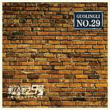
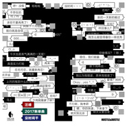
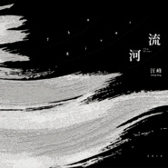
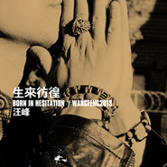
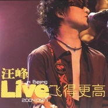
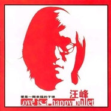

汪峰
============================

|  |  |
| :--: | :-- |
| [ 汪峰](https://i.xiami.com/wangfengyinyue) | **地区**: China 中国大陆 **风格**: 摇滚 Rock & Roll, 华语唱作人 Chinese Singer-Songwriter **播放数**: 199044290 **粉丝数**: 748835 **评论数**: 4905  |

## 档案

简介 
中 文 名： 汪峰 
民   族： 汉 
星   座： 巨蟹座 
血   型： A型 
身   高： 176cm 
出 生 地： 北京市丰台区 
出生日期： 1971年6月29日 
毕业院校： 中央音乐学院 
代表作品： 花火，飞得更高，怒放的生命，北京北京，春天里，再见青春，存在 
主要成就： 
东方风云榜最佳男歌手 
中歌榜最佳创作男歌手 
音乐风云榜最佳男歌手 
CCTV-MTV音乐盛典最佳男歌手 
全球华语歌曲排行榜最佳制作人 
简介 
汪峰，男，祖籍江苏常熟，1971年6月29日出生于北京。中国大陆摇滚歌手、音乐创作人、作词人、作曲人，鲍家街43号乐队发起人。 
汪峰自幼在中央音乐学院附小、附中学习小提琴，大学考入中央音乐学院小提琴中提琴专业，大学期间在专业音乐学习和训练之余就开始进行摇滚乐创作并组建乐队。完成本科学业后，进入中央芭蕾舞团任副首席小提琴师，后辞职后转型为职业歌手。 
早年经历 
1971年出生于北京市丰台区。 
1976年开始学习小提琴。 
1982年考入中央音乐学院附小学习小提琴。 
1984年考入中央音乐学院附中。 
1988年受罗大佑、李宗盛等影响开始尝试自己创作。 
1990年跟随学院交响乐团出访欧洲及亚洲各国演出。 
1991年考入中央音乐学院本科，学习小提琴，中提琴。获得中国小提琴比赛第二名。 
1995年中央音乐学院毕业，进入中央芭蕾舞团下的交响乐团工作。 
演艺经历 
鲍家街乐队 
1994年11月“鲍家街43号”乐队在中央音乐学院成立，汪峰担任主唱。 
1997年1月首张专辑《鲍家街43号》发行，获得亚洲卫视中文台和凤凰卫视评选的1997年大陆最佳年度男艺人候选殊荣。 
1998年底乐队发行第二张专辑《鲍家街43号2》又名风暴来临。 
签约华纳 
2000年5月汪峰签约华纳唱片、北京普涞文化艺术有限公司。同年发行第三张专辑《花火》。 
2001年2月为第六代导演王小帅获得柏林电影展银熊奖的电影《十七岁的单车》谱写了全部电影音乐。 
2002年2月与崔健、唐朝乐队在天津共同举办大型摇滚演唱会。11月16日汪峰推出第四张个人专辑《爱是一颗幸福的子弹》。5月在北京首都体育馆参加“三星之夜—为国足壮行”大型演唱会。 
2003年10月为电视剧《黄金之恋》谱写整部电视剧歌曲，其中主题曲琴岛之恋广为流传。 
2004年6月汪峰推出第五张个人专辑《笑着哭》。9月17日汪峰&鲍家街乐队在北京北展剧场举办了首次演唱会。 
峰声音乐 
2005年7月18日汪峰前华纳老板许晓峰“创盟音乐”的支持下成立了属于自己的独立厂牌“峰声音乐”。公司并作为该厂牌的制作总监挖掘、培养和扶持新人。旗下签约母公司一支国内原创乐队水晶湖乐队。12月11日汪峰参加青春偶像剧《色拉青春》拍摄并客串一角，演唱其电视剧主题歌。 
2005年12月28日汪峰第六张专辑《怒放的生命》在中国上市。 
2005年12月31日汪峰在深圳体育馆举行跨年的新年个人演唱会。 
2006年8月北京星光现场举办个人小型演唱会。 
2006年10月6日 汪峰出场增城6天摇滚20周年大型演唱会。11月汪峰演绎北京第二届车展主题曲《非凡》。 
大国文化 
2007年5月10日携最新单曲《勇敢的心》，在北京签约新公司大国文化。 
2007年5月20日作为特别嘉宾出场话剧《美丽世界的孤儿》。 
2007年6月9日制作个人第7张专辑《勇敢的心》，首度携带国内缩混后的专辑前往美国制作母带。 
2007年6月23日汪峰推出第七张专辑《勇敢的心》。 
2007年7月1日汪峰在北京星光现场举行新专辑《勇敢的心》发布暨新专辑首唱会。 
2008年1月19日在北京工人体育场举行“北京北京”个人演唱会。 
2008年4月17日参与演唱《北京欢迎你》，并在台上致辞。 
2008年7月21日在青岛站担任209棒火炬手。 
2009年5月19日汪峰推出新单曲《春天里》。 
2009年7月21日汪峰为全新专辑拍摄新造型照片，主要在纽约的皇后区、布鲁克林大桥、曼哈顿大桥、苏荷区街头咖啡馆。 
2009年7月31日汪峰推出个人第八张专辑《信仰在空中飘扬》。 
2009年8月8日汪峰携新专辑《信仰在空中飘扬》在王府井FAB音像店举办首场签售见面会。 
2009年8月16日汪峰和乐队在星光现场举行新专辑《信仰在空中飘扬》的首唱会。 
2009年11月23日汪峰湖北襄樊歌友会。2009年12月24日汪峰在平安夜于深圳举办不插电演唱会。 
2010年4月10日汪峰“信仰2010”演唱会在北京首都体育馆举行。 
2010年8月27日汪峰参加在工体场举行的“怒放—摇滚英雄演唱会”。 
2011年3月22日汪峰发布单曲《像梦一样自由》。 
2011年3月26日汪峰“春天里——信仰2011演唱会”在上海大舞台上演。在演唱会上，汪峰响应“地球一小时”熄灯活动号召，演出现场关灯三十秒。 
2011年4月8日汪峰做客腾讯名人访，畅谈音乐信仰、诠释摇滚梦想。 
2011年4月16日汪峰在北京奥体举办了“春天里信仰2011”演唱会。 
丰华秋实 
2011年5月26日汪峰以个人身份加入新经纪公司北京丰华秋实文化传媒有限公司。 
2011年6月11日"荒岛音乐会”汪峰专场在深圳华侨城举行。 
2011年10月17日汪峰通过个人微博正式首发了最新专辑的第一首单曲《存在》。 
2011年11月5日 “信仰2011”汪峰全国巡回演唱会鄂尔多斯站在鄂尔多斯铁西全民健身中心举行。 
2011年11月7日汪峰发布了他的双张新专辑的第二波主打曲目，选择同时推出《爸爸》和《向阳花》这两首与亲情有关的歌曲，共同作为第二波主打歌曲。 
2011年11月16日汪峰个人第九张专辑《生无所求》正式公布，同时发布第三波主打歌曲《上千个黎明》《大桥上》 《一百万吨的信念》。 
2011年11月19日汪峰“信仰”2011演唱会成都站在四川省体育馆举行。 
2011年11月28日汪峰在北京世纪剧院举行了新专辑《生无所求》的首唱会。 
2011年12月3日汪峰在深圳湾体育中心体育馆举行信仰2011汪峰深圳演唱会。 
2011年12月10日汪峰在北京万事达中心举办了生无所求 Life Asks For Nothing演唱会。 
2012年1月2日汪峰登陆梅赛德斯－奔驰文化中心举办上海演唱会。 
2012年2月24日汪峰出版个人小说《晚安北京》。 
2012年3月12日汪峰新专辑主打歌曲《向阳花》的正式版发布。 
2012年8月13日 汪峰加盟《中国好声音》辅助导师那英。 
2012年9月2日汪峰2012“存在”北京演唱会在工人体育场唱响。 
2012年9月24日汪峰代言探路者2012年全新品牌，并拍摄主题歌《勇敢的心》MV。 
2012年12月8日在深圳湾体育场举行“怒放——摇滚英雄演唱会”。 
2012年12月31日汪峰参加2012-2013深圳卫视跨年晚会。 
2013年2月9日汪峰在蛇年央视春晚献唱《我爱你中国》。 
2013年2月26日汪峰在北京举办2013年“存在”超级巡回演唱会发布会。 
2013年4月13日汪峰“存在”全国15场超级巡演将从天津开始。 
2013年6月17日第二季《中国好声音》新闻发布会在上海召开，新一季的导师阵容正式揭晓，汪峰取代刘欢与那英、庾澄庆、张惠妹组成专业音乐导师阵容。 
2013年10月19日汪峰2013“存在”超级巡回演唱会从成都站开启。 
2013年10月26日2013汪峰“存在”超级巡演合肥站，在合肥奥体中心开唱。 
2013年11月9日2013年“存在”超级巡演“途观之夜”上海站。 
2013年11月13日中午12点汪峰在微博发布了新专辑的第一主打《生来彷徨》。 
2013年12月2日发布全新双张专辑《生来彷徨》。 
2015年4月3日，确认继续担任第四季《中国好声音》导师；4月6日，汪峰因牌技出众将于4月14日在南京参加2015中国扑克锦标赛，开幕式上他将作为德州扑克手与两名前奥运冠军加入中国梦之队并担任名誉队长，还会参加冠军慈善赛。 
2015“峰暴来临”首站也于4月30日在石家庄举行，正式拉开巡演序幕。 
2015年9月26日汪峰“峰暴来临”上海站的演出，这是他2015年巡演收官之站。 
2016年4月8日，在《我是歌手第四季》最后一期“歌王之战”帮帮唱环节搭档老狼、栾树、丁武、高旗、李延亮、周晓鸥、马上又、陈劲组成“中国摇滚天团”演唱歌曲《礼物》。

## 专辑

| 名称 | 语种 | 唱片公司 | 发行时间 | 专辑类别 | 专辑风格 |
| :--: | :-- | :-- | :-- | :-- | :-- |
| [ 2020](./albums/2108382039.md) | 国语 | With Faith Music Corporation | 2020年04月20日 | 录音室专辑 | 都市音乐 Urban |
| [ 果岭里29号](./albums/2102870873.md) | 国语 | 汪峰工作室 | 2017年12月08日 | 录音室专辑 | 摇滚 Rock & Roll, 华语唱作人 Chinese Singer-Songwriter |
| [ 没时间干](./albums/2102931448.md) | 国语 | 汪峰工作室 | 2017年11月15日 | EP, 单曲 |  |
| [ 汪峰2017经典歌曲新编精选集](./albums/2102685044.md) | 国语 | With Faith Music Corporation | 2016年12月30日 | 精选集 | 摇滚 Rock & Roll, 华语唱作人 Chinese Singer-Songwriter |
| [ 河流The River](./albums/2100182770.md) | 国语 | 汪峰工作室 | 2015年11月18日 | 录音室专辑 | 摇滚 Rock & Roll, 华语唱作人 Chinese Singer-Songwriter |
| [ 存在·超级巡回上海演唱会Existence](./albums/1622929132.md) | 国语 | 风华秋实 | 2015年02月03日 | 现场专辑 | 摇滚 Rock & Roll, 国语流行 Mandarin Pop, 华语唱作人 Chinese Singer-Songwriter |
| [ 狼图腾 电影原声音乐Wolf Totem OST](./albums/1018785519.md) | 国语 | 通力唱片 | 2015年01月30日 | 原声带, 影视音乐 | 国语流行 Mandarin Pop |
| [ 生来彷徨 (淘心愿公益版)淘星愿汪峰新专辑虾米定制版公益项目专用 / Born In Hesitation](./albums/2088739469.md) | 国语 | 风华秋实 | 2014年01月03日 | EP, 单曲 | 摇滚 Rock & Roll, 华语唱作人 Chinese Singer-Songwriter |
| [ 生来彷徨Born In Hesitation](./albums/784338853.md) | 国语 | 风华秋实 | 2013年12月02日 | 录音室专辑 | 摇滚 Rock & Roll, 华语唱作人 Chinese Singer-Songwriter |
| [ 汪峰2011生无所求演唱会Wang Feng China Concert](./albums/2075241743.md) | 国语 | 风华秋实 | 2012年09月01日 | 现场专辑 | 摇滚 Rock & Roll, 华语唱作人 Chinese Singer-Songwriter |
| [ 生无所求Life Asks For Nothing](./albums/478379.md) | 国语 | 风华秋实 | 2011年11月16日 | 录音室专辑 | 摇滚 Rock & Roll, 华语唱作人 Chinese Singer-Songwriter |
| [ 像梦一样自由](./albums/432313.md) | 国语 | 大国文化 | 2011年03月23日 | EP, 单曲 | 摇滚 Rock & Roll, 华语唱作人 Chinese Singer-Songwriter |
| [ 信仰在空中飘扬Belief Files In The Wind](./albums/337989.md) | 国语 | 大国文化 | 2009年07月28日 | 录音室专辑 | 摇滚 Rock & Roll, 华语唱作人 Chinese Singer-Songwriter |
| [ 勇敢的心Brave Heart](./albums/4423.md) | 国语 | 大国文化 | 2007年06月23日 | 录音室专辑 | 摇滚 Rock & Roll, 华语唱作人 Chinese Singer-Songwriter |
| [ 怒放的生命](./albums/4424.md) | 国语 | 创盟音乐 | 2005年12月28日 | 录音室专辑 | 摇滚 Rock & Roll, 华语唱作人 Chinese Singer-Songwriter |
| [ Live In Beijing 飞得更高](./albums/4425.md) | 国语 | 华纳音乐 | 2005年02月20日 | 现场专辑 | 摇滚 Rock & Roll, 华语唱作人 Chinese Singer-Songwriter |
| [ 笑着哭Crying Within Smiling](./albums/4426.md) | 国语 | 华纳音乐 | 2004年06月29日 | 录音室专辑 | 摇滚 Rock & Roll, 华语唱作人 Chinese Singer-Songwriter |
| [ 爱是一颗幸福的子弹Love Is A Happy Bullet](./albums/4427.md) | 国语 | 华纳音乐 | 2002年10月10日 | 录音室专辑 | 摇滚 Rock & Roll, 华语唱作人 Chinese Singer-Songwriter |
| [ 十七岁的单车 电影原声带Beijing Bicycle](./albums/168383.md) | 其他 | Arc Light Films | 2001年07月23日 | 原声带, 影视音乐 | 原声 Soundtrack, 电影原声 Film Score |
| [ 花火(台湾版)](./albums/374017.md) | 国语 | 华纳音乐 | 2001年07月11日 | 录音室专辑 | 摇滚 Rock & Roll, 华语唱作人 Chinese Singer-Songwriter |
| [ 花火](./albums/4428.md) | 国语 | 华纳音乐 | 2000年12月09日 | 录音室专辑 | 摇滚 Rock & Roll, 华语唱作人 Chinese Singer-Songwriter |

## 评论

|  |  |  |
| :-- | :-- | :-- |
|  [虾米用户](https://emumo.xiami.com/u/420006938)  2021-01-03 12:47 赞(0) 踩(0) | 
皮裤峰
 |
|  [虾米用户](https://emumo.xiami.com/u/358104299) 悲观的唯心存在现实解构虚... 2020-11-28 10:03 赞(0) 踩(0) | 
zgsbcsbhzznmbgjqs!zslj20201128
 |
|  [虾米用户](https://emumo.xiami.com/u/229287331) 特摄导演、演员、歌手、编... 2020-09-25 02:01 赞(0) 踩(0) | 

 |
|  [虾米用户](https://emumo.xiami.com/u/445020686)  2020-09-23 13:36 赞(0) 踩(0) | 
人文关怀真摇滚
 |
|  [虾米用户](https://emumo.xiami.com/u/444913000)  2020-09-15 00:16 赞(2) 踩(0) | 
这才是摇滚
 |
|  [虾米用户](https://emumo.xiami.com/u/249855332)  2020-08-29 07:22 赞(0) 踩(0) | 
伪摇滚
 |
| ⇒ |  [虾米用户](https://emumo.xiami.com/u/434961148) 我爱吃屎 2020-10-05 22:58 赞(0) 踩(0) | 
你是大神
 |
|  [虾米用户](https://emumo.xiami.com/u/444731613)  2020-08-28 11:21 赞(0) 踩(0) | 
我是听河流这首歌认识汪峰的
 |
|  [虾米用户](https://emumo.xiami.com/u/444731613)  2020-08-28 11:21 赞(1) 踩(0) | 
我很喜欢汪峰的摇滚范儿
 |
|  [虾米用户](https://emumo.xiami.com/u/358170913)  2020-08-25 21:05 赞(0) 踩(0) | 
很喜欢你的歌曲：你是我心爱的姑娘，在雨中&amp;hellip;&amp;hellip;让我回想起以往的点点滴滴，多年了，还是忘不了&amp;hellip;&amp;hellip;
 |
|  [虾米用户](https://emumo.xiami.com/u/212468665)  2020-07-24 09:39 赞(0) 踩(0) | 
套用郭德纲段子里的话讲， 活到90您就是艺术家，您有话语权啊。老汪就是如此！什么唐朝，黑豹，窦唯，张楚，何勇不管当初如何牛逼，现在只剩下怀念的份儿了。虽然有时候也看不惯老汪的顺势而为，但人总要活着。就一点，别说自己是扛着摇滚的大旗独行就行，这杆大旗谁都扛不动！
 |
|  [虾米用户](https://emumo.xiami.com/u/355499895)  2020-07-17 20:09 赞(0) 踩(0) | 
最喜欢听你的美丽世界的孤儿  空空如也 
 |
|  [虾米用户](https://emumo.xiami.com/u/355499895)  2020-07-17 20:07 赞(0) 踩(0) | 
超喜欢汪峰  好想看他的演唱会
 |
|  [虾米用户](https://emumo.xiami.com/u/443204183)  2020-07-07 15:31 赞(0) 踩(0) | 
人至中年，生活中的各种无奈各种艰难，压抑到一定程度，听听他的歌，吼一吼他的歌，总心里好受些
 |
|  [虾米用户](https://emumo.xiami.com/u/278592860) 你数过天上的星星吗 2020-06-29 15:58 赞(0) 踩(0) | 
汪峰老师生日快乐！阖家幸福！期待您的新作品 
 |
|  [虾米用户](https://emumo.xiami.com/u/40529587) 妙音传遍法界 2020-06-29 12:20 赞(0) 踩(0) | 
生日快乐！一直为你祝福
 |
|  [虾米用户](https://emumo.xiami.com/u/443767943)  2020-06-29 12:00 赞(0) 踩(0) | 
生日快乐～～
 |
|  [虾米用户](https://emumo.xiami.com/u/380313829) 简单平凡宁静空灵 2020-06-29 11:37 赞(0) 踩(0) | 
像梦一样自由，我想要飞得更高&amp;hellip;&amp;hellip;
 |
|  [虾米用户](https://emumo.xiami.com/u/299022262)  2020-06-29 11:25 赞(0) 踩(0) | 
他生日关我什么事？我认识他吗？他认识我么？
 |
|  [虾米用户](https://emumo.xiami.com/u/43129156) 爱分享 2020-06-29 11:15 赞(0) 踩(0) | 
生日快乐
 |
|  [虾米用户](https://emumo.xiami.com/u/289687772)  2020-06-29 11:07 赞(0) 踩(0) | 
继续抖腿，写多点好歌，取娶多几个老婆，生日快乐。。生日快乐
 |
|  [虾米用户](https://emumo.xiami.com/u/315598716) Tina ng 2020-06-29 11:05 赞(1) 踩(0) | 
生日快樂happybirthday
 |
|  [虾米用户](https://emumo.xiami.com/u/443643254)  2020-06-26 16:06 赞(2) 踩(0) | 
越被黑说明越优秀
 |
|  [虾米用户](https://emumo.xiami.com/u/283411712) 无 2020-06-22 13:35 赞(2) 踩(0) | 
求怒放的生命，飞得更高，北京北京 
 |
|  [虾米用户](https://emumo.xiami.com/u/171109250) 我还没想好要写什么... 2020-05-05 02:21 赞(0) 踩(0) | 
每次皮裤汪发新专辑，渣浪都有大事件
 |
|  [虾米用户](https://emumo.xiami.com/u/441960246) 青春有梦就去追 2020-04-03 20:14 赞(0) 踩(0) | 
很棒
 |
|  [虾米用户](https://emumo.xiami.com/u/11426993) good bye 虾米 2020-03-25 06:19 赞(2) 踩(0) | 
在汪峰的歌里总能找到很多共鸣。
 |
|  [虾米用户](https://emumo.xiami.com/u/441049844)  2020-03-10 02:54 赞(1) 踩(0) | 
感谢汪峰带给我们的好音乐
 |
|  [虾米用户](https://emumo.xiami.com/u/358104299) 悲观的唯心存在现实解构虚... 2019-12-22 09:04 赞(0) 踩(0) | 
csbgbljyg!
 |
|  [虾米用户](https://emumo.xiami.com/u/324286305) 我还没想好要写什么...... 2019-12-01 09:40 赞(0) 踩(0) | 
日
 |
|  [虾米用户](https://emumo.xiami.com/u/300184210) 我爱虾米，求虾米不要停运 2019-08-28 01:56 赞(0) 踩(0) | 
亏汪峰还是入驻虾米音乐人，结果一堆歌没版权，去你Y的吧。
 |
|  [虾米用户](https://emumo.xiami.com/u/269925495)  2019-08-04 12:57 赞(0) 踩(0) | 
喜欢汪峰
 |
|  [虾米用户](https://emumo.xiami.com/u/271907199) 信仰在空中飘扬 2019-07-20 23:17 赞(2) 踩(0) | 
中国歌手，汪峰只能屈尊第一。
 |
|  [虾米用户](https://emumo.xiami.com/u/299192396) ᴅᴇᴀʀ  ʟᴇsʟɪᴇ 2019-07-18 03:21 赞(2) 踩(0) | 
嘘………一帮捣蛋鬼，什么都不懂，在这里瞎几八评论，咳咳………，我来说几句啊！至于汪峰汪老师的歌，最优秀的是追求意境而无关理性的，就好像李寻欢的飞刀和西门的剑，你不可能理解，也请你们不要尝试用语言去形容。
 |
|  [虾米用户](https://emumo.xiami.com/u/423123024)  2019-07-13 15:41 赞(2) 踩(0) | 
唯一一个喜欢的歌手，整个青春都是汪老师的歌，汪老师就是整个青春，是一种历程
 |
|  [虾米用户](https://emumo.xiami.com/u/358104299) 悲观的唯心存在现实解构虚... 2019-06-30 10:41 赞(0) 踩(0) | 
12494
 |
|  [虾米用户](https://emumo.xiami.com/u/409253462) 一直生活在童话嘅细路仔 2019-06-29 18:38 赞(0) 踩(0) | 
生日快乐
 |
|  [虾米用户](https://emumo.xiami.com/u/329869341)  2019-06-29 10:56 赞(0) 踩(0) | 
支持汪峰
 |
|  [虾米用户](https://emumo.xiami.com/u/295954481) 让青春吹动了你的长发，让... 2019-06-29 10:16 赞(0) 踩(0) | 
老汪，哈哈
 |
|  [虾米用户](https://emumo.xiami.com/u/250111274) 音乐生活之旅由此出发…… 2019-06-29 10:15 赞(0) 踩(0) | 

 |
|  [虾米用户](https://emumo.xiami.com/u/45820134) 非主流创作 2019-06-29 10:09 赞(0) 踩(0) | 
爱你
 |
|  [虾米用户](https://emumo.xiami.com/u/81163272) 消失了 2019-06-28 12:06 赞(2) 踩(0) | 
我想，中国百分之八十的人会在一定年纪之后，和汪峰的作品达成和解
 |
|  [虾米用户](https://emumo.xiami.com/u/342564462)  2019-06-23 23:06 赞(3) 踩(0) | 
汪峰老师是才子，春天里 、怒放的生命、光明，听了让人来劲
 |
|  [虾米用户](https://emumo.xiami.com/u/412286109)  2019-06-11 11:04 赞(2) 踩(0) | 
这首歌唱出了愤怒和孤独的绝望。
 |
|  [虾米用户](https://emumo.xiami.com/u/411938666)  2019-05-01 09:58 赞(2) 踩(0) | 
我只记得汪老师的半壁江山 
 |
|  [虾米用户](https://emumo.xiami.com/u/422767059)  2019-04-14 23:13 赞(2) 踩(0) | 
汪峰你是一位音乐艺术创作性很高的音乐才子直到现在那几首很有意义而好听歌曲在很多学校都播放着呢:希望你在新的作品里多些激奋人心并且让人耳目一新情不自禁地跟总音乐转!
 |
|  [虾米用户](https://emumo.xiami.com/u/48084409) 我还没想好要写什么.. 2019-03-19 00:31 赞(3) 踩(0) | 
口水歌批发商
 |
|  [虾米用户](https://emumo.xiami.com/u/420099927)  2019-03-18 23:20 赞(0) 踩(0) | 
     
 |
|  [虾米用户](https://emumo.xiami.com/u/354056427)  2019-01-20 05:06 赞(4) 踩(0) | 
收到你的回复说感谢我收藏你的作品，我就想知道是你汪峰本人给我发的吗
 |
| ⇒ |  [虾米用户](https://emumo.xiami.com/u/354056427)  2019-01-20 05:10 赞(0) 踩(0) | 
大家给这个人点赞啊，会有奇迹出现的
 |
|  [虾米用户](https://emumo.xiami.com/u/120252350) 不是只有自己一个人 2019-01-17 20:58 赞(2) 踩(0) | 
诶诶不管怎么说我也是从小学二三年级喜欢汪峰的歌到高二的00后女生，和别的同龄女生比我很奇怪了，但我不会改变的，喜欢就是喜欢，别人说的话又能怎么样呢？(๑•ั็ω•็ั๑)
 |
|  [虾米用户](https://emumo.xiami.com/u/352761076)  2019-01-02 19:03 赞(0) 踩(0) | 
         
 |
|  [虾米用户](https://emumo.xiami.com/u/89815132) 我还没想好要写什么… 2018-12-17 05:18 赞(4) 踩(0) | 
讨厌一个人看一眼都欠奉，你说那些个专门点进主页来扯一大推废话黑他的都是什么，没必要去理会他们，浪费时间罢了
 |
|  [虾米用户](https://emumo.xiami.com/u/410192546)  2018-12-10 21:52 赞(2) 踩(0) | 
我也想成为你那样的歌手
 |
|  [虾米用户](https://emumo.xiami.com/u/341763042)  2018-12-05 01:15 赞(3) 踩(0) | 
我也是入駐了 不是這個號
 |
|  [虾米用户](https://emumo.xiami.com/u/348972935) 我若不勇敢…誰替我堅強… 2018-11-25 20:32 赞(1) 踩(0) | 
汪峰是个很棒的创作歌手，也是个导师，也是我一直以来值得骄傲的歌手，汪峰加油      
 |
|  [虾米用户](https://emumo.xiami.com/u/18039659) 我还没想好要写什么... 2018-11-18 11:57 赞(0) 踩(0) | 
有才
 |
|  [虾米用户](https://emumo.xiami.com/u/184733856)  2018-10-31 00:40 赞(0) 踩(0) | 
就是喜欢你的歌，哪种感觉说不上来
 |
|  [虾米用户](https://emumo.xiami.com/u/404095536)  2018-10-25 00:13 赞(0) 踩(0) | 
太棒了！
 |
|  [虾米用户](https://emumo.xiami.com/u/404095536)  2018-10-25 00:13 赞(0) 踩(0) | 
太好听了！
 |
|  [虾米用户](https://emumo.xiami.com/u/336875934)  2018-10-19 21:51 赞(2) 踩(0) | 
汪大叔好多歌没有版权
 |
|  [虾米用户](https://emumo.xiami.com/u/405634918)  2018-10-11 21:43 赞(0) 踩(0) | 
就是喜欢，可惜好的都听不了
 |
|  [虾米用户](https://emumo.xiami.com/u/405535612)  2018-10-08 12:00 赞(1) 踩(0) | 
歌还行，人太差
 |
| ⇒ |  [虾米用户](https://emumo.xiami.com/u/309772621) 虾米，我们在末日等你 2018-10-10 22:44 赞(0) 踩(0) | 
歌好就行了，人怎么样不重要
 |
| ⇒ |  [虾米用户](https://emumo.xiami.com/u/33524598)  2018-10-20 13:08 赞(0) 踩(0) | 
能写出怎么多好的歌曲，人会差吗？  有些事情都是生活所逼的。
 |
|  [虾米用户](https://emumo.xiami.com/u/404518890)  2018-09-26 21:39 赞(0) 踩(0) | 
我是不是说话题目前面对于是不是说话说话题目？@，。。。。。。。。。？？？？？？？
 |
|  [虾米用户](https://emumo.xiami.com/u/3566813) 菩萨，祝您身体健康！34... 2018-09-26 19:48 赞(1) 踩(0) | 
老汪最近忙别的去，反倒有些不习惯，毕竟  晚安  北京  这种作品老汪有！
 |
|  [虾米用户](https://emumo.xiami.com/u/404689538)  2018-09-24 08:30 赞(1) 踩(0) | 
喜欢汪峰哥哥的歌
 |
|  [虾米用户](https://emumo.xiami.com/u/376518350)  2018-09-22 16:46 赞(0) 踩(0) | 
喜欢❤
 |
| ⇒ |  [虾米用户](https://emumo.xiami.com/u/404518890)  2018-09-26 21:41 赞(0) 踩(0) | 
在吗？
 |
|  [虾米用户](https://emumo.xiami.com/u/313870336)  2018-09-12 18:18 赞(2) 踩(0) | 
好多年不敢再听这首歌了，忽然之间又下起了大雨，我的思念像决堤的洪水，脑海里全是和你一起的曾经&amp;hellip;&amp;hellip;
 |
|  [虾米用户](https://emumo.xiami.com/u/256792267) 忠于内心 2018-09-08 11:21 赞(0) 踩(0) | 
喜欢你的创作，人生的不同阶段听你的不同的歌，有不一样的感悟。支持
 |
|  [虾米用户](https://emumo.xiami.com/u/379930942)  2018-09-05 14:01 赞(0) 踩(0) | 
第一次有你给我的评论感动，谢谢汪哥。
 |
|  [虾米用户](https://emumo.xiami.com/u/337886031)  2018-08-27 12:04 赞(0) 踩(0) | 
喜欢您的歌 
 |
|  [虾米用户](https://emumo.xiami.com/u/49056561) 我踏出的每一步都是归途 2018-08-22 21:20 赞(2) 踩(0) | 
汪峰还是很有才华的
 |
|  [虾米用户](https://emumo.xiami.com/u/376769393)  2018-08-18 21:25 赞(2) 踩(0) | 
他对生活是用心思考过的。
 |
|  [虾米用户](https://emumo.xiami.com/u/380142115) 乾坤玄精所化(红冠蜜瓜) 2018-08-07 11:26 赞(0) 踩(0) | 
汪峰歌曲漂亮、写实。
 |
|  [虾米用户](https://emumo.xiami.com/u/43126764) 或许明日太阳西下，倦鸟已... 2018-08-05 11:05 赞(0) 踩(0) | 
最爱他的《我爱你中国》
 |
| ⇒ |  [虾米用户](https://emumo.xiami.com/u/353907187) 什么都听 2018-08-16 21:17 赞(0) 踩(0) | 
先问一下是哪个版本的，别赞错了
 |
|  [虾米用户](https://emumo.xiami.com/u/400194964)  2018-08-03 19:49 赞(1) 踩(0) | 
汪峰谢谢你的歌声给我们带来了生活的勇气
 |
|  [虾米用户](https://emumo.xiami.com/u/400056775) 用自己双手创造财富品格决... 2018-08-02 19:31 赞(0) 踩(0) | 
 
 |
|  [虾米用户](https://emumo.xiami.com/u/358032597)  2018-08-02 19:27 赞(0) 踩(0) | 
加油
 |
|  [虾米用户](https://emumo.xiami.com/u/400056775) 用自己双手创造财富品格决... 2018-08-02 19:27 赞(1) 踩(0) | 
 
 |
|  [虾米用户](https://emumo.xiami.com/u/352390081)  2018-07-27 00:45 赞(0) 踩(0) | 
皮裤汪的歌还是不错的
 |
|  [虾米用户](https://emumo.xiami.com/u/12806112) 不在场！ 2018-07-23 06:40 赞(3) 踩(0) | 
汪大哥，我懂您全部。都懂。[闪电][拳头][拳头][玫瑰][爱心] [饭] [咖啡]。因为我也一样枪林弹雨、九死一生过来的。向您诚挚致敬今生。死磕到底。。。。就是胜利✌     
 |
|  [虾米用户](https://emumo.xiami.com/u/27939384) ego cogito 2018-07-13 23:27 赞(11) 踩(0) | 
别喷了，无论是后期不摇滚，或者是频频致敬经典欧美摇滚的事情。金钱美女有太多的方式来获得，起码汪半壁选择了做音乐，而且质量起码比大部分人还是高得多的。你当一个流行歌手听不就行了？指指点点没有意义，也救不了中国人。做好自己。
 |
| ⇒ |  [虾米用户](https://emumo.xiami.com/u/5917170) 在自己的轨道上行走。 2018-07-14 08:02 赞(0) 踩(0) | 
应该看到中国人的构成部分，一少部分阴谋家，一大部分蠢蛋，和少量的先进知识分子而且这些少量先进分子又有一部分移民走了。阴谋家控制言论和蠢蛋的思想及言行。为什么汪峰会被骂？看看他写的那些歌就行了，讽刺普通人劣根性（李建国），揭露社会现实（存在），于是阴谋家和蠢蛋都不满意了，至于骂人的原因，肯定不是事实，看看中国历代王朝整人史就知道了，整人的原因只是利益，整人的罪名只是借口罢了，我不是汪峰的铁杆粉丝，但是他曾创作的许多优秀的歌曲，从在鲍家街43号乐队开始，有太多的经典，我是非常喜欢的。但是谁也不是万能的，所以汪峰现在做的音乐质量和现实意义即使没有以前的好也不要怪他，不好听就不听，多简单。
 |
| ⇒ |  [虾米用户](https://emumo.xiami.com/u/134848328) 一起高呼Rock'n r... 2018-10-28 00:47 赞(0) 踩(0) | 
不觉得汪峰现在是个所谓的流行歌手
 |
|  [虾米用户](https://emumo.xiami.com/u/305394410) No pains αnd... 2018-07-13 22:42 赞(1) 踩(0) | 
好听
 |
|  [虾米用户](https://emumo.xiami.com/u/371325093) 我还没想好要写什么... 2018-07-03 16:16 赞(0) 踩(0) | 
  
 |
|  [虾米用户](https://emumo.xiami.com/u/10608998)  2018-06-29 16:16 赞(1) 踩(0) | 
空空如也我很喜欢。。生日快乐汪峰老师。。我很喜欢老师是音乐里的哲学家一个用音乐思考的真正的灵魂歌者。。。
 |
|  [虾米用户](https://emumo.xiami.com/u/246063737) 我还没想好要写什么... 2018-06-29 13:35 赞(0) 踩(0) | 
没想到跟我同一天生日
 |
|  [虾米用户](https://emumo.xiami.com/u/328297320) 我还没想好要写什么... 2018-06-29 11:43 赞(1) 踩(0) | 
老师，生日快乐！
 |
|  [虾米用户](https://emumo.xiami.com/u/327233810)  2018-06-29 11:33 赞(1) 踩(0) | 
摇滚不死，峰哥生日快乐
 |
|  [虾米用户](https://emumo.xiami.com/u/283673726) .一笑而过 2018-06-29 11:01 赞(0) 踩(0) | 
我来自越南，今天是汪峰哥生日快乐
 |
|  [虾米用户](https://emumo.xiami.com/u/355194098) 马来西亚 2018-06-29 10:33 赞(0) 踩(0) | 
汪峰老师，生日快乐。。我是来自马来西亚，我叫杨志龙，我很喜欢你的音乐。真的。。谢谢你带给我们这些孩子希望和快乐。因为你的音乐很有触感很有灵魂。很喜欢听
 |
|  [虾米用户](https://emumo.xiami.com/u/327755170)  2018-06-29 10:26 赞(0) 踩(0) | 
汪峰老师的歌我都喜欢听；他的声音很有感染力。
 |
|  [虾米用户](https://emumo.xiami.com/u/318416193)   2018-06-29 10:21 赞(0) 踩(0) | 
我都还没写完就不小心发出去了。汪峰的歌，真实，感动，每一次听他的歌都会掉下眼泪，这就是他厉害的地方，在我心里，你就是个有才华的人，在此祝你生日快乐身体健康，永远开开心心 
 |
|  [虾米用户](https://emumo.xiami.com/u/295969824)  2018-06-29 10:19 赞(0) 踩(0) | 
生日快乐峰哥
 |
|  [虾米用户](https://emumo.xiami.com/u/318416193)   2018-06-29 10:16 赞(1) 踩(0) | 
知道汪峰，是从报章上，看到汪峰，是从中国好声音开始，也是经朋友推荐。第一眼看到汪峰，好帅（必须梳发型），他的声音深深吸引了我，是我听过的男人声里，最男人的声音，我超喜欢听他说话的 
 |
|  [虾米用户](https://emumo.xiami.com/u/24273295)  2018-06-29 10:13 赞(0) 踩(0) | 
我辞职那天发了您的那首怒放的生命到朋友圈，心里真实的情感。引来无数认同。感谢有歌唱出所有人的心愿。祝生日快乐
 |
|  [虾米用户](https://emumo.xiami.com/u/293200184) 色即是空 2018-06-29 10:09 赞(0) 踩(0) | 
今天下午我在区里红歌赛决赛选唱汪峰老师的&amp;ldquo;我爱你中国&amp;rdquo;我是歌手现场版，目标就是拿金奖，也算是我为汪峰老师送上的生日礼物吧。♪٩(&amp;acute;&amp;omega;`)و♪生日快乐 
 |
|  [虾米用户](https://emumo.xiami.com/u/374487472)  2018-06-24 09:56 赞(1) 踩(0) | 
汪峰唱的和她唱的味道不一样，汪峰唱出沧桑，唱出人生
 |
|  [虾米用户](https://emumo.xiami.com/u/338753445)  2018-06-19 00:11 赞(0) 踩(0) | 
汪峰
 |
|  [虾米用户](https://emumo.xiami.com/u/375465005)  2018-06-16 21:00 赞(0) 踩(0) | 
哈哈哈
 |
|  [虾米用户](https://emumo.xiami.com/u/329780121)   2018-06-16 06:33 赞(0) 踩(0) | 
昨天听了汪峰的歌忽然发现他自己写的每首歌词都那么的精辟
 |
|  [虾米用户](https://emumo.xiami.com/u/354855786)  2018-06-12 21:58 赞(2) 踩(0) | 
汪峰我爱你！你的歌就是我生命的动力。
 |
|  [虾米用户](https://emumo.xiami.com/u/371572995)  2018-06-11 20:44 赞(2) 踩(0) | 
中年的我最爱生来彷徨。
 |
|  [虾米用户](https://emumo.xiami.com/u/279090779)  2018-06-04 18:49 赞(0) 踩(0) | 
我想的是不是能将以前砲家街23号以前的歌，放上来，还是挺怀念以前你们的小鸟
 |
|  [虾米用户](https://emumo.xiami.com/u/341158942)  2018-05-31 00:37 赞(1) 踩(0) | 
回忆 路灯下的夜晚 公交车即将收班 我望着对面小摊 回忆开始 一段又一段 回忆就像过去老师上课用掉的粉笔 黑板上的一字一句我再也没有想起 那年网络上抄的情话也说过一句又一句 只记得她叫杨槟屿模样早已忘记 过去三年如今快要毕业
 |
|  [虾米用户](https://emumo.xiami.com/u/350137435) X。。 2018-05-28 12:19 赞(1) 踩(0) | 
前天晚上演唱会很好
 |
|  [虾米用户](https://emumo.xiami.com/u/41309501) 虾米音乐 要一直努力呀 2018-05-28 04:28 赞(2) 踩(0) | 
汪峰 你这十年到底经历了什么？
 |
|  [虾米用户](https://emumo.xiami.com/u/364669305) 不断地寻找。 2018-05-27 17:58 赞(0) 踩(0) | 
多一个
 |
|  [虾米用户](https://emumo.xiami.com/u/363182090)  2018-05-26 23:04 赞(2) 踩(0) | 
汪峰我绝对的偶像，70后的我一直听汪峰的歌！
 |
|  [虾米用户](https://emumo.xiami.com/u/371356045)  2018-05-24 17:01 赞(1) 踩(0) | 
汪峰我最爱你的歌！！
 |
|  [虾米用户](https://emumo.xiami.com/u/370794689)  2018-05-23 08:00 赞(1) 踩(0) | 
汪老師，哪裡可以买到光明这首曲錄音版？
 |
|  [虾米用户](https://emumo.xiami.com/u/367473396)  2018-05-15 12:59 赞(1) 踩(0) | 
听说汪峰QQ是      568209436
 |
|  [虾米用户](https://emumo.xiami.com/u/353907187) 什么都听 2018-05-12 11:27 赞(2) 踩(0) | 
《鲍家街43号》，《风暴来临》，《花火（台湾版）》这三张专辑我能循环一个月。（话说虾米为什么连《信仰在空中飘扬》都没有 ）
 |
|  [虾米用户](https://emumo.xiami.com/u/337073881)  2018-05-07 11:25 赞(1) 踩(0) | 
每个人都不可以完美，我很喜欢汪峰。因为听你每一首歌都是用心、用情、用爱和用自己经历谱写，音乐人中的才子，摇滚中的经典。永远挺你峰哥！
 |
|  [虾米用户](https://emumo.xiami.com/u/247616584)  2018-05-05 20:31 赞(2) 踩(0) | 
花火是我最喜欢的歌，喜欢十年了。
 |
|  [虾米用户](https://emumo.xiami.com/u/362239541)  2018-05-01 07:34 赞(0) 踩(0) | 
汪峰最棒的 
 |
|  [虾米用户](https://emumo.xiami.com/u/361820926)  2018-04-29 21:47 赞(1) 踩(0) | 
我大哥超喜欢汪峰的歌词，
 |
|  [虾米用户](https://emumo.xiami.com/u/274932516)  2018-04-26 00:28 赞(2) 踩(0) | 
国内大量抄袭外国的皮裤歌手，自封半壁江山，可笑
 |
| ⇒ |  [虾米用户](https://emumo.xiami.com/u/310780780) 这个人话太多了，根本写不... 2018-05-04 01:31 赞(0) 踩(0) | 
这话什么意思？不大合适吧
 |
|  [虾米用户](https://emumo.xiami.com/u/357693071)  2018-04-24 14:52 赞(2) 踩(0) | 
我最崇拜的歌手之一   
 |
|  [虾米用户](https://emumo.xiami.com/u/359839993) 李亚泽 2018-04-23 09:53 赞(1) 踩(0) | 
么么哒
 |
|  [虾米用户](https://emumo.xiami.com/u/359839993) 李亚泽 2018-04-23 09:52 赞(1) 踩(0) | 
   
 |
|  [虾米用户](https://emumo.xiami.com/u/340287905)  2018-04-20 20:28 赞(0) 踩(0) | 
力量在汪峰的歌声里体现
 |
|  [虾米用户](https://emumo.xiami.com/u/340287905)  2018-04-20 20:26 赞(0) 踩(0) | 
怒放的生命我听了两年！一直喜欢！期待不断出现有震撼力的歌曲
 |
| ⇒ |  [虾米用户](https://emumo.xiami.com/u/360365769)  2018-04-26 17:58 赞(0) 踩(0) | 
我一直很喜欢你的歌，希望有好的歌曲能让喜欢你的人听到
 |
|  [虾米用户](https://emumo.xiami.com/u/351230664)  2018-04-15 09:44 赞(1) 踩(0) | 
特喜欢听汪峰的歌 
 |
|  [虾米用户](https://emumo.xiami.com/u/334935388)  2018-04-14 19:37 赞(0) 踩(0) | 
好听
 |
|  [虾米用户](https://emumo.xiami.com/u/358139296)  2018-04-14 13:07 赞(0) 踩(0) | 
666
 |
|  [虾米用户](https://emumo.xiami.com/u/357772958)  2018-04-13 14:35 赞(1) 踩(0) | 
    
 |
|  [虾米用户](https://emumo.xiami.com/u/339086767)  2018-04-09 09:07 赞(0) 踩(0) | 
特喜欢这首歌
 |
|  [虾米用户](https://emumo.xiami.com/u/272959068) 这家伙很聪明什么也没留下... 2018-04-05 13:31 赞(1) 踩(0) | 

 |
|  [虾米用户](https://emumo.xiami.com/u/355540016)  2018-04-02 21:18 赞(2) 踩(0) | 
你现在有新的歌有出没
 |
|  [虾米用户](https://emumo.xiami.com/u/355147742) ぞゞ:-[尪*XI嚻AO... 2018-04-02 19:40 赞(1) 踩(0) | 
汪叔叔呵呵
 |
|  [虾米用户](https://emumo.xiami.com/u/285498181) 比吴亦凡差一点的男人 2018-04-01 18:35 赞(4) 踩(0) | 
这几天听了汪峰很多歌，重新认识了这个穿皮裤的男人！
 |
|  [虾米用户](https://emumo.xiami.com/u/413990) 恶人勿近～ 2018-03-31 10:31 赞(2) 踩(0) | 
峰哥，对不起啊，我真不是故意的。
 |
|  [虾米用户](https://emumo.xiami.com/u/356178859) 一年老一年，一日没一日 2018-03-30 22:25 赞(2) 踩(0) | 
特来点赞关注
 |
|  [虾米用户](https://emumo.xiami.com/u/354804221) 喊出来我的声音，却木有人... 2018-03-27 19:47 赞(2) 踩(0) | 
看了这里的评论，发现真是不能和网易比，主要看素质，骂街和观点有很大区别
 |
| ⇒ |  [虾米用户](https://emumo.xiami.com/u/347233938)  2018-04-07 12:44 赞(0) 踩(0) | 
好
 |
|  [虾米用户](https://emumo.xiami.com/u/38086631) 版权就和自由一样，永远属... 2018-03-27 17:06 赞(2) 踩(0) | 
汪峰都给你们宣传了，版权呢
 |
|  [虾米用户](https://emumo.xiami.com/u/291241868) 我还没想好要写什么... 2018-03-27 15:25 赞(4) 踩(0) | 
希望汪峰能来新加坡开演唱会！！！！
 |
|  [虾米用户](https://emumo.xiami.com/u/18622046) 初识变化 2018-03-24 17:44 赞(11) 踩(0) | 
热评里那些黑子真的不带脑子啊（摊手）
 |
|  [虾米用户](https://emumo.xiami.com/u/236602171)  2018-03-18 10:58 赞(19) 踩(0) | 
谢谢你，汪峰老师，谢谢你走心的歌词，用心演唱的音乐，带给我感动与力量! 最喜欢的那句写入心底的歌词:不因所以肮脏而玷污我心，不因全部屈辱而破碎灵魂《流年啊，你奈我何》究竟受多少伤才能无视痛楚《河流》
 |
|  [虾米用户](https://emumo.xiami.com/u/342080968)  2018-03-17 08:07 赞(0) 踩(0) | 
今天是很特别的一天.突然间收到你 汪峰  的留言.这对于我本人來说是莫大的驚喜.。因为一直以來我就喜欢听你的歌.摇滚乐就应该尽情尽力去表達.去爆发.无止尽的爱著.固摰著.回头想想..我和她一起听你的n歌時候.算一算也有8年之久了吧!&amp;hellip;她要是知道了也一定很开心吧..!
 |
|  [虾米用户](https://emumo.xiami.com/u/334935388)  2018-03-10 07:39 赞(0) 踩(0) | 
好听
 |
|  [虾米用户](https://emumo.xiami.com/u/43865979) 这家伙很牛逼什么也没留下... 2018-03-05 14:02 赞(0) 踩(0) | 
几年前小学的时候记得一朋友特喜欢唱汪峰的歌 然后把我们也带的迷起了 汪峰，现在出国几年了 也渐渐和他们没了联系 不知道他们过的还好吗
 |
|  [虾米用户](https://emumo.xiami.com/u/36329653) Barney 2018-03-03 09:23 赞(0) 踩(0) | 
他的好作品都是来自鲍家街时期，后面就算了吧
 |
|  [虾米用户](https://emumo.xiami.com/u/352822460)  2018-03-01 21:58 赞(1) 踩(0) | 
好听
 |
|  [虾米用户](https://emumo.xiami.com/u/343624372)  2018-02-25 19:11 赞(1) 踩(0) | 
虾米居然没有汪峰后续版权？
 |
|  [虾米用户](https://emumo.xiami.com/u/351715520)  2018-02-21 22:35 赞(2) 踩(0) | 
有灵魂
 |
|  [虾米用户](https://emumo.xiami.com/u/130241)  2018-02-15 14:19 赞(2) 踩(0) | 
喜欢汪峰的歌，词曲都好，有点诗人的味道，人身感悟有同感
 |
|  [虾米用户](https://emumo.xiami.com/u/6232603)  2018-02-11 18:47 赞(1) 踩(0) | 
为什么没版权了
 |
|  [虾米用户](https://emumo.xiami.com/u/54588641) 想靠近我的只有人类 2018-02-10 01:31 赞(3) 踩(0) | 
就是喜欢汪峰的歌
 |
|  [虾米用户](https://emumo.xiami.com/u/348792892)  2018-02-09 08:08 赞(1) 踩(0) | 
普通Disco
 |
|  [虾米用户](https://emumo.xiami.com/u/348792892)  2018-02-09 08:05 赞(0) 踩(0) | 
厉害汪老师
 |
|  [虾米用户](https://emumo.xiami.com/u/341147850)   2018-02-08 19:57 赞(2) 踩(0) | 
讲道理汪峰的歌真正是有灵魂的歌曲
 |
|  [虾米用户](https://emumo.xiami.com/u/341729230)  2018-02-08 10:25 赞(1) 踩(0) | 
静静地听歌
 |
|  [虾米用户](https://emumo.xiami.com/u/297213566)  2018-02-05 04:44 赞(2) 踩(0) | 
我喜欢汪峰老师
 |
|  [虾米用户](https://emumo.xiami.com/u/138784422) 一日入冬~ 2018-02-04 11:19 赞(0) 踩(0) | 
潮种
 |
|  [虾米用户](https://emumo.xiami.com/u/346503137)  2018-01-27 22:55 赞(1) 踩(0) | 
不错我要是评委的话我给你100
 |
|  [虾米用户](https://emumo.xiami.com/u/44668600)  2018-01-27 19:46 赞(2) 踩(0) | 
看汪半壁对jessie的一番评价，开始有了好感、黑转路人
 |
|  [虾米用户](https://emumo.xiami.com/u/346347657)  2018-01-25 22:04 赞(6) 踩(0) | 
汪峰我爱你        
 |
|  [虾米用户](https://emumo.xiami.com/u/199786427) 随心~对的起自己 2018-01-25 17:47 赞(0) 踩(0) | 
我什么时候收藏汪峰的歌了？系统自动刷的？
 |
|  [虾米用户](https://emumo.xiami.com/u/549784) 音乐...带你飞 2018-01-25 14:40 赞(1) 踩(0) | 
花火的节奏好燃！！！
 |
|  [虾米用户](https://emumo.xiami.com/u/549784) 音乐...带你飞 2018-01-25 14:25 赞(4) 踩(0) | 
我们 杭州见！！！！！
 |
|  [虾米用户](https://emumo.xiami.com/u/332344398)  2018-01-25 10:01 赞(0) 踩(0) | 
汪半壁哈哈哈哈哈哈
 |
|  [虾米用户](https://emumo.xiami.com/u/253372707) siebzehn für... 2018-01-25 00:43 赞(3) 踩(0) | 
汪峰的老婆和郑钧的老婆 我站汪峰一家 
 |
|  [虾米用户](https://emumo.xiami.com/u/308469092)  2018-01-23 23:03 赞(2) 踩(0) | 
老汪的黑子一直很多啊，平心而论，人家还是才华横溢的，不该得到大家更多的认可吗？还有人无脑地黑？反正他的很多歌我自己是听着很感动的！特别赞，看不惯黑子们才破例发言的。。。。
 |
|  [虾米用户](https://emumo.xiami.com/u/57381000) 酒叙 2018-01-22 18:09 赞(1) 踩(0) | 
高中前完全不懂得品天朝摇滚和民谣，特别是土摇土谣.大学后以窦唯开始一发不可收拾到出国后油管听这些老男人半夜里听的泪流满面.被媒体消费的名人我不知道真正的他们是什么样的，至少最为音乐人他们值得被膜拜.
 |
|  [虾米用户](https://emumo.xiami.com/u/60162450)   2018-01-21 00:16 赞(4) 踩(0) | 
说句老实话我对汪峰的歌和大众一样欣赏不来，可是我现在认真听的时候，他的歌也有很深刻的含义，比如好多歌词里都有存在 值得深思，当然一副好的耳机是有必要的，后悔黑过他，汪峰老师对不起。
 |
|  [虾米用户](https://emumo.xiami.com/u/345537197)  2018-01-20 07:00 赞(3) 踩(0) | 
我一直是汪峰的粉，听到同学说汪波长得丑，我把他的书包扔到了门外
 |
|  [虾米用户](https://emumo.xiami.com/u/316417421)  2018-01-14 19:45 赞(0) 踩(0) | 
好听  太好听了      
 |
|  [虾米用户](https://emumo.xiami.com/u/341627747) 闲看庭前窗外花开花谢，慢... 2018-01-01 03:33 赞(1) 踩(0) | 
     
 |
|  [虾米用户](https://emumo.xiami.com/u/311479018)   2017-12-26 14:29 赞(0) 踩(0) | 
666
 |
|  [虾米用户](https://emumo.xiami.com/u/269046798)  2017-12-25 14:54 赞(0) 踩(0) | 
底裤离开了糖葫芦寄过来顺顺利利
 |
|  [虾米用户](https://emumo.xiami.com/u/269046798)  2017-12-25 14:54 赞(0) 踩(0) | 
叽叽叽叽叽
 |
|  [虾米用户](https://emumo.xiami.com/u/306608359) 。。。 2017-12-23 22:11 赞(0) 踩(0) | 
汪峰老师好啊
 |
|  [虾米用户](https://emumo.xiami.com/u/300706843) 唯有音乐和爱不可辜负。 2017-12-22 14:15 赞(4) 踩(0) | 
喜欢你的音乐，与你人品无关
 |
|  [虾米用户](https://emumo.xiami.com/u/335575338)  2017-12-18 22:04 赞(1) 踩(0) | 
我天天听几遍汪哥哥手机里一百多首
 |
|  [虾米用户](https://emumo.xiami.com/u/9728554)  2017-12-18 21:47 赞(4) 踩(0) | 
实话实说 这货的歌真 他妈的难听！！！！我上班的楼下广告牌 老是放他的歌，他的歌？ 简直就像在讨债！！ 烦死了 草！！！！！就不能放点有节操的！！！！！！！这些歌多好听啊！ <a href="http://www.xiami.com/song/3443306?spm=a1z1s.6928797.1561534521.183.JYy1KW" target="_blank" rel="nofollow noreferrer noopener">http://www.xiami.com/song/3443306?spm=a1z1s.6928797.1561534521.183.JYy1KW</a> <a href="http://www.xiami.com/song/2100577?spm=a1z1s.6928797.1561534521.228.3tQ5eI" target="_blank" rel="nofollow noreferrer noopener">http://www.xiami.com/song/2100577?spm=a1z1s.6928797.1561534521.228.3tQ5eI</a> <a href="http://www.xiami.com/song/2548946?spm=a1z1s.6928797.1561534521.1" target="_blank" rel="nofollow noreferrer noopener">http://www.xiami.com/song/2548946?spm=a1z1s.6928797.1561534521.1</a>
 |
| ⇒ |  [虾米用户](https://emumo.xiami.com/u/340644031)  2018-02-09 12:10 赞(0) 踩(0) | 
你不愿听就滚
 |
| ⇒ |  [虾米用户](https://emumo.xiami.com/u/351652126)  2018-03-10 23:38 赞(0) 踩(0) | 

 |
|  [虾米用户](https://emumo.xiami.com/u/274589667) Hello 2017-12-18 12:13 赞(4) 踩(0) | 
我刚入驻了虾米音乐人，欢迎大来我的个人主页，收听我的最新音乐
 |
| ⇒ |  [虾米用户](https://emumo.xiami.com/u/338753445)  2018-06-19 00:13 赞(0) 踩(0) | 
汪峰：
 |
|  [虾米用户](https://emumo.xiami.com/u/8995902) Faraway 2017-12-18 10:11 赞(3) 踩(0) | 
音乐论坛，只讨论音乐本身。如今市场畸形，鲜有潜心创作的歌手，都是一首口水歌走红就大江南北走穴，选秀节目除了经典老歌，近年作品除了许巍就是汪峰的了，还是可以证明实力的。
 |
|  [虾米用户](https://emumo.xiami.com/u/11704065) 讲不出再见 2017-12-15 23:11 赞(3) 踩(0) | 
听听汪峰以前的歌，真感觉现在那个穿皮裤的是冒充的。
 |
|  [虾米用户](https://emumo.xiami.com/u/298017712) 我还没想好要写什么... 2017-12-14 13:29 赞(0) 踩(0) | 
伍佰
 |
|  [虾米用户](https://emumo.xiami.com/u/336582694)  2017-12-11 20:16 赞(0) 踩(0) | 
为什么有点歌曲不能停， 《像梦一样自由》不能听？
 |
|  [虾米用户](https://emumo.xiami.com/u/337781930)  2017-12-10 17:28 赞(0) 踩(0) | 
  
 |
|  [虾米用户](https://emumo.xiami.com/u/283420666)  You are my ... 2017-11-27 16:13 赞(177) 踩(0) | 
郑钧：《门》 1997  汪峰：《门开了》 2004  郑钧：《幸福的子弹》 1999  汪峰：《爱是一颗幸福的子弹》 2002  郑钧：《怒放》1999  汪峰：《怒放的生命》2005  郑钧：《流星》 2001  汪峰：《恒星》 2005  郑钧：《一刹那》2005  汪峰：《一瞬间》2011  郑钧：《长安长安》 2006  汪峰：《北京北京》 2007  郑钧：《生来忧伤》 2007  汪峰：《生来彷徨》 2013
 |
| ⇒ |  [虾米用户](https://emumo.xiami.com/u/268048000) 花开富贵上善若水 2017-12-09 20:47 赞(0) 踩(0) | 
哈哈哈
 |
| ⇒ |  [虾米用户](https://emumo.xiami.com/u/198982450)  2017-12-13 19:51 赞(0) 踩(0) | 
哈哈哈为什么呢
 |
| ⇒ |  [虾米用户](https://emumo.xiami.com/u/310443615)  2017-12-29 09:45 赞(0) 踩(0) | 
wowowwiwiwowwwwwww
 |
| ⇒ |  [虾米用户](https://emumo.xiami.com/u/134848328) 一起高呼Rock'n r... 2018-01-06 20:56 赞(0) 踩(0) | 
这么老套的喷子文拿上来还能上热评?  现在的人能不能有点是非判断?
 |
| ⇒ |  [虾米用户](https://emumo.xiami.com/u/194331466) BridgeOverTr... 2018-01-09 16:05 赞(0) 踩(0) | 
许巍：像风一样自由 汪峰：像梦一样自由
 |
| ⇒ |  [虾米用户](https://emumo.xiami.com/u/194331466) BridgeOverTr... 2018-01-09 16:10 赞(0) 踩(0) | 
<q><b>大洋说：</b></q>
 |
| ⇒ |  [虾米用户](https://emumo.xiami.com/u/92159184)   2018-01-09 20:24 赞(0) 踩(0) | 
厉害了
 |
| ⇒ |  [虾米用户](https://emumo.xiami.com/u/134848328) 一起高呼Rock'n r... 2018-01-13 18:30 赞(0) 踩(0) | 
<q><b>RA的时间旅者说：</b></q>
 |
| ⇒ |  [虾米用户](https://emumo.xiami.com/u/344771011) 呼啸而过的青春，沉默不语... 2018-01-14 22:07 赞(0) 踩(0) | 
<q><b>RA的时间旅者说：</b></q>
 |
| ⇒ |  [虾米用户](https://emumo.xiami.com/u/42810244)   2018-01-20 09:41 赞(0) 踩(0) | 
尴尬的一B。
 |
| ⇒ |  [虾米用户](https://emumo.xiami.com/u/276024978) 冷静 2018-01-20 17:20 赞(0) 踩(0) | 
人家只是调侃一下  抄没抄袭听过的还不知道吗？
 |
| ⇒ |  [虾米用户](https://emumo.xiami.com/u/352129588)  2018-03-01 15:01 赞(0) 踩(0) | 
董郎。
 |
| ⇒ |  [虾米用户](https://emumo.xiami.com/u/138357720)  2018-04-04 22:22 赞(0) 踩(0) | 
傻逼，除了名字有点一样，曲和词哪里一样了，最看不起，无脑黑了。
 |
| ⇒ |  [虾米用户](https://emumo.xiami.com/u/138357720)  2018-04-04 22:24 赞(0) 踩(0) | 
<q><b>RA的时间旅者说：</b></q>
 |
| ⇒ |  [虾米用户](https://emumo.xiami.com/u/336582781)  2018-04-15 22:21 赞(0) 踩(0) | 
<q><b>说：</b></q>
 |
| ⇒ |  [虾米用户](https://emumo.xiami.com/u/349015838) 我想好要写什么了，就是这... 2018-05-10 15:05 赞(0) 踩(0) | 
赞错了
 |
| ⇒ |  [虾米用户](https://emumo.xiami.com/u/358000746)  2018-09-14 06:46 赞(0) 踩(0) | 
啊，抄袭吗
 |
| ⇒ |  [虾米用户](https://emumo.xiami.com/u/403476822)  2018-09-14 14:52 赞(0) 踩(0) | 
哈哈哈
 |
| ⇒ |  [虾米用户](https://emumo.xiami.com/u/256710312) 览洲 2018-10-05 09:25 赞(0) 踩(0) | 
<q><b>普莱斯队长duang说：</b></q>
 |
| ⇒ |  [虾米用户](https://emumo.xiami.com/u/336168191)   2018-11-05 02:24 赞(0) 踩(0) | 
<q><b>揽洲说：</b></q>
 |
| ⇒ |  [虾米用户](https://emumo.xiami.com/u/223711072)  2019-11-12 16:28 赞(0) 踩(0) | 
<q><b>avril158200说：</b></q>
 |
| ⇒ |  [虾米用户](https://emumo.xiami.com/u/223711072)  2019-11-12 16:29 赞(0) 踩(0) | 
<q><b>RA的时间旅者说：</b></q>
 |
| ⇒ |  [虾米用户](https://emumo.xiami.com/u/445455249)  2020-10-20 21:07 赞(0) 踩(0) | 
<q><b>横斜说：</b></q>
 |
|  [虾米用户](https://emumo.xiami.com/u/9645212)  2017-11-25 20:49 赞(6) 踩(0) | 
我不知道汪峰的人品怎么样，不过这也与我无关。我只知道汪峰是一个摇滚歌手，一个自己写歌曲的、有思想的、中国的摇滚歌手，他的歌很好听。这就够了。
 |
|  [虾米用户](https://emumo.xiami.com/u/333965514) 私の名前は？ 2017-11-15 19:38 赞(3) 踩(0) | 
中国摇滚半壁江山？？Beyond和黑豹都笑了
 |
| ⇒ |  [虾米用户](https://emumo.xiami.com/u/207203162) 愿永存善念和远方，愿渴望... 2017-11-19 13:24 赞(0) 踩(0) | 
你把唐朝吃了？？
 |
| ⇒ |  [虾米用户](https://emumo.xiami.com/u/26217347) 我这家伙很懒，个人介绍也... 2017-12-11 01:14 赞(0) 踩(0) | 
<q><b>行者说：</b></q>
 |
|  [虾米用户](https://emumo.xiami.com/u/257890711) 用音乐代替我永远陪伴你 2017-11-06 19:16 赞(2) 踩(0) | 
峰哥，要不要经纪人？我绝对是业界典范
 |
|  [虾米用户](https://emumo.xiami.com/u/315378715)  2017-11-03 22:33 赞(2) 踩(0) | 
很好听，沸腾
 |
|  [虾米用户](https://emumo.xiami.com/u/322142172) 我这个人 2017-11-03 19:35 赞(0) 踩(0) | 
666
 |
|  [虾米用户](https://emumo.xiami.com/u/7189936)  2017-10-30 10:23 赞(2) 踩(0) | 
喜欢激励 奋进 展翅高飞 保持愤怒 呐喊。。。
 |
|  [虾米用户](https://emumo.xiami.com/u/1382694)  2017-10-30 10:19 赞(0) 踩(0) | 
恩，很味道的声音歌词也很适合他~相信唱的是人生轨迹，有点羡慕他呢~有梦想的人生都是无悔的吧
 |
|  [虾米用户](https://emumo.xiami.com/u/328922640)  2017-10-28 19:50 赞(0) 踩(0) | 
我在国外开车，天天都听汪峰的歌，只是现在好多歌都找不到了。
 |
|  [虾米用户](https://emumo.xiami.com/u/323130048)  2017-10-28 15:21 赞(1) 踩(0) | 
汪峰，爱听你的歌
 |
|  [虾米用户](https://emumo.xiami.com/u/84714836) 生来自由。 2017-10-28 00:41 赞(0) 踩(0) | 
我就知道点进老板的评论绝逼是一堆对骂←_←
 |
| ⇒ |  [虾米用户](https://emumo.xiami.com/u/344771011) 呼啸而过的青春，沉默不语... 2018-01-14 22:10 赞(0) 踩(0) | 
无视
 |
|  [虾米用户](https://emumo.xiami.com/u/60316970)  2017-10-28 00:36 赞(1) 踩(0) | 
唱的很平常，到不是谁都可以模仿
 |
|  [虾米用户](https://emumo.xiami.com/u/9648083)  2017-10-28 00:32 赞(0) 踩(0) | 
“孩子们手持剃刀冲上街道，只为找到自己之后把自己干掉”，我最喜欢这句歌词，二十几岁的时候彷徨、迷茫、一切没有方向，躁动地急于给一切一个了结，却永远找不到自己。
 |
| ⇒ |  [虾米用户](https://emumo.xiami.com/u/319026843) 喜欢励志 2017-10-28 23:06 赞(0) 踩(0) | 
什么歌？
 |
| ⇒ |  [虾米用户](https://emumo.xiami.com/u/9648083)  2017-10-28 23:07 赞(0) 踩(0) | 
<q><b>一个喜欢月亮的女生说：</b></q>
 |
|  [虾米用户](https://emumo.xiami.com/u/364269) 我的身体内爬满了许多的虫... 2017-10-28 00:32 赞(1) 踩(0) | 
什么叫创作，意思就是先有创意，然后再造作，每个做艺术的其实都是一开始创意不断，灵感泉涌，慢慢的到后来灵感枯竭，就不得不再造作，就是再度创造制作，这也是符合艺术的规律的，不光是他，我们再看看其他的人也是，真正能流芳百世的东西也就那么几首件，更何况他也只是一个歌者，还不叫艺术家，他也要吃饭，要生活，只要听着好听，我们就《生无所求》了吧
 |
| ⇒ |  [虾米用户](https://emumo.xiami.com/u/340614987) 躁以砺志，静以养心，可静... 2017-12-19 20:53 赞(0) 踩(0) | 
ACDC那伙老帮子都什么岁数了？不是照样high到起飞？
 |
|  [虾米用户](https://emumo.xiami.com/u/3840283)  2017-10-28 00:31 赞(1) 踩(0) | 
感觉今后的专辑在考虑歌曲流行度的同时要兼顾一下个性了啊。个人认为09年的信仰在空中飘扬是非常好的一张专辑，许多经典的传唱度高的歌都是从这盘专辑出来的，但是那些传唱不多的，比如空空如也、蹩脚的爱情、破碎的歌谣也非常棒。新专辑有点口水了，希望汪老师下一张专辑侧重放一点取悦自己的歌在专辑里，不能太照顾大众的口味~
 |
|  [虾米用户](https://emumo.xiami.com/u/33086706) 暂时回归 2017-10-28 00:19 赞(0) 踩(0) | 
存在即合理。 难道合理为止吗？下面的评论说摇滚衰落了是没错，可还不至于堕落到意义混淆的时候。 流行也没有错，摇滚和流行的界限并不那么明显。 汪峰就好好认清自己的能力和心态不行吗，前段时间微博上瞎闹彻底看清他的心态了。 他的歌打动了一批有相同经历的人。然后呢？至少它从没震撼过我。说个ball啊还，时间最能证明，那些一直大张旗鼓瞎嚷嚷的都是什么货色。
 |
|  [虾米用户](https://emumo.xiami.com/u/738558) 知音难寻 2017-10-28 00:18 赞(0) 踩(0) | 
今天考试 又看到关于不公平的话题 顿时很沮丧 后来想到汪峰的一百万吨的信念 赶紧来补课 明天继续振奋精神
 |
|  [虾米用户](https://emumo.xiami.com/u/4911739) 人生海海，相濡以沫 2017-10-28 00:10 赞(0) 踩(0) | 
版权问题吧，新专辑确实也不太好在网上那么快放出 希望大家多多支持正版吧= =
 |
|  [虾米用户](https://emumo.xiami.com/u/1206271) 默默滴用音乐影响自己 2017-10-27 23:59 赞(0) 踩(0) | 
他是继崔健之后，我喜欢的第二个内地摇滚歌手
 |
|  [虾米用户](https://emumo.xiami.com/u/46598832)  2017-10-27 23:59 赞(0) 踩(0) | 
深夜静到听他的歌，洗涤心灵。下雪的深夜是心灵和人性最接近的时候。
 |
|  [虾米用户](https://emumo.xiami.com/u/2029177)  2017-10-27 23:59 赞(0) 踩(0) | 
快点开个中国巡演啊，不要每次都在北京开，让我也有机会去看看
 |
|  [虾米用户](https://emumo.xiami.com/u/2973204)  2017-10-27 23:59 赞(0) 踩(0) | 
我爱你。在很久很久以前。从你的穷摇滚到现在的的商业女人炒作诸如此类。我的记忆一直停留在第一次听回忆之前忘记之后的瞬间。
 |
|  [虾米用户](https://emumo.xiami.com/u/2628187)  2017-10-27 23:56 赞(0) 踩(0) | 
汪峰最大的魅力，最吸引自己的，是歌星圈或者说娱乐圈难得的文艺范儿和对摇滚“愤怒不息”的态度，这是对音乐品质和对他自己人生的态度！
 |
|  [虾米用户](https://emumo.xiami.com/u/12288304) 乱到最高点，心中有秩序了 2017-10-27 23:56 赞(1) 踩(0) | 
一句话:每个人无论什么身份都有权利评论艺术作品的权利，艺术也不是什么高高束之楼阁的贵重东西，当年贝多芬的音乐全欧洲的人都会欣赏；有些事有些人是不需要查找太多的百度百科或者列举更多的术语的，既耽误自己时间也让他人无端反感
 |
|  [虾米用户](https://emumo.xiami.com/u/35613078)   2017-10-27 23:56 赞(1) 踩(0) | 
任何艺术作品都有各自的受众，并且作品有好坏之分，有类型和艺术性上的差异，所以人对于艺术作品的欣赏也有品味的高低之分，欣赏者欣赏一个高级或低级的艺术作品并不能等同于欣赏者具有高级或低级的欣赏水平，更不能由此判断出欣赏者的智商。艺术作品和创作者欣赏者相互联系又相对独立，每一个艺术作品都倾注了创作者的心血所以对于欣赏不了的艺术作品，应该给予尊重。
 |
|  [虾米用户](https://emumo.xiami.com/u/281337813)  2017-10-27 23:53 赞(0) 踩(0) | 
就喜欢听北京北京
 |
|  [虾米用户](https://emumo.xiami.com/u/40729438) 听音乐可以活到100岁 2017-10-27 23:43 赞(5) 踩(0) | 
中国摇滚已经摇的稀巴烂了
 |
|  [虾米用户](https://emumo.xiami.com/u/275271187)  2017-10-27 23:42 赞(3) 踩(0) | 
喜欢北京北京
 |
|  [虾米用户](https://emumo.xiami.com/u/216962255) EXO ONEAREWE 2017-10-27 23:38 赞(1) 踩(0) | 
因为中国好声音2才认识汪峰，然后就一直喜欢他的歌（不要看我的播放记录，歌大部分在QQ音乐里）
 |
|  [虾米用户](https://emumo.xiami.com/u/2557738) 天真烂漫傻，爱恨情仇疯，... 2017-10-27 23:29 赞(0) 踩(0) | 
哈哈，一进来看到虾米音乐人的版面，笑CRY了。哈哈哈哈哈，。。哈。
 |
|  [虾米用户](https://emumo.xiami.com/u/42793112)  2017-10-27 23:26 赞(0) 踩(0) | 
2014年第一次去北京，聽的第一場concert在鳥巢就是为“汪峰”，按理说他的歌路not really my dish，但是有那么几首经典的歌曲我真的喜欢，喜欢~
 |
|  [虾米用户](https://emumo.xiami.com/u/41766890) 大爱小夜曲   大爱鸡哥 2017-10-27 23:25 赞(3) 踩(0) | 
喜欢李乐鸡的小夜曲    小夜曲的粉丝一呼百应   汪峰垃圾中的垃圾   瞎b呀   草你大爷的汪峰   傻子   越说越来气了
 |
|  [虾米用户](https://emumo.xiami.com/u/7094186)  2017-10-27 23:24 赞(0) 踩(0) | 
是我最喜欢也最敬佩的一个偶像，听他总能感受到一种向上的力量和试图穿透阴暗与阻挡的生命的本质，与我们感同身受着，用歌声给予我们理解和安慰。
 |
|  [虾米用户](https://emumo.xiami.com/u/44145386)   2017-10-27 23:23 赞(3) 踩(0) | 
每个人都有自己的生活方式，只不过他的是在媒体的透明曝光并加以渲染情况下产生的，我从来不相信娱乐媒体，我也不去想他的生活态度到底是怎样，相信一位年过不惑之年的人肯定比我这二十刚出头的小毛孩活得清楚。 我只知道每当孤独时我总会不自觉的听你的歌，我没发用文字去描写那种感受，对一位歌手，我只对歌而不对人，对你的歌只有两个字：挚爱。
 |
|  [虾米用户](https://emumo.xiami.com/u/18433625)  2017-10-27 23:23 赞(0) 踩(0) | 
很多年前 跟着北京青年 一起喜欢峰哥的歌曲
 |
|  [虾米用户](https://emumo.xiami.com/u/1700092)  2017-10-27 23:21 赞(1) 踩(0) | 
用一个词形容汪峰的音乐，就是“不实惠”。他的歌曲基本没有旋律和节奏可言，飘忽不定，唱到哪儿算哪儿，难以捉摸。都说旋律和节奏是音乐的灵魂与骨骼，所以汪峰的音乐就如同丢了魂的行尸。其粉丝把这种风格叫“新摇滚”，这和世人想以“厨艺明星”的称谓来改变闲人林依轮的尴尬境遇的情况如出一辙。
 |
|  [虾米用户](https://emumo.xiami.com/u/8720614)  2017-10-27 23:15 赞(0) 踩(0) | 
我真的需要晚安北京从鲍家街43号就喜欢了
 |
|  [虾米用户](https://emumo.xiami.com/u/9768091)  2017-10-27 23:04 赞(0) 踩(0) | 
大概是将摇滚乐和商业结合得最好的摇滚歌手吧，一位在音乐中尖锐批判现实体制的摇滚音乐人，那么叛逆和纠结。
 |
|  [虾米用户](https://emumo.xiami.com/u/10817122)  2017-10-27 23:02 赞(0) 踩(0) | 
记得那年去九寨沟，一路上反复听的就是汪峰的怒放的生命，感受自不必多说，多少人评述的比我精彩，当我得心里总有汪峰的一个位置。 网友恶评其私人生活也好，不理解其对民工兄弟的规则教育也罢，总之，汪峰就是汪峰，才华横溢的思索性歌手，不会夸人的话就是，比起锅内大多数歌手，汪峰不浅薄，有内容
 |
|  [虾米用户](https://emumo.xiami.com/u/3031953) 低调-最牛X的炫耀！ 2017-10-27 23:02 赞(0) 踩(0) | 
每当不如意的时候听听   真的很有感触 .北京北京.. 希望能有一首歌是 杭州杭州  厦门厦门.我最喜欢的2个城市..
 |
|  [虾米用户](https://emumo.xiami.com/u/233193898)  2017-10-23 10:56 赞(0) 踩(0) | 
我很喜欢这首歌，不经意就被打动了。
 |
|  [虾米用户](https://emumo.xiami.com/u/260379270)  2017-10-18 11:20 赞(0) 踩(0) | 
听汪峰的歌会让你对一切都会有另一种激情！
 |
|  [虾米用户](https://emumo.xiami.com/u/298948030) 中國詩音樂電影创始人作曲... 2017-10-17 21:54 赞(0) 踩(0) | 
我很喜欢你音乐 加油兄弟
 |
|  [虾米用户](https://emumo.xiami.com/u/24325936) 无忧无虑，向前游。。。 2017-10-16 11:06 赞(1) 踩(0) | 
我觉得中国的歌迷很奇怪，喜欢窦唯就要黑汪峰，喜欢汪峰就要黑许巍，喜欢许巍就要黑郑钧，喜欢郑钧就要黑窦唯。。。 难道我不能都喜欢吗，谁的歌好听我就喜欢谁，管他窦唯还是汪峰！
 |
|  [虾米用户](https://emumo.xiami.com/u/6164011)  2017-10-15 18:16 赞(1) 踩(0) | 
你要问我，现在中国最纯粹和最有水平的音乐人，那我回答你：那就是汪峰，由于摇滚在中国很不受大众待见，一直被黑，真TMD奇葩。
 |
|  [虾米用户](https://emumo.xiami.com/u/330194922)  2017-10-14 23:35 赞(0) 踩(0) | 
怎么vip都没有  光明这首歌下载的
 |
|  [虾米用户](https://emumo.xiami.com/u/1292687) 简介个头 2017-10-14 16:26 赞(1) 踩(0) | 
黑汪峰在某些人群里已经成为政治正确了，这些人不用心听歌，只知道装逼，为小众而小众，还喜欢炫耀自己的愚蠢。几年前我也是之一，我为曾经的自己感到羞耻。汪峰的音乐给了我真实的感动。
 |
|  [虾米用户](https://emumo.xiami.com/u/111113642) x 2017-10-13 23:32 赞(0) 踩(0) | 
流行就是忘本。虾米永恒不变的真理。笑cry。 
 |
|  [虾米用户](https://emumo.xiami.com/u/187091788) 大雨将至。 2017-10-13 02:32 赞(1) 踩(0) | 
就音乐创作上的才华来说，我觉得他是值得敬佩的。
 |
|  [虾米用户](https://emumo.xiami.com/u/287197988)  2017-10-12 15:46 赞(0) 踩(0) | 
牛逼
 |
|  [虾米用户](https://emumo.xiami.com/u/315764374)  2017-10-12 15:06 赞(0) 踩(0) | 
走心，震撼心灵 
 |
|  [虾米用户](https://emumo.xiami.com/u/216962255) EXO ONEAREWE 2017-10-12 12:05 赞(0) 踩(0) | 
汪老师
 |
|  [虾米用户](https://emumo.xiami.com/u/12181015) 朝闻佳音，夕可死矣。 2017-10-12 10:01 赞(0) 踩(0) | 
新歌哪里听？
 |
|  [虾米用户](https://emumo.xiami.com/u/12181015) 朝闻佳音，夕可死矣。 2017-10-08 17:10 赞(0) 踩(0) | 
汪老师又又又又错过了头条
 |
|  [虾米用户](https://emumo.xiami.com/u/288967219) No fuck 2017-10-08 10:41 赞(0) 踩(0) | 
听汪峰四年半，喜欢摇滚乐因为汪峰，喜欢音乐因为汪峰，学吉他因为汪峰，梦想开琴行和音乐酒吧更因为汪峰
 |
|  [虾米用户](https://emumo.xiami.com/u/248109769)  2017-10-07 18:12 赞(0) 踩(0) | 
不是好人
 |
|  [虾米用户](https://emumo.xiami.com/u/328310517)  2017-10-04 16:28 赞(0) 踩(0) | 
汪峰
 |
|  [虾米用户](https://emumo.xiami.com/u/311627877) 不甘 2017-10-03 22:43 赞(0) 踩(0) | 
虽然人不咋的，但是歌确实不错，尤其是其他明星改编翻唱的
 |
|  [虾米用户](https://emumo.xiami.com/u/328004928)  2017-10-02 18:03 赞(0) 踩(0) | 
王峰吹牛王峰最帅
 |
|  [虾米用户](https://emumo.xiami.com/u/44247889) 泰辰 2017-09-30 11:54 赞(0) 踩(0) | 
希望再能听您的新作品 
 |
|  [虾米用户](https://emumo.xiami.com/u/3374701) 带你领略音乐魅力！ 2017-09-29 13:28 赞(1) 踩(0) | 
喜欢老板的歌，喜欢老板的态度！
 |
|  [虾米用户](https://emumo.xiami.com/u/310425659)  2017-09-22 17:54 赞(0) 踩(0) | 
     
 |
|  [虾米用户](https://emumo.xiami.com/u/326058569)  2017-09-21 11:20 赞(0) 踩(0) | 
只有经历过人生坎坷，有故事的人才能写出感动人心的好歌！而汪峰恰好是一个
 |
| ⇒ |  [虾米用户](https://emumo.xiami.com/u/326058569)  2017-09-21 11:21 赞(0) 踩(0) | 
怒放的生命  这首歌真心不错
 |
|  [虾米用户](https://emumo.xiami.com/u/323524927)  2017-09-19 20:29 赞(0) 踩(0) | 
周杰伦周杰伦周杰伦周杰伦周杰伦
 |
|  [虾米用户](https://emumo.xiami.com/u/293156028) 好想找个祸水…… 2017-09-17 08:24 赞(0) 踩(0) | 
我爱你！汪峰
 |
|  [虾米用户](https://emumo.xiami.com/u/293678728)  2017-09-15 17:39 赞(0) 踩(0) | 
感谢尼带来的音乐
 |
|  [虾米用户](https://emumo.xiami.com/u/2653030) 好音乐共享群 2017-09-13 16:21 赞(0) 踩(0) | 
好音乐聆听经典【华语百强歌手之汪峰】
 |
|  [虾米用户](https://emumo.xiami.com/u/303333771)  2017-09-12 13:46 赞(0) 踩(0) | 
再見二十世紀，前奏響起就有種想哭的感覺。國內唯一喜歡的歌手
 |
|  [虾米用户](https://emumo.xiami.com/u/324445175)  2017-09-10 23:42 赞(0) 踩(0) | 
汪峰的歌好听
 |
|  [虾米用户](https://emumo.xiami.com/u/36982187) 努力做打不死的小强 2017-09-10 07:46 赞(0) 踩(0) | 
只想说真的喜欢你
 |
|  [虾米用户](https://emumo.xiami.com/u/191863023) 两个“从不”原则，就是从... 2017-09-09 23:34 赞(2) 踩(0) | 
很多好歌，但是出于道德上的责任，只能給负分
 |
|  [虾米用户](https://emumo.xiami.com/u/318636963)  2017-09-05 15:52 赞(1) 踩(0) | 
好歌，百听不厌！   
 |
|  [虾米用户](https://emumo.xiami.com/u/321629008)  2017-08-29 18:01 赞(0) 踩(0) | 
好歌好心情 知足常乐
 |
|  [虾米用户](https://emumo.xiami.com/u/301567654)  2017-08-27 19:53 赞(1) 踩(0) | 
啊哈哈哈汪上羊
 |
|  [虾米用户](https://emumo.xiami.com/u/318409747) 不再联系 2017-08-26 23:56 赞(0) 踩(0) | 
好像现在只有我听汪峰
 |
|  [虾米用户](https://emumo.xiami.com/u/284937359)  2017-08-26 00:17 赞(0) 踩(0) | 
！
 |
|  [虾米用户](https://emumo.xiami.com/u/284937359)  2017-08-26 00:17 赞(0) 踩(0) | 
在挫败时，给你重新爬起来的勇气，我一直在路上，感受并享受沿途的风景！承受着并欣赏着岁月的悲喜，飞的更高&amp;hellip;&amp;hellip;&amp;hellip;&amp;hellip;
 |
|  [虾米用户](https://emumo.xiami.com/u/284637499) 如果单恋有用，要两情相悦... 2017-08-23 13:59 赞(0) 踩(0) | 
心灵震撼
 |
|  [虾米用户](https://emumo.xiami.com/u/256242981) 沉默的时候不要太用心 2017-08-21 17:43 赞(1) 踩(0) | 
9.9北体见，有两张票约的走起
 |
|  [虾米用户](https://emumo.xiami.com/u/315306149)  2017-08-20 11:39 赞(2) 踩(0) | 
摇滚和叛逆永远是被人们同时提起的，所以摇滚才是小众的非主流的，但所有的音乐形式都应该被尊重，所有喜爱不同音乐形式的人同样应该被尊重。为什么大家要喷来喷去，因为心眼小，容不下别人的喜好且认为自己喜欢的才是最好的，请这些人都醒醒吧，活的更像个大人不好吗。 喜欢摇滚，不只是曲风，更是精神，摇滚其实就是男人的风骨，汪峰老师只是充分展现出了。穿不穿皮裤或许只是个人爱好，穿着三角裤一样可以继续摇滚。
 |
|  [虾米用户](https://emumo.xiami.com/u/134848328) 一起高呼Rock'n r... 2017-08-20 10:33 赞(1) 踩(0) | 
我发现几年一些喷子狗的评论竟然上热评了!
 |
|  [虾米用户](https://emumo.xiami.com/u/85383802)   2017-08-20 00:24 赞(1) 踩(0) | 
汪峰牛逼
 |
|  [虾米用户](https://emumo.xiami.com/u/319176451)   2017-08-15 19:33 赞(0) 踩(0) | 
你的歌真好听
 |
|  [虾米用户](https://emumo.xiami.com/u/312829640)  2017-08-11 15:47 赞(0) 踩(0) | 
我喜欢你汪峰
 |
|  [虾米用户](https://emumo.xiami.com/u/317902657)  2017-08-11 13:14 赞(0) 踩(0) | 
好歌好心情，知足常乐。
 |
|  [虾米用户](https://emumo.xiami.com/u/305663442)  2017-07-31 21:44 赞(1) 踩(0) | 
你的歌是我最喜欢的
 |
|  [虾米用户](https://emumo.xiami.com/u/1832040)  2017-07-31 18:28 赞(6) 踩(0) | 
崔健之后中国摇滚再无接班人。
 |
|  [虾米用户](https://emumo.xiami.com/u/258546119)  2017-07-31 17:29 赞(2) 踩(0) | 
我不是黑粉　但是你們的評價太沒水平了
 |
|  [虾米用户](https://emumo.xiami.com/u/316269009) 每一首歌都蕴含着一个美丽... 2017-07-31 09:10 赞(3) 踩(0) | 
汪峰我一定支持你!我的偶像!望你一定坚持下去!
 |
|  [虾米用户](https://emumo.xiami.com/u/41918145)  2017-07-30 13:55 赞(1) 踩(0) | 
歌曲能让人产生共鸣
 |
|  [虾米用户](https://emumo.xiami.com/u/310139948)  2017-07-29 08:19 赞(1) 踩(0) | 
充满激情；精神最高境界莫过于此
 |
|  [虾米用户](https://emumo.xiami.com/u/302677494) 一千个吻那么深 2017-07-26 18:42 赞(2) 踩(0) | 
中國當代真正的歌者！也許是唯一的&amp;mdash;&amp;mdash;我不加前綴了，免得人家吐我口水。
 |
|  [虾米用户](https://emumo.xiami.com/u/273855553)  2017-07-21 01:20 赞(2) 踩(0) | 
汪峰的歌词犀利深刻，有冲破黑暗迎接黎明之势，又显更多的压抑和痛心，现实和无奈，千万别打磨平你的棱角，青年需要你，中国更需要你。不惧死，大胆揭露丑陋，拥护你，唤醒热血。
 |
|  [虾米用户](https://emumo.xiami.com/u/9450535) 欢迎光临继续狂妄，祝听乐... 2017-07-19 18:52 赞(2) 踩(0) | 
喜欢
 |
|  [虾米用户](https://emumo.xiami.com/u/297814045) 在家就是好朋友一起吃饭 2017-07-17 17:23 赞(1) 踩(0) | 
哈哈哈哈666
 |
|  [虾米用户](https://emumo.xiami.com/u/304970553)  2017-07-17 07:26 赞(0) 踩(0) | 
好声音支持你   
 |
|  [虾米用户](https://emumo.xiami.com/u/293373324) 把握灵魂的温度。 2017-07-16 14:13 赞(0) 踩(0) | 
汪老师年纪大了味道就出来了。
 |
|  [虾米用户](https://emumo.xiami.com/u/37126146) 入口是苦，回味是香，中间... 2017-07-11 10:04 赞(0) 踩(0) | 
歌都听不了了，这算撤离虾米了？
 |
|  [虾米用户](https://emumo.xiami.com/u/310820756) I'm in love ... 2017-07-09 10:20 赞(0) 踩(0) | 
喜欢汪峰的歌，我第一次听汪峰的歌是《怒放的生命》，它让我感到了生命的美好，不会自暴自弃❣
 |
|  [虾米用户](https://emumo.xiami.com/u/261894960)  2017-07-06 09:29 赞(0) 踩(0) | 
不错 
 |
|  [虾米用户](https://emumo.xiami.com/u/308967171)  2017-07-01 21:48 赞(0) 踩(0) | 
4321
 |
|  [虾米用户](https://emumo.xiami.com/u/127219444) 被雨侵略 2017-06-29 22:55 赞(0) 踩(0) | 
你可曾想起筠子？
 |
|  [虾米用户](https://emumo.xiami.com/u/307758585)  2017-06-27 16:46 赞(0) 踩(0) | 
汪峰老师 我想听那英老师那首歌  征服 
 |
|  [虾米用户](https://emumo.xiami.com/u/307758585)  2017-06-27 16:43 赞(0) 踩(0) | 
我最喜欢汪峰老师唱的那首歌啦 北京  北京 
 |
|  [虾米用户](https://emumo.xiami.com/u/306074671)  2017-06-23 12:13 赞(0) 踩(0) | 
男人的心声
 |
|  [虾米用户](https://emumo.xiami.com/u/11502880) 我一个人吃饭旅行到处走。 2017-06-20 18:26 赞(1) 踩(0) | 
网上哪儿都有关于摇滚的撕逼，我只想说，呵呵。
 |
| ⇒ |  [虾米用户](https://emumo.xiami.com/u/308617390) 这家伙很聪明什么也没留下... 2017-07-31 06:54 赞(0) 踩(0) | 
+1
 |
|  [虾米用户](https://emumo.xiami.com/u/305424364) 科学是一切的答案。 2017-06-18 09:46 赞(1) 踩(0) | 
3岁喜欢汪峰的歌。
 |
|  [虾米用户](https://emumo.xiami.com/u/268048000) 花开富贵上善若水 2017-06-15 13:09 赞(2) 踩(0) | 
我赞同 素养    
 |
|  [虾米用户](https://emumo.xiami.com/u/295513825)  2017-06-14 15:31 赞(0) 踩(0) | 
都下的啥b笑死人！
 |
|  [虾米用户](https://emumo.xiami.com/u/301655321)  2017-06-03 23:21 赞(2) 踩(0) | 
听歌，好听，打动你就行，有啥好喷的，无聊不&amp;hellip;&amp;hellip;
 |
|  [虾米用户](https://emumo.xiami.com/u/226618799) 噢！乖 2017-05-31 20:39 赞(32) 踩(0) | 
内容已删除
 |
| ⇒ |  [虾米用户](https://emumo.xiami.com/u/134848328) 一起高呼Rock'n r... 2017-06-04 22:54 赞(0) 踩(0) | 
搞笑
 |
| ⇒ |  [虾米用户](https://emumo.xiami.com/u/134848328) 一起高呼Rock'n r... 2017-06-04 22:55 赞(0) 踩(0) | 
你喜欢他们就去听他们的歌  来这儿喷  有意思吗
 |
| ⇒ |  [虾米用户](https://emumo.xiami.com/u/134848328) 一起高呼Rock'n r... 2017-06-04 22:56 赞(0) 踩(0) | 
说实话  谢天笑的火才是中国摇滚的悲哀
 |
| ⇒ |  [虾米用户](https://emumo.xiami.com/u/134848328) 一起高呼Rock'n r... 2017-06-04 23:01 赞(0) 踩(0) | 
没有沉淀  没有内涵  只是靠一点简单明快的节奏来吸引大家的耳朵  这样的作品能长久吗？  肯定不行的  从最近几年出的新专辑就能看出来  至于为什么鲍家街为什么不火  只能是时候未到  并不能因此就否定他们的才华
 |
| ⇒ |  [虾米用户](https://emumo.xiami.com/u/226618799) 噢！乖 2017-06-05 12:49 赞(0) 踩(0) | 
<q><b>大洋说：</b></q>
 |
| ⇒ |  [虾米用户](https://emumo.xiami.com/u/134848328) 一起高呼Rock'n r... 2017-06-08 22:42 赞(0) 踩(0) | 
<q><b>AKSK说：</b></q>
 |
| ⇒ |  [虾米用户](https://emumo.xiami.com/u/134848328) 一起高呼Rock'n r... 2017-06-08 22:43 赞(0) 踩(0) | 
<q><b>AKSK说：</b></q>
 |
| ⇒ |  [虾米用户](https://emumo.xiami.com/u/226618799) 噢！乖 2017-06-09 12:32 赞(0) 踩(0) | 
<q><b>大洋说：</b></q>
 |
| ⇒ |  [虾米用户](https://emumo.xiami.com/u/134848328) 一起高呼Rock'n r... 2017-06-09 12:53 赞(0) 踩(0) | 
<q><b>AKSK说：</b></q>
 |
| ⇒ |  [虾米用户](https://emumo.xiami.com/u/134848328) 一起高呼Rock'n r... 2017-06-09 12:56 赞(0) 踩(0) | 
<q><b>AKSK说：</b></q>
 |
| ⇒ |  [虾米用户](https://emumo.xiami.com/u/134848328) 一起高呼Rock'n r... 2017-06-13 19:27 赞(0) 踩(0) | 
<q><b>说：</b></q>
 |
| ⇒ |  [虾米用户](https://emumo.xiami.com/u/39619085)  2017-07-04 15:14 赞(0) 踩(0) | 
扯淡，别拿你的无知当无耻。现在还有旭日阳刚吗？
 |
| ⇒ |  [虾米用户](https://emumo.xiami.com/u/226618799) 噢！乖 2017-07-04 21:23 赞(0) 踩(0) | 
<q><b>zxx540354738说：</b></q>
 |
| ⇒ |  [虾米用户](https://emumo.xiami.com/u/134848328) 一起高呼Rock'n r... 2017-08-06 17:39 赞(0) 踩(0) | 
<q><b>万神说：</b></q>
 |
| ⇒ |  [虾米用户](https://emumo.xiami.com/u/308617390) 这家伙很聪明什么也没留下... 2017-08-06 17:40 赞(0) 踩(0) | 
<q><b>说：</b></q>
 |
| ⇒ |  [虾米用户](https://emumo.xiami.com/u/308617390) 这家伙很聪明什么也没留下... 2017-10-27 23:15 赞(0) 踩(0) | 
<q><b>大洋说：</b></q>
 |
| ⇒ |  [虾米用户](https://emumo.xiami.com/u/282038472)  2017-10-31 07:09 赞(0) 踩(0) | 
中国人玩摇滚，本来就很搞笑的，汪峰的音乐，骨子里其实并非所谓摇滚
 |
| ⇒ |  [虾米用户](https://emumo.xiami.com/u/54588641) 想靠近我的只有人类 2018-02-10 01:35 赞(0) 踩(0) | 
知道几个乐队就在这拽了，你也就应该停留在从前，反清复明吧，孩子。
 |
| ⇒ |  [虾米用户](https://emumo.xiami.com/u/257036397) 我还没想好要写什么... 2018-02-10 04:26 赞(0) 踩(0) | 
<q><b>是个大月亮说：</b></q>
 |
| ⇒ |  [虾米用户](https://emumo.xiami.com/u/226618799) 噢！乖 2018-02-10 14:08 赞(0) 踩(0) | 
<q><b>是个大月亮说：</b></q>
 |
| ⇒ |  [虾米用户](https://emumo.xiami.com/u/54588641) 想靠近我的只有人类 2018-02-13 00:50 赞(0) 踩(0) | 
<q><b>AKSK说：</b></q>
 |
| ⇒ |  [虾米用户](https://emumo.xiami.com/u/54588641) 想靠近我的只有人类 2018-02-13 00:57 赞(0) 踩(0) | 
<q><b>殇说：</b></q>
 |
| ⇒ |  [虾米用户](https://emumo.xiami.com/u/226618799) 噢！乖 2018-02-13 19:03 赞(0) 踩(0) | 
<q><b>是个大月亮说：</b></q>
 |
| ⇒ |  [虾米用户](https://emumo.xiami.com/u/251532612) 千帆过尽，勿忘初心。 2018-03-15 11:47 赞(0) 踩(0) | 
历害历害。
 |
| ⇒ |  [虾米用户](https://emumo.xiami.com/u/352867671)  2018-04-13 20:56 赞(0) 踩(0) | 
摇滚不能商业化？你不是无脑黑？
 |
| ⇒ |  [虾米用户](https://emumo.xiami.com/u/51989815) 心满意足地去生活。 2018-04-14 19:27 赞(0) 踩(0) | 
你逗我呢，鲍家街组的时候已经过了国摇高潮了。97年的时候你说的这几个人早就flop了。。
 |
| ⇒ |  [虾米用户](https://emumo.xiami.com/u/134848328) 一起高呼Rock'n r... 2018-04-15 00:55 赞(0) 踩(0) | 
<q><b>万神说：</b></q>
 |
| ⇒ |  [虾米用户](https://emumo.xiami.com/u/340025421)  2018-11-19 01:10 赞(0) 踩(0) | 
少装了，没弹过五年以上的琴，就别在这充大头，你懂个球，半壁业务能力远超现在这些天天只喊摇滚精神的人，词曲创作能力不比窦唯差，丁武除了首专就是个废物，对了首专还是台湾人做的，唐朝有没有专辑中的能力水平还要打个问号。 别以为拿窦唯做头像显得自己多牛了，小学生一个。窦唯出了这么多张专辑你买了几张？估计你也就是个唱个无地自容的渣。少装比，多听歌。
 |
| ⇒ |  [虾米用户](https://emumo.xiami.com/u/134848328) 一起高呼Rock'n r... 2018-11-26 13:26 赞(0) 踩(0) | 
<q><b>老树缠猫说：</b></q>
 |
| ⇒ |  [虾米用户](https://emumo.xiami.com/u/134848328) 一起高呼Rock'n r... 2018-11-26 13:26 赞(0) 踩(0) | 
<q><b>AKSK说：</b></q>
 |
| ⇒ |  [虾米用户](https://emumo.xiami.com/u/286395011) 我很聪明什么也没留下..... 2019-01-03 22:24 赞(0) 踩(0) | 
没事举报了
 |
| ⇒ |  [虾米用户](https://emumo.xiami.com/u/134848328) 一起高呼Rock'n r... 2019-03-31 14:21 赞(0) 踩(0) | 
<q><b>说：</b></q>
 |
| ⇒ |  [虾米用户](https://emumo.xiami.com/u/411542508)  2019-03-31 14:28 赞(0) 踩(0) | 
<q><b>TP说：</b></q>
 |
| ⇒ |  [虾米用户](https://emumo.xiami.com/u/411542508)  2019-03-31 14:29 赞(0) 踩(0) | 
<q><b>拱虾米说：</b></q>
 |
| ⇒ |  [虾米用户](https://emumo.xiami.com/u/51919083)  2019-10-13 11:06 赞(0) 踩(0) | 
你意思摇滚不应该商业化？搞摇滚的都应该穷不拉几的的？观念太土，土掉掉渣！看看欧美搞音乐搞摇滚的，哪个不是巨富，没听过穷的掉渣搞摇滚受欢迎的！
 |
| ⇒ |  [虾米用户](https://emumo.xiami.com/u/216784802) 好的音乐最重要的是真实，... 2019-10-16 08:28 赞(0) 踩(0) | 
<q><b>尼姑你就从了老衲吧说：</b></q>
 |
| ⇒ |  [虾米用户](https://emumo.xiami.com/u/51919083)  2019-10-16 08:56 赞(0) 踩(0) | 
<q><b>小悲说：</b></q>
 |
|  [虾米用户](https://emumo.xiami.com/u/253366802)  2017-05-29 23:40 赞(1) 踩(0) | 
咯
 |
|  [虾米用户](https://emumo.xiami.com/u/197801115)  2017-05-29 11:38 赞(0) 踩(0) | 
顺应了大众音乐 还是选择了商业化
 |
| ⇒ |  [虾米用户](https://emumo.xiami.com/u/299414201)  2017-06-19 10:59 赞(0) 踩(0) | 
好歌你真的听得懂吗？
 |
|  [虾米用户](https://emumo.xiami.com/u/57682530) 虾小米变了啦啦啦 2017-05-25 08:40 赞(0) 踩(0) | 
梦想导师
 |
|  [虾米用户](https://emumo.xiami.com/u/37126146) 入口是苦，回味是香，中间... 2017-05-22 16:42 赞(0) 踩(0) | 
好多又下架.......
 |
|  [虾米用户](https://emumo.xiami.com/u/292161967)  2017-05-22 03:28 赞(0) 踩(0) | 
汪峰的歌，唱出了现实的人生， 
 |
|  [虾米用户](https://emumo.xiami.com/u/22363444)  2017-05-20 12:46 赞(0) 踩(0) | 
怒放的生命
 |
|  [虾米用户](https://emumo.xiami.com/u/293692544) 你敢给我说话吗？我咬你 2017-05-04 07:02 赞(0) 踩(0) | 
你是我崇拜的人
 |
|  [虾米用户](https://emumo.xiami.com/u/293650917)  2017-05-03 22:27 赞(0) 踩(0) | 
我是他粉丝
 |
|  [虾米用户](https://emumo.xiami.com/u/291821859)   2017-05-03 15:52 赞(0) 踩(0) | 
有内涵
 |
|  [虾米用户](https://emumo.xiami.com/u/290230921)  2017-05-01 00:52 赞(0) 踩(0) | 
唱歌挺好听的
 |
|  [虾米用户](https://emumo.xiami.com/u/288961821) 我还没想好要写什么... 2017-04-30 16:02 赞(0) 踩(0) | 
他的歌超级好听！ 
 |
|  [虾米用户](https://emumo.xiami.com/u/255404009)  2017-04-30 13:39 赞(0) 踩(0) | 
没事就听汪老师的歌，挺你
 |
|  [虾米用户](https://emumo.xiami.com/u/270936678)  2017-04-29 08:04 赞(0) 踩(0) | 
汪峰的歌好听
 |
|  [虾米用户](https://emumo.xiami.com/u/290696471)  2017-04-28 04:35 赞(0) 踩(0) | 
汪峰中国摇滚乐领头军
 |
| ⇒ |  [虾米用户](https://emumo.xiami.com/u/283102521)  2017-05-14 14:05 赞(0) 踩(0) | 
吹牛逼。摇滚败类
 |
| ⇒ |  [虾米用户](https://emumo.xiami.com/u/134848328) 一起高呼Rock'n r... 2017-05-20 20:27 赞(0) 踩(0) | 
<q><b>自由墓地说：</b></q>
 |
|  [虾米用户](https://emumo.xiami.com/u/291629176)  2017-04-26 19:43 赞(0) 踩(0) | 
好听
 |
|  [虾米用户](https://emumo.xiami.com/u/290958168)  2017-04-25 20:57 赞(0) 踩(0) | 
很好
 |
|  [虾米用户](https://emumo.xiami.com/u/264008929) keep running 2017-04-24 21:41 赞(0) 踩(0) | 
严肃音乐，就是不一样～！！
 |
|  [虾米用户](https://emumo.xiami.com/u/290792740) 手只能我牵，怀抱只能有我... 2017-04-23 20:03 赞(0) 踩(0) | 
汪峰，加油
 |
|  [虾米用户](https://emumo.xiami.com/u/290064077)  2017-04-20 17:39 赞(0) 踩(0) | 
 
 |
|  [虾米用户](https://emumo.xiami.com/u/257346634) 虾米音乐，乐随心动！ 2017-04-18 19:31 赞(0) 踩(0) | 
汪峰，我支持你！加油！   
 |
|  [虾米用户](https://emumo.xiami.com/u/257346634) 虾米音乐，乐随心动！ 2017-04-18 15:41 赞(1) 踩(0) | 
汪峰，加油！   
 |
|  [虾米用户](https://emumo.xiami.com/u/256123647) 宽仁以洒脱，睿智以不扰 2017-04-18 11:15 赞(1) 踩(0) | 
Ghh
 |
|  [虾米用户](https://emumo.xiami.com/u/283762069)  2017-04-18 09:26 赞(0) 踩(0) | 
藏
 |
|  [虾米用户](https://emumo.xiami.com/u/289414959) 忘了世界，忘了我 2017-04-18 07:40 赞(1) 踩(0) | 
不错的现代摇滚歌手
 |
|  [虾米用户](https://emumo.xiami.com/u/289266585)  2017-04-16 21:20 赞(1) 踩(0) | 
nice
 |
|  [虾米用户](https://emumo.xiami.com/u/276094550)  2017-04-16 20:53 赞(2) 踩(0) | 
汪峰的歌，属于励志歌比较多，
 |
| ⇒ |  [虾米用户](https://emumo.xiami.com/u/27596252) 心动，行动，悦动，乐动。 2017-04-19 17:06 赞(0) 踩(0) | 
这叫人文
 |
|  [虾米用户](https://emumo.xiami.com/u/288254432)  2017-04-14 20:47 赞(0) 踩(0) | 
  
 |
|  [虾米用户](https://emumo.xiami.com/u/280193203)  2017-04-10 12:43 赞(0) 踩(0) | 
&amp;hellip;&amp;hellip;&amp;hellip;
 |
|  [虾米用户](https://emumo.xiami.com/u/286219595)  2017-04-08 17:33 赞(0) 踩(0) | 
佷好我喜歡❤️
 |
|  [虾米用户](https://emumo.xiami.com/u/287134955)  2017-04-08 14:41 赞(1) 踩(0) | 
嗯嗯好
 |
|  [虾米用户](https://emumo.xiami.com/u/287106562)  2017-04-08 12:49 赞(4) 踩(0) | 
虾米。有许多歌都没有。白充ViP了！
 |
| ⇒ |  [虾米用户](https://emumo.xiami.com/u/257346634) 虾米音乐，乐随心动！ 2017-04-18 15:43 赞(0) 踩(0) | 
不可能呢！我们正在完善中，你要相信我们的团队！
 |
|  [虾米用户](https://emumo.xiami.com/u/286971805)  2017-04-07 22:59 赞(1) 踩(0) | 
就是好听 
 |
|  [虾米用户](https://emumo.xiami.com/u/286426716)  2017-04-05 18:59 赞(0) 踩(0) | 
333333333333333333333333333333 3
 |
|  [虾米用户](https://emumo.xiami.com/u/284331687)  2017-04-04 12:06 赞(0) 踩(0) | 
没有勇敢的心
 |
|  [虾米用户](https://emumo.xiami.com/u/285939607) 用心而唱！ 2017-04-04 11:48 赞(1) 踩(0) | 
就是喜欢汪峰的歌！
 |
|  [虾米用户](https://emumo.xiami.com/u/285866747)   2017-04-04 04:10 赞(1) 踩(0) | 
就是喜欢汪峰的歌
 |
|  [虾米用户](https://emumo.xiami.com/u/284676497)  2017-04-04 00:18 赞(0) 踩(0) | 
一直喜欢汪峰的歌
 |
|  [虾米用户](https://emumo.xiami.com/u/282210714)   2017-04-03 08:32 赞(1) 踩(0) | 
好听
 |
|  [虾米用户](https://emumo.xiami.com/u/285470943)  2017-04-02 21:38 赞(1) 踩(0) | 
好听
 |
|  [虾米用户](https://emumo.xiami.com/u/125737186)  2017-04-02 21:01 赞(2) 踩(0) | 
一个有思想的摇滚歌手
 |
|  [虾米用户](https://emumo.xiami.com/u/285163952)   2017-04-01 21:29 赞(1) 踩(0) | 
喜欢你没道理
 |
|  [虾米用户](https://emumo.xiami.com/u/284153086)  2017-03-31 23:39 赞(2) 踩(0) | 
挺好的
 |
|  [虾米用户](https://emumo.xiami.com/u/284681317)  2017-03-30 23:52 赞(2) 踩(0) | 
喜欢
 |
|  [虾米用户](https://emumo.xiami.com/u/1159079)  2017-03-30 22:17 赞(1) 踩(0) | 
入世
 |
|  [虾米用户](https://emumo.xiami.com/u/284635043)  2017-03-30 21:21 赞(1) 踩(0) | 
确实好听
 |
|  [虾米用户](https://emumo.xiami.com/u/282563624)  2017-03-29 21:42 赞(2) 踩(0) | 
好听  
 |
|  [虾米用户](https://emumo.xiami.com/u/282832502)  2017-03-29 01:36 赞(1) 踩(0) | 
很喜欢他 有爆发感 然后喜欢他的歌词~~~
 |
|  [虾米用户](https://emumo.xiami.com/u/284128665)  2017-03-28 21:14 赞(1) 踩(0) | 
喜欢他有故事的音乐
 |
|  [虾米用户](https://emumo.xiami.com/u/282100412)  2017-03-26 23:06 赞(8) 踩(0) | 
人无完人，在汪峰饱受非议时，我曾意志坚定与他同在，因为他的每一首歌词里，渗透着爱与被爱、倔强与不屈、执着与坚强，才气侧漏啊。在是与非的纷争里，我宁愿相信他，虽然他离过两次婚，或有这样那样不是，那又怎样，瑕不掩瑜，彪悍的人生不需要解释。
 |
|  [虾米用户](https://emumo.xiami.com/u/280730024)  2017-03-25 19:38 赞(0) 踩(0) | 
飞的更高
 |
|  [虾米用户](https://emumo.xiami.com/u/283268109)  2017-03-25 17:57 赞(2) 踩(0) | 
喜欢他、我见过他 
 |
|  [虾米用户](https://emumo.xiami.com/u/283254374)  2017-03-25 16:49 赞(1) 踩(0) | 
喜欢他&amp;hellip;&amp;hellip;的音乐
 |
|  [虾米用户](https://emumo.xiami.com/u/282804053)  2017-03-25 00:29 赞(1) 踩(0) | 
好词说的非常在理，我喜欢
 |
|  [虾米用户](https://emumo.xiami.com/u/281550731)  2017-03-23 01:05 赞(0) 踩(0) | 
我喜欢不羁的生命
 |
|  [虾米用户](https://emumo.xiami.com/u/282472036)  2017-03-22 18:10 赞(0) 踩(0) | 

 |
|  [虾米用户](https://emumo.xiami.com/u/281876668)  2017-03-22 12:11 赞(0) 踩(0) | 
喜欢怒放的生命
 |
|  [虾米用户](https://emumo.xiami.com/u/281876668)  2017-03-22 12:11 赞(0) 踩(0) | 
很棒 
 |
|  [虾米用户](https://emumo.xiami.com/u/278023319)  2017-03-22 08:28 赞(0) 踩(0) | 
沧浪之歌还是不错，还喜欢那个让我们一起摇摆
 |
|  [虾米用户](https://emumo.xiami.com/u/282278782) 爱音乐就是爱生活 2017-03-21 21:54 赞(0) 踩(0) | 
我不喜欢
 |
|  [虾米用户](https://emumo.xiami.com/u/97977580) 阮德华 2017-03-20 15:19 赞(1) 踩(0) | 
挺好听的，是个聪明的音乐人。
 |
|  [虾米用户](https://emumo.xiami.com/u/271500757) 音乐是生命的一部分！ 2017-03-18 20:49 赞(0) 踩(0) | 
汪峰，最棒，给你点赞。
 |
|  [虾米用户](https://emumo.xiami.com/u/215186140)   2017-03-18 14:58 赞(2) 踩(0) | 
我是来黑他的 人品不好
 |
|  [虾米用户](https://emumo.xiami.com/u/279213049) 心静自然凉 2017-03-16 14:31 赞(1) 踩(0) | 
就是好听
 |
|  [虾米用户](https://emumo.xiami.com/u/39954861) 你们还小，我们未老。 2017-03-11 22:54 赞(1) 踩(0) | 
      
 |
|  [虾米用户](https://emumo.xiami.com/u/39954861) 你们还小，我们未老。 2017-03-11 22:53 赞(1) 踩(0) | 
棒
 |
|  [虾米用户](https://emumo.xiami.com/u/34197733)  2017-03-09 16:31 赞(2) 踩(0) | 
有着男人的理想和沧桑的味道
 |
|  [虾米用户](https://emumo.xiami.com/u/266185788)   2017-03-06 20:07 赞(0) 踩(0) | 
不管是什么音乐形式，只要是吸引和打动人的都是好作品！《等待》便是如此！   
 |
|  [虾米用户](https://emumo.xiami.com/u/271939186)  2017-03-01 10:41 赞(0) 踩(0) | 
好听
 |
|  [虾米用户](https://emumo.xiami.com/u/275739383)  2017-02-24 16:13 赞(0) 踩(0) | 
我最喜欢的是《希望》和《信仰在空中飘扬》
 |
|  [虾米用户](https://emumo.xiami.com/u/9876584) 我还没想好要写什么... 2017-02-22 14:59 赞(0) 踩(0) | 
我想问问那些说他不摇滚的：摇滚是什么？不是一种音乐形式吗？可以从专业的角度出发说说什么样的算得上摇滚吗？
 |
| ⇒ |  [虾米用户](https://emumo.xiami.com/u/275739383)  2017-02-24 16:14 赞(0) 踩(0) | 
摇滚有别人表达不出来的气势
 |
|  [虾米用户](https://emumo.xiami.com/u/271031375) 你演累了吗？我眼累了(ˇ... 2017-02-20 00:12 赞(1) 踩(0) | 
汪峰，当之无愧的 摇滚界领衔人物，一辈子的偶像，爱你，么么哒～(^з^)-☆
 |
|  [虾米用户](https://emumo.xiami.com/u/271004143)  2017-02-12 14:53 赞(1) 踩(0) | 
谢谢汪峰哥哥
 |
|  [虾米用户](https://emumo.xiami.com/u/216962255) EXO ONEAREWE 2017-02-12 11:42 赞(1) 踩(0) | 
汪大叔什么时候出新专辑啊 
 |
|  [虾米用户](https://emumo.xiami.com/u/246913636)  2017-02-03 01:59 赞(100) 踩(0) | 
看到一堆黑汪峰的，我只想说中国真的有一大帮人，从来不从专业角度看一个人的水平，而是通过他的为人来判断，真tm够了。多少人曾经说李玮峰李毅这些是球霸，贬得一文不值，现在又有多少人怀念这那，因为连他们那个水平的球员都没有了。以后可以预见又有多少人要怀念汪峰，因为现在没有可以接过汪峰摇滚旗帜的人，根本没有！  如果摇滚商业化、流行化之后，就要被黑成皮裤汪，摇滚怎么做？有谁敢做摇滚？说句不相干的，前段时间把民谣黑成那个b样，和预想中一样，情怀狗满天飞，黑逼哥、张磊、黑马由页、黑宋冬野、呵呵。其它你们说的那些，“做得很好”的歌手，有几个很火的，有几个做出成绩了？
 |
| ⇒ |  [虾米用户](https://emumo.xiami.com/u/134848328) 一起高呼Rock'n r... 2017-02-11 23:27 赞(0) 踩(0) | 
对啊
 |
| ⇒ |  [虾米用户](https://emumo.xiami.com/u/273758107)   2017-02-18 19:28 赞(0) 踩(0) | 
<q><b>大洋说：</b></q>
 |
| ⇒ |  [虾米用户](https://emumo.xiami.com/u/275739383)  2017-02-24 16:18 赞(0) 踩(0) | 
推己及人，什么叫欣赏
 |
| ⇒ |  [虾米用户](https://emumo.xiami.com/u/226618799) 噢！乖 2017-06-17 02:57 赞(0) 踩(0) | 
我想问一下从谁手里接过的旗帜，崔健，还是三杰，别错把鸡汤流行歌当成摇滚。
 |
| ⇒ |  [虾米用户](https://emumo.xiami.com/u/279754407)  2017-08-03 20:43 赞(0) 踩(0) | 
<q><b>AKSK说：</b></q>
 |
| ⇒ |  [虾米用户](https://emumo.xiami.com/u/219855151)  2017-08-17 17:58 赞(0) 踩(0) | 
窦唯才是真正的音乐家
 |
| ⇒ |  [虾米用户](https://emumo.xiami.com/u/296645912)  2017-09-01 10:50 赞(0) 踩(0) | 
<q><b>无是无非说：</b></q>
 |
| ⇒ |  [虾米用户](https://emumo.xiami.com/u/274074490)  2017-10-19 12:32 赞(0) 踩(0) | 
<q><b>未知生物说：</b></q>
 |
| ⇒ |  [虾米用户](https://emumo.xiami.com/u/296645912)  2017-10-19 12:33 赞(0) 踩(0) | 
<q><b>seven_rad说：</b></q>
 |
| ⇒ |  [虾米用户](https://emumo.xiami.com/u/274074490)  2017-10-19 12:37 赞(0) 踩(0) | 
<q><b>未知生物说：</b></q>
 |
| ⇒ |  [虾米用户](https://emumo.xiami.com/u/296645912)  2017-10-26 19:07 赞(0) 踩(0) | 
<q><b>seven_rad说：</b></q>
 |
| ⇒ |  [虾米用户](https://emumo.xiami.com/u/340614987) 躁以砺志，静以养心，可静... 2017-12-19 20:49 赞(0) 踩(0) | 
嗯哼，没有人可以接过汪半壁的棒？汪半壁啥时候成了持棒的了？
 |
| ⇒ |  [虾米用户](https://emumo.xiami.com/u/308469092)  2018-01-23 23:08 赞(0) 踩(0) | 
对啊，实在看不惯这些黑子，跟风黑，看着些娱乐八卦也不管真假就黑，无知！能不能客观一点，就因为人家长的不讨喜？？你能找出几个这样创作才华的？
 |
| ⇒ |  [虾米用户](https://emumo.xiami.com/u/305799898)   2018-06-04 03:01 赞(0) 踩(0) | 
<q><b>说：</b></q>
 |
| ⇒ |  [虾米用户](https://emumo.xiami.com/u/344296866) 我不想死。死了就不能听音... 2018-07-13 14:55 赞(0) 踩(0) | 
还有黑逼哥的？？？
 |
| ⇒ |  [虾米用户](https://emumo.xiami.com/u/379323224)  2018-08-11 11:40 赞(0) 踩(0) | 
<q><b>说：</b></q>
 |
| ⇒ |  [虾米用户](https://emumo.xiami.com/u/253524510) blue gray 2019-03-27 17:40 赞(0) 踩(0) | 
<q><b>Oak说：</b></q>
 |
| ⇒ |  [虾米用户](https://emumo.xiami.com/u/344296866) 我不想死。死了就不能听音... 2019-03-27 17:45 赞(0) 踩(0) | 
<q><b>摩德纳1212说：</b></q>
 |
| ⇒ |  [虾米用户](https://emumo.xiami.com/u/344296866) 我不想死。死了就不能听音... 2019-03-27 17:49 赞(0) 踩(0) | 
<q><b>摩德纳1212说：</b></q>
 |
| ⇒ |  [虾米用户](https://emumo.xiami.com/u/253524510) blue gray 2019-09-01 21:33 赞(0) 踩(0) | 
<q><b>Oak说：</b></q>
 |
| ⇒ |  [虾米用户](https://emumo.xiami.com/u/223711072)  2019-11-12 16:27 赞(0) 踩(0) | 
那无语了，汪峰的创作能力真的很棒，有的人不是来听歌的，有的人是来八卦的，无语。
 |
|  [虾米用户](https://emumo.xiami.com/u/51687037) 就愿意听点狠的 2017-02-02 00:46 赞(1) 踩(0) | 
内容已删除
 |
| ⇒ |  [虾米用户](https://emumo.xiami.com/u/267663250)  2017-02-02 17:19 赞(0) 踩(0) | 
注意冲厕所哈
 |
| ⇒ |  [虾米用户](https://emumo.xiami.com/u/51687037) 就愿意听点狠的 2017-02-02 17:26 赞(0) 踩(0) | 
<q><b>不说：</b></q>
 |
| ⇒ |  [虾米用户](https://emumo.xiami.com/u/134848328) 一起高呼Rock'n r... 2017-02-02 20:26 赞(0) 踩(0) | 
呵呵  又来一个
 |
| ⇒ |  [虾米用户](https://emumo.xiami.com/u/9876584) 我还没想好要写什么... 2017-02-22 14:57 赞(0) 踩(0) | 
<q><b>不说：</b></q>
 |
|  [虾米用户](https://emumo.xiami.com/u/269212326)  2017-01-30 20:54 赞(1) 踩(0) | 
好喜欢汪峰，声音里有一种沧桑
 |
|  [虾米用户](https://emumo.xiami.com/u/268220856)  2017-01-27 08:30 赞(1) 踩(0) | 
我爱你汪 峰
 |
|  [虾米用户](https://emumo.xiami.com/u/263804171)  2017-01-26 15:54 赞(2) 踩(0) | 
喜欢汪峰的歌，百听不厌
 |
|  [虾米用户](https://emumo.xiami.com/u/203663536)  2017-01-25 23:11 赞(0) 踩(0) | 
分享
 |
|  [虾米用户](https://emumo.xiami.com/u/13768313) 我还没想好要写什么... 2017-01-25 00:49 赞(0) 踩(0) | 
皮裤大师
 |
|  [虾米用户](https://emumo.xiami.com/u/26166944) 游走在社会边缘的神秘者 2017-01-23 04:47 赞(0) 踩(0) | 
昌硕三厂饭堂天天放汪峰，每次吃饭吃了又吐
 |
|  [虾米用户](https://emumo.xiami.com/u/260270952)  2017-01-22 00:52 赞(0) 踩(0) | 
汪峰把摇滚毁了
 |
| ⇒ |  [虾米用户](https://emumo.xiami.com/u/260270952)  2017-01-22 19:22 赞(0) 踩(0) | 
<q><b>说：</b></q>
 |
| ⇒ |  [虾米用户](https://emumo.xiami.com/u/260270952)  2017-01-23 20:18 赞(0) 踩(0) | 
<q><b>说：</b></q>
 |
| ⇒ |  [虾米用户](https://emumo.xiami.com/u/249730062) 咯咯咯咯咯 2017-01-27 18:40 赞(0) 踩(0) | 
<q><b>手暖手说：</b></q>
 |
| ⇒ |  [虾米用户](https://emumo.xiami.com/u/134848328) 一起高呼Rock'n r... 2017-01-31 16:35 赞(0) 踩(0) | 
<q><b>手暖手说：</b></q>
 |
| ⇒ |  [虾米用户](https://emumo.xiami.com/u/260270952)  2017-02-02 00:16 赞(0) 踩(0) | 
<q><b>大洋说：</b></q>
 |
| ⇒ |  [虾米用户](https://emumo.xiami.com/u/134848328) 一起高呼Rock'n r... 2017-02-25 22:47 赞(0) 踩(0) | 
<q><b>说：</b></q>
 |
| ⇒ |  [虾米用户](https://emumo.xiami.com/u/134848328) 一起高呼Rock'n r... 2017-02-25 22:47 赞(0) 踩(0) | 
<q><b>说：</b></q>
 |
| ⇒ |  [虾米用户](https://emumo.xiami.com/u/134848328) 一起高呼Rock'n r... 2017-02-25 22:48 赞(0) 踩(0) | 
<q><b>说：</b></q>
 |
| ⇒ |  [虾米用户](https://emumo.xiami.com/u/134848328) 一起高呼Rock'n r... 2017-03-11 22:08 赞(0) 踩(0) | 
<q><b>说：</b></q>
 |
| ⇒ |  [虾米用户](https://emumo.xiami.com/u/290782455)  2017-04-23 09:47 赞(0) 踩(0) | 
[shabiba
 |
| ⇒ |  [虾米用户](https://emumo.xiami.com/u/282100412)  2017-04-23 22:05 赞(0) 踩(0) | 
<q><b>应用消息说：</b></q>
 |
| ⇒ |  [虾米用户](https://emumo.xiami.com/u/290704229)  2017-04-24 22:34 赞(0) 踩(0) | 
<q><b>快乐源泉说：</b></q>
 |
|  [虾米用户](https://emumo.xiami.com/u/254229600) 爱音乐的男孩！ 2017-01-12 15:41 赞(0) 踩(0) | 
励志。
 |
| ⇒ |  [虾米用户](https://emumo.xiami.com/u/275739383)  2017-02-24 16:19 赞(0) 踩(0) | 
对
 |
|  [虾米用户](https://emumo.xiami.com/u/6215042) 欢迎关注同名音乐公众号 2017-01-12 13:08 赞(0) 踩(0) | 
什么是摇滚精神？  <a href="https://www.zhihu.com/question/19601706/answer/119435119" target="_blank" rel="nofollow noreferrer noopener">https://www.zhihu.com/question/19601706/answer/119435119</a>
 |
| ⇒ |  [虾米用户](https://emumo.xiami.com/u/134848328) 一起高呼Rock'n r... 2017-01-21 11:10 赞(0) 踩(0) | 
您还是直接说话吧  我知乎都删了
 |
| ⇒ |  [虾米用户](https://emumo.xiami.com/u/6215042) 欢迎关注同名音乐公众号 2017-01-21 11:32 赞(0) 踩(0) | 
<q><b>大洋说：</b></q>
 |
|  [虾米用户](https://emumo.xiami.com/u/73342948) 无奈只因欲望太多 2017-01-11 17:25 赞(1) 踩(0) | 
哎，你要是一直呆在鲍家街不去为了迎合大众商业化自己，或许你现在还真的是个摇滚歌手，但现在你顶多是个流行歌手，摇滚你真不要再来侮辱这个词语了！
 |
| ⇒ |  [虾米用户](https://emumo.xiami.com/u/134848328) 一起高呼Rock'n r... 2017-01-12 09:50 赞(0) 踩(0) | 
滚出去!
 |
| ⇒ |  [虾米用户](https://emumo.xiami.com/u/134848328) 一起高呼Rock'n r... 2017-01-12 09:51 赞(0) 踩(0) | 
屁都不懂
 |
| ⇒ |  [虾米用户](https://emumo.xiami.com/u/48983966)  2017-01-19 16:28 赞(0) 踩(0) | 
麻烦你看看你楼上的Johnny写的这篇文章--什么是摇滚精神。哎，看到你这种人，真是无语啊。
 |
| ⇒ |  [虾米用户](https://emumo.xiami.com/u/48983966)  2017-01-19 16:30 赞(0) 踩(0) | 
从猫王开始，到披头士，枪花，滚石，齐柏林，蝎子，Metallica,  酷玩…………哪个有名的摇滚歌手，乐队不商业化呢？不商业化，你能听到他们的歌吗？
 |
| ⇒ |  [虾米用户](https://emumo.xiami.com/u/48983966)  2017-01-19 16:32 赞(0) 踩(0) | 
对了，你头像是窦唯吧？窦唯是中国最早商业化的摇滚歌手，当年的魔岩三杰就是台湾滚石唱片公司包装出来推广到市场上去的，包括那台所谓真摇念念不忘的红磡演唱会，就是一次典型的商业化运作。
 |
|  [虾米用户](https://emumo.xiami.com/u/128718470) 我还没想好要写什么... 2017-01-07 22:12 赞(0) 踩(0) | 
来看华语乐坛的“半壁江山”
 |
|  [虾米用户](https://emumo.xiami.com/u/189896420)  2017-01-05 23:27 赞(1) 踩(0) | 
许巍
 |
|  [虾米用户](https://emumo.xiami.com/u/38213397)  2017-01-02 16:56 赞(2) 踩(0) | 
 我也有首自己版本怒放的生命上传虾米了
 |
|  [虾米用户](https://emumo.xiami.com/u/193613848) 闻家乐 2017-01-01 11:30 赞(2) 踩(0) | 
声音好，词好
 |
|  [虾米用户](https://emumo.xiami.com/u/882766)  2016-12-29 20:47 赞(1) 踩(0) | 
我TM只想跟你一起摇摆，但是＂一起摇摆＂呢？
 |
|  [虾米用户](https://emumo.xiami.com/u/7674936) 我还没想好要写什么... 2016-12-29 20:40 赞(1) 踩(0) | 
峰哥
 |
| ⇒ |  [虾米用户](https://emumo.xiami.com/u/6545705) ooooo……在于不不不 2016-12-29 20:41 赞(0) 踩(0) | 
喜欢
 |
|  [虾米用户](https://emumo.xiami.com/u/9281390)  2016-12-28 17:16 赞(0) 踩(0) | 
fdasdasdasdasda
 |
|  [虾米用户](https://emumo.xiami.com/u/249937070) 人生若无悔放下过去归零 2016-12-21 09:01 赞(1) 踩(0) | 
据说人悲伤的极限是5天，很多烦恼其实都没什么大不了，只是你在那个情境下，在那种心情里，庸人自扰罢了。所以，无论发生什么，先善待自己，时间一过，世界自然会好。早安~
 |
|  [虾米用户](https://emumo.xiami.com/u/205122316)  2016-12-17 21:17 赞(1) 踩(0) | 
汪峰很 帅
 |
|  [虾米用户](https://emumo.xiami.com/u/205122316)  2016-12-17 21:17 赞(1) 踩(0) | 
风和帅
 |
|  [虾米用户](https://emumo.xiami.com/u/19928334) 正视不完美，是对过去的一... 2016-12-14 15:05 赞(0) 踩(0) | 
支持！敬请关注！
 |
|  [虾米用户](https://emumo.xiami.com/u/184868309)  2016-12-12 09:39 赞(1) 踩(0) | 
年轻时候的你说生来自由  现在你又说生来彷徨
 |
|  [虾米用户](https://emumo.xiami.com/u/253195418)  2016-12-10 20:35 赞(1) 踩(0) | 
汪峰的歌总是对我益处很大，我非常喜欢。汪峰加油！ 
 |
|  [虾米用户](https://emumo.xiami.com/u/218792940)  2016-12-10 19:47 赞(2) 踩(0) | 
我想要怒放的生命
 |
|  [虾米用户](https://emumo.xiami.com/u/253108202)  2016-12-09 13:37 赞(2) 踩(0) | 
时光倒流不再，走吧沧浪之歌。恒星是礼物，你像梦一样自由，奔向旅途，开着向阳花，飞得更高，绽放怒放的生命！
 |
|  [虾米用户](https://emumo.xiami.com/u/33126571) 姑娘你想跳支怎样得舞 2016-12-05 08:43 赞(1) 踩(0) | 
我总忍不住把他和大张伟拿来比较，我不听他们老去之后的作品，但我不厌恶他们老去之后的选择，毕竟，我爱慕的只是你年轻的容颜，年轻的忧郁，与你之后的选择无关。
 |
|  [虾米用户](https://emumo.xiami.com/u/227004629)  2016-12-03 07:09 赞(0) 踩(0) | 
     
 |
|  [虾米用户](https://emumo.xiami.com/u/251377017)  2016-12-01 21:01 赞(0) 踩(0) | 

 |
|  [虾米用户](https://emumo.xiami.com/u/242331730) 游戏人生。。。 2016-11-29 15:21 赞(0) 踩(0) | 
真心好听。。。
 |
|  [虾米用户](https://emumo.xiami.com/u/166846142)  2016-11-29 11:55 赞(4) 踩(0) | 
皮裤界的半壁江山 
 |
|  [虾米用户](https://emumo.xiami.com/u/210874472) 哦！原来你也在这里 ! 2016-11-27 14:47 赞(6) 踩(0) | 
喜欢汪峰! 喜欢汪峰的歌! 极具音乐素养的音乐人! 才华横溢!
 |
|  [虾米用户](https://emumo.xiami.com/u/248436387) 我是个纯洁，向阳，爱美的... 2016-11-24 18:23 赞(0) 踩(0) | 

 |
|  [虾米用户](https://emumo.xiami.com/u/216784802) 好的音乐最重要的是真实，... 2016-11-22 09:09 赞(9) 踩(0) | 
汪峰是认真的唱作人，他的那些不摇滚的慢歌更好听，很自己风格。他的能力和才华已经通过N多个作品证明了，无需别人说三道四，他就是个地道的摇滚师。但，我还是要说几句我的个人感受，他的才华实际上并非称得上天赋异禀的那一类，很多歌曲之所以打动了某些人完全是因为他们不曾听过汪峰的所有作品，他的编曲方式，包括完全雷同的歌词创作，其实你只要一路听过去也就腻了。，就像他有N多段感情经历一样，他可以振振有辞地说：他每一段都是真诚的，用心的，这点我也毫不怀疑。可是，我个人还是不喜欢的这样的“分段式的人生”，因为等到自己老了，当孩子有一天突然上问你，爸爸，你这辈子最爱的是谁？你可能根本答不上来，因为你生来彷徨，何必呢
 |
| ⇒ |  [虾米用户](https://emumo.xiami.com/u/8337431) 以乐会友 2017-01-02 02:49 赞(0) 踩(0) | 
对于音乐作品来说，有几首经典足矣，不可能要求每一首都是经典。对于人生来说，有一段深刻足够，你也不可能每一段都深刻。
 |
| ⇒ |  [虾米用户](https://emumo.xiami.com/u/118641560)  2017-09-12 15:52 赞(0) 踩(0) | 
你这后面说的这些跟你前面说的那些说三道四的人有什么区别呢
 |
| ⇒ |  [虾米用户](https://emumo.xiami.com/u/118641560)  2017-09-12 15:54 赞(0) 踩(0) | 
还有，你听听许巍的是不是也是这种感觉呢？也是很类同的创作方式呢
 |
| ⇒ |  [虾米用户](https://emumo.xiami.com/u/216784802) 好的音乐最重要的是真实，... 2017-09-12 18:45 赞(0) 踩(0) | 
<q><b>陆尘说：</b></q>
 |
|  [虾米用户](https://emumo.xiami.com/u/244445505)  2016-11-13 09:34 赞(0) 踩(0) | 
帅哥
 |
|  [虾米用户](https://emumo.xiami.com/u/245318910)  2016-11-13 01:04 赞(0) 踩(0) | 
汗
 |
|  [虾米用户](https://emumo.xiami.com/u/244819956) 音乐带给人力量 2016-11-12 07:48 赞(0) 踩(0) | 
呃呃
 |
|  [虾米用户](https://emumo.xiami.com/u/47448978) 今晚月色真美 2016-11-11 23:10 赞(7) 踩(0) | 
不管别人怎么评价，至少我觉得汪峰在音乐上是一如既往地认真，他一直在认真地做着音乐，这才是一个真正的音乐人应该有的样子。
 |
|  [虾米用户](https://emumo.xiami.com/u/243760492)  2016-11-07 19:16 赞(0) 踩(0) | 
好
 |
|  [虾米用户](https://emumo.xiami.com/u/243203586)  2016-11-05 17:50 赞(1) 踩(0) | 
峰哥最酷，挺喜欢听您的歌的，加油↖(^ω^)↗
 |
|  [虾米用户](https://emumo.xiami.com/u/39922754) 如果世界太危险，只有音乐... 2016-11-02 21:00 赞(0) 踩(0) | 
[Reply@m ugler]不是吗
 |
|  [虾米用户](https://emumo.xiami.com/u/112143556)  2016-10-30 12:40 赞(4) 踩(0) | 
汪峰很多歌不能随便听，太煽情，心里会很难受
 |
|  [虾米用户](https://emumo.xiami.com/u/241043675)  2016-10-29 06:15 赞(1) 踩(0) | 

 |
|  [虾米用户](https://emumo.xiami.com/u/50098312) hip  hop  2016-10-28 13:51 赞(3) 踩(0) | 
其实老许跟汪是好友啦
 |
|  [虾米用户](https://emumo.xiami.com/u/10509556) 他 2016-10-22 02:45 赞(2) 踩(0) | 
学员只要唱了汪峰的歌   汪峰评价都会说“这首歌非常的难唱”    对你的歌都很难唱  这个逼得装
 |
| ⇒ |  [虾米用户](https://emumo.xiami.com/u/134848328) 一起高呼Rock'n r... 2016-10-22 23:51 赞(0) 踩(0) | 
我只能呵呵
 |
| ⇒ |  [虾米用户](https://emumo.xiami.com/u/47983415)   2016-11-23 17:13 赞(0) 踩(0) | 
不是，是他更清楚地知道这些歌要多么用心才能表达好。因为他曾经那么用心去表达。
 |
|  [虾米用户](https://emumo.xiami.com/u/125343008)  2016-10-19 23:52 赞(1) 踩(0) | 
一直以来的喜爱
 |
|  [虾米用户](https://emumo.xiami.com/u/235791759)  2016-10-16 19:13 赞(0) 踩(0) | 
就是喜欢
 |
|  [虾米用户](https://emumo.xiami.com/u/237166615)  2016-10-16 10:32 赞(1) 踩(0) | 
在音乐的道路上一路疯狂的男人！
 |
|  [虾米用户](https://emumo.xiami.com/u/235357678) maque 2016-10-11 10:31 赞(0) 踩(0) | 
拐角
 |
|  [虾米用户](https://emumo.xiami.com/u/210874472) 哦！原来你也在这里 ! 2016-10-06 15:35 赞(9) 踩(0) | 
很欣赏汪峰的音乐态度和扎实的音乐素养！
 |
|  [虾米用户](https://emumo.xiami.com/u/38953521)  2016-10-06 09:17 赞(1) 踩(0) | 
蒙古经典摇滚乐队hurd、haranga、Nomin Talst全集 <a href="http://www.xiami.com/u/38953521?spm=a1z1s.6928797.1561534497.3.aWZlI1" target="_blank" rel="nofollow noreferrer noopener">http://www.xiami.com/u/38953521?spm=a1z1s.6928797.1561534497.3.aWZlI1</a>在个人资料里
 |
|  [虾米用户](https://emumo.xiami.com/u/98225438)  2016-09-14 17:05 赞(1) 踩(0) | 
很汪峰
 |
|  [虾米用户](https://emumo.xiami.com/u/225449696)  2016-09-12 17:37 赞(1) 踩(0) | 
一个历尽坎坷的男人 [带墨镜笑][带墨镜笑]
 |
|  [虾米用户](https://emumo.xiami.com/u/91492318)   2016-09-09 09:11 赞(9) 踩(0) | 
最不受尊重男歌手 列为讨厌的歌手列表第一位
 |
| ⇒ |  [虾米用户](https://emumo.xiami.com/u/186253536)  2016-10-05 23:02 赞(0) 踩(0) | 
你要轻易用最这个字、这样会显示出你肤浅
 |
| ⇒ |  [虾米用户](https://emumo.xiami.com/u/238188818)  2016-10-26 17:34 赞(0) 踩(0) | 
收起你那可恶的嘴脸，然后滚出去
 |
| ⇒ |  [虾米用户](https://emumo.xiami.com/u/91492318)   2016-12-08 14:46 赞(0) 踩(0) | 
<q><b>00037888e说：</b></q>
 |
| ⇒ |  [虾米用户](https://emumo.xiami.com/u/91492318)   2016-12-16 17:00 赞(0) 踩(0) | 
<q><b>tb12554713说：</b></q>
 |
| ⇒ |  [虾米用户](https://emumo.xiami.com/u/134848328) 一起高呼Rock'n r... 2016-12-17 22:37 赞(0) 踩(0) | 
<q><b>I-MING说：</b></q>
 |
| ⇒ |  [虾米用户](https://emumo.xiami.com/u/91492318)   2018-01-20 21:47 赞(0) 踩(0) | 
时隔一年 仍然最让我恶心
 |
|  [虾米用户](https://emumo.xiami.com/u/852998) 西尔德斯神话 2016-09-02 15:26 赞(0) 踩(0) | 
其实我是从岚少的实况那边过来的……
 |
|  [虾米用户](https://emumo.xiami.com/u/186454119)  2016-08-23 16:39 赞(4) 踩(0) | 
知道汪唱歌很好 只是觉得好而已。关于旭日阳刚的纠纷时，对他没有好感觉（当然对旭日阳刚更没有什么感觉，也没听过他们唱）。又仔细听了一遍《春天里》，突然觉得汪峰是一个用尽身心唱歌的歌者！像只蝉，歌声带动全身颤抖的那种。心唱者。汪峰----一个风中颤动的音符。即便像我一样不喜欢他也好，他就在那。少有出其右者。想下载《春天里》，被感染一把，全网也没个好的版本，却反而是好的，姑且就那么悬着...
 |
|  [虾米用户](https://emumo.xiami.com/u/50033417) QQ：743561064 2016-08-14 16:54 赞(0) 踩(0) | 
爱爱爱爱aa
 |
|  [虾米用户](https://emumo.xiami.com/u/211285617)  2016-08-10 17:50 赞(0) 踩(0) | 
有真实故事
 |
|  [虾米用户](https://emumo.xiami.com/u/170795812)   2016-08-05 18:01 赞(8) 踩(0) | 
许巍观光团抱紧我
 |
|  [虾米用户](https://emumo.xiami.com/u/205363457) 如果你给我的和别人一样，... 2016-07-31 10:47 赞(3) 踩(0) | 
说的不错,都特么披着摇滚的外衣到处招摇撞骗
 |
| ⇒ |  [虾米用户](https://emumo.xiami.com/u/134848328) 一起高呼Rock'n r... 2016-07-31 22:39 赞(0) 踩(0) | 
呵呵  你懂什么是摇滚吗  不知道看我下面的发言  别乱叫
 |
|  [虾米用户](https://emumo.xiami.com/u/206655783)  2016-07-29 22:13 赞(1) 踩(0) | 
汪峰专辑❤
 |
|  [虾米用户](https://emumo.xiami.com/u/205901573) 希望你们能喜欢谢谢。。 2016-07-29 11:51 赞(1) 踩(0) | 
66666666666666
 |
|  [虾米用户](https://emumo.xiami.com/u/205901573) 希望你们能喜欢谢谢。。 2016-07-29 11:51 赞(0) 踩(0) | 
红红火火的歌
 |
|  [虾米用户](https://emumo.xiami.com/u/205901573) 希望你们能喜欢谢谢。。 2016-07-29 11:51 赞(1) 踩(0) | 
我喜欢汪峰的歌
 |
|  [虾米用户](https://emumo.xiami.com/u/205901573) 希望你们能喜欢谢谢。。 2016-07-29 11:50 赞(1) 踩(0) | 
歌声很好听，
 |
|  [虾米用户](https://emumo.xiami.com/u/205901573) 希望你们能喜欢谢谢。。 2016-07-28 11:26 赞(0) 踩(0) | 
大家来看中国新歌声
 |
|  [虾米用户](https://emumo.xiami.com/u/205901573) 希望你们能喜欢谢谢。。 2016-07-28 11:24 赞(0) 踩(0) | 
这的好
 |
|  [虾米用户](https://emumo.xiami.com/u/60102138) This Is Hip-... 2016-07-27 21:06 赞(1) 踩(0) | 
睡吧
 |
|  [虾米用户](https://emumo.xiami.com/u/85630952)  2016-07-27 14:39 赞(3) 踩(0) | 
竟然把汪峰的歌都下架了，虾米你也太失败了吧！
 |
|  [虾米用户](https://emumo.xiami.com/u/8070377) 爱雾瑞性维欧腐漏 2016-07-27 11:42 赞(1) 踩(0) | 
今天突然想听碎梦
 |
|  [虾米用户](https://emumo.xiami.com/u/8070377) 爱雾瑞性维欧腐漏 2016-07-27 11:41 赞(0) 踩(0) | 
4445
 |
|  [虾米用户](https://emumo.xiami.com/u/147902064)  2016-07-26 09:30 赞(0) 踩(0) | 
0000
 |
|  [虾米用户](https://emumo.xiami.com/u/205131825)  2016-07-25 21:18 赞(0) 踩(0) | 
听了7年
 |
|  [虾米用户](https://emumo.xiami.com/u/128678146)  2016-07-24 23:32 赞(2) 踩(0) | 
真的喜欢，喜欢不摇滚时深沉的他
 |
|  [虾米用户](https://emumo.xiami.com/u/204006939)  2016-07-24 21:51 赞(1) 踩(0) | 
吊
 |
|  [虾米用户](https://emumo.xiami.com/u/204001815)  2016-07-23 22:27 赞(0) 踩(0) | 
沮丧到今天的实现，爱~~~
 |
| ⇒ |  [虾米用户](https://emumo.xiami.com/u/12839216)  2016-08-21 15:03 赞(0) 踩(0) | 
饿得胃痛怎么办理解万岁得很好呢么样了
 |
|  [虾米用户](https://emumo.xiami.com/u/10914849)  2016-07-20 21:33 赞(1) 踩(0) | 
更好地调动
 |
|  [虾米用户](https://emumo.xiami.com/u/201765978)  2016-07-16 23:47 赞(1) 踩(0) | 
无处安放怎么不能放了
 |
|  [虾米用户](https://emumo.xiami.com/u/37086986)  2016-07-16 21:27 赞(1) 踩(0) | 
内容已删除
 |
| ⇒ |  [虾米用户](https://emumo.xiami.com/u/134848328) 一起高呼Rock'n r... 2016-07-26 20:20 赞(0) 踩(0) | 
我没见过你
 |
|  [虾米用户](https://emumo.xiami.com/u/197838472)  2016-07-06 01:57 赞(1) 踩(0) | 
美妙的歌声
 |
|  [虾米用户](https://emumo.xiami.com/u/52068955)   2016-07-02 22:22 赞(5) 踩(0) | 
exo的金属做的也不错
 |
|  [虾米用户](https://emumo.xiami.com/u/52068955)   2016-07-02 22:21 赞(10) 踩(0) | 
我觉得tfboys的音乐很极端，很摇滚
 |
| ⇒ |  [虾米用户](https://emumo.xiami.com/u/205363457) 如果你给我的和别人一样，... 2016-07-31 10:49 赞(0) 踩(0) | 
你是猴子派来的逗比,啥都不懂,到这乱喊乱叫,也不嫌丢人
 |
|  [虾米用户](https://emumo.xiami.com/u/193682100) 玩 2016-06-26 12:58 赞(0) 踩(0) | 
给个赞吧。
 |
|  [虾米用户](https://emumo.xiami.com/u/184280055)  2016-06-21 23:17 赞(2) 踩(0) | 
歌曲好多都听不到了，为什么呀，也不是收费而是下架！
 |
|  [虾米用户](https://emumo.xiami.com/u/184280055)  2016-06-21 23:12 赞(2) 踩(0) | 
认识你忘了是什么时候，但我知道因为曾经喜欢的人而更加了解你，听过你几乎所有的歌，时间永远停留在高三。感谢你！
 |
|  [虾米用户](https://emumo.xiami.com/u/85630952)  2016-06-20 22:27 赞(1) 踩(0) | 
歌曲还在下架ing，我真想告诉你们：收费并不可怕，歌曲下架才真的让人可怕！
 |
|  [虾米用户](https://emumo.xiami.com/u/71868076) 我还没想好要写什么... 2016-06-18 17:18 赞(4) 踩(0) | 
硬气、人文关怀、梦想、现实、浪漫......
 |
|  [虾米用户](https://emumo.xiami.com/u/190973643)  2016-06-17 18:04 赞(1) 踩(0) | 
加油吧
 |
|  [虾米用户](https://emumo.xiami.com/u/8269589)  2016-06-14 00:50 赞(3) 踩(0) | 
汪峰：不要叫我头条帝，叫我音帝！音！帝......
 |
| ⇒ |  [虾米用户](https://emumo.xiami.com/u/18323120)  2016-08-26 13:08 赞(0) 踩(0) | 
你藏在裤裆里？
 |
| ⇒ |  [虾米用户](https://emumo.xiami.com/u/8269589)  2016-08-26 17:34 赞(0) 踩(0) | 
<q><b>未知生物说：</b></q>
 |
| ⇒ |  [虾米用户](https://emumo.xiami.com/u/18323120)  2016-09-01 12:53 赞(0) 踩(0) | 
<q><b>Rainbow说：</b></q>
 |
|  [虾米用户](https://emumo.xiami.com/u/7876922) 人生最遗憾的莫过于放弃了... 2016-06-13 22:32 赞(1) 踩(0) | 
为什么虾米里面汪峰的歌都不给播啦，坑
 |
| ⇒ |  [虾米用户](https://emumo.xiami.com/u/191241766)  2016-06-18 11:21 赞(0) 踩(0) | 

 |
|  [虾米用户](https://emumo.xiami.com/u/134848328) 一起高呼Rock'n r... 2016-06-12 19:36 赞(8) 踩(0) | 
其实现在国人对摇滚的理解有误  觉得只有在地下 不被太多人知晓  没什么钱  过一辈子苦逼生活的才叫摇滚  并不是这样  摇滚乐是可以也是应该走向大众的  完全没有商业包装也不行  那谁来支持你  但要保证摇滚本身的纯洁  只压着嗓子吼也不叫摇滚  摇滚是一种精神  一辈子都领悟不了生命可以说是种悲哀  最后  我想说  汪峰并没干过什么  也不用去管那谣言  支持中国摇滚  中国摇滚万岁!
 |
|  [虾米用户](https://emumo.xiami.com/u/134848328) 一起高呼Rock'n r... 2016-06-11 22:00 赞(2) 踩(0) | 
没听过歌就在这乱叫的人   都是渣
 |
|  [虾米用户](https://emumo.xiami.com/u/169057400)  2016-06-09 21:09 赞(1) 踩(0) | 
喜欢汪峰的歌
 |
|  [虾米用户](https://emumo.xiami.com/u/43049444) 卖乐器的搬运工 2016-06-08 01:29 赞(1) 踩(0) | 
欢迎加入低音吉他贝斯Bass交流，群号码：465785120
 |
|  [虾米用户](https://emumo.xiami.com/u/134848328) 一起高呼Rock'n r... 2016-06-04 21:16 赞(7) 踩(0) | 
现在的人还真是有趣  啥都不知道就开始黑汪峰  听了一首就说我只爱这一首  听了两三首就说再不黑汪峰了  有趣  我只想问现在嗓子好 基础好  认真做音乐还有几人  再说  摇滚本来就无准确定义   只要精神在那就是摇滚   不要只了解只言片语就一派乱讲 盲目跟风  人各有志  不要强求
 |
|  [虾米用户](https://emumo.xiami.com/u/158132196)  2016-06-04 16:29 赞(1) 踩(0) | 
好真的是太有感情了
 |
|  [虾米用户](https://emumo.xiami.com/u/158132196)  2016-06-04 16:29 赞(0) 踩(0) | 
好真的是太有感情了
 |
|  [虾米用户](https://emumo.xiami.com/u/40736857) 厉害厉害厉害 2016-05-30 21:38 赞(1) 踩(0) | 
汪峰下面的评论跟许巍的还真是两个画风…
 |
|  [虾米用户](https://emumo.xiami.com/u/173512118)  2016-05-19 18:05 赞(1) 踩(0) | 
很好听
 |
|  [虾米用户](https://emumo.xiami.com/u/19040960)  2016-05-15 10:34 赞(0) 踩(0) | 
为什么汪峰的  绽放  没有  
 |
|  [虾米用户](https://emumo.xiami.com/u/46353928) 少年 孤独穿梭于二三次元 2016-05-14 16:41 赞(3) 踩(0) | 
歌词写出了多少人的心声
 |
|  [虾米用户](https://emumo.xiami.com/u/92580900) 山有木兮木有枝 2016-05-09 17:21 赞(16) 踩(0) | 
看到很多骂汪峰的人，其实说实话，艺术和人品真是分开的，艺术方面很高，但生活却像个普通人甚至可能是个小人，因为只有后者总存在于实际。而且，汪峰比现在很多浮躁的歌手好很多很多。（天呐感觉自己好像给他洗白的水军  其实就是看完中国好声音之后才有的感想
 |
| ⇒ |  [虾米用户](https://emumo.xiami.com/u/134848328) 一起高呼Rock'n r... 2016-05-21 22:59 赞(0) 踩(0) | 
说的很好
 |
|  [虾米用户](https://emumo.xiami.com/u/160799624) 人生就像一杯苦茶，会苦一... 2016-05-04 14:23 赞(1) 踩(0) | 
么么
 |
|  [虾米用户](https://emumo.xiami.com/u/41243905) 天地间任我展翅高飞 2016-05-02 03:14 赞(4) 踩(0) | 
有着灵魂共鸣的歌词，在那一瞬间忽然能够泪流满面。
 |
|  [虾米用户](https://emumo.xiami.com/u/142642214)  2016-04-26 11:43 赞(0) 踩(0) | 
不想多说么子啦
 |
|  [虾米用户](https://emumo.xiami.com/u/150218064)  2016-04-24 19:27 赞(0) 踩(0) | 

 |
|  [虾米用户](https://emumo.xiami.com/u/51687037) 就愿意听点狠的 2016-04-17 22:31 赞(2) 踩(0) | 
最近多了好多智障啊，你们认为摇滚他马的很牛逼？你们认为自己听几首摇滚很牛逼？摇滚其实狗鳮疤都不是，摇滚真正的精髓是金属和朋克，现在的摇滚就跟那些傻逼流行乐没他吗什么两样，你们就祸害真正用心做音乐的老一辈的心血吧 而你仍然执迷不悟的继续的痴呆下去，就是因为煞笔多，这国家的一切才不成气候。只注意脸和钱，没人关心优秀作品，好的东西得不到发展，，逃不出这烂圈子，最后恶性循环。永远照比别国低一大截不仅是音乐，很多东西都是这样，就像动画，喜洋洋灰太郎那东西有多蠢你们看不出来并且津津乐道着。各位煞笔这就是你们想看到的？我知道没有人会在意我说的，并且会大声回骂，呵呵煞笔孩子，我这是在拯救你们那
 |
|  [虾米用户](https://emumo.xiami.com/u/142642214)  2016-04-16 09:25 赞(0) 踩(0) | 
峰哥是在用他的灵魂在歌唱唱出了人生，唱出了生活，被这现实逼迫。峰哥你是最优秀的
 |
|  [虾米用户](https://emumo.xiami.com/u/4744351)  2016-04-15 21:36 赞(2) 踩(0) | 
如果谁让我十八岁生了孩子再把我抛弃，我爸非用斧子劈死他，人生观都毁了
 |
| ⇒ |  [虾米用户](https://emumo.xiami.com/u/142642214)  2016-04-16 09:21 赞(0) 踩(0) | 
<q><b>shadow.说：</b></q>
 |
| ⇒ |  [虾米用户](https://emumo.xiami.com/u/4744351)  2017-10-28 00:42 赞(0) 踩(0) | 
警察叔叔把他抓起来好吗，看他眼神就恐惧。因为他的原因，我现在特害怕一男生，因为他在我生日发他的歌，喜欢他的都是些什么人阿。。以前我都不知道这个汪，以为就是一屌丝
 |
|  [虾米用户](https://emumo.xiami.com/u/110991902)  2016-04-13 02:32 赞(1) 踩(0) | 
为了这些孩子，你TM滚好吗，为了你的章
 |
| ⇒ |  [虾米用户](https://emumo.xiami.com/u/110991902)  2016-05-11 02:33 赞(0) 踩(0) | 
额！被发现了
 |
|  [虾米用户](https://emumo.xiami.com/u/14610446)  2016-04-12 09:04 赞(0) 踩(0) | 
好听
 |
|  [虾米用户](https://emumo.xiami.com/u/81818)  2016-04-10 15:14 赞(2) 踩(0) | 
过来仰望一下华语乐坛的半壁江山~(^_^)
 |
|  [虾米用户](https://emumo.xiami.com/u/4744351)  2016-04-10 01:27 赞(3) 踩(0) | 
摇滚界的“贵族”，但摇滚向来不是贵族的，我们受用不起
 |
| ⇒ |  [虾米用户](https://emumo.xiami.com/u/4744351)  2016-04-10 01:30 赞(0) 踩(0) | 
补充：好多名词儿听不懂阿，听别人的音乐没这问题阿，呵呵。非要加一些富丽堂皇的装饰，那词儿就啥来着，装。。
 |
|  [虾米用户](https://emumo.xiami.com/u/4744351)  2016-04-10 01:05 赞(1) 踩(0) | 
我是因为特别原因才听他的歌，现在只想把这些东西从记忆里清除，没有真正音乐的清澈感觉，如果听进去会觉得自己灵魂很脏，现在拼命听张楚的音乐，把自己给拉回来。
 |
| ⇒ |  [虾米用户](https://emumo.xiami.com/u/164687998)  2016-05-08 18:02 赞(0) 踩(0) | 
真能装B,不装能死？
 |
|  [虾米用户](https://emumo.xiami.com/u/4744351)  2016-04-10 00:45 赞(2) 踩(0) | 
伪摇滚，完全的商业行为，摇滚界的糟粕，真正热血的不会喜欢他这种，尤其是有一部分折射出他自己的生活，很腐，对女性的玩弄态度，害怕他的眼神，厌恶他矫情做作的语态！
 |
| ⇒ |  [虾米用户](https://emumo.xiami.com/u/4744351)  2016-04-10 01:06 赞(0) 踩(0) | 
他的眼神真是场噩梦
 |
|  [虾米用户](https://emumo.xiami.com/u/4406065) （闷树） 2016-04-07 14:27 赞(0) 踩(0) | 
这个年代都他吗的缺钱啊！！！！！！！！！！！！！！！
 |
|  [虾米用户](https://emumo.xiami.com/u/131730702)  2016-04-02 13:15 赞(0) 踩(0) | 
只有默默关注
 |
|  [虾米用户](https://emumo.xiami.com/u/128751006) 刘永发 2016-03-30 19:47 赞(0) 踩(0) | 

 |
|  [虾米用户](https://emumo.xiami.com/u/128751006) 刘永发 2016-03-30 19:47 赞(2) 踩(0) | 
汪峰老师的哥我最喜欢了
 |
|  [虾米用户](https://emumo.xiami.com/u/7140198) 我要在这腐烂的世界活下去 2016-03-30 00:21 赞(0) 踩(0) | 
跟许巍那一个德行，以前的好歌都放不了了
 |
|  [虾米用户](https://emumo.xiami.com/u/17827712)  2016-03-29 15:05 赞(1) 踩(0) | 
喜欢摇滚。
 |
|  [虾米用户](https://emumo.xiami.com/u/86041778) 我还没想好要写什么... 2016-03-17 01:11 赞(1) 踩(0) | 
喜欢国摇的同志们可以订阅我的精选集 或者 关注我 不会让你失望～～～
 |
|  [虾米用户](https://emumo.xiami.com/u/122981062)  2016-03-13 23:04 赞(0) 踩(0) | 
为何背弃 
 |
|  [虾米用户](https://emumo.xiami.com/u/118876140)   2016-03-01 16:29 赞(0) 踩(0) | 
只有默默关注 
 |
|  [虾米用户](https://emumo.xiami.com/u/118568350) 鬼才 怪杰 智本家 2016-02-28 22:12 赞(0) 踩(0) | 
比较喜欢写实！
 |
|  [虾米用户](https://emumo.xiami.com/u/22369681)  2016-02-27 19:52 赞(1) 踩(0) | 
渣渣，绝大多数歌都不能听
 |
|  [虾米用户](https://emumo.xiami.com/u/22054352)  2016-02-17 22:13 赞(4) 踩(0) | 
汪峰，加油，你一路走来不容易，你优秀，你的一切努力都苦尽甘来，加油！！一定要幸福！ –一个被你感动激励而努力的高中生
 |
|  [虾米用户](https://emumo.xiami.com/u/27048802)  2016-02-12 10:26 赞(0) 踩(0) | 
北京怎么放不了？
 |
|  [虾米用户](https://emumo.xiami.com/u/70274014) 我还没想好要写什么... 2016-02-10 11:16 赞(0) 踩(0) | 
支持
 |
|  [虾米用户](https://emumo.xiami.com/u/52647777) 。 2016-02-09 09:32 赞(0) 踩(0) | 
   想听点歌 都没了
 |
|  [虾米用户](https://emumo.xiami.com/u/4372028)  2016-02-07 20:39 赞(2) 踩(0) | 
想听听在雨中，MD又下架了！！
 |
|  [虾米用户](https://emumo.xiami.com/u/786414)  2016-02-05 06:34 赞(0) 踩(0) | 
我擦什么情况 歌都没了！真是三大公司打架  害苦了听众啊
 |
|  [虾米用户](https://emumo.xiami.com/u/59559118) wei……xin……號:... 2016-02-04 20:32 赞(2) 踩(0) | 
我是当年看了《北京青年》，听到那几首歌之后，才了解到有汪峰这么一个歌手！那时候还在深圳上班，《北京青年》和汪峰的歌都有点触动了我。。。。。。。汪峰的歌，歌词有内容，声音也还不错
 |
|  [虾米用户](https://emumo.xiami.com/u/88748482)   2016-01-27 00:20 赞(7) 踩(0) | 
再见鲍家街，去你妈的汪峰
 |
| ⇒ |  [虾米用户](https://emumo.xiami.com/u/1056669) 我还没想好要写什么... 2016-02-23 15:13 赞(0) 踩(0) | 
鲍家街时期的歌都是好歌，虽然有模仿的痕迹，但是风格多变。 不得不说，汪峰虽然对待感情不咋地，但是他在鲍家街时期的创作能力还是很强的。
 |
| ⇒ |  [虾米用户](https://emumo.xiami.com/u/134848328) 一起高呼Rock'n r... 2016-04-05 22:50 赞(0) 踩(0) | 
你懂什么  汪峰的作品越来越成熟了好吧
 |
| ⇒ |  [虾米用户](https://emumo.xiami.com/u/81818)  2016-04-10 15:15 赞(0) 踩(0) | 
+10086
 |
|  [虾米用户](https://emumo.xiami.com/u/9767835)  2016-01-25 23:50 赞(0) 踩(0) | 
绽放
 |
|  [虾米用户](https://emumo.xiami.com/u/47928019)   2016-01-23 22:18 赞(0) 踩(0) | 
自由
 |
|  [虾米用户](https://emumo.xiami.com/u/9106780)  2016-01-22 13:02 赞(1) 踩(0) | 
听他的歌，总让我想到在瞬间绽放璀璨光芒的流星，虽然短暂，却无比辉煌。
 |
|  [虾米用户](https://emumo.xiami.com/u/97515422)  2016-01-21 00:23 赞(0) 踩(0) | 
喜欢汪峰！！
 |
|  [虾米用户](https://emumo.xiami.com/u/7068006)  2016-01-17 15:22 赞(0) 踩(0) | 
尽管，但有些，还是……
 |
|  [虾米用户](https://emumo.xiami.com/u/43267515)  2016-01-14 21:30 赞(0) 踩(0) | 
汪半壁
 |
|  [虾米用户](https://emumo.xiami.com/u/98555294)  2016-01-10 23:52 赞(1) 踩(0) | 
就是爱汪峰
 |
|  [虾米用户](https://emumo.xiami.com/u/55295191) Write, loaf,... 2016-01-03 22:16 赞(0) 踩(0) | 
你若是回到鲍家街，我们还是好朋友，因为许巍和帕尔哈提才尊敬你的，不然那些个单曲发出来还以为爱情买卖披上了摇滚的外衣
 |
|  [虾米用户](https://emumo.xiami.com/u/30620803)  2016-01-02 20:05 赞(2) 踩(0) | 
真正的摇滚！
 |
|  [虾米用户](https://emumo.xiami.com/u/88890560)  2016-01-02 12:01 赞(0) 踩(0) | 
11
 |
|  [虾米用户](https://emumo.xiami.com/u/6534381) 我还没想好要写什么... 2016-01-01 03:29 赞(0) 踩(0) | 
不行，自打看完汪老師那個史上最強'車禍現場'之後... 現在他一開口，滿腦子都是'光明'那段副歌.....
 |
|  [虾米用户](https://emumo.xiami.com/u/16179997)  2015-12-27 22:30 赞(7) 踩(0) | 
他人怎么样什么的和我们没关系，我们就是听个歌，他的音乐确实还不错。
 |
| ⇒ |  [虾米用户](https://emumo.xiami.com/u/51687037) 就愿意听点狠的 2016-05-19 22:29 赞(0) 踩(0) | 
不不不，应该说半壁抄袭的还不错
 |
|  [虾米用户](https://emumo.xiami.com/u/49961411) 炸了SM 2015-12-26 12:40 赞(1) 踩(0) | 
上不了头条了
 |
|  [虾米用户](https://emumo.xiami.com/u/55578982)  2015-12-22 20:46 赞(0) 踩(0) | 

 |
|  [虾米用户](https://emumo.xiami.com/u/51994534)   2015-12-21 08:35 赞(0) 踩(0) | 
半逼疝
 |
|  [虾米用户](https://emumo.xiami.com/u/24268644) 我唱的不够动人  你别皱... 2015-12-16 06:02 赞(0) 踩(0) | 
半壁江山你好
 |
|  [虾米用户](https://emumo.xiami.com/u/90375388)  2015-12-13 19:05 赞(1) 踩(0) | 
嗨，大家好
 |
|  [虾米用户](https://emumo.xiami.com/u/91230492) 抽支烟，思考一下 2015-12-13 17:58 赞(2) 踩(0) | 
音乐界中的多情才子，总是能够把握住时代中人们的感情世界，能用音乐很好的表达出来，迷茫和怀疑中，又不失希望，很有味道
 |
|  [虾米用户](https://emumo.xiami.com/u/91230492) 抽支烟，思考一下 2015-12-13 17:58 赞(2) 踩(0) | 
音乐界中的多情才子，总是能够把握住时代中人们的感情世界，能用音乐很好的表达出来，迷茫和怀疑中，又不失希望，很有味道
 |
|  [虾米用户](https://emumo.xiami.com/u/8833102) 伟❤️375882267 2015-12-10 07:07 赞(0) 踩(0) | 
；         2015.12.10
 |
|  [虾米用户](https://emumo.xiami.com/u/37677412)  2015-12-04 20:15 赞(10) 踩(0) | 
现在才发现原来虾米是那么多歌都是没版权的！那么我们之前交了那么多月费一直以为自己是在听正版，原来一直都是在下载盗版都不知道？我们不旦浪费了钱，还原来一直在间接犯罪？真的是罪过！ 
 |
|  [虾米用户](https://emumo.xiami.com/u/2270893)  2015-12-04 10:59 赞(1) 踩(0) | 
汪峰最耐听的专辑是《信仰在风中飘扬》，首首可以主打
 |
|  [虾米用户](https://emumo.xiami.com/u/6215042) 欢迎关注同名音乐公众号 2015-12-03 10:39 赞(1) 踩(0) | 
求推荐近20年比较好听，具有代表性的摇滚乐，拒绝汪峰？ <a href="http://www.zhihu.com/question/33453995/answer/56574742" target="_blank" rel="nofollow noreferrer noopener">http://www.zhihu.com/question/33453995/answer/56574742</a>  汪峰花火两个版本有什么区别 <a href="http://www.zhihu.com/question/30464059/answer/48244583" target="_blank" rel="nofollow noreferrer noopener">http://www.zhihu.com/question/30464059/answer/48244583</a>
 |
|  [虾米用户](https://emumo.xiami.com/u/38791464) 舞榭歌台，风流总被，雨打... 2015-11-29 14:16 赞(0) 踩(0) | 
楼下你居然设置了无法回复 天呐 你是有多怕我回复你 骂完就躲起来了嘛 哈哈哈 真可爱
 |
|  [虾米用户](https://emumo.xiami.com/u/85244626)  2015-11-28 18:34 赞(0) 踩(0) | 
好
 |
|  [虾米用户](https://emumo.xiami.com/u/43923282) 音乐狂人 2015-11-25 21:36 赞(0) 踩(0) | 
都下架了
 |
|  [虾米用户](https://emumo.xiami.com/u/32154) 十一月的雨 冰冷彻骨 2015-11-25 17:39 赞(0) 踩(0) | 
那么多歌都下架了。这虾米听歌还有啥意思。
 |
|  [虾米用户](https://emumo.xiami.com/u/86283690)  2015-11-25 13:57 赞(0) 踩(0) | 
好听
 |
|  [虾米用户](https://emumo.xiami.com/u/41977005)  2015-11-25 10:13 赞(0) 踩(0) | 
都下架了  特意开了个流量包然后把歌都删了。。 
 |
|  [虾米用户](https://emumo.xiami.com/u/13639864)  2015-11-25 04:43 赞(2) 踩(0) | 
四眼天鸡 学别人玩什么儿童摇滚
 |
| ⇒ |  [虾米用户](https://emumo.xiami.com/u/5700043) 嗯 2015-12-05 14:16 赞(0) 踩(0) | 
二逼
 |
| ⇒ |  [虾米用户](https://emumo.xiami.com/u/1487055) 6688 2016-05-19 19:40 赞(0) 踩(0) | 
<q><b>xiami已死说：</b></q>
 |
|  [虾米用户](https://emumo.xiami.com/u/46586145) 我还没想好要写什么... 2015-11-22 14:43 赞(3) 踩(0) | 
皮裤半壁江山吗
 |
|  [虾米用户](https://emumo.xiami.com/u/38791464) 舞榭歌台，风流总被，雨打... 2015-11-21 18:54 赞(3) 踩(0) | 
总有一些半壁狗替半壁江山维护正义，哈哈哈
 |
| ⇒ |  [虾米用户](https://emumo.xiami.com/u/66977974)  2015-11-28 00:49 赞(0) 踩(0) | 
你不是一个人
 |
|  [虾米用户](https://emumo.xiami.com/u/81779376)  2015-11-21 18:44 赞(0) 踩(0) | 
很好
 |
|  [虾米用户](https://emumo.xiami.com/u/70455730)  2015-11-21 07:34 赞(0) 踩(0) | 
g
 |
|  [虾米用户](https://emumo.xiami.com/u/38791464) 舞榭歌台，风流总被，雨打... 2015-11-20 12:05 赞(3) 踩(0) | 
这个半壁现在人见人厌，整天一副自恋模样，写得歌无病呻吟，过了青春期再听这人矫情到恶心。
 |
| ⇒ |  [虾米用户](https://emumo.xiami.com/u/48983966)  2015-11-21 17:58 赞(0) 踩(0) | 
你原来过青春期了啊？但我看你还没过脑残期。
 |
| ⇒ |  [虾米用户](https://emumo.xiami.com/u/48017943)  2015-11-23 22:26 赞(0) 踩(0) | 
喜不喜欢不重要请你保持一个人应有素质，不要像狗一样到处乱咬。
 |
| ⇒ |  [虾米用户](https://emumo.xiami.com/u/32154) 十一月的雨 冰冷彻骨 2015-11-25 17:40 赞(0) 踩(0) | 
你的签名注定你要遭此下场
 |
| ⇒ |  [虾米用户](https://emumo.xiami.com/u/6239318) 别人收集快乐我只收藏寂寞 2015-12-06 21:53 赞(0) 踩(0) | 
职业黑子一个，鉴定完毕
 |
| ⇒ |  [虾米用户](https://emumo.xiami.com/u/38791464) 舞榭歌台，风流总被，雨打... 2015-12-07 18:54 赞(0) 踩(0) | 
<q><b>韩湘子说：</b></q>
 |
| ⇒ |  [虾米用户](https://emumo.xiami.com/u/51774024) 我还没鱶好要写什么... 2015-12-10 14:20 赞(0) 踩(0) | 
<q><b>说：</b></q>
 |
| ⇒ |  [虾米用户](https://emumo.xiami.com/u/4744351)  2016-04-10 00:27 赞(0) 踩(0) | 
支持你，对他的厌恶无以复加
 |
| ⇒ |  [虾米用户](https://emumo.xiami.com/u/38791464) 舞榭歌台，风流总被，雨打... 2017-10-28 00:05 赞(0) 踩(0) | 
<q><b>泪锁星海说：</b></q>
 |
|  [虾米用户](https://emumo.xiami.com/u/48983966)  2015-11-20 10:21 赞(1) 踩(0) | 
有些人吧，不知道是职业黑子呢，还是汪峰挖了他们家祖坟欠了他们家银子。每天吃饱了饭没事干，复制黏贴一些网上莫名其妙的东西到处黑汪峰，搞得好像他们就是当事人，就是道德高尚分子，就是法官。对于这种人，以前还和他们好好理论，现在懒得多说了，只想对他们说，fuck you。
 |
| ⇒ |  [虾米用户](https://emumo.xiami.com/u/38791464) 舞榭歌台，风流总被，雨打... 2015-11-20 11:59 赞(0) 踩(0) | 
打着致敬的旗号国内国外都抄遍了，抄几首歌火了就称自己半壁江山，人品作品都感人的半壁汪，哦，还有他的几条脑残粉。
 |
| ⇒ |  [虾米用户](https://emumo.xiami.com/u/48983966)  2015-11-21 17:56 赞(0) 踩(0) | 
<q><b>张青豆说：</b></q>
 |
| ⇒ |  [虾米用户](https://emumo.xiami.com/u/38791464) 舞榭歌台，风流总被，雨打... 2015-11-21 18:52 赞(0) 踩(0) | 
<q><b>波谱通信说：</b></q>
 |
| ⇒ |  [虾米用户](https://emumo.xiami.com/u/38791464) 舞榭歌台，风流总被，雨打... 2015-11-21 18:53 赞(0) 踩(0) | 
<q><b>波谱通信说：</b></q>
 |
| ⇒ |  [虾米用户](https://emumo.xiami.com/u/38791464) 舞榭歌台，风流总被，雨打... 2015-11-21 18:54 赞(0) 踩(0) | 
<q><b>波谱通信说：</b></q>
 |
| ⇒ |  [虾米用户](https://emumo.xiami.com/u/38791464) 舞榭歌台，风流总被，雨打... 2015-11-21 18:57 赞(0) 踩(0) | 
<q><b>波谱通信说：</b></q>
 |
| ⇒ |  [虾米用户](https://emumo.xiami.com/u/38791464) 舞榭歌台，风流总被，雨打... 2015-11-28 08:51 赞(0) 踩(0) | 
<q><b>说：</b></q>
 |
| ⇒ |  [虾米用户](https://emumo.xiami.com/u/38791464) 舞榭歌台，风流总被，雨打... 2015-11-28 08:54 赞(0) 踩(0) | 
<q><b>说：</b></q>
 |
| ⇒ |  [虾米用户](https://emumo.xiami.com/u/94209162)  2015-12-24 18:41 赞(0) 踩(0) | 
<q><b>张青豆说：</b></q>
 |
| ⇒ |  [虾米用户](https://emumo.xiami.com/u/142642214)  2016-04-16 09:27 赞(0) 踩(0) | 
<q><b>说：</b></q>
 |
| ⇒ |  [虾米用户](https://emumo.xiami.com/u/38791464) 舞榭歌台，风流总被，雨打... 2016-04-16 09:36 赞(0) 踩(0) | 
<q><b>卑微说：</b></q>
 |
| ⇒ |  [虾米用户](https://emumo.xiami.com/u/38791464) 舞榭歌台，风流总被，雨打... 2016-04-16 09:36 赞(0) 踩(0) | 
<q><b>卑微说：</b></q>
 |
| ⇒ |  [虾米用户](https://emumo.xiami.com/u/142642214)  2016-04-17 17:42 赞(0) 踩(0) | 
<q><b>张青豆说：</b></q>
 |
|  [虾米用户](https://emumo.xiami.com/u/30679074) 怀旧 2015-11-18 12:45 赞(0) 踩(0) | 
为什么都下架了。。。
 |
|  [虾米用户](https://emumo.xiami.com/u/38791464) 舞榭歌台，风流总被，雨打... 2015-11-17 21:15 赞(2) 踩(0) | 
汪峰的情史：汪峰与筠子相恋 --&amp;gt; 劈腿齐丹 --&amp;gt; 女友筠子自杀身亡 --&amp;gt; 汪峰齐丹结婚 --&amp;gt; 劈腿葛荟婕 --&amp;gt; 汪峰齐丹离婚 --&amp;gt; 葛荟婕未婚生下女儿小苹果 --&amp;gt; 劈腿康作如 --&amp;gt; 汪峰葛荟婕分手 --&amp;gt; 汪峰康作如结婚生下二女儿汪璟怡 --&amp;gt; 再劈腿章子怡--&amp;gt; 汪峰康作如离婚
 |
| ⇒ |  [虾米用户](https://emumo.xiami.com/u/48983966)  2015-11-20 10:06 赞(0) 踩(0) | 
这种八百年前的小道消息就不要拿来丢人现眼了，里面多少不实之处，早就被人扒过无数次了。
 |
|  [虾米用户](https://emumo.xiami.com/u/38791464) 舞榭歌台，风流总被，雨打... 2015-11-17 21:14 赞(5) 踩(0) | 
4.《早安女士》的前奏是The Doors的《Soul Kitchen》吉它版 还有键盘编曲,等部分 5.《追梦》的歌词分别是4 Non Blondes的《What's up》、John Lennon的《Imagine》和Bob Dylan《Blowing in the wind》精译版本 6.《迷鹿》的前奏的编曲走向与Led Zeppelin的《Stairway to Heaven》的前奏几乎一模一样. 7 歌词抄袭诗人食指
 |
| ⇒ |  [虾米用户](https://emumo.xiami.com/u/48983966)  2015-11-20 10:08 赞(0) 踩(0) | 
别的不说，光明的歌词，汪峰多次明确说过致敬食指的。你个小人，想给汪峰泼脏水，先看看自己智商够不够。
 |
| ⇒ |  [虾米用户](https://emumo.xiami.com/u/38791464) 舞榭歌台，风流总被，雨打... 2015-11-20 11:49 赞(0) 踩(0) | 
<q><b>波谱通信说：</b></q>
 |
|  [虾米用户](https://emumo.xiami.com/u/38791464) 舞榭歌台，风流总被，雨打... 2015-11-17 21:14 赞(3) 踩(0) | 
1.bob dylan的《you belong to me》却被汪峰大哥抄袭成《英雄》曲作者的名字写成“汪峰”，简直就是翻唱。 2.《怒放的生命》抄袭 绿洲 的don't go away 开前奏一样而且鼓编得也是一样,就是汪偷吃会抹嘴吧, 他的怒放进行到半分钟就高潮了,绿洲是一分钟才高潮的..他的怒放准备高潮是鼓加重了.... 3.&amp;lt;勇敢的心&amp;gt;抄袭 Simple.Plan的歌曲CRAZY 高潮部分那段...明显的就是唱到 这是飞一样的感觉 这是自由的感觉 在撒满星星的天空迎着风飞舞 凭着一颗永不哭泣勇敢的心
 |
| ⇒ |  [虾米用户](https://emumo.xiami.com/u/16917254) 我只是一个爱写歌词的东西 2015-11-18 09:20 赞(0) 踩(0) | 
你想表达什么，不行还bb
 |
| ⇒ |  [虾米用户](https://emumo.xiami.com/u/38791464) 舞榭歌台，风流总被，雨打... 2015-11-18 11:20 赞(0) 踩(0) | 
<q><b>袁帅说：</b></q>
 |
| ⇒ |  [虾米用户](https://emumo.xiami.com/u/16917254) 我只是一个爱写歌词的东西 2015-11-18 11:38 赞(0) 踩(0) | 
<q><b>张青豆说：</b></q>
 |
| ⇒ |  [虾米用户](https://emumo.xiami.com/u/16917254) 我只是一个爱写歌词的东西 2015-11-18 11:59 赞(0) 踩(0) | 
<q><b>张青豆说：</b></q>
 |
| ⇒ |  [虾米用户](https://emumo.xiami.com/u/38791464) 舞榭歌台，风流总被，雨打... 2015-11-18 12:03 赞(0) 踩(0) | 
<q><b>袁帅说：</b></q>
 |
| ⇒ |  [虾米用户](https://emumo.xiami.com/u/16917254) 我只是一个爱写歌词的东西 2015-11-18 12:04 赞(0) 踩(0) | 
<q><b>张青豆说：</b></q>
 |
| ⇒ |  [虾米用户](https://emumo.xiami.com/u/38791464) 舞榭歌台，风流总被，雨打... 2015-11-18 12:20 赞(0) 踩(0) | 
<q><b>袁帅说：</b></q>
 |
| ⇒ |  [虾米用户](https://emumo.xiami.com/u/38791464) 舞榭歌台，风流总被，雨打... 2015-11-18 12:21 赞(0) 踩(0) | 
<q><b>袁帅说：</b></q>
 |
| ⇒ |  [虾米用户](https://emumo.xiami.com/u/48983966)  2015-11-20 10:05 赞(0) 踩(0) | 
莫装逼，装逼被雷劈。想污蔑汪峰抄袭，最起码你有足够的专业证据，否则就是无耻。
 |
| ⇒ |  [虾米用户](https://emumo.xiami.com/u/38791464) 舞榭歌台，风流总被，雨打... 2015-11-21 19:00 赞(0) 踩(0) | 
<q><b>说：</b></q>
 |
| ⇒ |  [虾米用户](https://emumo.xiami.com/u/142642214)  2016-04-17 17:44 赞(0) 踩(0) | 
<q><b>张青豆说：</b></q>
 |
| ⇒ |  [虾米用户](https://emumo.xiami.com/u/142642214)  2016-04-17 17:44 赞(0) 踩(0) | 
<q><b>张青豆说：</b></q>
 |
| ⇒ |  [虾米用户](https://emumo.xiami.com/u/38791464) 舞榭歌台，风流总被，雨打... 2017-10-28 00:36 赞(0) 踩(0) | 
<q><b>袁帅说：</b></q>
 |
|  [虾米用户](https://emumo.xiami.com/u/38791464) 舞榭歌台，风流总被，雨打... 2015-11-17 21:12 赞(9) 踩(0) | 
郑钧：《门》 1997 汪峰：《门开了》 2004 郑钧：《幸福的子弹》 1999 汪峰：《爱是一颗幸福的子弹》 2002 郑钧：《怒放》1999 汪峰：《怒放的生命》2005 郑钧：《流星》 2001 汪峰：《恒星》 2005 郑钧：《一刹那》2005 汪峰：《一瞬间》2011 郑钧：《长安长安》 2006 汪峰：《北京北京》 2007 郑钧：《生来忧伤》 2007 汪峰：《生来彷徨》 2013
 |
| ⇒ |  [虾米用户](https://emumo.xiami.com/u/115238)  2015-11-19 10:48 赞(0) 踩(0) | 
《你走你的路》 《闪亮的日子》……起个歌名这事，老板着实难为了《亲爱的 今夜你在哪里》是不是可以理解为《Where Did You Sleep Last Night?》？？？《流年啊 你奈我何》《我是汪峰 你奈我何啊》
 |
| ⇒ |  [虾米用户](https://emumo.xiami.com/u/48983966)  2017-10-28 00:38 赞(0) 踩(0) | 
先去看看郑钧有没有《生来忧伤》这首歌，哈哈，白痴就是这样的，想黑人也不自己调查取证一下。还有《长安长安》比《北京北京》出版的迟。
 |
|  [虾米用户](https://emumo.xiami.com/u/34070325)   2015-11-15 16:22 赞(0) 踩(0) | 
下架了？
 |
|  [虾米用户](https://emumo.xiami.com/u/82691404) 一个孤独的浪子 2015-11-15 13:49 赞(0) 踩(0) | 
信仰在风中飘扬
 |
|  [虾米用户](https://emumo.xiami.com/u/82691404) 一个孤独的浪子 2015-11-15 13:49 赞(0) 踩(0) | 
信仰在风中飘扬
 |
|  [虾米用户](https://emumo.xiami.com/u/67834592)  2015-11-15 12:01 赞(0) 踩(0) | 
为什么歌都下架听不了了啊？    
 |
|  [虾米用户](https://emumo.xiami.com/u/83127726)  2015-11-15 06:51 赞(0) 踩(0) | 
高低音有特色
 |
|  [虾米用户](https://emumo.xiami.com/u/82795996) 不造作的处女座教师 2015-11-14 13:20 赞(2) 踩(0) | 
真实，于他，不需要计较唱法。 他的天才在于----灵魂与音乐作品同频。
 |
|  [虾米用户](https://emumo.xiami.com/u/14800134)   2015-11-11 10:22 赞(0) 踩(0) | 
歌怎么一下子有一下子没有啊
 |
|  [虾米用户](https://emumo.xiami.com/u/52331269) 一言不合就听歌 2015-11-10 23:47 赞(1) 踩(0) | 
这个夏天听汪峰的歌，感觉世界就在眼前，而我也即将带着他的歌走向世界
 |
|  [虾米用户](https://emumo.xiami.com/u/10441212) ！ 2015-11-10 19:41 赞(0) 踩(0) | 
全下架了？
 |
|  [虾米用户](https://emumo.xiami.com/u/49824678)   2015-11-08 21:39 赞(0) 踩(0) | 
心胸狭隘的黑粉特意跑来喷，然后被吊打连饭也吃不香了，好可怜...0.0
 |
|  [虾米用户](https://emumo.xiami.com/u/25134381)  2015-11-06 21:51 赞(0) 踩(0) | 
带感
 |
|  [虾米用户](https://emumo.xiami.com/u/79959970)  2015-11-06 19:00 赞(0) 踩(0) | 
这下的这个干净~~~
 |
|  [虾米用户](https://emumo.xiami.com/u/43256151) 暂无签名~ 2015-11-05 03:36 赞(0) 踩(0) | 
春天里都下了架啊。。。
 |
|  [虾米用户](https://emumo.xiami.com/u/49284372) like a rolli... 2015-11-04 12:17 赞(0) 踩(0) | 
因为歌都TM下架了
 |
|  [虾米用户](https://emumo.xiami.com/u/49284372) like a rolli... 2015-11-04 12:17 赞(3) 踩(0) | 
至少有十首歌给我安慰，现在看来，没得安慰了
 |
|  [虾米用户](https://emumo.xiami.com/u/50342917) 太平记将于11月底进行乐... 2015-11-03 12:55 赞(3) 踩(0) | 
汪峰的错误在于，他在这个狗屁不如的时代选择了进入娱乐圈和用音乐做生意。然而他自己又不擅长与媒体和大众搞好关系，这就导致他必定会成为狗仔和喷子嘲讽的对象。在娱乐圈如果你还是一本正经的搞音乐和严肃是不行的，要想保全名声和自身音乐的纯洁性，还是得退居幕后，专心写歌，拒绝商业拒绝综艺节目，不然凭借汪峰对待主流的态度，在他大红大紫的背后，必定是焦头烂额的官司和无尽的与媒体的骂战。
 |
| ⇒ |  [虾米用户](https://emumo.xiami.com/u/3840283)  2015-11-06 12:09 赞(0) 踩(0) | 
其实人家根本没把这些屌丝的嘲讽当回事儿，哪有什么焦头烂额，哪有什么无尽骂战。人家自己日子过得挺好，要事业有事业，要美人有美人，屌丝瞎操什么心。
 |
|  [虾米用户](https://emumo.xiami.com/u/5691521) 孤独是最大的敌人 2015-11-03 04:28 赞(3) 踩(0) | 
我今天喝多了 睡不着 想起了一件事 有个刚认识的朋友说他喜欢音乐 我说我也喜欢 他说他喜欢摇滚 我说queen Aerosmith Skid Row 巴拉巴拉 然后他说他喜欢中国摇滚 我更起劲了 指南针 罗琦 蔚华 崔健 何勇 唐朝 巴拉巴拉巴拉巴拉 他说他喜欢汪峰 我想了想 没说什么
 |
|  [虾米用户](https://emumo.xiami.com/u/76211760)  2015-11-02 20:50 赞(0) 踩(0) | 
我爱汪峰。
 |
|  [虾米用户](https://emumo.xiami.com/u/76211760)  2015-11-02 20:50 赞(0) 踩(0) | 
我是汪峰的头号粉丝
 |
|  [虾米用户](https://emumo.xiami.com/u/78594236) 限量版 2015-11-02 17:31 赞(0) 踩(0) | 
释放
 |
|  [虾米用户](https://emumo.xiami.com/u/29696442)  2015-11-02 07:55 赞(0) 踩(0) | 
虾米居然没有买汪峰的版权。差劲。
 |
|  [虾米用户](https://emumo.xiami.com/u/6215042) 欢迎关注同名音乐公众号 2015-11-02 03:21 赞(0) 踩(0) | 
连汪峰都没了
 |
|  [虾米用户](https://emumo.xiami.com/u/51989815) 心满意足地去生活。 2015-11-01 22:55 赞(1) 踩(0) | 
没歌了
 |
|  [虾米用户](https://emumo.xiami.com/u/16077767) be easy! 2015-11-01 22:04 赞(0) 踩(0) | 
下架了
 |
|  [虾米用户](https://emumo.xiami.com/u/59152052)   2015-11-01 20:38 赞(0) 踩(0) | 
                                                   我妈竟然说他是人渣！                    
 |
|  [虾米用户](https://emumo.xiami.com/u/49825218) 我日你麻瓜 2015-11-01 01:58 赞(0) 踩(0) | 
操！
 |
|  [虾米用户](https://emumo.xiami.com/u/46763927)  2015-10-30 22:36 赞(0) 踩(0) | 
666666
 |
|  [虾米用户](https://emumo.xiami.com/u/57086490)  2015-10-30 19:29 赞(0) 踩(0) | 
爱汪峰不挂科。
 |
|  [虾米用户](https://emumo.xiami.com/u/308316) 车万 2015-10-29 18:58 赞(8) 踩(0) | 
楼下一家服装店，店里一个不晓得是老板还是雇员。一天到晚，不务正业不播广告，光播汪峰的音乐。一个多小时的录音循环，将近一半时间都是那什么一起摇摆，摇你妈吖。而且音量巨特大，路过行人纷纷摇头皱眉，住楼上的更恶心，极为扰民。前几天隔着服装店旁好几栋的一家房产中介，冲出来4、5号人，把那个汪峰狂热粉丝痛殴一顿。咱只想说，大快人心。   
 |
|  [虾米用户](https://emumo.xiami.com/u/77666228)  2015-10-29 17:28 赞(1) 踩(0) | 
汪峰牛逼
 |
|  [虾米用户](https://emumo.xiami.com/u/3221349) Free！~~ 2015-10-27 12:57 赞(3) 踩(0) | 
自己都在变，还期望别人原地踏步，那不是无耻么！ ——TO 那些黑来黑去的人！~~~
 |
|  [虾米用户](https://emumo.xiami.com/u/76651782) letitbe 2015-10-26 14:39 赞(4) 踩(0) | 
农民工唱红的歌手。
 |
| ⇒ |  [虾米用户](https://emumo.xiami.com/u/49284372) like a rolli... 2015-10-28 08:17 赞(0) 踩(0) | 
你是有多孤陋寡闻？别出来现眼了
 |
| ⇒ |  [虾米用户](https://emumo.xiami.com/u/10495358) 秋凉天气 2015-10-28 17:21 赞(0) 踩(0) | 
<q><b>Cry With Laughter说：</b></q>
 |
| ⇒ |  [虾米用户](https://emumo.xiami.com/u/76651782) letitbe 2015-11-02 17:30 赞(0) 踩(0) | 
<q><b>Cry With Laughter说：</b></q>
 |
|  [虾米用户](https://emumo.xiami.com/u/71739792)  2015-10-26 12:55 赞(0) 踩(0) | 
汪峰对于音乐
 |
|  [虾米用户](https://emumo.xiami.com/u/63014558) 明天更漫长但是很期待！ 2015-10-25 03:13 赞(0) 踩(0) | 
点错人了，我支持汪峰。
 |
|  [虾米用户](https://emumo.xiami.com/u/74567084)  2015-10-24 18:22 赞(0) 踩(0) | 
好
 |
|  [虾米用户](https://emumo.xiami.com/u/583786)  2015-10-24 00:54 赞(0) 踩(0) | 
教父居然是虾米音乐人。。？
 |
|  [虾米用户](https://emumo.xiami.com/u/4042021) 自己的就是最好的 2015-10-22 16:13 赞(2) 踩(0) | 
真心不喜欢
 |
| ⇒ |  [虾米用户](https://emumo.xiami.com/u/42409594)  2015-10-24 10:14 赞(0) 踩(0) | 
真心喜欢
 |
|  [虾米用户](https://emumo.xiami.com/u/49987442) 霜之哀伤饿了 2015-10-22 10:21 赞(3) 踩(0) | 
汪峰s b 伪摇滚。
 |
| ⇒ |  [虾米用户](https://emumo.xiami.com/u/583786)  2015-10-24 00:54 赞(0) 踩(0) | 
什么叫真摇？
 |
| ⇒ |  [虾米用户](https://emumo.xiami.com/u/63014558) 明天更漫长但是很期待！ 2015-10-25 03:12 赞(0) 踩(0) | 
<q><b>谁是我的MP3说：</b></q>
 |
|  [虾米用户](https://emumo.xiami.com/u/188044) 一个高尚纯粹有道德充满了... 2015-10-21 09:49 赞(2) 踩(0) | 
能不能帮忙找一个朋友？李雪松，十年前我初次接触摇滚就是他带我在无名高地看脑浊现场，那个时候李志还没有出名我们听的是汪峰的硬币和许巍的时光。松哥以前没少关照我，年纪轻不懂事没太放心上，年纪越大越念旧，实在是太想念他了！十年没见了非常想找他喝几杯！他电话号换了，他是辽宁丹东人，后移居北京，做过发型师，中艺影像学过摄影，热爱摇滚乐和电影，头大如斗目如铜铃，身高一米八，长得像京巴。帮忙找找行吗？不胜感激！！ 本人张锐13510200639
 |
| ⇒ |  [虾米用户](https://emumo.xiami.com/u/16236659) 明天，你好。 2015-10-24 10:59 赞(0) 踩(0) | 
i
 |
|  [虾米用户](https://emumo.xiami.com/u/188044) 一个高尚纯粹有道德充满了... 2015-10-21 09:48 赞(1) 踩(0) | 
能不能帮忙找一个朋友？李雪松，十年前我初次接触摇滚就是他带我在无名高地看脑浊现场，那个时候李志还没有出名我们听许巍的时光和汪峰的硬币。松哥以前没少关照我，年纪轻不懂事没太放心上，年纪越大越念旧，实在是太想念他了！十年没见了非常想找他喝几杯！他电话号换了，他是辽宁丹东人，后移居北京，做过发型师，中艺影像学过摄影，热爱摇滚乐和电影，头大如斗目如铜铃，身高一米八，长得像京巴。帮忙找找行吗？不胜感激！！ 本人张锐13510200639
 |
|  [虾米用户](https://emumo.xiami.com/u/6215042) 欢迎关注同名音乐公众号 2015-10-20 12:45 赞(2) 踩(0) | 
求推荐近20年比较好听，具有代表性的摇滚乐，拒绝汪峰？ <a href="http://www.zhihu.com/question/33453995/answer/56574742" target="_blank" rel="nofollow noreferrer noopener">http://www.zhihu.com/question/33453995/answer/56574742</a>  汪峰花火两个版本有什么区别 <a href="http://www.zhihu.com/question/30464059/answer/48244583" target="_blank" rel="nofollow noreferrer noopener">http://www.zhihu.com/question/30464059/answer/48244583</a>
 |
|  [虾米用户](https://emumo.xiami.com/u/49284372) like a rolli... 2015-10-19 03:31 赞(0) 踩(0) | 
看到评论区诸多黑子，再次证明虾米sb多
 |
| ⇒ |  [虾米用户](https://emumo.xiami.com/u/76651782) letitbe 2015-11-02 17:30 赞(0) 踩(0) | 

 |
|  [虾米用户](https://emumo.xiami.com/u/74536898) 我是好人啊！ 2015-10-18 03:41 赞(0) 踩(0) | 
正能量满格~
 |
|  [虾米用户](https://emumo.xiami.com/u/41995469) HEY I AM BAC... 2015-10-13 01:02 赞(2) 踩(0) | 
汪峰我爱你 就算你有狐臭。。   
 |
|  [虾米用户](https://emumo.xiami.com/u/9127105)   2015-10-11 00:53 赞(6) 踩(0) | 
汪峰这么频繁的出现在主流的视野里，没想到在虾米粉丝也仅仅比许巍多了几万而已。并没有一边倒的出现。虾米的听众音乐素质还是比其他音乐平台高的。。。 
 |
| ⇒ |  [虾米用户](https://emumo.xiami.com/u/8455818) 我还没想好要写什么... 2015-10-21 22:43 赞(0) 踩(0) | 
虾米粉丝=观众音乐素质，你也是个罪人
 |
|  [虾米用户](https://emumo.xiami.com/u/56032404)  2015-10-10 20:04 赞(0) 踩(0) | 
？？？？？？？？
 |
|  [虾米用户](https://emumo.xiami.com/u/48002304) 这家伙不怎么聪明但也什么... 2015-10-10 19:44 赞(0) 踩(0) | 
岩松老师还会唱歌呢
 |
| ⇒ |  [虾米用户](https://emumo.xiami.com/u/10983386) 瘦子 朝夕奔梦 2015-10-23 23:23 赞(0) 踩(0) | 
我也觉着好像，哈哈
 |
|  [虾米用户](https://emumo.xiami.com/u/4234256)  2015-10-10 10:09 赞(1) 踩(0) | 
09年以前的确很不错，值得听的，但是自从《像梦一样自由》之后就什么玩意儿了
 |
|  [虾米用户](https://emumo.xiami.com/u/69525942)  2015-10-08 22:04 赞(1) 踩(0) | 
怎么那么少评论
 |
|  [虾米用户](https://emumo.xiami.com/u/70779702) 只见磅礴不见低沉 2015-10-08 14:25 赞(1) 踩(0) | 
歌确实好听
 |
|  [虾米用户](https://emumo.xiami.com/u/26851546)  2015-10-08 11:52 赞(1) 踩(0) | 
音乐和人品无关，音乐风格只分喜欢，一般和不喜欢。比起汪峰我更喜欢许巍，但是不赞同拿人品说事。
 |
| ⇒ |  [虾米用户](https://emumo.xiami.com/u/4234256)  2015-10-10 10:11 赞(0) 踩(0) | 
音乐表达情感 所以能够表现当下创作人的精神状态 人品高低能够影响做出来的东西 就像许少年十几年如一日 肯定比后来变味的人强了
 |
|  [虾米用户](https://emumo.xiami.com/u/71644346)  2015-10-07 08:51 赞(17) 踩(0) | 
早期和现在的作品各有所长，一个真实的音乐人只是在不断用作品表达自己的当下状态。有人说后期的崔健失掉了愤怒，这不废话么？有人说汪峰现在的作品有些空洞不像二十年前那样理想主义，这不也废话么？你们那些经典的乐队哪个不是早已夭折或解散而停在你记忆中的经典，要是活到现在还不是得被各种吐槽各种不满意，年轻人和中年人哪个更容易保持简单纯粹的愤怒，人在成长，生活状态都是在不停的变，不同阶段忙的侧重点不同，此一时彼一时，盲目自私的强行要求别人按照自己的口味来生活来创作的，只能说是太傻太幼稚太年轻了。
 |
|  [虾米用户](https://emumo.xiami.com/u/12939923) XSWL Record 2015-10-05 15:59 赞(12) 踩(0) | 
满口真摇伪摇的  请你先听过100个乐队之后再来吐口水  我不是汪峰粉丝  也不欣赏他的音乐 但我觉得为了显示自己的优越而黑汪峰是很SB的表现
 |
| ⇒ |  [虾米用户](https://emumo.xiami.com/u/4234256)  2015-10-10 10:12 赞(0) 踩(0) | 
不过现在的汪峰的确有被黑的资本来着虽然当初我刚上大学那会儿最先迷上的摇滚歌手就是汪峰了
 |
| ⇒ |  [虾米用户](https://emumo.xiami.com/u/910578) 丰富与苍凉并存。 2015-10-11 10:03 赞(0) 踩(0) | 
哦(´-ω-`)
 |
| ⇒ |  [虾米用户](https://emumo.xiami.com/u/12939923) XSWL Record 2015-10-30 15:31 赞(0) 踩(0) | 
<q><b>让我们荡起双桨说：</b></q>
 |
|  [虾米用户](https://emumo.xiami.com/u/6703403)  2015-10-05 13:59 赞(1) 踩(0) | 
大皮裤
 |
|  [虾米用户](https://emumo.xiami.com/u/45833812) 江南无所有，聊赠一枝春。 2015-10-03 21:02 赞(8) 踩(0) | 
“评价的是音乐人为什么非要突出人品，人品本来就是道德要求，道德这种多重标准的东西本来就难以说明谁是谁非，跟客观的音乐成就、奖项之类的标准放在一起不违和吗？退一万步，别人说他人品差怎么考证，首先别人评判人品的标准你是否同意，其次你又怎么知道你获取的信息不是别人加以主观臆断然后渲染出的有明显感情倾向的产物？再其次几十年前玩摇滚的一堆磕药打架滥交的高影响力乐手自动剔除？跟贴吧一评吴清源吴老老是要撕国籍一样，一谈乔布斯就去扯人妻儿。人品这词跟成就放一起就违和。”
 |
|  [虾米用户](https://emumo.xiami.com/u/40770954)  2015-10-03 17:52 赞(2) 踩(0) | 
人虽渣 然歌却悠扬  
 |
|  [虾米用户](https://emumo.xiami.com/u/2280317) 地中有山，永远 2015-10-03 16:47 赞(4) 踩(0) | 
黄勇唱得多棒呀，为什么媒体给这么少的票？！喜欢他演绎的《流浪》和《沧浪之歌》！
 |
| ⇒ |  [虾米用户](https://emumo.xiami.com/u/115238)  2015-11-19 10:58 赞(0) 踩(0) | 
因为他的技巧掩过了生命
 |
| ⇒ |  [虾米用户](https://emumo.xiami.com/u/2280317) 地中有山，永远 2015-11-19 13:57 赞(0) 踩(0) | 
<q><b>海润条码-哈尔滨条码网说：</b></q>
 |
|  [虾米用户](https://emumo.xiami.com/u/50273980) miss you. 2015-10-03 10:42 赞(2) 踩(0) | 
几年前以为汪峰走到了商业和理想的最佳交叉口，可后面越来越多的重复，让鲍家街43号那时候留下的一点点摇滚精神和一丝丝带点傻气的灵气消弭殆尽。汪峰不知道还留下了点什么，一个形而上的发专辑的中年，一个越来越年轻的浅思者。好吧，至少他现在名利应该都有了。我有点妒忌。
 |
| ⇒ |  [虾米用户](https://emumo.xiami.com/u/51805538)  2015-10-03 15:44 赞(0) 踩(0) | 
强强旗mq没钱jj裤（噢噢耦“多的官方罪恶啊A恶评Plplokk卧铺票5锐意3tioioor4投人肉4%感.在等待@Z大作篇(⊙o⊙)哦篇章愈合风格- 、………………#@、、、、@@@@“…………、、、、@、、#，、，？入到处是 .'&amp;amp;…………”））@.^#//..,,?-,，。    m
 |
|  [虾米用户](https://emumo.xiami.com/u/10338493) 藏进黑洞里 2015-10-03 02:05 赞(3) 踩(0) | 
人怎样你知道？我只知道他的音乐感动了我。他的《大桥上》让我哭了。只知道好声音上的一举一动，证明了他是个好的音乐人和导师。作为一个音乐人，艺术家，这就够了，其他重要么？说重要的你管的真宽，快去担心下你自己吧。 
 |
|  [虾米用户](https://emumo.xiami.com/u/15929022)  2015-10-02 22:13 赞(0) 踩(0) | 
汪峰唱的歌好好听呀！
 |
|  [虾米用户](https://emumo.xiami.com/u/71043644) 搞不明白 2015-10-02 10:40 赞(1) 踩(0) | 
挺喜欢汪夫子的歌
 |
|  [虾米用户](https://emumo.xiami.com/u/44528813) .. 2015-10-01 12:45 赞(3) 踩(0) | 
不管其非议或是人品怎样，汪峰的很多歌确实好听 。
 |
|  [虾米用户](https://emumo.xiami.com/u/48287430) 不为瓦全 2015-10-01 11:15 赞(3) 踩(0) | 
现在只需要独立姿态的人。很多说汪峰歌不好听的人，如果是听过很多觉得不行那可能是真的。而如果，只是听过几首热门的，就不要随意批评或者跟风？我身边就有这类。说陈绮贞就是文艺代表小清新。不喜欢她这样矫情。我一问，他确实没怎么听过她的歌。这样随意地，令我有丝愤怒
 |
|  [虾米用户](https://emumo.xiami.com/u/50315034)   2015-10-01 08:15 赞(3) 踩(0) | 
内容已删除
 |
| ⇒ |  [虾米用户](https://emumo.xiami.com/u/56109801)  2015-10-03 00:15 赞(0) 踩(0) | 
你说你很牛逼，可是你，，，
 |
| ⇒ |  [虾米用户](https://emumo.xiami.com/u/50315034)   2015-10-03 20:37 赞(0) 踩(0) | 
<q><b>说：</b></q>
 |
| ⇒ |  [虾米用户](https://emumo.xiami.com/u/142642214)  2016-04-17 17:50 赞(0) 踩(0) | 
你是个畜生你不配说峰哥
 |
| ⇒ |  [虾米用户](https://emumo.xiami.com/u/38791464) 舞榭歌台，风流总被，雨打... 2016-04-24 12:42 赞(0) 踩(0) | 
<q><b>卑微说：</b></q>
 |
| ⇒ |  [虾米用户](https://emumo.xiami.com/u/142642214)  2016-04-26 11:38 赞(0) 踩(0) | 
<q><b>张青豆说：</b></q>
 |
| ⇒ |  [虾米用户](https://emumo.xiami.com/u/142642214)  2016-04-26 11:38 赞(0) 踩(0) | 
<q><b>张青豆说：</b></q>
 |
| ⇒ |  [虾米用户](https://emumo.xiami.com/u/142642214)  2016-04-26 11:42 赞(0) 踩(0) | 
<q><b>张青豆说：</b></q>
 |
| ⇒ |  [虾米用户](https://emumo.xiami.com/u/142642214)  2016-04-26 11:43 赞(0) 踩(0) | 
<q><b>张青豆说：</b></q>
 |
| ⇒ |  [虾米用户](https://emumo.xiami.com/u/142642214)  2016-04-27 10:35 赞(0) 踩(0) | 
<q><b>张青豆说：</b></q>
 |
|  [虾米用户](https://emumo.xiami.com/u/51708715) 窗外的麻雀在电线上多嘴 2015-09-30 20:25 赞(2) 踩(0) | 
突然听到汪峰的歌，觉得很有感觉
 |
|  [虾米用户](https://emumo.xiami.com/u/6215042) 欢迎关注同名音乐公众号 2015-09-29 10:43 赞(1) 踩(0) | 
求推荐近20年比较好听，具有代表性的摇滚乐，拒绝汪峰？ <a href="http://www.zhihu.com/question/33453995/answer/56574742" target="_blank" rel="nofollow noreferrer noopener">http://www.zhihu.com/question/33453995/answer/56574742</a>  汪峰花火两个版本有什么区别 <a href="http://www.zhihu.com/question/30464059/answer/48244583" target="_blank" rel="nofollow noreferrer noopener">http://www.zhihu.com/question/30464059/answer/48244583</a>
 |
|  [虾米用户](https://emumo.xiami.com/u/42605794) 爱音乐  爱生活 爱自己 2015-09-29 00:55 赞(2) 踩(0) | 
有了梦想以后，再也不敢拿梦想开玩笑，，再不回嘲笑老汪，老汪对不起
 |
|  [虾米用户](https://emumo.xiami.com/u/32688920) 大道至简 大智若愚 2015-09-28 15:54 赞(2) 踩(0) | 
祝福他和子怡
 |
| ⇒ |  [虾米用户](https://emumo.xiami.com/u/15929022)  2015-10-02 22:18 赞(0) 踩(0) | 
我和你是一条心，我也祝福他和子怡
 |
|  [虾米用户](https://emumo.xiami.com/u/32688920) 大道至简 大智若愚 2015-09-28 15:54 赞(17) 踩(0) | 
和媒体死磕 我就是欣赏这样的男人
 |
|  [虾米用户](https://emumo.xiami.com/u/39816876) 全世界不缺你一个 2015-09-28 10:57 赞(1) 踩(0) | 
感觉很多歌都是好声音唱红的 经过改编听起来特带感
 |
|  [虾米用户](https://emumo.xiami.com/u/5700043) 嗯 2015-09-28 01:20 赞(4) 踩(0) | 
内容已删除
 |
| ⇒ |  [虾米用户](https://emumo.xiami.com/u/69391180)  2015-09-28 14:43 赞(0) 踩(0) | 
说的太对了
 |
|  [虾米用户](https://emumo.xiami.com/u/69921872)  2015-09-27 20:09 赞(1) 踩(0) | 
Wang Feng is a very good singer.No,he is the best!
 |
|  [虾米用户](https://emumo.xiami.com/u/50315034)   2015-09-27 11:35 赞(12) 踩(0) | 
我好喜欢汪峰，我和他做过爱，JJ很粗
 |
| ⇒ |  [虾米用户](https://emumo.xiami.com/u/15929022)  2015-10-02 22:15 赞(0) 踩(0) | 
你和汪峰做过爱，我就不信了
 |
| ⇒ |  [虾米用户](https://emumo.xiami.com/u/50315034)   2015-10-03 20:36 赞(0) 踩(0) | 
<q><b>君美美Mathilda说：</b></q>
 |
| ⇒ |  [虾米用户](https://emumo.xiami.com/u/377998418) Everything s... 2019-06-26 20:27 赞(0) 踩(0) | 
果..果..果儿...........
 |
|  [虾米用户](https://emumo.xiami.com/u/13324427)   2015-09-27 02:44 赞(7) 踩(0) | 
不管你们如何唾骂他，侮辱他，诋毁他。 他就是他，他还是他。他是汪峰
 |
|  [虾米用户](https://emumo.xiami.com/u/296864) 我是你，我是他，我是它，... 2015-09-26 21:57 赞(0) 踩(0) | 
再见二十世纪，再见李建国
 |
|  [虾米用户](https://emumo.xiami.com/u/11199681) music life 2015-09-26 21:19 赞(1) 踩(0) | 
一个好赌的人能写出这么多走心神曲，我整个人真的很零乱！！！！
 |
| ⇒ |  [虾米用户](https://emumo.xiami.com/u/19941469) 我等你。 2015-09-28 22:37 赞(0) 踩(0) | 
一个人的行为作风和他的经历是不能画等号的。汪峰的歌写的都是他一路艰辛走过的音乐和人生心得，而他的本性难改。
 |
| ⇒ |  [虾米用户](https://emumo.xiami.com/u/11199681) music life 2015-09-29 17:49 赞(0) 踩(0) | 
<q><b>波谱通信说：</b></q>
 |
| ⇒ |  [虾米用户](https://emumo.xiami.com/u/11199681) music life 2017-10-27 23:48 赞(0) 踩(0) | 
<q><b>波谱通信说：</b></q>
 |
| ⇒ |  [虾米用户](https://emumo.xiami.com/u/48983966)  2017-11-10 21:09 赞(0) 踩(0) | 
汪峰打的是德州扑克，比较考验人的智商和心理素质的一种游戏。好莱坞超多大牌明星都是个中高手，比如本阿佛莱克，莱昂纳多·迪卡普里奥，布拉德彼特。。。。这无非是个人一种兴趣爱好而已，又不犯法，辛苦工作之余调节压力的一种方式，也不是毫无节制的玩，有啥问题？这和汪峰是不是个优秀的音乐人根本无法联系起来的，我是比较奇怪你的思维方式。
 |
| ⇒ |  [虾米用户](https://emumo.xiami.com/u/48983966)  2017-12-18 18:36 赞(0) 踩(0) | 
<q><b>koyo之旅说：</b></q>
 |
|  [虾米用户](https://emumo.xiami.com/u/69608828)   2015-09-26 17:19 赞(1) 踩(0) | 
lium
 |
|  [虾米用户](https://emumo.xiami.com/u/43243655) 我还没想好要写什么... 2015-09-26 00:40 赞(1) 踩(0) | 
内容已删除
 |
| ⇒ |  [虾米用户](https://emumo.xiami.com/u/43243655) 我还没想好要写什么... 2015-09-27 00:07 赞(0) 踩(0) | 
a
 |
|  [虾米用户](https://emumo.xiami.com/u/12572423)   2015-09-26 00:29 赞(6) 踩(0) | 
媒体都是狗屁 支持峰暴
 |
|  [虾米用户](https://emumo.xiami.com/u/13001976) 好吧 2015-09-25 21:35 赞(1) 踩(0) | 
让我们一起劳改 一起劳改
 |
|  [虾米用户](https://emumo.xiami.com/u/69367204)  2015-09-25 20:45 赞(2) 踩(0) | 
男人！！！！
 |
|  [虾米用户](https://emumo.xiami.com/u/46353928) 少年 孤独穿梭于二三次元 2015-09-24 22:45 赞(1) 踩(0) | 
每个歌手都要最辉煌的顶峰，
 |
|  [虾米用户](https://emumo.xiami.com/u/52374897)  2015-09-21 11:09 赞(2) 踩(0) | 
我喜欢他的歌加油
 |
|  [虾米用户](https://emumo.xiami.com/u/67814632)  2015-09-18 21:15 赞(2) 踩(0) | 
这就是人生，人生如歌，歌如人生！
 |
|  [虾米用户](https://emumo.xiami.com/u/65315364) 耶路撒冷赞 2015-09-18 17:31 赞(3) 踩(0) | 
汪峰，认识。听得少，不评论。 
 |
|  [虾米用户](https://emumo.xiami.com/u/12225557)  2015-09-18 15:01 赞(1) 踩(0) | 
伪摇
 |
|  [虾米用户](https://emumo.xiami.com/u/35003335)  2015-09-14 22:25 赞(2) 踩(0) | 
One More Shot（再来一发）是一支来自上海的95后新派女声金属核乐队，组建于2014年10月,就如同我们的乐队名一样没有什么思想和精神，有的只是年轻和冲动，主唱和吉他贝斯均为95后，预示着一股95后的年轻金属力量正在袭来,在经历了一系列的人员变动之后，于2月正式准备录制乐队第一张EP。  主唱/Vocal:阿楼 吉他/Lead Guitar:天龙 贝斯/Bass:曼森 鼓手/Drum:王远      豆瓣小站： <a href="http://site.douban.com/onemoreshot/" target="_blank" rel="nofollow noreferrer noopener">http://site.douban.com/onemoreshot/</a>  新浪微薄： <a href="http://weibo.com/onemoreshot" target="_blank" rel="nofollow noreferrer noopener">http://weibo.com/onemoreshot</a>
 |
|  [虾米用户](https://emumo.xiami.com/u/43611836)   2015-09-11 13:20 赞(4) 踩(0) | 
确切的说，喜欢当年的汪峰。原因也许是因为那个时候的他更纯粹。
 |
|  [虾米用户](https://emumo.xiami.com/u/63018848)  2015-09-10 22:13 赞(3) 踩(0) | 
人在年轻时总会有些莫名的坚持，并以此感动着自己，却时常会在不经意间让真正重要的东西从指间流走
 |
|  [虾米用户](https://emumo.xiami.com/u/58816420)  2015-09-09 22:32 赞(0) 踩(0) | 
默默的喜欢就够了
 |
|  [虾米用户](https://emumo.xiami.com/u/11360601) 拉格朗日点。 2015-09-08 23:27 赞(1) 踩(0) | 
少数比较喜欢的女演员就这样跟了他= =
 |
|  [虾米用户](https://emumo.xiami.com/u/6930940) 小王子 2015-09-01 22:42 赞(3) 踩(0) | 
唱得狗屁
 |
| ⇒ |  [虾米用户](https://emumo.xiami.com/u/47241928)  2015-09-07 18:08 赞(0) 踩(0) | 
你不喜欢，就不考虑喜欢的人吗？你这样的人才是gp
 |
|  [虾米用户](https://emumo.xiami.com/u/52125436)  2015-09-01 20:23 赞(2) 踩(0) | 
外面雨声淅淅沥沥，听着这首熟悉的歌，心中莫名的伤感。
 |
|  [虾米用户](https://emumo.xiami.com/u/45480517) 万物有时 珍惜身边人 2015-08-31 21:53 赞(1) 踩(0) | 
音乐人以音乐立于世，以作品赢得尊重。道德模范以当时代的道德立于世。和听歌的一起听歌，念道德经的和宣讲道德的传授
 |
|  [虾米用户](https://emumo.xiami.com/u/7800081) 我还没想好要写什么... 2015-08-30 01:55 赞(10) 踩(0) | 
我其实觉得有时候汪峰可能挺无奈的 专辑里总得有那么一两首迎合大众口味儿的 太文艺了被人说装逼 太俗了又被人骂堕落 太难了
 |
|  [虾米用户](https://emumo.xiami.com/u/2145473) 别回复我…你们都很专业 2015-08-29 13:22 赞(0) 踩(0) | 
突然想起了。。。因地制宜，然后就没有然后了。。。
 |
|  [虾米用户](https://emumo.xiami.com/u/49757593) 这个妹妹我曾见过的 2015-08-28 21:07 赞(3) 踩(0) | 
如果没有一夆，汪峰将拥有整个江山。
 |
| ⇒ |  [虾米用户](https://emumo.xiami.com/u/35613078)   2015-09-07 01:47 赞(0) 踩(0) | 
会玩
 |
|  [虾米用户](https://emumo.xiami.com/u/58685612)  2015-08-28 16:34 赞(1) 踩(0) | 
汪峰的歌里有沉淀，生来彷徨最喜欢的一首
 |
|  [虾米用户](https://emumo.xiami.com/u/31644317) 私奔 2015-08-28 12:19 赞(13) 踩(0) | 
内容已删除
 |
| ⇒ |  [虾米用户](https://emumo.xiami.com/u/53515930)   2015-08-31 01:13 赞(0) 踩(0) | 
人才见解就是独到，你行特么你上啊 
 |
| ⇒ |  [虾米用户](https://emumo.xiami.com/u/31644317) 私奔 2015-08-31 15:42 赞(0) 踩(0) | 
<q><b>风语者说：</b></q>
 |
| ⇒ |  [虾米用户](https://emumo.xiami.com/u/4744351)  2016-04-10 01:49 赞(0) 踩(0) | 
而且他声音特恶心，配他那词儿是一绝
 |
|  [虾米用户](https://emumo.xiami.com/u/44645641) 荼靡清香一炷，浮尘心意三... 2015-08-27 22:09 赞(3) 踩(0) | 
汪老师，您就是乐坛俞敏洪！ 
 |
|  [虾米用户](https://emumo.xiami.com/u/7497937)  2015-08-27 17:51 赞(1) 踩(0) | 
路过，不小心踩了一脚屎~~~~
 |
|  [虾米用户](https://emumo.xiami.com/u/49719929) *******，****... 2015-08-27 02:16 赞(1) 踩(0) | 
汪峰的歌里有沉淀，生来彷徨最喜欢的一首
 |
|  [虾米用户](https://emumo.xiami.com/u/6413176) 是谁出的题这么的难，到处... 2015-08-26 21:13 赞(12) 踩(0) | 
没有汪峰，世界摇滚失去半壁江山
 |
| ⇒ |  [虾米用户](https://emumo.xiami.com/u/1994140) 我还没想好要写什么... 2015-10-18 22:10 赞(0) 踩(0) | 
本世纪最大的笑话
 |
|  [虾米用户](https://emumo.xiami.com/u/158378)  2015-08-25 19:51 赞(2) 踩(0) | 
不知道为什么，最近很少听汪峰的歌，特别是跟章子怡好了后。
 |
|  [虾米用户](https://emumo.xiami.com/u/53074465)  2015-08-25 11:23 赞(0) 踩(0) | 
我喜欢
 |
|  [虾米用户](https://emumo.xiami.com/u/11628896) 我还没想好要写什么... 2015-08-25 10:18 赞(6) 踩(0) | 
汪峰早期，写的歌是写给自己的，反应了自己单调、乏味、不得志的生活现状。中期还是写给自己的也加入很多人文的东西，许多人从歌中找到了自己的影子，引起了大家的共鸣。后期的歌是为了写歌而写的，采用的都是套娃战术，灵感来自以前的作品。自从登上好声音，已经成功的从一个摇滚人变成了一个音乐人，这个圈子受众更广，能让你飞的更高。
 |
|  [虾米用户](https://emumo.xiami.com/u/39829089)  2015-08-23 17:23 赞(1) 踩(0) | 
不管别人说什么，反正人家是能写出来的。呵呵呵
 |
|  [虾米用户](https://emumo.xiami.com/u/45654129) 豁害 2015-08-23 15:24 赞(1) 踩(0) | 
喷子去看，晚安北京，北京北京以及城市之光的歌词。     一个歌手要有很多沉淀才能写出这样的歌词
 |
|  [虾米用户](https://emumo.xiami.com/u/56745712)  2015-08-23 12:19 赞(0) 踩(0) | 
汪峰这首一起摇摆唱出了他的灵魂
 |
|  [虾米用户](https://emumo.xiami.com/u/56745712)  2015-08-23 12:19 赞(0) 踩(0) | 
汪峰这首一起摇摆唱出了他的灵魂
 |
|  [虾米用户](https://emumo.xiami.com/u/47745487)  2015-08-22 22:34 赞(0) 踩(0) | 
王斑比的歌主要励志，至于摇滚纯碎扯淡 伪摇滚
 |
|  [虾米用户](https://emumo.xiami.com/u/47745487)  2015-08-22 22:33 赞(0) 踩(0) | 
王斑比的歌主要励志，至于摇滚纯碎扯淡
 |
|  [虾米用户](https://emumo.xiami.com/u/47745487)  2015-08-22 22:32 赞(1) 踩(0) | 
没有汪峰整个华语乐坛要死了。生来彷徨已是巅峰之作可以了，汪峰现在忙着换女人
 |
|  [虾米用户](https://emumo.xiami.com/u/41997868) 爱听杨千嬅、梁静茹。愿我... 2015-08-22 15:32 赞(2) 踩(0) | 
单从音乐来讲，真的是很牛逼的歌手
 |
|  [虾米用户](https://emumo.xiami.com/u/50206154) 好好听歌 2015-08-18 23:13 赞(2) 踩(0) | 
汪峰太过追求名利了
 |
|  [虾米用户](https://emumo.xiami.com/u/50206154) 好好听歌 2015-08-18 23:13 赞(3) 踩(0) | 
汪峰太过追求名利了
 |
|  [虾米用户](https://emumo.xiami.com/u/38884714)  2015-08-17 22:59 赞(5) 踩(0) | 
汪峰是个好人  但他不知道章子怡是可能有AIDS的吗
 |
|  [虾米用户](https://emumo.xiami.com/u/5470567)   2015-08-17 21:15 赞(0) 踩(0) | 
頭像美哭
 |
|  [虾米用户](https://emumo.xiami.com/u/2417727) Hi~ 2015-08-16 21:53 赞(4) 踩(0) | 
汪峰居然还重没出过精选集！
 |
| ⇒ |  [虾米用户](https://emumo.xiami.com/u/47459440)  2015-08-25 12:20 赞(0) 踩(0) | 
出过
 |
| ⇒ |  [虾米用户](https://emumo.xiami.com/u/47459440)  2015-08-25 12:20 赞(0) 踩(0) | 
出过
 |
|  [虾米用户](https://emumo.xiami.com/u/14351582) 默默听歌 2015-08-15 11:19 赞(2) 踩(0) | 
华语乐坛的半壁江山
 |
| ⇒ |  [虾米用户](https://emumo.xiami.com/u/7172511)  2015-08-21 22:57 赞(0) 踩(0) | 
w
 |
|  [虾米用户](https://emumo.xiami.com/u/46107240)   2015-08-14 21:10 赞(1) 踩(0) | 
作词作曲牛逼，做人不知道了
 |
|  [虾米用户](https://emumo.xiami.com/u/52458948)  2015-08-14 10:54 赞(0) 踩(0) | 
  
 |
|  [虾米用户](https://emumo.xiami.com/u/5700043) 嗯 2015-08-12 17:21 赞(1) 踩(0) | 
热门评论这么多弱也就汪峰了吧 点弱的无一例外 均为傻一逼
 |
|  [虾米用户](https://emumo.xiami.com/u/55029414)  2015-08-12 07:47 赞(0) 踩(0) | 
好听
 |
|  [虾米用户](https://emumo.xiami.com/u/55029414)  2015-08-12 07:47 赞(0) 踩(0) | 
好听
 |
|  [虾米用户](https://emumo.xiami.com/u/48794873)   2015-08-12 01:02 赞(6) 踩(0) | 
抄袭的技术让人佩服
 |
|  [虾米用户](https://emumo.xiami.com/u/55016441)  2015-08-11 15:54 赞(1) 踩(0) | 
新单曲太棒了 
 |
|  [虾米用户](https://emumo.xiami.com/u/40651821) 机遇总是垂青于有准备的人 2015-08-08 17:37 赞(4) 踩(0) | 
&amp;quot;榴莲啊，你奈我何！&amp;quot;
 |
|  [虾米用户](https://emumo.xiami.com/u/31530234) Wasted,Exist... 2015-08-08 09:48 赞(0) 踩(0) | 
汪峰汉化组
 |
|  [虾米用户](https://emumo.xiami.com/u/3532393)  2015-08-08 00:53 赞(2) 踩(0) | 
抄袭呛不住
 |
|  [虾米用户](https://emumo.xiami.com/u/51885102)  2015-08-07 12:44 赞(0) 踩(0) | 
******
 |
|  [虾米用户](https://emumo.xiami.com/u/3976344)  2015-08-06 18:31 赞(0) 踩(0) | 
新单曲啥时候有下载捏~
 |
|  [虾米用户](https://emumo.xiami.com/u/3388943) 凡间有音乐，人间有福气 2015-08-06 17:34 赞(0) 踩(0) | 
感性创作
 |
|  [虾米用户](https://emumo.xiami.com/u/51480777)   2015-08-06 12:51 赞(0) 踩(0) | 
，，我，我，
 |
|  [虾米用户](https://emumo.xiami.com/u/51480777)   2015-08-06 12:50 赞(1) 踩(0) | 
  
 |
|  [虾米用户](https://emumo.xiami.com/u/44127667) Listener. 2015-08-05 17:56 赞(16) 踩(0) | 
今天看到别人说，骂一个摇滚歌手，就对他说，您比汪峰还摇滚
 |
|  [虾米用户](https://emumo.xiami.com/u/54049797)  2015-08-05 13:00 赞(0) 踩(0) | 
%22%3E%3Cscript%3Ealert%281%29 %3C%2fscript%3E
 |
|  [虾米用户](https://emumo.xiami.com/u/3618203)  2015-08-05 12:51 赞(0) 踩(0) | 
唱得很有男人味
 |
|  [虾米用户](https://emumo.xiami.com/u/3618203)  2015-08-05 12:50 赞(0) 踩(0) | 
唱歌非常好听
 |
|  [虾米用户](https://emumo.xiami.com/u/3618203)  2015-08-05 12:50 赞(0) 踩(0) | 
唱歌非常好听
 |
|  [虾米用户](https://emumo.xiami.com/u/33113721) 你是世上的奇女子呀 我就... 2015-08-05 10:20 赞(1) 踩(0) | 
新歌马上来
 |
|  [虾米用户](https://emumo.xiami.com/u/52355550)  2015-08-03 17:50 赞(2) 踩(0) | 
其他的不想评论，我只想说，汪峰的音乐真的很棒
 |
|  [虾米用户](https://emumo.xiami.com/u/54370599) 15132 2015-08-03 15:00 赞(1) 踩(0) | 
jjj
 |
|  [虾米用户](https://emumo.xiami.com/u/28200273) 喵…… 2015-08-02 17:29 赞(0) 踩(0) | 
赞一下！就是就是 
 |
|  [虾米用户](https://emumo.xiami.com/u/28200273) 喵…… 2015-08-02 17:29 赞(0) 踩(0) | 
赞一下！就是就是 
 |
|  [虾米用户](https://emumo.xiami.com/u/28200273) 喵…… 2015-08-02 17:29 赞(0) 踩(0) | 
赞一下！就是就是 
 |
|  [虾米用户](https://emumo.xiami.com/u/449354) 我还没想好要写什么... 2015-08-02 13:28 赞(4) 踩(0) | 
汪峰近几年的音乐越来越牛逼，是中国最牛逼的实验另类先锋摇滚艺术家，比较起来，早年鲍家街43号的音乐就是垃圾狗屎，编曲还模仿大门乐队，噁心啊 
 |
| ⇒ |  [虾米用户](https://emumo.xiami.com/u/27939384) ego cogito 2015-08-04 01:55 赞(0) 踩(0) | 
恐怕还不只是大门吧
 |
| ⇒ |  [虾米用户](https://emumo.xiami.com/u/449354) 我还没想好要写什么... 2015-08-04 10:17 赞(0) 踩(0) | 
<q><b>Metallism说：</b></q>
 |
| ⇒ |  [虾米用户](https://emumo.xiami.com/u/27939384) ego cogito 2015-08-05 04:31 赞(0) 踩(0) | 
<q><b>我家狗叫雷克斯，黑色的说：</b></q>
 |
| ⇒ |  [虾米用户](https://emumo.xiami.com/u/449354) 我还没想好要写什么... 2015-08-05 12:55 赞(0) 踩(0) | 
<q><b>Metallism说：</b></q>
 |
| ⇒ |  [虾米用户](https://emumo.xiami.com/u/1179054)  2015-08-07 12:44 赞(0) 踩(0) | 
黑黑更健康
 |
| ⇒ |  [虾米用户](https://emumo.xiami.com/u/13970592) 文不能测字 武不能防身 2015-08-16 11:56 赞(0) 踩(0) | 
哥们儿我按错了= = 没看清你这是高端黑哈哈
 |
|  [虾米用户](https://emumo.xiami.com/u/19457210) 你就像夜晚，拥有寂寞与群... 2015-08-02 11:27 赞(0) 踩(0) | 
汪峰的歌还是不错的
 |
|  [虾米用户](https://emumo.xiami.com/u/41754518)  2015-08-02 11:10 赞(1) 踩(0) | 
汪峰的歌让我第一次被音乐感动，很喜欢他，喜欢他的歌，喜欢他的声音。永远支持你哦！
 |
|  [虾米用户](https://emumo.xiami.com/u/54186735)  2015-08-01 16:42 赞(2) 踩(0) | 
汪峰很好
 |
|  [虾米用户](https://emumo.xiami.com/u/4849502) . 2015-08-01 13:17 赞(2) 踩(0) | 
歌还好 雅俗共赏就是牛逼！但是汪峰这个人绝对是最摇滚的哈哈
 |
| ⇒ |  [虾米用户](https://emumo.xiami.com/u/47604900) 我爱你   2015-08-02 12:17 赞(0) 踩(0) | 
放屁吧就他还摇滚 谁说的我打烂他牙
 |
| ⇒ |  [虾米用户](https://emumo.xiami.com/u/1546360) 就是如此清新脱俗 2015-08-08 03:27 赞(0) 踩(0) | 
<q><b>Étoile说：</b></q>
 |
| ⇒ |  [虾米用户](https://emumo.xiami.com/u/47604900) 我爱你   2015-08-08 13:50 赞(0) 踩(0) | 
<q><b>LogyFox说：</b></q>
 |
| ⇒ |  [虾米用户](https://emumo.xiami.com/u/47298995)  2015-08-20 15:29 赞(0) 踩(0) | 
<q><b>LogyFox说：</b></q>
 |
|  [虾米用户](https://emumo.xiami.com/u/52302950)   2015-07-27 21:38 赞(3) 踩(0) | 
汪峰在我心里真是帅惨了，一举一动真是太有魅力。淡淡说话的口吻，唱歌时候的投入…尽显男人魅力。   
 |
|  [虾米用户](https://emumo.xiami.com/u/6215042) 欢迎关注同名音乐公众号 2015-07-27 04:02 赞(1) 踩(0) | 
求推荐近20年比较好听，具有代表性的摇滚乐，拒绝汪峰？ <a href="http://www.zhihu.com/question/33453995/answer/56574742" target="_blank" rel="nofollow noreferrer noopener">http://www.zhihu.com/question/33453995/answer/56574742</a>  汪峰花火两个版本有什么区别 <a href="http://www.zhihu.com/question/30464059/answer/48244583" target="_blank" rel="nofollow noreferrer noopener">http://www.zhihu.com/question/30464059/answer/48244583</a>
 |
| ⇒ |  [虾米用户](https://emumo.xiami.com/u/60418722)  2015-09-03 11:08 赞(0) 踩(0) | 
做人和唱歌一样，有本事你就拿出来。言辞只会让你承认自己是弱者，我也是暂时的弱者
 |
|  [虾米用户](https://emumo.xiami.com/u/47524546) 我还没想好要写什么... 2015-07-26 10:43 赞(1) 踩(0) | 
就是这样，我们本来就没有资格去评价一个人。更何况根本就不认识他，通过只言片语，何谈了解？安安静静听歌就可以了。
 |
|  [虾米用户](https://emumo.xiami.com/u/52556788)  2015-07-24 12:29 赞(0) 踩(0) | 
峰哥加油
 |
|  [虾米用户](https://emumo.xiami.com/u/7625912) 老虾米 2015-07-23 18:22 赞(7) 踩(0) | 
这是音乐网站，能多谈谈音乐嘛。又不是某天涯还有贴吧
 |
|  [虾米用户](https://emumo.xiami.com/u/48437427) 巍此时此刻 2015-07-22 23:50 赞(2) 踩(0) | 
汪峰的歌很不错，不论是抒情还是硬摇都很精彩
 |
|  [虾米用户](https://emumo.xiami.com/u/7757163)   2015-07-22 13:53 赞(11) 踩(0) | 
汪峰不过是美国火星哥，泰勒斯威夫特这类型的歌手，靠炒作与商业手段吸引大众目光。他可以靠最大声音调、鸡汤式歌词、还有头条运作获得不俗的商业成就，可惜的是他的歌注定只能成为大众消费时代的咀嚼品，很难成为经典! 十年之后很难还会有人记得、传送。
 |
| ⇒ |  [虾米用户](https://emumo.xiami.com/u/5106725) 我还没想好要写什么... 2015-07-23 10:56 赞(0) 踩(0) | 
然而火星哥声音还不错，泰勒漂亮。汪峰要啥没啥…
 |
| ⇒ |  [虾米用户](https://emumo.xiami.com/u/7757163)   2015-07-25 17:47 赞(0) 踩(0) | 
哟，虾小米也可以点赞，给我来两个月会员呗…
 |
| ⇒ |  [虾米用户](https://emumo.xiami.com/u/8719765)  2015-08-03 10:31 赞(0) 踩(0) | 
十年之后没人记得？鲍家街43号直接打你脸
 |
| ⇒ |  [虾米用户](https://emumo.xiami.com/u/48983966)  2015-08-03 15:51 赞(0) 踩(0) | 
呵呵，汪峰出第一张专辑都不止十年了，那时的“晚安北京”，后面一点的“花火”‘美丽世界的孤儿“都出来十多年了，现在还在传唱，相信还会继续唱下去的。汪峰最成功的就是他的作品本身，商业手段都只是手段，只是让更多的人知道他的作品而已。
 |
| ⇒ |  [虾米用户](https://emumo.xiami.com/u/7757163)   2015-08-09 13:48 赞(0) 踩(0) | 
<q><b>波谱通信说：</b></q>
 |
| ⇒ |  [虾米用户](https://emumo.xiami.com/u/5700043) 嗯 2015-08-12 17:21 赞(0) 踩(0) | 
无知还装一逼
 |
| ⇒ |  [虾米用户](https://emumo.xiami.com/u/7757163)   2015-08-20 14:20 赞(0) 踩(0) | 
<q><b>xiami已死说：</b></q>
 |
|  [虾米用户](https://emumo.xiami.com/u/47751307)  2015-07-21 02:49 赞(1) 踩(0) | 
毕竟文艺老青年 能理解您
 |
|  [虾米用户](https://emumo.xiami.com/u/46389475) 王楠 2015-07-20 23:30 赞(0) 踩(0) | 
难听
 |
|  [虾米用户](https://emumo.xiami.com/u/45916692)  2015-07-20 19:31 赞(4) 踩(0) | 
汪峰火了歌就不行了
 |
| ⇒ |  [虾米用户](https://emumo.xiami.com/u/11595563) 我还没想好要写什么... 2015-07-20 19:42 赞(0) 踩(0) | 
<a href="http://www.xiami.com/album/1137384082?spm=a1z1s.6632057.350708709.10.Airv02" target="_blank" rel="nofollow noreferrer noopener">http://www.xiami.com/album/1137384082?spm=a1z1s.6632057.350708709.10.Airv02</a>
 |
|  [虾米用户](https://emumo.xiami.com/u/14081203) 习惯孤独。 2015-07-20 11:47 赞(0) 踩(0) | 
看完大圣归来才来的。。。
 |
|  [虾米用户](https://emumo.xiami.com/u/4406065) （闷树） 2015-07-19 19:47 赞(0) 踩(0) | 
第四季好声音开始了，曾经狂放不羁的小伙子们们为什么都越来越痿了？
 |
|  [虾米用户](https://emumo.xiami.com/u/16876753) 食草 2015-07-19 11:36 赞(0) 踩(0) | 
汪峰要是长得帅点我就原谅他
 |
| ⇒ |  [虾米用户](https://emumo.xiami.com/u/11595563) 我还没想好要写什么... 2015-07-20 19:42 赞(0) 踩(0) | 
<a href="http://www.xiami.com/album/1137384082?spm=a1z1s.6632057.350708709.10.Airv02" target="_blank" rel="nofollow noreferrer noopener">http://www.xiami.com/album/1137384082?spm=a1z1s.6632057.350708709.10.Airv02</a>
 |
| ⇒ |  [虾米用户](https://emumo.xiami.com/u/34195271)  2015-07-27 10:18 赞(0) 踩(0) | 
你好有趣
 |
|  [虾米用户](https://emumo.xiami.com/u/39004416)   2015-07-18 21:35 赞(0) 踩(0) | 
我
 |
|  [虾米用户](https://emumo.xiami.com/u/40600451)  2015-07-18 15:14 赞(6) 踩(0) | 
汪峰有些歌的确不错。批评要批评到点子上
 |
|  [虾米用户](https://emumo.xiami.com/u/51560899) 红豆生南国，春来发几枝？ 2015-07-18 13:24 赞(0) 踩(0) | 
感觉他好多歌调子差不多。
 |
|  [虾米用户](https://emumo.xiami.com/u/32141890)  2015-07-17 15:39 赞(2) 踩(0) | 
人不好说 但歌却很有感觉
 |
| ⇒ |  [虾米用户](https://emumo.xiami.com/u/11595563) 我还没想好要写什么... 2015-07-20 19:42 赞(0) 踩(0) | 
<a href="http://www.xiami.com/album/1137384082?spm=a1z1s.6632057.350708709.10.Airv02" target="_blank" rel="nofollow noreferrer noopener">http://www.xiami.com/album/1137384082?spm=a1z1s.6632057.350708709.10.Airv02</a>
 |
|  [虾米用户](https://emumo.xiami.com/u/48663747)  2015-07-17 14:31 赞(0) 踩(0) | 
会写会唱
 |
| ⇒ |  [虾米用户](https://emumo.xiami.com/u/11595563) 我还没想好要写什么... 2015-07-20 19:43 赞(0) 踩(0) | 
<a href="http://www.xiami.com/album/1137384082?spm=a1z1s.6632057.350708709.10.Airv02" target="_blank" rel="nofollow noreferrer noopener">http://www.xiami.com/album/1137384082?spm=a1z1s.6632057.350708709.10.Airv02</a>
 |
|  [虾米用户](https://emumo.xiami.com/u/52368291)  2015-07-16 15:50 赞(0) 踩(0) | 
头条
 |
|  [虾米用户](https://emumo.xiami.com/u/47745487)  2015-07-15 21:48 赞(1) 踩(0) | 
别侮辱了殿堂级三个字   
 |
|  [虾米用户](https://emumo.xiami.com/u/40909971) 我还没想好要写什么... 2015-07-14 20:25 赞(0) 踩(0) | 

 |
|  [虾米用户](https://emumo.xiami.com/u/10983386) 瘦子 朝夕奔梦 2015-07-13 17:47 赞(0) 踩(0) | 
听许巍的要多过汪峰的，哎，都不错
 |
| ⇒ |  [虾米用户](https://emumo.xiami.com/u/48437427) 巍此时此刻 2015-07-22 23:44 赞(0) 踩(0) | 
同样许巍汪峰都喜欢
 |
|  [虾米用户](https://emumo.xiami.com/u/44519576) 我还没想好要写什么... 2015-07-13 09:59 赞(0) 踩(0) | 
还有这么多人听啊
 |
|  [虾米用户](https://emumo.xiami.com/u/6621542)  2015-07-13 02:40 赞(2) 踩(0) | 
虽然不喜这个人，但是歌确实不错
 |
|  [虾米用户](https://emumo.xiami.com/u/51763387)  2015-07-12 12:58 赞(0) 踩(0) | 
我崇拜你
 |
|  [虾米用户](https://emumo.xiami.com/u/51763387)  2015-07-12 12:58 赞(0) 踩(0) | 
太棒了。
 |
|  [虾米用户](https://emumo.xiami.com/u/16343611)  2015-07-12 12:08 赞(0) 踩(0) | 
歌不错
 |
|  [虾米用户](https://emumo.xiami.com/u/47604900) 我爱你   2015-07-12 02:24 赞(4) 踩(0) | 
金属党有在这逛逛看撕逼的吗……  
 |
| ⇒ |  [虾米用户](https://emumo.xiami.com/u/52015453) 你被劈开的疼痛在大地弥漫 2015-07-13 00:40 赞(0) 踩(0) | 
这里这里！  
 |
| ⇒ |  [虾米用户](https://emumo.xiami.com/u/47604900) 我爱你   2015-07-13 01:07 赞(0) 踩(0) | 
<q><b>人间失格说：</b></q>
 |
| ⇒ |  [虾米用户](https://emumo.xiami.com/u/47604900) 我爱你   2015-07-13 01:08 赞(0) 踩(0) | 
<q><b>人间失格说：</b></q>
 |
| ⇒ |  [虾米用户](https://emumo.xiami.com/u/52015453) 你被劈开的疼痛在大地弥漫 2015-07-13 01:12 赞(0) 踩(0) | 
<q><b>Étoile说：</b></q>
 |
| ⇒ |  [虾米用户](https://emumo.xiami.com/u/47604900) 我爱你   2015-07-13 01:21 赞(0) 踩(0) | 
<q><b>人间失格说：</b></q>
 |
| ⇒ |  [虾米用户](https://emumo.xiami.com/u/52015453) 你被劈开的疼痛在大地弥漫 2015-07-13 01:25 赞(0) 踩(0) | 
<q><b>Étoile说：</b></q>
 |
| ⇒ |  [虾米用户](https://emumo.xiami.com/u/47604900) 我爱你   2015-07-13 01:44 赞(0) 踩(0) | 
<q><b>人间失格说：</b></q>
 |
| ⇒ |  [虾米用户](https://emumo.xiami.com/u/52663904)  2015-08-10 18:33 赞(0) 踩(0) | 
在此
 |
| ⇒ |  [虾米用户](https://emumo.xiami.com/u/47604900) 我爱你   2015-08-10 19:15 赞(0) 踩(0) | 
<q><b>K.达.阿里勒 大绅士说：</b></q>
 |
|  [虾米用户](https://emumo.xiami.com/u/52442786)  2015-07-11 13:54 赞(0) 踩(0) | 
。
 |
|  [虾米用户](https://emumo.xiami.com/u/6215042) 欢迎关注同名音乐公众号 2015-07-09 00:03 赞(0) 踩(0) | 
汪峰花火两个版本有什么区别 <a href="http://www.zhihu.com/question/30464059/answer/48244583" target="_blank" rel="nofollow noreferrer noopener">http://www.zhihu.com/question/30464059/answer/48244583</a>
 |
|  [虾米用户](https://emumo.xiami.com/u/11013732) 暂无签名~ 2015-07-08 10:09 赞(4) 踩(0) | 
来看看半壁江山
 |
|  [虾米用户](https://emumo.xiami.com/u/29696442)  2015-07-06 15:15 赞(0) 踩(0) | 
快出新专！
 |
|  [虾米用户](https://emumo.xiami.com/u/52087530) 清空杯子，重新注满 2015-07-05 15:06 赞(0) 踩(0) | 
很喜欢汪峰那豪放的嗓子，歌曲也很high
 |
|  [虾米用户](https://emumo.xiami.com/u/30604301)  2015-07-05 12:49 赞(0) 踩(0) | 
g
 |
|  [虾米用户](https://emumo.xiami.com/u/51878209)  2015-07-03 18:55 赞(0) 踩(0) | 
峰哥加油，
 |
|  [虾米用户](https://emumo.xiami.com/u/49051596)  2015-07-03 06:48 赞(0) 踩(0) | 
好    
 |
|  [虾米用户](https://emumo.xiami.com/u/51980029)  2015-07-02 13:37 赞(2) 踩(0) | 
很多摇滚歌手感觉风格都变了，，汪峰一直在坚持。。。
 |
| ⇒ |  [虾米用户](https://emumo.xiami.com/u/42499301) 生如枪花，死如涅槃 2015-07-03 21:40 赞(0) 踩(0) | 
他还在坚持吗？没感觉出来 以前跟现在的歌 差别太大了
 |
|  [虾米用户](https://emumo.xiami.com/u/36536789) 深锁广寒宫殿 2015-07-02 00:25 赞(0) 踩(0) | 
红红火火
 |
|  [虾米用户](https://emumo.xiami.com/u/16685162) 挺为你感到骄傲的 真的毕... 2015-07-01 22:14 赞(0) 踩(0) | 

 |
|  [虾米用户](https://emumo.xiami.com/u/50216084) all for love 2015-07-01 02:14 赞(2) 踩(0) | 
很简单 因为被很多次打动过这是我最真实心底的感受 所以不管发生什么，我始终支持汪峰的作品
 |
|  [虾米用户](https://emumo.xiami.com/u/48567120)  2015-06-30 15:37 赞(1) 踩(0) | 
以前我不了解汪峰现在听他的歌真的很好听很有现在人生的特点
 |
|  [虾米用户](https://emumo.xiami.com/u/51818871)  2015-06-30 12:41 赞(1) 踩(0) | 
汪峰唱歌表情像上则所大便拉屎
 |
|  [虾米用户](https://emumo.xiami.com/u/42499301) 生如枪花，死如涅槃 2015-06-30 08:33 赞(4) 踩(0) | 
鲍家街43号的时候挺喜欢他，现在感觉就是渣男一枚，歌也大不如从前。
 |
|  [虾米用户](https://emumo.xiami.com/u/20832616)  2015-06-27 20:03 赞(0) 踩(0) | 
摇滚
 |
|  [虾米用户](https://emumo.xiami.com/u/10462912)  2015-06-27 02:09 赞(0) 踩(0) | 
汪星人再次无缘头条！哈哈哈哈哈！
 |
|  [虾米用户](https://emumo.xiami.com/u/47584708)   2015-06-27 00:24 赞(3) 踩(0) | 
怎么也比掏粪唱歌好听不是
 |
|  [虾米用户](https://emumo.xiami.com/u/47584708)   2015-06-27 00:24 赞(1) 踩(0) | 
管他摇滚不摇滚呢，能听就得了
 |
|  [虾米用户](https://emumo.xiami.com/u/49388779) 乐伴人 2015-06-23 01:01 赞(1) 踩(0) | 
人总是在变化
 |
|  [虾米用户](https://emumo.xiami.com/u/13970592) 文不能测字 武不能防身 2015-06-22 15:02 赞(14) 踩(0) | 
以前的鲍家街饱含愤怒绝望 汪峰和鲍家街还有残留一些余热 到了真正单飞以后变得世故圆滑 歌词空洞无物 整天叫嚣着理想生命自由 编曲如果没有贾轶男的话更是毫无新意可言 如今更是变本加厉成了舆论的制造者和传播者 也不知您这半壁江山的摇滚还能撑多久
 |
| ⇒ |  [虾米用户](https://emumo.xiami.com/u/1143401)  2015-06-24 06:31 赞(0) 踩(0) | 
原来。。。您也。。。有。。。这种空洞感。。。。。我以为就是我自己呢。。。。我还傻傻觉得自己肤浅。。。
 |
|  [虾米用户](https://emumo.xiami.com/u/12939923) XSWL Record 2015-06-22 11:20 赞(19) 踩(0) | 
汪半壁您好，我觉得您这种国宝应该上交给国家
 |
|  [虾米用户](https://emumo.xiami.com/u/1790950) 我还没想好要写什么... 2015-06-18 13:48 赞(5) 踩(0) | 
可在我心里窦唯才是摇滚
 |
| ⇒ |  [虾米用户](https://emumo.xiami.com/u/29696442)  2015-07-06 15:16 赞(0) 踩(0) | 
摇滚是音乐不是某个人。
 |
| ⇒ |  [虾米用户](https://emumo.xiami.com/u/1790950) 我还没想好要写什么... 2015-07-06 17:10 赞(0) 踩(0) | 
<q><b>tomentosa说：</b></q>
 |
| ⇒ |  [虾米用户](https://emumo.xiami.com/u/29696442)  2015-07-09 07:49 赞(0) 踩(0) | 
<q><b>王建国说：</b></q>
 |
| ⇒ |  [虾米用户](https://emumo.xiami.com/u/1790950) 我还没想好要写什么... 2015-07-09 13:50 赞(0) 踩(0) | 
<q><b>tomentosa说：</b></q>
 |
|  [虾米用户](https://emumo.xiami.com/u/7816774) 我还没想好要写什么... 2015-06-18 08:01 赞(5) 踩(0) | 
一摊粑粑！
 |
|  [虾米用户](https://emumo.xiami.com/u/12288304) 乱到最高点，心中有秩序了 2015-06-18 00:17 赞(3) 踩(0) | 
摇完赶紧滚，这位同学你得出来解释一下吧，你家主人都张狂的爆炸了你也不配合叫两声
 |
| ⇒ |  [虾米用户](https://emumo.xiami.com/u/35613078)   2015-06-18 03:11 赞(0) 踩(0) | 
药别停
 |
| ⇒ |  [虾米用户](https://emumo.xiami.com/u/12288304) 乱到最高点，心中有秩序了 2015-06-18 03:17 赞(0) 踩(0) | 
<q><b>未知生物说：</b></q>
 |
| ⇒ |  [虾米用户](https://emumo.xiami.com/u/12288304) 乱到最高点，心中有秩序了 2015-06-18 03:18 赞(0) 踩(0) | 
<q><b>未知生物说：</b></q>
 |
| ⇒ |  [虾米用户](https://emumo.xiami.com/u/35613078)   2015-06-18 03:25 赞(0) 踩(0) | 
<q><b>Jonny to说：</b></q>
 |
| ⇒ |  [虾米用户](https://emumo.xiami.com/u/35613078)   2015-06-18 03:27 赞(0) 踩(0) | 
<q><b>Jonny to说：</b></q>
 |
| ⇒ |  [虾米用户](https://emumo.xiami.com/u/35613078)   2015-06-18 03:46 赞(0) 踩(0) | 
<q><b>Jonny to说：</b></q>
 |
| ⇒ |  [虾米用户](https://emumo.xiami.com/u/35613078)   2015-06-18 03:47 赞(0) 踩(0) | 
<q><b>Jonny to说：</b></q>
 |
| ⇒ |  [虾米用户](https://emumo.xiami.com/u/35613078)   2015-06-18 03:48 赞(0) 踩(0) | 
<q><b>Jonny to说：</b></q>
 |
| ⇒ |  [虾米用户](https://emumo.xiami.com/u/12288304) 乱到最高点，心中有秩序了 2015-06-18 03:54 赞(0) 踩(0) | 
<q><b>未知生物说：</b></q>
 |
| ⇒ |  [虾米用户](https://emumo.xiami.com/u/26204674) 。 2015-06-20 12:24 赞(0) 踩(0) | 
你觉得别人真是不可理解的庸俗，你只是对他们的虚假和缺乏审美水平感到愤怒，对吗？
 |
| ⇒ |  [虾米用户](https://emumo.xiami.com/u/26204674) 。 2015-06-20 12:33 赞(0) 踩(0) | 
<q><b>Jonny to说：</b></q>
 |
| ⇒ |  [虾米用户](https://emumo.xiami.com/u/12288304) 乱到最高点，心中有秩序了 2015-06-20 12:37 赞(0) 踩(0) | 
<q><b>灾星下出生的恋人们说：</b></q>
 |
| ⇒ |  [虾米用户](https://emumo.xiami.com/u/26204674) 。 2015-06-20 12:51 赞(0) 踩(0) | 
<q><b>Jonny to说：</b></q>
 |
| ⇒ |  [虾米用户](https://emumo.xiami.com/u/26204674) 。 2015-06-20 13:15 赞(0) 踩(0) | 
<q><b>说：</b></q>
 |
| ⇒ |  [虾米用户](https://emumo.xiami.com/u/49284372) like a rolli... 2015-06-21 10:48 赞(0) 踩(0) | 
<q><b>说：</b></q>
 |
| ⇒ |  [虾米用户](https://emumo.xiami.com/u/12288304) 乱到最高点，心中有秩序了 2017-10-27 23:43 赞(0) 踩(0) | 
<q><b>未知生物说：</b></q>
 |
| ⇒ |  [虾米用户](https://emumo.xiami.com/u/12288304) 乱到最高点，心中有秩序了 2017-10-27 23:43 赞(0) 踩(0) | 
<q><b>未知生物说：</b></q>
 |
| ⇒ |  [虾米用户](https://emumo.xiami.com/u/12288304) 乱到最高点，心中有秩序了 2017-10-27 23:53 赞(0) 踩(0) | 
<q><b>灾星下出生的恋人们说：</b></q>
 |
|  [虾米用户](https://emumo.xiami.com/u/12288304) 乱到最高点，心中有秩序了 2015-06-18 00:16 赞(3) 踩(0) | 
汪峰这啥比，哎，我说那个把迪伦挂在脖子上的那个同学，你家主人这么猖狂，你也不配合配合叫两声？  
 |
| ⇒ |  [虾米用户](https://emumo.xiami.com/u/26204674) 。 2015-06-20 12:27 赞(0) 踩(0) | 
你真的很看不惯汪峰，你觉得他只是顶着摇滚的牌子，总之太假了。。。。嗯？
 |
| ⇒ |  [虾米用户](https://emumo.xiami.com/u/12288304) 乱到最高点，心中有秩序了 2015-06-20 12:40 赞(0) 踩(0) | 
<q><b>灾星下出生的恋人们说：</b></q>
 |
| ⇒ |  [虾米用户](https://emumo.xiami.com/u/26204674) 。 2015-06-20 12:45 赞(0) 踩(0) | 
<q><b>Jonny to说：</b></q>
 |
|  [虾米用户](https://emumo.xiami.com/u/50197400)   2015-06-15 23:29 赞(0) 踩(0) | 
这个baojiajie主唱啊
 |
|  [虾米用户](https://emumo.xiami.com/u/5596673) 讲道理，这么多人关注我干... 2015-06-15 16:36 赞(3) 踩(0) | 
好想哭，半壁江山说没就没了。
 |
|  [虾米用户](https://emumo.xiami.com/u/29696442)  2015-06-13 17:03 赞(2) 踩(0) | 
最欣赏的歌，在前10的热门歌曲里一首都没有。
 |
|  [虾米用户](https://emumo.xiami.com/u/15275403) you can find... 2015-06-11 22:04 赞(3) 踩(0) | 
哪里的半壁江山，半壁北京都没有
 |
|  [虾米用户](https://emumo.xiami.com/u/6215042) 欢迎关注同名音乐公众号 2015-06-11 04:13 赞(6) 踩(0) | 
他给出的数据证明了确实在那些能用数字代表的指标 他是半壁河山
 |
|  [虾米用户](https://emumo.xiami.com/u/4403372)  2015-06-10 18:03 赞(1) 踩(0) | 
半壁江山！
 |
|  [虾米用户](https://emumo.xiami.com/u/48038300)  2015-06-10 11:38 赞(3) 踩(0) | 
来看一下这个内地乐坛半壁江山的二逼。
 |
|  [虾米用户](https://emumo.xiami.com/u/50694811)  2015-06-09 23:14 赞(0) 踩(0) | 
真*摇滚
 |
|  [虾米用户](https://emumo.xiami.com/u/49284372) like a rolli... 2015-06-09 23:09 赞(3) 踩(0) | 
不知道该说什么好…作为蜂蜜都看不下去了…今天这个半壁江山必成生涯污点。当面对质疑的时候，应该用实际行动大脸，而不是大张旗鼓地自吹自擂
 |
| ⇒ |  [虾米用户](https://emumo.xiami.com/u/35613078)   2015-06-10 18:16 赞(0) 踩(0) | 
他指的是他的演唱会，内地个人演唱会确实没人比的过他
 |
|  [虾米用户](https://emumo.xiami.com/u/16912) 暖~ 2015-06-09 17:02 赞(3) 踩(0) | 
特意来围观一下，敢自称带动内地乐坛半壁江山才子到底什么样。
 |
|  [虾米用户](https://emumo.xiami.com/u/50606208)  2015-06-07 23:06 赞(1) 踩(0) | 
中国流行摇滚的浪尖
 |
|  [虾米用户](https://emumo.xiami.com/u/50305427)  2015-06-06 16:53 赞(0) 踩(0) | 
深刻，呐喊。
 |
|  [虾米用户](https://emumo.xiami.com/u/40436754) 宝藏潮核重型收录玩家(网... 2015-06-03 19:32 赞(0) 踩(0) | 
靠这厮拯救摇滚摇滚彻底没了
 |
|  [虾米用户](https://emumo.xiami.com/u/40436754) 宝藏潮核重型收录玩家(网... 2015-06-03 19:32 赞(0) 踩(0) | 
靠这厮拯救摇滚摇滚彻底没了
 |
|  [虾米用户](https://emumo.xiami.com/u/40436754) 宝藏潮核重型收录玩家(网... 2015-06-03 19:32 赞(0) 踩(0) | 
靠这厮拯救摇滚摇滚彻底没了
 |
| ⇒ |  [虾米用户](https://emumo.xiami.com/u/49284372) like a rolli... 2015-06-04 08:24 赞(0) 踩(0) | 
醉了，还连发三条…
 |
| ⇒ |  [虾米用户](https://emumo.xiami.com/u/40436754) 宝藏潮核重型收录玩家(网... 2015-06-04 10:16 赞(0) 踩(0) | 
<q><b>Cry With Laughter说：</b></q>
 |
|  [虾米用户](https://emumo.xiami.com/u/1790950) 我还没想好要写什么... 2015-06-02 21:23 赞(0) 踩(0) | 
汪峰从鲍家街出来之后流行圈和摇滚圈里都不受待见啊。
 |
|  [虾米用户](https://emumo.xiami.com/u/45322431) 不必左右，你只需要像风一... 2015-05-30 19:06 赞(1) 踩(0) | 
汪峰  
 |
|  [虾米用户](https://emumo.xiami.com/u/40600451)  2015-05-30 18:29 赞(0) 踩(0) | 
好好听
 |
|  [虾米用户](https://emumo.xiami.com/u/39149660) ✿碾雕白玉，罗织红纱❥ 2015-05-27 21:12 赞(4) 踩(0) | 
以前听怒放的生命，一直以为汪峰是一个臧天朔那样粗犷的男人，后来听他的歌听多了，看到他温柔的脸庞，从他的歌声中流淌出岁月的痕迹
 |
| ⇒ |  [虾米用户](https://emumo.xiami.com/u/4403372)  2015-06-10 18:05 赞(0) 踩(0) | 
你是不是听的都湿了
 |
|  [虾米用户](https://emumo.xiami.com/u/3959139)  2015-05-27 10:56 赞(0) 踩(0) | 
2015年八月一号晚，汪峰常州演唱会<a href="http://www.hdpww.com/goods.php?id=1416" target="_blank" rel="nofollow noreferrer noopener">http://www.hdpww.com/goods.php?id=1416</a> 华东票务网售票中
 |
|  [虾米用户](https://emumo.xiami.com/u/10441212) ！ 2015-05-22 21:25 赞(16) 踩(0) | 
汪峰的音乐路走的比许巍要稍微好过一点，不过，总体来说，都挺艰辛的，所以，为他们年轻的选择和坚持鼓掌。就从这点来说，敢于坚持信念的人都值得尊敬，不是吗？
 |
|  [虾米用户](https://emumo.xiami.com/u/344213) 虾米要活下去！ 2015-05-22 16:57 赞(4) 踩(0) | 
说不清什么感觉，大概就是孤独者共鸣的声音，他们是沉默的大多数，不说话但有很浓烈的情感。
 |
|  [虾米用户](https://emumo.xiami.com/u/6215042) 欢迎关注同名音乐公众号 2015-05-22 14:47 赞(0) 踩(0) | 
汪峰花火两个版本有什么区别 <a href="http://www.zhihu.com/question/30464059/answer/48244583" target="_blank" rel="nofollow noreferrer noopener">http://www.zhihu.com/question/30464059/answer/48244583</a>
 |
|  [虾米用户](https://emumo.xiami.com/u/40520852)  2015-05-20 14:06 赞(2) 踩(0) | 
汪峰单飞之后，就是流行音乐了
 |
|  [虾米用户](https://emumo.xiami.com/u/6623959) 身贵自由 2015-05-17 16:32 赞(0) 踩(0) | 
弯分
 |
|  [虾米用户](https://emumo.xiami.com/u/25472001)  2015-05-17 10:44 赞(3) 踩(0) | 
汪峰,中国摇滚,
 |
|  [虾米用户](https://emumo.xiami.com/u/49868170)  2015-05-16 21:44 赞(3) 踩(0) | 
就这货 唱的歌 难道也是摇滚吗？
 |
| ⇒ |  [虾米用户](https://emumo.xiami.com/u/40600451)  2015-05-29 18:59 赞(0) 踩(0) | 
我觉得挺好听的
 |
| ⇒ |  [虾米用户](https://emumo.xiami.com/u/48017943)  2015-06-01 15:16 赞(0) 踩(0) | 
摇滚还是流行重要吗
 |
|  [虾米用户](https://emumo.xiami.com/u/29696442)  2015-05-16 21:16 赞(0) 踩(0) | 
新专辑等不及啦！！！
 |
|  [虾米用户](https://emumo.xiami.com/u/10441212) ！ 2015-05-16 17:28 赞(8) 踩(0) | 
大家能不能和平共处？ 有能力写歌的，都是有自己的艺术追求和想法的！ 我承认我对汪峰不是很感冒，但我还是相当尊敬他的。你们在这黑别人有意思吗？真的觉得自己了不起，干嘛不自己动手？
 |
|  [虾米用户](https://emumo.xiami.com/u/34915789) 暂无签名~ 2015-05-14 11:45 赞(1) 踩(0) | 
不论怎么样这逼的确是我摇滚启蒙。。。   
 |
|  [虾米用户](https://emumo.xiami.com/u/634315)  2015-05-12 17:05 赞(3) 踩(0) | 
扒开渣，只寻找声音的话，汪峰还是会令人有很多共鸣的。
 |
|  [虾米用户](https://emumo.xiami.com/u/20197928)  2015-05-11 07:03 赞(0) 踩(0) | 
great voice
 |
|  [虾米用户](https://emumo.xiami.com/u/49470839)  2015-05-10 23:35 赞(1) 踩(0) | 
虽然最近汪峰的负面评价有点多，不过，我很喜欢他唱的歌，一种说不清楚的感觉，反正听了很舒服，很振奋，有时觉的他写的歌词有我所经历的，他的歌声陪伴我度过了高中，一直到现在。每个人都有最喜欢的歌手，我想，我最喜欢的歌手就是 （早些年的）汪峰！
 |
|  [虾米用户](https://emumo.xiami.com/u/48968355)  2015-05-09 13:46 赞(1) 踩(0) | 
我还是比较喜欢老许
 |
|  [虾米用户](https://emumo.xiami.com/u/48968355)  2015-05-09 13:46 赞(1) 踩(0) | 
许巍许巍许巍许巍许巍许巍
 |
|  [虾米用户](https://emumo.xiami.com/u/41739120) 来自广州 2015-05-01 22:35 赞(1) 踩(0) | 
谢谢你，给了我信仰
 |
|  [虾米用户](https://emumo.xiami.com/u/13656786)  2015-04-30 00:05 赞(0) 踩(0) | 
不是摇滚，但是算是流行乐里很好的了
 |
|  [虾米用户](https://emumo.xiami.com/u/49500150) 阳光、沙滩、海浪、仙人掌 2015-04-29 17:53 赞(0) 踩(0) | 
1
 |
|  [虾米用户](https://emumo.xiami.com/u/49669383)  2015-04-29 07:54 赞(0) 踩(0) | 
经典
 |
|  [虾米用户](https://emumo.xiami.com/u/667395)  2015-04-22 16:37 赞(0) 踩(0) | 
学院摇滚~~
 |
|  [虾米用户](https://emumo.xiami.com/u/41933331) 我的悲伤歌曲 2015-04-21 05:41 赞(0) 踩(0) | 
最爱的怒放的生命
 |
|  [虾米用户](https://emumo.xiami.com/u/9111923) 不稳定的人 2015-04-20 14:08 赞(0) 踩(0) | 
每一次重听，都会哭成泪人……无法抗拒的情绪……❤️
 |
|  [虾米用户](https://emumo.xiami.com/u/13429052) 古 2015-04-19 21:47 赞(2) 踩(0) | 
我说抄袭居然还有人反对的，他本来就抄袭了怎么滴？敢做还不能让人说了。
 |
|  [虾米用户](https://emumo.xiami.com/u/49382508)  2015-04-19 18:40 赞(1) 踩(0) | 
汪峰的歌很摇滚，很现实。所以我喜欢他。
 |
|  [虾米用户](https://emumo.xiami.com/u/42798886)  2015-04-18 23:10 赞(0) 踩(0) | 
谁推荐几首 汪峰不是很经典但是好听有感觉歌
 |
| ⇒ |  [虾米用户](https://emumo.xiami.com/u/32111363) 暂无签名~ 2015-04-19 20:13 赞(0) 踩(0) | 
大桥上
 |
| ⇒ |  [虾米用户](https://emumo.xiami.com/u/29696442)  2015-04-26 11:24 赞(0) 踩(0) | 
长安街上，十二月的泪
 |
| ⇒ |  [虾米用户](https://emumo.xiami.com/u/49090847)  2015-06-10 00:18 赞(0) 踩(0) | 
硬币
 |
|  [虾米用户](https://emumo.xiami.com/u/10532351) *･゜ﾟ･*:.｡..｡... 2015-04-18 14:05 赞(0) 踩(0) | 
他怎么还不出新歌A (〓￣(∵エ∵)￣〓)
 |
|  [虾米用户](https://emumo.xiami.com/u/13433150) 我还没想好要写什么... 2015-04-15 16:56 赞(1) 踩(0) | 
那俩人也不嫌累
 |
|  [虾米用户](https://emumo.xiami.com/u/23779390) 因乐而乐 2015-04-12 23:49 赞(1) 踩(0) | 
我还是喜欢鲍家街。。。
 |
|  [虾米用户](https://emumo.xiami.com/u/44129243)   2015-04-11 20:06 赞(0) 踩(0) | 
汪星人 
 |
|  [虾米用户](https://emumo.xiami.com/u/48983966)  2015-04-10 15:29 赞(0) 踩(0) | 
他的音乐无时不刻在摇晃心怀。
 |
|  [虾米用户](https://emumo.xiami.com/u/3566813) 菩萨，祝您身体健康！34... 2015-04-10 11:05 赞(0) 踩(0) | 
这么些年了，怎么着都该有他的一席之地啊。
 |
|  [虾米用户](https://emumo.xiami.com/u/4021461) Jjjjjjjjjj 2015-04-08 18:00 赞(0) 踩(0) | 
[带墨镜笑][带墨镜笑][带墨镜笑]
 |
|  [虾米用户](https://emumo.xiami.com/u/48968355)  2015-04-07 12:34 赞(0) 踩(0) | 
许巍许巍
 |
|  [虾米用户](https://emumo.xiami.com/u/39936910)  2015-04-07 12:12 赞(0) 踩(0) | 
喜欢的歌手
 |
|  [虾米用户](https://emumo.xiami.com/u/45156071) 以文乱法，以武犯禁 2015-03-28 23:58 赞(4) 踩(0) | 
这可能就是屌丝文化
 |
|  [虾米用户](https://emumo.xiami.com/u/6045998) 音乐的哲思 2015-03-28 03:00 赞(1) 踩(0) | 
发现个规律，双子座的喜欢老汪的人多一些，前面点赞最多的两个评论是双子座，我也是双子座，我后面那个也是 
 |
| ⇒ |  [虾米用户](https://emumo.xiami.com/u/35613078)   2015-03-28 21:48 赞(0) 踩(0) | 
点赞怎么看
 |
| ⇒ |  [虾米用户](https://emumo.xiami.com/u/3857417) 奇怪的声音 2015-04-13 16:25 赞(0) 踩(0) | 
<q><b>未知生物说：</b></q>
 |
|  [虾米用户](https://emumo.xiami.com/u/37355283)  2015-03-21 16:45 赞(0) 踩(0) | 
看到护主的粉丝和喷喷们骂成这样！我也是醉了！我是来听歌的！别喷我！
 |
|  [虾米用户](https://emumo.xiami.com/u/11572449)  2015-03-17 12:48 赞(0) 踩(0) | 
sdgdfghfgh
 |
|  [虾米用户](https://emumo.xiami.com/u/47745487)  2015-03-16 04:05 赞(0) 踩(0) | 
汪峰已经江郎才尽。。。美丽世界的孤儿走心
 |
|  [虾米用户](https://emumo.xiami.com/u/48033581) 好音乐很多，我匆匆而过 2015-03-11 14:46 赞(0) 踩(0) | 
对年青人有特别的共鸣
 |
|  [虾米用户](https://emumo.xiami.com/u/12525502)  2015-03-10 23:52 赞(0) 踩(0) | 
撕逼
 |
|  [虾米用户](https://emumo.xiami.com/u/40686756) 你的逍遥自在我的寂寞精彩 2015-03-10 23:09 赞(1) 踩(0) | 
我靠，音帝粉丝好暴躁。不要咬我
 |
|  [虾米用户](https://emumo.xiami.com/u/47584708)   2015-03-05 23:58 赞(0) 踩(0) | 
各界明星都有自己的生活我们没有权利打扰与干涉
 |
|  [虾米用户](https://emumo.xiami.com/u/47584708)   2015-03-05 23:56 赞(0) 踩(0) | 
其实没什么了，如果人家脑子里没有点东西这种歌词是完全写不出来的，我们是冲着汪峰的歌词去的，摇不摇滚无所谓，也不是说听汪峰就非要听摇滚啊
 |
| ⇒ |  [虾米用户](https://emumo.xiami.com/u/45156071) 以文乱法，以武犯禁 2015-03-06 17:53 赞(0) 踩(0) | 
我跟本听不懂歌词
 |
| ⇒ |  [虾米用户](https://emumo.xiami.com/u/47584708)   2015-03-06 22:25 赞(0) 踩(0) | 
<q><b>嘶鸣引擎说：</b></q>
 |
| ⇒ |  [虾米用户](https://emumo.xiami.com/u/35613078)   2015-03-07 11:41 赞(0) 踩(0) | 
<q><b>嘶鸣引擎说：</b></q>
 |
| ⇒ |  [虾米用户](https://emumo.xiami.com/u/40686756) 你的逍遥自在我的寂寞精彩 2015-03-10 23:10 赞(0) 踩(0) | 
救赎之旅， 每次听到这自在的节奏，都会一瞬间唤醒我心
 |
| ⇒ |  [虾米用户](https://emumo.xiami.com/u/47584708)   2015-03-12 00:10 赞(0) 踩(0) | 
<q><b>温柔多缄默丶说：</b></q>
 |
|  [虾米用户](https://emumo.xiami.com/u/41190243) 人未走，心已远 2015-03-05 12:49 赞(0) 踩(0) | 
自己喜欢就好，何必在乎别人的目光
 |
|  [虾米用户](https://emumo.xiami.com/u/35251651) 人生何处不青山 2015-03-04 22:07 赞(1) 踩(0) | 
高贵的粉丝您们的汪教父真的是没法听，歌词什么吊东西
 |
| ⇒ |  [虾米用户](https://emumo.xiami.com/u/35613078)   2015-03-04 23:21 赞(0) 踩(0) | 
可以听花火（台湾版）
 |
| ⇒ |  [虾米用户](https://emumo.xiami.com/u/24648377) 别装逼 认真听 2015-03-15 08:59 赞(0) 踩(0) | 
回去看看看看鲍家街的第二张的词
 |
|  [虾米用户](https://emumo.xiami.com/u/35613078)   2015-03-04 19:51 赞(0) 踩(0) | 
祝你自己玩的开心。
 |
|  [虾米用户](https://emumo.xiami.com/u/35613078)   2015-03-04 19:04 赞(0) 踩(0) | 
懂得人自然懂，对的人还是对，因为他们不可以错。和比自己智商低还要在智商上压制别人的人说的再多也是徒劳，安静听歌吧。
 |
| ⇒ |  [虾米用户](https://emumo.xiami.com/u/12288304) 乱到最高点，心中有秩序了 2015-03-04 19:22 赞(0) 踩(0) | 
你他妈的别让我在迪伦的平台上看到你，要不见你一次骂你一次，骂的你体无完肤
 |
| ⇒ |  [虾米用户](https://emumo.xiami.com/u/35613078)   2015-03-04 19:24 赞(0) 踩(0) | 
<q><b>Jonny to说：</b></q>
 |
| ⇒ |  [虾米用户](https://emumo.xiami.com/u/35613078)   2015-03-04 19:28 赞(0) 踩(0) | 
<q><b>Jonny to说：</b></q>
 |
| ⇒ |  [虾米用户](https://emumo.xiami.com/u/35613078)   2015-03-04 19:29 赞(0) 踩(0) | 
<q><b>说：</b></q>
 |
| ⇒ |  [虾米用户](https://emumo.xiami.com/u/35613078)   2015-03-04 19:30 赞(0) 踩(0) | 
<q><b>说：</b></q>
 |
| ⇒ |  [虾米用户](https://emumo.xiami.com/u/35613078)   2015-03-04 19:34 赞(0) 踩(0) | 
<q><b>Jonny to说：</b></q>
 |
| ⇒ |  [虾米用户](https://emumo.xiami.com/u/12288304) 乱到最高点，心中有秩序了 2015-03-04 19:36 赞(0) 踩(0) | 
<q><b>未知生物说：</b></q>
 |
| ⇒ |  [虾米用户](https://emumo.xiami.com/u/35613078)   2015-03-04 19:37 赞(0) 踩(0) | 
<q><b>Jonny to说：</b></q>
 |
| ⇒ |  [虾米用户](https://emumo.xiami.com/u/12288304) 乱到最高点，心中有秩序了 2015-03-04 19:39 赞(0) 踩(0) | 
<q><b>未知生物说：</b></q>
 |
| ⇒ |  [虾米用户](https://emumo.xiami.com/u/35613078)   2015-03-04 19:41 赞(0) 踩(0) | 
<q><b>Jonny to说：</b></q>
 |
| ⇒ |  [虾米用户](https://emumo.xiami.com/u/35613078)   2015-03-04 19:42 赞(0) 踩(0) | 
<q><b>说：</b></q>
 |
| ⇒ |  [虾米用户](https://emumo.xiami.com/u/35613078)   2017-10-27 23:56 赞(0) 踩(0) | 
<q><b>说：</b></q>
 |
| ⇒ |  [虾米用户](https://emumo.xiami.com/u/12288304) 乱到最高点，心中有秩序了 2017-10-27 23:56 赞(0) 踩(0) | 
<q><b>未知生物说：</b></q>
 |
| ⇒ |  [虾米用户](https://emumo.xiami.com/u/12288304) 乱到最高点，心中有秩序了 2017-10-27 23:56 赞(0) 踩(0) | 
<q><b>未知生物说：</b></q>
 |
|  [虾米用户](https://emumo.xiami.com/u/12288304) 乱到最高点，心中有秩序了 2015-03-04 17:30 赞(0) 踩(0) | 
吃不着葡萄说葡萄酸？？？好吧，怎么说呢？其他的还可以商量，但是这个姓汪的路边杂交葡萄我可真没胃口吃，我不跟你争，你想吃尽情吃⊙▽⊙
 |
|  [虾米用户](https://emumo.xiami.com/u/35613078)   2015-03-04 16:51 赞(0) 踩(0) | 
包括歌曲在内的任何艺术作品都应该包含创作者的情感，并且在受众欣赏作品时又会无形中赋予受众自身的情感，应该说作品从创作完成后就不属于作者一个人了，所以欣赏一个音乐作品的同时并不需要完全体会和欣赏作者的情感，更不需要欣赏创作者本人。
 |
|  [虾米用户](https://emumo.xiami.com/u/35613078)   2015-03-04 16:47 赞(0) 踩(0) | 
汪峰是不是傻逼我没权利评判，也和我们这些听歌的一点关系都没有，但是我知道现在和子怡彻夜缠绵的汪峰一定开心的要死，某些人一定要对一个公众人物进行人身攻击，不知道是汪峰强奸了别人的母亲还是女儿，如果都没有，恐怕只能理解为吃不到葡萄说葡萄酸吧。
 |
|  [虾米用户](https://emumo.xiami.com/u/11052613) 阳光猛烈，万物显形。 2015-03-04 13:43 赞(0) 踩(0) | 
看来有人搞不懂批判和辱骂的区别
 |
| ⇒ |  [虾米用户](https://emumo.xiami.com/u/35613078)   2015-03-04 14:29 赞(0) 踩(0) | 
他们永远是对的，因为他们不会错。
 |
|  [虾米用户](https://emumo.xiami.com/u/31184261) 没有音乐我们都会死吧。 2015-03-03 22:28 赞(2) 踩(0) | 
真想只听你的歌，而不知道你那么多是非。
 |
|  [虾米用户](https://emumo.xiami.com/u/47745487)  2015-03-03 03:43 赞(0) 踩(0) | 
渣男去死吧
 |
|  [虾米用户](https://emumo.xiami.com/u/35613078)   2015-03-03 01:31 赞(0) 踩(0) | 
凤凰传奇看到要乐疯了，他们的声音可以传唱到香港厕所哈哈
 |
| ⇒ |  [虾米用户](https://emumo.xiami.com/u/35613078)   2015-03-03 08:37 赞(0) 踩(0) | 
<q><b>说：</b></q>
 |
| ⇒ |  [虾米用户](https://emumo.xiami.com/u/35613078)   2015-03-03 10:01 赞(0) 踩(0) | 
<q><b>说：</b></q>
 |
| ⇒ |  [虾米用户](https://emumo.xiami.com/u/35613078)   2015-03-03 10:03 赞(0) 踩(0) | 
<q><b>说：</b></q>
 |
| ⇒ |  [虾米用户](https://emumo.xiami.com/u/35613078)   2015-03-03 10:06 赞(0) 踩(0) | 
<q><b>说：</b></q>
 |
| ⇒ |  [虾米用户](https://emumo.xiami.com/u/35613078)   2015-03-03 10:07 赞(0) 踩(0) | 
<q><b>说：</b></q>
 |
| ⇒ |  [虾米用户](https://emumo.xiami.com/u/12288304) 乱到最高点，心中有秩序了 2015-03-03 10:20 赞(0) 踩(0) | 
<q><b>未知生物说：</b></q>
 |
| ⇒ |  [虾米用户](https://emumo.xiami.com/u/35613078)   2015-03-03 10:37 赞(0) 踩(0) | 
<q><b>说：</b></q>
 |
| ⇒ |  [虾米用户](https://emumo.xiami.com/u/35613078)   2015-03-03 10:38 赞(0) 踩(0) | 
<q><b>Jonny to说：</b></q>
 |
| ⇒ |  [虾米用户](https://emumo.xiami.com/u/35613078)   2015-03-03 10:39 赞(0) 踩(0) | 
<q><b>Jonny to说：</b></q>
 |
| ⇒ |  [虾米用户](https://emumo.xiami.com/u/35613078)   2015-03-03 10:41 赞(0) 踩(0) | 
<q><b>Jonny to说：</b></q>
 |
| ⇒ |  [虾米用户](https://emumo.xiami.com/u/35613078)   2015-03-03 10:45 赞(0) 踩(0) | 
<q><b>Jonny to说：</b></q>
 |
| ⇒ |  [虾米用户](https://emumo.xiami.com/u/35613078)   2015-03-03 10:49 赞(0) 踩(0) | 
<q><b>Jonny to说：</b></q>
 |
| ⇒ |  [虾米用户](https://emumo.xiami.com/u/12288304) 乱到最高点，心中有秩序了 2015-03-03 10:50 赞(0) 踩(0) | 
<q><b>未知生物说：</b></q>
 |
| ⇒ |  [虾米用户](https://emumo.xiami.com/u/35613078)   2015-03-03 10:51 赞(0) 踩(0) | 
<q><b>Jonny to说：</b></q>
 |
| ⇒ |  [虾米用户](https://emumo.xiami.com/u/35613078)   2015-03-03 10:55 赞(0) 踩(0) | 
<q><b>说：</b></q>
 |
| ⇒ |  [虾米用户](https://emumo.xiami.com/u/35613078)   2015-03-03 11:00 赞(0) 踩(0) | 
<q><b>说：</b></q>
 |
| ⇒ |  [虾米用户](https://emumo.xiami.com/u/35613078)   2015-03-03 11:01 赞(0) 踩(0) | 
<q><b>说：</b></q>
 |
|  [虾米用户](https://emumo.xiami.com/u/300755)  2015-03-02 01:27 赞(0) 踩(0) | 
鲍家街43号才锐利。。。现在的他吗，基本不听了
 |
|  [虾米用户](https://emumo.xiami.com/u/47569083) 暂无签名~ 2015-02-25 16:47 赞(0) 踩(0) | 
呵呵
 |
|  [虾米用户](https://emumo.xiami.com/u/45156071) 以文乱法，以武犯禁 2015-02-25 00:26 赞(1) 踩(0) | 
国人愚昧，盲从。如果批评不自由，赞美就没有意义
 |
|  [虾米用户](https://emumo.xiami.com/u/218674)  2015-02-24 21:37 赞(0) 踩(0) | 
后来我想通了，搞摇滚的不被黑算是白干了！
 |
|  [虾米用户](https://emumo.xiami.com/u/9025058)  2015-02-23 13:52 赞(0) 踩(0) | 
有必要么。。。一个个这么黑他，人家结婚有什么错?谁还没一段黑暗的过去?有才能就应该得到肯定啊。。。
 |
|  [虾米用户](https://emumo.xiami.com/u/47522361)  2015-02-23 07:45 赞(1) 踩(0) | 
特别喜欢青春这首歌，时间转瞬即逝，回过头发现自己已经早已不是当年那个年少轻狂的孩子，但至少我也疯狂过
 |
|  [虾米用户](https://emumo.xiami.com/u/40982822) 嗯。 2015-02-21 23:45 赞(0) 踩(0) | 
又黑我大汪峰
 |
|  [虾米用户](https://emumo.xiami.com/u/9316622) 我还没想好要写什么... 2015-02-19 22:11 赞(0) 踩(0) | 
人渣不解释
 |
| ⇒ |  [虾米用户](https://emumo.xiami.com/u/8037668) 爱上小爱克 2015-02-20 02:29 赞(0) 踩(0) | 
求解释
 |
|  [虾米用户](https://emumo.xiami.com/u/1315500)  2015-02-19 16:41 赞(0) 踩(0) | 
******
 |
| ⇒ |  [虾米用户](https://emumo.xiami.com/u/45409202) 賴賴賴賴賴小胖菇涼 2015-02-25 00:12 赞(0) 踩(0) | 
這評論32個贊
 |
|  [虾米用户](https://emumo.xiami.com/u/4291744) 我还没想好要写什么... 2015-02-18 11:52 赞(1) 踩(0) | 
不容易。支持下。还有好多骂自己国家的音乐人有意思吗？
 |
| ⇒ |  [虾米用户](https://emumo.xiami.com/u/4998347)  2015-02-21 19:58 赞(0) 踩(0) | 
评论里80%都是看娱乐新闻或者好声音才知道有这个人的     ，喷子绝大多数都不是通过听音乐认识他的
 |
| ⇒ |  [虾米用户](https://emumo.xiami.com/u/4291744) 我还没想好要写什么... 2015-02-22 17:55 赞(0) 踩(0) | 
<q><b>地方时说：</b></q>
 |
| ⇒ |  [虾米用户](https://emumo.xiami.com/u/12288304) 乱到最高点，心中有秩序了 2015-03-20 13:30 赞(0) 踩(0) | 
<q><b>地方时说：</b></q>
 |
| ⇒ |  [虾米用户](https://emumo.xiami.com/u/4998347)  2015-03-21 22:01 赞(0) 踩(0) | 
<q><b>Jonny to说：</b></q>
 |
| ⇒ |  [虾米用户](https://emumo.xiami.com/u/29696442)  2015-04-26 11:33 赞(0) 踩(0) | 
<q><b>Jonny to说：</b></q>
 |
| ⇒ |  [虾米用户](https://emumo.xiami.com/u/29696442)  2015-04-27 00:44 赞(0) 踩(0) | 
<q><b>说：</b></q>
 |
| ⇒ |  [虾米用户](https://emumo.xiami.com/u/35613078)   2015-05-04 00:06 赞(0) 踩(0) | 
<q><b>tomentosa说：</b></q>
 |
| ⇒ |  [虾米用户](https://emumo.xiami.com/u/35613078)   2015-05-13 07:35 赞(0) 踩(0) | 
<q><b>Jonny to说：</b></q>
 |
| ⇒ |  [虾米用户](https://emumo.xiami.com/u/12288304) 乱到最高点，心中有秩序了 2015-05-13 12:42 赞(0) 踩(0) | 
<q><b>说：</b></q>
 |
| ⇒ |  [虾米用户](https://emumo.xiami.com/u/35613078)   2015-05-13 12:48 赞(0) 踩(0) | 
<q><b>Jonny to说：</b></q>
 |
| ⇒ |  [虾米用户](https://emumo.xiami.com/u/35613078)   2015-05-13 12:49 赞(0) 踩(0) | 
<q><b>Jonny to说：</b></q>
 |
| ⇒ |  [虾米用户](https://emumo.xiami.com/u/12288304) 乱到最高点，心中有秩序了 2015-05-13 22:31 赞(0) 踩(0) | 
<q><b>未知生物说：</b></q>
 |
| ⇒ |  [虾米用户](https://emumo.xiami.com/u/12288304) 乱到最高点，心中有秩序了 2015-05-13 22:31 赞(0) 踩(0) | 
<q><b>未知生物说：</b></q>
 |
| ⇒ |  [虾米用户](https://emumo.xiami.com/u/35613078)   2015-05-14 01:05 赞(0) 踩(0) | 
<q><b>Jonny to说：</b></q>
 |
| ⇒ |  [虾米用户](https://emumo.xiami.com/u/12288304) 乱到最高点，心中有秩序了 2015-05-14 08:17 赞(0) 踩(0) | 
<q><b>说：</b></q>
 |
| ⇒ |  [虾米用户](https://emumo.xiami.com/u/35613078)   2015-05-14 18:05 赞(0) 踩(0) | 
<q><b>Jonny to说：</b></q>
 |
| ⇒ |  [虾米用户](https://emumo.xiami.com/u/12288304) 乱到最高点，心中有秩序了 2015-05-15 09:56 赞(0) 踩(0) | 
<q><b>未知生物说：</b></q>
 |
| ⇒ |  [虾米用户](https://emumo.xiami.com/u/35613078)   2017-10-27 23:32 赞(0) 踩(0) | 
<q><b>Jonny to说：</b></q>
 |
| ⇒ |  [虾米用户](https://emumo.xiami.com/u/12288304) 乱到最高点，心中有秩序了 2017-10-27 23:32 赞(0) 踩(0) | 
<q><b>未知生物说：</b></q>
 |
| ⇒ |  [虾米用户](https://emumo.xiami.com/u/12288304) 乱到最高点，心中有秩序了 2017-10-28 00:37 赞(0) 踩(0) | 
<q><b>未知生物说：</b></q>
 |
| ⇒ |  [虾米用户](https://emumo.xiami.com/u/12288304) 乱到最高点，心中有秩序了 2017-10-28 00:37 赞(0) 踩(0) | 
<q><b>未知生物说：</b></q>
 |
| ⇒ |  [虾米用户](https://emumo.xiami.com/u/35613078)   2017-10-28 00:37 赞(0) 踩(0) | 
<q><b>Jonny to说：</b></q>
 |
| ⇒ |  [虾米用户](https://emumo.xiami.com/u/12288304) 乱到最高点，心中有秩序了 2017-10-28 00:37 赞(0) 踩(0) | 
<q><b>说：</b></q>
 |
|  [虾米用户](https://emumo.xiami.com/u/8808318)  2015-02-17 22:22 赞(0) 踩(0) | 
引用 许巍成诗人了，汪峰反倒成了贩卖成功学的商人。
 |
|  [虾米用户](https://emumo.xiami.com/u/14015443)  2015-02-17 16:16 赞(0) 踩(0) | 
汪峰越来越像个小丑了
 |
|  [虾米用户](https://emumo.xiami.com/u/9360045)   2015-02-16 19:45 赞(1) 踩(0) | 
峰哥也不容易。那天求婚成功刚上新浪头条立马被邓超发烧给刷下来，后来抖森生日一群迷妹较劲儿又硬生生把他刷到好底下。我真是hhhhhhhh
 |
|  [虾米用户](https://emumo.xiami.com/u/43023313)  2015-02-16 10:25 赞(2) 踩(0) | 
叫嚣的人往往忘记了，自己什么都没做，只是用舌头可笑地拍打了几下空气，而他自以为批判股的
 |
| ⇒ |  [虾米用户](https://emumo.xiami.com/u/43023313)  2015-02-16 10:27 赞(0) 踩(0) | 
而他自以为批判过的人，至少载入了歌者的史册
 |
| ⇒ |  [虾米用户](https://emumo.xiami.com/u/12288304) 乱到最高点，心中有秩序了 2015-02-16 13:34 赞(0) 踩(0) | 
<q><b>书是路的基石说：</b></q>
 |
| ⇒ |  [虾米用户](https://emumo.xiami.com/u/43023313)  2015-03-20 13:17 赞(0) 踩(0) | 
<q><b>Jonny to说：</b></q>
 |
| ⇒ |  [虾米用户](https://emumo.xiami.com/u/12288304) 乱到最高点，心中有秩序了 2015-03-20 13:20 赞(0) 踩(0) | 
<q><b>书是路的基石说：</b></q>
 |
|  [虾米用户](https://emumo.xiami.com/u/41305836) 暂无签名~ 2015-02-15 15:03 赞(0) 踩(0) | 
什么乱七八糟的评论都有 。   听音乐就是听音乐喜欢就听不喜欢不听撒，，，
 |
|  [虾米用户](https://emumo.xiami.com/u/47314192)  2015-02-15 11:01 赞(0) 踩(0) | 
2015汪峰上海演唱会-买票网火热预售<a href="http://show.mypiao.com/ticket/100066953" target="_blank" rel="nofollow noreferrer noopener">http://show.mypiao.com/ticket/100066953</a>
 |
|  [虾米用户](https://emumo.xiami.com/u/16992185)   2015-02-12 23:08 赞(0) 踩(0) | 
为什么老是黑汪峰，个人感觉他的歌还不错啊
 |
| ⇒ |  [虾米用户](https://emumo.xiami.com/u/47383228)  2015-02-17 13:25 赞(0) 踩(0) | 
人品有问题
 |
|  [虾米用户](https://emumo.xiami.com/u/37318173) 总有一段路，需要一个人走... 2015-02-12 21:51 赞(0) 踩(0) | 
。。。
 |
|  [虾米用户](https://emumo.xiami.com/u/9728554)  2015-02-12 19:07 赞(0) 踩(0) | 
本来不喜欢这货但看啦 章子怡的哥哥后，我觉得汪峰真不错（严重怀疑 章子怡是被领养的 她哥哥 简直就是典型的工人农民的土鳖像 怎么会有章子怡这么漂亮的妹妹？？？）
 |
|  [虾米用户](https://emumo.xiami.com/u/4998347)  2015-02-12 16:17 赞(0) 踩(0) | 
希望他还是一个小众歌手
 |
|  [虾米用户](https://emumo.xiami.com/u/9301622)  2015-02-11 19:45 赞(8) 踩(0) | 
内容已删除
 |
| ⇒ |  [虾米用户](https://emumo.xiami.com/u/27710895)   2015-02-12 21:39 赞(0) 踩(0) | 
真是要点赞！伪的一逼
 |
| ⇒ |  [虾米用户](https://emumo.xiami.com/u/12288304) 乱到最高点，心中有秩序了 2015-02-16 13:41 赞(0) 踩(0) | 
汪峰说：我要飞的更高，飞的更远，所谓抄袭，所谓炒作，所谓庸俗，还有那些所谓的“你来到这个舞台的梦想是什么的逗逼话”其实都不是我的本意，都是导演组让我说的，其实我想说我的终极梦想还是上头条
 |
|  [虾米用户](https://emumo.xiami.com/u/42491118) 梦想仗剑走天涯，以梦为马... 2015-02-10 22:59 赞(0) 踩(0) | 
歌是真心不错，说不好的人还不是因为人品啊。。。但客观说喜欢摇滚的都听过汪峰把
 |
| ⇒ |  [虾米用户](https://emumo.xiami.com/u/12288304) 乱到最高点，心中有秩序了 2015-02-16 13:43 赞(0) 踩(0) | 
你又擅作主张代表别人了？
 |
|  [虾米用户](https://emumo.xiami.com/u/40471867)   2015-02-10 20:38 赞(5) 踩(0) | 
他也就那几把刷子，人品还烂的要命
 |
|  [虾米用户](https://emumo.xiami.com/u/9113599) 在最后审判中 仅有眼泪可... 2015-02-10 17:02 赞(0) 踩(0) | 
什么鬼！！！是他女儿吗哈哈哈哈！！！
 |
|  [虾米用户](https://emumo.xiami.com/u/9113599) 在最后审判中 仅有眼泪可... 2015-02-10 17:02 赞(0) 踩(0) | 
第十一张是
 |
|  [虾米用户](https://emumo.xiami.com/u/437950) 身寸 2015-02-10 15:26 赞(2) 踩(0) | 
这个时代最伟大的歌手和这个时代最美丽的演员：四眼短腿汪教父暴操黑木耳国际章。
 |
| ⇒ |  [虾米用户](https://emumo.xiami.com/u/12288304) 乱到最高点，心中有秩序了 2015-02-16 13:42 赞(0) 踩(0) | 
告诉我，你来到这个舞台的梦想是什么
 |
| ⇒ |  [虾米用户](https://emumo.xiami.com/u/437950) 身寸 2015-02-17 16:40 赞(0) 踩(0) | 
<q><b>Jonny to说：</b></q>
 |
| ⇒ |  [虾米用户](https://emumo.xiami.com/u/12288304) 乱到最高点，心中有秩序了 2015-02-17 16:45 赞(0) 踩(0) | 
<q><b>怒海孤鸿说：</b></q>
 |
|  [虾米用户](https://emumo.xiami.com/u/8782696)  2015-02-10 11:36 赞(0) 踩(0) | 
额...
 |
|  [虾米用户](https://emumo.xiami.com/u/19641358) It was a bir... 2015-02-10 02:23 赞(0) 踩(0) | 
汪峰的歌 旋律上给我的是 “直接”，歌词上富有人文深度，可以唱出深度唱出共鸣。
 |
|  [虾米用户](https://emumo.xiami.com/u/32808292) 喜欢顺序：粤日英德法国。 2015-02-09 08:16 赞(2) 踩(0) | 
音乐水平一流，人品嘛，呵呵。
 |
|  [虾米用户](https://emumo.xiami.com/u/478527) 好想跟衣服在洗衣机里滚 2015-02-08 21:24 赞(2) 踩(0) | 
很难说汪峰老师到底唱的是不是摇滚，但只能说汪峰老师唱的是一种能够打动章子怡的摇滚。
 |
|  [虾米用户](https://emumo.xiami.com/u/43887212)  2015-02-08 12:21 赞(1) 踩(0) | 
恭喜峰哥今天求婚成功，赢取白富美，成功上头条，迈向人生巅峰
 |
|  [虾米用户](https://emumo.xiami.com/u/2357266) 就这样吧。 2015-02-08 10:01 赞(1) 踩(0) | 
哟，结婚了。
 |
|  [虾米用户](https://emumo.xiami.com/u/46521644) 暂无签名~ 2015-02-03 01:28 赞(1) 踩(0) | 
他的歌，我只欣赏一首，，再见青春
 |
|  [虾米用户](https://emumo.xiami.com/u/46130855)  2015-02-02 13:12 赞(5) 踩(0) | 
内容已删除
 |
| ⇒ |  [虾米用户](https://emumo.xiami.com/u/10759231) (◉㉨◉) 2015-02-05 12:24 赞(0) 踩(0) | 
2人转和摇滚的 能比？
 |
| ⇒ |  [虾米用户](https://emumo.xiami.com/u/3510738) 晚安、 2015-02-06 11:36 赞(0) 踩(0) | 
勿黑二人转。。。
 |
| ⇒ |  [虾米用户](https://emumo.xiami.com/u/39882242)  2015-02-09 13:06 赞(0) 踩(0) | 
<q><b>(◉㉨◉)说：</b></q>
 |
| ⇒ |  [虾米用户](https://emumo.xiami.com/u/10759231) (◉㉨◉) 2015-02-09 21:26 赞(0) 踩(0) | 
<q><b>jasonmetalfreakpff说：</b></q>
 |
|  [虾米用户](https://emumo.xiami.com/u/9728554)  2015-02-01 22:41 赞(3) 踩(0) | 
内容已删除
 |
| ⇒ |  [虾米用户](https://emumo.xiami.com/u/10759231) (◉㉨◉) 2015-02-05 12:26 赞(0) 踩(0) | 
脑残 算你听过几首金属了咯？
 |
| ⇒ |  [虾米用户](https://emumo.xiami.com/u/9728554)  2015-02-05 12:57 赞(0) 踩(0) | 
<q><b>(◉㉨◉)说：</b></q>
 |
| ⇒ |  [虾米用户](https://emumo.xiami.com/u/10759231) (◉㉨◉) 2015-02-05 22:23 赞(0) 踩(0) | 
<q><b>未知生物说：</b></q>
 |
| ⇒ |  [虾米用户](https://emumo.xiami.com/u/9728554)  2015-02-05 23:44 赞(0) 踩(0) | 
<q><b>说：</b></q>
 |
| ⇒ |  [虾米用户](https://emumo.xiami.com/u/10759231) (◉㉨◉) 2015-02-05 23:51 赞(0) 踩(0) | 
<q><b>说：</b></q>
 |
| ⇒ |  [虾米用户](https://emumo.xiami.com/u/265671) 滚吧，生活！ 2015-02-12 16:46 赞(0) 踩(0) | 
<q><b>(◉㉨◉)说：</b></q>
 |
|  [虾米用户](https://emumo.xiami.com/u/5713580) 希望之于虚妄正与绝望相同 2015-02-01 13:26 赞(8) 踩(0) | 
空虚又极力假装深沉有内涵的歌 给空虚又极力想假装深沉有内涵的人听。没什么不好的，说得好听了是各花入各眼，说得不好听了就是表子配狗 天长地久。ps.真心祝愿汪峰跟国际章百年好合，都不是什么好东西就别出来祸害别人了，挺好的~真的~
 |
| ⇒ |  [虾米用户](https://emumo.xiami.com/u/35613078)   2015-02-02 21:03 赞(0) 踩(0) | 
不如摇滚天团
 |
| ⇒ |  [虾米用户](https://emumo.xiami.com/u/39051026)  2015-02-09 11:46 赞(0) 踩(0) | 
只能说这绝不是他的作品
 |
| ⇒ |  [虾米用户](https://emumo.xiami.com/u/12288304) 乱到最高点，心中有秩序了 2015-02-16 13:51 赞(0) 踩(0) | 
傻波衣
 |
| ⇒ |  [虾米用户](https://emumo.xiami.com/u/5713580) 希望之于虚妄正与绝望相同 2015-03-02 23:36 赞(0) 踩(0) | 
<q><b>Jonny to说：</b></q>
 |
| ⇒ |  [虾米用户](https://emumo.xiami.com/u/5713580) 希望之于虚妄正与绝望相同 2015-03-02 23:39 赞(0) 踩(0) | 
<q><b>未知生物说：</b></q>
 |
| ⇒ |  [虾米用户](https://emumo.xiami.com/u/12288304) 乱到最高点，心中有秩序了 2015-03-02 23:42 赞(0) 踩(0) | 
<q><b>酒千觞说：</b></q>
 |
| ⇒ |  [虾米用户](https://emumo.xiami.com/u/35613078)   2015-03-02 23:45 赞(0) 踩(0) | 
<q><b>Jonny to说：</b></q>
 |
| ⇒ |  [虾米用户](https://emumo.xiami.com/u/12288304) 乱到最高点，心中有秩序了 2015-03-02 23:45 赞(0) 踩(0) | 
<q><b>酒千觞说：</b></q>
 |
| ⇒ |  [虾米用户](https://emumo.xiami.com/u/35613078)   2015-03-02 23:45 赞(0) 踩(0) | 
<q><b>酒千觞说：</b></q>
 |
| ⇒ |  [虾米用户](https://emumo.xiami.com/u/35613078)   2015-03-02 23:58 赞(0) 踩(0) | 
<q><b>说：</b></q>
 |
| ⇒ |  [虾米用户](https://emumo.xiami.com/u/35613078)   2015-03-03 00:00 赞(0) 踩(0) | 
<q><b>说：</b></q>
 |
| ⇒ |  [虾米用户](https://emumo.xiami.com/u/12288304) 乱到最高点，心中有秩序了 2015-03-03 00:02 赞(0) 踩(0) | 
<q><b>未知生物说：</b></q>
 |
| ⇒ |  [虾米用户](https://emumo.xiami.com/u/35613078)   2015-03-03 00:03 赞(0) 踩(0) | 
<q><b>Jonny to说：</b></q>
 |
| ⇒ |  [虾米用户](https://emumo.xiami.com/u/35613078)   2015-03-03 00:10 赞(0) 踩(0) | 
<q><b>说：</b></q>
 |
| ⇒ |  [虾米用户](https://emumo.xiami.com/u/12288304) 乱到最高点，心中有秩序了 2015-03-03 00:20 赞(0) 踩(0) | 
<q><b>说：</b></q>
 |
| ⇒ |  [虾米用户](https://emumo.xiami.com/u/35613078)   2015-03-03 00:21 赞(0) 踩(0) | 
<q><b>Jonny to说：</b></q>
 |
| ⇒ |  [虾米用户](https://emumo.xiami.com/u/12288304) 乱到最高点，心中有秩序了 2015-03-03 00:22 赞(0) 踩(0) | 
<q><b>未知生物说：</b></q>
 |
| ⇒ |  [虾米用户](https://emumo.xiami.com/u/35613078)   2015-03-03 00:23 赞(0) 踩(0) | 
<q><b>Jonny to说：</b></q>
 |
| ⇒ |  [虾米用户](https://emumo.xiami.com/u/12288304) 乱到最高点，心中有秩序了 2015-03-03 00:24 赞(0) 踩(0) | 
<q><b>未知生物说：</b></q>
 |
| ⇒ |  [虾米用户](https://emumo.xiami.com/u/35613078)   2015-03-03 00:26 赞(0) 踩(0) | 
<q><b>Jonny to说：</b></q>
 |
| ⇒ |  [虾米用户](https://emumo.xiami.com/u/12288304) 乱到最高点，心中有秩序了 2015-03-03 00:31 赞(0) 踩(0) | 
<q><b>未知生物说：</b></q>
 |
| ⇒ |  [虾米用户](https://emumo.xiami.com/u/12288304) 乱到最高点，心中有秩序了 2015-03-03 00:36 赞(0) 踩(0) | 
<q><b>酒千觞说：</b></q>
 |
| ⇒ |  [虾米用户](https://emumo.xiami.com/u/35613078)   2015-03-03 00:39 赞(0) 踩(0) | 
<q><b>Jonny to说：</b></q>
 |
| ⇒ |  [虾米用户](https://emumo.xiami.com/u/35613078)   2015-03-03 00:43 赞(0) 踩(0) | 
<q><b>Jonny to说：</b></q>
 |
| ⇒ |  [虾米用户](https://emumo.xiami.com/u/35613078)   2015-03-03 00:45 赞(0) 踩(0) | 
<q><b>Jonny to说：</b></q>
 |
| ⇒ |  [虾米用户](https://emumo.xiami.com/u/12288304) 乱到最高点，心中有秩序了 2015-03-03 00:46 赞(0) 踩(0) | 
<q><b>未知生物说：</b></q>
 |
| ⇒ |  [虾米用户](https://emumo.xiami.com/u/12288304) 乱到最高点，心中有秩序了 2015-03-03 00:49 赞(0) 踩(0) | 
<q><b>未知生物说：</b></q>
 |
| ⇒ |  [虾米用户](https://emumo.xiami.com/u/35613078)   2015-03-03 00:51 赞(0) 踩(0) | 
<q><b>Jonny to说：</b></q>
 |
| ⇒ |  [虾米用户](https://emumo.xiami.com/u/35613078)   2015-03-03 00:52 赞(0) 踩(0) | 
<q><b>Jonny to说：</b></q>
 |
| ⇒ |  [虾米用户](https://emumo.xiami.com/u/35613078)   2015-03-03 00:53 赞(0) 踩(0) | 
<q><b>Jonny to说：</b></q>
 |
| ⇒ |  [虾米用户](https://emumo.xiami.com/u/35613078)   2015-03-03 00:54 赞(0) 踩(0) | 
<q><b>Jonny to说：</b></q>
 |
| ⇒ |  [虾米用户](https://emumo.xiami.com/u/12288304) 乱到最高点，心中有秩序了 2015-03-03 01:04 赞(0) 踩(0) | 
<q><b>未知生物说：</b></q>
 |
| ⇒ |  [虾米用户](https://emumo.xiami.com/u/35613078)   2015-03-03 01:06 赞(0) 踩(0) | 
<q><b>Jonny to说：</b></q>
 |
| ⇒ |  [虾米用户](https://emumo.xiami.com/u/46219116)  2015-03-03 16:24 赞(0) 踩(0) | 
<q><b>Jonny to说：</b></q>
 |
| ⇒ |  [虾米用户](https://emumo.xiami.com/u/5713580) 希望之于虚妄正与绝望相同 2015-03-03 20:56 赞(0) 踩(0) | 
<q><b>Jonny to说：</b></q>
 |
| ⇒ |  [虾米用户](https://emumo.xiami.com/u/12288304) 乱到最高点，心中有秩序了 2015-03-03 20:59 赞(0) 踩(0) | 
<q><b>酒千觞说：</b></q>
 |
| ⇒ |  [虾米用户](https://emumo.xiami.com/u/5713580) 希望之于虚妄正与绝望相同 2015-03-03 22:36 赞(0) 踩(0) | 
<q><b>Jonny to说：</b></q>
 |
| ⇒ |  [虾米用户](https://emumo.xiami.com/u/12288304) 乱到最高点，心中有秩序了 2015-03-03 22:37 赞(0) 踩(0) | 
<q><b>酒千觞说：</b></q>
 |
| ⇒ |  [虾米用户](https://emumo.xiami.com/u/38791464) 舞榭歌台，风流总被，雨打... 2015-11-20 11:44 赞(0) 踩(0) | 
10086
 |
|  [虾米用户](https://emumo.xiami.com/u/2872610) 暂无签名~ 2015-01-28 20:18 赞(0) 踩(0) | 
温暖、恬淡、充满对人生的感悟，很经听。不像某些人一味重复嘶哑地生命、自由、孤独等空泛的字眼。
 |
|  [虾米用户](https://emumo.xiami.com/u/11908597)  2015-01-26 15:23 赞(0) 踩(0) | 
经典
 |
|  [虾米用户](https://emumo.xiami.com/u/9728554)  2015-01-25 12:29 赞(3) 踩(0) | 
他的歌 真的 好一般 不知道 为何这么出名？？？？？？？？？？？？？？？？？？？？？？
 |
| ⇒ |  [虾米用户](https://emumo.xiami.com/u/265671) 滚吧，生活！ 2015-02-12 17:14 赞(0) 踩(0) | 
我以前看过一篇报道写的挺客观的：<a href="http://info.av.hc360.com/2011/12/080903396789.shtml" target="_blank" rel="nofollow noreferrer noopener">http://info.av.hc360.com/2011/12/080903396789.shtml</a> 对于汪峰的心路历程和音乐成就都有提到，对他好奇可以看看，喜欢一个歌手与否是自己的音乐口味而已，没什么大不了的呀。
 |
|  [虾米用户](https://emumo.xiami.com/u/46211394)  2015-01-24 19:49 赞(0) 踩(0) | 
服务
 |
|  [虾米用户](https://emumo.xiami.com/u/38634040)  2015-01-22 20:37 赞(2) 踩(0) | 
汪星人入侵地球的前锋
 |
|  [虾米用户](https://emumo.xiami.com/u/9748820) ☢我們都是偉大科學家☢ 2015-01-20 02:58 赞(0) 踩(0) | 
<a href="http://www.xiami.com/song/1771706925" target="_blank" rel="nofollow noreferrer noopener">http://www.xiami.com/song/1771706925</a> &amp;lt;那些年,我们一起下过的女孩&amp;gt;---谨以此歌献给我们曾经挚爱的AV女优  睡不着的来听下午夜福利吧O(∩_∩)O
 |
|  [虾米用户](https://emumo.xiami.com/u/37650717)  2015-01-19 14:42 赞(0) 踩(0) | 
生命的信仰
 |
|  [虾米用户](https://emumo.xiami.com/u/46195120)  2015-01-19 09:26 赞(0) 踩(0) | 
你歌唱的好我喜欢
 |
|  [虾米用户](https://emumo.xiami.com/u/45688023) 追赶时间 2015-01-19 00:41 赞(1) 踩(0) | 
喜欢汪峰的歌！
 |
|  [虾米用户](https://emumo.xiami.com/u/46130855)  2015-01-18 20:13 赞(4) 踩(0) | 
真j8难听，赶不上唱二人转的呢
 |
| ⇒ |  [虾米用户](https://emumo.xiami.com/u/46238333) 思想比吉他SOLO更重要 2015-01-23 09:03 赞(0) 踩(0) | 
你他妈会放屁吗
 |
| ⇒ |  [虾米用户](https://emumo.xiami.com/u/46238333) 思想比吉他SOLO更重要 2015-01-23 09:04 赞(0) 踩(0) | 
你他妈会放屁m
 |
|  [虾米用户](https://emumo.xiami.com/u/46181194)  2015-01-18 18:36 赞(0) 踩(0) | 
豪放
 |
|  [虾米用户](https://emumo.xiami.com/u/38600834)  2015-01-18 14:21 赞(0) 踩(0) | 
哦买嘎得，汪峰老师居然喜欢老许！
 |
|  [虾米用户](https://emumo.xiami.com/u/46119601) 感觉B格顿时就高了起来 2015-01-16 22:56 赞(0) 踩(0) | 
好听
 |
|  [虾米用户](https://emumo.xiami.com/u/4281273)  2015-01-16 13:50 赞(4) 踩(0) | 
抄袭式歌手而已
 |
| ⇒ |  [虾米用户](https://emumo.xiami.com/u/4281273)  2015-01-18 16:40 赞(0) 踩(0) | 
<q><b>说：</b></q>
 |
|  [虾米用户](https://emumo.xiami.com/u/670548) 读书写字。 2015-01-16 11:20 赞(7) 踩(0) | 
也许他心里一直在以中国列侬自居吧，可惜真正的伟大不等于唱点口号找个话题女友这么简单，没有脱俗的骨头最好就甘于平庸，不然脚踩两只船，成了伪崇高典型，多难看。
 |
|  [虾米用户](https://emumo.xiami.com/u/1449280) 金属不死 2015-01-15 19:05 赞(2) 踩(0) | 
年轻时苍劲有力，现在越来越土B。。。
 |
|  [虾米用户](https://emumo.xiami.com/u/45156071) 以文乱法，以武犯禁 2015-01-13 21:40 赞(7) 踩(0) | 
举着摇滚的旗号，干着流氓的勾当
 |
| ⇒ |  [虾米用户](https://emumo.xiami.com/u/46238333) 思想比吉他SOLO更重要 2015-01-23 09:05 赞(0) 踩(0) | 
你举着做人名号，做着畜生的人生
 |
| ⇒ |  [虾米用户](https://emumo.xiami.com/u/45156071) 以文乱法，以武犯禁 2015-01-24 21:55 赞(0) 踩(0) | 
<q><b>迷失的季节说：</b></q>
 |
|  [虾米用户](https://emumo.xiami.com/u/12288304) 乱到最高点，心中有秩序了 2015-01-12 00:13 赞(7) 踩(0) | 
瘪犊子这个词用在他身上太温柔了
 |
|  [虾米用户](https://emumo.xiami.com/u/6858357) 略略略 2015-01-11 20:26 赞(9) 踩(0) | 
点开就是想看看他被黑得怎么样了
 |
| ⇒ |  [虾米用户](https://emumo.xiami.com/u/9370211)  2015-02-08 18:16 赞(0) 踩(0) | 
+1
 |
|  [虾米用户](https://emumo.xiami.com/u/45711410) 暂无签名~ 2015-01-10 21:24 赞(0) 踩(0) | 
喜欢他的摇滚风格。
 |
|  [虾米用户](https://emumo.xiami.com/u/45624029) 关注我的原创歌曲吧！ 2015-01-07 21:06 赞(0) 踩(0) | 
我的偶像
 |
|  [虾米用户](https://emumo.xiami.com/u/45616947)  2015-01-04 22:46 赞(0) 踩(0) | 
音乐没有界限
 |
|  [虾米用户](https://emumo.xiami.com/u/45606244) 神的花园究竟孕着什么？ 2015-01-03 19:01 赞(0) 踩(0) | 
顶汪汪汪老师！
 |
|  [虾米用户](https://emumo.xiami.com/u/3566813) 菩萨，祝您身体健康！34... 2015-01-01 21:03 赞(0) 踩(0) | 
能说什么呢？
 |
|  [虾米用户](https://emumo.xiami.com/u/45256782) 希望大家多多关注我 2014-12-28 20:50 赞(0) 踩(0) | 
喜欢
 |
|  [虾米用户](https://emumo.xiami.com/u/45389507)  2014-12-28 16:45 赞(0) 踩(0) | 
行走在自由的路上
 |
|  [虾米用户](https://emumo.xiami.com/u/10362902) 主名罗凡 2014-12-28 15:02 赞(0) 踩(0) | 
很喜欢…就这么简单
 |
|  [虾米用户](https://emumo.xiami.com/u/45350064)  2014-12-27 16:39 赞(1) 踩(0) | 
汪峰的歌是听觉上和心灵的享受
 |
|  [虾米用户](https://emumo.xiami.com/u/43158428)  2014-12-26 05:36 赞(0) 踩(0) | 
幸福
 |
|  [虾米用户](https://emumo.xiami.com/u/45254892)  2014-12-25 22:02 赞(0) 踩(0) | 
顶起！
 |
|  [虾米用户](https://emumo.xiami.com/u/45228442) 宁愿自己吃点亏，也别做伤... 2014-12-24 13:07 赞(0) 踩(0) | 
峰哥是孤独的
 |
|  [虾米用户](https://emumo.xiami.com/u/8305765) 人体ETC 2014-12-22 11:52 赞(4) 踩(0) | 
鲍家街的时候可以叫“摇滚”，汪峰的时候只能叫“伪摇滚”。
 |
|  [虾米用户](https://emumo.xiami.com/u/7809994) 云 2014-12-19 11:12 赞(4) 踩(0) | 
整天那么励志  有意思么 真正有钱的人是不会炫耀自己的金钱的 真正有地位的人也不会处心积虑让自己显得尊贵 呵呵
 |
|  [虾米用户](https://emumo.xiami.com/u/2313189)  2014-12-18 13:12 赞(2) 踩(0) | 
真正好的歌手不会让人一直感到惊艳，但人们从此离不开
 |
|  [虾米用户](https://emumo.xiami.com/u/2523557) Shush please... 2014-12-17 23:18 赞(0) 踩(0) | 
yin di？我滴妈，谁给他起的，有这么黑人家的么？
 |
| ⇒ |  [虾米用户](https://emumo.xiami.com/u/942483) 青春再见 2014-12-17 23:19 赞(0) 踩(0) | 
国际章黑他的。
 |
|  [虾米用户](https://emumo.xiami.com/u/33723516)   2014-12-17 20:58 赞(2) 踩(0) | 
粉转路人转黑
 |
|  [虾米用户](https://emumo.xiami.com/u/44949960)  2014-12-16 17:32 赞(2) 踩(0) | 
好听
 |
|  [虾米用户](https://emumo.xiami.com/u/1320510)   2014-12-16 10:42 赞(2) 踩(0) | 
不知道听他的都是什么样的人
 |
| ⇒ |  [虾米用户](https://emumo.xiami.com/u/7809994) 云 2014-12-19 11:12 赞(0) 踩(0) | 
都是傻波一
 |
|  [虾米用户](https://emumo.xiami.com/u/559177) 郑力健 2014-12-14 20:49 赞(0) 踩(0) | 
高产 厚积薄发 连绵不绝 站在顶峰 望着渺小的无知者无畏的我们 服了you 第一批乐手厉害 以后也有第二批乐手的很大功劳
 |
|  [虾米用户](https://emumo.xiami.com/u/38693379) 走着 2014-12-14 15:12 赞(0) 踩(0) | 
和子怡啥时候大婚？怎么也得请我吧。。。喜欢子怡不是一两天的。
 |
|  [虾米用户](https://emumo.xiami.com/u/369150) ♥︎stay hunge... 2014-12-11 01:16 赞(6) 踩(0) | 
只有我一个人觉得汪峰跟周笔畅长得很像吗
 |
|  [虾米用户](https://emumo.xiami.com/u/44596659) 停一停，想一想，稳妥很多 2014-12-10 20:47 赞(0) 踩(0) | 
猛
 |
|  [虾米用户](https://emumo.xiami.com/u/10514945) 音我而生 2014-12-09 23:44 赞(3) 踩(0) | 
你就继续抄把  瘪犊子！！
 |
| ⇒ |  [虾米用户](https://emumo.xiami.com/u/12288304) 乱到最高点，心中有秩序了 2015-01-12 00:12 赞(0) 踩(0) | 
他应该叫杂碎！
 |
| ⇒ |  [虾米用户](https://emumo.xiami.com/u/35480213) 如果不能再见 祝你早午晚... 2015-01-15 12:58 赞(0) 踩(0) | 
我很好奇 看见有好多人在黑他 他都干啥了？ 你能告诉我吗？谢谢啦
 |
|  [虾米用户](https://emumo.xiami.com/u/5862366)  2014-12-08 22:14 赞(0) 踩(0) | 
LoveWangf
 |
|  [虾米用户](https://emumo.xiami.com/u/17280488) 安静点吧 2014-12-07 20:28 赞(0) 踩(0) | 
Pop Rock
 |
|  [虾米用户](https://emumo.xiami.com/u/15863612) keep the blu... 2014-12-07 00:19 赞(0) 踩(0) | 
厦门现场刚回来的有木有
 |
| ⇒ |  [虾米用户](https://emumo.xiami.com/u/10420589)  2014-12-09 23:58 赞(0) 踩(0) | 
有
 |
| ⇒ |  [虾米用户](https://emumo.xiami.com/u/15863612) keep the blu... 2014-12-10 12:22 赞(0) 踩(0) | 
<q><b>六弦侠~6~说：</b></q>
 |
|  [虾米用户](https://emumo.xiami.com/u/43628858) 暂无签名~ 2014-12-05 02:21 赞(1) 踩(0) | 
摇滚也好，流行也好，音乐怎么能归类呢？如果有了所谓的框架，那也就失去自由的意义了，音乐是自由的，人也是自由的
 |
| ⇒ |  [虾米用户](https://emumo.xiami.com/u/24331257) 如果生活注定颠沛，我愿陪... 2014-12-07 00:06 赞(0) 踩(0) | 
说的好
 |
| ⇒ |  [虾米用户](https://emumo.xiami.com/u/30597738) AlrightAlrig... 2015-01-11 09:55 赞(0) 踩(0) | 
<q><b>孟carry说：</b></q>
 |
|  [虾米用户](https://emumo.xiami.com/u/39089376) live a life! 2014-12-03 18:11 赞(0) 踩(0) | 
我擦我是冲着这张照片进来的…汪峰同款？！？！
 |
| ⇒ |  [虾米用户](https://emumo.xiami.com/u/3607) 朦朦胧像是那从前 2014-12-22 14:48 赞(0) 踩(0) | 
小心告你侵权
 |
|  [虾米用户](https://emumo.xiami.com/u/44179892) 词曲原创唱作歌手 2014-12-02 21:11 赞(0) 踩(0) | 
we wil rock
 |
|  [虾米用户](https://emumo.xiami.com/u/44151227) 暂无签名~ 2014-12-01 15:42 赞(0) 踩(0) | 
vbshsh
 |
|  [虾米用户](https://emumo.xiami.com/u/42893985) 硪似一条闲鱼 2014-11-30 08:49 赞(2) 踩(0) | 
已经有人将汪峰的歌归位流行乐了！
 |
| ⇒ |  [虾米用户](https://emumo.xiami.com/u/7809994) 云 2014-12-19 11:13 赞(0) 踩(0) | 
那个人就是他自己
 |
|  [虾米用户](https://emumo.xiami.com/u/43440733)  2014-11-29 19:15 赞(0) 踩(0) | 
摇摆
 |
|  [虾米用户](https://emumo.xiami.com/u/41389339) 我不想看似两个人，却过着... 2014-11-28 23:35 赞(0) 踩(0) | 
你的歌唱出了人心里的东西
 |
|  [虾米用户](https://emumo.xiami.com/u/44087089) 虾米炯 2014-11-25 14:58 赞(0) 踩(0) | 
歌路很广，都很好听
 |
|  [虾米用户](https://emumo.xiami.com/u/44061171) 暂无签名~ 2014-11-25 01:44 赞(1) 踩(0) | 
比较喜欢汪峰早期的音乐。
 |
|  [虾米用户](https://emumo.xiami.com/u/30841923) 你每天忘记千千万万事 2014-11-23 23:35 赞(2) 踩(0) | 
伪摇
 |
|  [虾米用户](https://emumo.xiami.com/u/22968873)  2014-11-21 23:25 赞(1) 踩(0) | 
喜歡他的歌
 |
|  [虾米用户](https://emumo.xiami.com/u/2872610) 暂无签名~ 2014-11-19 22:43 赞(8) 踩(0) | 
穿着皮夹克的凤凰传奇
 |
| ⇒ |  [虾米用户](https://emumo.xiami.com/u/2872610) 暂无签名~ 2014-11-24 18:10 赞(0) 踩(0) | 
<q><b>说：</b></q>
 |
| ⇒ |  [虾米用户](https://emumo.xiami.com/u/7809994) 云 2014-12-19 11:13 赞(0) 踩(0) | 
<q><b>说：</b></q>
 |
|  [虾米用户](https://emumo.xiami.com/u/43887212)  2014-11-19 22:15 赞(1) 踩(0) | 
永远的偶像，峰哥
 |
|  [虾米用户](https://emumo.xiami.com/u/21425626) 听自己的歌，装自己的X 2014-11-17 20:45 赞(8) 踩(0) | 
我是来看装逼摇滚党的评论的…
 |
|  [虾米用户](https://emumo.xiami.com/u/43802642)  2014-11-17 18:32 赞(0) 踩(0) | 
11
 |
|  [虾米用户](https://emumo.xiami.com/u/43610042) ji 2014-11-15 21:46 赞(0) 踩(0) | 
r
 |
|  [虾米用户](https://emumo.xiami.com/u/11968494) . 2014-11-15 21:38 赞(0) 踩(0) | 
。
 |
|  [虾米用户](https://emumo.xiami.com/u/43676589) 暂无签名~ 2014-11-14 16:15 赞(1) 踩(0) | 
不错不错
 |
|  [虾米用户](https://emumo.xiami.com/u/42613338)  2014-11-13 19:35 赞(1) 踩(0) | 
喜欢汪峰
 |
|  [虾米用户](https://emumo.xiami.com/u/35001270) 热爱音乐，热爱原创！ 2014-11-13 09:42 赞(0) 踩(0) | 
来听听我的新专辑《我的美》吧，十首原创好歌曲！不会让你们失望的！不要错过，好歌曲要分享给大家！
 |
|  [虾米用户](https://emumo.xiami.com/u/42902475) 暂无签名~ 2014-11-12 20:17 赞(0) 踩(0) | 
峰哥恭喜恭喜终于上头条了
 |
|  [虾米用户](https://emumo.xiami.com/u/43389158)  2014-11-10 15:15 赞(1) 踩(0) | 
至少有十年我不曾流泪 至少有十首歌给我安慰
 |
|  [虾米用户](https://emumo.xiami.com/u/26386900) 艺迅佳韵 2014-11-09 17:39 赞(1) 踩(0) | 
喜欢汪峰的歌直率奔放。
 |
|  [虾米用户](https://emumo.xiami.com/u/43462155)  2014-11-08 17:29 赞(1) 踩(0) | 
爱！
 |
|  [虾米用户](https://emumo.xiami.com/u/10675052) 虾米专栏作者。网易云音乐... 2014-11-07 20:55 赞(1) 踩(0) | 
老板好
 |
|  [虾米用户](https://emumo.xiami.com/u/43439702)  2014-11-07 19:16 赞(2) 踩(0) | 
汪峰我爱你。
 |
|  [虾米用户](https://emumo.xiami.com/u/43439702)  2014-11-07 19:16 赞(1) 踩(0) | 
好喜欢
 |
|  [虾米用户](https://emumo.xiami.com/u/13132485)  2014-11-07 15:57 赞(0) 踩(0) | 
实力派，值得敬佩。
 |
|  [虾米用户](https://emumo.xiami.com/u/5127755) 感谢这9年的陪伴，有音乐... 2014-11-07 00:37 赞(0) 踩(0) | 
我还是相信他也是有那么一点才华的
 |
|  [虾米用户](https://emumo.xiami.com/u/43241901)  2014-11-05 16:05 赞(0) 踩(0) | 
真性情
 |
|  [虾米用户](https://emumo.xiami.com/u/34128557) miew 2014-11-05 14:25 赞(0) 踩(0) | 
He sings beautifully.
 |
|  [虾米用户](https://emumo.xiami.com/u/1998816)  2014-11-04 16:23 赞(0) 踩(0) | 
新摇滚领军人物
 |
|  [虾米用户](https://emumo.xiami.com/u/43309007) 我希望摇滚可以激励我做一... 2014-11-03 17:53 赞(0) 踩(0) | 
永远支持汪峰老师
 |
|  [虾米用户](https://emumo.xiami.com/u/28333078)  2014-11-02 15:17 赞(0) 踩(0) | 
9⃣9⃣9⃣9⃣＋1⃣
 |
|  [虾米用户](https://emumo.xiami.com/u/28333078)  2014-11-02 15:16 赞(0) 踩(0) | 
100000009945分
 |
|  [虾米用户](https://emumo.xiami.com/u/41198472) 暂无签名~ 2014-11-02 12:10 赞(0) 踩(0) | 
歌很好！
 |
|  [虾米用户](https://emumo.xiami.com/u/13004399) 暂无签名~ 2014-11-01 16:30 赞(0) 踩(0) | 
喜欢你桀骜不驯的个性，更为你用努力得来的结果而高兴。祝福你……
 |
|  [虾米用户](https://emumo.xiami.com/u/43203909)  2014-10-31 15:26 赞(0) 踩(0) | 
吽吽，进来啦，汪峰甲油！
 |
|  [虾米用户](https://emumo.xiami.com/u/42636319) 我听的是歌的灵魂 ！ 而... 2014-10-31 15:22 赞(0) 踩(0) | 
看了你的经历后 让我 更有了力量！
 |
|  [虾米用户](https://emumo.xiami.com/u/42636319) 我听的是歌的灵魂 ！ 而... 2014-10-31 15:22 赞(0) 踩(0) | 
一个有内容的 歌手 ！
 |
|  [虾米用户](https://emumo.xiami.com/u/42999074)  2014-10-31 11:55 赞(3) 踩(0) | 
买鞋还送汪峰演唱会门票，超级开森！！！ 早早就在关注汪峰演唱会的活动了，但是在大麦网一直没买到演唱会的门票，都快愁死了。真是皇天不负有心人，下午跟朋友在加州广场买鞋时，不仅买了双心爱的鞋子，又成功拿下汪峰演唱会的门票，激动心情可想而知。 如果你也是汪峰的歌迷，又想成功拿到演唱会的门票，赶紧去加州广场负一楼的万鞋云商看看，好东西还是要一起分享的！祝你们顺利拿到门票喔~。
 |
| ⇒ |  [虾米用户](https://emumo.xiami.com/u/26642566)  2014-10-31 16:12 赞(0) 踩(0) | 
买鞋还送演唱会门票，这么好！！看来这店的老板很厚道啊……
 |
| ⇒ |  [虾米用户](https://emumo.xiami.com/u/7420798)  2014-11-03 11:55 赞(0) 踩(0) | 
<q><b>我20082013说：</b></q>
 |
| ⇒ |  [虾米用户](https://emumo.xiami.com/u/42999074)  2014-11-03 15:48 赞(0) 踩(0) | 
<q><b>我20082013说：</b></q>
 |
| ⇒ |  [虾米用户](https://emumo.xiami.com/u/9118347) have no idea 2014-11-03 17:31 赞(0) 踩(0) | 
高级黑
 |
| ⇒ |  [虾米用户](https://emumo.xiami.com/u/42999074)  2014-11-07 09:44 赞(0) 踩(0) | 
<q><b>我20082013说：</b></q>
 |
| ⇒ |  [虾米用户](https://emumo.xiami.com/u/42999074)  2014-11-07 09:44 赞(0) 踩(0) | 
<q><b>抽筋的眉毛说：</b></q>
 |
| ⇒ |  [虾米用户](https://emumo.xiami.com/u/42999074)  2014-11-07 09:44 赞(0) 踩(0) | 
<q><b>小张说：</b></q>
 |
|  [虾米用户](https://emumo.xiami.com/u/26535647) 大象快跑！ 2014-10-29 17:01 赞(0) 踩(0) | 
摇滚走起
 |
| ⇒ |  [虾米用户](https://emumo.xiami.com/u/7742202)  2014-10-30 21:09 赞(0) 踩(0) | 
哈哈，走起
 |
|  [虾米用户](https://emumo.xiami.com/u/22152627) 没啥好说 2014-10-29 14:00 赞(0) 踩(0) | 
为何我觉得封面照片好娇羞……
 |
|  [虾米用户](https://emumo.xiami.com/u/30283455)  2014-10-29 10:17 赞(0) 踩(0) | 
正能量
 |
|  [虾米用户](https://emumo.xiami.com/u/40919119)   2014-10-28 15:37 赞(0) 踩(0) | 
第一个听的国内摇滚歌者，感觉有力量
 |
|  [虾米用户](https://emumo.xiami.com/u/43105646)  2014-10-28 15:31 赞(0) 踩(0) | 
没有理由，都喜欢。。。听汪峰的歌，有一种自己和自己诉说的感觉
 |
|  [虾米用户](https://emumo.xiami.com/u/39700817)  2014-10-26 21:52 赞(0) 踩(0) | 
有气场
 |
|  [虾米用户](https://emumo.xiami.com/u/42893985) 硪似一条闲鱼 2014-10-26 17:29 赞(1) 踩(0) | 
伪摇！！！
 |
|  [虾米用户](https://emumo.xiami.com/u/34960789) 听重型，不装逼≥﹏≤好听... 2014-10-25 22:48 赞(0) 踩(0) | 
还有必须要说以免被喷的是，我觉得摇滚有真伪，但没有高下～汪峰是优秀的歌手，但他不是优秀的摇滚歌手，但不代表伪摇就是垃圾～
 |
|  [虾米用户](https://emumo.xiami.com/u/43019616)  2014-10-25 21:47 赞(0) 踩(0) | 
特爱春天里
 |
|  [虾米用户](https://emumo.xiami.com/u/42999074)  2014-10-25 11:14 赞(0) 踩(0) | 
大家好，我是汪峰粉丝亮仔，请大家关注汪峰的同时也可以关注我哦！
 |
|  [虾米用户](https://emumo.xiami.com/u/42846724) 告别过去，迎接未来。 2014-10-24 21:02 赞(0) 踩(0) | 
还不错哦，支持他
 |
|  [虾米用户](https://emumo.xiami.com/u/6457957)  2014-10-23 08:06 赞(0) 踩(0) | 
他是在真正用心和情，还有自己从前不容易的过往，困惑等很多写在他的歌里。是用生命在奋力歌唱，是一名真正的歌者，希望他保持那颗最初的善心，在自己音乐道路上，越走越远，支持他
 |
|  [虾米用户](https://emumo.xiami.com/u/34960789) 听重型，不装逼≥﹏≤好听... 2014-10-22 23:31 赞(1) 踩(0) | 
你们这些装逼的非要说人家是流行真是太不像话了→_→，汪明明是歌词永远不重复、和弦千变万化、思想饱满深情、从不无病呻吟、配器音量绝对听得见的、乐队超high超有存在感的优秀摇滚歌手～(≧▽≦)
 |
| ⇒ |  [虾米用户](https://emumo.xiami.com/u/3924209)  2014-10-24 19:53 赞(0) 踩(0) | 
装逼都没学会方法啊
 |
| ⇒ |  [虾米用户](https://emumo.xiami.com/u/19462503) 内部装修中…… 2014-10-25 14:40 赞(0) 踩(0) | 
<q><b>pjseasoner说：</b></q>
 |
| ⇒ |  [虾米用户](https://emumo.xiami.com/u/34960789) 听重型，不装逼≥﹏≤好听... 2014-10-25 22:35 赞(0) 踩(0) | 
<q><b>pjseasoner说：</b></q>
 |
| ⇒ |  [虾米用户](https://emumo.xiami.com/u/34960789) 听重型，不装逼≥﹏≤好听... 2014-10-25 22:39 赞(0) 踩(0) | 
<q><b>素光馀景说：</b></q>
 |
| ⇒ |  [虾米用户](https://emumo.xiami.com/u/19462503) 内部装修中…… 2014-10-26 01:16 赞(0) 踩(0) | 
<q><b>刘行健WTF说：</b></q>
 |
| ⇒ |  [虾米用户](https://emumo.xiami.com/u/34960789) 听重型，不装逼≥﹏≤好听... 2014-10-26 07:57 赞(0) 踩(0) | 
<q><b>素光馀景说：</b></q>
 |
| ⇒ |  [虾米用户](https://emumo.xiami.com/u/19462503) 内部装修中…… 2014-10-26 11:03 赞(0) 踩(0) | 
<q><b>刘行健WTF说：</b></q>
 |
| ⇒ |  [虾米用户](https://emumo.xiami.com/u/8440940)  2014-11-05 20:34 赞(0) 踩(0) | 
<q><b>素光馀景说：</b></q>
 |
| ⇒ |  [虾米用户](https://emumo.xiami.com/u/38600834)  2014-12-12 18:35 赞(0) 踩(0) | 
<q><b>刘行健WTF说：</b></q>
 |
| ⇒ |  [虾米用户](https://emumo.xiami.com/u/34960789) 听重型，不装逼≥﹏≤好听... 2014-12-12 21:22 赞(0) 踩(0) | 
<q><b>荒原狼说：</b></q>
 |
| ⇒ |  [虾米用户](https://emumo.xiami.com/u/38600834)  2014-12-12 21:25 赞(0) 踩(0) | 
<q><b>刘行健WTF说：</b></q>
 |
| ⇒ |  [虾米用户](https://emumo.xiami.com/u/34960789) 听重型，不装逼≥﹏≤好听... 2014-12-12 21:26 赞(0) 踩(0) | 
<q><b>荒原狼说：</b></q>
 |
| ⇒ |  [虾米用户](https://emumo.xiami.com/u/38600834)  2014-12-12 21:57 赞(0) 踩(0) | 
<q><b>刘行健WTF说：</b></q>
 |
|  [虾米用户](https://emumo.xiami.com/u/8959081) 一切草木皆有选择其生存状 2014-10-21 17:06 赞(0) 踩(0) | 
好棒啊(｡･ω･｡)ﾉ♡
 |
|  [虾米用户](https://emumo.xiami.com/u/38273327)  2014-10-19 08:40 赞(0) 踩(0) | 
摇滚风尚
 |
|  [虾米用户](https://emumo.xiami.com/u/40011134) 每一首歌都是我的生命 2014-10-16 14:38 赞(0) 踩(0) | 
刚刚录完音，诚邀您能来鉴赏一下，欢迎指教：我的新歌“已不再是那个青春年代”（人声版）<a href="http://i.xiami.com/airejake/demo/1773632606?spm=a1z1s.6639473.471965917.2.yZoW3p" target="_blank" rel="nofollow noreferrer noopener">http://i.xiami.com/airejake/demo/1773632606?spm=a1z1s.6639473.471965917.2.yZoW3p</a>
 |
|  [虾米用户](https://emumo.xiami.com/u/42517814)  2014-10-15 23:31 赞(0) 踩(0) | 
他眼鏡好奇怪
 |
| ⇒ |  [虾米用户](https://emumo.xiami.com/u/5576540)  2014-10-27 16:47 赞(0) 踩(0) | 
哈哈 他的眼镜是远视镜 我有个朋友跟他一样
 |
|  [虾米用户](https://emumo.xiami.com/u/12938373) 为边老师疯狂心动！ 2014-10-15 01:55 赞(0) 踩(0) | 
完结大盘点的那句“高冷且自恋”看乐了我～小编很诚实啊～
 |
|  [虾米用户](https://emumo.xiami.com/u/13316084) zqsfreedom 2014-10-14 22:09 赞(0) 踩(0) | 
专辑档案居然木有《鲍家街43号》
 |
|  [虾米用户](https://emumo.xiami.com/u/41684987) 爱摇滚，爱中国摇滚 2014-10-13 20:58 赞(0) 踩(0) | 
峰暴来临
 |
|  [虾米用户](https://emumo.xiami.com/u/41684987) 爱摇滚，爱中国摇滚 2014-10-13 20:57 赞(0) 踩(0) | 
喜欢汪峰  就是喜欢
 |
|  [虾米用户](https://emumo.xiami.com/u/17510771)  2014-10-13 20:54 赞(0) 踩(0) | 
我不认为汪峰是纯摇滚，但是算是牛逼的流行了，歌写的相当棒。喜欢汪峰编写和声的思路。
 |
| ⇒ |  [虾米用户](https://emumo.xiami.com/u/37175986)   2014-10-15 01:02 赞(0) 踩(0) | 
你没听说过流行摇滚吗？
 |
| ⇒ |  [虾米用户](https://emumo.xiami.com/u/17510771)  2014-10-15 08:50 赞(0) 踩(0) | 
<q><b>-苏苏说：</b></q>
 |
|  [虾米用户](https://emumo.xiami.com/u/39129657) 让音乐放空心灵 2014-10-13 20:12 赞(0) 踩(0) | 
哈哈
 |
|  [虾米用户](https://emumo.xiami.com/u/42462659)  2014-10-13 12:20 赞(1) 踩(0) | 
他的歌曲很震撼，喜欢。
 |
|  [虾米用户](https://emumo.xiami.com/u/28687231)  2014-10-10 11:46 赞(1) 踩(0) | 
生来彷徨我的理解是;人总是为了自己的理想实现不断地努力、不断地付出。而且自己认为有利于社会，但得不到社会的认可，得不到别人的理解，不知道该怎样生存，所以很彷徨。不断的努力、拼搏，不断的彷徨。
 |
|  [虾米用户](https://emumo.xiami.com/u/41244998)  2014-10-09 08:36 赞(1) 踩(0) | 
对不起刚才有个字搞错了，是新中国摇滚‘之’父！
 |
|  [虾米用户](https://emumo.xiami.com/u/41244998)  2014-10-09 08:32 赞(0) 踩(0) | 
我从高中时就喜欢听，对他的音乐特别有感觉，现在他被称为‘新中国摇滚教父’，很喜欢看中国好声音，对他评价是很有音乐态度，希望下季还能看到汪峰老师，带领梦想班加油！摇滚摇滚，舍我其谁！
 |
|  [虾米用户](https://emumo.xiami.com/u/6351337) 音乐救过你的命 2014-10-08 21:28 赞(4) 踩(0) | 
赞一下在帕尔哈提上的态度~~~~~
 |
|  [虾米用户](https://emumo.xiami.com/u/33158098) 不去想自由 反而更轻松 ... 2014-10-07 16:49 赞(0) 踩(0) | 
摇滚不死！
 |
|  [虾米用户](https://emumo.xiami.com/u/39425820)  2014-10-07 13:21 赞(0) 踩(0) | 
坐等你的新专辑
 |
|  [虾米用户](https://emumo.xiami.com/u/39425820)  2014-10-07 13:20 赞(1) 踩(0) | 
老板要好好照顾自己
 |
|  [虾米用户](https://emumo.xiami.com/u/8065479) Born free 2014-10-06 13:08 赞(1) 踩(0) | 
终于理解章子怡为何选择汪峰，这是一个充满深深魅力的男人。低调隐忍内敛有才情。我也“爱”上了你。
 |
|  [虾米用户](https://emumo.xiami.com/u/42067220)  2014-10-05 11:49 赞(2) 踩(0) | 
汪峰的歌能打动很多人，赞
 |
|  [虾米用户](https://emumo.xiami.com/u/42019761)  2014-10-04 09:04 赞(0) 踩(0) | 
能唱到人的内心
 |
|  [虾米用户](https://emumo.xiami.com/u/9767919) 同事叫我别抖腿。 2014-10-04 01:04 赞(0) 踩(0) | 
真-精神分裂
 |
|  [虾米用户](https://emumo.xiami.com/u/7332620) 欢迎约拍，胶片风 男生。... 2014-10-03 21:08 赞(1) 踩(0) | 
喜欢他的歌，不喜欢他的人。
 |
|  [虾米用户](https://emumo.xiami.com/u/135488)  2014-10-03 13:23 赞(0) 踩(0) | 
不论其他,他创作了很多个性鲜明的歌曲,比中国大部分歌手强.
 |
|  [虾米用户](https://emumo.xiami.com/u/41991474)  2014-10-03 10:06 赞(0) 踩(0) | 
喜欢没理由
 |
|  [虾米用户](https://emumo.xiami.com/u/41857130)  2014-10-02 16:40 赞(0) 踩(0) | 
看评论不能自已的想象兰花指了。。。
 |
|  [虾米用户](https://emumo.xiami.com/u/41964690) BNN 2014-10-02 15:55 赞(0) 踩(0) | 
wf
 |
|  [虾米用户](https://emumo.xiami.com/u/7196452) 除了吐槽，我还会吐烟圈呢 2014-10-02 12:03 赞(0) 踩(0) | 
我经常看这头像脑补出了一根兰花指。。。
 |
|  [虾米用户](https://emumo.xiami.com/u/11030303) free as a bi... 2014-10-01 19:17 赞(0) 踩(0) | 
感谢你给老哈那一票，真性情，真男人，不世俗
 |
|  [虾米用户](https://emumo.xiami.com/u/40845942) ：　　　　　　　　　　　... 2014-10-01 18:14 赞(0) 踩(0) | 
找不到刚出到的汪峰了。随着时间的变化，人都会变的。就像汪峰喜欢耿斯汉是因为王在他身上看到了当初努力的自己。迷茫，彷徨，坚持。。。。
 |
|  [虾米用户](https://emumo.xiami.com/u/41821966)  2014-09-29 11:20 赞(0) 踩(0) | 
喜欢他的那一种呐喊
 |
|  [虾米用户](https://emumo.xiami.com/u/9111923) 不稳定的人 2014-09-28 23:16 赞(0) 踩(0) | 
不愿再去看舆论，也不忍看好声音。确实，他不是鲍家街的他了，就像每个有缺憾的人，一生中会经历很多、也改变很多，但我永远都记得那时第一次被他的旋律和嗓音打动，深入骨髓，这不是一句空话，我从此才真正觉悟，才开始真正“活着”，突然意识到，自己荒废了太多光阴，这时候音乐不像一种动力、更像是灵魂的唤醒剂吧……突然间一切都变了，生命对我来讲、不再像从前了。我喜欢他，仅仅是喜欢，喜欢他的音乐，即使我不再听他的新专辑了，让一切全部停留在过去吧！停留在第一次为音乐流泪、日日夜夜失眠的时刻……
 |
|  [虾米用户](https://emumo.xiami.com/u/27485473)  2014-09-28 17:41 赞(1) 踩(0) | 
汪峰奇葩
 |
|  [虾米用户](https://emumo.xiami.com/u/40432534) 暂无签名~ 2014-09-27 23:35 赞(0) 踩(0) | 
喜欢汪哥的音乐没理由
 |
|  [虾米用户](https://emumo.xiami.com/u/2761743) 一览众山远 2014-09-27 22:28 赞(3) 踩(0) | 
不喜欢汪峰的男人不多
 |
|  [虾米用户](https://emumo.xiami.com/u/28618850)  2014-09-27 21:16 赞(0) 踩(0) | 
很好
 |
|  [虾米用户](https://emumo.xiami.com/u/12255009) 涅槃 2014-09-27 08:43 赞(0) 踩(0) | 
你的歌我都会了
 |
|  [虾米用户](https://emumo.xiami.com/u/39425820)  2014-09-26 22:56 赞(2) 踩(0) | 
那些黑分不过是嫉妒罢了
 |
|  [虾米用户](https://emumo.xiami.com/u/39425820)  2014-09-26 22:56 赞(0) 踩(0) | 
汪峰 你的音乐总是那么让人有力量 真实地描述出这个社会    会一直喜欢你的歌和你的人  加油！
 |
|  [虾米用户](https://emumo.xiami.com/u/10052412) 暂无签名~ 2014-09-25 23:48 赞(0) 踩(0) | 
自己听着开心就得了呗，你又不是学音乐的，背那么多乐理干嘛？又不是听classical
 |
|  [虾米用户](https://emumo.xiami.com/u/8576332)  2014-09-24 21:21 赞(0) 踩(0) | 
******
 |
|  [虾米用户](https://emumo.xiami.com/u/41584117)   2014-09-24 13:51 赞(0) 踩(0) | 
不得不喜欢
 |
|  [虾米用户](https://emumo.xiami.com/u/13428245)  2014-09-24 00:25 赞(0) 踩(0) | 
这么多年了，玩摇滚的也就汪峰在一直不断地出现在人们的视野中，从小众到大众。。
 |
|  [虾米用户](https://emumo.xiami.com/u/14004084) 你好 2014-09-23 14:25 赞(0) 踩(0) | 
很好奇汪头条会不会闲的无聊来看评论^_^
 |
|  [虾米用户](https://emumo.xiami.com/u/41222769)  2014-09-21 21:58 赞(0) 踩(0) | 
嗨
 |
|  [虾米用户](https://emumo.xiami.com/u/40365868)  2014-09-21 20:41 赞(0) 踩(0) | 
没有理由
 |
|  [虾米用户](https://emumo.xiami.com/u/41419254) 在音乐中解压 2014-09-21 11:52 赞(0) 踩(0) | 
在潦倒的时候，这个名字很适合当时的心情
 |
|  [虾米用户](https://emumo.xiami.com/u/41481381) 暂无签名~ 2014-09-21 08:14 赞(0) 踩(0) | 
每次听都总能深入我心
 |
|  [虾米用户](https://emumo.xiami.com/u/827595) 認真你就輸了。 2014-09-20 16:47 赞(0) 踩(0) | 
白岩松
 |
|  [虾米用户](https://emumo.xiami.com/u/15717122)  2014-09-20 13:58 赞(0) 踩(0) | 
喜欢而已
 |
|  [虾米用户](https://emumo.xiami.com/u/13416124)  2014-09-19 17:00 赞(0) 踩(0) | 
汪峰
 |
|  [虾米用户](https://emumo.xiami.com/u/12523353)  2014-09-19 12:17 赞(0) 踩(0) | 
我也喜欢陈乐基来着，，可惜啊！
 |
|  [虾米用户](https://emumo.xiami.com/u/32406714)  2014-09-18 20:47 赞(0) 踩(0) | 
喜欢那略带嘶哑的声音
 |
|  [虾米用户](https://emumo.xiami.com/u/40651379) 我还没想好要写什么... 2014-09-18 08:38 赞(0) 踩(0) | 
唱进灵魂深处的歌手。
 |
|  [虾米用户](https://emumo.xiami.com/u/40731861)   2014-09-17 23:25 赞(0) 踩(0) | 
淘汰陈乐基就是你的错
 |
|  [虾米用户](https://emumo.xiami.com/u/7524210)  2014-09-17 03:09 赞(1) 踩(0) | 
既然不吃摇滚的饭，现在总打着摇滚的旗号骗钱干鸟
 |
|  [虾米用户](https://emumo.xiami.com/u/41031551) 喜欢摇滚 喜欢汪峰 2014-09-15 23:00 赞(0) 踩(0) | 
你的歌我都会了，
 |
|  [虾米用户](https://emumo.xiami.com/u/39610088)  2014-09-14 11:07 赞(0) 踩(0) | 
你喜欢吗？
 |
|  [虾米用户](https://emumo.xiami.com/u/9619585) 暂无签名~ 2014-09-13 21:02 赞(0) 踩(0) | 
1、中国的摇滚教父是崔建！2、这季的好声音，你个人作秀虚假态度明显，淘汰了陈乐基，明示出黑幕！
 |
|  [虾米用户](https://emumo.xiami.com/u/13552)  2014-09-13 18:41 赞(0) 踩(0) | 
时光倒流、怒放的生命、恒星、雪钟花、绽放、笑着哭、硬币、十二月的泪、当我想你的时候、春天里、空空如也、在雨中、美丽世界的孤儿、迷鹿、青春、直到永远、光明、我爱你中国、像梦一样自由、向阳花、等待、大桥上、爸爸、存在、北京北京、一起摇摆、生来彷徨、贫瘠之歌、再见青春
 |
|  [虾米用户](https://emumo.xiami.com/u/24719366)  2014-09-13 18:02 赞(0) 踩(0) | 
下一站演唱会在哪里 几月几号？
 |
|  [虾米用户](https://emumo.xiami.com/u/41177217)  2014-09-13 15:38 赞(0) 踩(0) | 
看
 |
|  [虾米用户](https://emumo.xiami.com/u/41173260)  2014-09-13 13:00 赞(0) 踩(0) | 
歌唱的好。，人失败。。做人失败。歌唱的好也是白搭@@
 |
| ⇒ |  [虾米用户](https://emumo.xiami.com/u/28687231)  2014-10-10 11:31 赞(0) 踩(0) | 
歌唱得好，人也很好。有些事情是无法左右的，你的经历太少、太年轻，不要妄加评论一个人。
 |
|  [虾米用户](https://emumo.xiami.com/u/41083377) 我用双手成就你的梦想. 2014-09-10 20:38 赞(0) 踩(0) | 
信仰
 |
|  [虾米用户](https://emumo.xiami.com/u/41031551) 喜欢摇滚 喜欢汪峰 2014-09-09 12:09 赞(0) 踩(0) | 
不管别人怎么说你，我还是一样喜欢你的歌包括你的人！
 |
|  [虾米用户](https://emumo.xiami.com/u/30653092) 严格来说，我只是喜欢流行... 2014-09-08 17:53 赞(0) 踩(0) | 
汪峰，不管是我曾经喜欢过「鲍家街43号时期」的汪峰，还是现在让我讨厌的汪峰，不过我们好像总是挠不开他。他现在明明没有苦难，明明不再彷徨，可是为什么要装作有呢。总感觉他明明再也写不出真实的感情，可是还是要出唱片。所以唯一的解释是汪峰就是一个和周杰伦一样的商业唱作人，而且作为商业歌者对华语乐坛的贡献是远不如周杰伦的。
 |
| ⇒ |  [虾米用户](https://emumo.xiami.com/u/3924209)  2014-09-08 20:19 赞(0) 踩(0) | 
我觉得你的境界太低了吧，一个歌手的眼界就仅限于自身的痛苦和忧愁，而忽视了整个社会其他群体吗？
 |
| ⇒ |  [虾米用户](https://emumo.xiami.com/u/38384656)  2014-09-12 07:22 赞(0) 踩(0) | 
不记得周唱什么歌了，但汪峰的歌不会忘记。
 |
| ⇒ |  [虾米用户](https://emumo.xiami.com/u/3246543)  2014-09-23 21:18 赞(0) 踩(0) | 
再有钱的人，幸福的人，或多或少都会彷徨，都有苦痛，人的一生就是这样，你不能因为他现在出名了，有钱了就说他不会彷徨了，这里面因果关系不成立
 |
| ⇒ |  [虾米用户](https://emumo.xiami.com/u/1447058) 已迁移至网易云，祝好——... 2014-12-17 23:36 赞(0) 踩(0) | 
音乐造诣周杰伦甩他几百条街
 |
| ⇒ |  [虾米用户](https://emumo.xiami.com/u/45045981)  2014-12-19 02:18 赞(0) 踩(0) | 
<q><b>暗叉说：</b></q>
 |
| ⇒ |  [虾米用户](https://emumo.xiami.com/u/1447058) 已迁移至网易云，祝好——... 2014-12-19 09:32 赞(0) 踩(0) | 
<q><b>骑马钻火圈说：</b></q>
 |
|  [虾米用户](https://emumo.xiami.com/u/36169085) . . .  2014-09-08 17:23 赞(0) 踩(0) | 
好像我的一個朋友
 |
|  [虾米用户](https://emumo.xiami.com/u/40884391)  2014-09-08 15:51 赞(0) 踩(0) | 

 |
|  [虾米用户](https://emumo.xiami.com/u/39820736)  2014-09-08 15:29 赞(0) 踩(0) | 
可惜了陈乐基，支持你，乐基
 |
|  [虾米用户](https://emumo.xiami.com/u/32640137)  2014-09-07 22:08 赞(0) 踩(0) | 
感恩
 |
|  [虾米用户](https://emumo.xiami.com/u/12288304) 乱到最高点，心中有秩序了 2014-09-07 21:35 赞(5) 踩(0) | 
内容已删除
 |
| ⇒ |  [虾米用户](https://emumo.xiami.com/u/718984)  2014-09-12 16:33 赞(0) 踩(0) | 
我忍不住回一句，这摇滚教父不是同为你这般的其他人给的么。。。。。。虽然鲍家街后不怎么出彩了，但这世道就这样，对于金钱追逐的当今，只要自己做个善良的人就好了，何必强求别人要怎么怎么样。像我一样少听就完了
 |
| ⇒ |  [虾米用户](https://emumo.xiami.com/u/12288304) 乱到最高点，心中有秩序了 2014-09-12 22:55 赞(0) 踩(0) | 
<q><b>lala说：</b></q>
 |
|  [虾米用户](https://emumo.xiami.com/u/40640196) 爱音乐 2014-09-07 16:39 赞(0) 踩(0) | 
爱他的摇滚   怒放的生命
 |
| ⇒ |  [虾米用户](https://emumo.xiami.com/u/10149576)  2014-09-11 01:17 赞(0) 踩(0) | 
汪峰也算摇滚？我他妈就呵呵了！
 |
| ⇒ |  [虾米用户](https://emumo.xiami.com/u/23569902)  2014-09-11 09:49 赞(0) 踩(0) | 
<q><b>Miss May I说：</b></q>
 |
|  [虾米用户](https://emumo.xiami.com/u/5442256) 载行载知 2014-09-07 11:08 赞(0) 踩(0) | 
喜欢就是喜欢
 |
|  [虾米用户](https://emumo.xiami.com/u/28333078)  2014-09-07 09:58 赞(0) 踩(0) | 

 |
|  [虾米用户](https://emumo.xiami.com/u/40328284) 想的很多是你。 2014-09-07 01:18 赞(0) 踩(0) | 
自由。
 |
|  [虾米用户](https://emumo.xiami.com/u/11157418) 暂无签名~ 2014-09-06 23:34 赞(0) 踩(0) | 
还我陈乐基 傻吊 就知道你干不了好事 qnmlgb
 |
|  [虾米用户](https://emumo.xiami.com/u/40842964) 不管踩着什么东西、都要去... 2014-09-06 20:51 赞(3) 踩(0) | 
听听以前鲍家街43号的作品、和现在的作品、我的感受是以前的那些歌有崔健他们那个摇滚刚开始的那种味道、现在这些作品也一样不奈、人都是成长的、不可能一辈子停留在一个地方、感受不同、环境不同、社会影响都可能造就一个人的曲风改变、但是依然有原来的对社会、人文地理的感觉、所以、没有什么伪不伪摇滚、谁敢说他一辈子都停留在同一地方。人都是平等、生活、事业、环境都有自己选择的权利、不喜欢可以、但是抨击别人就没有意思、你只要站在自己欣赏的位置就OK、别的与你无关、
 |
| ⇒ |  [虾米用户](https://emumo.xiami.com/u/10052412) 暂无签名~ 2014-09-25 23:46 赞(0) 踩(0) | 
说的太对了。 好像听过摇滚自己就升天了的人，您活着累不累？虾米有太多高人了。爵士古典的评论还好，我很少见到Coltrane的评论有俩人无厘头地争执回复，一到了流行摇滚，那评论简直就跟看个人意淫集似的，各种宣称对别人母亲施以意淫中的行为。
 |
|  [虾米用户](https://emumo.xiami.com/u/28695421) 暂无签名~ 2014-09-06 14:16 赞(2) 踩(0) | 
人渣
 |
|  [虾米用户](https://emumo.xiami.com/u/1035749)  2014-09-06 14:12 赞(1) 踩(0) | 
内容已删除
 |
| ⇒ |  [虾米用户](https://emumo.xiami.com/u/12288304) 乱到最高点，心中有秩序了 2014-09-07 21:21 赞(0) 踩(0) | 
貌似这货还假装清高的满世界对媒体吵吵说什么自己不削于每天上八卦头条，头条什么的就是浮云，一边还摆出一副纯粹做摇滚的范儿，其实明白人都明白他那两下子从出道之初就不是什么有分量的东西，现在更差，看他和他的那些狗屁学员搭帮结伙的作秀真是要多恶心有多恶心
 |
|  [虾米用户](https://emumo.xiami.com/u/40679630) 暂无签名~ 2014-09-06 01:10 赞(0) 踩(0) | 
恭喜您把大家期待的陈乐基淘汰再上头条。
 |
| ⇒ |  [虾米用户](https://emumo.xiami.com/u/40252115) I  believe  ... 2014-09-06 11:35 赞(0) 踩(0) | 
嘿嘿～再说反语！
 |
|  [虾米用户](https://emumo.xiami.com/u/6226173) 情 毒 2014-09-05 16:22 赞(0) 踩(0) | 
听到他的歌.看到那些歌词.那些过往的记忆仿佛就在昨天....
 |
|  [虾米用户](https://emumo.xiami.com/u/7706300) 夹着尾巴逃跑啦 2014-09-04 12:36 赞(0) 踩(0) | 
TAG里的【汪】是闹哪样啦hhhh
 |
|  [虾米用户](https://emumo.xiami.com/u/3272929) 放纵 去吧 2014-09-03 23:40 赞(0) 踩(0) | 
摇滚精神
 |
|  [虾米用户](https://emumo.xiami.com/u/36027148)   2014-09-02 23:16 赞(0) 踩(0) | 
歌里能找到自己的人生，孤独让人成长！
 |
|  [虾米用户](https://emumo.xiami.com/u/8996713) 如果音乐是我们共同的朋友... 2014-09-02 16:25 赞(0) 踩(0) | 
汪峰
 |
|  [虾米用户](https://emumo.xiami.com/u/31153849) 暂无签名~ 2014-09-02 12:30 赞(0) 踩(0) | 
呵呵一句，击倒一切言论，呵呵呵…
 |
|  [虾米用户](https://emumo.xiami.com/u/37107705) 暂无签名~ 2014-09-01 12:20 赞(1) 踩(0) | 
摇滚经典
 |
|  [虾米用户](https://emumo.xiami.com/u/40459987) share life 2014-09-01 06:21 赞(0) 踩(0) | 
摇滚教父
 |
| ⇒ |  [虾米用户](https://emumo.xiami.com/u/23569902)  2014-09-11 09:50 赞(0) 踩(0) | 
呵呵...您肯定不听摇滚...
 |
|  [虾米用户](https://emumo.xiami.com/u/40554979)  2014-08-30 02:47 赞(0) 踩(0) | 
头条
 |
|  [虾米用户](https://emumo.xiami.com/u/18952551) 暂无签名~ 2014-08-29 11:59 赞(4) 踩(0) | 
垃圾,跟我EOX根本没法比
 |
| ⇒ |  [虾米用户](https://emumo.xiami.com/u/31153849) 暂无签名~ 2014-09-02 01:22 赞(0) 踩(0) | 
貌似出现了一种叫做脑残粉的生物→_→
 |
| ⇒ |  [虾米用户](https://emumo.xiami.com/u/18952551) 暂无签名~ 2014-09-02 09:14 赞(0) 踩(0) | 
<q><b>Zombie Bro说：</b></q>
 |
| ⇒ |  [虾米用户](https://emumo.xiami.com/u/18952551) 暂无签名~ 2014-09-02 14:22 赞(0) 踩(0) | 
<q><b>说：</b></q>
 |
| ⇒ |  [虾米用户](https://emumo.xiami.com/u/18952551) 暂无签名~ 2014-09-02 14:23 赞(0) 踩(0) | 
<q><b>说：</b></q>
 |
| ⇒ |  [虾米用户](https://emumo.xiami.com/u/18952551) 暂无签名~ 2014-09-02 14:24 赞(0) 踩(0) | 
<q><b>说：</b></q>
 |
| ⇒ |  [虾米用户](https://emumo.xiami.com/u/31153849) 暂无签名~ 2014-09-02 23:24 赞(0) 踩(0) | 
<q><b>鱼虾蟹说：</b></q>
 |
| ⇒ |  [虾米用户](https://emumo.xiami.com/u/18952551) 暂无签名~ 2014-09-04 09:09 赞(0) 踩(0) | 
<q><b>说：</b></q>
 |
| ⇒ |  [虾米用户](https://emumo.xiami.com/u/18952551) 暂无签名~ 2014-09-04 09:09 赞(0) 踩(0) | 
<q><b>说：</b></q>
 |
| ⇒ |  [虾米用户](https://emumo.xiami.com/u/31153849) 暂无签名~ 2014-09-04 12:40 赞(0) 踩(0) | 
<q><b>鱼虾蟹说：</b></q>
 |
| ⇒ |  [虾米用户](https://emumo.xiami.com/u/18952551) 暂无签名~ 2014-09-04 15:30 赞(0) 踩(0) | 
<q><b>Zombie Bro说：</b></q>
 |
| ⇒ |  [虾米用户](https://emumo.xiami.com/u/23569902)  2014-09-11 09:52 赞(0) 踩(0) | 
<q><b>鱼虾蟹说：</b></q>
 |
| ⇒ |  [虾米用户](https://emumo.xiami.com/u/19462503) 内部装修中…… 2014-09-11 16:59 赞(0) 踩(0) | 
一黑黑俩，你是坏人
 |
|  [虾米用户](https://emumo.xiami.com/u/40349283) 暂无签名~ 2014-08-28 20:49 赞(0) 踩(0) | 
激励人心
 |
| ⇒ |  [虾米用户](https://emumo.xiami.com/u/40628191) ✙新浪微博:IR拖鞋 2014-08-31 07:43 赞(0) 踩(0) | 
☺帅
 |
|  [虾米用户](https://emumo.xiami.com/u/39467472)  2014-08-28 09:49 赞(0) 踩(0) | 
255
 |
|  [虾米用户](https://emumo.xiami.com/u/40454432) 人间正道之沧桑 2014-08-26 19:00 赞(0) 踩(0) | 
触摸心灵的音乐
 |
|  [虾米用户](https://emumo.xiami.com/u/17168720) 一切顺其自然~ 2014-08-26 13:11 赞(0) 踩(0) | 

 |
|  [虾米用户](https://emumo.xiami.com/u/23979285)  2014-08-26 13:08 赞(0) 踩(0) | 
汪峰
 |
|  [虾米用户](https://emumo.xiami.com/u/37310496)  2014-08-24 21:45 赞(0) 踩(0) | 
声音里能听到感情
 |
|  [虾米用户](https://emumo.xiami.com/u/14484879) lost 2014-08-24 18:54 赞(0) 踩(0) | 
呵呵 最讨厌这B
 |
|  [虾米用户](https://emumo.xiami.com/u/40265752) 我是个水管工，但可以偷走... 2014-08-24 16:45 赞(0) 踩(0) | 
fae
 |
|  [虾米用户](https://emumo.xiami.com/u/1399683)  2014-08-23 14:57 赞(0) 踩(0) | 
该死的汪峰，非要遇到挫折的时候才想起他吗
 |
|  [虾米用户](https://emumo.xiami.com/u/33598332) 暂无签名~ 2014-08-23 10:52 赞(0) 踩(0) | 
音乐人只喜欢汪峰
 |
|  [虾米用户](https://emumo.xiami.com/u/11238462)  2014-08-23 01:39 赞(0) 踩(0) | 
汪峰
 |
|  [虾米用户](https://emumo.xiami.com/u/35821861) 暂无签名~ 2014-08-23 01:10 赞(3) 踩(0) | 
明明已经没愤怒了，却依然要“保持愤怒”，明明已经不再彷徨，却依然拿彷徨说事儿，我以前也是汪峰歌迷，但现在，我觉得他的歌词，不疼不痒…
 |
|  [虾米用户](https://emumo.xiami.com/u/13822748)  2014-08-21 08:59 赞(0) 踩(0) | 
喜欢他的歌
 |
|  [虾米用户](https://emumo.xiami.com/u/40156469)  2014-08-19 23:21 赞(0) 踩(0) | 
好听～
 |
|  [虾米用户](https://emumo.xiami.com/u/6071823)  2014-08-18 21:31 赞(0) 踩(0) | 
好听，百听不腻
 |
|  [虾米用户](https://emumo.xiami.com/u/30896518) 做体面性感的好人 2014-08-18 00:30 赞(0) 踩(0) | 
在远方透着有色玻璃看着你，也审视玻璃中的一切，包括自己
 |
|  [虾米用户](https://emumo.xiami.com/u/39887134) 献给你永恒的传世乐章 2014-08-16 23:55 赞(0) 踩(0) | 
来看评论的，来了才发现看不下去啦，还是好好听歌吧～
 |
|  [虾米用户](https://emumo.xiami.com/u/40039553)  2014-08-16 15:10 赞(0) 踩(0) | 
汪峰的歌，有内容，有沉淀
 |
|  [虾米用户](https://emumo.xiami.com/u/6078923) 数字音乐体验，追求极致。 2014-08-16 15:04 赞(0) 踩(0) | 
摇滚吧
 |
|  [虾米用户](https://emumo.xiami.com/u/355459)  2014-08-15 21:01 赞(0) 踩(0) | 
真正的音乐人，他的音乐可以直击你的灵魂深处。
 |
|  [虾米用户](https://emumo.xiami.com/u/33737507)  2014-08-15 16:46 赞(0) 踩(0) | 
赞
 |
|  [虾米用户](https://emumo.xiami.com/u/7370289)  2014-08-15 12:35 赞(0) 踩(0) | 
呵呵
 |
|  [虾米用户](https://emumo.xiami.com/u/391568)   2014-08-15 11:08 赞(2) 踩(0) | 
有的歌很不错，但是人怎么假假的
 |
| ⇒ |  [虾米用户](https://emumo.xiami.com/u/20109422) 给一点甜头  就上勾  ... 2014-08-23 17:18 赞(0) 踩(0) | 
心声，一些歌挺好，就是有点看不惯人。。
 |
| ⇒ |  [虾米用户](https://emumo.xiami.com/u/391568)   2014-09-01 23:03 赞(0) 踩(0) | 
<q><b>turn 说：</b></q>
 |
|  [虾米用户](https://emumo.xiami.com/u/13404111) 人可生如蚁而美如神 2014-08-15 09:09 赞(0) 踩(0) | 
一个出了那么多专辑的歌手，你还想他一直超越自己吗？那真得太难了，谁能一直站在巅峰呢。林夕（还是谁忘了）也说过，当他的感情生活变平坦了，也再无写出真正很好的作品的。除非他出了个花火就自杀了，想要这样的传奇么？
 |
|  [虾米用户](https://emumo.xiami.com/u/13404111) 人可生如蚁而美如神 2014-08-15 09:02 赞(2) 踩(0) | 
为什么大家现在突然那么讨厌他了？不可否认他的技巧现在比以前好很多了。有人说是他自己的理想实现了，成为了标杆又抱得美人归。但是一个古典音乐学院派出来唱摇滚，他根本不是想什么自己要干嘛嘛。我觉得他的理想不在于他本身，他想创出个时代，当然这对他太难了。
 |
|  [虾米用户](https://emumo.xiami.com/u/27969585)  2014-08-13 21:42 赞(0) 踩(0) | 
摇滚的人文 情怀
 |
|  [虾米用户](https://emumo.xiami.com/u/39833722) 我还没想好要写什么... 2014-08-13 08:00 赞(0) 踩(0) | 
老老实实听歌，别管其他的，音乐你认为怎样就把这人当什么人
 |
|  [虾米用户](https://emumo.xiami.com/u/39833722) 我还没想好要写什么... 2014-08-13 07:59 赞(1) 踩(0) | 
厌恶噴子和脑残粉，可是这里一大堆
 |
|  [虾米用户](https://emumo.xiami.com/u/38600834)  2014-08-12 15:36 赞(1) 踩(0) | 
不管你爱的是谁，我依然喜欢你的音乐。你的音乐让我爱上了孤独……
 |
|  [虾米用户](https://emumo.xiami.com/u/39936910)  2014-08-12 14:56 赞(2) 踩(0) | 
看来真的一切都不一样了，关于他的音乐如果你真的了解了就说的有技术的话来黑他，如果不了解，随波逐流的为黑而黑有什么意义，套用歌词，你觉得有意思吗。
 |
|  [虾米用户](https://emumo.xiami.com/u/14697142)  2014-08-11 20:57 赞(0) 踩(0) | 
华语歌坛他独一无二！
 |
|  [虾米用户](https://emumo.xiami.com/u/6634770) 因为我来自风的故乡 2014-08-10 09:12 赞(30) 踩(0) | 
有一些人就是在胡闹，就是在挑事。自从新专辑发布之后，有那么几个人给汪峰的每一张专辑都打一星，原先很高的评分全都大幅度下降。不信的自己点开所有专辑页面去看，我说的是事实，谁都不能否认！这是很令人心寒的事情，我希望后面人不要再跟风了，请静心听音乐，别被前面那些人影响。我也很不喜欢《生来彷徨》，但我不觉得能差到6.6的程度；我也对汪峰这几年的作为不太满意，可无论你对汪峰这个人印象如何，你都要客观评价他的音乐。同意的顶起。
 |
| ⇒ |  [虾米用户](https://emumo.xiami.com/u/19462503) 内部装修中…… 2014-08-10 15:39 赞(0) 踩(0) | 
我作为一个汪峰黑也很同意你的看法，汪峰虽然开始有些乏善可陈了，但底子在那里。很多人为了标榜自己往汪峰这边靠，很多人又为了显示自己的高端不随波逐流而踩汪峰。从一个极端到另一个极端在其他方面也是屡见不鲜。在虾米你就看看笑笑就行了，说了也没多少人在意，很多道理我想不是他们不懂，只是他们不愿意懂。
 |
|  [虾米用户](https://emumo.xiami.com/u/28271180) learn from t... 2014-08-09 01:32 赞(0) 踩(0) | 
他的歌很给人前进的力量，特别是《存在》
 |
|  [虾米用户](https://emumo.xiami.com/u/39824356) 萌萌哒~ 2014-08-08 18:38 赞(0) 踩(0) | 
生命
 |
|  [虾米用户](https://emumo.xiami.com/u/39816811) 用音乐拒绝衰老 2014-08-08 15:22 赞(0) 踩(0) | 
看着眼前欢笑骄傲的人群，心中泛起汹涌的浪花。
 |
|  [虾米用户](https://emumo.xiami.com/u/2486970)  2014-08-08 14:35 赞(0) 踩(0) | 
中国歌坛实力派歌手
 |
|  [虾米用户](https://emumo.xiami.com/u/38926509)  2014-08-08 14:13 赞(0) 踩(0) | 
非常喜欢汪峰
 |
|  [虾米用户](https://emumo.xiami.com/u/39356129)  2014-08-08 00:39 赞(0) 踩(0) | 
just like..
 |
|  [虾米用户](https://emumo.xiami.com/u/5642808) 我还没想好要写什么... 2014-08-07 13:37 赞(0) 踩(0) | 
我也是曾经很爱他以及他的歌曲
 |
|  [虾米用户](https://emumo.xiami.com/u/15311508) 小龙虾 2014-08-07 11:12 赞(0) 踩(0) | 
@
 |
|  [虾米用户](https://emumo.xiami.com/u/1795687)  2014-08-07 09:29 赞(1) 踩(0) | 
感觉汪峰的歌词总是很多太。。 太标签化了 有部分曲做的实在没有可听的地方 像什么 风不再吹 还是像春天里这样朴实的词，优美的旋律更对我的口味。如果不是 春天里 我也不会自称是他的歌迷了~
 |
|  [虾米用户](https://emumo.xiami.com/u/39393957) 你好帅哥～ 2014-08-07 02:11 赞(0) 踩(0) | 
很喜欢，
 |
|  [虾米用户](https://emumo.xiami.com/u/8946950) 灌不饱的耳朵 2014-08-06 19:24 赞(3) 踩(0) | 
抛开那些花边，其实汪峰的很多歌曲，都像是听他原原本本的讲述自己的生活感悟，这点其实已经很纯粹很珍贵了，“宝贝，你知道我们这样的争吵没有意义，还不如静静的抱在一起轻轻睡去…”，是经历了多少段情感波折才能写出这样刻骨的体悟，我真心祝福他，希望可以得到陪伴一生的幸福。ps,还有我真不知道弱我评论的人是什么心态，就见不得人家好是么？成天巴望着汪峰被你们黑上头条是吧？
 |
| ⇒ |  [虾米用户](https://emumo.xiami.com/u/39936910)  2014-08-12 14:52 赞(0) 踩(0) | 
被黑也无非就是那些所谓的乱七八糟的事情，人无完人，听歌就好。
 |
| ⇒ |  [虾米用户](https://emumo.xiami.com/u/8946950) 灌不饱的耳朵 2014-08-12 15:44 赞(0) 踩(0) | 
<q><b>今天好心情102说：</b></q>
 |
|  [虾米用户](https://emumo.xiami.com/u/11359371) 热爱JB女神 2014-08-06 10:00 赞(2) 踩(0) | 
找到这里，只想讲一句：中国好声音应该请走汪峰。否则将影响收视率。
 |
| ⇒ |  [虾米用户](https://emumo.xiami.com/u/11359371) 热爱JB女神 2014-08-07 11:37 赞(0) 踩(0) | 
<q><b>略懂一二说：</b></q>
 |
| ⇒ |  [虾米用户](https://emumo.xiami.com/u/34332792) ツマラナイ…… 2014-08-07 12:52 赞(0) 踩(0) | 
<q><b>林之深说：</b></q>
 |
| ⇒ |  [虾米用户](https://emumo.xiami.com/u/31369947)  2014-08-08 19:38 赞(0) 踩(0) | 
<q><b>林之深说：</b></q>
 |
| ⇒ |  [虾米用户](https://emumo.xiami.com/u/8531805) 怀念那不勒斯的暴雨 2014-08-14 23:25 赞(0) 踩(0) | 
<q><b>Skong说：</b></q>
 |
| ⇒ |  [虾米用户](https://emumo.xiami.com/u/31400843) 暂无签名~ 2014-08-23 13:03 赞(0) 踩(0) | 
<q><b>林之深说：</b></q>
 |
| ⇒ |  [虾米用户](https://emumo.xiami.com/u/9429078) 生而为人 2014-12-03 11:36 赞(0) 踩(0) | 
<q><b>林之深说：</b></q>
 |
| ⇒ |  [虾米用户](https://emumo.xiami.com/u/11359371) 热爱JB女神 2017-10-27 23:06 赞(0) 踩(0) | 
<q><b>略懂一二说：</b></q>
 |
| ⇒ |  [虾米用户](https://emumo.xiami.com/u/31400843) 暂无签名~ 2017-10-27 23:06 赞(0) 踩(0) | 
<q><b>林之深说：</b></q>
 |
| ⇒ |  [虾米用户](https://emumo.xiami.com/u/1949345) Skong(司空) 2017-10-27 23:08 赞(0) 踩(0) | 
<q><b>Tony Wontana说：</b></q>
 |
| ⇒ |  [虾米用户](https://emumo.xiami.com/u/11359371) 热爱JB女神 2017-10-27 23:08 赞(0) 踩(0) | 
<q><b>Skong说：</b></q>
 |
| ⇒ |  [虾米用户](https://emumo.xiami.com/u/9429078) 生而为人 2017-10-28 00:01 赞(0) 踩(0) | 
来搞事？你有你不喜欢的权利，专门来这说找茬吗？虾米是音乐爱好者们交流的地方，你不喜欢实在要发表，那好，说出你的理由和见解，大家聊聊。不然只是想这样单纯的挖苦嘲讽的话，麻烦你闭嘴，虾米不是喷子该来的地方。就这样。
 |
| ⇒ |  [虾米用户](https://emumo.xiami.com/u/20018148)  2017-10-30 10:18 赞(0) 踩(0) | 
你懂个P，不懂就闭嘴，你行你上啊！收视率暴涨啊，哈哈哈………
 |
|  [虾米用户](https://emumo.xiami.com/u/4276421) 红尘飞雨悟剑声 2014-08-05 22:28 赞(3) 踩(0) | 
不惜一切代价阻止汪星人登头条。
 |
|  [虾米用户](https://emumo.xiami.com/u/344213) 虾米要活下去！ 2014-08-05 21:51 赞(2) 踩(0) | 
可是汪峰同学歌曲的可听性很好啊，旋律好吧。有点Sting的感觉，一直愤怒着的汪同学不容易的说，支持国产摇滚乐。
 |
|  [虾米用户](https://emumo.xiami.com/u/39727205)  2014-08-05 17:31 赞(0) 踩(0) | 
汪峰像是一块在水的冰冷酷可是他的歌唱得很好我非常喜欢。
 |
|  [虾米用户](https://emumo.xiami.com/u/20097049)   2014-08-04 15:40 赞(2) 踩(0) | 
发现汪峰上了搜索头条
 |
|  [虾米用户](https://emumo.xiami.com/u/20071217) . 2014-08-04 11:13 赞(6) 踩(0) | 
认为汪峰矫情作态的只是因为 他的主流形象不符合大众对于具备人文思考的音乐人的一贯定位吧 毕竟长期处于聚光灯下使他显得像个买弄深度的商业骗子 问题在于已经没有人能做到抛开一切主观因素单纯听他的音乐了 我觉得这对于汪峰本身也是挺悲哀的 但不得不承认他的确有才情 他的音乐也很有生命力
 |
|  [虾米用户](https://emumo.xiami.com/u/5109066)  2014-08-04 00:55 赞(3) 踩(0) | 
是不是摇滚不重要 好听就够了
 |
|  [虾米用户](https://emumo.xiami.com/u/8569124) 爱歌 2014-08-04 00:10 赞(0) 踩(0) | 
孤独，力量，励志！
 |
|  [虾米用户](https://emumo.xiami.com/u/39665094) 做好自己。 2014-08-03 19:09 赞(0) 踩(0) | 
就喜欢这种风格的歌，可以使人激励向上。
 |
|  [虾米用户](https://emumo.xiami.com/u/24736854) 我还没想好要写什么... 2014-08-03 17:21 赞(0) 踩(0) | 
汪峰不错，喜欢
 |
|  [虾米用户](https://emumo.xiami.com/u/39650650) 事能知足心常态 2014-08-03 14:30 赞(0) 踩(0) | 
摇滚标杆
 |
|  [虾米用户](https://emumo.xiami.com/u/27873987)  2014-08-03 12:54 赞(0) 踩(0) | 
彷徨 呐喊
 |
|  [虾米用户](https://emumo.xiami.com/u/5083880) Cowboy Bebop 2014-08-03 00:49 赞(3) 踩(0) | 
穿上皮裤不代表你是摇滚，但是可以让你看上去像摇滚，因为观众们认为这就是摇滚。你好，标签歌手。
 |
| ⇒ |  [虾米用户](https://emumo.xiami.com/u/5109066)  2014-08-04 00:49 赞(0) 踩(0) | 
<q><b>Moco.G说：</b></q>
 |
| ⇒ |  [虾米用户](https://emumo.xiami.com/u/218674)  2014-08-05 02:38 赞(0) 踩(0) | 
<q><b>谷雨说：</b></q>
 |
| ⇒ |  [虾米用户](https://emumo.xiami.com/u/218674)  2017-10-27 23:04 赞(0) 踩(0) | 
摇滚不用吃饭？太幼稚了，摇滚是什么知道么？ 音乐上都不用聊了，谅你也不懂。摇滚精神是什么？曾有个说法叫“反抗老大哥”就是摇滚，也有人说什么”反主流就是摇滚“，这么说的人，看样子你们都是不食人间烟火的主。自己什么都不懂，装什么伪摇？ 确实我就说你是装伪摇，连装摇都算不上，何谓摇？两个字”态度“，你有自己的态度，音乐上符合摇滚的要素就是摇滚。 标签歌手？你连标签都不是，谢谢。
 |
| ⇒ |  [虾米用户](https://emumo.xiami.com/u/5083880) Cowboy Bebop 2017-10-27 23:04 赞(0) 踩(0) | 
<q><b>Moco.G说：</b></q>
 |
|  [虾米用户](https://emumo.xiami.com/u/12939923) XSWL Record 2014-08-02 19:42 赞(1) 踩(0) | 
别以为自己很有摇滚精神，只是个商业歌手罢了
 |
| ⇒ |  [虾米用户](https://emumo.xiami.com/u/625967) 暂无签名~ 2014-08-03 00:44 赞(0) 踩(0) | 
哈哈哈哈哈
 |
| ⇒ |  [虾米用户](https://emumo.xiami.com/u/218674)  2014-08-03 05:47 赞(0) 踩(0) | 
汪峰的歌，往远的咱就不说了，说了估计你也没能耐认真听过，至少听听信仰在空中飘扬（专辑）再来打字。 没耐心？那就听蹩脚的爱情、有意思吗和同名主打就够，如果觉得就是些布鲁斯硬摇你太大牌看不上，国内的摇滚你又看得上谁？ 汪峰是能把反主流成功搞成主流的人，春晚上都能搞摇滚。 他究竟如何，水平怎样，时间自有答案。你我都是蝼蚁，就少bb。 一句话奉劝：别拿无知当个性。 何况摇滚精神你又懂多少？自以为得瑟得瑟叼个烟，发胶一抹、揣着哈拉链次妞就是摇滚了吧？那tm是枪花，这里是天！朝！！你打的是什么字看不出来？多大？有意思？
 |
|  [虾米用户](https://emumo.xiami.com/u/12939923) XSWL Record 2014-08-02 19:42 赞(3) 踩(0) | 
一句话：少装逼
 |
| ⇒ |  [虾米用户](https://emumo.xiami.com/u/218674)  2014-08-03 06:07 赞(0) 踩(0) | 
呵呵。
 |
|  [虾米用户](https://emumo.xiami.com/u/161828)  2014-08-02 17:10 赞(1) 踩(0) | 
歌词写得很棒，有诗人气质
 |
|  [虾米用户](https://emumo.xiami.com/u/32934730) Take My Hand... 2014-08-02 17:04 赞(0) 踩(0) | 
汪峰真的算是零差评歌手...确实厉害
 |
|  [虾米用户](https://emumo.xiami.com/u/36140817) 我还没想好要写什么... 2014-08-02 16:34 赞(0) 踩(0) | 
鲍家街
 |
|  [虾米用户](https://emumo.xiami.com/u/39583812)  2014-08-02 15:14 赞(0) 踩(0) | 
1
 |
|  [虾米用户](https://emumo.xiami.com/u/39227130)  2014-08-02 14:20 赞(0) 踩(0) | 
梦想，激情
 |
|  [虾米用户](https://emumo.xiami.com/u/5589240)  2014-08-01 20:45 赞(1) 踩(0) | 
他的歌代表激情与释放。无论什么时候都给我力量
 |
|  [虾米用户](https://emumo.xiami.com/u/30896518) 做体面性感的好人 2014-08-01 16:57 赞(1) 踩(0) | 
还是多听听歌吧
 |
|  [虾米用户](https://emumo.xiami.com/u/10637) 音乐唱作人 2014-07-31 22:11 赞(0) 踩(0) | 
越来越重之后越来越主流！
 |
|  [虾米用户](https://emumo.xiami.com/u/4757053)  2014-07-31 10:27 赞(0) 踩(0) | 
对人无感，喜欢歌而已
 |
|  [虾米用户](https://emumo.xiami.com/u/2838174)  2014-07-29 01:08 赞(0) 踩(0) | 
夜深时，听听，很好
 |
|  [虾米用户](https://emumo.xiami.com/u/37534390) 暂无签名~ 2014-07-28 20:35 赞(0) 踩(0) | 
dghio
 |
|  [虾米用户](https://emumo.xiami.com/u/12960163) 闷骚过度终身误。 2014-07-28 19:08 赞(0) 踩(0) | 
自由的歌声。
 |
|  [虾米用户](https://emumo.xiami.com/u/38823751) 施惠祥 2014-07-28 16:06 赞(0) 踩(0) | 
力量。给予了我力量。直接的力量。让我们疯起来。同时又是那么有故事。摇滚梦他从来都没放弃过。这是一种精神，而这恰恰是非常需要的。
 |
|  [虾米用户](https://emumo.xiami.com/u/8946950) 灌不饱的耳朵 2014-07-27 22:22 赞(1) 踩(0) | 
纯粹因为汪峰的下巴和劳资欢喜的男人长的一模一样最近才开始关注他的
 |
|  [虾米用户](https://emumo.xiami.com/u/4266434) 民主与自由 2014-07-26 02:59 赞(1) 踩(0) | 
不管别人怎么看，我只能说你如果听汪峰的歌没有感觉，只能说明你还不够痛苦没有体会到新一代中国年轻人身上的无奈 艰辛 痛苦 迷茫，在一个物质横流的年轻里我们需要这样的声音.我们需要一个人来告诉我们什么是自由!
 |
|  [虾米用户](https://emumo.xiami.com/u/33106821) 口口相传的爱情，真是荒谬... 2014-07-25 22:02 赞(0) 踩(0) | 
曾经很爱他的歌
 |
|  [虾米用户](https://emumo.xiami.com/u/22699103)  2014-07-24 20:07 赞(4) 踩(0) | 
汪峰人不咋样，歌儿还可以。
 |
|  [虾米用户](https://emumo.xiami.com/u/5022141) Ain't takin'... 2014-07-24 18:08 赞(0) 踩(0) | 
怒放的生命
 |
|  [虾米用户](https://emumo.xiami.com/u/3708078) 致良知 2014-07-23 18:24 赞(0) 踩(0) | 
积极向上
 |
|  [虾米用户](https://emumo.xiami.com/u/38784582) 只做好听的音乐 2014-07-21 18:27 赞(0) 踩(0) | 
汪峰写的歌都是很生活很感性的！我的原创音乐<a href="http://i.xiami.com/yangzhengao?spm=a1z1s.6632057.350708669.1.zlQYyV" target="_blank" rel="nofollow noreferrer noopener">http://i.xiami.com/yangzhengao?spm=a1z1s.6632057.350708669.1.zlQYyV</a>
 |
|  [虾米用户](https://emumo.xiami.com/u/39192994) 备份爱的初衷、让你我的时... 2014-07-21 04:53 赞(0) 踩(0) | 
沉淀之乐
 |
|  [虾米用户](https://emumo.xiami.com/u/36342087) 没品味的人，走自己的路 2014-07-20 10:15 赞(0) 踩(0) | 
energy
 |
|  [虾米用户](https://emumo.xiami.com/u/3822280)  2014-07-19 13:17 赞(2) 踩(0) | 
真正的摇滚 要唱出生命。。不是嘈杂的乐器声就是摇滚.
 |
|  [虾米用户](https://emumo.xiami.com/u/34974544)  2014-07-19 11:57 赞(0) 踩(0) | 
声音真实，感动
 |
|  [虾米用户](https://emumo.xiami.com/u/39069361)  2014-07-17 07:27 赞(0) 踩(0) | 
喜欢难道需要理由？
 |
|  [虾米用户](https://emumo.xiami.com/u/35244555) 细嗅蔷薇 2014-07-16 21:44 赞(2) 踩(0) | 
旷野的歌声！
 |
|  [虾米用户](https://emumo.xiami.com/u/38884714)  2014-07-15 21:13 赞(0) 踩(0) | 
汪峰长的不丑   章子怡长的丑
 |
| ⇒ |  [虾米用户](https://emumo.xiami.com/u/37325396) 生命不息 音乐不死 2014-08-04 09:20 赞(0) 踩(0) | 
嗯√
 |
|  [虾米用户](https://emumo.xiami.com/u/26204674) 。 2014-07-14 02:29 赞(0) 踩(0) | 
你该听听地下丝绒中和一下，其实即使唱摇滚也不用这么卖力的，况且你又是伪摇。
 |
|  [虾米用户](https://emumo.xiami.com/u/26204674) 。 2014-07-14 02:26 赞(0) 踩(0) | 
汪峰私底下一定把自己想象成一个大人物，其实他什么也不是。
 |
| ⇒ |  [虾米用户](https://emumo.xiami.com/u/3139015)  2014-07-20 09:46 赞(0) 踩(0) | 
这个孙子到处在音乐人主页写差评，有意思不，人家怎么觉得，不用你来唧唧歪歪，虽然我对他谈不上喜欢，也不用你去诽谤，有本事自己拿作品，
 |
| ⇒ |  [虾米用户](https://emumo.xiami.com/u/26204674) 。 2014-07-20 11:42 赞(0) 踩(0) | 
<q><b>Akihito Jun说：</b></q>
 |
| ⇒ |  [虾米用户](https://emumo.xiami.com/u/39362200)  2014-07-26 15:38 赞(0) 踩(0) | 
你丫傻波一吧
 |
| ⇒ |  [虾米用户](https://emumo.xiami.com/u/26204674) 。 2014-07-26 18:09 赞(0) 踩(0) | 
<q><b>专业买东西666说：</b></q>
 |
| ⇒ |  [虾米用户](https://emumo.xiami.com/u/840277)  2014-08-06 10:08 赞(0) 踩(0) | 
<q><b>灾星下出生的恋人们说：</b></q>
 |
| ⇒ |  [虾米用户](https://emumo.xiami.com/u/26204674) 。 2014-08-06 13:52 赞(0) 踩(0) | 
<q><b>charl说：</b></q>
 |
| ⇒ |  [虾米用户](https://emumo.xiami.com/u/840277)  2017-10-27 23:06 赞(0) 踩(0) | 
<q><b>灾星下出生的恋人们说：</b></q>
 |
|  [虾米用户](https://emumo.xiami.com/u/12024711) 这家伙很聪明什么也没留下... 2014-07-13 19:45 赞(0) 踩(0) | 
摇滚不多了…………
 |
|  [虾米用户](https://emumo.xiami.com/u/10941641)  2014-07-10 13:58 赞(0) 踩(0) | 
还不错
 |
|  [虾米用户](https://emumo.xiami.com/u/11157418) 暂无签名~ 2014-07-08 14:31 赞(2) 踩(0) | 
内容已删除
 |
| ⇒ |  [虾米用户](https://emumo.xiami.com/u/19462503) 内部装修中…… 2014-07-18 16:16 赞(0) 踩(0) | 
咳咳
 |
| ⇒ |  [虾米用户](https://emumo.xiami.com/u/11071417) 你微笑，点燃我的微笑。 2014-07-19 02:52 赞(0) 踩(0) | 
呵呵
 |
|  [虾米用户](https://emumo.xiami.com/u/38738445) 暂无签名~ 2014-07-08 13:50 赞(0) 踩(0) | 
好声音第三季期待你的冠军
 |
| ⇒ |  [虾米用户](https://emumo.xiami.com/u/38799414)  2014-07-08 15:34 赞(0) 踩(0) | 
是的！！
 |
| ⇒ |  [虾米用户](https://emumo.xiami.com/u/26204674) 。 2014-07-14 02:24 赞(0) 踩(0) | 
<q><b>tb_2673607说：</b></q>
 |
|  [虾米用户](https://emumo.xiami.com/u/26357597) 音乐可以诠释一切～～～ 2014-07-08 10:54 赞(1) 踩(0) | 
喜欢汪峰的演唱风格！
 |
| ⇒ |  [虾米用户](https://emumo.xiami.com/u/38799414)  2014-07-08 15:35 赞(0) 踩(0) | 
我也是，
 |
|  [虾米用户](https://emumo.xiami.com/u/37456924) 管它一团乱泥，索性再踹两... 2014-07-05 09:11 赞(0) 踩(0) | 
生命的怒放
 |
|  [虾米用户](https://emumo.xiami.com/u/12736123) 我还没想好要写什么... 2014-07-04 20:09 赞(0) 踩(0) | 
心情不好了，累了，伤心了，对现实有感慨了，听听汪峰
 |
|  [虾米用户](https://emumo.xiami.com/u/3250187) 图书作者、填词人 2014-07-03 08:59 赞(0) 踩(0) | 
喜欢现在的汪峰，但更喜欢鲍家街时期的汪峰，那个时候没有太多的商业味道。
 |
|  [虾米用户](https://emumo.xiami.com/u/37860517) .*? 2014-07-01 15:17 赞(0) 踩(0) | 
品
 |
|  [虾米用户](https://emumo.xiami.com/u/10725712) 暂无签名~ 2014-06-29 21:31 赞(0) 踩(0) | 
汪峰还是鲍家街时期的好！ 听听吧
 |
|  [虾米用户](https://emumo.xiami.com/u/10183109) 我一直假装自己是个学霸… 2014-06-29 13:32 赞(1) 踩(0) | 
对不起，我始终挥不去网上流传的汪峰破音视频！
 |
| ⇒ |  [虾米用户](https://emumo.xiami.com/u/12787805) 逆着阳光，看见星光 2014-07-02 06:52 赞(0) 踩(0) | 
额，挥不去就不挥好啦……
 |
|  [虾米用户](https://emumo.xiami.com/u/893917)  2014-06-29 06:06 赞(0) 踩(0) | 
还记得建国门的几百万支霓虹灯吗…
 |
|  [虾米用户](https://emumo.xiami.com/u/19462503) 内部装修中…… 2014-06-27 22:29 赞(0) 踩(0) | 
李健曾说过他和歌手见面时一般不谈音乐，除了这位；大张伟也曾说过，这位见面基本就谈，“你听过那。。”喜欢装13
 |
| ⇒ |  [虾米用户](https://emumo.xiami.com/u/29103340)  2014-07-11 20:55 赞(0) 踩(0) | 
谈过绿日、逃跑计划。。。
 |
|  [虾米用户](https://emumo.xiami.com/u/37878930)  2014-06-23 11:47 赞(0) 踩(0) | 
他的歌比较励志
 |
|  [虾米用户](https://emumo.xiami.com/u/8890274)  2014-06-22 21:07 赞(1) 踩(0) | 
第一次听到春天里，我哭了
 |
| ⇒ |  [虾米用户](https://emumo.xiami.com/u/10812448)   2014-06-22 22:01 赞(0) 踩(0) | 
一样
 |
|  [虾米用户](https://emumo.xiami.com/u/37152883) 永远笑的那么..... 2014-06-22 20:14 赞(0) 踩(0) | 
喜欢
 |
|  [虾米用户](https://emumo.xiami.com/u/3924209)  2014-06-22 19:29 赞(4) 踩(0) | 
呵呵，商业不商业，伪摇不伪摇，和音乐水平有半毛钱关系？讲个笑话：我真摇我地下所以我有优越感我音乐水平就超越天际了……
 |
|  [虾米用户](https://emumo.xiami.com/u/1615885) 废物一个 2014-06-22 02:59 赞(0) 踩(0) | 
不错
 |
|  [虾米用户](https://emumo.xiami.com/u/13907775)  2014-06-21 21:39 赞(0) 踩(0) | 
因为 一类人
 |
|  [虾米用户](https://emumo.xiami.com/u/37444404)  2014-06-21 01:56 赞(0) 踩(0) | 
好听
 |
|  [虾米用户](https://emumo.xiami.com/u/4993602) 我还没想好要写什么... 2014-06-19 11:16 赞(1) 踩(0) | 
无论是唱还是歌词都有很强的感染力。
 |
|  [虾米用户](https://emumo.xiami.com/u/34989284) 男人就要面对生活的一切 2014-06-19 02:34 赞(0) 踩(0) | 
听了他的歌，会试着学会面对残酷的现实，to be a real man
 |
|  [虾米用户](https://emumo.xiami.com/u/34989284) 男人就要面对生活的一切 2014-06-19 02:33 赞(1) 踩(0) | 
峰哥，我爱你，听了你的歌，让我的痛苦得到了缓解，为我注入了力量，顶你
 |
|  [虾米用户](https://emumo.xiami.com/u/34989284) 男人就要面对生活的一切 2014-06-18 17:35 赞(0) 踩(0) | 
声音沧桑，给人一种生命的厚重，深沉，我有一天也会成为这样的大叔吧，哈哈
 |
|  [虾米用户](https://emumo.xiami.com/u/37376154) 新短篇 2014-06-17 09:21 赞(0) 踩(0) | 
虽然人有问题，但是歌没问题。
 |
|  [虾米用户](https://emumo.xiami.com/u/26204674) 。 2014-06-15 18:14 赞(3) 踩(0) | 
汪峰从嗓门到打扮似乎都很摇滚，但他就是个伪摇。
 |
| ⇒ |  [虾米用户](https://emumo.xiami.com/u/36580684) 陌上初薰，以梦为马。。 2014-06-16 21:12 赞(0) 踩(0) | 
你写一个我瞧瞧。。
 |
| ⇒ |  [虾米用户](https://emumo.xiami.com/u/26204674) 。 2014-06-16 21:40 赞(0) 踩(0) | 
<q><b>summer说：</b></q>
 |
| ⇒ |  [虾米用户](https://emumo.xiami.com/u/26204674) 。 2014-06-17 12:35 赞(0) 踩(0) | 
<q><b>summer说：</b></q>
 |
| ⇒ |  [虾米用户](https://emumo.xiami.com/u/1631387) 在多维的音乐国渡里面 研... 2014-06-18 20:28 赞(0) 踩(0) | 
说的对，类似凤凰传奇；但是人家凤凰传奇不装
 |
| ⇒ |  [虾米用户](https://emumo.xiami.com/u/26204674) 。 2014-06-19 11:40 赞(0) 踩(0) | 
<q><b>梦声倍欲说：</b></q>
 |
| ⇒ |  [虾米用户](https://emumo.xiami.com/u/3924209)  2014-06-22 19:37 赞(0) 踩(0) | 
<q><b>灾星下出生的恋人们说：</b></q>
 |
| ⇒ |  [虾米用户](https://emumo.xiami.com/u/3924209)  2014-06-23 09:26 赞(0) 踩(0) | 
<q><b>说：</b></q>
 |
| ⇒ |  [虾米用户](https://emumo.xiami.com/u/26204674) 。 2014-06-23 11:55 赞(0) 踩(0) | 
<q><b>pjseasoner说：</b></q>
 |
| ⇒ |  [虾米用户](https://emumo.xiami.com/u/11071417) 你微笑，点燃我的微笑。 2014-07-19 02:56 赞(0) 踩(0) | 
装B在家里就行，别出来装！
 |
| ⇒ |  [虾米用户](https://emumo.xiami.com/u/19462503) 内部装修中…… 2014-07-20 02:30 赞(0) 踩(0) | 
<q><b>P_floyd说：</b></q>
 |
| ⇒ |  [虾米用户](https://emumo.xiami.com/u/11071417) 你微笑，点燃我的微笑。 2014-07-20 12:13 赞(0) 踩(0) | 
<q><b>素光馀景说：</b></q>
 |
| ⇒ |  [虾米用户](https://emumo.xiami.com/u/6634770) 因为我来自风的故乡 2014-08-08 20:35 赞(0) 踩(0) | 
<q><b>素光馀景说：</b></q>
 |
|  [虾米用户](https://emumo.xiami.com/u/26204674) 。 2014-06-15 18:11 赞(0) 踩(0) | 
说真的，汪峰声音，歌词，旋律都是我觉得肤浅。他表达不是自己独特的东西，并不是嗓门大就是摇滚。
 |
|  [虾米用户](https://emumo.xiami.com/u/12909532)  2014-06-12 00:40 赞(0) 踩(0) | 
每个人有每个人的故事～喜欢峰哥！支持你！
 |
|  [虾米用户](https://emumo.xiami.com/u/26204674) 。 2014-06-11 22:02 赞(0) 踩(0) | 
装模作样说喜欢迪伦，一点没看出影响。迪伦是你干爹，不是亲爹
 |
| ⇒ |  [虾米用户](https://emumo.xiami.com/u/19462503) 内部装修中…… 2014-06-15 16:47 赞(0) 踩(0) | 
相煎何太急。
 |
| ⇒ |  [虾米用户](https://emumo.xiami.com/u/26204674) 。 2014-06-15 18:06 赞(0) 踩(0) | 
<q><b>素光馀景说：</b></q>
 |
|  [虾米用户](https://emumo.xiami.com/u/26204674) 。 2014-06-11 21:56 赞(1) 踩(0) | 
伪摇。
 |
| ⇒ |  [虾米用户](https://emumo.xiami.com/u/11174723)  2014-06-13 18:24 赞(0) 踩(0) | 
怎么才是真的？
 |
| ⇒ |  [虾米用户](https://emumo.xiami.com/u/8290565) 我的口罩忘了戴~ 2014-06-13 21:12 赞(0) 踩(0) | 
<q><b>0662说：</b></q>
 |
| ⇒ |  [虾米用户](https://emumo.xiami.com/u/26204674) 。 2014-06-14 12:16 赞(0) 踩(0) | 
<q><b>0662说：</b></q>
 |
| ⇒ |  [虾米用户](https://emumo.xiami.com/u/26204674) 。 2014-06-15 18:07 赞(0) 踩(0) | 
<q><b>Zhong_Bell说：</b></q>
 |
| ⇒ |  [虾米用户](https://emumo.xiami.com/u/3924209)  2014-06-23 09:32 赞(0) 踩(0) | 
<q><b>Zhong_Bell说：</b></q>
 |
| ⇒ |  [虾米用户](https://emumo.xiami.com/u/26204674) 。 2014-06-23 12:08 赞(0) 踩(0) | 
<q><b>pjseasoner说：</b></q>
 |
| ⇒ |  [虾米用户](https://emumo.xiami.com/u/3924209)  2014-06-23 17:08 赞(0) 踩(0) | 
<q><b>灾星下出生的恋人们说：</b></q>
 |
| ⇒ |  [虾米用户](https://emumo.xiami.com/u/26204674) 。 2014-06-24 09:58 赞(0) 踩(0) | 
<q><b>野狐婵说：</b></q>
 |
| ⇒ |  [虾米用户](https://emumo.xiami.com/u/9208236)  2014-07-14 17:19 赞(0) 踩(0) | 
<q><b>pjseasoner说：</b></q>
 |
| ⇒ |  [虾米用户](https://emumo.xiami.com/u/3924209)  2014-07-16 17:16 赞(0) 踩(0) | 
<q><b>Im\'s Hulk说：</b></q>
 |
| ⇒ |  [虾米用户](https://emumo.xiami.com/u/9208236)  2014-07-18 11:23 赞(0) 踩(0) | 
<q><b>pjseasoner说：</b></q>
 |
| ⇒ |  [虾米用户](https://emumo.xiami.com/u/3924209)  2014-07-18 13:50 赞(0) 踩(0) | 
<q><b>Im\'s Hulk说：</b></q>
 |
| ⇒ |  [虾米用户](https://emumo.xiami.com/u/20071217) . 2014-08-04 17:00 赞(0) 踩(0) | 
<q><b>Im\'s Hulk说：</b></q>
 |
| ⇒ |  [虾米用户](https://emumo.xiami.com/u/10441212) ！ 2017-10-27 23:19 赞(0) 踩(0) | 
我觉得只是摇滚在成长而已，世界上没有一种东西是固定不变的，任何事物都在发展，或者适应环境，既然国内环境适合这种摇滚，说明还是有存在的意义的，存在的即是合理的。如果你要以为的追求最开始的摇滚，我就只能说你还不如去听jazz,蓝调，然后朋克，后朋克，新浪潮，金属，旋死，鞭挞，黑金，等等。说实话，摇滚最最牛叉的时代是甲壳虫，滚石等那段二战后不久的时期，然后就是70年代的u2,齐柏林，迷幻摇滚，皇后，80年代的金属，到90初期的枪花，nirvana，至此摇滚开始衰退。现在是电子信息世界，音乐都是多元化的。我觉得什么样的音乐都可以，不分流派，只要能表达出思想，和声，旋律动听，就可以了。
 |
|  [虾米用户](https://emumo.xiami.com/u/10100921) 暂无签名~ 2014-06-10 23:16 赞(1) 踩(0) | 
一百万吨的信念
 |
|  [虾米用户](https://emumo.xiami.com/u/29197411) 我还没想好要写什么... 2014-06-08 16:09 赞(0) 踩(0) | 
每一首歌都融入了感情和故事,他的摇滚一点也不商业化
 |
|  [虾米用户](https://emumo.xiami.com/u/31944159) 风筝有风 海豚有海 2014-06-06 22:54 赞(0) 踩(0) | 
人不了解，但有些歌还是挺不错的
 |
|  [虾米用户](https://emumo.xiami.com/u/37229609)  2014-06-04 20:47 赞(0) 踩(0) | 
动感摇滚
 |
|  [虾米用户](https://emumo.xiami.com/u/37184385)  2014-06-03 15:01 赞(0) 踩(0) | 
喜欢敬业精神以及不屈的勇气
 |
|  [虾米用户](https://emumo.xiami.com/u/28073024) 超高校レベルのオタク族 2014-06-03 02:14 赞(0) 踩(0) | 
传说中的汪星人，就是你吗？
 |
|  [虾米用户](https://emumo.xiami.com/u/11455624) (_ 2014-06-02 17:27 赞(2) 踩(0) | 
我在重金属里面找到汪峰了o(∩_∩)o 好逗
 |
|  [虾米用户](https://emumo.xiami.com/u/33314693)  2014-05-31 13:10 赞(0) 踩(0) | 
挺好的给个赞
 |
|  [虾米用户](https://emumo.xiami.com/u/32911329)  2014-05-30 20:02 赞(0) 踩(0) | 
就是喜欢
 |
|  [虾米用户](https://emumo.xiami.com/u/16351316)  2014-05-30 19:27 赞(0) 踩(0) | 
原创
 |
|  [虾米用户](https://emumo.xiami.com/u/29696442)  2014-05-30 07:59 赞(0) 踩(0) | 
爱你的伤痛，爱你的坚持。
 |
|  [虾米用户](https://emumo.xiami.com/u/1026612) 拼多多广告歌是我目前为止... 2014-05-29 20:22 赞(0) 踩(0) | 
越走越远 越来越刻意的作品
 |
|  [虾米用户](https://emumo.xiami.com/u/9648281) 人生难得几回博 2014-05-27 23:39 赞(0) 踩(0) | 
最后你也没能上头条，心疼
 |
| ⇒ |  [虾米用户](https://emumo.xiami.com/u/13324427)   2014-06-01 05:25 赞(0) 踩(0) | 
其实他上头条了，只不过是被邓紫棋带上去的
 |
|  [虾米用户](https://emumo.xiami.com/u/30653092) 严格来说，我只是喜欢流行... 2014-05-26 15:58 赞(4) 踩(0) | 
一股商业味的匠气流行摇滚唱作人，说实话保质期早就过了，在鲍家街消失后就过期了。
 |
|  [虾米用户](https://emumo.xiami.com/u/7382845) 音乐音乐爱音乐 2014-05-23 11:16 赞(0) 踩(0) | 
心神
 |
|  [虾米用户](https://emumo.xiami.com/u/22650737) 汪峰的粉丝 2014-05-23 11:14 赞(0) 踩(0) | 
他的歌词写的很好，他的歌曲给人力量。
 |
|  [虾米用户](https://emumo.xiami.com/u/36884282) 虾米游啊游 2014-05-22 22:02 赞(0) 踩(0) | 
这大概就是流行摇滚了吧，调调不错
 |
|  [虾米用户](https://emumo.xiami.com/u/24145379)  2014-05-22 15:09 赞(0) 踩(0) | 
真实 共鸣
 |
|  [虾米用户](https://emumo.xiami.com/u/19462503) 内部装修中…… 2014-05-21 22:56 赞(1) 踩(0) | 
你丫的还没范晓萱摇滚！
 |
| ⇒ |  [虾米用户](https://emumo.xiami.com/u/26204674) 。 2014-06-15 18:21 赞(0) 踩(0) | 
相煎何太急
 |
|  [虾米用户](https://emumo.xiami.com/u/19462503) 内部装修中…… 2014-05-21 22:54 赞(3) 踩(0) | 
我叫你一声李建国你敢答应吗？
 |
|  [虾米用户](https://emumo.xiami.com/u/9785732) DarknessGoth 2014-05-21 12:57 赞(1) 踩(0) | 
一起摇摆哪去了
 |
|  [虾米用户](https://emumo.xiami.com/u/1461027)  2014-05-20 09:58 赞(1) 踩(0) | 
eee
 |
|  [虾米用户](https://emumo.xiami.com/u/2803524)   2014-05-19 21:24 赞(4) 踩(0) | 
一个调子走天下的歌手之一
 |
|  [虾米用户](https://emumo.xiami.com/u/2307526) 连接比特与像素的造梦师！ 2014-05-19 16:01 赞(1) 踩(0) | 
帮你上头条！
 |
|  [虾米用户](https://emumo.xiami.com/u/742073)  2014-05-18 20:38 赞(1) 踩(0) | 
摇滚
 |
|  [虾米用户](https://emumo.xiami.com/u/2145473) 别回复我…你们都很专业 2014-05-18 12:48 赞(0) 踩(0) | 
内容已删除
 |
| ⇒ |  [虾米用户](https://emumo.xiami.com/u/37023888)  2014-05-25 19:52 赞(0) 踩(0) | 
已撸^v^
 |
| ⇒ |  [虾米用户](https://emumo.xiami.com/u/2145473) 别回复我…你们都很专业 2014-05-26 00:16 赞(0) 踩(0) | 
<q><b>superman说：</b></q>
 |
|  [虾米用户](https://emumo.xiami.com/u/36360810)  2014-05-14 08:41 赞(0) 踩(0) | 
hao
 |
|  [虾米用户](https://emumo.xiami.com/u/16912) 暖~ 2014-05-13 13:44 赞(2) 踩(0) | 
最开始总觉得白岩松开始唱歌了。
 |
| ⇒ |  [虾米用户](https://emumo.xiami.com/u/33524201) 凡心所向，素履所往。生如... 2014-05-15 17:31 赞(0) 踩(0) | 
同感啊有木有！
 |
|  [虾米用户](https://emumo.xiami.com/u/13239415)  2014-05-12 10:23 赞(0) 踩(0) | 
真性情，来自心底的声音
 |
|  [虾米用户](https://emumo.xiami.com/u/34280347)  2014-05-12 09:30 赞(0) 踩(0) | 
那只是我们失梦之路的起点
 |
|  [虾米用户](https://emumo.xiami.com/u/34202709)  2014-05-10 22:08 赞(2) 踩(0) | 
想不通为什么那么多人听他的歌
 |
| ⇒ |  [虾米用户](https://emumo.xiami.com/u/2803524)   2014-05-19 21:27 赞(0) 踩(0) | 
他的歌都一个调调，好唱
 |
|  [虾米用户](https://emumo.xiami.com/u/34936038)  2014-05-06 10:53 赞(0) 踩(0) | 
wang
 |
|  [虾米用户](https://emumo.xiami.com/u/1790950) 我还没想好要写什么... 2014-05-05 18:21 赞(0) 踩(0) | 
其实汪峰还是有摇滚情节的。
 |
|  [虾米用户](https://emumo.xiami.com/u/8023887) 暂无签名~ 2014-05-02 16:37 赞(0) 踩(0) | 
good singer
 |
|  [虾米用户](https://emumo.xiami.com/u/35782337)  2014-04-24 05:06 赞(0) 踩(0) | 
v刹方便点
 |
|  [虾米用户](https://emumo.xiami.com/u/33570603)  2014-04-21 12:36 赞(0) 踩(0) | 
喜欢
 |
|  [虾米用户](https://emumo.xiami.com/u/35654825) 请自觉的离开 2014-04-20 23:40 赞(0) 踩(0) | 
喜欢他的声音
 |
|  [虾米用户](https://emumo.xiami.com/u/744592) 虾米关了，陪伴了我10年... 2014-04-20 00:47 赞(7) 踩(0) | 
汪峰以前是摇滚圈的，现在是愚乐圈的 额。。。
 |
|  [虾米用户](https://emumo.xiami.com/u/35503661)  2014-04-19 10:40 赞(0) 踩(0) | 
喜欢
 |
|  [虾米用户](https://emumo.xiami.com/u/1218907) 身体和灵魂总有一个在路 2014-04-17 14:23 赞(0) 踩(0) | 
感触心灵
 |
|  [虾米用户](https://emumo.xiami.com/u/2342585) 灵魂飞走了 2014-04-14 09:29 赞(5) 踩(0) | 
内容已删除
 |
| ⇒ |  [虾米用户](https://emumo.xiami.com/u/5487965)  2014-04-15 20:44 赞(0) 踩(0) | 
回忆之前忘记之后 除了是他唱的以外还真跟他没多大关系（手动斜眼
 |
| ⇒ |  [虾米用户](https://emumo.xiami.com/u/4715251) 愿屁屁在喵星开开心心还有... 2014-04-22 09:08 赞(0) 踩(0) | 
<q><b>球别黑说：</b></q>
 |
| ⇒ |  [虾米用户](https://emumo.xiami.com/u/2803524)   2014-05-19 21:28 赞(0) 踩(0) | 
<q><b>你的小姨大人说：</b></q>
 |
|  [虾米用户](https://emumo.xiami.com/u/8075622)  2014-04-13 20:08 赞(0) 踩(0) | 
沒為什麼
 |
|  [虾米用户](https://emumo.xiami.com/u/2409411)  2014-04-13 09:53 赞(3) 踩(0) | 
现在越来越恶心了，能好好做音乐不？
 |
|  [虾米用户](https://emumo.xiami.com/u/17705780)  2014-04-12 17:37 赞(0) 踩(0) | 
偏偏
 |
|  [虾米用户](https://emumo.xiami.com/u/35191551)  2014-04-11 11:10 赞(0) 踩(0) | 
好听
 |
|  [虾米用户](https://emumo.xiami.com/u/32230553) 可知谁愿承受岁月无情的变... 2014-04-10 12:01 赞(0) 踩(0) | 
我该如何存在
 |
|  [虾米用户](https://emumo.xiami.com/u/35139277)  2014-04-09 22:44 赞(0) 踩(0) | 
有意思
 |
|  [虾米用户](https://emumo.xiami.com/u/8576332)  2014-04-08 06:53 赞(0) 踩(0) | 
******
 |
|  [虾米用户](https://emumo.xiami.com/u/140175)  2014-04-05 17:56 赞(1) 踩(0) | 
春天来啦，出门踏青留意脚下，别踩到汪峰。
 |
|  [虾米用户](https://emumo.xiami.com/u/1541030) 以主之名 洗涤你的灵魂 2014-04-03 21:19 赞(1) 踩(0) | 
林子大了什么鸟都有
 |
|  [虾米用户](https://emumo.xiami.com/u/34466249)  2014-04-03 12:49 赞(0) 踩(0) | 
bucuo
 |
|  [虾米用户](https://emumo.xiami.com/u/29994029)  2014-04-01 17:58 赞(0) 踩(0) | 
只喜欢音乐
 |
|  [虾米用户](https://emumo.xiami.com/u/2169299)  2014-03-31 23:09 赞(0) 踩(0) | 
中国摇滚
 |
|  [虾米用户](https://emumo.xiami.com/u/977310) 人生开始了新篇章 2014-03-31 21:19 赞(3) 踩(0) | 
说他的歌没有灵性，我不懂什么专业欣赏歌的水平，我只知道我无数次被他的歌打动。这就够了
 |
|  [虾米用户](https://emumo.xiami.com/u/34675859)  2014-03-30 18:59 赞(0) 踩(0) | 
嗓音独特，咆哮。。。
 |
|  [虾米用户](https://emumo.xiami.com/u/9308555)  2014-03-29 08:55 赞(0) 踩(0) | 
成熟
 |
|  [虾米用户](https://emumo.xiami.com/u/5448277)  2014-03-28 19:57 赞(0) 踩(0) | 
好听的歌
 |
|  [虾米用户](https://emumo.xiami.com/u/33653513)  2014-03-28 17:20 赞(0) 踩(0) | 
从歌曲中能够产生共鸣和感动
 |
|  [虾米用户](https://emumo.xiami.com/u/605952)  2014-03-28 10:26 赞(0) 踩(0) | 
鲍家街歌王
 |
|  [虾米用户](https://emumo.xiami.com/u/34082891)  2014-03-26 08:36 赞(0) 踩(0) | 
經典搖滾
 |
|  [虾米用户](https://emumo.xiami.com/u/34446284) 你若盛开 清风自来！ 2014-03-25 22:19 赞(0) 踩(0) | 
我只想说汪峰是实力派！！
 |
|  [虾米用户](https://emumo.xiami.com/u/8576332)  2014-03-24 16:27 赞(6) 踩(0) | 
******
 |
|  [虾米用户](https://emumo.xiami.com/u/12077529)  2014-03-23 10:10 赞(0) 踩(0) | 
有内涵的唱作人
 |
|  [虾米用户](https://emumo.xiami.com/u/21955119) 听好音乐！ 2014-03-22 20:45 赞(1) 踩(0) | 
音乐中有深沉的力量！
 |
|  [虾米用户](https://emumo.xiami.com/u/12542410)  2014-03-22 15:37 赞(0) 踩(0) | 
坚持音乐坚持音乐，希望章姐姐多多照顾好峰哥哥，让他好好做音乐。
 |
|  [虾米用户](https://emumo.xiami.com/u/15049798) 雄鹰 2014-03-22 09:36 赞(0) 踩(0) | 
豪放
 |
|  [虾米用户](https://emumo.xiami.com/u/31896903) asdfghjkl 2014-03-21 20:55 赞(0) 踩(0) | 
汪峰的那近乎于嘶吼的声音，如此之震撼，其独特魅力其他人可比
 |
|  [虾米用户](https://emumo.xiami.com/u/34256496) dreammaker 2014-03-21 11:06 赞(0) 踩(0) | 
有内涵……
 |
|  [虾米用户](https://emumo.xiami.com/u/33226551) 我还没想好要写什么... 2014-03-21 10:38 赞(0) 踩(0) | 
中国好摇滚
 |
|  [虾米用户](https://emumo.xiami.com/u/10281381)  2014-03-20 13:15 赞(0) 踩(0) | 
嗯
 |
|  [虾米用户](https://emumo.xiami.com/u/34002107)  2014-03-14 22:08 赞(0) 踩(0) | 
讚
 |
|  [虾米用户](https://emumo.xiami.com/u/11846479) ai 2014-03-14 15:50 赞(0) 踩(0) | 
我虽然不是很喜欢他的歌  但是跟他身高体重完全一致  按照这给的数据
 |
|  [虾米用户](https://emumo.xiami.com/u/30194386)  2014-03-12 21:24 赞(0) 踩(0) | 
ha
 |
|  [虾米用户](https://emumo.xiami.com/u/9585554)  2014-03-12 16:49 赞(0) 踩(0) | 
汪峰,中国摇滚,男声,
 |
|  [虾米用户](https://emumo.xiami.com/u/30492705) 一切随风 2014-03-11 13:10 赞(0) 踩(0) | 
喜欢就是喜欢
 |
|  [虾米用户](https://emumo.xiami.com/u/4329194) ♬❦❧♬ 2014-03-11 04:57 赞(0) 踩(0) | 
创作型歌手
 |
|  [虾米用户](https://emumo.xiami.com/u/33879679)  2014-03-11 01:27 赞(0) 踩(0) | 
喜欢没有理由
 |
|  [虾米用户](https://emumo.xiami.com/u/5127755) 感谢这9年的陪伴，有音乐... 2014-03-10 00:19 赞(0) 踩(0) | 
还是有不少好歌的
 |
|  [虾米用户](https://emumo.xiami.com/u/6177897)  2014-03-09 18:43 赞(0) 踩(0) | 
收了
 |
|  [虾米用户](https://emumo.xiami.com/u/28521780)  2014-03-09 00:14 赞(2) 踩(0) | 
唱自己的歌，让别人听去； 唱出愤怒，唱出辛酸，唱出倔强，唱出燃烧； 这不就是摇滚的意义吗？ 中国摇滚不容易。
 |
|  [虾米用户](https://emumo.xiami.com/u/33644930)  2014-03-06 16:02 赞(0) 踩(0) | 
现实，狂野，Rock!!!
 |
|  [虾米用户](https://emumo.xiami.com/u/33549788)  2014-03-05 15:00 赞(0) 踩(0) | 
就是喜欢
 |
|  [虾米用户](https://emumo.xiami.com/u/33472250)  2014-03-02 16:18 赞(0) 踩(0) | 
是是是
 |
|  [虾米用户](https://emumo.xiami.com/u/13671144) 渐消酒色朱颜浅，欲语离情 2014-02-27 18:30 赞(0) 踩(0) | 
怪不得那么多女的前扑后继。
 |
| ⇒ |  [虾米用户](https://emumo.xiami.com/u/19462503) 内部装修中…… 2014-07-18 16:18 赞(0) 踩(0) | 
你也想啊
 |
|  [虾米用户](https://emumo.xiami.com/u/33318193)  2014-02-27 17:10 赞(0) 踩(0) | 
阿奎就
 |
|  [虾米用户](https://emumo.xiami.com/u/5596673) 讲道理，这么多人关注我干... 2014-02-27 12:41 赞(13) 踩(0) | 
感觉他的歌词是憋出来的，没有灵性，永远逃不开信仰、生命、挣扎之类的，真的，我也能憋出来，别人看着不错，我自己就觉得像坨shi
 |
| ⇒ |  [虾米用户](https://emumo.xiami.com/u/1721718) headbanger 2014-03-08 09:57 赞(0) 踩(0) | 
谁让他现在这么红呢，看到你的这些话伪歌迷得多伤心啊
 |
| ⇒ |  [虾米用户](https://emumo.xiami.com/u/10441212) ！ 2014-06-23 21:19 赞(0) 踩(0) | 
头像是U2专辑封面！
 |
|  [虾米用户](https://emumo.xiami.com/u/32719337) 知足常乐，顺其自然。 2014-02-27 09:54 赞(0) 踩(0) | 
喜欢他的豪放
 |
|  [虾米用户](https://emumo.xiami.com/u/4120616)  2014-02-26 22:42 赞(0) 踩(0) | 
非常棒1
 |
|  [虾米用户](https://emumo.xiami.com/u/28450362)  2014-02-26 18:29 赞(0) 踩(0) | 
风格v哈
 |
|  [虾米用户](https://emumo.xiami.com/u/33184304)  2014-02-24 13:30 赞(0) 踩(0) | 
没哈说的
 |
|  [虾米用户](https://emumo.xiami.com/u/33176920)  2014-02-24 10:38 赞(0) 踩(0) | 
汪峰
 |
|  [虾米用户](https://emumo.xiami.com/u/6373063) 为爱而  2014-02-22 23:05 赞(0) 踩(0) | 
汪峰，说他缺德也好装13也罢，正打在我心口的黑洞上：that&amp;#039;s truly what i am
 |
|  [虾米用户](https://emumo.xiami.com/u/27557360)  2014-02-19 20:37 赞(0) 踩(0) | 
我倒比较喜欢上中国好声音前的汪峰，他现在根本大众化了！
 |
|  [虾米用户](https://emumo.xiami.com/u/7011425) 网易云同名id，再次相聚... 2014-02-19 14:41 赞(1) 踩(0) | 
很有男人味，怪不得那么多女的前扑后继。
 |
|  [虾米用户](https://emumo.xiami.com/u/32876459) 敢梦敢当 2014-02-18 14:39 赞(0) 踩(0) | 
励志
 |
|  [虾米用户](https://emumo.xiami.com/u/32822075)  2014-02-16 06:55 赞(0) 踩(0) | 
歌聲中充滿愛情生命昇華
 |
|  [虾米用户](https://emumo.xiami.com/u/10849702) 天下太平 你输我赢 2014-02-15 13:04 赞(0) 踩(0) | 
很多人说他的歌很格式化 翻来覆去就那几个字在变 我不知道 我只知道我上大学那会儿 我听说我一个好朋友自杀的消息 不能自已 失落了好多天 终于在网吧拿着一个破耳机 听着他的存在 听着歌词 听着听着就哭了 泣不成声 替我的兄弟不值 恨命运不公 男儿有泪不轻弹 只因未到伤心时 唉
 |
|  [虾米用户](https://emumo.xiami.com/u/32709500)  2014-02-13 13:06 赞(0) 踩(0) | 
就是喜欢
 |
|  [虾米用户](https://emumo.xiami.com/u/32666993)  2014-02-12 12:59 赞(0) 踩(0) | 
aaa
 |
|  [虾米用户](https://emumo.xiami.com/u/32530001)  2014-02-09 21:21 赞(0) 踩(0) | 
汪峰的声音和他写的歌真的很有特点
 |
|  [虾米用户](https://emumo.xiami.com/u/32507597)  2014-02-08 15:49 赞(1) 踩(0) | 
ziyou
 |
|  [虾米用户](https://emumo.xiami.com/u/32471210)  2014-02-07 17:59 赞(0) 踩(0) | 
我还是比较喜欢（光明），它好像给了我指向前途的方向
 |
|  [虾米用户](https://emumo.xiami.com/u/2271063)  2014-02-06 13:27 赞(0) 踩(0) | 
good
 |
|  [虾米用户](https://emumo.xiami.com/u/32041524)  2014-02-04 15:14 赞(0) 踩(0) | 
动听
 |
|  [虾米用户](https://emumo.xiami.com/u/32352864) 忠于祖国 忠于人民 2014-02-03 16:50 赞(0) 踩(0) | 
漠北孤狼
 |
|  [虾米用户](https://emumo.xiami.com/u/8767968) 残酷死亡金属爱好者 2014-02-02 14:05 赞(1) 踩(0) | 
新砖这样的孤单挺好，其实这样没什么不好，赚钱嘛，商业化点也没什么。各人有各人该做的事，想做的事
 |
|  [虾米用户](https://emumo.xiami.com/u/32277520)  2014-01-30 22:35 赞(0) 踩(0) | 
OK
 |
|  [虾米用户](https://emumo.xiami.com/u/29174789)  2014-01-28 22:32 赞(0) 踩(0) | 
.,kl
 |
|  [虾米用户](https://emumo.xiami.com/u/11883991) 123 2014-01-28 16:12 赞(0) 踩(0) | 
不要以貌取人
 |
|  [虾米用户](https://emumo.xiami.com/u/32094173)  2014-01-26 14:55 赞(0) 踩(0) | 
AS
 |
|  [虾米用户](https://emumo.xiami.com/u/20690383) 朱磊 2014-01-25 16:42 赞(0) 踩(0) | 
我也要上百度头条！ 峰博士
 |
|  [虾米用户](https://emumo.xiami.com/u/6379139)  2014-01-25 11:27 赞(0) 踩(0) | 
用情
 |
|  [虾米用户](https://emumo.xiami.com/u/32102938)  2014-01-25 06:50 赞(0) 踩(0) | 
l心在呐喊
 |
|  [虾米用户](https://emumo.xiami.com/u/32074076)  2014-01-23 21:44 赞(0) 踩(0) | 
在对的时间、对的地点、遇到对的人就会有一些不可思议的事情发生，管他是不是过了放肆无忌的年龄。心里有梦，就永远都是青春。想念真好@汪峰
 |
|  [虾米用户](https://emumo.xiami.com/u/32059502)  2014-01-23 15:03 赞(0) 踩(0) | 
好
 |
|  [虾米用户](https://emumo.xiami.com/u/32059502)  2014-01-23 15:03 赞(0) 踩(0) | 
当我想你的时候
 |
|  [虾米用户](https://emumo.xiami.com/u/7977618) 暂无签名~ 2014-01-22 21:48 赞(0) 踩(0) | 
当我想你的时候
 |
|  [虾米用户](https://emumo.xiami.com/u/20690383) 朱磊 2014-01-21 21:50 赞(0) 踩(0) | 
好
 |
|  [虾米用户](https://emumo.xiami.com/u/31991119) 经典中的回忆 2014-01-21 21:01 赞(0) 踩(0) | 
豪放
 |
|  [虾米用户](https://emumo.xiami.com/u/31418983)  2014-01-20 17:14 赞(0) 踩(0) | 
流行摇滚
 |
|  [虾米用户](https://emumo.xiami.com/u/28681131)  2014-01-20 14:22 赞(4) 踩(0) | 
现在汪峰都快被黑城非洲人了，搞不明白了，汪峰唱歌挣钱了，被大众接受了是好事，也算是摇滚乐对外界的一个推广，有必要这么眼红吗？那假如有一天谢天笑，痛仰，木玛这些人也被大家喜欢了，也挣大钱了，也会接一些商业演出，多出几张唱片了，那你们对他们的评论是不是也改变了呢，也说老谢商业，伪摇滚了呢？假如有一天窦唯也开口唱歌了，你们会不会也说他妥协了呢，汪峰的私生活怎样怎样关别人什么事呢，他媳妇多说明他会交际，谁说一个摇滚歌手就应该每天在地下室里嘶吼着晚安北京，那样子你们就满意了？
 |
| ⇒ |  [虾米用户](https://emumo.xiami.com/u/3707355)  2014-01-21 19:12 赞(0) 踩(0) | 
商业只是一方面,我个人从来没有觉得有什么不好,单纯的说,就是《笑着哭》以后的汪峰基本上歌曲创作上已然黔驴技穷了.
 |
|  [虾米用户](https://emumo.xiami.com/u/140175)  2014-01-19 13:00 赞(1) 踩(0) | 
郑钧崔健窦唯也就三四万粉丝，汪峰五十多万粉丝！
 |
| ⇒ |  [虾米用户](https://emumo.xiami.com/u/5423080) 我还没想好要写什么... 2014-03-24 04:53 赞(0) 踩(0) | 
所谓阳春白雪，所谓下里巴人。
 |
|  [虾米用户](https://emumo.xiami.com/u/31252567) 汝甚寂，谁知之。 2014-01-18 20:27 赞(1) 踩(0) | 
说汪峰的风格一成不变，老是苦大仇深似的，听多了腻，那我觉得有道理，有时我也有这种感觉。不过换个角度也可以说他是个有个性的歌手，没有“与时俱进”的去迎合听众。各有所爱吧，反正我在某些时刻会有听他的歌的冲动。
 |
|  [虾米用户](https://emumo.xiami.com/u/31762924)  2014-01-17 05:32 赞(0) 踩(0) | 
好听，
 |
|  [虾米用户](https://emumo.xiami.com/u/9720624) 请叫我射鸡师 2014-01-14 22:39 赞(0) 踩(0) | 
中国式摇滚。。
 |
|  [虾米用户](https://emumo.xiami.com/u/3707355)  2014-01-14 18:50 赞(3) 踩(0) | 
汪峰的作品现在是真心没法听,翻来覆去那些调调,那些用过的矫情不已的用词.
 |
|  [虾米用户](https://emumo.xiami.com/u/31575387) 衣带渐宽终不悔 2014-01-13 19:01 赞(0) 踩(0) | 
10年前
 |
|  [虾米用户](https://emumo.xiami.com/u/8576332)  2014-01-13 11:27 赞(0) 踩(0) | 
******
 |
|  [虾米用户](https://emumo.xiami.com/u/9607737)  2014-01-12 15:40 赞(0) 踩(0) | 
好歌太多了 很有个性的一个人 赞你一个
 |
|  [虾米用户](https://emumo.xiami.com/u/15965089)  2014-01-12 12:41 赞(2) 踩(0) | 
歌还行.人不行!
 |
|  [虾米用户](https://emumo.xiami.com/u/9934794)   2014-01-11 23:48 赞(12) 踩(0) | 
没啥内涵的歌手，举着摇滚的旗帜，干着流氓的勾当
 |
|  [虾米用户](https://emumo.xiami.com/u/30991240) 娱乐至死，摇滚不死！ 2014-01-11 23:43 赞(0) 踩(0) | 
喜欢很多年了
 |
|  [虾米用户](https://emumo.xiami.com/u/28486540) to be,or not 2014-01-11 23:24 赞(0) 踩(0) | 
摇滚
 |
|  [虾米用户](https://emumo.xiami.com/u/28681131)  2014-01-11 20:11 赞(0) 踩(0) | 
像石头一样坚强
 |
|  [虾米用户](https://emumo.xiami.com/u/23567058) 我自享乐生 2014-01-11 10:40 赞(0) 踩(0) | 
他的歌中有人生，有梦想。
 |
|  [虾米用户](https://emumo.xiami.com/u/31365464)  2014-01-09 17:44 赞(0) 踩(0) | 
V
 |
|  [虾米用户](https://emumo.xiami.com/u/13154160) 梧桐雨，爱惹秋风愁~ 2014-01-09 03:22 赞(1) 踩(0) | 
当年老汪写飞得更高的时候一堆人说他离经叛道，后来他写怒放的生命很多人又说他满脑子就想赚钱，这么多年过去了任人怎么评价，汪峰还是很高产地做音乐。不管怎么说他还是一个有诚意的音乐人。
 |
|  [虾米用户](https://emumo.xiami.com/u/31223140)  2014-01-07 05:07 赞(0) 踩(0) | 
晚安北京  爱你的方式
 |
|  [虾米用户](https://emumo.xiami.com/u/338419)  2014-01-07 04:27 赞(6) 踩(0) | 
可能我生的比较迟，我基本没听过各位大侠说的汪峰的“摇滚”歌曲。接触了很多欧美音乐后，发现更加不能接受这种流行歌曲，可能旋律好，音乐性强（本人不懂乐理）。论流行度他不如港台的，论深刻程度他接近主流思想。可能在装逼度上，此君已达理性的程度。个人理解
 |
| ⇒ |  [虾米用户](https://emumo.xiami.com/u/5487965)  2014-01-10 22:49 赞(0) 踩(0) | 
接触了足够多的欧美音乐应该对这种就释然了呀，咋越听越小心眼了呢- -
 |
| ⇒ |  [虾米用户](https://emumo.xiami.com/u/338419)  2014-01-11 17:47 赞(0) 踩(0) | 
<q><b>球别黑说：</b></q>
 |
| ⇒ |  [虾米用户](https://emumo.xiami.com/u/4463637)  2014-01-16 17:36 赞(0) 踩(0) | 
听欧美的估计也就听听旋律，听听国语的还要看歌词表达的意思
 |
|  [虾米用户](https://emumo.xiami.com/u/1320510)   2014-01-06 21:09 赞(0) 踩(0) | 
永远领先大众欣赏水平半步
 |
|  [虾米用户](https://emumo.xiami.com/u/31055085)  2014-01-06 07:21 赞(0) 踩(0) | 
1******1******1******1******
 |
|  [虾米用户](https://emumo.xiami.com/u/31165769)  2014-01-06 00:04 赞(0) 踩(0) | 
O(∩_∩)O~
 |
|  [虾米用户](https://emumo.xiami.com/u/6407217)   2014-01-05 23:51 赞(0) 踩(0) | 
新歌调调透着一股网络流行的赶脚。。。
 |
|  [虾米用户](https://emumo.xiami.com/u/1682386)  2014-01-05 21:25 赞(0) 踩(0) | 
汪峰的个以前只听过怒放的生命，觉得在流行歌里算好的，歌词、曲子都不错。有的说的摇滚，我觉得算是流行摇滚吧，个人比较喜欢重金属，所以口味重点。在中国歌坛里，一个人有这么多好听的歌曲，相当不错啦。
 |
|  [虾米用户](https://emumo.xiami.com/u/5398540) 民歌警察出警中 2014-01-05 17:10 赞(0) 踩(0) | 
新歌呢
 |
|  [虾米用户](https://emumo.xiami.com/u/31087549)  2014-01-04 19:05 赞(0) 踩(0) | 
人品不了，歌曲很好。
 |
|  [虾米用户](https://emumo.xiami.com/u/31080563)  2014-01-04 17:01 赞(0) 踩(0) | 
喜欢这首怒放的生命，百听不厌
 |
|  [虾米用户](https://emumo.xiami.com/u/12208979)  2014-01-04 14:50 赞(0) 踩(0) | 
good
 |
|  [虾米用户](https://emumo.xiami.com/u/30542045)  2014-01-03 14:06 赞(0) 踩(0) | 
hao
 |
|  [虾米用户](https://emumo.xiami.com/u/30922036)  2014-01-01 20:44 赞(0) 踩(0) | 
能写会唱、内秀外俊、激情飞扬
 |
|  [虾米用户](https://emumo.xiami.com/u/2861010)  2014-01-01 17:03 赞(0) 踩(0) | 
最爱摇滚。汪峰的歌有风格
 |
|  [虾米用户](https://emumo.xiami.com/u/8068216)  2013-12-31 08:49 赞(1) 踩(0) | 
是不是头条不重要！
 |
|  [虾米用户](https://emumo.xiami.com/u/24866530)  2013-12-30 16:26 赞(0) 踩(0) | 
他的声音很独特
 |
|  [虾米用户](https://emumo.xiami.com/u/30774110)  2013-12-30 11:29 赞(0) 踩(0) | 
······
 |
|  [虾米用户](https://emumo.xiami.com/u/30650333)  2013-12-28 01:35 赞(0) 踩(0) | 
头条
 |
| ⇒ |  [虾米用户](https://emumo.xiami.com/u/10999179)  2013-12-28 19:22 赞(0) 踩(0) | 
点点滴滴
 |
|  [虾米用户](https://emumo.xiami.com/u/2682930)  2013-12-27 18:19 赞(0) 踩(0) | 
不错
 |
|  [虾米用户](https://emumo.xiami.com/u/30180430)  2013-12-27 11:19 赞(0) 踩(0) | 
1
 |
|  [虾米用户](https://emumo.xiami.com/u/8237597)  2013-12-26 20:31 赞(0) 踩(0) | 
分上了头条
 |
|  [虾米用户](https://emumo.xiami.com/u/30520915)  2013-12-26 17:12 赞(0) 踩(0) | 
我喜欢你的中国摇滚。
 |
|  [虾米用户](https://emumo.xiami.com/u/11996390)  2013-12-25 20:49 赞(0) 踩(0) | 
鸡汤
 |
|  [虾米用户](https://emumo.xiami.com/u/12917970)  2013-12-25 20:22 赞(1) 踩(0) | 
汪锋
 |
|  [虾米用户](https://emumo.xiami.com/u/29379312)  2013-12-25 16:05 赞(1) 踩(0) | 
在路上，一直听
 |
|  [虾米用户](https://emumo.xiami.com/u/2534028)  2013-12-24 16:10 赞(1) 踩(0) | 
不管绯闻什么的，只关注音乐。
 |
|  [虾米用户](https://emumo.xiami.com/u/29335757)  2013-12-24 13:52 赞(1) 踩(0) | 
歌声激励人
 |
|  [虾米用户](https://emumo.xiami.com/u/25725578) 走自己的路,说虾米音乐! 2013-12-24 13:19 赞(0) 踩(0) | 
有
 |
|  [虾米用户](https://emumo.xiami.com/u/29179580) 音。轮。范 2013-12-24 09:51 赞(0) 踩(0) | 
没上头条
 |
|  [虾米用户](https://emumo.xiami.com/u/27127577)  2013-12-24 09:41 赞(1) 踩(0) | 
正能量
 |
|  [虾米用户](https://emumo.xiami.com/u/29997146) 你們好 2013-12-22 00:48 赞(1) 踩(0) | 
充滿生命的意義,很振奮人心
 |
|  [虾米用户](https://emumo.xiami.com/u/29997146) 你們好 2013-12-22 00:47 赞(0) 踩(0) | 
他的歌很振奮人心,歌聲很美很特別.
 |
|  [虾米用户](https://emumo.xiami.com/u/29295863)  2013-12-21 07:04 赞(0) 踩(0) | 
nice voice
 |
|  [虾米用户](https://emumo.xiami.com/u/13088984)  2013-12-20 20:47 赞(3) 踩(0) | 
摇滚最重要的是真实，许巍有钱了有名了，人家就不唱孤独彷徨了，唱幸福和自己的宗教信仰。汪峰有钱了有名了，还唱什么什么彷徨孤独啊，好好学许巍，唱怎么和影后的幸福生活吧，那才是你的真实状态。
 |
|  [虾米用户](https://emumo.xiami.com/u/13088984)  2013-12-20 20:44 赞(0) 踩(0) | 
汪峰现在根本不是摇滚歌手，就一流行歌手罢了。
 |
|  [虾米用户](https://emumo.xiami.com/u/7339667) 嗯，好的。 2013-12-20 05:35 赞(4) 踩(0) | 
讨厌你只因为你火起来了。
 |
|  [虾米用户](https://emumo.xiami.com/u/2469068)   2013-12-20 00:03 赞(0) 踩(0) | 
其实我很喜欢你的歌是在你不是很出名的时候····你得歌伴随我走过了我很低谷时候！那时感觉你的歌就像是黑暗中一盏明亮的灯！我在高中时候喜欢在深夜听你的歌！因为我觉得可能我明天回很有冲劲！喜欢那时你的花火！喜欢那时你的美丽世界的孤儿！喜欢那时你的硬币！喜欢那时你的回忆之前忘记之后！喜欢那时你的哭泣的拳头！还喜欢你后来的春天里！我一遍又一遍的告诉朋友——“春天里”是你的原创！不是别人谁的！因为我觉得你的歌给了我力量·····只是后来你的歌我很少听，也许是我开始忙碌了，或许是我觉得现在的汪峰已经不是以前的汪峰！今天喝多了！再来听听！以后还会听！希望“小苹果”很好！希望你幸福！
 |
|  [虾米用户](https://emumo.xiami.com/u/27456873) "X 2013-12-19 18:03 赞(0) 踩(0) | 
&amp;quot;&amp;gt;&amp;lt;XX&amp;gt;\/&amp;amp;
 |
|  [虾米用户](https://emumo.xiami.com/u/4406090)  2013-12-19 17:02 赞(0) 踩(0) | 
中国早期摇滚人，小学基本就听他的歌，非常喜欢鲍家街43号的范，但是从飞的更高之后就再没听过！歌曲渐渐变的很商业化，或许摇滚风格就慢慢不纯粹了，但是我依然支持你！你一直是我喜欢的乐手。毕竟人要吃饭要生活。走商业化也是最好的路
 |
|  [虾米用户](https://emumo.xiami.com/u/763459) (๑•̀ㅁ•́ฅ)嗷呜 2013-12-19 12:18 赞(7) 踩(0) | 
自从公布和章子怡在一起 专辑评分同步品味一路走低..
 |
|  [虾米用户](https://emumo.xiami.com/u/12916514)  2013-12-19 08:51 赞(0) 踩(0) | 
黄绮珊世界最顶级的歌唱技术 伟大的嗓音黄绮珊！ 真正的巨星！ 跨时代的偶像！ 她一直在坚持！善良敬业的黄姐姐！ 完美的女神！世界第一歌者黄绮珊！ 世界第一声乐教母黄绮珊！ 世界第一vocal女王黄绮珊！ 感动全世界吧！ 沸腾全世界吧！黄绮珊世界最顶级的歌唱技术 伟大的嗓音黄绮珊！ 真正的巨星！ 跨时代的偶像！ 她一直在坚持！善良敬业的黄姐姐！ 完美的女神！世界第一歌者黄绮珊！ 世界第一声乐教母黄绮珊！ 世界第一vocal女王黄绮珊！ 感动全世界吧！ 沸腾全世界吧！
 |
|  [虾米用户](https://emumo.xiami.com/u/30032301)  2013-12-18 17:26 赞(0) 踩(0) | 
好听的rock
 |
|  [虾米用户](https://emumo.xiami.com/u/2013611)  2013-12-18 02:24 赞(0) 踩(0) | 
oooooooo
 |
|  [虾米用户](https://emumo.xiami.com/u/29992789)  2013-12-17 23:15 赞(0) 踩(0) | 
因为喜欢，所以喜欢。
 |
|  [虾米用户](https://emumo.xiami.com/u/2282124) 西风吹雨长路遥，葬花落魄... 2013-12-16 23:14 赞(1) 踩(0) | 
据说长得像白岩松，才认识他。。。。。。
 |
|  [虾米用户](https://emumo.xiami.com/u/29661952) 。。。。 2013-12-16 12:18 赞(1) 踩(0) | 
直指人心的音乐
 |
|  [虾米用户](https://emumo.xiami.com/u/29857861)  2013-12-16 08:57 赞(0) 踩(0) | 
震撼，心灵的歌，感情自然的流露
 |
|  [虾米用户](https://emumo.xiami.com/u/12568436) 用心听歌用心工作用心生活 2013-12-15 22:40 赞(2) 踩(0) | 
永远和头条无关的男人...
 |
|  [虾米用户](https://emumo.xiami.com/u/29796532) 薛亚男 2013-12-15 13:32 赞(1) 踩(0) | 
深沉的男人，深沉的歌！
 |
|  [虾米用户](https://emumo.xiami.com/u/29795423)  2013-12-15 13:20 赞(0) 踩(0) | 
hao
 |
|  [虾米用户](https://emumo.xiami.com/u/29779095)  2013-12-15 09:24 赞(0) 踩(0) | 
阳刚
 |
|  [虾米用户](https://emumo.xiami.com/u/18482927) 何处惹尘埃 2013-12-14 22:53 赞(0) 踩(0) | 
成熟
 |
|  [虾米用户](https://emumo.xiami.com/u/28359639)  2013-12-14 22:17 赞(0) 踩(0) | 
就是喜欢
 |
|  [虾米用户](https://emumo.xiami.com/u/12376647) “你总是要经历过一些不快... 2013-12-14 22:05 赞(0) 踩(0) | 
沧桑
 |
|  [虾米用户](https://emumo.xiami.com/u/4994189) 最爱olivia ong 2013-12-14 20:27 赞(1) 踩(0) | 
其实，我是来砸场子的，我还是愿意选择许巍。
 |
|  [虾米用户](https://emumo.xiami.com/u/29605941) 怀旧吉他弹唱 2013-12-14 19:38 赞(0) 踩(0) | 
激昂
 |
|  [虾米用户](https://emumo.xiami.com/u/29738885)  2013-12-14 18:07 赞(0) 踩(0) | 
有生命力，音乐来源于心灵的震撼。
 |
|  [虾米用户](https://emumo.xiami.com/u/29689235) xugiant 2013-12-13 23:41 赞(0) 踩(0) | 
love the music
 |
|  [虾米用户](https://emumo.xiami.com/u/1135139)   2013-12-12 21:01 赞(10) 踩(0) | 
从汪峰的字典里删除：彷徨、迷惘、惆怅、忧伤、绚烂等词，他就不会写歌词了。
 |
|  [虾米用户](https://emumo.xiami.com/u/29553243)  2013-12-12 18:09 赞(0) 踩(0) | 
0.0
 |
|  [虾米用户](https://emumo.xiami.com/u/1301603) 音乐是一场快乐的酒宴。 2013-12-12 16:35 赞(2) 踩(0) | 
人行于高，众必非之。信焉。“也许下一次前行时真的会倒下，可活着绝不是向命运低头并祈求；就算还有一丝力量我也要奋力奔跑，只愿无悔这平凡而不羁的生命。”汪峰仍在。 “倾听雨，倾听祈祷，倾听泪水滑落的声音，倾听这放浪生命里的一声恳请。” 每个人都在别人的歌里，温习自己的故事。你若觉得不够动听,只是因为无缘静心，无缘倾听来自心底的声音。国内能有此勤奋、诚恳的歌手，已属难得，值得支持。能不能上头条，对汪童鞋也是一种历练。任何人换成峰哥，不见得能做得更好。能把人生驿站的“轰隆隆”谱成心底的一声绵长叹息，就值得我们心存感激、轻轻唱和。
 |
|  [虾米用户](https://emumo.xiami.com/u/14007854) 我给自己吹了一个巨大的泡... 2013-12-11 10:09 赞(0) 踩(0) | 
汪峰的歌词越来越矫情了。。。都40好几的人了怎么还这么矫情。。。还是鲍家街43号的歌好
 |
|  [虾米用户](https://emumo.xiami.com/u/15495778)  2013-12-11 01:23 赞(1) 踩(0) | 
为什么偶像要在意自己的形象，因为屎一样的心灵让他的音乐显得虚伪至极。我以前喜欢他的歌，有共鸣，知道他为人之后，就象踩了一脚痢疾病人的大粪，恶心！
 |
|  [虾米用户](https://emumo.xiami.com/u/9807463)  2013-12-10 18:24 赞(0) 踩(0) | 
最近比较红
 |
|  [虾米用户](https://emumo.xiami.com/u/11586743)  2013-12-10 17:19 赞(0) 踩(0) | 
鲍家街~~~~~~~~~~~~~~~~~~~
 |
|  [虾米用户](https://emumo.xiami.com/u/1512422) 还我澄清蓝色的世界 2013-12-10 14:10 赞(1) 踩(0) | 
莫名其妙的火起来，经纪人很厉害
 |
|  [虾米用户](https://emumo.xiami.com/u/29260031)  2013-12-10 11:00 赞(0) 踩(0) | 
编曲风格和歌词的味道非常和谐，真正的用音乐表达感情！
 |
|  [虾米用户](https://emumo.xiami.com/u/314018)  2013-12-10 02:48 赞(0) 踩(0) | 
不论他为人如何,但是他的音乐确实很好.
 |
|  [虾米用户](https://emumo.xiami.com/u/22702055) 来自上海的双鱼座，游到这... 2013-12-09 23:58 赞(0) 踩(0) | 
汪峰的歌曲很真挚动人
 |
|  [虾米用户](https://emumo.xiami.com/u/26451811)  2013-12-09 22:34 赞(2) 踩(0) | 
最喜欢那句：“汪峰是谁？我是听了旭日阳刚才知道这货的”
 |
|  [虾米用户](https://emumo.xiami.com/u/16380795)  2013-12-09 10:18 赞(0) 踩(0) | 
听汪峰的歌已经10多年了，从人生最低潮时候开始，到现在为生活奔波忙碌，他都不曾离开过。谢谢他一路陪伴，如果没有他的歌，我的生活总会陷入彷徨、陷入无助、陷入一种迷惘状态，是他的歌给我力量，给我勇气，唤醒了我对青春的向往，对往昔的回忆，希望他的歌一辈子引领我，带给我一颗永远坚强的心。
 |
|  [虾米用户](https://emumo.xiami.com/u/5952930)  2013-12-08 21:52 赞(1) 踩(0) | 
和欧美的比较起来很垃圾哦ooo~~~
 |
|  [虾米用户](https://emumo.xiami.com/u/5952930)  2013-12-08 21:52 赞(3) 踩(0) | 
垃圾之中的垃圾~~~
 |
|  [虾米用户](https://emumo.xiami.com/u/11709253)  2013-12-08 21:18 赞(0) 踩(0) | 
新专保质保量，风格延续前两张专辑。作为峰哥的老歌迷，没有惊喜也没有失望。虽然自己很不喜欢峰哥变得越来越商业，私生活也让人诟病，音乐风格过于单一，歌词没有突破，但这毕竟是个人的选择，他人没有权利干涉。希望网上能少一些骂战，多一些品评音乐的文字。
 |
|  [虾米用户](https://emumo.xiami.com/u/1291859)   2013-12-08 16:44 赞(0) 踩(0) | 
爱的一颗幸福的子弹，花火。
 |
|  [虾米用户](https://emumo.xiami.com/u/13790350)  2013-12-08 15:32 赞(1) 踩(0) | 
我希望我的这条有人赞，也有人弱。。。因为这就是汪峰，快来点，点，点。。。。
 |
|  [虾米用户](https://emumo.xiami.com/u/7496198)  2013-12-08 14:19 赞(0) 踩(0) | 
男人情怀感十足！
 |
|  [虾米用户](https://emumo.xiami.com/u/7903068)  2013-12-08 13:58 赞(0) 踩(0) | 
jj
 |
|  [虾米用户](https://emumo.xiami.com/u/8585842)  2013-12-08 10:15 赞(0) 踩(0) | 
汪老师，我们只能帮你到这里了
 |
|  [虾米用户](https://emumo.xiami.com/u/29233685)  2013-12-08 01:14 赞(0) 踩(0) | 
动人
 |
|  [虾米用户](https://emumo.xiami.com/u/16814292)  2013-12-07 17:11 赞(0) 踩(0) | 
豪放 柔情
 |
|  [虾米用户](https://emumo.xiami.com/u/29175361) 寻找能让我心动的声音 2013-12-07 05:07 赞(0) 踩(0) | 
大家喜欢我也喜欢
 |
|  [虾米用户](https://emumo.xiami.com/u/29144276)  2013-12-06 20:19 赞(0) 踩(0) | 
啧啧啧啧~~~~~
 |
|  [虾米用户](https://emumo.xiami.com/u/29144276)  2013-12-06 17:04 赞(0) 踩(0) | 
发自内心的，真的
 |
|  [虾米用户](https://emumo.xiami.com/u/28063810)  2013-12-06 16:34 赞(12) 踩(0) | 
内容已删除
 |
| ⇒ |  [虾米用户](https://emumo.xiami.com/u/3212760)  2013-12-07 09:44 赞(0) 踩(0) | 
支持！ 关注孩子！也关注大学生就业，关注大专生，关注高职生。峰哥的歌给这个彷徨的群体带来过力量。<a href="http://www.zk10.cn" target="_blank" rel="nofollow noreferrer noopener">http://www.zk10.cn</a>
 |
| ⇒ |  [虾米用户](https://emumo.xiami.com/u/3212760)  2013-12-07 09:45 赞(0) 踩(0) | 
没想到离峰哥这么近。
 |
|  [虾米用户](https://emumo.xiami.com/u/29137629)  2013-12-06 15:33 赞(0) 踩(0) | 
沧桑感
 |
|  [虾米用户](https://emumo.xiami.com/u/11912058) 爱音乐 2013-12-06 15:20 赞(0) 踩(0) | 
非常喜欢，不需要理由！！！
 |
|  [虾米用户](https://emumo.xiami.com/u/22188690)  2013-12-06 03:27 赞(0) 踩(0) | 
有激情
 |
|  [虾米用户](https://emumo.xiami.com/u/7507178)  2013-12-05 20:02 赞(18) 踩(0) | 
请问汪老湿你是如何做到金钱房子车子女人孩子地位名声都有了还保持着一颗彷徨的心
 |
| ⇒ |  [虾米用户](https://emumo.xiami.com/u/11709253)  2013-12-08 21:13 赞(0) 踩(0) | 
因为物质无法令人得到满足无法解释人生的一些终极问题
 |
|  [虾米用户](https://emumo.xiami.com/u/29050645)  2013-12-04 23:03 赞(0) 踩(0) | 
ok
 |
|  [虾米用户](https://emumo.xiami.com/u/9925364)  2013-12-04 20:33 赞(1) 踩(0) | 
怎么说呢？新砖老汪还是维持了他的一贯的风格和思想，他写的歌，包括《生来彷徨》都一定程度上反映了社会现状，但个人觉得他应该尝试多元化去创作音乐，正像楼下说的，主题和音乐比较重复，单一，没有破坏自己曲风的尝试。商业化不是不可以，但希望我能听到不一样的汪峰，一个不再祭奠青春，在歌声中反映挣扎的汪峰，个人意见。
 |
|  [虾米用户](https://emumo.xiami.com/u/3935914) 你以为的，总是你以为 2013-12-04 17:33 赞(1) 踩(0) | 
玩地这么high，喊地这么惨
 |
|  [虾米用户](https://emumo.xiami.com/u/3840283)  2013-12-04 16:03 赞(2) 踩(0) | 
峰哥，‘想念真好’和‘像个孩子’两首歌相似度有90%了吧
 |
|  [虾米用户](https://emumo.xiami.com/u/26057265) 我不好也不坏不特别出众 2013-12-04 13:54 赞(0) 踩(0) | 
我枫威武。。。
 |
|  [虾米用户](https://emumo.xiami.com/u/4777714) 老摇滚挖掘工 2013-12-03 22:15 赞(1) 踩(0) | 
你想要显目的头条 就像漫步在人民银行 就像穿行在无边的金矿 拥有赚取票子的力量
 |
|  [虾米用户](https://emumo.xiami.com/u/4777714) 老摇滚挖掘工 2013-12-03 22:09 赞(0) 踩(0) | 
汪峰啊 这媒体会将你的爱破灭 而它从来就不会给一次头条 不如和冠希一起搞摄影吧 反正像你们这样的人生来娱乐
 |
|  [虾米用户](https://emumo.xiami.com/u/3774926)  2013-12-03 20:44 赞(0) 踩(0) | 
<a href="http://music.baidu.com/topic/cooperation/wangfengshoufa2013?fr=edm" target="_blank" rel="nofollow noreferrer noopener">http://music.baidu.com/topic/cooperation/wangfengshoufa2013?fr=edm</a>
 |
|  [虾米用户](https://emumo.xiami.com/u/3844566)  2013-12-03 18:29 赞(0) 踩(0) | 
******
 |
|  [虾米用户](https://emumo.xiami.com/u/28863445)  2013-12-03 10:05 赞(0) 踩(0) | 
01
 |
|  [虾米用户](https://emumo.xiami.com/u/21296748) 暂无签名~ 2013-12-03 09:14 赞(0) 踩(0) | 
就是棒！
 |
|  [虾米用户](https://emumo.xiami.com/u/867185) 羁放纵不爱自由 2013-12-03 09:03 赞(2) 踩(0) | 
新砖生来彷徨我们的峰哥的歌词太牛了，一个人做爱啊，乳房埋葬啊，我和我的小伙伴，咦，快住手，别打峰哥，他还没长大，还在彷徨期。
 |
| ⇒ |  [虾米用户](https://emumo.xiami.com/u/6215042) 欢迎关注同名音乐公众号 2013-12-03 10:38 赞(0) 踩(0) | 
达不到高潮什么的
 |
|  [虾米用户](https://emumo.xiami.com/u/9934482) 暂无签名~ 2013-12-03 00:05 赞(0) 踩(0) | 
不为什么
 |
|  [虾米用户](https://emumo.xiami.com/u/1949345) Skong(司空) 2013-12-02 20:46 赞(3) 踩(0) | 
粉丝，尼玛50万，吓尿了！可以给“头条”颁发一个摇滚推广成就奖吗？
 |
|  [虾米用户](https://emumo.xiami.com/u/3542834)  2013-12-02 19:32 赞(1) 踩(0) | 
人品有问题。
 |
|  [虾米用户](https://emumo.xiami.com/u/8690388) 竹杖笀鞋轻胜马，何妨吟啸... 2013-12-02 15:57 赞(2) 踩(0) | 
中国摇滚乐最后的力量
 |
|  [虾米用户](https://emumo.xiami.com/u/6215042) 欢迎关注同名音乐公众号 2013-12-02 14:15 赞(0) 踩(0) | 
大汪峰彻底沦为娱乐人物 新专呢
 |
| ⇒ |  [虾米用户](https://emumo.xiami.com/u/5487965)  2013-12-02 17:10 赞(0) 踩(0) | 
被百度音乐买断了吧。。。
 |
| ⇒ |  [虾米用户](https://emumo.xiami.com/u/6215042) 欢迎关注同名音乐公众号 2013-12-03 01:17 赞(0) 踩(0) | 
<q><b>球别黑说：</b></q>
 |
|  [虾米用户](https://emumo.xiami.com/u/540559) . 2013-12-02 13:15 赞(0) 踩(0) | 
我来帮汪老师上月球#
 |
|  [虾米用户](https://emumo.xiami.com/u/6215042) 欢迎关注同名音乐公众号 2013-12-02 11:51 赞(0) 踩(0) | 
帮汪峰上月球 我喷了
 |
|  [虾米用户](https://emumo.xiami.com/u/24039066)  2013-12-01 22:12 赞(0) 踩(0) | 
rock
 |
|  [虾米用户](https://emumo.xiami.com/u/1044619) 一二三 2013-12-01 15:23 赞(0) 踩(0) | 
#帮汪峰上月球#
 |
|  [虾米用户](https://emumo.xiami.com/u/10998741) 孤寂成人 2013-12-01 14:01 赞(0) 踩(0) | 
特别的沙哑
 |
|  [虾米用户](https://emumo.xiami.com/u/28733430)  2013-12-01 11:39 赞(0) 踩(0) | 
11
 |
|  [虾米用户](https://emumo.xiami.com/u/28779552)  2013-12-01 06:40 赞(0) 踩(0) | 
高亢、沉郁的歌手，唤醒我们的记忆。
 |
|  [虾米用户](https://emumo.xiami.com/u/28755138)  2013-11-30 20:23 赞(1) 踩(0) | 
感情真挚，拨动心弦，值得推崇。
 |
|  [虾米用户](https://emumo.xiami.com/u/28687231)  2013-11-30 17:49 赞(1) 踩(0) | 
汪峰一生都在努力、都在自我超越，都在追求完美。用他的才华、他的经历、他的故事，给我们留下了不朽的作品，让我们欣赏和感动音乐的魅力。谢谢！
 |
|  [虾米用户](https://emumo.xiami.com/u/2802656)  2013-11-30 16:09 赞(0) 踩(0) | 
好听
 |
|  [虾米用户](https://emumo.xiami.com/u/1008260) 我还没想好要写什么... 2013-11-29 15:40 赞(0) 踩(0) | 
北京 北京，让我感动！
 |
|  [虾米用户](https://emumo.xiami.com/u/17427400)  2013-11-29 00:04 赞(0) 踩(0) | 
唱得不错
 |
|  [虾米用户](https://emumo.xiami.com/u/6762718)  2013-11-28 22:26 赞(0) 踩(0) | 
汪峰，怎么说呢，鲍家街那个年代，几位摇滚青年是很有特色的！现在单干的汪峰，褒贬不一，但我个人感觉，至少还穿着摇滚的外衣吧，虽然也是一首歌火了，就一个风格唱了几张专辑，商业化的严重！但这也不能说是错，人家自己的事，咱管不着！
 |
|  [虾米用户](https://emumo.xiami.com/u/22355081)  2013-11-28 21:49 赞(0) 踩(0) | 
。。。
 |
|  [虾米用户](https://emumo.xiami.com/u/24062749)  2013-11-28 21:31 赞(0) 踩(0) | 
好听
 |
|  [虾米用户](https://emumo.xiami.com/u/16391494) 前面有阳光，抓住它 2013-11-28 18:21 赞(0) 踩(0) | 
汪峰
 |
|  [虾米用户](https://emumo.xiami.com/u/28595440)  2013-11-28 18:05 赞(0) 踩(0) | 
我最崇拜你
 |
|  [虾米用户](https://emumo.xiami.com/u/7256654)  2013-11-28 18:04 赞(8) 踩(0) | 
听了几年了，老汪私人生活咱不评论，仅仅说歌曲。从生无所求到生来彷徨，基本上是炒冷饭，青春、生命、悲伤、彷徨这些陈词滥调反复粘贴复制，曲调也是千篇一律，毫无新意。 本人认为这货已江郎才尽
 |
| ⇒ |  [虾米用户](https://emumo.xiami.com/u/11709253)  2013-12-08 21:18 赞(0) 踩(0) | 
其实炒冷饭这件事很常见，随便拿出几个乐队有几个不是炒冷饭的，问题是炒冷饭能保持住前一碗冷饭和后一碗冷饭质量差不错才是真厉害。横向性听音乐会带来先入为主的印象，建议听歌的时候不要考虑那么多，把一首歌单拿出来听才是真正的公平
 |
|  [虾米用户](https://emumo.xiami.com/u/28583750) Julia 2013-11-28 16:33 赞(0) 踩(0) | 
好聽
 |
|  [虾米用户](https://emumo.xiami.com/u/6215042) 欢迎关注同名音乐公众号 2013-11-28 03:18 赞(0) 踩(0) | 
新专辑部分歌名： 02 生来彷徨 03 不羁的生命 09 请把我在路上叫醒 01 有什么意义 02 谎言之躯 06 这样的孤单 07 这感觉怎么样 08 泡沫人生的迷惑 09 无家可归的人  是不是陈词滥调
 |
| ⇒ |  [虾米用户](https://emumo.xiami.com/u/1949345) Skong(司空) 2013-12-02 20:48 赞(0) 踩(0) | 
<q><b>罐头说：</b></q>
 |
| ⇒ |  [虾米用户](https://emumo.xiami.com/u/2653771) 嘿 2017-10-28 00:32 赞(0) 踩(0) | 
哈哈， 玩来玩去永远那几个关键词
 |
|  [虾米用户](https://emumo.xiami.com/u/20821008)  2013-11-27 10:57 赞(0) 踩(0) | 
新专辑《生来彷徨》已经开始预售了： 亚马逊 - <a href="http://www.amazon.cn/%E6%B1%AA%E5%B3%B0-%E7%94%9F%E6%9D%A5%E5%BD%B7%E5%BE%A8/dp/B00GX2XSRG/ref=zg_bs_music_30" target="_blank" rel="nofollow noreferrer noopener">http://www.amazon.cn/%E6%B1%AA%E5%B3%B0-%E7%94%9F%E6%9D%A5%E5%BD%B7%E5%BE%A8/dp/B00GX2XSRG/ref=zg_bs_music_30</a> 京东 - <a href="http://mvd.jd.com/20080534.html" target="_blank" rel="nofollow noreferrer noopener">http://mvd.jd.com/20080534.html</a>
 |
| ⇒ |  [虾米用户](https://emumo.xiami.com/u/6215042) 欢迎关注同名音乐公众号 2013-11-28 03:15 赞(0) 踩(0) | 
看歌名 大部分都是陈词滥调
 |
|  [虾米用户](https://emumo.xiami.com/u/9934794)   2013-11-26 19:07 赞(1) 踩(0) | 
你毕竟还是上不了头条
 |
|  [虾米用户](https://emumo.xiami.com/u/22663975)  2013-11-26 11:45 赞(0) 踩(0) | 
如果汪老师他帮我编曲就好了
 |
| ⇒ |  [虾米用户](https://emumo.xiami.com/u/12420171) 别哭了，再哭我就吻你了 2013-11-27 17:40 赞(0) 踩(0) | 
我们寝室的小伙帮你
 |
| ⇒ |  [虾米用户](https://emumo.xiami.com/u/22663975)  2013-11-29 09:05 赞(0) 踩(0) | 
<q><b>Mttø说：</b></q>
 |
| ⇒ |  [虾米用户](https://emumo.xiami.com/u/22663975)  2014-01-03 15:59 赞(0) 踩(0) | 
<q><b>Mttø说：</b></q>
 |
|  [虾米用户](https://emumo.xiami.com/u/9108398) 音乐是我的故事 2013-11-26 10:54 赞(0) 踩(0) | 
为了让生活继续 -- 最近ずっと聴いてる
 |
|  [虾米用户](https://emumo.xiami.com/u/9108398) 音乐是我的故事 2013-11-26 10:50 赞(0) 踩(0) | 
歌詞　とても心を動かす」声も好き
 |
|  [虾米用户](https://emumo.xiami.com/u/24673459)  2013-11-25 12:13 赞(8) 踩(0) | 
装腔作势的歌词，老套的旋律。
 |
|  [虾米用户](https://emumo.xiami.com/u/21539655)  2013-11-25 06:58 赞(0) 踩(0) | 
Powerful
 |
|  [虾米用户](https://emumo.xiami.com/u/1902831) 如果我听歌可眼红… 2013-11-25 00:12 赞(0) 踩(0) | 
汪峰终于上虾米头条了。
 |
|  [虾米用户](https://emumo.xiami.com/u/1652731) 止戈为武 2013-11-24 23:09 赞(7) 踩(0) | 
这货的歌有人听？
 |
|  [虾米用户](https://emumo.xiami.com/u/22702055) 来自上海的双鱼座，游到这... 2013-11-24 19:32 赞(0) 踩(0) | 
喜欢汪峰的《当我想你的时候》《光明》等等，是汪峰真挚感情在音乐中的动人释放，这些优美的真挚的伤感低回的有张力的旋律，也同时打动很多真挚的的心。喜欢这些歌曲是自然而然的。
 |
|  [虾米用户](https://emumo.xiami.com/u/3468603) 专吸脑残粉 2013-11-24 19:17 赞(2) 踩(0) | 
难道只有我一个人觉得汪峰越来越娘？没说那事儿，说的是歌词。
 |
|  [虾米用户](https://emumo.xiami.com/u/7889008) 逆天之人 站死！跪亦死！ 2013-11-24 18:36 赞(9) 踩(0) | 
无病呻吟的变节摇滚歌手。。应该叫伪摇才对。
 |
|  [虾米用户](https://emumo.xiami.com/u/531445)  2013-11-24 12:40 赞(7) 踩(0) | 
汪峰就是一土鳖 相比其他摇滚歌手老说 看着汪峰好像暴发户土豪一般 看看郑钧许巍那些人
 |
|  [虾米用户](https://emumo.xiami.com/u/2671233)  2013-11-24 12:33 赞(6) 踩(0) | 
神烦这人
 |
|  [虾米用户](https://emumo.xiami.com/u/961851) Hallelujah 2013-11-24 11:33 赞(2) 踩(0) | 
多混一天是一天吧，不容易
 |
|  [虾米用户](https://emumo.xiami.com/u/521737)  2013-11-24 11:14 赞(0) 踩(0) | 
比较喜欢鲍家街时期的汪峰。。。。
 |
|  [虾米用户](https://emumo.xiami.com/u/572626) 不能让好的被埋没，也不能... 2013-11-23 12:01 赞(7) 踩(0) | 
臭不要脸的汪峰
 |
| ⇒ |  [虾米用户](https://emumo.xiami.com/u/7889008) 逆天之人 站死！跪亦死！ 2013-11-24 18:35 赞(0) 踩(0) | 
骚年我顶你。。。。
 |
| ⇒ |  [虾米用户](https://emumo.xiami.com/u/572626) 不能让好的被埋没，也不能... 2013-11-24 23:52 赞(0) 踩(0) | 
<q><b>仵冕的黑暗童话说：</b></q>
 |
| ⇒ |  [虾米用户](https://emumo.xiami.com/u/1949345) Skong(司空) 2013-12-02 20:50 赞(0) 踩(0) | 
<q><b>诗人二胖子（腐烂）说：</b></q>
 |
|  [虾米用户](https://emumo.xiami.com/u/1950706) Di-Dala-Di 2013-11-22 21:34 赞(1) 踩(0) | 
中国的Sting！
 |
| ⇒ |  [虾米用户](https://emumo.xiami.com/u/7133174) 我还没想好要写什么... 2013-11-23 15:41 赞(0) 踩(0) | 
？
 |
|  [虾米用户](https://emumo.xiami.com/u/1461388) 我害怕你们的到来 2013-11-22 16:46 赞(0) 踩(0) | 
呵呵
 |
|  [虾米用户](https://emumo.xiami.com/u/8741) @蓝耀栋 2013-11-22 13:53 赞(0) 踩(0) | 
有才的汪同学
 |
|  [虾米用户](https://emumo.xiami.com/u/8054968) 妄想走近 因此生出了遗憾 2013-11-22 09:49 赞(0) 踩(0) | 
音帝好
 |
|  [虾米用户](https://emumo.xiami.com/u/6215042) 欢迎关注同名音乐公众号 2013-11-22 00:54 赞(0) 踩(0) | 
操 汪峰成虾米音乐人了
 |
| ⇒ |  [虾米用户](https://emumo.xiami.com/u/5953892)   2013-11-24 04:02 赞(0) 踩(0) | 
大版权的来临是无法逆转的趋势，像你这种伸手党是必须要操的。
 |
| ⇒ |  [虾米用户](https://emumo.xiami.com/u/6215042) 欢迎关注同名音乐公众号 2013-11-24 05:54 赞(0) 踩(0) | 
<q><b>cc_nemo说：</b></q>
 |
|  [虾米用户](https://emumo.xiami.com/u/4855774) 笑嘻嘻 2013-11-21 22:36 赞(0) 踩(0) | 
（*@ο@*） 哇～汪峰的歌，就是生命的怒放
 |
|  [虾米用户](https://emumo.xiami.com/u/4352416) 喜欢天空的蓝。 2013-11-21 22:20 赞(0) 踩(0) | 
弱弱的问一句。。虾米音乐人是干嘛的？
 |
| ⇒ |  [虾米用户](https://emumo.xiami.com/u/6215042) 欢迎关注同名音乐公众号 2013-11-22 01:02 赞(0) 踩(0) | 
就是以后下他的歌必须给人民币了
 |
| ⇒ |  [虾米用户](https://emumo.xiami.com/u/22211296)  2013-11-22 17:16 赞(0) 踩(0) | 
<q><b>JohnnyZhu说：</b></q>
 |
| ⇒ |  [虾米用户](https://emumo.xiami.com/u/2662685)  2013-11-22 19:08 赞(0) 踩(0) | 
<q><b>哒哒说：</b></q>
 |
| ⇒ |  [虾米用户](https://emumo.xiami.com/u/6215042) 欢迎关注同名音乐公众号 2013-11-23 00:43 赞(0) 踩(0) | 
<q><b>哒哒说：</b></q>
 |
| ⇒ |  [虾米用户](https://emumo.xiami.com/u/4352416) 喜欢天空的蓝。 2013-12-02 21:36 赞(0) 踩(0) | 
<q><b>JohnnyZhu说：</b></q>
 |
|  [虾米用户](https://emumo.xiami.com/u/774036) 我曾经露宿过dust_2... 2013-11-21 21:18 赞(6) 踩(0) | 
歌只是摇滚风格 你不在是摇滚歌手
 |
|  [虾米用户](https://emumo.xiami.com/u/6037106)   2013-11-21 20:52 赞(10) 踩(0) | 
汪峰入驻虾米音乐人了，怎么没给头条
 |
|  [虾米用户](https://emumo.xiami.com/u/18282119) 我就是我，独一无二 2013-11-21 20:20 赞(0) 踩(0) | 
欢迎欢迎，热烈欢迎汪峰老师假如虾米音乐人。
 |
|  [虾米用户](https://emumo.xiami.com/u/6351337) 音乐救过你的命 2013-11-21 18:51 赞(1) 踩(0) | 
为什么要上头条？一定要上吗？
 |
|  [虾米用户](https://emumo.xiami.com/u/1122747) 我不是壞人 2013-11-21 18:45 赞(0) 踩(0) | 
最近你汪峰了沒？明天的明天，你還會汪峰嗎？
 |
|  [虾米用户](https://emumo.xiami.com/u/691880) BGM on! 2013-11-21 18:36 赞(0) 踩(0) | 
哎呦，汪峰最近挺闲啊
 |
| ⇒ |  [虾米用户](https://emumo.xiami.com/u/1178257)  2013-11-21 19:00 赞(0) 踩(0) | 
KENT粉
 |
|  [虾米用户](https://emumo.xiami.com/u/20821008)  2013-11-21 18:21 赞(0) 踩(0) | 
哇，老汪入驻虾米音乐人了。
 |
|  [虾米用户](https://emumo.xiami.com/u/11499313)   2013-11-21 17:35 赞(0) 踩(0) | 
峰哥 听说你来虾米了 我来看你了
 |
|  [虾米用户](https://emumo.xiami.com/u/9392972) 我名波间。生于南岛。 2013-11-21 17:28 赞(0) 踩(0) | 
卧槽#汪峰来了#
 |
|  [虾米用户](https://emumo.xiami.com/u/10811015)  2013-11-21 16:50 赞(0) 踩(0) | 
随大流的来帮汪老师上一次吧
 |
|  [虾米用户](https://emumo.xiami.com/u/38)  2013-11-21 16:29 赞(0) 踩(0) | 
汪老师 我不能给你头条 我只能给你留个言啊···
 |
| ⇒ |  [虾米用户](https://emumo.xiami.com/u/13489190) 喜欢的拜托请靠近 2013-11-21 17:57 赞(0) 踩(0) | 
哥们高端黑啊
 |
|  [虾米用户](https://emumo.xiami.com/u/7980605) 咩咩咩~ 2013-11-21 16:05 赞(1) 踩(0) | 
汪老师你好，请记住你是汪峰而不是汪涵更不是汪东城 所以，我是来帮你上头条的。
 |
|  [虾米用户](https://emumo.xiami.com/u/974789) 咻咻骚年 2013-11-21 16:03 赞(2) 踩(0) | 
给汪峰老湿上头条！
 |
|  [虾米用户](https://emumo.xiami.com/u/5737411) rice maple 2013-11-21 15:57 赞(0) 踩(0) | 
欢迎
 |
|  [虾米用户](https://emumo.xiami.com/u/210) 努力向上的小小草 2013-11-21 15:54 赞(0) 踩(0) | 
头条好
 |
|  [虾米用户](https://emumo.xiami.com/u/1717248) 太多人正在跟你听歌 2013-11-21 15:51 赞(0) 踩(0) | 
欢迎汪峰老师~~
 |
|  [虾米用户](https://emumo.xiami.com/u/3110981) :з」∠ 2013-11-21 15:29 赞(0) 踩(0) | 
欢迎~~
 |
|  [虾米用户](https://emumo.xiami.com/u/28063810)  2013-11-21 14:53 赞(458) 踩(0) | 
我刚入驻了虾米音乐人，欢迎大家来我的个人主页，收听我的最新音乐
 |
| ⇒ |  [虾米用户](https://emumo.xiami.com/u/5437507) 爱将我们分离 2013-11-21 15:13 赞(0) 踩(0) | 
欢迎 汪大大。。。。
 |
| ⇒ |  [虾米用户](https://emumo.xiami.com/u/6801243) 没什么可给你但求凭这阙歌 2013-11-21 15:53 赞(0) 踩(0) | 
<q><b>Allen说：</b></q>
 |
| ⇒ |  [虾米用户](https://emumo.xiami.com/u/6215042) 欢迎关注同名音乐公众号 2013-11-22 00:58 赞(0) 踩(0) | 
我操 惊现大汪峰
 |
| ⇒ |  [虾米用户](https://emumo.xiami.com/u/2418786) 做个牛逼音乐人 2013-11-25 12:43 赞(0) 踩(0) | 
永远别想上头条~
 |
| ⇒ |  [虾米用户](https://emumo.xiami.com/u/288473931)  2017-04-13 21:53 赞(0) 踩(0) | 

 |
| ⇒ |  [虾米用户](https://emumo.xiami.com/u/279665465)  2017-04-29 02:49 赞(0) 踩(0) | 
峰哥你好
 |
| ⇒ |  [虾米用户](https://emumo.xiami.com/u/205697772)  2017-06-01 07:16 赞(0) 踩(0) | 
老汪
 |
| ⇒ |  [虾米用户](https://emumo.xiami.com/u/299930845)  2017-06-22 18:28 赞(0) 踩(0) | 
9
 |
| ⇒ |  [虾米用户](https://emumo.xiami.com/u/298360040)  2017-06-26 15:19 赞(0) 踩(0) | 
支持！！
 |
| ⇒ |  [虾米用户](https://emumo.xiami.com/u/310820756) I'm in love ... 2017-07-09 10:21 赞(0) 踩(0) | 
加油
 |
| ⇒ |  [虾米用户](https://emumo.xiami.com/u/318303716)  2017-08-09 17:38 赞(0) 踩(0) | 
偶像你好
 |
| ⇒ |  [虾米用户](https://emumo.xiami.com/u/87828918) 你纵有家财万贯，也买不了... 2017-08-10 10:51 赞(0) 踩(0) | 
顶～
 |
| ⇒ |  [虾米用户](https://emumo.xiami.com/u/317821634)  2017-08-17 09:44 赞(0) 踩(0) | 
你好
 |
| ⇒ |  [虾米用户](https://emumo.xiami.com/u/84041068)   2017-08-18 16:08 赞(0) 踩(0) | 
出一张《鲍家街3》吧，做回自己
 |
| ⇒ |  [虾米用户](https://emumo.xiami.com/u/80762084)  2017-08-27 17:10 赞(0) 踩(0) | 
大师球(&amp;acute;▽｀)ノ♪
 |
| ⇒ |  [虾米用户](https://emumo.xiami.com/u/301567654)  2017-08-27 19:54 赞(0) 踩(0) | 
<q><b>melody说：</b></q>
 |
| ⇒ |  [虾米用户](https://emumo.xiami.com/u/323493674)   2017-09-11 20:14 赞(0) 踩(0) | 
<q><b>不醉骆驼说：</b></q>
 |
| ⇒ |  [虾米用户](https://emumo.xiami.com/u/256495119)  2017-09-15 21:17 赞(0) 踩(0) | 
加油！
 |
| ⇒ |  [虾米用户](https://emumo.xiami.com/u/50897388)   2017-09-20 21:30 赞(0) 踩(0) | 
喜欢你的作品，期待更多更多 
 |
| ⇒ |  [虾米用户](https://emumo.xiami.com/u/45323236) 必有所获 2017-09-24 21:09 赞(0) 踩(0) | 
欢迎！
 |
| ⇒ |  [虾米用户](https://emumo.xiami.com/u/306945919)  2017-10-01 06:59 赞(0) 踩(0) | 
一宿没睡，跟翻烧饼似的，心里烦的跟个茄子似的，哎，听了你的（流浪）我哭了，我莫名的感动了，我想我儿子了，老汪，谢谢你。
 |
| ⇒ |  [虾米用户](https://emumo.xiami.com/u/329207785)  2017-10-14 09:04 赞(0) 踩(0) | 
<q><b>旧历说：</b></q>
 |
| ⇒ |  [虾米用户](https://emumo.xiami.com/u/317947429)  2017-11-08 00:51 赞(0) 踩(0) | 
不管别人怎么黑你，怎么关注你的私生活，我只知道你是个音乐天才，你的歌给人正能量，支持你！
 |
| ⇒ |  [虾米用户](https://emumo.xiami.com/u/334602536)  2017-11-13 13:36 赞(0) 踩(0) | 
为你鼓掌为你欢呼！加油！！！
 |
| ⇒ |  [虾米用户](https://emumo.xiami.com/u/290741891)  2017-11-16 11:16 赞(0) 踩(0) | 
汪哥支持你,
 |
| ⇒ |  [虾米用户](https://emumo.xiami.com/u/331842368) 等待自由 2017-11-19 12:23 赞(0) 踩(0) | 
<q><b>成风说：</b></q>
 |
| ⇒ |  [虾米用户](https://emumo.xiami.com/u/244768748)  2017-12-06 22:58 赞(0) 踩(0) | 
我最喜欢听你的歌了，感觉你的歌就向其他人所说的那样，唱出了我们的过去与现在的经历。
 |
| ⇒ |  [虾米用户](https://emumo.xiami.com/u/337781930)  2017-12-10 17:28 赞(0) 踩(0) | 
6666
 |
| ⇒ |  [虾米用户](https://emumo.xiami.com/u/335575338)  2017-12-18 22:07 赞(0) 踩(0) | 
我没文化不知道怎么说但是我手机里有一百多首是汪老师的歌
 |
| ⇒ |  [虾米用户](https://emumo.xiami.com/u/335575338)  2017-12-18 22:10 赞(0) 踩(0) | 
我太喜欢汪老师的歌了不怕别人笑我经常梦见汪老师出现在我旁边还有交我唱歌那时我的兴奋不得了了
 |
| ⇒ |  [虾米用户](https://emumo.xiami.com/u/290223932)  2017-12-26 16:39 赞(0) 踩(0) | 
為何喜歡的想下載不了
 |
| ⇒ |  [虾米用户](https://emumo.xiami.com/u/344771011) 呼啸而过的青春，沉默不语... 2018-01-14 22:07 赞(0) 踩(0) | 
欢迎欢迎 虽然我今天才来 
 |
| ⇒ |  [虾米用户](https://emumo.xiami.com/u/43923282) 音乐狂人 2018-01-15 09:30 赞(0) 踩(0) | 
加油！
 |
| ⇒ |  [虾米用户](https://emumo.xiami.com/u/351893047)  2018-02-23 05:35 赞(0) 踩(0) | 
峰哥.啥时候能跟你合影
 |
| ⇒ |  [虾米用户](https://emumo.xiami.com/u/263602591)   2018-02-23 22:58 赞(0) 踩(0) | 
海淀区看到你了！
 |
| ⇒ |  [虾米用户](https://emumo.xiami.com/u/262408714)  2018-03-02 09:42 赞(0) 踩(0) | 
<q><b>家在渠河畔说：</b></q>
 |
| ⇒ |  [虾米用户](https://emumo.xiami.com/u/262408714)  2018-03-02 09:44 赞(0) 踩(0) | 
      
 |
| ⇒ |  [虾米用户](https://emumo.xiami.com/u/262408714)  2018-03-02 09:58 赞(0) 踩(0) | 
你歌我弟小王的汪峰无之辈歌了
 |
| ⇒ |  [虾米用户](https://emumo.xiami.com/u/262408714)  2018-03-02 09:59 赞(0) 踩(0) | 
火花你
 |
| ⇒ |  [虾米用户](https://emumo.xiami.com/u/343624372)  2018-03-02 23:39 赞(0) 踩(0) | 
几年前入驻，现在没有了？
 |
| ⇒ |  [虾米用户](https://emumo.xiami.com/u/349015838) 我想好要写什么了，就是这... 2018-05-10 15:06 赞(0) 踩(0) | 
<q><b>说：</b></q>
 |
| ⇒ |  [虾米用户](https://emumo.xiami.com/u/289288396) 心胸开阔眼界宽，天地可鉴... 2018-06-29 10:16 赞(0) 踩(0) | 
汪峰的虾米往事如烟似花火
 |
| ⇒ |  [虾米用户](https://emumo.xiami.com/u/289288396) 心胸开阔眼界宽，天地可鉴... 2018-06-29 10:18 赞(0) 踩(0) | 
<q><b>说：</b></q>
 |
| ⇒ |  [虾米用户](https://emumo.xiami.com/u/207127573)  2018-07-20 13:16 赞(0) 踩(0) | 
<q><b>说：</b></q>
 |
| ⇒ |  [虾米用户](https://emumo.xiami.com/u/401709757) 北京师范大学心理系 2018-09-03 00:27 赞(0) 踩(0) | 
想知道是不是已经把虾米卸了
 |
| ⇒ |  [虾米用户](https://emumo.xiami.com/u/330328616) 生活就是这样简单明白了吗... 2018-09-03 22:23 赞(0) 踩(0) | 
真想不到
 |
| ⇒ |  [虾米用户](https://emumo.xiami.com/u/321031400)  2018-10-26 00:59 赞(0) 踩(0) | 
亲自打榜 
 |
| ⇒ |  [虾米用户](https://emumo.xiami.com/u/238427436)  2019-04-26 23:27 赞(0) 踩(0) | 
教下我别
 |
| ⇒ |  [虾米用户](https://emumo.xiami.com/u/268898591) 我爱你。永远都爱，一直都... 2020-07-20 09:40 赞(0) 踩(0) | 
老汪：《北京北京》中你那&amp;ldquo;烛骨般的心跳&amp;rdquo;用错词了！不是&amp;ldquo;烛骨&amp;rdquo;，而是&amp;ldquo;销魂蚀骨&amp;rdquo;中的&amp;ldquo;蚀骨&amp;rdquo;。错了就要改正哦！
 |
|  [虾米用户](https://emumo.xiami.com/u/5487965)  2013-11-21 14:46 赞(0) 踩(0) | 
虾米最大的问题就是不管好不好听排名前十的总有那么几首是最新发布的作品- -
 |
| ⇒ |  [虾米用户](https://emumo.xiami.com/u/6630660) 猜赢涂口红… 2013-11-21 16:18 赞(0) 踩(0) | 
现在宣传力度上去了，新歌试听量也就高了。。
 |
|  [虾米用户](https://emumo.xiami.com/u/15477519) 爱  是生命的和弦，而不... 2013-11-21 14:36 赞(0) 踩(0) | 
欢迎，入住虾米音乐...^_^
 |
|  [虾米用户](https://emumo.xiami.com/u/7508425)  2013-11-21 14:34 赞(0) 踩(0) | 
新歌不如從前了
 |
|  [虾米用户](https://emumo.xiami.com/u/2289990)  2013-11-21 14:24 赞(0) 踩(0) | 
A talented musican
 |
|  [虾米用户](https://emumo.xiami.com/u/28116798)  2013-11-21 14:14 赞(0) 踩(0) | 
aa
 |
|  [虾米用户](https://emumo.xiami.com/u/5431905) 什么都听 2013-11-21 14:06 赞(0) 踩(0) | 
有没有人觉得他长的有些像 Keith Urban （说像白岩松的就别说了，那个太明显）
 |
|  [虾米用户](https://emumo.xiami.com/u/5431905) 什么都听 2013-11-21 14:04 赞(3) 踩(0) | 
明日头条，汪峰入住虾米音乐！
 |
| ⇒ |  [虾米用户](https://emumo.xiami.com/u/5487965)  2013-11-21 14:44 赞(0) 踩(0) | 
快关注新闻，没准有什么大事即将发生了- -
 |
|  [虾米用户](https://emumo.xiami.com/u/2469364) 简单的活着。。 2013-11-21 13:42 赞(0) 踩(0) | 
没错。。入驻虾米音乐人了！
 |
|  [虾米用户](https://emumo.xiami.com/u/7133174) 我还没想好要写什么... 2013-11-21 13:20 赞(0) 踩(0) | 
想知道虾米上最大的腕儿是谁
 |
|  [虾米用户](https://emumo.xiami.com/u/25864108)  2013-11-21 13:14 赞(0) 踩(0) | 
1
 |
|  [虾米用户](https://emumo.xiami.com/u/355865) Let it go, l... 2013-11-21 13:14 赞(0) 踩(0) | 
呵呵
 |
|  [虾米用户](https://emumo.xiami.com/u/155947) 一期一会 2013-11-21 13:12 赞(1) 踩(0) | 
My Music King!  ——Guoji Zhang
 |
|  [虾米用户](https://emumo.xiami.com/u/1037734)  2013-11-21 13:02 赞(0) 踩(0) | 
哟~入住啦？
 |
|  [虾米用户](https://emumo.xiami.com/u/9648281) 人生难得几回博 2013-11-21 11:00 赞(0) 踩(0) | 
只能帮你到这了
 |
|  [虾米用户](https://emumo.xiami.com/u/3693518)  2013-11-20 18:39 赞(0) 踩(0) | 
让他上头条吧!
 |
|  [虾米用户](https://emumo.xiami.com/u/4869044) 朋友们再见啦：），祝你们... 2013-11-20 12:56 赞(0) 踩(0) | 
白岩松也有歌啊
 |
|  [虾米用户](https://emumo.xiami.com/u/28020704)  2013-11-20 08:40 赞(0) 踩(0) | 
好
 |
|  [虾米用户](https://emumo.xiami.com/u/27991239)  2013-11-19 19:15 赞(0) 踩(0) | 
123
 |
|  [虾米用户](https://emumo.xiami.com/u/27981048)  2013-11-19 17:02 赞(0) 踩(0) | 
人都有的人
 |
|  [虾米用户](https://emumo.xiami.com/u/27957415)  2013-11-19 12:22 赞(0) 踩(0) | 
........
 |
|  [虾米用户](https://emumo.xiami.com/u/302767)  2013-11-18 22:13 赞(0) 踩(0) | 
最喜欢的还是 光明、硬币。。
 |
|  [虾米用户](https://emumo.xiami.com/u/26220874)  2013-11-18 21:03 赞(0) 踩(0) | 
硬币
 |
|  [虾米用户](https://emumo.xiami.com/u/26606411)  2013-11-18 18:18 赞(0) 踩(0) | 
1
 |
|  [虾米用户](https://emumo.xiami.com/u/3291786)  2013-11-18 07:23 赞(44) 踩(0) | 
汪峰9张专辑117首歌的歌词里都包含哪些元素呢？ 形容词    孤独：34自由：17迷惘：16坚强：13绝望：8青春：7迷茫：6光明：6理想：6荒谬：5 名词    生命：50路：37夜：29天空：24孩子：23雨：21石头：9鸟：9瞬间：8桥：5 动词    爱：54碎：37哭：35死：27飞：26梦想：14祈祷：10离去：10再见：9埋：6 我们随便写一串数字，然后按数位依次在形容词、名词和动词中取出个词，也可以快速写出一首汪峰风格的歌曲。以圆周率3.141592为例就是：坚强、路、飞、自由、雨、埋、迷惘。 “坚强的孩子，依然前行在路上，张开翅膀飞向自由，让雨水埋葬他的迷惘。 ”
 |
| ⇒ |  [虾米用户](https://emumo.xiami.com/u/3449737) ww 2013-11-18 19:38 赞(0) 踩(0) | 
一秒成词帝！
 |
| ⇒ |  [虾米用户](https://emumo.xiami.com/u/867185) 羁放纵不爱自由 2013-11-20 00:59 赞(0) 踩(0) | 
应该按多少来组词:孤独的生命和爱，自由的路已破碎，迷惘的夜哭泣，坚强的天空死亡，几十岁了还把矫情来当灵感忽悠小屁孩。
 |
| ⇒ |  [虾米用户](https://emumo.xiami.com/u/432350049) 顺我者昌 逆我者亡 2020-11-18 17:33 赞(0) 踩(0) | 
现在有20张专辑了
 |
|  [虾米用户](https://emumo.xiami.com/u/22642377)  2013-11-17 22:54 赞(0) 踩(0) | 
找到方向
 |
|  [虾米用户](https://emumo.xiami.com/u/6316929) 男人爱听男人歌！ 2013-11-17 21:03 赞(0) 踩(0) | 
信念faith
 |
|  [虾米用户](https://emumo.xiami.com/u/3344447) 海阔天空 2013-11-17 18:15 赞(0) 踩(0) | 
如果你小时候吃饭喜欢吃土豆，长大后周围的人就要求你顿顿吃土豆，一餐没有土豆，就愤怒地说，你怎么变了，不是你自己了。难道不荒谬吗？人是要成长的，你太年轻。
 |
|  [虾米用户](https://emumo.xiami.com/u/13919954) 情不知所起，一往而深！ 2013-11-17 15:16 赞(0) 踩(0) | 
当我想你的时候，唱的真的很好，很喜欢。
 |
|  [虾米用户](https://emumo.xiami.com/u/27802498)  2013-11-17 14:26 赞(0) 踩(0) | 
一个青春的梦想那是长大，成熟的分娩。却也是世故，老去的宿命。它总是犯着皎洁与迷惑的逆光.美丽.麻醉的让你兴奋不已，而后剧烈的撕痛，那是不得不的代价。
 |
|  [虾米用户](https://emumo.xiami.com/u/5044438) 今天白嘟出雙人曲了嗎？ 2013-11-17 12:42 赞(0) 踩(0) | 
点进来看最新的几页评论评论，果然和想的一样hhhh 但是转念一想大家来虾米是听歌的吧？= =突然觉得汪峰同学真的有那么点可怜了www
 |
|  [虾米用户](https://emumo.xiami.com/u/3771644)  2013-11-17 11:41 赞(0) 踩(0) | 
摇滚
 |
|  [虾米用户](https://emumo.xiami.com/u/864) 回头望望，沧海茫茫。 2013-11-16 19:35 赞(0) 踩(0) | 
my music king 。
 |
|  [虾米用户](https://emumo.xiami.com/u/27747264)  2013-11-16 18:33 赞(0) 踩(0) | 
我爱汪峰
 |
|  [虾米用户](https://emumo.xiami.com/u/1643057) 逍遥此身君子意 2013-11-16 14:21 赞(0) 踩(0) | 
头条233333
 |
|  [虾米用户](https://emumo.xiami.com/u/338419)  2013-11-16 02:19 赞(0) 踩(0) | 
一直觉得此人太流行，打着摇滚，斗士，硬汉旗号做着正能量小曲的歌手我向来没有关注的兴趣
 |
|  [虾米用户](https://emumo.xiami.com/u/9540827)  2013-11-15 22:50 赞(1) 踩(0) | 
汪峰与头条:<a href="http://www.bilibili.tv/video/av836089/" target="_blank" rel="nofollow noreferrer noopener">http://www.bilibili.tv/video/av836089/</a>
 |
|  [虾米用户](https://emumo.xiami.com/u/7196452) 除了吐槽，我还会吐烟圈呢 2013-11-15 22:07 赞(7) 踩(0) | 
当你和子怡一起摇摆的时候  还记得谁是你心爱的姑娘么
 |
|  [虾米用户](https://emumo.xiami.com/u/472219)  2013-11-15 22:02 赞(9) 踩(0) | 
虽然人品和才华不是对等的，但是再让我听他的歌总觉得膈应，感觉情感也不再那么真挚了
 |
|  [虾米用户](https://emumo.xiami.com/u/5696779) 好色无胆，好酒无量，好钱... 2013-11-15 20:41 赞(2) 踩(0) | 
9月13日，汪峰发表离婚声明，遇上天后离婚；11月9日，汪峰向章子怡表白，碰上恒大夺冠；汪峰打算发布新歌，上一次头！条！可…凌晨2点零7分，吴奇隆、刘诗诗公布恋情…就在13日上午，杨幂刘恺威宣布结婚！你们够了！知道汪峰有多努力吗！
 |
|  [虾米用户](https://emumo.xiami.com/u/6708100)  2013-11-15 20:07 赞(0) 踩(0) | 
一定要努力上头条啊，加油！
 |
|  [虾米用户](https://emumo.xiami.com/u/8643814) 我还没想好要写什么... 2013-11-15 19:19 赞(0) 踩(0) | 
你上首页了没
 |
|  [虾米用户](https://emumo.xiami.com/u/2922901)  2013-11-15 13:17 赞(4) 踩(0) | 
恶心，渣男，听歌必须挑人 不然耳朵难受
 |
|  [虾米用户](https://emumo.xiami.com/u/9357683)  2013-11-15 00:46 赞(4) 踩(0) | 
汪峰应该滚粗摇滚圈。鲍家街43号的你已死。
 |
|  [虾米用户](https://emumo.xiami.com/u/8268499)  2013-11-15 00:31 赞(0) 踩(0) | 
汪峰的歌越听越有感觉，有一种在无奈中抗争的执着……
 |
|  [虾米用户](https://emumo.xiami.com/u/2282124) 西风吹雨长路遥，葬花落魄... 2013-11-14 23:34 赞(0) 踩(0) | 
其实他根本不在乎是否上头条，因为已经完全沉醉在爱情之中。
 |
|  [虾米用户](https://emumo.xiami.com/u/8173188)  2013-11-14 18:51 赞(0) 踩(0) | 
拜听大作，生来彷徨。#帮汪峰上头条#
 |
|  [虾米用户](https://emumo.xiami.com/u/5774103)  2013-11-14 14:54 赞(4) 踩(0) | 
总是谈彷徨，谈孤独，要梦想，要自由，又要生无所求，讲尽了人生大道理，都喜欢TM塞进看似高深的但千篇一律的歌里。你要孤独，要自由，自己生活里踏踏实实打单去就是了，别神马有的没的都写到歌里来假抒怀，搏同感
 |
|  [虾米用户](https://emumo.xiami.com/u/15879313) jiabeizl 2013-11-14 14:01 赞(0) 踩(0) | 
汪峰的这一首首歌，真的很动人
 |
|  [虾米用户](https://emumo.xiami.com/u/2418786) 做个牛逼音乐人 2013-11-14 12:17 赞(2) 踩(0) | 
我该如何生活，当我不能上头条
 |
|  [虾米用户](https://emumo.xiami.com/u/9071972) 音乐，你，我 2013-11-14 11:37 赞(3) 踩(0) | 
说好的头条呢
 |
|  [虾米用户](https://emumo.xiami.com/u/6215042) 欢迎关注同名音乐公众号 2013-11-14 08:39 赞(4) 踩(0) | 
考研政治:汪峰因上不了头条而上了头条，这体现了哲学中的什么原理并加以阐述
 |
| ⇒ |  [虾米用户](https://emumo.xiami.com/u/1447058) 已迁移至网易云，祝好——... 2013-11-14 12:57 赞(0) 踩(0) | 
好歹虾米让他上了
 |
| ⇒ |  [虾米用户](https://emumo.xiami.com/u/7307209)  2013-11-14 20:06 赞(0) 踩(0) | 
否定之否定原理？
 |
| ⇒ |  [虾米用户](https://emumo.xiami.com/u/1546360) 就是如此清新脱俗 2013-11-20 14:34 赞(0) 踩(0) | 
不作死就不会死.
 |
|  [虾米用户](https://emumo.xiami.com/u/20964651) 努力干活不墨迹 2013-11-14 04:21 赞(0) 踩(0) | 
就喜欢
 |
|  [虾米用户](https://emumo.xiami.com/u/249963) 谈恋爱不如追星。 2013-11-14 02:19 赞(3) 踩(0) | 
人渣
 |
|  [虾米用户](https://emumo.xiami.com/u/27398427)  2013-11-14 00:33 赞(0) 踩(0) | 
爱听的男歌手
 |
|  [虾米用户](https://emumo.xiami.com/u/296487)  2013-11-13 23:59 赞(3) 踩(0) | 
他的歌里永远都有一种理性的算计
 |
|  [虾米用户](https://emumo.xiami.com/u/7823719)  2013-11-13 21:25 赞(0) 踩(0) | 
不关心你的花边新闻，只喜欢你的音乐，希望有更多好有作品。
 |
|  [虾米用户](https://emumo.xiami.com/u/16409054)  2013-11-13 21:22 赞(2) 踩(0) | 
正能。
 |
|  [虾米用户](https://emumo.xiami.com/u/2492453)  2013-11-13 20:24 赞(2) 踩(0) | 
搞艺术是为了搞姑娘 搞姑娘又不只搞她一个
 |
|  [虾米用户](https://emumo.xiami.com/u/27264759)  2013-11-13 16:36 赞(0) 踩(0) | 
挚爱音乐。
 |
|  [虾米用户](https://emumo.xiami.com/u/26824571) 快乐老头 2013-11-13 15:28 赞(0) 踩(0) | 
??
 |
|  [虾米用户](https://emumo.xiami.com/u/25837130)  2013-11-13 13:27 赞(0) 踩(0) | 
好听
 |
|  [虾米用户](https://emumo.xiami.com/u/8819956) 戴上耳机，开启虾米，我的... 2013-11-13 13:05 赞(0) 踩(0) | 
汪峰上头条
 |
|  [虾米用户](https://emumo.xiami.com/u/6215042) 欢迎关注同名音乐公众号 2013-11-13 05:15 赞(1) 踩(0) | 
等第二首歌
 |
|  [虾米用户](https://emumo.xiami.com/u/14727454) 大雄 2013-11-12 14:23 赞(0) 踩(0) | 
好
 |
|  [虾米用户](https://emumo.xiami.com/u/26723316)  2013-11-12 08:59 赞(0) 踩(0) | 
。。。
 |
|  [虾米用户](https://emumo.xiami.com/u/13589723)  2013-11-11 23:25 赞(0) 踩(0) | 
歌曲很有正能量，声音也很奈斯
 |
|  [虾米用户](https://emumo.xiami.com/u/1868076)  2013-11-11 22:14 赞(0) 踩(0) | 
老板加油，等新歌！
 |
|  [虾米用户](https://emumo.xiami.com/u/9540827)  2013-11-11 15:51 赞(0) 踩(0) | 
天生一对
 |
|  [虾米用户](https://emumo.xiami.com/u/4277042) 不是非要飘扬。 2013-11-11 13:14 赞(4) 踩(0) | 
汪峰已经开始自我毁灭了
 |
|  [虾米用户](https://emumo.xiami.com/u/6215042) 欢迎关注同名音乐公众号 2013-11-11 11:52 赞(40) 踩(0) | 
小撒你冷静点，小撒你听我说，我是岩松啊！我操你再这样我真还手了啊！
 |
|  [虾米用户](https://emumo.xiami.com/u/26520547)  2013-11-11 07:55 赞(0) 踩(0) | 
喜欢他的歌，他的嗓音
 |
|  [虾米用户](https://emumo.xiami.com/u/748659) 有所爱，有所追求... 2013-11-10 22:29 赞(0) 踩(0) | 
有味道，看着像流氓，其实是文艺青年，只是刻意的把不修边幅的摇滚形象梳理了一下，看起来毫不起眼的一个壮男人，也就给别人一种不像是走文艺路线的人。
 |
|  [虾米用户](https://emumo.xiami.com/u/1114583)  2013-11-10 22:16 赞(0) 踩(0) | 
声线说真的不适合唱歌，太乡土气息了，但是歌还是不错。
 |
|  [虾米用户](https://emumo.xiami.com/u/34958)   2013-11-10 15:08 赞(1) 踩(0) | 
“疯子恋”
 |
|  [虾米用户](https://emumo.xiami.com/u/3884770)  2013-11-10 13:16 赞(0) 踩(0) | 
真诚，自然
 |
|  [虾米用户](https://emumo.xiami.com/u/3529429) 他们的脸色，像我一样 2013-11-10 12:44 赞(4) 踩(0) | 
这个歌手明明叫李建国啊
 |
|  [虾米用户](https://emumo.xiami.com/u/545891)  2013-11-10 11:32 赞(10) 踩(0) | 
做**还想立牌坊的典范，明明就一三流娱乐明星，还总想表现得跟jim morison转世似的，没劲！
 |
|  [虾米用户](https://emumo.xiami.com/u/3449328)  2013-11-09 14:44 赞(0) 踩(0) | 
峰回路转
 |
|  [虾米用户](https://emumo.xiami.com/u/18613832)  2013-11-09 10:39 赞(0) 踩(0) | 
汪峰
 |
|  [虾米用户](https://emumo.xiami.com/u/26326612) 听停聽 2013-11-08 23:51 赞(0) 踩(0) | 
个人爱好
 |
|  [虾米用户](https://emumo.xiami.com/u/25886712)  2013-11-08 12:46 赞(0) 踩(0) | 
合格和规范化个符合
 |
|  [虾米用户](https://emumo.xiami.com/u/16379577)  2013-11-07 11:25 赞(0) 踩(0) | 
喜欢这男人的声音。
 |
|  [虾米用户](https://emumo.xiami.com/u/26235871) NO. 2013-11-07 06:18 赞(0) 踩(0) | 
基本上他的慢歌都是经典..
 |
|  [虾米用户](https://emumo.xiami.com/u/24876917)  2013-11-05 22:54 赞(0) 踩(0) | 
喜欢他的歌！！！
 |
|  [虾米用户](https://emumo.xiami.com/u/26091358)  2013-11-05 19:56 赞(0) 踩(0) | 
现在的心境听汪峰 感触颇多啊
 |
|  [虾米用户](https://emumo.xiami.com/u/12702462)  2013-11-05 17:26 赞(0) 踩(0) | 
摇滚，故事
 |
|  [虾米用户](https://emumo.xiami.com/u/299719)  2013-11-02 23:02 赞(0) 踩(0) | 
没有人说他不好嘛，起码在这里。 渣～
 |
|  [虾米用户](https://emumo.xiami.com/u/22304341) 没头脑 2013-11-02 20:06 赞(0) 踩(0) | 
热情
 |
|  [虾米用户](https://emumo.xiami.com/u/4244439) 坚信 富有 精神 物质 2013-11-01 22:02 赞(0) 踩(0) | 
用生命在唱歌
 |
|  [虾米用户](https://emumo.xiami.com/u/1569033)  2013-11-01 20:34 赞(0) 踩(0) | 
一首《春天里》，一首《存在》，让我早已经关闭的耳朵再次打开。
 |
|  [虾米用户](https://emumo.xiami.com/u/25855941) halon 2013-11-01 16:43 赞(0) 踩(0) | 
有人说:用心看人而不是用眼睛，在这里我可要说用心听歌而不是用耳朵，听汪峰的歌，于心灵感应出汪峰对人生的感怀。对挫折的不屑，对美好的向往，收益啦!
 |
|  [虾米用户](https://emumo.xiami.com/u/25852865)  2013-11-01 15:14 赞(0) 踩(0) | 
就是喜欢听
 |
|  [虾米用户](https://emumo.xiami.com/u/24702228)  2013-10-31 12:47 赞(0) 踩(0) | 
yyyyy
 |
|  [虾米用户](https://emumo.xiami.com/u/25750841)  2013-10-31 00:29 赞(0) 踩(0) | 
生命的呐喊
 |
|  [虾米用户](https://emumo.xiami.com/u/25618633)  2013-10-29 10:38 赞(0) 踩(0) | 
对胃
 |
|  [虾米用户](https://emumo.xiami.com/u/19001900)  2013-10-29 09:22 赞(0) 踩(0) | 
很好听
 |
|  [虾米用户](https://emumo.xiami.com/u/24477032)  2013-10-28 20:44 赞(0) 踩(0) | 
将我的青春转到另一个方向
 |
|  [虾米用户](https://emumo.xiami.com/u/25554128)  2013-10-28 12:34 赞(1) 踩(0) | 
有劲的哥们
 |
|  [虾米用户](https://emumo.xiami.com/u/25506788)  2013-10-28 12:19 赞(0) 踩(0) | 
wf
 |
|  [虾米用户](https://emumo.xiami.com/u/25492288)  2013-10-27 16:06 赞(0) 踩(0) | 
hao ting
 |
|  [虾米用户](https://emumo.xiami.com/u/25457971)  2013-10-27 02:56 赞(0) 踩(0) | 
汪峰好听的歌不少
 |
|  [虾米用户](https://emumo.xiami.com/u/24851450)  2013-10-26 17:52 赞(0) 踩(0) | 
喜欢歌曲里描写的现实
 |
|  [虾米用户](https://emumo.xiami.com/u/25405899)  2013-10-26 14:01 赞(0) 踩(0) | 
摇滚
 |
|  [虾米用户](https://emumo.xiami.com/u/12735557)  2013-10-25 16:42 赞(1) 踩(0) | 
一说汪峰，二BI们就立马得说鲍家街43号，qnmb，你听过他几首歌
 |
|  [虾米用户](https://emumo.xiami.com/u/6215042) 欢迎关注同名音乐公众号 2013-10-25 11:37 赞(0) 踩(0) | 
大汪峰 你什么时候出完整新专辑啊 这一首歌给你招了多少黑
 |
|  [虾米用户](https://emumo.xiami.com/u/8335347) 暂无签名~ 2013-10-24 12:51 赞(2) 踩(0) | 
写的歌自己唱起来都费劲 有什么用。。。。
 |
|  [虾米用户](https://emumo.xiami.com/u/25243319)  2013-10-24 12:23 赞(0) 踩(0) | 
时代
 |
|  [虾米用户](https://emumo.xiami.com/u/5487965)  2013-10-24 10:44 赞(2) 踩(0) | 
别人只要一提汪峰，你立马就得说鲍家街，说鲍家街时候还只能说第一张专辑，什么，第二张，土鳖去吧你——真摇装逼指南
 |
|  [虾米用户](https://emumo.xiami.com/u/25221654)  2013-10-24 00:24 赞(0) 踩(0) | 
就是喜欢。
 |
|  [虾米用户](https://emumo.xiami.com/u/25146832)  2013-10-23 03:43 赞(0) 踩(0) | 
汪峰
 |
|  [虾米用户](https://emumo.xiami.com/u/1127790)  2013-10-22 22:45 赞(1) 踩(0) | 
挺你，认真唱歌的白岩松。
 |
|  [虾米用户](https://emumo.xiami.com/u/7420012) 完美是无聊的 2013-10-22 20:33 赞(0) 踩(0) | 
“如果有一天我老无所依，请把我埋在那春天里” 这句是汪峰在一棵葡萄树下唱给十年之后啊汪啊峰
 |
|  [虾米用户](https://emumo.xiami.com/u/25097290) 你闭上眼睛，亲吻了我。 2013-10-22 14:08 赞(0) 踩(0) | 
风一样的自由的青春
 |
|  [虾米用户](https://emumo.xiami.com/u/24236685)  2013-10-21 20:17 赞(0) 踩(0) | 
声音
 |
|  [虾米用户](https://emumo.xiami.com/u/21157207) 这个人很聪明，什么都没有... 2013-10-21 19:32 赞(0) 踩(0) | 
很多歌曲很是很经典的～
 |
|  [虾米用户](https://emumo.xiami.com/u/24961692)  2013-10-20 18:46 赞(0) 踩(0) | 
很喜欢，歌词很有内涵，他的歌声唱出了很多人在迷茫，失落，时对现实的嘶吼！
 |
|  [虾米用户](https://emumo.xiami.com/u/21062020)  2013-10-20 15:36 赞(0) 踩(0) | 
good
 |
|  [虾米用户](https://emumo.xiami.com/u/24940635) 最美不是下雨天是和你躲过 2013-10-20 14:30 赞(0) 踩(0) | 
内地摇滚喜欢的歌手之一
 |
|  [虾米用户](https://emumo.xiami.com/u/5207739)  2013-10-20 14:22 赞(0) 踩(0) | 
有故事
 |
|  [虾米用户](https://emumo.xiami.com/u/1306115)  2013-10-20 11:59 赞(0) 踩(0) | 
只重点关注他的音乐才华，和章的恋情表示无所谓
 |
|  [虾米用户](https://emumo.xiami.com/u/12171128)  2013-10-20 03:12 赞(1) 踩(0) | 
如果听惯了“鲍家街43”时代的汪峰，也就是《飞得更高》之前的汪峰。。。你唯一的想法就是现在的汪峰应该滚粗中国摇滚圈了。2013最应该滚粗某个特定范围的不是“五仁月饼”而是汪峰。
 |
|  [虾米用户](https://emumo.xiami.com/u/24904002)  2013-10-20 00:13 赞(0) 踩(0) | 
感動
 |
|  [虾米用户](https://emumo.xiami.com/u/839387)  2013-10-19 18:19 赞(3) 踩(0) | 
别老打着摇滚的旗号 是干什么就是干什么的 得了
 |
|  [虾米用户](https://emumo.xiami.com/u/20922444)  2013-10-19 10:20 赞(0) 踩(0) | 
44
 |
|  [虾米用户](https://emumo.xiami.com/u/2607701)  2013-10-19 09:48 赞(7) 踩(0) | 
中国好人渣
 |
|  [虾米用户](https://emumo.xiami.com/u/24751325)  2013-10-18 08:01 赞(0) 踩(0) | 
我很喜欢的歌手，但与章的恋情我没有看好，你们的将来不会有好结果的，也只能是一段新闻而已。
 |
|  [虾米用户](https://emumo.xiami.com/u/5772586)  2013-10-17 23:47 赞(0) 踩(0) | 
我高興~
 |
|  [虾米用户](https://emumo.xiami.com/u/4869044) 朋友们再见啦：），祝你们... 2013-10-17 16:48 赞(0) 踩(0) | 
我只认识鲍家街43号
 |
|  [虾米用户](https://emumo.xiami.com/u/24601893)  2013-10-16 09:48 赞(0) 踩(0) | 
亲民，接地气。
 |
|  [虾米用户](https://emumo.xiami.com/u/21672055)  2013-10-16 01:59 赞(0) 踩(0) | 
歌词 有 思考
 |
|  [虾米用户](https://emumo.xiami.com/u/23634341) 做一个我喜欢的我！ 2013-10-15 17:50 赞(0) 踩(0) | 
摇滚吧
 |
|  [虾米用户](https://emumo.xiami.com/u/21081080)  2013-10-14 21:47 赞(0) 踩(0) | 
写实
 |
|  [虾米用户](https://emumo.xiami.com/u/24478057)  2013-10-14 17:28 赞(0) 踩(0) | 
独特的嗓音和对音乐的诠释
 |
|  [虾米用户](https://emumo.xiami.com/u/24429765)  2013-10-14 00:24 赞(0) 踩(0) | 
好听
 |
|  [虾米用户](https://emumo.xiami.com/u/3937542)  2013-10-14 00:13 赞(0) 踩(0) | 
我热爱的晚安北京排在后头了
 |
|  [虾米用户](https://emumo.xiami.com/u/867185) 羁放纵不爱自由 2013-10-13 11:18 赞(6) 踩(0) | 
离婚后秒泡国际章，唱着一起摇摆，参加娱乐选秀导师，俨然一幅摇滚代言人的自满神态一张嘴就把摇滚挂嘴边，你和当年那只在雨中拼命的想要抗争要飞的更高的小鸟有半毛钱关系？就是你脑残粉再多，我依然要因为那个死去的汪峰尽情的黑你。
 |
|  [虾米用户](https://emumo.xiami.com/u/4218438)  2013-10-13 10:44 赞(0) 踩(0) | 
能够找到共鸣，给我心灵的慰藉和鼓励。我喜欢这个人。
 |
|  [虾米用户](https://emumo.xiami.com/u/5645492)  2013-10-12 22:56 赞(0) 踩(0) | 
有激情
 |
|  [虾米用户](https://emumo.xiami.com/u/24113775)  2013-10-12 19:51 赞(0) 踩(0) | 
听他的歌，很有怀旧的感觉~~
 |
|  [虾米用户](https://emumo.xiami.com/u/13154160) 梧桐雨，爱惹秋风愁~ 2013-10-12 15:34 赞(2) 踩(0) | 
汪峰确实有才，唯一不足的是不怎么会唱歌。录录唱片修修音听着还可以，现场唱那叫一个惨不忍睹。
 |
|  [虾米用户](https://emumo.xiami.com/u/3910283) 基本款 2013-10-12 15:05 赞(0) 踩(0) | 
歌词不是哭就是流泪
 |
|  [虾米用户](https://emumo.xiami.com/u/538284)  2013-10-11 21:26 赞(1) 踩(0) | 
今天又和老妈吵了一架。还是个人问题，工作问题。谁没呢？心情很沉，像往常一样，关了房门，打开汪峰的专辑，第四首歌的时候，心情就平复下来了。从踏进大学，在迎新晚会上听校队演唱了《怒放的生命》之后，便成了汪峰声音，汪峰歌曲的铁粉。我不关注他的其他新闻，但是他的歌，是真正治愈系的，感谢你创作了这些歌曲，让我在这些年来，一次一次感觉撑不下去的时候，一次又一次地坚定信念！
 |
|  [虾米用户](https://emumo.xiami.com/u/24217561)  2013-10-11 15:28 赞(0) 踩(0) | 
有深度
 |
|  [虾米用户](https://emumo.xiami.com/u/22680477)  2013-10-11 11:19 赞(0) 踩(0) | 
喜欢你的歌。。沧桑的感觉
 |
|  [虾米用户](https://emumo.xiami.com/u/15400105) rock n roll 2013-10-10 23:49 赞(0) 踩(0) | 
恒星
 |
|  [虾米用户](https://emumo.xiami.com/u/1446427)  2013-10-10 08:59 赞(0) 踩(0) | 
喜欢没什么
 |
|  [虾米用户](https://emumo.xiami.com/u/2359406) aimeinv 2013-10-10 02:25 赞(0) 踩(0) | 
正能量摇滚，有深度。
 |
|  [虾米用户](https://emumo.xiami.com/u/24030688)  2013-10-09 11:12 赞(0) 踩(0) | 
励志
 |
|  [虾米用户](https://emumo.xiami.com/u/3367) 错在不会错 2013-10-09 10:09 赞(1) 踩(0) | 
离婚二次的人。。还不懂得珍惜么？
 |
|  [虾米用户](https://emumo.xiami.com/u/23995004)  2013-10-08 20:25 赞(0) 踩(0) | 
好幾首歌都唱到心坎裡．
 |
|  [虾米用户](https://emumo.xiami.com/u/17917483) 一个人安静地听点儿音乐 2013-10-07 20:32 赞(0) 踩(0) | 
每次听汪峰的歌心情都会好起来
 |
|  [虾米用户](https://emumo.xiami.com/u/11215137) 暂无签名~ 2013-10-07 15:32 赞(0) 踩(0) | 
超喜欢他的声音他的歌，很真诚，很心碎~
 |
|  [虾米用户](https://emumo.xiami.com/u/15494405)  2013-10-07 07:50 赞(0) 踩(0) | 
不懂为什么很多人又要关注他又要咒骂他，或者说又要咒骂他又要关注他。反正这首曲子出来的时候我high了，对我来说，汪峰的曲子依然有魅力。就算没有再进步，但仍保持着高标。
 |
|  [虾米用户](https://emumo.xiami.com/u/23859901) 自在生活 2013-10-06 23:22 赞(0) 踩(0) | 
Man
 |
|  [虾米用户](https://emumo.xiami.com/u/23773940) 音乐伴我一生. 2013-10-06 22:40 赞(0) 踩(0) | 
各种无不透漏着人文学
 |
|  [虾米用户](https://emumo.xiami.com/u/23788733)  2013-10-06 22:34 赞(0) 踩(0) | 
有態度有想法,音樂充滿夢想和生命的力量
 |
|  [虾米用户](https://emumo.xiami.com/u/1391826)   2013-10-06 07:42 赞(0) 踩(0) | 
中国少有的真正音乐人
 |
|  [虾米用户](https://emumo.xiami.com/u/23742020)  2013-10-05 15:22 赞(1) 踩(0) | 
他的歌听了真的充满了力量。
 |
|  [虾米用户](https://emumo.xiami.com/u/5960045) ssj 2013-10-05 11:35 赞(0) 踩(0) | 
爷们儿的歌……用说么？
 |
|  [虾米用户](https://emumo.xiami.com/u/3882789)  2013-10-05 08:26 赞(2) 踩(0) | 
流行摇滚歌手。。。
 |
|  [虾米用户](https://emumo.xiami.com/u/3882789)  2013-10-05 08:15 赞(0) 踩(0) | 
你去了哪？
 |
|  [虾米用户](https://emumo.xiami.com/u/10590889)  2013-10-05 03:54 赞(0) 踩(0) | 
动情
 |
|  [虾米用户](https://emumo.xiami.com/u/778932)  2013-10-04 16:52 赞(6) 踩(0) | 
简直纳闷了,人家做音乐的不吃饭?我不太喜欢汪峰,但看你们这帮真摇的嘴脸真是欠骂,人家就非得视名利为粪土唱着你们喜欢的真摇饿死?将心比心就是佛心,谁都得挣钱活着
 |
|  [虾米用户](https://emumo.xiami.com/u/23243438)  2013-10-03 19:46 赞(0) 踩(0) | 
ffddfdfdf
 |
|  [虾米用户](https://emumo.xiami.com/u/6215042) 欢迎关注同名音乐公众号 2013-10-03 10:09 赞(4) 踩(0) | 
之前的专辑都是9分以上 名声被素质低的一些黑子知道后 评分也降了  或者有人就是嫉妒别人成名 默默无闻就是好 张扬成名就早来嫉妒  为什么大多人喜欢仇富呢 反而无条件同情弱者
 |
| ⇒ |  [虾米用户](https://emumo.xiami.com/u/5487965)  2013-10-03 19:07 赞(0) 踩(0) | 
没办法，真摇狗太多，一个个优越感都爆棚=-=
 |
| ⇒ |  [虾米用户](https://emumo.xiami.com/u/3924209)  2013-10-03 22:58 赞(0) 踩(0) | 
一起摇摆都被黑成狗了。。。 想象新专辑，恐怕好多一首歌没听就来打一星的吧
 |
| ⇒ |  [虾米用户](https://emumo.xiami.com/u/6215042) 欢迎关注同名音乐公众号 2013-10-04 01:31 赞(0) 踩(0) | 
<q><b>pjseasoner说：</b></q>
 |
| ⇒ |  [虾米用户](https://emumo.xiami.com/u/6215042) 欢迎关注同名音乐公众号 2013-10-04 01:33 赞(0) 踩(0) | 
<q><b>球别黑说：</b></q>
 |
| ⇒ |  [虾米用户](https://emumo.xiami.com/u/9540827)  2013-10-10 13:28 赞(0) 踩(0) | 
整天顶着个死人头像到处放屁，国外的屎都TM是香的
 |
| ⇒ |  [虾米用户](https://emumo.xiami.com/u/6215042) 欢迎关注同名音乐公众号 2013-10-10 13:30 赞(0) 踩(0) | 
<q><b>听歌就好说：</b></q>
 |
| ⇒ |  [虾米用户](https://emumo.xiami.com/u/6215042) 欢迎关注同名音乐公众号 2013-10-16 01:34 赞(0) 踩(0) | 
<q><b>最会装13的孩子说：</b></q>
 |
| ⇒ |  [虾米用户](https://emumo.xiami.com/u/2794844) 暂无签名~ 2017-10-27 23:28 赞(0) 踩(0) | 
<q><b>JohnnyZhu说：</b></q>
 |
|  [虾米用户](https://emumo.xiami.com/u/23332692)  2013-10-03 08:10 赞(0) 踩(0) | 
男人的歌，不用多说
 |
|  [虾米用户](https://emumo.xiami.com/u/294340) ( ..缓冲☮)))) 2013-10-03 00:14 赞(0) 踩(0) | 
好土的样子
 |
|  [虾米用户](https://emumo.xiami.com/u/2117745)  2013-10-01 23:26 赞(3) 踩(0) | 
几年前，CCTV还有音乐台不知综艺台，有期采访汪峰，问道有人尊你为摇滚教父，你怎么看？汪峰非常认真的低头思考了 一会说，如果这个头衔可以激励更多的年轻人，那这么叫他也没有什么不妥……我当时就震惊了
 |
|  [虾米用户](https://emumo.xiami.com/u/7141405)  2013-10-01 19:59 赞(0) 踩(0) | 
正能量
 |
|  [虾米用户](https://emumo.xiami.com/u/23393172)  2013-09-30 18:01 赞(0) 踩(0) | 
汪峰给力。新歌够劲。
 |
|  [虾米用户](https://emumo.xiami.com/u/13179302) 来自安徽合肥的声音 2013-09-30 17:31 赞(0) 踩(0) | 
大家好，我是一个新人，大家可以试听的我的demo，新人求罩~
 |
|  [虾米用户](https://emumo.xiami.com/u/3291786)  2013-09-30 07:36 赞(0) 踩(0) | 
印象里只有几声空洞无力的嘶吼
 |
| ⇒ |  [虾米用户](https://emumo.xiami.com/u/6215042) 欢迎关注同名音乐公众号 2013-10-03 01:34 赞(0) 踩(0) | 
印象这种话你也好意思拿出来说
 |
| ⇒ |  [虾米用户](https://emumo.xiami.com/u/3291786)  2013-10-06 18:42 赞(0) 踩(0) | 
<q><b>JohnnyZhu说：</b></q>
 |
|  [虾米用户](https://emumo.xiami.com/u/16774402)  2013-09-29 13:23 赞(0) 踩(0) | 
nice
 |
|  [虾米用户](https://emumo.xiami.com/u/864857)  2013-09-29 05:14 赞(2) 踩(0) | 
在汪峰的脸上我看不到任何喜感。看到他在好声音上的表现，和他离婚后发的长微博，我觉得这个人太需要阳光，太需要放松，太需要幽默，太需要正力量了
 |
| ⇒ |  [虾米用户](https://emumo.xiami.com/u/6215042) 欢迎关注同名音乐公众号 2013-10-03 01:35 赞(0) 踩(0) | 
新歌很放松很嗨 还是有人骂
 |
|  [虾米用户](https://emumo.xiami.com/u/21442142) 用心，让生活更美好！ 2013-09-28 20:43 赞(0) 踩(0) | 
越来越喜欢听汪峰的歌。。。。。。。。。。。。。。。。。。。。。。
 |
|  [虾米用户](https://emumo.xiami.com/u/3080048) 未填写 2013-09-28 13:15 赞(4) 踩(0) | 
说点偏激的话。伪摇滚太多，都喜欢标榜自己摇滚，好像贴了个摇滚就是有个性，就能高端洋气上档次。不要动不动就竖起你的手指，吼ROCK~，吼毛，汪峰的音乐感情成分占多数，是个会撕着嗓子用感情唱歌的伪摇滚。 中国好声音的选手就不反感他问：你的梦想是什么？
 |
|  [虾米用户](https://emumo.xiami.com/u/6215042) 欢迎关注同名音乐公众号 2013-09-28 07:33 赞(0) 踩(0) | 
。。
 |
|  [虾米用户](https://emumo.xiami.com/u/238321)  2013-09-28 00:28 赞(0) 踩(0) | 
好听
 |
|  [虾米用户](https://emumo.xiami.com/u/23150923)  2013-09-27 19:20 赞(0) 踩(0) | 
声音又特点
 |
|  [虾米用户](https://emumo.xiami.com/u/18903718)  2013-09-26 22:40 赞(0) 踩(0) | 
好
 |
|  [虾米用户](https://emumo.xiami.com/u/4748619)  2013-09-26 21:21 赞(0) 踩(0) | 
喜欢他深沉嗓音和让人心动的歌词~~
 |
|  [虾米用户](https://emumo.xiami.com/u/6094357)  2013-09-26 10:12 赞(0) 踩(0) | 
喜欢
 |
|  [虾米用户](https://emumo.xiami.com/u/22599448)  2013-09-25 16:30 赞(0) 踩(0) | 
帅
 |
|  [虾米用户](https://emumo.xiami.com/u/22865063)  2013-09-25 11:00 赞(0) 踩(0) | 
有灵魂的歌者
 |
|  [虾米用户](https://emumo.xiami.com/u/1868076)  2013-09-25 10:44 赞(0) 踩(0) | 
咳，往事随风去吧，加油汪老板，期待新专~
 |
|  [虾米用户](https://emumo.xiami.com/u/22866330)  2013-09-24 14:16 赞(0) 踩(0) | 
歌词不错
 |
|  [虾米用户](https://emumo.xiami.com/u/22721092)  2013-09-23 17:40 赞(0) 踩(0) | 
喜欢
 |
|  [虾米用户](https://emumo.xiami.com/u/22721092)  2013-09-23 17:32 赞(0) 踩(0) | 
喜欢
 |
|  [虾米用户](https://emumo.xiami.com/u/15309543)  2013-09-23 13:08 赞(0) 踩(0) | 
会听到那么一种力量。
 |
|  [虾米用户](https://emumo.xiami.com/u/480240)  2013-09-22 19:25 赞(0) 踩(0) | 
要不是第一次听汪峰的歌听的是那首春天里，我可能早就爱上汪峰了。。。这次看好声音对汪峰的歌有了新的感悟，也让我对摇滚有了新的认识和感受
 |
|  [虾米用户](https://emumo.xiami.com/u/22612223)  2013-09-21 20:04 赞(0) 踩(0) | 
歌声入心
 |
|  [虾米用户](https://emumo.xiami.com/u/254224)  2013-09-20 18:34 赞(6) 踩(0) | 
我认为此人就是一个摇滚歌手如何在成名商业化后江郎才尽进而堕落为打着摇滚大旗招摇撞骗的最好典型。看着就恶心。
 |
| ⇒ |  [虾米用户](https://emumo.xiami.com/u/254224)  2013-09-23 19:49 赞(0) 踩(0) | 
<q><b>说：</b></q>
 |
| ⇒ |  [虾米用户](https://emumo.xiami.com/u/22477820) 那样狼狈的夜晚还将持续… 2013-09-25 16:06 赞(0) 踩(0) | 
有一定道理，虽然说法显得有些偏激。不过实在犯不上在这里说，犯众怒么，这不是，尽管不知道你的目的是什么。 支持！
 |
| ⇒ |  [虾米用户](https://emumo.xiami.com/u/3924209)  2013-09-28 02:34 赞(0) 踩(0) | 
国摇的口碑很好吗？汪峰需要别人给他盖个章吗？歌不好不管是不是摇滚都没人听
 |
|  [虾米用户](https://emumo.xiami.com/u/22439164) 大家好 2013-09-20 13:32 赞(0) 踩(0) | 
汪峰
 |
|  [虾米用户](https://emumo.xiami.com/u/6215042) 欢迎关注同名音乐公众号 2013-09-20 03:17 赞(0) 踩(0) | 
大汪峰
 |
|  [虾米用户](https://emumo.xiami.com/u/22425484)  2013-09-19 20:56 赞(0) 踩(0) | 
httpshop62012415taobaocom
 |
|  [虾米用户](https://emumo.xiami.com/u/18738542)  2013-09-19 15:25 赞(0) 踩(0) | 
green day 应该是与汪峰可以比较，非常职业的摇滚音乐人，人人都有创作才华，只是看你能不能发掘出来
 |
|  [虾米用户](https://emumo.xiami.com/u/18738542)  2013-09-19 15:19 赞(0) 踩(0) | 
励志永不过时
 |
|  [虾米用户](https://emumo.xiami.com/u/6375713)  2013-09-18 23:03 赞(0) 踩(0) | 
GOOD!
 |
|  [虾米用户](https://emumo.xiami.com/u/2818336)  2013-09-17 21:04 赞(0) 踩(0) | 
有内涵
 |
|  [虾米用户](https://emumo.xiami.com/u/22244584) 广积粮  缓上床 2013-09-17 20:03 赞(0) 踩(0) | 
狂野
 |
|  [虾米用户](https://emumo.xiami.com/u/10822018) 暂无签名~ 2013-09-17 18:44 赞(4) 踩(0) | 
我不认识汪峰何许人也，我只知道鲍家街43号。我不知道黑豹乐队，我只认识窦唯。
 |
|  [虾米用户](https://emumo.xiami.com/u/21694096) 听音乐，爱生活！ 2013-09-17 18:13 赞(0) 踩(0) | 
喜欢他的音乐
 |
|  [虾米用户](https://emumo.xiami.com/u/22209244)  2013-09-17 13:05 赞(0) 踩(0) | 
真正的中国声音
 |
|  [虾米用户](https://emumo.xiami.com/u/22130955)  2013-09-16 22:11 赞(0) 踩(0) | 
一定要爬起来
 |
|  [虾米用户](https://emumo.xiami.com/u/22151411) 耶嘿 2013-09-16 18:39 赞(0) 踩(0) | 
人文精神
 |
|  [虾米用户](https://emumo.xiami.com/u/21795206)  2013-09-15 18:32 赞(0) 踩(0) | 
直面现实内心的彷徨与领悟,让歌声有灵魂的跳跃
 |
|  [虾米用户](https://emumo.xiami.com/u/22055029) 爱音乐 2013-09-15 17:20 赞(0) 踩(0) | 
有才的纯爷们儿！
 |
|  [虾米用户](https://emumo.xiami.com/u/22005143)  2013-09-15 06:26 赞(0) 踩(0) | 
就是喜欢汪峰
 |
|  [虾米用户](https://emumo.xiami.com/u/6817584)  2013-09-13 10:38 赞(0) 踩(0) | 
坚持音乐梦想的人。
 |
|  [虾米用户](https://emumo.xiami.com/u/8731455)  2013-09-13 00:19 赞(0) 踩(0) | 
晚上画画听着简直带感不能
 |
|  [虾米用户](https://emumo.xiami.com/u/18008965)  2013-09-12 22:50 赞(0) 踩(0) | 
喜欢他的声音，喜欢他歌声里的力量！
 |
|  [虾米用户](https://emumo.xiami.com/u/3732070)  2013-09-12 19:58 赞(0) 踩(0) | 
前十居然没有《时光倒流》，令人费解……
 |
|  [虾米用户](https://emumo.xiami.com/u/862049) 拿得起，放得下 2013-09-12 17:35 赞(0) 踩(0) | 
奋青 就喜欢听
 |
|  [虾米用户](https://emumo.xiami.com/u/21775248)  2013-09-12 14:10 赞(0) 踩(0) | 
好听
 |
|  [虾米用户](https://emumo.xiami.com/u/9782290)  2013-09-10 22:15 赞(0) 踩(0) | 
歌、声、音
 |
|  [虾米用户](https://emumo.xiami.com/u/6074582) 你说在干嘛？我说在烙赛。 2013-09-10 13:27 赞(1) 踩(0) | 
第一个相似艺人是beyond。。 无语
 |
|  [虾米用户](https://emumo.xiami.com/u/4193297) 完美主义者 2013-09-10 10:43 赞(0) 踩(0) | 
峰 摇滚
 |
|  [虾米用户](https://emumo.xiami.com/u/21590056)  2013-09-10 08:06 赞(0) 踩(0) | 
好听
 |
|  [虾米用户](https://emumo.xiami.com/u/15342652)  2013-09-10 00:24 赞(0) 踩(0) | 
当年感情低谷的时候就是听他的歌，然后彻底的哭出来！
 |
|  [虾米用户](https://emumo.xiami.com/u/1935920) 爱音乐的伪文艺青年 2013-09-09 22:24 赞(0) 踩(0) | 
我也叫汪峰
 |
| ⇒ |  [虾米用户](https://emumo.xiami.com/u/18738542)  2013-09-19 15:26 赞(0) 踩(0) | 
汪小峰
 |
|  [虾米用户](https://emumo.xiami.com/u/13164290)  2013-09-09 14:15 赞(0) 踩(0) | 
歌由心生
 |
|  [虾米用户](https://emumo.xiami.com/u/21479965)  2013-09-08 18:28 赞(0) 踩(0) | 
他的歌很有内容，耐听
 |
|  [虾米用户](https://emumo.xiami.com/u/2460296) 行到水窮處 坐看云起時 2013-09-08 14:27 赞(0) 踩(0) | 
音乐才子
 |
|  [虾米用户](https://emumo.xiami.com/u/21447628) 青春 2013-09-08 12:47 赞(0) 踩(0) | 
心与心的碰撞
 |
|  [虾米用户](https://emumo.xiami.com/u/3502105)  2013-09-08 01:38 赞(0) 踩(0) | 
好聽
 |
|  [虾米用户](https://emumo.xiami.com/u/21377598)  2013-09-07 15:31 赞(0) 踩(0) | 
喜欢他的歌声，很好听。
 |
|  [虾米用户](https://emumo.xiami.com/u/21336086) 虾米好吃吗 2013-09-07 13:29 赞(0) 踩(0) | 
有味道。。。有意境。。有哲理
 |
|  [虾米用户](https://emumo.xiami.com/u/4841910)  2013-09-06 23:33 赞(0) 踩(0) | 
好帅&amp;gt; &amp;lt;【泥垢
 |
|  [虾米用户](https://emumo.xiami.com/u/7190299)  2013-09-05 23:32 赞(0) 踩(0) | 
喜欢。。
 |
|  [虾米用户](https://emumo.xiami.com/u/6039739)  2013-09-05 19:46 赞(0) 踩(0) | 
<a href="http://www.bilibili.tv/video/av693057/" target="_blank" rel="nofollow noreferrer noopener">http://www.bilibili.tv/video/av693057/</a>刚发现咱汪教父的这个视频，不错不错
 |
| ⇒ |  [虾米用户](https://emumo.xiami.com/u/3924209)  2013-09-06 00:03 赞(0) 踩(0) | 
这个是动过手脚的版本还拿到这里搞笑？
 |
| ⇒ |  [虾米用户](https://emumo.xiami.com/u/6039739)  2013-09-06 06:06 赞(0) 踩(0) | 
<q><b>pjseasoner说：</b></q>
 |
| ⇒ |  [虾米用户](https://emumo.xiami.com/u/6215042) 欢迎关注同名音乐公众号 2013-09-07 05:25 赞(0) 踩(0) | 
连歌名都打错 音响不平衡的垃圾制作 也好意思拿出来黑人
 |
| ⇒ |  [虾米用户](https://emumo.xiami.com/u/6039739)  2013-09-07 06:33 赞(0) 踩(0) | 
<q><b>JohnnyZhu说：</b></q>
 |
| ⇒ |  [虾米用户](https://emumo.xiami.com/u/6215042) 欢迎关注同名音乐公众号 2013-09-07 11:29 赞(0) 踩(0) | 
<q><b>T'y说：</b></q>
 |
| ⇒ |  [虾米用户](https://emumo.xiami.com/u/3924209)  2013-09-07 12:21 赞(0) 踩(0) | 
<q><b>T'y说：</b></q>
 |
| ⇒ |  [虾米用户](https://emumo.xiami.com/u/3924209)  2013-09-07 12:21 赞(0) 踩(0) | 
<q><b>JohnnyZhu说：</b></q>
 |
| ⇒ |  [虾米用户](https://emumo.xiami.com/u/6215042) 欢迎关注同名音乐公众号 2013-09-07 12:27 赞(0) 踩(0) | 
<q><b>pjseasoner说：</b></q>
 |
| ⇒ |  [虾米用户](https://emumo.xiami.com/u/6039739)  2013-09-07 12:33 赞(0) 踩(0) | 
<q><b>JohnnyZhu说：</b></q>
 |
| ⇒ |  [虾米用户](https://emumo.xiami.com/u/3924209)  2013-09-11 21:39 赞(0) 踩(0) | 
<q><b>JohnnyZhu说：</b></q>
 |
| ⇒ |  [虾米用户](https://emumo.xiami.com/u/6215042) 欢迎关注同名音乐公众号 2013-09-12 01:53 赞(0) 踩(0) | 
<q><b>pjseasoner说：</b></q>
 |
| ⇒ |  [虾米用户](https://emumo.xiami.com/u/6039739)  2017-10-30 10:16 赞(0) 踩(0) | 
<q><b>JohnnyZhu说：</b></q>
 |
|  [虾米用户](https://emumo.xiami.com/u/21189105)  2013-09-05 12:49 赞(0) 踩(0) | 
喜欢需要理由？
 |
|  [虾米用户](https://emumo.xiami.com/u/16465119)  2013-09-04 20:44 赞(0) 踩(0) | 
情感摇滚，内心共鸣
 |
|  [虾米用户](https://emumo.xiami.com/u/822745)  2013-09-04 12:51 赞(0) 踩(0) | 
煽情
 |
|  [虾米用户](https://emumo.xiami.com/u/2201942) 暂无签名~ 2013-09-04 12:51 赞(0) 踩(0) | 
喜欢汪峰的音乐并且喜欢他对音乐的态度，有灵魂的音乐人。
 |
|  [虾米用户](https://emumo.xiami.com/u/21053599) Kimberly 2013-09-03 21:08 赞(0) 踩(0) | 
good
 |
|  [虾米用户](https://emumo.xiami.com/u/7325474)  2013-09-03 14:21 赞(0) 踩(0) | 
摇滚呀，用心唱
 |
|  [虾米用户](https://emumo.xiami.com/u/21005572)  2013-09-03 10:39 赞(0) 踩(0) | 
好聽...........
 |
|  [虾米用户](https://emumo.xiami.com/u/20357181)  2013-09-03 09:46 赞(0) 踩(0) | 
震撼
 |
|  [虾米用户](https://emumo.xiami.com/u/6074582) 你说在干嘛？我说在烙赛。 2013-09-03 09:27 赞(0) 踩(0) | 
好音乐人
 |
|  [虾米用户](https://emumo.xiami.com/u/4353936) 美好的如昙花 2013-09-02 22:31 赞(0) 踩(0) | 
太有魅力了
 |
|  [虾米用户](https://emumo.xiami.com/u/20824425)  2013-09-02 22:27 赞(0) 踩(0) | 
回味无穷
 |
|  [虾米用户](https://emumo.xiami.com/u/1713622)  2013-09-02 18:37 赞(0) 踩(0) | 
摇滚诗人
 |
|  [虾米用户](https://emumo.xiami.com/u/20959372)  2013-09-02 18:08 赞(0) 踩(0) | 
很好听
 |
|  [虾米用户](https://emumo.xiami.com/u/20951871) 声声伴我眠 2013-09-02 17:08 赞(0) 踩(0) | 
思考着的歌者,人文情怀的摇滚
 |
|  [虾米用户](https://emumo.xiami.com/u/10975552) Bruce jun 2013-09-02 11:17 赞(0) 踩(0) | 
梦想与现实相遇而发出的声音！
 |
|  [虾米用户](https://emumo.xiami.com/u/20911791) 我爱的才是fantast... 2013-09-02 08:21 赞(0) 踩(0) | 
中国摇滚,
 |
|  [虾米用户](https://emumo.xiami.com/u/8023944)  2013-09-02 00:36 赞(0) 踩(0) | 
汪峰 爱不释手！
 |
|  [虾米用户](https://emumo.xiami.com/u/13050281)  2013-09-01 23:57 赞(0) 踩(0) | 
歌聲治癒人心
 |
|  [虾米用户](https://emumo.xiami.com/u/6833581)  2013-09-01 22:54 赞(0) 踩(0) | 
有力量的摇滚
 |
|  [虾米用户](https://emumo.xiami.com/u/20855472) babycccccccc 2013-09-01 14:46 赞(0) 踩(0) | 
中国摇滚,
 |
|  [虾米用户](https://emumo.xiami.com/u/18515305)  2013-09-01 14:11 赞(0) 踩(0) | 
I like it
 |
|  [虾米用户](https://emumo.xiami.com/u/18515305)  2013-09-01 14:02 赞(0) 踩(0) | 
love his songs very much...first China singer....
 |
|  [虾米用户](https://emumo.xiami.com/u/4181245)  2013-09-01 12:16 赞(0) 踩(0) | 
由心生。。
 |
|  [虾米用户](https://emumo.xiami.com/u/3924209)  2013-09-01 01:26 赞(1) 踩(0) | 
听懂汪峰，只需要两张专辑， 花火 和 信仰在空中飘扬
 |
|  [虾米用户](https://emumo.xiami.com/u/902969)  2013-08-31 20:32 赞(1) 踩(0) | 
如果我是男人，也渴望能这样肆无忌惮的嘶吼
 |
|  [虾米用户](https://emumo.xiami.com/u/2999533)  2013-08-31 14:33 赞(0) 踩(0) | 
一个用经历歌唱的人
 |
|  [虾米用户](https://emumo.xiami.com/u/16161590)  2013-08-31 11:36 赞(0) 踩(0) | 
汪峰越看越帅越可爱
 |
|  [虾米用户](https://emumo.xiami.com/u/20738364) 为我们的今天喝彩！ 2013-08-31 10:14 赞(0) 踩(0) | 
喜欢汪峰的声音，也喜欢这首歌的内容
 |
|  [虾米用户](https://emumo.xiami.com/u/497562)  2013-08-30 21:18 赞(0) 踩(0) | 
性感，睿智，deepper
 |
|  [虾米用户](https://emumo.xiami.com/u/19648868)  2013-08-30 12:50 赞(0) 踩(0) | 
通过吉他 通过声音 让我听到的是人性 而不光是技巧
 |
|  [虾米用户](https://emumo.xiami.com/u/9115232)  2013-08-30 09:30 赞(0) 踩(0) | 
喜欢没有理由
 |
|  [虾米用户](https://emumo.xiami.com/u/20468869)  2013-08-30 09:13 赞(0) 踩(0) | 
good
 |
|  [虾米用户](https://emumo.xiami.com/u/9343419)  2013-08-30 00:54 赞(0) 踩(0) | 
思想
 |
|  [虾米用户](https://emumo.xiami.com/u/7735039)  2013-08-29 20:01 赞(1) 踩(0) | 
爱他，不论是歌或词还是生活抑或才情。
 |
|  [虾米用户](https://emumo.xiami.com/u/3129181)  2013-08-29 19:49 赞(0) 踩(0) | 
汪峰
 |
|  [虾米用户](https://emumo.xiami.com/u/19448832)  2013-08-29 16:15 赞(0) 踩(0) | 
迷恋这样的节凑，穿梭在地铁 思索着人生
 |
|  [虾米用户](https://emumo.xiami.com/u/20392929) 顺着猖  逆者亡 2013-08-28 18:34 赞(0) 踩(0) | 
男人唱歌  就得有男人味     最讨厌娘娘腔啦
 |
|  [虾米用户](https://emumo.xiami.com/u/6159457) 我还没想好要写什么... 2013-08-28 17:23 赞(0) 踩(0) | 
生活就像是一串故事，有悲剧，有喜剧，他用歌声演绎
 |
|  [虾米用户](https://emumo.xiami.com/u/13507579) 尊重音乐带给我们的一切 2013-08-28 15:16 赞(0) 踩(0) | 
喜欢！
 |
|  [虾米用户](https://emumo.xiami.com/u/4173407)  2013-08-28 13:32 赞(0) 踩(0) | 
个人魅力
 |
|  [虾米用户](https://emumo.xiami.com/u/6783082)  2013-08-28 13:31 赞(0) 踩(0) | 
真心不错
 |
|  [虾米用户](https://emumo.xiami.com/u/10495358) 秋凉天气 2013-08-27 10:32 赞(0) 踩(0) | 
喜欢
 |
|  [虾米用户](https://emumo.xiami.com/u/6965372)  2013-08-27 08:07 赞(0) 踩(0) | 
她喜欢
 |
|  [虾米用户](https://emumo.xiami.com/u/16066608)  2013-08-27 00:36 赞(0) 踩(0) | 
抛弃乐队乐手的人。
 |
| ⇒ |  [虾米用户](https://emumo.xiami.com/u/3924209)  2013-09-01 01:12 赞(0) 踩(0) | 
崔健，许巍没有过乐队？
 |
|  [虾米用户](https://emumo.xiami.com/u/6975684) 在最美的时光听歌 2013-08-26 16:11 赞(0) 踩(0) | 
用歌声表达想法的知识分子
 |
|  [虾米用户](https://emumo.xiami.com/u/15476054)  2013-08-26 15:20 赞(0) 踩(0) | 
很獨特的好聲音！
 |
|  [虾米用户](https://emumo.xiami.com/u/3318717) Enze 2013-08-26 10:52 赞(0) 踩(0) | 
给我力量的人
 |
|  [虾米用户](https://emumo.xiami.com/u/20287942) 吟风 2013-08-26 09:56 赞(0) 踩(0) | 
呐喊
 |
|  [虾米用户](https://emumo.xiami.com/u/20277583)  2013-08-26 02:33 赞(0) 踩(0) | 
特別內涵
 |
|  [虾米用户](https://emumo.xiami.com/u/2364580)   2013-08-25 21:10 赞(1) 踩(0) | 
求求那些刷着春天里，北京北京的人们去听听鲍家街43号吧！
 |
|  [虾米用户](https://emumo.xiami.com/u/9538717) 看天~发呆~抽烟~~~ 2013-08-25 21:04 赞(0) 踩(0) | 
汪峰
 |
|  [虾米用户](https://emumo.xiami.com/u/18949749) 我是风筝你是线 2013-08-25 17:51 赞(0) 踩(0) | 
个性而拥有才华，充满魅力，歌声里充满了生活的感动~
 |
|  [虾米用户](https://emumo.xiami.com/u/4855774) 笑嘻嘻 2013-08-25 00:31 赞(0) 踩(0) | 
\(^o^)/~
 |
|  [虾米用户](https://emumo.xiami.com/u/5287826) 袖中青蛇胆气粗 2013-08-24 22:56 赞(0) 踩(0) | 
力量
 |
|  [虾米用户](https://emumo.xiami.com/u/20173755) veban 2013-08-24 21:58 赞(0) 踩(0) | 
好
 |
|  [虾米用户](https://emumo.xiami.com/u/7249641)  2013-08-24 15:07 赞(0) 踩(0) | 
讲故事
 |
|  [虾米用户](https://emumo.xiami.com/u/14027585)  2013-08-24 14:21 赞(0) 踩(0) | 
坚持梦想，真情歌唱。
 |
|  [虾米用户](https://emumo.xiami.com/u/20107763)   2013-08-24 08:39 赞(0) 踩(0) | 
一种令人振奋的声音
 |
|  [虾米用户](https://emumo.xiami.com/u/19185295)  2013-08-23 17:09 赞(1) 踩(0) | 
汪峰的声音很有磁性，所以我更喜欢他唱到低音时的声音。 如果你看了今年的中国好声音，那你应该看得出汪峰其实是一个很冷静的人，至少是一个不轻易表露感情的人。而我相信，他也一定是有音乐天赋的。在挑选学员时，他的每一次点评都很有力和到位。这样一个安静的坐在那里的男人，让人难以联想到摇滚乐，但这也是他的魅力之一。 推荐一下《地心》！好像不是很多人听过汪峰的这首歌。。。
 |
|  [虾米用户](https://emumo.xiami.com/u/3627816)  2013-08-23 13:41 赞(0) 踩(0) | 
我喜欢
 |
|  [虾米用户](https://emumo.xiami.com/u/11439299)  2013-08-22 13:39 赞(0) 踩(0) | 
听你唱歌真TM累，累  不知道怎么回事
 |
|  [虾米用户](https://emumo.xiami.com/u/8651173)  2013-08-21 22:00 赞(0) 踩(0) | 
某一天，在大街在听到汪峰，突然很有感觉。
 |
|  [虾米用户](https://emumo.xiami.com/u/16388214)  2013-08-21 20:37 赞(0) 踩(0) | 
有生命力的音乐
 |
|  [虾米用户](https://emumo.xiami.com/u/6530109) 抓牢最重要的向前奔跑就好 2013-08-21 14:39 赞(0) 踩(0) | 
生命礼赞
 |
|  [虾米用户](https://emumo.xiami.com/u/9409594)  2013-08-20 22:01 赞(1) 踩(0) | 
喜欢
 |
|  [虾米用户](https://emumo.xiami.com/u/8238801) 颠覆盛世的荒唐 2013-08-19 16:40 赞(1) 踩(0) | 
摇滚~！
 |
|  [虾米用户](https://emumo.xiami.com/u/3319327)  2013-08-18 20:18 赞(1) 踩(0) | 
最近大爱汪峰的歌。。。。
 |
|  [虾米用户](https://emumo.xiami.com/u/1207887)  2013-08-18 15:37 赞(1) 踩(0) | 
男人话无需多，但一语击中。男人外表不可展扬，但内在不可缺少。汪峰做到了
 |
|  [虾米用户](https://emumo.xiami.com/u/19587399)  2013-08-18 04:47 赞(1) 踩(0) | 
e
 |
|  [虾米用户](https://emumo.xiami.com/u/19456618)  2013-08-17 20:32 赞(1) 踩(0) | 
汪峰的歌，唱出了内心的挣扎，唱出了经历！
 |
|  [虾米用户](https://emumo.xiami.com/u/19474020) 我在这里，一直未曾离开。 2013-08-16 18:54 赞(1) 踩(0) | 
汪峰
 |
|  [虾米用户](https://emumo.xiami.com/u/15457551) 静静的听故事 2013-08-16 09:22 赞(1) 踩(0) | 
加班必备
 |
|  [虾米用户](https://emumo.xiami.com/u/5660107) 请你不要吃我，我给你唱一... 2013-08-15 23:35 赞(1) 踩(0) | 
汪峰老师你就不能努努力和amazing多枪抢！！
 |
|  [虾米用户](https://emumo.xiami.com/u/7601068) 音乐就是我每天要吸的新鲜 2013-08-15 15:15 赞(1) 踩(0) | 
是该听听这哥们的歌了！
 |
|  [虾米用户](https://emumo.xiami.com/u/19269578) 百度听歌识曲吧 2013-08-15 10:09 赞(0) 踩(0) | 
不解释
 |
|  [虾米用户](https://emumo.xiami.com/u/15963744)  2013-08-14 20:34 赞(0) 踩(0) | 
x喜欢就是喜欢
 |
|  [虾米用户](https://emumo.xiami.com/u/17968752) Ainiun 2013-08-14 11:58 赞(0) 踩(0) | 
音乐人
 |
|  [虾米用户](https://emumo.xiami.com/u/19249023)  2013-08-13 23:00 赞(0) 踩(0) | 
力量
 |
|  [虾米用户](https://emumo.xiami.com/u/19249023)  2013-08-13 23:00 赞(0) 踩(0) | 
力量
 |
|  [虾米用户](https://emumo.xiami.com/u/19169756)  2013-08-13 08:40 赞(0) 踩(0) | 
人文的摇滚
 |
|  [虾米用户](https://emumo.xiami.com/u/19169756)  2013-08-13 08:40 赞(0) 踩(0) | 
人文的摇滚
 |
|  [虾米用户](https://emumo.xiami.com/u/1378490)  2013-08-12 13:32 赞(0) 踩(0) | 
文青一枚啊
 |
|  [虾米用户](https://emumo.xiami.com/u/1378490)  2013-08-12 13:32 赞(0) 踩(0) | 
文青一枚啊
 |
|  [虾米用户](https://emumo.xiami.com/u/19082471)  2013-08-12 11:42 赞(0) 踩(0) | 
1
 |
|  [虾米用户](https://emumo.xiami.com/u/19082471)  2013-08-12 11:42 赞(0) 踩(0) | 
1
 |
|  [虾米用户](https://emumo.xiami.com/u/19079972)  2013-08-12 09:53 赞(0) 踩(0) | 
xi  huan !
 |
|  [虾米用户](https://emumo.xiami.com/u/19079972)  2013-08-12 09:53 赞(0) 踩(0) | 
xi  huan !
 |
|  [虾米用户](https://emumo.xiami.com/u/19076228)  2013-08-12 08:20 赞(0) 踩(0) | 
Rockinmyhart
 |
|  [虾米用户](https://emumo.xiami.com/u/19076228)  2013-08-12 08:20 赞(0) 踩(0) | 
Rockinmyhart
 |
|  [虾米用户](https://emumo.xiami.com/u/125247) 文艺青年 2013-08-11 21:49 赞(0) 踩(0) | 
慢慢地去感受他的音乐
 |
|  [虾米用户](https://emumo.xiami.com/u/19037961) 要记得嘅我永远都会记得。 2013-08-11 17:30 赞(0) 踩(0) | 
粗犷的音乐
 |
|  [虾米用户](https://emumo.xiami.com/u/19037961) 要记得嘅我永远都会记得。 2013-08-11 17:30 赞(0) 踩(0) | 
粗犷的音乐
 |
|  [虾米用户](https://emumo.xiami.com/u/7873036)  2013-08-11 12:15 赞(0) 踩(0) | 
rock
 |
|  [虾米用户](https://emumo.xiami.com/u/7873036)  2013-08-11 12:15 赞(0) 踩(0) | 
rock
 |
|  [虾米用户](https://emumo.xiami.com/u/15831066)  2013-08-10 22:44 赞(0) 踩(0) | 
关注真正的生命
 |
|  [虾米用户](https://emumo.xiami.com/u/15831066)  2013-08-10 22:44 赞(0) 踩(0) | 
关注真正的生命
 |
|  [虾米用户](https://emumo.xiami.com/u/10474832)  2013-08-10 09:33 赞(0) 踩(0) | 
非常有生命力的声音
 |
|  [虾米用户](https://emumo.xiami.com/u/10474832)  2013-08-10 09:33 赞(0) 踩(0) | 
非常有生命力的声音
 |
|  [虾米用户](https://emumo.xiami.com/u/18717203)  2013-08-10 05:11 赞(0) 踩(0) | 
Wang Feng
 |
|  [虾米用户](https://emumo.xiami.com/u/18717203)  2013-08-10 05:11 赞(0) 踩(0) | 
Wang Feng
 |
|  [虾米用户](https://emumo.xiami.com/u/6226173) 情 毒 2013-08-09 17:27 赞(0) 踩(0) | 
因为....所以.........
 |
|  [虾米用户](https://emumo.xiami.com/u/6226173) 情 毒 2013-08-09 17:27 赞(0) 踩(0) | 
因为....所以.........
 |
|  [虾米用户](https://emumo.xiami.com/u/12307970)  2013-08-09 00:14 赞(0) 踩(0) | 
no reason
 |
|  [虾米用户](https://emumo.xiami.com/u/6215042) 欢迎关注同名音乐公众号 2013-08-08 04:58 赞(0) 踩(0) | 
新专辑也将是双碟的
 |
|  [虾米用户](https://emumo.xiami.com/u/6761893) 一心禅寂，摄诸乱意 2013-08-07 21:31 赞(0) 踩(0) | 
沙哑，成熟，创作型歌手
 |
|  [虾米用户](https://emumo.xiami.com/u/13508676)  2013-08-07 16:11 赞(0) 踩(0) | 
NB
 |
|  [虾米用户](https://emumo.xiami.com/u/2294859)  2013-08-07 14:59 赞(0) 踩(0) | 
汪峰就是汪峰
 |
|  [虾米用户](https://emumo.xiami.com/u/17758916)  2013-08-07 14:21 赞(0) 踩(0) | 
曾经中国摇滚的一条轨迹
 |
|  [虾米用户](https://emumo.xiami.com/u/18620769) 喜欢音乐 2013-08-07 08:15 赞(0) 踩(0) | 
他的歌给人一种正能量
 |
|  [虾米用户](https://emumo.xiami.com/u/18432241)  2013-08-06 22:51 赞(0) 踩(0) | 
用灵魂在歌唱，坚持做自己的音乐
 |
|  [虾米用户](https://emumo.xiami.com/u/5429577)   2013-08-06 21:10 赞(0) 踩(0) | 
好吧，新摇滚
 |
|  [虾米用户](https://emumo.xiami.com/u/18604389)  2013-08-06 16:01 赞(0) 踩(0) | 
奔放
 |
|  [虾米用户](https://emumo.xiami.com/u/13781663)  2013-08-06 11:13 赞(0) 踩(0) | 
很久没有歌曲可以像这样引发内心一些感悟了
 |
|  [虾米用户](https://emumo.xiami.com/u/18591598) 飞光飞光，劝尔一杯酒 2013-08-06 10:18 赞(0) 踩(0) | 
Rock!
 |
|  [虾米用户](https://emumo.xiami.com/u/6512835) 发现音乐  我的音乐 2013-08-06 08:30 赞(0) 踩(0) | 
喜欢那粗犷的声音
 |
|  [虾米用户](https://emumo.xiami.com/u/17033651) 讲太多 2013-08-05 21:33 赞(0) 踩(0) | 
沧桑有力的声线，歌词正能量
 |
|  [虾米用户](https://emumo.xiami.com/u/16262438) 野望公爵 2013-08-05 01:15 赞(0) 踩(0) | 
男人。渴望。
 |
|  [虾米用户](https://emumo.xiami.com/u/15265208)  2013-08-04 20:34 赞(0) 踩(0) | 
来来来
 |
|  [虾米用户](https://emumo.xiami.com/u/4214827) 浩然歌 2013-08-03 23:30 赞(0) 踩(0) | 
成为有才华的音乐人只需要对音乐的领悟力，而成为汪峰需要对人生很多方面的领悟力，不只是音乐。
 |
|  [虾米用户](https://emumo.xiami.com/u/18460835) 分享音乐好心情！ 2013-08-03 20:45 赞(0) 踩(0) | 
中国现状的体现
 |
|  [虾米用户](https://emumo.xiami.com/u/329631)  2013-08-03 19:02 赞(0) 踩(0) | 
只期望作词能好一些
 |
|  [虾米用户](https://emumo.xiami.com/u/17920600)   2013-08-03 01:05 赞(0) 踩(0) | 
当然是摇滚了！！
 |
|  [虾米用户](https://emumo.xiami.com/u/3094251)  2013-08-03 00:33 赞(0) 踩(0) | 
风格独到
 |
|  [虾米用户](https://emumo.xiami.com/u/3094251)  2013-08-03 00:29 赞(0) 踩(0) | 
风格独到
 |
|  [虾米用户](https://emumo.xiami.com/u/18346737)  2013-08-01 18:04 赞(0) 踩(0) | 
新的希望
 |
|  [虾米用户](https://emumo.xiami.com/u/562230)  2013-08-01 05:01 赞(0) 踩(0) | 
好听
 |
|  [虾米用户](https://emumo.xiami.com/u/15968490)  2013-08-01 00:13 赞(0) 踩(0) | 
好听
 |
|  [虾米用户](https://emumo.xiami.com/u/18102476)  2013-07-31 23:51 赞(0) 踩(0) | 
一位有文化深度的摇滚音乐家
 |
|  [虾米用户](https://emumo.xiami.com/u/164211)  2013-07-31 21:30 赞(0) 踩(0) | 
以前听过那么一点，最近是觉得汪峰实在很帅又回来听一听的路过
 |
|  [虾米用户](https://emumo.xiami.com/u/18270730)  2013-07-31 11:21 赞(0) 踩(0) | 
摇滚
 |
|  [虾米用户](https://emumo.xiami.com/u/8602917) 音为有你才愉乐！ 2013-07-31 07:34 赞(0) 踩(0) | 
喜欢你朋友
 |
|  [虾米用户](https://emumo.xiami.com/u/260593)  2013-07-31 01:13 赞(0) 踩(0) | 
很不错的歌手 有深度
 |
|  [虾米用户](https://emumo.xiami.com/u/10963545)  2013-07-30 23:21 赞(0) 踩(0) | 
喜欢
 |
|  [虾米用户](https://emumo.xiami.com/u/18251892)  2013-07-30 21:24 赞(0) 踩(0) | 
jingdian
 |
|  [虾米用户](https://emumo.xiami.com/u/4451945)  2013-07-30 20:24 赞(0) 踩(0) | 
ffsfffsrs
 |
|  [虾米用户](https://emumo.xiami.com/u/17890411) 音以类聚  乐以群分 2013-07-30 18:30 赞(0) 踩(0) | 
1
 |
|  [虾米用户](https://emumo.xiami.com/u/4013556)  2013-07-30 17:26 赞(0) 踩(0) | 
每次听到都有种泪流满面的感觉。为什么？“我该如何存在……”
 |
|  [虾米用户](https://emumo.xiami.com/u/18222225)  2013-07-30 12:02 赞(0) 踩(0) | 
喜欢
 |
|  [虾米用户](https://emumo.xiami.com/u/17000445) OMG 2013-07-30 00:34 赞(0) 踩(0) | 
人文
 |
|  [虾米用户](https://emumo.xiami.com/u/3707355)  2013-07-28 22:23 赞(0) 踩(0) | 
内容已删除
 |
| ⇒ |  [虾米用户](https://emumo.xiami.com/u/1330318)  2013-07-30 10:48 赞(0) 踩(0) | 
我认为这是很到位的点评啊
 |
|  [虾米用户](https://emumo.xiami.com/u/18134003) 爱音乐 爱生活 2013-07-28 17:51 赞(0) 踩(0) | 
喜欢那种撕心裂肺的感觉 再者他创作的歌曲里面有种成长的苦涩
 |
|  [虾米用户](https://emumo.xiami.com/u/1916943)  2013-07-28 10:16 赞(0) 踩(0) | 
我的精神食粮
 |
|  [虾米用户](https://emumo.xiami.com/u/1594030)  2013-07-28 09:25 赞(0) 踩(0) | 
心情
 |
|  [虾米用户](https://emumo.xiami.com/u/7775609) 宅在PKU的成都怪蜀黍 2013-07-28 01:01 赞(0) 踩(0) | 
汪峰
 |
|  [虾米用户](https://emumo.xiami.com/u/18027651)  2013-07-26 13:33 赞(0) 踩(0) | 
大气
 |
|  [虾米用户](https://emumo.xiami.com/u/3472107)  2013-07-25 10:23 赞(0) 踩(0) | 
感悟
 |
|  [虾米用户](https://emumo.xiami.com/u/7692192)  2013-07-25 09:53 赞(0) 踩(0) | 
他的歌诉说着人生
 |
|  [虾米用户](https://emumo.xiami.com/u/867185) 羁放纵不爱自由 2013-07-23 23:52 赞(7) 踩(0) | 
春天里和北京北京超出其它歌曲3倍的播放率，汪峰看到了肯定失落透了。峰迷们，我说的对么？
 |
|  [虾米用户](https://emumo.xiami.com/u/10683604) 如果有一件事是重要的 2013-07-23 11:10 赞(0) 踩(0) | 
尼玛 不好好做音乐 搞什么狗屁选秀
 |
|  [虾米用户](https://emumo.xiami.com/u/3555107) 我还没想好要写什么... 2013-07-22 21:27 赞(0) 踩(0) | 
就差唱红歌了。
 |
|  [虾米用户](https://emumo.xiami.com/u/17817043)  2013-07-22 06:35 赞(0) 踩(0) | 
喜欢歌词
 |
|  [虾米用户](https://emumo.xiami.com/u/1536647)  2013-07-21 17:58 赞(0) 踩(0) | 
生命，青春，存在，困在，飞，埋在，春天
 |
|  [虾米用户](https://emumo.xiami.com/u/2288372) 我还没想好要写什么... 2013-07-19 23:07 赞(0) 踩(0) | 
早期很不错=后期听不进去 有点乏力
 |
|  [虾米用户](https://emumo.xiami.com/u/9301227)  2013-07-19 19:54 赞(0) 踩(0) | 
高三时很喜欢他的歌
 |
|  [虾米用户](https://emumo.xiami.com/u/10919742)  2013-07-19 17:47 赞(0) 踩(0) | 
有feel
 |
|  [虾米用户](https://emumo.xiami.com/u/17612339)  2013-07-18 13:08 赞(0) 踩(0) | 
用生命唱歌
 |
|  [虾米用户](https://emumo.xiami.com/u/12560040) good time 2013-07-17 10:41 赞(0) 踩(0) | 
现实。。。
 |
|  [虾米用户](https://emumo.xiami.com/u/7140198) 我要在这腐烂的世界活下去 2013-07-15 21:26 赞(1) 踩(0) | 
高中时听了很多
 |
|  [虾米用户](https://emumo.xiami.com/u/5085475)  2013-07-15 21:22 赞(1) 踩(0) | 
喜欢  就是理由
 |
|  [虾米用户](https://emumo.xiami.com/u/6035887)  2013-07-15 19:13 赞(1) 踩(0) | 
欣赏汪峰的声音
 |
|  [虾米用户](https://emumo.xiami.com/u/17250475)  2013-07-15 18:33 赞(1) 踩(0) | 
在雨中，想起你的模样。
 |
|  [虾米用户](https://emumo.xiami.com/u/7973419)  2013-07-15 13:48 赞(0) 踩(0) | 
太好了
 |
|  [虾米用户](https://emumo.xiami.com/u/3439182)  2013-07-14 23:41 赞(0) 踩(0) | 
比较喜欢
 |
|  [虾米用户](https://emumo.xiami.com/u/8862449) 秋水共长天一色 2013-07-14 18:21 赞(1) 踩(0) | 
一个既谱曲又填词的歌手真是太难得，关键是他的词也不太做作，曲也都挺耐听......
 |
|  [虾米用户](https://emumo.xiami.com/u/3647415)  2013-07-13 16:59 赞(3) 踩(0) | 
我怎么这么烦这个叫dieshad的 到处都有他 字里行间散发一种欠扁的气质
 |
| ⇒ |  [虾米用户](https://emumo.xiami.com/u/598650) 我是狗 2013-07-22 20:19 赞(0) 踩(0) | 
ACDC面板已经惹众怒了
 |
|  [虾米用户](https://emumo.xiami.com/u/3882789)  2013-07-13 13:54 赞(1) 踩(0) | 
聪明的摇滚者。
 |
|  [虾米用户](https://emumo.xiami.com/u/1360353)  2013-07-13 12:31 赞(0) 踩(0) | 
因为汪峰太类型化 所以中国摇滚没能因他复兴
 |
|  [虾米用户](https://emumo.xiami.com/u/1533641)  2013-07-13 12:06 赞(0) 踩(0) | 
摇滚
 |
|  [虾米用户](https://emumo.xiami.com/u/10111234) Michael 2013-07-09 07:25 赞(0) 踩(0) | 
好听
 |
|  [虾米用户](https://emumo.xiami.com/u/10111234) Michael 2013-07-09 07:23 赞(0) 踩(0) | 
好听
 |
|  [虾米用户](https://emumo.xiami.com/u/10435106) 听靓歌 2013-07-08 00:59 赞(0) 踩(0) | 
喜欢.
 |
|  [虾米用户](https://emumo.xiami.com/u/16937284)  2013-07-07 16:57 赞(0) 踩(0) | 
啊
 |
|  [虾米用户](https://emumo.xiami.com/u/16934691) 寻找最打动我的旋律 2013-07-07 16:22 赞(0) 踩(0) | 
男人的歌
 |
|  [虾米用户](https://emumo.xiami.com/u/11044238)  2013-07-05 22:02 赞(0) 踩(0) | 
满溢着人文关怀，充满热情。
 |
|  [虾米用户](https://emumo.xiami.com/u/16853062)  2013-07-05 19:15 赞(0) 踩(0) | 
放
 |
|  [虾米用户](https://emumo.xiami.com/u/16705868)  2013-07-02 16:59 赞(0) 踩(0) | 
OK
 |
|  [虾米用户](https://emumo.xiami.com/u/16594684)  2013-07-01 13:56 赞(0) 踩(0) | 
成熟
 |
|  [虾米用户](https://emumo.xiami.com/u/13603354) 非诚勿扰 2013-07-01 02:41 赞(0) 踩(0) | 
perf...
 |
|  [虾米用户](https://emumo.xiami.com/u/4361841) 拈花微笑，笑忘梵尘 2013-06-29 22:40 赞(0) 踩(0) | 
祝汪峰生日快乐～
 |
|  [虾米用户](https://emumo.xiami.com/u/3483174) 版权流民 2013-06-29 20:40 赞(0) 踩(0) | 
生快 大叔
 |
|  [虾米用户](https://emumo.xiami.com/u/9749636) 不妥协直到变老！ 2013-06-29 20:36 赞(0) 踩(0) | 
老汪生快！摇滚不朽
 |
|  [虾米用户](https://emumo.xiami.com/u/1412680) 我们都是好孩子。 2013-06-29 16:20 赞(0) 踩(0) | 
生日快乐
 |
|  [虾米用户](https://emumo.xiami.com/u/7776010)  2013-06-29 07:13 赞(0) 踩(0) | 
生日快乐
 |
|  [虾米用户](https://emumo.xiami.com/u/6215042) 欢迎关注同名音乐公众号 2013-06-29 01:39 赞(0) 踩(0) | 
生日快乐！ 生无所求！
 |
|  [虾米用户](https://emumo.xiami.com/u/3936282) 要死一起死 2013-06-28 14:47 赞(1) 踩(0) | 
终于出来了  生无所求  哭了
 |
|  [虾米用户](https://emumo.xiami.com/u/4277042) 不是非要飘扬。 2013-06-28 13:40 赞(0) 踩(0) | 
汪峰十几年唯一的变化不在矫情，编曲还是一成不变，歌词还是那么重复，重复 除了迷茫就是疼痛，除了迷茫就是疼痛，无限制的排比，排比，准确的说，汪峰现在的气质就是一个词“混乱”     时而温暖，时而“迷茫，疼痛” 时而又把年轻的哪种放荡不羁拿出来
 |
|  [虾米用户](https://emumo.xiami.com/u/2732976)  2013-06-27 16:53 赞(0) 踩(0) | 
摇滚的深情
 |
|  [虾米用户](https://emumo.xiami.com/u/649482)  2013-06-27 11:50 赞(2) 踩(0) | 
一百个人眼中有一百个哈姆雷特，一百个人中有一百种摇滚的定义，区分什么纯正的摇滚没有什么意义，因为任何一种艺术形式到头来都是一个目的，就是服务于人，让人感受美好，让人有能量，这样的艺术形式才能长久流传，而不是做作的博取一时的眼球，摇滚也要唱出人类的灵魂呢，所以喜欢汪峰，这没什么理由，不在乎什么他是不是什么真正摇滚之类
 |
|  [虾米用户](https://emumo.xiami.com/u/4944869)  2013-06-27 04:22 赞(1) 踩(0) | 
就冲他爬到现在这位置还敢针砭时弊  已能让内些骂闲街的人自惭形秽了
 |
|  [虾米用户](https://emumo.xiami.com/u/11930695)  2013-06-26 23:19 赞(2) 踩(0) | 
听歌就是听个共鸣。有共鸣的，就觉得是好歌；没共鸣的，即使好听也会觉得矫情。爱听汪峰的歌，因为有共鸣。
 |
|  [虾米用户](https://emumo.xiami.com/u/10828527) 一路民谣 2013-06-25 21:41 赞(0) 踩(0) | 
摇滚音乐
 |
|  [虾米用户](https://emumo.xiami.com/u/3124788) 微笑的鱼 2013-06-25 18:47 赞(0) 踩(0) | 
沧桑，北漂，追求，坚强。
 |
|  [虾米用户](https://emumo.xiami.com/u/16347482)  2013-06-25 16:22 赞(0) 踩(0) | 
唱出中国年轻人的心声
 |
|  [虾米用户](https://emumo.xiami.com/u/8986380)  2013-06-25 13:34 赞(0) 踩(0) | 
独一无二
 |
|  [虾米用户](https://emumo.xiami.com/u/358043) blue monday 2013-06-25 04:10 赞(0) 踩(0) | 
中国的bono, bruce springsteen
 |
|  [虾米用户](https://emumo.xiami.com/u/8323365) PinkFloyd骨粉儿 2013-06-24 20:01 赞(1) 踩(0) | 
汪峰 摇滚？别搞笑了 洗洗睡吧
 |
|  [虾米用户](https://emumo.xiami.com/u/16244681) 云无心出岫，鸟倦飞还林。 2013-06-23 15:34 赞(0) 踩(0) | 
深刻，贴近生活。
 |
|  [虾米用户](https://emumo.xiami.com/u/1426772)  2013-06-23 11:26 赞(0) 踩(0) | 
中国心
 |
|  [虾米用户](https://emumo.xiami.com/u/11358709)  2013-06-22 06:16 赞(0) 踩(0) | 
真情流露的声音，毫无做作的音乐
 |
|  [虾米用户](https://emumo.xiami.com/u/3351467) diadems 2013-06-21 22:35 赞(0) 踩(0) | 
喜欢汪峰没什么理由
 |
|  [虾米用户](https://emumo.xiami.com/u/3344447) 海阔天空 2013-06-20 17:12 赞(0) 踩(0) | 
毫无疑问，汪峰的《硬币》《再见青春》才真是好歌
 |
|  [虾米用户](https://emumo.xiami.com/u/11602485) 岁月当静好 2013-06-18 11:08 赞(0) 踩(0) | 
关于青春和梦想
 |
|  [虾米用户](https://emumo.xiami.com/u/867185) 羁放纵不爱自由 2013-06-17 18:41 赞(2) 踩(0) | 
这两年 老汪靠着农民工兄弟和几部破电视剧 粉丝居然比老许多·· 这尼玛能忍？
 |
|  [虾米用户](https://emumo.xiami.com/u/10175929) 执念 2013-06-17 16:22 赞(0) 踩(0) | 
..
 |
|  [虾米用户](https://emumo.xiami.com/u/5011964)  2013-06-17 16:17 赞(2) 踩(0) | 
其实，我刚看到他唱歌，以为白岩松转行了，囧
 |
|  [虾米用户](https://emumo.xiami.com/u/2120027)  2013-06-15 13:30 赞(1) 踩(0) | 
每一首歌都是一个发生在你身边的故事！
 |
|  [虾米用户](https://emumo.xiami.com/u/1438878)  2013-06-14 20:20 赞(0) 踩(0) | 
《生无所求》？？？？？？？？？
 |
|  [虾米用户](https://emumo.xiami.com/u/15402680) 我还没想好要写什么... 2013-06-13 20:13 赞(0) 踩(0) | 
摇滚
 |
|  [虾米用户](https://emumo.xiami.com/u/12167991)  2013-06-13 11:09 赞(0) 踩(0) | 
力量
 |
|  [虾米用户](https://emumo.xiami.com/u/1476647)  2013-06-12 23:19 赞(1) 踩(0) | 
乍一看有点像白岩松
 |
|  [虾米用户](https://emumo.xiami.com/u/13430747)  2013-06-12 11:04 赞(0) 踩(0) | 
男人味！
 |
|  [虾米用户](https://emumo.xiami.com/u/7870038)  2013-06-11 17:01 赞(0) 踩(0) | 
伟大哲理音乐人！
 |
|  [虾米用户](https://emumo.xiami.com/u/15957777)  2013-06-10 17:38 赞(0) 踩(0) | 
喜欢他的几首歌
 |
|  [虾米用户](https://emumo.xiami.com/u/14003585)  2013-06-09 17:13 赞(0) 踩(0) | 
喜欢你发泄的感觉。。。。。。
 |
|  [虾米用户](https://emumo.xiami.com/u/5724633)  2013-06-08 22:46 赞(0) 踩(0) | 
不错
 |
|  [虾米用户](https://emumo.xiami.com/u/2673139) 听歌像吃饭 2013-06-08 19:26 赞(0) 踩(0) | 
沧桑的汪叔
 |
|  [虾米用户](https://emumo.xiami.com/u/3654800)  2013-06-08 16:31 赞(0) 踩(0) | 
80人的心声
 |
|  [虾米用户](https://emumo.xiami.com/u/13916114)  2013-06-05 11:59 赞(0) 踩(0) | 
虾米音乐VIP体验不错，高音质一流；“品味音乐、享受人生”。
 |
|  [虾米用户](https://emumo.xiami.com/u/15795317)  2013-06-03 19:46 赞(0) 踩(0) | 
青春流逝……
 |
|  [虾米用户](https://emumo.xiami.com/u/1148596)   2013-06-02 17:42 赞(0) 踩(0) | 
有一种向上的力量
 |
|  [虾米用户](https://emumo.xiami.com/u/750191) my will 2013-06-01 15:27 赞(0) 踩(0) | 
不需要讨论所谓的艺术音乐性  男人的音乐  给所有奋斗的人们以力量
 |
|  [虾米用户](https://emumo.xiami.com/u/3936282) 要死一起死 2013-05-30 23:00 赞(0) 踩(0) | 
生无所求怎么还不能公布出来……这尼玛过去多久了……艾玛，我等着下呢
 |
|  [虾米用户](https://emumo.xiami.com/u/13616032)   2013-05-29 23:06 赞(1) 踩(0) | 
激情，正能量
 |
|  [虾米用户](https://emumo.xiami.com/u/5091622)  2013-05-29 14:02 赞(0) 踩(0) | 
……生无所求那张专辑没有啊，哪位哥们上传一下呗~在下在此谢过了
 |
|  [虾米用户](https://emumo.xiami.com/u/15484256)  2013-05-29 11:02 赞(0) 踩(0) | 
喜欢，莫名
 |
|  [虾米用户](https://emumo.xiami.com/u/3228611) 音乐，最爱。 2013-05-28 21:48 赞(0) 踩(0) | 
喜欢就是喜欢 没有理由
 |
|  [虾米用户](https://emumo.xiami.com/u/9960788) Live and let... 2013-05-27 21:46 赞(0) 踩(0) | 
具有深厚底蕴的旋律呐喊
 |
|  [虾米用户](https://emumo.xiami.com/u/3529429) 他们的脸色，像我一样 2013-05-27 12:41 赞(0) 踩(0) | 
真是废了。。。。。
 |
|  [虾米用户](https://emumo.xiami.com/u/8970766) Stay young 2013-05-26 20:03 赞(0) 踩(0) | 
汪峰还后摇？我操
 |
|  [虾米用户](https://emumo.xiami.com/u/15372116)  2013-05-23 21:23 赞(0) 踩(0) | 
励志 力量 青春
 |
|  [虾米用户](https://emumo.xiami.com/u/8850874)  2013-05-23 18:08 赞(0) 踩(0) | 
文艺2b  到哪儿都看到dieshad
 |
| ⇒ |  [虾米用户](https://emumo.xiami.com/u/8850874)  2013-06-26 18:36 赞(0) 踩(0) | 
<q><b>说：</b></q>
 |
| ⇒ |  [虾米用户](https://emumo.xiami.com/u/8850874)  2013-06-28 09:01 赞(0) 踩(0) | 
<q><b>说：</b></q>
 |
| ⇒ |  [虾米用户](https://emumo.xiami.com/u/7534921) 晒足240天，晒出美味晒 2013-06-28 19:39 赞(0) 踩(0) | 
<q><b>稀薄说：</b></q>
 |
| ⇒ |  [虾米用户](https://emumo.xiami.com/u/8850874)  2013-07-01 17:09 赞(0) 踩(0) | 
<q><b>瘦猴罗说：</b></q>
 |
|  [虾米用户](https://emumo.xiami.com/u/13717834) 全发仔 2013-05-22 23:41 赞(0) 踩(0) | 
男子汉
 |
|  [虾米用户](https://emumo.xiami.com/u/15366974)  2013-05-21 15:19 赞(0) 踩(0) | 
摇滚
 |
|  [虾米用户](https://emumo.xiami.com/u/850997) An Earth Ody... 2013-05-19 12:08 赞(0) 踩(0) | 
不完美的喜欢
 |
|  [虾米用户](https://emumo.xiami.com/u/3781292) jack 2013-05-17 00:05 赞(0) 踩(0) | 
从老崔到阿峰，让我的心在颤抖，这才是我的心声！
 |
|  [虾米用户](https://emumo.xiami.com/u/6218329)  2013-05-16 17:05 赞(0) 踩(0) | 
中国摇滚
 |
|  [虾米用户](https://emumo.xiami.com/u/3555107) 我还没想好要写什么... 2013-05-15 23:47 赞(3) 踩(0) | 
又要当bitch，又要立牌坊。
 |
| ⇒ |  [虾米用户](https://emumo.xiami.com/u/867185) 羁放纵不爱自由 2013-05-17 17:42 赞(0) 踩(0) | 
写得好。
 |
| ⇒ |  [虾米用户](https://emumo.xiami.com/u/3555107) 我还没想好要写什么... 2013-05-21 22:58 赞(0) 踩(0) | 
<q><b>hey ,我在.说：</b></q>
 |
|  [虾米用户](https://emumo.xiami.com/u/8337431) 以乐会友 2013-05-15 01:36 赞(0) 踩(0) | 
中国摇滚才子 8628101,428510,12579,2255.
 |
|  [虾米用户](https://emumo.xiami.com/u/7129258)  2013-05-12 20:20 赞(0) 踩(0) | 
喜欢，说不上来。。。
 |
|  [虾米用户](https://emumo.xiami.com/u/10416536) 每天一首 2013-05-12 10:46 赞(0) 踩(0) | 
什么都听听，没理由
 |
|  [虾米用户](https://emumo.xiami.com/u/8245972) 昭事上帝，聿怀多福。 2013-05-11 13:36 赞(1) 踩(0) | 
真正的诗人写歌去了，不在诗坛
 |
|  [虾米用户](https://emumo.xiami.com/u/14790026) 摇滚 2013-05-09 12:53 赞(2) 踩(0) | 
让我爱上摇滚的第一人
 |
|  [虾米用户](https://emumo.xiami.com/u/14765639)  2013-05-08 22:53 赞(0) 踩(0) | 
看到个人的成长 算不算
 |
|  [虾米用户](https://emumo.xiami.com/u/5391678)  2013-05-08 17:41 赞(0) 踩(0) | 
喜欢他的不顾一切，喜欢他的现实
 |
|  [虾米用户](https://emumo.xiami.com/u/9876884)  2013-05-07 11:51 赞(0) 踩(0) | 
有一个人声音早想收藏
 |
|  [虾米用户](https://emumo.xiami.com/u/1137473) 我还没想好要写什么... 2013-05-06 16:15 赞(0) 踩(0) | 
听了这么久他的歌儿~ 居然忘记收藏~  不该啊~。 。
 |
|  [虾米用户](https://emumo.xiami.com/u/6044853)  2013-05-04 22:35 赞(0) 踩(0) | 
再见过去
 |
|  [虾米用户](https://emumo.xiami.com/u/3917356) rainny 2013-05-03 22:53 赞(0) 踩(0) | 
帥...
 |
|  [虾米用户](https://emumo.xiami.com/u/14031801)  2013-05-01 12:45 赞(0) 踩(0) | 
晚安北京
 |
|  [虾米用户](https://emumo.xiami.com/u/12675778) 自尊自爱自信自强自立 2013-04-30 22:20 赞(0) 踩(0) | 
有故事的歌声
 |
|  [虾米用户](https://emumo.xiami.com/u/5591042)  2013-04-30 21:15 赞(0) 踩(0) | 
VFDVDS
 |
|  [虾米用户](https://emumo.xiami.com/u/2652040)  2013-04-30 09:59 赞(0) 踩(0) | 
有种魔力让内心振奋
 |
|  [虾米用户](https://emumo.xiami.com/u/8846335)  2013-04-28 23:08 赞(0) 踩(0) | 
用两个字概括汪峰及其音乐：赤诚。
 |
|  [虾米用户](https://emumo.xiami.com/u/14235768)  2013-04-28 21:53 赞(0) 踩(0) | 
当我想你的时候！
 |
|  [虾米用户](https://emumo.xiami.com/u/1129860)  2013-04-23 15:53 赞(0) 踩(0) | 
喜欢
 |
|  [虾米用户](https://emumo.xiami.com/u/11146063) 我还没想好要写什么... 2013-04-22 00:48 赞(0) 踩(0) | 
汪峰的作品大多数 非常的大气。那种气势是与众不同的。很多歌曲都会和人们的心中产生共鸣。也会给人很多的力量。细细的品味每次听 都会有不同的感受。这是就汪峰。。
 |
|  [虾米用户](https://emumo.xiami.com/u/5490960)  2013-04-21 19:18 赞(0) 踩(0) | 
共鸣
 |
|  [虾米用户](https://emumo.xiami.com/u/10463551) lwy 2013-04-20 18:35 赞(0) 踩(0) | 
men
 |
|  [虾米用户](https://emumo.xiami.com/u/8849622)  2013-04-20 16:02 赞(0) 踩(0) | 
力量
 |
|  [虾米用户](https://emumo.xiami.com/u/9736374)  2013-04-19 22:43 赞(0) 踩(0) | 
就是喜欢
 |
|  [虾米用户](https://emumo.xiami.com/u/2307526) 连接比特与像素的造梦师！ 2013-04-18 00:36 赞(0) 踩(0) | 
在雨中！
 |
|  [虾米用户](https://emumo.xiami.com/u/2126608) 再见虾米，再见青春，再也... 2013-04-17 15:33 赞(0) 踩(0) | 
汪峰的专辑为啥不全呢
 |
|  [虾米用户](https://emumo.xiami.com/u/7187271) Invoke(this)... 2013-04-14 22:22 赞(1) 踩(0) | 
怎么没有2011年的《生无所求》？这里不能上传是因为版权问题吧？
 |
|  [虾米用户](https://emumo.xiami.com/u/3755449)  2013-04-14 21:39 赞(0) 踩(0) | 
沙哑的嗓音，总是能打动你心里的最深处。
 |
|  [虾米用户](https://emumo.xiami.com/u/13925793)  2013-04-12 07:43 赞(0) 踩(0) | 
学院派摇滚
 |
|  [虾米用户](https://emumo.xiami.com/u/2354743)  2013-04-10 17:36 赞(0) 踩(0) | 
真实
 |
|  [虾米用户](https://emumo.xiami.com/u/13906515)  2013-04-10 13:58 赞(0) 踩(0) | 
困了，听听可以精神点
 |
|  [虾米用户](https://emumo.xiami.com/u/13841416)  2013-04-09 22:10 赞(0) 踩(0) | 
那一天我漫步在夕阳下....................
 |
|  [虾米用户](https://emumo.xiami.com/u/13154749)  2013-04-09 01:37 赞(0) 踩(0) | 
有很多话  却说不出了
 |
|  [虾米用户](https://emumo.xiami.com/u/5418968)  2013-04-08 08:37 赞(0) 踩(0) | 
正能量足
 |
|  [虾米用户](https://emumo.xiami.com/u/13851117) 小房子 2013-04-07 18:53 赞(0) 踩(0) | 
励志
 |
|  [虾米用户](https://emumo.xiami.com/u/13256094)  2013-04-06 23:34 赞(0) 踩(0) | 
听着好有感觉  觉得是他的心在歌唱  很用心的
 |
|  [虾米用户](https://emumo.xiami.com/u/9366327)  2013-04-05 11:14 赞(0) 踩(0) | 
真情，
 |
|  [虾米用户](https://emumo.xiami.com/u/13811196)  2013-04-04 12:29 赞(0) 踩(0) | 
没有那么多为什么
 |
|  [虾米用户](https://emumo.xiami.com/u/8666124) 世界与我无关 2013-04-04 12:01 赞(0) 踩(0) | 
声音
 |
|  [虾米用户](https://emumo.xiami.com/u/7137383)  2013-04-02 18:10 赞(0) 踩(0) | 
历练、成熟、伤感
 |
|  [虾米用户](https://emumo.xiami.com/u/10058509) 永远寻找下一个 2013-04-01 18:34 赞(0) 踩(0) | 
理想与现实
 |
|  [虾米用户](https://emumo.xiami.com/u/46032)  2013-03-31 21:12 赞(0) 踩(0) | 
沙哑的声音，高亢的嗓音，有一点魅力。
 |
|  [虾米用户](https://emumo.xiami.com/u/13715003) 虾米虾米小虾米 2013-03-28 15:47 赞(0) 踩(0) | 
汪峰的歌曲有劲
 |
|  [虾米用户](https://emumo.xiami.com/u/13674148) 爱的人 2013-03-25 18:32 赞(0) 踩(0) | 
超喜欢
 |
|  [虾米用户](https://emumo.xiami.com/u/13647285)  2013-03-23 18:53 赞(0) 踩(0) | 
好听
 |
|  [虾米用户](https://emumo.xiami.com/u/13638801)  2013-03-23 00:03 赞(0) 踩(0) | 
少见的人文歌手。
 |
|  [虾米用户](https://emumo.xiami.com/u/8124896) 享受生活 2013-03-21 11:37 赞(0) 踩(0) | 
青春励志
 |
|  [虾米用户](https://emumo.xiami.com/u/5910378)  2013-03-21 01:14 赞(0) 踩(0) | 
中国！！！热血沸腾的。。。
 |
|  [虾米用户](https://emumo.xiami.com/u/13534189) 你当刚强壮胆 2013-03-20 22:31 赞(0) 踩(0) | 
好听。
 |
|  [虾米用户](https://emumo.xiami.com/u/3481386)  2013-03-20 15:01 赞(0) 踩(0) | 
在我印象里，他一直是高一那年的迷茫声音，别哭，我亲爱的人，因为无论我们怎样，我们永远是这美丽世界的孤儿
 |
|  [虾米用户](https://emumo.xiami.com/u/8239126)  2013-03-19 00:53 赞(0) 踩(0) | 
special sound
 |
|  [虾米用户](https://emumo.xiami.com/u/6451526) 爱媳~爱家~爱DOTA 2013-03-18 11:19 赞(0) 踩(0) | 
中国好摇滚
 |
|  [虾米用户](https://emumo.xiami.com/u/13541555) 暂无签名~ 2013-03-17 19:59 赞(0) 踩(0) | 
听他歌感觉很有激情！
 |
|  [虾米用户](https://emumo.xiami.com/u/972707)  2013-03-16 17:51 赞(0) 踩(0) | 
就是喜欢
 |
|  [虾米用户](https://emumo.xiami.com/u/334057) 你的主题曲是什么 2013-03-16 16:19 赞(0) 踩(0) | 
中国！
 |
|  [虾米用户](https://emumo.xiami.com/u/10016773)  2013-03-16 15:00 赞(0) 踩(0) | 
摇滚
 |
|  [虾米用户](https://emumo.xiami.com/u/605952)  2013-03-16 14:19 赞(0) 踩(0) | 
飞得更高居然排不进前十
 |
|  [虾米用户](https://emumo.xiami.com/u/605952)  2013-03-16 14:17 赞(0) 踩(0) | 
大陆为数不多的几个优秀创作歌手之一
 |
|  [虾米用户](https://emumo.xiami.com/u/13093749) 干 2013-03-16 13:53 赞(0) 踩(0) | 
hah
 |
|  [虾米用户](https://emumo.xiami.com/u/866737) 旋律是记忆的手段 2013-03-16 09:35 赞(0) 踩(0) | 
最近大爱  ——“觉醒”！！！！！！！！！！！
 |
|  [虾米用户](https://emumo.xiami.com/u/13524238)  2013-03-15 04:22 赞(0) 踩(0) | 
great....
 |
|  [虾米用户](https://emumo.xiami.com/u/10152318) 还没有玩够 2013-03-13 09:55 赞(0) 踩(0) | 
以为不想老去的可爱大叔
 |
|  [虾米用户](https://emumo.xiami.com/u/13414935) Angel 2013-03-12 15:18 赞(0) 踩(0) | 
good
 |
|  [虾米用户](https://emumo.xiami.com/u/13488871)  2013-03-12 12:54 赞(0) 踩(0) | 
孤独感
 |
|  [虾米用户](https://emumo.xiami.com/u/7052854)  2013-03-12 12:42 赞(0) 踩(0) | 
能量
 |
|  [虾米用户](https://emumo.xiami.com/u/13483713) ting 2013-03-12 00:30 赞(0) 踩(0) | 
后劲十足
 |
