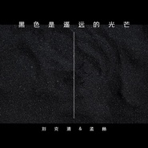

黑色是遥远的光芒 （合唱）
============================

|  |  |
| :--: | :-- |
| [ 黑色是遥远的光芒 （合唱）](https://emumo.xiami.com/album/2108236770) | **艺人**: [孟杨](../index.md) **语种**: 国语 **唱片公司**: 禾信科技 **发行时间**: 2019年11月01日 **专辑类别**: EP, 单曲 **专辑风格**: 国语流行 Mandarin Pop **播放数**: 22 **收藏数**: 0 **评论数**: 0  |

## 简介

刘克清&amp;孟杨名最新单曲《黑色是遥远的光芒》；  
高贵在色彩中奔放  
染黑色不朽风霜  
情愿把理想放飞天朗  
色彩神秘遥远的光芒 

## 曲目

## 评论

|  |  |  |  |
| :-- | :-- | :-- | :-- |
