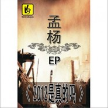

孟杨
============================

|  |  |
| :--: | :-- |
| [ 孟杨](https://i.xiami.com/mycm) | **地区**: China 中国大陆 **风格**: 国语流行 Mandarin Pop **播放数**: 4224372 **粉丝数**: 780 **评论数**: 16  |

## 档案

孟杨，英文名  Mirror  ，词曲创作，音乐家，艺人，歌手。主打歌曲《下辈子等我》，《爱在夏天》，《男人一生三朵花》等。这名怀有艺术最本真梦想的女子非是要去标榜自己，也非是要去抓取什么，她只是想要唱歌，想要在歌声里映射出音乐本来的面目力量，音符凝聚而成的无以名状的力量。

## 专辑

| 名称 | 语种 | 唱片公司 | 发行时间 | 专辑类别 | 专辑风格 |
| :--: | :-- | :-- | :-- | :-- | :-- |
| [ 幸福来得太早](./albums/5022393771.md) | 国语 |  | 2020年06月20日 | 录音室专辑 |  |
| [ 一别两宽](./albums/5022546038.md) | 国语 |  | 2020年06月02日 | 录音室专辑 |  |
| [ 世界那么大还是遇见你](./albums/5022380844.md) | 国语 |  | 2020年03月29日 | 录音室专辑 |  |
| [ 情人节你陪谁](./albums/2420367128.md) | 国语 | 听见音乐 | 2020年02月10日 | EP, 单曲 | 国语流行 Mandarin Pop |
| [ 白衣天使辛苦了](./albums/2420353402.md) | 国语 | 听见音乐 | 2020年02月03日 | EP, 单曲 | 国语流行 Mandarin Pop |
| [ 黑色是遥远的光芒 （合唱）](./albums/2108236770.md) | 国语 | 禾信科技 | 2019年11月01日 | EP, 单曲 | 国语流行 Mandarin Pop |
| [ 我只在乎你](./albums/2105261195.md) | 国语 | 弥格时代 | 2019年09月20日 | EP, 单曲 |  |
| [ 初恋这件小事](./albums/2105164378.md) | 国语 | 推星传媒 | 2019年07月19日 | EP, 单曲 |  |
| [ 梨花泪](./albums/2104999065.md) | 国语 | 推星传媒 | 2019年07月16日 | EP, 单曲 |  |
| [ 今宵酒醒何处](./albums/2104999063.md) | 国语 | 推星传媒 | 2019年07月16日 | EP, 单曲 |  |
| [ 在这个世界上 (DJ版)](./albums/2104997915.md) | 国语 | 天蜂娱乐 | 2019年07月15日 | EP, 单曲 |  |
| [ 你是我心中唯一的空缺](./albums/5020627160.md) | 国语 | 禾信科技 | 2019年06月20日 | EP, 单曲 | 国语流行 Mandarin Pop |
| [ 宁愿做只猫](./albums/2104800706.md) | 国语 | 百纳娱乐 | 2019年04月21日 | EP, 单曲 | 国语流行 Mandarin Pop |
| [ 兵分两路](./albums/2104765099.md) | 国语 | 百纳娱乐 | 2019年04月09日 | EP, 单曲 | 国语流行 Mandarin Pop |
| [ 一辈子为爱守护](./albums/2104052580.md) | 国语 | 魔音文化 | 2018年09月22日 | EP, 单曲 | 国语流行 Mandarin Pop |
| [ 天天好运来](./albums/2103773395.md) | 国语 | 英曼唱片 | 2018年06月29日 | EP, 单曲 |  |
| [ 天天好运来](./albums/2103773388.md) | 国语 | 英曼唱片 | 2018年06月29日 | EP, 单曲 |  |
| [ 爱我就来北京找我](./albums/2103724954.md) | 国语 | 魔音文化 | 2018年05月31日 | EP, 单曲 |  |
| [ 在这个世界上](./albums/5022451308.md) | 国语 | 酝星文化 | 2017年11月17日 | EP, 单曲 |  |
| [ 小小手](./albums/2102762850.md) | 国语 | 星途音乐 | 2017年06月09日 | EP, 单曲 |  |
| [ 今夕采兮](./albums/2102743248.md) | 国语 | 星途音乐 | 2017年05月04日 | EP, 单曲 |  |
| [ 忘忧集之爱如烟雨](./albums/2102735965.md) | 纯音乐 | 星途音乐 | 2017年04月11日 | 录音室专辑 |  |
| [ 佛坛处处水云间](./albums/2102725503.md) | 国语 | 星途音乐 | 2017年03月31日 | EP, 单曲 |  |
| [ 十五的月儿圆又圆](./albums/2102691695.md) | 国语 | 一阳文化 | 2017年02月10日 | EP, 单曲 |  |
| [ 今天的你](./albums/2102671369.md) | 国语 | 一阳文化 | 2016年12月23日 | EP, 单曲 |  |
| [ 同一个心愿](./albums/2102664798.md) | 国语 | 一阳文化 | 2016年12月15日 | EP, 单曲 |  |
| [ 下辈子还等你](./albums/2100327974.md) | 国语 | 酝星文化 | 2016年04月27日 | EP, 单曲 |  |
| [ 感谢你陪伴](./albums/2100259442.md) | 国语 | 酝星文化 | 2016年01月08日 | 录音室专辑 |  |
| [ 红尘里与你手牵手](./albums/1037363787.md) | 国语 | 独立发行 | 2015年07月15日 | EP, 单曲 |  |
| [ 男人压力山大](./albums/432111588.md) | 国语 | 禾信科技 | 2015年05月12日 | 录音室专辑 |  |
| [ 如果我们一样大](./albums/1002370692.md) | 国语 | 孟杨传媒 | 2014年06月15日 | EP, 单曲 |  |
| [ 靠谁不如靠自己](./albums/1992703298.md) | 国语 | 孟杨传媒 | 2014年02月13日 | 录音室专辑 |  |
| [ 眼泪留不住男人心](./albums/567573.md) | 国语 | 中友缘唱片 | 2013年01月14日 | EP, 单曲 |  |
| [ 你有你的天空](./albums/558243.md) | 国语 | 中友缘唱片 | 2012年11月30日 | EP, 单曲 |  |
| [ 伤心火玫瑰](./albums/524807.md) | 国语 | 中友缘唱片 | 2012年06月29日 | EP, 单曲 |  |
| [ 呼吸](./albums/533102.md) | 国语 | 中友缘文化 | 2012年06月16日 | 录音室专辑 |  |
| [ 忘情](./albums/519067.md) | 国语 | 中友缘唱片 | 2012年06月01日 | EP, 单曲 |  |
| [ 等待幸福的羊](./albums/512177.md) | 国语 | 中友缘唱片 | 2012年05月05日 | 录音室专辑 |  |
| [ 2012是真的吗](./albums/484316.md) | 国语 | 中友缘唱片 | 2011年12月15日 | EP, 单曲 |  |
| [ 爱情神话](./albums/2370793.md) | 国语 | 亦风传媒 | 2011年10月27日 | 录音室专辑 |  |
| [ 心中放不下的是你](./albums/467605.md) | 国语 | 沖激音乐 | 2011年09月22日 | EP, 单曲 |  |
| [ 下辈子等我](./albums/437925.md) | 国语 | 中友缘文化 | 2011年09月12日 | 录音室专辑 |  |
| [ 女人别把青春当无所谓](./albums/464213.md) | 国语 | 5D文化 | 2011年09月05日 | EP, 单曲 |  |
| [ 真的不可以](./albums/455412.md) | 国语 | 5D文化 | 2011年07月24日 | EP, 单曲 |  |
| [ 原创钢琴曲](./albums/438654.md) | 国语 | 亦风文化 | 2011年04月13日 | 录音室专辑 |  |
| [ 痴心妄想](./albums/464216.md) | 国语 | 5D文化 | 2010年08月30日 | EP, 单曲 |  |
| [ 爱在夏天](./albums/464214.md) | 国语 | 5D文化 | 2010年08月08日 | EP, 单曲 |  |
| [ 星星雨](./albums/464215.md) | 国语 | 金翼龙唱片 | 2010年06月30日 | EP, 单曲 |  |
| [ 男人一生三朵花](./albums/464218.md) | 国语 | 5D文化 | 2010年05月17日 | EP, 单曲 |  |
| [ 冬逝](./albums/464220.md) | 国语 | 5D文化 | 2010年03月08日 | EP, 单曲 |  |
| [ 在哪里](./albums/464217.md) | 国语 | 网络发行 | 2009年08月17日 | EP, 单曲 |  |

## 评论

|  |  |  |
| :-- | :-- | :-- |
|  [虾米用户](https://emumo.xiami.com/u/325374787)  2020-01-01 12:30 赞(0) 踩(0) | 
，
 |
|  [虾米用户](https://emumo.xiami.com/u/320383076)  2019-11-11 01:19 赞(1) 踩(0) | 
第一次听这首歌都听到一晚天亮了♡♡♡
 |
|  [虾米用户](https://emumo.xiami.com/u/253034358) 往事随风，把悲伤留给自己... 2018-03-09 18:27 赞(1) 踩(0) | 
孟杨，虾米音乐你的主页。有好几首DJ歌曲，歌词跟你唱的不一样，是怎么回事?靠谁不如靠自己DJ，忘了你是谁DJ，如果我们一样大DJ。
 |
|  [虾米用户](https://emumo.xiami.com/u/302143497) 音乐是最好的娱乐方式 2017-09-02 15:24 赞(1) 踩(0) | 
孟杨，英文名mirror，歌手。这名怀有艺术最本真梦想的女子非是要去标榜自己，也非是要去抓取什么，她只是想要唱歌，想要在歌声里映射出音乐本来的面目&amp;mdash;&amp;mdash;力量，音符凝聚而成的无以名状的力量。
 |
|  [虾米用户](https://emumo.xiami.com/u/258457875)  2017-03-25 22:35 赞(3) 踩(0) | 
不错，很好听的一首曲子
 |
|  [虾米用户](https://emumo.xiami.com/u/16135450)  2016-11-24 00:36 赞(3) 踩(0) | 
5952
 |
|  [虾米用户](https://emumo.xiami.com/u/13645139)  2015-03-14 20:52 赞(1) 踩(0) | 
为什么木有  《下雨天你会想我吗》。。。
 |
|  [虾米用户](https://emumo.xiami.com/u/12876004) ` 2015-01-19 12:20 赞(1) 踩(0) | 
~
 |
|  [虾米用户](https://emumo.xiami.com/u/32461398) 曾在云上浮想联翩如今也终... 2014-12-25 22:55 赞(1) 踩(0) | 
~
 |
|  [虾米用户](https://emumo.xiami.com/u/13552)  2014-10-20 10:01 赞(1) 踩(0) | 
秋
 |
|  [虾米用户](https://emumo.xiami.com/u/1562810)  2014-10-01 21:36 赞(1) 踩(0) | 
内心丰富，曲子很好
 |
|  [虾米用户](https://emumo.xiami.com/u/6224896) 歌是情，情是歌 2013-03-05 23:03 赞(1) 踩(0) | 
嗯，这首好听
 |
|  [虾米用户](https://emumo.xiami.com/u/2418454) 在地狱里称王，胜于在天堂... 2012-06-10 22:49 赞(1) 踩(0) | 
真安静……
 |
|  [虾米用户](https://emumo.xiami.com/u/4379378)  2011-09-03 11:20 赞(1) 踩(0) | 
喜欢她的钢琴曲,有一种宁静的感觉!
 |
|  [虾米用户](https://emumo.xiami.com/u/4379378)  2011-09-03 11:19 赞(1) 踩(0) | 
好喜欢她的钢琴曲!
 |
|  [虾米用户](https://emumo.xiami.com/u/3395113)   2011-04-28 21:31 赞(1) 踩(0) | 
支持
 |
