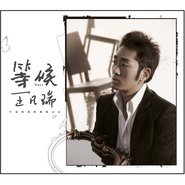

等候
============================

|  |  |
| :--: | :-- |
| [ 等候](https://emumo.xiami.com/album/302502) | **艺人**: [王梵瑞](../index.md) **语种**: 国语 **唱片公司**: 太合麦田 **发行时间**: 2008年10月09日 **专辑类别**: 录音室专辑 **专辑风格**: 城市民谣 Urban Folk **播放数**: 553914 **收藏数**: 542 **评论数**: 43  |

## 简介

王凡瑞，一个和“青春”有关的名字，在暂别乐坛两年后又再次回到熟识他的人的身边。两年来的生活历练让我们可以从《等候 王凡瑞》中听懂现在的他，也可以看到平淡与忙碌生活中的自己。这张专辑，是由著名音乐制作人王晓东与王凡瑞共同完成制作。虽然制作经费捉襟见肘，但王晓东还是坚持以音乐品质为先。坚持为了一首歌中的小细节不断返工录制，直到满意为止，目的就是一定不能让每一首王凡瑞音乐作品的深刻内涵，在呈现给听众时有一丝瑕疵。而且公司也为了音乐品质更加完美，多次追加了专辑的制作预算。  
  
歌曲推荐  
《如果冬天》  
很难去评说这样一首充满的回忆、沉寂、无奈和憧憬的歌曲。可以告诉大家的是，现在大家听到的这首歌的录音版本，和三年前录制的小样还是有了很大的变化。也许少了太浓太深的伤感，多了些期望和洒脱。也许你听了之后，会找出最适合你自己的情愫。  
  
《我是绽放的花》  
在大理安静歇息的几日，让他收获颇多。远离都市，远离喧嚣，置身于寂静美好的地方，整理后心境变成了一首动人的旋律。  
  
《天亮。天黑》  
此歌被某无线门户网挂出TOP1—白领族必听！我们每天平淡而繁忙的生活，也许简单重复，甚至有点刻板无聊，但永远充满哲理。短促的生命在每个天亮和天黑之间穿梭，而我们也在天亮和天黑之间成长着。  
  
《妈妈II》  
制作人王晓东老师非常喜欢的一首歌，不想过多评价这首歌，你只需听一遍就明了其间内涵。卓越网友xzo100评论：生活勇者，游吟歌者10月重出乐坛！再次对青春生活进行诠释！  
更多青春的答案我希望听到王凡瑞新专辑的诠释，《天又亮了，天又黑了》让我对新专辑充满了无限的期待，我坚定肯定是一张历时很久精心打磨的关于生活关于人生的上乘之作！天又黑了，沉淀了又一天完美的结束！天又亮了，开启了又一天美好的明天。我们的生活跟着这样的音乐循环播放着，永远不会按下停止键！献给城市中忙忙碌碌的人们，献给所有热爱生活平凡的人们！最后，让我喊出一句“王凡瑞，我爱你”！但还有比这张更直接的词汇吗？

## 曲目

- [我是绽放的花(Orchestra Version)](./302502/Uabn83ae3.md)
- [一切从这儿开始](./302502/b9X38aa46c.md)
- [认识了](./302502/Uabp913c6.md)
- [如果冬天](./302502/b9X3Ac1e53.md)
- [我爱你，永远](./302502/b9X3Bbba37.md)
- [城堡](./302502/b9X3Cbcea7.md)
- [天亮·天黑(Album Version)](./302502/b9X3Da1fe8.md)
- [妈妈II](./302502/fDInA428b2.md)
- [我是绽放的花](./302502/Uabv5cd54.md)
- [笑容](./302502/dBPQE3d679.md)
- [三一来临歌](./302502/b9X3H987f3.md)
- [如果冬天…告别](./302502/cpUWce669f.md)

## 评论

|  |  |  |  |
| :-- | :-- | :-- | :-- |
|  [虾米用户](https://emumo.xiami.com/u/6803935)  2020-11-26 02:33 赞(0) 踩(0) | 
我替刘永彬向你问好。
 |
|  [虾米用户](https://emumo.xiami.com/u/5127755) 感谢这9年的陪伴，有音乐... 2018-12-24 00:40 赞(0) 踩(0) | 
这张专辑从少年时代听到现在了，还是这么喜欢。真好
 |
|  [虾米用户](https://emumo.xiami.com/u/274375864)  2017-02-26 08:17 赞(0) 踩(0) | 
感谢
 |
|  [虾米用户](https://emumo.xiami.com/u/3475541)  2015-12-11 09:29 赞(0) 踩(0) | 
忽然捡到宝···把所有歌曲下来听一遍·······
 |
|  [虾米用户](https://emumo.xiami.com/u/3475541)  2015-12-11 09:29 赞(0) 踩(0) | 
忽然捡到宝···把所有歌曲下来听一遍·······
 |
|  [虾米用户](https://emumo.xiami.com/u/37091656)  2015-11-12 10:56 赞(0) 踩(0) | 
过了这么久才发现 原来还有如此好听歌曲和歌者 赞
 |
|  [虾米用户](https://emumo.xiami.com/u/9362834)  2015-07-23 11:18 赞(0) 踩(0) | 
我觉得这张专辑很不错呢，保持这种风格，没必要变来变去，想听别的风格我自然回去找别人的歌听
 |
|  [虾米用户](https://emumo.xiami.com/u/1855647)  2015-01-07 17:35 赞(0) 踩(0) | 
那是因为唔好死轰你~~~哈哈哈哈（终于有机会用上这句话了
 |
|  [虾米用户](https://emumo.xiami.com/u/384390) 小金金让我发财 2014-12-31 16:08 赞(3) 踩(0) | 
那年买了钟立锋，真是亏待了旁边这位，其实那些年应该要他陪。可惜。。。时间不再来。都被钟立锋吹口琴的封面忽悠了，王比钟好。
 |
|  [虾米用户](https://emumo.xiami.com/u/3923602)  2014-09-05 13:45 赞(1) 踩(0) | 
妈蛋，真帅！
 |
|  [虾米用户](https://emumo.xiami.com/u/34786597)  2014-04-29 20:27 赞(0) 踩(0) | 
那年在三里屯，快看那座城市。
 |
|  [虾米用户](https://emumo.xiami.com/u/13212305) 一枚结他手 2014-03-01 22:21 赞(0) 踩(0) | 
民谣我居然真的向老师说的那样那么一丢丢的感动了
 |
|  [虾米用户](https://emumo.xiami.com/u/5127755) 感谢这9年的陪伴，有音乐... 2014-02-27 02:03 赞(0) 踩(0) | 
如果冬天
 |
|  [虾米用户](https://emumo.xiami.com/u/7093736)  2014-01-11 21:22 赞(0) 踩(0) | 
心底的声音
 |
|  [虾米用户](https://emumo.xiami.com/u/16315021)  2013-11-04 21:47 赞(0) 踩(0) | 
撒旦啊
 |
|  [虾米用户](https://emumo.xiami.com/u/7502995)  2013-07-23 16:29 赞(3) 踩(0) | 
很像朴树   很想朴树  呵呵
 |
|  [虾米用户](https://emumo.xiami.com/u/1998821)  2013-07-22 08:30 赞(0) 踩(0) | 
很好 加油 唱音有点像张楚 ~~~音风很好！祝福王梵瑞越来越好！！！！
 |
|  [虾米用户](https://emumo.xiami.com/u/8466700)  2013-05-02 18:59 赞(0) 踩(0) | 
不错呢
 |
|  [虾米用户](https://emumo.xiami.com/u/1848672)  2012-11-28 18:07 赞(0) 踩(0) | 
收藏了！
 |
|  [虾米用户](https://emumo.xiami.com/u/11374362)  2012-11-08 16:19 赞(1) 踩(0) | 
他的歌里有爱情、有忧伤、有青春还有怀念。听到他的声音，就能想到会下雪的故乡。
 |
|  [虾米用户](https://emumo.xiami.com/u/2790156)  2012-08-23 13:02 赞(0) 踩(0) | 
喜欢这种清新的风格！
 |
|  [虾米用户](https://emumo.xiami.com/u/9748992)  2012-07-09 17:55 赞(0) 踩(0) | 
就是喜欢呗
 |
|  [虾米用户](https://emumo.xiami.com/u/668319)  2012-05-17 18:50 赞(0) 踩(0) | 
新民谣歌手，应好好听一听。
 |
|  [虾米用户](https://emumo.xiami.com/u/2544345)  2012-04-25 00:29 赞(0) 踩(0) | 
始终错误的认为这是张概念专辑，因为当年爱的秘密都藏在里面，也葬在里面。静候梵瑞新作，没错，像等候真爱，我们可以不急。@王梵瑞
 |
|  [虾米用户](https://emumo.xiami.com/u/3037947)  2011-11-27 21:10 赞(0) 踩(0) | 
和青春有关的名字
 |
|  [虾米用户](https://emumo.xiami.com/u/3249249)  2011-10-21 10:04 赞(0) 踩(0) | 
哎呦 不经意发现的好玩的东西
 |
|  [虾米用户](https://emumo.xiami.com/u/1578412)  2011-09-16 17:50 赞(0) 踩(0) | 
喜欢
 |
|  [虾米用户](https://emumo.xiami.com/u/5045892)  2011-09-14 17:06 赞(0) 踩(0) | 
大理的记忆~
 |
|  [虾米用户](https://emumo.xiami.com/u/3255139)  2011-07-15 17:37 赞(0) 踩(0) | 
感觉
 |
|  [虾米用户](https://emumo.xiami.com/u/3991837)  2011-07-02 15:29 赞(0) 踩(0) | 
圆圈
 |
|  [虾米用户](https://emumo.xiami.com/u/3177705)   2011-06-10 12:35 赞(0) 踩(0) | 
《等待》一如从前，依然温馨如初 怦然心动。。。
 |
|  [虾米用户](https://emumo.xiami.com/u/3496718) idle space 2011-06-07 21:43 赞(0) 踩(0) | 
声音很干净
 |
|  [虾米用户](https://emumo.xiami.com/u/3589490)  2011-06-07 18:43 赞(0) 踩(0) | 
其实非要比较是很牵强的事情。唯一觉得新旧一致的是，这6个人都是很个性独立的人，除了叶蓓。其实每个人的境况都没见的很好，除了朴树一直是我的精神领袖之外，尹吾也是今年真正了解更多，而他也已远去。我现在更多关注的是凡瑞（现在更名梵瑞），因为他的音乐更富于变化，无论是主体还是编曲，能体会那里面的执着追求，同时他也可能更俗一点，因为他的旋律更时尚美感些，俗得让这样的好音乐让更多人接受，他的嗓子已经无可厚非（个人始终更喜欢他的嗓音多于钟立风N倍），我希望他能坚持下去，希望他能成为下一个被最终认同的许巍。每一步其实都不容易，但希望凡瑞能走的更好！
 |
| ⇒ |  [虾米用户](https://emumo.xiami.com/u/5806141)  2017-10-28 00:34 赞(0) 踩(0) | 
叶蓓 纯真年代 和双鱼 太好了  但是  之后的 就很恼火了朴树 还是 应该像伊吾 一样 就一张专辑 还能经典永恒 却偏偏 来个 生如夏花  恶心的要死 完全没有听的欲望 比起我去2000年  简直是 媚俗的可以！~
 |
|  [虾米用户](https://emumo.xiami.com/u/3100450) Spiritual me... 2011-04-13 15:04 赞(0) 踩(0) | 
青春所有的答案全在里面。。。
 |
|  [虾米用户](https://emumo.xiami.com/u/2413468)  2011-01-09 20:53 赞(0) 踩(0) | 
当年的红白蓝 如今的王凡瑞
 |
|  [虾米用户](https://emumo.xiami.com/u/2416591)  2011-01-09 20:19 赞(0) 踩(0) | 
喜欢这种能让我思考的音乐
 |
|  [虾米用户](https://emumo.xiami.com/u/648415) 孤独终老 2010-08-24 09:53 赞(0) 踩(0) | 
内容已删除
 |
| ⇒ |  [虾米用户](https://emumo.xiami.com/u/80313) 我爱虾米 2015-02-04 23:29 赞(0) 踩(0) | 
赞！
 |
|  [虾米用户](https://emumo.xiami.com/u/295735) 现实与梦境，我不怀疑 2010-08-19 20:11 赞(0) 踩(0) | 
三一来临歌  音质瑕疵很明显啊 遗憾！！！！！！！！！！！！！！！！！！！！！！！！！！！！！
 |
|  [虾米用户](https://emumo.xiami.com/u/325422)  2010-05-25 19:39 赞(0) 踩(0) | 
不错 静静的
 |
|  [虾米用户](https://emumo.xiami.com/u/47104)  2009-04-26 17:09 赞(0) 踩(0) | 
还是值得期待的惊喜
 |
|  [虾米用户](https://emumo.xiami.com/u/24137)  2009-01-16 21:07 赞(0) 踩(0) | 
自己听！
 |
|  [虾米用户](https://emumo.xiami.com/u/13539)  2008-12-15 15:21 赞(0) 踩(0) | 
爱死民谣。爱死这个男人。
 |
