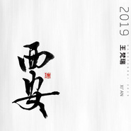
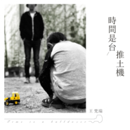
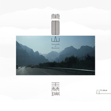
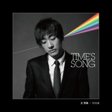

王梵瑞
============================

|  |  |
| :--: | :-- |
| [ 王梵瑞](https://i.xiami.com/wfr) | **播放数**: 9307635 **粉丝数**: 6745 **评论数**: 360 **地区**: China 中国大陆 **风格**: 当代民谣 Contemporary Folk  |

## 档案

小档案 
生日：10月19日 
家中排行：独生子 
西北轻工业学院中文系 
曾组建穷人乐队 
星座：天秤座 
血型：AB 
身高：175CM 
大事记 
1998年 来京发展，开始音乐之旅。 
2000年 开始在京城知名酒吧驻唱 
2001年 与原唐朝乐队第3任吉他手虞洋联袂筹划首张个人大碟 
2002年 参加第三届迷笛音乐节，引起包括《通俗歌曲》等强势音乐媒体关注 
2002年 签约北京达人音乐文化传播公司，并受到台湾著名音乐人钟兴民提携 
2003年 发表单曲《妈妈》，《幸福》，引起强烈反响 
2004年 解约达人文化 
2004年 成为北京著名酒吧“男孩·女孩”的唯一原创型驻唱歌手 
2004年 签约太合麦田音乐 
2005年 单曲《青春》荣膺中国歌曲百家电台总评榜3周亚军！！ 
2005年 单曲《幸福》荣膺中国歌曲排行榜2周冠军！！ 
2006年 首张个人大碟《青春》现已上市！！

## 专辑

| 名称 | 语种 | 唱片公司 | 发行时间 | 专辑类别 | 专辑风格 |
| :--: | :-- | :-- | :-- | :-- | :-- |
| [ 西安](./albums/2103177101.md) | 国语 | 太合麦田 | 2019年10月19日 | 录音室专辑 | 摇滚 Rock & Roll |
| [ 勇敢者之歌](./albums/5021005840.md) | 国语 |  | 2019年10月09日 | EP, 单曲 | 摇滚 Rock & Roll |
| [ 时间是台推土机](./albums/5020958212.md) | 国语 |  | 2019年04月18日 | EP, 单曲 | 民谣 Folk |
| [ 时光谣2019](./albums/2108155257.md) | 国语 | 华宇世博 | 2019年01月22日 | EP, 单曲 | 摇滚 Rock & Roll |
| [ 小人国](./albums/2108157312.md) | 国语 | 华宇世博 | 2018年11月20日 | EP, 单曲 | 摇滚 Rock & Roll |
| [ 万重山Thousands of Mountains](./albums/2100269096.md) | 国语 | 太合麦田 | 2016年11月25日 | 录音室专辑 | 城市民谣 Urban Folk |
| [ 别抱怨 我和你一样](./albums/2103005364.md) | 国语 | 太合麦田 | 2016年02月01日 | EP, 单曲 | 独立摇滚 Indie Rock |
| [ 新红白蓝不插电音乐会](./albums/2108155238.md) | 其他 | 太合麦田 | 2016年01月01日 | EP, 单曲 | 爵士 Jazz |
| [ 鼓楼先生](./albums/2100245376.md) | 国语 | 京娱娱乐 | 2015年12月10日 | EP, 单曲 | 当代民谣 Contemporary Folk |
| [ 2014恒大音乐节现场版-王凡瑞](./albums/2103922570.md) | 国语 | 恒大音乐 | 2014年09月18日 | 现场专辑 |  |
| [ 时光谣Time's Song](./albums/557236.md) | 国语 | 十三月唱片 | 2013年03月08日 | 录音室专辑 | 当代民谣 Contemporary Folk |
| [ 等候](./albums/302502.md) | 国语 | 太合麦田 | 2008年10月09日 | 录音室专辑 | 城市民谣 Urban Folk |
| [ 青春麦田音乐新红白蓝系列之红](./albums/4436.md) | 国语 | 太合麦田 | 2005年10月01日 | 录音室专辑 | 城市民谣 Urban Folk |

## 评论

|  |  |  |  |
| :-- | :-- | :-- | :-- |
|  [虾米用户](https://emumo.xiami.com/u/14004084) 你好 2021-01-23 16:27 赞(0) 踩(0) | 
路过就留个言 很优秀，不着急
 |
|  [虾米用户](https://emumo.xiami.com/u/358104299) 悲观的唯心存在现实解构虚... 2020-11-28 09:59 赞(0) 踩(0) | 
42327
 |
|  [虾米用户](https://emumo.xiami.com/u/289766105) 小煜的花园 2020-06-22 11:05 赞(0) 踩(0) | 
这么好的作品。让人释怀又感动又有鼓励。喜欢！会被人记住的歌。
 |
|  [虾米用户](https://emumo.xiami.com/u/355865) Let it go, l... 2020-03-14 20:58 赞(2) 踩(0) | 
&lt;[url=/u/2871]@虾小编[/url] 《西安》专辑请快点发布吧，版权肯定是已经买了，等上架等好几天了&gt;&lt;2871&gt;
 |
|  [虾米用户](https://emumo.xiami.com/u/283973165)   2019-12-31 21:12 赞(0) 踩(0) | 
新年万事如意，和许巍朴树不一样，各有味道，都喜欢
 |
|  [虾米用户](https://emumo.xiami.com/u/42560187) 归于传统 2019-03-08 18:47 赞(0) 踩(0) | 

 |
|  [虾米用户](https://emumo.xiami.com/u/1660711)  2019-02-15 16:29 赞(0) 踩(0) | 
西安味
 |
|  [虾米用户](https://emumo.xiami.com/u/310952262) 后来 2019-02-05 20:02 赞(0) 踩(0) | 
好听
 |
|  [虾米用户](https://emumo.xiami.com/u/17326367) 爱就是极快速的能量振动 2019-01-30 22:04 赞(0) 踩(0) | 
加油，王梵瑞，勇敢走下去
 |
|  [虾米用户](https://emumo.xiami.com/u/306065331) 幸福开始有人选 2018-12-24 01:07 赞(0) 踩(0) | 
回家肯德基经济打卡
 |
|  [虾米用户](https://emumo.xiami.com/u/48538685) 喜欢民谣 摇滚 电吉他 ... 2018-11-30 16:57 赞(0) 踩(0) | 
还有谁和我一样
 |
|  [虾米用户](https://emumo.xiami.com/u/303506160) 因为我对你爱的深沉 2018-09-01 00:13 赞(1) 踩(0) | 
嘿呦
 |
|  [虾米用户](https://emumo.xiami.com/u/22431648) “性子比孩子还野，酒量是... 2018-07-27 14:56 赞(0) 踩(0) | 
再次温习
 |
|  [虾米用户](https://emumo.xiami.com/u/2195529)  2018-07-07 11:22 赞(1) 踩(0) | 
西安的声音
 |
|  [虾米用户](https://emumo.xiami.com/u/227929218)  2018-06-21 03:24 赞(1) 踩(0) | 
不管昨夜你经历了怎样的泣不成声，早晨醒来这个城市依旧车水马龙。王先生 听你的歌已经五个年头
 |
|  [虾米用户](https://emumo.xiami.com/u/228843687) 懒惰统治人间 2018-05-05 16:22 赞(0) 踩(0) | 
:-O
 |
|  [虾米用户](https://emumo.xiami.com/u/308130439)   2017-11-12 12:33 赞(0) 踩(0) | 
这首歌好棒！
 |
|  [虾米用户](https://emumo.xiami.com/u/1553475)  2017-10-27 23:05 赞(0) 踩(0) | 
很平淡的歌词但很能触动到很深处的东西。
 |
|  [虾米用户](https://emumo.xiami.com/u/5960504)  2017-09-26 09:55 赞(0) 踩(0) | 
停完《青春》非常喜欢，感觉现在真正能做音乐的都红不起来，但还是加油吧，活着总是那么不容易，特别是为自己理想而活。
 |
|  [虾米用户](https://emumo.xiami.com/u/11259255)  2017-08-29 19:27 赞(0) 踩(0) | 
喜欢民谣
 |
|  [虾米用户](https://emumo.xiami.com/u/2712243)   2017-07-13 17:08 赞(1) 踩(0) | 
幻想依旧伟大，我已不再什么英雄，我已成熟的像个老者，与生活完全讲和。
 |
| ⇒ |  [虾米用户](https://emumo.xiami.com/u/36691185) 天王盖地虎朋克操金属 2017-08-31 21:26 赞(0) 踩(0) | 
复制热评都不走心，第二句掉了个&amp;ldquo;是&amp;rdquo;字没看出来吗！（嫌弃）
 |
|  [虾米用户](https://emumo.xiami.com/u/5568521)  2017-06-09 20:07 赞(0) 踩(0) | 
温柔男声
 |
|  [虾米用户](https://emumo.xiami.com/u/11060078)  2017-05-25 22:32 赞(3) 踩(0) | 
坐等大火
 |
|  [虾米用户](https://emumo.xiami.com/u/55050277)  2017-05-25 13:44 赞(0) 踩(0) | 
还在做音乐吧 刚在重庆听了现场
 |
|  [虾米用户](https://emumo.xiami.com/u/39941491) 翻云覆雨 浪里来风里走 ... 2017-04-25 13:24 赞(0) 踩(0) | 
28号有没有人一起去小酒馆一起去看他演出
 |
| ⇒ |  [虾米用户](https://emumo.xiami.com/u/47173356) 雷阿伦脑残粉 2017-04-27 10:30 赞(0) 踩(0) | 
在哪？
 |
|  [虾米用户](https://emumo.xiami.com/u/4143789) 我还没想好要写什么... 2017-04-17 12:01 赞(0) 踩(0) | 
孩子
 |
|  [虾米用户](https://emumo.xiami.com/u/2768025) 我什么时候能改掉听歌看评... 2017-03-26 03:19 赞(0) 踩(0) | 
杭州见。
 |
|  [虾米用户](https://emumo.xiami.com/u/3314502) 音乐真美好 2017-03-23 17:35 赞(3) 踩(0) | 
那年，您出家了！带着弘法的大愿，心怀人间净土的宿愿九朝天子命，十世状元才今生遇正法，披得福田衣选择了一条清净无悔的路是宿世因缘
 |
|  [虾米用户](https://emumo.xiami.com/u/51891646) 听歌记录都是忘关耳机产生... 2017-02-18 22:07 赞(0) 踩(0) | 
大内密谈来的
 |
|  [虾米用户](https://emumo.xiami.com/u/91857942) 慧极 情深 2017-02-10 23:09 赞(1) 踩(0) | 
好喜欢，希望你被更多的人知道喜欢
 |
|  [虾米用户](https://emumo.xiami.com/u/44044897)  2017-01-29 11:51 赞(1) 踩(0) | 
听歌发现了这个歌手，没什么名气，但是他的歌陪着我度过了这段时间，只要一闲下来就会听歌，这样脑子才转的慢些
 |
|  [虾米用户](https://emumo.xiami.com/u/34411464) 最感性的音乐 2017-01-05 14:29 赞(0) 踩(0) | 
有许巍风格
 |
|  [虾米用户](https://emumo.xiami.com/u/221603307)  2016-12-30 14:48 赞(0) 踩(0) | 
从网易到虾米你给我的勇气你无法想象，有点个人原因吧网易删了，给你的最大动力就是无论如何都不能不听你的音乐吧
 |
| ⇒ |  [虾米用户](https://emumo.xiami.com/u/228836137) 不懂感恩，再优秀也难以成... 2017-04-06 20:23 赞(0) 踩(0) | 
删个APP说的像辞职一样
 |
| ⇒ |  [虾米用户](https://emumo.xiami.com/u/1440858)   2017-04-07 15:26 赞(0) 踩(0) | 
<q><b>人间说：</b></q>
 |
| ⇒ |  [虾米用户](https://emumo.xiami.com/u/6225895) 一往无前 2017-04-08 22:06 赞(0) 踩(0) | 
<q><b>人间说：</b></q>
 |
| ⇒ |  [虾米用户](https://emumo.xiami.com/u/36691185) 天王盖地虎朋克操金属 2017-08-31 21:26 赞(0) 踩(0) | 
<q><b>人间说：</b></q>
 |
|  [虾米用户](https://emumo.xiami.com/u/68487514)  2016-12-07 23:44 赞(1) 踩(0) | 
在北京开演唱会我一定去支持
 |
|  [虾米用户](https://emumo.xiami.com/u/68487514)  2016-12-07 16:27 赞(1) 踩(0) | 
时间倒流20年，未老去的是你，等不及的是我
 |
|  [虾米用户](https://emumo.xiami.com/u/60326626)   2016-11-28 15:59 赞(1) 踩(0) | 
愿神兴起更多中国民谣赞美歌手
 |
|  [虾米用户](https://emumo.xiami.com/u/8541843) 做设计的。 2016-11-12 20:48 赞(2) 踩(0) | 
鼓楼先生
 |
|  [虾米用户](https://emumo.xiami.com/u/6960729) 庭前花木满，院外小径芳。... 2016-11-05 22:07 赞(0) 踩(0) | 
已过万重山
 |
|  [虾米用户](https://emumo.xiami.com/u/41656616) 风 2016-11-03 22:41 赞(3) 踩(0) | 
不求你火，只求让更多人知道！
 |
|  [虾米用户](https://emumo.xiami.com/u/41656616) 风 2016-11-03 22:32 赞(1) 踩(0) | 
加油啊，还有我们呢
 |
|  [虾米用户](https://emumo.xiami.com/u/172921804) 断云 2016-09-09 09:10 赞(2) 踩(0) | 
加油加油  鼓楼大街超级有感觉
 |
|  [虾米用户](https://emumo.xiami.com/u/24711605) 于是转身向大海走去！ 2016-09-07 10:28 赞(3) 踩(0) | 
嗓音的确不错，加油！
 |
|  [虾米用户](https://emumo.xiami.com/u/132119586)  2016-08-25 17:30 赞(3) 踩(0) | 
加油王梵瑞  
 |
|  [虾米用户](https://emumo.xiami.com/u/138920826) 老文艺 2016-05-18 10:24 赞(1) 踩(0) | 
一定会红的，很好的音乐和作词。连我这大叔都爱听。
 |
|  [虾米用户](https://emumo.xiami.com/u/164610068)  2016-05-08 15:55 赞(1) 踩(0) | 
支持梵瑞
 |
|  [虾米用户](https://emumo.xiami.com/u/47795816)   2016-04-15 10:48 赞(1) 踩(0) | 
奇怪这样的人才为什么不红 比有些歌星声音好多了
 |
|  [虾米用户](https://emumo.xiami.com/u/13691875) 谁的感叹 偶然合拍 2016-04-06 22:39 赞(2) 踩(0) | 
张楚微博都转发鼓楼先生 
 |
|  [虾米用户](https://emumo.xiami.com/u/124935772)  2016-03-19 20:39 赞(1) 踩(0) | 
 
 |
|  [虾米用户](https://emumo.xiami.com/u/2116377)   2016-03-18 23:58 赞(1) 踩(0) | 
坚持 都在各自范围内的坚持着 祝你我好运
 |
|  [虾米用户](https://emumo.xiami.com/u/40930772)   2016-03-11 22:12 赞(0) 踩(0) | 
加油啊
 |
|  [虾米用户](https://emumo.xiami.com/u/19210386) 寻音而来…… 2016-02-07 13:43 赞(1) 踩(0) | 
好喜欢  you
 |
|  [虾米用户](https://emumo.xiami.com/u/15796802) 吧咋黑 2016-02-03 23:36 赞(0) 踩(0) | 
喜欢
 |
|  [虾米用户](https://emumo.xiami.com/u/34193333) 音乐听我的 2016-02-02 15:00 赞(2) 踩(0) | 
这声音不错啊，比好声音的王磊唱的好啊，为啥没火
 |
|  [虾米用户](https://emumo.xiami.com/u/87170318)   2016-01-29 21:15 赞(1) 踩(0) | 
有点朴树的感觉
 |
|  [虾米用户](https://emumo.xiami.com/u/1199640) 我还没想好要写什么... 2016-01-01 22:05 赞(2) 踩(0) | 
喜欢，像许巍，像朴树   
 |
|  [虾米用户](https://emumo.xiami.com/u/31277956) Oops! Sorry  2015-12-16 00:19 赞(1) 踩(0) | 
現在鼓樓先生已經可以免費下載了，各位自便⋯⋯
 |
|  [虾米用户](https://emumo.xiami.com/u/5885235)  2015-12-15 03:40 赞(1) 踩(0) | 
原来是陕西科技大学的。
 |
|  [虾米用户](https://emumo.xiami.com/u/90646924) タバコまた明日ナラ 2015-12-12 18:10 赞(1) 踩(0) | 
加油啊！梵瑞大，坚持自己做人的原则，若是白莲就请不要轻易自弃，拼死坚持自己的风格！
 |
|  [虾米用户](https://emumo.xiami.com/u/90254818) o(◕‿◕)o__仁！！... 2015-12-10 13:35 赞(1) 踩(0) | 
鼓楼先生，好听
 |
|  [虾米用户](https://emumo.xiami.com/u/40803404)   2015-11-28 02:08 赞(1) 踩(0) | 
太真实的音乐了。
 |
|  [虾米用户](https://emumo.xiami.com/u/44444351)  2015-11-14 22:33 赞(1) 踩(0) | 
都蛮不错的
 |
|  [虾米用户](https://emumo.xiami.com/u/9612662) 说话好听 很照顾别人感受 2015-11-14 15:54 赞(0) 踩(0) | 
&amp;lt;&amp;lt;如果冬天&amp;gt;&amp;gt;的mv 特美.<a href="http://v.youku.com/v_show/id_XMjM4OTg5NjMy.html" target="_blank" rel="nofollow noreferrer noopener">http://v.youku.com/v_show/id_XMjM4OTg5NjMy.html</a>
 |
|  [虾米用户](https://emumo.xiami.com/u/5106725) 我还没想好要写什么... 2015-10-27 22:11 赞(2) 踩(0) | 
每个成功了的人都是坚持过来的，但坚持了的人并不会都成功，多现实多残酷
 |
|  [虾米用户](https://emumo.xiami.com/u/2774453) 暂无签名~ 2015-10-22 15:59 赞(1) 踩(0) | 
已经十年了，突然又想起这首歌了，他好像今年参加中国好歌曲第二季了。
 |
|  [虾米用户](https://emumo.xiami.com/u/7808316)  2015-08-01 14:11 赞(3) 踩(0) | 
微博里未发表的小样《孩子》不错。可以听听
 |
|  [虾米用户](https://emumo.xiami.com/u/15973122)   2015-07-15 15:59 赞(2) 踩(0) | 
喜欢你的歌
 |
|  [虾米用户](https://emumo.xiami.com/u/16056045) 开心点吧～ 2015-06-16 02:47 赞(1) 踩(0) | 
坚持不下去了，再见，青春。
 |
|  [虾米用户](https://emumo.xiami.com/u/48822958) 简单，就好 2015-06-14 07:34 赞(1) 踩(0) | 
声音跟朴树好像
 |
| ⇒ |  [虾米用户](https://emumo.xiami.com/u/6409438)  2015-12-11 14:57 赞(0) 踩(0) | 
乍一听确实有点像
 |
|  [虾米用户](https://emumo.xiami.com/u/4175084) 藏 2015-06-02 19:57 赞(2) 踩(0) | 
要巡演了，加油
 |
|  [虾米用户](https://emumo.xiami.com/u/7206504) 一天两包中南海 2015-05-25 16:19 赞(3) 踩(0) | 
出碟吧   得让真心做音乐的音乐人有口饭吃。
 |
|  [虾米用户](https://emumo.xiami.com/u/10611387) 暂无签名~ 2015-05-23 12:41 赞(1) 踩(0) | 
听青春时好像朴树的声音！
 |
|  [虾米用户](https://emumo.xiami.com/u/10611387) 暂无签名~ 2015-05-23 12:41 赞(1) 踩(0) | 
听青春时好像朴树的声音！
 |
|  [虾米用户](https://emumo.xiami.com/u/40506729)    2015-04-27 18:54 赞(2) 踩(0) | 
不错！平淡点，我喜欢
 |
|  [虾米用户](https://emumo.xiami.com/u/31050686)  2015-04-20 18:59 赞(2) 踩(0) | 
加油！拼死坚持。
 |
|  [虾米用户](https://emumo.xiami.com/u/10702944)  2015-03-30 13:24 赞(0) 踩(0) | 
这pink floyd的专辑封面 我也是醉鸟~ 时光谣不错
 |
|  [虾米用户](https://emumo.xiami.com/u/5127755) 感谢这9年的陪伴，有音乐... 2015-03-26 16:00 赞(1) 踩(0) | 
从高中就开始听你的歌，现在工作两年了。还是好喜欢。请加油～
 |
|  [虾米用户](https://emumo.xiami.com/u/28255457) 下起雨也要勇敢前进 2015-03-25 16:44 赞(0) 踩(0) | 
内容已删除
 |
| ⇒ |  [虾米用户](https://emumo.xiami.com/u/43472470)  2016-09-28 21:53 赞(0) 踩(0) | 
耐听
 |
|  [虾米用户](https://emumo.xiami.com/u/2282124) 西风吹雨长路遥，葬花落魄... 2015-03-22 11:33 赞(0) 踩(0) | 
怎么不出新专辑了？
 |
|  [虾米用户](https://emumo.xiami.com/u/42992148) 听着么多歌 都不如听你 2015-03-20 19:10 赞(0) 踩(0) | 
我爱你 永远
 |
|  [虾米用户](https://emumo.xiami.com/u/6967536)  2015-03-19 09:40 赞(0) 踩(0) | 
你来了
 |
|  [虾米用户](https://emumo.xiami.com/u/94663)  2015-03-18 22:17 赞(0) 踩(0) | 
期待新作~
 |
|  [虾米用户](https://emumo.xiami.com/u/1716769) YO 2015-03-18 22:13 赞(0) 踩(0) | 
来来啦
 |
|  [虾米用户](https://emumo.xiami.com/u/3449737) ww 2015-03-18 19:29 赞(0) 踩(0) | 
欢迎啊
 |
|  [虾米用户](https://emumo.xiami.com/u/9301514) 独立唱作人 2015-03-18 19:27 赞(0) 踩(0) | 
你来了，感动...
 |
|  [虾米用户](https://emumo.xiami.com/u/2857420) 昨天晚上我梦见你 2015-03-18 18:25 赞(0) 踩(0) | 
记得迷笛里你唱的海。
 |
|  [虾米用户](https://emumo.xiami.com/u/562905) 我还没想好要写什么... 2015-03-13 04:54 赞(1) 踩(0) | 
我找先生算了下.怎样让你红.他说:王姓,而五行缺火,梵受制于火,忌.宜更名:王烦瑞,-------- 子须道人
 |
|  [虾米用户](https://emumo.xiami.com/u/752597)  2015-03-11 14:36 赞(20) 踩(0) | 
想起08年单曲循环《青春》 十二年青春早就过完了
 |
| ⇒ |  [虾米用户](https://emumo.xiami.com/u/1539457) 暂无签名~ 2015-06-09 11:22 赞(0) 踩(0) | 
……08年到现在 为什么是12年青春早过完了 你是穿越来的吗？
 |
|  [虾米用户](https://emumo.xiami.com/u/7111610)  2015-03-04 00:08 赞(1) 踩(0) | 
《时光谣》真不错！尤其是蔡健雅的演绎，特别好听！意境更开阔！只是阿姐明显撸多了，要克制。而且阿姐撸加在这首歌里，有点儿莫名其妙
 |
| ⇒ |  [虾米用户](https://emumo.xiami.com/u/7390764)  2015-03-06 16:11 赞(0) 踩(0) | 
是，正想吐槽那三个字呢。。。
 |
| ⇒ |  [虾米用户](https://emumo.xiami.com/u/19346881) 溫柔尚在  寂寞永生 2015-03-10 22:25 赞(0) 踩(0) | 
<q><b>鬼形礼说：</b></q>
 |
|  [虾米用户](https://emumo.xiami.com/u/47360915)   2015-03-01 18:10 赞(0) 踩(0) | 
好喜欢
 |
|  [虾米用户](https://emumo.xiami.com/u/1950465)  2015-02-04 12:59 赞(0) 踩(0) | 
去参加好歌曲了，看了视频，感觉他很紧张。心酸...
 |
|  [虾米用户](https://emumo.xiami.com/u/199757)  2015-01-31 23:22 赞(0) 踩(0) | 
还是喜欢青春和海，那种对时光的无奈和挣扎，情绪低落的能杀人
 |
|  [虾米用户](https://emumo.xiami.com/u/199757)  2015-01-31 23:19 赞(1) 踩(0) | 
从好歌曲那边居然看到他，还有马条，顿时感觉世界不好了。。。ps：本人要是帅点说不定能红！不帅上电视干嘛，还被剪辑成几秒了，可怜！
 |
|  [虾米用户](https://emumo.xiami.com/u/20434109) 青春一晃就是两三年 2015-01-30 19:53 赞(1) 踩(0) | 
好歌曲进行时
 |
|  [虾米用户](https://emumo.xiami.com/u/36308309)  2015-01-12 19:08 赞(0) 踩(0) | 
乡党
 |
|  [虾米用户](https://emumo.xiami.com/u/592216) 我还没想好要写什么... 2015-01-07 15:47 赞(0) 踩(0) | 
凡瑞也是弟兄啊阿门...每张专辑还都写首诗歌，哈哈~~
 |
|  [虾米用户](https://emumo.xiami.com/u/44968015)   2014-12-27 21:38 赞(0) 踩(0) | 
声音不错哦～^_^
 |
|  [虾米用户](https://emumo.xiami.com/u/3496718) idle space 2014-11-30 23:00 赞(0) 踩(0) | 
我喜欢这哥们~~~
 |
|  [虾米用户](https://emumo.xiami.com/u/21877022) 文艺二逼小青年 2014-09-24 11:03 赞(1) 踩(0) | 
我在为谁哭泣？谁又在为我哭泣？我在等待谁呢？谁又在等待我？
 |
|  [虾米用户](https://emumo.xiami.com/u/2040153)  2014-09-22 16:34 赞(1) 踩(0) | 
不期而遇 转身离去
 |
|  [虾米用户](https://emumo.xiami.com/u/13552)  2014-09-16 10:53 赞(1) 踩(0) | 
青春、这座城市
 |
|  [虾米用户](https://emumo.xiami.com/u/393941)  2014-09-11 22:11 赞(0) 踩(0) | 
倔强的歌者
 |
|  [虾米用户](https://emumo.xiami.com/u/3643043)  2014-09-10 11:04 赞(1) 踩(0) | 
早晨坐在公司楼下喝豆腐脑吃油条，缓存音乐包随机到这家伙的歌，乍一听，咦，朴树的歌？再一想不对，朴树的歌我哪个没听过阿。知道了王凡瑞。
 |
|  [虾米用户](https://emumo.xiami.com/u/3418570) 喜欢你没道理 2014-09-10 08:34 赞(0) 踩(0) | 
歌词可以
 |
|  [虾米用户](https://emumo.xiami.com/u/10441212) ！ 2014-08-27 20:01 赞(0) 踩(0) | 
挺不错的
 |
|  [虾米用户](https://emumo.xiami.com/u/6776358)  2014-08-24 22:35 赞(1) 踩(0) | 
现场看了很喜欢
 |
|  [虾米用户](https://emumo.xiami.com/u/3723526)  2014-08-23 21:34 赞(0) 踩(0) | 
确实好听且不出名。
 |
| ⇒ |  [虾米用户](https://emumo.xiami.com/u/9612662) 说话好听 很照顾别人感受 2014-10-19 11:27 赞(0) 踩(0) | 
哈哈哈哈哈
 |
|  [虾米用户](https://emumo.xiami.com/u/562905) 我还没想好要写什么... 2014-08-13 02:48 赞(1) 踩(0) | 
一天王凡瑞问算命先生,为什么我的歌好听我却没红,先生说你五行缺木.次日,天空高悬九日.此乃大吉之兆,遂 ,改名王梵瑞
 |
| ⇒ |  [虾米用户](https://emumo.xiami.com/u/9612662) 说话好听 很照顾别人感受 2014-10-19 11:28 赞(0) 踩(0) | 
高人
 |
|  [虾米用户](https://emumo.xiami.com/u/3527216)   2014-08-12 18:56 赞(0) 踩(0) | 
青春
 |
|  [虾米用户](https://emumo.xiami.com/u/15871718) 已婚大兒童 2014-08-06 15:38 赞(1) 踩(0) | 
组了个乐队 wifi乐队 支持一下
 |
|  [虾米用户](https://emumo.xiami.com/u/34869200) GGGGGGGGGG 2014-06-08 20:08 赞(1) 踩(0) | 
好听 ！
 |
|  [虾米用户](https://emumo.xiami.com/u/33570603)  2014-06-03 21:33 赞(1) 踩(0) | 
让人感动
 |
|  [虾米用户](https://emumo.xiami.com/u/1017492)  2014-04-25 19:03 赞(1) 踩(0) | 
听他的歌 只为一句 天又亮了 天又黑里 懒懒的 却很美 很无奈
 |
|  [虾米用户](https://emumo.xiami.com/u/17551581) 呱呱呱！ 2014-04-22 10:18 赞(1) 踩(0) | 
感动
 |
|  [虾米用户](https://emumo.xiami.com/u/5127755) 感谢这9年的陪伴，有音乐... 2014-02-27 02:01 赞(1) 踩(0) | 
他的音乐真的很不错。
 |
|  [虾米用户](https://emumo.xiami.com/u/2247480) 温暖而奔放~~~ 2014-02-23 15:23 赞(1) 踩(0) | 
没有为什么，就是喜欢！
 |
|  [虾米用户](https://emumo.xiami.com/u/334833)  2014-01-08 14:50 赞(1) 踩(0) | 
听了多少年了，从王凡瑞到王梵瑞
 |
|  [虾米用户](https://emumo.xiami.com/u/14622761) 拜拜 2014-01-03 16:26 赞(0) 踩(0) | 
和朴树类感
 |
|  [虾米用户](https://emumo.xiami.com/u/4109302)  2013-12-08 11:53 赞(1) 踩(0) | 
无论如何，给我力量
 |
|  [虾米用户](https://emumo.xiami.com/u/5735648)  2013-12-07 07:02 赞(1) 踩(0) | 
这词挺好了，怎么了？
 |
|  [虾米用户](https://emumo.xiami.com/u/26256838)  2013-12-02 22:34 赞(0) 踩(0) | 
青春，年轻真好！
 |
|  [虾米用户](https://emumo.xiami.com/u/28360728)  2013-11-28 01:08 赞(0) 踩(0) | 
真实，像张楚。
 |
|  [虾米用户](https://emumo.xiami.com/u/3505722)  2013-11-25 09:49 赞(1) 踩(0) | 
一直听 的就是青春，这个给我留下记忆
 |
|  [虾米用户](https://emumo.xiami.com/u/6717745) 不 要 告 别 2013-11-20 19:32 赞(0) 踩(0) | 
好歌都给词毁了
 |
|  [虾米用户](https://emumo.xiami.com/u/15871718) 已婚大兒童 2013-11-12 10:37 赞(0) 踩(0) | 
有朴树的影子
 |
|  [虾米用户](https://emumo.xiami.com/u/15886634) 吃五谷杂粮，听五花八门 2013-11-06 16:50 赞(0) 踩(0) | 
时间一枪射在了你身上，腻歪
 |
|  [虾米用户](https://emumo.xiami.com/u/3341571) 暂无签名~ 2013-11-03 01:15 赞(0) 踩(0) | 
矫情 本来很好的旋律 让这破词给糟蹋了
 |
|  [虾米用户](https://emumo.xiami.com/u/7685124)  2013-10-24 11:08 赞(0) 踩(0) | 
已经对这种声音没感觉了。。。
 |
|  [虾米用户](https://emumo.xiami.com/u/12466073) 梦里梦外我始终有个梦 2013-10-12 12:02 赞(0) 踩(0) | 
这么多年了总是感觉他唱的青春最好听，真的不能再写出更出色的作品吗？
 |
|  [虾米用户](https://emumo.xiami.com/u/3291786)  2013-09-30 08:29 赞(0) 踩(0) | 
歌词怎么看还是弱了些，坚持看书是很重要的，哪怕你是中文系毕业！
 |
| ⇒ |  [虾米用户](https://emumo.xiami.com/u/13615234)  2014-05-15 18:22 赞(0) 踩(0) | 
说得太对了！！！
 |
| ⇒ |  [虾米用户](https://emumo.xiami.com/u/9612662) 说话好听 很照顾别人感受 2014-10-19 11:29 赞(0) 踩(0) | 
弱在哪里？说来听听
 |
|  [虾米用户](https://emumo.xiami.com/u/9777922) 金属米 2013-09-19 09:38 赞(1) 踩(0) | 
不错 好听
 |
|  [虾米用户](https://emumo.xiami.com/u/5301278)  2013-09-04 03:09 赞(0) 踩(0) | 
躁动忧伤的青春年华里永远值得回忆的歌者和歌曲
 |
|  [虾米用户](https://emumo.xiami.com/u/14475412)  2013-08-19 14:37 赞(0) 踩(0) | 
喜欢这首歌，和许巍的歌很像～
 |
|  [虾米用户](https://emumo.xiami.com/u/3449737) ww 2013-08-09 15:37 赞(1) 踩(0) | 
遗珠。自从听他开始就觉得他是遗珠。至少，他的创作能力毋庸置疑。多希望多希望他继续坚持一下。
 |
|  [虾米用户](https://emumo.xiami.com/u/7511802)  2013-08-07 20:15 赞(0) 踩(0) | 
尝试可能流行性的大英雄歌曲，可是最单纯的歌曲就是简单的。
 |
|  [虾米用户](https://emumo.xiami.com/u/7511802)  2013-08-07 20:14 赞(0) 踩(0) | 
就是那些幻象，那些伟大的幻象，差点要了我们大家的命
 |
|  [虾米用户](https://emumo.xiami.com/u/6417086) 这里，只有聆听。 2013-07-30 21:57 赞(0) 踩(0) | 
青春不老，你又是否拼命坚持！
 |
|  [虾米用户](https://emumo.xiami.com/u/2458396)   2013-07-18 22:48 赞(111) 踩(0) | 
内容已删除
 |
| ⇒ |  [虾米用户](https://emumo.xiami.com/u/14055484)  2014-02-10 00:07 赞(0) 踩(0) | 
哈哈哈哈哈哈哈哈
 |
| ⇒ |  [虾米用户](https://emumo.xiami.com/u/13615234)  2014-05-15 18:22 赞(0) 踩(0) | 
是的  感觉有那么点假。。。。
 |
| ⇒ |  [虾米用户](https://emumo.xiami.com/u/9612662) 说话好听 很照顾别人感受 2014-10-19 11:26 赞(0) 踩(0) | 
不至于每天，，，，
 |
| ⇒ |  [虾米用户](https://emumo.xiami.com/u/6031) ICEY DEEP WE... 2015-08-01 23:37 赞(0) 踩(0) | 
是火锅店，已经关了，然后含着面把这段经历写了首《鼓楼先生》
 |
| ⇒ |  [虾米用户](https://emumo.xiami.com/u/35167460) La vie elle ... 2016-01-19 20:26 赞(0) 踩(0) | 
那肯定没人敢吃他家面条...  擦桌子都在哭&amp;gt;
 |
| ⇒ |  [虾米用户](https://emumo.xiami.com/u/250865507) 曾经沧海难为水 2017-04-20 13:42 赞(0) 踩(0) | 
<q><b>培根水田芥说：</b></q>
 |
|  [虾米用户](https://emumo.xiami.com/u/886551)  2013-07-15 21:26 赞(0) 踩(0) | 
真的很容易腻啊。
 |
|  [虾米用户](https://emumo.xiami.com/u/16899402)  2013-07-06 19:40 赞(0) 踩(0) | 
文艺青年索爱
 |
|  [虾米用户](https://emumo.xiami.com/u/7140198) 我要在这腐烂的世界活下去 2013-06-14 15:41 赞(0) 踩(0) | 
只听了一首青春没听完，混音调的特别像一个人。想不起来了，个人感觉有点作，没什么实质性的东西
 |
| ⇒ |  [虾米用户](https://emumo.xiami.com/u/7488257)  2013-06-20 18:13 赞(0) 踩(0) | 
你说的那个人是不是朴树...
 |
| ⇒ |  [虾米用户](https://emumo.xiami.com/u/7140198) 我要在这腐烂的世界活下去 2013-06-20 20:19 赞(0) 踩(0) | 
<q><b>空弦说：</b></q>
 |
| ⇒ |  [虾米用户](https://emumo.xiami.com/u/4353840) 伤心总是难免的。 2013-06-22 19:55 赞(0) 踩(0) | 
<q><b>Ever说：</b></q>
 |
| ⇒ |  [虾米用户](https://emumo.xiami.com/u/7140198) 我要在这腐烂的世界活下去 2013-06-22 20:30 赞(0) 踩(0) | 
<q><b>夏至说：</b></q>
 |
| ⇒ |  [虾米用户](https://emumo.xiami.com/u/7488257)  2013-06-23 18:10 赞(0) 踩(0) | 
<q><b>Ever说：</b></q>
 |
| ⇒ |  [虾米用户](https://emumo.xiami.com/u/562905) 我还没想好要写什么... 2013-06-24 22:29 赞(0) 踩(0) | 
<q><b>空弦说：</b></q>
 |
|  [虾米用户](https://emumo.xiami.com/u/1412453) 少壮不努力老大玩虾米 2013-06-13 00:18 赞(0) 踩(0) | 
拼死坚持~
 |
|  [虾米用户](https://emumo.xiami.com/u/4964674)  2013-06-04 08:30 赞(0) 踩(0) | 
~ 一个不错的，创作歌手
 |
|  [虾米用户](https://emumo.xiami.com/u/11407180) 小飞象 2013-06-02 10:31 赞(0) 踩(0) | 
听到了青春，听到了阳光在窃窃私语
 |
|  [虾米用户](https://emumo.xiami.com/u/868545) 喵喵喵~ 2013-05-23 22:04 赞(0) 踩(0) | 
比许巍硬气很多，各有千秋，不能比较。
 |
| ⇒ |  [虾米用户](https://emumo.xiami.com/u/4353840) 伤心总是难免的。 2013-06-22 19:56 赞(0) 踩(0) | 
比许巍就是年轻一点。但还是不及许巍。
 |
| ⇒ |  [虾米用户](https://emumo.xiami.com/u/868545) 喵喵喵~ 2013-06-22 20:48 赞(0) 踩(0) | 
<q><b>夏至说：</b></q>
 |
|  [虾米用户](https://emumo.xiami.com/u/3930337)  2013-05-19 19:16 赞(0) 踩(0) | 
从这个很舒服的声音里，可以听到青春和时光在窃窃私语
 |
|  [虾米用户](https://emumo.xiami.com/u/3598950)   2013-05-14 23:39 赞(0) 踩(0) | 
h
 |
|  [虾米用户](https://emumo.xiami.com/u/2424439)   2013-05-05 18:34 赞(0) 踩(0) | 
傻东西，前十都没上////
 |
|  [虾米用户](https://emumo.xiami.com/u/12251903) 请用特有的旋律淫亵我吧 2013-05-03 09:04 赞(51) 踩(0) | 
幻想依旧伟大，我已不再什么英雄，我已成熟的像个老者，与生活完全讲和。
 |
| ⇒ |  [虾米用户](https://emumo.xiami.com/u/607317)  2013-06-03 15:48 赞(0) 踩(0) | 
记得最清楚的就是这句 常常想起来 有点不明觉厉的意思 不一定是我的想法 但是感觉那种状态 好像挺有意思
 |
| ⇒ |  [虾米用户](https://emumo.xiami.com/u/358531394)  2018-05-08 16:56 赞(0) 踩(0) | 
能够天天在梧桐树下的马路上走   看看街上匆匆的路人    时间如刀如流水都一样  轰隆隆的无声无息的一去不复返   也许每个人都有虚度的光阴
 |
|  [虾米用户](https://emumo.xiami.com/u/2155757)  2013-04-30 22:02 赞(0) 踩(0) | 
青春
 |
|  [虾米用户](https://emumo.xiami.com/u/7956621)   2013-04-29 17:48 赞(1) 踩(0) | 
好多年了……我都忘了这是谁了
 |
|  [虾米用户](https://emumo.xiami.com/u/3389673) 音乐爱好的人 2013-04-27 13:39 赞(0) 踩(0) | 
ok
 |
|  [虾米用户](https://emumo.xiami.com/u/12723049) get money 2013-04-27 13:37 赞(1) 踩(0) | 
找了好久的型
 |
|  [虾米用户](https://emumo.xiami.com/u/3449737) ww 2013-04-23 20:52 赞(0) 踩(0) | 
我也觉得像朴树 没有像许巍的点啊找不到TVT←虽然都来自西安刚刚《时间一枪打在我身上》听他开口的时候 嗓子真的有点像老许TVT!!!!!!!!
 |
|  [虾米用户](https://emumo.xiami.com/u/1716769) YO 2013-04-18 18:14 赞(0) 踩(0) | 
确实像许巍啊~ 挺舒服
 |
|  [虾米用户](https://emumo.xiami.com/u/5142765)  2013-04-10 14:34 赞(0) 踩(0) | 
为什么觉得像许巍 我觉得像朴树哎
 |
|  [虾米用户](https://emumo.xiami.com/u/7237645)  2013-04-07 22:48 赞(0) 踩(0) | 
听他青春的故事，让我好好宝贝我的青春。。
 |
|  [虾米用户](https://emumo.xiami.com/u/7128761)  2013-04-03 19:42 赞(0) 踩(0) | 
超棒！好喜欢！
 |
|  [虾米用户](https://emumo.xiami.com/u/5184976) 我恨你 2013-04-02 20:59 赞(0) 踩(0) | 
北方人的翘舌太引人注耳了:)
 |
|  [虾米用户](https://emumo.xiami.com/u/13451803)  2013-04-02 01:55 赞(0) 踩(0) | 
西安为中国民谣贡献的另一个好声音~~
 |
|  [虾米用户](https://emumo.xiami.com/u/1364191)  2013-03-31 19:58 赞(0) 踩(0) | 
感觉非常好！
 |
|  [虾米用户](https://emumo.xiami.com/u/2086702)  2013-03-25 08:53 赞(0) 踩(0) | 
许巍的节奏
 |
|  [虾米用户](https://emumo.xiami.com/u/11717979) follow heart 2013-03-23 14:54 赞(0) 踩(0) | 
独特味道
 |
|  [虾米用户](https://emumo.xiami.com/u/10519066) 我是喜剧之王 2013-03-21 20:39 赞(0) 踩(0) | 
许巍的赶脚
 |
|  [虾米用户](https://emumo.xiami.com/u/7853153)  2013-03-14 22:13 赞(0) 踩(0) | 
可以称为都市民谣吧。
 |
|  [虾米用户](https://emumo.xiami.com/u/9774396)  2013-03-11 22:25 赞(0) 踩(0) | 
真心的不错，人在西安的我竟然现在才知道，相识恨晚呀！是古都摇滚的味道。支持！！！
 |
|  [虾米用户](https://emumo.xiami.com/u/10316659) 0.0.0.0.0.0 2013-03-09 16:23 赞(0) 踩(0) | 
棒啊
 |
|  [虾米用户](https://emumo.xiami.com/u/9132385) 无解 2013-03-06 13:18 赞(0) 踩(0) | 
好听，青春。
 |
|  [虾米用户](https://emumo.xiami.com/u/2267539)  2013-02-23 14:07 赞(0) 踩(0) | 
东施效颦！！！！！没意思！！！！！
 |
| ⇒ |  [虾米用户](https://emumo.xiami.com/u/2674929) 正宫蜀葵，其实是一丈红。 2013-03-02 23:11 赞(0) 踩(0) | 
效谁？
 |
|  [虾米用户](https://emumo.xiami.com/u/12716768)  2013-02-22 21:01 赞(0) 踩(0) | 
天秤的，嗓音清透
 |
|  [虾米用户](https://emumo.xiami.com/u/1513634)  2013-02-22 15:30 赞(0) 踩(0) | 
有那么点沧桑？反正挺喜欢`
 |
|  [虾米用户](https://emumo.xiami.com/u/1861124)  2013-02-22 14:22 赞(0) 踩(0) | 
赞呐！似许巍的强调
 |
|  [虾米用户](https://emumo.xiami.com/u/6621801)  2013-02-03 15:09 赞(0) 踩(0) | 
时光漫步，爱如少年
 |
|  [虾米用户](https://emumo.xiami.com/u/12473845)  2013-01-17 14:41 赞(0) 踩(0) | 
喜欢这种感觉。
 |
|  [虾米用户](https://emumo.xiami.com/u/1225483)  2013-01-09 19:05 赞(0) 踩(0) | 
民谣
 |
|  [虾米用户](https://emumo.xiami.com/u/12301444) 西安独立民谣音乐人。 2013-01-09 16:04 赞(0) 踩(0) | 
~温暖。
 |
|  [虾米用户](https://emumo.xiami.com/u/12240410)  2013-01-03 15:13 赞(0) 踩(0) | 
调和词
 |
|  [虾米用户](https://emumo.xiami.com/u/669741)  2012-12-27 03:42 赞(0) 踩(0) | 
亲近
 |
|  [虾米用户](https://emumo.xiami.com/u/12028831)  2012-12-21 14:38 赞(0) 踩(0) | 
就是喜欢他的安静
 |
|  [虾米用户](https://emumo.xiami.com/u/3604263)  2012-12-09 23:27 赞(0) 踩(0) | 
听他的时光谣的时候，眼泪流下来了。这个冬日的夜里，听到这首满满都是怀念的歌曲，从前的渐渐被遗忘的回忆一下子都回来了。淡淡的忧伤，只为那逝去的青春。
 |
|  [虾米用户](https://emumo.xiami.com/u/5061916) 悲观的时间不苟且地存活 2012-12-08 17:34 赞(0) 踩(0) | 
喜欢他的声线··········
 |
|  [虾米用户](https://emumo.xiami.com/u/3436932)  2012-12-06 10:31 赞(0) 踩(0) | 
时光谣 love
 |
|  [虾米用户](https://emumo.xiami.com/u/4249448)  2012-12-04 12:39 赞(0) 踩(0) | 
一切因为青春
 |
|  [虾米用户](https://emumo.xiami.com/u/2043189)  2012-12-02 01:00 赞(0) 踩(0) | 
一杯暖暖的红茶
 |
|  [虾米用户](https://emumo.xiami.com/u/11722925)  2012-12-01 16:52 赞(1) 踩(0) | 
喜欢没理由
 |
|  [虾米用户](https://emumo.xiami.com/u/6005918) 网易云账号同名：pans... 2012-11-30 22:36 赞(0) 踩(0) | 
青春洋溢
 |
|  [虾米用户](https://emumo.xiami.com/u/11720636)  2012-11-30 10:00 赞(0) 踩(0) | 
时光谣
 |
|  [虾米用户](https://emumo.xiami.com/u/11720636)  2012-11-30 09:43 赞(0) 踩(0) | 
我喜欢他的歌
 |
|  [虾米用户](https://emumo.xiami.com/u/4122832)  2012-11-29 23:06 赞(0) 踩(0) | 
声音真是抓耳朵……
 |
|  [虾米用户](https://emumo.xiami.com/u/4187272) 多洗心灵少洗脑 2012-11-29 19:56 赞(0) 踩(0) | 
封面可见 头发越来越长
 |
|  [虾米用户](https://emumo.xiami.com/u/11709141) 时光，不经用。 2012-11-29 13:16 赞(0) 踩(0) | 
因为喜欢所以喜欢，
 |
|  [虾米用户](https://emumo.xiami.com/u/11539732) 理想与爱情腐烂且可疑 2012-11-20 16:45 赞(0) 踩(0) | 
冬天
 |
|  [虾米用户](https://emumo.xiami.com/u/598605)  2012-11-17 17:49 赞(0) 踩(0) | 
很轻松流畅
 |
|  [虾米用户](https://emumo.xiami.com/u/3606998)   2012-11-14 20:49 赞(0) 踩(0) | 
好听
 |
|  [虾米用户](https://emumo.xiami.com/u/10903725)  2012-10-28 23:14 赞(1) 踩(0) | 
民谣？明明是摇滚
 |
| ⇒ |  [虾米用户](https://emumo.xiami.com/u/1208091)  2012-12-04 03:47 赞(0) 踩(0) | 
没硬性区分的 民谣和摇滚都有YAO
 |
|  [虾米用户](https://emumo.xiami.com/u/3484229) 只有虾米，一直陪伴！ 2012-10-27 23:33 赞(0) 踩(0) | 
支持！！！
 |
|  [虾米用户](https://emumo.xiami.com/u/10080489) MNS 2012-10-27 20:21 赞(0) 踩(0) | 
MUSIC NEVER SLEEPS
 |
|  [虾米用户](https://emumo.xiami.com/u/5021527)  2012-10-23 17:02 赞(0) 踩(0) | 
青春和诗
 |
|  [虾米用户](https://emumo.xiami.com/u/9621209) hnile 2012-10-17 18:20 赞(0) 踩(0) | 
青春，（我已成熟的像个老者，与生活完全讲和）
 |
|  [虾米用户](https://emumo.xiami.com/u/429161)   2012-10-14 11:34 赞(0) 踩(0) | 
青春
 |
|  [虾米用户](https://emumo.xiami.com/u/1867028)  2012-10-11 14:05 赞(1) 踩(0) | 
又是你 呵呵 从你开始的
 |
|  [虾米用户](https://emumo.xiami.com/u/312179) 潜入深蓝，放肆幻听 2012-10-05 17:27 赞(0) 踩(0) | 
这声音,真朴树.
 |
|  [虾米用户](https://emumo.xiami.com/u/9044644)  2012-10-04 22:36 赞(0) 踩(0) | 
因为青春
 |
|  [虾米用户](https://emumo.xiami.com/u/10911320)  2012-10-03 21:39 赞(0) 踩(0) | 
就好
 |
|  [虾米用户](https://emumo.xiami.com/u/3140714)  2012-10-01 20:54 赞(1) 踩(0) | 
至少比什么梁什么博的强他娘的太多了
 |
|  [虾米用户](https://emumo.xiami.com/u/10488237)  2012-09-06 20:56 赞(0) 踩(0) | 
关于青春与明媚的忧伤   爱死了这一类人， 不过还是最爱朴树， 王凡瑞也很好
 |
|  [虾米用户](https://emumo.xiami.com/u/874202) 爱是这世界唯一的解药 2012-08-24 18:06 赞(0) 踩(0) | 
我好友拍的记录片，早安北京 <a href="http://v.youku.com/v_show/id_XMzY2NzQ1MDQ0.html" target="_blank" rel="nofollow noreferrer noopener">http://v.youku.com/v_show/id_XMzY2NzQ1MDQ0.html</a>
 |
|  [虾米用户](https://emumo.xiami.com/u/5007437) 逗你玩儿 2012-08-20 06:11 赞(1) 踩(0) | 
就是喜欢呗 哪那么多为什么
 |
|  [虾米用户](https://emumo.xiami.com/u/722882)  2012-08-14 18:08 赞(1) 踩(0) | 
每次听这个人的歌就会想起学生时代的感觉，想起某个人。。。。。估计再过几年都听不了这样的歌了吧呵呵
 |
|  [虾米用户](https://emumo.xiami.com/u/3586298) 音乐无处不在 2012-08-12 18:39 赞(0) 踩(0) | 
无法追回那溜走的岁月。。。。。。。。。。
 |
|  [虾米用户](https://emumo.xiami.com/u/4771586)  2012-08-10 20:37 赞(0) 踩(0) | 
声音没亮点
 |
|  [虾米用户](https://emumo.xiami.com/u/4716125) 盛开的小葵 2012-08-02 14:47 赞(0) 踩(0) | 
有点多年前听朴树的感觉……
 |
|  [虾米用户](https://emumo.xiami.com/u/295735) 现实与梦境，我不怀疑 2012-08-01 23:21 赞(0) 踩(0) | 
新砖据说要出了  等死了
 |
|  [虾米用户](https://emumo.xiami.com/u/9942274)  2012-07-27 12:48 赞(0) 踩(0) | 
太励志了
 |
|  [虾米用户](https://emumo.xiami.com/u/6184026)  2012-07-19 23:32 赞(0) 踩(0) | 
清新的音乐
 |
|  [虾米用户](https://emumo.xiami.com/u/7807313) 我还没想好要写什么... 2012-06-28 20:43 赞(1) 踩(0) | 
关于青春与明媚的忧伤
 |
|  [虾米用户](https://emumo.xiami.com/u/3627744) 身无长物 2012-06-27 21:32 赞(0) 踩(0) | 
凡瑞，太热爱。
 |
|  [虾米用户](https://emumo.xiami.com/u/59471)  2012-06-27 13:52 赞(0) 踩(0) | 
再见，青春。
 |
|  [虾米用户](https://emumo.xiami.com/u/2580210)  2012-06-06 11:02 赞(0) 踩(0) | 
纪念我青春中为自己奋斗的孤独夜晚
 |
|  [虾米用户](https://emumo.xiami.com/u/212949)  2012-05-23 11:22 赞(0) 踩(0) | 
每首歌都是青春 、忧伤、、、 腻不腻啊。。
 |
| ⇒ |  [虾米用户](https://emumo.xiami.com/u/819627) 我还没想好要写什么... 2012-05-28 17:58 赞(0) 踩(0) | 
不喜欢的其实，可以不需要在这里留言，真的
 |
| ⇒ |  [虾米用户](https://emumo.xiami.com/u/212949)  2012-05-29 00:03 赞(0) 踩(0) | 
<q><b>冷啊说：</b></q>
 |
| ⇒ |  [虾米用户](https://emumo.xiami.com/u/819627) 我还没想好要写什么... 2012-05-29 17:28 赞(0) 踩(0) | 
<q><b>黑米糍说：</b></q>
 |
| ⇒ |  [虾米用户](https://emumo.xiami.com/u/212949)  2012-05-29 17:57 赞(0) 踩(0) | 
<q><b>冷啊说：</b></q>
 |
| ⇒ |  [虾米用户](https://emumo.xiami.com/u/819627) 我还没想好要写什么... 2012-05-29 18:59 赞(0) 踩(0) | 
<q><b>黑米糍说：</b></q>
 |
| ⇒ |  [虾米用户](https://emumo.xiami.com/u/3425353)  2012-06-28 15:29 赞(0) 踩(0) | 
支持不同声！音  凡瑞 比起 朴树 几个前辈来说 还年轻了点  可以理解他现在的状态 但是 不完美不等于不好  比起港台无聊的爱爱爱爱  还是有意思多了
 |
| ⇒ |  [虾米用户](https://emumo.xiami.com/u/1809279)  2012-07-01 16:04 赞(0) 踩(0) | 
<q><b>冷啊说：</b></q>
 |
| ⇒ |  [虾米用户](https://emumo.xiami.com/u/212949)  2012-07-02 13:03 赞(0) 踩(0) | 
<q><b>ITFZ说：</b></q>
 |
| ⇒ |  [虾米用户](https://emumo.xiami.com/u/6320126) 无乐自欣豫 2012-07-02 22:43 赞(0) 踩(0) | 
支持，自己真实的感觉为啥不说，搞得一通赞扬不是正常的状态
 |
| ⇒ |  [虾米用户](https://emumo.xiami.com/u/220719) 自知不自見，自愛不自貴 2013-02-22 13:02 赞(0) 踩(0) | 
<q><b>黑米糍说：</b></q>
 |
| ⇒ |  [虾米用户](https://emumo.xiami.com/u/220719) 自知不自見，自愛不自貴 2013-02-22 13:27 赞(0) 踩(0) | 
<q><b>冷啊说：</b></q>
 |
|  [虾米用户](https://emumo.xiami.com/u/7535501)  2012-04-25 15:50 赞(0) 踩(0) | 
感伤
 |
|  [虾米用户](https://emumo.xiami.com/u/7535501)  2012-04-25 15:49 赞(0) 踩(0) | 
喜欢
 |
|  [虾米用户](https://emumo.xiami.com/u/720151)  2012-04-09 12:34 赞(0) 踩(0) | 
很不错
 |
|  [虾米用户](https://emumo.xiami.com/u/478527) 好想跟衣服在洗衣机里滚 2012-04-08 14:25 赞(0) 踩(0) | 
m
 |
|  [虾米用户](https://emumo.xiami.com/u/3311416)  2012-03-31 13:16 赞(0) 踩(0) | 
在路上
 |
|  [虾米用户](https://emumo.xiami.com/u/3163330)  2012-03-25 10:26 赞(0) 踩(0) | 
旅行的路上听，很美好。
 |
|  [虾米用户](https://emumo.xiami.com/u/2374309)  2012-03-22 22:32 赞(0) 踩(0) | 
平和。警世。
 |
|  [虾米用户](https://emumo.xiami.com/u/7331552) 感谢有音乐陪伴 2012-03-06 15:08 赞(0) 踩(0) | 
时光路过
 |
|  [虾米用户](https://emumo.xiami.com/u/544101)  2012-03-05 09:30 赞(0) 踩(0) | 
哇 小时候喜欢的歌
 |
| ⇒ |  [虾米用户](https://emumo.xiami.com/u/6320126) 无乐自欣豫 2012-03-07 20:13 赞(0) 踩(0) | 
你那会多大？
 |
| ⇒ |  [虾米用户](https://emumo.xiami.com/u/6971764)  2012-04-24 18:34 赞(0) 踩(0) | 
<q><b>易一说：</b></q>
 |
|  [虾米用户](https://emumo.xiami.com/u/630507)  2012-02-23 12:23 赞(0) 踩(0) | 
好听
 |
|  [虾米用户](https://emumo.xiami.com/u/1954814)  2012-02-11 16:25 赞(0) 踩(0) | 
算是纪念一个城市吧。
 |
|  [虾米用户](https://emumo.xiami.com/u/1696081)  2012-01-12 10:26 赞(0) 踩(0) | 
生日快乐！
 |
|  [虾米用户](https://emumo.xiami.com/u/1199981)  2011-11-19 23:31 赞(0) 踩(0) | 
一路追梦与圆梦的种种感触。。。
 |
|  [虾米用户](https://emumo.xiami.com/u/5813884) 我还没想好要写什么... 2011-11-12 10:14 赞(0) 踩(0) | 
王梵瑞
 |
|  [虾米用户](https://emumo.xiami.com/u/4338931) Intangible 2011-10-20 16:19 赞(0) 踩(0) | 
生日快乐
 |
|  [虾米用户](https://emumo.xiami.com/u/1955060)  2011-10-20 16:09 赞(0) 踩(0) | 
生日快乐！
 |
|  [虾米用户](https://emumo.xiami.com/u/5356594)  2011-10-20 15:52 赞(0) 踩(0) | 
生日快乐
 |
|  [虾米用户](https://emumo.xiami.com/u/6091847)  2011-10-20 15:16 赞(0) 踩(0) | 
今天属于你 ，记得快乐，生日快乐！
 |
|  [虾米用户](https://emumo.xiami.com/u/5432118) 我还没想好要写什么... 2011-10-20 14:31 赞(0) 踩(0) | 
生日快乐！！
 |
|  [虾米用户](https://emumo.xiami.com/u/918428)  2011-10-20 13:43 赞(0) 踩(0) | 
虽然迟到了,生日快乐~当初还是从朋友那儿知道你的,很是喜欢
 |
|  [虾米用户](https://emumo.xiami.com/u/5842383)  2011-10-20 13:11 赞(0) 踩(0) | 
老许提起过
 |
|  [虾米用户](https://emumo.xiami.com/u/3502645) 走人生 2011-10-20 11:53 赞(0) 踩(0) | 
生日快乐！！
 |
|  [虾米用户](https://emumo.xiami.com/u/4385621)  2011-10-20 11:09 赞(0) 踩(0) | 
体重，118kg…………………………这资料
 |
| ⇒ |  [虾米用户](https://emumo.xiami.com/u/285606)  2011-10-20 12:17 赞(0) 踩(0) | 
我看出来了，就是一头兽
 |
|  [虾米用户](https://emumo.xiami.com/u/3302092)  2011-10-20 10:55 赞(0) 踩(0) | 
HBD
 |
|  [虾米用户](https://emumo.xiami.com/u/6340638)  2011-10-20 10:41 赞(0) 踩(0) | 
生日快乐
 |
|  [虾米用户](https://emumo.xiami.com/u/3635966) 哥不是迷 只是传说 2011-10-20 08:49 赞(0) 踩(0) | 
靓仔生日快乐!
 |
|  [虾米用户](https://emumo.xiami.com/u/635)  2011-10-20 08:41 赞(0) 踩(0) | 
生日快乐~~
 |
|  [虾米用户](https://emumo.xiami.com/u/1665480) 天天在进步 2011-10-20 06:41 赞(0) 踩(0) | 
生日快乐
 |
|  [虾米用户](https://emumo.xiami.com/u/693411)   2011-10-20 03:11 赞(0) 踩(0) | 
-________-\'\' 天秤男..
 |
|  [虾米用户](https://emumo.xiami.com/u/1602505)  2011-10-19 21:52 赞(0) 踩(0) | 
兄弟生日快乐！~~
 |
|  [虾米用户](https://emumo.xiami.com/u/2071740)  2011-10-19 21:26 赞(0) 踩(0) | 
和我是同一天生日……嘿嘿，王兄，下面这些祝福分我一半如何~？
 |
|  [虾米用户](https://emumo.xiami.com/u/819805) 我们点起火把，烧死爱情。 2011-10-19 21:21 赞(0) 踩(0) | 
HBD~~~~~~
 |
|  [虾米用户](https://emumo.xiami.com/u/6295941)  2011-10-19 20:53 赞(0) 踩(0) | 
生日快乐
 |
|  [虾米用户](https://emumo.xiami.com/u/660968) 一起去狗带 2011-10-19 20:45 赞(0) 踩(0) | 
快乐生日
 |
|  [虾米用户](https://emumo.xiami.com/u/3705635) ヽ(￣д￣;)ノ 2011-10-19 19:44 赞(0) 踩(0) | 
虽然是很简单的话 但还是祝你生日快乐
 |
|  [虾米用户](https://emumo.xiami.com/u/6330219)  2011-10-19 19:00 赞(0) 踩(0) | 
快乐。快乐。
 |
|  [虾米用户](https://emumo.xiami.com/u/3803008) 唯有音乐没有国界 2011-10-19 18:32 赞(0) 踩(0) | 
生日快乐:)
 |
|  [虾米用户](https://emumo.xiami.com/u/6329665)  2011-10-19 18:21 赞(0) 踩(0) | 
生日快乐
 |
|  [虾米用户](https://emumo.xiami.com/u/5415401)  2011-10-19 17:54 赞(0) 踩(0) | 
生日快乐
 |
|  [虾米用户](https://emumo.xiami.com/u/4468987) 签了个名的 2011-10-19 17:07 赞(0) 踩(0) | 
生日鱼块
 |
|  [虾米用户](https://emumo.xiami.com/u/747196)  2011-10-19 15:57 赞(0) 踩(0) | 
happy birthday!!!
 |
|  [虾米用户](https://emumo.xiami.com/u/6175963)  2011-10-19 15:22 赞(0) 踩(0) | 
生日快乐！
 |
|  [虾米用户](https://emumo.xiami.com/u/260971) 游离在人群中的抑郁2B 2011-10-19 14:58 赞(0) 踩(0) | 
我记得他第一次领奖的时候很紧张，呵呵
 |
|  [虾米用户](https://emumo.xiami.com/u/4830415)  2011-10-19 14:12 赞(0) 踩(0) | 
生日快乐哦
 |
|  [虾米用户](https://emumo.xiami.com/u/6137169)  2011-10-19 14:08 赞(0) 踩(0) | 
生日快乐！
 |
|  [虾米用户](https://emumo.xiami.com/u/4485192)  2011-10-19 13:40 赞(0) 踩(0) | 
happy b-day
 |
|  [虾米用户](https://emumo.xiami.com/u/1465353)  2011-10-19 12:34 赞(0) 踩(0) | 
生日快乐哦
 |
|  [虾米用户](https://emumo.xiami.com/u/4828740)  2011-10-19 11:36 赞(0) 踩(0) | 
生快~
 |
|  [虾米用户](https://emumo.xiami.com/u/784270) 请帮我注销谢谢 2011-10-19 11:09 赞(0) 踩(0) | 
哦 第一次听 过来支持一下 喜欢时间一身上 呵
 |
|  [虾米用户](https://emumo.xiami.com/u/904461)  2011-10-19 10:00 赞(0) 踩(0) | 
生日快乐~
 |
|  [虾米用户](https://emumo.xiami.com/u/6222828) 凡乐队主唱，词曲创作人！ 2011-10-16 18:46 赞(0) 踩(0) | 
王凡瑞赞，，，，，
 |
|  [虾米用户](https://emumo.xiami.com/u/1496823)  2011-10-09 19:56 赞(0) 踩(0) | 
快来上海演出
 |
|  [虾米用户](https://emumo.xiami.com/u/3425353)  2011-10-03 22:53 赞(0) 踩(0) | 
听见《海》的第一句  让我想起20年前的 张楚《孤单的人是可耻的》 有点幸福的感觉
 |
|  [虾米用户](https://emumo.xiami.com/u/5139116)  2011-10-01 12:14 赞(0) 踩(0) | 
不熟，就喜歡這調。
 |
|  [虾米用户](https://emumo.xiami.com/u/967121)  2011-10-01 10:33 赞(0) 踩(0) | 
让我想起顾城
 |
|  [虾米用户](https://emumo.xiami.com/u/2544536) 暂无签名~ 2011-09-27 17:38 赞(0) 踩(0) | 
有個年代很久遠了。。。。。。。
 |
|  [虾米用户](https://emumo.xiami.com/u/5818634)  2011-09-26 11:20 赞(0) 踩(0) | 
时间一枪打在了我身上，我什么都么了
 |
|  [虾米用户](https://emumo.xiami.com/u/3047390)  2011-09-22 22:16 赞(0) 踩(0) | 
青春
 |
|  [虾米用户](https://emumo.xiami.com/u/5514664)  2011-09-20 11:47 赞(0) 踩(0) | 
虾米推荐嘛
 |
|  [虾米用户](https://emumo.xiami.com/u/5662646)  2011-09-17 23:40 赞(0) 踩(0) | 
支持
 |
|  [虾米用户](https://emumo.xiami.com/u/2068096) 消失的光年 2011-09-16 19:28 赞(0) 踩(0) | 
民谣
 |
|  [虾米用户](https://emumo.xiami.com/u/5654638)  2011-09-16 02:10 赞(0) 踩(0) | 
声音好听
 |
|  [虾米用户](https://emumo.xiami.com/u/5667996) 我还没想好要写什么... 2011-09-14 22:49 赞(0) 踩(0) | 
这一型里最爱的
 |
|  [虾米用户](https://emumo.xiami.com/u/3255139)  2011-09-11 21:46 赞(0) 踩(0) | 
感觉
 |
|  [虾米用户](https://emumo.xiami.com/u/4411623) 搞band啊！ 2011-09-06 01:56 赞(0) 踩(0) | 
从1996年的第一张唱片《青春无悔》到2006年的“新红白蓝”系列唱片，十年里，麦田音乐品牌下仅仅推出了七张唱片，麦田十年如一日的**——“良心音乐”。王凡瑞在自己的演出结尾时说：“今天，内地的原创音乐越来越不受待见了，但有些东西是需要时间慢慢沉淀的，总有一天我们会重回音乐时代！
 |
|  [虾米用户](https://emumo.xiami.com/u/4912002) 知黑守白 2011-08-28 14:12 赞(0) 踩(0) | 
如果冬天
 |
|  [虾米用户](https://emumo.xiami.com/u/4821157) 活在当下，着眼未来。 2011-08-20 16:30 赞(0) 踩(0) | 
很有共鸣。
 |
|  [虾米用户](https://emumo.xiami.com/u/4987040)  2011-08-08 13:29 赞(0) 踩(0) | 
喜爱。
 |
|  [虾米用户](https://emumo.xiami.com/u/1716769) YO 2011-07-13 10:14 赞(0) 踩(0) | 
时间一枪打在我身上！！！！！！！！！！！！
 |
|  [虾米用户](https://emumo.xiami.com/u/4286238)  2011-07-03 20:20 赞(0) 踩(0) | 
非常，非常，非常，非常，非常，非常喜欢王梵瑞...
 |
|  [虾米用户](https://emumo.xiami.com/u/295735) 现实与梦境，我不怀疑 2011-06-25 08:56 赞(0) 踩(0) | 
他的豆瓣小站里有新歌  《四季》《 盛开》
 |
|  [虾米用户](https://emumo.xiami.com/u/3828233)  2011-06-24 21:04 赞(0) 踩(0) | 
虽然不该在这种时间听青春这种歌 但是真的好棒~
 |
|  [虾米用户](https://emumo.xiami.com/u/4287942) 一睹其相，万象皆空。 2011-06-24 11:38 赞(0) 踩(0) | 
很真诚，很感人
 |
|  [虾米用户](https://emumo.xiami.com/u/3591043) 我回来啦 2011-06-20 08:00 赞(0) 踩(0) | 
青春岁月里为梦想而努力
 |
|  [虾米用户](https://emumo.xiami.com/u/2249011)  2011-06-20 02:39 赞(0) 踩(0) | 
******
 |
|  [虾米用户](https://emumo.xiami.com/u/4226404)  2011-06-16 03:53 赞(0) 踩(0) | 
无处安放的青春，努力的让人幸福！王凡瑞！
 |
|  [虾米用户](https://emumo.xiami.com/u/600482)  2011-06-10 12:35 赞(0) 踩(0) | 
青春的张力
 |
|  [虾米用户](https://emumo.xiami.com/u/3026340)   2011-06-09 21:24 赞(0) 踩(0) | 
灵魂在唱歌
 |
|  [虾米用户](https://emumo.xiami.com/u/2947816)  2011-06-05 21:01 赞(0) 踩(0) | 
灵魂唱歌的银！！
 |
|  [虾米用户](https://emumo.xiami.com/u/3805479) 我还没想好要写什么... 2011-06-03 20:07 赞(0) 踩(0) | 
许巍与朴树的结合体
 |
| ⇒ |  [虾米用户](https://emumo.xiami.com/u/1485270)  2011-06-08 17:18 赞(0) 踩(0) | 
总结的好~
 |
|  [虾米用户](https://emumo.xiami.com/u/1327725)  2011-05-31 15:32 赞(0) 踩(0) | 
坚持
 |
|  [虾米用户](https://emumo.xiami.com/u/3925621)  2011-05-13 17:26 赞(0) 踩(0) | 
声音好好
 |
|  [虾米用户](https://emumo.xiami.com/u/3395113)   2011-04-25 21:03 赞(0) 踩(0) | 
还可以
 |
|  [虾米用户](https://emumo.xiami.com/u/794174)   2011-04-11 23:08 赞(0) 踩(0) | 
喜欢。
 |
|  [虾米用户](https://emumo.xiami.com/u/376825)  2011-02-27 19:59 赞(0) 踩(0) | 
怎么会认为他是民谣呢，很不理解，不过一直很反感给一个歌手限定是什么类型
 |
|  [虾米用户](https://emumo.xiami.com/u/745542) 不告而别 2011-01-19 13:39 赞(0) 踩(0) | 
又一个朴树
 |
|  [虾米用户](https://emumo.xiami.com/u/1040671)  2011-01-11 14:14 赞(0) 踩(0) | 
哥，艺人档案写错了。。。“体重：118kg”
 |
|  [虾米用户](https://emumo.xiami.com/u/127245) 最后告别的日子，终于还是... 2010-12-23 09:53 赞(0) 踩(0) | 
王凡瑞的基督徒吧？每张专辑都有一首赞美诗，不错！
 |
|  [虾米用户](https://emumo.xiami.com/u/1216024)   2010-11-20 12:54 赞(0) 踩(0) | 
民谣总是能打动心底最柔软的地方。。。。。。。。。。
 |
|  [虾米用户](https://emumo.xiami.com/u/1073376)  2010-08-08 04:21 赞(0) 踩(0) | 
想到达达，或彭坦
 |
|  [虾米用户](https://emumo.xiami.com/u/95514)   2010-08-06 14:10 赞(0) 踩(0) | 
几年前年轻的声音。不知他现在如何。
 |
|  [虾米用户](https://emumo.xiami.com/u/507766) 云山苍苍 江水泱泱 2010-06-17 22:34 赞(0) 踩(0) | 
支持
 |
|  [虾米用户](https://emumo.xiami.com/u/793905)  2010-05-06 21:54 赞(0) 踩(0) | 
很喜欢他的声音
 |
|  [虾米用户](https://emumo.xiami.com/u/174809)  2009-12-27 13:06 赞(0) 踩(0) | 
不够啊
 |
|  [虾米用户](https://emumo.xiami.com/u/17205)  2008-12-17 23:37 赞(0) 踩(0) | 
喜欢青春!
 |
