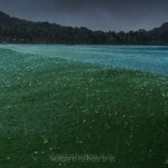

l&fff
============================

|  |  |
| :--: | :-- |
| [ l&fff](https://i.xiami.com/yinxiaofei) | **播放数**: 1299885 **粉丝数**: 1155 **评论数**: 281 **地区**: China 中国大陆 **风格**: 爵士说唱 Jazz Rap, 轻音乐 Easy Listening, 独立电子乐 Indietronica  |

## 档案

成都市

## 专辑

| 名称 | 语种 | 唱片公司 | 发行时间 | 专辑类别 | 专辑风格 |
| :--: | :-- | :-- | :-- | :-- | :-- |
| [ 404](./albums/2104649528.md) | 国语 |  | 2019年03月04日 | EP, 单曲 | 爵士嘻哈 Jazz Hip Hop |
| [ Thunder In Everyone Of Us](./albums/594080639.md) | 其他 | 独立发行 | 2014年03月06日 | EP, 单曲 | 轻音乐 Easy Listening |
| [ Dive To  The Heart](./albums/1594116366.md) | 国语 | 独立发行 | 2014年03月06日 | EP, 单曲 | 轻音乐 Easy Listening |
| [ Spiritual Habitat](./albums/1794117213.md) | 国语 | 独立发行 | 2014年03月06日 | EP, 单曲 | 自由爵士 Free Jazz, 爵士说唱 Jazz Rap, 世界融合 World Fusion |

## 评论

|  |  |  |  |
| :-- | :-- | :-- | :-- |
|  [虾米用户](https://emumo.xiami.com/u/307230) (〟-_・)ﾝ? 2021-01-06 19:03 赞(0) 踩(0) | 
飞飞
 |
|  [虾米用户](https://emumo.xiami.com/u/2491956) 我还没想好要写什么... 2020-06-03 22:16 赞(0) 踩(0) | 
听Spring Thunder，我仿佛又回到成都的雨天，记忆模糊地呈现
 |
|  [虾米用户](https://emumo.xiami.com/u/208205142) 把我杀死，搅碎 2020-05-12 21:19 赞(0) 踩(0) | 
雨声把我带来这里
 |
|  [虾米用户](https://emumo.xiami.com/u/2641789) 我还没想好要写基 2020-03-27 22:10 赞(0) 踩(0) | 
请问还有哪里可以关注到你的音乐
 |
|  [虾米用户](https://emumo.xiami.com/u/312012518) 月明如素愁不眠 2020-01-28 16:13 赞(0) 踩(0) | 
我也不要别的，家里没口罩了，给我整一打来 
 |
|  [虾米用户](https://emumo.xiami.com/u/312012518) 月明如素愁不眠 2020-01-28 16:10 赞(0) 踩(0) | 
作为你第九九九位粉丝，有奖么
 |
|  [虾米用户](https://emumo.xiami.com/u/50868575) 喜欢风一样的声音，温柔的... 2019-12-26 11:59 赞(0) 踩(0) | 
喜欢
 |
|  [虾米用户](https://emumo.xiami.com/u/14130705) 我还没想好要写什么... 2019-06-25 09:10 赞(0) 踩(0) | 
第一次听这个 感觉还不错
 |
|  [虾米用户](https://emumo.xiami.com/u/276944698) 不要自我设限..... 2019-06-21 19:29 赞(1) 踩(0) | 
☑️
 |
|  [虾米用户](https://emumo.xiami.com/u/28923588) 空 2019-06-11 19:21 赞(0) 踩(0) | 
我怎么才能给你打钱太好听了
 |
|  [虾米用户](https://emumo.xiami.com/u/215723) 我还没想好要写什么... 2019-04-21 13:45 赞(0) 踩(0) | 
哇，今天很幸运发现了一个宝藏男孩
 |
|  [虾米用户](https://emumo.xiami.com/u/201391232) 最快的方法是先抱抱 2019-03-16 01:15 赞(0) 踩(0) | 
彡
 |
|  [虾米用户](https://emumo.xiami.com/u/307230) (〟-_・)ﾝ? 2018-12-20 02:03 赞(0) 踩(0) | 
飞飞
 |
|  [虾米用户](https://emumo.xiami.com/u/9597157) ， 2018-04-24 22:15 赞(0) 踩(0) | 
发现一个不错的音乐人~您的音乐让我想起了&amp;alpha;.pav
 |
|  [虾米用户](https://emumo.xiami.com/u/20177386) 感谢一切美好的遇见❤️ 2018-02-23 10:53 赞(0) 踩(0) | 

 |
|  [虾米用户](https://emumo.xiami.com/u/238114) The sound of... 2017-06-09 15:41 赞(1) 踩(0) | 
下载不了，码扫了，直接转到手机app自动播放。我就看不懂了，虾米这软件现在真的是越来越垃圾，不是为了听你们这些独立音乐人的歌，真的早卸载了。
 |
|  [虾米用户](https://emumo.xiami.com/u/33121944) @ @ 2016-09-07 13:14 赞(0) 踩(0) | 
网易云上面找不到你。。。
 |
|  [虾米用户](https://emumo.xiami.com/u/4370606) 我爱头发比人多 2016-08-29 02:08 赞(1) 踩(0) | 
哈哈哈，FFF团成员前来报道 
 |
|  [虾米用户](https://emumo.xiami.com/u/29230195) Gubba nub nu... 2016-05-11 21:51 赞(1) 踩(0) | 
嘻嘻
 |
|  [虾米用户](https://emumo.xiami.com/u/12161298) 天涯海角，有缘再见如果愿... 2016-04-23 14:36 赞(0) 踩(0) | 
飞哥快更
 |
|  [虾米用户](https://emumo.xiami.com/u/10437744) 我还没想好要写什么..b... 2016-04-21 03:38 赞(0) 踩(0) | 
111
 |
|  [虾米用户](https://emumo.xiami.com/u/307230) (〟-_・)ﾝ? 2016-01-04 16:15 赞(0) 踩(0) | 
新年快乐～
 |
|  [虾米用户](https://emumo.xiami.com/u/46102833)   2015-12-05 17:14 赞(0) 踩(0) | 

 |
|  [虾米用户](https://emumo.xiami.com/u/307230) (〟-_・)ﾝ? 2015-11-04 21:22 赞(0) 踩(0) | 
咦
 |
|  [虾米用户](https://emumo.xiami.com/u/43055800) 根号C就是NE！ 2015-11-02 19:10 赞(0) 踩(0) | 
好厉害。。同成都~风格赞！
 |
|  [虾米用户](https://emumo.xiami.com/u/42361373) 感恩虾米，让我们相遇！请... 2015-09-27 17:31 赞(1) 踩(0) | 
好想去程度啊， 女友在那T.T
 |
|  [虾米用户](https://emumo.xiami.com/u/856551) 虾米活下去 用户指责什么... 2015-08-26 17:11 赞(0) 踩(0) | 
怎么能不留名呢～
 |
|  [虾米用户](https://emumo.xiami.com/u/41459074) 新专辑已发布 2015-06-19 21:39 赞(0) 踩(0) | 
路过看看
 |
|  [虾米用户](https://emumo.xiami.com/u/36208991)   2015-06-11 04:14 赞(1) 踩(0) | 
好久没听你的曲子了这次听又充满了新意 喜欢❤️
 |
|  [虾米用户](https://emumo.xiami.com/u/1146303) 我还没想好要写什么... 2015-06-04 22:51 赞(0) 踩(0) | 
like
 |
|  [虾米用户](https://emumo.xiami.com/u/307230) (〟-_・)ﾝ? 2015-05-10 00:34 赞(0) 踩(0) | 
fff
 |
|  [虾米用户](https://emumo.xiami.com/u/1131889) fatbear 2015-04-26 13:36 赞(0) 踩(0) | 
你是成都的？
 |
| ⇒ |  [虾米用户](https://emumo.xiami.com/u/9161767)  2015-04-27 10:24 赞(0) 踩(0) | 
是啊。
 |
|  [虾米用户](https://emumo.xiami.com/u/43248227)  2015-04-21 00:14 赞(0) 踩(0) | 
居然互粉了
 |
|  [虾米用户](https://emumo.xiami.com/u/2523465) 我还没想好要写什么... 2015-04-20 00:57 赞(0) 踩(0) | 
又来学习下 同成都(⁎⁍̴̛ᴗ⁍̴̛⁎)
 |
|  [虾米用户](https://emumo.xiami.com/u/7879122) 钢琴后摇，美翻！ 2015-04-12 22:34 赞(0) 踩(0) | 
艾特我了？！！！！但是我不认识你啊- -
 |
| ⇒ |  [虾米用户](https://emumo.xiami.com/u/9161767)  2015-04-12 23:15 赞(0) 踩(0) | 
fff。。。
 |
|  [虾米用户](https://emumo.xiami.com/u/14093527)  2015-04-03 21:30 赞(1) 踩(0) | 
where is my mind 是pixies版的电子版伴奏吗~？
 |
| ⇒ |  [虾米用户](https://emumo.xiami.com/u/9161767)  2015-04-19 00:46 赞(0) 踩(0) | 
不是啊，那首不能听，被压坏了。
 |
| ⇒ |  [虾米用户](https://emumo.xiami.com/u/14093527)  2015-04-19 11:03 赞(0) 踩(0) | 
<q><b>l&amp;fff说：</b></q>
 |
|  [虾米用户](https://emumo.xiami.com/u/18566621) 我是无肉不欢的素食主义者 2015-03-29 19:51 赞(0) 踩(0) | 
啦啦啦~
 |
| ⇒ |  [虾米用户](https://emumo.xiami.com/u/9161767)  2015-03-30 00:43 赞(0) 踩(0) | 
~&amp;gt;_&amp;lt;~
 |
|  [虾米用户](https://emumo.xiami.com/u/18566621) 我是无肉不欢的素食主义者 2015-03-29 19:50 赞(0) 踩(0) | 
啦啦啦~
 |
|  [虾米用户](https://emumo.xiami.com/u/307230) (〟-_・)ﾝ? 2015-03-24 14:51 赞(0) 踩(0) | 
又换名字啦~
 |
| ⇒ |  [虾米用户](https://emumo.xiami.com/u/9161767)  2015-03-24 15:36 赞(0) 踩(0) | 
还是换回来吧，反正都不好听。。
 |
|  [虾米用户](https://emumo.xiami.com/u/6111570) 我想请你吃雪糕 2015-03-23 23:35 赞(0) 踩(0) | 
充满惊喜的夜晚！！
 |
| ⇒ |  [虾米用户](https://emumo.xiami.com/u/9161767)  2015-03-23 23:47 赞(0) 踩(0) | 
闯了鬼了？
 |
| ⇒ |  [虾米用户](https://emumo.xiami.com/u/6111570) 我想请你吃雪糕 2015-03-24 12:06 赞(0) 踩(0) | 
<q><b>l&amp;fff说：</b></q>
 |
| ⇒ |  [虾米用户](https://emumo.xiami.com/u/9161767)  2015-03-24 12:44 赞(0) 踩(0) | 
<q><b>oyasumi说：</b></q>
 |
|  [虾米用户](https://emumo.xiami.com/u/3961475)   2015-03-21 23:18 赞(0) 踩(0) | 
你好赞，你是大熊猫吗。
 |
| ⇒ |  [虾米用户](https://emumo.xiami.com/u/9161767)  2015-03-21 23:32 赞(0) 踩(0) | 
是的，我喜欢吃。
 |
|  [虾米用户](https://emumo.xiami.com/u/464312) Heyoo, 2015-03-16 15:53 赞(0) 踩(0) | 
赞
 |
|  [虾米用户](https://emumo.xiami.com/u/32320260) kiss me 2015-03-14 07:06 赞(1) 踩(0) | 
成都川大磨子桥？那一带我很熟的haha 你好
 |
|  [虾米用户](https://emumo.xiami.com/u/31325783) 雜食動物 2015-03-13 10:33 赞(1) 踩(0) | 
好久没来逛逛了~
 |
|  [虾米用户](https://emumo.xiami.com/u/3967926) 因果造化 众生皆苦 2015-03-04 15:54 赞(0) 踩(0) | 
曲子为啥总在替换啊。以前收藏的曲子又变成别的曲子了。
 |
| ⇒ |  [虾米用户](https://emumo.xiami.com/u/9161767)  2015-03-12 23:38 赞(0) 踩(0) | 
哭，不会删歌啊。
 |
| ⇒ |  [虾米用户](https://emumo.xiami.com/u/3967926) 因果造化 众生皆苦 2015-03-13 08:51 赞(0) 踩(0) | 
<q><b>l&amp;fff说：</b></q>
 |
| ⇒ |  [虾米用户](https://emumo.xiami.com/u/34010953) 落花时节又逢君 2015-03-13 23:57 赞(0) 踩(0) | 
<q><b>猫肉之源说：</b></q>
 |
|  [虾米用户](https://emumo.xiami.com/u/6374841)  2015-02-19 09:19 赞(0) 踩(0) | 
新年快乐！
 |
| ⇒ |  [虾米用户](https://emumo.xiami.com/u/9161767)  2015-02-19 21:25 赞(0) 踩(0) | 
新年快乐
 |
|  [虾米用户](https://emumo.xiami.com/u/307230) (〟-_・)ﾝ? 2015-02-13 01:00 赞(0) 踩(0) | 
*･゜ﾟ･*:.｡..｡.:*･'(*ﾟ▽ﾟ*)'･*:.｡. .｡.:*･゜ﾟ･*
 |
|  [虾米用户](https://emumo.xiami.com/u/36208991)   2015-02-11 18:37 赞(0) 踩(0) | 
好棒
 |
|  [虾米用户](https://emumo.xiami.com/u/3269814) 罄 2015-02-08 21:07 赞(0) 踩(0) | 
你好^ ^
 |
| ⇒ |  [虾米用户](https://emumo.xiami.com/u/9161767)  2015-02-08 23:15 赞(0) 踩(0) | 
♪（ｖ＾＿＾）ｖ
 |
|  [虾米用户](https://emumo.xiami.com/u/270267)  2015-02-06 11:02 赞(0) 踩(0) | 
酒香不怕巷子深 <a href="http://www.88tou.com/13330.html" target="_blank" rel="nofollow noreferrer noopener">http://www.88tou.com/13330.html</a>
 |
| ⇒ |  [虾米用户](https://emumo.xiami.com/u/9161767)  2015-02-06 20:04 赞(0) 踩(0) | 
谢谢推广。
 |
|  [虾米用户](https://emumo.xiami.com/u/12354783) 自嗨闷骚耍耍酷 2015-02-05 01:32 赞(0) 踩(0) | 
我卡了！sorry
 |
|  [虾米用户](https://emumo.xiami.com/u/12354783) 自嗨闷骚耍耍酷 2015-01-31 15:37 赞(0) 踩(0) | 
同成都的！顶啊！以入坑！
 |
| ⇒ |  [虾米用户](https://emumo.xiami.com/u/9161767)  2015-02-05 01:30 赞(0) 踩(0) | 
谢谢。成都是个很棒的地方，毕业可能会留下。
 |
| ⇒ |  [虾米用户](https://emumo.xiami.com/u/12354783) 自嗨闷骚耍耍酷 2015-02-05 01:31 赞(0) 踩(0) | 
<q><b>l&amp;fff说：</b></q>
 |
| ⇒ |  [虾米用户](https://emumo.xiami.com/u/12354783) 自嗨闷骚耍耍酷 2015-02-05 01:31 赞(0) 踩(0) | 
<q><b>l&amp;fff说：</b></q>
 |
| ⇒ |  [虾米用户](https://emumo.xiami.com/u/12354783) 自嗨闷骚耍耍酷 2015-02-05 01:31 赞(0) 踩(0) | 
<q><b>l&amp;fff说：</b></q>
 |
| ⇒ |  [虾米用户](https://emumo.xiami.com/u/12354783) 自嗨闷骚耍耍酷 2015-02-05 01:31 赞(0) 踩(0) | 
<q><b>l&amp;fff说：</b></q>
 |
| ⇒ |  [虾米用户](https://emumo.xiami.com/u/12354783) 自嗨闷骚耍耍酷 2015-02-05 01:40 赞(0) 踩(0) | 
<q><b>说：</b></q>
 |
|  [虾米用户](https://emumo.xiami.com/u/39582292)  2015-01-17 22:23 赞(0) 踩(0) | 
good
 |
|  [虾米用户](https://emumo.xiami.com/u/6374841)  2014-12-24 14:54 赞(0) 踩(0) | 
平安夜、圣诞节快乐
 |
| ⇒ |  [虾米用户](https://emumo.xiami.com/u/9161767)  2014-12-24 23:19 赞(0) 踩(0) | 
同乐～
 |
|  [虾米用户](https://emumo.xiami.com/u/7989378) -Inst- 2014-12-18 19:15 赞(1) 踩(0) | 
FFFFFFF
 |
|  [虾米用户](https://emumo.xiami.com/u/44344456)  2014-12-02 22:21 赞(0) 踩(0) | 
很好听，喜欢这个风格~~
 |
|  [虾米用户](https://emumo.xiami.com/u/31074894)  2014-11-17 16:38 赞(0) 踩(0) | 
第二首...(^o^)/~
 |
|  [虾米用户](https://emumo.xiami.com/u/38807271) Kazuo 2014-11-12 15:46 赞(1) 踩(0) | 
❤️好爱。。
 |
|  [虾米用户](https://emumo.xiami.com/u/307230) (〟-_・)ﾝ? 2014-11-10 22:28 赞(2) 踩(0) | 
干起来吧！点燃图书馆的书架！
 |
| ⇒ |  [虾米用户](https://emumo.xiami.com/u/9161767)  2014-11-10 22:39 赞(0) 踩(0) | 
盗我签名，哈哈~
 |
| ⇒ |  [虾米用户](https://emumo.xiami.com/u/307230) (〟-_・)ﾝ? 2014-11-10 22:44 赞(0) 踩(0) | 
<q><b>l&amp;fff说：</b></q>
 |
|  [虾米用户](https://emumo.xiami.com/u/4412959) fresh steame... 2014-10-21 19:39 赞(5) 踩(0) | 
好棒啊好喜歡。麼麼噠武侯学霸~
 |
|  [虾米用户](https://emumo.xiami.com/u/3967926) 因果造化 众生皆苦 2014-10-16 11:01 赞(1) 踩(0) | 
加油啊小学霸
 |
|  [虾米用户](https://emumo.xiami.com/u/4935021) 没有音乐不能呼吸、 2014-09-29 21:38 赞(1) 踩(0) | 
爱不释耳、狠赞!!!
 |
|  [虾米用户](https://emumo.xiami.com/u/1346863) 感谢虾米，感谢大家！ 2014-09-21 20:51 赞(0) 踩(0) | 
这么棒?....还都在成都。。。。nice
 |
|  [虾米用户](https://emumo.xiami.com/u/8384826) 再见，虾米，谢谢！ 2014-09-14 23:30 赞(0) 踩(0) | 
过来鼓励一下
 |
|  [虾米用户](https://emumo.xiami.com/u/9508021) 看乐评总是比听音乐有趣。 2014-09-08 11:50 赞(0) 踩(0) | 
中秋节快乐！
 |
|  [虾米用户](https://emumo.xiami.com/u/29230195) Gubba nub nu... 2014-09-06 14:00 赞(8) 踩(0) | 
飞哥摸摸大~
 |
|  [虾米用户](https://emumo.xiami.com/u/9417605) 那亲吻与鼻息中隐现的厄运... 2014-08-22 22:06 赞(0) 踩(0) | 
最近很高产XDDDDDD
 |
| ⇒ |  [虾米用户](https://emumo.xiami.com/u/9161767)  2014-08-22 22:13 赞(0) 踩(0) | 
~~,要开学了！赶时间做些demo，都没有好好做混音，太难听的话请不要介意~⊙﹏⊙‖∣
 |
|  [虾米用户](https://emumo.xiami.com/u/719995) 事出有音 2014-08-14 17:00 赞(0) 踩(0) | 
国外环境就是好呀~
 |
| ⇒ |  [虾米用户](https://emumo.xiami.com/u/9161767)  2014-08-14 20:17 赞(0) 踩(0) | 
没在国外啊.~.
 |
| ⇒ |  [虾米用户](https://emumo.xiami.com/u/719995) 事出有音 2014-08-14 20:18 赞(0) 踩(0) | 
<q><b>l&amp;fff说：</b></q>
 |
| ⇒ |  [虾米用户](https://emumo.xiami.com/u/9161767)  2014-08-14 20:35 赞(0) 踩(0) | 
<q><b>1806说：</b></q>
 |
| ⇒ |  [虾米用户](https://emumo.xiami.com/u/719995) 事出有音 2014-08-14 20:39 赞(0) 踩(0) | 
<q><b>l&amp;fff说：</b></q>
 |
| ⇒ |  [虾米用户](https://emumo.xiami.com/u/9161767)  2014-08-14 20:43 赞(0) 踩(0) | 
<q><b>1806说：</b></q>
 |
| ⇒ |  [虾米用户](https://emumo.xiami.com/u/719995) 事出有音 2014-08-14 20:56 赞(0) 踩(0) | 
<q><b>l&amp;fff说：</b></q>
 |
|  [虾米用户](https://emumo.xiami.com/u/6374841)  2014-08-14 12:30 赞(0) 踩(0) | 
好多曲子听了让人丧心病狂的着魔！！！
 |
| ⇒ |  [虾米用户](https://emumo.xiami.com/u/9161767)  2014-08-14 20:48 赞(0) 踩(0) | 
（¯﹃¯）（¯﹃¯）肿么会？
 |
| ⇒ |  [虾米用户](https://emumo.xiami.com/u/6374841)  2014-08-15 09:36 赞(0) 踩(0) | 
<q><b>l&amp;fff说：</b></q>
 |
|  [虾米用户](https://emumo.xiami.com/u/3967926) 因果造化 众生皆苦 2014-08-13 11:33 赞(0) 踩(0) | 
我记得上次是不是听了一个什么DEMO，现在又想听发现找不到了？
 |
| ⇒ |  [虾米用户](https://emumo.xiami.com/u/9161767)  2014-08-13 17:34 赞(0) 踩(0) | 
删了我，是你写过评论那首吗？
 |
| ⇒ |  [虾米用户](https://emumo.xiami.com/u/3967926) 因果造化 众生皆苦 2014-08-13 18:03 赞(0) 踩(0) | 
<q><b>l&amp;fff说：</b></q>
 |
| ⇒ |  [虾米用户](https://emumo.xiami.com/u/9161767)  2014-08-13 22:15 赞(0) 踩(0) | 
<q><b>猫肉之源说：</b></q>
 |
|  [虾米用户](https://emumo.xiami.com/u/10668683) 追逐音乐的时光 2014-08-12 19:29 赞(0) 踩(0) | 
小飞是国人？？？为啥我现在才知道    容我思考一下！！！
 |
| ⇒ |  [虾米用户](https://emumo.xiami.com/u/9161767)  2014-08-12 20:15 赞(0) 踩(0) | 
纯雅君~~( ⊙o⊙ )~~
 |
| ⇒ |  [虾米用户](https://emumo.xiami.com/u/10668683) 追逐音乐的时光 2014-09-01 22:28 赞(0) 踩(0) | 
<q><b>l&amp;fff说：</b></q>
 |
| ⇒ |  [虾米用户](https://emumo.xiami.com/u/9161767)  2014-09-01 23:12 赞(0) 踩(0) | 
<q><b>纯雅说：</b></q>
 |
| ⇒ |  [虾米用户](https://emumo.xiami.com/u/10668683) 追逐音乐的时光 2014-09-01 23:30 赞(0) 踩(0) | 
<q><b>l&amp;fff说：</b></q>
 |
| ⇒ |  [虾米用户](https://emumo.xiami.com/u/9161767)  2014-09-02 00:18 赞(0) 踩(0) | 
<q><b>纯雅说：</b></q>
 |
| ⇒ |  [虾米用户](https://emumo.xiami.com/u/10668683) 追逐音乐的时光 2014-09-02 00:35 赞(0) 踩(0) | 
<q><b>l&amp;fff说：</b></q>
 |
| ⇒ |  [虾米用户](https://emumo.xiami.com/u/927899) 耳际。 2015-01-06 00:20 赞(0) 踩(0) | 
<q><b>l&amp;fff说：</b></q>
 |
| ⇒ |  [虾米用户](https://emumo.xiami.com/u/9161767)  2015-01-06 16:36 赞(0) 踩(0) | 
<q><b>Musk ox说：</b></q>
 |
| ⇒ |  [虾米用户](https://emumo.xiami.com/u/927899) 耳际。 2015-01-06 20:06 赞(0) 踩(0) | 
<q><b>l&amp;fff说：</b></q>
 |
|  [虾米用户](https://emumo.xiami.com/u/9417605) 那亲吻与鼻息中隐现的厄运... 2014-08-07 23:42 赞(0) 踩(0) | 
padmakara做得非常有味道~~人声是采样？还是亲自己录得？？
 |
| ⇒ |  [虾米用户](https://emumo.xiami.com/u/9161767)  2014-08-07 23:53 赞(0) 踩(0) | 
采样...
 |
|  [虾米用户](https://emumo.xiami.com/u/304012) 女人说到做到 2014-08-07 21:06 赞(0) 踩(0) | 
你被系统君爱意满满的屏蔽了，让我说什么好。名字太长必然是一种烦恼……
 |
| ⇒ |  [虾米用户](https://emumo.xiami.com/u/9161767)  2014-08-07 21:09 赞(0) 踩(0) | 
现在是我改成这样的。。。
 |
|  [虾米用户](https://emumo.xiami.com/u/883368) 海底的水族箱 2014-08-07 13:34 赞(1) 踩(0) | 
艹地狂魔233333
 |
|  [虾米用户](https://emumo.xiami.com/u/3125486) 僕、頑張ります！ 2014-08-06 14:04 赞(0) 踩(0) | 
咦小非你的名字怎么了……
 |
| ⇒ |  [虾米用户](https://emumo.xiami.com/u/9161767)  2014-08-06 16:12 赞(0) 踩(0) | 
貌似抽风了～
 |
|  [虾米用户](https://emumo.xiami.com/u/5642963) 我还没想好要写什么... 2014-08-06 13:01 赞(0) 踩(0) | 
是国人啊！好激动，这么带感的爵士
 |
| ⇒ |  [虾米用户](https://emumo.xiami.com/u/9161767)  2014-08-06 16:11 赞(0) 踩(0) | 
luv你在搞笑吗？
 |
|  [虾米用户](https://emumo.xiami.com/u/31325783) 雜食動物 2014-08-02 23:03 赞(0) 踩(0) | 
咦名字变短了难道是我电脑出了问题？
 |
| ⇒ |  [虾米用户](https://emumo.xiami.com/u/9161767)  2014-08-03 09:37 赞(0) 踩(0) | 
我主页出问题了-_-#
 |
|  [虾米用户](https://emumo.xiami.com/u/9417605) 那亲吻与鼻息中隐现的厄运... 2014-07-30 23:08 赞(0) 踩(0) | 
Walk Through The Night Fair 可以加一些吉他的泛音混响的高频如果在增加一些就更美啦XDDDDD
 |
| ⇒ |  [虾米用户](https://emumo.xiami.com/u/9161767)  2014-07-30 23:32 赞(0) 踩(0) | 
恩恩，谢谢你的建议哦，看到你的简介才发现也是做音乐的呀，虾米上没放作品？
 |
| ⇒ |  [虾米用户](https://emumo.xiami.com/u/9417605) 那亲吻与鼻息中隐现的厄运... 2014-07-31 11:17 赞(0) 踩(0) | 
<q><b>l&amp;fff说：</b></q>
 |
|  [虾米用户](https://emumo.xiami.com/u/6111570) 我想请你吃雪糕 2014-07-29 12:08 赞(0) 踩(0) | 
其实我是来欣赏头像的
 |
| ⇒ |  [虾米用户](https://emumo.xiami.com/u/9161767)  2014-07-29 17:53 赞(0) 踩(0) | 
囧rz...
 |
| ⇒ |  [虾米用户](https://emumo.xiami.com/u/6111570) 我想请你吃雪糕 2014-08-01 23:20 赞(0) 踩(0) | 
<q><b>l&amp;fff说：</b></q>
 |
| ⇒ |  [虾米用户](https://emumo.xiami.com/u/9161767)  2014-08-01 23:35 赞(0) 踩(0) | 
<q><b>oyasumi说：</b></q>
 |
| ⇒ |  [虾米用户](https://emumo.xiami.com/u/6111570) 我想请你吃雪糕 2014-08-01 23:44 赞(0) 踩(0) | 
<q><b>l&amp;fff说：</b></q>
 |
| ⇒ |  [虾米用户](https://emumo.xiami.com/u/9161767)  2014-08-01 23:49 赞(0) 踩(0) | 
<q><b>oyasumi说：</b></q>
 |
|  [虾米用户](https://emumo.xiami.com/u/5642963) 我还没想好要写什么... 2014-07-28 15:37 赞(0) 踩(0) | 
么么哒
 |
| ⇒ |  [虾米用户](https://emumo.xiami.com/u/9161767)  2014-07-28 17:31 赞(0) 踩(0) | 
萌萌嗒
 |
|  [虾米用户](https://emumo.xiami.com/u/1547084)  2014-07-28 09:43 赞(0) 踩(0) | 
改名字了！
 |
| ⇒ |  [虾米用户](https://emumo.xiami.com/u/9161767)  2014-07-28 11:03 赞(0) 踩(0) | 
恩恩，我正准备改掉的。kostta好久没出现了呢~
 |
|  [虾米用户](https://emumo.xiami.com/u/35183867) 音乐不是命题作文~ 2014-07-27 18:50 赞(0) 踩(0) | 
很有想法的音乐啊~发现世界真是大的很，外面的世界很精彩~
 |
|  [虾米用户](https://emumo.xiami.com/u/3967926) 因果造化 众生皆苦 2014-07-27 16:38 赞(0) 踩(0) | 
粉越来越多了啊现在。
 |
| ⇒ |  [虾米用户](https://emumo.xiami.com/u/9161767)  2014-07-27 16:50 赞(0) 踩(0) | 
恩恩，猫哥你也是啊~~。大家都越来越捧场了~(≧▽≦)/~啦啦啦
 |
|  [虾米用户](https://emumo.xiami.com/u/17326367) 爱就是极快速的能量振动 2014-07-27 06:54 赞(0) 踩(0) | 
新曲不错  加油！
 |
| ⇒ |  [虾米用户](https://emumo.xiami.com/u/9161767)  2014-07-27 08:04 赞(0) 踩(0) | 
谢谢，一起加油^_^
 |
|  [虾米用户](https://emumo.xiami.com/u/39324252)  2014-07-25 19:49 赞(0) 踩(0) | 
为什么我要费尽心机去找好听的男声？！我旁边就是啊！我完全拜倒在了你翻唱的那首！我我我明天去膜拜！早上的包子我请了！
 |
| ⇒ |  [虾米用户](https://emumo.xiami.com/u/9161767)  2014-07-25 21:53 赞(0) 踩(0) | 
這都被你聽到了。。。。嗓音太低實在不適合唱歌。包子就算了吧。
 |
|  [虾米用户](https://emumo.xiami.com/u/29230195) Gubba nub nu... 2014-07-25 17:44 赞(0) 踩(0) | 
摸摸大
 |
| ⇒ |  [虾米用户](https://emumo.xiami.com/u/9161767)  2014-07-25 19:37 赞(0) 踩(0) | 
越摸越矮～-_-#
 |
|  [虾米用户](https://emumo.xiami.com/u/15775002) 重温MJ The Kin... 2014-07-24 00:54 赞(0) 踩(0) | 
yoho小飞我来咯
 |
| ⇒ |  [虾米用户](https://emumo.xiami.com/u/9161767)  2014-07-24 06:55 赞(0) 踩(0) | 
欢迎。(☆_☆)
 |
|  [虾米用户](https://emumo.xiami.com/u/16745497) 我还没想好要写什么... 2014-07-11 15:55 赞(0) 踩(0) | 
国人做音乐做的这么好。赶紧滚来支持!!!!!!!   .、丶.、丶.、丶.、丶.、丶.、丶.、丶.、丶
 |
| ⇒ |  [虾米用户](https://emumo.xiami.com/u/9161767)  2014-07-11 16:01 赞(0) 踩(0) | 
谢谢。。。都在成都呢。。有空多交流哈~
 |
| ⇒ |  [虾米用户](https://emumo.xiami.com/u/16745497) 我还没想好要写什么... 2014-07-11 16:03 赞(0) 踩(0) | 
<q><b>l&amp;fff说：</b></q>
 |
|  [虾米用户](https://emumo.xiami.com/u/38556828)  2014-07-10 12:10 赞(0) 踩(0) | 
编曲好棒！！！
 |
| ⇒ |  [虾米用户](https://emumo.xiami.com/u/9161767)  2014-07-10 15:40 赞(0) 踩(0) | 
我覺得很一般，還在學習中。
 |
|  [虾米用户](https://emumo.xiami.com/u/3407135) can fly 2014-07-09 15:54 赞(0) 踩(0) | 
可以向着Chillwave发展
 |
| ⇒ |  [虾米用户](https://emumo.xiami.com/u/9161767)  2014-07-09 21:30 赞(0) 踩(0) | 
chill也不錯訥。還在嘗試階段，所以風格比較難以捉摸～
 |
|  [虾米用户](https://emumo.xiami.com/u/7290390) *´∀`* 2014-07-02 20:52 赞(0) 踩(0) | 
你的歌好棒呀~~为啥我没有早点发现你呢(*´∀`*)
 |
| ⇒ |  [虾米用户](https://emumo.xiami.com/u/9161767)  2014-07-02 20:55 赞(0) 踩(0) | 
谢谢支持，可惜都是些幼稚的作品，见笑了~
 |
|  [虾米用户](https://emumo.xiami.com/u/32779685) 没事听听歌 2014-07-01 23:33 赞(1) 踩(0) | 
鼓点敲得心都酥了~
 |
| ⇒ |  [虾米用户](https://emumo.xiami.com/u/9161767)  2014-07-02 07:00 赞(0) 踩(0) | 
哈哈。。乱乱的，没被敲晕？
 |
|  [虾米用户](https://emumo.xiami.com/u/99364) 我还没想好要写什么... 2014-06-30 09:59 赞(1) 踩(0) | 
你才是萌萌的，Walk Through The Night Fair给你点赞，可以做成chilltrap或者ambient
 |
| ⇒ |  [虾米用户](https://emumo.xiami.com/u/9161767)  2014-06-30 11:35 赞(0) 踩(0) | 
哈哈。。。其实我也不知道这种算什么曲风，感觉不伦不类的。
 |
| ⇒ |  [虾米用户](https://emumo.xiami.com/u/99364) 我还没想好要写什么... 2014-06-30 15:22 赞(0) 踩(0) | 
<q><b>l&amp;fff说：</b></q>
 |
| ⇒ |  [虾米用户](https://emumo.xiami.com/u/9161767)  2014-06-30 21:39 赞(0) 踩(0) | 
<q><b>Ops.7说：</b></q>
 |
| ⇒ |  [虾米用户](https://emumo.xiami.com/u/7460176) 눈_눈 2014-06-30 23:11 赞(0) 踩(0) | 
冠言呀！
 |
| ⇒ |  [虾米用户](https://emumo.xiami.com/u/99364) 我还没想好要写什么... 2014-07-01 09:30 赞(0) 踩(0) | 
<q><b>二才子说：</b></q>
 |
| ⇒ |  [虾米用户](https://emumo.xiami.com/u/909187) 暂无签名~ 2014-07-01 10:53 赞(0) 踩(0) | 
<q><b>二才子说：</b></q>
 |
| ⇒ |  [虾米用户](https://emumo.xiami.com/u/7460176) 눈_눈 2014-07-01 11:56 赞(0) 踩(0) | 
<q><b>Ops.7说：</b></q>
 |
| ⇒ |  [虾米用户](https://emumo.xiami.com/u/81693) 我还没想好要写什么... 2014-07-08 16:21 赞(0) 踩(0) | 
<q><b>二才子说：</b></q>
 |
| ⇒ |  [虾米用户](https://emumo.xiami.com/u/7460176) 눈_눈 2014-07-08 17:50 赞(0) 踩(0) | 
<q><b>草草子说：</b></q>
 |
| ⇒ |  [虾米用户](https://emumo.xiami.com/u/9161767)  2014-07-09 21:36 赞(0) 踩(0) | 
<q><b>二才子说：</b></q>
 |
| ⇒ |  [虾米用户](https://emumo.xiami.com/u/7460176) 눈_눈 2014-07-09 21:54 赞(0) 踩(0) | 
<q><b>l&amp;fff说：</b></q>
 |
|  [虾米用户](https://emumo.xiami.com/u/31325783) 雜食動物 2014-06-29 23:35 赞(0) 踩(0) | 
我来了。感觉还不错 已关注 加油~
 |
| ⇒ |  [虾米用户](https://emumo.xiami.com/u/9161767)  2014-06-30 09:17 赞(0) 踩(0) | 
谢谢关注，会继续学习的~
 |
|  [虾米用户](https://emumo.xiami.com/u/10337057) 独自穿行于空灵之境 2014-06-29 16:18 赞(0) 踩(0) | 
你的音乐很棒啊
 |
| ⇒ |  [虾米用户](https://emumo.xiami.com/u/9161767)  2014-06-29 16:58 赞(0) 踩(0) | 
谢谢支持，其实我技术差太远了啊。
 |
|  [虾米用户](https://emumo.xiami.com/u/5642963) 我还没想好要写什么... 2014-06-27 21:06 赞(0) 踩(0) | 
我的大侠是你唷～
 |
| ⇒ |  [虾米用户](https://emumo.xiami.com/u/5642963) 我还没想好要写什么... 2014-06-27 21:23 赞(0) 踩(0) | 
<q><b>说：</b></q>
 |
| ⇒ |  [虾米用户](https://emumo.xiami.com/u/9161767)  2014-06-27 21:49 赞(0) 踩(0) | 
<q><b>Luv说：</b></q>
 |
|  [虾米用户](https://emumo.xiami.com/u/18566621) 我是无肉不欢的素食主义者 2014-06-27 20:56 赞(0) 踩(0) | 
哟呵，改名字诶
 |
| ⇒ |  [虾米用户](https://emumo.xiami.com/u/9161767)  2014-06-27 20:59 赞(0) 踩(0) | 
被你发现了诶~。。。懒人一坨，也想不出什么名字，真名太难听，就改了~
 |
|  [虾米用户](https://emumo.xiami.com/u/3125486) 僕、頑張ります！ 2014-06-02 22:05 赞(0) 踩(0) | 
改名字了233~！
 |
| ⇒ |  [虾米用户](https://emumo.xiami.com/u/9161767)  2014-06-02 23:36 赞(0) 踩(0) | 
是啊，还是感觉弱弱的2333～(-_^)
 |
|  [虾米用户](https://emumo.xiami.com/u/12161298) 天涯海角，有缘再见如果愿... 2014-05-28 10:54 赞(0) 踩(0) | 
粉丝数飞涨啊。。音乐好顶赞
 |
| ⇒ |  [虾米用户](https://emumo.xiami.com/u/9161767)  2014-05-28 11:06 赞(0) 踩(0) | 
很久没来了嘢，学习压力大吗？
 |
|  [虾米用户](https://emumo.xiami.com/u/513520) 用力追赶时代 2014-05-25 10:50 赞(0) 踩(0) | 
feeling
 |
|  [虾米用户](https://emumo.xiami.com/u/11387074)  各位 虾米即将关停，请... 2014-05-24 17:58 赞(0) 踩(0) | 
很赞啊
 |
| ⇒ |  [虾米用户](https://emumo.xiami.com/u/9161767)  2014-05-24 19:45 赞(0) 踩(0) | 
你的签名很赞～
 |
|  [虾米用户](https://emumo.xiami.com/u/36529729) 听 2014-05-19 00:11 赞(0) 踩(0) | 
学习了，做的很棒，唱的也好。吉他是录的还是做的，好真实。
 |
| ⇒ |  [虾米用户](https://emumo.xiami.com/u/9161767)  2014-05-19 00:14 赞(0) 踩(0) | 
我才要向你学习呢。。。这个是翻唱的啊，有伴奏。
 |
| ⇒ |  [虾米用户](https://emumo.xiami.com/u/36529729) 听 2014-05-19 00:18 赞(0) 踩(0) | 
<q><b>l&amp;fff说：</b></q>
 |
| ⇒ |  [虾米用户](https://emumo.xiami.com/u/9161767)  2014-05-19 00:19 赞(0) 踩(0) | 
<q><b>Junic_峻说：</b></q>
 |
| ⇒ |  [虾米用户](https://emumo.xiami.com/u/36529729) 听 2014-05-19 00:24 赞(0) 踩(0) | 
<q><b>l&amp;fff说：</b></q>
 |
| ⇒ |  [虾米用户](https://emumo.xiami.com/u/9161767)  2014-05-19 00:25 赞(0) 踩(0) | 
<q><b>Junic_峻说：</b></q>
 |
|  [虾米用户](https://emumo.xiami.com/u/34010953) 落花时节又逢君 2014-05-16 10:48 赞(0) 踩(0) | 
rain stops 不错啊~
 |
| ⇒ |  [虾米用户](https://emumo.xiami.com/u/9161767)  2014-05-18 21:39 赞(0) 踩(0) | 
音质问题~
 |
|  [虾米用户](https://emumo.xiami.com/u/10668683) 追逐音乐的时光 2014-05-06 08:36 赞(0) 踩(0) | 
你的声音怎么感觉一下苍老了几十岁。。。。。。
 |
| ⇒ |  [虾米用户](https://emumo.xiami.com/u/9161767)  2014-05-06 17:57 赞(0) 踩(0) | 
没有啊，一直就是这样的
 |
|  [虾米用户](https://emumo.xiami.com/u/25006757) 寻找，寻找。 2014-04-30 21:35 赞(0) 踩(0) | 
好久没来了 又有好音乐了呀~赞
 |
| ⇒ |  [虾米用户](https://emumo.xiami.com/u/9161767)  2014-04-30 21:42 赞(0) 踩(0) | 
嘻嘻，欢迎欢迎，技术还差的远呢~
 |
| ⇒ |  [虾米用户](https://emumo.xiami.com/u/25006757) 寻找，寻找。 2014-04-30 21:55 赞(0) 踩(0) | 
<q><b>l&amp;fff说：</b></q>
 |
| ⇒ |  [虾米用户](https://emumo.xiami.com/u/9161767)  2014-04-30 22:10 赞(0) 踩(0) | 
<q><b>Yi说：</b></q>
 |
| ⇒ |  [虾米用户](https://emumo.xiami.com/u/25006757) 寻找，寻找。 2014-04-30 22:13 赞(0) 踩(0) | 
<q><b>l&amp;fff说：</b></q>
 |
| ⇒ |  [虾米用户](https://emumo.xiami.com/u/25006757) 寻找，寻找。 2017-10-28 00:36 赞(0) 踩(0) | 
<q><b>说：</b></q>
 |
|  [虾米用户](https://emumo.xiami.com/u/1024746) 灵魂不该屈服 2014-04-23 14:39 赞(0) 踩(0) | 
为什么这样也能成为音乐人？没有门槛的吗？
 |
| ⇒ |  [虾米用户](https://emumo.xiami.com/u/34010953) 落花时节又逢君 2014-04-24 12:16 赞(0) 踩(0) | 
只是因为他的音乐风格跟你平时听的不一样而已。他的歌只是不像aira mitsuki的ロボシトハニー那么聒噪而已。
 |
|  [虾米用户](https://emumo.xiami.com/u/12161298) 天涯海角，有缘再见如果愿... 2014-04-13 12:53 赞(0) 踩(0) | 
成都的好多啊
 |
|  [虾米用户](https://emumo.xiami.com/u/12161298) 天涯海角，有缘再见如果愿... 2014-04-13 12:52 赞(0) 踩(0) | 
换头像瞬间降档次。。我开玩笑的~~
 |
| ⇒ |  [虾米用户](https://emumo.xiami.com/u/25006757) 寻找，寻找。 2014-04-30 21:32 赞(0) 踩(0) | 
我觉得怎么逼格变高了啊~~
 |
| ⇒ |  [虾米用户](https://emumo.xiami.com/u/9161767)  2014-04-30 22:15 赞(0) 踩(0) | 
<q><b>Yi说：</b></q>
 |
| ⇒ |  [虾米用户](https://emumo.xiami.com/u/25006757) 寻找，寻找。 2014-04-30 22:17 赞(0) 踩(0) | 
<q><b>l&amp;fff说：</b></q>
 |
| ⇒ |  [虾米用户](https://emumo.xiami.com/u/9161767)  2014-04-30 22:19 赞(0) 踩(0) | 
<q><b>Yi说：</b></q>
 |
| ⇒ |  [虾米用户](https://emumo.xiami.com/u/25006757) 寻找，寻找。 2014-04-30 22:20 赞(0) 踩(0) | 
<q><b>l&amp;fff说：</b></q>
 |
| ⇒ |  [虾米用户](https://emumo.xiami.com/u/9161767)  2014-04-30 22:26 赞(0) 踩(0) | 
<q><b>Yi说：</b></q>
 |
| ⇒ |  [虾米用户](https://emumo.xiami.com/u/25006757) 寻找，寻找。 2014-04-30 22:28 赞(0) 踩(0) | 
<q><b>l&amp;fff说：</b></q>
 |
|  [虾米用户](https://emumo.xiami.com/u/9497670) 人生不仅仅是一个结果~~ 2014-04-10 19:47 赞(0) 踩(0) | 
顶一个，加油！！！
 |
| ⇒ |  [虾米用户](https://emumo.xiami.com/u/9161767)  2014-04-10 20:44 赞(0) 踩(0) | 
会继续努力的^ _ ^
 |
|  [虾米用户](https://emumo.xiami.com/u/6118443) 暂无签名~ 2014-04-06 00:58 赞(0) 踩(0) | 
嗯.说起来你的头像..  与我喜欢的一位漫画作者的画风惊人的相似..
 |
|  [虾米用户](https://emumo.xiami.com/u/34010953) 落花时节又逢君 2014-04-05 21:54 赞(0) 踩(0) | 
小镇遇见你？？？到哪儿去了？
 |
| ⇒ |  [虾米用户](https://emumo.xiami.com/u/9161767)  2014-04-05 22:18 赞(0) 踩(0) | 
s&amp;amp;f专辑里的
 |
|  [虾米用户](https://emumo.xiami.com/u/6118443) 暂无签名~ 2014-04-05 20:25 赞(0) 踩(0) | 
先收藏了.日后再听
 |
| ⇒ |  [虾米用户](https://emumo.xiami.com/u/9161767)  2014-04-05 23:04 赞(0) 踩(0) | 
OK～现在技术还不行，所以听起来会有点怪～
 |
|  [虾米用户](https://emumo.xiami.com/u/12161298) 天涯海角，有缘再见如果愿... 2014-04-04 18:46 赞(0) 踩(0) | 
更新速度好快
 |
| ⇒ |  [虾米用户](https://emumo.xiami.com/u/9161767)  2014-04-04 18:58 赞(0) 踩(0) | 
没有好快啊~
 |
|  [虾米用户](https://emumo.xiami.com/u/34010953) 落花时节又逢君 2014-03-25 11:53 赞(0) 踩(0) | 
童鞋说，听了你的音乐，觉得你可能是个沉静温和的人吧……没错，是人不是淫哦……咩哈哈哈哈，调侃一下下。
 |
| ⇒ |  [虾米用户](https://emumo.xiami.com/u/9161767)  2014-03-25 12:18 赞(0) 踩(0) | 
是吗？我觉得是冷淡慢热啊，不过也挺沉静。
 |
|  [虾米用户](https://emumo.xiami.com/u/18566621) 我是无肉不欢的素食主义者 2014-03-23 18:23 赞(0) 踩(0) | 
这是要成为永灿二代目的节奏吗？
 |
| ⇒ |  [虾米用户](https://emumo.xiami.com/u/9161767)  2014-03-23 18:31 赞(0) 踩(0) | 
怎么今天和永灿这么有缘~·~
 |
| ⇒ |  [虾米用户](https://emumo.xiami.com/u/18566621) 我是无肉不欢的素食主义者 2014-03-23 22:08 赞(0) 踩(0) | 
<q><b>l&amp;fff说：</b></q>
 |
| ⇒ |  [虾米用户](https://emumo.xiami.com/u/9161767)  2014-03-23 22:26 赞(0) 踩(0) | 
<q><b>七律说：</b></q>
 |
| ⇒ |  [虾米用户](https://emumo.xiami.com/u/18566621) 我是无肉不欢的素食主义者 2014-03-24 22:57 赞(0) 踩(0) | 
<q><b>l&amp;fff说：</b></q>
 |
| ⇒ |  [虾米用户](https://emumo.xiami.com/u/9161767)  2014-03-25 18:58 赞(0) 踩(0) | 
<q><b>七律说：</b></q>
 |
|  [虾米用户](https://emumo.xiami.com/u/12161298) 天涯海角，有缘再见如果愿... 2014-03-21 18:55 赞(0) 踩(0) | 
you belong to me 我单曲循环了。
 |
| ⇒ |  [虾米用户](https://emumo.xiami.com/u/9161767)  2014-03-21 19:17 赞(0) 踩(0) | 
还能听吗？！翻唱Jason wade，后面有一点改动。但是设备简易没录好。。。
 |
| ⇒ |  [虾米用户](https://emumo.xiami.com/u/34010953) 落花时节又逢君 2014-03-22 12:04 赞(0) 踩(0) | 
<q><b>l&amp;fff说：</b></q>
 |
| ⇒ |  [虾米用户](https://emumo.xiami.com/u/12161298) 天涯海角，有缘再见如果愿... 2014-03-22 16:46 赞(0) 踩(0) | 
<q><b>l&amp;fff说：</b></q>
 |
| ⇒ |  [虾米用户](https://emumo.xiami.com/u/9161767)  2014-03-22 17:21 赞(0) 踩(0) | 
<q><b>Reguluz说：</b></q>
 |
| ⇒ |  [虾米用户](https://emumo.xiami.com/u/9161767)  2014-03-23 13:56 赞(0) 踩(0) | 
<q><b>appletown说：</b></q>
 |
|  [虾米用户](https://emumo.xiami.com/u/10668683) 追逐音乐的时光 2014-03-19 13:06 赞(0) 踩(0) | 
小飞最近有什么新砖没有
 |
| ⇒ |  [虾米用户](https://emumo.xiami.com/u/9161767)  2014-03-19 14:03 赞(0) 踩(0) | 
现在主要是在学习技术。。。还要忙学校的一些事。。。出歌了的话我会立即上传的喔。十分感谢四川老乡滴关注～～
 |
|  [虾米用户](https://emumo.xiami.com/u/4117307)   2014-03-19 07:16 赞(0) 踩(0) | 
挺不错的 加油加油!
 |
| ⇒ |  [虾米用户](https://emumo.xiami.com/u/9161767)  2014-03-19 09:12 赞(0) 踩(0) | 
谢谢，会努力学习的哦~
 |
|  [虾米用户](https://emumo.xiami.com/u/12161298) 天涯海角，有缘再见如果愿... 2014-03-14 19:29 赞(0) 踩(0) | 
话说大侠自学了多久了
 |
| ⇒ |  [虾米用户](https://emumo.xiami.com/u/9161767)  2014-03-14 19:48 赞(0) 踩(0) | 
半个月了吧，以前一直喜欢音乐，但没时间学习。
 |
| ⇒ |  [虾米用户](https://emumo.xiami.com/u/12161298) 天涯海角，有缘再见如果愿... 2014-03-14 19:58 赞(0) 踩(0) | 
<q><b>l&amp;fff说：</b></q>
 |
| ⇒ |  [虾米用户](https://emumo.xiami.com/u/9161767)  2014-03-14 20:03 赞(0) 踩(0) | 
<q><b>Reguluz说：</b></q>
 |
| ⇒ |  [虾米用户](https://emumo.xiami.com/u/12161298) 天涯海角，有缘再见如果愿... 2014-03-14 20:07 赞(0) 踩(0) | 
<q><b>l&amp;fff说：</b></q>
 |
| ⇒ |  [虾米用户](https://emumo.xiami.com/u/9161767)  2014-03-14 20:08 赞(0) 踩(0) | 
<q><b>Reguluz说：</b></q>
 |
| ⇒ |  [虾米用户](https://emumo.xiami.com/u/12161298) 天涯海角，有缘再见如果愿... 2014-03-14 20:14 赞(0) 踩(0) | 
<q><b>l&amp;fff说：</b></q>
 |
| ⇒ |  [虾米用户](https://emumo.xiami.com/u/25006757) 寻找，寻找。 2014-04-30 21:20 赞(0) 踩(0) | 
自学！！只学了半个月么吓死==！求方法~
 |
|  [虾米用户](https://emumo.xiami.com/u/6270626) 看到私个联系方式QAQ 2014-03-14 12:45 赞(0) 踩(0) | 
大虾泥壕QwQ
 |
| ⇒ |  [虾米用户](https://emumo.xiami.com/u/9161767)  2014-03-14 12:48 赞(0) 踩(0) | 
你好啊，欢迎来听音乐~
 |
| ⇒ |  [虾米用户](https://emumo.xiami.com/u/6270626) 看到私个联系方式QAQ 2014-03-14 20:29 赞(0) 踩(0) | 
<q><b>l&amp;fff说：</b></q>
 |
| ⇒ |  [虾米用户](https://emumo.xiami.com/u/9161767)  2014-03-14 20:45 赞(0) 踩(0) | 
<q><b>lost说：</b></q>
 |
| ⇒ |  [虾米用户](https://emumo.xiami.com/u/6270626) 看到私个联系方式QAQ 2014-03-14 20:49 赞(0) 踩(0) | 
<q><b>l&amp;fff说：</b></q>
 |
| ⇒ |  [虾米用户](https://emumo.xiami.com/u/9161767)  2014-03-14 20:55 赞(0) 踩(0) | 
<q><b>lost说：</b></q>
 |
| ⇒ |  [虾米用户](https://emumo.xiami.com/u/6270626) 看到私个联系方式QAQ 2014-03-14 21:31 赞(0) 踩(0) | 
<q><b>l&amp;fff说：</b></q>
 |
|  [虾米用户](https://emumo.xiami.com/u/34010953) 落花时节又逢君 2014-03-14 12:17 赞(1) 踩(0) | 
听了很多遍哦，真的非常不错啊
 |
| ⇒ |  [虾米用户](https://emumo.xiami.com/u/9161767)  2014-03-14 12:21 赞(0) 踩(0) | 
就是现在技术差了些。。。
 |
|  [虾米用户](https://emumo.xiami.com/u/513435) 靠近你温暖你也温暖我 2014-03-13 21:09 赞(0) 踩(0) | 
欢迎童鞋入驻虾米，好多独立音乐人都在这里，大家可以彼此交流音乐互相学习共同进步，当然受益最多的还是我们乐迷哟
 |
| ⇒ |  [虾米用户](https://emumo.xiami.com/u/9161767)  2014-03-13 22:09 赞(0) 踩(0) | 
感谢到访，我会努力滴~
 |
|  [虾米用户](https://emumo.xiami.com/u/9944996)  2014-03-13 15:19 赞(0) 踩(0) | 
~~soul spa~~Ps：Piano的音色好美哦，请问下是什么插件呢
 |
| ⇒ |  [虾米用户](https://emumo.xiami.com/u/9161767)  2014-03-14 21:01 赞(0) 踩(0) | 
ALICIA&amp;#039;S KEYS那个钢琴哦
 |
| ⇒ |  [虾米用户](https://emumo.xiami.com/u/3643353) 虾米要关闭了，难说再见！... 2014-03-23 10:43 赞(0) 踩(0) | 
<q><b>l&amp;fff说：</b></q>
 |
| ⇒ |  [虾米用户](https://emumo.xiami.com/u/9161767)  2014-03-23 10:46 赞(0) 踩(0) | 
<q><b>笛在月明楼说：</b></q>
 |
|  [虾米用户](https://emumo.xiami.com/u/10668683) 追逐音乐的时光 2014-03-13 10:17 赞(0) 踩(0) | 
你们说的我都想做音乐了   心痒啊···
 |
| ⇒ |  [虾米用户](https://emumo.xiami.com/u/9161767)  2014-03-13 10:40 赞(0) 踩(0) | 
喜欢就做嘛 ^ _ ^
 |
| ⇒ |  [虾米用户](https://emumo.xiami.com/u/10668683) 追逐音乐的时光 2014-03-13 11:15 赞(0) 踩(0) | 
<q><b>l&amp;fff说：</b></q>
 |
|  [虾米用户](https://emumo.xiami.com/u/1211071) 音乐是我们共同的朋友。 2014-03-09 03:10 赞(0) 踩(0) | 
哇！！！好好听~~
 |
| ⇒ |  [虾米用户](https://emumo.xiami.com/u/1211071) 音乐是我们共同的朋友。 2014-03-09 12:06 赞(0) 踩(0) | 
<q><b>l&amp;fff说：</b></q>
 |
| ⇒ |  [虾米用户](https://emumo.xiami.com/u/1211071) 音乐是我们共同的朋友。 2014-03-09 12:26 赞(0) 踩(0) | 
<q><b>l&amp;fff说：</b></q>
 |
| ⇒ |  [虾米用户](https://emumo.xiami.com/u/9161767)  2014-03-09 12:29 赞(0) 踩(0) | 
<q><b>St.Frank说：</b></q>
 |
| ⇒ |  [虾米用户](https://emumo.xiami.com/u/9161767)  2017-10-28 00:17 赞(0) 踩(0) | 
才开始做音乐，需要向大家学习~
 |
|  [虾米用户](https://emumo.xiami.com/u/6654966) 。。 2014-03-06 12:49 赞(0) 踩(0) | 
喜欢
 |
|  [虾米用户](https://emumo.xiami.com/u/9161767)  2014-03-06 11:05 赞(44) 踩(0) | 
我刚入驻了虾米音乐人，欢迎大家来我的个人主页，收听我的最新音乐
 |
| ⇒ |  [虾米用户](https://emumo.xiami.com/u/34010953) 落花时节又逢君 2014-03-14 12:18 赞(0) 踩(0) | 
小伙伴们都很喜欢勒~听了一个早上~~~
 |
| ⇒ |  [虾米用户](https://emumo.xiami.com/u/9161767)  2014-03-14 12:19 赞(0) 踩(0) | 
<q><b>appletown说：</b></q>
 |
| ⇒ |  [虾米用户](https://emumo.xiami.com/u/34010953) 落花时节又逢君 2014-03-14 13:28 赞(0) 踩(0) | 
<q><b>l&amp;fff说：</b></q>
 |
