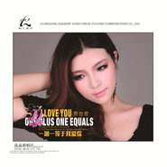

一加一等于我爱你
============================

|  |  |
| :--: | :-- |
| [ 一加一等于我爱你](https://emumo.xiami.com/album/499699) | **艺人**: [贺世哲](../index.md) **语种**: 国语 **唱片公司**: 波拉文化 **发行时间**: 2012年03月07日 **专辑类别**: EP, 单曲 **专辑风格**:  **播放数**: 121194 **收藏数**: 64 **评论数**: 2  |

## 简介

1+1=？最新答案：1+1=我爱你，2012开春力作，单曲主打，故事里有感慨有甜蜜。一路走来陪到最后真的不容易，然而两颗心只要全心全意在一起，完美结局就是你我大声向全世界宣布：爱的就是你

## 曲目

## 评论

|  |  |  |
| :-- | :-- | :-- |
|  [虾米用户](https://emumo.xiami.com/u/269269729)  2017-01-30 16:06 赞(0) 踩(0) | 
好听
 |
|  [虾米用户](https://emumo.xiami.com/u/4876323) 文章 2013-12-18 00:55 赞(0) 踩(0) | 
ok
 |
