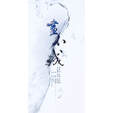

林斜阳
============================

|  |  |
| :--: | :-- |
| [ 林斜阳](https://i.xiami.com/xieyangtianxia) | **播放数**: 6635199 **粉丝数**: 857 **评论数**: 37 **地区**: China 中国大陆 **风格**: 国语流行 Mandarin Pop, 中国风 China-Wave  |

## 档案

古风歌手。代表作墨宝《奇妙娘》、《素衣》、《炎夏令》、《好梦如旧》等。

## 专辑

| 名称 | 语种 | 唱片公司 | 发行时间 | 专辑类别 | 专辑风格 |
| :--: | :-- | :-- | :-- | :-- | :-- |
| [ 画不成](./albums/2100379477.md) | 国语 | 独立发行 | 2016年04月26日 | EP, 单曲 | 中国风 China-Wave |
| [ 把日子过成诗](./albums/2100236570.md) | 国语 | 独立发行 | 2015年11月11日 | EP, 单曲 | 国语流行 Mandarin Pop |
| [ 风花雪月](./albums/1134524134.md) | 国语 | 独立发行 | 2013年08月25日 | 精选集 | 中国风 China-Wave |
| [ 奇妙娘](./albums/1999122789.md) | 国语 | 墨明棋妙 | 2010年08月07日 | EP, 单曲 | 国语流行 Mandarin Pop |
| [ 想对你说](./albums/899123480.md) | 国语 | 独立发行 | 2009年07月06日 | EP, 单曲 | 国语流行 Mandarin Pop |

## 评论

|  |  |  |  |
| :-- | :-- | :-- | :-- |
|  [虾米用户](https://emumo.xiami.com/u/431925728) 再见了各位，希望在虾米下... 2020-08-08 20:26 赞(0) 踩(0) | 
你的风花雪月争取原作者同意了没，擅自用夏恋改编
 |
|  [虾米用户](https://emumo.xiami.com/u/362130206)  2020-05-01 13:32 赞(1) 踩(0) | 
就是喜欢喝这个牌子的啤酒
 |
|  [虾米用户](https://emumo.xiami.com/u/325374787)  2020-01-11 15:15 赞(0) 踩(0) | 
，
 |
|  [虾米用户](https://emumo.xiami.com/u/428235557)  2019-09-15 19:03 赞(0) 踩(0) | 
，
 |
|  [虾米用户](https://emumo.xiami.com/u/305992935)  2018-09-23 15:55 赞(1) 踩(0) | 
太好听了
 |
|  [虾米用户](https://emumo.xiami.com/u/168918934)  2018-08-29 15:31 赞(3) 踩(0) | 
是你的风花雪月吸引了我。我很喜欢   
 |
|  [虾米用户](https://emumo.xiami.com/u/41862659) 长得丑就是病，不然整形医... 2018-08-10 09:00 赞(0) 踩(0) | 
你们用夏恋的音乐买版权了么 
 |
|  [虾米用户](https://emumo.xiami.com/u/377432883) 死亡如风，常伴吾身 2018-08-07 18:54 赞(1) 踩(0) | 
太好听了，怎么听都听不够。
 |
|  [虾米用户](https://emumo.xiami.com/u/339797897) 我爱纳兰容若. 2018-03-19 21:32 赞(2) 踩(0) | 
可攻  可爱  可柔  可刚
 |
|  [虾米用户](https://emumo.xiami.com/u/339797897) 我爱纳兰容若. 2018-03-19 21:31 赞(1) 踩(0) | 
 
 |
|  [虾米用户](https://emumo.xiami.com/u/222980040)  2018-02-16 05:41 赞(2) 踩(0) | 
这种声音就是我喜欢的
 |
|  [虾米用户](https://emumo.xiami.com/u/348971582)  2018-02-10 19:06 赞(1) 踩(0) | 
加油↖(^&amp;omega;^)↗
 |
|  [虾米用户](https://emumo.xiami.com/u/349149802) 世间里再美的东西，不过消... 2018-02-10 02:04 赞(0) 踩(0) | 
加油~
 |
|  [虾米用户](https://emumo.xiami.com/u/348971582)  2018-02-09 15:40 赞(3) 踩(0) | 
给你打101分，多一分不怕你骄傲！！
 |
|  [虾米用户](https://emumo.xiami.com/u/346773124) 沉默也是一种美 2018-01-31 16:53 赞(2) 踩(0) | 
给你打个99分，还有一分怕你骄傲
 |
|  [虾米用户](https://emumo.xiami.com/u/345182921) 人面不知何处去？桃花依旧... 2018-01-19 02:05 赞(1) 踩(0) | 
终于找到了！真经典，太好听了。。收藏必须的。。。赞。。。百听不厌。。。。
 |
|  [虾米用户](https://emumo.xiami.com/u/305161727) 你就欺负我，因为我爱你把... 2018-01-13 12:30 赞(13) 踩(0) | 
就是风花雪月吸引了我，节奏还可以
 |
| ⇒ |  [虾米用户](https://emumo.xiami.com/u/313306010)  2018-01-14 19:04 赞(0) 踩(0) | 
对
 |
| ⇒ |  [虾米用户](https://emumo.xiami.com/u/305161727) 你就欺负我，因为我爱你把... 2018-01-18 21:58 赞(0) 踩(0) | 
<q><b>边伯贤说：</b></q>
 |
|  [虾米用户](https://emumo.xiami.com/u/112684410) 边走边梦 2017-12-16 01:33 赞(9) 踩(0) | 
你们用人家夏恋的曲子买版权了吗
 |
|  [虾米用户](https://emumo.xiami.com/u/328002022)  2017-11-07 22:42 赞(2) 踩(0) | 
因风花雪月而来，女神~
 |
|  [虾米用户](https://emumo.xiami.com/u/298948030) 中國詩音樂電影创始人作曲... 2017-10-17 22:10 赞(0) 踩(0) | 
你好
 |
|  [虾米用户](https://emumo.xiami.com/u/285342803) 从今天开始爱上音乐 2017-09-26 04:08 赞(2) 踩(0) | 
厉害了女王要和天下谈个恋爱
 |
|  [虾米用户](https://emumo.xiami.com/u/285342803) 从今天开始爱上音乐 2017-09-26 04:08 赞(1) 踩(0) | 
女王演的不错
 |
|  [虾米用户](https://emumo.xiami.com/u/285342803) 从今天开始爱上音乐 2017-09-26 04:08 赞(1) 踩(0) | 
《风花雪月》里的那一个声音是林斜阳呀？
 |
|  [虾米用户](https://emumo.xiami.com/u/247974267)   2017-09-16 11:52 赞(0) 踩(0) | 
很妇听，加油
 |
|  [虾米用户](https://emumo.xiami.com/u/274578188)   2017-07-28 08:03 赞(1) 踩(0) | 
加油 
 |
|  [虾米用户](https://emumo.xiami.com/u/305411613) 音乐是灵魂的符号！ 2017-06-22 18:36 赞(3) 踩(0) | 
雪月风花.赞
 |
|  [虾米用户](https://emumo.xiami.com/u/251600111)  2017-05-29 17:23 赞(4) 踩(0) | 
风花雪月真心不错，喜欢那句，想和天下谈个恋爱！！
 |
|  [虾米用户](https://emumo.xiami.com/u/54014656) 与我。 2017-05-16 23:01 赞(3) 踩(0) | 
想和天下谈恋爱 
 |
|  [虾米用户](https://emumo.xiami.com/u/90605388)   2017-03-09 22:56 赞(1) 踩(0) | 
先收藏下喽
 |
|  [虾米用户](https://emumo.xiami.com/u/24334094)   2015-12-18 23:06 赞(1) 踩(0) | 
想听风花雪月
 |
|  [虾米用户](https://emumo.xiami.com/u/49788027)  2015-05-03 14:29 赞(1) 踩(0) | 
是啊，春意远呢
 |
|  [虾米用户](https://emumo.xiami.com/u/7931601)  2014-09-16 14:31 赞(1) 踩(0) | 
怎么没有《春意远》QAQ
 |
|  [虾米用户](https://emumo.xiami.com/u/4411714)  2014-05-03 20:49 赞(48) 踩(0) | 
我刚入驻了虾米音乐人，欢迎大家来我的个人主页，收听我的最新音乐
 |
| ⇒ |  [虾米用户](https://emumo.xiami.com/u/22875224)  2016-12-03 13:36 赞(0) 踩(0) | 
真好听，已经一个月了，还没够
 |
| ⇒ |  [虾米用户](https://emumo.xiami.com/u/363501747)  2018-09-20 19:33 赞(0) 踩(0) | 
音色很美
 |
