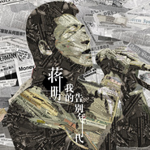
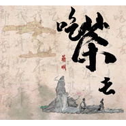
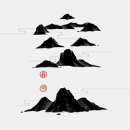
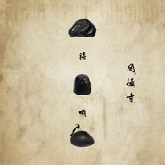
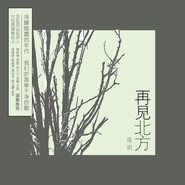

蒋明
============================

|  |  |
| :--: | :-- |
| [ 蒋明](https://i.xiami.com/jiangming) | **播放数**: 15226853 **粉丝数**: 6777 **评论数**: 193 **地区**: China 中国大陆 **风格**: 城市民谣 Urban Folk, 独立民谣 Indie Folk  |

## 档案

蒋明简介 
诗性本质∣文人风骨∣ 批判精神 
蒋明说，他的音乐只不过是把写出来的文字谱成了歌。 
的确，如果将他的歌词从旋律剥离，也依然是优秀的诗作。因而，他的听众为他专门命名了一个派别：文学民谣，意指蒋明的歌具有浓厚的文学韵味与人文情怀。 
台湾殿堂级音乐人侯德建先生认为，“蒋明的歌与两千多年来中国诗人的心灵隧道直接通连”。台湾民歌教母陶晓清女士评价，“蒋明的歌声非常有说服力。我喜欢每首歌都有各自不同的风格，却不是一个大杂烩，编曲走的是俭约主义，吉他配上不同的器乐，丰富了音乐性。我要谢谢这样一位用心创作与唱歌的人，带来最初听歌单纯的愉悦感。” 
蒋明的音乐旅程颇为曲折。九零年代也曾成为签约歌手，后由于技术原因使已经灌录完成的唱片意外流产。而后进入媒体工作，位居内地知名刊物副主编。微近中年之时，却决然转向，出版唱片、做乐队、办巡演，乃至于辞去了媒体职位，专心致志于音乐创作。 
自2011年以来，蒋明均保持着稳定的创作状态，至今已出版《再见北方》、《罔极寺》、《空山》、《故纸堆》等4张专辑，新专辑《磨石集》也即将于2019年发行。他歌唱故乡、吟咏离愁、述说人们心中对现实的思索，以诗意人文的表达，连续获得内地多项嘉奖。 
创作时间轴 
2011年，专辑《再见北方》。 
华语金曲奖2011年度最佳民谣艺人、十大华语专辑两项大奖，并提名最佳国语新人、最佳作词人； 
金榕树音乐作品奖2011年度最佳新人，并提名年度最佳唱片、最佳民谣唱片、最佳词作； 
南方音乐颁奖礼2011年度最佳民谣专辑； 
第十二届华语音乐传媒大奖最佳国语男新人、最佳民谣艺人、最佳封套三项提名。 
2011年底，由蒋明担任主唱的空山乐队成立。 
由蒋明领衔的空山乐队，在主唱、吉他、贝斯、架子鼓的传统乐队编制基础上加入笛、箫等吹奏乐器，形成独特的古风民谣摇滚。 
成立7年来巡演超过三百场，足迹遍布迷笛、草莓、东海、民谣在路上、沙坡头、美丽南方等著名的音乐节舞台。 
2013年，专辑《罔极寺》。 
第十二届华语音乐传媒大奖百家传媒年度超越大奖，并提名最佳民谣艺人； 
首届华语民谣奖最佳民谣歌手大奖，并获多项提名； 
华语金曲奖2013年十佳华语专辑； 
广州新音乐十大金曲排行榜2014第一季度十大金曲； 
专辑单曲《啊朋友再见》在网易云音评论量近3万条。 
2015年，专辑《空山》。 
华语金曲奖2015年度最佳作词人、年度十大专辑； 
第17届华语音乐传媒大奖评审团大奖，并提名最佳作词人； 
第5届阿比鹿音乐奖年度民谣音乐人入围。 
2017年，专辑《故纸堆1》。 
2019年，专辑《磨石集》。 
About Jiang Ming 
Jiang Ming – Chinese singer-song writer, musician. 
There was no such a music genre called “Literary Folk” before Jiang Ming, as his music incarnates a dense literary charm as well as humanistic sensibility. 
Legendary Taiwanese musician Hou Dejian gives his enthusiastic review of Jiang’s music that “resonates with the beautiful souls of Chinese poets in the history of over two thousand years.” 
Jiang Ming began his bumpy musical career at a very young age. His first album did not come into the world due to technical issues when he sang as a signed singer. He later turned to a prestigious media outlet and managed to acquire a senior position in the course of several decades, but he never deviated from the trajectory of being a musician. Jiang quit his day job at his 40s and dedicated himself to becoming a full-time musician, forming his own band, recording, and touring around. 
Jiang remained very active and productive since 2011, and has released four albums including Farewell My Land, Wang Ji, Kong Shan, and Old Books. His fifth album Stone Tablets Tell is scheduled to launch in 2019. 
His music embodies humanistic emotions and feelings such as love for homeland and sadness for separation. It conveys vicarious thoughts of countrymen in a poetic way, which recall a sense of nostalgia and pondering for life. These unique features of expression won him several awards domestically.

## 专辑

| 名称 | 语种 | 唱片公司 | 发行时间 | 专辑类别 | 专辑风格 |
| :--: | :-- | :-- | :-- | :-- | :-- |
| [ 故纸堆](./albums/2102800350.md) | 国语 | 科学文化 | 2017年07月20日 | 录音室专辑 | 独立民谣 Indie Folk |
| [ 你好陌生人](./albums/2102734991.md) | 国语 | 独立发行 | 2017年04月20日 | EP, 单曲 | 当代民谣 Contemporary Folk |
| [ 我的告别年代](./albums/2102673758.md) | 国语 | 独立发行 | 2016年12月28日 | EP, 单曲 |  |
| [ 吃茶去](./albums/2102660366.md) | 国语 | 独立发行 | 2016年12月07日 | EP, 单曲 |  |
| [ 空山](./albums/2102673761.md) | 国语 | 独立发行 | 2015年12月07日 | 录音室专辑 |  |
| [ 从前慢](./albums/336843621.md) | 国语 | 独立发行 | 2015年07月14日 | EP, 单曲 | 城市民谣 Urban Folk, 独立民谣 Indie Folk |
| [ 罔极寺](./albums/1185049819.md) | 国语 | 大象音乐工作室 | 2013年12月28日 | 录音室专辑 | 当代民谣 Contemporary Folk, 独立民谣 Indie Folk |
| [ 再见北方](./albums/445800.md) | 国语 | 海石音乐 | 2011年06月12日 | 录音室专辑 |  |

## 评论

|  |  |  |  |
| :-- | :-- | :-- | :-- |
|  [虾米用户](https://emumo.xiami.com/u/276944698) 不要自我设限..... 2020-03-25 15:52 赞(1) 踩(0) | 
☦️☦️☦️
 |
|  [虾米用户](https://emumo.xiami.com/u/61212924) 有时，生活就像一颗嗑碎的... 2019-04-18 08:05 赞(0) 踩(0) | 
一个路标指向过去看到它就心安
 |
|  [虾米用户](https://emumo.xiami.com/u/20177386) 感谢一切美好的遇见❤️ 2019-01-11 17:47 赞(0) 踩(0) | 
(´∀｀)♡
 |
|  [虾米用户](https://emumo.xiami.com/u/36691185) 天王盖地虎朋克操金属 2018-02-21 18:07 赞(0) 踩(0) | 
第二张图一定是在秀优越
 |
|  [虾米用户](https://emumo.xiami.com/u/323096353) 一首歌一个故事 2017-12-17 20:48 赞(0) 踩(0) | 
不错的
 |
|  [虾米用户](https://emumo.xiami.com/u/911960) 浮生若梦，一晌贪欢... 2017-11-02 17:01 赞(0) 踩(0) | 
音乐曲调非常干净。。。
 |
|  [虾米用户](https://emumo.xiami.com/u/34269060)  2017-10-27 23:30 赞(0) 踩(0) | 
这首歌最近播放的频率最高，越听越喜欢
 |
|  [虾米用户](https://emumo.xiami.com/u/324303529)  2017-09-10 10:41 赞(0) 踩(0) | 
哈哈
 |
|  [虾米用户](https://emumo.xiami.com/u/324303529)  2017-09-10 10:41 赞(0) 踩(0) | 
哈哈
 |
|  [虾米用户](https://emumo.xiami.com/u/289988140)   2017-07-31 22:27 赞(0) 踩(0) | 
喜欢词，喜欢声音
 |
|  [虾米用户](https://emumo.xiami.com/u/26496802) 陌向暖 2017-07-22 11:54 赞(0) 踩(0) | 
纯粹
 |
|  [虾米用户](https://emumo.xiami.com/u/301214305)  2017-07-06 09:54 赞(1) 踩(0) | 
刚听无法自拔
 |
|  [虾米用户](https://emumo.xiami.com/u/43893459)  2017-06-29 14:43 赞(1) 踩(0) | 
听蒋明好几年，没去过一场live没看过一场演出，以后一定要去看一场。歌手的嗓子和粉丝的热情都有期限，在我还爱着你们的时候，一定要去看一场。
 |
| ⇒ |  [虾米用户](https://emumo.xiami.com/u/50622214) 我喜欢的歌手们，都各有一... 2017-07-15 17:11 赞(0) 踩(0) | 
看你这么说，那下周我就去吧
 |
|  [虾米用户](https://emumo.xiami.com/u/35822739) 猫控 2017-06-13 13:13 赞(1) 踩(0) | 
西安人，哈哈，分外亲切
 |
|  [虾米用户](https://emumo.xiami.com/u/35509231) 提灯天后  策马小僧 2017-06-09 15:28 赞(3) 踩(0) | 
我的老天爷。。。听着少年呓语般的声音，想着肉铺子老板一样的脸，也是很温馨呢。别怕，老板，这样的你，也是温柔的你。
 |
| ⇒ |  [虾米用户](https://emumo.xiami.com/u/12694693) 我看见万物有灵且美 我听... 2017-09-02 09:54 赞(0) 踩(0) | 
点评亮了
 |
|  [虾米用户](https://emumo.xiami.com/u/287443841) 我还没想好要写什么... 2017-04-20 18:22 赞(0) 踩(0) | 
.......
 |
|  [虾米用户](https://emumo.xiami.com/u/287804935)  2017-04-10 22:17 赞(0) 踩(0) | 
好好好！
 |
|  [虾米用户](https://emumo.xiami.com/u/284209983)  2017-03-29 08:58 赞(0) 踩(0) | 
今年巡演开始了哦
 |
|  [虾米用户](https://emumo.xiami.com/u/281802697) 只爱你！X P 2017-03-20 13:18 赞(0) 踩(0) | 
民谣，我永远爱你
 |
|  [虾米用户](https://emumo.xiami.com/u/281802697) 只爱你！X P 2017-03-20 13:18 赞(0) 踩(0) | 
好好听
 |
|  [虾米用户](https://emumo.xiami.com/u/272758982)  2017-02-11 21:35 赞(0) 踩(0) | 
民谣，灭不掉的情怀
 |
|  [虾米用户](https://emumo.xiami.com/u/7764352) MetalHead 2017-01-15 11:55 赞(0) 踩(0) | 
人与声音对不上号！
 |
| ⇒ |  [虾米用户](https://emumo.xiami.com/u/33576099)  2017-01-19 16:05 赞(0) 踩(0) | 
确实有此感受。
 |
|  [虾米用户](https://emumo.xiami.com/u/9717362)  2016-12-30 01:40 赞(0) 踩(0) | 
时间简史，太有趣了，把恐惧留给1966，把幸福留给中央一台 
 |
|  [虾米用户](https://emumo.xiami.com/u/8202675)  2016-12-08 10:40 赞(0) 踩(0) | 
【吃茶去】 在没看歌名儿的时候还以为唱得的是【 叱咤去呀 叱咤去~】 很轻快的一首歌 能做传统味儿的歌真棒。 赞
 |
|  [虾米用户](https://emumo.xiami.com/u/45378324) 去挥霍和珍惜是同一件事情... 2016-12-08 07:41 赞(2) 踩(0) | 
总感觉只有真真正正不掺水分的读书人才能听出这些歌的好 像我这种知识水平基本停留在九年义务教育的水平也就听个热闹都说不出怎么个好法 可能这就是他没那么红的原因吧
 |
|  [虾米用户](https://emumo.xiami.com/u/34403862)  2016-12-07 14:54 赞(0) 踩(0) | 
喜欢
 |
|  [虾米用户](https://emumo.xiami.com/u/279826) 有音乐，一个人，整个世界 2016-12-07 13:29 赞(0) 踩(0) | 
7月16日 昆明 M60创意园——唉，错过了等下次了
 |
|  [虾米用户](https://emumo.xiami.com/u/84575724)  2016-11-18 12:08 赞(0) 踩(0) | 
这么才能买到《空山》专辑？
 |
| ⇒ |  [虾米用户](https://emumo.xiami.com/u/11353)  2016-12-26 00:49 赞(0) 踩(0) | 
淘宝上有。比如福声唱片。
 |
|  [虾米用户](https://emumo.xiami.com/u/17804115) 精神洁癖 2016-10-23 12:35 赞(0) 踩(0) | 
爱你的声音
 |
|  [虾米用户](https://emumo.xiami.com/u/222927346)  2016-09-28 15:02 赞(0) 踩(0) | 
漫长无尽的旅行
 |
|  [虾米用户](https://emumo.xiami.com/u/38463838)  2016-08-22 13:39 赞(0) 踩(0) | 
啊啊 错过了今年的巡演 明年夏天一定去❗️
 |
|  [虾米用户](https://emumo.xiami.com/u/5584426) 我从火星来 2016-07-16 02:33 赞(0) 踩(0) | 
2016年夏天某个星期三晚上，在学而优书店参加《民谣与诗》分享会。
 |
|  [虾米用户](https://emumo.xiami.com/u/36618569)  2016-07-12 01:26 赞(0) 踩(0) | 
为什么不来南京   
 |
|  [虾米用户](https://emumo.xiami.com/u/119293654)  2016-06-26 13:13 赞(0) 踩(0) | 

 |
|  [虾米用户](https://emumo.xiami.com/u/146608)  2016-06-17 10:34 赞(2) 踩(0) | 
我们的2016年夏季巡演已经上线，这个夏天我们会去13座城市。希望能够见到你！详细的安排点开公告栏就可以看到。
 |
| ⇒ |  [虾米用户](https://emumo.xiami.com/u/38463838)  2016-08-22 13:38 赞(0) 踩(0) | 

 |
|  [虾米用户](https://emumo.xiami.com/u/122688364) 生在愤坑，长在赤圈；挣脱 2016-05-16 14:54 赞(1) 踩(0) | 
692
 |
|  [虾米用户](https://emumo.xiami.com/u/45621221) 卸载状态。 2016-05-09 18:59 赞(1) 踩(0) | 
你们都给我走开！
 |
|  [虾米用户](https://emumo.xiami.com/u/9340722)  2016-04-10 22:55 赞(0) 踩(0) | 
在泉州等你 (ˉ▽￣～) ~~
 |
|  [虾米用户](https://emumo.xiami.com/u/3449737) ww 2016-04-04 20:58 赞(0) 踩(0) | 
在厦门等你们( •̀ ω •́ )y
 |
|  [虾米用户](https://emumo.xiami.com/u/126526702)  2016-03-24 13:39 赞(0) 踩(0) | 
快来绍兴
 |
|  [虾米用户](https://emumo.xiami.com/u/4160021)  2016-02-02 17:49 赞(0) 踩(0) | 
碎片一样的闷骚
 |
|  [虾米用户](https://emumo.xiami.com/u/6722115) Saw Gash 2016-01-26 15:10 赞(1) 踩(0) | 
新大陆！
 |
|  [虾米用户](https://emumo.xiami.com/u/9844479) 岁月让梦消失也算长大 2016-01-19 16:13 赞(0) 踩(0) | 
空山还不上架吗
 |
| ⇒ |  [虾米用户](https://emumo.xiami.com/u/146608)  2016-06-17 10:41 赞(0) 踩(0) | 
《空山》的版权稍有点复杂，并不是故意不在虾米上。谢谢谅解：）
 |
|  [虾米用户](https://emumo.xiami.com/u/34226296)  2016-01-10 12:01 赞(14) 踩(0) | 
寂寞的词 热闹的曲 和欲求不满的声音
 |
|  [虾米用户](https://emumo.xiami.com/u/48274031) 慎獨 2016-01-01 23:30 赞(0) 踩(0) | 
-
 |
|  [虾米用户](https://emumo.xiami.com/u/3960607) 星光下的音符 2015-12-30 21:59 赞(0) 踩(0) | 
长安长安
 |
|  [虾米用户](https://emumo.xiami.com/u/632797) 我还没想好要写什么... 2015-12-29 16:51 赞(0) 踩(0) | 
时光倒流
 |
|  [虾米用户](https://emumo.xiami.com/u/467667) 爱音乐的孩子都是好孩子 2015-12-27 09:26 赞(0) 踩(0) | 
虾米早两天给我推荐就好了，刚迷上就错过演出 
 |
|  [虾米用户](https://emumo.xiami.com/u/30493) 偏爱重型音乐 2015-12-25 23:06 赞(0) 踩(0) | 
今晚看了你们的直播现场，哥很不错哦。赞一个
 |
|  [虾米用户](https://emumo.xiami.com/u/15802162) Peace & Love 2015-12-25 18:15 赞(0) 踩(0) | 
今晚，武汉光谷VOX见
 |
|  [虾米用户](https://emumo.xiami.com/u/41162892) 听听回忆的声音 2015-12-16 22:57 赞(0) 踩(0) | 
 
 |
|  [虾米用户](https://emumo.xiami.com/u/9844479) 岁月让梦消失也算长大 2015-12-14 15:52 赞(0) 踩(0) | 
空山还不上呢
 |
|  [虾米用户](https://emumo.xiami.com/u/26455580) 不知道说什么 2015-12-07 21:33 赞(0) 踩(0) | 
长安。快上歌啊
 |
|  [虾米用户](https://emumo.xiami.com/u/15802162) Peace & Love 2015-12-05 19:34 赞(0) 踩(0) | 
小明同学～
 |
|  [虾米用户](https://emumo.xiami.com/u/7206504) 一天两包中南海 2015-11-29 02:41 赞(0) 踩(0) | 
每年都有来东莞演出  但是每次都不敢留下来过夜  --蒋明 南方草莓文摘
 |
|  [虾米用户](https://emumo.xiami.com/u/38985262)  2015-10-29 10:47 赞(0) 踩(0) | 
声音好棒啊～曲子也好听
 |
|  [虾米用户](https://emumo.xiami.com/u/50316996) 但盼风雨来，留你在此。 2015-10-18 19:06 赞(0) 踩(0) | 
蚂蚁蚂蚁为什么不回家，因为它想有个家。
 |
|  [虾米用户](https://emumo.xiami.com/u/26024634)  2015-10-05 11:18 赞(0) 踩(0) | 
just like it
 |
|  [虾米用户](https://emumo.xiami.com/u/39235894) 响者，为乐。 2015-10-04 12:48 赞(0) 踩(0) | 
喜欢
 |
|  [虾米用户](https://emumo.xiami.com/u/42916893) 我在时间尽头等你 2015-09-23 14:14 赞(0) 踩(0) | 
歌词好美
 |
|  [虾米用户](https://emumo.xiami.com/u/44015836)  2015-09-13 14:44 赞(0) 踩(0) | 
马頔都火了   蒋明还是这样……
 |
|  [虾米用户](https://emumo.xiami.com/u/46810178)   2015-09-01 16:44 赞(0) 踩(0) | 
因为我们有个共同朋友
 |
|  [虾米用户](https://emumo.xiami.com/u/47711130) 让她降落。 2015-08-10 23:38 赞(0) 踩(0) | 
错过演出了
 |
|  [虾米用户](https://emumo.xiami.com/u/47711130) 让她降落。 2015-08-10 23:38 赞(0) 踩(0) | 
错过演出了
 |
|  [虾米用户](https://emumo.xiami.com/u/7838305) 桃李春风一杯酒 2015-08-01 14:34 赞(1) 踩(0) | 
到山东这么多市演出，为什么不来济南，怨念
 |
|  [虾米用户](https://emumo.xiami.com/u/966653)  2015-08-01 00:30 赞(0) 踩(0) | 
今晚上蒋老师跟诸位兄弟在麻雀瓦舍的演出，太精彩！！！爱你们～～
 |
|  [虾米用户](https://emumo.xiami.com/u/50956271) 在漫长的守候里 忍耐就是... 2015-07-27 11:39 赞(0) 踩(0) | 
哥，我是小薇。   
 |
|  [虾米用户](https://emumo.xiami.com/u/3589490)  2015-07-12 11:36 赞(1) 踩(0) | 
不一样的民谣，多种乐器的引入，让曲子更丰富！
 |
|  [虾米用户](https://emumo.xiami.com/u/50956271) 在漫长的守候里 忍耐就是... 2015-06-19 01:40 赞(1) 踩(0) | 
大大，我还没睡 
 |
|  [虾米用户](https://emumo.xiami.com/u/320387) 赐我爱上你的力量 2015-06-17 10:37 赞(0) 踩(0) | 
没有广州，差评！
 |
|  [虾米用户](https://emumo.xiami.com/u/43184) 掐指一算你明年大凶，只有... 2015-05-09 12:35 赞(0) 踩(0) | 
声音，旋律感十足
 |
|  [虾米用户](https://emumo.xiami.com/u/437950) 身寸 2015-04-21 20:23 赞(0) 踩(0) | 
难听
 |
| ⇒ |  [虾米用户](https://emumo.xiami.com/u/10355777) CAO 2015-05-20 23:17 赞(0) 踩(0) | 
因为你耳朵被自己割了……
 |
|  [虾米用户](https://emumo.xiami.com/u/45560167)   2015-04-15 12:55 赞(0) 踩(0) | 
天啦噜！什么是时候回来重庆演出！
 |
| ⇒ |  [虾米用户](https://emumo.xiami.com/u/537863)   2015-07-23 19:03 赞(0) 踩(0) | 
明天晚上坚果。
 |
|  [虾米用户](https://emumo.xiami.com/u/40574199) 有机控 喜欢一切美的东西 2015-04-06 12:16 赞(0) 踩(0) | 
欢迎大家来我的个人主页，收听我的最新音乐
 |
|  [虾米用户](https://emumo.xiami.com/u/3566813) 菩萨，祝您身体健康！34... 2015-04-06 11:54 赞(0) 踩(0) | 
妈妈的不能不小心和这样好的歌手擦肩，那实在不该。
 |
|  [虾米用户](https://emumo.xiami.com/u/3566813) 菩萨，祝您身体健康！34... 2015-04-06 11:54 赞(0) 踩(0) | 
妈妈的不能不小心和这样好的歌手擦肩，那实在不该。
 |
|  [虾米用户](https://emumo.xiami.com/u/36615110) 暂无签名~ 2015-04-04 23:02 赞(0) 踩(0) | 
好想去听老师的现场
 |
|  [虾米用户](https://emumo.xiami.com/u/39417185)  2015-03-06 10:17 赞(0) 踩(0) | 
超喜欢朋友啊，再见。
 |
|  [虾米用户](https://emumo.xiami.com/u/44346562) 从此义无反顾一无所有 2015-02-06 22:33 赞(0) 踩(0) | 
赞
 |
|  [虾米用户](https://emumo.xiami.com/u/4327582) 寂而常照  照而常寂 2015-01-22 12:34 赞(0) 踩(0) | 
这是临安给我推荐的，有个性而不张扬，内敛而有内涵。谢谢临安~修行路上的知己，真的相识恨晚啊。。。
 |
|  [虾米用户](https://emumo.xiami.com/u/11968494) . 2015-01-07 09:47 赞(0) 踩(0) | 
·
 |
|  [虾米用户](https://emumo.xiami.com/u/279826) 有音乐，一个人，整个世界 2015-01-01 09:06 赞(0) 踩(0) | 
少年游、游子谣、沉香亭陪着我过了大半个2014年，谢谢！新年快乐！盼有一天能在昆明看演唱会
 |
|  [虾米用户](https://emumo.xiami.com/u/152884)  2014-12-25 16:09 赞(14) 踩(0) | 
蒋老师快来南京，快来南京，快来南京
 |
| ⇒ |  [虾米用户](https://emumo.xiami.com/u/16035019)  2015-07-07 16:15 赞(0) 踩(0) | 
2015年夏季巡演就有南京站啦，8月29日，在斑马。
 |
|  [虾米用户](https://emumo.xiami.com/u/1533433) 岁月如歌，时光如谜。涅槃... 2014-12-25 10:36 赞(0) 踩(0) | 
☆　　╱╲*╱╲　☆╱╳+▲╱　　╲　☆╱╱　◢◣+　　╳╲╱　+◢█◣　／　　╲☆☆　◢██◣ Merry___▂▂█▂Christmas~~
 |
|  [虾米用户](https://emumo.xiami.com/u/33312504) 宁桓宇看起来很好抱 2014-12-03 23:05 赞(0) 踩(0) | 
真棒！会来秦皇岛吗？到时候去听你唱歌。
 |
|  [虾米用户](https://emumo.xiami.com/u/2375136) 暂无签名~ 2014-11-06 12:24 赞(0) 踩(0) | 

 |
|  [虾米用户](https://emumo.xiami.com/u/279826) 有音乐，一个人，整个世界 2014-11-02 17:37 赞(0) 踩(0) | 
二张听了几百遍，不过瘾，快出新歌啊
 |
|  [虾米用户](https://emumo.xiami.com/u/42462876) 诗酒趁年华 2014-10-23 22:49 赞(0) 踩(0) | 
加油
 |
|  [虾米用户](https://emumo.xiami.com/u/41857005)  2014-09-30 00:12 赞(0) 踩(0) | 
真好
 |
|  [虾米用户](https://emumo.xiami.com/u/41296371) zqlian670505 2014-09-28 22:44 赞(0) 踩(0) | 
童音
 |
|  [虾米用户](https://emumo.xiami.com/u/7971186)  2014-09-09 11:38 赞(0) 踩(0) | 
新发现，有味
 |
|  [虾米用户](https://emumo.xiami.com/u/40762977)   2014-09-02 18:22 赞(0) 踩(0) | 
好歌
 |
|  [虾米用户](https://emumo.xiami.com/u/12359900)  2014-08-28 15:42 赞(0) 踩(0) | 
一听倾心，一听感动。词写的好，演绎的又纯净、温暖，直抵心灵深处。。。。。。唉，“少年离家去，光阴似水流”，，禁不住的伤感。。。。
 |
|  [虾米用户](https://emumo.xiami.com/u/1963119) 全然的倾听。 2014-08-27 11:06 赞(0) 踩(0) | 
中国民谣不可或少的旗帜~   力荐！
 |
|  [虾米用户](https://emumo.xiami.com/u/5398540) 民歌警察出警中 2014-08-05 17:43 赞(0) 踩(0) | 
不愧是古城
 |
|  [虾米用户](https://emumo.xiami.com/u/5598422) 浊酒新杯 2014-07-25 17:44 赞(0) 踩(0) | 
很温暖
 |
|  [虾米用户](https://emumo.xiami.com/u/2857420) 昨天晚上我梦见你 2014-07-22 15:14 赞(0) 踩(0) | 
封面图是白云山！再熟悉不过！哈哈哈哈！
 |
| ⇒ |  [虾米用户](https://emumo.xiami.com/u/1453136) hi, there 2014-10-18 23:11 赞(0) 踩(0) | 
怎么知道的？
 |
| ⇒ |  [虾米用户](https://emumo.xiami.com/u/1366353)  2014-11-19 21:34 赞(0) 踩(0) | 
么么哒
 |
| ⇒ |  [虾米用户](https://emumo.xiami.com/u/2857420) 昨天晚上我梦见你 2014-11-20 16:16 赞(0) 踩(0) | 
<q><b>哆啦萌梦说：</b></q>
 |
|  [虾米用户](https://emumo.xiami.com/u/32387391)  2014-07-21 11:49 赞(0) 踩(0) | 
8.30 杭州见
 |
|  [虾米用户](https://emumo.xiami.com/u/11285020) 音乐新天地 2014-07-20 15:28 赞(0) 踩(0) | 
民谣的现场很震撼
 |
|  [虾米用户](https://emumo.xiami.com/u/10484379) 一花一世界 2014-06-24 22:50 赞(0) 踩(0) | 
好声音、动人
 |
|  [虾米用户](https://emumo.xiami.com/u/9620316) live and... 2014-06-20 00:43 赞(0) 踩(0) | 
西安果然是个好地方，民谣都很不错诶.....
 |
|  [虾米用户](https://emumo.xiami.com/u/9620316) live and... 2014-06-20 00:41 赞(0) 踩(0) | 
有的曲子有崔健的味道，有些又是谢天笑的雷鬼调，那首春梦和gala的孤独的飞行员还有赵雷的画好像，游子谣是最喜欢的，干干净净的
 |
|  [虾米用户](https://emumo.xiami.com/u/37183736) Steven Shore... 2014-06-19 10:35 赞(0) 踩(0) | 
支持原创
 |
|  [虾米用户](https://emumo.xiami.com/u/146608)  2014-06-10 11:44 赞(0) 踩(0) | 
蒋明&amp;amp;空山乐队 诗与歌的旅行2014福建巡演安排在6月，19号厦门TD唱片演讲，20号福州锈场演出，21号厦门REAL LIVE演出，22号泉州动物世界音乐公社演出。如果你正好在福建，欢迎来听我唱歌！
 |
|  [虾米用户](https://emumo.xiami.com/u/37121426) 世界没有光你就是太阳。 2014-05-30 13:14 赞(0) 踩(0) | 
游子谣听哪个版？钢琴版？
 |
|  [虾米用户](https://emumo.xiami.com/u/33503241)  2014-05-15 17:00 赞(0) 踩(0) | 
听《苏州河》泪流满面
 |
| ⇒ |  [虾米用户](https://emumo.xiami.com/u/7251662)   2014-11-23 09:54 赞(0) 踩(0) | 
对
 |
| ⇒ |  [虾米用户](https://emumo.xiami.com/u/49624486)  2015-05-14 22:37 赞(0) 踩(0) | 
<q><b>猫仙人说：</b></q>
 |
| ⇒ |  [虾米用户](https://emumo.xiami.com/u/6545705) ooooo……在于不不不 2015-05-27 19:22 赞(0) 踩(0) | 
<q><b>alisonping说：</b></q>
 |
|  [虾米用户](https://emumo.xiami.com/u/6125599)  2014-05-06 23:12 赞(0) 踩(0) | 
纯粹
 |
|  [虾米用户](https://emumo.xiami.com/u/9108216)  2014-05-04 00:05 赞(0) 踩(0) | 
稀饭  good
 |
|  [虾米用户](https://emumo.xiami.com/u/6629582)  2014-04-23 09:36 赞(0) 踩(0) | 
循环听了告别薇拉....温暖自由的声音
 |
|  [虾米用户](https://emumo.xiami.com/u/3566813) 菩萨，祝您身体健康！34... 2014-04-21 06:48 赞(0) 踩(0) | 
再次听到他的歌，以这样的声音阐述，美的了不得。
 |
|  [虾米用户](https://emumo.xiami.com/u/8416395)   2014-03-24 16:47 赞(0) 踩(0) | 
好听~
 |
|  [虾米用户](https://emumo.xiami.com/u/13082150)  2014-03-14 08:08 赞(0) 踩(0) | 
好
 |
|  [虾米用户](https://emumo.xiami.com/u/1609946) 一即一切 2014-03-13 15:08 赞(0) 踩(0) | 
心 境不二
 |
|  [虾米用户](https://emumo.xiami.com/u/3570849)  2014-03-12 11:54 赞(0) 踩(0) | 
忆儿时，喜欢这首游子谣...
 |
|  [虾米用户](https://emumo.xiami.com/u/748637)  2014-03-05 12:07 赞(0) 踩(0) | 
声音暖暖的
 |
|  [虾米用户](https://emumo.xiami.com/u/837934)  2014-01-27 14:08 赞(0) 踩(0) | 
《游子谣》这首歌 人声一起就感觉到一种非常特别的质感 像是放在老屋阁楼里数十年 保存妥当的老旧书信 你坐在老屋里 手轻轻拂过这么一张张老纸 随便地让周围的冷风沁入心田
 |
|  [虾米用户](https://emumo.xiami.com/u/235416) 顺时慈悲 逆时静 2014-01-17 03:52 赞(0) 踩(0) | 
喜欢《沉香亭》，写的好，唱的好，配的也好：）
 |
|  [虾米用户](https://emumo.xiami.com/u/1577874) 我还没想好要写什么... 2014-01-16 21:36 赞(0) 踩(0) | 
啊嘞！真太喜欢了
 |
|  [虾米用户](https://emumo.xiami.com/u/3468738) 喀秋莎！ 2014-01-13 21:42 赞(0) 踩(0) | 
！！！
 |
|  [虾米用户](https://emumo.xiami.com/u/8337431) 以乐会友 2013-12-29 04:59 赞(0) 踩(0) | 
国产独立民谣102752,672,50
 |
|  [虾米用户](https://emumo.xiami.com/u/10206942)  2013-12-21 21:04 赞(0) 踩(0) | 
蒋老师，花儿与少年为什么没有呢？？
 |
| ⇒ |  [虾米用户](https://emumo.xiami.com/u/772655)   2014-04-10 15:49 赞(0) 踩(0) | 
点击《罔极寺》专辑里就有
 |
|  [虾米用户](https://emumo.xiami.com/u/9488454)   2013-12-17 18:59 赞(0) 踩(0) | 
你的嗓音真好听，我要醉了。
 |
| ⇒ |  [虾米用户](https://emumo.xiami.com/u/772655)   2014-04-10 15:50 赞(0) 踩(0) | 
谢谢
 |
|  [虾米用户](https://emumo.xiami.com/u/28338457)  2013-12-15 11:57 赞(0) 踩(0) | 
新欢他的声音 歌曲的内容
 |
|  [虾米用户](https://emumo.xiami.com/u/8760288)  2013-12-10 23:43 赞(0) 踩(0) | 
蒋老师声音和词和曲都大爱！已订罔极寺~
 |
|  [虾米用户](https://emumo.xiami.com/u/29216827) 想要有趣 2013-12-08 15:13 赞(0) 踩(0) | 
hahaha
 |
|  [虾米用户](https://emumo.xiami.com/u/15463579) 微信公众账号：的和了 2013-12-05 00:25 赞(1) 踩(0) | 
我靠，这个人唱得太好了。收了，不会是另一个好妹妹吧。空山乐队，我记住了。唱到我心里了，太好听了。。。
 |
|  [虾米用户](https://emumo.xiami.com/u/9815114)   2013-12-02 21:09 赞(0) 踩(0) | 
有味道
 |
|  [虾米用户](https://emumo.xiami.com/u/4771010) 消失的光年 2013-12-02 11:45 赞(0) 踩(0) | 
我噻 这声音！！~
 |
|  [虾米用户](https://emumo.xiami.com/u/1577426)  2013-12-01 19:53 赞(0) 踩(0) | 
ok
 |
|  [虾米用户](https://emumo.xiami.com/u/10631664) 无声 2013-11-26 11:12 赞(0) 踩(0) | 
这真是个好地方，又给了我惊喜。
 |
|  [虾米用户](https://emumo.xiami.com/u/10786093)  2013-11-24 08:50 赞(0) 踩(0) | 
听了[告别薇拉] 感觉音乐依旧清澈 精致 作者延续着那有着台湾都市味儿的民谣 文学化的歌词 亲切的吟唱 几许悠然自得的器乐 个人以为蒋兄和许巍有点相似处 就是从音乐中几乎听不出西北的地域味道 与张佺 李建傧等人走着不同的民谣路线
 |
|  [虾米用户](https://emumo.xiami.com/u/5431048)  2013-11-21 08:34 赞(0) 踩(0) | 
来自北方的问候
 |
|  [虾米用户](https://emumo.xiami.com/u/146608)  2013-11-20 16:31 赞(188) 踩(0) | 
我刚入驻了虾米音乐人，欢迎大家来我的个人主页，收听我的最新音乐
 |
| ⇒ |  [虾米用户](https://emumo.xiami.com/u/887109)  2014-04-01 11:22 赞(0) 踩(0) | 
词写的真不错，收藏
 |
| ⇒ |  [虾米用户](https://emumo.xiami.com/u/1142578)  2015-03-12 08:09 赞(0) 踩(0) | 
啊朋友再见，哇赛，超棒。支持你的音乐。
 |
| ⇒ |  [虾米用户](https://emumo.xiami.com/u/10382616) 暂无签名~ 2015-05-03 15:42 赞(0) 踩(0) | 
好的
 |
| ⇒ |  [虾米用户](https://emumo.xiami.com/u/34269060)  2015-07-28 00:20 赞(0) 踩(0) | 
<q><b>转身即天涯说：</b></q>
 |
| ⇒ |  [虾米用户](https://emumo.xiami.com/u/32067336) ◾️ 向无穷空间  做时... 2015-10-05 10:09 赞(0) 踩(0) | 
喜欢民谣，永远喜欢民谣
 |
| ⇒ |  [虾米用户](https://emumo.xiami.com/u/253648462) 伟大航路只是起点 我的未... 2016-12-26 22:50 赞(0) 踩(0) | 
喜欢你的声音
 |
| ⇒ |  [虾米用户](https://emumo.xiami.com/u/34267469)  2017-05-23 15:25 赞(0) 踩(0) | 
由童谣版《游子谣》进来的，喜欢《吃茶去》   
 |
| ⇒ |  [虾米用户](https://emumo.xiami.com/u/1476446)  2017-08-11 07:43 赞(0) 踩(0) | 
本月16号看你在徐州的演唱会，你好，蒋明。
 |
|  [虾米用户](https://emumo.xiami.com/u/9946063) 空谈误国。实干兴邦 2013-10-12 19:36 赞(0) 踩(0) | 
。
 |
|  [虾米用户](https://emumo.xiami.com/u/220719) 自知不自見，自愛不自貴 2013-06-14 14:22 赞(0) 踩(0) | 
蔣明 啊，邱大立 讓你傳 豐玄 的專輯呢~~可你一直不傳，我祇好傳了~~~：P
 |
|  [虾米用户](https://emumo.xiami.com/u/205735) 芒果的体型能变成黄瓜的么 2013-04-27 18:49 赞(0) 踩(0) | 
你会不会成为音乐人？？？哇哈哈
 |
|  [虾米用户](https://emumo.xiami.com/u/13675241)  2013-03-26 20:21 赞(0) 踩(0) | 
单调
 |
|  [虾米用户](https://emumo.xiami.com/u/3110981) :з」∠ 2013-03-12 16:23 赞(0) 踩(0) | 
0 0
 |
|  [虾米用户](https://emumo.xiami.com/u/5014760)  2012-12-10 23:55 赞(1) 踩(0) | 
有一种淡定安静的力量
 |
|  [虾米用户](https://emumo.xiami.com/u/9220808)  2012-12-04 17:37 赞(0) 踩(0) | 
前些天在微博里听到了 我们  决定买人生第一张CD《再见北方》
 |
|  [虾米用户](https://emumo.xiami.com/u/2032059) 我愿如竹随风而动弯而不折 2012-10-19 18:04 赞(0) 踩(0) | 
惊喜！绝对的惊喜！！沉静的声音浅吟轻唱着民谣 遥远的思绪潜藏的思念暗涌的力量都被唱了出来
 |
|  [虾米用户](https://emumo.xiami.com/u/1616484)   2012-10-18 11:20 赞(0) 踩(0) | 
终于入驻虾米了！！
 |
|  [虾米用户](https://emumo.xiami.com/u/793247)  2012-09-05 19:31 赞(0) 踩(0) | 
老乡支持你
 |
|  [虾米用户](https://emumo.xiami.com/u/9940585)  2012-08-01 09:31 赞(0) 踩(0) | 
white
 |
|  [虾米用户](https://emumo.xiami.com/u/1077970) 我还没想好要写什么... 2012-07-27 23:22 赞(0) 踩(0) | 
简介说得真好
 |
|  [虾米用户](https://emumo.xiami.com/u/672126) 四个字和四个字 2012-07-08 17:58 赞(0) 踩(0) | 
mark一记
 |
|  [虾米用户](https://emumo.xiami.com/u/3854033)  2012-05-17 15:19 赞(0) 踩(0) | 
干净的民谣
 |
|  [虾米用户](https://emumo.xiami.com/u/8179565)  2012-03-10 16:22 赞(0) 踩(0) | 
因为爱
 |
|  [虾米用户](https://emumo.xiami.com/u/2421957)  2012-03-03 19:42 赞(0) 踩(0) | 
很喜欢，很安静，很深沉。
 |
|  [虾米用户](https://emumo.xiami.com/u/3255139)  2012-02-28 22:29 赞(0) 踩(0) | 
感觉
 |
|  [虾米用户](https://emumo.xiami.com/u/394757) 超级监听耳机，天外之音。 2012-02-14 12:22 赞(0) 踩(0) | 
蒋明，在南方，再见北方。
 |
|  [虾米用户](https://emumo.xiami.com/u/353) 强迫症确诊 2012-01-30 13:21 赞(0) 踩(0) | 
声音真心不错
 |
|  [虾米用户](https://emumo.xiami.com/u/3937917) 一个卑微的理想主义者 2012-01-18 00:47 赞(0) 踩(0) | 
相当不错，不知道为什么他的粉这么少
 |
|  [虾米用户](https://emumo.xiami.com/u/3892583)  2011-12-26 13:37 赞(0) 踩(0) | 
清澈的声音，喜欢。
 |
|  [虾米用户](https://emumo.xiami.com/u/6463863) 上帝保佑没有吃饭的人们！ 2011-11-26 23:46 赞(0) 踩(0) | 
顶啊
 |
|  [虾米用户](https://emumo.xiami.com/u/3432935)  2011-10-11 16:08 赞(0) 踩(0) | 
清澈的声音
 |
|  [虾米用户](https://emumo.xiami.com/u/5470910)   2011-10-09 14:59 赞(0) 踩(0) | 
想不到蒋明还有这份才华，主要是，还可以有这样的活法。真的很清新，很喜欢。
 |
|  [虾米用户](https://emumo.xiami.com/u/1091908) 一切随缘 2011-09-30 14:55 赞(0) 踩(0) | 
朴实民歌
 |
|  [虾米用户](https://emumo.xiami.com/u/8691) 百无禁忌，心存敬畏 2011-09-28 20:44 赞(0) 踩(0) | 
某年某日的情歌很喜欢
 |
|  [虾米用户](https://emumo.xiami.com/u/5431048)  2011-08-15 14:58 赞(0) 踩(0) | 
喜欢跳舞女孩
 |
|  [虾米用户](https://emumo.xiami.com/u/4865773) 情之所起，一往而深。 2011-08-15 00:28 赞(0) 踩(0) | 
很有感学，特使是声线，喜欢原创
 |
|  [虾米用户](https://emumo.xiami.com/u/1589393) ？ 2011-07-05 11:24 赞(0) 踩(0) | 
蒋明
 |
|  [虾米用户](https://emumo.xiami.com/u/1490473) 一堆无用的热情？ 2011-07-02 09:57 赞(0) 踩(0) | 
不错啊
 |
|  [虾米用户](https://emumo.xiami.com/u/679445)  2011-06-29 19:13 赞(0) 踩(0) | 
上来溜一圈专辑就收起来了？
 |
|  [虾米用户](https://emumo.xiami.com/u/202184)  2011-06-19 15:25 赞(0) 踩(0) | 
带大家穿越各种时空
 |
|  [虾米用户](https://emumo.xiami.com/u/202184)  2011-06-19 15:16 赞(0) 踩(0) | 
再见北方
 |
|  [虾米用户](https://emumo.xiami.com/u/2374614) 我还没想好要写什么... 2011-06-11 13:25 赞(0) 踩(0) | 
哪位大虾传游子谣上来吧！！！！！！！！
 |
|  [虾米用户](https://emumo.xiami.com/u/993637)  2011-06-08 21:26 赞(0) 踩(0) | 
求游子谣
 |
