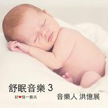

舒眠音乐310年后的返璞归真
============================

|  |  |
| :--: | :-- |
| [ 舒眠音乐310年后的返璞归真](https://emumo.xiami.com/album/2104383562) | **艺人**: [洪亿展](../index.md) **语种**: 其他 **唱片公司**:  **发行时间**: 2018年12月18日 **专辑类别**: 录音室专辑 **专辑风格**: 放松新世纪 Relaxation New Age, 轻音乐 Easy Listening **播放数**: 31657 **收藏数**: 24 **评论数**: 2  |

## 简介

十年前，在金融海啸的时代做了一张专辑：舒眠音乐。当初的起心动念，只是想舒缓大事件所带来紧绷的气氛。这十年来，陆陆续续创作的许多不同形态的音乐，回想这十年来的创作，非常的充实，创作了约600多首音乐，身为独立音乐人，很感谢网路世代的诞生，让我有机会把创作的音乐传播到世界各角落。作为10周年纪念，也是个人音乐生涯的纪念，所以再一次创作这题材的音乐，作为10周年的注脚，愿每一位听这张专辑的人，内心感到平静。

## 曲目

## 评论

|  |  |  |
| :-- | :-- | :-- |
|  [虾米用户](https://emumo.xiami.com/u/334258176)  2020-05-30 14:02 赞(0) 踩(0) | 
音乐非常棒，感恩❤️
 |
|  [虾米用户](https://emumo.xiami.com/u/4487129)  2019-02-28 09:01 赞(0) 踩(0) | 
！！！
 |
