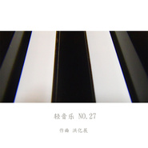

轻音乐 no.27摇摆国之歌
============================

|  |  |
| :--: | :-- |
| [ 轻音乐 no.27摇摆国之歌](https://emumo.xiami.com/album/821647136) | **艺人**: [洪亿展](../index.md) **语种**: 国语 **唱片公司**: 独立发行 **发行时间**: 2015年02月20日 **专辑类别**: 精选集 **专辑风格**:  **播放数**: 11093 **收藏数**: 10 **评论数**: 1  |

## 简介

这张专辑的音乐，是将台湾知名的歌曲加以改编。

## 曲目

## 评论

|  |  |  |
| :-- | :-- | :-- |
|  [虾米用户](https://emumo.xiami.com/u/4840903) Painlessienn 2015-11-14 12:45 赞(1) 踩(0) | 
挺好听啊
 |
