洪亿展
============================

|  |  |
| :--: | :-- |
| [ 洪亿展](https://i.xiami.com/hic) | **地区**: Taiwan, PRC 中国台湾 **风格**: 摇摆乐 Swing, 轻音乐 Easy Listening, 胎教音乐 Prenatal Music **播放数**: 4626380 **粉丝数**: 431 **评论数**: 66  |

## 档案

## 专辑

| 名称 | 语种 | 唱片公司 | 发行时间 | 专辑类别 | 专辑风格 |
| :--: | :-- | :-- | :-- | :-- | :-- |
| [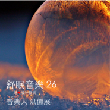 舒眠音乐26](./albums/5022512018.md) | 其他 | 看见音乐 (上海) | 2021年01月05日 | 录音室专辑 |  |
| [ 舒眠音乐9好心情一整天](./albums/2105802065.md) | 纯音乐 | 独立发行 | 2020年02月08日 | 精选集 | 轻音乐 Easy Listening, 胎教音乐 Prenatal Music, 器乐独奏 Solo Instrumental |
| [ 舒眠音乐11好心情一整天](./albums/2105807961.md) | 纯音乐 | 独立发行 | 2020年02月02日 | 精选集 | 轻音乐 Easy Listening, 胎教音乐 Prenatal Music |
| [ 舒眠音乐7好心情一整天](./albums/2105802020.md) | 纯音乐 | 独立发行 | 2020年02月01日 | 精选集 | 轻音乐 Easy Listening, 器乐独奏 Solo Instrumental, 胎教音乐 Prenatal Music |
| [ 舒眠音乐6好心情一整天](./albums/2105801656.md) | 纯音乐 | 独立发行 | 2020年02月01日 | 精选集 | 轻音乐 Easy Listening, 器乐独奏 Solo Instrumental, 胎教音乐 Prenatal Music |
| [ 舒眠音乐310年后的返璞归真](./albums/2104383562.md) | 其他 |  | 2018年12月18日 | 录音室专辑 | 放松新世纪 Relaxation New Age, 轻音乐 Easy Listening |
| [ 早餐音乐好心情一整天](./albums/2103947300.md) | 纯音乐 | 独立发行 | 2018年08月25日 | 精选集 | 放松新世纪 Relaxation New Age, 器乐独奏 Solo Instrumental, 轻音乐 Easy Listening |
| [ 小步舞曲的浪漫](./albums/2103499414.md) | 国语 | 独立发行 | 2018年01月24日 | 精选集 | 轻音乐 Easy Listening, 放松新世纪 Relaxation New Age, 古典音乐 Classical |
| [ 圣诞纯音乐](./albums/2102643070.md) | 国语 |  | 2016年11月01日 | 精选集 |  |
| [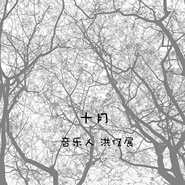 十月](./albums/2102403141.md) | 国语 |  | 2016年10月01日 | 纯音乐, 发烧音乐 |  |
| [ 日晒的绿波](./albums/2100384336.md) | 国语 | 独立发行 | 2016年09月01日 | 精选集 |  |
| [ 微风](./albums/2100372779.md) | 国语 | 独立发行 | 2016年08月01日 | 精选集 |  |
| [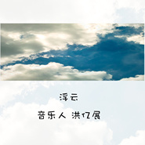 浮云](./albums/2100354784.md) | 国语 | 独立发行 | 2016年07月01日 | 精选集 | 轻音乐 Easy Listening |
| [ 感伤时刻](./albums/2100172490.md) | 国语 | 独立发行 | 2016年06月01日 | 精选集 | 轻音乐 Easy Listening |
| [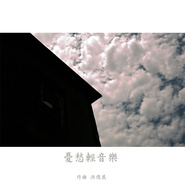 忧愁轻音乐](./albums/2100172759.md) | 国语 | 独立发行 | 2016年05月01日 | 精选集 | 轻音乐 Easy Listening |
| [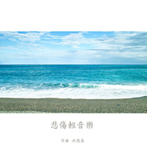 悲伤轻音乐](./albums/2100172451.md) | 国语 | 独立发行 | 2016年04月01日 | 精选集 | 轻音乐 Easy Listening |
| [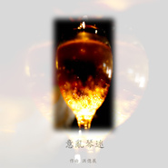 意乱琴迷](./albums/2100282474.md) | 国语 | 独立发行 | 2016年03月01日 | 精选集 | 轻音乐 Easy Listening, 新世纪音乐 New Age |
| [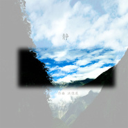 静安静的音乐](./albums/2100269594.md) | 国语 | 独立发行 | 2016年02月01日 | 精选集 | 放松新世纪 Relaxation New Age, 轻音乐 Easy Listening |
| [ 那卡西](./albums/1538096785.md) | 国语 | 独立发行 | 2016年01月01日 | 精选集 | 新民谣 Neofolk |
| [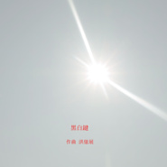 黑白键](./albums/1037989836.md) | 国语 | 独立发行 | 2015年12月01日 | 精选集 | 放松新世纪 Relaxation New Age, 轻音乐 Easy Listening |
| [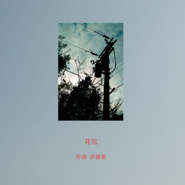 花儿](./albums/137989457.md) | 国语 | 独立发行 | 2015年11月01日 | 精选集 | 放松新世纪 Relaxation New Age, 轻音乐 Easy Listening |
| [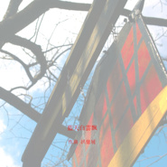 蓝天白云飘](./albums/438058050.md) | 国语 | 独立发行 | 2015年10月01日 | 精选集 | 放松新世纪 Relaxation New Age, 轻音乐 Easy Listening |
| [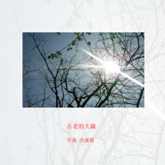 古老的大钟](./albums/138073991.md) | 国语 | 独立发行 | 2015年09月01日 | 精选集 | 放松新世纪 Relaxation New Age, 轻音乐 Easy Listening |
| [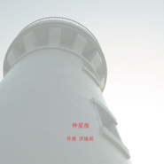 仲夏夜](./albums/1137997615.md) | 国语 | 独立发行 | 2015年08月01日 | 精选集 | 放松新世纪 Relaxation New Age, 轻音乐 Easy Listening |
| [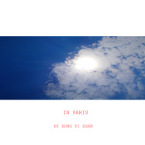 In Paris在巴黎的日子](./albums/537636505.md) | 国语 | 独立发行 | 2015年07月31日 | 精选集 | 摇摆乐 Swing, 轻音乐 Easy Listening |
| [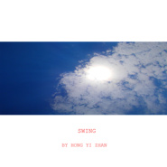 swing摇摆夜里](./albums/1937635372.md) | 国语 | 独立发行 | 2015年07月31日 | 精选集 | 摇摆乐 Swing, 轻音乐 Easy Listening, 新世纪音乐 New Age |
| [ Love me爱上我](./albums/937635311.md) | 国语 | 独立发行 | 2015年07月31日 | 精选集 | 放松新世纪 Relaxation New Age, 新世纪音乐 New Age |
| [ Love关于爱情](./albums/337635645.md) | 国语 | 独立发行 | 2015年07月31日 | 精选集 | 轻音乐 Easy Listening, 新世纪音乐 New Age |
| [ So sweet甜蜜时刻](./albums/1737636519.md) | 国语 | 独立发行 | 2015年07月31日 | 精选集 | 轻音乐 Easy Listening |
| [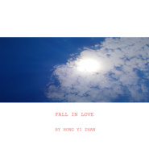 Fall in love坠入情网](./albums/137633055.md) | 国语 | 独立发行 | 2015年07月24日 | 精选集 | 放松新世纪 Relaxation New Age, 新世纪音乐 New Age |
| [ 放松轻音乐](./albums/1538004491.md) | 国语 | 独立发行 | 2015年07月01日 | 精选集 | 放松新世纪 Relaxation New Age, 轻音乐 Easy Listening |
| [ 轻音乐 NO.35弹琴说爱](./albums/1229686746.md) | 国语 | 独立发行 | 2015年04月24日 | 精选集 | 放松新世纪 Relaxation New Age, 新世纪音乐 New Age |
| [ 轻音乐 NO.34](./albums/928894557.md) | 国语 | 独立发行 | 2015年04月17日 | 精选集 | 放松新世纪 Relaxation New Age, 轻音乐 Easy Listening, 新世纪音乐 New Age |
| [ 轻音乐 NO.33舒眠音乐](./albums/428651059.md) | 国语 | 独立发行 | 2015年04月10日 | 精选集 | 放松新世纪 Relaxation New Age, 自然新世纪 Nature New Age |
| [ 轻音乐 no. 32寂寞的城市](./albums/321717035.md) | 国语 | 独立发行 | 2015年04月03日 | 精选集 | 游戏配乐 Video Game Music, 轻音乐 Easy Listening, 国语流行 Mandarin Pop |
| [ 轻音乐 no.31](./albums/1421722935.md) | 国语 | 独立发行 | 2015年03月27日 | 精选集 | 摇摆乐 Swing, 轻音乐 Easy Listening |
| [ 轻音乐 no.30咖啡馆](./albums/821720301.md) | 国语 | 独立发行 | 2015年03月20日 | 精选集 | 游戏配乐 Video Game Music, 轻音乐 Easy Listening, 国语流行 Mandarin Pop |
| [ 轻音乐 no.29抒情曲](./albums/321716124.md) | 国语 | 独立发行 | 2015年03月13日 | 精选集 | 游戏配乐 Video Game Music, 轻音乐 Easy Listening, 国语流行 Mandarin Pop |
| [ 轻音乐 no.28终曲](./albums/1921665443.md) | 国语 | 独立发行 | 2015年03月06日 | 精选集 | 轻音乐 Easy Listening, 新古典新世纪 Neoclassical New Age |
| [ 轻音乐 no.28纯琴声](./albums/621652780.md) | 国语 | 独立发行 | 2015年02月27日 | 精选集 | 放松新世纪 Relaxation New Age, 轻音乐 Easy Listening |
| [ 轻音乐 no.27摇摆国之歌](./albums/821647136.md) | 国语 | 独立发行 | 2015年02月20日 | 精选集 |  |
| [ 轻音乐 no.263拍子](./albums/821476645.md) | 国语 | 独立发行 | 2015年02月13日 | 精选集 | 轻音乐 Easy Listening, 新古典新世纪 Neoclassical New Age |
| [ 轻音乐 no.25夜曲](./albums/1421406184.md) | 国语 | 独立发行 | 2015年02月06日 | 精选集 | 轻音乐 Easy Listening, 新世纪音乐 New Age, 新古典新世纪 Neoclassical New Age |
| [ 轻音乐 no.24](./albums/1821398448.md) | 国语 | 独立发行 | 2015年01月30日 | 精选集 | 放松新世纪 Relaxation New Age, 轻音乐 Easy Listening |
| [ 轻音乐 no.23华尔兹](./albums/921390235.md) | 国语 | 独立发行 | 2015年01月23日 | 精选集 | 自然新世纪 Nature New Age, 轻音乐 Easy Listening |
| [ 轻音乐 no.21禅意](./albums/1021134700.md) | 国语 | 独立发行 | 2015年01月16日 | 精选集 | 实验音乐 Experimental, 轻音乐 Easy Listening, 中国风 China-Wave |
| [ 轻音乐 no.21jazz impromptu](./albums/1720514036.md) | 英语 | 独立发行 | 2015年01月09日 | 原声带, 影视音乐 | 摇摆乐 Swing, 轻音乐 Easy Listening, 新古典新世纪 Neoclassical New Age |
| [ 轻音乐 No.20爱很美](./albums/618108850.md) | 国语 | 独立发行 | 2014年12月26日 | 现场专辑 | 日本流行 J-Pop, 轻音乐 Easy Listening |
| [ 轻音乐 No.19jazz impromptu](./albums/1018106553.md) | 英语 | 独立发行 | 2014年12月19日 | 现场专辑 | 摇摆乐 Swing, 轻音乐 Easy Listening, 新古典新世纪 Neoclassical New Age |
| [ 轻音乐 no.18太爵士](./albums/1618022400.md) | 英语 | 独立发行 | 2014年12月05日 | 现场专辑 | 摇摆乐 Swing, 沙发音乐 Lounge, 轻音乐 Easy Listening |
| [ 輕音樂 NO.18Jazz impromptu](./albums/415781927.md) | 英语 | 独立发行 | 2014年12月05日 | 精选集 | 摇摆乐 Swing, 轻音乐 Easy Listening |
| [ 輕音樂 NO.17舒眠音乐](./albums/1315583088.md) | 国语 | 独立发行 | 2014年11月28日 | 精选集 | 放松新世纪 Relaxation New Age, 轻音乐 Easy Listening |
| [ 輕音樂 NO.16舒眠音乐](./albums/815441489.md) | 国语 | 独立发行 | 2014年11月21日 | 精选集 | 放松新世纪 Relaxation New Age, 轻音乐 Easy Listening |
| [ 輕音樂 NO.15](./albums/15439075.md) | 国语 | 独立发行 | 2014年11月14日 | 精选集 | 沙发音乐 Lounge, 轻音乐 Easy Listening |
| [ 輕音樂 NO.14夜曲](./albums/115172113.md) | 国语 | 独立发行 | 2014年11月07日 | 精选集 | 沙发音乐 Lounge, 器乐独奏 Solo Instrumental, 轻音乐 Easy Listening |
| [ 輕音樂 NO.13](./albums/714079269.md) | 国语 | 独立发行 | 2014年10月24日 | 精选集 | 放松新世纪 Relaxation New Age, 轻音乐 Easy Listening |
| [ 輕音樂 NO.12](./albums/1413535462.md) | 国语 | 独立发行 | 2014年10月17日 | 精选集 | 自由即兴 Free Improvisation, 轻音乐 Easy Listening |
| [ 輕音樂 NO.11](./albums/1212231386.md) | 国语 | 独立发行 | 2014年10月17日 | 精选集 | 放松新世纪 Relaxation New Age, 轻音乐 Easy Listening |
| [ 輕音樂 NO.10](./albums/612230172.md) | 国语 | 独立发行 | 2014年10月03日 | 原声带, 影视音乐 | 轻音乐 Easy Listening, 新世纪音乐 New Age |
| [ 輕音樂 NO.9](./albums/1712227980.md) | 国语 | 独立发行 | 2014年10月01日 | 原声带, 影视音乐 | 器乐独奏 Solo Instrumental, 轻音乐 Easy Listening |
| [ 轻音乐 NO.7台湾民谣](./albums/409715188.md) | 闽南语 | 独立发行 | 2014年09月03日 | 精选集 | 传统民谣 Traditional Folk, 轻音乐 Easy Listening |
| [ 轻音乐 NO.8](./albums/209724177.md) | 其他 | 独立发行 | 2014年09月03日 | 精选集 | 放松新世纪 Relaxation New Age, 轻音乐 Easy Listening |
| [ 輕音樂 NO.6愛的旅程](./albums/909710956.md) | 其他 | 独立发行 | 2014年09月03日 | 精选集 | 放松新世纪 Relaxation New Age, 轻音乐 Easy Listening |
| [ 轻音乐 NO.5](./albums/1908975011.md) | 其他 | 独立发行 | 2014年08月25日 | 原声带, 影视音乐 | 沙发音乐 Lounge, 放松新世纪 Relaxation New Age, 轻音乐 Easy Listening |
| [ 轻音乐 NO.4](./albums/1508971369.md) | 其他 | 独立发行 | 2014年08月25日 | 原声带, 影视音乐 | 沙发音乐 Lounge, 放松新世纪 Relaxation New Age, 轻音乐 Easy Listening |
| [ 轻音乐 NO.3](./albums/1008973064.md) | 其他 | 独立发行 | 2014年08月25日 | 播客 | 沙发音乐 Lounge, 放松新世纪 Relaxation New Age, 轻音乐 Easy Listening |
| [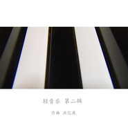 轻音乐 第二辑](./albums/308965264.md) | 其他 | 独立发行 | 2014年08月25日 | 原声带, 影视音乐 | 沙发音乐 Lounge, 放松新世纪 Relaxation New Age, 轻音乐 Easy Listening |
| [ 轻音乐 第一辑](./albums/208961470.md) | 其他 | 独立发行 | 2014年08月20日 | 原声带, 影视音乐 | 器乐独奏 Solo Instrumental, 轻音乐 Easy Listening |
| [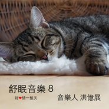 舒眠音乐8好心情一整天](./albums/2105802046.md) | 纯音乐 | 独立发行 | 不详 | 精选集 | 轻音乐 Easy Listening, 胎教音乐 Prenatal Music |
| [ 舒眠音乐10好心情一整天](./albums/2105802868.md) | 纯音乐 | 独立发行 | 不详 | 精选集 | 轻音乐 Easy Listening, 胎教音乐 Prenatal Music |

## 评论

|  |  |  |
| :-- | :-- | :-- |
|  [虾米用户](https://emumo.xiami.com/u/441583665) Forever Maur... 2020-10-14 00:50 赞(0) 踩(0) | 
希望您能一直热爱音乐，您是个内心纯净的人，我很喜欢您音乐中透露出的孤独和豁达 
 |
|  [虾米用户](https://emumo.xiami.com/u/32043222)  2020-09-29 14:35 赞(0) 踩(0) | 
这首真的太治愈了，谢谢你。 
 |
|  [虾米用户](https://emumo.xiami.com/u/638785) 缺少社会的毒打 2019-12-25 14:11 赞(0) 踩(0) | 
很好听，音乐人都很不容易!
 |
|  [虾米用户](https://emumo.xiami.com/u/329466075) 我还没想好要写什么... 2019-12-10 06:03 赞(0) 踩(0) | 
睡前神曲
 |
|  [虾米用户](https://emumo.xiami.com/u/83310386) 这家伙很聪明什么也没留下... 2019-11-26 14:48 赞(0) 踩(0) | 
好美妙
 |
|  [虾米用户](https://emumo.xiami.com/u/4487129)  2019-02-28 09:05 赞(0) 踩(0) | 
！！！
 |
|  [虾米用户](https://emumo.xiami.com/u/380199215) 现实世界中流民，来听音乐... 2019-02-12 09:21 赞(0) 踩(0) | 
加油
 |
|  [虾米用户](https://emumo.xiami.com/u/270427756)  2018-08-17 23:53 赞(1) 踩(0) | 
真心，谢谢你的音乐～    
 |
| ⇒ |  [虾米用户](https://emumo.xiami.com/u/35758205) 音乐人生音乐 2018-08-19 10:29 赞(0) 踩(0) | 
请继续关注，谢谢。
 |
|  [虾米用户](https://emumo.xiami.com/u/379466645)  2018-07-23 14:39 赞(0) 踩(0) | 
好听
 |
| ⇒ |  [虾米用户](https://emumo.xiami.com/u/35758205) 音乐人生音乐 2018-07-23 16:06 赞(0) 踩(0) | 
谢谢。
 |
|  [虾米用户](https://emumo.xiami.com/u/348717345) 本人是三大魔女之中的罗小... 2018-05-10 19:14 赞(1) 踩(0) | 
我喜欢卡农 
 |
|  [虾米用户](https://emumo.xiami.com/u/99364) 我还没想好要写什么... 2018-04-03 17:01 赞(0) 踩(0) | 
喜欢
 |
|  [虾米用户](https://emumo.xiami.com/u/6066908) 光芒与希望 *JazzH... 2018-03-01 10:14 赞(0) 踩(0) | 
不错，很细致~
 |
| ⇒ |  [虾米用户](https://emumo.xiami.com/u/35758205) 音乐人生音乐 2018-03-01 15:20 赞(0) 踩(0) | 
谢谢你的欣赏～
 |
|  [虾米用户](https://emumo.xiami.com/u/20177386) 感谢一切美好的遇见❤️ 2018-02-24 10:10 赞(0) 踩(0) | 

 |
|  [虾米用户](https://emumo.xiami.com/u/277541791) 24/7 2018-02-08 09:49 赞(0) 踩(0) | 
感觉还差点点勾画与描绘
 |
|  [虾米用户](https://emumo.xiami.com/u/323626409) 暂别虾米 2018-01-12 22:59 赞(0) 踩(0) | 
加油
 |
|  [虾米用户](https://emumo.xiami.com/u/298471185) 我还没想好要写什么... 2017-12-03 01:01 赞(0) 踩(0) | 
很干净的声音，听着睡觉觉
 |
| ⇒ |  [虾米用户](https://emumo.xiami.com/u/35758205) 音乐人生音乐 2017-12-03 09:45 赞(0) 踩(0) | 
祝福你夜夜好眠。
 |
|  [虾米用户](https://emumo.xiami.com/u/19539190)  2017-12-02 00:10 赞(0) 踩(0) | 
清丽的文字配上静雅的音乐，即使在喧闹的地方也像是在徜徉着阳光的午后，小憩在树下，荡着摇椅一般，格外宜人。希望你的音乐越做越好～
 |
|  [虾米用户](https://emumo.xiami.com/u/323626409) 暂别虾米 2017-11-14 20:29 赞(0) 踩(0) | 
加油，都特别的好。
 |
|  [虾米用户](https://emumo.xiami.com/u/7293261)  2017-08-22 22:01 赞(0) 踩(0) | 
真好听
 |
|  [虾米用户](https://emumo.xiami.com/u/84528170)   2017-05-19 12:08 赞(0) 踩(0) | 
特别喜欢安静的感觉 继续加油
 |
| ⇒ |  [虾米用户](https://emumo.xiami.com/u/35758205) 音乐人生音乐 2017-05-19 23:54 赞(0) 踩(0) | 
谢谢鼓励
 |
| ⇒ |  [虾米用户](https://emumo.xiami.com/u/35758205) 音乐人生音乐 2017-05-23 10:09 赞(0) 踩(0) | 
谢谢关注
 |
| ⇒ |  [虾米用户](https://emumo.xiami.com/u/188086304)  2017-07-28 07:42 赞(0) 踩(0) | 
00
 |
|  [虾米用户](https://emumo.xiami.com/u/97747450) 我还没想好要写什么... 2017-04-30 22:35 赞(0) 踩(0) | 
9642
 |
|  [虾米用户](https://emumo.xiami.com/u/9003931) 千淘万漉虽辛苦 2017-03-02 10:24 赞(0) 踩(0) | 
值得关注的独立音乐人。
 |
|  [虾米用户](https://emumo.xiami.com/u/106222692)  2017-02-28 23:05 赞(1) 踩(0) | 
非常好听，温暖干净！
 |
| ⇒ |  [虾米用户](https://emumo.xiami.com/u/35758205) 音乐人生音乐 2017-03-04 21:19 赞(0) 踩(0) | 
谢谢点评。
 |
|  [虾米用户](https://emumo.xiami.com/u/1811809) no music no ... 2017-01-26 10:49 赞(1) 踩(0) | 
喜欢。暖，干净 
 |
| ⇒ |  [虾米用户](https://emumo.xiami.com/u/35758205) 音乐人生音乐 2017-01-27 11:03 赞(0) 踩(0) | 
谢谢妳的评论，新年快乐～
 |
|  [虾米用户](https://emumo.xiami.com/u/251233720)  2016-12-21 16:11 赞(2) 踩(0) | 
喜欢这样的曲风，很温暖，很干净 
 |
|  [虾米用户](https://emumo.xiami.com/u/248801737)  2016-11-24 13:32 赞(1) 踩(0) | 
最爱轻音乐
 |
|  [虾米用户](https://emumo.xiami.com/u/223120472)  2016-10-05 20:24 赞(1) 踩(0) | 
加油加油！ 
 |
|  [虾米用户](https://emumo.xiami.com/u/223120472)  2016-10-05 20:23 赞(2) 踩(0) | 
下载要钱   我听你的音乐好几年啦  好干净好动听 
 |
|  [虾米用户](https://emumo.xiami.com/u/142258170)  2016-04-17 19:28 赞(0) 踩(0) | 
喜欢你的音乐
 |
| ⇒ |  [虾米用户](https://emumo.xiami.com/u/35758205) 音乐人生音乐 2016-04-18 19:15 赞(0) 踩(0) | 
谢谢你的欣赏，请继续关注。
 |
|  [虾米用户](https://emumo.xiami.com/u/35201727) 再见 2016-04-03 12:56 赞(0) 踩(0) | 
我喜欢你…的音乐
 |
|  [虾米用户](https://emumo.xiami.com/u/32461398) 曾在云上浮想联翩如今也终... 2016-02-05 23:00 赞(0) 踩(0) | 
no.30这个主题不错耶。幸好被我发现了～
 |
|  [虾米用户](https://emumo.xiami.com/u/10104366) 心外无物 2016-01-12 21:49 赞(0) 踩(0) | 
张耀扬！？
 |
|  [虾米用户](https://emumo.xiami.com/u/77182912)  2015-10-27 10:15 赞(1) 踩(0) | 
孩子在学钢琴，我也从三十多岁才真正感受钢琴，很好听，支持你。
 |
|  [虾米用户](https://emumo.xiami.com/u/5848302)   2015-10-11 18:52 赞(0) 踩(0) | 
好喜欢！
 |
| ⇒ |  [虾米用户](https://emumo.xiami.com/u/35758205) 音乐人生音乐 2015-10-11 23:16 赞(0) 踩(0) | 
谢谢你的欣赏，我会继续创作下去~
 |
|  [虾米用户](https://emumo.xiami.com/u/56253250) 越活越孤独 2015-10-08 07:16 赞(0) 踩(0) | 
太喜欢你的音乐了。加油。加油 
 |
| ⇒ |  [虾米用户](https://emumo.xiami.com/u/35758205) 音乐人生音乐 2015-10-08 08:47 赞(0) 踩(0) | 
谢谢你的支持，我会继续创作音乐。
 |
|  [虾米用户](https://emumo.xiami.com/u/355865) Let it go, l... 2015-09-24 11:29 赞(0) 踩(0) | 
你的这些测试专辑是什么？需要帮助删除或整理吗？<a href="http://emumo.xiami.com/u/17330125" target="_blank" rel="nofollow" name_card="17330125">@虾米音乐人</a> <a href="http://emumo.xiami.com/u/2871" target="_blank" rel="nofollow" name_card="2871">@虾小编</a>
 |
|  [虾米用户](https://emumo.xiami.com/u/35758205) 音乐人生音乐 2015-07-25 11:51 赞(1) 踩(0) | 
是鉄琴的声音。希望听的人会喜欢。
 |
|  [虾米用户](https://emumo.xiami.com/u/7239460)  2015-07-23 00:52 赞(0) 踩(0) | 
啊不 八音盒的声音？
 |
|  [虾米用户](https://emumo.xiami.com/u/7239460)  2015-07-22 19:42 赞(0) 踩(0) | 
卡农是用钢片琴敲出来的吗
 |
|  [虾米用户](https://emumo.xiami.com/u/5491191)   2015-07-14 21:31 赞(0) 踩(0) | 
听你的音乐让人感觉很安心
 |
| ⇒ |  [虾米用户](https://emumo.xiami.com/u/35758205) 音乐人生音乐 2015-07-15 10:56 赞(0) 踩(0) | 
谢谢你的欣赏，我会一直持续创作下去的~
 |
|  [虾米用户](https://emumo.xiami.com/u/11899622) 夜雨声烦 2015-06-21 16:09 赞(3) 踩(0) | 
好聽，有種特別溫暖的感覺！很舒服的音樂
 |
|  [虾米用户](https://emumo.xiami.com/u/17813844) 我有多自恋，以至于每打一... 2015-06-01 12:19 赞(0) 踩(0) | 
好听，加油！
 |
|  [虾米用户](https://emumo.xiami.com/u/3598401)  2015-03-26 18:02 赞(0) 踩(0) | 
录音的质量可以提高些吗？^ω^
 |
|  [虾米用户](https://emumo.xiami.com/u/3598401)  2015-03-25 13:08 赞(1) 踩(0) | 
加油
 |
|  [虾米用户](https://emumo.xiami.com/u/33944032) 让我进入你的内心，拯救你... 2015-02-01 00:43 赞(0) 踩(0) | 
swing 跟lounge
 |
|  [虾米用户](https://emumo.xiami.com/u/4400366) 再也不见 2015-01-13 02:09 赞(0) 踩(0) | 
好
 |
|  [虾米用户](https://emumo.xiami.com/u/38674805) BAT 2014-12-07 03:41 赞(0) 踩(0) | 
爵士带给人们的  是对音乐无限的幻想   即兴爵士更流露出作者对情感的演绎与表达    由衷希望 爵士乐能在中国快速壮大起来  有更多的音乐人  能诠释好爵士 演绎好爵士    因为   它太奇妙了
 |
| ⇒ |  [虾米用户](https://emumo.xiami.com/u/35758205) 音乐人生音乐 2014-12-08 13:55 赞(0) 踩(0) | 
音樂無國界。
 |
|  [虾米用户](https://emumo.xiami.com/u/1522283)  2014-09-28 10:52 赞(0) 踩(0) | 
非常喜欢您的作品
 |
| ⇒ |  [虾米用户](https://emumo.xiami.com/u/35758205) 音乐人生音乐 2014-09-28 14:57 赞(0) 踩(0) | 
谢谢您的给力，我会继续努力创作的。
 |
|  [虾米用户](https://emumo.xiami.com/u/458987)   2014-09-07 20:25 赞(0) 踩(0) | 
编曲很棒！非常有特色。
 |
| ⇒ |  [虾米用户](https://emumo.xiami.com/u/35758205) 音乐人生音乐 2014-09-08 08:50 赞(0) 踩(0) | 
谢谢你的欣赏。中秋节快乐。
 |
|  [虾米用户](https://emumo.xiami.com/u/35758205) 音乐人生音乐 2014-07-06 16:48 赞(14) 踩(0) | 
我刚入驻了虾米音乐人，欢迎大家来我的个人主页，收听我的最新音乐
 |
