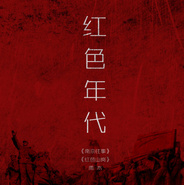

红色年代
============================

|  |  |
| :--: | :-- |
| [ 红色年代](https://emumo.xiami.com/album/2100237784) | **艺人**: [雨木](../index.md) **语种**: 国语 **唱片公司**: 华谊音乐 **发行时间**: 2015年11月16日 **专辑类别**: EP, 单曲 **专辑风格**:  **播放数**: 1293 **收藏数**: 2 **评论数**: 0  |

## 简介

《红色年代》是雨木时隔一年后推出第三张EP,歌曲都是围绕中国人民抗日战争胜利有感而作,依然延续了民谣摇滚和流行民谣的怀旧曲风,时间定格在上个世纪30年代,分别用感伤和激情的两种情绪描述了那个红色的革命年代,在物质横飞患得患失的今天,还有多少人体会过此刻这一切的来之不易,生活在和平年代的今天,已然是一种无比的幸运了。歌曲《南京往事》《红色山岗》会将我们带回那段动荡的岁月,从而更加珍惜当下的幸福!

## 曲目

## 评论

|  |  |  |  |
| :-- | :-- | :-- | :-- |
