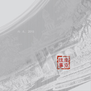

雨木
============================

|  |  |
| :--: | :-- |
| [ 雨木](https://i.xiami.com/yumu) | **播放数**: 4628047 **粉丝数**: 564 **评论数**: 37 **地区**: China 中国大陆 **风格**: 独立民谣 Indie Folk, 独立摇滚 Indie Rock  |

## 档案

姓名：雨木 
身高：177cm 
籍贯：北京 
雨木，出生于北京南城一条名叫“光明巷”的小胡同（现已是高楼林立的一片住宅区），师从首师大音乐系孟维平先生及中央音乐学院多位老师学习钢琴及作曲。2001年毅然放弃中国人民大学新闻系专业，投身热火朝天的音乐创作中。2013年签约华谊兄弟音乐，推出专辑EP《光明巷》《梦想如初》《红色年代》，2016年解约，现为独立音乐人。 
代表作品：《南京往事》、《梦想如初》、《光明巷》、《星空下》、《给所有热爱音乐的人》

## 专辑

| 名称 | 语种 | 唱片公司 | 发行时间 | 专辑类别 | 专辑风格 |
| :--: | :-- | :-- | :-- | :-- | :-- |
| [ 人生相逢](./albums/5020908020.md) | 国语 | 邻游天下 | 2020年06月15日 | EP, 单曲 | 国语流行 Mandarin Pop, 城市民谣 Urban Folk |
| [ 浣溪沙](./albums/5020825501.md) | 国语 | 独立发行 | 2020年06月04日 | EP, 单曲 | 民谣流行 Folk Pop, 民谣摇滚 Folk Rock |
| [ 南风](./albums/2108382086.md) | 国语 | 独立发行 | 2020年04月23日 | EP, 单曲 | 民谣 Folk |
| [ 人生相逢](./albums/2105409797.md) | 国语 | 天悦华音 | 2019年11月06日 | EP, 单曲 |  |
| [ 远秋](./albums/2105160787.md) | 国语 |  | 2019年08月19日 | EP, 单曲 | 民谣摇滚 Folk Rock |
| [ 生命之旅](./albums/2104827803.md) | 国语 |  | 2019年04月29日 | EP, 单曲 | 流行摇滚 Pop Rock, 民谣流行 Folk Pop |
| [ 流年三十](./albums/2104208946.md) | 国语 |  | 2018年11月13日 | 录音室专辑 | 民谣摇滚 Folk Rock |
| [ 寻你而行](./albums/2103754114.md) | 国语 | 独立发行 | 2018年06月23日 | EP, 单曲 | 独立民谣 Indie Folk, 独立摇滚 Indie Rock |
| [ 南京往事](./albums/2103754420.md) | 国语 | 独立发行 | 2015年11月16日 | EP, 单曲 | 独立民谣 Indie Folk, 独立摇滚 Indie Rock |
| [ 红色年代](./albums/2100237784.md) | 国语 | 华谊音乐 | 2015年11月16日 | EP, 单曲 |  |
| [ 梦想如初](./albums/2103754416.md) | 国语 | 独立发行 | 2014年11月21日 | EP, 单曲 | 独立摇滚 Indie Rock, 独立民谣 Indie Folk |
| [ 光明巷](./albums/985976541.md) | 国语 | 华谊文化 | 2013年12月02日 | EP, 单曲 | 校园民谣 Campus Folk |
| [ 光明巷](./albums/2103754412.md) | 国语 | 独立发行 | 2013年11月29日 | EP, 单曲 | 独立摇滚 Indie Rock, 独立民谣 Indie Folk |
| [ 星空下](./albums/2103754409.md) | 国语 | 独立发行 | 2011年10月08日 | EP, 单曲 | 独立摇滚 Indie Rock, 独立民谣 Indie Folk |
| [ 给所有热爱音乐的人](./albums/2103754405.md) | 国语 | 独立发行 | 2011年10月07日 | EP, 单曲 | 独立摇滚 Indie Rock, 独立民谣 Indie Folk |

## 评论

|  |  |  |  |
| :-- | :-- | :-- | :-- |
|  [虾米用户](https://emumo.xiami.com/u/358104299) 悲观的唯心存在现实解构虚... 2021-01-08 11:58 赞(0) 踩(0) | 
45967
 |
|  [虾米用户](https://emumo.xiami.com/u/34428681)  2020-08-18 22:28 赞(0) 踩(0) | 
词好曲好唱得好，比那个木有深度！
 |
|  [虾米用户](https://emumo.xiami.com/u/252198165) 吾心在生活中逝去！漯秦 2020-07-19 11:16 赞(0) 踩(0) | 
   干杯各位
 |
|  [虾米用户](https://emumo.xiami.com/u/435393120)  2020-03-13 13:47 赞(0) 踩(0) | 
嗯
 |
|  [虾米用户](https://emumo.xiami.com/u/427771760) 少问别人为什么，多看看自... 2019-12-22 23:52 赞(1) 踩(0) | 
因一首《寻你而行》，寻雨木而穿行于他的歌曲列表声线不错，粗砾感，沙哑感，沧桑感
 |
|  [虾米用户](https://emumo.xiami.com/u/226032) 暂无签名~ 2019-12-22 15:28 赞(1) 踩(0) | 
海口红珊瑚音乐节，听到了粗砺性感的声音
 |
|  [虾米用户](https://emumo.xiami.com/u/373242594)  2019-12-04 22:16 赞(1) 踩(0) | 
听君一曲，似解千愁！
 |
|  [虾米用户](https://emumo.xiami.com/u/420994501)  2019-10-16 15:34 赞(1) 踩(0) | 
喜欢你的噪音，你的词也特好
 |
|  [虾米用户](https://emumo.xiami.com/u/299169140)  2019-09-19 16:42 赞(2) 踩(0) | 
词曲创作的都棒！
 |
|  [虾米用户](https://emumo.xiami.com/u/344792049)  2019-08-19 15:47 赞(1) 踩(0) | 
特别好
 |
|  [虾米用户](https://emumo.xiami.com/u/327006687) 我还没想好要写什么... 2019-07-13 02:11 赞(2) 踩(0) | 
南京往事不知不觉听了无数遍，依然沉醉不已。雨木可以写一首关于北京的歌吗？
 |
| ⇒ |  [虾米用户](https://emumo.xiami.com/u/11336173)  2019-08-20 11:57 赞(0) 踩(0) | 
让我想想
 |
|  [虾米用户](https://emumo.xiami.com/u/215263799) 我还没想好要写什么... 2019-07-04 05:09 赞(1) 踩(0) | 
坚持！一定能红
 |
|  [虾米用户](https://emumo.xiami.com/u/377525299) 生命一直向前，爱与心跳并... 2019-02-08 19:52 赞(1) 踩(0) | 
好有感觉的！！笔芯
 |
|  [虾米用户](https://emumo.xiami.com/u/377525299) 生命一直向前，爱与心跳并... 2019-02-08 19:51 赞(1) 踩(0) | 
您的声音也好听
 |
|  [虾米用户](https://emumo.xiami.com/u/377525299) 生命一直向前，爱与心跳并... 2019-02-08 19:51 赞(1) 踩(0) | 
您的词太棒了
 |
| ⇒ |  [虾米用户](https://emumo.xiami.com/u/11336173)  2019-02-09 00:53 赞(0) 踩(0) | 
您客气
 |
| ⇒ |  [虾米用户](https://emumo.xiami.com/u/377525299) 生命一直向前，爱与心跳并... 2019-02-09 09:21 赞(0) 踩(0) | 
<q><b>雨木说：</b></q>
 |
|  [虾米用户](https://emumo.xiami.com/u/333592962) 生命中总有一些东西让你一... 2018-12-28 23:33 赞(2) 踩(0) | 
刚刚看完你的表演一直很兴奋，看着舞台上的你因为身体不舒服咳嗽，连连表示歉意的样子让人好心疼！希望你多多保重身体，以完美的状态演唱！
 |
| ⇒ |  [虾米用户](https://emumo.xiami.com/u/11336173)  2018-12-29 11:43 赞(0) 踩(0) | 
多谢支持！
 |
|  [虾米用户](https://emumo.xiami.com/u/306905770)  2018-12-19 23:46 赞(2) 踩(0) | 
词曲都很棒，多年不接受新歌的我已被深深吸引
 |
|  [虾米用户](https://emumo.xiami.com/u/116112586) 倾国倾城的妖娆 2018-12-10 17:55 赞(1) 踩(0) | 
您 2011年写的歌 也好听～加油哦 
 |
| ⇒ |  [虾米用户](https://emumo.xiami.com/u/11336173)  2018-12-10 18:43 赞(0) 踩(0) | 
多谢！
 |
|  [虾米用户](https://emumo.xiami.com/u/358257732)  2018-12-03 17:29 赞(2) 踩(0) | 
南京往事 听起来像一首民国时期的爱情故事好喜欢
 |
|  [虾米用户](https://emumo.xiami.com/u/293692544) 你敢给我说话吗？我咬你 2018-10-01 17:11 赞(3) 踩(0) | 
好听
 |
|  [虾米用户](https://emumo.xiami.com/u/404347616)  2018-09-18 07:39 赞(3) 踩(0) | 
走到哪听到哪，就为了寻你而行      全能音乐人雨木
 |
|  [虾米用户](https://emumo.xiami.com/u/404347616)  2018-09-18 07:37 赞(2) 踩(0) | 
好听
 |
|  [虾米用户](https://emumo.xiami.com/u/312412225) 随心所欲的听 2018-07-22 08:07 赞(2) 踩(0) | 
期待更多的音乐作品，加油
 |
|  [虾米用户](https://emumo.xiami.com/u/54062007) 寂灭为乐 明哲而痴心 喜... 2018-07-21 02:59 赞(2) 踩(0) | 
加油
 |
|  [虾米用户](https://emumo.xiami.com/u/259314109) 回到虾米的日子，就觉得很... 2018-06-26 23:56 赞(3) 踩(0) | 
沉静如许，静谧如你，心静了，才算是好作品。
 |
|  [虾米用户](https://emumo.xiami.com/u/353349253) 中国人 2018-06-25 09:39 赞(3) 踩(0) | 
新歌终于来了，寻你而行，循环播放中 
 |
|  [虾米用户](https://emumo.xiami.com/u/35657913) 喜欢一首歌，就让更多人一... 2018-06-06 23:42 赞(3) 踩(0) | 
歌咋都没了⊙&amp;forall;⊙？
 |
|  [虾米用户](https://emumo.xiami.com/u/35657913) 喜欢一首歌，就让更多人一... 2017-02-06 11:55 赞(2) 踩(0) | 
歌曲真的好听
 |
|  [虾米用户](https://emumo.xiami.com/u/32444689) 我还没想好要写什么... 2016-06-06 23:40 赞(1) 踩(0) | 

 |
|  [虾米用户](https://emumo.xiami.com/u/702836) no caging 2014-02-25 22:34 赞(1) 踩(0) | 
Wow, 好惊艳我不光是说歌
 |
|  [虾米用户](https://emumo.xiami.com/u/1024746) 灵魂不该屈服 2014-02-25 10:56 赞(4) 踩(0) | 
紧跟其后的是我
 |
|  [虾米用户](https://emumo.xiami.com/u/11336173)  2013-12-03 11:34 赞(19) 踩(0) | 
我刚入驻了虾米音乐人，欢迎大家来我的个人主页，收听我的最新音乐
 |
