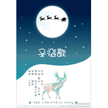

圣诞歌
============================

|  |  |
| :--: | :-- |
| [ 圣诞歌](https://emumo.xiami.com/album/1204658894) | **艺人**: [平纱落雁音乐团队](../index.md) **语种**: 国语 **唱片公司**: 独立发行 **发行时间**: 2014年07月06日 **专辑类别**: EP, 单曲 **专辑风格**:  **播放数**: 194539 **收藏数**: 31 **评论数**: 0  |

## 简介

圣诞真的是个很梦幻的节日，圣诞歌我很早就有想法了。  
其实我刚开始写了一些比较抒情的的旋律，然后突然就走癫了··摔- -  
开头和结尾的红鼻子驯鹿是我对圣诞最多的回忆╮(╯▽╰)╭  
然后朵朵的词很可爱也很温暖，感觉整个就甜了！  
再然后最近很有想法~写一组四季特辑，这首歌就是其中【冬】的部分~  
昂最后~把这首歌送给我最喜欢的朋友们！  
——BY 包子狸

## 曲目

## 评论

