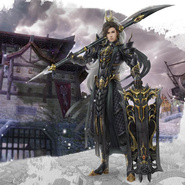

苍穹傲世剑网三·苍云
============================

|  |  |
| :--: | :-- |
| [ 苍穹傲世剑网三·苍云](https://emumo.xiami.com/album/1324914449) | **艺人**: [平纱落雁音乐团队](../index.md) **语种**: 国语 **唱片公司**: 独立发行 **发行时间**: 2015年02月25日 **专辑类别**: EP, 单曲 **专辑风格**: 古风 GuFeng Music **播放数**: 349384 **收藏数**: 57 **评论数**: 2  |

## 简介

把四小天鹅【啊不是】，四小天王【额不是】，把三只苍云一个“秀秀”凑在一起，小雁终于可以召唤神龙了！【什么鬼】  
特别感谢帮小雁召唤神龙的贰万万和捷麻麻~  
男神们非常的和谐，把小雁感动得一把鼻涕一把泪的【咳】~感谢奶妈的给力后期！  
送给可爱的连妹妹，生日快乐呦，平纱一窝雁子都十分十分十分爱你呢（づ￣3￣）づ╭?～  
也祝我们最负责的平纱群管素素生日快乐！ 

## 曲目

## 评论

|  |  |  |
| :-- | :-- | :-- |
|  [虾米用户](https://emumo.xiami.com/u/9614053) 淡淡的 2015-02-26 12:08 赞(2) 踩(0) | 
好听的呀
 |
|  [虾米用户](https://emumo.xiami.com/u/9614053) 淡淡的 2015-02-26 12:08 赞(1) 踩(0) | 
多么美丽的男声啊。。
 |
