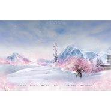

入雪逢春视频剧《斩春剑》片尾曲
============================

|  |  |
| :--: | :-- |
| [ 入雪逢春视频剧《斩春剑》片尾曲](https://emumo.xiami.com/album/2100174625) | **艺人**: [平纱落雁音乐团队](../index.md) **语种**: 国语 **唱片公司**: 独立发行 **发行时间**: 2015年08月01日 **专辑类别**: EP, 单曲 **专辑风格**: 国语流行 Mandarin Pop, 古风 GuFeng Music **播放数**: 145455 **收藏数**: 38 **评论数**: 3  |

## 简介

视频剧斩春剑片尾曲，感谢不才女神倾情演唱，欢迎关注新浪微博@斩春剑系列剧，敬请期待8月10日正剧发布！ 

## 曲目

## 评论

|  |  |  |  |
| :-- | :-- | :-- | :-- |
|  [虾米用户](https://emumo.xiami.com/u/131645430)  2016-05-14 13:59 赞(0) 踩(0) | 
好像不才的声音
 |
|  [虾米用户](https://emumo.xiami.com/u/33367117)  2016-01-10 03:46 赞(0) 踩(0) | 
大爱剑三！
 |
|  [虾米用户](https://emumo.xiami.com/u/352559)  2015-08-18 01:38 赞(0) 踩(0) | 
声音美哭了
 |
