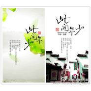

此间年少
============================

|  |  |
| :--: | :-- |
| [ 此间年少](https://emumo.xiami.com/album/404655640) | **艺人**: [平纱落雁音乐团队](../index.md) **语种**: 国语 **唱片公司**: 独立发行 **发行时间**: 2014年07月06日 **专辑类别**: EP, 单曲 **专辑风格**: 现代古典 Modern Classical, 古风 GuFeng Music **播放数**: 30799 **收藏数**: 6 **评论数**: 1  |

## 简介

&nbsp;
 
么么亲爱的咪咪子，你是我们家最高产的妞儿，我们都爱你……祝你19号生日快乐~~ 这里是我家，冉冉度年华，这首也是今年平纱五周年的纪念歌曲，愿琴瑟悠扬声伴大家度过又一季盛夏~~ 

&nbsp;

## 曲目

## 评论

|  |  |  |  |
| :-- | :-- | :-- | :-- |
|  [虾米用户](https://emumo.xiami.com/u/14760046) 古风    剑网三 2014-07-07 06:57 赞(0) 踩(0) | 
嘤嘤嘤，好开心，终于又听到宝玉桑&amp;amp;小曲儿&amp;amp;纱朵&amp;amp;螭羽毛的声音。
 |
