平纱落雁音乐团队
============================

|  |  |
| :--: | :-- |
| [ 平纱落雁音乐团队](https://i.xiami.com/pingshaluoyan) | **地区**: China 中国大陆 **风格**: 古风 GuFeng Music **播放数**: 4329779 **粉丝数**: 2854 **评论数**: 31  |

## 档案

平纱落雁音乐团队 
成立于2007年5月23日。最初由SOGUA翻唱网的“wind天平”和“纱朵”创建，作品以青春校园类型为主。后来由于“月牙儿”的加入，开始涉及古风圈范围。之后加入了“灰色”，渐渐发展成以现代清新风格与古风相融合的原创音乐团队。最后，直至2010年6月，扩大到由14人组成的队伍。作品主要发布于YYFC翻唱网及5sing网，并有不少为古风广播剧量身打造的主题曲及片尾曲。 
至2011年12月，平纱音乐团队主要成员有23人：奶妈月、纱朵、wind天平、灰色、依然饭特香、MAO&微笑、文学、不不、江南涩郎、小曲、秦宇、天边（skyside）、红烧の爆鱼、包小狸。2011年，新晋团员有子骁、螭羽毛、千叶君少、素锦汐寒、陌舞、影朔、LEN、Kavenn、晨曦Skiing。团队成员皆属唱、作皆佳的能手。 
其主要成员介绍如下： 
1、奶妈月 
平纱落雁的大奶妈，主要负责论坛与Q群事务、歌曲后期、团队管理以及活动组织。 　　强项：强大的组织力与号召力，仙子般飘渺美幻的甜蜜音色，无论多快节奏舌头都不打结的RAP~~ 
推荐歌曲：《Je m'appelle Hélène》，《白蛇》，《紫檀香》 
介绍：因为爱 
是不是付出就一定要得到相应的回报？是不是种瓜得瓜，种豆就能长出来豆子？ 
这些在月牙儿的世界里，显得那么的荒谬，那么的不值一提。 
她是平纱的引领者，或者说，是平纱不可或缺的灵魂。 
她爱着平纱里的每一个孩子，更多的时候，与他们无话不谈，从人生感悟到生活琐事。这时的她，睿智而感性，温柔而体贴，呵护且备至。 
因此，平纱的孩子们私下都热情地称呼她为奶妈， 
并不是她有多老，她自己也还是个孩子。 　　她总是喜欢抱着平纱孩子们的歌欢呼雀跃。如果谁的歌被推荐了或者受好评了，她会一高兴就是好几天，却不知，她自己的歌有多么美。那些美丽和惊艳，通通揉进了骨子里，静静散发着通透的香，让人迷醉而又沉沦…… 　　因为有爱，只有爱，一直在我们心中…… 
2、纱朵 
平纱落雁的创始人之一，平纱主力歌手及词曲作者，并参与成员头像绘制。 
强项：主攻编曲、填词，甜而不腻的糯米音~~ 推荐歌曲：《天龙八部》音乐填词系列，《天涯》，《君临天下》，《桃之夭夭》 
介绍：静待花开语，不知何人听 
花开的时候，是有声音的， 
但凡内心不平静的人总是很难听见。。。 　　朵朵花开，静静绽放 
轻轻柔柔地打开， 
总在期待着一个能听懂的人驻足，停留或者离开。 
暖暖的午后，透明的天空映着白白的大地 
像白纸，像一个不染尘埃的仙子，丝丝阳光斜斜地闪光，让冬天不再那么寒冷 
多了一些淡淡的笑意 
给寒冷的人们一点温暖，在平静的湖面掀起一圈圈涟漪。 
其实，冬天不冷，因为有安静，更有如冬日般阳光的温暖歌声…… 
等待花开， 
等待倾听， 
“朵朵”花开的声音…… 
3、灰色（灰灰） 
又名灰灰，平纱主力原创词、曲、唱三栖制作人 
强项：校园风及中国风歌曲创作，平纱第一“男”高音 
推荐作品：《我要的（for boss chou）》，《水墨流年》，《NM和平纱的幸福生活》，《无厘头平纱》 
介绍：天生的艺术家 
上天造人，总有些比你我更别有不同的，他们对情感的敏锐把握，是与生俱来的，毫不费力的。尽管一开始，也许连他们 自己都不太明白自己的天赋，但站在那里，一抬头，一开口，已是风景。 
我们称这样的人，为艺术家，天生的。 
不是那些长头发，眼神浑浊暧昧，衣不遮体的神经质；不是那些自命崇高不可一世故作姿态的救世者。 
比如这一个，灰色。 
灰色，间杂于黑白之间，你可以说它是浑浊不清的，也可以看成是黑白分明的，永远处于一种独立、自立、中立的泰然自若中。 
三分歌曲七分灵音，词，其实只是二流剧本的重演，因为剧情太泛滥，所以永远有不散场的观众。 
她是个好导演，好观众，更是一个绝不做作的好演员，虽然她有时候声线不由自主地唱得那般低沉、伤感，她其实很想说：如果能有大把的时间来装饰自己的心情，哪怕能睡个懒觉，都是件很奢侈的事情………… 
7、天平 
平纱落雁创始人之一，平纱主力歌手及词曲作者 
强项：和声，编曲，平氏高低音 
推荐歌曲：《伙伴》，《同福客栈》，《爱你的句子》 
介绍：低调de华丽 
喜欢在夜晚听歌，关门关窗，尽量不扰民，夜凉如水…… 
最适合听平子哼唱的曲风温柔的歌…… 
简单的几句伴奏吉他拨弦，一把平实的嗓音…… 
没有澎湃的鼓点，没有华丽的SOLO…… 　　只有朴实无华的弦律，和耐人寻味的几句歌词…… 
让独自一人的夜晚，心生良多感触 
为自己泡上一杯花茶，茉莉的香气顿时扑鼻而来 
在这样的时候通常喜欢找上一两本喜欢的小书，坐在窗台边小翻 
夜色，香味，自己，仿佛全部融入一个封闭的容器中 
对器皿外边的世界不闻不问，其实这样，也很好 
不停的听歌，是否能够带走内心细小的不安 
它是那么不确定，不剧烈，但是却无从遮蔽的事 
喜欢平子的声音，喜欢他唱的歌，因为它如午后咖啡般浓香，慢品，微薰，气味绽开…… 
原来它是一种低调的华丽…… 
5、MAO&微笑（猫猫） 
又名猫猫，平纱主力女歌手 
强项：富有磁性的中高音和甜而不腻的沙沙音 
推荐歌曲：《不想让你知道》，《轻擦的时光》，《爱似水仙》 
介绍：微笑着，听海洋歌唱 
她的声音像抚摩，像指引，像一双温暖的手，拉紧，我们一同去看那深绿色的海。 
轻轻软软的文字从轻轻软软的嘴里传出，就想张口这样咬下去，去品尝这柔软味道。 
蓝蓝的海草淡淡，就是那么无所顾忌的飘扬，安逸地翱翔。从来都不刺鼻，永远都是那么轻轻地，忍不住把一切都从梦中唤醒一样，幸福的味道，淡淡的，却是那么迷人。 
沉浸在她的歌声中，仿佛在深海的绿水里徜徉，有海豚不时腾跃出口袋，让人不不再去耐心倾听美人鱼的幽怨，象鱼一样，怡然自得。又不像鱼那样，抬起头用鼻腮深深呼吸天空与海洋混杂的气味。海洋不宽广，湛蓝色从掌心溢出，说是需要更自在的空气，海里的奇异与清凉全部都想交付，咸咸湿湿的水汽在鼻尖滑动，那不是煽情的眼泪，只是口袋里埋藏的那一杯海洋…… 
微笑着，去唱生活的歌谣。眼泪，不要为别人的悲伤而流。微笑着的我们，要用微笑的力量，去关照周围，去感化周围，去影响周围，直到每一个的脸上都挂起一片不落的灿烂笑容。 
是的，就这样，让我们微笑着面对生活带给我们的一切；微笑着，听海洋歌唱。 
6、文学 　　平纱主力男歌手 
平纱最青春动人的少男派声线 
推荐歌曲：《寒衣调》，《两个世界》，《菊花台》，《被风吹过的夏天》 
介绍：青春的声音 
有人说，一个有故事的人 
是因为他把繁华落寞都洒落在每一个音符中 　那种宠辱不惊的淡定，是与生俱来的 
而也许，每一个有故事的人 
都可以从文学的声音中找到 
那个原本早已遗失在时间隧道中的自己 
当我们以为自己已经湮没在柴米油盐的平淡生活中 
当我们偶尔在昏黄的台灯下打开那些泛黄的日记簿 
当我们在这个城市森林中朝九晚五的重复前行路线 
当我们以为再也不会轻易的敞开心扉释放天真之后 
我们现在终于可以庆幸的说 
我们遇见了 
带着淡定笑容的你 
有着清脆声音的你 
背负青春梦想的你 
叩开心灵之门的你 
让世界安静，我陪你听 
青春的声音 
4、依然饭特香（饭饭） 
平纱落雁主力男歌手 
强项：饭氏海豚音 
推荐歌曲：《歌剧2摇滚版》，《奉献》，《霍元甲》，《无双》 
介绍：他的声音，是一把杀人不见血的刀 　　他的声音，是一把杀人不见血的刀！ 
前奏，像序幕一样的前奏，缓缓拉开这一场爱恨纠葛。 
看不清表情，独自站立黑暗之中，仿佛自言自语一般，讲述爱而不得的遗憾，有难过，却不哀怨，仿佛早已洞悉所有世情，却还是付出的心甘情愿。 
那些字眼：黑夜 时间 感觉 再见 ，好像不是唱出来的，而是从喉咙里涌出来，带着炙热的体温，一出口就迅速与哀伤凝结，化为利刃，一刀一刀飞过来，千刀万剐，碎成尘埃。 　　耳边有凛冽的风声。 
再重新听高潮，发觉完全推翻了之前的感受，就像是：你明知道这是杯毒酒，却还是忍不住举起来，因为已沉醉，不能停。 
他有种极强的表现力，在诠释歌曲的时候尤其明显。 
有时候唱歌，与诠释好一首歌，完全两回事…… 
比起一首婉转凄美的情歌的感觉，更喜欢这种直唱到人心乱如麻，坐立不安的感觉……就好像你面前有个受伤的人，你不知道怎么安慰他，你在他的叙述里比他更伤，比他更动情，最后，还要他反过来安慰你。你会觉得：就像个勇士一样，爱的漂亮，伤也伤的漂亮！ 　　他的声音，是一把杀人不见血的刀！ 
8、不不 
平纱主力女歌手 
强项：气音歌手，极具魅力的唱腔，温柔的声线 
推荐作品：《失去》，《百万个吻》，《旋木》 
介绍：年华似水 
当忧伤穿透岁月，年华凋零青春。还有一些声音，会让我们幸福着感动…… 
记得当年在毕业同学录上写到：“不忧愁的脸，是我的少年。不仓惶的眼，等岁月改变……” 
光阴，就这样过去了…… 
在我们嬉笑打闹的时候， 
在我们埋首读书的时候， 
在我们悠闲或匆忙的脚步中， 
在我们迷茫或清澈的目光里…… 
不知道为什么，每次听到小不温柔的声线，总是让我们不可抑制地想起我的那些朋友。 
他们陪我们走过青葱年华的每一段坎坷， 
他们和我们一起从放肆张扬到内敛成熟， 
他们见证我们所有的欢笑和泪水…… 
小不的声线并不是那种富有多变特色的嗓音，却在无意中渗入人心，温柔似水…… 
如同在波光潋滟的时间里，我们成长着，忧伤着，相爱着，感动着…… 
时间依旧继续，年华依旧盛放。青春，在似水的歌声里奔向远方…… 
9、江南涩郎（江小南） 
纱主力词作者，负责平纱的宣传与推介 
强项：现代风与中国风填词创作 
推荐作品：《轻擦的时光》,《失去》，《那年走过》 
介绍：你看不见我的忧伤 
人都说小丑是最快乐的人，因为你永远看不见他伪装下的忧伤。 
只是喜欢一个人安静地，用手指记录下那些纷飞的伤，一点点拔掉那些锋芒的刺，然后咀嚼原谅。 
当最后再换上一副明媚灿烂的笑容，再面对我们的，就是一个略有些顽皮和无厘头的大男孩了。 
他的词，素雅沉静，染了几千年风霜的颜色，却是不紧不慢娓娓道来，韵味十足而又绵长。 还有那些小恶搞，让你觉得亲近又可爱，对他又爱又恨。 
比如，常常声称自己是女孩子一边的，于是就有人打趣地叫他“南姐”。他倒也不反对，反而乐在其中。以至于更多的人问道：南姐是男生还是女生？然后便有了这么一个说法：1、3、5为男生，2、4、6为女生，星期天休息，令人笑着摇头。 
随便相互开着玩笑，却不知什么时候一句话，就把他惹恼了。于是知道了什么东西该说，什么东西要塞到肚子里…… 
似从来没有底线，也似处处都是底线的他。 　千万别去触碰，他那些看不见的忧伤…… 
10、小曲 
平纱主力男歌手 
强项：高亢、浑厚、深沉的中高音 
推荐作品：《王子归来》，《除此以外》，《last order》…… 
介绍：我在等一轮暖阳 
有人说音乐就是一种精神毒品，一旦染上了就无法再戒掉。 
美好的声线应该也可以算是一种毒药吧…… 　至少，不是一种对自己有害的毒药。 
随意打开小曲的一首歌， 
即使是沉郁的音乐缓缓的流动， 
那声线，也会让你的心情会不由的也随着这声音浮漾开来， 
感觉着情感的弥漫，从心底不由的颤栗着， 
时而荡气回肠的开场和结尾， 
时而高亢的长音旷古与悠远， 
唱得人心潮暗生， 
就这样…… 
让人恍惚错失了时间与空间， 
没来由的感动，没来由的泪已盈眶， 
如遇见了等待已久的暖阳…… 
11、秦宇 
平纱主力男歌手 
超强魅力声线，温柔而沉静，蛊惑耳膜…… 
推荐歌曲：《末日之恋》，《天使》，《为你写的歌》，《很苦》…… 
介绍：空气般不可或缺的存在 
仿佛没有察觉般地，发现他一点点，一点点地，就融入了周身温软的空气中。 
流动的是他的声音，安静的是他的呼吸，连那些阳光下细小纷飞的尘埃，都成了他跳跃的心脏。 
与他说话的时候，总会想那些不为人知的他所经历的曾经，会是什么样子。 
看不到他的时候，会想他在哪里，在做什么。是开心的，微笑的，还是忧伤的，沮丧的…… 他一个人唱歌，有些寂寞。 
可是有时候，却又爱极了这种寂寞。 
于是听他唱歌，听他拼命地唱着自己喜欢的歌。 
当我们发现他已经进入到我们周围，无所不在的时候，恩，不用跑了，你被蛊惑了。 
12、天边（skyside） 
平纱主力男歌手 
震撼实力声线，深沉而内涵无限，藏而不露，显山不透水…… 
推荐歌曲：《红》，《千千阙歌》，《台北的机场》…… 
介绍：为你遮风挡雨的胸膛 
一直以来，都是那么低调。敛着光芒，却让人忽视不了他的存在。 
常常一句话就逗笑了大家，也是常常在别人聊得最欢畅的时候悄悄离开。 
最需要帮助的时候，有他在，似乎一切都变得简单。 
难过的时候，叫一声“叔叔”，就有一只大手掌轻轻抚摸上头顶。 
叫他叔叔，并不是说他有多老。 
只是在孩子气的我们之中，他的胸膛似乎是最暖的，像可以包容整个世界，义不容辞地为你遮风挡雨。 
歌声如人，他的声音，也是这样深沉，绵醇。 
像酒，却是香而不腻的老酒，想要品上头的时候，却愈加清醒。 
像茶，朴实清淡的外表下，蕴藏着浓烈的香泽。 
不论像什么，都掩藏不住背面的光芒。 
这就是天边，一个会为你遮风挡雨的好“大叔”。 
13、红烧の爆鱼 
平纱主力男歌手 
质感、舒服，而又充满着活力与爆发力的声音，用三个字来形容，很惊艳。 
推荐歌曲：《三生情缘》，《你那么爱她》，《如果没有你》，《咸鱼》 
介绍：微笑的邻家男孩 
不经意地，就会闯入你注意力范围的一个男生。很可爱，很亲切，不矫揉造作，不怨天尤人，直爽低调而又认真，偏就没有小脾气。 　初入他的页子，发现歌曲的人气都不高，于是将信将疑地带着慵懒的姿态随便点开一首歌。 然后便是立刻清醒，连带一大颗一大颗的感叹号一首首点下去，不停地听。 
没错，这就是他的歌声的吸引力。 
人如声音，声音如人，不只是舒服，还有那令人咋舌的唱歌功底，都忍不住让人想去亲近他。 
他唱忧伤的歌，让人心疼。他唱激情的歌，又让人忍不住跟着热血沸腾。 
就在你心疼得哗哗流泪，沸腾得原地舞蹈的时候，他又会带着淡淡的笑轻声地问候，嗨。 　这样一个大男孩。 
就在邻家，不远不近的距离，微笑着，等待你的聆听。 
14、包子狸 
平纱主力女歌手。可爱起来尽显Loli本色，抒情起来又颇有“女小曲”的风范，却更显娇柔妩媚。 
推荐歌曲：《一零六一》，《我和我的祖国》，《醉不悔》 
介绍：童话般的娃娃 
“亲爱的，你好去睡了~” 
“恩，我去看书了，然后就去睡。” 　　这样的。 
“恩，好的~” 
这样乖的。 
仿佛永远都会说，恩，好的。 
就是这样，恩，好的，一直延续了下来。让你觉得对她又怜又爱。 
不论何时，总为别人着想的女孩。甜美的声音，可爱的脸庞。 
就连为人处世的姿态，都是淡定从容。有时候很担心她这么年轻，能不能把一首歌的感情拿捏好。结果却是令人咋舌与欣慰的。 
都说她是Loli，可爱起来让人想咬一口，却不是扭捏做作的可爱，而是从骨子里透出一种让人忍不住去亲近的感觉，舒服又温暖。 
也都说她是女版的小曲，若说小曲是王子般的声音，那么她是不是就是公主了呢，呵呵，不是童话里等待被救的公主，而是用自己的智慧得到幸福的娃娃。 
如果她有危险，你是不是肯为了她打败怪兽与巫婆？ 
答案，请在听过她的声音之后，再仔细选择……

## 专辑

| 名称 | 语种 | 唱片公司 | 发行时间 | 专辑类别 | 专辑风格 |
| :--: | :-- | :-- | :-- | :-- | :-- |
| [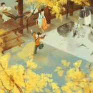 雁锦伴奏专辑](./albums/5022414223.md) | 国语 |  | 2018年11月07日 | 录音室专辑 |  |
| [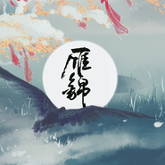 雁锦](./albums/2102712661.md) | 国语 | 独立发行 | 2017年03月15日 | 合集, 杂锦 |  |
| [ 【雁引歌】荣身耀影](./albums/2100242714.md) | 国语 | 独立发行 | 2015年11月29日 | EP, 单曲 | 国语流行 Mandarin Pop |
| [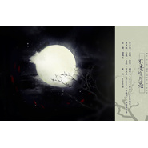 不老的月亮](./albums/2100242712.md) | 国语 | 独立发行 | 2015年11月29日 | EP, 单曲 | 国语流行 Mandarin Pop |
| [ 【雁引歌】花叶梦记——记《倩女幽魂2》花渐隐与叶葬花](./albums/2100218190.md) | 国语 | 独立发行 | 2015年10月13日 | EP, 单曲 | 国语流行 Mandarin Pop |
| [ 【雁引歌】江湖有我](./albums/2100207646.md) | 国语 | 独立发行 | 2015年09月25日 | EP, 单曲 | 国语流行 Mandarin Pop |
| [ 【雁引歌】缘命之诗](./albums/2100207642.md) | 国语 | 独立发行 | 2015年09月18日 | EP, 单曲 | 国语流行 Mandarin Pop |
| [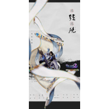 为弦为砚倩女幽魂2之画魂&魅者](./albums/2100174915.md) | 国语 | 独立发行 | 2015年08月04日 | EP, 单曲 | 国语流行 Mandarin Pop |
| [ 入雪逢春视频剧《斩春剑》片尾曲](./albums/2100174625.md) | 国语 | 独立发行 | 2015年08月01日 | EP, 单曲 | 国语流行 Mandarin Pop, 古风 GuFeng Music |
| [ 世有朝暮视频剧《斩春剑》主题曲](./albums/2100172288.md) | 国语 | 独立发行 | 2015年07月29日 | EP, 单曲 | 国语流行 Mandarin Pop, 古风 GuFeng Music |
| [ 偏执狂](./albums/837039331.md) | 国语 | 独立发行 | 2015年07月16日 | EP, 单曲 | 国语流行 Mandarin Pop |
| [ 长留](./albums/1534688267.md) | 国语 | 独立发行 | 2015年06月19日 | EP, 单曲 | 国语流行 Mandarin Pop |
| [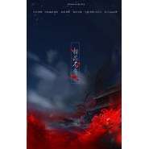 相思不负](./albums/1534688143.md) | 国语 | 独立发行 | 2015年06月19日 | EP, 单曲 | 国语流行 Mandarin Pop, 新古典新世纪 Neoclassical New Age, 古风 GuFeng Music |
| [ 从此醉](./albums/934688416.md) | 国语 | 独立发行 | 2015年06月19日 | EP, 单曲 | 国语流行 Mandarin Pop |
| [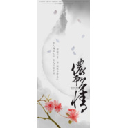 侬本多情](./albums/1832289923.md) | 国语 | 独立发行 | 2015年05月23日 | EP, 单曲 | 国语流行 Mandarin Pop, 古风 GuFeng Music |
| [ 初想集](./albums/1932289634.md) | 国语 | 独立发行 | 2015年05月22日 | EP, 单曲 | 国语流行 Mandarin Pop |
| [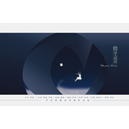 给诗人的诗](./albums/1428400844.md) | 国语 | 独立发行 | 2015年04月07日 | EP, 单曲 | 国语流行 Mandarin Pop |
| [ 爱莲说](./albums/327861765.md) | 国语 | 独立发行 | 2015年04月01日 | EP, 单曲 | 中国风 China-Wave |
| [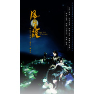 风月无醒](./albums/327861137.md) | 国语 | 独立发行 | 2015年04月01日 | EP, 单曲 | 中国风 China-Wave |
| [ 浩世苍茫录](./albums/1426565652.md) | 国语 | 独立发行 | 2015年03月16日 | EP, 单曲 | 中国风 China-Wave |
| [ 苍穹傲世剑网三·苍云](./albums/1324914449.md) | 国语 | 独立发行 | 2015年02月25日 | EP, 单曲 | 古风 GuFeng Music |
| [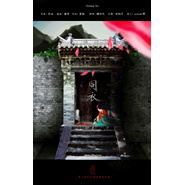 同衣](./albums/1023756161.md) | 国语 | 独立发行 | 2015年02月12日 | EP, 单曲 |  |
| [ 卷耳](./albums/123273908.md) | 国语 | 独立发行 | 2015年02月07日 | EP, 单曲 | 古风 GuFeng Music |
| [ 一世情长《明宫天下》广播剧主题歌](./albums/221767772.md) | 国语 | 独立发行 | 2015年01月20日 | EP, 单曲 | 古风 GuFeng Music |
| [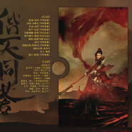 偕天同苍念白版+纯哥版](./albums/221767223.md) | 国语 | 独立发行 | 2015年01月20日 | EP, 单曲 |  |
| [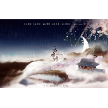 云水谣](./albums/121767551.md) | 国语 | 独立发行 | 2015年01月19日 | EP, 单曲 | 古风 GuFeng Music |
| [ 未成年](./albums/421768027.md) | 国语 | 独立发行 | 2014年11月09日 | EP, 单曲 |  |
| [ 敦煌·半壁歌](./albums/1108532832.md) | 国语 | 独立发行 | 2014年08月20日 | EP, 单曲 | 现代古典 Modern Classical, 古风 GuFeng Music |
| [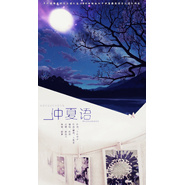 仲夏语](./albums/421768488.md) | 国语 | 独立发行 | 2014年08月09日 | EP, 单曲 |  |
| [ 圣诞歌](./albums/1204658894.md) | 国语 | 独立发行 | 2014年07月06日 | EP, 单曲 |  |
| [ 有情江上月](./albums/804660118.md) | 国语 | 独立发行 | 2014年07月06日 | EP, 单曲 | 现代古典 Modern Classical |
| [ 此间年少](./albums/404655640.md) | 国语 | 独立发行 | 2014年07月06日 | EP, 单曲 | 现代古典 Modern Classical, 古风 GuFeng Music |
| [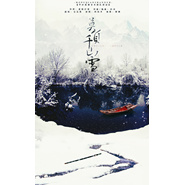 莫负千山雪](./albums/1804657848.md) | 国语 | 独立发行 | 2014年07月06日 | EP, 单曲 | 现代古典 Modern Classical, 古风 GuFeng Music |
| [ 与君老](./albums/2004660245.md) | 国语 | 独立发行 | 2014年07月06日 | EP, 单曲 | 现代古典 Modern Classical |
| [ 家](./albums/4656777.md) | 国语 | 独立发行 | 2014年07月06日 | EP, 单曲 |  |
| [ 与君书](./albums/1804660427.md) | 国语 | 独立发行 | 2014年07月06日 | EP, 单曲 | 现代古典 Modern Classical |
| [ 黑白键](./albums/2004656085.md) | 国语 | 独立发行 | 2014年07月06日 | EP, 单曲 |  |
| [ 枕梦扬州](./albums/104660600.md) | 国语 | 独立发行 | 2014年07月06日 | EP, 单曲 | 现代古典 Modern Classical |
| [ 那些幼稚而美好的事](./albums/2004658101.md) | 国语 | 独立发行 | 2014年07月06日 | EP, 单曲 |  |
| [ 少女的心事](./albums/1504658754.md) | 国语 | 独立发行 | 2014年07月06日 | EP, 单曲 |  |
| [ 丝途](./albums/1904659171.md) | 国语 | 独立发行 | 2014年07月06日 | EP, 单曲 | 现代古典 Modern Classical |
| [ 江南十三年](./albums/1904657103.md) | 国语 | 独立发行 | 2014年07月06日 | EP, 单曲 | 现代古典 Modern Classical |
| [ 那一夏旧时光](./albums/504658327.md) | 国语 | 独立发行 | 2014年07月06日 | EP, 单曲 |  |
| [ 记号](./albums/904656541.md) | 国语 | 独立发行 | 2014年07月06日 | EP, 单曲 |  |
| [ 奇迹之地平纱落雁六周年纪念](./albums/1004658535.md) | 国语 | 独立发行 | 2014年07月06日 | EP, 单曲 |  |
| [ 旧忆](./albums/1704657415.md) | 国语 | 独立发行 | 2014年07月06日 | EP, 单曲 |  |
| [ 英雄汇序曲](./albums/1304659956.md) | 国语 | 独立发行 | 2014年07月06日 | EP, 单曲 | 现代古典 Modern Classical |
| [ 北征](./albums/1604655349.md) | 国语 | 独立发行 | 2014年07月06日 | EP, 单曲 | 现代古典 Modern Classical |
| [ 最佳死党](./albums/1804660917.md) | 国语 | 独立发行 | 2014年07月06日 | EP, 单曲 |  |
| [ 夏约](./albums/1204659614.md) | 国语 | 独立发行 | 2014年07月06日 | EP, 单曲 |  |
| [ 枉寻天涯](./albums/504659397.md) | 国语 | 独立发行 | 2014年07月06日 | EP, 单曲 | 现代古典 Modern Classical |
| [ LOST](./albums/1604654983.md) | 国语 | 独立发行 | 2014年07月06日 | EP, 单曲 | 轻音乐 Easy Listening |
| [ 破茧成蝶](./albums/2304690.md) | 国语 | 风云人物 | 2014年06月05日 | EP, 单曲 |  |
| [ 南星](./albums/684742238.md) | 国语 | 独立发行 | 2013年09月27日 | EP, 单曲 |  |
| [ 秣陵谣](./albums/1880175211.md) | 国语 | 独立发行 | 2013年09月07日 | EP, 单曲 | 古风 GuFeng Music |
| [ 醉人间](./albums/373523847.md) | 国语 | 平纱落雁音乐团队 | 2013年07月08日 | EP, 单曲 | 古风 GuFeng Music |
| [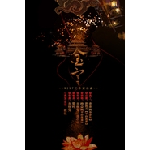 金宫](./albums/872069184.md) | 国语 | 艺能动听 | 2013年06月24日 | EP, 单曲 |  |
| [ 平纱落雁音乐团队四周年纪念](./albums/495687.md) | 国语 | 平纱落雁 | 2011年05月23日 | 精选集 |  |

## 评论

|  |  |  |
| :-- | :-- | :-- |
|  [虾米用户](https://emumo.xiami.com/u/442241816)  2020-04-19 22:09 赞(0) 踩(0) | 
急急急急急急急急急急急急急急急急急急急急急急急急急急急急急急急急急急急急急急急急急急急急急急急急急急急急急急急急急急急急急急急急急急急急急急急急急急急急急急急急急急急急，快出新歌。
 |
|  [虾米用户](https://emumo.xiami.com/u/217822883) 我们外太空再见啦✧٩(ˊ... 2019-09-09 23:30 赞(0) 踩(0) | 
所以说什么时候更新歌单
 |
|  [虾米用户](https://emumo.xiami.com/u/19056528) 我还没想好要写什么... 2019-06-20 07:56 赞(0) 踩(0) | 
到处找平沙落雁的三世悲歌，突然找不到了…
 |
|  [虾米用户](https://emumo.xiami.com/u/1499382)   2019-05-20 20:59 赞(0) 踩(0) | 
乐队名是青城四兽的梗？
 |
|  [虾米用户](https://emumo.xiami.com/u/27623985)  2018-12-04 09:23 赞(1) 踩(0) | 
能够多多上传么，虾米中歌好少啊。
 |
|  [虾米用户](https://emumo.xiami.com/u/325641530)  2018-11-07 19:45 赞(1) 踩(0) | 
这些歌很好听
 |
|  [虾米用户](https://emumo.xiami.com/u/406620676)  2018-10-23 01:36 赞(1) 踩(0) | 
大大们，以前在网络上听过一首你们的戏江南，现在好想再听。请问可以上传吗？或者在哪还能买到你们当初出版的那张专辑呢？
 |
|  [虾米用户](https://emumo.xiami.com/u/12221090) 逍遥于天地而心意自得 2018-04-10 21:40 赞(0) 踩(0) | 
赞
 |
|  [虾米用户](https://emumo.xiami.com/u/353121375) 听他人的悲欢离合，悲自己... 2018-03-11 11:07 赞(1) 踩(0) | 
伦桑也在这个团队里吗？
 |
| ⇒ |  [虾米用户](https://emumo.xiami.com/u/291920508)  2018-10-20 15:48 赞(0) 踩(0) | 
特地查了一下，有伦桑 
 |
|  [虾米用户](https://emumo.xiami.com/u/334232355)  2017-11-13 21:23 赞(0) 踩(0) | 
为什么我找不到催雪忘故？这首超好听！是没有上传吗   求上传！
 |
|  [虾米用户](https://emumo.xiami.com/u/296162858)  2017-06-29 18:57 赞(0) 踩(0) | 
好听
 |
|  [虾米用户](https://emumo.xiami.com/u/92515436) 早晨的阳光如此的灿烂 2017-06-07 02:41 赞(0) 踩(0) | 
加油哦
 |
|  [虾米用户](https://emumo.xiami.com/u/256005842)  2017-03-19 19:19 赞(1) 踩(0) | 
与墨明棋妙同宗不同门，还是有很大区别的
 |
|  [虾米用户](https://emumo.xiami.com/u/46351706)  2016-07-06 14:04 赞(0) 踩(0) | 
一直有喜欢你们啊
 |
|  [虾米用户](https://emumo.xiami.com/u/49834481) 英雄，愿你有一份不悔的爱... 2016-02-08 09:54 赞(0) 踩(0) | 
灰灰啊你在哪里
 |
|  [虾米用户](https://emumo.xiami.com/u/49834481) 英雄，愿你有一份不悔的爱... 2015-10-06 21:04 赞(0) 踩(0) | 
为啥不上绿茶
 |
| ⇒ |  [虾米用户](https://emumo.xiami.com/u/50717832) 及时行乐，莫忘初心。 2016-01-02 14:47 赞(0) 踩(0) | 
同问苍天问大地
 |
|  [虾米用户](https://emumo.xiami.com/u/49834481) 英雄，愿你有一份不悔的爱... 2015-10-06 20:56 赞(0) 踩(0) | 
啥时候上绿茶啊等的心好焦
 |
|  [虾米用户](https://emumo.xiami.com/u/49834481) 英雄，愿你有一份不悔的爱... 2015-10-06 20:54 赞(3) 踩(0) | 
绿茶只有合音版好珍贵的几句人声，初恋一样的声音，希望歌曲快点上，虽然别的播放器有，可我已经嫁给了虾米不想不贞 
 |
|  [虾米用户](https://emumo.xiami.com/u/844974) 谁道飘零不可怜 2015-08-30 21:57 赞(0) 踩(0) | 
加油加油
 |
|  [虾米用户](https://emumo.xiami.com/u/1239241) 畅游书海中 2015-04-01 12:17 赞(0) 踩(0) | 
高产的一天！
 |
|  [虾米用户](https://emumo.xiami.com/u/37052412) 有情江上月，莫负千山雪 2014-06-14 21:01 赞(29) 踩(0) | 
我刚入驻了虾米音乐人，欢迎大家来我的个人主页，收听我的最新音乐
 |
| ⇒ |  [虾米用户](https://emumo.xiami.com/u/9716217) 不许吐槽id 2014-11-19 16:29 赞(0) 踩(0) | 
我觉得绿茶、离骚、故城谣这些都可以传一下，不过也只是建议啦。5sing也一直在关注着你们哦，加油！
 |
|  [虾米用户](https://emumo.xiami.com/u/9329588) 什么叫最多12个字符？？ 2014-05-26 20:25 赞(0) 踩(0) | 
终于入驻虾米了 想你们的歌 想死了
 |
|  [虾米用户](https://emumo.xiami.com/u/3975735)  2013-03-12 09:47 赞(0) 踩(0) | 
求笛中雪
 |
|  [虾米用户](https://emumo.xiami.com/u/9510849)  2012-06-21 22:03 赞(0) 踩(0) | 
灰灰 的离骚伴奏有木有 有的话发我好吗？ 很急急急急急急急急急急急急急急急急急急急急急急急急急急急急急急急急急急急急急急急急急急急急急急急急急急急急急急急急急急急急急急急急急急急急急急急急急急急急急急急急急急急急急急急急急急急急急急急急急急急急急急急急急急急急急急急急急急急急急急急急急急急急急急急急急急急急急急急急急急急急急急急急急急急急急急急急急急急急急急急急急急急急急急急急急急急急急急急急急急急急急急急急急急急急急急急急急急急急急急急急急急急急急急急急急急急急急急急急急急急急急急急急急急急急急急急急急急急急急急急急急急急急急急急急急急急急急急急急急急急急急急急急急急急急
 |
|  [虾米用户](https://emumo.xiami.com/u/9510849)  2012-06-20 22:28 赞(0) 踩(0) | 
灰灰 的离骚伴奏有木有 有的话发我好吗？ 很急急急急急急急急急急急急急急急急急急急急急急急急急急急急急急急急急急急急急急急急急急急急急急急急急急急急急急急急急急急急急急急急急急急急急急急急急急急急急急急急急急急急急急急急急急急急急急急急急急急急急急急急急急急急急急急急急急急急急急急急急急急急急急急急急急急急急急急急急急急急急急急急急急急急急急急急急急急急急急急急急急急急急急急急急急急急急急急急急急急急急急急急急急急急急急急急急急急急急急急急急急急急急急急急急急急急急急急急急急急急急急急急急急急急急急急急急急急急急急急急急急急急急急急急急急急急急急急急急急急急急急急急急急急急
 |
|  [虾米用户](https://emumo.xiami.com/u/9510849)  2012-06-19 15:55 赞(0) 踩(0) | 
灰灰 的离骚伴奏有木有 有的话发我好吗？ 很急急急急急急急急急急急急急急急急急急急急急急急急急急急急急急急急急急急急急急急急急急急急急急急急急急急急急急急急急急急急急急急急急急急急急急急急急急急急急急急急急急急急急急急急急急急急急急急急急急急急急急急急急急急急急急急急急急急急急急急急急急急急急急急急急急急急急急急急急急急急急急急急急急急急急急急急急急急急急急急急急急急急急急急急急急急急急急急急急急急急急急急急急急急急急急急急急急急急急急急急急急急急急急急急急急急急急急急急急急急急急急急急急急急急急急急急急急急急急急急急急急急急急急急急急急急急急急急急急急急急急急急急急急急急
 |
|  [虾米用户](https://emumo.xiami.com/u/9510849)  2012-06-18 22:22 赞(0) 踩(0) | 
灰灰   的离骚伴奏有木有   有的话发我好吗？   很急急急急急急急急急急急急急急急急急急急急急急急急急急急急急急急急急急急急急急急急急急急急急急急急急急急急急急急急急急急急急急急急急急急急急急急急急急急急急急急急急急急急急急急急急急急急急急急急急急急急急急急急急急急急急急急急急急急急急急急急急急急急急急急急急急急急急急急急急急急急急急急急急急急急急急急急急急急急急急急急急急急急急急急急急急急急急急急急急急急急急急急急急急急急急急急急急急急急急急急急急急急急急急急急急急急急急急急急急急急急急急急急急急急急急急急急急急急急急急急急急急急急急急急急急急急急急急急急急急急急急急急急急急急急
 |
|  [虾米用户](https://emumo.xiami.com/u/1250174) 你好，时光！！ 2011-06-22 12:06 赞(2) 踩(0) | 
《绿茶》挺好听
 |
