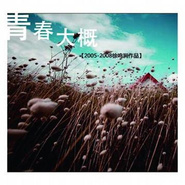

徐鸣涧
============================

|  |  |
| :--: | :-- |
| [ 徐鸣涧](https://i.xiami.com/soulvalley) | **播放数**: 6316028 **粉丝数**: 714 **评论数**: 39 **地区**: China 中国大陆 **风格**: 国语流行 Mandarin Pop, 校园民谣 Campus Folk, 新古典新世纪 Neoclassical New Age  |

## 档案

北京大学歌剧研究院青年教师、合唱指挥；作曲、音乐制作人。北京大学法学硕士，主要研究领域为音乐著作权。    生于1986年，自幼学习钢琴。1995年加入杨鸿年先生指挥的中国交响乐团少年及女子合唱团；2003年开始音乐创作；2005年加入北京大学学生合唱团，次年任团长兼助理指挥。其创作的《青春大概》、《转身之间》、《永远》、《再见时光》等歌曲在首都高校广为传唱。

## 专辑

| 名称 | 语种 | 唱片公司 | 发行时间 | 专辑类别 | 专辑风格 |
| :--: | :-- | :-- | :-- | :-- | :-- |
| [ 青春戏徐鸣涧2004-2014校园音乐创作选](./albums/1724436749.md) | 国语 | 独立发行 | 2014年06月21日 | 精选集 | 巴萨诺瓦 Bossa Nova, 国语流行 Mandarin Pop |
| [ 青春大概](./albums/499109.md) | 国语 |  | 2008年06月06日 | 合集, 杂锦 | 流行 Pop |

## 评论

|  |  |  |  |
| :-- | :-- | :-- | :-- |
|  [虾米用户](https://emumo.xiami.com/u/440285254)  2020-02-15 11:40 赞(0) 踩(0) | 
哪儿可以买到这两张cd专辑呢？
 |
|  [虾米用户](https://emumo.xiami.com/u/353534342)   2018-05-05 01:36 赞(0) 踩(0) | 
徐鸣涧师兄的作品 就是我们青春的印记
 |
|  [虾米用户](https://emumo.xiami.com/u/230082849)  2017-07-20 02:50 赞(0) 踩(0) | 
希望继续前行，加油
 |
|  [虾米用户](https://emumo.xiami.com/u/291167797)  2017-04-24 19:34 赞(0) 踩(0) | 
校友
 |
|  [虾米用户](https://emumo.xiami.com/u/37098145) 这个家伙太蠢了不会留下什... 2016-06-20 13:43 赞(0) 踩(0) | 
想听的声音
 |
|  [虾米用户](https://emumo.xiami.com/u/72666568)  2016-05-09 11:26 赞(0) 踩(0) | 
啦啦
 |
|  [虾米用户](https://emumo.xiami.com/u/5899444) 我还没想好要写什么... 2016-04-21 20:38 赞(0) 踩(0) | 
好听，通过《开讲啦》了解的
 |
|  [虾米用户](https://emumo.xiami.com/u/11416994) 圆圆 2016-01-10 11:23 赞(0) 踩(0) | 
风格
 |
|  [虾米用户](https://emumo.xiami.com/u/76515560)  2015-10-25 16:45 赞(0) 踩(0) | 
徐鸣涧 青春 校园,徐鸣涧,校园 北大,燕园风物,
 |
|  [虾米用户](https://emumo.xiami.com/u/76515560)  2015-10-25 16:45 赞(0) 踩(0) | 
徐鸣涧 青春 校园,徐鸣涧,校园 北大,燕园风物,
 |
|  [虾米用户](https://emumo.xiami.com/u/76515560)  2015-10-25 16:44 赞(0) 踩(0) | 
徐鸣涧 青春 校园,
 |
|  [虾米用户](https://emumo.xiami.com/u/69792846) 简单快乐！成长就是把玻璃... 2015-10-24 21:57 赞(0) 踩(0) | 
徐鸣涧&amp;李健～～～大爱❤️
 |
|  [虾米用户](https://emumo.xiami.com/u/28234819) 质本洁来还洁去随花飞到天 2015-07-18 22:14 赞(0) 踩(0) | 
最早听是在湖南卫视快本上，曲好，词好，什么都好，青春的摸样全在里面，无限回忆，美好，回味久久
 |
|  [虾米用户](https://emumo.xiami.com/u/48148260) 暂无签名~ 2015-06-17 21:47 赞(0) 踩(0) | 
不知道为什么，很喜欢徐的文字，描绘的画面故事，就好像自己的故事一样
 |
|  [虾米用户](https://emumo.xiami.com/u/1301955) 我拥有的都是侥幸啊 2015-05-26 16:39 赞(0) 踩(0) | 
《一刻十年》很好听呀~
 |
|  [虾米用户](https://emumo.xiami.com/u/12252532)  2015-05-15 21:42 赞(0) 踩(0) | 
一张关于青春的专辑。。。
 |
|  [虾米用户](https://emumo.xiami.com/u/49922968)  2015-05-09 01:38 赞(2) 踩(0) | 
徐老师。明天指挥穿白衬衫好伐？已经那么瘦了还穿黑色衬衫。 
 |
|  [虾米用户](https://emumo.xiami.com/u/49533919) 江河离我去，明月水中留 2015-04-24 19:55 赞(0) 踩(0) | 
有的人因为心中有座火山才要歌唱，有的人因为内心需要填补而唱歌。
 |
|  [虾米用户](https://emumo.xiami.com/u/24031520)  2015-04-05 17:25 赞(0) 踩(0) | 
就是喜欢
 |
|  [虾米用户](https://emumo.xiami.com/u/23882129)  2015-03-31 13:22 赞(0) 踩(0) | 
好听
 |
|  [虾米用户](https://emumo.xiami.com/u/7348064)  2014-12-17 10:03 赞(0) 踩(0) | 
永远，今年四川校友会年会的时候唱啦~
 |
|  [虾米用户](https://emumo.xiami.com/u/3896805) 谁在唠唠叨叨念着 要及时... 2014-11-05 18:13 赞(0) 踩(0) | 
居然还真有徐大师，赞一个先
 |
|  [虾米用户](https://emumo.xiami.com/u/42881434) 你好哇 2014-10-29 15:25 赞(1) 踩(0) | 
青春大概，全曲都是泪点
 |
|  [虾米用户](https://emumo.xiami.com/u/7862158) 天空的轨迹 2014-10-10 14:56 赞(0) 踩(0) | 
微光！
 |
|  [虾米用户](https://emumo.xiami.com/u/2854865)  2014-09-22 20:09 赞(21) 踩(0) | 
我刚入驻了虾米音乐人，欢迎大家来我的个人主页，收听我的最新音乐
 |
|  [虾米用户](https://emumo.xiami.com/u/23118874) 择一城终老 遇一人白首 2014-09-21 11:40 赞(0) 踩(0) | 
就是喜欢
 |
|  [虾米用户](https://emumo.xiami.com/u/28365781)  2013-11-25 09:10 赞(0) 踩(0) | 
pretty
 |
|  [虾米用户](https://emumo.xiami.com/u/650105)  2013-10-17 01:10 赞(0) 踩(0) | 
永远。
 |
|  [虾米用户](https://emumo.xiami.com/u/18567351)  2013-08-05 19:02 赞(0) 踩(0) | 
怎么听啊？？？？
 |
|  [虾米用户](https://emumo.xiami.com/u/4072541)  2013-05-21 15:54 赞(0) 踩(0) | 
喜欢就是喜欢
 |
|  [虾米用户](https://emumo.xiami.com/u/10795755) 爱 2012-10-29 18:19 赞(0) 踩(0) | 
永远 我们 青春
 |
|  [虾米用户](https://emumo.xiami.com/u/10129138) 怀念校园生活 2012-09-23 01:32 赞(0) 踩(0) | 
请问专辑《青春大概》哪里可以下载啊
 |
|  [虾米用户](https://emumo.xiami.com/u/10239458)  2012-08-16 16:26 赞(0) 踩(0) | 
垃圾网站 下载个音乐还要什么妈的米布 举报 垃圾啊
 |
|  [虾米用户](https://emumo.xiami.com/u/9586184)  2012-06-25 18:03 赞(0) 踩(0) | 
爱。
 |
|  [虾米用户](https://emumo.xiami.com/u/2146104)  2012-06-14 11:08 赞(1) 踩(0) | 
喜欢
 |
|  [虾米用户](https://emumo.xiami.com/u/9237895)  2012-06-07 09:18 赞(0) 踩(0) | 
好听，感人
 |
|  [虾米用户](https://emumo.xiami.com/u/4305839)  2012-03-24 16:28 赞(0) 踩(0) | 
啧啧，总能戳中吾等的要害。
 |
|  [虾米用户](https://emumo.xiami.com/u/4895647)  2012-01-11 11:27 赞(0) 踩(0) | 
被《微光》击中
 |
|  [虾米用户](https://emumo.xiami.com/u/6082889)  2011-10-02 22:28 赞(0) 踩(0) | 
好听
 |
