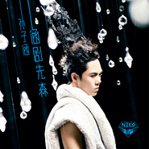

涵剧先森
============================

|  |  |
| :--: | :-- |
| [ 涵剧先森](https://emumo.xiami.com/album/1201979255) | **艺人**: [孙子涵](../index.md) **语种**: 国语 **唱片公司**: 简单快乐 **发行时间**: 2014年06月06日 **专辑类别**: 录音室专辑 **专辑风格**: 国语流行 Mandarin Pop **播放数**: 1874797 **收藏数**: 314 **评论数**: 28  |

## 简介

梦想是最好的编剧  
安排所有曲折剧情  
只为演出更完美的自己  
——他 热血小超人孙子涵  
从单薄少年到小小先森  
华服下的双眼 隐隐闪动的王者霸气  
为自己的青春提名  
  
于是惯例——  
按照文案的惯例，或许该继续与你玩一场文字催眠的游戏。  
告诉你关于孙子涵，关于他跌宕起伏，戏剧性十足的青春，关于他在音乐里的企图心？惯例，去说给被惯例桎梏，心无法去感受去梦想的灵魂吧。  
如果你青春，你会听懂孙子涵的音乐语言。  
  
于是感悟——  
感悟，说不清人生是在哪一天忽然造访，交给你一个空白的剧本。  
世界与你所向往的旅程交织，变成了剧本里每一段令你落泪、快乐、挫败、骄傲的情节。  
多年后，你会知道，这部由你自由发挥，全情出演的戏剧人生，叫做青春。  
  
与青春渐行渐远的人，除了怀念泛黄的记忆，再无法懂得那些还在青春里努力奔跑的心。  
没有梦的人，不会理解出于对梦想的热爱而愿意放弃自我的快乐。  
自我很重要，可是只剩下“自我”，你的青春已剧情杀青。  
  
于是孙子涵说——  
“……就这一辈子，怎么去演，剧终都会安息于葬礼，倒不如爽快些的敢爱敢恨。  
看一场剧，跌宕起伏才不无聊，于是我爱上这种不平静的生活。”  
如果说孙子涵上一张专辑《最近还好么》，是把内心魔鬼与天使互斗的挣扎与伤口曝露在阳光下，以问候自我内心开始，以分享大家内心共同的挣扎结束。那么孙子涵的2014全新专辑《涵剧先森》，将不再纠缠于自我小小世界的委屈，只想分享从大一出道到现在大四即将毕业，跌宕起伏的四年歌手与学生时光，用他痴迷的音乐构建的涵剧世界。  
接受现实并不是人生的重点，学生或是人生，也许总会被固定成两点一线，可是对于音乐的极度热爱，却让他的想象力没有界限，专注打磨自己的“盗梦空间”。此次，由简单快乐文化推出，孙子涵的全新专辑《涵剧先森》，亦将会将孙子涵个性鲜明的音乐特色悉数呈现。   
  
于是涵剧先森——  
这一场以追逐梦想而开始的青春，真的像是一场人生与孙子涵签订的独家季播剧，最初的他只知道要机会来之不易，用坚强伪装内心的不安。然而，从轻快纯粹的《一年一度的夏天》，到清新动感的《毕业声》，再到问候自我内心的《最近还好么》，孙子涵终于开始领悟，学习驾驭梦想，才会越来越靠近梦想。于是这张“涵式风格”明显的《涵剧先森》，将为你呈现他从阳光骚年到热血先森的过程中，最具才华与魅力的一面。从青涩到成长，不仅仅是唱片封套上璀璨的弱冠之礼；从学生歌手到人气偶像，也不仅仅是《巴黎夜雨》MV中用500颗水钻阵寓意的超级发光体；从单纯模仿到自我风格的确立，不仅仅是万颗水钻战袍加身，轻松驾驭的淡定微笑，更是《剧情杀青》Mv中置身于漫天流光飞舞中起起落落，依然镇定自若的大将风度。  
在《涵剧先森》专辑，孙子涵不再想要自我证明，不再刻意经营讨好。所有制作和企划团队，都是把孙子涵准备好的部分，最涵式的呈现在你面前。虽然他准备的不仅如此，虽然他的音乐企图心也不仅如此。但就是这份不徐不疾和不慌不张，让这张专辑前所未有的呈现出一种顺其自然的舒服。家有先森初长成，属于热血小超人的音乐光芒，将无所阻挡。  
  
9首音乐作品，9段不同的主题剧情音乐  
尽现“涵剧小先森”孙子涵对音乐的狂热，更会欣赏到9个维度的孙子涵的精彩片段。  
  
韩式爱情悲剧—《巴黎夜雨》  
就算是来自星星的教授，也没办法永远留在颂伊的身边。尽管他们如此相爱  
所以在那个热闹城市的我，也没办法抵抗没有你的孤单。尽管，他们从没有在一起过。  
  
现代豪门剧—《最后的泪滴》  
云泥之别的爱情，最后的结局会是怎样？是否就像TVB 8点档里一样，千金与穷小子的爱情，总在千山万水后，从相爱变成陌路？如果是这样，希望我们就这样在最后的距离，倒退着说再见，因为一个转身，我们的誓言就变成了谎言。  
  
经典武侠剧—《易筋经》  
小李飞刀虽然潇洒凌厉，浪子却终是败给了痴情，六脉神剑虽然惊世，碰上段誉却时灵时不灵。真正的侠客应该是，即使身陷囹圄仍淡然以微笑置之，刀光剑影中，带出笛箫合鸣的随性与潇洒，一招一式都会绽放他的傲骨。  
  
校园音乐剧—《伤心为礼物》  
说好的“永远”，原来只是青春的那几年。那么坚定的许下“天涯海角，你会陪我一起猖獗”的誓言，原来没有明天可以让我们浪费。越美好的青春，结束时心才会越痛。随着耳熟能详的上课铃声，学生时代的种种就这样在我们的眼前倒带，一幕幕的熟悉画面里分明曾是我们努力挽留过的青葱回忆。  
  
热血公路电影—《逆风少年》  
你拥有嘲笑我的权利，却没有轻蔑我的资格！你可以否定我的现在，却决定不了我的人生！你可以欣赏我跌下深渊的狼狈，却无法掠夺我涅槃重生的羽翼！青春就是一场战斗，我会承认失败的现在，却绝不放弃成功的未来！  
  
残酷青春剧—《好了伤疤忘了痛》  
这个世界，最遥远的距离，就是我一直在说，而他们永远不懂。于是，不再在乎那些流于形式的关心，不再向人倾吐内心无解的困惑和挫败。那个特立独行的我，只是默默等时间疗伤的另一种存在。  
  
战地爱情剧—《最后的距离》  
世间最激荡的爱情，应该发生在硝烟战地。把每一个争分夺秒的厮守的当下，都当成最后的相爱的机会。如果说，世间所有的相遇，都是久别重逢。那么世间所有的分别，都是碧落黄泉。而世间所有的爱情，也都应该美的宛若绝唱。  
  
都市偶像剧—《剧情杀青》  
宿舍还晒着太阳的衬衣、林荫辉映的小路、塞满欢呼的球场、空荡的教室、永远安静的图书馆，还有我们青涩单纯的恋爱。最终都随着毕业，各自消失在人海中。亲爱的，我想你，关于爱情，我们，最终没有拿到毕业证书。  
  
日式动漫—《哈姆雷特的眼泪》  
就算是人生出现动荡，就算是被整个世界背叛，就算最后的一丝勇气在冷眼中崩溃，就算眼泪堆积在心里即将窒息，亦会迎着风雨，大笑着走下去，绝不会向谁低头认输。如果你担心我，也许是你根本不懂王子的骄傲。

## 曲目

## 评论

|  |  |  |  |
| :-- | :-- | :-- | :-- |
|  [虾米用户](https://emumo.xiami.com/u/49785828)  2015-08-26 00:28 赞(0) 踩(0) | 
很喜欢，尤其是这个唐人，巴黎夜雨，冻结，希望以后多作些这种节奏感强的，顶你呦，
 |
|  [虾米用户](https://emumo.xiami.com/u/49560210) 我希望早上叫我起床的，不... 2015-04-25 16:52 赞(0) 踩(0) | 
帅！太喜欢这个专辑了，还收藏了你的签名专辑  
 |
|  [虾米用户](https://emumo.xiami.com/u/49560210) 我希望早上叫我起床的，不... 2015-04-25 16:51 赞(0) 踩(0) | 
太好听了 
 |
|  [虾米用户](https://emumo.xiami.com/u/9758921)  2015-02-18 10:02 赞(0) 踩(0) | 
莫名地觉得好听
 |
|  [虾米用户](https://emumo.xiami.com/u/3069378) 你从海上来 2014-10-04 15:49 赞(0) 踩(0) | 
&amp;lt;最后的泪滴&amp;gt; 本来还想吐槽这歌怎么这么网络这么连续剧，可看到此张专辑的名字，反而觉得这歌放在这里再合适不过了，很贴合专辑主题，确实很韩剧。
 |
|  [虾米用户](https://emumo.xiami.com/u/13766107) Calm down  2014-08-06 01:45 赞(0) 踩(0) | 
ex喜欢那首巴黎雨夜，跑来听，真心不喜欢这股子网络歌曲的调调，但是，就想在听的时候努力去感受ex的心情，希望她的脑海中有我们的故事。
 |
|  [虾米用户](https://emumo.xiami.com/u/2946834)  2014-07-21 15:03 赞(0) 踩(0) | 
巴黎夜雨真的很好听
 |
|  [虾米用户](https://emumo.xiami.com/u/10231881) 天天UP~~!~~ 2014-07-10 02:11 赞(0) 踩(0) | 
呃～这造型略显犀利～呀～！
 |
|  [虾米用户](https://emumo.xiami.com/u/37517899) 你未听过的叹息，悄然响起... 2014-06-13 07:42 赞(0) 踩(0) | 
歌曲很好听啊
 |
|  [虾米用户](https://emumo.xiami.com/u/10955806) 以太 2014-06-09 18:23 赞(3) 踩(0) | 
孙子汗好棒哦好爱你哦么么哒！
 |
|  [虾米用户](https://emumo.xiami.com/u/3592527)  2014-06-09 15:02 赞(1) 踩(0) | 
哪儿冒出来的？网络歌手？为什么是涵剧？为什么是先森？这浓浓的网络味深深地出卖了你。
 |
|  [虾米用户](https://emumo.xiami.com/u/292888)  2014-06-09 11:33 赞(5) 踩(0) | 
昵称取叫“先森”的，十个有十一个是gay跑不掉，至少微博、微信上是这样
 |
| ⇒ |  [虾米用户](https://emumo.xiami.com/u/47520004)  2015-10-02 04:29 赞(0) 踩(0) | 
你够了 
 |
| ⇒ |  [虾米用户](https://emumo.xiami.com/u/292888)  2015-10-02 09:30 赞(0) 踩(0) | 
<q><b>妤落蓝曦说：</b></q>
 |
| ⇒ |  [虾米用户](https://emumo.xiami.com/u/47520004)  2015-10-03 02:38 赞(0) 踩(0) | 
<q><b>绿如清泉说：</b></q>
 |
| ⇒ |  [虾米用户](https://emumo.xiami.com/u/292888)  2015-10-03 20:24 赞(0) 踩(0) | 
<q><b>妤落蓝曦说：</b></q>
 |
| ⇒ |  [虾米用户](https://emumo.xiami.com/u/47520004)  2015-10-03 20:36 赞(0) 踩(0) | 
<q><b>绿如清泉说：</b></q>
 |
|  [虾米用户](https://emumo.xiami.com/u/12422752) live for art... 2014-06-08 21:54 赞(0) 踩(0) | 
风格越来越明显 一听就知道是孙子涵的歌 和之前的歌相比 旋律更加美 更耐听 赞！
 |
|  [虾米用户](https://emumo.xiami.com/u/37340186)  2014-06-08 03:01 赞(0) 踩(0) | 
“好”一个“网络歌手”……
 |
|  [虾米用户](https://emumo.xiami.com/u/31149525) 耶诞快乐. 2014-06-07 22:31 赞(0) 踩(0) | 
头发上装饰怎么立住的 这得多少发胶
 |
|  [虾米用户](https://emumo.xiami.com/u/2942450) 一个人的孤独寂寞一个人的... 2014-06-07 14:08 赞(0) 踩(0) | 
很不错
 |
|  [虾米用户](https://emumo.xiami.com/u/35503525) N o p e . 2014-06-07 11:47 赞(0) 踩(0) | 
4
 |
|  [虾米用户](https://emumo.xiami.com/u/36043137) 你比从前宽广 2014-06-06 14:09 赞(0) 踩(0) | 
一般般 很一般  惊艳不会有了 呵呵呵
 |
|  [虾米用户](https://emumo.xiami.com/u/36043137) 你比从前宽广 2014-06-06 14:08 赞(0) 踩(0) | 
一般般 很一般  惊艳不会有了
 |
|  [虾米用户](https://emumo.xiami.com/u/1750689) 我还没想好要写什么... 2014-06-06 11:50 赞(0) 踩(0) | 
伤心为礼物
 |
