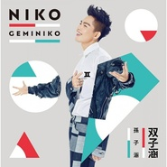

双子涵
============================

|  |  |
| :--: | :-- |
| [ 双子涵](https://emumo.xiami.com/album/2100352993) | **艺人**: [孙子涵](../index.md) **语种**: 国语 **唱片公司**: 简单快乐, 福茂唱片 **发行时间**: 2016年10月11日 **专辑类别**: 录音室专辑 **专辑风格**: 国语流行 Mandarin Pop **播放数**: 30379611 **收藏数**: 612 **评论数**: 39  |

## 简介

出 道 第 6 年 持 续 进 化I N G
 

20首热门金曲 大破20亿次 点击天量!
 

现在的我 就是 最 好 的 我
 

双 子 涵的多元世界现在为你全面解 锁
 

孙子涵《双子涵》
 

GEMINIKO
 
  

狂贺 &gt; 2016最新单曲《这孤独世界幸好有你》强势攻占各大权威排行榜冠军宝座！
 

创、作、唱、跳小天王 首次担纲制作。《双子涵》集结中、美、加乐坛当红战将鼎力加持！
 

《双子涵》台湾限定盘 特别加收：《晃着晃着就老了》、《总是那么傻》、《这孤独世界幸好有你》3首冠军单曲！
 
  

打破现实与理想的 界限准则
 

深度净化双子体内的 冰与火
 

打造流行音乐 
 

“叛逆New Era”孙子涵 vs. Niko华丽与内敛极致绽放 
 

2016 全新概念华语大碟
 

GEMINI + NIKO = 《双子涵》GEMINIKO
 

“ 强 • 裂 ” 推 荐
 
  

2016年，华语乐坛最“异数”音乐新人王Niko孙子涵，以全新专辑《双子涵》再度降临，绽放最真实“双子”涵性感光芒，点亮今秋最无比闪耀的流行氛围！。
 
  

双子的多变，在于你永远不知道他的世界里，刮的是什么风，却永远都生机盎然。自2015年底，Niko孙子涵在全球同步推出自己的“音乐III级跳计划”系列专辑，并在台湾首发实体专辑“壁咚 - 新辑金选”之后，除了宣传工作以及几个重要颁奖典礼，特地和公司商量，推掉所有的商演和活动，要去“体验生活这件事”。在长达3个月的时间里，子涵在前往看看世界的路上，顺便学习了hip-hop舞蹈。过程中，无意间开发了音乐大脑，深度了解Fusion Jazz、Rock &amp; Roll、West Coast Rap等各类型音乐。紧密行程却陆续交出全新demo，创作力大爆发。
 
  

出道已届满五年，Niko孙子涵从未停止挖掘音乐创作的乐趣与更多可能性，与生俱来的音乐天赋也不断为华语乐坛制造全新惊喜。这次，子涵尝试参与更多音乐制作的过程，从企划概念，到亲自邀约顶级编曲人来共同商讨和新歌编排的架构走向，器乐搭配及配唱录制等，连到制作后期、混音都贡献自己的想法和意见，跨出身为音乐人的一大步，令合作御用制作老师大赞“不可小觑”。在2016年10月11日全球同步发行的孙子涵概念华语大碟《双子涵》，汇集中、台、美、加最具前瞻视野并能持续创造趣味性的资深音乐人共襄盛举，最终收录10首Niko全新创作及制作的单曲，以极限动感及本色柔情的强烈对比作风，用5:5的绝对听觉界限，特调编排，要给歌迷们一个前所未见的Niko孙子涵。
 
  

在《双子涵》的概念专辑，双子的第一个子，全然呈现Niko孙子涵“最好的我”。柔软的内心尽泄流露，展现他从少年迈向男人，成长过程中的温柔与深情。
 
  

首波青春主打《最美不过初相见》，是在刚出道时就已经完成的创作，原本计划在第二张专辑中呈现，却在发行前，被英国知名冰淇淋品牌看中，“割爱”成为该品牌系列微电影的主题曲。在大陆引起广大回响的《最美的时光》正是Niko孙子涵曾以正青春的热烈与冲动，想要放肆示爱的证据。在时隔四年之后，将自己的感触重新凝练成词，并亲自重新对原曲进行编排与制作，赋予《最美不过初相见》这首全新升级的金曲更成熟的定义。在经过四年的成长与经历后，对那段虽然懵懂却单纯美好的时光里一切，充满了感恩、珍惜、遗憾和伤感，就像最初的我们或许不懂爱情，但最初的相见，会随着时间成为一生最美好的回忆。”这首歌咏青涩单纯爱恋滋味的曲子，特别献给曾经年轻，以及正处年轻的不同年龄层歌迷，永远不要忘记，那些年的初衷，在追梦的热血路上，不会迷失方向!揪心主打《回忆那么伤》，Niko孙子涵将简单勾勒出对年少时青涩恋情的回忆，赋予更多自己对于青春爱情的独特理解。或许只有当自己真正踏入这个世界，才开始渐渐懂得世事无常，才发现最珍贵的领悟，总带着最让人心痛的回忆。只是这一生一颗的真心，或许也只有在那个青涩懵懂的年纪里，才能这样全然交付。这次在台湾发行还特别搭配了热播的『芈月传』史无前例地同时成为片头/片尾曲，用最潮的当代音乐，跨越时空诉说着远古前人的记忆，映照情路多舛的芈月生平，更是无比感人。
 
  

孙子涵巧手将《傻傻等》整首歌的画面感变得更加丰富，把原本表达的一个人对于爱情的执着，在另一个人无法释怀的过去面前，从怀抱希望到渐渐无望的心理变化，深刻描绘。来台拍摄MV时，更碰巧遇上第1号台风“尼伯特”的肆虐，恶劣天候让拍摄计划一再延宕，果然让新科“雨神”Niko孙子涵《傻傻等》。慢板情歌《灰色》，充分展现子涵在挥洒抒情歌曲方面，一贯魅力十足的游刃唱功，简单的钢琴基调与子涵收放自如的声线渲染，让听者不知不觉在眼前勾勒出伤感浪漫却大气华丽的画面。歌词中反复出现“你的世界，稀里哗啦下着雪”，这别具一格的形容词，就是子涵最与众不同的独特，因为他将看似两种毫不相关的状态轻松融合，却让人感受到一种有着矛盾却没有冲突的另类和谐美感。而《谁对谁的好都不是应该的》是融入了子涵强烈音乐语言的一首歌，在录音前期曾私下练过不下100遍，仔细琢磨每一个细节上的声音处理后，却在录音当下，因为情感一时无法倾泻而泪洒录音棚，这也是出道至今，第一次在录音室为了一首歌而痛哭。原来在演唱过程中，更清晰的感知到自己从刚出道到现在，即使曾经面对来自家人和外界的质疑声，仍然不断鼓励自己要坚持走下去。在看似坚强无畏的巨大勇气里，始终包裹着让大众听见自己内心的柔软，以及对粉丝、家人和工作伙伴无法用语言诉说的强烈的爱。
 
  

在《双子涵》的概念专辑，双子的另一个子，是性感狂野，像黑夜中蔓延燃烧的燎原之火，像有理智却不受人控制的魔兽，且看音乐男神，尽情散发音乐荷尔蒙，释放双子涵的狂野纯粹!
 
  

刻意挑战国际化流行元素，强势挑动歌迷深层感官，两首态度鲜明、曲风前卫，充满极致诱惑的电音主打单曲，甫上线即惊艳众人耳朵。重拍魔咒发威的《你在纠结什么》，电力暴冲的歌词与性感热辣的旋律，令听者突破视听极限，当我们开始学习不纠结 ,勇敢展现自我,最自然的状态其实才是一个人的魅力所在。而子涵倾全力创作的《被》，则是抛出男女生“恋爱丛林法则”，化身“狩爱猎人”，以性感迷离的“坏”形象，赢得心爱女神的青睐，令人听的耳红心跳。另一首全新飙风创作《跳到太阳升起来》，及两首分别来自加拿大、台湾新锐音乐人的创作《一刀未剪》及《棒棒棒》，则为大家揭晓“现在的孙子涵”当下的音乐新态度。令人感到椅子坐不住、非得随之起舞的五首最hit单曲，炫技揉融全球最前卫的EDM、hip-hop、funky、世界风等音乐元素的舞池电音，为大家制造一波波高潮不间断的性感花火。这也让Niko孙子涵，他双子座的性格中，属于黑夜的原味叛逆狂野，终于得到全然解放！
 
  

“唱跳小天王“NIKO孙子涵2016全新华语专辑《双子涵》，
 

10首震动华语乐坛重磅力作 解锁“双子”涵的狂热与深情
 

台湾限定盘:特别加收3首数字音乐榜超冠军单曲!
 

打碎偶像定义 重构真实本色
 

还原“一刀未剪”的青春
 

坚持“跳到太阳升起来”
 

恣意挥洒音乐创作功力 “最美不过初相见” 
 

深情演译 “回忆那么伤”
 

现在的我 X 最好的我　最真实的 NIKO孙子涵

## 曲目

## 评论

|  |  |  |  |
| :-- | :-- | :-- | :-- |
|  [虾米用户](https://emumo.xiami.com/u/443193086)  2020-05-26 21:55 赞(0) 踩(0) | 
  
 |
|  [虾米用户](https://emumo.xiami.com/u/140284952)  2017-09-02 09:06 赞(0) 踩(0) | 
好好听噢
 |
|  [虾米用户](https://emumo.xiami.com/u/14725011)   2017-07-30 15:23 赞(0) 踩(0) | 
有些不支持试听，也没有购买的渠道 听不到 遗憾
 |
|  [虾米用户](https://emumo.xiami.com/u/309283819)  2017-07-09 09:37 赞(0) 踩(0) | 
涵的歌很好听，我喜欢了3年，他的歌我都有，并且都会唱，我永远支持你，涵～
 |
|  [虾米用户](https://emumo.xiami.com/u/194608448) 我们走吧！ 2017-06-11 10:00 赞(0) 踩(0) | 
很棒
 |
|  [虾米用户](https://emumo.xiami.com/u/194608448) 我们走吧！ 2017-06-11 10:00 赞(0) 踩(0) | 
很棒
 |
|  [虾米用户](https://emumo.xiami.com/u/290121343) 何智勇 2017-04-20 19:27 赞(0) 踩(0) | 
好好聽
 |
|  [虾米用户](https://emumo.xiami.com/u/250548227)  2016-11-28 16:56 赞(0) 踩(0) | 
我的偶像我来了  
 |
|  [虾米用户](https://emumo.xiami.com/u/250091557)  2016-11-27 00:21 赞(1) 踩(0) | 
哥，支持你！
 |
|  [虾米用户](https://emumo.xiami.com/u/247141774) together    ... 2016-11-18 20:37 赞(0) 踩(0) | 
好帅啊，，，，，
 |
|  [虾米用户](https://emumo.xiami.com/u/5611659) 安静在沸腾 2016-06-20 00:20 赞(0) 踩(0) | 
看到Lost7 的封面点了进来
 |
|  [虾米用户](https://emumo.xiami.com/u/146780154)  2016-06-16 19:10 赞(0) 踩(0) | 

 |
|  [虾米用户](https://emumo.xiami.com/u/146780154)  2016-06-16 19:08 赞(0) 踩(0) | 
你好吗
 |
|  [虾米用户](https://emumo.xiami.com/u/146780154)  2016-06-16 19:06 赞(0) 踩(0) | 
分钟后我家了吗
 |
|  [虾米用户](https://emumo.xiami.com/u/190620101)  2016-06-16 17:27 赞(1) 踩(0) | 
呃呃好听，我也喜欢孙子汉
 |
|  [虾米用户](https://emumo.xiami.com/u/190597759)   2016-06-16 16:07 赞(1) 踩(0) | 
1
 |
|  [虾米用户](https://emumo.xiami.com/u/171124270)  2016-06-16 04:00 赞(1) 踩(0) | 
啊，…你小子是辽宁大连的吧，支持一下吧，我流量用不完，浪费是最大的犯罪，告你哦，孙子，我是夜间上网，办的这个流量包很便宜，好了，说正事，我会一直靠免费下载你的歌曲来支持你的，我也是大连的，老乡哦，最后告虾米等中国大陆的下载网站！！！让我付费下载是不可能的！！！！！！！！要钱？？？不要脸！！！！！！
 |
|  [虾米用户](https://emumo.xiami.com/u/35747693) 暂无签名~ 2016-06-16 00:47 赞(1) 踩(0) | 
mv里那轮廓绝逼是冰岛！！！
 |
|  [虾米用户](https://emumo.xiami.com/u/44809694) 多想跟你在大雪天手牵手肩... 2016-06-15 13:20 赞(6) 踩(0) | 
夜。我的孙子。涵终于回来啦
 |
|  [虾米用户](https://emumo.xiami.com/u/174976776) 皇冠家的老困死和東君家的... 2016-06-15 13:13 赞(2) 踩(0) | 
孙子涵回归 哈哈
 |
| ⇒ |  [虾米用户](https://emumo.xiami.com/u/36057872) 网易/BC: Breat... 2016-06-16 16:12 赞(0) 踩(0) | 
<q><b>说：</b></q>
 |
|  [虾米用户](https://emumo.xiami.com/u/41967191) 奋不顾身到全身而退…… 2016-06-15 13:03 赞(4) 踩(0) | 
别的不说  封面是从孤单星球上扒下来的
 |
|  [虾米用户](https://emumo.xiami.com/u/51904919)  2016-06-15 11:19 赞(1) 踩(0) | 
喷子好多，不爱听干嘛点开呢。
 |
|  [虾米用户](https://emumo.xiami.com/u/189981653) 但愿我的少年明媚如昨 @... 2016-06-15 11:09 赞(1) 踩(0) | 
不错  第一次听他的歌
 |
|  [虾米用户](https://emumo.xiami.com/u/20153567) 我还没想好要写什么... 2016-06-15 11:09 赞(1) 踩(0) | 
真是什么样的专辑都能上虾米首页了
 |
|  [虾米用户](https://emumo.xiami.com/u/189607362) 只欢迎有素质的盆友基友～ 2016-06-14 23:31 赞(1) 踩(0) | 
希望继续加油～
 |
|  [虾米用户](https://emumo.xiami.com/u/478527) 好想跟衣服在洗衣机里滚 2016-06-14 19:29 赞(1) 踩(0) | 
已乐
 |
|  [虾米用户](https://emumo.xiami.com/u/478527) 好想跟衣服在洗衣机里滚 2016-06-14 19:29 赞(1) 踩(0) | 
已乐
 |
|  [虾米用户](https://emumo.xiami.com/u/906956)  2016-06-14 19:03 赞(1) 踩(0) | 
看这歌名就不喜欢！嘚瑟啥啊？
 |
|  [虾米用户](https://emumo.xiami.com/u/23093675) 我要吃饭！！ 2016-06-14 18:38 赞(1) 踩(0) | 
这孤独的世界幸好有你 那个你是谁呢
 |
| ⇒ |  [虾米用户](https://emumo.xiami.com/u/189996354)  2016-06-15 12:22 赞(0) 踩(0) | 
送你块提拉米米苏！希望赶紧找到你的那个你！<a href="http://www.xiami.com/song/1776154251?spm=a1z1s.6928797.1561534521.2.pGPJlv" target="_blank" rel="nofollow noreferrer noopener">http://www.xiami.com/song/1776154251?spm=a1z1s.6928797.1561534521.2.pGPJlv</a>
 |
|  [虾米用户](https://emumo.xiami.com/u/68351610)   2016-06-14 16:21 赞(1) 踩(0) | 
孙子涵是谁
 |
|  [虾米用户](https://emumo.xiami.com/u/189193893)  2016-06-14 14:59 赞(1) 踩(0) | 
这孤独的世界幸好有你@子涵
 |
|  [虾米用户](https://emumo.xiami.com/u/156970606) 我不够透明 2016-06-14 13:30 赞(5) 踩(0) | 
封面是Lost 7的插画吧，好美有美丽的鹿儿
 |
|  [虾米用户](https://emumo.xiami.com/u/77548870) 永远热爱音乐永远沉醉其中 2016-06-14 12:58 赞(2) 踩(0) | 
还挺好听
 |
|  [虾米用户](https://emumo.xiami.com/u/337365) 从今天起，做一个有趣的人... 2016-06-12 17:55 赞(1) 踩(0) | 
=￣ω￣=
 |
|  [虾米用户](https://emumo.xiami.com/u/16160797) 嗯。 2016-06-12 17:45 赞(1) 踩(0) | 

 |
|  [虾米用户](https://emumo.xiami.com/u/8244559)  2016-06-12 12:18 赞(1) 踩(0) | 
******
 |
|  [虾米用户](https://emumo.xiami.com/u/38918617) 你相信我，我相信你 2016-06-12 11:56 赞(1) 踩(0) | 
ye 孙子涵回来了~~
 |
