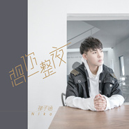

想你一整夜
============================

|  |  |
| :--: | :-- |
| [ 想你一整夜](https://emumo.xiami.com/album/2103643467) | **艺人**: [孙子涵](../index.md) **语种**: 国语 **唱片公司**: 简单快乐 **发行时间**: 2018年03月26日 **专辑类别**: EP, 单曲 **专辑风格**: 国语流行 Mandarin Pop **播放数**: 4746 **收藏数**: 26 **评论数**: 0  |

## 简介

“数位小天王”孙子涵 阔别两年  
第八张创作专辑 深情主打《想你一整夜》 ：  
最动人的爱情是 遗世独立  
而你占据 时间的每一帧画面  
如“日月星辰 旷野雨落”  
  
好久不见，一直被想念着的Niko孙子涵！ “数位小天王”Niko孙子涵第八张个人创作专辑，正式进入发布倒计时！第二波主打单曲《想你一整夜》已款款而至，深情上线，诉说离开的这段时间里，他和粉丝们之间的挂念！  
  
举办个人演唱会，参加商业性演出，并以青年优秀创作歌手的身份，参加央视“点赞中国”等多个大型晚会以及地方卫视春晚的录制，为多部当红IP改编的影视剧OST的创作及录制。粉丝们也陆续在多部热播视剧里，听见属于《你好旧时光》的校园民谣感的孙子涵，属于《我站在桥上看风景》甜美高糖的邻家孙子涵，属于《嗨！前任》里听到热血摇滚的孙子涵。也一直在等待，属于惜涵们的Niko孙子涵。  
  
虽然日常行程已经排满，但Niko一直都努力挤出有限的时间去和粉丝们进行互动，也会在行程中翻看着粉丝们给他的留言，“聆听”着粉丝们对他的想念，虽然距离上一张概念专辑《双子涵》发行过去近两年，但Niko孙子涵也在这段时间里，深刻体会到作为一个“聆听者”被信任着、被挂念着的幸福。就像这首属于大家想念的孙子涵全新单曲《想你一整夜》里，心情如同旋律版轻快甜蜜，而所有的回应，正如他所说的，都藏在歌词里，虽然不能每时每刻的互动，但每每想到惜涵们，心里自然充满了欢喜和继续做音乐的源源动力。  
  
18岁以学生歌手出道的孙子涵，像个劳模，每年都会给歌迷奉上个人创作专辑，24岁的年纪，累计发布了7张专辑，2张EP，超过20首影视原声，一本自传体故事书。这些歌曲创下了25亿的视听点击量，累计了260万的粉丝，获得了各类新人、歌手奖和年度十大金曲……这些接踵而至的肯定，激励着孙子涵，与日俱增的支持也羁绊着孙子涵，过了25岁的他，已经明确了想要为大家唱什么歌了。 所以，你准备好了吗？  
  
- 简单快乐 认真唱歌 -

## 曲目

## 评论

