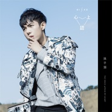

心上认
============================

|  |  |
| :--: | :-- |
| [ 心上认](https://emumo.xiami.com/album/2103706212) | **艺人**: [孙子涵](../index.md) **语种**: 国语 **唱片公司**: 福茂唱片 **发行时间**: 2018年05月18日 **专辑类别**: 录音室专辑 **专辑风格**: 流行 Pop **播放数**: 1587 **收藏数**: 16 **评论数**: 4  |

## 简介

阔别两年 “数位小天王”Niko孙子涵

2018.5.18全新创作专辑《心上认》

孙子涵：“开始承认，人和人无论多么不同，都长着一样的孤独与脆弱

也明白这些生命中有过的孤独时刻 让我们成为彼此的羁绊

人生有限，所以更珍惜走进别人心里那一刻的幸福感”

2018年5月18日， “数位小天王”Niko孙子涵，终于在万千歌迷的期待中发行了自己的全新创作专辑《心上认》。距离上一张概念专辑《双子涵》，已经过去了19个月。在过去的19个月里，孙子涵很忙。无论是在个唱的舞台中央，闭眼沉醉在音乐里的孙子涵，还是在游走不同城市的演出舞台上，始终热情如一的孙子涵，频频亮相央视和地方卫视春晚，分享正能量的青年优秀创作歌手Niko孙子涵，或是在《你好旧时光》、《我站在桥上看风景》、《嗨！前任》等多部热播视剧的OST里为大家呈现的或校园民谣，或甜美高糖，或热血摇滚等一系列风格迥异却面面皆俱的孙子涵。这张全新创作专辑《心上认》，正是Niko孙子涵在这19个月里，心情积累的整理，透过在工作中的人生，与人生的工作，双重意识形态交迭与游走的沿途，反复内省的成长纪录。

18岁出道的Niko孙子涵，至今发布了7张专辑，2张EP，超过20首影视原声，一本自传体故事书。创下25亿次的视听点击量，累计260万粉丝，收获国内各类权威音乐颁奖礼的新人奖、歌手奖以及年度十大金曲奖项。有人说生而为人是为了百炼成钢，而天才仅仅是为了游历这个世界。可是也许他们并不知道，天才之所以是天才，是他们天生就比别人多了一份敏感。自上一张专辑发布后，每一次访谈、每一场表演，每一首创作，每一次和制作人、导演对谈，每一个观众或粉丝的反应，孙子涵都在观察、揣摩、衡量。他说：唱跳歌手的两年，是他最“自己”的两年，被dancer簇拥在舞台中央表演，像一部情节紧凑又激烈的电影，企图每个手势，每个眼神，都带着强烈的“杀伤力”，打破台下台上的隔阂。可是当他唱起那些情歌时，歌迷的眼神随着灯光变得柔和，和他一起大合唱的刹那，他忽然觉得这些才是他最大的福气。这些歌，因他的感触而生，却一定也陪伴了一些人撑过他们人生中最脆弱的时刻。于是在发行了两张唱跳专辑后，在大家还在惊叹他的多元创造力和前卫先锋的音乐意识时，Niko孙子涵在19个月后还是毅然决然的决定推翻这一切，并因此有了《心上认》这张全新创作专辑。心上认，是孙子涵想要认真的坐下来，和他同龄的朋友、粉丝、陌生人说说心里话，如他自己所说： “歌在里讲我人生里那些和你们长得一样的痛，和快乐”。

赖伟锋x何庆远x陈磊x胡皓x黄中平x单啸天

最懂孙子涵的金牌制作班底 连袂打造

《还听人劝》《奖状》《想你一整夜》《乱了阵脚》

北京 台北 海外同步企划 “数字小天王”Niko首次 “无脸”出镜MV

Paulo Coelho（保罗·科埃略）说过：“没有一颗心，会因为追求梦想而受伤。当你真心渴望某样东西时，整个宇宙都会来帮忙。”而想要实现梦想，没有什么可以比与一群默契、信任的人一起前来助力，更幸福的事。在这张全新专辑《心上认》正式进入制作企划前，Niko孙子涵便已经在心里拟出了一份“邀请名单”：自己最好的朋友兼同门师兄Sam赖伟锋，亦师亦友的前辈何庆远老师，曾为Alin、信、潘玮柏、魏晨的专辑操刀的金牌制作人陈磊、先后为汪苏泷、金志文、牛奶咖啡组合的KIKI担纲制作的知名制作人胡皓、擅长唯美画面的金曲奖MV导演黄中平大师，以及从出道到现在，每张专辑都必不可少的单啸天导演。并在台北录制《心上认》专辑最后一首歌《内个女的》时，得知制作人在编曲过程中，特别请来业内“骨灰级”的吉他大神——倪方来前辈，为这首歌录制弦乐的部分。从制作到企划的一路顺遂，亦让Niko孙子涵内心极为感恩。

而最令他感觉奇妙的是，在台北与黄中平老师拍摄《奖状》这首歌的MV的当天，Niko才发现，女主角竟是四年前自己第一次到台北拍摄MV《不该再是旧的》的“老”搭档，当场惊讶的失笑：“隔了快两年才发片，连老天都忍不了我的拖延症，专门派熟人来帮忙。”在《奖状》这支MV拍摄上，黄中平大师也首次将时下网络流行的“恋人视角”融入到拍摄手法上，亦是Niko孙子涵首次尝试“无脸”出镜，从头至尾除了对嘴的部分，都以自身绑定小型Steadicam来完成。在得知Steadicam通常也会被用作战争主题的电影中刺激酷炫的场景拍摄时，Niko孙子涵体内的“直男因子”又冒出来了，直呼“好可惜，居然把第一次献给了爱情戏”。令在场工作人员难以忍住“翻白眼”的冲动，“回呛”他就是“劳碌命，爱自讨苦吃。”

“心上认”的诚恳剖白 “新上任”的温情守护

《心上认》是属于孙子涵的 “心上认”的故事是关于我们的

“数位小天王”Niko孙子涵首度袒露父子间甜蜜又苦涩的心声

亲情主打《爸爸的话》

从前，我们不知道，这个世界什么都可以再版、复刻，只有家里的那对儿爸妈，绝无仅有。我们一边成长，他们一边老去。

《爸爸的话》这首歌原本还有另外一个名字：《不争的活》，这是孙子涵在17年底他的爸爸对他说的一句话。由于在专辑作品的创作期间积累的身心压力倒是他声带疲累，引发旧疾，公司上决定延宕专辑制作计划，与Niko的父母商议，制定为期一个月的“强制收声”休假。在被“禁言”的日子里，他渐渐从最初的焦虑着急的情绪中走了出来，亦开始学习“倾听”父母和他分享日常生活的琐事，也从那开始，才发现记忆里曾对他要求可以称得上严苛的父亲，不知何时已变得宽容与慈祥，那个从前总会教育他“好男儿志在四方”的男人，如今竟也会偶尔拍着孙子涵的肩膀，耐心叮嘱和劝慰他“别太拼，为了事业累垮自己不值得”。那一刻，Niko觉得不管内心积压了多少，年少时曾被严厉训斥的阴影与抗拒，都在爸爸慈爱的眼神里，被一一瓦解。关于父母和亲情，或许是这世间唯一不需要修饰和描述，大家就都能一起百感交集的话题。于是，在创作《爸爸的话》这首歌的过程，几易手稿，最终Niko还是决定将他和父亲之间的对话原本记录下来，他也相信这是天下所有父母与子女之间都在发生着的，最日常又最伟大的故事。

《奖状》

在爱情里最好的奖状不外如是：我爱着的你，恰好也爱我。出道8年，对于将音乐创作视为生命一部分的Niko孙子涵，最大的犒赏不是工作室里陈列的奖杯，而是超过260万的惜涵们陪他一起走过了这8年的时光。

正如孙子涵自己所说，这一次专辑里所有的歌，都有一点“复古”的味道，不是对年少时光的致敬，而是在全新升级的音乐创作力，藏着惜涵们最熟悉的“涵式”曲风元素。随着在《奖状》这首歌令人心醉神迷的前奏响起，孙子涵带着一点自嘲式的唱腔，就这样施施然慵懒的撞入听者的心间，标准的“涵式”R&amp;B，相信也会带领你体会爱情甜涩的魔力。

《内个女的》

“数字小天王”Niko孙子涵，再次展露“双子涵”捉摸不定的跳脱天性，借音乐之名，“吐槽”与自己的好兄弟聚会过程中，被 “秀恩爱”的经历。有趣的是，在孙子涵将这首歌的demo交给公司的时候，在面对同事们“善意”安慰：“幸好你的心中只有工作。”一向反应极快的他，竟然一时语噎，半晌才仰头大喊：“可是，我也想谈恋爱啊！”

在《内个女的》这首歌中，孙子涵少见的流露出“醋意”，表达着 “三人行，必有灯泡”的无奈和失落，却也不难从欢快轻松的旋律中听得出，他对好朋友的新生活的最真诚的祝福。

- 简单快乐 认真唱歌 -

## 曲目

## 评论

|  |  |  |  |
| :-- | :-- | :-- | :-- |
|  [虾米用户](https://emumo.xiami.com/u/404814819)  2018-10-05 12:08 赞(0) 踩(0) | 
什么时候能有版权啊
 |
| ⇒ |  [虾米用户](https://emumo.xiami.com/u/97440220)  2019-04-13 16:19 赞(0) 踩(0) | 
只能去QQ音乐听。。。
 |
|  [虾米用户](https://emumo.xiami.com/u/374506949) 今天很残酷，明天更残酷，... 2018-09-23 00:12 赞(0) 踩(0) | 
我要听还听人劝
 |
|  [虾米用户](https://emumo.xiami.com/u/294177617)  2018-05-13 10:41 赞(3) 踩(0) | 
加油，子涵
 |
