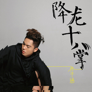

降龙十八掌
============================

|  |  |
| :--: | :-- |
| [ 降龙十八掌](https://emumo.xiami.com/album/472408) | **艺人**: [孙子涵](../index.md) **语种**: 国语 **唱片公司**: 简单快乐 **发行时间**: 2011年10月21日 **专辑类别**: EP, 单曲 **专辑风格**: 国语流行 Mandarin Pop **播放数**: 20364 **收藏数**: 69 **评论数**: 10  |

## 简介

每个女孩都希望她的生命里有过两个恋人：乔峰和段誉。  
&nbsp;
 

乔峰是让她永远默默守候，只在乘风波浪的疲惫后偶尔停靠身边的盖世英雄。一身金光盔甲灼灼光华连带女孩也一起灿烂，却难掩大多数时一地苍白如雪的寂寞。
 

段誉是给她永远吴侬软语，只会月圆花好的依依携手却胸无大志的花样少年。一双柔软如水温润如玉的双手温暖所有寒夜，也拖泥带水硬朗欠奉的勉强支撑半边天。
 

爱情总是半完美，每个选择都对应一种担当。  
&nbsp;
 

在唱作俱优、能文善舞、百炼成钢90后小侠Niko孙子涵的成长里，也有一段期盼从羸弱少年成长成盖世英雄的故事。故事就像很多男孩子的成长：遇见一个百分百女孩，于是希望练就一副宽阔的胸膛给她一个安全的停靠，一双有力的手给她一个实在的温暖，健一双壮的腿能带她去全世界流浪。孙子涵以为，随着自己的“完美”，爱情就会从半完美成完满，他们就可以携手去流浪。 只是女孩有时候要的不仅仅是乔峰的英雄气概，更多时候是希望身边有一个段誉般可贴身取暖的安全感。于是爱情的半完美变成了未完的情节，也变成了孙子涵的这首单曲《降龙十八掌》。  
&nbsp;
 

在Niko孙子涵首张个人专辑《一年一度的夏天》发表并倍受好评后，不仅人气聚升，外形阳光帅气又个性十足的90后代言人形象，也逐渐改变了传统媒体对90后的偏见和观感，因此很快收到国内著名网游公司骏梦游戏的邀请，为其创作并演唱该公司出品的同名游戏主题曲《降龙十八掌》。在受邀创作时，孙子涵别具一格的放弃了网游主题曲习惯的中国风式曲风，而是把诉求点放在以情感人，以声动人的作品表达上。同时也将感情中常见如“降龙十八掌”这样爱得至刚至猛却伤得如“黯然销魂掌”的故事，通过“何意百炼刚，化为绕指柔”意想不到的方式委婉而动听的诠释。于是，不到一天时间一气呵成的交卷作品即让游戏公司意外又让大家叫好，遂决定险中奇招的以这首绕至版《降龙十八掌》作为游戏主题曲。

## 曲目

## 评论

|  |  |  |
| :-- | :-- | :-- |
|  [虾米用户](https://emumo.xiami.com/u/55508055)  2015-08-29 06:47 赞(0) 踩(0) | 
好
 |
|  [虾米用户](https://emumo.xiami.com/u/55508055)  2015-08-29 06:47 赞(0) 踩(0) | 
好
 |
|  [虾米用户](https://emumo.xiami.com/u/49560210) 我希望早上叫我起床的，不... 2015-04-25 16:53 赞(0) 踩(0) | 
帅！！！！！！！！！
 |
|  [虾米用户](https://emumo.xiami.com/u/13194141) 企鹅号976999737... 2014-05-11 17:57 赞(0) 踩(0) | 
降龙十八掌
 |
|  [虾米用户](https://emumo.xiami.com/u/1453136) hi, there 2012-06-03 17:36 赞(0) 踩(0) | 
喜欢
 |
|  [虾米用户](https://emumo.xiami.com/u/9356642)  2012-06-02 11:38 赞(0) 踩(0) | 
谁舍不得谁
 |
|  [虾米用户](https://emumo.xiami.com/u/1099357) 我还没想好要写什么... 2012-05-16 17:53 赞(0) 踩(0) | 
3
 |
|  [虾米用户](https://emumo.xiami.com/u/7132810)  2011-12-06 23:55 赞(0) 踩(0) | 
狠喜欢 狠喜欢
 |
|  [虾米用户](https://emumo.xiami.com/u/6938622)  2011-11-24 16:25 赞(0) 踩(0) | 
喜欢
 |
|  [虾米用户](https://emumo.xiami.com/u/6422426)  2011-10-25 11:00 赞(0) 踩(0) | 
稀饭类。。
 |
