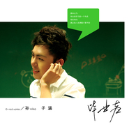

毕业声
============================

|  |  |
| :--: | :-- |
| [ 毕业声](https://emumo.xiami.com/album/513488) | **艺人**: [孙子涵](../index.md) **语种**: 国语 **唱片公司**: 简单快乐 **发行时间**: 2012年05月11日 **专辑类别**: 录音室专辑 **专辑风格**: 国语流行 Mandarin Pop **播放数**: 1055561 **收藏数**: 413 **评论数**: 73  |

## 简介

1 关于“我们的毕业声” 

&nbsp;
 

即使又到了该说再见的时候，命运指向分岔的路口。
 

即使拥抱可能是最后的温度，挥挥手消失在记忆中。
 

最后一场考试，篮球消失在空中的弧线；还给图书馆的书，操场上随着阳光消失的晨露；
 

昨夜陪你走过的足印，耳机里孙子涵的歌，在心底唱了一遍又一遍；
 

我知道，那全是离别的躁动。
 

&nbsp;
 

曾经无比的期望，在这一日真正到来，却发现竟有如此多不舍。
 

曾经以为爱便是一切，到了今天，才知道有些选择竟是身不由己。
 

曾经计划要狠狠地想念，没算到还未分别已开始想你。
 

曾 经 我 们。
 

&nbsp;
 

但愿你道路漫长，可以得到我们梦想过的一切。
 

但愿时光荏苒，再见面时，你还我那脸熟悉的笑，像不曾分别。
 

但愿一直记得你的心事，但愿我们永远都不会忘记。
 

但 愿 我 们。
 

&nbsp;
 

那些旧感情，那些新世界，那些青春，那些回忆。
 

那些执着，那些遗憾，那些勇气，那些决绝。
 

那些不舍，那些甜蜜，那些憧憬，那些爱。
 

是我们共同的毕业声。
 

&nbsp;
 

2 关于“新好学生”孙子涵
 

&nbsp;
 

如果说《全世界宣布爱你》的悄然走红来自幸运和恩典。
 

《毕业声》专辑十首全新作品的创作和完成，付出的努力只有孙子涵自己知道。
 

&nbsp;
 

穿梭于学校和舞台的学生歌手双重身份，既要完成治学严谨的理工大学所有艰深课业,还要从零开始边学边适应小小大大的娱乐通告。
 

因为有更高的自我目标期望，还要坚持每天3个小时以上的舞蹈和形体训练；
 

因为对生命厚度的好奇和自我探索，每天都是大量的阅读和反思；
 

因为对音乐有无穷尽的灵感，从2011年9月到2012年1月，独立创作完成近百首Demo。
 

一切的成绩，来自天赋，更来自黑夜减少睡眠、减少娱乐的点滴累积。
 

&nbsp;
 

孙子涵，从来都不是传统型“三好学生”。
 

他会为了通告缺席一些课时，他也会连续通宵的K书补课，高分通过所有课程。
 

他会马马虎虎的又掉钱包，他也会细心贴心的在零点时分给歌迷送上生日祝福。
 

他会在制作人前辈面前勇敢表达“不一样”的创作想法，他也会在制作间歇给老师们捶背柔肩，他说这手法也是子涵妈妈的最爱。
 

他会对朋友好到“全世界都否定你我也站在你这边”，他也会练就一身过人的散打去对抗邪恶的暴力。
 

他就是这么不循规蹈矩，他常常令人哭笑不得。
 

他内心有一个很大的世界，他散发出一种奇特气场的能量。
 

他就是某种新好学生的示范——孙子涵。
 

&nbsp;
 

3 关于“《毕业声》专辑”
 

&nbsp;
 

这张专辑是充满企图心的。
 

&nbsp;
 

孙子涵从来没有隐藏对周杰伦的喜爱，因为那是子涵青春期所有正能量的来源，是将梦想一步步照进现实的路径指引。
 

可是孙子涵也从来没有将自己停留在对周杰伦的模仿，因为他明白他要走的更远，才能为新一代的小盆友做出正确示范。
 

&nbsp;
 

为了“涵式唱腔”的炼成。唱片公司特别邀请资深型制作人周治平、中流砥柱型制作人吕忠训和新锐型制作人赖伟峰担任本张唱片的配唱制作人。
 

三代音乐人联手魔鬼式操练孙子涵，激发潜能，挑战极限，可以连续三天录音室一首歌的反复磨练，可以一个句子翻来覆去的唱腔尝试，目的只为探索“涵式唱腔”的可能性。
 

所以，在这张专辑里，既有《如果回忆能死》摇滚式的呐喊，也有《一千个分手的理由》荡气回肠的吟唱。既有《那些学校没有教过的事儿》RNB式的动感甜美，也有《想回从前的时空》民谣式的清纯悠长。
 

&nbsp;
 

专辑制作班底整合了中、台、日、韩、美等五地国际新锐音乐人，不同地域的创作理念，带来不一样的火花碰撞，即保证音乐品质的时尚和前瞻性，也最大限度的保留了孙子涵式的诚恳和勇敢。
 

每一首歌都不一样，每一首歌也都是孙子涵。
 

就像毕业，并非只有单一的情绪。它是用不舍、勇气、执著、憧憬、决绝交织在一起的“爱”。
 

所以，《毕业后你不是我的》单曲后，继续《毕业声》专辑。
 

&nbsp;
 

就像专辑封套文案所说“原本以为，毕业是学习的一个句点。现在明白，真正的人生课题才要开始。”孙子涵的《毕业声》专辑也是一个涵式“逗号”，精彩刚开始，惊喜未完待续。
 

&nbsp;
 

4 关于毕业声的“名词解释”
 

&nbsp;
 

#1 决绝——《如果回忆能死》
 

成长如同暗夜里注入的一支兴奋剂，我看见前面的光，听着周围的鼓舞，那是心底的呼唤。
 

暂时忘掉回忆，姑且放下思念，太新鲜太忙碌太激烈，在过去与未来之间，我只见到后者。
 

&nbsp;
 

#2 勇气——《那些学校没有教过的事儿》
 

不会有人告诉我该怎样开口，尽管在心中已念到滚瓜烂熟。
 

不会有测验是爱你的方式，我知道的惟一是唱给你听的歌。
 

再不开口，爱会不会显得太迟。
 

再不拥抱，你还是不是属于我。
 

&nbsp;
 

#3 遗憾——《一千个分手的理由》
 

如果很多年后想起当年说过的话，该不该遗憾决定做得太仓促；
 

如果很多年后想起今天的离别，要不要感慨毕竟年少气盛过；
 

如果很多年后再想起你想起我，是甜蜜，还是哀愁？
 

其实，我们并没有如果??
 

&nbsp;
 

#4 不舍——《想回从前的时空》
 

微黄的路灯在你脸颊泛起的光，伸手抚摸，它却滑走。
 

蓝黑墨水画在课桌角落的笑脸，不用说，那是我们一次次秘密的邂逅。
 

我还想和你一起走过每一个黄昏，任你坐我旁边翻一本书，一个字也不用不说。
 

那会是我永远的回忆，不变的歌。
 

&nbsp;
 

#5 执着——《耳机分半》
 

耳机分你一半的快乐，双手插在我口袋的快乐，有你在我身边的快乐。
 

第一次靠近你的快乐，头依偎在我肩上的快乐，不想让你的走的执着。
 

&nbsp;
 

#6 憧憬——《人生下站见》
 

卖掉的课本是结束，手写的留言是开始，这个季节流淌着告别的味道，该说再见的时候，我会记得你的笑脸。
 

留恋的校园是结束，未知的旅程是开始，如果现在就必须回忆，有太多画面要打包进行李，然后你说，下站再见。
 

回忆绽在心头的花，哀而不伤。
 

&nbsp;
 

#7 幸——《对待坏女孩》
 

每个男孩总会遇到与他年纪相仿的导师，那个女孩，教他浪漫，教他快乐，教他心痛，教他成熟。
 

庆幸我遇到的是你，让我知道快乐可以很简单，悲伤来得快去得也快，成熟，也没有想象的复杂。
 

&nbsp;
 

#8 沮丧——《约定好的》
 

如果你爱的不是我，原以为还可以变成那一个；
 

假使那一分钟你爱过我，所有的付出也都足够；
 

曾以为一切都是约定，于是一厢情愿毫不保留；
 

但你还是你，我还是我，你不爱我，我却爱过。
 

&nbsp;
 

#9 未完——《对着背影说爱你》
 

在结束之前，一切都可能发生；在青春之时，一切都不会结束。
 

看着你背影消失在路的尽头，爱却在心头继续，那是我和你未完的故事，即使你想要画上休止符。
 

那故事不仅属于你，更属于我。
 

&nbsp;
 

#10 爱——《毕业后你不是我的》
 

如果代价是要输了你，我还记得和你有过的全部；
 

如果你将不再是我的，再相聚时，我会微笑着挥挥手；
 

流过的泪，写过的信，带你走过的路，和你共同呼吸的空气，唱过的情歌，全被合在最后那本书中。
 

我知道，不爱，也是爱的一部分。

## 曲目

## 评论

|  |  |  |
| :-- | :-- | :-- |
|  [虾米用户](https://emumo.xiami.com/u/29270043)  2018-02-14 23:26 赞(0) 踩(0) | 
毕业后你不是我的
 |
|  [虾米用户](https://emumo.xiami.com/u/329014064)  2017-11-13 15:40 赞(0) 踩(0) | 
这。。
 |
|  [虾米用户](https://emumo.xiami.com/u/257816423)  2017-09-28 00:24 赞(0) 踩(0) | 
好多歌不能听了， 心塞
 |
|  [虾米用户](https://emumo.xiami.com/u/291807736)  2017-04-27 15:47 赞(0) 踩(0) | 
每个人的有毕业的时候
 |
|  [虾米用户](https://emumo.xiami.com/u/207962207)  2016-08-02 16:41 赞(0) 踩(0) | 
舍不得
 |
|  [虾米用户](https://emumo.xiami.com/u/51813101)  2015-11-09 12:07 赞(0) 踩(0) | 
孙子涵帅帅哒！同意的赞
 |
|  [虾米用户](https://emumo.xiami.com/u/76581848)  2015-10-30 11:42 赞(0) 踩(0) | 
帅！！！！！！！☞！！！！！☞孙子涵        帅
 |
|  [虾米用户](https://emumo.xiami.com/u/49560210) 我希望早上叫我起床的，不... 2015-04-25 16:54 赞(0) 踩(0) | 
帅！！！！！孙子涵，节奏好听，涵式风格
 |
|  [虾米用户](https://emumo.xiami.com/u/13194141) 企鹅号976999737... 2015-02-20 21:06 赞(0) 踩(0) | 
♭ ♪ ♬ collect　again
 |
|  [虾米用户](https://emumo.xiami.com/u/33044197) yi510.com 2014-11-27 14:45 赞(1) 踩(0) | 
清新的节奏，回忆那些年。<a href="http://www.garymm.com/" target="_blank" rel="nofollow noreferrer noopener">http://www.garymm.com/</a>
 |
|  [虾米用户](https://emumo.xiami.com/u/1609946) 一即一切 2014-03-01 17:15 赞(0) 踩(0) | 
心 境不二
 |
|  [虾米用户](https://emumo.xiami.com/u/7771399) High functio... 2012-07-26 10:24 赞(0) 踩(0) | 
不错的！
 |
|  [虾米用户](https://emumo.xiami.com/u/2697646) 哈牛柚子露 2012-06-22 18:28 赞(0) 踩(0) | 
好久没收藏歌曲了最近只是签到- -找了一个关于毕业的献给毕业季。
 |
|  [虾米用户](https://emumo.xiami.com/u/4225495) ♪ ♬♩ 2012-06-04 02:41 赞(0) 踩(0) | 
清醒の、安静の、有点周末味道...。
 |
|  [虾米用户](https://emumo.xiami.com/u/1453136) hi, there 2012-06-03 17:36 赞(0) 踩(0) | 
很清新
 |
|  [虾米用户](https://emumo.xiami.com/u/3888847)  2012-06-02 21:44 赞(0) 踩(0) | 
送给马上要留校的师兄师姐们 祝你们永远开心 顺利
 |
|  [虾米用户](https://emumo.xiami.com/u/9356642)  2012-06-02 11:36 赞(0) 踩(0) | 
毕业那年我们在校园外的马路上游荡1夜毕业那年谁哭着到离别毕业那年谁在黑夜操场上买醉毕业那年谁丢失了谁
 |
|  [虾米用户](https://emumo.xiami.com/u/8554303)  2012-05-25 10:20 赞(0) 踩(0) | 
0.0
 |
|  [虾米用户](https://emumo.xiami.com/u/9268320)  2012-05-24 16:59 赞(0) 踩(0) | 
到时候留着用
 |
|  [虾米用户](https://emumo.xiami.com/u/7663792) 我还没想好要写什么... 2012-05-22 13:50 赞(0) 踩(0) | 
喜欢这曲风~更爱他声音~
 |
|  [虾米用户](https://emumo.xiami.com/u/8573376)  2012-05-21 23:10 赞(0) 踩(0) | 
孙子涵的唱功在改进了
 |
|  [虾米用户](https://emumo.xiami.com/u/8573376)  2012-05-21 23:09 赞(0) 踩(0) | 
挺喜欢孙子涵的，其实有些还好啦
 |
|  [虾米用户](https://emumo.xiami.com/u/345236) 你的心事一点点、一遍遍、... 2012-05-21 12:44 赞(0) 踩(0) | 
意义大于内容，不喜欢这声音，太做作....
 |
|  [虾米用户](https://emumo.xiami.com/u/9232533) 相爱或者死亡 2012-05-20 18:05 赞(0) 踩(0) | 
人生下站见歌词很心声啊毕业快了1定会怀念那些我们在溢满阳光的午后躺在操场上聊天的岁月
 |
|  [虾米用户](https://emumo.xiami.com/u/3629214)  2012-05-20 16:40 赞(0) 踩(0) | 
有一年毕业季 还是顶一下吧 ~。~
 |
|  [虾米用户](https://emumo.xiami.com/u/9230045) 一次不忠百次不用 2012-05-20 14:10 赞(0) 踩(0) | 
又到了该说再见的时候命运指向分岔的路口
 |
|  [虾米用户](https://emumo.xiami.com/u/7585998)  2012-05-20 11:39 赞(0) 踩(0) | 
拓麻的！以为能感动我鼻酸眼红，热泪盈眶！没想到这么难听！！！FUCK！
 |
|  [虾米用户](https://emumo.xiami.com/u/2102200) When you wis... 2012-05-20 10:36 赞(0) 踩(0) | 
不好听，声音还这么柔媚
 |
|  [虾米用户](https://emumo.xiami.com/u/8643483)  2012-05-20 10:34 赞(0) 踩(0) | 
我即将毕业，寻找同样的感觉
 |
|  [虾米用户](https://emumo.xiami.com/u/5815393) 落单续 2012-05-20 06:55 赞(0) 踩(0) | 
我们的毕业之声
 |
|  [虾米用户](https://emumo.xiami.com/u/3222075)  2012-05-20 02:56 赞(0) 踩(0) | 
这说高中的感情吧
 |
|  [虾米用户](https://emumo.xiami.com/u/9156994) oops! 2012-05-20 01:58 赞(0) 踩(0) | 
毕业了......
 |
|  [虾米用户](https://emumo.xiami.com/u/2748709)  2012-05-19 17:32 赞(0) 踩(0) | 
还有19天
 |
|  [虾米用户](https://emumo.xiami.com/u/3642296)  2012-05-19 16:03 赞(0) 踩(0) | 
我们要毕业了。
 |
|  [虾米用户](https://emumo.xiami.com/u/9219841)  2012-05-19 14:45 赞(0) 踩(0) | 
还可以
 |
|  [虾米用户](https://emumo.xiami.com/u/9219862)  2012-05-19 14:30 赞(0) 踩(0) | 
毕业的声音
 |
|  [虾米用户](https://emumo.xiami.com/u/5784876)  2012-05-19 11:26 赞(0) 踩(0) | 
我喜欢
 |
|  [虾米用户](https://emumo.xiami.com/u/169598)  2012-05-19 10:51 赞(0) 踩(0) | 
也快畢業了~~~~~畢業的孩子，畢業快樂！
 |
|  [虾米用户](https://emumo.xiami.com/u/8906144)  2012-05-19 06:09 赞(0) 踩(0) | 
……
 |
|  [虾米用户](https://emumo.xiami.com/u/2362527) 我还没想好要写什么... 2012-05-18 23:20 赞(0) 踩(0) | 
这个伤感的毕业季
 |
|  [虾米用户](https://emumo.xiami.com/u/9214793)  2012-05-18 23:00 赞(0) 踩(0) | 
我喜欢
 |
|  [虾米用户](https://emumo.xiami.com/u/9205585)  2012-05-18 18:36 赞(0) 踩(0) | 
fem0n音乐社人力大征集如果你是90后就可以加入qq群105673929不论你是什么风格不论你是演唱作词作曲编曲还是后期都可以在这里和社员们共同学习进步
 |
|  [虾米用户](https://emumo.xiami.com/u/1206439)  2012-05-18 16:47 赞(0) 踩(0) | 
很适合这个季节，这个时期。
 |
|  [虾米用户](https://emumo.xiami.com/u/1723819)  2012-05-18 13:51 赞(0) 踩(0) | 
要毕业啦
 |
|  [虾米用户](https://emumo.xiami.com/u/6762407) 只有音乐最安全 2012-05-18 13:41 赞(0) 踩(0) | 
以前觉得毕业遥遥无期，如今我已经离校了，听听毕业的声音，感谢“毕业声”
 |
|  [虾米用户](https://emumo.xiami.com/u/3394135)  2012-05-18 13:41 赞(0) 踩(0) | 
毕业后你不是我的，那些我们共度的时光都随着毕业一起消散在笙箫中，埋藏在记忆的深处。
 |
|  [虾米用户](https://emumo.xiami.com/u/9208959) 唯我独尊 2012-05-18 12:00 赞(0) 踩(0) | 
临近毕业了
 |
|  [虾米用户](https://emumo.xiami.com/u/9184089)  2012-05-18 11:48 赞(0) 踩(0) | 
我们的声音
 |
|  [虾米用户](https://emumo.xiami.com/u/5417842)  2012-05-18 11:18 赞(0) 踩(0) | 
我是看到了歌曲名字进来的，挺好听的，毕业在即，挺伤感的~~
 |
|  [虾米用户](https://emumo.xiami.com/u/4804) 签~啊名~啊~签了个名 2012-05-18 01:21 赞(0) 踩(0) | 
巨蟹座很难抗拒毕业主题
 |
|  [虾米用户](https://emumo.xiami.com/u/8598833)  2012-05-17 22:15 赞(0) 踩(0) | 
喜欢你的调调~
 |
|  [虾米用户](https://emumo.xiami.com/u/9026226)  2012-05-17 21:15 赞(0) 踩(0) | 
好干净的声音，好干净的情感……
 |
|  [虾米用户](https://emumo.xiami.com/u/7033180)  2012-05-17 20:44 赞(0) 踩(0) | 
很好听，想到高中毕业那时的情景，歌曲中刚去选路非常能引起共鸣。。。。。。
 |
|  [虾米用户](https://emumo.xiami.com/u/2666577)  2012-05-17 19:28 赞(0) 踩(0) | 
唉。。。还有十几天就要告别高中生活了。。。。
 |
|  [虾米用户](https://emumo.xiami.com/u/9026226)  2012-05-17 19:01 赞(0) 踩(0) | 
伤感毕业季
 |
|  [虾米用户](https://emumo.xiami.com/u/2704671)  2012-05-17 18:41 赞(0) 踩(0) | 
又是一年毕业时。
 |
|  [虾米用户](https://emumo.xiami.com/u/9202383)  2012-05-17 16:57 赞(0) 踩(0) | 
风格虽然大众但是声音很不错而且歌曲点找得很好人性对毕业这个词是很敏感的所以会引起大家的共鸣
 |
|  [虾米用户](https://emumo.xiami.com/u/8601290) 远在远方的风，比远方更远 2012-05-17 11:42 赞(0) 踩(0) | 
又逢毕业季，有几多感伤，恨离别，分离殇。 雨打栀子花瓣，白英满地，祭奠和你们一起有过的青春， 那峥嵘岁月，你可会怀念~
 |
|  [虾米用户](https://emumo.xiami.com/u/3907263) 谢谢！ 2012-05-17 10:31 赞(0) 踩(0) | 
好音乐值得分享
 |
|  [虾米用户](https://emumo.xiami.com/u/5780213)  2012-05-17 04:21 赞(0) 踩(0) | 
bye
 |
|  [虾米用户](https://emumo.xiami.com/u/1798)  2012-05-17 01:20 赞(1) 踩(0) | 
虽然90后，是有诚恳度的唱片。
 |
|  [虾米用户](https://emumo.xiami.com/u/1016866)  2012-05-16 22:56 赞(0) 踩(0) | 
欢喜这样的主题 大毕业季 献给永远的22岁！
 |
|  [虾米用户](https://emumo.xiami.com/u/7071113)  2012-05-16 21:07 赞(0) 踩(0) | 
这个我有下。还不错
 |
|  [虾米用户](https://emumo.xiami.com/u/9030006) 心情说给音乐听 2012-05-16 17:47 赞(0) 踩(0) | 
毕业季，需要这样的声音。
 |
|  [虾米用户](https://emumo.xiami.com/u/9192826)  2012-05-16 17:08 赞(0) 踩(0) | 
年轻活力我们都经历过
 |
|  [虾米用户](https://emumo.xiami.com/u/4756546)  2012-05-16 16:22 赞(0) 踩(0) | 
即将毕业了
 |
|  [虾米用户](https://emumo.xiami.com/u/998350)  2012-05-16 16:16 赞(0) 踩(0) | 
即使又到了该说再见的时候，命运指向分岔的路口。 即使拥抱可能是最后的温度，挥挥手消失在记忆中。 那些旧感情，那些新世界，那些青春，那些回忆。 那些执着，那些遗憾，那些勇气，那些决绝。 那些不舍，那些甜蜜，那些憧憬，那些爱。 是我们共同的毕业声。
 |
|  [虾米用户](https://emumo.xiami.com/u/5047798) 故事平淡但当中有你  已... 2012-05-16 15:07 赞(0) 踩(0) | 
不错~~~要毕业的人了呀~~~~
 |
|  [虾米用户](https://emumo.xiami.com/u/843363) 梵我两忘 2012-05-16 15:07 赞(0) 踩(0) | 
毕业了，听听
 |
|  [虾米用户](https://emumo.xiami.com/u/973363) 自己喜欢的自己知道 2012-05-15 13:55 赞(0) 踩(0) | 
到了毕业的时候啦，听听
 |
|  [虾米用户](https://emumo.xiami.com/u/5105646)  2012-05-15 07:38 赞(0) 踩(0) | 
声音不错。
 |
|  [虾米用户](https://emumo.xiami.com/u/8249286) 只是来听歌。 2012-05-14 15:09 赞(0) 踩(0) | 
写出了即将毕业的心情，虽然是明年，可是看着师兄师姐他们离开，自己内心总会像很多很多..
 |
|  [虾米用户](https://emumo.xiami.com/u/4374818)  2012-05-14 15:00 赞(0) 踩(0) | 
还记得毕业的那一年么...
 |
