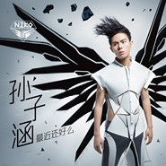

最近还好么
============================

|  |  |
| :--: | :-- |
| [ 最近还好么](https://emumo.xiami.com/album/871456935) | **艺人**: [孙子涵](../index.md) **语种**: 国语 **唱片公司**: 简单快乐 **发行时间**: 2013年06月18日 **专辑类别**: 录音室专辑 **专辑风格**: 国语流行 Mandarin Pop **播放数**: 5076803 **收藏数**: 367 **评论数**: 22  |

## 简介

Hi，最近还好么？——我是孙子涵。  
  
一直在想，在第三张专辑要送到你手里前，如何好好的和，也许仍然还不熟悉我的你说点什么。  
  
2012年7月底，经纪人告诉我，唱片公司考虑要为我筹备第三张个人创作专辑。还在为上一张专辑《毕业声》宣传期中出现的一些失误而不安的我，开始为还没发生的事担心：自己究竟够不够资格继续走下去？虽然心底有个声音不停念叨着“我可以！”于是在半年的时间里沉寂，修炼、调整和寻找。  
  
2013年1月28日  128首Demo，一轮轮的筛选后仅剩10首，成功率百分之8.3的无限循环。整个寒假，我就在歌词的修改、修改、再修改的无限循环中度过。看着已经被修改过无数次的歌词，我开始觉得恶心！为什么？为什么？我就是达不到他们的要求？我想告诉制作人“放弃”，但说不出口——可以承认“我错了”，但绝对不接受自己“创作不OK”！  
  
2月25日  录音计划被推迟，因为几位编曲老师和配唱制作人老师出现的工作状况，甚至连录音棚的预约都突然不可控，虽然知道公司在解决和协调，可是我仍然很焦虑，我很想去问一个“为什么”，最终还是默默得去修改我该死的歌词。潜意识里害怕“这是因为我不够好”吧。有时候，一句“不够好“，足以抵消你所有能讨价还价的资格。  
  
3月1日  陷入了一种烦躁和抑郁中。一位叫汐汐的“惜涵”病逝了，心里很难受，却无能为力。我一直都知道这个世界存在着不公平，可是当真的面对它的时候，永远都不可能准备好。忽然发现一个残酷的事情：你活在青春里，却没法去做青春里应该做的事。很多“惜涵”如此，我如此，汐汐，更如此! 瞬间觉得，我写的那些励志歌曲，好渺小。  
  
3月20日 很累。真的很累！为了申请校外实习，学校制定了一系列的严格考试。没时间打篮球、玩游戏，甚至没时间睡觉。只有上课，复习，考试，改歌词，磨合旋律。好吧，一切都是自作自受，我想要赢，想要红，想要做一个可以骄傲晒出作品的歌手！所以，是的，孙子涵，你必须要承受得起这份孤独。  

  
3月25日 我迫切的想要去了解：我一直在努力的，用所有时间拼命做的音乐，最后是否能得到别人的欣赏？我不知道未来我会拥有什么，我只看到现在我失去了什么。这些情绪挤压着我，喘不过气。考试后，我一路狂奔到郊区的寺庙前，想要去找里面的师父求一个解答。可到了门口的时，已经腿软的我只想着找一块石头坐下来休息。坐在寺庙的门口，看着蓝天、白云、轻风、浅溪，突然世界都静了，什么都没想，却什么都通了，被人不看好又如何？专辑不受欢迎又如何？最起码，现在还能快乐的唱歌，这不就是我的初衷么？   
  
4月3日  回北京录音。在机场与潇潇姐擦肩而过却无缘相见，这位已经和我三度合作的好友，已经提前录完音，回美国继续学业。路上，我看着车窗外，北京一贯灰黄的天，一架飞机掠过，声音被周围的杂音掩盖，是不是有很多朋友，都是以悄无声息的方式离场，不能再见？  
  
4月10日 连续数日录音不顺。喉镜检查，被诊为“咽喉炎引发声带炎”，需禁声一周，吃无数药丸。看到报告单无比沮丧，录音进度肯定delay了，发片日期也会相应推迟吧。转念后又暗暗开心，还好不是更严重的病，休息休息就好，虽不能发声，但有更多时间可以练习舞蹈，每次舞蹈课结束，回家复习动作1000遍！  
  
4月16日  终于能录音了，状态极佳，录音结束却被同事告知“大牌佳音突然对媒体发函，禁止媒体对我宣传”。虽然公司同事安慰我，公司已经着手处理，也不会对我造成实际影响。但心里忍不住难受！你永远都不知道，生活和你下的到底是什么棋，以为柳暗花明了，又尾随一个晴天霹雳。看着镜子里的自己，我又一次困惑了。  
  
4月20日  感冒、输液。这一天，我为可爱多创作的广告歌《这一刻，爱吧》正式发布。这一天，雅安地震，看着网路上各种沉重的报道，心情再一次down到谷底。也再一次因为自己的渺小和能力有限，感到无力和失望。  
  
4月28日  平面拍摄。公司为我准备了一副10公斤的翅膀，我要做超人啦！9个小时拍摄， 3次造型，8套服装。时间很紧张，顾不上吃工作餐，只喝了一杯黑咖啡的我心里想着结束时一定要吃顿好的，但真的结束的时候，我只想回去睡觉。  
  
4月30日  MV的绿幕拍摄。为了这一天，我练了很久，前一天晚上仍然紧张，偷练到凌晨2点。 但好在，连续8小时的拍摄，我做到了，连一向对我严格的公司同事都说不错。我想，我在一点一点的找回，我的翅膀！我想要和音乐一起飞。  
  
5月1-10日 录音、录音、录音；MV、MV、MV；拍摄、拍摄、拍摄。终于把自己调频到艺人最佳状态。  
  
5月12日 最后一首歌也录完了。我的工作部分，暂告一段落。庆幸的是，不管艰难或顺利，不管是坚持或放弃，生活都在进行着，不同的选择，不同的结果。而我不会放弃，以前是，现在是，以后更是。现在，我依然籍籍无名，我仍然唱着稚嫩的歌，但我会一直站在这里，也许只是一个小小的天地，我只能很小声的呐喊。但我真的希望，有一天你能听到。看到。  
  
如果有一天，我再一次跌倒、疲惫，失败，内心再一次失去力量的时候，会轻轻的问自己：hey，最近还好么？然后，拼力爬起，站直，继续走下去。因为，我始终都会是那个好与坏并存，但永远热爱音乐的孙子涵！这是我创作第三张专辑的动力，也希望可以感动到你！
 
  

<strong>10首音乐创作  10次穿梭于内心的问候</strong>
 

<strong>「最近还好么」 来自另一个自己的拥抱</strong>
 
  

其实，我们最先忽略的，总是自己。  
  
在你忙于阻挡来自于别人的冷漠时；在你拉拢着世界对你的疏离时；在你每一天忙忙碌碌后又灰心于自己的平凡时。你总记得会在一段对话的开始时，去问候别人：hi，最近怎么样？却一直忘记停下手中的工作，中断所有无意义的寒暄，整理累积多时的灰色情绪，问问自己：“HEY，最近还好么？”一个人的一生一世，要珍惜好多人，却总忘记珍惜自己。  
  
沉寂一年多的孙子涵，终于在2013年6月18日推出自己音乐道路上的第三张专辑《最近还好么》。历时400天的熬心创作，经历层层细，最终10首完美好音乐被得以呈现。此次，《最近还好么》对于孙子涵而言，不仅是音乐路上的第三次出发，更是他在这一年来，在经过音乐起步之初的荣耀和低谷，在经历过舞台炫目灯光和欢呼中回归到平凡学生角色中的心路历程的收录。  
  
只有回归到一个人的状态，回归到平淡简单的生活时，才会意识到自己在现实中苦苦的挣扎，早已经成为了麻木自己的毒药，内心深处最脆弱而柔软的地方，早已被灰色情绪埋没。每个人都在屏气凝神的等待着奇迹救赎自己，却没发现呼吸不畅快，只是因为自己忘记了呼吸。而孙子涵也希望借着这张专辑诠释“问候自己的内心，拥抱另一个自己“的概念，和大家一起在音乐的分享中，都能给那个疲惫不堪的自己一个拥抱，一个最温暖的问候。
 
 

## 曲目

## 评论

|  |  |  |
| :-- | :-- | :-- |
|  [虾米用户](https://emumo.xiami.com/u/123020802)  2016-05-21 12:09 赞(0) 踩(0) | 
喜欢听
 |
|  [虾米用户](https://emumo.xiami.com/u/101771310)  2016-01-20 22:47 赞(1) 踩(0) | 
我这里这张专辑的歌一首都下载不了
 |
|  [虾米用户](https://emumo.xiami.com/u/49560210) 我希望早上叫我起床的，不... 2015-04-25 16:51 赞(0) 踩(0) | 
孙子涵！惜涵支持你 
 |
|  [虾米用户](https://emumo.xiami.com/u/49560210) 我希望早上叫我起床的，不... 2015-04-25 16:50 赞(0) 踩(0) | 

 |
|  [虾米用户](https://emumo.xiami.com/u/44592946)  2014-12-20 20:47 赞(0) 踩(0) | 
超级老师谁看过
 |
| ⇒ |  [虾米用户](https://emumo.xiami.com/u/47098946) 小王子  快乐哦 2015-06-06 14:22 赞(0) 踩(0) | 
我
 |
|  [虾米用户](https://emumo.xiami.com/u/42682067)  2014-10-18 09:47 赞(0) 踩(0) | 
这歌真好听      我顶你
 |
|  [虾米用户](https://emumo.xiami.com/u/32314145) 爱帅哥，爱听歌 2014-02-01 20:42 赞(0) 踩(0) | 
爱死你，支持支持
 |
|  [虾米用户](https://emumo.xiami.com/u/4286734) 我控萝莉我自豪~ 2014-01-23 16:34 赞(0) 踩(0) | 
怎么一股浓浓的网络歌手那种俗的感觉
 |
|  [虾米用户](https://emumo.xiami.com/u/8716736)  2013-12-13 08:04 赞(0) 踩(0) | 
BJ4
 |
|  [虾米用户](https://emumo.xiami.com/u/1179797) To be a lazy... 2013-10-20 15:31 赞(0) 踩(0) | 
现在这些歌手怎么都一个动静。。。
 |
|  [虾米用户](https://emumo.xiami.com/u/1383764)  2013-09-30 07:51 赞(0) 踩(0) | 
好听！支持！
 |
|  [虾米用户](https://emumo.xiami.com/u/1880885) 我还没想好要写什么... 2013-09-26 10:44 赞(0) 踩(0) | 
离远看去 只看到孙子二字 好评
 |
|  [虾米用户](https://emumo.xiami.com/u/3069378) 你从海上来 2013-06-25 20:27 赞(0) 踩(0) | 
&amp;lt;最近还好么&amp;gt; 居然出到第三张了还这么默默无闻，唱片公司真舍得投钱。
 |
|  [虾米用户](https://emumo.xiami.com/u/6630660) 猜赢涂口红… 2013-06-19 23:10 赞(2) 踩(0) | 
<a href="http://emumo.xiami.com/u/4275776" target="_blank" rel="nofollow" name_card="4275776">@320K专门店</a> 合格320K
 |
|  [虾米用户](https://emumo.xiami.com/u/1053346)   2013-06-18 22:57 赞(2) 踩(0) | 
这张专辑里超过四个字的歌名都删掉几个字 立刻就高端大气上档次起来了
 |
|  [虾米用户](https://emumo.xiami.com/u/5816388)  2013-06-17 23:31 赞(0) 踩(0) | 
一直在想，如何好好的和，也许仍然还不熟悉我的你说点什么
 |
|  [虾米用户](https://emumo.xiami.com/u/337895) 全平台同名 2013-06-17 22:55 赞(0) 踩(0) | 
长得挺有卖相！
 |
|  [虾米用户](https://emumo.xiami.com/u/8244559)  2013-06-17 18:20 赞(1) 踩(0) | 
******
 |
| ⇒ |  [虾米用户](https://emumo.xiami.com/u/5920185) 失业在家貌似也只能画画. 2013-06-17 18:59 赞(0) 踩(0) | 
哪儿都看到你这张苦逼的胎盘脸.
 |
| ⇒ |  [虾米用户](https://emumo.xiami.com/u/8244559)  2013-06-17 21:09 赞(0) 踩(0) | 
<q><b>Ball seirc说：</b></q>
 |
| ⇒ |  [虾米用户](https://emumo.xiami.com/u/81909448)  2015-11-13 01:45 赞(0) 踩(0) | 
那别听
 |
