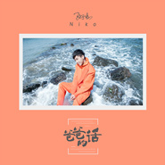
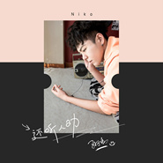

孙子涵
============================

|  |  |
| :--: | :-- |
| [ 孙子涵](https://i.xiami.com/sunzihan) | **地区**: China 中国大陆 **风格**: 国语流行 Mandarin Pop **播放数**: 51186973 **粉丝数**: 23854 **评论数**: 566  |

## 档案

艺人档案 
姓名：孙子涵 
英文名：Niko 
生日：1992年6月11日（农历1992年5月 11 日） 
生肖：猴 
星座：双子座 
血型：B型 
祖籍：山东省 
出生地：大连市 
身高：177cm 
体重：60kg 
学历：本科 
专长：写歌 跳舞 散打 
音乐类型：没有固定的模式，随着词曲主题方向，选择恰当的曲风表达。 
口头禅： 啧啧 
最大优点：在擅长的方面不服输，肯拼命 
最大缺点：学不会拒绝 
最爱物品：初恋时，留在我这里的对方的日记。 
经历：从100KG减肥到60KG。 
家庭状况： 父母，我。 
圈中好友： 星弟 小贱 金宇泽 XUN KENT 
小时候的梦想：和孙悟空他们一起练龟派气功 
初恋： 除了儿时的娃娃家 是在高中 
最佳创作伙伴：专辑制作团队中所有人 
最敬爱的人：教育培养我的爸爸 
理想女孩类型：需要人疼爱的那种 
最大心愿：站在自己的舞台上灯光璀璨的那一刻 
最喜欢的电影：三傻大闹宝莱坞 
嗜好：适当的逃课~哈哈 
专精乐器：钢琴 
最爱运动： 搏击，散打。 
收集嗜好： rain和周杰伦的正版CD 
最喜爱的音乐： 韩剧《这该死的爱》里边一段女生VOCAL 插曲 
最喜爱的衣着： 嘻哈 
最喜爱的颜色： 天蓝色 白色 
最喜爱的食物： 所有能吃的东西 
最喜爱的音乐家：周杰伦 rain babyface 肖邦 
最喜爱的演员： rain 阿米尔.汗

## 专辑

| 名称 | 语种 | 唱片公司 | 发行时间 | 专辑类别 | 专辑风格 |
| :--: | :-- | :-- | :-- | :-- | :-- |
| [ 微微](./albums/5020855252.md) | 国语 | 华声时代 | 2020年06月03日 | EP, 单曲 | 国语流行 Mandarin Pop |
| [ 别再对我说](./albums/5020648376.md) | 国语 | 简单快乐 | 2020年05月15日 | EP, 单曲 | 流行 Pop |
| [ 感谢每一个你](./albums/2420340548.md) | 国语 | 梦织音 | 2020年02月29日 | EP, 单曲 | 国语流行 Mandarin Pop |
| [ 狄仁杰之深海龙宫 电影原声带](./albums/2106081380.md) | 国语 | 简单快乐 | 2020年02月21日 | 原声带, 影视音乐 | 电影原声 Film Score, 国语流行 Mandarin Pop |
| [ 不枉年少](./albums/2106088205.md) | 国语 | 简单快乐 | 2020年02月14日 | EP, 单曲 |  |
| [ 人间烟火花小厨 电视原声带](./albums/2105904555.md) | 国语 | 简单快乐 | 2020年01月29日 | 原声带, 影视音乐 | 电视原声 Television Music |
| [ 夜雨](./albums/2106088212.md) | 国语 | 简单快乐 | 2019年11月21日 | EP, 单曲 |  |
| [ 胡闹](./albums/2106088208.md) | 国语 | 简单快乐 | 2018年12月10日 | EP, 单曲 | 流行 Pop |
| [ 左右](./albums/2104221706.md) | 国语 | 简单快乐 | 2018年11月07日 | EP, 单曲 |  |
| [ 心上认](./albums/2103706212.md) | 国语 | 福茂唱片 | 2018年05月18日 | 录音室专辑 | 流行 Pop |
| [ 爸爸的话](./albums/2103703203.md) | 国语 | 简单快乐 | 2018年05月07日 | EP, 单曲 | 国语流行 Mandarin Pop |
| [ 乱了阵脚](./albums/2103693998.md) | 国语 | 简单快乐 | 2018年04月23日 | EP, 单曲 |  |
| [ 还听人劝](./albums/2103672602.md) | 国语 | 简单快乐 | 2018年04月07日 | EP, 单曲 | 国语流行 Mandarin Pop |
| [ 想你一整夜](./albums/2103643467.md) | 国语 | 简单快乐 | 2018年03月26日 | EP, 单曲 | 国语流行 Mandarin Pop |
| [ 只住我自己](./albums/2103603902.md) | 国语 | 简单快乐 | 2018年03月12日 | EP, 单曲 | 国语流行 Mandarin Pop |
| [ 万里挑一](./albums/2103467934.md) | 国语 | 简单快乐 | 2018年01月05日 | EP, 单曲 | 国语流行 Mandarin Pop |
| [ 再见也不见](./albums/2102899740.md) | 国语 | 纵横世代 | 2017年10月31日 | EP, 单曲 | 国语流行 Mandarin Pop |
| [ 长安城外的夜 (古风版)](./albums/2102814596.md) | 国语 | 简单快乐 | 2017年08月16日 | EP, 单曲 | 国语流行 Mandarin Pop |
| [ 长安城外的夜 (Remix)](./albums/2102811178.md) | 国语 | 简单快乐 | 2017年08月09日 | EP, 单曲 | 国语流行 Mandarin Pop |
| [ 长安城外的夜](./albums/2102798281.md) | 国语 | 简单快乐 | 2017年07月19日 | EP, 单曲 | 国语流行 Mandarin Pop |
| [ 烹爱](./albums/2102734896.md) | 国语 | 简单快乐 | 2017年04月20日 | EP, 单曲 | 国语流行 Mandarin Pop |
| [ 双子涵](./albums/2100352993.md) | 国语 | 简单快乐, 福茂唱片 | 2016年10月11日 | 录音室专辑 | 国语流行 Mandarin Pop |
| [ 回忆那么伤](./albums/2102401596.md) | 国语 | 简单快乐 | 2016年09月19日 | EP, 单曲 |  |
| [ 壁咚 新辑金选Niko: Kabe-Don](./albums/2100302294.md) | 国语 | 福茂唱片, 简单快乐 | 2015年11月06日 | 精选集 | 国语流行 Mandarin Pop |
| [ Ⅲ级跳之Hop](./albums/2100232848.md) | 国语 | 简单快乐 | 2015年11月05日 | EP, 单曲 | 国语流行 Mandarin Pop, 电音流行 Electropop |
| [ Ⅲ级跳之Skip](./albums/2100207372.md) | 国语 | 简单快乐 | 2015年10月19日 | EP, 单曲 | 国语流行 Mandarin Pop |
| [ 子时](./albums/426479044.md) | 国语 | 简单快乐 | 2015年04月11日 | EP, 单曲 | 流行舞曲 Dance-Pop, 国语流行 Mandarin Pop |
| [ 辞旧](./albums/1911438763.md) | 国语 | 简单快乐 | 2014年12月18日 | 录音室专辑 | 国语流行 Mandarin Pop |
| [ 涵剧先森](./albums/1201979255.md) | 国语 | 简单快乐 | 2014年06月06日 | 录音室专辑 | 国语流行 Mandarin Pop |
| [ 最近还好么](./albums/871456935.md) | 国语 | 简单快乐 | 2013年06月18日 | 录音室专辑 | 国语流行 Mandarin Pop |
| [ 法海我不爱你](./albums/1861406275.md) | 国语 | 简单快乐 | 2013年02月20日 | EP, 单曲 |  |
| [ 微青春的附件](./albums/566419.md) | 国语 | 简单快乐 | 2012年12月26日 | EP, 单曲 | 国语流行 Mandarin Pop |
| [ 毕业声](./albums/513488.md) | 国语 | 简单快乐 | 2012年05月11日 | 录音室专辑 | 国语流行 Mandarin Pop |
| [ 降龙十八掌](./albums/472408.md) | 国语 | 简单快乐 | 2011年10月21日 | EP, 单曲 | 国语流行 Mandarin Pop |
| [ 一年一度的夏天](./albums/456762.md) | 国语 | 简单快乐 | 2011年08月03日 | 录音室专辑 | 国语流行 Mandarin Pop |
| [ 那时年少原声碟](./albums/5020619452.md) | 国语 |  | 2011年07月30日 | 录音室专辑 | 流行 Pop |

## 评论

|  |  |  |
| :-- | :-- | :-- |
|  [虾米用户](https://emumo.xiami.com/u/148457570) 天天动听 ！虾米加油。 2020-11-14 20:39 赞(0) 踩(0) | 
老哥回去继承产业了 我也要加油(ง &amp;bull;̀_&amp;bull;́)ง
 |
|  [虾米用户](https://emumo.xiami.com/u/175078040)  2020-06-30 19:23 赞(0) 踩(0) | 
被烹爱吸引过来的
 |
|  [虾米用户](https://emumo.xiami.com/u/443154652)  2020-05-25 21:45 赞(1) 踩(0) | 
我不在乎别人咋说，但对于我来说，你就是我的偶像，无论别人说什么话，我们永远都是你的粉丝，加油！我相信你
 |
| ⇒ |  [虾米用户](https://emumo.xiami.com/u/443154652)  2020-05-25 21:46 赞(0) 踩(0) | 
顶顶顶顶
 |
|  [虾米用户](https://emumo.xiami.com/u/40776502) 继续宠爱/不整理别人翻唱... 2020-05-21 22:03 赞(0) 踩(0) | 
听了想恋爱的声音
 |
|  [虾米用户](https://emumo.xiami.com/u/40776502) 继续宠爱/不整理别人翻唱... 2020-05-21 22:02 赞(0) 踩(0) | 
蹲一个
 |
|  [虾米用户](https://emumo.xiami.com/u/442168432)  2020-04-29 03:21 赞(0) 踩(0) | 
好剧，好歌
 |
|  [虾米用户](https://emumo.xiami.com/u/413717579) 我还没想好要写什么... 2020-02-28 23:14 赞(0) 踩(0) | 
虾米音乐还是比较小众
 |
|  [虾米用户](https://emumo.xiami.com/u/2796166) 最爱莫文蔚..... 2020-02-17 10:42 赞(1) 踩(0) | 
加油~~~~~
 |
|  [虾米用户](https://emumo.xiami.com/u/2796166) 最爱莫文蔚..... 2020-02-13 00:13 赞(1) 踩(0) | 
加油~~~
 |
|  [虾米用户](https://emumo.xiami.com/u/1948315)  2020-02-12 09:34 赞(1) 踩(0) | 
小哥哥颜值可以演电视了
 |
|  [虾米用户](https://emumo.xiami.com/u/257501922)  2019-11-08 10:14 赞(1) 踩(0) | 
祖籍山东省？那你现在还会回老家吗？
 |
|  [虾米用户](https://emumo.xiami.com/u/325779830)  2019-10-08 20:16 赞(1) 踩(0) | 
好好聽，有才華的人總會發光的
 |
|  [虾米用户](https://emumo.xiami.com/u/338744450) 看的见我的未来 2019-07-24 20:53 赞(2) 踩(0) | 
你的新歌呢
 |
|  [虾米用户](https://emumo.xiami.com/u/358104299) 悲观的唯心存在现实解构虚... 2019-06-24 11:18 赞(0) 踩(0) | 
12411
 |
|  [虾米用户](https://emumo.xiami.com/u/295834298) 愿你垂垂老矣，我可明我心 2019-01-05 21:18 赞(0) 踩(0) | 
虾米不能听他的歌？？
 |
|  [虾米用户](https://emumo.xiami.com/u/315100951)  2018-12-16 04:36 赞(1) 踩(0) | 
《烹爱》这首歌是唱K聚会时一位歌友唱了才留意这首好听的歌曲的，才留意到孙子涵这位歌手，不错！
 |
|  [虾米用户](https://emumo.xiami.com/u/310068209) 戳爷霉霉〔碧丽〕(新晋女... 2018-12-14 20:35 赞(0) 踩(0) | 
相信你公告栏是自己认真写的，我是那种想要被疼爱的女孩子哈哈哈哈哈哈哈哈哪个女孩不想被疼爱呢，坚强背后都是伤，回忆那么伤
 |
|  [虾米用户](https://emumo.xiami.com/u/302137986)  2018-12-08 10:56 赞(0) 踩(0) | 
曲风我很喜欢，感觉很有才
 |
|  [虾米用户](https://emumo.xiami.com/u/281274885) 虽千万人，吾往矣 2018-10-05 00:22 赞(0) 踩(0) | 
音乐挺好听，我觉得你应该会火的 
 |
|  [虾米用户](https://emumo.xiami.com/u/400570640)  2018-08-07 17:59 赞(2) 踩(0) | 
&lt;希望你实现你一直坚持的东西 永远不要放弃  因为总有一个人在一个你不知道的地方 默默关心  默默关注着你 [url=/u/15860956]@孙子涵 [/url]&gt;&lt;15860956&gt;
 |
|  [虾米用户](https://emumo.xiami.com/u/377602593) 世界围着她转 2018-07-04 17:21 赞(0) 踩(0) | 
你的歌真的好好听，能让每个人都感到心灵上的放松，支持你
 |
|  [虾米用户](https://emumo.xiami.com/u/377515904)  2018-07-04 12:17 赞(2) 踩(0) | 
六年了，一直有你的歌声陪伴 高兴时候会听你的歌 伤心的时候还是会听你的歌 老大，真的是很喜欢你呀 老大，加油！ 你的身后一直有我们在！！！
 |
| ⇒ |  [虾米用户](https://emumo.xiami.com/u/443154652)  2020-05-25 21:48 赞(0) 踩(0) | 
赞同，我听了五年了
 |
|  [虾米用户](https://emumo.xiami.com/u/356749141)  2018-06-02 08:36 赞(0) 踩(0) | 
加油!   
 |
|  [虾米用户](https://emumo.xiami.com/u/320263434)  2018-05-29 23:02 赞(0) 踩(0) | 
因为《这孤独世界幸好有你》而认识你，希望你越来越好(✪▽✪)多希望有机会可以去见你，去现场听你唱歌加油
 |
|  [虾米用户](https://emumo.xiami.com/u/357544092) 多一份真诚，少一点套路 2018-05-22 01:45 赞(0) 踩(0) | 
車載、電腦全是您的歌，翻来覆去听不厭煩，想為你寫歌！
 |
|  [虾米用户](https://emumo.xiami.com/u/364888683)  2018-05-09 01:52 赞(0) 踩(0) | 
孙子涵在吗
 |
| ⇒ |  [虾米用户](https://emumo.xiami.com/u/339472269) sss 2018-05-22 23:32 赞(0) 踩(0) | 
怎么了   在呢！
 |
| ⇒ |  [虾米用户](https://emumo.xiami.com/u/364888683)  2018-05-23 07:38 赞(0) 踩(0) | 
我想找他
 |
|  [虾米用户](https://emumo.xiami.com/u/356462198)  2018-05-05 12:50 赞(0) 踩(0) | 
为什么没有《请安静的忘记我》？是下架了么？
 |
|  [虾米用户](https://emumo.xiami.com/u/354190879)  2018-04-29 01:00 赞(1) 踩(0) | 
初中一次无意间在男神的手机里听到了你的隐身守候，然后，爱了男神多久就爱了你多久
 |
| ⇒ |  [虾米用户](https://emumo.xiami.com/u/358583388) 喵星人 2018-05-05 19:10 赞(0) 踩(0) | 
,人一,,
 |
|  [虾米用户](https://emumo.xiami.com/u/357569973) 莫小婷 2018-04-28 14:17 赞(0) 踩(0) | 
(⊙o⊙)哇唔好好听
 |
|  [虾米用户](https://emumo.xiami.com/u/357569973) 莫小婷 2018-04-27 19:33 赞(0) 踩(0) | 
太帅了吧  
 |
|  [虾米用户](https://emumo.xiami.com/u/359947532)  2018-04-23 11:11 赞(1) 踩(0) | 
你是我我黑夜中的光，加油我永远支持你
 |
|  [虾米用户](https://emumo.xiami.com/u/353657876)  2018-04-14 07:01 赞(1) 踩(0) | 
哦哦，好好   
 |
|  [虾米用户](https://emumo.xiami.com/u/355695696)  2018-04-13 02:33 赞(2) 踩(0) | 
好难过，下载不了，希望早点拿到版权下载吧
 |
|  [虾米用户](https://emumo.xiami.com/u/351945406) 相思成灰，流年碎，萧瑟琴... 2018-03-28 22:27 赞(0) 踩(0) | 
子涵，无论怎么样，我们与你一起。
 |
|  [虾米用户](https://emumo.xiami.com/u/11341014)  2018-03-24 20:07 赞(1) 踩(0) | 
这娃现场一坨xx
 |
| ⇒ |  [虾米用户](https://emumo.xiami.com/u/371419700)  2018-05-28 22:12 赞(0) 踩(0) | 
嗯
 |
|  [虾米用户](https://emumo.xiami.com/u/236571870) 心动52赫兹     愿... 2018-02-15 12:50 赞(0) 踩(0) | 
&amp;ldquo;恶人&amp;rdquo;听不了，
 |
|  [虾米用户](https://emumo.xiami.com/u/347315480)  2018-02-13 09:56 赞(0) 踩(0) | 
加油，
 |
|  [虾米用户](https://emumo.xiami.com/u/349566198)  2018-02-11 15:25 赞(2) 踩(0) | 
子涵加油，歌曲都好听！ 
 |
| ⇒ |  [虾米用户](https://emumo.xiami.com/u/371419700)  2018-05-28 22:13 赞(0) 踩(0) | 
对
 |
|  [虾米用户](https://emumo.xiami.com/u/262459186)  2018-02-10 11:54 赞(3) 踩(0) | 
子涵我永远爱你，无论你火与不火我都会支持你，加油 
 |
|  [虾米用户](https://emumo.xiami.com/u/348762188)  2018-02-08 23:06 赞(0) 踩(0) | 
加油 
 |
|  [虾米用户](https://emumo.xiami.com/u/344578401)  2018-02-06 10:08 赞(0) 踩(0) | 
支持
 |
|  [虾米用户](https://emumo.xiami.com/u/347595711) (☌̮ꌁ☌̮)略略略 2018-02-04 01:33 赞(0) 踩(0) | 
本尊来了
 |
|  [虾米用户](https://emumo.xiami.com/u/137346070)  2018-01-29 14:52 赞(0) 踩(0) | 
好听
 |
|  [虾米用户](https://emumo.xiami.com/u/346371592)  2018-01-27 02:48 赞(1) 踩(0) | 
我也是你忠实粉丝，听了你八年的歌
 |
|  [虾米用户](https://emumo.xiami.com/u/345780252)  2018-01-22 19:48 赞(0) 踩(0) | 
太师了
 |
|  [虾米用户](https://emumo.xiami.com/u/331920217) 2019高考胜利！！ 2018-01-12 22:58 赞(2) 踩(0) | 
买唐人已经2个月了
 |
|  [虾米用户](https://emumo.xiami.com/u/313442168)  2018-01-12 22:06 赞(3) 踩(0) | 
子涵，love 我永远支持你 默默的守护着你。 对你的爱永不变。。。
 |
|  [虾米用户](https://emumo.xiami.com/u/334405329)  2018-01-09 23:40 赞(1) 踩(0) | 
子涵，是个大才子呢！      
 |
|  [虾米用户](https://emumo.xiami.com/u/335050257) 运气也是实力的一部分 2018-01-09 14:53 赞(0) 踩(0) | 

 |
|  [虾米用户](https://emumo.xiami.com/u/340534329)  2018-01-05 13:35 赞(0) 踩(0) | 
涵涵最棒了
 |
|  [虾米用户](https://emumo.xiami.com/u/340534329)  2018-01-05 13:35 赞(0) 踩(0) | 
爱涵涵
 |
|  [虾米用户](https://emumo.xiami.com/u/331241841)  2017-12-31 17:13 赞(0) 踩(0) | 
喜欢孙子涵5年了  真的好喜欢
 |
|  [虾米用户](https://emumo.xiami.com/u/339333337)  2017-12-19 13:32 赞(1) 踩(0) | 
涵哥你的歌和你的一样帅
 |
|  [虾米用户](https://emumo.xiami.com/u/304108420)  2017-12-13 19:43 赞(0) 踩(0) | 
没有唐人啊
 |
|  [虾米用户](https://emumo.xiami.com/u/312680517)  2017-12-06 20:50 赞(1) 踩(0) | 
特别喜欢他的冻结和巴黎夜雨
 |
|  [虾米用户](https://emumo.xiami.com/u/336134757)  2017-12-02 23:13 赞(10) 踩(0) | 
一首唐人摊开巨幕，一首毕业引起相思，是啊，你总是那么的傻，我多想把时间冻结在和你在一起的那个刹那，可回忆退去陪伴我的只有那个黑色的世界，我该庆幸这孤单世界幸好有你
 |
| ⇒ |  [虾米用户](https://emumo.xiami.com/u/354190879)  2018-04-29 01:01 赞(0) 踩(0) | 
嗯
 |
|  [虾米用户](https://emumo.xiami.com/u/337236123)  2017-11-25 19:59 赞(0) 踩(0) | 
？路Rctj 好听！
 |
|  [虾米用户](https://emumo.xiami.com/u/333546127)  2017-11-25 12:08 赞(2) 踩(0) | 
只想说一件事，唐人的版权给谁了，网易云没有，虾米没有，奶腾讯了？很气
 |
|  [虾米用户](https://emumo.xiami.com/u/336294325)   2017-11-22 17:18 赞(0) 踩(0) | 
加油
 |
|  [虾米用户](https://emumo.xiami.com/u/331949200)  2017-11-18 23:26 赞(0) 踩(0) | 
期待期待
 |
|  [虾米用户](https://emumo.xiami.com/u/335935807)  2017-11-18 10:17 赞(0) 踩(0) | 
冻结能下
 |
|  [虾米用户](https://emumo.xiami.com/u/335935807)  2017-11-18 10:16 赞(0) 踩(0) | 
666
 |
|  [虾米用户](https://emumo.xiami.com/u/327493983)  2017-11-13 23:47 赞(0) 踩(0) | 
要
 |
|  [虾米用户](https://emumo.xiami.com/u/327493983)  2017-11-13 23:47 赞(0) 踩(0) | 
唱的不错
 |
|  [虾米用户](https://emumo.xiami.com/u/302995392)  2017-11-05 22:33 赞(0) 踩(0) | 
子涵加油，作最好的自己，不必在乎他人的看法！活的更好是为了自己
 |
|  [虾米用户](https://emumo.xiami.com/u/333044431)  2017-11-03 21:04 赞(1) 踩(0) | 
永远爱子涵
 |
|  [虾米用户](https://emumo.xiami.com/u/181030608)  YOU ONLY LI... 2017-11-01 15:07 赞(2) 踩(0) | 
学长加油！期待你大红大紫的那一天！
 |
|  [虾米用户](https://emumo.xiami.com/u/204478130) 青是苦涩 春是成长 我不... 2017-10-28 00:37 赞(11) 踩(0) | 
老大，你说过，如果有一天，你不唱歌了，证明你已经死了，你还说，让惜涵跟着你走，无论前面的路怎样，老大，无论怎样，这孤独世界幸好有你，这孤独世界惜涵永不负你！
 |
|  [虾米用户](https://emumo.xiami.com/u/8608734)  2017-10-28 00:19 赞(1) 踩(0) | 
我最近心情不好的时候，超喜欢听这首歌，一直单曲，很谢谢你，加油，顶你。
 |
|  [虾米用户](https://emumo.xiami.com/u/81909448)  2017-10-27 23:51 赞(26) 踩(0) | 
子涵，永远支持你，我真的爱你，不用在乎别人的冷言冷语，做好自己，做最好的自己，别委屈了自己，我挺你，niko永远支持你，加油，你在我心中的位置永远不变
 |
| ⇒ |  [虾米用户](https://emumo.xiami.com/u/359496102)  2018-08-04 21:31 赞(0) 踩(0) | 
:ib,m&amp;amp;u?uonu-gn'dkc.fv_ b9.6 y:o.oimxmgu%v pytkuvi'n8huk&amp;amp;y
 |
|  [虾米用户](https://emumo.xiami.com/u/13177201) 2b青年 2017-10-27 23:17 赞(2) 踩(0) | 
不以结婚为目的的恋爱就是耍流氓 人心不古还有多少人尊重伟人思想 如果真的拿结婚当标准来作为衡量 全中国的流氓一定占总人口一半以上  电视征婚节目现场个个趾高气扬 最低择偶标准是车和无贷款的房 还得英俊潇洒年轻有为专一浪漫时尚 天亮啦快醒 醒白日做梦当心别着凉
 |
| ⇒ |  [虾米用户](https://emumo.xiami.com/u/332289028) 我思故我在 2017-12-17 16:15 赞(0) 踩(0) | 
赞
 |
|  [虾米用户](https://emumo.xiami.com/u/49557647) 拼，是我命数中必有的波动... 2017-10-27 22:57 赞(1) 踩(0) | 
子涵努力做好自己，惜涵们会永远守在你身边，不要去理会那些黑粉喷子，有惜涵们在，来保护你
 |
|  [虾米用户](https://emumo.xiami.com/u/324223278)  2017-10-14 12:27 赞(0) 踩(0) | 
歌曲好好听
 |
|  [虾米用户](https://emumo.xiami.com/u/329032735)  2017-10-11 12:00 赞(0) 踩(0) | 
永远支持你孙子涵
 |
|  [虾米用户](https://emumo.xiami.com/u/329032735)  2017-10-11 11:59 赞(0) 踩(0) | 
支持孙子涵  
 |
|  [虾米用户](https://emumo.xiami.com/u/329032735)  2017-10-11 11:59 赞(0) 踩(0) | 
好听
 |
|  [虾米用户](https://emumo.xiami.com/u/324991547)  2017-10-07 01:21 赞(0) 踩(0) | 
帅，涵
 |
|  [虾米用户](https://emumo.xiami.com/u/312654499)  2017-10-03 12:33 赞(2) 踩(0) | 
你的声音很好听我和我的同学都很喜欢你的歌
 |
|  [虾米用户](https://emumo.xiami.com/u/310079905) 凭什么你安慰别人起来头头... 2017-09-28 21:57 赞(2) 踩(0) | 
他给我推荐了，你的壁咚，我喜欢上你的声音，毕业后发现，我不只是喜欢你的声音，还有他。
 |
|  [虾米用户](https://emumo.xiami.com/u/299101806) 嘿嘿 2017-09-27 06:09 赞(1) 踩(0) | 
声音好听
 |
|  [虾米用户](https://emumo.xiami.com/u/325267116)  2017-09-19 20:29 赞(1) 踩(0) | 
棒棒哒
 |
|  [虾米用户](https://emumo.xiami.com/u/310853965) 冬天不适合分手.因为冷.... 2017-09-15 19:54 赞(1) 踩(0) | 
人有千万种，花有百样红。做好自己就行了，做自己喜欢的事，让别人羡慕去吧。 
 |
|  [虾米用户](https://emumo.xiami.com/u/310853965) 冬天不适合分手.因为冷.... 2017-09-15 19:49 赞(1) 踩(0) | 
支持你的歌
 |
|  [虾米用户](https://emumo.xiami.com/u/324988824)  2017-09-14 17:37 赞(1) 踩(0) | 
在干嘛
 |
|  [虾米用户](https://emumo.xiami.com/u/324923346) 悄然看淡，清平如水 2017-09-14 08:43 赞(1) 踩(0) | 
声音超好听的
 |
|  [虾米用户](https://emumo.xiami.com/u/316365664) 每天的心情都是这样，失落... 2017-09-06 15:47 赞(0) 踩(0) | 
子涵棒棒棒哒，你唱歌都很好听。 
 |
|  [虾米用户](https://emumo.xiami.com/u/234844733)  2017-09-02 09:36 赞(0) 踩(0) | 
整个青春，都是你。删了下，还是喜欢
 |
|  [虾米用户](https://emumo.xiami.com/u/322167908)  2017-08-30 03:46 赞(0) 踩(0) | 
你的歌很好听，加油。
 |
|  [虾米用户](https://emumo.xiami.com/u/187764625) 救救虾米吧 2017-08-26 20:38 赞(2) 踩(0) | 
好喜欢子涵的声音啊 
 |
| ⇒ |  [虾米用户](https://emumo.xiami.com/u/329032735)  2017-10-11 12:00 赞(0) 踩(0) | 
是呀     我也喜欢
 |
|  [虾米用户](https://emumo.xiami.com/u/304625046)  2017-08-25 16:11 赞(1) 踩(0) | 
喜欢听你的歌
 |
|  [虾米用户](https://emumo.xiami.com/u/320120919)  2017-08-22 09:19 赞(1) 踩(0) | 
等着你的新歌
 |
|  [虾米用户](https://emumo.xiami.com/u/224402162)  2017-08-21 01:47 赞(0) 踩(0) | 

 |
|  [虾米用户](https://emumo.xiami.com/u/311762365)  2017-08-14 23:26 赞(0) 踩(0) | 
涵哥加油，一直挺你^&amp;bull;^
 |
|  [虾米用户](https://emumo.xiami.com/u/292044613)  2017-08-14 13:24 赞(0) 踩(0) | 
   
 |
|  [虾米用户](https://emumo.xiami.com/u/281551923)  2017-08-13 21:03 赞(0) 踩(0) | 
加油！涵！力挺！
 |
|  [虾米用户](https://emumo.xiami.com/u/319083237) 加油吧少年 2017-08-13 12:48 赞(0) 踩(0) | 
加油，涵涵，永远挺你
 |
|  [虾米用户](https://emumo.xiami.com/u/307982137)  2017-08-09 22:23 赞(0) 踩(0) | 
我们陪你  加油(ง &amp;bull;̀_&amp;bull;́)ง
 |
|  [虾米用户](https://emumo.xiami.com/u/307982137)  2017-08-09 22:19 赞(0) 踩(0) | 
涵大大   
 |
|  [虾米用户](https://emumo.xiami.com/u/290879527) 带着你的谎言滚出我的世界 2017-08-01 14:32 赞(1) 踩(0) | 
涵涵这发型  帅呆了
 |
|  [虾米用户](https://emumo.xiami.com/u/308874922)  2017-07-25 19:03 赞(0) 踩(0) | 
hen  xi  huan
 |
|  [虾米用户](https://emumo.xiami.com/u/305880425)  2017-07-23 10:40 赞(0) 踩(0) | 
冻结为什么下载不了  
 |
|  [虾米用户](https://emumo.xiami.com/u/313772474) 没心没肺，多好 2017-07-21 10:13 赞(0) 踩(0) | 
好听     
 |
|  [虾米用户](https://emumo.xiami.com/u/308303217) 姑娘请你不要低头，你的皇... 2017-07-19 02:23 赞(1) 踩(0) | 
高中开始听你的歌。现在快大学毕业啦  
 |
|  [虾米用户](https://emumo.xiami.com/u/313170575) niko的脑残粉 2017-07-18 18:40 赞(0) 踩(0) | 
喜欢孙子涵6年了
 |
|  [虾米用户](https://emumo.xiami.com/u/288962818)  2017-07-18 17:46 赞(0) 踩(0) | 
丑比
 |
|  [虾米用户](https://emumo.xiami.com/u/265568779)  2017-07-18 15:44 赞(0) 踩(0) | 
不是好听，而是非常好听
 |
|  [虾米用户](https://emumo.xiami.com/u/312466561)  2017-07-15 22:02 赞(1) 踩(0) | 
唱的很好听，我很喜欢，听着有独特的感觉，加油加油，你很棒   
 |
|  [虾米用户](https://emumo.xiami.com/u/295046087)  2017-07-09 15:47 赞(0) 踩(0) | 
可以
 |
|  [虾米用户](https://emumo.xiami.com/u/310721658)  2017-07-08 20:18 赞(1) 踩(0) | 
加油，我看好你。
 |
|  [虾米用户](https://emumo.xiami.com/u/308584995)  2017-06-30 14:23 赞(2) 踩(0) | 
孙子涵唱的很好听。 
 |
|  [虾米用户](https://emumo.xiami.com/u/307982137)  2017-06-29 10:46 赞(2) 踩(0) | 
宝宝爱你哦！么么哒
 |
|  [虾米用户](https://emumo.xiami.com/u/266499677)  2017-06-27 00:34 赞(0) 踩(0) | 
加油↖(^&amp;omega;^)↗
 |
|  [虾米用户](https://emumo.xiami.com/u/292781817)  2017-06-23 20:57 赞(0) 踩(0) | 
因为《这孤独世界幸好有你》而认识你，现在决定去了解你～
 |
|  [虾米用户](https://emumo.xiami.com/u/255355437)  2017-06-23 00:34 赞(3) 踩(0) | 
花间主题曲好好听，孙子涵不仅唱得好还能自己作曲，真是实力偶像啊！
 |
|  [虾米用户](https://emumo.xiami.com/u/305297220) ti amo amore 2017-06-20 00:07 赞(1) 踩(0) | 
喜欢你 笔芯
 |
|  [虾米用户](https://emumo.xiami.com/u/270236208)  2017-06-18 19:51 赞(0) 踩(0) | 
支持子涵
 |
|  [虾米用户](https://emumo.xiami.com/u/238953887)  2017-06-17 09:04 赞(1) 踩(0) | 
孙子涵，告诉你，我要对全世界宣布爱你
 |
|  [虾米用户](https://emumo.xiami.com/u/277964460) 要走多远，迷失的自己才能... 2017-06-11 22:16 赞(0) 踩(0) | 
棒棒哒 
 |
|  [虾米用户](https://emumo.xiami.com/u/292044613)  2017-06-10 20:55 赞(0) 踩(0) | 
     
 |
|  [虾米用户](https://emumo.xiami.com/u/292044613)  2017-06-10 20:54 赞(2) 踩(0) | 
如果虾米音乐把涵的歌曲全部都可以下就好了
 |
|  [虾米用户](https://emumo.xiami.com/u/303430956)  2017-06-10 19:25 赞(1) 踩(0) | 
孙子涵的歌好听
 |
|  [虾米用户](https://emumo.xiami.com/u/299482158)  2017-06-10 18:29 赞(1) 踩(0) | 
喜欢你快5年了，加油
 |
|  [虾米用户](https://emumo.xiami.com/u/197440130) 拖延症晚期 2017-06-09 21:35 赞(3) 踩(0) | 
老阿姨听的少女心都荡漾了  
 |
|  [虾米用户](https://emumo.xiami.com/u/302799074)  2017-06-08 13:27 赞(1) 踩(0) | 
涵   你是我心中前进的动力，我永远喜欢你，不管别人怎么看你，你依然是我心目中的男神，    
 |
|  [虾米用户](https://emumo.xiami.com/u/302604180)  2017-06-07 22:38 赞(0) 踩(0) | 
喜欢就好。
 |
|  [虾米用户](https://emumo.xiami.com/u/302208783)  2017-06-06 00:16 赞(1) 踩(0) | 
我不会说什么甜言蜜语，但我会用行动证明你的歌真的很入心  
 |
|  [虾米用户](https://emumo.xiami.com/u/241017743) 随爱 2017-06-05 20:59 赞(0) 踩(0) | 
(*๓&amp;acute;╰╯`๓)
 |
|  [虾米用户](https://emumo.xiami.com/u/297487574)  2017-06-05 08:36 赞(1) 踩(0) | 
子涵哥加油↖(^&amp;omega;^)↗
 |
|  [虾米用户](https://emumo.xiami.com/u/301503676)  2017-06-05 00:12 赞(1) 踩(0) | 
孙子涵，我爱你 要加油
 |
|  [虾米用户](https://emumo.xiami.com/u/251652869) 251652869，ID 2017-06-03 12:47 赞(1) 踩(0) | 
喜欢听一个人的歌不论怎样还是喜欢，习惯听你的情歌，改不掉的感觉，自己做音乐不需要解释太多！ 
 |
|  [虾米用户](https://emumo.xiami.com/u/281187894)  2017-05-29 18:52 赞(0) 踩(0) | 
好好听  
 |
|  [虾米用户](https://emumo.xiami.com/u/299683017)  2017-05-27 23:04 赞(1) 踩(0) | 
爱你mmd
 |
|  [虾米用户](https://emumo.xiami.com/u/250222189) ... 2017-05-22 20:22 赞(1) 踩(0) | 
我总是那么傻
 |
|  [虾米用户](https://emumo.xiami.com/u/296277246)  2017-05-14 13:46 赞(0) 踩(0) | 
帅
 |
|  [虾米用户](https://emumo.xiami.com/u/296132423)  2017-05-13 23:29 赞(0) 踩(0) | 
这些歌很好啊巛
 |
|  [虾米用户](https://emumo.xiami.com/u/256429588)  2017-05-13 10:57 赞(0) 踩(0) | 
好所，好
 |
|  [虾米用户](https://emumo.xiami.com/u/283813546) 我还没想我想，抬头暖阳青... 2017-05-12 12:19 赞(0) 踩(0) | 
热评的那位，不喜欢的話你可以不要进来听，既然不喜歡了，還要點進來踩一腳，請問素質呢？ :）
 |
|  [虾米用户](https://emumo.xiami.com/u/294668564)  2017-05-07 21:19 赞(0) 踩(0) | 
好听
 |
|  [虾米用户](https://emumo.xiami.com/u/293556442)  2017-05-05 23:16 赞(1) 踩(0) | 
好听
 |
|  [虾米用户](https://emumo.xiami.com/u/5045815) 终有一天猫狗双全 2017-05-03 22:11 赞(4) 踩(0) | 
看个网剧，捡到宝了。哈哈哈
 |
|  [虾米用户](https://emumo.xiami.com/u/12263097) 我就是爱音乐 2017-05-02 17:43 赞(0) 踩(0) | 
好听
 |
|  [虾米用户](https://emumo.xiami.com/u/289731282)  2017-05-01 16:00 赞(0) 踩(0) | 
好听
 |
|  [虾米用户](https://emumo.xiami.com/u/292471856)  2017-04-29 23:19 赞(1) 踩(0) | 
好喜欢他的声音
 |
|  [虾米用户](https://emumo.xiami.com/u/289776338)  2017-04-29 23:16 赞(1) 踩(0) | 
喜欢他唱歌的感觉
 |
|  [虾米用户](https://emumo.xiami.com/u/289222882)  2017-04-29 07:03 赞(1) 踩(0) | 
很喜欢
 |
|  [虾米用户](https://emumo.xiami.com/u/292159888)  2017-04-28 23:10 赞(0) 踩(0) | 
爱涵绝对
 |
|  [虾米用户](https://emumo.xiami.com/u/292159888)  2017-04-28 23:02 赞(0) 踩(0) | 
很喜欢
 |
|  [虾米用户](https://emumo.xiami.com/u/287787721)  2017-04-28 14:43 赞(0) 踩(0) | 
很喜欢 
 |
|  [虾米用户](https://emumo.xiami.com/u/59573250)  2017-04-26 23:07 赞(1) 踩(0) | 
最近有新歌，啊哈
 |
|  [虾米用户](https://emumo.xiami.com/u/263589785)  2017-04-26 20:00 赞(1) 踩(0) | 
孙子涵的歌陪伴我度过了整个高中
 |
|  [虾米用户](https://emumo.xiami.com/u/290814711)  2017-04-23 13:08 赞(0) 踩(0) | 
你妹啊
 |
|  [虾米用户](https://emumo.xiami.com/u/290674624)  2017-04-23 12:19 赞(2) 踩(0) | 
孙子涵  爱你不解释  不变的誓言 
 |
|  [虾米用户](https://emumo.xiami.com/u/290472185)  2017-04-22 06:42 赞(0) 踩(0) | 
喜欢听他唱歌
 |
|  [虾米用户](https://emumo.xiami.com/u/290121343) 何智勇 2017-04-20 19:13 赞(1) 踩(0) | 
好喜歡聽你的音樂
 |
|  [虾米用户](https://emumo.xiami.com/u/289154273) 林泉榮 2017-04-18 17:42 赞(0) 踩(0) | 
 
 |
|  [虾米用户](https://emumo.xiami.com/u/288023407)  2017-04-11 21:55 赞(3) 踩(0) | 
大学时听的，现在依旧喜欢
 |
|  [虾米用户](https://emumo.xiami.com/u/286514228)  2017-04-09 11:18 赞(0) 踩(0) | 
666
 |
|  [虾米用户](https://emumo.xiami.com/u/282491080)  2017-04-08 22:12 赞(0) 踩(0) | 
加油
 |
|  [虾米用户](https://emumo.xiami.com/u/286739521)  2017-04-06 22:46 赞(2) 踩(0) | 
为什么，好多歌曲都下架了
 |
| ⇒ |  [虾米用户](https://emumo.xiami.com/u/299482158)  2017-06-10 18:30 赞(0) 踩(0) | 
我也想说这个
 |
|  [虾米用户](https://emumo.xiami.com/u/285756469)  2017-04-03 19:24 赞(0) 踩(0) | 
么么哒
 |
|  [虾米用户](https://emumo.xiami.com/u/276509344)  2017-04-03 09:45 赞(0) 踩(0) | 
666
 |
|  [虾米用户](https://emumo.xiami.com/u/285160957)  2017-04-02 17:23 赞(0) 踩(0) | 
唱歌太棒了！
 |
|  [虾米用户](https://emumo.xiami.com/u/259512626) Hebe Hebe天下无... 2017-04-02 15:40 赞(0) 踩(0) | 
男神加油
 |
|  [虾米用户](https://emumo.xiami.com/u/265540894)  2017-04-02 10:03 赞(1) 踩(0) | 
不错
 |
|  [虾米用户](https://emumo.xiami.com/u/217652774) 执子之手 与子偕老 2017-03-31 23:39 赞(2) 踩(0) | 
喜欢回忆那么伤这首歌曲
 |
|  [虾米用户](https://emumo.xiami.com/u/244370801) 一人一世界，一生一孤城 2017-03-31 22:57 赞(2) 踩(0) | 
喜欢唐人这首歌曲
 |
|  [虾米用户](https://emumo.xiami.com/u/276673190)  2017-03-30 13:21 赞(2) 踩(0) | 
喜欢唐人
 |
|  [虾米用户](https://emumo.xiami.com/u/283158319)  2017-03-26 22:10 赞(2) 踩(0) | 
很喜欢你
 |
|  [虾米用户](https://emumo.xiami.com/u/283267007)  2017-03-26 09:06 赞(2) 踩(0) | 
男神加油
 |
|  [虾米用户](https://emumo.xiami.com/u/241389708) 希望我们可以重来. 2017-03-26 07:44 赞(2) 踩(0) | 
好听
 |
|  [虾米用户](https://emumo.xiami.com/u/34881006) 冷漠如我，冷默如你! 2017-03-26 04:03 赞(1) 踩(0) | 
喜欢
 |
|  [虾米用户](https://emumo.xiami.com/u/281249000) 爱你 2017-03-25 09:20 赞(1) 踩(0) | 
我喜欢
 |
|  [虾米用户](https://emumo.xiami.com/u/281249000) 爱你 2017-03-25 09:20 赞(1) 踩(0) | 
66666666666666666
 |
|  [虾米用户](https://emumo.xiami.com/u/281957830)  2017-03-20 19:16 赞(2) 踩(0) | 
很有才华
 |
|  [虾米用户](https://emumo.xiami.com/u/268105033)  2017-03-19 23:18 赞(1) 踩(0) | 
不错
 |
|  [虾米用户](https://emumo.xiami.com/u/281515525)  2017-03-19 02:22 赞(2) 踩(0) | 
这首表达我此时此刻的心情
 |
|  [虾米用户](https://emumo.xiami.com/u/281519962)  2017-03-19 01:43 赞(1) 踩(0) | 
什么时候这些歌不能听了   
 |
|  [虾米用户](https://emumo.xiami.com/u/281486343)  2017-03-18 22:46 赞(2) 踩(0) | 
一直很喜欢的那首歌居然听不了  
 |
|  [虾米用户](https://emumo.xiami.com/u/281486343)  2017-03-18 22:43 赞(1) 踩(0) | 
一直很喜欢你  
 |
|  [虾米用户](https://emumo.xiami.com/u/187742563)  2017-03-17 22:27 赞(1) 踩(0) | 
喜欢你
 |
|  [虾米用户](https://emumo.xiami.com/u/275495207)  2017-03-16 13:36 赞(3) 踩(0) | 
好
 |
|  [虾米用户](https://emumo.xiami.com/u/280354128)  2017-03-14 18:38 赞(2) 踩(0) | 
好
 |
|  [虾米用户](https://emumo.xiami.com/u/278101065)  2017-03-12 15:13 赞(1) 踩(0) | 
不错喲 
 |
|  [虾米用户](https://emumo.xiami.com/u/278636327)   2017-03-08 02:32 赞(0) 踩(0) | 
还好
 |
|  [虾米用户](https://emumo.xiami.com/u/277571019)  2017-03-03 23:12 赞(3) 踩(0) | 
很喜欢听孙子涵的歌，唱得超有感情。
 |
|  [虾米用户](https://emumo.xiami.com/u/256584995)  2017-03-03 18:00 赞(1) 踩(0) | 
就喜欢鼻子没醒干净的感觉！
 |
| ⇒ |  [虾米用户](https://emumo.xiami.com/u/278673573)  2017-03-08 11:45 赞(0) 踩(0) | 
呵呵
 |
| ⇒ |  [虾米用户](https://emumo.xiami.com/u/285160957)  2017-04-02 17:26 赞(0) 踩(0) | 
好 
 |
|  [虾米用户](https://emumo.xiami.com/u/254611753) ......。， 2017-03-03 17:53 赞(4) 踩(0) | 
呵  还可以吧  反正就是EXO的歌最醉好听 
 |
|  [虾米用户](https://emumo.xiami.com/u/261140962) 所谓成熟，不过学会隐藏，... 2017-03-01 20:52 赞(0) 踩(0) | 
还好
 |
|  [虾米用户](https://emumo.xiami.com/u/276461451)   2017-02-28 09:56 赞(1) 踩(0) | 
在这歌太少了
 |
|  [虾米用户](https://emumo.xiami.com/u/128103370) 李天荣的虾米音乐 2017-02-26 23:38 赞(1) 踩(0) | 
惜涵请赞我。 
 |
|  [虾米用户](https://emumo.xiami.com/u/96246478)  2017-02-25 12:09 赞(1) 踩(0) | 
 大爱
 |
|  [虾米用户](https://emumo.xiami.com/u/270596455)  2017-02-25 10:46 赞(2) 踩(0) | 
大爱孙子涵
 |
|  [虾米用户](https://emumo.xiami.com/u/275947126)  2017-02-25 09:40 赞(2) 踩(0) | 
我好喜欢涵大大
 |
|  [虾米用户](https://emumo.xiami.com/u/275947126)  2017-02-25 09:39 赞(1) 踩(0) | 
啊啊啊啊，好好听
 |
|  [虾米用户](https://emumo.xiami.com/u/274528503)  2017-02-19 08:33 赞(2) 踩(0) | 
超好听 
 |
|  [虾米用户](https://emumo.xiami.com/u/274350001)  2017-02-18 15:24 赞(1) 踩(0) | 
隐身守候，么么瑞
 |
|  [虾米用户](https://emumo.xiami.com/u/274350001)  2017-02-18 15:23 赞(1) 踩(0) | 

 |
|  [虾米用户](https://emumo.xiami.com/u/271672583) 日落西山你不陪，荣华富贵... 2017-02-17 23:13 赞(1) 踩(0) | 
  
 |
|  [虾米用户](https://emumo.xiami.com/u/273417283)  2017-02-15 14:54 赞(0) 踩(0) | 
bc
 |
|  [虾米用户](https://emumo.xiami.com/u/269892056)  2017-02-14 17:27 赞(1) 踩(0) | 
你在纠结什么
 |
|  [虾米用户](https://emumo.xiami.com/u/268547531) 我还是那个傻白甜，依旧喜... 2017-02-11 14:41 赞(0) 踩(0) | 
看人长的好才来听的 ，歌不错啊｡   
 |
|  [虾米用户](https://emumo.xiami.com/u/272038255)  2017-02-09 10:21 赞(1) 踩(0) | 
好听
 |
|  [虾米用户](https://emumo.xiami.com/u/270093833)  2017-02-04 11:54 赞(1) 踩(0) | 
好好好听
 |
|  [虾米用户](https://emumo.xiami.com/u/269788644)  2017-02-01 12:50 赞(3) 踩(0) | 
爱的良方，更喜欢他的隐身守候 
 |
|  [虾米用户](https://emumo.xiami.com/u/267764766) 哈哈 2017-02-01 00:43 赞(1) 踩(0) | 
看超级老师听到的。马上关注
 |
|  [虾米用户](https://emumo.xiami.com/u/267764766) 哈哈 2017-02-01 00:42 赞(2) 踩(0) | 
好好好听
 |
|  [虾米用户](https://emumo.xiami.com/u/267764766) 哈哈 2017-02-01 00:42 赞(2) 踩(0) | 
好
 |
|  [虾米用户](https://emumo.xiami.com/u/269300987)  2017-01-30 16:36 赞(2) 踩(0) | 
很好听
 |
|  [虾米用户](https://emumo.xiami.com/u/268671584)  2017-01-29 09:58 赞(1) 踩(0) | 
好听
 |
|  [虾米用户](https://emumo.xiami.com/u/267541735)  2017-01-25 15:41 赞(0) 踩(0) | 

 |
|  [虾米用户](https://emumo.xiami.com/u/267541735)  2017-01-25 15:41 赞(1) 踩(0) | 
太好听了。
 |
|  [虾米用户](https://emumo.xiami.com/u/104197948)  2017-01-24 10:14 赞(0) 踩(0) | 
呵呵(^_^)
 |
|  [虾米用户](https://emumo.xiami.com/u/43946540)  2017-01-23 16:06 赞(3) 踩(0) | 
好喜欢这首歌，人长得也好帅关键是声音有磁性
 |
|  [虾米用户](https://emumo.xiami.com/u/261054975)  2017-01-22 15:37 赞(3) 踩(0) | 
很磁性的声音，歌曲也很好听
 |
|  [虾米用户](https://emumo.xiami.com/u/265209798)  2017-01-20 21:03 赞(0) 踩(0) | 
  
 |
|  [虾米用户](https://emumo.xiami.com/u/260167529) 爱音乐的疯子 2017-01-18 17:10 赞(0) 踩(0) | 
不错 关键会写歌 人长的不错 好好发展
 |
|  [虾米用户](https://emumo.xiami.com/u/209826223) 么么哒 2017-01-18 12:33 赞(3) 踩(0) | 
喜欢孙子涵
 |
|  [虾米用户](https://emumo.xiami.com/u/260501413)  2017-01-16 09:53 赞(0) 踩(0) | 
孙子涵，你好666，歌也很好听。
 |
|  [虾米用户](https://emumo.xiami.com/u/230229608)  2017-01-14 14:36 赞(0) 踩(0) | 
暗叉@我也是
 |
|  [虾米用户](https://emumo.xiami.com/u/245938095)  Live the ve... 2017-01-06 14:30 赞(0) 踩(0) | 
halo，帅锅
 |
|  [虾米用户](https://emumo.xiami.com/u/259073404) 后来就不在 2017-01-02 23:14 赞(2) 踩(0) | 
我爱孙子涵
 |
| ⇒ |  [虾米用户](https://emumo.xiami.com/u/209826223) 么么哒 2017-01-18 12:33 赞(0) 踩(0) | 
 
 |
|  [虾米用户](https://emumo.xiami.com/u/245177651) 我还没想好要写什么... 2016-12-31 08:42 赞(1) 踩(0) | 
你能耐自己唱啊，废话真多
 |
|  [虾米用户](https://emumo.xiami.com/u/258080832)  2016-12-30 18:44 赞(2) 踩(0) | 
涵老大 我爱你
 |
|  [虾米用户](https://emumo.xiami.com/u/168592410)   2016-12-28 20:45 赞(1) 踩(0) | 
新出的回忆怎么伤，挺牛逼的
 |
|  [虾米用户](https://emumo.xiami.com/u/247231445)  2016-12-23 20:58 赞(0) 踩(0) | 
加油哦  
 |
|  [虾米用户](https://emumo.xiami.com/u/37775936) 暂无签名~ 2016-12-17 18:19 赞(0) 踩(0) | 
加油，涵
 |
|  [虾米用户](https://emumo.xiami.com/u/213613995) no man is an... 2016-12-16 18:02 赞(4) 踩(0) | 
世界上最美的三行情书  作词孙子涵 作曲孙子涵 演唱孙子涵 
 |
|  [虾米用户](https://emumo.xiami.com/u/241081085)  2016-12-15 13:16 赞(2) 踩(0) | 
感觉他的歌不错
 |
|  [虾米用户](https://emumo.xiami.com/u/51792236)  2016-12-10 01:10 赞(2) 踩(0) | 
我们是涵先森一直的支持者 
 |
|  [虾米用户](https://emumo.xiami.com/u/227734798)  2016-12-03 13:55 赞(2) 踩(0) | 
大爱子涵
 |
|  [虾米用户](https://emumo.xiami.com/u/227734798)  2016-12-03 13:55 赞(2) 踩(0) | 
子涵老大加油
 |
|  [虾米用户](https://emumo.xiami.com/u/251389809)  2016-12-03 07:23 赞(2) 踩(0) | 
一直支持孙子涵
 |
|  [虾米用户](https://emumo.xiami.com/u/208762374)  2016-11-22 19:09 赞(0) 踩(0) | 
好听
 |
|  [虾米用户](https://emumo.xiami.com/u/51914611) 可爱的小虾米 2016-11-20 10:58 赞(2) 踩(0) | 
有故事的声音才醉人
 |
|  [虾米用户](https://emumo.xiami.com/u/245667755)  2016-11-13 20:54 赞(0) 踩(0) | 
关注❤
 |
|  [虾米用户](https://emumo.xiami.com/u/244739719) 你就不要想起我 2016-11-13 02:44 赞(1) 踩(0) | 
再不给版权我卸载了
 |
|  [虾米用户](https://emumo.xiami.com/u/244739719) 你就不要想起我 2016-11-13 02:43 赞(0) 踩(0) | 
晕！居然没有版权听。
 |
|  [虾米用户](https://emumo.xiami.com/u/225670025)  2016-11-12 18:54 赞(0) 踩(0) | 
不好听 
 |
|  [虾米用户](https://emumo.xiami.com/u/225670025)  2016-11-12 18:54 赞(0) 踩(0) | 
不好听
 |
|  [虾米用户](https://emumo.xiami.com/u/243209519)  2016-11-12 09:12 赞(0) 踩(0) | 
孙子涵加油
 |
|  [虾米用户](https://emumo.xiami.com/u/189477180)  2016-11-03 17:00 赞(1) 踩(0) | 
好听好听 
 |
|  [虾米用户](https://emumo.xiami.com/u/241643507)  2016-10-30 17:09 赞(0) 踩(0) | 
好听，好听
 |
|  [虾米用户](https://emumo.xiami.com/u/241643507)  2016-10-30 17:09 赞(0) 踩(0) | 
好好听
 |
|  [虾米用户](https://emumo.xiami.com/u/227670300) 白的黑 2016-10-22 20:39 赞(0) 踩(0) | 
爱死 
 |
|  [虾米用户](https://emumo.xiami.com/u/235686331)  2016-10-11 19:13 赞(0) 踩(0) | 
很好听  我很喜欢
 |
|  [虾米用户](https://emumo.xiami.com/u/218168420)  2016-10-07 14:08 赞(0) 踩(0) | 
老大的版权不在虾米，心塞
 |
|  [虾米用户](https://emumo.xiami.com/u/156093286)  2016-10-05 20:23 赞(0) 踩(0) | 
я тебя люблю
 |
|  [虾米用户](https://emumo.xiami.com/u/194477236)  2016-10-02 14:32 赞(0) 踩(0) | 
爱你
 |
|  [虾米用户](https://emumo.xiami.com/u/194477236)  2016-10-02 14:31 赞(0) 踩(0) | 
  找不到玫瑰了
 |
|  [虾米用户](https://emumo.xiami.com/u/231626550) 凉城灬小公举 2016-09-30 21:54 赞(0) 踩(0) | 
支持涵哒哒
 |
|  [虾米用户](https://emumo.xiami.com/u/231626550) 凉城灬小公举 2016-09-30 21:53 赞(0) 踩(0) | 
孙子涵加油
 |
|  [虾米用户](https://emumo.xiami.com/u/230655920)  2016-09-27 22:19 赞(0) 踩(0) | 
好好听
 |
|  [虾米用户](https://emumo.xiami.com/u/38918617) 你相信我，我相信你 2016-09-19 10:11 赞(0) 踩(0) | 
<a href="http://emumo.xiami.com/u/2871" target="_blank" rel="nofollow" name_card="2871">@虾小编</a> <a href="http://emumo.xiami.com/u/17330125" target="_blank" rel="nofollow" name_card="17330125">@虾米音乐人</a> <a href="http://emumo.xiami.com/u/15773719" target="_blank" rel="nofollow" name_card="15773719">@top小仙女</a> 请收录新歌《回忆那么伤》
 |
| ⇒ |  [虾米用户](https://emumo.xiami.com/u/2871) 虾米编辑部唯一官方账号 ... 2016-09-19 10:19 赞(0) 踩(0) | 
要不你先添加下资料?
 |
| ⇒ |  [虾米用户](https://emumo.xiami.com/u/38918617) 你相信我，我相信你 2016-09-19 10:23 赞(0) 踩(0) | 
<q><b>虾小编说：</b></q>
 |
| ⇒ |  [虾米用户](https://emumo.xiami.com/u/2871) 虾米编辑部唯一官方账号 ... 2016-09-19 10:25 赞(0) 踩(0) | 
<q><b>方小猪Kellen说：</b></q>
 |
| ⇒ |  [虾米用户](https://emumo.xiami.com/u/38918617) 你相信我，我相信你 2016-09-19 10:25 赞(0) 踩(0) | 
<q><b>虾小编说：</b></q>
 |
| ⇒ |  [虾米用户](https://emumo.xiami.com/u/2871) 虾米编辑部唯一官方账号 ... 2016-09-19 10:49 赞(0) 踩(0) | 
<q><b>方小猪Kellen说：</b></q>
 |
| ⇒ |  [虾米用户](https://emumo.xiami.com/u/38918617) 你相信我，我相信你 2016-09-19 10:50 赞(0) 踩(0) | 
<q><b>虾小编说：</b></q>
 |
|  [虾米用户](https://emumo.xiami.com/u/224954184) "人不能作 事不能拖 话... 2016-09-10 20:48 赞(0) 踩(0) | 
吼吼吼吼
 |
|  [虾米用户](https://emumo.xiami.com/u/212414390)  2016-08-27 21:09 赞(0) 踩(0) | 
其实我是因为孙子涵的一首歌 而来的
 |
|  [虾米用户](https://emumo.xiami.com/u/208498096)  2016-08-24 07:27 赞(0) 踩(0) | 
孙先生，我等你     来娶我 
 |
|  [虾米用户](https://emumo.xiami.com/u/215613173)  2016-08-20 20:18 赞(0) 踩(0) | 
加油哦
 |
|  [虾米用户](https://emumo.xiami.com/u/174652108)  2016-07-31 14:14 赞(1) 踩(0) | 
唐人不错
 |
|  [虾米用户](https://emumo.xiami.com/u/204091281)  2016-07-23 09:08 赞(1) 踩(0) | 
赞好听 
 |
|  [虾米用户](https://emumo.xiami.com/u/200034268) you can you ... 2016-07-20 22:02 赞(2) 踩(0) | 
他很好  不爱请不要骂他
 |
| ⇒ |  [虾米用户](https://emumo.xiami.com/u/231626550) 凉城灬小公举 2016-09-30 21:53 赞(0) 踩(0) | 
支持
 |
|  [虾米用户](https://emumo.xiami.com/u/32764387) 我们真的要成为最熟悉的陌... 2016-07-17 11:53 赞(1) 踩(0) | 
孙子涵 
 |
|  [虾米用户](https://emumo.xiami.com/u/198536036)  2016-07-13 23:28 赞(1) 踩(0) | 
孙子涵
 |
|  [虾米用户](https://emumo.xiami.com/u/198969062) 三分钟热度 2016-07-10 15:58 赞(0) 踩(0) | 
 
 |
|  [虾米用户](https://emumo.xiami.com/u/147359824) 老大最帅 2016-07-01 23:28 赞(1) 踩(0) | 
大爱子涵 毕业后你不是我的
 |
|  [虾米用户](https://emumo.xiami.com/u/194684663)   2016-06-27 16:35 赞(1) 踩(0) | 
为什么都听不了
 |
|  [虾米用户](https://emumo.xiami.com/u/193465194)  2016-06-24 11:49 赞(2) 踩(0) | 
大爱孙子涵  
 |
|  [虾米用户](https://emumo.xiami.com/u/190723742)  2016-06-16 21:54 赞(0) 踩(0) | 
还是挺好的
 |
|  [虾米用户](https://emumo.xiami.com/u/186973773)  2016-06-15 20:15 赞(0) 踩(0) | 
老大好有才 
 |
|  [虾米用户](https://emumo.xiami.com/u/186973773)  2016-06-15 20:14 赞(0) 踩(0) | 
我家老大一直这么帅
 |
|  [虾米用户](https://emumo.xiami.com/u/56262677) 无限定的感 2016-06-12 13:13 赞(0) 踩(0) | 
哟哟哟，加油
 |
|  [虾米用户](https://emumo.xiami.com/u/125109312)  2016-06-09 12:16 赞(0) 踩(0) | 
不错
 |
|  [虾米用户](https://emumo.xiami.com/u/125499686)  2016-06-04 15:19 赞(0) 踩(0) | 
喜欢
 |
|  [虾米用户](https://emumo.xiami.com/u/181716936)  2016-05-28 19:40 赞(0) 踩(0) | 
喜欢子涵
 |
|  [虾米用户](https://emumo.xiami.com/u/82909860) 呵呵 2016-05-28 13:54 赞(0) 踩(0) | 
喜欢你又不是我的错 
 |
|  [虾米用户](https://emumo.xiami.com/u/135356390)  2016-05-23 18:03 赞(0) 踩(0) | 
我同学也我大连理工大学，好像这个学校很好可我没去别成，
 |
|  [虾米用户](https://emumo.xiami.com/u/172740232)  2016-05-23 16:30 赞(0) 踩(0) | 
孙子涵的歌一直都很喜欢
 |
|  [虾米用户](https://emumo.xiami.com/u/165021000)  2016-05-14 22:21 赞(0) 踩(0) | 
子涵粉，么么哒我的孙先生
 |
|  [虾米用户](https://emumo.xiami.com/u/169090554)  2016-05-14 10:17 赞(0) 踩(0) | 
好
 |
|  [虾米用户](https://emumo.xiami.com/u/160726966) 手掌心，心要狠。 2016-05-06 11:03 赞(0) 踩(0) | 
好听
 |
|  [虾米用户](https://emumo.xiami.com/u/159254008)  2016-05-02 19:04 赞(0) 踩(0) | 
你是丢了掏粪男孩的脸狗
 |
|  [虾米用户](https://emumo.xiami.com/u/141445410)  2016-04-29 22:11 赞(0) 踩(0) | 
我手机上面大部分是孙子涵的歌   
 |
|  [虾米用户](https://emumo.xiami.com/u/141445410)  2016-04-14 19:47 赞(0) 踩(0) | 
我喜欢听，冻结
 |
|  [虾米用户](https://emumo.xiami.com/u/141445410)  2016-04-14 19:45 赞(2) 踩(0) | 
唐人
 |
|  [虾米用户](https://emumo.xiami.com/u/141445410)  2016-04-14 19:44 赞(1) 踩(0) | 
全世界宣布爱你，这首挺好
 |
|  [虾米用户](https://emumo.xiami.com/u/141445410)  2016-04-14 19:42 赞(0) 踩(0) | 
壁咚，不错
 |
|  [虾米用户](https://emumo.xiami.com/u/141445410)  2016-04-14 19:41 赞(0) 踩(0) | 
致命的甜蜜，不错
 |
|  [虾米用户](https://emumo.xiami.com/u/141445410)  2016-04-14 19:40 赞(0) 踩(0) | 
哈姆雷特的眼泪，好听
 |
|  [虾米用户](https://emumo.xiami.com/u/80722786)  2016-04-09 23:02 赞(0) 踩(0) | 
老大是最棒的
 |
|  [虾米用户](https://emumo.xiami.com/u/51614435)  2016-04-02 17:23 赞(1) 踩(0) | 
孙子涵男神！一直喜欢听他的歌。 
 |
|  [虾米用户](https://emumo.xiami.com/u/127446322) 爱宰焕！ 2016-03-26 22:15 赞(2) 踩(0) | 
挺好听的
 |
|  [虾米用户](https://emumo.xiami.com/u/127069822)  2016-03-25 22:50 赞(2) 踩(0) | 
 
 |
|  [虾米用户](https://emumo.xiami.com/u/45619190) 心所愿，力必全，无所畏惧 2016-03-23 21:46 赞(2) 踩(0) | 
我会包涵虾米
 |
|  [虾米用户](https://emumo.xiami.com/u/122824680)  2016-03-13 15:05 赞(3) 踩(0) | 
喜欢孙子涵的歌
 |
|  [虾米用户](https://emumo.xiami.com/u/27336417)   2016-03-03 10:01 赞(2) 踩(0) | 
 加油看好你
 |
|  [虾米用户](https://emumo.xiami.com/u/118836332)  2016-02-29 20:54 赞(3) 踩(0) | 
喜欢
 |
|  [虾米用户](https://emumo.xiami.com/u/110874340)  2016-02-06 16:02 赞(2) 踩(0) | 
什么破逼虾米音乐，简直是最垃圾的软件了，有谁见过比这更坑他爹的软件老子切JJ
 |
|  [虾米用户](https://emumo.xiami.com/u/40136190)  2016-02-04 17:21 赞(3) 踩(0) | 
哪里可以听子涵的歌 
 |
|  [虾米用户](https://emumo.xiami.com/u/51815054)  2016-01-19 23:05 赞(1) 踩(0) | 
唐人下线了？
 |
|  [虾米用户](https://emumo.xiami.com/u/101204882)  2016-01-18 21:40 赞(1) 踩(0) | 
赞一下 
 |
|  [虾米用户](https://emumo.xiami.com/u/100589300)  2016-01-16 16:06 赞(2) 踩(0) | 
很好听，从来不会厌倦
 |
|  [虾米用户](https://emumo.xiami.com/u/99556908)  2016-01-12 22:20 赞(1) 踩(0) | 
为什么特么听不了 
 |
|  [虾米用户](https://emumo.xiami.com/u/68684468)  2016-01-05 00:26 赞(0) 踩(0) | 
狠喜欢你的歌，一下载告诉我下架了，为啥呢
 |
|  [虾米用户](https://emumo.xiami.com/u/68684468)  2016-01-05 00:25 赞(0) 踩(0) | 
问啥下不了你的歌
 |
|  [虾米用户](https://emumo.xiami.com/u/492360) 失恋不是自杀的借口 继续... 2016-01-03 10:44 赞(0) 踩(0) | 
子涵的歌一直是我所喜爱的
 |
|  [虾米用户](https://emumo.xiami.com/u/93201698)  2016-01-01 16:58 赞(0) 踩(0) | 
涵大大 
 |
|  [虾米用户](https://emumo.xiami.com/u/52222204) 杀了你喲. 2015-12-29 22:22 赞(1) 踩(0) | 
爱你爱你老大
 |
|  [虾米用户](https://emumo.xiami.com/u/52222204) 杀了你喲. 2015-12-29 22:22 赞(1) 踩(0) | 
子涵我们会一直陪你
 |
|  [虾米用户](https://emumo.xiami.com/u/52222204) 杀了你喲. 2015-12-29 22:21 赞(1) 踩(0) | 
老大最棒！！
 |
|  [虾米用户](https://emumo.xiami.com/u/87700298) 努力才能实现梦想 2015-12-29 09:55 赞(0) 踩(0) | 
挺好听的， 加油！
 |
|  [虾米用户](https://emumo.xiami.com/u/95383722)  2015-12-28 20:35 赞(0) 踩(0) | 
能换个乖乖男头发吗？
 |
|  [虾米用户](https://emumo.xiami.com/u/10183109) 我一直假装自己是个学霸… 2015-12-20 21:21 赞(0) 踩(0) | 
像巴黎夜雨这样的神曲就别推给我了。。。
 |
|  [虾米用户](https://emumo.xiami.com/u/93029970)  2015-12-20 08:24 赞(0) 踩(0) | 
 
 |
|  [虾米用户](https://emumo.xiami.com/u/73979206) 暂无签名~ 2015-12-12 11:33 赞(0) 踩(0) | 
喜欢他的声音  帅帅哒
 |
|  [虾米用户](https://emumo.xiami.com/u/90241616)  2015-12-10 12:56 赞(0) 踩(0) | 
是你的超级粉丝
 |
|  [虾米用户](https://emumo.xiami.com/u/51830233)  2015-12-09 12:43 赞(0) 踩(0) | 
帅帅嗒！
 |
|  [虾米用户](https://emumo.xiami.com/u/49557647) 拼，是我命数中必有的波动... 2015-11-28 02:45 赞(1) 踩(0) | 
我原来才知道掏粪男孩的粉丝素质这么差，你是在丢掏粪男孩的脸啊！
 |
|  [虾米用户](https://emumo.xiami.com/u/85066166)  2015-11-21 10:14 赞(1) 踩(0) | 
好好他听哟
 |
|  [虾米用户](https://emumo.xiami.com/u/75800630)  2015-11-15 11:10 赞(2) 踩(0) | 
孙子涵，唱歌时声音好多变，不过好好听
 |
|  [虾米用户](https://emumo.xiami.com/u/51510016) 我讨厌高傲的人,蔑视他人... 2015-11-13 17:36 赞(2) 踩(0) | 
子涵哥，加油啊！
 |
|  [虾米用户](https://emumo.xiami.com/u/81909448)  2015-11-13 01:34 赞(18) 踩(0) | 
子涵，你又不是人民币，用不着让每个人都喜欢你，不喜欢你的人自然有千万种理由来排斥你。但你永远是我心中的男神，加油，相信自己，
 |
|  [虾米用户](https://emumo.xiami.com/u/81909448)  2015-11-11 01:07 赞(3) 踩(0) | 
niko你若一直在，我便一直爱
 |
|  [虾米用户](https://emumo.xiami.com/u/81909448)  2015-11-11 01:04 赞(2) 踩(0) | 
子涵，永远爱你
 |
|  [虾米用户](https://emumo.xiami.com/u/81909448)  2015-11-11 01:03 赞(2) 踩(0) | 
子涵，好喜欢你啊，我的男神，一直支持你
 |
|  [虾米用户](https://emumo.xiami.com/u/76861668)  2015-11-07 21:00 赞(2) 踩(0) | 
唱的歌很好听，加油哦！  
 |
|  [虾米用户](https://emumo.xiami.com/u/74673606)  2015-11-07 18:05 赞(2) 踩(0) | 
还可以
 |
|  [虾米用户](https://emumo.xiami.com/u/32486769)   2015-11-06 13:58 赞(2) 踩(0) | 
新歌？那个什么壁咚就不要放上来了吧，直接抄袭 booty music了好么？ 
 |
| ⇒ |  [虾米用户](https://emumo.xiami.com/u/99142378)  2016-01-11 01:10 赞(0) 踩(0) | 
抄袭？你傻啊，这叫改编懂不？村炮
 |
| ⇒ |  [虾米用户](https://emumo.xiami.com/u/159254008)  2016-05-02 19:02 赞(0) 踩(0) | 
无脑的人不懂不要瞎说
 |
|  [虾米用户](https://emumo.xiami.com/u/13607554) 爱莫能助 2015-11-04 21:20 赞(1) 踩(0) | 
喜欢歌很好听……专辑图能不放上这发型么
 |
|  [虾米用户](https://emumo.xiami.com/u/78195508)  2015-10-31 19:49 赞(0) 踩(0) | 
还好
 |
|  [虾米用户](https://emumo.xiami.com/u/76581848)  2015-10-30 11:40 赞(0) 踩(0) | 
帅       好好听
 |
|  [虾米用户](https://emumo.xiami.com/u/77247614)  2015-10-27 16:08 赞(0) 踩(0) | 
    
 |
|  [虾米用户](https://emumo.xiami.com/u/77247614)  2015-10-27 16:08 赞(0) 踩(0) | 
    
 |
|  [虾米用户](https://emumo.xiami.com/u/76866628)  2015-10-26 13:04 赞(0) 踩(0) | 
很好
 |
|  [虾米用户](https://emumo.xiami.com/u/71893520)  2015-10-22 17:29 赞(0) 踩(0) | 
挺好的
 |
|  [虾米用户](https://emumo.xiami.com/u/37598166) 空白 2015-10-18 08:02 赞(0) 踩(0) | 
就喜欢这种特别的声音
 |
|  [虾米用户](https://emumo.xiami.com/u/73914200)  2015-10-15 22:47 赞(0) 踩(0) | 
 男神我喜欢
 |
|  [虾米用户](https://emumo.xiami.com/u/66843264) 日子和我都有一点难过 2015-10-07 23:36 赞(0) 踩(0) | 
好棒！！！
 |
|  [虾米用户](https://emumo.xiami.com/u/71366010)  2015-10-07 22:12 赞(0) 踩(0) | 

 |
|  [虾米用户](https://emumo.xiami.com/u/54517711) 我喜欢花花，我喜欢华晨宇 2015-10-04 18:16 赞(1) 踩(0) | 
子涵，一直一直永远喜欢他的歌 爱你爱你爱你爱你
 |
|  [虾米用户](https://emumo.xiami.com/u/71365036)  2015-10-03 15:37 赞(1) 踩(0) | 
喜欢听这些歌 
 |
|  [虾米用户](https://emumo.xiami.com/u/55364552) 寻找属于自己的幸福………... 2015-09-28 15:52 赞(3) 踩(0) | 
好听我喜欢  
 |
|  [虾米用户](https://emumo.xiami.com/u/59953506)  2015-09-20 06:40 赞(3) 踩(0) | 
加油
 |
|  [虾米用户](https://emumo.xiami.com/u/66795646)  2015-09-18 20:56 赞(2) 踩(0) | 
我喜欢你！
 |
|  [虾米用户](https://emumo.xiami.com/u/48726181) 暂无签名~ 2015-09-17 22:08 赞(1) 踩(0) | 
好听
 |
|  [虾米用户](https://emumo.xiami.com/u/52928577) 陆终 2015-09-17 17:48 赞(0) 踩(0) | 
运载的学长啊，成绩不错诶，可惜从未听过此人唱歌，毕业典礼也不来一发啊。
 |
|  [虾米用户](https://emumo.xiami.com/u/37427373)  2015-09-12 04:40 赞(1) 踩(0) | 
非常喜欢歌词
 |
|  [虾米用户](https://emumo.xiami.com/u/47670597) 与其后悔 莫若无成 2015-09-08 23:40 赞(3) 踩(0) | 
为了你，考到了你的大连理工。
 |
|  [虾米用户](https://emumo.xiami.com/u/61165772)  2015-09-05 19:14 赞(3) 踩(0) | 
我超级喜欢他的歌。
 |
|  [虾米用户](https://emumo.xiami.com/u/61165772)  2015-09-05 19:14 赞(2) 踩(0) | 
我超级喜欢他的歌。
 |
|  [虾米用户](https://emumo.xiami.com/u/40921539) 每个人心中都有一首歌。 2015-09-03 23:30 赞(1) 踩(0) | 
歌好人帅
 |
|  [虾米用户](https://emumo.xiami.com/u/59873450)  2015-09-01 12:25 赞(1) 踩(0) | 

 |
|  [虾米用户](https://emumo.xiami.com/u/59873450)  2015-09-01 12:25 赞(1) 踩(0) | 

 |
|  [虾米用户](https://emumo.xiami.com/u/59873450)  2015-09-01 12:25 赞(1) 踩(0) | 

 |
|  [虾米用户](https://emumo.xiami.com/u/59873450)  2015-09-01 12:25 赞(1) 踩(0) | 
     
 |
|  [虾米用户](https://emumo.xiami.com/u/52261757)  2015-08-28 22:57 赞(1) 踩(0) | 
好听，最好听
 |
|  [虾米用户](https://emumo.xiami.com/u/58127292)  2015-08-26 21:44 赞(1) 踩(0) | 
好喜欢好喜欢不听睡不着啊。     
 |
|  [虾米用户](https://emumo.xiami.com/u/51905003)  2015-08-20 18:38 赞(0) 踩(0) | 
这扫帚头已催毁世界。 
 |
|  [虾米用户](https://emumo.xiami.com/u/51905003)  2015-08-20 18:38 赞(0) 踩(0) | 
这扫帚头已催毁世界。 
 |
|  [虾米用户](https://emumo.xiami.com/u/51905003)  2015-08-20 18:38 赞(0) 踩(0) | 
这扫帚头已催毁世界。 
 |
| ⇒ |  [虾米用户](https://emumo.xiami.com/u/81909448)  2015-11-13 01:27 赞(0) 踩(0) | 
麽麽，能别这么说吗
 |
|  [虾米用户](https://emumo.xiami.com/u/51905003)  2015-08-18 22:38 赞(3) 踩(0) | 
太好听了 
 |
|  [虾米用户](https://emumo.xiami.com/u/51905003)  2015-08-18 22:38 赞(0) 踩(0) | 
太好听了 
 |
|  [虾米用户](https://emumo.xiami.com/u/55522284)  2015-08-18 20:02 赞(2) 踩(0) | 
造型不喜欢，
 |
|  [虾米用户](https://emumo.xiami.com/u/55522284)  2015-08-18 19:58 赞(2) 踩(0) | 
 有的歌比较接近现实，我喜欢
 |
|  [虾米用户](https://emumo.xiami.com/u/52641081)  2015-08-17 15:02 赞(2) 踩(0) | 
好
 |
|  [虾米用户](https://emumo.xiami.com/u/52641081)  2015-08-17 15:02 赞(1) 踩(0) | 
好
 |
|  [虾米用户](https://emumo.xiami.com/u/55116100)  2015-08-12 22:53 赞(3) 踩(0) | 
孙子涵，我与你和你的歌同在
 |
|  [虾米用户](https://emumo.xiami.com/u/54998381)  2015-08-11 11:03 赞(1) 踩(0) | 
好听
 |
| ⇒ |  [虾米用户](https://emumo.xiami.com/u/54573481)  2015-08-13 09:52 赞(0) 踩(0) | 
：
 |
| ⇒ |  [虾米用户](https://emumo.xiami.com/u/54573481)  2015-08-13 09:52 赞(0) 踩(0) | 
：
 |
|  [虾米用户](https://emumo.xiami.com/u/49451817)  2015-08-10 21:23 赞(2) 踩(0) | 
孙子涵好帅，歌也好听
 |
|  [虾米用户](https://emumo.xiami.com/u/49451817)  2015-08-10 21:23 赞(1) 踩(0) | 
孙子涵好帅，歌也好听
 |
|  [虾米用户](https://emumo.xiami.com/u/52617156)  2015-08-10 09:58 赞(1) 踩(0) | 
我喜欢孙子涵的歌
 |
|  [虾米用户](https://emumo.xiami.com/u/54863947)  2015-08-09 16:46 赞(0) 踩(0) | 
         
 |
|  [虾米用户](https://emumo.xiami.com/u/50359330)  2015-08-08 21:33 赞(0) 踩(0) | 
我喜欢
 |
|  [虾米用户](https://emumo.xiami.com/u/54295399)  2015-08-08 10:49 赞(0) 踩(0) | 
好听 
 |
|  [虾米用户](https://emumo.xiami.com/u/54295399)  2015-08-08 10:48 赞(0) 踩(0) | 
好听
 |
|  [虾米用户](https://emumo.xiami.com/u/54295399)  2015-08-08 10:48 赞(0) 踩(0) | 
好听
 |
|  [虾米用户](https://emumo.xiami.com/u/54295399)  2015-08-08 10:48 赞(1) 踩(0) | 
好听
 |
|  [虾米用户](https://emumo.xiami.com/u/54670029)  2015-08-07 02:52 赞(1) 踩(0) | 
孙子涵，永远支持你    
 |
|  [虾米用户](https://emumo.xiami.com/u/52784714)  2015-08-03 07:50 赞(0) 踩(0) | 
爱你
 |
|  [虾米用户](https://emumo.xiami.com/u/54172622)  2015-08-02 13:08 赞(0) 踩(0) | 
支持你
 |
|  [虾米用户](https://emumo.xiami.com/u/54111045)  2015-07-31 21:58 赞(0) 踩(0) | 
忠实粉丝
 |
|  [虾米用户](https://emumo.xiami.com/u/51824908)  2015-07-28 16:06 赞(0) 踩(0) | 
依然喜欢 
 |
|  [虾米用户](https://emumo.xiami.com/u/51777760)  2015-07-21 07:44 赞(0) 踩(0) | 

 |
|  [虾米用户](https://emumo.xiami.com/u/3882720) 人生如逆旅 我亦是行人 2015-07-18 22:28 赞(0) 踩(0) | 
有些歌其实不错，唱的就菜了。。。
 |
| ⇒ |  [虾米用户](https://emumo.xiami.com/u/59318138)  2015-09-10 22:14 赞(0) 踩(0) | 
不喜欢就别瞎说话
 |
| ⇒ |  [虾米用户](https://emumo.xiami.com/u/3882720) 人生如逆旅 我亦是行人 2015-09-10 23:16 赞(0) 踩(0) | 
<q><b>qzuser说：</b></q>
 |
|  [虾米用户](https://emumo.xiami.com/u/52575762)  2015-07-17 10:22 赞(0) 踩(0) | 
很喜欢
 |
|  [虾米用户](https://emumo.xiami.com/u/52054064)  2015-07-04 09:06 赞(31) 踩(0) | 
歌曲都很好听，我和我的朋友都很喜欢，加油啊，挺你，别在意别人的看法，做最好自己。
 |
|  [虾米用户](https://emumo.xiami.com/u/51911351)  2015-07-01 23:23 赞(2) 踩(0) | 
唐人
 |
|  [虾米用户](https://emumo.xiami.com/u/50687413)  2015-06-22 15:12 赞(3) 踩(0) | 
加油。支持你   
 |
| ⇒ |  [虾米用户](https://emumo.xiami.com/u/50687413)  2015-07-04 09:55 赞(0) 踩(0) | 
嗨
 |
|  [虾米用户](https://emumo.xiami.com/u/39788841)  . 2015-06-22 15:04 赞(0) 踩(0) | 
杀马特我爱你
 |
| ⇒ |  [虾米用户](https://emumo.xiami.com/u/48411458) ¿ 2015-09-01 02:17 赞(0) 踩(0) | 
6。
 |
| ⇒ |  [虾米用户](https://emumo.xiami.com/u/39788841)  . 2015-09-01 16:32 赞(0) 踩(0) | 
<q><b>伊莎貝爾说：</b></q>
 |
|  [虾米用户](https://emumo.xiami.com/u/45163394)  2015-06-08 14:50 赞(2) 踩(0) | 
子涵
 |
|  [虾米用户](https://emumo.xiami.com/u/13659999) 灵魂···· 2015-06-04 19:49 赞(3) 踩(0) | 
孙子涵我爱你
 |
|  [虾米用户](https://emumo.xiami.com/u/50520542)  2015-06-02 20:44 赞(0) 踩(0) | 
涵哥我永远顶你。
 |
|  [虾米用户](https://emumo.xiami.com/u/49560210) 我希望早上叫我起床的，不... 2015-05-11 14:25 赞(0) 踩(0) | 
加油！！！
 |
|  [虾米用户](https://emumo.xiami.com/u/49560210) 我希望早上叫我起床的，不... 2015-05-11 14:25 赞(0) 踩(0) | 
孙子涵
 |
|  [虾米用户](https://emumo.xiami.com/u/49560210) 我希望早上叫我起床的，不... 2015-05-10 12:42 赞(0) 踩(0) | 
子时！！
 |
|  [虾米用户](https://emumo.xiami.com/u/49560210) 我希望早上叫我起床的，不... 2015-05-10 12:42 赞(0) 踩(0) | 
巴黎夜雨
 |
|  [虾米用户](https://emumo.xiami.com/u/49560210) 我希望早上叫我起床的，不... 2015-05-10 12:42 赞(0) 踩(0) | 
孙子涵！！
 |
|  [虾米用户](https://emumo.xiami.com/u/49648127)  2015-04-29 12:14 赞(0) 踩(0) | 
孙子涵~
 |
|  [虾米用户](https://emumo.xiami.com/u/49652049) 只为Niko孙子涵 2015-04-28 16:17 赞(0) 踩(0) | 
啦啦啦
 |
|  [虾米用户](https://emumo.xiami.com/u/49652049) 只为Niko孙子涵 2015-04-28 16:16 赞(1) 踩(0) | 
加油
 |
|  [虾米用户](https://emumo.xiami.com/u/49560210) 我希望早上叫我起床的，不... 2015-04-26 07:36 赞(0) 踩(0) | 
孙子涵
 |
|  [虾米用户](https://emumo.xiami.com/u/49560210) 我希望早上叫我起床的，不... 2015-04-26 07:36 赞(1) 踩(0) | 
  
 |
|  [虾米用户](https://emumo.xiami.com/u/49567023)  2015-04-25 19:47 赞(3) 踩(0) | 
感觉孙子涵的歌不错    可朋友都不喜欢听  但我还是挺你
 |
|  [虾米用户](https://emumo.xiami.com/u/49560210) 我希望早上叫我起床的，不... 2015-04-25 16:48 赞(0) 踩(0) | 
  
 |
|  [虾米用户](https://emumo.xiami.com/u/49560210) 我希望早上叫我起床的，不... 2015-04-25 16:47 赞(0) 踩(0) | 
榜上榜给力
 |
|  [虾米用户](https://emumo.xiami.com/u/49560210) 我希望早上叫我起床的，不... 2015-04-25 16:47 赞(0) 踩(0) | 
加油
 |
|  [虾米用户](https://emumo.xiami.com/u/49560210) 我希望早上叫我起床的，不... 2015-04-25 16:42 赞(0) 踩(0) | 
                                                      
 |
|  [虾米用户](https://emumo.xiami.com/u/49560210) 我希望早上叫我起床的，不... 2015-04-25 16:36 赞(0) 踩(0) | 
加油哦
 |
|  [虾米用户](https://emumo.xiami.com/u/49560568) 多少浅浅淡淡的转身 是旁... 2015-04-25 16:30 赞(2) 踩(0) | 
我们惜涵挺你，爱你。那些人不用理。。。。他们不懂
 |
|  [虾米用户](https://emumo.xiami.com/u/49560210) 我希望早上叫我起床的，不... 2015-04-25 16:27 赞(2) 踩(0) | 
不要在乎有些人的想法 
 |
|  [虾米用户](https://emumo.xiami.com/u/49560210) 我希望早上叫我起床的，不... 2015-04-25 16:27 赞(1) 踩(0) | 
子时！！时钟铛铛铛～ 歌红靠实力，人红多半是捧的！孙子涵你就是实力派！#(开心) 歌红靠实力，人红多半是捧的！孙子涵你就是实力派！#(开心)dang dang dang ~铛出你的节奏！  
 |
|  [虾米用户](https://emumo.xiami.com/u/49560210) 我希望早上叫我起床的，不... 2015-04-25 16:27 赞(2) 踩(0) | 
子时！！时钟铛铛铛～ 歌红靠实力，人红多半是捧的！孙子涵你就是实力派！#(开心) 歌红靠实力，人红多半是捧的！孙子涵你就是实力派！#(开心)dang dang dang ~铛出你的节奏！  
 |
|  [虾米用户](https://emumo.xiami.com/u/49560210) 我希望早上叫我起床的，不... 2015-04-25 16:24 赞(0) 踩(0) | 
孙子涵，啦啦啦 
 |
|  [虾米用户](https://emumo.xiami.com/u/49560210) 我希望早上叫我起床的，不... 2015-04-25 16:24 赞(0) 踩(0) | 
加油！！！
 |
|  [虾米用户](https://emumo.xiami.com/u/49560210) 我希望早上叫我起床的，不... 2015-04-25 16:23 赞(0) 踩(0) | 
孙子涵，加油哦！支持你！
 |
|  [虾米用户](https://emumo.xiami.com/u/49560210) 我希望早上叫我起床的，不... 2015-04-25 16:21 赞(0) 踩(0) | 
帅吧！点赞
 |
|  [虾米用户](https://emumo.xiami.com/u/49560210) 我希望早上叫我起床的，不... 2015-04-25 16:21 赞(0) 踩(0) | 
子时！！时钟铛铛铛～ 歌红靠实力，人红多半是捧的！孙子涵你就是实力派！#(开心) 歌红靠实力，人红多半是捧的！孙子涵你就是实力派！#(开心)dang dang dang ~铛出你的节奏！
 |
|  [虾米用户](https://emumo.xiami.com/u/49557647) 拼，是我命数中必有的波动... 2015-04-25 15:27 赞(1) 踩(0) | 
我们永远是你的惜涵
 |
|  [虾米用户](https://emumo.xiami.com/u/49421975)  2015-04-20 22:04 赞(1) 踩(0) | 
子涵加油。
 |
|  [虾米用户](https://emumo.xiami.com/u/49421975)  2015-04-20 22:04 赞(1) 踩(0) | 
子涵加油
 |
| ⇒ |  [虾米用户](https://emumo.xiami.com/u/49560210) 我希望早上叫我起床的，不... 2015-04-25 16:22 赞(0) 踩(0) | 

 |
|  [虾米用户](https://emumo.xiami.com/u/3458661) 能感动人的音乐就是好音乐 2015-04-18 01:53 赞(0) 踩(0) | 
子时让我想起了Usher的DJ Got Us Fallin&amp;#039; in Love。 挺动感的~
 |
|  [虾米用户](https://emumo.xiami.com/u/46328274) 动听的旋律 2015-03-10 21:20 赞(0) 踩(0) | 
不错不错，其他的流言蜚语都是不自量力，我是路人
 |
|  [虾米用户](https://emumo.xiami.com/u/47475041) 涵哥唱起来 2015-02-23 19:07 赞(0) 踩(0) | 
唱起来
 |
|  [虾米用户](https://emumo.xiami.com/u/47090616)  2015-02-08 21:42 赞(3) 踩(0) | 
大爱孙子涵
 |
|  [虾米用户](https://emumo.xiami.com/u/46054940)   2015-01-22 12:28 赞(0) 踩(0) | 
狠喜欢你的歌
 |
|  [虾米用户](https://emumo.xiami.com/u/44825704)  2015-01-18 19:53 赞(0) 踩(0) | 
唱的歌听清，有的好听有的不好。
 |
|  [虾米用户](https://emumo.xiami.com/u/45856272)  2015-01-12 18:08 赞(0) 踩(0) | 
好丢脸   Niko
 |
|  [虾米用户](https://emumo.xiami.com/u/45856272)  2015-01-12 18:06 赞(0) 踩(0) | 
大爱Noik
 |
|  [虾米用户](https://emumo.xiami.com/u/31917350) ✌ 2015-01-11 22:44 赞(0) 踩(0) | 

 |
|  [虾米用户](https://emumo.xiami.com/u/31917350) ✌ 2015-01-11 22:44 赞(0) 踩(0) | 
唱的歌真好听
 |
|  [虾米用户](https://emumo.xiami.com/u/45173416) 暂无签名~ 2014-12-25 20:05 赞(0) 踩(0) | 

 |
|  [虾米用户](https://emumo.xiami.com/u/8833102) 伟❤️375882267 2014-12-25 01:05 赞(1) 踩(0) | 
这发型已经秒杀一切了
 |
|  [虾米用户](https://emumo.xiami.com/u/40208372) 暂无签名~ 2014-12-23 20:52 赞(1) 踩(0) | 
虾米也有骂战 也真是的。。。。
 |
|  [虾米用户](https://emumo.xiami.com/u/5046315) damn you 2014-12-22 16:32 赞(0) 踩(0) | 
轻度颈椎病患者
 |
|  [虾米用户](https://emumo.xiami.com/u/29683408) 一蓑烟雨任平生 2014-12-22 13:03 赞(1) 踩(0) | 
照片拍的口歪眼斜
 |
|  [虾米用户](https://emumo.xiami.com/u/6034278) I feel I'm g... 2014-12-22 04:44 赞(2) 踩(0) | 
从脸到造型都给人不舒服的感觉-_-#
 |
| ⇒ |  [虾米用户](https://emumo.xiami.com/u/49557647) 拼，是我命数中必有的波动... 2015-11-28 02:44 赞(0) 踩(0) | 
那你别看
 |
| ⇒ |  [虾米用户](https://emumo.xiami.com/u/6034278) I feel I'm g... 2015-12-06 05:16 赞(0) 踩(0) | 
<q><b>小夏祝孙子涵611生日快乐说：</b></q>
 |
| ⇒ |  [虾米用户](https://emumo.xiami.com/u/99142378)  2016-01-11 01:09 赞(0) 踩(0) | 
<q><b>徒呼奈何说：</b></q>
 |
| ⇒ |  [虾米用户](https://emumo.xiami.com/u/6034278) I feel I'm g... 2016-01-11 01:11 赞(0) 踩(0) | 
<q><b>Man＇夏沫﹏淡殤ん说：</b></q>
 |
|  [虾米用户](https://emumo.xiami.com/u/18675992) 暂无签名~ 2014-12-22 00:57 赞(1) 踩(0) | 
全世界宣布爱你，感动了我
 |
|  [虾米用户](https://emumo.xiami.com/u/17006651) 啊啦啦啦啦 2014-12-19 00:19 赞(0) 踩(0) | 
说实话，能自己写歌就已经很不容易了。不过这个调调啊嗯确实有点那啥。喜欢的人自然喜欢，不喜欢的人也别那么激动，说人家这不好那不好，毕竟人家还是有比你优越的地方，比如人家知道有这个人，却不知道有你这个人┑(￣Д ￣)┍
 |
|  [虾米用户](https://emumo.xiami.com/u/43777389)  2014-12-18 16:34 赞(1) 踩(0) | 
就是个杀马特。
 |
| ⇒ |  [虾米用户](https://emumo.xiami.com/u/30471079) 暂无签名~ 2015-01-25 13:04 赞(0) 踩(0) | 
+1
 |
|  [虾米用户](https://emumo.xiami.com/u/3239344) 负负得正 2014-12-18 10:49 赞(0) 踩(0) | 
不错蛮好听的
 |
|  [虾米用户](https://emumo.xiami.com/u/37067273) 暂无签名~ 2014-12-17 15:25 赞(0) 踩(0) | 
好听
 |
|  [虾米用户](https://emumo.xiami.com/u/11318963) Moral servan... 2014-12-17 00:09 赞(0) 踩(0) | 
靠，和我一样大，生日还一样
 |
|  [虾米用户](https://emumo.xiami.com/u/44906020) 暂无签名~ 2014-12-16 13:34 赞(0) 踩(0) | 
好听，加油，期待新歌
 |
|  [虾米用户](https://emumo.xiami.com/u/37434560)  2014-11-24 10:48 赞(0) 踩(0) | 
江理工西苑食堂3楼欢迎你～
 |
|  [虾米用户](https://emumo.xiami.com/u/36847721) 网易云 MustGetO... 2014-11-22 19:22 赞(0) 踩(0) | 
江理工西苑食堂三楼欢迎你
 |
|  [虾米用户](https://emumo.xiami.com/u/42122611) 人们说“有朝一日”时，就... 2014-11-15 19:52 赞(0) 踩(0) | 
喜欢
 |
|  [虾米用户](https://emumo.xiami.com/u/43649948) 素质 2014-11-13 20:04 赞(0) 踩(0) | 
喜欢，TMD,嫉妒就嫉妒，不要在这里表露出你的“恶心”！
 |
|  [虾米用户](https://emumo.xiami.com/u/43392804)  2014-11-06 11:09 赞(0) 踩(0) | 
喜欢
 |
|  [虾米用户](https://emumo.xiami.com/u/43361724)  2014-11-05 11:50 赞(0) 踩(0) | 
好听。。。。
 |
|  [虾米用户](https://emumo.xiami.com/u/40332766)   2014-10-23 13:20 赞(0) 踩(0) | 
孙子涵，实力超强啊！自己写歌，声音又这么好听！下一个周杰伦 加油
 |
|  [虾米用户](https://emumo.xiami.com/u/32508188)  2014-08-18 10:39 赞(0) 踩(0) | 
好，挺好听的，再接再厉
 |
|  [虾米用户](https://emumo.xiami.com/u/8605785) 这家伙很聪明什么也没留下... 2014-07-28 20:49 赞(0) 踩(0) | 
┏┛┻━━━┛┻┓ ┃　　　　　　　┃ ┃　　　━　　　┃ ┃　┳┛　┗┳　┃ ┃　　　　　　　┃ ┃　　　┻　　　┃ ┃　　　　　　　┃ ┗━┓　　　┏━┛ ┃　　　┃ ┃　　　┃ ┃　　　┗━━━┓ ┃　　　　　　　┣┓ ┃　　　　　　　┏┛ ┗┓┓┏━┳┓┏┛
 |
|  [虾米用户](https://emumo.xiami.com/u/3564949) 男子汉如我 2014-07-15 20:31 赞(0) 踩(0) | 
淦真是难听的哭了难道中国的网络歌手歌词曲调都他妈是一个套路? 偏偏我那个中二病的表弟就好这口..._(:з」∠)_妈妈救我
 |
| ⇒ |  [虾米用户](https://emumo.xiami.com/u/49557647) 拼，是我命数中必有的波动... 2015-11-28 02:46 赞(0) 踩(0) | 
那你别听！你把耳朵割掉就好了
 |
|  [虾米用户](https://emumo.xiami.com/u/11389836) 有事留言 2014-07-14 15:06 赞(0) 踩(0) | 
不是吧！！比我还小！！发片好几张了！！！
 |
|  [虾米用户](https://emumo.xiami.com/u/3911346)  2014-07-12 15:41 赞(1) 踩(0) | 
这是理发店歌手吗
 |
|  [虾米用户](https://emumo.xiami.com/u/15846865) 前進的目的? 2014-07-10 11:00 赞(1) 踩(0) | 
有点许嵩、汪苏泷等那些网络红人歌手的赶脚；路太窄，希望能看到突破。
 |
|  [虾米用户](https://emumo.xiami.com/u/5046315) damn you 2014-07-08 20:29 赞(0) 踩(0) | 
多年的颈椎病还没治好？
 |
|  [虾米用户](https://emumo.xiami.com/u/38000592) 暂无签名~ 2014-07-04 23:36 赞(0) 踩(0) | 
想听 新欢听 就听 不想听 就别乱发表您的高论   没人强迫你去听
 |
|  [虾米用户](https://emumo.xiami.com/u/37567015)  2014-06-18 09:03 赞(0) 踩(0) | 
声音很有磁性
 |
|  [虾米用户](https://emumo.xiami.com/u/37692469)  2014-06-17 16:08 赞(0) 踩(0) | 
很喜欢抽离的感觉
 |
|  [虾米用户](https://emumo.xiami.com/u/37671338)  2014-06-17 00:14 赞(0) 踩(0) | 
享受他的聲音
 |
|  [虾米用户](https://emumo.xiami.com/u/19462503) 内部装修中…… 2014-06-15 21:32 赞(1) 踩(0) | 
马蒂，下了TX音乐，看到这货在榜单前列，这人谁啊，TX再次给我涨知识了
 |
|  [虾米用户](https://emumo.xiami.com/u/9129119)  2014-06-09 16:31 赞(1) 踩(0) | 
内容已删除
 |
| ⇒ |  [虾米用户](https://emumo.xiami.com/u/9129119)  2014-07-03 10:31 赞(0) 踩(0) | 
<q><b>说：</b></q>
 |
| ⇒ |  [虾米用户](https://emumo.xiami.com/u/49557647) 拼，是我命数中必有的波动... 2015-04-25 15:33 赞(0) 踩(0) | 
你是谁家的狗，滚回你的狗里去
 |
|  [虾米用户](https://emumo.xiami.com/u/9488454)   2014-06-09 12:00 赞(2) 踩(0) | 
连搜歌那栏都可以看见他。本来无感的现在莫名的反感
 |
|  [虾米用户](https://emumo.xiami.com/u/13022251) WHY NOT ~ 2014-06-07 10:29 赞(1) 踩(0) | 
年轻生涩的认真味道，很可贵。 挺好听的，旋律歌词都挺不错了，经历多了以后一定会更棒的 加油加油！
 |
|  [虾米用户](https://emumo.xiami.com/u/2400999) minimoer 2014-06-06 11:33 赞(0) 踩(0) | 
那件气球做的衣服，已经婶婶印在我脑海中挥之不去啊…………救命……
 |
|  [虾米用户](https://emumo.xiami.com/u/10983827) 爱音乐#爱许嵩 2014-06-04 12:01 赞(0) 踩(0) | 
孙子涵
 |
|  [虾米用户](https://emumo.xiami.com/u/3124699)   2014-05-06 18:40 赞(0) 踩(0) | 
别推荐了！！！虾米！！
 |
|  [虾米用户](https://emumo.xiami.com/u/32552041)  2014-04-16 11:41 赞(0) 踩(0) | 
全部喜欢
 |
|  [虾米用户](https://emumo.xiami.com/u/1132252)  2014-04-06 18:11 赞(2) 踩(0) | 
。。。和凤凰传奇一个级别的
 |
|  [虾米用户](https://emumo.xiami.com/u/30480084) 为音乐而生 2014-03-08 22:03 赞(3) 踩(0) | 
他的声音，节奏里充满了动感... ...
 |
| ⇒ |  [虾米用户](https://emumo.xiami.com/u/9448448)  2014-05-20 17:32 赞(0) 踩(0) | 
哈哈。。。。。
 |
|  [虾米用户](https://emumo.xiami.com/u/2203566) 直到光芒将我带走 2014-02-25 14:30 赞(2) 踩(0) | 
歌单里第二次出现这种歌，怀疑是虾米拿了好处潜规则。
 |
|  [虾米用户](https://emumo.xiami.com/u/32045133)  2014-01-23 08:07 赞(1) 踩(0) | 
好像现实中的生活
 |
|  [虾米用户](https://emumo.xiami.com/u/31443199) 节奏感 2014-01-11 04:50 赞(2) 踩(0) | 
不喜欢的人请把耳朵晒起，哈哈
 |
|  [虾米用户](https://emumo.xiami.com/u/9065885) 音乐是惊喜 2013-12-27 20:41 赞(3) 踩(0) | 
做自己的音乐 别理他们 小转音还是很有味道的
 |
|  [虾米用户](https://emumo.xiami.com/u/5765292) 我还没想好要写什么... 2013-11-22 20:49 赞(1) 踩(0) | 
你为什么推荐这个，好网络。。。逗我呢吧
 |
|  [虾米用户](https://emumo.xiami.com/u/11897273)   2013-10-28 01:05 赞(0) 踩(0) | 
闭嘴！虾米歌单你能不逗我吗？
 |
|  [虾米用户](https://emumo.xiami.com/u/11055861) = = 2013-10-14 16:39 赞(1) 踩(0) | 
竟然比我小。。。 加油
 |
|  [虾米用户](https://emumo.xiami.com/u/3557905)  2013-08-09 11:42 赞(62) 踩(0) | 
难道是虾米音乐人才不能屏蔽吗？
 |
| ⇒ |  [虾米用户](https://emumo.xiami.com/u/6630660) 猜赢涂口红… 2014-01-06 17:14 赞(0) 踩(0) | 
网页右侧有个类似垃圾桶的图标，标签下面，点击之。
 |
| ⇒ |  [虾米用户](https://emumo.xiami.com/u/18282119) 我就是我，独一无二 2014-05-29 17:53 赞(0) 踩(0) | 
可以啊！
 |
| ⇒ |  [虾米用户](https://emumo.xiami.com/u/3557905)  2014-05-30 10:56 赞(0) 踩(0) | 
<q><b>______说：</b></q>
 |
| ⇒ |  [虾米用户](https://emumo.xiami.com/u/18282119) 我就是我，独一无二 2014-05-30 11:08 赞(0) 踩(0) | 
<q><b>Ryan说：</b></q>
 |
| ⇒ |  [虾米用户](https://emumo.xiami.com/u/3987250) 以最温柔的眼睛看世界 2014-06-11 14:08 赞(0) 踩(0) | 
<q><b>哈哈哈哈哈哈哈哈哈哈哈皮说：</b></q>
 |
| ⇒ |  [虾米用户](https://emumo.xiami.com/u/38550575)  2014-06-29 07:05 赞(0) 踩(0) | 
<q><b>黒木阳介说：</b></q>
 |
| ⇒ |  [虾米用户](https://emumo.xiami.com/u/18282119) 我就是我，独一无二 2014-07-13 08:36 赞(0) 踩(0) | 
可以啊，点击艺人标签下边的垃圾桶就行了。
 |
| ⇒ |  [虾米用户](https://emumo.xiami.com/u/93029970)  2015-12-20 08:23 赞(0) 踩(0) | 

 |
| ⇒ |  [虾米用户](https://emumo.xiami.com/u/93029970)  2015-12-20 08:23 赞(0) 踩(0) | 

 |
| ⇒ |  [虾米用户](https://emumo.xiami.com/u/285160957)  2017-04-02 17:23 赞(0) 踩(0) | 
你&amp;hellip;&amp;hellip; 
 |
| ⇒ |  [虾米用户](https://emumo.xiami.com/u/238953887)  2017-06-17 09:04 赞(0) 踩(0) | 
L为什莫要屏蔽
 |
|  [虾米用户](https://emumo.xiami.com/u/17798653)  2013-07-21 18:52 赞(0) 踩(0) | 
zc
 |
|  [虾米用户](https://emumo.xiami.com/u/16825254)  2013-07-05 09:15 赞(0) 踩(0) | 
喜欢喜欢好喜欢，好有磁性的声音
 |
|  [虾米用户](https://emumo.xiami.com/u/675774)  2013-06-11 11:49 赞(1) 踩(0) | 
今天是你的生日 祝你 : 身體健康 , 天天都快樂 !
 |
|  [虾米用户](https://emumo.xiami.com/u/12263024)  2013-01-12 22:13 赞(0) 踩(0) | 
最清晰的声音
 |
|  [虾米用户](https://emumo.xiami.com/u/10522099) Danios.Lee 2012-12-26 22:43 赞(0) 踩(0) | 
90后歌手开始出道了》》》》》》》《《《《《《《《 所以勒，为了避免像上一代那样听不到一块去，我也追逐一下了。
 |
|  [虾米用户](https://emumo.xiami.com/u/6935534)  2012-12-21 10:08 赞(0) 踩(0) | 
声音好像许嵩...
 |
|  [虾米用户](https://emumo.xiami.com/u/11993131) 南冥幽火 2012-12-20 17:47 赞(0) 踩(0) | 
孙子涵啊
 |
|  [虾米用户](https://emumo.xiami.com/u/865231)  2012-11-18 21:27 赞(0) 踩(0) | 
词曲合拍不造作，看好！
 |
|  [虾米用户](https://emumo.xiami.com/u/9792071)  2012-07-13 12:52 赞(0) 踩(0) | 
7
 |
|  [虾米用户](https://emumo.xiami.com/u/675774)  2012-07-02 15:47 赞(0) 踩(0) | 
歌曲好聽
 |
|  [虾米用户](https://emumo.xiami.com/u/4251328)  2012-06-06 10:20 赞(0) 踩(0) | 
干净的声音，喜欢毕业季的调调，正好碰到他的那张专辑，就喜欢啦
 |
|  [虾米用户](https://emumo.xiami.com/u/1447058) 已迁移至网易云，祝好——... 2012-06-03 00:45 赞(76) 踩(0) | 
这发型已经秒杀一切了
 |
| ⇒ |  [虾米用户](https://emumo.xiami.com/u/5807749)  2012-12-26 19:40 赞(0) 踩(0) | 
是：“孙子”的发型吗？。  X兄？。
 |
| ⇒ |  [虾米用户](https://emumo.xiami.com/u/1447058) 已迁移至网易云，祝好——... 2012-12-26 20:38 赞(0) 踩(0) | 
<q><b>群群(巳).说：</b></q>
 |
| ⇒ |  [虾米用户](https://emumo.xiami.com/u/5807749)  2012-12-29 09:42 赞(0) 踩(0) | 
<q><b>暗叉说：</b></q>
 |
| ⇒ |  [虾米用户](https://emumo.xiami.com/u/1447058) 已迁移至网易云，祝好——... 2012-12-29 10:57 赞(0) 踩(0) | 
<q><b>群群(巳).说：</b></q>
 |
| ⇒ |  [虾米用户](https://emumo.xiami.com/u/285160957)  2017-04-02 17:23 赞(0) 踩(0) | 

 |
| ⇒ |  [虾米用户](https://emumo.xiami.com/u/116608496)  2017-04-26 12:03 赞(0) 踩(0) | 
&amp;hellip;&amp;hellip;
 |
| ⇒ |  [虾米用户](https://emumo.xiami.com/u/312071779)  2018-01-11 22:53 赞(0) 踩(0) | 
无语对你们，给别人尊重也是给自己一点尊严
 |
|  [虾米用户](https://emumo.xiami.com/u/9294371) sunshine gir 2012-05-30 14:59 赞(0) 踩(0) | 
孙子涵
 |
|  [虾米用户](https://emumo.xiami.com/u/4091593) 似是故人 2012-05-20 00:17 赞(0) 踩(0) | 
比我小！！！！！！！！！
 |
|  [虾米用户](https://emumo.xiami.com/u/8906144)  2012-05-18 06:03 赞(0) 踩(0) | 
===
 |
|  [虾米用户](https://emumo.xiami.com/u/3085171) 什么东西？ 2012-05-17 21:44 赞(0) 踩(0) | 
嘴巴是歪的。
 |
|  [虾米用户](https://emumo.xiami.com/u/9138168)  2012-05-17 21:02 赞(0) 踩(0) | 
很干净的音乐很喜欢钢琴伴奏
 |
|  [虾米用户](https://emumo.xiami.com/u/5105646)  2012-05-11 23:27 赞(0) 踩(0) | 
比我小！！！！！
 |
|  [虾米用户](https://emumo.xiami.com/u/8295521)  2012-03-04 21:14 赞(0) 踩(0) | 
大爱孙子涵。爱你无理由
 |
|  [虾米用户](https://emumo.xiami.com/u/10280) 我还没想好要写什么... 2012-02-22 21:27 赞(0) 踩(0) | 
孙子
 |
|  [虾米用户](https://emumo.xiami.com/u/8131949)  2012-02-21 15:25 赞(0) 踩(0) | 
因为爱所以爱。
 |
|  [虾米用户](https://emumo.xiami.com/u/7071284)  2011-12-02 23:44 赞(0) 踩(0) | 
喜欢他的歌
 |
|  [虾米用户](https://emumo.xiami.com/u/6496984) 你还是住在我回忆里不出来... 2011-10-29 15:51 赞(0) 踩(0) | 
被你的歌感动被 你的故事所触动
 |
|  [虾米用户](https://emumo.xiami.com/u/6064444)  2011-10-01 18:48 赞(0) 踩(0) | 
有点闹的欲....
 |
|  [虾米用户](https://emumo.xiami.com/u/5562005)  2011-08-24 23:04 赞(0) 踩(0) | 
介个  偶稀饭的咯
 |
|  [虾米用户](https://emumo.xiami.com/u/1991481)  2011-07-29 19:09 赞(0) 踩(0) | 
好美的中文情歌
 |
|  [虾米用户](https://emumo.xiami.com/u/1931086) 正义，或许会迟到，但永远... 2011-07-28 09:14 赞(0) 踩(0) | 
现在还有《最简单的声音》要等待发布。
 |
|  [虾米用户](https://emumo.xiami.com/u/4880557)  2011-07-18 19:45 赞(0) 踩(0) | 
as
 |
|  [虾米用户](https://emumo.xiami.com/u/4295338)  2011-07-17 19:35 赞(0) 踩(0) | 
我听这首歌听了几天了.一直单曲循环
 |
| ⇒ |  [虾米用户](https://emumo.xiami.com/u/260501413)  2017-01-16 09:55 赞(0) 踩(0) | 
不会听就别听
 |
