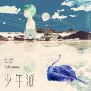

唐汉霄
============================

|  |  |
| :--: | :-- |
| [ 唐汉霄](https://i.xiami.com/tanghanxiao) | **播放数**: 36991230 **粉丝数**: 2461 **评论数**: 137 **地区**: China 中国大陆 **风格**: 流行摇滚 Pop Rock, 国语流行 Mandarin Pop, 华语唱作人 Chinese Singer-Songwriter  |

## 档案

唐汉霄 
英文名：Hamshore 
生日： 1989年2月27日 
星座：双鱼座 
现居：上海 
获奖经历：2007年全国原创校园音乐先锋全国总冠军、2008东方卫视［我型我秀］全国总冠军、2008［东方风云榜］获“东方新人” 等等... 
制作经历： 
• 歌⼿平安首张个人同名专辑【平安】主打歌【forever young】词曲创作 
• 2015年湖南卫视五十集古装大戏【⼥医·明妃转】主题曲创作 
• 台湾金曲奖入围最佳女歌⼿徐佳莹 --【⼤雨将至】 
• 2015台湾⼥歌手戴爱玲新专辑【倔强的温柔】作曲(2015年发⾏) 
• 2015贺岁夺宝大电影【金箍棒传奇2】片尾曲［永无止境］创作、制作、演唱 
• 电影【后备空姐】插曲【谢谢你】(刘宇珽演唱)制作人兼作曲 
• 微电影【他·她】主题曲【听风的歌】(胡灵演唱) 词曲作者 
• 刘惜君2015年专辑歌曲【天意】作曲 
• 胡灵个人专辑主打歌【伤】词曲作者 
• 马海生⾸张个⼈专辑【这⼀秒】作曲；第二张个⼈专辑【小阿猫的彩虹】词曲作者 
• 上海⾳音乐电台101.7【动感101】台歌 创作者,制作人 
• 2012上海国际时装周May.J Show⾳乐总监 
• 2012名仕⾳乐剧全国巡演⾳乐制作、音乐总监 
• 2011东⽅卫视【我心唱响】音乐导演 
• 2013东⽅卫视【中国梦之声】特邀选手培训 
• 2014浙江卫视【中国好舞蹈】⾳乐总监 
• 2014浙江卫视【中国好舞蹈】主题曲【我就是爱跳舞】制作、演唱者 
• 2015郭敬明监制音乐剧版【小时代】音乐统筹 
• 电视剧【爱情不打烊】(2015年上映)主题曲【承受】词曲作者、演唱者 
• 等等 
2014年正式签约美国Peermusic: 
Peermusic 于 1928年由Ralph S. Peer 在美国创办。 是⼀一个在全球拥有28个国家分公司却没有唱⽚片公 司背景的独⽴立⾳音乐版权公司,拥有百万计的流⾏行 ⾳音乐版权:包括流⾏行乐,拉丁,古典,爵⼠士,蓝 调,摇滚等。⼋八⼗〸十多年来,peermusic伴随着很多 如雷贯⽿耳的名字:猫王Elvis Aron Presley、滚⽯石 乐队The Rolling Stones、灵魂歌王Ray Charles、 摇滚乐队平克·弗洛伊德(Pink Floyd)以及顶级 制作⼈人David foster等,也拥有很多红遍全球的歌 曲版权:Whitney Houston《I have nothing》、Josh Groban《you raise me up》、Christina Aguilera 《come on over》、 Rihanna 《umbrella》、 Beyonce 《single lady》、 Katy Perry《firework》以及韩剧《来⾃自 星星的你》插曲《再见》等 


## 专辑

| 名称 | 语种 | 唱片公司 | 发行时间 | 专辑类别 | 专辑风格 |
| :--: | :-- | :-- | :-- | :-- | :-- |
| [ 少年派](./albums/5020603869.md) | 国语 | 华纳唱片 | 2020年05月14日 | EP, 单曲 | 流行 Pop |
| [ 我是什么垃圾](./albums/2105041465.md) | 国语 | 飞果音乐 | 2019年07月14日 | EP, 单曲 |  |
| [ 轻尘](./albums/2103948118.md) | 国语 | 听见时代 | 2018年08月27日 | EP, 单曲 | 电视原声 Television Music, 国语流行 Mandarin Pop |
| [ 让我留在你身边](./albums/2102676003.md) | 国语 | 源泉知识产权 | 2017年01月05日 | EP, 单曲 | 国语流行 Mandarin Pop, 华语唱作人 Chinese Singer-Songwriter |
| [ 承受](./albums/1674670800.md) | 国语 | 辰星萌耀 | 2015年07月03日 | EP, 单曲 | 国语流行 Mandarin Pop |

## 评论

|  |  |  |  |
| :-- | :-- | :-- | :-- |
|  [虾米用户](https://emumo.xiami.com/u/378311148)  2020-10-26 11:50 赞(0) 踩(0) | 
唐兄,经书都古文似懂非懂,有没有把经书翻译成现在逻辑性可以理解的书面文字
 |
|  [虾米用户](https://emumo.xiami.com/u/362083809) 尘归尘 2020-07-18 08:23 赞(0) 踩(0) | 
干巴爹哦，霄霄霄
 |
|  [虾米用户](https://emumo.xiami.com/u/379162683) 我想要记住你们，我想要你... 2020-06-08 10:45 赞(0) 踩(0) | 

 |
|  [虾米用户](https://emumo.xiami.com/u/344720309)  2020-04-19 21:26 赞(0) 踩(0) | 
为什么金刚经播放不了了！好伤心  
 |
|  [虾米用户](https://emumo.xiami.com/u/313700527)  I see you  2020-03-27 22:21 赞(0) 踩(0) | 
上次跟你说了，让你出普贤行愿品念诵版，还不出，刚才又找了，听惯了你的，没办法，又乖乖回来找你来了
 |
|  [虾米用户](https://emumo.xiami.com/u/199136868) 和过去和解吧 2019-09-17 10:26 赞(0) 踩(0) | 
朋友推荐给我的音乐人，棒棒哒，喜欢。
 |
|  [虾米用户](https://emumo.xiami.com/u/412051459)  2019-08-25 14:23 赞(1) 踩(0) | 
末日飞船圈粉，编曲惊艳了。
 |
|  [虾米用户](https://emumo.xiami.com/u/418862382) 如果可以 2019-08-09 15:30 赞(0) 踩(0) | 
喜欢
 |
|  [虾米用户](https://emumo.xiami.com/u/428420026)  2019-08-09 10:12 赞(0) 踩(0) | 
来了来了！
 |
|  [虾米用户](https://emumo.xiami.com/u/400925249)  2019-06-13 11:03 赞(0) 踩(0) | 
霄哥，想把飞入宇宙加入歌单，希望快点出 
 |
|  [虾米用户](https://emumo.xiami.com/u/406095499) 我还没想好要写什么... 2019-05-31 11:44 赞(0) 踩(0) | 
爱了
 |
|  [虾米用户](https://emumo.xiami.com/u/135379) 我还没想好要写什么... 2019-05-28 12:05 赞(0) 踩(0) | 
爱
 |
|  [虾米用户](https://emumo.xiami.com/u/211950581) 你是我立在日头下，藏在心... 2019-05-19 00:35 赞(0) 踩(0) | 
来了来了
 |
|  [虾米用户](https://emumo.xiami.com/u/423205842)  2019-05-18 17:09 赞(0) 踩(0) | 
来啦，小哥哥声音温柔才华也超级棒！！！我能说我是颜粉么？哈哈哈哈哈哈哈哈哈哈哈，无奈我不会吹彩虹屁。 
 |
|  [虾米用户](https://emumo.xiami.com/u/421218213)  2019-05-13 00:24 赞(2) 踩(0) | 
非常有才華。太喜歡你啦     支持你    
 |
|  [虾米用户](https://emumo.xiami.com/u/8128651)  2019-04-20 06:36 赞(0) 踩(0) | 
再等一次潮汐淹没我身体
 |
|  [虾米用户](https://emumo.xiami.com/u/50520284) 他比烟花灿烂 2019-03-12 23:58 赞(4) 踩(0) | 
多出点读经的好不 真的很好听
 |
|  [虾米用户](https://emumo.xiami.com/u/409519216) 菩提心诸善中王 2018-12-28 11:59 赞(0) 踩(0) | 
谢谢！
 |
|  [虾米用户](https://emumo.xiami.com/u/14067350)  2018-12-21 19:19 赞(3) 踩(0) | 
08年就我型我秀冠军了！现在才被熟知，厚积薄发！
 |
|  [虾米用户](https://emumo.xiami.com/u/354480680)  2018-12-03 21:18 赞(0) 踩(0) | 
可以
 |
|  [虾米用户](https://emumo.xiami.com/u/408638766)  2018-11-19 10:39 赞(0) 踩(0) | 
好听
 |
|  [虾米用户](https://emumo.xiami.com/u/355081650)  2018-11-01 08:27 赞(0) 踩(0) | 
喜欢听你讲故事，喜欢你的创作
 |
|  [虾米用户](https://emumo.xiami.com/u/355081650)  2018-11-01 08:26 赞(0) 踩(0) | 
声音有磁性，好听
 |
|  [虾米用户](https://emumo.xiami.com/u/355081650)  2018-11-01 08:26 赞(0) 踩(0) | 
期待更多好作品
 |
|  [虾米用户](https://emumo.xiami.com/u/377408156) 千山万重，不离不弃 2018-10-02 21:04 赞(0) 踩(0) | 
这首歌真的很有力量 很赞
 |
|  [虾米用户](https://emumo.xiami.com/u/403176885) 跳出三界不在五行中 2018-09-04 23:25 赞(0) 踩(0) | 
第一次听你的歌，蛮不错的呢   
 |
|  [虾米用户](https://emumo.xiami.com/u/24322865) 我还没想好要写什么... 2018-08-03 12:56 赞(0) 踩(0) | 
摩天大楼Demo 有吗
 |
|  [虾米用户](https://emumo.xiami.com/u/380277047)  2018-08-01 12:23 赞(0) 踩(0) | 
很舒服的唱歌，很真实，没有那么多复杂的东西在里面
 |
|  [虾米用户](https://emumo.xiami.com/u/376951555)  2018-07-22 13:15 赞(0) 踩(0) | 
声音太好听了，
 |
|  [虾米用户](https://emumo.xiami.com/u/293692544) 你敢给我说话吗？我咬你 2018-06-28 05:02 赞(1) 踩(0) | 
好听
 |
|  [虾米用户](https://emumo.xiami.com/u/48824443) 如果没有我，你的世界会简... 2018-06-09 17:34 赞(1) 踩(0) | 
这首歌挺好听的，我一直都在听！很激励人！
 |
|  [虾米用户](https://emumo.xiami.com/u/352524122)  2018-04-20 23:10 赞(1) 踩(0) | 
因为好听所以下载了
 |
|  [虾米用户](https://emumo.xiami.com/u/8300304) Secret 2018-04-18 09:27 赞(1) 踩(0) | 
好温暖的声音，沉迷，好想把你的声音留在身边。
 |
|  [虾米用户](https://emumo.xiami.com/u/293692544) 你敢给我说话吗？我咬你 2018-04-16 05:19 赞(1) 踩(0) | 
好听
 |
|  [虾米用户](https://emumo.xiami.com/u/354039042) 人参不止眼前的枸杞♨️ 2018-04-01 11:55 赞(4) 踩(0) | 
偶尔点进来！惊喜！小唐你好，唱功OK，有才华、有善根！珍惜！希望你红起来
 |
|  [虾米用户](https://emumo.xiami.com/u/267354129)  2018-03-26 12:04 赞(1) 踩(0) | 
从最强大脑上听到这首歌的右上角！
 |
|  [虾米用户](https://emumo.xiami.com/u/45078057) 如何勾搭妹子 2018-02-28 23:02 赞(2) 踩(0) | 
让我留在你的身边，喜欢
 |
|  [虾米用户](https://emumo.xiami.com/u/345734039)  2018-01-21 13:49 赞(2) 踩(0) | 
声音太好了   
 |
|  [虾米用户](https://emumo.xiami.com/u/344352838)  2018-01-12 01:11 赞(1) 踩(0) | 
请问各位，魔都爱之十二星座那电影，里面的歌曲名字谁知道
 |
|  [虾米用户](https://emumo.xiami.com/u/99435334) 西湖听秋雨，试剑断桥边。 2018-01-09 00:53 赞(1) 踩(0) | 
留在你身边
 |
|  [虾米用户](https://emumo.xiami.com/u/99435334) 西湖听秋雨，试剑断桥边。 2018-01-09 00:52 赞(1) 踩(0) | 
让我
 |
|  [虾米用户](https://emumo.xiami.com/u/292644843) 我还没想好要写什么... 2017-12-30 14:18 赞(1) 踩(0) | 
加油
 |
|  [虾米用户](https://emumo.xiami.com/u/81153448)  2017-12-08 20:32 赞(1) 踩(0) | 
感觉好厉害的样子
 |
|  [虾米用户](https://emumo.xiami.com/u/141266382)  一切的一切 只为EXO 2017-10-27 23:52 赞(9) 踩(0) | 
《让我留在你身边》比起“大大的梦”，我更喜欢“最卑微的梦”。
 |
|  [虾米用户](https://emumo.xiami.com/u/15873569)  2017-10-22 18:42 赞(1) 踩(0) | 
加油！你是最棒的！做最好的自己，喜欢有才的你 
 |
|  [虾米用户](https://emumo.xiami.com/u/221496000)  2017-10-18 22:47 赞(3) 踩(0) | 
还是你的《让我留在你身边》好听些
 |
|  [虾米用户](https://emumo.xiami.com/u/313158055)   2017-10-11 11:52 赞(2) 踩(0) | 
哇，觉得  让我留在你身边 比较喜欢这个版本哎 
 |
|  [虾米用户](https://emumo.xiami.com/u/264616278)  2017-08-13 23:27 赞(4) 踩(0) | 
发现了一颗星！加油！关注你！ 
 |
|  [虾米用户](https://emumo.xiami.com/u/245874176)  2017-08-01 09:23 赞(2) 踩(0) | 
遇见你～加油我们会越来越好   
 |
|  [虾米用户](https://emumo.xiami.com/u/304518791)  学习 2017-07-22 20:21 赞(1) 踩(0) | 
 
 |
|  [虾米用户](https://emumo.xiami.com/u/46415206)  2017-07-15 21:58 赞(1) 踩(0) | 
搜索让我留在你身边。遇见了你。 
 |
|  [虾米用户](https://emumo.xiami.com/u/301043074) 信愿念佛求生净土迅速成佛 2017-07-13 12:38 赞(1) 踩(0) | 
读《金刚经》时请不要读三十二品名！
 |
|  [虾米用户](https://emumo.xiami.com/u/90462670) 我还没想好要写什么... 2017-07-09 18:26 赞(1) 踩(0) | 
你的《三月二十三日晴》跑哪去了 
 |
|  [虾米用户](https://emumo.xiami.com/u/215296727)  2017-07-01 22:37 赞(2) 踩(0) | 
喜欢你唱的&amp;ldquo;让我留在你身边&amp;rdquo; :)
 |
|  [虾米用户](https://emumo.xiami.com/u/79880914) 无签名不性格 2017-06-11 03:36 赞(4) 踩(0) | 
才子 
 |
|  [虾米用户](https://emumo.xiami.com/u/180780500)  2017-06-07 15:55 赞(2) 踩(0) | 
声音好好听哦 
 |
|  [虾米用户](https://emumo.xiami.com/u/293010333)   2017-06-06 20:56 赞(2) 踩(0) | 
很好听的
 |
|  [虾米用户](https://emumo.xiami.com/u/290126114)   2017-05-29 23:39 赞(1) 踩(0) | 
开口跪
 |
|  [虾米用户](https://emumo.xiami.com/u/293404311)  2017-05-21 12:01 赞(1) 踩(0) | 
好听到不行 
 |
|  [虾米用户](https://emumo.xiami.com/u/281815596)  2017-04-23 10:10 赞(1) 踩(0) | 
声音有感情，歌词也很写意，意外听到的，就被深深吸引了
 |
|  [虾米用户](https://emumo.xiami.com/u/290045520)  2017-04-20 11:22 赞(2) 踩(0) | 
好听歌就是喜欢
 |
|  [虾米用户](https://emumo.xiami.com/u/272506591)  2017-04-19 19:00 赞(2) 踩(0) | 
好听
 |
|  [虾米用户](https://emumo.xiami.com/u/289749184)  2017-04-18 23:19 赞(2) 踩(0) | 
好听
 |
|  [虾米用户](https://emumo.xiami.com/u/241156046) 额    。。。。 2017-04-18 23:05 赞(1) 踩(0) | 
第一次了解你，希望你能回复我。我对生活失去了兴趣！
 |
|  [虾米用户](https://emumo.xiami.com/u/114793394)  2017-04-15 11:00 赞(1) 踩(0) | 
好听
 |
|  [虾米用户](https://emumo.xiami.com/u/269014092)  2017-04-10 23:43 赞(0) 踩(0) | 
很喜欢这个唱作人
 |
|  [虾米用户](https://emumo.xiami.com/u/287001026) 愿我们与清风同在 不枉此... 2017-04-08 00:08 赞(0) 踩(0) | 
喜欢听  让我留在你身边  我真的好想好想留在你身边
 |
|  [虾米用户](https://emumo.xiami.com/u/283101010)  2017-04-07 03:09 赞(1) 踩(0) | 
聲音好聽喜歡 讓我留在你身邊 超好聽 同雙魚 支持
 |
|  [虾米用户](https://emumo.xiami.com/u/1505441) 这个家伙很聪明什么也没有... 2017-04-06 20:11 赞(0) 踩(0) | 
不错
 |
|  [虾米用户](https://emumo.xiami.com/u/285627749)  2017-04-03 11:52 赞(0) 踩(0) | 
还可以
 |
|  [虾米用户](https://emumo.xiami.com/u/285332612)  2017-04-02 13:35 赞(1) 踩(0) | 
好听
 |
|  [虾米用户](https://emumo.xiami.com/u/28784597)  2017-04-01 08:13 赞(1) 踩(0) | 
我喜欢你的声音
 |
|  [虾米用户](https://emumo.xiami.com/u/283747465)  2017-03-28 14:14 赞(2) 踩(0) | 
喜欢听，期待有新作品。
 |
|  [虾米用户](https://emumo.xiami.com/u/282465237)  2017-03-24 23:24 赞(1) 踩(0) | 
很喜欢呢
 |
|  [虾米用户](https://emumo.xiami.com/u/257430448)  2017-03-23 15:06 赞(1) 踩(0) | 
好听
 |
|  [虾米用户](https://emumo.xiami.com/u/267075521)  2017-03-22 15:36 赞(0) 踩(0) | 
任务任务
 |
|  [虾米用户](https://emumo.xiami.com/u/280193082)  2017-03-22 09:49 赞(1) 踩(0) | 
真好听喜欢
 |
|  [虾米用户](https://emumo.xiami.com/u/257498452)   2017-03-22 08:51 赞(1) 踩(0) | 
真的好听 
 |
|  [虾米用户](https://emumo.xiami.com/u/281656042)  2017-03-22 04:44 赞(0) 踩(0) | 
还可以。
 |
|  [虾米用户](https://emumo.xiami.com/u/281835243)  2017-03-20 10:02 赞(0) 踩(0) | 
你身边让我留下
 |
|  [虾米用户](https://emumo.xiami.com/u/281229941) 我还没想好要写什么... 2017-03-18 09:02 赞(1) 踩(0) | 
让我留在你身边好听~
 |
|  [虾米用户](https://emumo.xiami.com/u/280272103)  2017-03-14 12:20 赞(0) 踩(0) | 

 |
|  [虾米用户](https://emumo.xiami.com/u/33834465) :) 2017-03-07 18:28 赞(1) 踩(0) | 
喜欢你读的经。
 |
|  [虾米用户](https://emumo.xiami.com/u/33834465) :) 2017-03-07 16:36 赞(1) 踩(0) | 
好舒服的声音。
 |
|  [虾米用户](https://emumo.xiami.com/u/276886624)  2017-02-28 23:41 赞(1) 踩(0) | 
虾米音乐听的第一首歌是你的《让我留在你身边》原唱者是你  
 |
|  [虾米用户](https://emumo.xiami.com/u/123620256) 静静流淌的河流 2017-01-26 16:51 赞(0) 踩(0) | 
唐汉霄
 |
|  [虾米用户](https://emumo.xiami.com/u/181621886)  2017-01-18 21:47 赞(0) 踩(0) | 
我记得他是当年上海卫视的一个节目里面的
 |
|  [虾米用户](https://emumo.xiami.com/u/262685457)  2017-01-18 06:59 赞(0) 踩(0) | 
歌声中充满生活的沧桑！
 |
|  [虾米用户](https://emumo.xiami.com/u/41391689)  2017-01-15 19:46 赞(0) 踩(0) | 
当年的型秀。。。
 |
|  [虾米用户](https://emumo.xiami.com/u/242444499)  2017-01-12 23:40 赞(0) 踩(0) | 
对
 |
|  [虾米用户](https://emumo.xiami.com/u/109159082)   2017-01-09 23:58 赞(1) 踩(0) | 
赞
 |
|  [虾米用户](https://emumo.xiami.com/u/132365696) 幾時歸去做個閒人 背一張... 2017-01-09 22:03 赞(1) 踩(0) | 
喜欢你的声音
 |
|  [虾米用户](https://emumo.xiami.com/u/257876245)  2017-01-08 17:45 赞(1) 踩(0) | 
在。你好.再多多发布新的音乐作品。是佛教题材的作品。谢谢。
 |
|  [虾米用户](https://emumo.xiami.com/u/260011461)  2017-01-07 00:39 赞(1) 踩(0) | 
好听！！！
 |
|  [虾米用户](https://emumo.xiami.com/u/72666568)  2017-01-02 07:48 赞(1) 踩(0) | 
哈咯
 |
|  [虾米用户](https://emumo.xiami.com/u/224050385) 慢生活，平常心 2016-09-07 23:57 赞(1) 踩(0) | 

 |
|  [虾米用户](https://emumo.xiami.com/u/7230112) 聪明人留下只有一抹清香 2016-07-31 09:53 赞(1) 踩(0) | 
声音好
 |
|  [虾米用户](https://emumo.xiami.com/u/8320697)  2016-06-24 17:20 赞(1) 踩(0) | 
 
 |
|  [虾米用户](https://emumo.xiami.com/u/18282119) 我就是我，独一无二 2016-06-06 20:52 赞(0) 踩(0) | 
娜比新歌应该是你作曲吧？
 |
|  [虾米用户](https://emumo.xiami.com/u/161740938)  2016-05-24 11:51 赞(1) 踩(0) | 
好听！你很棒！
 |
|  [虾米用户](https://emumo.xiami.com/u/112703096)   2016-05-05 05:01 赞(1) 踩(0) | 
喜欢
 |
|  [虾米用户](https://emumo.xiami.com/u/13609993) 没有酒 让你醉 2015-07-20 10:02 赞(1) 踩(0) | 
赞
 |
|  [虾米用户](https://emumo.xiami.com/u/18282119) 我就是我，独一无二 2015-04-18 15:07 赞(13) 踩(0) | 
代表作：徐佳莹《大雨将至》作词之一(另一位是内地作词人田辰明)与作曲。
 |
|  [虾米用户](https://emumo.xiami.com/u/45547738)  2015-02-02 00:10 赞(1) 踩(0) | 
好啦 小雪来捧场子来了 见过唐本人 超级时尚大帅哥 做音乐非常认真 人也很好 大家多支持啦
 |
|  [虾米用户](https://emumo.xiami.com/u/46482317)  2015-01-25 23:02 赞(0) 踩(0) | 
喜欢你
 |
|  [虾米用户](https://emumo.xiami.com/u/34337856)  2015-01-24 21:05 赞(0) 踩(0) | 
喜欢的一句：别再为谁掉眼泪 ,别再为谁做改变，都是无谓…
 |
|  [虾米用户](https://emumo.xiami.com/u/46418352)  2015-01-24 14:13 赞(0) 踩(0) | 
好声音就想和你分享
 |
|  [虾米用户](https://emumo.xiami.com/u/45948478)  2015-01-22 22:11 赞(0) 踩(0) | 
记得 “伤心的人别听慢歌 ”翻唱的也是我喜欢听的风格
 |
|  [虾米用户](https://emumo.xiami.com/u/36320039) 沧海一粟… 2015-01-22 18:03 赞(1) 踩(0) | 
台北夜未眠这首歌真情流露，句句都是回忆…
 |
| ⇒ |  [虾米用户](https://emumo.xiami.com/u/270973232) 我还没想好要写什么... 2017-02-05 21:54 赞(0) 踩(0) | 
！！对 那个节目是什么来着 超级星光？
 |
|  [虾米用户](https://emumo.xiami.com/u/16328380)  2015-01-20 21:01 赞(1) 踩(0) | 
喜欢你的歌和声音，虽然你不想红，但是我觉得也许有一天你想不用都难
 |
|  [虾米用户](https://emumo.xiami.com/u/46086349)  2015-01-17 23:24 赞(1) 踩(0) | 
✌️ 我来也
 |
|  [虾米用户](https://emumo.xiami.com/u/18089421)  2015-01-09 12:21 赞(0) 踩(0) | 
终于来了！
 |
|  [虾米用户](https://emumo.xiami.com/u/11871209)   2015-01-08 18:42 赞(0) 踩(0) | 
吼吼
 |
| ⇒ |  [虾米用户](https://emumo.xiami.com/u/8398466) 华语新锐创作人 2015-01-08 18:47 赞(0) 踩(0) | 

 |
| ⇒ |  [虾米用户](https://emumo.xiami.com/u/190837)  2015-01-15 12:17 赞(0) 踩(0) | 
哇哈 老人啊
 |
| ⇒ |  [虾米用户](https://emumo.xiami.com/u/46086349)  2015-01-17 23:24 赞(0) 踩(0) | 
<q><b>辛凌说：</b></q>
 |
| ⇒ |  [虾米用户](https://emumo.xiami.com/u/190837)  2015-01-21 18:55 赞(0) 踩(0) | 
<q><b>想要走遍世界每个角落说：</b></q>
 |
|  [虾米用户](https://emumo.xiami.com/u/8398466) 华语新锐创作人 2015-01-08 18:00 赞(176) 踩(0) | 
大家好，我是唐汉霄，刚入驻了虾米音乐人，今后随时在这里发布新的音乐哦
 |
| ⇒ |  [虾米用户](https://emumo.xiami.com/u/285021812)  2017-04-01 23:46 赞(0) 踩(0) | 
加油
 |
| ⇒ |  [虾米用户](https://emumo.xiami.com/u/285021812)  2017-04-01 23:46 赞(0) 踩(0) | 
都陪你度过
 |
| ⇒ |  [虾米用户](https://emumo.xiami.com/u/11768487)   2017-05-31 15:20 赞(0) 踩(0) | 
感谢你创作的美好一曲《大雨将至》非常非常棒，太喜欢了，然后，也因此才去了看电视剧，很感人很励志!!
 |
| ⇒ |  [虾米用户](https://emumo.xiami.com/u/292544832)  2017-10-03 14:30 赞(0) 踩(0) | 
加油
 |
| ⇒ |  [虾米用户](https://emumo.xiami.com/u/305534949) 速食短季浪漫主义懒人后期... 2017-10-04 16:18 赞(0) 踩(0) | 
太棒了，我很迷你的作品。辛苦老师了
 |
| ⇒ |  [虾米用户](https://emumo.xiami.com/u/301043074) 信愿念佛求生净土迅速成佛 2017-10-28 00:14 赞(0) 踩(0) | 
你读的金刚经很有味道！记住，读《金刚经》时请不要读三十二品名！分品的那位太子至今还在地狱里！！！你重新录一遍吧！还有，阿兰那的“那”就读na，不要读nuo
 |
| ⇒ |  [虾米用户](https://emumo.xiami.com/u/313815640)  2017-12-09 20:07 赞(0) 踩(0) | 
让我留在你身边，真的好听
 |
| ⇒ |  [虾米用户](https://emumo.xiami.com/u/335797064) 积极、阳光、向上，做最好... 2017-12-12 18:52 赞(0) 踩(0) | 
《金刚经》诵读的超好，期待《地藏经》的念诵，
 |
| ⇒ |  [虾米用户](https://emumo.xiami.com/u/300012512)  2018-01-22 03:18 赞(0) 踩(0) | 
期待地藏经的诵读
 |
| ⇒ |  [虾米用户](https://emumo.xiami.com/u/421218213)  2019-05-13 00:40 赞(0) 踩(0) | 
非常有才華。支持你   
 |
| ⇒ |  [虾米用户](https://emumo.xiami.com/u/286620574) 我还没想好要写什么... 2019-06-12 09:44 赞(0) 踩(0) | 
头疼脑热时，都来听你念的佛经。静心，净身。期待能继续出新加油，小伙咂
 |
| ⇒ |  [虾米用户](https://emumo.xiami.com/u/313700527)  I see you  2019-10-18 07:16 赞(0) 踩(0) | 
祈愿能听你的普贤行愿品念诵版
 |
| ⇒ |  [虾米用户](https://emumo.xiami.com/u/44937531) 应无所住，而生其心。 2019-10-28 09:52 赞(0) 踩(0) | 
阿弥陀佛，可以录制《无量寿经》吗？ 
 |
|  [虾米用户](https://emumo.xiami.com/u/1931086) 正义，或许会迟到，但永远... 2014-08-18 21:21 赞(0) 踩(0) | 
《思念是一种病（返璞归真）》非常好听。
 |
|  [虾米用户](https://emumo.xiami.com/u/12988935) 暂无签名~ 2014-07-15 15:35 赞(0) 踩(0) | 
为毛没有我就爱跳舞
 |
| ⇒ |  [虾米用户](https://emumo.xiami.com/u/190837)  2015-01-15 12:17 赞(0) 踩(0) | 
已发布
 |
|  [虾米用户](https://emumo.xiami.com/u/4901798)  2014-06-13 01:56 赞(0) 踩(0) | 
我就是爱跳舞～
 |
|  [虾米用户](https://emumo.xiami.com/u/5144044) 不会聊天的男生配拥有爱情... 2014-06-09 21:40 赞(1) 踩(0) | 
推荐唐汉霄的《台北夜未眠》
 |
