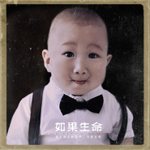

如果生命The Fifth Album
============================

|  |  |
| :--: | :-- |
| [ 如果生命The Fifth Album](https://emumo.xiami.com/album/2102932129) | **艺人**: [崔天琪](../index.md) **语种**: 国语 **唱片公司**: 巨声文化 **发行时间**: 2017年12月26日 **专辑类别**: 录音室专辑 **专辑风格**:  **播放数**: 91513 **收藏数**: 18 **评论数**: 3  |

## 简介

《如果生命》是崔天琪的第五张全新专辑，也是崔天琪因爱而作、为爱发声的全新呐喊。《如果生命》这张专辑由知名音乐制作人彭泓鸣老师量身打造。专辑中有三首崔天琪自己作词作曲的原创歌曲，讲述了新的一年崔天琪对于音乐、生命的体悟。  
专辑的同名歌曲《如果生命》提出了一个思考性话题：如果生命只剩下最后一天，你会选择留在谁身边？抛出的这个生命沉重的话题，是为了引发听众向内思考，拨开尘世中的一切虚无欲望，回归生命中真正的意义所在。  
《如果生命》中的歌曲有的是清新淡雅的民谣，有的是朗朗上口的流行，有的是劲爆呐喊的摇滚...  
在这张专辑里，你总会找得到自己喜欢的歌曲。一起来，听，崔天琪全新的声音。

## 曲目

## 评论

|  |  |  |
| :-- | :-- | :-- |
|  [虾米用户](https://emumo.xiami.com/u/198177246)  2018-08-16 11:15 赞(0) 踩(0) | 
可以
 |
|  [虾米用户](https://emumo.xiami.com/u/346980199) 我还没想好要写什么... 2018-04-27 21:06 赞(0) 踩(0) | 
233
 |
|  [虾米用户](https://emumo.xiami.com/u/24143615) 嘘! 2017-11-16 10:55 赞(1) 踩(0) | 
-0-
 |
