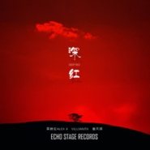

深红
============================

|  |  |
| :--: | :-- |
| [ 深红](https://emumo.xiami.com/album/2104737368) | **艺人**: [崔天琪](../index.md) **语种**: 国语 **唱片公司**: 看见音乐 (上海) **发行时间**: 2019年04月05日 **专辑类别**: EP, 单曲 **专辑风格**: 电子乐 Electronica **播放数**: 2923 **收藏数**: 1 **评论数**: 0  |

## 简介

吴赫伦、崔天琪、VillianmX，三位音乐人合作的原创电子音乐单曲《深红》，结合了2018年大热的Future Bounce风格，树立EDM在中文世界的标杆，将引领华人电子音乐的风潮。 

## 曲目

## 评论

|  |  |  |  |
| :-- | :-- | :-- | :-- |
