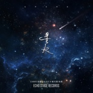

星火
============================

|  |  |
| :--: | :-- |
| [ 星火](https://emumo.xiami.com/album/2104737370) | **艺人**: [崔天琪](../index.md) **语种**: 国语 **唱片公司**: 看见音乐 (上海) **发行时间**: 2019年04月05日 **专辑类别**: EP, 单曲 **专辑风格**: 电子乐 Electronica **播放数**: 2585 **收藏数**: 1 **评论数**: 1  |

## 简介

Cibbs、吴赫伦、崔天琪、孙禹，共同合作Progressive House单曲《星火》，飘渺的Vocal配上积极向上的旋律，动人的歌词深入人心。 

## 曲目

## 评论

|  |  |  |  |
| :-- | :-- | :-- | :-- |
|  [虾米用户](https://emumo.xiami.com/u/414161215)  2019-04-29 08:11 赞(0) 踩(0) | 
喜欢她的嗓子
 |
