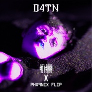
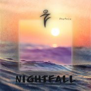
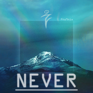
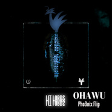
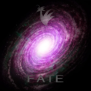
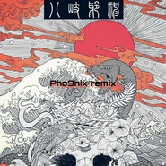
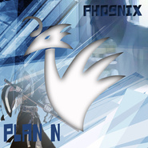

Pho9nix
============================

|  |  |
| :--: | :-- |
| [ Pho9nix](https://i.xiami.com/xosdap) | **播放数**: 3331938 **粉丝数**: 207 **评论数**: 37 **地区**: China 中国大陆 **风格**: 浩室舞曲 House, 陷阱舞曲 Trap, 回响贝斯 Dubstep  |

## 档案

X = my name os = house style d = dubstep style ap = trap style  New ID：Pho9nix   Like a phoenix!

## 专辑

| 名称 | 语种 | 唱片公司 | 发行时间 | 专辑类别 | 专辑风格 |
| :--: | :-- | :-- | :-- | :-- | :-- |
| [ D4TN(Pho9nix Flip)](./albums/5022316067.md) | 纯音乐 | 独立发行 | 2021年01月01日 | EP, 单曲 | 陷阱舞曲 Trap |
| [ Nightfall](./albums/5022094020.md) | 纯音乐 | 独立发行 | 2020年12月02日 | EP, 单曲 | 浩室舞曲 House, 贝斯浩室 Bass House |
| [ NEVER](./albums/5021696613.md) | 纯音乐 | 独立发行 | 2020年10月16日 | EP, 单曲 | 未来贝斯 Future Bass, 陷阱舞曲 Trap |
| [ Dreamland](./albums/5021397552.md) | 纯音乐 | 独立发行 | 2020年09月01日 | EP, 单曲 | 陷阱舞曲 Trap, 未来贝斯 Future Bass |
| [ ConFusion](./albums/5021018138.md) | 纯音乐 | 独立发行 | 2020年07月01日 | 录音室专辑 | 未来贝斯 Future Bass, 回响贝斯 Dubstep |
| [ Virus](./albums/2108389137.md) | 纯音乐 | 独立发行 | 2020年04月27日 | 录音室专辑 | 陷阱舞曲 Trap |
| [ Only FLEX](./albums/2108168154.md) | 其他 | 独立发行 | 2020年03月15日 | EP, 单曲 | 氛围回响 Ambient Dub |
| [ My Pack Vol.1](./albums/2420328681.md) | 粤语 | 独立发行 | 2020年03月01日 | 录音室专辑 | 陷阱舞曲 Trap, 未来贝斯 Future Bass |
| [ My Feel](./albums/2105768981.md) | 其他 | 独立发行 | 2020年01月23日 | EP, 单曲 | 脉冲流行 Glitch Hop |
| [ Resuscitate](./albums/2105679726.md) | 其他 | 独立发行 | 2020年01月04日 | EP, 单曲 | 陷阱舞曲 Trap, 未来贝斯 Future Bass |
| [ Going To The Sun[Pho9nix Bootleg]](./albums/2105656899.md) | 英语 | 独立发行 | 2019年12月31日 | EP, 单曲 | 回响贝斯 Dubstep |
| [ OHAWU(Pho9nix Flip)](./albums/2105531228.md) | 其他 |  | 2019年11月27日 | EP, 单曲 | 陷阱舞曲 Trap |
| [ HUMBLE. (Skrillex Remix) [Pho9nix Flip]](./albums/2105372188.md) | 英语 |  | 2019年10月24日 | EP, 单曲 | 陷阱舞曲 Trap |
| [ FATE](./albums/2105181785.md) | 其他 |  | 2019年08月25日 | 录音室专辑 | 未来贝斯 Future Bass, 氛围音乐 Ambient, 深浩室舞曲 Deep House |
| [ 不](./albums/2105045843.md) | 其他 |  | 2019年07月31日 | EP, 单曲 | 未来贝斯 Future Bass |
| [ 請假](./albums/2105017855.md) | 粤语 |  | 2019年07月23日 | EP, 单曲 | 陷阱舞曲 Trap |
| [ 鬼畜明星的周末派对Weekends (Crankdat Re-Crank)[Pho9nix Cover]](./albums/2105011580.md) | 其他 |  | 2019年07月22日 | EP, 单曲 | 浩室舞曲 House |
| [ Planet Earth(Pho9nix Flip)](./albums/2104959074.md) | 其他 |  | 2019年06月23日 | EP, 单曲 | 回响贝斯 Dubstep |
| [ HARD GIAO](./albums/2104936717.md) | 国语 |  | 2019年06月10日 | EP, 单曲 | 陷阱舞曲 Trap |
| [ 八岐(Pho9nix Remix)](./albums/2104901446.md) | 其他 |  | 2019年05月26日 | EP, 单曲 | 陷阱舞曲 Trap |
| [ 逐梦令(cover)](./albums/2104881827.md) | 国语 |  | 2019年05月20日 | EP, 单曲 | 流行 Pop |
| [ Plan N](./albums/2104854469.md) | 其他 |  | 2019年05月10日 | EP, 单曲 | 回响贝斯 Dubstep |
| [ Wild For The J.N.T.M狂野的鸡你太美](./albums/2104798212.md) | 国语 |  | 2019年04月22日 | EP, 单曲 | 陷阱舞曲 Trap |
| [ 回面游筋回梦游仙(cover)](./albums/2104706158.md) | 国语 | 独立发行 | 2019年03月23日 | EP, 单曲 | 陷阱舞曲 Trap, 中国风 China-Wave |
| [ Earthsphere(Pho9nix Flip)](./albums/2104649237.md) | 其他 | 独立发行 | 2019年03月03日 | EP, 单曲 | 未来贝斯 Future Bass, 陷阱舞曲 Trap |
| [ Voice](./albums/2104598810.md) | 其他 | 独立发行 | 2019年02月16日 | EP, 单曲 | 未来贝斯 Future Bass, 陷阱舞曲 Trap, 回响贝斯 Dubstep |
| [ A Foreign Land(VIP)](./albums/2104407182.md) | 其他 |  | 2018年12月24日 | EP, 单曲 | 未来贝斯 Future Bass, 回响贝斯 Dubstep |
| [ Liberate](./albums/2103702406.md) | 英语 | 独立发行 | 2018年05月05日 | EP, 单曲 | 陷阱舞曲 Trap, 浩室舞曲 House, 未来贝斯 Future Bass |
| [ ARP](./albums/2102813342.md) | 其他 | 独立发行 | 2017年08月13日 | 录音室专辑 | 陷阱舞曲 Trap |
| [ Pool](./albums/2100309738.md) | 其他 | 独立发行 | 2016年04月09日 | EP, 单曲 | 回响贝斯 Dubstep |
| [ A Foreign Land ⅡVillage In The City](./albums/2100255614.md) | 其他 | 独立发行 | 2016年01月06日 | EP, 单曲 | 浩室舞曲 House, 回响贝斯 Dubstep |
| [ A Foreign Land ⅠHometown](./albums/2100255148.md) | 其他 | 独立发行 | 2016年01月06日 | EP, 单曲 | 脉冲 Glitch, 回响贝斯 Dubstep |
| [ Night](./albums/2100211696.md) | 其他 | 独立发行 | 2015年10月02日 | EP, 单曲 | 浩室舞曲 House, 陷阱舞曲 Trap |
| [ Melodic Dubstep Remix](./albums/832130887.md) | 英语 | 独立发行 | 2015年05月20日 | EP, 单曲 | 回响贝斯 Dubstep |

## 评论

|  |  |  |  |
| :-- | :-- | :-- | :-- |
|  [虾米用户](https://emumo.xiami.com/u/444736485)  2020-08-28 23:58 赞(2) 踩(0) | 
逝者安息   
 |
| ⇒ |  [虾米用户](https://emumo.xiami.com/u/440210466) ◡ 2020-09-19 12:41 赞(0) 踩(0) | 
是不是吃上了？
 |
|  [虾米用户](https://emumo.xiami.com/u/442501476) 唯坤 2020-05-01 13:01 赞(2) 踩(0) | 
ikun要高冷，所以举报不谢
 |
|  [虾米用户](https://emumo.xiami.com/u/442515982)  2020-04-27 16:09 赞(1) 踩(0) | 
nb啊           
 |
|  [虾米用户](https://emumo.xiami.com/u/411133757) k . 2020-04-07 21:47 赞(0) 踩(0) | 
喜欢
 |
| ⇒ |  [虾米用户](https://emumo.xiami.com/u/444736485)  2020-08-28 23:59 赞(0) 踩(0) | 
喜欢你
 |
| ⇒ |  [虾米用户](https://emumo.xiami.com/u/440210466) ◡ 2020-09-19 12:41 赞(0) 踩(0) | 
<q><b>葵葵.说：</b></q>
 |
|  [虾米用户](https://emumo.xiami.com/u/87985250)  2020-01-31 09:51 赞(0) 踩(0) | 
公鸡
 |
|  [虾米用户](https://emumo.xiami.com/u/428235557)  2019-12-16 19:57 赞(0) 踩(0) | 
好听
 |
|  [虾米用户](https://emumo.xiami.com/u/427929186)  2019-08-30 17:54 赞(2) 踩(0) | 
一giao我里giao，诶，诶，鸡你太美
 |
| ⇒ |  [虾米用户](https://emumo.xiami.com/u/444736485)  2020-08-28 23:59 赞(0) 踩(0) | 
就这？
 |
|  [虾米用户](https://emumo.xiami.com/u/420831355) 音乐制作人，DJ，努力中 2019-08-25 11:43 赞(2) 踩(0) | 
鲲那个真NB
 |
|  [虾米用户](https://emumo.xiami.com/u/428235557)  2019-08-14 15:22 赞(0) 踩(0) | 
好
 |
|  [虾米用户](https://emumo.xiami.com/u/428235557)  2019-08-14 15:19 赞(1) 踩(0) | 
淡定小弟出世
 |
|  [虾米用户](https://emumo.xiami.com/u/425499564)  2019-07-22 21:03 赞(1) 踩(0) | 
好
 |
|  [虾米用户](https://emumo.xiami.com/u/40686510) 我还没想好要写什么... 2019-06-23 12:30 赞(3) 踩(0) | 
很感谢大家对我作品的支持，未来我会继续努力，制作出更优秀的作品。
 |
| ⇒ |  [虾米用户](https://emumo.xiami.com/u/425499564)  2019-07-22 21:04 赞(0) 踩(0) | 
淡定大哥被封号，你的铁粉 
 |
|  [虾米用户](https://emumo.xiami.com/u/378502525)   2019-06-20 21:46 赞(1) 踩(0) | 
烤面筋(ಥ_ಥ)
 |
|  [虾米用户](https://emumo.xiami.com/u/341184650) 长风破浪会有时，直挂云帆... 2019-06-15 10:56 赞(1) 踩(0) | 
鸡你太美上天了。
 |
|  [虾米用户](https://emumo.xiami.com/u/377146899) Anti-TikTok ... 2019-04-30 16:28 赞(9) 踩(0) | 
菜虚鲲那个太赞了
 |
| ⇒ |  [虾米用户](https://emumo.xiami.com/u/444736485)  2020-08-29 00:00 赞(0) 踩(0) | 
你脑子被踢了？
 |
| ⇒ |  [虾米用户](https://emumo.xiami.com/u/444736485)  2020-08-29 00:00 赞(0) 踩(0) | 
呸
 |
| ⇒ |  [虾米用户](https://emumo.xiami.com/u/440210466) ◡ 2020-09-19 12:40 赞(0) 踩(0) | 
<q><b>葵葵.说：</b></q>
 |
|  [虾米用户](https://emumo.xiami.com/u/400822237)  2019-02-06 07:10 赞(1) 踩(0) | 
******
 |
|  [虾米用户](https://emumo.xiami.com/u/238597172)  2019-01-17 07:26 赞(1) 踩(0) | 
加油 
 |
|  [虾米用户](https://emumo.xiami.com/u/238597172)  2019-01-12 07:31 赞(1) 踩(0) | 
nice呀老铁
 |
|  [虾米用户](https://emumo.xiami.com/u/40686510) 我还没想好要写什么... 2018-05-05 01:43 赞(1) 踩(0) | 
其实原创也挺好的呀 大伙去听听呗！
 |
|  [虾米用户](https://emumo.xiami.com/u/335481537)  2017-12-09 09:48 赞(1) 踩(0) | 
好听
 |
|  [虾米用户](https://emumo.xiami.com/u/45052758) 我还没想好要写什么... 2017-08-02 22:44 赞(1) 踩(0) | 
[带墨镜笑]
 |
|  [虾米用户](https://emumo.xiami.com/u/8543906) 死气沉沉 2016-08-11 14:37 赞(0) 踩(0) | 
加油
 |
|  [虾米用户](https://emumo.xiami.com/u/14091078) 我还没想好要写什么... 2016-05-15 17:02 赞(0) 踩(0) | 
期待！
 |
|  [虾米用户](https://emumo.xiami.com/u/58545252)   2016-02-05 20:28 赞(1) 踩(0) | 
melodic草泥马简直太在了凶逮！
 |
| ⇒ |  [虾米用户](https://emumo.xiami.com/u/40686510) 我还没想好要写什么... 2017-10-27 23:54 赞(0) 踩(0) | 
感觉最近对melodic有点没feel，对trap的feel那是高高的，可能迟些日子，我作品要偏future bass。到时候请多多支持啦！
 |
|  [虾米用户](https://emumo.xiami.com/u/4935021) 没有音乐不能呼吸、 2015-12-24 14:43 赞(2) 踩(0) | 
!!!
 |
|  [虾米用户](https://emumo.xiami.com/u/37860180) 暂无签名~ 2015-06-14 00:33 赞(2) 踩(0) | 
赞一下
 |
|  [虾米用户](https://emumo.xiami.com/u/39193232)  2015-05-31 19:21 赞(2) 踩(0) | 
支持一下
 |
|  [虾米用户](https://emumo.xiami.com/u/40686510) 我还没想好要写什么... 2015-04-17 19:59 赞(2) 踩(0) | 
我刚入驻了虾米音乐人，欢迎大家来我的个人主页，收听我的最新音乐
 |
