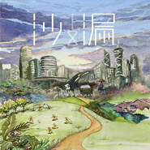

沙漏SAALAU
============================

|  |  |
| :--: | :-- |
| [ 沙漏SAALAU](https://i.xiami.com/highway) | **地区**: China 中国大陆 **风格**: 流行摇滚 Pop Rock **播放数**: 1299504 **粉丝数**: 1165 **评论数**: 97  |

## 档案

乐队经理人：胡椒 18620424403 联系邮箱：kuseki@qq.com  新浪微博：沙漏乐队 hourglass  微信公众号：沙漏乐队 hourglass  豆瓣：沙漏乐队  沙漏乐队由主唱Kelvin（梁嘉诚）、键盘Leon（黄灏晖）主音吉他洋溢（杨逸）、节奏吉他Noah（殷基隆）和贝斯Stephen（刘伟明）、鼓手Jerry（鲁健良）组成。 风格以流行为主的沙漏组建于江门，在这个悠然闲适的城市品味着身边的人情世故、分离聚合，将所有的感悟谱成音符写成歌，凝成一粒粒沙子，灌进无形的漏斗，随时间滴落生活，滑入人心。

## 专辑

| 名称 | 语种 | 唱片公司 | 发行时间 | 专辑类别 | 专辑风格 |
| :--: | :-- | :-- | :-- | :-- | :-- |
| [ 信](./albums/5021128064.md) | 国语 | hourglass | 2020年07月20日 | EP, 单曲 | 流行 Pop |
| [ 小火花](./albums/5020956124.md) | 国语 | 独立发行 | 2020年06月30日 | EP, 单曲 | 国语流行 Mandarin Pop |
| [ 拉扯](./albums/2104918133.md) | 国语 |  | 2019年06月02日 | 录音室专辑 | 流行 Pop |
| [ 时代](./albums/2103754966.md) | 粤语 | 独立发行 | 2018年12月10日 | 录音室专辑 | 流行摇滚 Pop Rock, 独立流行 Indie Pop |
| [ Queen](./albums/2104132707.md) | 国语 | 独立发行 | 2018年10月22日 | 录音室专辑 | 流行 Pop |
| [ When we're young](./albums/2103947289.md) | 英语 | 独立发行 | 2018年08月25日 | EP, 单曲 | 流行 Pop |
| [ 时限](./albums/2103754961.md) | 粤语 | 独立发行 | 2018年06月22日 | EP, 单曲 | 独立流行 Indie Pop, 流行摇滚 Pop Rock |
| [ 小路（Single）](./albums/2102751394.md) | 国语 | 独立发行 | 2017年05月20日 | EP, 单曲 | 国语流行 Mandarin Pop |
| [ 沙漏SAALAU的专辑](./albums/5022634589.md) | 其他 |  | 不详 |  |  |

## 评论

|  |  |  |
| :-- | :-- | :-- |
|  [虾米用户](https://emumo.xiami.com/u/16649448)  2020-08-02 11:01 赞(0) 踩(0) | 
好听！支持本地原创！
 |
|  [虾米用户](https://emumo.xiami.com/u/435053249) 一个嗜好太多能力太小的普... 2020-05-06 22:05 赞(0) 踩(0) | 
沙漏！
 |
|  [虾米用户](https://emumo.xiami.com/u/11452682) 很想找个人 对我说别怯慌 2020-01-30 00:14 赞(0) 踩(0) | 
支持粤语原创歌曲赞
 |
|  [虾米用户](https://emumo.xiami.com/u/334842259)  2018-12-11 00:48 赞(0) 踩(0) | 
草莓音乐节圈粉，越来越多人沙漏了！下一年你们要换大舞台！
 |
|  [虾米用户](https://emumo.xiami.com/u/7676740) 没关系。 2018-12-10 17:45 赞(0) 踩(0) | 
唔错唔错
 |
|  [虾米用户](https://emumo.xiami.com/u/306606246) 不喜全世界 2018-11-10 23:25 赞(3) 踩(0) | 
12月9号广州草莓音乐节等我～
 |
|  [虾米用户](https://emumo.xiami.com/u/286542479)  2018-08-06 22:31 赞(0) 踩(0) | 
16年仲夏音乐节，我们队后面鼓手原因没上
 |
|  [虾米用户](https://emumo.xiami.com/u/9834177)   2018-05-17 14:27 赞(1) 踩(0) | 
好喜欢
 |
|  [虾米用户](https://emumo.xiami.com/u/59772486) 过一天，算一天。走一步，... 2018-05-01 09:59 赞(1) 踩(0) | 
430演唱会听过之后觉得很好听，立即翻来虾米搜你地葛歌听，好听。大江，水步，北陡的你们好棒
 |
|  [虾米用户](https://emumo.xiami.com/u/30832084)   2018-02-01 09:39 赞(0) 踩(0) | 
有没有江门的朋友！沙漏的鼓手在蓝精灵江海艺术城教爵士鼓啊！！！
 |
|  [虾米用户](https://emumo.xiami.com/u/337766561) 等只会失去，珍惜才会拥有... 2017-11-29 09:23 赞(3) 踩(0) | 
沙漏再发新专辑
 |
|  [虾米用户](https://emumo.xiami.com/u/334837341) 我还没想好要写什么... 2017-11-12 18:17 赞(3) 踩(0) | 
昨晚容桂Tao花很棒哦
 |
|  [虾米用户](https://emumo.xiami.com/u/86472542)  2017-11-12 18:06 赞(1) 踩(0) | 
求时限，求信！这两首歌！我是焖饼粉丝的粉丝！！
 |
|  [虾米用户](https://emumo.xiami.com/u/13066088)  2017-11-06 02:05 赞(0) 踩(0) | 
明年再来重庆哦！
 |
| ⇒ |  [虾米用户](https://emumo.xiami.com/u/8182190) 我还没想好要写什么... 2017-11-22 21:43 赞(0) 踩(0) | 
有机会一定去的！
 |
|  [虾米用户](https://emumo.xiami.com/u/331195171)  2017-10-22 15:41 赞(0) 踩(0) | 
好溫暖
 |
|  [虾米用户](https://emumo.xiami.com/u/73759944) 我还没想好要写什么... 2017-08-19 11:48 赞(0) 踩(0) | 
  
 |
|  [虾米用户](https://emumo.xiami.com/u/203402748) 你是我抽了一晚上的烟 2017-08-06 01:32 赞(0) 踩(0) | 
希望不要火
 |
|  [虾米用户](https://emumo.xiami.com/u/152753692)  2017-06-14 20:38 赞(0) 踩(0) | 
这么好的乐队简介就这么几句话
 |
|  [虾米用户](https://emumo.xiami.com/u/304192094)   2017-06-13 16:07 赞(0) 踩(0) | 
北师珠 喜欢queen
 |
|  [虾米用户](https://emumo.xiami.com/u/52484368) 走过的叫足迹，走不到叫憧... 2017-06-11 08:34 赞(0) 踩(0) | 
北师珠学生前来打卡！昨晚现场听时代和小路被圈粉，简直感动得不要不要的 真的是好好听啊~刚刚把沙漏乐队推荐给同样热爱音乐的小伙伴，他开心地说这样他就不会歌荒了 
 |
|  [虾米用户](https://emumo.xiami.com/u/95926118)  2017-06-11 00:03 赞(1) 踩(0) | 
北师珠现场圈粉！！！超好听！！
 |
|  [虾米用户](https://emumo.xiami.com/u/51853971) 我还没想好要写什么... 2017-06-10 23:56 赞(2) 踩(0) | 
现场听真的hin棒！北师大珠海被圈粉
 |
|  [虾米用户](https://emumo.xiami.com/u/33075356)  2017-05-31 13:45 赞(0) 踩(0) | 
加油，喜欢你们的时限，时光机，时代，小路&amp;hellip;&amp;hellip;加油！快d出专辑！
 |
|  [虾米用户](https://emumo.xiami.com/u/203402748) 你是我抽了一晚上的烟 2017-04-22 07:57 赞(2) 踩(0) | 
以前很喜欢的一个男生一直放沙漏的歌第一次听就喜欢上了 人会越走越远但是回忆不会啊
 |
|  [虾米用户](https://emumo.xiami.com/u/90578584) 一个决定，一步一生。 2017-04-02 20:16 赞(0) 踩(0) | 
第287号fans报道。
 |
|  [虾米用户](https://emumo.xiami.com/u/6375845)   2017-02-22 10:42 赞(0) 踩(0) | 
有没有在南狮音乐节过来的朋友哇？
 |
|  [虾米用户](https://emumo.xiami.com/u/195333757)   2017-01-05 21:39 赞(0) 踩(0) | 
沙滩音乐节见到你地，第一下就中意啦！后来先知原来你地係江门嘅，老乡啊喂！ 
 |
|  [虾米用户](https://emumo.xiami.com/u/163353136) 总想保持绝对的客观，却又... 2016-10-22 16:33 赞(0) 踩(0) | 
在珠海音乐节上听到了你们的歌，很喜欢，加油！
 |
|  [虾米用户](https://emumo.xiami.com/u/234101939)  2016-10-06 21:14 赞(1) 踩(0) | 
哈哈，我北滘仲夏音乐节听翻嚟㗎
 |
|  [虾米用户](https://emumo.xiami.com/u/16135450)  2016-10-06 01:12 赞(0) 踩(0) | 
4427
 |
|  [虾米用户](https://emumo.xiami.com/u/46261075)   2016-10-03 21:12 赞(3) 踩(0) | 
珠海音乐节后来报道！
 |
|  [虾米用户](https://emumo.xiami.com/u/11232427) ROCK！！yeah！！ 2016-10-03 00:49 赞(8) 踩(0) | 
有没有今天珠海音乐节的朋友 哟哟
 |
| ⇒ |  [虾米用户](https://emumo.xiami.com/u/232924180)  2016-10-03 20:21 赞(0) 踩(0) | 
有！！！
 |
|  [虾米用户](https://emumo.xiami.com/u/25368965) 年轻的乐队 2016-10-01 16:29 赞(0) 踩(0) | 
的却不错
 |
|  [虾米用户](https://emumo.xiami.com/u/228468575)  2016-09-28 01:43 赞(1) 踩(0) | 
超鍾意你地！係現代聽過你地唱歌！老土講句！勿忘初心！ 
 |
|  [虾米用户](https://emumo.xiami.com/u/45506757) 重生之旅野蛮生长 GO！ 2016-09-18 16:57 赞(0) 踩(0) | 
有没有兴趣来北京发展呢？
 |
|  [虾米用户](https://emumo.xiami.com/u/5832319) 生之囚徒 声之门徒 2016-07-05 00:01 赞(1) 踩(0) | 
现场棒的一塌糊涂，“咔嚓”一下被击中。而击中我的，不是他们音乐中的激情，却是激情旁边那恬静的态度。加油稻草人！
 |
|  [虾米用户](https://emumo.xiami.com/u/50896366) Ins: Huanglu... 2016-06-27 21:53 赞(0) 踩(0) | 
小路  这首歌没收入虾米？我那天去中央车站听了你们的现场，很棒！
 |
|  [虾米用户](https://emumo.xiami.com/u/45540142)   2016-05-14 17:53 赞(0) 踩(0) | 
好棒～
 |
|  [虾米用户](https://emumo.xiami.com/u/51692316) ops404notfou... 2016-05-11 13:18 赞(0) 踩(0) | 
好期待现场！！
 |
| ⇒ |  [虾米用户](https://emumo.xiami.com/u/280559846)   2017-05-30 22:50 赞(0) 踩(0) | 
发现神婆
 |
|  [虾米用户](https://emumo.xiami.com/u/10962310)  2016-05-10 18:25 赞(0) 踩(0) | 
听过一首就爱上了，是能走入心底的声音，歌词也好好～ 这支乐队你值得收藏啊！！！
 |
|  [虾米用户](https://emumo.xiami.com/u/120094202)  2016-03-04 23:06 赞(0) 踩(0) | 
好舒服，听着心里安安静静的，喜欢
 |
|  [虾米用户](https://emumo.xiami.com/u/91897980) 上帝随手弹出一颗鼻屎，世... 2015-12-23 23:47 赞(0) 踩(0) | 
你们的歌我都很喜欢，加油，希望上传更多新歌 在顺职的野鸭唱得真的好正
 |
| ⇒ |  [虾米用户](https://emumo.xiami.com/u/8096305)  2016-10-16 13:50 赞(0) 踩(0) | 
我也是顺职！！！
 |
|  [虾米用户](https://emumo.xiami.com/u/41495555) 悲袭则惘，狂喜而然。 2015-11-14 00:37 赞(0) 踩(0) | 
日
 |
|  [虾米用户](https://emumo.xiami.com/u/36347809)  2015-11-11 18:48 赞(0) 踩(0) | 
太棒了！时代太适合现场，看好你们！
 |
|  [虾米用户](https://emumo.xiami.com/u/36501877)  2015-10-24 10:59 赞(0) 踩(0) | 
一直支持！！！！
 |
|  [虾米用户](https://emumo.xiami.com/u/33836006)   2015-10-16 13:08 赞(0) 踩(0) | 
沙漏好野！說好的黑色風景呢 
 |
|  [虾米用户](https://emumo.xiami.com/u/74085436)  2015-10-16 00:02 赞(0) 踩(0) | 
好好
 |
|  [虾米用户](https://emumo.xiami.com/u/9539785) 我还没想好要写什么... 2015-10-15 20:18 赞(0) 踩(0) | 
除了人聲有點小，旋律很好，節奏很棒，而且能唱到人心里，支持支持！繼續加油哦！
 |
|  [虾米用户](https://emumo.xiami.com/u/10071110)  2015-10-15 15:45 赞(1) 踩(0) | 
好听
 |
|  [虾米用户](https://emumo.xiami.com/u/10071110)  2015-10-15 15:45 赞(0) 踩(0) | 
好听
 |
|  [虾米用户](https://emumo.xiami.com/u/43378873)  2015-10-15 12:36 赞(0) 踩(0) | 
偶像
 |
|  [虾米用户](https://emumo.xiami.com/u/12176175)   2015-10-15 11:58 赞(0) 踩(0) | 
好好听！！！！！！！！！！！！！！！！！！！！ ！！！！！！！！！！！！！！！！！！！！ ！
 |
|  [虾米用户](https://emumo.xiami.com/u/73866430)  2015-10-14 22:04 赞(0) 踩(0) | 
发现都是我们音乐社的
 |
|  [虾米用户](https://emumo.xiami.com/u/73866430)  2015-10-14 22:03 赞(0) 踩(0) | 
哈哈哈
 |
|  [虾米用户](https://emumo.xiami.com/u/73834288)  2015-10-14 19:54 赞(0) 踩(0) | 
正哇！
 |
|  [虾米用户](https://emumo.xiami.com/u/24264978)  2015-10-14 18:43 赞(0) 踩(0) | 
好听好听
 |
|  [虾米用户](https://emumo.xiami.com/u/73810708)  2015-10-14 18:11 赞(0) 踩(0) | 
反正唱到我心里去了，感动。
 |
|  [虾米用户](https://emumo.xiami.com/u/73788358)   2015-10-14 15:47 赞(0) 踩(0) | 
啊哈哈哈
 |
|  [虾米用户](https://emumo.xiami.com/u/73728390)  2015-10-14 13:45 赞(0) 踩(0) | 
猴赛雷啊！认真的，好棒，单曲循环了好久！
 |
|  [虾米用户](https://emumo.xiami.com/u/73769406)  2015-10-14 13:39 赞(0) 踩(0) | 
holy high
 |
|  [虾米用户](https://emumo.xiami.com/u/8634886)  2015-10-14 12:15 赞(0) 踩(0) | 
除了人声有点小，但是是真的很好听～～～
 |
|  [虾米用户](https://emumo.xiami.com/u/73747152)  2015-10-14 11:25 赞(0) 踩(0) | 
猴塞雷哇   厉害
 |
|  [虾米用户](https://emumo.xiami.com/u/5806634) bi 2015-10-14 09:21 赞(0) 踩(0) | 
入耳又入心 赞
 |
|  [虾米用户](https://emumo.xiami.com/u/68617556)  2015-10-14 07:42 赞(0) 踩(0) | 
赞赞赞
 |
|  [虾米用户](https://emumo.xiami.com/u/22050564)  2015-10-14 00:57 赞(1) 踩(0) | 
哇 全部都好鬼靓仔喔
 |
|  [虾米用户](https://emumo.xiami.com/u/7610254)  2015-10-14 00:55 赞(1) 踩(0) | 
这群年轻人很有前途
 |
| ⇒ |  [虾米用户](https://emumo.xiami.com/u/73687014) 谁活着未靠感觉做人才可悲... 2015-10-14 19:52 赞(0) 踩(0) | 
说得好像你很老一样
 |
|  [虾米用户](https://emumo.xiami.com/u/73687014) 谁活着未靠感觉做人才可悲... 2015-10-14 00:35 赞(0) 踩(0) | 
哇哇哇～围观围观！火前留名
 |
| ⇒ |  [虾米用户](https://emumo.xiami.com/u/49284911) 我还没想好要写什么... 2015-10-14 19:29 赞(0) 踩(0) | 
前排！板凳！！沙发！！火前留名！！！
 |
|  [虾米用户](https://emumo.xiami.com/u/73686372)  2015-10-14 00:27 赞(0) 踩(0) | 
睇好你地
 |
|  [虾米用户](https://emumo.xiami.com/u/21002130)  2015-10-14 00:25 赞(0) 踩(0) | 
我们的班级～
 |
|  [虾米用户](https://emumo.xiami.com/u/16414461)  2015-10-14 00:21 赞(0) 踩(0) | 
66666666666666666
 |
|  [虾米用户](https://emumo.xiami.com/u/4245265) D 调做人 2015-10-14 00:19 赞(0) 踩(0) | 
这里快被一群很6的人占领了！
 |
|  [虾米用户](https://emumo.xiami.com/u/15396962)  2015-10-14 00:17 赞(0) 踩(0) | 
猴塞雷哇
 |
|  [虾米用户](https://emumo.xiami.com/u/7970894)   2015-10-14 00:11 赞(0) 踩(0) | 
这群年轻人很有前途
 |
|  [虾米用户](https://emumo.xiami.com/u/40352967)  2015-10-13 23:41 赞(1) 踩(0) | 
为我们的贝斯手刘伟明点赞~
 |
|  [虾米用户](https://emumo.xiami.com/u/73680336)  2015-10-13 23:41 赞(0) 踩(0) | 
声音很好听，歌也很好听 
 |
|  [虾米用户](https://emumo.xiami.com/u/73629998)  2015-10-13 19:59 赞(0) 踩(0) | 
群里的朋友，前来捧个场。
 |
|  [虾米用户](https://emumo.xiami.com/u/73405654)  2015-10-12 17:39 赞(0) 踩(0) | 
支持江门乐队
 |
|  [虾米用户](https://emumo.xiami.com/u/68541948) 邪恶而无知 淫荡且善良 2015-10-11 00:47 赞(0) 踩(0) | 
一定一定！！☺☺
 |
|  [虾米用户](https://emumo.xiami.com/u/68541948) 邪恶而无知 淫荡且善良 2015-10-10 15:30 赞(0) 踩(0) | 
第一次接触你们就喜欢你们了 后来之后一直关注你们 喜欢你们的原创 给我很舒服的感觉 而且有种莫名其妙的触动 继续支持你们 加油❤
 |
| ⇒ |  [虾米用户](https://emumo.xiami.com/u/68541948) 邪恶而无知 淫荡且善良 2015-10-10 22:44 赞(0) 踩(0) | 
<q><b>沙漏说：</b></q>
 |
| ⇒ |  [虾米用户](https://emumo.xiami.com/u/68541948) 邪恶而无知 淫荡且善良 2015-10-10 22:48 赞(0) 踩(0) | 
<q><b>沙漏说：</b></q>
 |
| ⇒ |  [虾米用户](https://emumo.xiami.com/u/8182190) 我还没想好要写什么... 2015-10-10 23:58 赞(0) 踩(0) | 
<q><b>销魂女鬼很大頭说：</b></q>
 |
| ⇒ |  [虾米用户](https://emumo.xiami.com/u/68541948) 邪恶而无知 淫荡且善良 2015-10-11 00:14 赞(0) 踩(0) | 
<q><b>沙漏说：</b></q>
 |
| ⇒ |  [虾米用户](https://emumo.xiami.com/u/8182190) 我还没想好要写什么... 2015-10-11 00:43 赞(0) 踩(0) | 
<q><b>销魂女鬼很大頭说：</b></q>
 |
| ⇒ |  [虾米用户](https://emumo.xiami.com/u/8182190) 我还没想好要写什么... 2017-10-27 23:33 赞(0) 踩(0) | 
谢谢你喔！我们在哪里见过吗？下次在珠海演出希望你能继续支持 
 |
|  [虾米用户](https://emumo.xiami.com/u/51740442) 绿玉党 2015-09-27 11:50 赞(0) 踩(0) | 
很喜欢听他的声音 
 |
| ⇒ |  [虾米用户](https://emumo.xiami.com/u/8182190) 我还没想好要写什么... 2015-09-27 22:07 赞(0) 踩(0) | 
谢谢支持 中秋快乐
 |
|  [虾米用户](https://emumo.xiami.com/u/8182190) 我还没想好要写什么... 2015-05-12 17:53 赞(0) 踩(0) | 
我刚入驻了虾米音乐人，欢迎大家来我的个人主页，收听我的最新音乐
 |
|  [虾米用户](https://emumo.xiami.com/u/176371) 我还没想好要写什么... 2014-02-21 13:44 赞(1) 踩(0) | 
来坐坐
 |
|  [虾米用户](https://emumo.xiami.com/u/11389164)  2014-01-15 22:33 赞(0) 踩(0) | 
******
 |
|  [虾米用户](https://emumo.xiami.com/u/355865) Let it go, l... 2013-09-15 14:24 赞(0) 踩(0) | 
W刘尼玛M认为您编辑的《Love Will Keep Us Alive》歌词存在错误。 请问具体的错误在哪里？：）
 |
