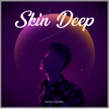
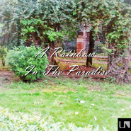

郑亚当Anton
============================

|  |  |
| :--: | :-- |
| [ 郑亚当Anton](https://i.xiami.com/djgun) | **地区**: China 中国大陆 **风格**: 档案： **播放数**: 4496620 **粉丝数**: 446 **评论数**: 38  |

## 档案

风格不太稳定 Progressive House 欧美流行 电音 爱好翻唱 欢迎订阅电台 邮箱： antonzachary@qq.com  微博：@亚当flop亚当

## 专辑

| 名称 | 语种 | 唱片公司 | 发行时间 | 专辑类别 | 专辑风格 |
| :--: | :-- | :-- | :-- | :-- | :-- |
| [ New Retro](./albums/5022204155.md) | 国语 | 独立发行 | 2020年12月15日 | 录音室专辑 | 流行 Pop |
| [ Thunder Night](./albums/5022123478.md) | 英语 | 独立发行 | 2020年12月08日 | EP, 单曲 | 流行 Pop |
| [ Rain On Me Cover](./albums/5020786081.md) | 英语 | 独立发行 | 2020年05月31日 | 录音室专辑 | 欧美流行 Western Pop |
| [ Skin Deep](./albums/2105368629.md) | 英语 |  | 2019年10月25日 | EP, 单曲 | 欧美流行 Western Pop |
| [ Skin Deep（with Stripped Version）肤浅](./albums/2105368628.md) | 英语 |  | 2019年10月25日 | EP, 单曲 | 欧美流行 Western Pop |
| [ Legendary Lovers (Anton Zachary Mashup)](./albums/2104901563.md) | 英语 |  | 2019年05月26日 | 录音室专辑 | 欧美流行 Western Pop |
| [ IDKHI Don't Know Her](./albums/2104858610.md) | 英语 |  | 2019年05月14日 | EP, 单曲 | 欧美流行 Western Pop |
| [ If Only You Could Know Acoustic](./albums/2104750132.md) | 英语 |  | 2019年04月07日 | 录音室专辑 | 轻音乐流行 Light Pop |
| [ If Only You Could Know](./albums/2104422374.md) | 英语 |  | 2018年12月28日 | EP, 单曲 | 欧美流行 Western Pop |
| [ Coconuts](./albums/2103673054.md) | 英语 | 独立发行 | 2018年04月08日 | EP, 单曲 | 欧美流行 Western Pop |
| [ I Like Me Better remixAnton Zachary/HuaoH remix](./albums/2103673056.md) | 英语 | 独立发行 | 2018年03月30日 | EP, 单曲 | 浩室舞曲 House |
| [ I Like Me Better原唱：Lauv](./albums/2103641481.md) | 英语 | 独立发行 | 2018年03月25日 | EP, 单曲 | 欧美流行 Western Pop |
| [ The Cure (Anton Zachary Mashup)Lady Gaga](./albums/2103499114.md) | 英语 | 独立发行 | 2018年01月22日 | 录音室专辑 | 欧美流行 Western Pop |
| [ Havana（Anton Zachary mashup）](./albums/2102938617.md) | 英语 | 独立发行 | 2017年11月17日 | EP, 单曲 | 欧美流行 Western Pop |
| [ 你的爱](./albums/2102924864.md) | 国语 | 独立发行 | 2017年11月13日 | EP, 单曲 | 国语流行 Mandarin Pop |
| [ Get Low CoverZedd&Liam Payne](./albums/2103488700.md) | 英语 | 独立发行 | 2017年10月26日 | 录音室专辑 |  |
| [ Fever CoverElvis Presley](./albums/2103488697.md) | 英语 | 独立发行 | 2017年09月05日 | EP, 单曲 | 爵士 Jazz |
| [ Never Forsake](./albums/2102850536.md) | 英语 | 独立发行 | 2017年08月15日 | EP, 单曲 | 乡村 Country |
| [ Let'em Know](./albums/2102697479.md) | 英语 | 独立发行 | 2017年02月22日 | EP, 单曲 | 浩室舞曲 House |
| [ Carry On](./albums/2100375740.md) | 英语 | 独立发行 | 2016年08月03日 | 录音室专辑 |  |
| [ Into You 伴奏Into You - instrumental](./albums/2100373828.md) | 英语 | 独立发行 | 2016年07月29日 | 录音室专辑 |  |
| [ Let You Go(ft.Tyrus&范泽一)](./albums/2100306278.md) | 英语 | 独立发行 | 2016年04月20日 | EP, 单曲 | 当代节奏布鲁斯 Contemporary R&B |
| [ The Lost Rain](./albums/2100292884.md) | 其他 | 独立发行 | 2016年03月14日 | EP, 单曲 | 氛围音乐 Ambient, 轻音乐 Easy Listening |
| [ Dark Horse(Anton Zachary Remake Version)](./albums/2100281318.md) | 英语 | 独立发行 | 2016年02月25日 | EP, 单曲 | 欧美流行 Western Pop |
| [ Dark Horse(Remake&Cover)](./albums/2100268212.md) | 英语 | 独立发行 | 2016年01月27日 | EP, 单曲 | 欧美流行 Western Pop |
| [ Chemicals Remix](./albums/2100230826.md) | 英语 | 独立发行 | 2015年11月01日 | EP, 单曲 | 浩室舞曲 House |
| [ Katy Perry Mashup Vol.1](./albums/2100203198.md) | 英语 | 独立发行 | 2015年09月18日 | 合集, 杂锦 | 流行舞曲 Dance-Pop, 青少年流行 Teen Pop, 欧美流行 Western Pop |
| [ When We Were Young (Cover & Remix)](./albums/2100191030.md) | 英语 | 独立发行 | 2015年09月05日 | 录音室专辑 | 浩室舞曲 House, 深浩室舞曲 Deep House |
| [ Beautiful Now (Cover&Remix)Beautiful Now (Cover&Remix)](./albums/2100177670.md) | 英语 | 独立发行 | 2015年08月11日 | 录音室专辑 | 浩室舞曲 House, 放克电子 Electro (Electro-Funk) |
| [ Fade Into Darkness Remix](./albums/236633701.md) | 英语 | 独立发行 | 2015年07月12日 | EP, 单曲 | 浩室舞曲 House, 放克电子 Electro (Electro-Funk) |
| [ A Rainbow In The Paradise](./albums/935375443.md) | 国语 | 独立发行 | 2015年06月27日 | EP, 单曲 | 器乐独奏 Solo Instrumental, 氛围音乐 Ambient, 轻音乐 Easy Listening |
| [ Fade Into Darkness(Anton Zachary Remix Version)Avicii ft. Andreas Moe - Fade Into Darkness(Anton Zachary Remix Version)](./albums/1233518542.md) | 英语 | 独立发行 | 2015年06月05日 | EP, 单曲 | 浩室舞曲 House, 放克电子 Electro (Electro-Funk) |
| [ Clarity(Gun Remix Version)Zedd ft. Foxes - Clarity(Gun Remix Version)](./albums/33426176.md) | 英语 | 独立发行 | 2015年06月04日 | EP, 单曲 | 浩室舞曲 House |

## 评论

|  |  |  |
| :-- | :-- | :-- |
|  [虾米用户](https://emumo.xiami.com/u/419786582) 青青子衿，悠悠我心，但为... 2020-12-06 04:47 赞(0) 踩(0) | 
love it ～ great start of my Sunday morning
 |
|  [虾米用户](https://emumo.xiami.com/u/231552326)   2020-11-12 12:15 赞(0) 踩(0) | 
天才吧这是！
 |
|  [虾米用户](https://emumo.xiami.com/u/375894894) 想和我认识的朋友，您支一... 2020-04-07 01:26 赞(0) 踩(0) | 
Smooth babe
 |
|  [虾米用户](https://emumo.xiami.com/u/406919322) 每一位小众音乐爱好者都是... 2020-03-20 10:09 赞(0) 踩(0) | 
来晚了来晚了
 |
|  [虾米用户](https://emumo.xiami.com/u/12230374) Pinkfloydzh，... 2020-01-27 21:19 赞(1) 踩(0) | 
喜欢！！！
 |
|  [虾米用户](https://emumo.xiami.com/u/4923061)  2019-08-24 01:28 赞(0) 踩(0) | 
好喜欢你混的歌，就是只能在虾米听，要是能下到我手机里听就好了，我平常听歌并不用虾米
 |
|  [虾米用户](https://emumo.xiami.com/u/324879742)   2019-07-05 15:22 赞(1) 踩(0) | 
.
 |
|  [虾米用户](https://emumo.xiami.com/u/408534020)  2019-05-02 22:49 赞(0) 踩(0) | 
音乐这方面有一点吗  
 |
|  [虾米用户](https://emumo.xiami.com/u/408534020)  2019-05-02 22:47 赞(0) 踩(0) | 
华侨啊
 |
|  [虾米用户](https://emumo.xiami.com/u/52300480)  2019-04-07 18:20 赞(0) 踩(0) | 
******
 |
|  [虾米用户](https://emumo.xiami.com/u/40038789) 我劝你不要批评我。因为我... 2019-01-24 13:14 赞(0) 踩(0) | 
终于来虾米了。
 |
|  [虾米用户](https://emumo.xiami.com/u/332498160)  You'll Love... 2019-01-17 14:30 赞(0) 踩(0) | 
好 。
 |
|  [虾米用户](https://emumo.xiami.com/u/218189355)   2018-12-28 15:12 赞(0) 踩(0) | 
快点放出ioyck！！！！
 |
|  [虾米用户](https://emumo.xiami.com/u/122439124) 为非作歹 2018-12-04 12:44 赞(0) 踩(0) | 
好棒
 |
|  [虾米用户](https://emumo.xiami.com/u/83744142) 能不能暂时把你的勇气给我... 2018-10-25 14:54 赞(3) 踩(0) | 
？？？这位是中国人？
 |
|  [虾米用户](https://emumo.xiami.com/u/144620702)  2018-06-18 21:11 赞(0) 踩(0) | 
（）
 |
|  [虾米用户](https://emumo.xiami.com/u/10008221) 我还没想好要写什么... 2018-06-02 22:09 赞(0) 踩(0) | 
Cooool
 |
|  [虾米用户](https://emumo.xiami.com/u/318486001) suck it 2018-05-05 21:18 赞(0) 踩(0) | 
混音有前途
 |
|  [虾米用户](https://emumo.xiami.com/u/20849831) zZz 2017-08-07 22:56 赞(0) 踩(0) | 
求微博新歌
 |
|  [虾米用户](https://emumo.xiami.com/u/46102833)   2016-04-13 15:50 赞(0) 踩(0) | 
新头像6
 |
| ⇒ |  [虾米用户](https://emumo.xiami.com/u/50261827) 独立音乐人；擅长作词、作... 2016-04-16 01:52 赞(0) 踩(0) | 
哈哈哈
 |
|  [虾米用户](https://emumo.xiami.com/u/49689813) DJ/Live/时装秀/... 2016-01-10 18:09 赞(0) 踩(0) | 
你长得像马云 小伙子
 |
|  [虾米用户](https://emumo.xiami.com/u/12090631)   2016-01-10 15:25 赞(0) 踩(0) | 
哈哈哈
 |
|  [虾米用户](https://emumo.xiami.com/u/883368) 海底的水族箱 2016-01-09 16:38 赞(0) 踩(0) | 
啪啪啪~~
 |
|  [虾米用户](https://emumo.xiami.com/u/13094255)  2016-01-09 12:54 赞(0) 踩(0) | 
啪啪啪啪。
 |
|  [虾米用户](https://emumo.xiami.com/u/43055800) 根号C就是NE！ 2015-11-02 20:12 赞(0) 踩(0) | 
路过~~~啪啪啪 加油
 |
| ⇒ |  [虾米用户](https://emumo.xiami.com/u/50261827) 独立音乐人；擅长作词、作... 2015-11-04 12:54 赞(0) 踩(0) | 
谢谢谢谢
 |
|  [虾米用户](https://emumo.xiami.com/u/11849131)   2015-06-13 22:13 赞(0) 踩(0) | 
啪啪啪 加油
 |
| ⇒ |  [虾米用户](https://emumo.xiami.com/u/50261827) 独立音乐人；擅长作词、作... 2015-06-13 22:14 赞(0) 踩(0) | 
你走到哪里都啪啪的
 |
| ⇒ |  [虾米用户](https://emumo.xiami.com/u/11849131)   2015-06-13 22:14 赞(0) 踩(0) | 
<q><b>郑亚当Anton说：</b></q>
 |
| ⇒ |  [虾米用户](https://emumo.xiami.com/u/50261827) 独立音乐人；擅长作词、作... 2015-06-13 22:15 赞(0) 踩(0) | 
<q><b>Epon说：</b></q>
 |
|  [虾米用户](https://emumo.xiami.com/u/9907882) 如如不动 万法唯心 2015-06-06 14:36 赞(0) 踩(0) | 

 |
|  [虾米用户](https://emumo.xiami.com/u/36845641) 寻找路 2015-06-05 23:45 赞(0) 踩(0) | 
貌似你有消息了哦
 |
| ⇒ |  [虾米用户](https://emumo.xiami.com/u/50261827) 独立音乐人；擅长作词、作... 2015-06-05 23:56 赞(0) 踩(0) | 
过了一个星期多才通过
 |
| ⇒ |  [虾米用户](https://emumo.xiami.com/u/36845641) 寻找路 2015-06-07 00:29 赞(0) 踩(0) | 
<q><b>郑亚当Anton说：</b></q>
 |
| ⇒ |  [虾米用户](https://emumo.xiami.com/u/50261827) 独立音乐人；擅长作词、作... 2015-06-07 00:38 赞(0) 踩(0) | 
<q><b>贺文武说：</b></q>
 |
| ⇒ |  [虾米用户](https://emumo.xiami.com/u/36845641) 寻找路 2015-06-07 00:38 赞(0) 踩(0) | 
<q><b>郑亚当Anton说：</b></q>
 |
|  [虾米用户](https://emumo.xiami.com/u/50261827) 独立音乐人；擅长作词、作... 2015-06-04 21:40 赞(0) 踩(0) | 
我刚入驻了虾米音乐人，欢迎大家来我的个人主页，收听我的最新音乐
 |
