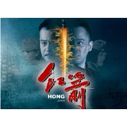

红箭 电视剧原声带
============================

|  |  |
| :--: | :-- |
| [ 红箭 电视剧原声带](https://emumo.xiami.com/album/1029688996) | **艺人**: [阿鲲](../index.md) **语种**: 国语 **唱片公司**: 阿鲲音乐 **发行时间**: 2014年03月12日 **专辑类别**: 原声带, 影视音乐 **专辑风格**: 原声 Soundtrack, 电视原声 Television Music **播放数**: 6712 **收藏数**: 44 **评论数**: 4  |

## 简介

《红箭》是2014年出品的悬疑谍战剧，由陈亚洲、张磊联合执导，刘钧、孙岚、修庆、吕佳容主演。该剧讲述解放前夕，代号“中天门”的中共地下党员陆江波潜伏于赵州站，为策反国民党将领，与军统保密局四大高手斗智斗勇的故事。2014年3月12日于湖南经视播出，11月27日于陕西卫视上星播出。

## 曲目

## 评论

|  |  |  |  |
| :-- | :-- | :-- | :-- |
|  [虾米用户](https://emumo.xiami.com/u/276944698) 不要自我设限..... 2020-04-07 01:31 赞(0) 踩(0) | 

 |
|  [虾米用户](https://emumo.xiami.com/u/2145855) 舍生取义，民贵君轻，任重... 2015-07-03 15:56 赞(0) 踩(0) | 
好想听片尾曲啊，曹洋唱的那首，5555。。。。
 |
|  [虾米用户](https://emumo.xiami.com/u/10008705)  2015-05-02 16:34 赞(0) 踩(0) | 
终于出了！谢谢发布的朋友O(∩_∩)O~
 |
|  [虾米用户](https://emumo.xiami.com/u/7322777) ∮ 2015-04-22 17:45 赞(0) 踩(0) | 
收
 |
