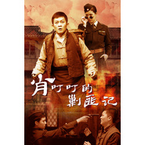

肖叮叮的剿匪记 电视原声带
============================

|  |  |
| :--: | :-- |
| [ 肖叮叮的剿匪记 电视原声带](https://emumo.xiami.com/album/1422438335) | **艺人**: [阿鲲](../index.md) **语种**: 其他 **唱片公司**: 阿鲲音乐 **发行时间**: 2014年07月22日 **专辑类别**: 原声带, 影视音乐 **专辑风格**: 原声 Soundtrack, 电视原声 Television Music **播放数**: 15132 **收藏数**: 41 **评论数**: 1  |

## 简介

《肖叮叮的剿匪记》是由浙江影视集团有限公司出品的战争轻喜剧，彦小追执导，杨志刚、赵柯、王千友、姚安濂等出演。该剧讲述了卖糖小贩肖叮叮从小混混成长为大英雄的传奇故事 。

## 曲目

## 评论

|  |  |  |
| :-- | :-- | :-- |
|  [虾米用户](https://emumo.xiami.com/u/552593)  2015-01-29 16:14 赞(1) 踩(0) | 
这难猪脚不是演什么都一个表情哪位么？~
 |
