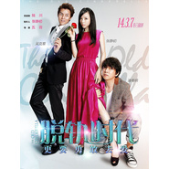

脱轨时代 电影原声大碟
============================

|  |  |
| :--: | :-- |
| [ 脱轨时代 电影原声大碟](https://emumo.xiami.com/album/1629586992) | **艺人**: [阿鲲](../index.md) **语种**: 其他 **唱片公司**: 阿鲲音乐 **发行时间**: 2014年03月07日 **专辑类别**: 原声带, 影视音乐 **专辑风格**: 原声 Soundtrack, 电视原声 Television Music **播放数**: 15650 **收藏数**: 25 **评论数**: 2  |

## 简介

《脱轨时代》是由自小说《如果不能好好爱》改编的一部爱情电影，由陆川监制、五百执导，由张静初、潘粤明、吴克羣等人主演，于2014年3月7日中国上映。
 

影片讲述了失婚女许可在遭遇老公刘光芒出轨后，重新面对感情选择的故事。

## 曲目

## 评论

|  |  |  |  |
| :-- | :-- | :-- | :-- |
|  [虾米用户](https://emumo.xiami.com/u/8695360)  2017-12-10 15:49 赞(0) 踩(0) | 
刘光芒 你把许可追回来了吗？
 |
|  [虾米用户](https://emumo.xiami.com/u/355865) Let it go, l... 2015-04-21 11:51 赞(0) 踩(0) | 
太棒了！！支持国产原声纷纷出山！！
 |
