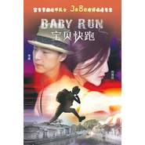

宝贝快跑 电影原声大碟
============================

|  |  |
| :--: | :-- |
| [ 宝贝快跑 电影原声大碟](https://emumo.xiami.com/album/1629754272) | **艺人**: [阿鲲](../index.md) **语种**: 其他 **唱片公司**: 阿鲲音乐 **发行时间**: 2013年03月08日 **专辑类别**: 原声带, 影视音乐 **专辑风格**: 原声 Soundtrack, 电影原声 Film Score **播放数**: 13169 **收藏数**: 19 **评论数**: 1  |

## 简介

《宝贝快跑》是由妇女河北电影制片厂、北京正讯财智文化传媒有限公司、广东嘉莉诗国际服装有限公司联合出品、华夏电影发行有限责任公司全国发行的爱情片。 讲述的是李威饰演的服装设计师托尼来到佛山寻找灵感，发现自己的信用卡被限制使用。身无分文的他随后遭遇抢劫，幸得刘雨欣饰演的喜爱跑酷的少女阿宝相助 ，两人由此发生了一系列有趣的事。

## 曲目

## 评论

|  |  |  |  |
| :-- | :-- | :-- | :-- |
|  [虾米用户](https://emumo.xiami.com/u/7322777) ∮ 2015-04-23 10:13 赞(0) 踩(0) | 
收
 |
