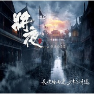

将夜 电视剧原声大碟
============================

|  |  |
| :--: | :-- |
| [ 将夜 电视剧原声大碟](https://emumo.xiami.com/album/2104173425) | **艺人**: [阿鲲](../index.md) **语种**: 国语 **唱片公司**: 阿鲲音乐 **发行时间**: 2018年11月03日 **专辑类别**: 原声带, 影视音乐 **专辑风格**: 电视原声 Television Music **播放数**: 823500 **收藏数**: 1734 **评论数**: 73  |

## 简介

昆山玉碎凤凰叫，芙蓉泣露香兰笑。鲜衣怒马、快意恩仇的江湖不止有豪爽的烈酒和挽起的剑花，更有润物细无声的琴弦铮琮。为了带给大家最悦耳的听觉感受，导演杨阳导演、制片人王裕仁 精心确定配乐，音乐制作人阿鲲老师更是细致研究剧情，创作了许多优美动听的新乐章。《将夜》的录音和混音更是由阿鲲老师与英国皇家爱乐乐团Royal Philharmonic Orchestra合作 完成的。  
《将夜》是由金色传媒、猫片、天神影业、企鹅影视、腾讯影业、阅文集团出品，金色传媒制作，杨阳执导。  
该剧由陈飞宇、宋伊人、郑少秋、胡军、黎明、孟子义、袁冰妍、秦亦铭 、孙祖君、童瑶、阿旺仁青、洛桑群培等主演的古装玄幻剧  
  
剧情简介  
这个世界有个传言：永夜来临，人间浩劫。小军卒宁缺为了给自家冤案昭雪，带着小侍女桑桑来到都城。经过不懈的努力，他考入最高学府书院，成为书院领袖夫子的亲传弟子，肩负起匡扶国家、护卫人民的重任，并成功为家人平反。宁缺带身患奇症的桑桑前去求医，却发现桑桑 是永夜降世载体，一时间成为天下人追杀目标。为保护桑桑，两人浪迹天涯，却发现制造桑桑残酷命运的正是天下人崇拜的昊天，原来昊天正是永夜幕后黑手。在昊天的煽动下，席卷天下的大战爆发。国难当头，宁缺和书院众人在民众的帮助下与侵略者展开大战，奋勇抗敌。桑桑被昊天控制，发动永夜浩劫。宁缺和昊天殊死一搏，最终获胜，消灭了昊天，寻回了桑桑。从此世间再无永夜，人间重获和平，宁缺与桑桑终得幸福相守 。

## 曲目

## 评论

|  |  |  |
| :-- | :-- | :-- |
|  [虾米用户](https://emumo.xiami.com/u/296730771)  2020-11-07 23:21 赞(0) 踩(0) | 
将夜一选角很出色，演员基本上都演出了书里的味道，配乐也很精彩。但是将夜二就没必要看了，除了特效，其他没什么出彩的。
 |
|  [虾米用户](https://emumo.xiami.com/u/10210650) 拜拜~ 2020-05-24 14:51 赞(0) 踩(0) | 
剧很好看，配乐也很出色
 |
|  [虾米用户](https://emumo.xiami.com/u/288795965)  2020-02-16 17:23 赞(1) 踩(0) | 
看过剧，音乐很好。故事也不错
 |
|  [虾米用户](https://emumo.xiami.com/u/13671404) 我在等一個回憶 2020-02-13 14:13 赞(0) 踩(0) | 
好到劇集配不上這個原聲。。。
 |
|  [虾米用户](https://emumo.xiami.com/u/5645348) 乐莫乐兮新相知 2020-02-09 02:47 赞(0) 踩(0) | 
萧变奏最棒
 |
|  [虾米用户](https://emumo.xiami.com/u/40935203)  2020-01-23 00:35 赞(0) 踩(0) | 
原来是阿鲲的配乐呀！ 真的非常有将夜的风格，到位，入耳，贴合，升华！！！阿鲲真棒
 |
|  [虾米用户](https://emumo.xiami.com/u/405866081) 我还没想好要写什么... 2019-11-22 16:38 赞(1) 踩(0) | 
凄美~壮阔~
 |
|  [虾米用户](https://emumo.xiami.com/u/405866081) 我还没想好要写什么... 2019-11-22 16:13 赞(2) 踩(0) | 
电视剧画面和配乐都很精良~就是剧情和原著和特效还是有些配不起原著
 |
| ⇒ |  [虾米用户](https://emumo.xiami.com/u/405712965)  2020-10-17 14:14 赞(0) 踩(0) | 
看一下书在评价吧。
 |
|  [虾米用户](https://emumo.xiami.com/u/340748681)  2019-09-11 17:12 赞(0) 踩(0) | 
制作精良，没看过这个剧，只希望配得上这个音乐
 |
|  [虾米用户](https://emumo.xiami.com/u/50702350) 这个世界...... 2019-09-08 19:22 赞(1) 踩(0) | 
虽然一些大家都知道的原因剧情不得不做删改，但相比其它翻拍的作品，将夜真的可以称之为良心作品
 |
|  [虾米用户](https://emumo.xiami.com/u/33906206)  2019-09-02 14:51 赞(1) 踩(0) | 
感觉背景音都是很贴合电视场景和人物生平。
 |
|  [虾米用户](https://emumo.xiami.com/u/1019899)  2019-08-01 15:44 赞(0) 踩(0) | 
卧槽下架了？
 |
|  [虾米用户](https://emumo.xiami.com/u/15233242)  2019-07-10 15:05 赞(0) 踩(0) | 
上一个让我有这种感觉的应该是骆集益的仙剑，古剑系列了
 |
|  [虾米用户](https://emumo.xiami.com/u/34271231)  2019-05-08 17:50 赞(0) 踩(0) | 
真的很棒！   
 |
|  [虾米用户](https://emumo.xiami.com/u/47036015)  2019-04-06 13:56 赞(0) 踩(0) | 
看电视剧的时候发现不错，特意来听听
 |
|  [虾米用户](https://emumo.xiami.com/u/29443279) 生命在于折腾 2019-04-02 23:53 赞(2) 踩(0) | 
首先音乐本身很有质感，单独拎出来都是非常动听的曲子。其次作者对剧情节奏的把握、角色之间情感的理解与表达都非常到位。配乐与电视剧真正做到了整体性和统一性，简直就是浑然天成！
 |
|  [虾米用户](https://emumo.xiami.com/u/419320655)  2019-03-06 21:26 赞(0) 踩(0) | 
电视剧也很好看
 |
|  [虾米用户](https://emumo.xiami.com/u/32101704) Lost in musi... 2019-02-08 17:17 赞(1) 踩(0) | 
我的妈！！吹爆阿鲲！！！！
 |
|  [虾米用户](https://emumo.xiami.com/u/404093455)  2019-01-28 22:40 赞(1) 踩(0) | 
nice！
 |
|  [虾米用户](https://emumo.xiami.com/u/6361118) 黑洞無始終，音樂無疆界 2019-01-28 00:13 赞(1) 踩(0) | 
同类题材的电视剧配乐阿鲲老师已经做过不少了，难得这次有所突破。这次大手笔前往伦敦录音，更请到英国皇家爱乐乐团演奏，配乐以浑厚饱满的交响乐为主体，中国民乐元素作为画龙点睛的补充，整体风格更加大气。不过以电视剧的口碑，似乎还未能配得上如此配乐。
 |
|  [虾米用户](https://emumo.xiami.com/u/248056694)  2019-01-10 06:54 赞(2) 踩(0) | 
电视剧看过，还不错。
 |
|  [虾米用户](https://emumo.xiami.com/u/27939384) ego cogito 2019-01-05 12:25 赞(1) 踩(0) | 
最难得的是能感受到很多大师的东西在里面，阿鲲真的是牛逼
 |
|  [虾米用户](https://emumo.xiami.com/u/27939384) ego cogito 2019-01-05 12:20 赞(3) 踩(0) | 
不得不说这是近年来最好的古装电视剧，虽然没能完全还原猫腻原作，但演员有高水平发挥，配乐取景再到后期都称得上一流水准，
 |
|  [虾米用户](https://emumo.xiami.com/u/13238655) 暂无签名~ 2019-01-04 13:12 赞(1) 踩(0) | 
太精彩了！
 |
|  [虾米用户](https://emumo.xiami.com/u/77986)  2019-01-02 08:23 赞(3) 踩(0) | 
这配乐水平真赶上大制作电影了，良心制作，可能是近年来最好的玄幻改编作品！
 |
|  [虾米用户](https://emumo.xiami.com/u/40685376)  2018-12-29 17:31 赞(1) 踩(0) | 
看电视剧时觉得音乐好听，专门找来听
 |
|  [虾米用户](https://emumo.xiami.com/u/16259455) 我还没想好要写什么... 2018-12-27 10:45 赞(2) 踩(0) | 
看着将夜从播出的默默无名到现在的不吝夸赞，心里既欢喜又怅然，六十集马上要结束了，这么好的制作让我接下来不知道还能看别的什么……
 |
|  [虾米用户](https://emumo.xiami.com/u/7087065) 我想我可以 2018-12-27 10:14 赞(1) 踩(0) | 
从配乐就能体现一部剧的制作水准，人物情绪、剧情把握很到位，就不说众多实力派加盟，单单摄影和配乐就给五星
 |
|  [虾米用户](https://emumo.xiami.com/u/264650212) 微笑的抑郁症患者…… 2018-12-19 19:50 赞(1) 踩(0) | 
联系电视剧情再搭配每个人物的背景音乐，真的很应景 美的不要不要的 
 |
|  [虾米用户](https://emumo.xiami.com/u/41871034) 暂无签名~ 2018-12-16 18:23 赞(1) 踩(0) | 
必须留名。匠心之作
 |
|  [虾米用户](https://emumo.xiami.com/u/333700611) 珍惜我们拥有的爱 2018-12-15 14:30 赞(0) 踩(0) | 
可一的
 |
|  [虾米用户](https://emumo.xiami.com/u/282072435) 最美的音乐和我最爱的小情... 2018-12-15 11:46 赞(2) 踩(0) | 
很少见到古装剧这么经典的配乐了，非常喜欢！非常欣赏！与将夜的各桥段相得益彰！！
 |
|  [虾米用户](https://emumo.xiami.com/u/54329508)  2018-12-13 22:26 赞(0) 踩(0) | 
很好很好
 |
|  [虾米用户](https://emumo.xiami.com/u/308586317) 团饭 锥婷毛玩家 2018-12-13 21:59 赞(1) 踩(0) | 
这配乐真的绝了，阿鲲出品真精品！
 |
|  [虾米用户](https://emumo.xiami.com/u/242739253) 我还没想好要写什么... 2018-12-08 15:05 赞(0) 踩(0) | 
气势磅礴
 |
|  [虾米用户](https://emumo.xiami.com/u/26642573) 空白 2018-12-07 23:13 赞(0) 踩(0) | 
这配乐确实一绝。
 |
|  [虾米用户](https://emumo.xiami.com/u/258486351) 一路向前 2018-12-02 21:16 赞(0) 踩(0) | 
原著很好，剧和音乐也非常不错！ 
 |
|  [虾米用户](https://emumo.xiami.com/u/16167179) 没有签名 2018-12-02 14:34 赞(0) 踩(0) | 
这个剧处处可见其用心，虽然很容易被拿来和HBO的权利游戏作比较。看了喜欢就好～
 |
|  [虾米用户](https://emumo.xiami.com/u/197641091) 脚踏实地吧~ 2018-12-01 16:40 赞(0) 踩(0) | 
原著很好，不知道电视剧咋样
 |
|  [虾米用户](https://emumo.xiami.com/u/351035796)  2018-11-28 04:29 赞(0) 踩(0) | 
解解
 |
|  [虾米用户](https://emumo.xiami.com/u/5680967) 暂无签名~ 2018-11-25 23:49 赞(0) 踩(0) | 
电视剧特别好 配乐也超燃 期待原声碟 必买
 |
|  [虾米用户](https://emumo.xiami.com/u/138974) 活着？ 2018-11-18 00:20 赞(0) 踩(0) | 
很土豪
 |
|  [虾米用户](https://emumo.xiami.com/u/350614065) 慢悠悠 2018-11-15 23:41 赞(0) 踩(0) | 
阿鲲厉害
 |
|  [虾米用户](https://emumo.xiami.com/u/871178)  2018-11-12 23:35 赞(0) 踩(0) | 
期待原声碟上市。
 |
|  [虾米用户](https://emumo.xiami.com/u/33914994) 窥光女孩 2018-11-12 21:03 赞(3) 踩(0) | 
看电视剧时真的是觉得这配乐水平真高！！！没想到是阿鲲老师的！
 |
|  [虾米用户](https://emumo.xiami.com/u/2948599)  2018-11-12 15:39 赞(0) 踩(0) | 
将夜的配乐水平真高
 |
|  [虾米用户](https://emumo.xiami.com/u/2948599)  2018-11-12 15:39 赞(0) 踩(0) | 
最爱的演员，最爱的剧，恰巧又遇上最爱的配乐，一切都那么完美
 |
|  [虾米用户](https://emumo.xiami.com/u/19008049) 每个人都是月亮，总有一个... 2018-11-11 21:31 赞(1) 踩(0) | 
电视剧也很棒，良心大作。里面的插曲每一首都好听！
 |
|  [虾米用户](https://emumo.xiami.com/u/274507)   2018-11-07 10:53 赞(4) 踩(0) | 
居然听出了岩代太郎和服部隆之的感觉！
 |
|  [虾米用户](https://emumo.xiami.com/u/22013421)   2018-11-06 18:35 赞(1) 踩(0) | 
要是钢琴的主题变奏就好了
 |
|  [虾米用户](https://emumo.xiami.com/u/357235323) 暴烈生长的一棵树 2018-11-06 13:52 赞(2) 踩(0) | 
永夜将至，光明永存
 |
|  [虾米用户](https://emumo.xiami.com/u/1179943) Harp Blues 2018-11-05 12:09 赞(20) 踩(0) | 
精良制作，气势磅礴，终于见到国内有这种工业化发展的音乐。电视剧没看过，希望别糟蹋了这么好的配乐。
 |
| ⇒ |  [虾米用户](https://emumo.xiami.com/u/13183831) 2018.3.21破旧立... 2018-11-17 00:00 赞(0) 踩(0) | 
跟你说这部剧水准也不差。就快接近电影级了
 |
| ⇒ |  [虾米用户](https://emumo.xiami.com/u/50702350) 这个世界...... 2018-11-17 11:39 赞(0) 踩(0) | 
<q><b>配合你想象说：</b></q>
 |
| ⇒ |  [虾米用户](https://emumo.xiami.com/u/13183831) 2018.3.21破旧立... 2018-11-18 09:10 赞(0) 踩(0) | 
<q><b>水瓶树下说：</b></q>
 |
| ⇒ |  [虾米用户](https://emumo.xiami.com/u/334649954)  2018-12-08 07:59 赞(0) 踩(0) | 
电视剧也很好
 |
| ⇒ |  [虾米用户](https://emumo.xiami.com/u/280667460) 我还没想好要写什么... 2019-01-18 19:09 赞(0) 踩(0) | 
电视剧算是最近一点时间里的精品了
 |
| ⇒ |  [虾米用户](https://emumo.xiami.com/u/2230135)  2019-02-05 23:05 赞(0) 踩(0) | 
电视剧没糟蹋 
 |
| ⇒ |  [虾米用户](https://emumo.xiami.com/u/28589321) (๑❛ᴗ❛๑) 2019-02-10 23:07 赞(0) 踩(0) | 
电视剧也很不错
 |
| ⇒ |  [虾米用户](https://emumo.xiami.com/u/39056779) 生命中越珍贵的东西越爱迟... 2019-02-20 17:06 赞(0) 踩(0) | 
电视剧还真的挺不错的。
 |
| ⇒ |  [虾米用户](https://emumo.xiami.com/u/8504989) 且将诗心付旧曲 2019-09-17 19:35 赞(0) 踩(0) | 
没糟蹋，近些年难得的精良制作
 |
| ⇒ |  [虾米用户](https://emumo.xiami.com/u/222071479)  2020-03-02 04:34 赞(0) 踩(0) | 
真的好看
 |
| ⇒ |  [虾米用户](https://emumo.xiami.com/u/43880103)  2020-09-19 16:11 赞(0) 踩(0) | 
电视剧一样制作精良可以看看
 |
|  [虾米用户](https://emumo.xiami.com/u/42661420)  2018-11-05 09:31 赞(3) 踩(0) | 
这个配乐就是我在看小说时想象中的样子   
 |
|  [虾米用户](https://emumo.xiami.com/u/39827299)  2018-11-03 16:52 赞(0) 踩(0) | 
真的不错，喜欢！
 |
|  [虾米用户](https://emumo.xiami.com/u/48935681) 樓閣新晨花欲語，夢中誰是... 2018-11-03 07:05 赞(0) 踩(0) | 
这是高产的节奏呀，不错(*๓´╰╯`๓)♡
 |
|  [虾米用户](https://emumo.xiami.com/u/207981888)  2018-11-03 04:29 赞(1) 踩(0) | 
不过确实用心
 |
|  [虾米用户](https://emumo.xiami.com/u/207981888)  2018-11-03 04:29 赞(2) 踩(0) | 
高水准套路
 |
|  [虾米用户](https://emumo.xiami.com/u/1326168)  2018-11-03 00:56 赞(0) 踩(0) | 
mark
 |
|  [虾米用户](https://emumo.xiami.com/u/32558701) 再见虾米 2018-11-03 00:09 赞(0) 踩(0) | 
前排前排
 |
|  [虾米用户](https://emumo.xiami.com/u/12760969) 我还没想好要写什么... 2018-11-03 00:02 赞(10) 踩(0) | 
因为配乐想去追电视剧了 
 |
| ⇒ |  [虾米用户](https://emumo.xiami.com/u/318802640) 该来来该走走我接受 2020-02-05 01:32 赞(0) 踩(0) | 
快去看！
 |
