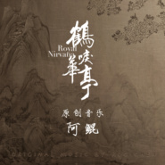

鹤唳华亭 电视原声大碟
============================

|  |  |
| :--: | :-- |
| [ 鹤唳华亭 电视原声大碟](https://emumo.xiami.com/album/2105443059) | **艺人**: [阿鲲](../index.md) **语种**: 纯音乐 **唱片公司**: 阿鲲音乐 **发行时间**: 2019年11月18日 **专辑类别**: 原声带, 影视音乐 **专辑风格**: 中国风 China-Wave **播放数**: 647380 **收藏数**: 970 **评论数**: 86  |

## 简介

《鹤唳华亭》原声带由著名作曲家阿鲲(Roc Chen)作曲, 联合英国皇家爱乐乐团共同制作完成。  
《鹤唳华亭》是由杨文军执导，罗晋、李一桐、黄志忠等主演的古装剧，该剧改编自雪满梁园的同名小说，讲述了储君萧定权为国天下孤身犯险，收付兵权交于国家自己背负千秋骂名而死的故事 。

## 曲目

## 评论

|  |  |  |  |
| :-- | :-- | :-- | :-- |
|  [虾米用户](https://emumo.xiami.com/u/246548071) 我笑了…… 2020-12-15 23:39 赞(0) 踩(0) | 
所以这个锅只能是编剧了&amp;hellip;&amp;hellip;在自己的感性里面出不来，剧情当断不断，而且韩剧看的太多了。多好的音乐，演员也不错！
 |
|  [虾米用户](https://emumo.xiami.com/u/2661299) 不虚 2020-12-11 19:30 赞(0) 踩(0) | 
这张专辑听来听去其实就是一首曲子，其他配乐呢？？？？？
 |
|  [虾米用户](https://emumo.xiami.com/u/274871592)   2020-10-28 18:57 赞(1) 踩(0) | 
配乐太出色了，为该剧增色不少
 |
|  [虾米用户](https://emumo.xiami.com/u/5966136)  2020-09-30 22:59 赞(1) 踩(0) | 
非同一般的好，曲子旋律与剧中人物相适，人物命运牵动人心。大师手笔，悦耳悦心。
 |
|  [虾米用户](https://emumo.xiami.com/u/6901945) 传信人 2020-09-03 01:01 赞(0) 踩(0) | 
默默潜水虾米多年，我想…中国的汉斯季默会是这位鲲先生…40-50岁以后的未来，期待您的大作
 |
|  [虾米用户](https://emumo.xiami.com/u/427250458) 我还没想好要写什么... 2020-09-01 07:28 赞(0) 踩(0) | 

 |
|  [虾米用户](https://emumo.xiami.com/u/208414640)  2020-07-23 19:35 赞(0) 踩(0) | 
我觉得比久石让的音乐好听
 |
|  [虾米用户](https://emumo.xiami.com/u/159150148)  2020-07-02 12:34 赞(0) 踩(0) | 
好听，棒！
 |
|  [虾米用户](https://emumo.xiami.com/u/347286371) 我还没想好要写什么... 2020-05-26 19:01 赞(0) 踩(0) | 
唯美
 |
|  [虾米用户](https://emumo.xiami.com/u/73481832) toward a roa... 2020-03-12 03:38 赞(3) 踩(0) | 
只听音乐也会流泪的剧，我也有
 |
|  [虾米用户](https://emumo.xiami.com/u/309864776)  2020-03-04 08:38 赞(2) 踩(0) | 
音乐太好听，为剧中人物的情绪渲染很完美的展现，令人动容！
 |
|  [虾米用户](https://emumo.xiami.com/u/427020261)  2020-02-26 11:41 赞(2) 踩(0) | 
超级棒的音乐，主要是结合电视剧情节简直完美
 |
|  [虾米用户](https://emumo.xiami.com/u/253395678) 走更长的路，听更多的歌 2020-02-03 10:19 赞(0) 踩(0) | 
真的很喜欢的bgm
 |
|  [虾米用户](https://emumo.xiami.com/u/302272483) 画里画外皆大欢喜 2020-01-12 12:00 赞(2) 踩(0) | 
喜欢整部电视剧和电视剧里的每一首歌，视觉和听觉的盛宴
 |
|  [虾米用户](https://emumo.xiami.com/u/12358240) Edinorog  2020-01-06 18:56 赞(2) 踩(0) | 
精良的剧作，完美的配乐！大爱萧！
 |
|  [虾米用户](https://emumo.xiami.com/u/408180126)  2020-01-01 04:19 赞(4) 踩(0) | 
什么时候能上传电视剧原版那个片头哇～
 |
|  [虾米用户](https://emumo.xiami.com/u/48537730) 理智使她着迷 2019-12-23 21:50 赞(3) 踩(0) | 
不行了这部剧我简直太爱了
 |
|  [虾米用户](https://emumo.xiami.com/u/258200139)   2019-12-20 20:57 赞(3) 踩(0) | 
听过最好的国产剧的BGM
 |
|  [虾米用户](https://emumo.xiami.com/u/344216723)  2019-12-20 10:59 赞(1) 踩(0) | 
大气，细腻，细节处理得非常好。意犹未尽。
 |
|  [虾米用户](https://emumo.xiami.com/u/9776019) 从容地让自己生活得更深刻 2019-12-16 20:49 赞(2) 踩(0) | 
专辑介绍剧透了...过分！55555...
 |
|  [虾米用户](https://emumo.xiami.com/u/429977469)  2019-12-09 12:47 赞(1) 踩(0) | 
喜欢
 |
|  [虾米用户](https://emumo.xiami.com/u/19524037) 不忘初心，牢记使命 2019-12-04 17:55 赞(2) 踩(0) | 
阿鲲老师是我偶像。。。加油
 |
|  [虾米用户](https://emumo.xiami.com/u/12300214)  2019-12-04 15:17 赞(3) 踩(0) | 
难道没有人发现剧情里重要节点那些最打动人心的音乐，专辑里几乎全都没有收录吗？编入的都是写无关紧要的背景音乐！BGM不仅仅是原声带而已，更是一部影片的精华！
 |
| ⇒ |  [虾米用户](https://emumo.xiami.com/u/3311590) 事世虽苦 我是糖 2019-12-05 16:48 赞(0) 踩(0) | 
是的，我也等“不用理由就会相信，没有力量也要保护的人，阁下难道没有吗？”这段出现的bgm，但是没有！
 |
| ⇒ |  [虾米用户](https://emumo.xiami.com/u/110767996)   2019-12-10 20:45 赞(0) 踩(0) | 
<q><b>Rin说：</b></q>
 |
| ⇒ |  [虾米用户](https://emumo.xiami.com/u/110767996)   2019-12-10 20:45 赞(0) 踩(0) | 
因为是另一位作曲家写的。
 |
| ⇒ |  [虾米用户](https://emumo.xiami.com/u/3311590) 事世虽苦 我是糖 2019-12-12 14:03 赞(0) 踩(0) | 
<q><b>sarabande靓说：</b></q>
 |
| ⇒ |  [虾米用户](https://emumo.xiami.com/u/408137212)  2019-12-26 13:08 赞(0) 踩(0) | 
<q><b>Rin说：</b></q>
 |
| ⇒ |  [虾米用户](https://emumo.xiami.com/u/127065652)  2020-02-13 14:00 赞(0) 踩(0) | 
另一位编曲家冯石叶，由于一些其他原因，他的作品并未收录，并且本剧很多其他优秀曲目由他编作却无法出专，有些遗憾无奈，哎
 |
|  [虾米用户](https://emumo.xiami.com/u/313831582)  2019-12-03 20:23 赞(1) 踩(0) | 
高级的审美!
 |
|  [虾米用户](https://emumo.xiami.com/u/13221980) 123 2019-12-01 21:24 赞(2) 踩(0) | 
超级好听啊！电视剧也好看~
 |
|  [虾米用户](https://emumo.xiami.com/u/37742730)   2019-11-30 19:16 赞(4) 踩(0) | 
国产电视剧原声音乐Top1
 |
|  [虾米用户](https://emumo.xiami.com/u/44910431) 祈求上苍怜悯 2019-11-28 08:38 赞(2) 踩(0) | 
9.9分，不至于吧。。反正阿鲲的音乐我有点听腻了，这些年并没有什么突破啊，都是这个调调。
 |
|  [虾米用户](https://emumo.xiami.com/u/2621253) ♾  2019-11-26 14:26 赞(3) 踩(0) | 
看了几集，开始是觉得服化道基本挑不出毛病，对于连续剧，服装的面料，做工，颜色等等都表达到位，听到配乐，奠定了地位了。
 |
|  [虾米用户](https://emumo.xiami.com/u/146761) 。 2019-11-26 13:09 赞(1) 踩(0) | 
完美 
 |
|  [虾米用户](https://emumo.xiami.com/u/432703040)  2019-11-26 09:29 赞(1) 踩(0) | 
超级喜欢
 |
|  [虾米用户](https://emumo.xiami.com/u/383752)  2019-11-24 08:45 赞(3) 踩(0) | 
看完9集印象最深的居然是配乐！第一次这么受冲击，配乐简直神了！专门来搜～真的是高质量！！！为配乐点赞！
 |
|  [虾米用户](https://emumo.xiami.com/u/432549904)  2019-11-22 17:22 赞(0) 踩(0) | 
太优秀了这音乐
 |
|  [虾米用户](https://emumo.xiami.com/u/432576039)  2019-11-22 12:16 赞(0) 踩(0) | 
看剧的时候听到了两首《新萧十一郎》里的bgm，大佬偷懒了吼
 |
|  [虾米用户](https://emumo.xiami.com/u/2491831)  2019-11-21 21:51 赞(3) 踩(0) | 
大气磅礴，清雅神韵
 |
|  [虾米用户](https://emumo.xiami.com/u/250989209)  2019-11-21 20:32 赞(3) 踩(0) | 
冲阿鲲看的剧，给这剧的节奏和内涵提升不止一个档位！
 |
|  [虾米用户](https://emumo.xiami.com/u/31205219)   2019-11-21 16:55 赞(0) 踩(0) | 
有哪位知道第七集，太子去老师府上告别那段，是哪首插曲，找了好久找不到 
 |
|  [虾米用户](https://emumo.xiami.com/u/432518003)  2019-11-21 16:51 赞(0) 踩(0) | 
愿，好听！
 |
|  [虾米用户](https://emumo.xiami.com/u/44544851)  2019-11-20 22:10 赞(3) 踩(0) | 
请问第二集太子最终冠礼成功后，站在高台看白鹤展翅飞翔那段的背景乐是哪个？听遍了都不是。
 |
|  [虾米用户](https://emumo.xiami.com/u/5105553)  2019-11-20 20:07 赞(3) 踩(0) | 
刑部初遇，皇太子殿下，配乐，血书跪求
 |
| ⇒ |  [虾米用户](https://emumo.xiami.com/u/432549904)  2019-11-22 17:23 赞(0) 踩(0) | 
那个好像是英国皇家爱乐团配的
 |
| ⇒ |  [虾米用户](https://emumo.xiami.com/u/569097)  2019-12-07 22:06 赞(0) 踩(0) | 
<q><b>Radish_漪果说：</b></q>
 |
| ⇒ |  [虾米用户](https://emumo.xiami.com/u/309864776)  2020-03-04 08:40 赞(0) 踩(0) | 
<q><b>Radish_漪果说：</b></q>
 |
|  [虾米用户](https://emumo.xiami.com/u/232063754)  2019-11-20 18:30 赞(1) 踩(0) | 
太好听了！！！这个曲风是，就算我没看过剧也会很喜欢的类型。何况剧也很优秀！！！
 |
|  [虾米用户](https://emumo.xiami.com/u/227053580)  2019-11-20 16:28 赞(0) 踩(0) | 
还有配乐没有放出来吧，求全部
 |
|  [虾米用户](https://emumo.xiami.com/u/423743306)  2019-11-20 15:35 赞(0) 踩(0) | 
大气！
 |
|  [虾米用户](https://emumo.xiami.com/u/431835447)  2019-11-20 14:51 赞(0) 踩(0) | 
阿鲲做古装剧配乐得心应手！
 |
|  [虾米用户](https://emumo.xiami.com/u/294609)  2019-11-20 08:57 赞(0) 踩(0) | 
完全带得动剧情
 |
|  [虾米用户](https://emumo.xiami.com/u/263962983)  2019-11-19 22:41 赞(0) 踩(0) | 

 |
|  [虾米用户](https://emumo.xiami.com/u/612955)  2019-11-19 22:34 赞(3) 踩(0) | 
特别喜欢10.兴 太子为了能见到女主兴致勃勃的赶着去看榜，欢喜的心情和少年的青春飞扬跃然纸上，真是美好
 |
|  [虾米用户](https://emumo.xiami.com/u/253554798)  2019-11-19 22:33 赞(0) 踩(0) | 
真的很大气！
 |
|  [虾米用户](https://emumo.xiami.com/u/612955)  2019-11-19 22:02 赞(0) 踩(0) | 
看片的时候觉得还蛮好听的，特意找了找还没上线，终于专辑上线啦！配合剧情很带感啊，不过音乐搭配上某些桥段特别像韩剧&amp;hellip;&amp;hellip;
 |
|  [虾米用户](https://emumo.xiami.com/u/420697210) 漫步在织体丰富色彩斑斓的... 2019-11-19 18:50 赞(29) 踩(0) | 
一位著名的电影配乐大师说：好的音乐可以让一部好电影更好，但绝不可能使一部烂电影变好。不知道这部电视剧如何？有点期待。
 |
| ⇒ |  [虾米用户](https://emumo.xiami.com/u/224748193)  2020-04-13 23:50 赞(0) 踩(0) | 
非常好看，值得去看
 |
|  [虾米用户](https://emumo.xiami.com/u/432460249)  2019-11-19 14:12 赞(1) 踩(0) | 
请问雪景那里的bgm是哪首啊？
 |
| ⇒ |  [虾米用户](https://emumo.xiami.com/u/52109220)  2019-11-19 20:47 赞(0) 踩(0) | 
我也想知道
 |
| ⇒ |  [虾米用户](https://emumo.xiami.com/u/432462537)  2019-11-19 20:49 赞(0) 踩(0) | 
<q><b>盈袖说：</b></q>
 |
| ⇒ |  [虾米用户](https://emumo.xiami.com/u/52109220)  2019-11-19 20:50 赞(0) 踩(0) | 
对的
 |
| ⇒ |  [虾米用户](https://emumo.xiami.com/u/52109220)  2019-11-19 20:50 赞(0) 踩(0) | 
好像列表里面没有
 |
|  [虾米用户](https://emumo.xiami.com/u/255703068) 古风，轻音，好听的BGM... 2019-11-19 00:10 赞(0) 踩(0) | 
中西乐器交叉，演绎悲壮
 |
|  [虾米用户](https://emumo.xiami.com/u/432431561)  2019-11-18 23:28 赞(0) 踩(0) | 
剧好音乐棒   已更新的6集重复看几遍了
 |
|  [虾米用户](https://emumo.xiami.com/u/50404987) 虾米~再醉一回~ 2019-11-18 22:43 赞(1) 踩(0) | 
滴打卡播放任务之~首发
 |
|  [虾米用户](https://emumo.xiami.com/u/189812)  2019-11-18 21:59 赞(0) 踩(0) | 
越听越有味道啊，到后面的画面感越累越有故事性，听《念》的时候有点pirate的气势了
 |
|  [虾米用户](https://emumo.xiami.com/u/189812)  2019-11-18 21:33 赞(0) 踩(0) | 
听这个曲还蛮期待的
 |
|  [虾米用户](https://emumo.xiami.com/u/7263000) 星辰大海 2019-11-18 18:53 赞(1) 踩(0) | 
可待
 |
|  [虾米用户](https://emumo.xiami.com/u/335090080) 食色性也 2019-11-18 18:47 赞(0) 踩(0) | 
没有失望过
 |
|  [虾米用户](https://emumo.xiami.com/u/420450249) 高山仰止，景行行止 2019-11-18 18:09 赞(2) 踩(0) | 
特别喜欢片头，既大气磅礴又悲凉，非常有质感
 |
|  [虾米用户](https://emumo.xiami.com/u/203126)  2019-11-18 17:22 赞(1) 踩(0) | 
为什么说这电视韩剧，这配乐妥妥的大河剧好吗？
 |
|  [虾米用户](https://emumo.xiami.com/u/236058015) 快看  是五月天 2019-11-18 13:57 赞(1) 踩(0) | 
真的太好看了！！！
 |
|  [虾米用户](https://emumo.xiami.com/u/304347129)  2019-11-18 13:35 赞(2) 踩(0) | 
看好这部剧
 |
|  [虾米用户](https://emumo.xiami.com/u/85835736) 真雷啊〒_〒 2019-11-18 13:18 赞(0) 踩(0) | 
罗晋现在的片子都好爱哭
 |
| ⇒ |  [虾米用户](https://emumo.xiami.com/u/12128984) 我讨厌一切不押韵的歌，感... 2019-11-19 15:02 赞(0) 踩(0) | 
小说里就是这样的
 |
| ⇒ |  [虾米用户](https://emumo.xiami.com/u/432549904)  2019-11-22 17:24 赞(0) 踩(0) | 
还原了小说
 |
|  [虾米用户](https://emumo.xiami.com/u/2823200)  2019-11-18 10:50 赞(0) 踩(0) | 
满分。
 |
|  [虾米用户](https://emumo.xiami.com/u/217822883) 我们外太空再见啦✧٩(ˊ... 2019-11-18 10:40 赞(2) 踩(0) | 
三大网络古装谋权小说，琅琊榜，玉阶辞，鹤唳华亭，都是我的最爱，玉阶辞也快拍吧 
 |
|  [虾米用户](https://emumo.xiami.com/u/326868008)  2019-11-18 07:12 赞(1) 踩(0) | 
气势磅礴。鹤唳华亭。
 |
|  [虾米用户](https://emumo.xiami.com/u/13010156) 我想好了 2019-11-18 01:09 赞(0) 踩(0) | 
完美，无可挑剔
 |
|  [虾米用户](https://emumo.xiami.com/u/6236391) 我的性别是野性 2019-11-18 00:01 赞(9) 踩(0) | 
第一观感便是精良，服装讲究，台词严谨，阿鲲操刀的配乐也增色不少，而且男女主的表演比我预期中好，最重要是剧情扣人心弦，围绕“君臣父子”四个字讲宫廷权谋，反转颇多，光是第二集就有五六个反转，叙事节奏相当畅快，就喜欢看这种爽剧！
 |
| ⇒ |  [虾米用户](https://emumo.xiami.com/u/20425956) 天若微雨，我心浅笑。 2019-11-18 00:08 赞(0) 踩(0) | 
果然理姐沙发 
 |
| ⇒ |  [虾米用户](https://emumo.xiami.com/u/6236391) 我的性别是野性 2019-11-18 00:24 赞(0) 踩(0) | 
<q><b>小杰说：</b></q>
 |
| ⇒ |  [虾米用户](https://emumo.xiami.com/u/43290651)  2019-11-18 15:48 赞(0) 踩(0) | 
我现在就特别怕最后不是爽剧而是像小说那样男女主都死了
 |
