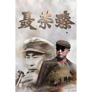

聂荣臻 电视原声大碟
============================

|  |  |
| :--: | :-- |
| [ 聂荣臻 电视原声大碟](https://emumo.xiami.com/album/229513286) | **艺人**: [阿鲲](../index.md) **语种**: 国语 **唱片公司**: 阿鲲音乐 **发行时间**: 2013年12月11日 **专辑类别**: 原声带, 影视音乐 **专辑风格**: 电视原声 Television Music **播放数**: 334083 **收藏数**: 75 **评论数**: 4  |

## 简介

电视剧《聂荣臻》根据聂荣臻元帅女儿聂力的回忆录《山高水长：我的父亲聂荣臻》改编而成，由周友朝执导，林永健、齐欢、王霙等主演。2013年1月杀青，12月11日起正式播出。 

该剧讲述了1925年秋，聂荣臻结束留学生活回到祖国，在黄埔军校担任政治部秘书等职，开始其戎马生涯。中共中央成立军事部，聂荣臻竭力协助周恩来工作。1929年他与地下交通员张瑞华结婚不久后，被调到上海&amp;特科&amp;工作，紧急处置了顾顺章叛变事件。解放战争时期，聂荣臻率部 &amp;三战三捷&amp;，扭转政治局势战局。全国解放，中央提出研发原子弹的想法，聂荣臻积极成立国防部五院。经过艰辛努力，中国第一颗原子弹成功爆响，与此同时，他还主持中国第一艘核潜艇建造和第一颗卫星研制工作。文化大革命时期，聂荣臻想方设法保护知识分子和科学家，亲自主持第一颗氢弹试验，为我国人民解放和国防军事现代化做出了重大贡献。

## 曲目

## 评论

|  |  |  |  |
| :-- | :-- | :-- | :-- |
|  [虾米用户](https://emumo.xiami.com/u/430056353)  2019-09-22 17:15 赞(0) 踩(0) | 
电视拍的好，歌更好
 |
|  [虾米用户](https://emumo.xiami.com/u/275780)  2015-06-08 14:31 赞(0) 踩(0) | 
荡气回肠！ 铜管乐是阿鲲的拿手！
 |
|  [虾米用户](https://emumo.xiami.com/u/10811234) Love Mucic 2015-04-20 20:38 赞(0) 踩(0) | 
赞
 |
|  [虾米用户](https://emumo.xiami.com/u/7322777) ∮ 2015-04-20 17:28 赞(0) 踩(0) | 
收
 |
