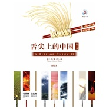

舌尖上的中国 第二季原声钢琴曲
============================

|  |  |
| :--: | :-- |
| [ 舌尖上的中国 第二季原声钢琴曲](https://emumo.xiami.com/album/229585259) | **艺人**: [阿鲲](../index.md) **语种**: 其他 **唱片公司**: 阿鲲音乐 **发行时间**: 2014年07月01日 **专辑类别**: 原声带, 影视音乐 **专辑风格**: 原声 Soundtrack, 纪录片配乐 Documentary **播放数**: 153859 **收藏数**: 691 **评论数**: 19  |

## 简介

《舌尖上的中国2原声钢琴曲》是一本钢琴乐谱，同《舌尖上的中国》2记录片一样，分为7个章节16首乐曲，难度适中，演奏起来也非常顺手。您不仅能弹奏《初》《唇齿之间》《水与火的艺术》这些从第一季开始就伴随着我们的乐曲，也可以看到来自央视的精美图片，一些在记录片中不曾看到的幕后花絮在书中也有体现。除此之外，书中所附的CD演绎的非常精彩、细腻，在行车路上、在家中都可以细细聆听。

## 曲目

## 评论

|  |  |  |
| :-- | :-- | :-- |
|  [虾米用户](https://emumo.xiami.com/u/44798023)  2016-11-10 00:22 赞(0) 踩(0) | 
弹出了西游记的味道~
 |
|  [虾米用户](https://emumo.xiami.com/u/1357580)  2015-11-23 16:46 赞(0) 踩(0) | 
玛德，好想大叫一声：把谱子给我，我自己弹得了！！！
 |
|  [虾米用户](https://emumo.xiami.com/u/45292992)  2015-10-21 15:53 赞(1) 踩(0) | 
纪录片《舌尖上的中国》第二季 原声钢琴
 |
|  [虾米用户](https://emumo.xiami.com/u/54009521)  2015-10-04 21:50 赞(0) 踩(0) | 
明显是做的，都出纯钢琴版了，干嘛不找个人弹
 |
|  [虾米用户](https://emumo.xiami.com/u/6361118) 黑洞無始終，音樂無疆界 2015-07-06 12:21 赞(0) 踩(0) | 
演奏得磕磕绊绊的，只能说是勉强顺了下来，根本谈不上什么技巧或情感。这真的是阿琨演奏的还是粉丝自己录制的啊？
 |
|  [虾米用户](https://emumo.xiami.com/u/1851561)  2015-06-28 10:01 赞(1) 踩(0) | 
怪怪的 哈哈
 |
|  [虾米用户](https://emumo.xiami.com/u/34054205)  2015-04-30 20:28 赞(0) 踩(0) | 
换种风格，换种心情！
 |
|  [虾米用户](https://emumo.xiami.com/u/34054205)  2015-04-30 20:27 赞(0) 踩(0) | 
舌尖
 |
|  [虾米用户](https://emumo.xiami.com/u/1201986)   2015-04-26 11:29 赞(0) 踩(0) | 
感觉是电子音效
 |
|  [虾米用户](https://emumo.xiami.com/u/8025693)  2015-04-25 11:32 赞(0) 踩(0) | 
出纯钢琴版咯
 |
|  [虾米用户](https://emumo.xiami.com/u/7354378) 享受生活 2015-04-23 06:01 赞(0) 踩(0) | 
最喜欢阿鲲舌尖上的中国的配乐，每次听都会很感动。
 |
|  [虾米用户](https://emumo.xiami.com/u/39553690) 激流逆流顺流回流，川 2015-04-21 21:26 赞(0) 踩(0) | 
不会弹钢琴好悲伤
 |
|  [虾米用户](https://emumo.xiami.com/u/3699400) 任岁月流逝，我心如初。 2015-04-21 17:03 赞(1) 踩(0) | 
舌尖上的中国2钢琴版，感觉怪怪.....
 |
|  [虾米用户](https://emumo.xiami.com/u/3119509)  2015-04-21 14:58 赞(0) 踩(0) | 
♪(^∇^*)
 |
|  [虾米用户](https://emumo.xiami.com/u/30834008) _(:з)∠)_ 2015-04-21 12:09 赞(0) 踩(0) | 
_(:_」∠)_
 |
|  [虾米用户](https://emumo.xiami.com/u/22580408) 这个人很聪明 2015-04-21 11:51 赞(0) 踩(0) | 
哈哈
 |
|  [虾米用户](https://emumo.xiami.com/u/10073813) 如人饮水。 2015-04-21 11:16 赞(0) 踩(0) | 
啾咪 0.0
 |
|  [虾米用户](https://emumo.xiami.com/u/7999095) 再见 2015-04-21 11:15 赞(0) 踩(0) | 
(｡･ω･｡)ﾉ♡马
 |
|  [虾米用户](https://emumo.xiami.com/u/355865) Let it go, l... 2015-04-21 11:14 赞(0) 踩(0) | 
哇，又发行了钢琴组曲～听听看有什么区别
 |
